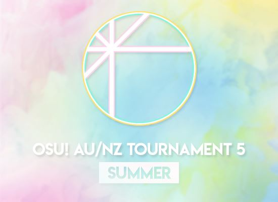

# Aus/NZ osu!standard Tournament 5 - Summer

The **Aus/NZ osu!standard Tournament 5 - Summer** (***ANZT 5S***) was a 1v1 double elimination osu! tournament hosted by ![][flag_NZ] [Diony](https://osu.ppy.sh/users/4294475), ![][flag_AU] [Melt3dCheeze](https://osu.ppy.sh/users/634837), ![][flag_AU] [EmeraldStar82](https://osu.ppy.sh/users/3772135), ![][flag_US] [noctisv_v](https://osu.ppy.sh/users/6775083) and ![][flag_AU] [Quite Cynical](https://osu.ppy.sh/users/3361154). It was the fifth instalment of the Aus/NZ tourneys.

## Tournament schedule

| Event | Timestamp |
| --: | :-- |
| Registration phase | 2017-12-22/2018-01-21 |
| Qualifiers | 2018-01-26/2018-01-28 |
| Round of 64 | 2018-02-02/2018-02-04 |
| Round of 32, Losers Bracket Rounds 1 & 2 | 2018-02-09/2018-02-11 |
| Round of 16, Losers Bracket Rounds 3 & 4 | 2018-02-16/2018-02-18 |
| Quarterfinals, Losers Bracket Rounds 5 & 6 | 2018-02-23/2018-02-25 |
| Semifinals, Losers Bracket Rounds 7 & 8 | 2018-03-02/2018-03-04 |
| Finals week 1 | 2018-03-09/2018-03-11 |
| Finals week 2 | 2018-03-17 |

## Prizes

| Placing | Prize(s) |
| :-: | :-- |
|  | 4 months of osu!supporter, unique profile badge |
|  | 2 months of osu!supporter |
|  | 1 month of osu!supporter |

## Organisation

| Position | Member(s) |
| :-- | :-- |
| Manager | ![][flag_NZ] [Diony](https://osu.ppy.sh/users/4294475), ![][flag_AU] [Melt3dCheeze](https://osu.ppy.sh/users/634837), ![][flag_AU] [EmeraldStar82](https://osu.ppy.sh/users/3772135), ![][flag_US] [noctisv_v](https://osu.ppy.sh/users/6775083), ![][flag_AU] [Quite Cynical](https://osu.ppy.sh/users/3361154) |
| Scheduler | ![][flag_AU] [EmeraldStar82](https://osu.ppy.sh/users/3772135) |
| Commentator | ![][flag_AU] [Kano](https://osu.ppy.sh/users/3036203), ![][flag_AU] [BranOtaku](https://osu.ppy.sh/users/6861227), ![][flag_AU] [Noobsicle](https://osu.ppy.sh/users/3432672), ![][flag_NZ] [shortpotato](https://osu.ppy.sh/users/1266102), ![][flag_AU] [Rairiku](https://osu.ppy.sh/users/4945688), ![][flag_AU] [Blobby3000](https://osu.ppy.sh/users/6916774) |
| Streamer | ![][flag_AU] [BranOtaku](https://osu.ppy.sh/users/6861227), ![][flag_US] [noctisv_v](https://osu.ppy.sh/users/6775083), ![][flag_AU] [EmeraldStar82](https://osu.ppy.sh/users/3772135), ![][flag_AU] [Melt3dCheeze](https://osu.ppy.sh/users/634837), ![][flag_US] [CornLord7117](https://osu.ppy.sh/users/6699829), ![][flag_AU] [Blobby3000](https://osu.ppy.sh/users/6916774) |
| Referee | ![][flag_US] [noctisv_v](https://osu.ppy.sh/users/6775083), ![][flag_NZ] [Diony](https://osu.ppy.sh/users/4294475), ![][flag_AU] [RoseAntebellum](https://osu.ppy.sh/users/3944288), ![][flag_AU] [Illinon](https://osu.ppy.sh/users/8306102), ![][flag_AU] [Vex](https://osu.ppy.sh/users/1151852), ![][flag_AU] [Poi Yasu](https://osu.ppy.sh/users/6733334), ![][flag_AU] [Quite Cynical](https://osu.ppy.sh/users/3361154), ![][flag_AU] [EmeraldStar82](https://osu.ppy.sh/users/3772135), ![][flag_AU] [Melt3dCheeze](https://osu.ppy.sh/users/634837), ![][flag_NZ] [-Akito](https://osu.ppy.sh/users/5716327), ![][flag_AU] [BranOtaku](https://osu.ppy.sh/users/6861227), ![][flag_US] [trey-](https://osu.ppy.sh/users/8784747) |
| Mappool selector | ![][flag_AU] [Dumii](https://osu.ppy.sh/users/3068044), ![][flag_US] [Axarious](https://osu.ppy.sh/users/2614511), ![][flag_US] [noctisv_v](https://osu.ppy.sh/users/6775083), ![][flag_AU] [Quite Cynical](https://osu.ppy.sh/users/3361154) |
| Designer | ![][flag_NZ] [-Akito](https://osu.ppy.sh/users/5716327) |

## Links

- [Discussion thread](https://osu.ppy.sh/community/forums/topics/679243)
- [Livestream](https://www.twitch.tv/osuanzt)
- [Challonge page](https://anzttournaments.challonge.com/o1fs6s1q)

## Podium

This competition has come to an end and resulted in the following podium:

| Placing | Player |
| :-: | :-- |
|  | ![][flag_AU] [Lunirs](https://osu.ppy.sh/users/2118945) |
|  | ![][flag_AU] [Blobby3000](https://osu.ppy.sh/users/6916774) |
|  | ![][flag_AU] [TheOmyNomy](https://osu.ppy.sh/users/4241054) |

## Mappools

### Finals week 2

**[Download the map pack here! (129 MB)](http://www.mediafire.com/file/3whiaig0dvuxzhr/ANZT5S+Grand+Finals+Mappack+.zip)**

- NoMod
  - [mafumafu - Revenge Syndrome (Rizia) \[Reunion\]](https://osu.ppy.sh/beatmapsets/543109)
  - [Hanatan - Kogitsune no Ran (Awaken) \[Helheimsk\]](https://osu.ppy.sh/beatmapsets/174480)
  - [Memme - Cherry Blossom (xLolicore-) \[Flower Dance\]](https://osu.ppy.sh/beatmapsets/719447)
  - [Rohi - Kanata ni Mau ha Sakura no Senritsu (AmamiyaYuko) \[Regou's Extra\]](https://osu.ppy.sh/beatmapsets/707164)
  - [Jun.A - The Fairy's Adventurous Tale (KanbeKotori) \[Extra\]](https://osu.ppy.sh/beatmapsets/107475)
  - [Awake - Supernova (wa_) \[Princess From The Moon\]](https://osu.ppy.sh/beatmapsets/1405979)
- Hidden
  - [Hige Driver - Palette (Jounzan) \[Moonlight\]](https://osu.ppy.sh/beatmapsets/712171)
  - [Rita - Dream Walker (Amamiya Yuko) \[Dailycare's INFINITE\]](https://osu.ppy.sh/beatmapsets/424088)
- HardRock
  - [Yanni - With an Orchid (ts8zs) \[AR233\]](https://osu.ppy.sh/beatmapsets/79056)
  - [FELT - crescent moon (Meg) \[Insane\]](https://osu.ppy.sh/beatmapsets/260141)
- DoubleTime
  - [Choucho - When the First Love Ends (MeLLoN) \[Lunatic\]](https://osu.ppy.sh/beatmapsets/28060)
  - [School Food Punishment - flashback trip syndrome (Damnae) \[Beren & Blove's Insane\]](https://osu.ppy.sh/beatmapsets/46813)
- FreeMod
  - [REDALiCE - FLOWER REDALiCE Remix (Jenny) \[black another\]](https://osu.ppy.sh/beatmapsets/677687)
  - [Himeringo - Idola no Circus (cRyo[iceeicee]) \[Avxo\]](https://osu.ppy.sh/beatmapsets/362554)
  - [Hatsune Miku - Sakura Zensen Ijou Nashi (Lalarun) \[BakaNA\]](https://osu.ppy.sh/beatmapsets/59049)
- Tiebreaker
  - **[Halozy - Kanshou no Matenrou (Lasse) \[Shadow Dance\]](https://osu.ppy.sh/beatmapsets/690105)**

### Finals week 1

**[Download the map pack here! (121 MB)](http://www.mediafire.com/file/sm4embsj8le04bq/ANZT5S%20Finals%20Week%201%20Mappack.zip)**

- NoMod
  - [nmk - sola (Morinaga) \[Last Word\]](https://osu.ppy.sh/beatmapsets/723024)
  - [Nekomata Gekidan - AsiaN distractive (Regou) \[Orientalism\]](https://osu.ppy.sh/beatmapsets/657122)
  - [Byakko - Kachou Fuusetsu (EvilElvis) \[MasterPeesya\]](https://osu.ppy.sh/beatmapsets/190603)
  - [jioyi - Platinum (Plaudible) \[Winber1's Extra\]](https://osu.ppy.sh/beatmapsets/553237)
  - [xi - Vanitas (RLC) \[Memorium\]](https://osu.ppy.sh/beatmapsets/89682)
  - [Mitsuki Nakae - Ouka Enbu (Lasse) \[Petal\]](https://osu.ppy.sh/beatmapsets/688552)
- Hidden
  - [Sound Horizon - StarDust (Shirasaka Koume) \[Stardust\]](https://osu.ppy.sh/beatmapsets/701386)
  - [Lon - Yuru Fuwa Jukai Girl (Jounzan) \[soda\]](https://osu.ppy.sh/beatmapsets/739394)
- HardRock
  - [Project Grimoire - Caliburne \~Story of the Legendary sword\~ (ktgster) \[EXPERT\]](https://osu.ppy.sh/beatmapsets/312310)
  - [Sharlo & yealina - Kakushigoto (Sharlo) \[RLC's Extra\]](https://osu.ppy.sh/beatmapsets/208095)
- DoubleTime
  - [Shihori - Bloody Night (Frostmourne) \[Lunatic\]](https://osu.ppy.sh/beatmapsets/46223)
  - [SYNC.ART'S ft. Sakaue Nachi - Green Grass Garden (xierbaliti) \[Lunatic\]](https://osu.ppy.sh/beatmapsets/14978)
- FreeMod
  - [REOL - Endless Line (DeRandom Otaku) \[Infinite\]](https://osu.ppy.sh/beatmapsets/706150)
  - [la la larks - Sayonara Waltz (captin1) \[Waltz\]](https://osu.ppy.sh/beatmapsets/172506)
  - [Aimer - twoface (HalfDeckOfCards) \[Sorrowful\]](https://osu.ppy.sh/beatmapsets/605056)
- Tiebreaker
  - **[Demetori - Kuuchuu ni Shizumu Kishinjou \~ Counter-Clock World (GoldenWolf) \[Extra Stage\]](https://osu.ppy.sh/beatmapsets/353650)**

### Semifinals & Losers Bracket Rounds 7 & 8

**[Download the map pack here! (117 MB)](http://www.mediafire.com/file/7x9o4gaga0zpfkj/ANZT5S%20SF%20Mappool.zip)**

- NoMod
  - [Mitani Nana - Inochi Mijikashi Koiseyo Otome (Amamiya Yuko) \[Insane\]](https://osu.ppy.sh/beatmapsets/125511)
  - [UiNA . Occhoko Bunny - aa Kenran no Yume ga Gotoku (Epsilon Remix) (xLolicore-) \[Divinity\]](https://osu.ppy.sh/beatmapsets/562460)
  - [LeaF - Alice in Misanthrope -Ensei Alice- (Anxient) \[Hidden wonderland\]](https://osu.ppy.sh/beatmapsets/526627)
  - [a_hisa - Cheshire,s dance (Muya) \[Another\]](https://osu.ppy.sh/beatmapsets/148003)
  - [monet - Noborenai Sakamichi (Mirash) \[Hill of Sunflowers\]](https://osu.ppy.sh/beatmapsets/671607)
  - [Memme - Geurida (NeilPerry) \[Mellifluous Miracle\]](https://osu.ppy.sh/beatmapsets/688183)
- Hidden
  - [Comp - Gensou no Satellite (EvilElvis) \[Extra\]](https://osu.ppy.sh/beatmapsets/207021)
  - [Minami Yasuhiro - carnation.lnk (Mikagura Seisa) \[HoliExtra\]](https://osu.ppy.sh/beatmapsets/370823)
- HardRock
  - [sasakure.UK - Colors (wa\_) \[Insane\]](https://osu.ppy.sh/beatmapsets/317439)
  - [REDALiCE Feat. Ayumi Nomiya - Little Star (LKs) \[Another\]](https://osu.ppy.sh/beatmapsets/81051)
- DoubleTime
  - [Umeri - paranoia (captin1) \[Insane\]](https://osu.ppy.sh/beatmapsets/150914)
  - [Yellow Zebra - Melody! (wcx19911123) \[Lunatic\]](https://osu.ppy.sh/beatmapsets/45450)
- FreeMod
  - [An - Saigo (Rumia-) \[Saika's Extra\]](https://osu.ppy.sh/beatmapsets/517783)
  - [sasakure.UK - Atropos (captin1) \[Another\]](https://osu.ppy.sh/beatmapsets/577594)
  - [TOTTO - Wadatsumi (Desperate-kun) \[Snaggle's Insane\]](https://osu.ppy.sh/beatmapsets/351828)
- Tiebreaker
  - **[gmtn. vs. kozato (fw. LUZE) - squartatrice (Reol) \[Skystar's Descent\]](https://osu.ppy.sh/beatmapsets/395524)**

### Quarterfinals & Losers Bracket Rounds 5 & 6

**[Download the map pack here! (106 MB)](http://www.mediafire.com/file/0i0b10n63061b35/ANZT5S%20QF%20Mappool.zip)**

- NoMod
  - [mafumafu - Revenge Syndrome (Rizia) \[Extra\]](https://osu.ppy.sh/beatmapsets/200308)
  - [Hanatan - Kogitsune no Ran (Awaken) \[Kitsune\]](https://osu.ppy.sh/beatmapsets/278875)
  - [Memme - Cherry Blossom (xLolicore-) \[Dance\]](https://osu.ppy.sh/beatmapsets/577504)
  - [Rohi - Kanata ni Mau ha Sakura no Senritsu (AmamiyaYuko) \[Insane\]](https://osu.ppy.sh/beatmapsets/59079)
  - [Jun.A - The Fairy's Adventurous Tale (KanbeKotori) \[kiddly's Extreme\]](https://osu.ppy.sh/beatmapsets/26480)
  - [Awake - Supernova (wa\_) \[Another\]](https://osu.ppy.sh/beatmapsets/253507)
- Hidden
  - [Hige Driver - Palette (Jounzan) \[Insane\]](https://osu.ppy.sh/beatmapsets/682416)
  - [Rita - Dream Walker (Amamiya Yuko) \[Ethereal\]](https://osu.ppy.sh/beatmapsets/315299)
- HardRock
  - [Yanni - With an Orchid (ts8zs) \[Hollow Wings\]](https://osu.ppy.sh/beatmapsets/97933)
  - [FELT - crescent moon (Meg) \[Flowers always bloom in my heart\]](https://osu.ppy.sh/beatmapsets/479849)
- DoubleTime
  - [Choucho - When the First Love Ends (MeLLoN) \[Collab\]](https://osu.ppy.sh/beatmapsets/25451)
  - [School Food Punishment - flashback trip syndrome (Damnae) \[Insane\]](https://osu.ppy.sh/beatmapsets/25451)
- FreeMod
  - [REDALiCE - FLOWER REDALiCE Remix (Jenny) \[Another\]](https://osu.ppy.sh/beatmapsets/117566)
  - [Himeringo - Idola no Circus (cRyo\[iceeicee\]) \[Insane\]](https://osu.ppy.sh/beatmapsets/173011)
  - [Hatsune Miku - Sakura Zensen Ijou Nashi (Lalarun) \[Ijou0108\]](https://osu.ppy.sh/beatmapsets/32021)
- Tiebreaker
  - **[Halozy - Kanshou no Matenrou (Lasse) \[Timeless\]](https://osu.ppy.sh/beatmapsets/436799)**

### Round of 16 & Losers Bracket Rounds 3 & 4

**[Download the map pack here! (111 MB)](http://www.mediafire.com/file/wx3e2bidn691d0z/ANZT5S_RO16_Stage_Mappack.zip)**

- NoMod
  - [FujuniseikouyuuP - Make a Loser (val0108) \[0108 Style\]](https://osu.ppy.sh/beatmapsets/287694)
  - [Horie Yui - Asymmetry (Shirasaka Koume) \[Extra\]](https://osu.ppy.sh/beatmapsets/716840)
  - [Camellia - Chirality (Miura) \[Extra\]](https://osu.ppy.sh/beatmapsets/1411810)
  - [void feat. Komatsuna - Akatsuki no Tsuki (Cherry Blossom) \[Skystar's Extreme\]](https://osu.ppy.sh/beatmapsets/212387)
  - [xi - ANiMA (KeigoClear) \[Grief Melody\]](https://osu.ppy.sh/beatmapsets/907483)
- Hidden
  - [DJ Sharpnel - StrangeProgram (happy30) \[HappyMiX\]](https://osu.ppy.sh/beatmapsets/5774)
  - [PrimeMIX - FRANTIC ARCADE (Nakagawa-Kanon) \[Another\]](https://osu.ppy.sh/beatmapsets/981327)
- HardRock
  - [Tamura Yukari - Himitsu no Tobira Kara ai ni Kite (RLC) \[Insane\]](https://osu.ppy.sh/beatmapsets/153141)
  - [Rabpit - Sanctity (JJBurstOwO) \[Insane\]](https://osu.ppy.sh/beatmapsets/295549)
- DoubleTime
  - [yuikonnu - Zenryoku Batankyuu! (Sekaii) \[Insane\]](https://osu.ppy.sh/beatmapsets/438243)
  - [nyanta - SOLROS \~Vocal Edition\~ (\[CSGA\]Ar3sgice) \[Insane\]](https://osu.ppy.sh/beatmapsets/56722)
- FreeMod
  - [yuikonnu & ayaponzu\* - Happy Halloween (Loneight) \[Happy Halloween\]](https://osu.ppy.sh/beatmapsets/692433)
  - [Pendulum - Crush (Radio Edit) (Mao) \[Collab Extra\]](https://osu.ppy.sh/beatmapsets/725428)
- Tiebreaker
  - **[nomico - Lost Emotion (Amane UK Hardcore Remix) (Rizia) \[Fluctuate\]](https://osu.ppy.sh/beatmapsets/416405)**

### Round of 32 & Losers Bracket Rounds 1 & 2

**[Download the map pack here! (106 MB)](http://www.mediafire.com/file/5d8y4dpvfg29ov5/ANZT5S%20RO32%20Stage%20Mappack.zip)**

- NoMod
  - [ZUN - Shoutoku Legend ~ True Administrator (chenwu) \[Over Drive\]](https://osu.ppy.sh/beatmapsets/103226)
  - [sasakure.UK - ChRoNiClESeVeN feat. Annabel (Delis) \[Insane\]](https://osu.ppy.sh/beatmapsets/630014)
  - [Eagle - S!ck (tsuka) \[Extreme\]](https://osu.ppy.sh/beatmapsets/84014)
  - [illion - AIWAGUMA (Ellyu) \[E=mc^2\]](https://osu.ppy.sh/beatmapsets/533037)
  - [M2U - Masquerade (Melt) \[Extreme\]](https://osu.ppy.sh/beatmapsets/124857)
- Hidden
  - [DJ YOSHITAKA - Elisha (tsuka) \[Another\]](https://osu.ppy.sh/beatmapsets/22014)
  - [ETIA. - Lost Love (RLC) \[Extra\]](https://osu.ppy.sh/beatmapsets/87192)
- HardRock
  - [sakuzyo - Laplace (Hakurei Yoru) \[Kencho's Insane\]](https://osu.ppy.sh/beatmapsets/431924)
  - [CLIFF EDGE feat. Nakamura Maiko - Endless Tears (Rakuen) \[AIRakuen's Extra\]](https://osu.ppy.sh/beatmapsets/123489)
- DoubleTime
  - [FELT - Flower Flag (y u z u k i) \[happy30\]](https://osu.ppy.sh/beatmapsets/34984)
  - [Ayalis - Ai o Chikaishi Hime Kazari (handsome) \[Hard\]](https://osu.ppy.sh/beatmapsets/506155)
- FreeMod
  - [S3RL feat Harri Rush - Nostalgic (Nightcore Remix) (nold_1702) \[yf's Insane\]](https://osu.ppy.sh/beatmapsets/591442)
  - [Nekokanimaru - Ojamajo de BAN BAN! (Pop-mix) (Muya) \[Another\]](https://osu.ppy.sh/beatmapsets/29753)
- Tiebreaker
  - **[onoken - P8107 (Kloyd) \[KA071\]](https://osu.ppy.sh/beatmapsets/192137)**

### Round of 64

**[Download the map pack here! (99 MB)](http://www.mediafire.com/file/p8b5xddkpp2ihx3/ANZT5S+RO64+Stage+Mappack.zip)**

- NoMod
  - [sakuzyo - Neurotoxin (kiddly) \[Another\]](https://osu.ppy.sh/beatmapsets/192995)
  - [Sota Fujimori - WOBBLE IMPACT (Priti) \[Black Another\]](https://osu.ppy.sh/beatmapsets/166337)
  - [Giga-P - Okochama Sensou (tutuhaha) \[AngelHoney's ExtrA\]](https://osu.ppy.sh/beatmapsets/131818)
  - [Jin - Yobanashi Deceive (tutuhaha) \[Dance\]](https://osu.ppy.sh/beatmapsets/80104)
  - [void - Caelumize (Flower) \[Hyper\]](https://osu.ppy.sh/beatmapsets/387694)
- Hidden
  - [Amane - BOOZEHOUND (tieff) \[Lesjuh\]](https://osu.ppy.sh/beatmapsets/9995)
  - [capitaro - Koigahara no Kassen (Zero_wind) \[Ikusa\]](https://osu.ppy.sh/beatmapsets/466053)
- HardRock
  - [dj TAKA feat.AiMEE - True Blue (ZZHBOY) \[Insane\]](https://osu.ppy.sh/beatmapsets/424743)
  - [Sota Fujimori - Move That Body -Extended Mix- (Amamiya Yuko) \[RLC's Insane\]](https://osu.ppy.sh/beatmapsets/220220)
- DoubleTime
  - [Nishino Kana - Believe (samplefish) \[Believe\]](https://osu.ppy.sh/beatmapsets/336743)
  - [Fear, and Loathing in Las Vegas - Rave-up Tonight (lightr) \[Hard\]](https://osu.ppy.sh/beatmapsets/176832)
- FreeMod
  - [ALiCE's EMOTiON - Mami Mami Zone (Mixagji) \[0108\]](https://osu.ppy.sh/beatmapsets/43728)
  - [Nekomata Master+ - squall (wa\_) \[Extreme\]](https://osu.ppy.sh/beatmapsets/85534)
- Tiebreaker
  - **[Camellia - dreamless wanderer (Amamiya Yuko) \[Ethereal\]](https://osu.ppy.sh/beatmapsets/286414)**

### Qualifiers

**[Download the map pack here! (19 MB)](http://www.mediafire.com/file/edkxcwm8vymjcct/ANZT5S+Qualifiers+Mappack.zip)**

- NoMod
  - [DJ YOSHITAKA - MANA (EvilElvis) \[Kiiwa's Another\]](https://osu.ppy.sh/beatmapsets/136144)
- Hidden
  - [Comp - Touchuu Aika (Mao) \[Maolvis' Lunatic\]](https://osu.ppy.sh/beatmapsets/198700)
- HardRock
  - [Gentle Stick X M2U - Ineffabilis (buhei) \[-kevincela-'s Insane\]](https://osu.ppy.sh/beatmapsets/340903)
- DoubleTime
  - [ClariS - CLICK (Frostmourne) \[Insane\]](https://osu.ppy.sh/beatmapsets/145550)

## Match results

### Main bracket

Results of the main bracket can be found on the Challonge page linked above.

### Qualifiers

| Player | Total |  | Player | Total |  | Player | Total |
| :-- | :-: | :-- | :-- | :-: | :-- | :-- | :-: |
| ![][flag_AU] Noobsicle | 3,739,471 |  | ![][flag_AU] Kooleyy | 2,594,783 |  | ![][flag_AU] hieepN | 1,968,412 |
| ![][flag_AU] Lunirs | 3,457,504 |  | ![][flag_AU] Ezipie | 2,560,847 |  | ![][flag_AU] FknRhythmGames | 1,931,796 |
| ![][flag_AU] Blobby3000 | 3,401,484 |  | ![][flag_NZ] smead | 2,503,472 |  | ![][flag_AU] kobeblue | 1,898,007 |
| ![][flag_NZ] Mousiini | 3,307,314 |  | ![][flag_AU] Kano | 2,471,276 |  | ![][flag_AU] Prosal | 1,822,210 |
| ![][flag_AU] Doginator | 3,268,215 |  | ![][flag_AU] Athrun | 2,405,741 |  | ![][flag_AU] Panzer911 | 1,742,809 |
| ![][flag_AU] GranDSenpai | 3,234,433 |  | ![][flag_AU] Dumi | 2,387,565 |  | ![][flag_NZ] Feyyy | 1,716,655 |
| ![][flag_AU] Ampharos | 3,232,387 |  | ![][flag_AU] robo50211 | 2,373,184 |  | ![][flag_AU] HolyJesus | 1,698,760 |
| ![][flag_AU] overcomplexifii | 3,115,706 |  | ![][flag_NZ] Kurume | 2,345,589 |  | ![][flag_AU] PHzN | 1,680,255 |
| ![][flag_AU] TheOmyNomy | 3,095,541 |  | ![][flag_AU] ibrocky | 2,313,679 |  | ![][flag_AU] owo 6821 | 1,675,811 |
| ![][flag_AU] Rivastyx | 3,048,637 |  | ![][flag_AU] Elusive | 2,291,940 |  | ![][flag_NZ] Ayachi Meme | 1,666,351 |
| ![][flag_AU] suffix wizard | 2,998,500 |  | ![][flag_AU] Rik0 | 2,289,206 |  | ![][flag_AU] pewdekz | 1,554,213 |
| ![][flag_AU] Jordan The Bear | 2,919,404 |  | ![][flag_AU] killerfox123 | 2,267,533 |  | ![][flag_NZ] proftroutington | 1,523,916 |
| ![][flag_AU] aska | 2,878,480 |  | ![][flag_AU] Illkryn | 2,258,987 |  | ![][flag_AU] Kor3ry3-Kun | 1,512,161 |
| ![][flag_AU] Drox- | 2,783,913 |  | ![][flag_AU] Monk Gyatso | 2,231,082 |  | ![][flag_AU] yay | 1,220,883 |
| ![][flag_AU] TTG | 2,723,686 |  | ![][flag_AU] Barhunga | 2,184,927 |  | ![][flag_AU] PudIsTrash | 720,513 |
| ![][flag_AU] Onyaga | 2,716,867 |  | ![][flag_AU] Levidia | 2,148,252 |  | ![][flag_AU] Xinks | 708,732 |
| ![][flag_NZ] Kukukoke | 2,711,872 |  | ![][flag_NZ] TCN | 2,129,781 |  | ![][flag_AU] BranOtaku | 583,931 |
| ![][flag_AU] Peekamoo | 2,621,808 |  | ![][flag_AU] turretxbuddy | 2,038,525 |  | ![][flag_AU] Beat43210 | 237,618 |
| ![][flag_NZ] Morrowind | 2,616,206 |  | ![][flag_AU] kuur0 | 2,010,812 |  | ![][flag_NZ] Particlex | 0 |

## Ruleset

### General rules

- This is an 1v1 double elimination osu! tourney for Australian/New Zealand players only.
- Participants must have an Australian or New Zealand flag on their osu profile.
- **Matches will be Head to Head with Score V2 as the scoring system**.
- Any harassment or abuse of a staff member or other players will result in an expulsion from the tournament.
- If a problem occurs where rules are not clear, use common sense. Further questions can be directed to admins. Administration has final say regarding these situations.
- In order for your registration to count, **you must fill out the form, join the discord, and change your name to your osu username**.
- There is no rank limit for signup and all participants who sign up will play qualifiers. The top 64 players from qualifiers will move on to groups.
- Staff members are not allowed to sign up. The only exceptions are streamers & commentators.
- **Reschedules must be agreed on by both players and proof must be provided**.
- All matches will be scheduled for Fridays, Saturdays & Sundays.

### Match rules

- Referees will create the lobby and invite players 10 minutes before the designated match time.
- Players have up to ten minutes after their designated start time to move into the lobby. Failure to show will result in a forfeit. If both players are absent, the match will either be rescheduled or end in double forfeit to the discretion of the administration.
- Both players must `!roll`. **The highest roll gets first warmup, ban and pick**.
- Each player will be allowed one warmup map and one ban unless stated otherwise
- Warmup maps may not be longer than 4 minutes 30 seconds.
- If a player disconnects within the first 30 seconds of a map, it will be aborted and replayed. Any disconnects afterwards will be a forfeit of that map.
- Disconnects may only occur once per match per player. It will count as a forfeit after the first time.
- Players may not choose from the same mod pool twice in a row (HD/HR/DT/FreeMod). This does not apply to NoMod.
- In a FreeMod pick, **each player must select a mod** (HD/HR/HDHR) or a combination of mods to play with. **NoMod is not allowed**.
- Failed scores will only count if the player revives before the end. If a player fails and their opponent doesn’t, the point goes to the latter. If both players fail, the point goes to the higher failed score.
- If there is a tie, players will play the tiebreaker. Mods can be played (HD/HR/HDHR).

### Qualifier rules

- Players will be assigned lobbies and play through four maps once. Each will be played with their respective mod (NoMod/HD/HR/DT).
- There are **no warmups** for this stage.
- Scores will be scaled accordingly. **Failed scores will not count**.
- The top 64 players will move on to round of 64.

### Round of 64 rules

- **There will be no warmups and one ban per player**.

### Winning conditions

| Rounds | Condition |
| :-- | :-- |
| Round of 32 & Losers Bracket Rounds 1 & 2 | Win four maps (Best-of-7) |
| Round of 16 & Losers Bracket Rounds 3 & 4, Quarterfinals & Losers Bracket Rounds 5 & 6 | Win five maps (Best-of-9) |
| Semi-finals & Losers Bracket Rounds 7 & 8 | Win six maps (Best-of-11) |
| Finals - Week 1 & 2 | Win seven maps (Best-of-13) |

[flag_AU]: /wiki/shared/flag/AU.gif "Australia"
[flag_NZ]: /wiki/shared/flag/NZ.gif "New Zealand"
[flag_US]: /wiki/shared/flag/US.gif "United States"
