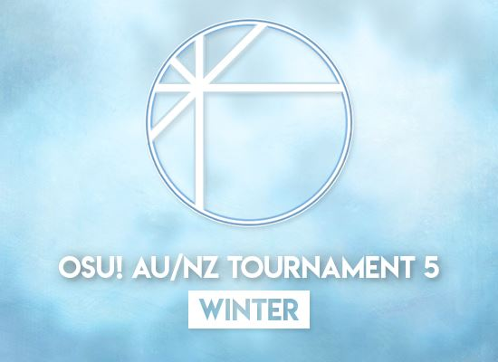

# Aus/NZ osu!standard Tournament 5 - Winter

The **Aus/NZ osu!standard Tournament 5 - Winter** (***ANZT 5W***) was a double elimination one-on-one osu!standard tournament hosted by ![][flag_NZ] [Diony](https://osu.ppy.sh/users/4294475) and ![][flag_AU] [EmeraldStar82](https://osu.ppy.sh/users/3772135). It was the 6th installment of Aus/NZ tourneys.

## Tournament Schedule

| Event | Timestamp |
| --: | :-- |
| Registration Phase | 2018-07-28/2018-08-12 |
| Round of 64 | 2018-08-17/2018-08-19 |
| Round of 32 & Losers Bracket Rounds 1 & 2 | 2018-08-24/2018-08-26 |
| Round of 16 & Losers Bracket Rounds 3 & 4 | 2018-08-31/2018-09-02 |
| Quarterfinals & Losers Bracket Rounds 5 & 6 | 2018-09-07/2018-09-09 |
| Semifinals & Losers Bracket Rounds 7 & 8 | 2018-09-14/2018-09-16 |
| Finals - Week 1 | 2018-09-21/2018-09-23 |
| Finals - Week 2 | 2018-09-28/2018-09-30 |

## Prizes

| Placing | Prize(s) |
| :-: | :-- |
|  | 4 months of osu!supporter tag, unique profile badge |
|  | 2 months of osu!supporter tag |
|  | 1 month of osu!supporter tag |

## Organisation

| Position | Member(s) |
| :-- | :-- |
| Manager | ![][flag_NZ] [Diony](https://osu.ppy.sh/users/4294475), ![][flag_AU] [EmeraldStar82](https://osu.ppy.sh/users/3772135) |
| Scheduler | ![][flag_AU] [EmeraldStar82](https://osu.ppy.sh/users/3772135) |
| Commentator | ![][flag_AU] [Kor3ry3-Kun](https://osu.ppy.sh/users/6279567), ![][flag_AU] [Dumii](https://osu.ppy.sh/users/3068044), ![][flag_AU] [Jordan The Bear](https://osu.ppy.sh/users/7477458), ![][flag_AU] [Monk Gyatso](https://osu.ppy.sh/users/4012086), ![][flag_AU] [Takagaki](https://osu.ppy.sh/users/3698691), ![][flag_AU] [Kano](https://osu.ppy.sh/users/3036203) |
| Streamer | ![][flag_AU] [Astellis](https://osu.ppy.sh/users/8369780), ![][flag_AU] [Bauxe](https://osu.ppy.sh/users/1881685), ![][flag_AU] [pewdekz](https://osu.ppy.sh/users/5754859) |
| Referee | ![][flag_AU] [loler123903](https://osu.ppy.sh/users/8034438), ![][flag_AU] [Astellis](https://osu.ppy.sh/users/8369780), ![][flag_AU] [Soulskyeflare](https://osu.ppy.sh/users/8264319), ![][flag_AU] [awesometa](https://osu.ppy.sh/users/7114425) |
| Map Selector | ![][flag_AU] [Elsa Valentine](https://osu.ppy.sh/users/4525153), ![][flag_US] [LowAccuracySS](https://osu.ppy.sh/users/7306763), ![][flag_AU] [Quite Cynical](https://osu.ppy.sh/users/3361154), ![][flag_AT] [Shiinoha Kotone](https://osu.ppy.sh/users/5712451), ![][flag_US] [noctisv_v](https://osu.ppy.sh/users/6775083), ![][flag_CA] [Legless](https://osu.ppy.sh/users/3224243) |
| Designer | ![][flag_US] [Monko2k](https://osu.ppy.sh/users/4852013) |

## Links

- [Discussion thread](https://osu.ppy.sh/community/forums/topics/784018)
- [Livestream](https://www.twitch.tv/osuanzt)
- [Results and mappool spreadsheet](https://docs.google.com/spreadsheets/d/1ylrPqTzCRTyQQG_RGBqZJZrUz_QFgSs_v26SFwhqLAs)

---

## Mappools

Find all mappools on the spreadsheet linked above.

---

## Podium

This competition has come to an end and resulted in the following podium:

| Placing | Player |
| :-: | :-- |
|  | ![][flag_AU] [Dumii](https://osu.ppy.sh/users/3068044) |
|  | ![][flag_AU] [-Machine-](https://osu.ppy.sh/users/5459981) |
|  | ![][flag_AU] [Blobby3000](https://osu.ppy.sh/users/6916774) |

All individual match results can be found on the spreadsheet linked above.

---

## Ruleset

### General Rules

- This is an 1v1 double elimination osu!standard tourney for Australian/New Zealand players only.
- Participants must have an Australian or New Zealand flag on their osu profile.
- Matches will be **Head to Head** with **Score V2** as the scoring system.
- Any harassment or abuse of a staff member or other players will result in an expulsion from the tournament.
- If a problem occurs where rules are not clear, use common sense. Further questions can be directed to admins. Administration has final say regarding these situations.
- In order for your registration to count, you must **fill out the form, join the discord, and change your name to your osu! username**.
- Staff members are not allowed to sign up. The only exceptions are streamers & commentators.
- Reschedules must be agreed on by **both players and proof must be provided**.
- All matches will be scheduled for Fridays, Saturdays & Sundays.

### Match Rules

- Referees will create the lobby and invite players 10 minutes before the designated match time.
- Players have up to ten minutes after their designated start time to move into the lobby. Failure to show will result in a forfeit. If both players are absent, the match will either be rescheduled or end in double forfeit to the discretion of the administration.
- If a player disconnects within the first 30 seconds of a map, it will be aborted and replayed. Any disconnects afterwards will be a forfeit of that map.
- Disconnects may only occur once per match per player. It will count as a forfeit after the first time.
- Highest !roll has first warmup, ban and pick.
- Each player is allowed one ban.
- Each player is allowed one warmup. Warmups must not be longer than 5 minutes, must not be in any ANZT5W mappool and must be submitted.
- One player may not pick from the same mod pool twice in a row (HD/HR/DT/FreeMod). This does not apply to NoMod.
- In a FreeMod pick, each player **must select a mod(s)** (HD/HR/HDHR). **NoMod is not allowed**.
- Failed scores will only count if the player revives before the end. If a player fails and their opponent does not, the point goes to the latter. If both players fail, the point goes to the higher failed score.
- If the match ends in a tie, players will play the tiebreaker. The tiebreaker will be played under FreeMod conditions, allowing NoMod.

### Winning Conditions

| Rounds | Condition |
| :-- | :-- |
| Round of 64 & 32, Losers Bracket Rounds 1 & 2 | Win four maps (Best-of-7) |
| Round of 16, Losers Bracket Rounds 3-6, Quarter-Finals | Win five maps (Best-of-9) |
| Semi-Finals, Losers Bracket Rounds 7-Losers Finals, Finals Week 1 | Win six maps (Best-of-11) |
| Finals Week 2 | Win seven maps (Best-of-13) |

[flag_AU]: /wiki/shared/flag/AU.gif
[flag_NZ]: /wiki/shared/flag/NZ.gif
[flag_AT]: /wiki/shared/flag/AT.gif
[flag_US]: /wiki/shared/flag/US.gif
[flag_CA]: /wiki/shared/flag/CA.gif
