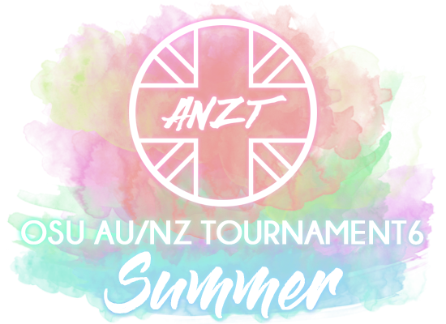

# Aus/NZ osu!standard Tournament 6 - Summer

The **Aus/NZ osu!standard Tournament 6 - Summer** (***ANZT 6S***) was a 1v1 single elimination osu! tournament with a Swiss format group stage hosted by ::{ flag=NZ }:: [Diony](https://osu.ppy.sh/users/4294475) and ::{ flag=AU }:: [EmeraldStar82](https://osu.ppy.sh/users/3772135). It was the seventh instalment of the Aus/NZ tourneys.

## Tournament schedule

| Event | Timestamp |
| --: | :-- |
| Registration phase | 2018-12-09/2018-12-30 |
| Group stage | 2019-01-11/2019-02-10 |
| Round of 16 | 2019-02-15/2019-02-17 |
| Quarterfinals | 2019-02-22/2019-02-24 |
| Semifinals | 2019-03-01/2019-03-03 |
| Grand Finals | 2019-03-08/2019-03-10 |

## Prizes

| Placing | Prize(s) |
| :-: | :-- |
|  | 4 months of osu!supporter, unique profile badge |
|  | 2 months of osu!supporter |
|  | 1 month of osu!supporter |

## Organisation

| Position | Member(s) |
| :-- | :-- |
| Manager | ::{ flag=NZ }:: [Diony](https://osu.ppy.sh/users/4294475), ::{ flag=AU }:: [EmeraldStar82](https://osu.ppy.sh/users/3772135) |
| Scheduler | ::{ flag=AU }:: [EmeraldStar82](https://osu.ppy.sh/users/3772135) |
| Commentator | ::{ flag=AU }:: [abolaspany](https://osu.ppy.sh/users/4261853), ::{ flag=AU }:: [awesometa](https://osu.ppy.sh/users/7114425), ::{ flag=NZ }:: [Monster Bait](https://osu.ppy.sh/users/6890546), ::{ flag=AU }:: [Monk Gyatso](https://osu.ppy.sh/users/4012086), ::{ flag=AU }:: [Arbusion](https://osu.ppy.sh/users/11469447), ::{ flag=AU }:: [HolyJesus](https://osu.ppy.sh/users/7785655), ::{ flag=AU }:: [Aus](https://osu.ppy.sh/users/6541404), ::{ flag=AU }:: [Takagaki](https://osu.ppy.sh/users/3698691), ::{ flag=AU }:: [pewdekz](https://osu.ppy.sh/users/5754859) |
| Streamer | ::{ flag=AU }:: [pewdekz](https://osu.ppy.sh/users/5754859), ::{ flag=VN }:: [steve\_04\_](https://osu.ppy.sh/users/10852911), ::{ flag=AU }:: [TheOmyNomy](https://osu.ppy.sh/users/4241054) |
| Referee | ::{ flag=AU }:: [Illinon](https://osu.ppy.sh/users/8306102), ::{ flag=AU }:: [Soulskyeflare](https://osu.ppy.sh/users/8264319), ::{ flag=AU }:: [awesometa](https://osu.ppy.sh/users/7114425), ::{ flag=PH }:: [ggnakacarlz](https://osu.ppy.sh/users/4075421), ::{ flag=NZ }:: [phophicles](https://osu.ppy.sh/users/9373724), ::{ flag=VN }:: [steve\_04\_](https://osu.ppy.sh/users/10852911), ::{ flag=NZ }:: [NutAndGo](https://osu.ppy.sh/users/7740118), ::{ flag=KR }:: [silverlightcs](https://osu.ppy.sh/users/9862564), ::{ flag=NZ }:: [Div](https://osu.ppy.sh/users/3751116), ::{ flag=US }:: [tigereyes144](https://osu.ppy.sh/users/6499811) |
| Mappool selector | ::{ flag=JP }:: [Delis](https://osu.ppy.sh/users/1603923), ::{ flag=JP }:: [Angel Arrow](https://osu.ppy.sh/users/1970239), ::{ flag=MV }:: [HypebeastHijabi](https://osu.ppy.sh/users/1786945) |
| Designer | ::{ flag=AU }:: [abolaspany](https://osu.ppy.sh/users/4261853) |

## Links

- [Discussion thread](https://osu.ppy.sh/community/forums/topics/839284)
- [Livestream](https://www.twitch.tv/osuanzt)
- **[Statistics sheet](https://docs.google.com/spreadsheets/d/1gnV5_7e-57MXtpoY57lgyPKyF3_IvjDXsGoLVgrnqk8)**

## Podium

This competition has come to an end and resulted in the following podium:

| Placing | Player |
| :-: | :-- |
|  | ::{ flag=AU }:: [Dumii](https://osu.ppy.sh/users/3068044) |
|  | ::{ flag=AU }:: [Jordan The Bear](https://osu.ppy.sh/users/7477458) |
|  | ::{ flag=AU }:: [nickerdead3](https://osu.ppy.sh/users/4999984) |

All individual match results can be found on the spreadsheet linked above.

## Mappools

### Grand Finals

- NoMod
  1. [Hatsuki Yura - Shoujo to Ougonryuu no Monogatari (Garden) [Salvation]](https://osu.ppy.sh/beatmapsets/719158#osu/1518701)
  2. [Shounen Radio - neu (Realazy) [end?]](https://osu.ppy.sh/beatmapsets/843008#osu/1763938)
  3. [TEARS OF TRAGEDY - Spring Memory (cRyo[iceeicee]) [Collab]](https://osu.ppy.sh/beatmapsets/890060#osu/1860550)
  4. [Kucchi vs Akki - Yakumo >>JOINT STRUGGLE (Muya) [SUKIMA]](https://osu.ppy.sh/beatmapsets/688877#osu/1460113)
  5. [Krewella x Diskord - Beggars (Consouls Remix) (NeilPerry) [Neil x Ameth's Conflux]](https://osu.ppy.sh/beatmapsets/881753#osu/1843575)
  6. [K/DA - POP/STARS (ft. Madison Beer, (G)I-DLE, Jaira Burns) (Nathan) [handsome's Master]](https://osu.ppy.sh/beatmapsets/874948#osu/1828562)
- Hidden
  1. [HyuN - White Aura (Mirash) [Expert]](https://osu.ppy.sh/beatmapsets/891333#osu/1863201)
  2. [Hitori Tori - perthed again (yambabom remix) (Asphyxia) [Zapy's Extra]](https://osu.ppy.sh/beatmapsets/268693#osu/611753)
  3. [Tatsh - Cruel Moon (Shinxyn) [Lunatic]](https://osu.ppy.sh/beatmapsets/13584#osu/50148)
- HardRock
  1. [MIOYAMAZAKI - Noise (toybot) [Twilight]](https://osu.ppy.sh/beatmapsets/664507#osu/1406420)
  2. [Wagakki Band - Senbonzakura (pkk) [Death Blossom]](https://osu.ppy.sh/beatmapsets/427508#osu/922916)
  3. [Hiroyuki Sawano feat. Mika Kobayashi - Bios (eveless) [LKs' Another]](https://osu.ppy.sh/beatmapsets/43674#osu/137766)
- DoubleTime
  1. [BACK-ON - with you feat.Me [Tales of Remix] (ztrot) [Souls of the World]](https://osu.ppy.sh/beatmapsets/25947#osu/87802)
  2. [Mutsuhiko Izumi - Green Green Dance (Long Version) (spboxer3) [Collab]](https://osu.ppy.sh/beatmapsets/34896#osu/122566)
  3. [paraoka - Manima ni (Sandpig) [('(oo)')]](https://osu.ppy.sh/beatmapsets/43107#osu/135396)
- FreeMod
  1. [THE ORAL CIGARETTES - 5150 (zhu) [212]](https://osu.ppy.sh/beatmapsets/812921#osu/1704984)
  2. [Cranky - Hanaarashi (Mirash) [Collab Extra]](https://osu.ppy.sh/beatmapsets/751771#osu/1582579)
  3. [PSYQUI - Hysteric Night Girl (feat. Such) (Nathan) [STYLEY]](https://osu.ppy.sh/beatmapsets/821981#osu/1722791)
- Tiebreaker
  1. **[Ariabl'eyeS - Zankyou wa Hitsugi no Naka e (Yusomi) [Lone-Lunatic]](https://osu.ppy.sh/beatmapsets/813773#osu/1706571)**

### Semifinals

- NoMod
  1. [753. x ABSOLUTE CASTAWAY - collage (Lasse) [Petal]](https://osu.ppy.sh/beatmapsets/866379#osu/1811389)
  2. [MOSAIC.WAV - Gokusotu Angel Ennmachan (Nattu) [Ennmachan!?]](https://osu.ppy.sh/beatmapsets/541540#osu/1148238)
  3. [An - Catanoph (Ryuusei Aika) [yf's Extra]](https://osu.ppy.sh/beatmapsets/775846#osu/1697022)
  4. [SawanoHiroyuki[nZk]:Tielle & Gemie - sh0ut (Gaia) [aL†aiR]](https://osu.ppy.sh/beatmapsets/641854#osu/1360912)
  5. [Asaka - Open your eyes (Fushimi Rio) [World: :Synchronization]](https://osu.ppy.sh/beatmapsets/880456#osu/1871739)
- Hidden
  1. [Omoi - Teo (Kroytz) [Yales' Expert]](https://osu.ppy.sh/beatmapsets/721804#osu/1524104)
  2. [KEiNA - Karen Setsugetsuka (Artethia & Epsilon Remix) (Lasse) [Skystar x fanzhen's Extra]](https://osu.ppy.sh/beatmapsets/796468#osu/1701907)
  3. [seiya-murai feat.ALT - Sumidagawa Karenka (kiddly) [Extra]](https://osu.ppy.sh/beatmapsets/28796#osu/96095)
- HardRock
  1. [toby fox - MEGALOVANIA (Kyshiro) [Burn]](https://osu.ppy.sh/beatmapsets/387700#osu/846105)
  2. [LeaF - Calamity Fortune (Flower) [Extra]](https://osu.ppy.sh/beatmapsets/96103#osu/257793)
  3. [Zektbach - Turii ~Panta rhei~ (celerih) [Muya's Another]](https://osu.ppy.sh/beatmapsets/800638#osu/1731136)
- DoubleTime
  1. [Silver Forest - Sentence (C R E A M) [Lunatic]](https://osu.ppy.sh/beatmapsets/34465#osu/114599)
  2. [Rita - Haru Hana no Iro -Reboot Ver.- (Frostmourne) [Collab]](https://osu.ppy.sh/beatmapsets/53785#osu/163812)
  3. [senya - Kanjou Chemistry (Drum 'n' Bass Remix) (Satellite) [Satellite]](https://osu.ppy.sh/beatmapsets/92509#osu/258252)
- FreeMod
  1. [RYO - Shuffle Heaven (Nemis) [eXtra]](https://osu.ppy.sh/beatmapsets/85802#osu/235470)
  2. [jippusu - Mushikui Saikede Rhythm (Skystar) [RLC]](https://osu.ppy.sh/beatmapsets/87547#osu/240689)
  3. [Shin Hae Chul - Sticks and Stones (Bikko) [Madness]](https://osu.ppy.sh/beatmapsets/18826#osu/66514)
- Tiebreaker
  1. **[gmtn. vs. kozato (fw. LUZE) & gmtn. (witch's slave) - squartatrice vs. disperagioia (Lama Poluna) [Extra]](https://osu.ppy.sh/beatmapsets/581816#osu/1231420)**

### Quarterfinals

- NoMod
  1. [IOSYS - Club Ibuki in Break All (TheMefisto) [Extra Stage]](https://osu.ppy.sh/beatmapsets/751755#osu/1582549)
  2. [Rabbit House - Final Overtake (bbu) [FINAL OVERDRIVE]](https://osu.ppy.sh/beatmapsets/770246#osu/1619453)
  3. [seleP - Scarlet Rose (pkk) [X]](https://osu.ppy.sh/beatmapsets/528089#osu/1120184)
  4. [Yunomi - Mentai Cosmic (alacat) [Extra]](https://osu.ppy.sh/beatmapsets/436773#osu/940706)
  5. [t+pazolite - Luv-Lab-Poison 22ate! (Xgor) [Xtreme]](https://osu.ppy.sh/beatmapsets/9029#osu/38426)
- Hidden
  1. [Camellia feat. Nanahira - Kansoku Eisei (jonathanlfj) [Countless]](https://osu.ppy.sh/beatmapsets/720294#osu/1520788)
  2. [Function Phantom - Algebra (Bonzi) [Incomputable]](https://osu.ppy.sh/beatmapsets/300195#osu/673275)
  3. [Memme - Extreme Fantasy (AngelHoney) [ExtrA]](https://osu.ppy.sh/beatmapsets/49459#osu/152480)
- HardRock
  1. [HoneyWorks - Akatsuki Zukuyo (Fast) [Twilight]](https://osu.ppy.sh/beatmapsets/332800#osu/736729)
  2. [EYE_XY feat. Yoneko - Knight of Firmament (Pho) [Sanctum]](https://osu.ppy.sh/beatmapsets/317749#osu/707802)
  3. [DJ TOTTO feat.3L - Youkakushi -Ayakashi Kakushi- (jonathanlfj) [Extra Stage]](https://osu.ppy.sh/beatmapsets/516454#osu/1097476)
- DoubleTime
  1. [qinche - Meltdown (eveless) [Moe]](https://osu.ppy.sh/beatmapsets/26769#osu/91157)
  2. [Maaya Sakamoto - Sanagi (Yohanes) [Delis' Insane]](https://osu.ppy.sh/beatmapsets/615921#osu/1299082)
  3. [Another Infinity feat. Mayumi Morinaga - Yumeutsutsu (Azure) [Insane]](https://osu.ppy.sh/beatmapsets/96661#osu/258977)
- FreeMod
  1. [GEM - Umiyuri Kaiteitan (Anishina Kodoku) [Delis' Extra]](https://osu.ppy.sh/beatmapsets/647452#osu/1571516)
  2. [IOSYS - Danzai Yamaxanadu (Zekira) [Eternal Damnation]](https://osu.ppy.sh/beatmapsets/13654#osu/50354)
  3. [Kero Kero Bonito - Flamingo (WTN3 Remix) (Nerova Riuz GX) [Multi Color]](https://osu.ppy.sh/beatmapsets/409214#osu/888383)
- Tiebreaker
  1. **[Shimotsuki Haruka - Re:Call (imoutosan) [Re:Collab]](https://osu.ppy.sh/beatmapsets/239359#osu/656312)**

### Round of 16

- NoMod
  1. [ChouCho - bouquet (Kibbleru) [Ex]](https://osu.ppy.sh/beatmapsets/460580#osu/986375)
  2. [Mastermind(xi+nora2r) - Dreadnought (Cherry Blossom) [Final Destination]](https://osu.ppy.sh/beatmapsets/361306#osu/793845)
  3. [VY1 - Cyber Thunder Cider (tutuhaha) [Cider]](https://osu.ppy.sh/beatmapsets/47146#osu/146610)
  4. [Hei Jing - Shinobi Renka (Realazy) [Alheak's Extra]](https://osu.ppy.sh/beatmapsets/762307#osu/1602809)
  5. [Tsubaki = Yayoi (CV: Imai Asami) - Shinsou (Seikatu) [Astral Heat]](https://osu.ppy.sh/beatmapsets/579130#osu/1229881)
- Hidden
  1. [iMarine (CV:Uchida Aya) - Dive to Blue (CSAQ) [Paradise]](https://osu.ppy.sh/beatmapsets/631305#osu/1332972)
  2. [44teru-k - Yami ~ Shoujo no Yume , Kyomu no Sekai ~ (AngelHoney) [Extra]](https://osu.ppy.sh/beatmapsets/17827#osu/152561)
  3. [Naru Hakobe (CV: M.A.O) - Neko Matsuri (Regou) [Nyan!]](https://osu.ppy.sh/beatmapsets/660752#osu/1615502)
- HardRock
  1. [Demetori - Hoshi no Utsuwa ~ Casket of Star (happy30) [Lunatic]](https://osu.ppy.sh/beatmapsets/139677#osu/348903)
  2. [Pegboard Nerds - 20k (Aero Chord Remix) (TicClick) [Insane]](https://osu.ppy.sh/beatmapsets/283707#osu/641387)
  3. [DJ YOSHITAKA - ALBIDA (Nakagawa-Kanon) [Extreme]](https://osu.ppy.sh/beatmapsets/19561#osu/77810)
- DoubleTime
  1. [Sound Holic - Love-Colored Dream (Yes_old) [Dream]](https://osu.ppy.sh/beatmapsets/11426#osu/43765)
  2. [namapann - Desire Drive (Mixagji) [Lunatic]](https://osu.ppy.sh/beatmapsets/42946#osu/136540)
  3. [BiBi - Love Novels (happy623) [Insane]](https://osu.ppy.sh/beatmapsets/111150#osu/289275)
- FreeMod
  1. [Ranko - Sei Natsu (Skystar) [Lunatic]](https://osu.ppy.sh/beatmapsets/58785#osu/188835)
  2. [I SEE MONSTAS - Holdin On (Skrillex and Nero Remix) (Sotarks) [Immortal]](https://osu.ppy.sh/beatmapsets/701330#osu/1501472)
  3. [44teru-k - F.I (Cygnus) [Gold]](https://osu.ppy.sh/beatmapsets/42225#osu/136411)
- Tiebreaker
  1. **[Release hallucination - Chronostasis (Wishkey) [Illusions]](https://osu.ppy.sh/beatmapsets/577414#osu/1222063)**

### Group stage week 5

- NoMod
  1. [THE ORAL CIGARETTES - ReI (Kagetsu) [Milan-'s Extra]](https://osu.ppy.sh/beatmapsets/754451#osu/1593252)
  2. [Ryu* vs. kors k - Force of Wind (Jenny) [Extra]](https://osu.ppy.sh/beatmapsets/44519#osu/142239)
  3. [yuikonnu - Yume no Mata Yume (Kyuukai) [Impossible Dream]](https://osu.ppy.sh/beatmapsets/812160#osu/1703567)
  4. [riya(eufonius) - Traveler's tale (Skystar) [Amamiya Nathan's Rinne]](https://osu.ppy.sh/beatmapsets/852531#osu/1781940)
- Hidden
  1. [DECO*27 - Reversible Campaign (tutuhaha) [Extra]](https://osu.ppy.sh/beatmapsets/616482#osu/1300151)
  2. [Hatsune Miku - the last effect (Holoaz) [Holoid]](https://osu.ppy.sh/beatmapsets/29355#osu/97423)
- HardRock
  1. [Feryquitous feat. Aitsuki Nakuru - Kairikou (cococolaco) [Another]](https://osu.ppy.sh/beatmapsets/832836#osu/1744644)
  2. [eyemedia - Bloody Purity (tsuka) [Expert]](https://osu.ppy.sh/beatmapsets/79989#osu/222890)
- DoubleTime
  1. [Rita - Little Busters! (Nhato Remix) (jonathanlfj) [Ecstasy]](https://osu.ppy.sh/beatmapsets/310133#osu/693117)
  2. [Mami Kawada - sense (Giralda) [LC's Insane]](https://osu.ppy.sh/beatmapsets/325638#osu/723285)
- FreeMod
  1. [Hatsune Miku - Recommended Spell (val0108) [Spell]](https://osu.ppy.sh/beatmapsets/28864#osu/96055)
  2. [Abe Nana(CV : Miyake Marie) - Marchen Debut! (Abe Nana) [MASTER+]](https://osu.ppy.sh/beatmapsets/478558#osu/1022071)
- Tiebreaker
  1. **[Camellia - Quantum Entanglement (Sing) [Ensemble]](https://osu.ppy.sh/beatmapsets/584991#osu/1238045)**

### Group stage week 4

- NoMod
  1. [senya - Renbei no Searchlight (Dailycare) [Satellite's Cartharsis]](https://osu.ppy.sh/beatmapsets/491057#osu/1046536)
  2. [Feryquitous - Dstorv -Endorfin. Remix- (Cellina) [Dailycare & toybot & Beomsan's Classic Extra]](https://osu.ppy.sh/beatmapsets/708045#osu/1506823)
  3. [sasakure.UK - Colors -sasakure.UK Futurelogic Remix- (wa\_) [Insane]](https://osu.ppy.sh/beatmapsets/317439#osu/1360583)
  4. [Susumu Hirasawa - Forces (Berserk) [KIRBY Mix]](https://osu.ppy.sh/beatmapsets/20447#osu/72419)
- Hidden
  1. [Renard - WI-FI BRIDGE (ztrot) [Insane?]](https://osu.ppy.sh/beatmapsets/39368#osu/136749)
  2. [Amamiya Sora - Eden no Tabibito (domSaur) [Journey]](https://osu.ppy.sh/beatmapsets/817411#osu/1714114)
- HardRock
  1. [Kurubukko vs yukitani - Minamichita EVOLVED (Cherry Blossom) [Another]](https://osu.ppy.sh/beatmapsets/136632#osu/341891)
  2. [Sushi Killer - Zora (Nerova Riuz GX) [It's my pleasure to meet you.]](https://osu.ppy.sh/beatmapsets/205107#osu/798711)
- DoubleTime
  1. [monet - Kami to Senritsu (Mirash) [Collab Insane]](https://osu.ppy.sh/beatmapsets/728291#osu/1537587)
  2. [Halozy - Secret Sister Complex (S i R i R u) [Flandre Scarlet]](https://osu.ppy.sh/beatmapsets/25463#osu/86269)
- FreeMod
  1. [Mr. - Hats, Gloves and Overalls (Hikato) [Doomsday's Insane]](https://osu.ppy.sh/beatmapsets/7305#osu/31838)
  2. [Liliana Sisters - Life-Ru is LOVE-Ru!! (Fycho) [cRyo's Insane]](https://osu.ppy.sh/beatmapsets/96330#osu/332754)
- Tiebreaker
  1. **[Yousei Teikoku - Kokou no Sousei (Kalibe) [Despair]](https://osu.ppy.sh/beatmapsets/744554#osu/1569836)**

### Group stage week 3

- NoMod
  1. [Fractal Dreamers - Celestial Horizon (cococolaco) [Redemption]](https://osu.ppy.sh/beatmapsets/752921#osu/1585178)
  2. [fhana - Hello!My World!! (Sotarks) [Melancholy]](https://osu.ppy.sh/beatmapsets/635110#osu/1347710)
  3. [Kano - Prima Stella (Fycho) [Freedom]](https://osu.ppy.sh/beatmapsets/445983#osu/957971)
  4. [Reid Speed & Ahee - Overtaken (feat. Heartwurkz) (Rue) [Tonight is All Mine]](https://osu.ppy.sh/beatmapsets/898881#osu/1877730)
- Hidden
  1. [Louis - Chung Hwa Ban Jeom (PandaHero) [Another]](https://osu.ppy.sh/beatmapsets/641732#osu/1360693)
  2. [Camellia feat. Nanahira - Hakuraku (Nyquill) [Dioquill's Expert]](https://osu.ppy.sh/beatmapsets/894415#osu/1869049)
- HardRock
  1. [Nakashinoda Mugi - Senjou no Aria (Okorin) [Extra Stage]](https://osu.ppy.sh/beatmapsets/395046#osu/859696)
  2. [HyuN - Infinity Heaven (Niva) [Ad Infinitum]](https://osu.ppy.sh/beatmapsets/891345#osu/1863246)
- DoubleTime
  1. [Nakahara Mai - Hatsukoi wa Zakuro iro (S i R i R u) [Japanese Collab]](https://osu.ppy.sh/beatmapsets/23933#osu/81647)
  2. [Nana Takahashi - The Party We Have Never Seen (jonathanlfj) [Party]](https://osu.ppy.sh/beatmapsets/405516#osu/881406)
- FreeMod
  1. [Komatsu Mikako - TRICK BOX (BoBo BiBi 2u Remix) (ShiraKai) [Extra]](https://osu.ppy.sh/beatmapsets/340326#osu/752853)
  2. [Three Days Grace - No More (pishifat) [Extra]](https://osu.ppy.sh/beatmapsets/392801#osu/856035)
- Tiebreaker
  1. **[wavforme x Annabel - own phrases (captin1) [Abyss]](https://osu.ppy.sh/beatmapsets/894919#osu/1870002)**

### Group stage week 2

- NoMod
  1. [OxT - UNION (toybot) [thighs]](https://osu.ppy.sh/beatmapsets/876799#osu/1832384)
  2. [USAO - BroGamer (Arrival) [Realinada's Black Another]](https://osu.ppy.sh/beatmapsets/635636#osu/1378253)
  3. [ROTTENGRAFFTY - 70cm Shihou no Madobe (Monstrata) [Super Saiyan Blue]](https://osu.ppy.sh/beatmapsets/694047#osu/1468473)
  4. [TOKINE - Soko ni Aru Mono (Patchouli) [Lunatic]](https://osu.ppy.sh/beatmapsets/70137#osu/434536)
- Hidden
  1. [O-Life Japan - Yakujinsama no Couple Dance (AngelHoney) [Insane]](https://osu.ppy.sh/beatmapsets/16990#osu/60743)
  2. [yanaginagi - Mitsuba no Musubime(Sanaas remix) (Sharlo) [iyacat's Clover]](https://osu.ppy.sh/beatmapsets/401523#osu/942418)
- HardRock
  1. TatshMusicCircle - Raikou -3rd Desire- (Kite) \[Lunatic\]
  2. [Machico - TOMORROW (Little) [Meg's Expert]](https://osu.ppy.sh/beatmapsets/550035#osu/1180619)
- DoubleTime
  1. [sasakure.UK feat. Hatsune Miku - \*Hello,Planet. (Faust) [SOLO MISSION]](https://osu.ppy.sh/beatmapsets/38950#osu/124522)
  2. [Sakaue Nachi - Light travel distance RAYTO MIX (Frostmourne) [Lunatic]](https://osu.ppy.sh/beatmapsets/42575#osu/133852)
- FreeMod
  1. [Nanamori-chu * Goraku-bu - My Pace de Ikimashou (bakabaka) [Yuri]](https://osu.ppy.sh/beatmapsets/36569#osu/118226)
  2. [REDALiCE - taboo tears you up (DJPop) [Insane]](https://osu.ppy.sh/beatmapsets/7224#osu/31334)
- Tiebreaker
  1. **[positive MAD-crew - Mynarco Addiction (Okoratu) [Ex]](https://osu.ppy.sh/beatmapsets/323329#osu/718679)**

### Group stage week 1

- NoMod
  1. [OISHII - ONIGIRI FREEWAY (Niva) [Extra]](https://osu.ppy.sh/beatmapsets/873667#osu/1826135)
  2. [Nekomata Master - Sennen no Kotowari (celerih) [GRAVITY OF THE MOON]](https://osu.ppy.sh/beatmapsets/647730#osu/1372384)
  3. [Afterglow - READY STEADY GO (game size ver.) (Ultima Fox) [FULLMETAL]](https://osu.ppy.sh/beatmapsets/792819#osu/1662871)
  4. [Suzuki Konomi - Redo (Linada) [Linada's Extra]](https://osu.ppy.sh/beatmapsets/456524#osu/978325)
- Hidden
  1. [Rohi - Kodoku Egoism (Skystar) [Skystar]](https://osu.ppy.sh/beatmapsets/58737#osu/187507)
  2. [Acme Iku - chaosmaid (demo) (lesjuh) [Lesjuh '09]](https://osu.ppy.sh/beatmapsets/38720#osu/124508)
- HardRock
  1. [Tadokoro Azusa - Junshin Always (wring) [wring's Insane]](https://osu.ppy.sh/beatmapsets/838515#osu/1799881)
  2. [ZUN - Year-Round Absorbed Curiosity (saymun) [Insane]](https://osu.ppy.sh/beatmapsets/19515#osu/68581)
- DoubleTime
  1. [ROUND TABLE featuring Nino - Yakusoku no Basho (UnitedWeSin) [Insane]](https://osu.ppy.sh/beatmapsets/109425#osu/285600)
  2. [Hanatan - My True Love (spboxer3) [Insane]](https://osu.ppy.sh/beatmapsets/34728#osu/112845)
- FreeMod
  1. [Tatsh - HEAVENLY MOON (Gabi) [Extreme]](https://osu.ppy.sh/beatmapsets/41874#osu/132043)
  2. [Hatsune Miku - Tenshinranman High Collar Hime (Natsume Rin) [Rin]](https://osu.ppy.sh/beatmapsets/55115#osu/167718)
- Tiebreaker
  1. **[orangentle / Yu\_Asahina - HAELEQUIN (Extended ver.) (RLC) [Another]](https://osu.ppy.sh/beatmapsets/272333#osu/619051)**

## Ruleset

### General rules

- This is an osu! tourney for Australian/New Zealand players only.
- Participants must have an Australian or New Zealand flag on their osu profile.
- Matches will be **Head to Head** with **Score V2** as the scoring system.
- Any harassment or abuse of a staff member or other players will result in an expulsion from the tournament.
- We maintain a blacklist for all ANZT tournaments. You will be put on this list if you:
  - Fail to show up to two of your matches without a valid excuse and/or without alerting a staff member.
  - Were blatantly rude to a staff member and/or other players.
  - Dropped out of a tournament because “you didn’t feel like playing anymore.”
- If a problem occurs where rules are not clear, use common sense. Further questions can be directed to admins. Administration has final say regarding these situations.
- Staff members are not allowed to sign up. The only exceptions are streamers & commentators.
- Reschedules must be agreed on by **both players** and **proof must be provided**.
- All matches will be scheduled for Friday, Saturday & Sunday.

### Match rules

- Referees will create the lobby and invite players 10 minutes before the designated match time.
- Players have up to ten minutes after their designated start time to move into the lobby. Failure to show will result in a forfeit. If both players are absent, the match will either be rescheduled or end in double forfeit to the discretion of the administration.
- If a player disconnects within the first 30 seconds of a map, it will be aborted and replayed. Any disconnects afterwards will be a forfeit of that map.
- Disconnects may only occur once per match per player. It will count as a forfeit after the first time.
- Highest `!roll` has first warmup, ban and pick.
- Each player is allowed one ban.
- Each player is allowed one warmup. Warmups must not be longer than 5 minutes, must not be in any ANZT6S mappool and must be submitted.
- One player may not pick from the same mod pool twice in a row (HD/HR/DT/FreeMod). This does not apply to NoMod.
- In a FreeMod pick, each player **must select a mod(s)** (HD/HR/HDHR). **NoMod is not allowed**.
- Failed scores will only count if the player revives before the end. If a player fails and their opponent doesn’t, the point goes to the latter. If both players fail, the point goes to the higher failed score.
- If the match ends in a tie, players will play the tiebreaker. The tiebreaker will be played under FreeMod conditions, allowing NoMod.

### Winning conditions

| Rounds | Condition |
| :-- | :-- |
| Group stage | Win four maps (Best-of-7) |
| Round of 16, Quarterfinals | Win five maps (Best-of-9) |
| Semifinals | Win six maps (Best-of-11) |
| Grand Finals | Win seven maps (Best-of-13) |
