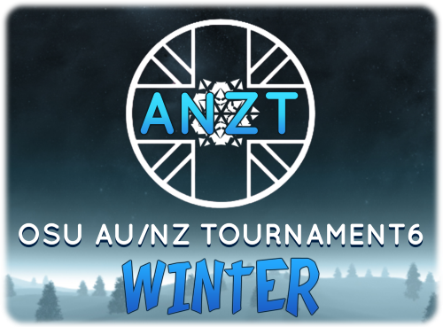

---
tags:
  - ANZT 6W
---

# Aus/NZ osu!standard Tournament 6 - Winter

The **Aus/NZ osu!standard Tournament 6 - Winter** (***ANZT 6W***) was a 1v1 double-elimination osu! tournament with a score-based qualifier stage for Australian and New Zealand players hosted by ::{ flag=NZ }:: [Diony](https://osu.ppy.sh/users/4294475) and ::{ flag=AU }:: [EmeraldStar82](https://osu.ppy.sh/users/3772135). It was the eighth instalment of the Aus/NZ tourneys.

## Tournament schedule

| Event | Timestamp |
| --: | :-- |
| Registration phase | 2019-06-27/2019-07-15 |
| Qualifiers | 2019-07-26/2019-07-28 |
| Round of 64 | 2019-08-02/2019-08-04 |
| Round of 32 | 2019-08-09/2019-08-11 |
| Round of 16 | 2019-08-16/2019-08-18 |
| Quarterfinals | 2019-08-23/2019-08-25 |
| Semifinals | 2019-08-30/2019-09-01 |
| Finals week 1 | 2019-09-06/2019-09-08 |
| Finals week 2 | 2019-09-20/2019-09-22 |

## Prizes

| Placing | Prize(s) |
| :-: | :-- |
|  | 12 months of osu!supporter, unique profile badge |
|  | 6 months of osu!supporter |
|  | 4 month of osu!supporter |

## Organisation

| Position | Member(s) |
| :-- | :-- |
| Manager | ::{ flag=NZ }:: [Diony](https://osu.ppy.sh/users/4294475), ::{ flag=AU }:: [EmeraldStar82](https://osu.ppy.sh/users/3772135) |
| Scheduler | ::{ flag=AU }:: [EmeraldStar82](https://osu.ppy.sh/users/3772135) |
| Commentator | ::{ flag=NZ }:: [[Crz]NucleoAP](https://osu.ppy.sh/users/9237208), ::{ flag=AU }:: [AmateurMonkeyYT](https://osu.ppy.sh/users/8379046), ::{ flag=AU }:: [Maxibon](https://osu.ppy.sh/users/7341183), ::{ flag=AU }:: [Dumii](https://osu.ppy.sh/users/3068044), ::{ flag=AU }:: [Monk Gyatso](https://osu.ppy.sh/users/4012086), ::{ flag=AU }:: [Arbusion](https://osu.ppy.sh/users/11469447), ::{ flag=AU }:: [Prosal](https://osu.ppy.sh/users/6654455), ::{ flag=AU }:: [Aus](https://osu.ppy.sh/users/6541404), ::{ flag=NZ }:: [shortpotato](https://osu.ppy.sh/users/1266102), ::{ flag=AU }:: [GranDSenpai](https://osu.ppy.sh/users/3997580), ::{ flag=AU }:: [Vivace](https://osu.ppy.sh/users/3698691), ::{ flag=AU }:: [xClusion](https://osu.ppy.sh/users/2263910), ::{ flag=AU }:: [Tricky](https://osu.ppy.sh/users/8359292) |
| Streamer | ::{ flag=AU }:: [Maxibon](https://osu.ppy.sh/users/7341183), ::{ flag=AU }:: [pewdekz](https://osu.ppy.sh/users/5754859), ::{ flag=AU }:: [Gala](https://osu.ppy.sh/users/3385634) |
| Referee | ::{ flag=VN }:: [steve_04_](https://osu.ppy.sh/users/10852911), ::{ flag=AU }:: [ill onion](https://osu.ppy.sh/users/8306102), ::{ flag=NZ }:: [[Crz]NucleoAP](https://osu.ppy.sh/users/9237208), ::{ flag=AU }:: [Maxibon](https://osu.ppy.sh/users/7341183), ::{ flag=NZ }:: [NutAndGo](https://osu.ppy.sh/users/7740118), ::{ flag=AU }:: [Soulskyeflare](https://osu.ppy.sh/users/8264319), ::{ flag=AU }:: [loler123903](https://osu.ppy.sh/users/8034438) |
| Mappool selector | ::{ flag=AU }:: [xLolicore](https://osu.ppy.sh/users/4525153), ::{ flag=AU }:: [Ithgyu](https://osu.ppy.sh/users/5113781), ::{ flag=DE }:: [Zetera](https://osu.ppy.sh/users/587737), ::{ flag=AU }:: [Shiroha](https://osu.ppy.sh/users/3068044) |
| Designer | ::{ flag=AU }:: [Gala](https://osu.ppy.sh/users/3385634) |

## Links

- [Discussion thread](https://osu.ppy.sh/community/forums/topics/928661)
- [Livestream](https://www.twitch.tv/osuanzt)
- **[Main sheet](https://docs.google.com/spreadsheets/d/1YsocqXWSce263P0T7mkwXsYFRvDwn30ChoLIK5fr1Xc)**

## Podium

This competition has come to an end and resulted in the following podium:

| Placing | Player |
| :-: | :-- |
|  | ::{ flag=AU }:: [Jordan The Bear](https://osu.ppy.sh/users/7477458) |
|  | ::{ flag=AU }:: [Lunirs](https://osu.ppy.sh/users/2118945) |
|  | ::{ flag=NZ }:: [shortpotato](https://osu.ppy.sh/users/1266102) |

All individual match results can be found on the spreadsheet linked above.

## Mappools

### Finals Week 2

**[Download the map pack here! (157 MB)](https://drive.usercontent.google.com/download?id=1H8lHofcUx8nvTH5TvN6MkOcqj0q4OS0N&export=download)**

- No Mod
  1. [Aqours - Aozora Jumping Heart (Sakurauchi Riko) [Sunshine!!]](https://osu.ppy.sh/beatmapsets/611367#osu/1290650)
  2. [BlackY - Double Pendulum (rrtyui) [Reflector Program v1.0 -Next Generation-]](https://osu.ppy.sh/beatmapsets/695053#osu/1472242)
  3. [Chata - enn (EvilElvis) [Starry Sky of Small Desires]](https://osu.ppy.sh/beatmapsets/406217#osu/882812)
  4. [xi - Ascension to Heaven (Night Mare) [Forecoming End]](https://osu.ppy.sh/beatmapsets/962661#osu/2015643)
  5. [jioyi - Platinum (09kami) [yf's Extra]](https://osu.ppy.sh/beatmapsets/449225#osu/988197)
  6. [Pastel\*Palettes - Happy Synthesizer (ktgster) [Special]](https://osu.ppy.sh/beatmapsets/932654#osu/1947213)
- Hidden
  1. [ak+q feat. Sennzai - Solitary Dream (-[Pino]-) [Kuuhaku]](https://osu.ppy.sh/beatmapsets/1012249#osu/2118753)
  2. [Shibayan - Shock!! (S.S.H. Arrangement) (Snow Note) [Exceed]](https://osu.ppy.sh/beatmapsets/55119#osu/3929941)
  3. [sasakure.UK - Sennen to Rasen, Chiru Mono o feat. Sui (Kalibe) [Descent]](https://osu.ppy.sh/beatmapsets/926846#osu/1935864)
- Hard Rock
  1. [Akira Kushida - Kyuukyoku No Seisen (Jounzan) [Kakarotto]](https://osu.ppy.sh/beatmapsets/764589#osu/1607713)
  2. [xi - Bad Elixir (Cherry Blossom) [Idealism]](https://osu.ppy.sh/beatmapsets/878944#osu/1838165)
  3. [Hisui - SORA-VII Cygnus Wall (KnightC0re) [Stars Gathering in the Night Skies]](https://osu.ppy.sh/beatmapsets/958121#osu/2006097)
- Double Time
  1. [Yorushika - Tomin (CoLouRed GlaZeE) [Collab Extra]](https://osu.ppy.sh/beatmapsets/1007573#osu/2108789)
  2. [yanaginagi - Yukitoki (GranDSenpai) [Insane]](https://osu.ppy.sh/beatmapsets/1003048#osu/2182200)
  3. [Kanon Wakeshima - REUNION (Delis) [Insane]](https://osu.ppy.sh/beatmapsets/929166#osu/1940657)
  4. [Lia - Kokoro ni Todoku Uta (Holoaz) [Holo]](https://osu.ppy.sh/beatmapsets/26549#osu/89428)
- Free Mod
  1. [Nanamori-chu \* Goraku-bu - Happy Time wa Owaranai (deadcode) [Expert]](https://osu.ppy.sh/beatmapsets/935707#osu/1954858)
  2. [Yumeno Yuki - BWLAUTE BEIRRD (Lasse) [Resolve.]](https://osu.ppy.sh/beatmapsets/1014034#osu/2122301)
  3. [DJ'TEKINA//SOMETHING - Internet bitch P\*Light Remix (Priti) [Ultra]](https://osu.ppy.sh/beatmapsets/296198#osu/665149)
- Tiebreaker
  1. **[Team Grimoire - C18H27NO3(extend) (Kloyd) [Volcanic]](https://osu.ppy.sh/beatmapsets/375706#osu/822765)**

### Finals Week 1

**[Download the map pack here! (135 MB)](https://drive.usercontent.google.com/download?id=1WtU_mcF2zjytKx2UOhd-hprV9nk_q_iF&export=download)**

- No Mod
  1. [Yorushika - Yuunagi, Bou, Hana Madoi (Delis) [Collab Extra]](https://osu.ppy.sh/beatmapsets/1029921#osu/2153557)
  2. [Mili - Ga1ahad and Scientific Witchery (Icekalt) [617]](https://osu.ppy.sh/beatmapsets/932901#osu/1947706)
  3. [Shimotsuki Haruka - Secret Liqueur (PinkHeart) [Last Order]](https://osu.ppy.sh/beatmapsets/552217#osu/1169586)
  4. [Camellia feat. Nanahira - Bassdrop Freaks (2018 "Redrop" ver.) (Mir) [Beisu Doroppu]](https://osu.ppy.sh/beatmapsets/806859#osu/1693575)
  5. [D(ABE3) - MANIERA (sdafsf) [sdafsf]](https://osu.ppy.sh/beatmapsets/599691#osu/1274803)
- Hidden
  1. [Sota Fujimori - ACCELERATE (Chaoslitz) [Loli's Extra (#5)]](https://osu.ppy.sh/beatmapsets/852406#osu/1782389)
  2. [Ampzer - Lotus (-PC) [Extra]](https://osu.ppy.sh/beatmapsets/745475#osu/1571592)
  3. [TOTAL OBJECTION - Higurashi Moratorium (rollpan) [ExtrA]](https://osu.ppy.sh/beatmapsets/702512#osu/1486534)
- Hard Rock
  1. [ZUTOMAYO - Kan Saete Kuyashiiwa (Nathan) [geragera]](https://osu.ppy.sh/beatmapsets/1001507#osu/2096523)
  2. [Shimotsuki Haruka, Nakae Mitsuki - mirage (Lasse) [Illusion]](https://osu.ppy.sh/beatmapsets/646714#osu/1370196)
  3. [Exilia - Lifegame (P o M u T a) [Expert]](https://osu.ppy.sh/beatmapsets/331859#osu/735004)
- Double Time
  1. [Owl City - Up All Night (FrostxE) [Insane]](https://osu.ppy.sh/beatmapsets/301802#osu/676636)
  2. [Sakaue Nachi - Think of You (orioncomet) [Lunatic]](https://osu.ppy.sh/beatmapsets/24838#osu/84358)
  3. [kozato - Izayoi Sakura (Gust) [Firika's Insane]](https://osu.ppy.sh/beatmapsets/893573#osu/1895932)
- Free Mod
  1. [Eisyo-kobu - Oriental Blossom (Crystal) [Vert's Extreme]](https://osu.ppy.sh/beatmapsets/586889#osu/1247752)
  2. [ALiCE'S EMOTiON - Ghostly Parapara Ship (Hardcore Edit) (Dada) [Vintage]](https://osu.ppy.sh/beatmapsets/838861#osu/1756228)
- Tiebreaker
  1. **[RIN - Pluto -Tenderness (My Angel Azusa) [Hades In The Heaven]](https://osu.ppy.sh/beatmapsets/573313#osu/1241443)**

### Semifinals, Losers Bracket Rounds 4 & 5

**[Download the map pack here! (165 MB)](https://drive.usercontent.google.com/download?id=1SOxbjB690sSYqowcj9jeIwXfD0QOWI7T&export=download)**

- No Mod
  1. [Ice - 02: Amber Wishes (FrenZ396) [Extreme]](https://osu.ppy.sh/beatmapsets/801704#osu/1693573)
  2. [ShinRa-Bansho - Zenryoku Happy Life (Asagi) [Overdrive]](https://osu.ppy.sh/beatmapsets/819611#osu/1718454)
  3. [Dark PHOENiX - Koiiro Master Spark (MaridiuS) [Magus]](https://osu.ppy.sh/beatmapsets/855751#osu/1787964)
  4. [Zekk - Libertas (Livia) [Future]](https://osu.ppy.sh/beatmapsets/954742#osu/1993172)
  5. [fhana - Hello!My World!! (Sotarks) [Sotarks' Melancholy]](https://osu.ppy.sh/beatmapsets/657341#osu/1413113)
- Hidden
  1. [Yorushika - Deep Indigo (Sing) [Delis & Mirash Collab Extra]](https://osu.ppy.sh/beatmapsets/949288#osu/2066755)
  2. [brave elements - Massarani (Delis) [Insane]](https://osu.ppy.sh/beatmapsets/1008196#osu/2110050)
  3. [MitiS & MaHi - Blu (Speed Up Ver.) (Ashasaki) [Nold's Posthumous]](https://osu.ppy.sh/beatmapsets/261911#osu/736300)
- Hard Rock
  1. [Rib - Jitter Doll (Shirasaka Koume) [Love.]](https://osu.ppy.sh/beatmapsets/819468#osu/1718138)
  2. sky_delta - Grenade (Nanashima Asami) \[Ex\]
  3. [HIMEHINA - Hitogata (TV Size) (Ryuusei Aika) [Loli's Extra]](https://osu.ppy.sh/beatmapsets/942714#osu/2006664)
- Double Time
  1. [Asaka - Eternal Star (Cami) [Rinne]](https://osu.ppy.sh/beatmapsets/956424#osu/2002273)
  2. [Triad Primus - Trancing Pulse (Ayalis) [Coll@b]](https://osu.ppy.sh/beatmapsets/450406#osu/966335)
  3. [Crest - Alive ~ Alone (happy30) [Insane]](https://osu.ppy.sh/beatmapsets/44892#osu/140460)
- Free Mod
  1. [Camellia feat. Nanahira - Tsukitourou (jonathanlfj) [yf's Expert]](https://osu.ppy.sh/beatmapsets/383147#osu/1272890)
  2. [Buta-Otome - Gensou no Satellite (Jounzan) [Extra]](https://osu.ppy.sh/beatmapsets/207021#osu/487900)
- Tiebreaker
  1. **[BL-Records - Midway Colors (CXu) [Urakaze]](https://osu.ppy.sh/beatmapsets/591534#osu/1251769)**

### Quarterfinals, Losers Bracket Rounds 2 & 3

**[Download the map pack here! (133 MB)](https://drive.usercontent.google.com/download?id=1VrJdypMef1MtLRcr9hXE8qi1HJ5-um0Q&export=download)**

- No Mod
  1. [Yamazaki Moe - Kataomoi no Melody o (sora_25) [Maika]](https://osu.ppy.sh/beatmapsets/919372#osu/1919608)
  2. [xi - Akasha (Atsuro) [Aether]](https://osu.ppy.sh/beatmapsets/403427#osu/877312)
  3. [Suzuki Konomi - Cyber Thunder Cider (koreapenguin) [No Chilsung No Cider]](https://osu.ppy.sh/beatmapsets/191732#osu/456291)
  4. [Kizuna AI - Hello,Morning (rrtyui) [Hello,World]](https://osu.ppy.sh/beatmapsets/903043#osu/1885215)
  5. [Smooth McGroove - Spark Mandrill Acapella (Dj CUTMAN Remix) (ReFaller) [fartownik & Okorin's Extreme]](https://osu.ppy.sh/beatmapsets/399912#osu/927819)
- Hidden
  1. [Jin - Outer Science (Ulysses) [Regou]](https://osu.ppy.sh/beatmapsets/115963#osu/299345)
  2. [Shimotsuki Haruka - Byakuya Gensoutan (Chaoslitz) [yf's Expert]](https://osu.ppy.sh/beatmapsets/667097#osu/1415403)
  3. [IOSYS - Cirno's Perfect Math Class (Louis Cyphre) [Insane]](https://osu.ppy.sh/beatmapsets/25739#osu/87171)
- Hard Rock
  1. [Okui Masami - God Speed (ykcarrot) [Insane]](https://osu.ppy.sh/beatmapsets/28140#osu/93947)
  2. [MaxNRG - Hide Away My Heart (Strategas) [Extra]](https://osu.ppy.sh/beatmapsets/502928#osu/1070249)
  3. [PolyphonicBranch - Usotsuki Betty (Chewin) [Skystar's Extra]](https://osu.ppy.sh/beatmapsets/60140#osu/522348)
- Double Time
  1. [Marie - Unbreakable (Lasse) [Insane]](https://osu.ppy.sh/beatmapsets/808148#osu/1695942)
  2. [Innocent Key - Rabucchu \* Chireiden (orioncomet) [Insane]](https://osu.ppy.sh/beatmapsets/21733#osu/75301)
  3. [Ito Kashitaro - Kyouhansha (Hailie) [Irohas' Insane]](https://osu.ppy.sh/beatmapsets/751956#osu/1730928)
- Free Mod
  1. [Katakiri Rekka - Answer (bakabaka) [Insane]](https://osu.ppy.sh/beatmapsets/39953#osu/127047)
  2. [Rin - Moriya set 08 ReEdit ~ Youkai no Yama (jonathanlfj) [Extra Stage]](https://osu.ppy.sh/beatmapsets/751866#osu/1582806)
- Tiebreaker
  1. **[gmtn. vs. kozato (fw. LUZE) & gmtn. (witch's slave) - squartatrice vs. disperagioia (Lama Poluna) [Extra]](https://osu.ppy.sh/beatmapsets/581816#osu/1231420)**

### Round of 16, Losers Bracket Round 1

**[Download the map pack here! (68 MB)](https://drive.usercontent.google.com/download?id=1G8XKpUmrTiBCv--eEId0vDaUDb4LedV1&export=download)**

- No Mod
  1. [Agent Fresco - Dark Water (Godot) [Destrier]](https://osu.ppy.sh/beatmapsets/761140#osu/1618950)
  2. [Streetlight Manifesto - Punk Rock Girl (Milan-) [Extra]](https://osu.ppy.sh/beatmapsets/577394#osu/1222034)
  3. [LIQU@. - Yotogibanashi no Kamikakushi (Kyubey) [oko's Extra]](https://osu.ppy.sh/beatmapsets/236396#osu/717133)
  4. [cosMo@BousouP - Oceanus (Broccoly) [Divinity]](https://osu.ppy.sh/beatmapsets/267767#osu/609843)
  5. [Reol - Asymmetry (Skystar) [Asphewin's Expert]](https://osu.ppy.sh/beatmapsets/310499#osu/698249)
- Hidden
  1. [Shandy Kubota - Drizzle (fang Remix) (Famous) [REMASTERED]](https://osu.ppy.sh/beatmapsets/186690#osu/1756911)
  2. [Megpoid GUMI - For my soul (val0108) [Insane]](https://osu.ppy.sh/beatmapsets/22509#osu/80102)
- Hard Rock
  1. [HitoshizukuP x Yama - Crazy nighT (Sephibro) [Crazy]](https://osu.ppy.sh/beatmapsets/109401#osu/285549)
  2. [Happy Clover - PUNCH\*MIND\*HAPPINESS (DreaM117er) [Happiness]](https://osu.ppy.sh/beatmapsets/471858#osu/1008444)
- Double Time
  1. [REOL - ChiruChiru (Pho) [Scatter]](https://osu.ppy.sh/beatmapsets/476697#osu/1018250)
  2. [S3RL feat Krystal - R4V3 B0Y (DeRandom Otaku) [1N54N3]](https://osu.ppy.sh/beatmapsets/481451#osu/1032374)
- Free Mod
  1. [kanon\*kanon - Calendula Requiem -Shiki TV size- (smallboat) [wkyik's Extra]](https://osu.ppy.sh/beatmapsets/157988#osu/387361)
  2. [TERRA - EDEN (Kite) [handsome's Master]](https://osu.ppy.sh/beatmapsets/500341#osu/1520670)
- Tiebreaker
  1. **[t+pazolite - Kick-ass Kung-fu Carnival (Fort) [Xiao Mei 2015]](https://osu.ppy.sh/beatmapsets/186677#osu/737408)**

### Round of 32

**[Download the map pack here! (84 MB)](https://drive.usercontent.google.com/download?id=1XqYjy1Qrf_hmiA3Qb58AN1JjhEOWKIRm&export=download)**

- No Mod
  1. [Hanatan - Airman ga Taosenai (SOUND HOLIC Ver.) (Natsu) [Skystar's Extra]](https://osu.ppy.sh/beatmapsets/134151#osu/392220)
  2. [Cilvery - Kamisama Nejimaki (sukiNathan) [pk's Extra]](https://osu.ppy.sh/beatmapsets/374900#osu/827835)
  3. [Memme - BSPower Explosion (AngelHoney) [Extra]](https://osu.ppy.sh/beatmapsets/44967#osu/140665)
  4. [Jimmy Weckl - Get Happy (buhei) [MASTER]](https://osu.ppy.sh/beatmapsets/359580#osu/953945)
  5. [Yorushika - Hachigatsu, Bou, Tsukiakari (Delis) [Extra]](https://osu.ppy.sh/beatmapsets/963814#osu/2017881)
- Hidden
  1. An - AxiVid (Nakagawa-Kanon) \[Another\]
  2. [kaztora, eba, Misaki Nakajima - Messiah (Shinxyn) [Insane]](https://osu.ppy.sh/beatmapsets/21877#osu/75689)
- Hard Rock
  1. [Itou Kanako - Skyclad no Kansokusha -Remix- (Takos) [taka]](https://osu.ppy.sh/beatmapsets/33323#osu/110628)
  2. [TOTAL OBJECTION - Higurashi Moratorium (NatsumeRin) [Rin]](https://osu.ppy.sh/beatmapsets/83310#osu/230127)
- Double Time
  1. [petit milady - Koi wa Milk Tea (Okoratu) [Amai]](https://osu.ppy.sh/beatmapsets/364652#osu/800385)
  2. [Reol - MONSTER (handsome) [SHARKIE'S INSANE]](https://osu.ppy.sh/beatmapsets/366440#osu/812721)
- Free Mod
  1. [a\*ru - Kizuato (Halfslashed) [Extra Stage]](https://osu.ppy.sh/beatmapsets/569843#osu/1207948)
  2. [Nekomata Master+ - squall (Reisen Udongein) [Muya's Another]](https://osu.ppy.sh/beatmapsets/127772#osu/335800)
- Tiebreaker
  1. **[Celldweller - I Can't Wait (Zero__wind) [Impatient]](https://osu.ppy.sh/beatmapsets/170148#osu/412057)**

### Round of 64

**[Download the map pack here! (108 MB)](https://drive.usercontent.google.com/download?id=1tqv3pIUs-yVKdxOHX1bUcwRxrSTz6vzB&export=download)**

- No Mod
  1. [CHiCO with HoneyWorks - Heart no Shuchou (Meg) [Smile]](https://osu.ppy.sh/beatmapsets/397246#osu/863980)
  2. [Nanahoshi Kangengakudan - Meikaruza (pkk) [Extra]](https://osu.ppy.sh/beatmapsets/302756#osu/701033)
  3. [Expander - Move That Body (fanzhen0019) [EXTREME]](https://osu.ppy.sh/beatmapsets/132586#osu/352863)
  4. [Sakuzyo - Amenohoakari (Firis Mistlud) [Fiura's Miyabi]](https://osu.ppy.sh/beatmapsets/671056#osu/1419003)
- Hidden
  1. [96Neko - +Danshi (Moway) [Extra]](https://osu.ppy.sh/beatmapsets/178965#osu/430367)
  2. [seiya-murai feat.ALT - Sumidagawa Karenka (m i z u k i) [EXTREME]](https://osu.ppy.sh/beatmapsets/32523#osu/106361)
- Hard Rock
  1. [Tristam & Braken - Frame of Mind (Fort) [Chill]](https://osu.ppy.sh/beatmapsets/177523#osu/581141)
  2. [Hiroyuki Sawano - BLOWIN' (ktgster) [Insane]](https://osu.ppy.sh/beatmapsets/560165#osu/1185385)
- Double Time
  1. [FELT - Prayer Blue (Frostmourne) [Lunatic]](https://osu.ppy.sh/beatmapsets/51145#osu/156927)
  2. [YURRY CANON - Nadeshiko color Heart (kwk) [Mathew's Hard]](https://osu.ppy.sh/beatmapsets/682996#osu/1470114)
- Free Mod
  1. [Tune Up! - Bounce (Nightcore Mix) (osuplayer111) [jericho2442's Rave!!]](https://osu.ppy.sh/beatmapsets/24315#osu/82785)
  2. [Wake Up, Girls! - Suki no Skill (Loneight) [Insane: Suki]](https://osu.ppy.sh/beatmapsets/740351#osu/1565647)
- Tiebreaker
  1. **[SHIHO - Fallin Snow (Yugu) [Falling]](https://osu.ppy.sh/beatmapsets/882476#osu/1844877)**

### Qualifiers

**[Download the map pack here! (23 MB)](https://drive.usercontent.google.com/download?id=1kSx1XgSPRQKLWlG9X2dsT0TGq4xEhnSj&export=download)**

- No Mod
  1. [Warak - REANIMATE (Amamiya Yuko) [LV. 10.1]](https://osu.ppy.sh/beatmapsets/209103#osu/495541)
- Hidden
  1. [LeaF - Calamity Fortune (Flower) [Extra]](https://osu.ppy.sh/beatmapsets/96103#osu/257793)
- Hard Rock
  1. [S3RL - Bass Slut (Original Mix) (Secretpipe) [Kyshiro's Extra]](https://osu.ppy.sh/beatmapsets/375648#osu/836907)
- Double Time
  1. [Kagamine Rin & Len - Streamline Prism (banvi) [Jumping]](https://osu.ppy.sh/beatmapsets/28894#osu/96142)

## Ruleset

### General rules

- This is an osu! game mode tournament for Australian/New Zealand players only. Participants must have an Australian or New Zealand flag on their osu! profile.
- Matches will be **Head-to-head** with **ScoreV2**.
- Any harassment or abuse of a staff member or other player will result in expulsion from the tournament.
- We maintain a blacklist for all ANZT tournaments. You will be put on this list if you:
  - Fail to show up to two of your matches without a valid excuse and/or without alerting a staff member.
  - Were blatantly rude to a staff member and/or other players.
  - Display unsportsmanlike conduct and/or anti-competitive behaviour like purposefully throwing.
  - Dropped out of a tournament because “you didn’t feel like playing anymore”.
- If a problem occurs where rules are not clear questions can be directed to staff members. The staff has final say regarding these situations.
- In order for your registration to count, you must **fill out the form, join the Discord, and change your name to your osu! username**.
- Staff members are not allowed to sign up. The only exceptions are streamers & commentators.
- Reschedules must be agreed on by **both players**, and **proof must be provided**.
- All reschedules must be done at least 24 hours before the scheduled match time.
- All matches will be scheduled for Friday, Saturday & Sunday.
- RO64 will be single elimination. All further rounds will be double elimination.

### Match rules

- Referees will create the lobby and invite players 10 minutes before the designated match time.
- Players have up to ten minutes after their designated start time to move into the lobby. Failure to show will result in a forfeit. If both players are absent, the match will either be rescheduled or end in double forfeit to the discretion of the administration.
- If a player disconnects within the first 30 seconds of a map, it will be aborted and replayed. Any disconnects afterwards will be a forfeit of that map.
- Disconnects may only occur once per match per player. It will count as a forfeit after the first time.
- Highest `!roll` has first warmup, ban and pick.
- Each player is allowed one ban.
- Each player is allowed one warmup. Warmups must not be longer than 5 minutes, must not be in any ANZT6W mappool and must be submitted.
- One player may not pick from the same mod pool twice in a row (HD/HR/DT/Free Mod). This does not apply to No Mod.
- In a Free Mod pick, each player **must select a mod(s)** (HD/HR/HDHR). **No Mod is not allowed**.
- Failed scores will only count if the player revives before the end of the map. If a player fails and their opponent does not, the point goes to the opponent. If both players fail, the point goes to the higher failed score.
- If the match ends in a tie, players will play the tiebreaker. The tiebreaker will be played under Free Mod conditions, allowing No Mod.

### Winning conditions

| Rounds | Condition |
| --: | :-- |
| Round of 64 | Win four maps (Best-of-7) |
| Round of 32 | Win five maps (Best-of-9) |
| Round of 16 | Win five maps (Best-of-9) |
| Quarterfinals | Win six maps (Best-of-11) |
| Semifinals | Win six maps (Best-of-11) |
| Finals week 1 | Win seven maps (Best-of-13) |
| Finals week 2 | Win seven maps (Best-of-13) |
