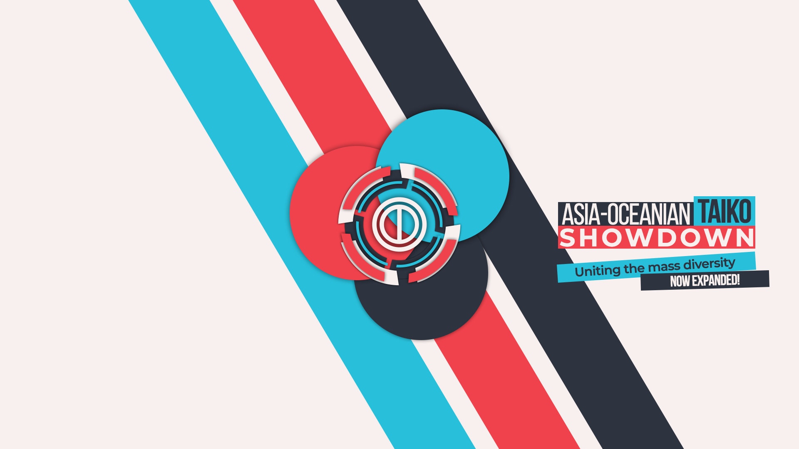

---
tags:
- Asian-Oceanian Taiko Showdown
- AOTS
---
# Asian-Oceanian Taiko Showdown

> Uniting the mass diversity, NOW EXPANDED!

The **Asian-Oceanian Taiko Showdown** (***AOTS***) is an Asian and Oceanian double-elimination one-on-one osu!taiko tournament hosted by ![][flag_ID] [fajar13k](https://osu.ppy.sh/users/7100002), ![][flag_US] [JDrago14](https://osu.ppy.sh/users/7690078) and ![][flag_FR] [Kasumii-sama](https://osu.ppy.sh/users/6177263). It is the third installment of the tournament and extension from the Asia region to Asia and Oceania.

## Tournament Schedule

| Event | Timestamp |
| --: | :-- |
| Registration Phase | 2019-06-30/2019-07-21 |
| Live Drawings | 2019-08-02 (14:00 UTC+7) |
| Group Stage | 2019-08-10/2019-08-11 |
| Round of 16 | 2019-08-17/2019-08-18 |
| Quarterfinals | 2019-08-24/2019-08-25 |
| Semifinals | 2019-08-31/2019-09-01 |
| Finals | 2019-09-08/2019-09-09 |
| Grand Finals | 2019-09-15 |

## Prizes

| Placing | Prize(s) |
| :-: | :-- |
|  | Unique profile badge, exclusive team banner |
|  | Exclusive team banner |
|  | Exclusive team banner |

## Organisation

The Asian-Oceanian Taiko Showdown is run by various community members by distributing the multitude of tasks into various fields of responsibility.

| Position | Member(s) |
| :-- | :-- |
| Management | ![][flag_ID] [fajar13k](https://osu.ppy.sh/users/7100002), ![][flag_US] [JDrago14](https://osu.ppy.sh/users/7690078), ![][flag_FR] [Kasumii-sama](https://osu.ppy.sh/users/6177263) |
| Map Selectors | ![][flag_ID] [Alwaysyukaz](https://osu.ppy.sh/users/4999506), ![][flag_PT] [BabySnakes](https://osu.ppy.sh/users/4669728), ![][flag_JP] [iceOC](https://osu.ppy.sh/users/5482401), ![][flag_US] [jyake](https://osu.ppy.sh/users/9099822) |
| Referees | ![][flag_HK] [Akali393394](https://osu.ppy.sh/users/9686628), ![][flag_AU] [Illinon](https://osu.ppy.sh/users/8306102) |
| Streamer | ![][flag_MY] [Bedwyr Aorta](https://osu.ppy.sh/users/10875855) |
| Commentators | ![][flag_AU] [Beat43210](https://osu.ppy.sh/users/5664171), ![][flag_MY] [Jerry](https://osu.ppy.sh/users/605973) |
| Designers | ![][flag_ID] [fajar13k](https://osu.ppy.sh/users/7100002), ![][flag_PH] [OsuMe65](https://osu.ppy.sh/users/852867) |
| Statistician | ![][flag_ID] [fajar13k](https://osu.ppy.sh/users/7100002) |
| Wiki | ![][flag_ID] [fajar13k](https://osu.ppy.sh/users/7100002) |

## Links

- [Discussion thread](https://osu.ppy.sh/community/forums/topics/928099)
- [AOTS Discord server](https://discord.gg/2xQDbkS)
- [Livestream](https://www.twitch.tv/osutaikoshowdown)
- [Challonge brackets](https://challonge.com/osuaots)
- [Registration form](https://forms.gle/45z8tmD3uq4xm9qn7)

---

## Mappools

*Mappools will not be available until one week before the stage that it is meant to be played.*

---

## Ruleset

### General Rules

1. The Asian-Ocean Taiko Showdown will be held under **1v1 double-elimination** bracket format with traditional seeding.
2. In order for the registration to count, participants must meet following conditions:
   - Participant must fill out the provided registration form.
   - Participant's Flag on their profile must be a country from **Asia and Oceania.**
   - Maximum Performance Points (PP) allowed for participant to register is **9,500pp.**
   - Participant's account must be **6 months old or older.**
   - Participant must pass the screening done by the osu!team officials.
3. The tournament will be held over seven weekends.
4. The matches will be played under **Score V2** and **Head to Head** settings.
5. Joining the Discord server is mandatory at least for the duration of the tournament.
6. Winning conditions will be explained below:
   - In Group Stage, you need to win 4 beatmaps to win a match. (Best-of-7)
   - In the Round of 16 and the Quarterfinals, you need to win 5 beatmaps to win a match. (Best-of-9)
   - In Semifinals, you need to win 6 beatmaps to win a match. (Best-of-11)
   - In the Finals and Grand Finals, you need to win 7 beatmaps to win a match. (Best-of-13)

### Match Instructions

1. The referee will create the room and invite the respective players in.
2. The participants will use `!roll` tournament to determine the order of picking beatmaps.
3. The participant that scores higher will pick the first beatmap to play and second to bann.
4. The participant that scores lower will start banning the map first and picking map to play second.

### Mappool Instructions

1. Each mappool consists of 6 brackets: NoMod, [Hidden](/wiki/Game_Modifiers), [HardRock](/wiki/Game_Modifiers), [DoubleTime](/wiki/Game_Modifiers), FreeMod, and Tiebreaker.
2. Mappool consists of 9 maps at start of the stage and will increase by 2 maps by each stage.
3. The NoMod bracket will be played with no mods activated.
4. The FreeMod bracket will have FreeMod activated. Every individual player can pick Hidden, HardRock, both, or NoMod.
5. The Tiebreaker will be played under FreeMod conditions.

### Scheduling Instructions

1. Each stage will be held on a **single weekend.**
2. All stages will be held between Friday to Sunday, with UTC+7 as default timezone.
3. Match Schedules will be released on the Sunday after current stage is finished.
4. Reschedules are allowed by submitting a request and proof that contains agreement from both participants to reschedule, request must be submitted via reserved text-channel on AOTS' Discord Server.

[flag_AU]: /wiki/shared/flag/AU.gif
[flag_FR]: /wiki/shared/flag/FR.gif
[flag_HK]: /wiki/shared/flag/HK.gif
[flag_ID]: /wiki/shared/flag/ID.gif
[flag_JP]: /wiki/shared/flag/JP.gif
[flag_MY]: /wiki/shared/flag/MY.gif
[flag_PH]: /wiki/shared/flag/PH.gif
[flag_PT]: /wiki/shared/flag/PT.gif
[flag_US]: /wiki/shared/flag/US.gif
