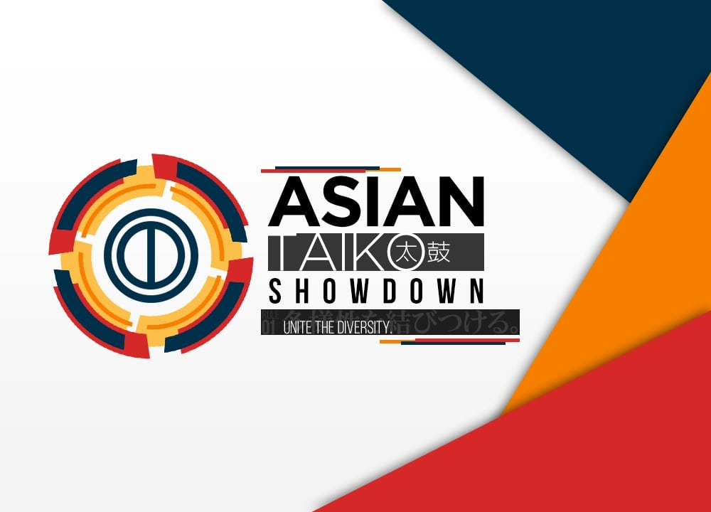
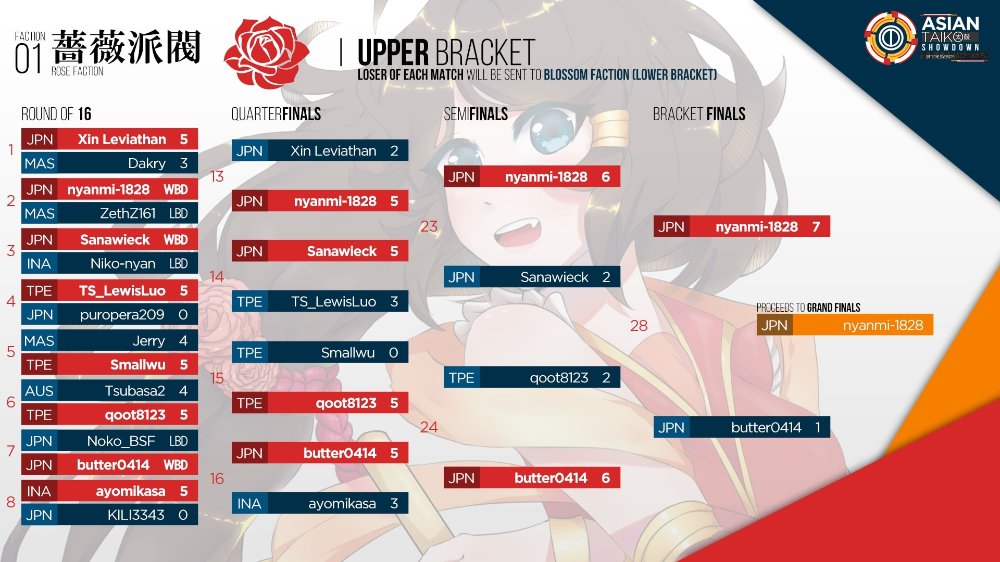
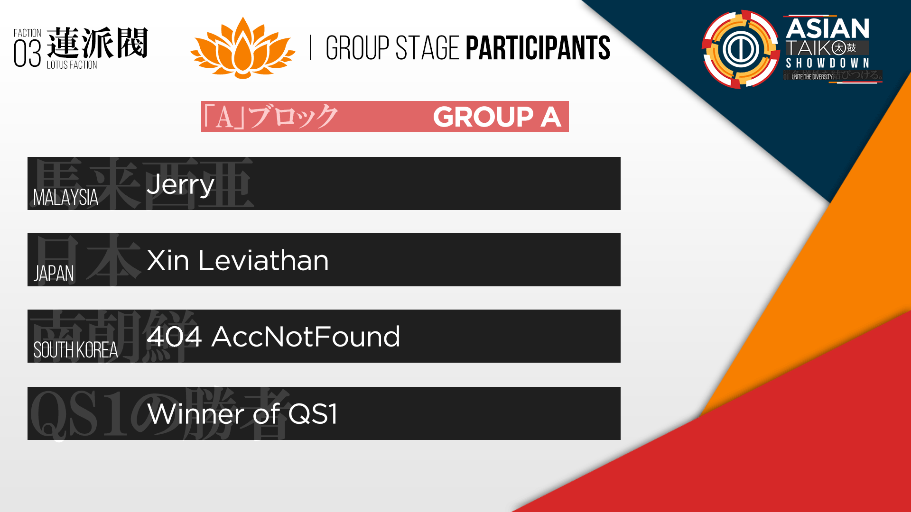

---
tags:
  - Asian Taiko Showdown 2018
  - ATS 2018
  - ATS2018
---

# Asian Taiko Showdown 2018

> Unite the Diversity between us!

**아시안 태고 쇼다운 2018** (***ATS 2018***)는 ::{ flag=ID }:: [fajar13k](https://osu.ppy.sh/users/7100002)가 개최한 더블 일리미네이션 1대일 오스 태고 경기입니다.
2번째 대회이고 지역을 인도네시아에서 아시아로 확장했습니다.

## 토너먼트 스케쥴

| 이벤트 | 날짜 |
| --: | :-- |
| 가입기간 | 2018-04-21/2018-05-26 |
| 추첨 | 2018-05-27 (19:00 UTC +7) |
| 그룹스테이지 | 2018-06-02/2018-06-03 |
| 16강 | 2018-06-09/2018-06-10 |
| 8강 | 2018-06-16/2018-06-17 |
| 4강 | 2018-06-23/2018-06-24 |
| 결승 | 2018-06-30/2018-07-01 |
| 최종 결승 | 2018-07-08 |

## 상

| 순위 | 상 |
| :-: | :-- |
|  | 유저페이지 배너 |
|  | 유저페이지 배너 |
|  | 유저페이지 배너 |

## 주최

ATS2018는 다양한 오스태고 커뮤니티 멤버에 의해 진행됩니다.

| 위치 | 멤버 |
| :-- | :-- |
| 주최자 | ::{ flag=ID }:: [fajar13k](https://osu.ppy.sh/users/7100002), ::{ flag=US }:: [JDrago14](https://osu.ppy.sh/users/7690078) |
| 맵 셀렉터 | ::{ flag=ID }:: [Lightning Wyvern](https://osu.ppy.sh/users/1533122), ::{ flag=ID }:: [Guardistack-](https://osu.ppy.sh/users/1602428), ::{ flag=MY }:: [cdhsausageboy](https://osu.ppy.sh/users/2403621) |
| 코멘터 | ::{ flag=AU }:: [Jaye](https://osu.ppy.sh/users/4841352), ::{ flag=ID }:: [Niko-nyan](https://osu.ppy.sh/users/906991), ::{ flag=CA }:: [janitoreihil](https://osu.ppy.sh/users/3307897), ::{ flag=US }:: [Das](https://osu.ppy.sh/users/3165416) |
| 스트리머 | ::{ flag=JP }:: [SakuraFrost-](https://osu.ppy.sh/users/8147993), ::{ flag=ID }:: [rap12](https://osu.ppy.sh/users/2300279) |
| 디자이너 | ::{ flag=PH }:: [OsuMe65](https://osu.ppy.sh/users/852867), ::{ flag=ID }:: [fajar13k](https://osu.ppy.sh/users/7100002), ::{ flag=CL }:: [Valelup](https://osu.ppy.sh/users/6497014) |
| 심판 | ::{ flag=HK }:: [-GN Junior](https://osu.ppy.sh/users/3901754), ::{ flag=CL }:: [Valelup](https://osu.ppy.sh/users/6497014), ::{ flag=CL }:: [Asagaki](https://osu.ppy.sh/users/2632902), ::{ flag=PH }:: [Pochacco](https://osu.ppy.sh/users/2927742), ::{ flag=ID }:: [Alwaysyukaz](https://osu.ppy.sh/users/4999506), ::{ flag=HK }:: [tkdLolly](https://osu.ppy.sh/users/9035344), ::{ flag=ID }:: [pmriva](https://osu.ppy.sh/users/2180885), ::{ flag=ID }:: [XK2238](https://osu.ppy.sh/users/1139209) |
| 번역가 | ::{ flag=JP }:: [JUDYDANNY](https://osu.ppy.sh/users/1165475), ::{ flag=JP }:: [Noko\_BSF](https://osu.ppy.sh/users/3811831), ::{ flag=JP }:: [nyanmi-1828](https://osu.ppy.sh/users/6866480) ::{ flag=TW }:: [Smallwu](https://osu.ppy.sh/users/2512120), ::{ flag=HK }:: [tkdLolly](https://osu.ppy.sh/users/9035344), ::{ flag=KR }:: [Konpaku Sariel](https://osu.ppy.sh/users/533502), ::{ flag=KR }:: [MetalStream](https://osu.ppy.sh/users/165027), ::{ flag=KR }:: [404 AccNotFound](https://osu.ppy.sh/users/980092) |
| 통계 | ::{ flag=ID }:: [fajar13k](https://osu.ppy.sh/users/7100002), ::{ flag=US }:: [JDrago14](https://osu.ppy.sh/users/7690078) |

## 링크

- [의견 스레드](https://osu.ppy.sh/community/forums/topics/726251)
- [라이브 스트림](https://www.twitch.tv/osutaikoshowdown)
- [ATS 2018 디스코드](https://discord.gg/2xQDbkS)
- **[아시아 태고 쇼다운 현황](https://docs.google.com/spreadsheets/d/e/2PACX-1vSyFrwycrK7fnJp4RaaBbuiF-EPh6jcantui4KN-z4q9PUW8U1M4ubf9sNsKwQNz3k_0wWf-BSUNctU/pubhtml?gid=0)**

## 참가자

| Seed | 멤버 |
| :-- | :-- |
| Top | ::{ flag=JP }:: [butter0414](https://osu.ppy.sh/users/7935022), ::{ flag=JP }:: [nyanmi-1828](https://osu.ppy.sh/users/6866480), ::{ flag=JP }:: [KILI3343](https://osu.ppy.sh/users/11233651), ::{ flag=MY }:: [Jerry](https://osu.ppy.sh/users/605973), ::{ flag=TW }:: [qoot8123](https://osu.ppy.sh/users/766371), ::{ flag=TW }:: [Smallwu](https://osu.ppy.sh/users/2512120), ::{ flag=TW }:: [TS\_LewisLuo](https://osu.ppy.sh/users/4337536), ::{ flag=JP }:: [toorun12](https://osu.ppy.sh/users/10349712) |
| High | ::{ flag=MY }:: [ZethZ161](https://osu.ppy.sh/users/9912966), ::{ flag=KR }:: [L y s](https://osu.ppy.sh/users/211825), ::{ flag=JP }:: [yyyyyyyyyyypetu](https://osu.ppy.sh/users/468029), ::{ flag=JP }:: [Noko\_BSF](https://osu.ppy.sh/users/3811831), ::{ flag=JP }:: [Xin Leviathan](https://osu.ppy.sh/users/9575624), ::{ flag=ID }:: [Niko-nyan](https://osu.ppy.sh/users/906991), ::{ flag=ID }:: [ayomikasa](https://osu.ppy.sh/users/4866957), ::{ flag=PH }:: [Jmeh07](https://osu.ppy.sh/users/2852269) |
| Low | ::{ flag=JP }:: [Sanawieck](https://osu.ppy.sh/users/4125666), ::{ flag=KR }:: [404 AccNotFound](https://osu.ppy.sh/users/980092), ::{ flag=ID }:: [Shirai-](https://osu.ppy.sh/users/4221845), ::{ flag=MY }:: [Dakry](https://osu.ppy.sh/users/1994145), ::{ flag=AU }:: [SpiritsUnite](https://osu.ppy.sh/users/1198002), ::{ flag=JP }:: [GlinT fraulein](https://osu.ppy.sh/users/7364981), ::{ flag=ID }:: [Braixen](https://osu.ppy.sh/users/4871378), ::{ flag=MY }:: [CrabCow](https://osu.ppy.sh/users/9755504) |
| Bottom | ::{ flag=JP }:: [Briesmas](https://osu.ppy.sh/users/2865172), ::{ flag=PH }:: [Micka](https://osu.ppy.sh/users/2770422), ::{ flag=JP }:: [puropera209](https://osu.ppy.sh/users/2545134), ::{ flag=AU }:: [Tsubasa2](https://osu.ppy.sh/users/6835183), ::{ flag=VN }:: [Taiko\_VN12](https://osu.ppy.sh/users/10072828), ::{ flag=AU }:: [Beat43210](https://osu.ppy.sh/users/5664171), ::{ flag=ID }:: [\_CaKy\_](https://osu.ppy.sh/users/9828983), ::{ flag=MY }:: [Bedwyr Aorta](https://osu.ppy.sh/users/10875855), ::{ flag=ID }:: [Jin Kun](https://osu.ppy.sh/users/6896699), ::{ flag=SG }:: [uchuuj1n](https://osu.ppy.sh/users/9140302), ::{ flag=MY }:: [Minisora](https://osu.ppy.sh/users/9627666), ::{ flag=PH }:: [-Zephy-](https://osu.ppy.sh/users/6862483) |

## 그룹

| Group | Top Seed | High Seed | Low Seed | Bottom Seed |
| :-: | :-- | :-- | :-- | :-- |
| **A** | ::{ flag=MY }:: [Jerry](https://osu.ppy.sh/users/605973) | ::{ flag=JP }:: [Xin Leviathan](https://osu.ppy.sh/users/9575624) | ::{ flag=KR }:: [404 AccNotFound](https://osu.ppy.sh/users/980092) | ::{ flag=VN }:: [Taiko\_VN12](https://osu.ppy.sh/users/10072828) |
| **B** | ::{ flag=TW }:: [Smallwu](https://osu.ppy.sh/users/2512120) | ::{ flag=JP }:: [yyyyyyyyyyypetu](https://osu.ppy.sh/users/468029) | ::{ flag=MY }:: [Dakry](https://osu.ppy.sh/users/1994145) | ::{ flag=AU }:: [Beat43210](https://osu.ppy.sh/users/5664171) |
| **C** | ::{ flag=JP }:: [nyanmi-1828](https://osu.ppy.sh/users/6866480) | ::{ flag=KR }:: [L y s](https://osu.ppy.sh/users/211825) | ::{ flag=ID }:: [Braixen](https://osu.ppy.sh/users/4871378) | ::{ flag=AU }:: [Tsubasa2](https://osu.ppy.sh/users/6835183) |
| **D** | ::{ flag=TW }:: [qoot8123](https://osu.ppy.sh/users/766371) | ::{ flag=MY }:: [ZethZ161](https://osu.ppy.sh/users/9912966) | ::{ flag=MY }:: [CrabCow](https://osu.ppy.sh/users/9755504) | ::{ flag=PH }:: [Micka](https://osu.ppy.sh/users/2770422) |
| **E** | ::{ flag=JP }:: [toorun12](https://osu.ppy.sh/users/10349712) | ::{ flag=JP }:: [Noko\_BSF](https://osu.ppy.sh/users/3811831) | ::{ flag=JP }:: [Sanawieck](https://osu.ppy.sh/users/4125666) | ::{ flag=JP }:: [Briesmas](https://osu.ppy.sh/users/2865172) |
| **F** | ::{ flag=JP }:: [butter0414](https://osu.ppy.sh/users/7935022) | ::{ flag=ID }:: [Niko-nyan](https://osu.ppy.sh/users/906991) | ::{ flag=AU }:: [SpiritsUnite](https://osu.ppy.sh/users/1198002) | ::{ flag=SG }:: [uchuuj1n](https://osu.ppy.sh/users/9140302) |
| **G** | ::{ flag=TW }:: [TS\_LewisLuo](https://osu.ppy.sh/users/4337536) | ::{ flag=ID }:: [ayomikasa](https://osu.ppy.sh/users/4866957) | ::{ flag=ID }:: [Shirai-](https://osu.ppy.sh/users/4221845) | ::{ flag=MY }:: [Bedwyr Aorta](https://osu.ppy.sh/users/10875855) |
| **H** | ::{ flag=JP }:: [KILI3343](https://osu.ppy.sh/users/11233651) | ::{ flag=PH }:: [Jmeh07](https://osu.ppy.sh/users/2852269) | ::{ flag=JP }:: [GlinT fraulein](https://osu.ppy.sh/users/7364981) | ::{ flag=JP }:: [puropera209](https://osu.ppy.sh/users/2545134) |

## 맵풀

### 최종 결승

**[여기서 당신의 맵팩을 다운받는! (65MB)](https://drive.google.com/file/d/18VwS0VHtsRC9zecGbM1ne_uszDDhkk3v/view?usp=sharing)**

- NoMod
  1. [Colorful Sounds Port - ETERNAL DRAIN (Shirai-) \[MuzukATShii\]](https://osu.ppy.sh/beatmapsets/625899#taiko/1574085)
  2. [A.I.TOYS - compressed eyes (\_Rise) \[Blindness Oni\]](https://osu.ppy.sh/beatmapsets/527086#taiko/1118318)
  3. [tarolabo - Miko (glalucard) \[Oni Miko\]](https://osu.ppy.sh/beatmapsets/41212#taiko/130323)
  4. [LeaF - ATHAZA (vzk) \[Fatal Oni\]](https://osu.ppy.sh/beatmapsets/517281#taiko/1174736)
  5. [t+pazolite - !!!Chaos Time!!! (Kobaryo's FTN Remix) (sing216) \[iiiChaos On!iii\]](https://osu.ppy.sh/beatmapsets/721195#taiko/1522932)
- Hidden
  1. [Reji - A Young Girl, So Vivid in the Night (S a n d) \[Sand's Taiko Oni\]](https://osu.ppy.sh/beatmapsets/342499#taiko/757048)
  2. [DECO*27 - Tsumi to Batsu (Cihyaa) \[Coin's Taiko\]](https://osu.ppy.sh/beatmapsets/345191#taiko/762382)
- HardRock
  1. [t+pazolite - Pee-Kan Breaks (Ulqui) \[Overlapse Oni\]](https://osu.ppy.sh/beatmapsets/529539#taiko/1122796)
  2. [NEKI<T - GaRaKuTic Dream (7_7) \[Oni\]](https://osu.ppy.sh/beatmapsets/577572#taiko/1222367)
- DoubleTime
  1. [SHK - Super Fantasy (aabc271) \[Inner Oni+\]](https://osu.ppy.sh/beatmapsets/541523#taiko/1148729)
  2. [TOMOSUKE x Jazzin'park - LANA - Kiroku no Kakera (sasakure.UK Framework Remix) - (SKSalt) \[SK's Inner Oni\]](https://osu.ppy.sh/beatmapsets/286025#taiko/871725)
- Special
  1. [Penoreri - Everlasting message (NewibornCLivee) \[xN.taiCLx\]](https://osu.ppy.sh/beatmapsets/304775#taiko/682755)
  2. [Ryu* - !Viva! (Nofool) \[Insane Oni\]](https://osu.ppy.sh/beatmapsets/799895#taiko/1679280)
- FreeMod
  1. [SOUND HOLIC Feat. Nana Takahashi - XINOBIKILL (Skull Kid) \[Shinobi Oni\]](https://osu.ppy.sh/beatmapsets/742966#taiko/1566951)
  2. [NekoMata L.E.D.Master+ - GAIA (glalucard) \[Taiko\]](https://osu.ppy.sh/beatmapsets/94086#taiko/253469)
- Tiebreaker
  1. **[RoughSketch + DD""Metal - Booths of Fighters (Camellia's "Barrage of Flurries" Remix) (Guardistack-) \[STAnic\]](https://osu.ppy.sh/beatmapsets/748030#taiko/1695846)**

### 결승

**[여기서 당신의 맵팩을 다운받는! (84MB)](https://drive.google.com/file/d/1y2tGdLhx3j8U7h7FZHDVjhvYxA7ouY-e/view?usp=sharing)**

- NoMod
  1. [Innocent Key - Toho-Assisted-Speedrun!!! (Backfire) \[Taikocalypse\]](https://osu.ppy.sh/beatmapsets/796419#taiko/1672405)
  2. [SWAN K feat. Asuka M - LOVE B.B.B (Zetera) \[Majin Oni (Tournament Edition)\]](https://osu.ppy.sh/beatmapsets/606771#taiko/1640328)
  3. [Igorrr - Tendon (DukeDukeDura) \[Amiable\]](https://osu.ppy.sh/beatmapsets/737578#taiko/1557717)
  4. [Ametsuchi Enikki - Reimei Sketchbook (Y O U T A) \[Sketch\]](https://osu.ppy.sh/beatmapsets/571204#taiko/1210546)
  5. [Seiryu x t+pazolite - 256*256 (Nishizumi) \[65536\]](https://osu.ppy.sh/beatmapsets/642870#taiko/1362862)
- Hidden
  1. [Halozy - Monosugoi Raivu de Cirno ga Sokohakatonaku Monosugoi Uta (Nofool) \[Hard Oni\]](https://osu.ppy.sh/beatmapsets/411578#taiko/893023)
  2. [Team:SASAKURATION - AVALON (Firce777) \[Firce777's Ura Oni\]](https://osu.ppy.sh/beatmapsets/118763#taiko/406755)
- HardRock
  1. [Kano - Yuudachi no Ribbon (Y O U T A) \[Ribbon\]](https://osu.ppy.sh/beatmapsets/477178#taiko/1019297)
  2. [mafumafu - Yuugure Semi Nikki (-\[ ix Ishida xi \]-) \[-\[ ix IshidaTaikonari xi \]-\]](https://osu.ppy.sh/beatmapsets/83519#taiko/230572)
- DoubleTime
  1. [AIKO OI - Limitless Possibility (tasuke912) \[Oni\]](https://osu.ppy.sh/beatmapsets/585513#taiko/1240275)
  2. [mary - DAYBREAK FRONTLINE (Jerry) \[Daybreak Oni\]](https://osu.ppy.sh/beatmapsets/609728#taiko/1289501)
- Special
  1. [DM Ashura - deltaMAX (Sayaka-) \[Oni\]](https://osu.ppy.sh/beatmapsets/437153#taiko/941375)
  2. [#FFFFFF - Couleur=Blanche (cdhsausageboy) \[Impending Chaos\]](https://osu.ppy.sh/beatmapsets/790827#taiko/1659257)
- FreeMod
  1. [PSYQUI - Hype feat. Such (KinomiCandy) \[Future Oni\]](https://osu.ppy.sh/beatmapsets/777879#taiko/1634000)
  2. [LeaF - Wizdomiot (JUDYDANNY) \[JuDa's Inner Oni\]](https://osu.ppy.sh/beatmapsets/352682#taiko/781859)
- Tiebreaker
  1. **[BlackY - Harpuia -evolutionary extended ver- (Sand, Backfire) \[Sand x Backfire\]](https://osu.ppy.sh/beatmapsets/523713#taiko/1111804)**

### 4강

**[여기서 당신의 맵팩을 다운받는! (81MB)](https://drive.google.com/file/d/17XmIGdwsdxLNYnkc7EoL0mLczF8VoUsw/view?usp=sharing)**

- NoMod
  1. [Mitsuyoshi Takenobu no Ani - Amphisbaena (HiroK) \[Inner Oni\]](https://osu.ppy.sh/beatmapsets/737973#taiko/1557391)
  2. [Sampling Masters MEGA - Kattobi KEIKYU Rider (7_7) \[Gatagoto Gatagoto Oni\]](https://osu.ppy.sh/beatmapsets/673769#taiko/1425840)
  3. [MASAKI - Scarlet Lance (m1kado) \[Inner Oni\]](https://osu.ppy.sh/beatmapsets/681440#taiko/1440822)
  4. [Camellia feat. nanahira - Kizuitara Shunkashuutou (shinchikuhome) \[Taiko Inner Oni\]](https://osu.ppy.sh/beatmapsets/532994#taiko/1129200)
  5. [Camellia - /\*decryption(instrumental)\*/ (Nifty) \[Inner Oni\]](https://osu.ppy.sh/beatmapsets/674049#taiko/1426341)
- Hidden
  1. [SON OF KICK - Hours ft. Lady Leshurr & Paigey Cakey (Nwolf) \[Nwolf's Oni\]](https://osu.ppy.sh/beatmapsets/274111#taiko/667471)
  2. [Ym1024 - orange tea (tasuke912) \[Oni\]](https://osu.ppy.sh/beatmapsets/282369#taiko/638541)
- HardRock
  1. [Renard - Smoke Tower (Grimbow) \[Grim Oni v2\]](https://osu.ppy.sh/beatmapsets/269021#taiko/1625314)
  2. [Rohi - Kanata ni Mau wa Sakura no Shirabe (Flower) \[Taiko Flower\]](https://osu.ppy.sh/beatmapsets/111635#taiko/291133)
- DoubleTime
  1. [Warak - Once Upon A Time (MMzz) \[Inner Oni\]](https://osu.ppy.sh/beatmapsets/586418#taiko/1241907)
  2. [Sara - Natsuiro Present o BPM180 ni Shitemita (snowball112) \[Inner Oni\]](https://osu.ppy.sh/beatmapsets/524050#taiko/1112372)
- Special
  1. [Warak - Cosmic Invaders (Lno) \[Oni\]](https://osu.ppy.sh/beatmapsets/765624#taiko/1609734)
  2. [Zekk - Swampgator (Jaye) \[is better than trigger\]](https://osu.ppy.sh/beatmapsets/758236#taiko/1595006)
- FreeMod
  1. [LeaF - Resurrection Spell (- Kagami Yuki -) \[Kagami's Taiko\]](https://osu.ppy.sh/beatmapsets/178857#taiko/430150)
  2. [EVO+ feat. GigaReol - [A]ddiction (KinomiCandy, MMzz, Y O U T A) \[Kinobles, MMzz & YOUTA's [C]ollaboration\]](https://osu.ppy.sh/beatmapsets/491590#taiko/1047519)
- Tiebreaker
  1. **[Morimori Atsushi vs. uma - Noel (long ver.) (Ayyri) \[Ayyri's Oni\]](https://osu.ppy.sh/beatmapsets/705224#taiko/1491659)**

### 8강

**[여기서 당신의 맵팩을 다운받는! (91 MB)](https://drive.google.com/file/d/1tlAk1b9H1VT5xbLEi08hEzEbFRAuze63/view?usp=sharing)**

- NoMod
  1. [Renard - The Club (Nishizumi) \[Inner Oni\]](https://osu.ppy.sh/beatmapsets/553809#taiko/1172641)
  2. [Renard - PIZZZZZZZZ (auopes) \[Inner Oni\]](https://osu.ppy.sh/beatmapsets/762173#taiko/1602516)
  3. [S3RL - Bass Slut (Original Mix) (naiya891) \[Slut Oniiiiiiiiiiiiii\]](https://osu.ppy.sh/beatmapsets/520157#taiko/1104911)
  4. [Tatsh - IMAGE -MATERIAL- \<REFLEC BEAT Edition\> (Nwolf) \[IMAGE -WEREONI-\]](https://osu.ppy.sh/beatmapsets/163581#taiko/398568)
  5. [YUC'e - Chemical Cookie (KinomiCandy) \[ANOTHER ONI\]](https://osu.ppy.sh/beatmapsets/747516#taiko/1575117)
- Hidden
  1. [Mystic Moon - The Zoo Zone (cdhsausageboy) \[Oni (ATS Ver.)\]](https://osu.ppy.sh/beatmapsets/795265#taiko/1670210)
  2. [Ayasa - Kou ! Tetsu ! Ketsu ! Sen ! -Ironbottom Sound- (S a n d) \[Inner Oni\]](https://osu.ppy.sh/beatmapsets/519566#taiko/1103735)
- HardRock
  1. [Project Grimoire - Caliburne \~Story of the Legendary sword\~ (-xNaCLx-) \[Saltaiko@NaCL\]](https://osu.ppy.sh/beatmapsets/326711#taiko/725333)
  2. [ginkiha + kamome sano - Dawn of Asia (TKS) \[Inner Oni\]](https://osu.ppy.sh/beatmapsets/446239#taiko/958486)
- DoubleTime
  1. [Meg & Dia - Monster (DotEXE Remix) (NewibornCLivee) \[NC's Inner Oni\]](https://osu.ppy.sh/beatmapsets/157896#taiko/386782)
  2. [cillia - Melt (mintong89) \[Oni\]](https://osu.ppy.sh/beatmapsets/552915#taiko/1171884)
- Special
  1. [REDALiCE - Volar (yoyo) \[yoyo's Special TaiKo\]](https://osu.ppy.sh/beatmapsets/50932#taiko/156304)
  2. [BVB - My Awesome Flat Chest On The Ground (Nofool) \[Special Oni\]](https://osu.ppy.sh/beatmapsets/706552#taiko/1493980)
- FreeMod
  1. [An - Abstreact (xfraczynho) \[First Impulse\]](https://osu.ppy.sh/beatmapsets/620725#taiko/1308564)
  2. [sak respect for Arata Iiyoshi - Reason of being (rew0825) \[Inner Oni\]](https://osu.ppy.sh/beatmapsets/746440#taiko/1573223)
- Tiebreaker
  1. **[Asterisk - World's End, Girl's Rondo(Asterisk DnB Remix) (Steven1) \[Special*\]](https://osu.ppy.sh/beatmapsets/551087#taiko/1624252)**

### 16강

**[여기서 당신의 맵팩을 다운받는! (105 MB)](https://drive.google.com/file/d/1dJbbGVljsn9AYSHsubbzfcmBc0cwPPh0/view?usp=sharing)**

- NoMod
  1. [Kamui Gakupo, KAITO, Kagamine Len - Immoral Memory\~The Lost Memory\~ (7odoa) \[Taiko Oni\]](https://osu.ppy.sh/beatmapsets/44898#taiko/145660)
  2. [dors k(uro) - dreeeeam (Vulkin) \[Inner Oni\]](https://osu.ppy.sh/beatmapsets/788077#taiko/1661560)
  3. [Haywyre - Insight (Guardistack-) \[Mini Satanic\]](https://osu.ppy.sh/beatmapsets/739890#taiko/1561061)
  4. [Inspector K - Disconnected Hardkore (CanBlaster Remix) (SE_Soul) \[SE_Soul Crazy Taiko\]](https://osu.ppy.sh/beatmapsets/88094#taiko/240302)
  5. [The Ghost Of 3.13 - Forgotten (\[luanny_phnyx\]) \[phNyx's Taiko Oni\]](https://osu.ppy.sh/beatmapsets/55560#taiko/168807)
- Hidden
  1. [Umetora - Ifuudoudou (a2805146) \[Oni\]](https://osu.ppy.sh/beatmapsets/578927#taiko/1225677)
  2. [Ryu* Vs. L.E.D.-G - PARADISE LOST (Frank7654321) \[Taiko\]](https://osu.ppy.sh/beatmapsets/38043#taiko/122471)
- HardRock
  1. [Acchi Kocchi Cast - Acchi de Kocchi de (TV Size) (kg2161012) \[KG's Taiko Oni\]](https://osu.ppy.sh/beatmapsets/49967#taiko/164702)
  2. [Junichi Masuda, Go Ichinose - Pokemon World Championships Final (Stefan) \[Final Oni\]](https://osu.ppy.sh/beatmapsets/600544#taiko/1268988)
- DoubleTime
  1. [MYTH & ROID - STYX HELIX (Nardoxyribonucleic) \[Nardo's Inner Oni\]](https://osu.ppy.sh/beatmapsets/501705#taiko/1160392)
  2. [Ikimono Gakari - Netsujou no Spectrum (Nofool) \[Oni\]](https://osu.ppy.sh/beatmapsets/275309#taiko/624413)
- Special
  1. [Skan & Krale - No Glory (feat. M.I.M.E & Drama B) (Myckoll & Ulqui) \[Myruki's Glory\]](https://osu.ppy.sh/beatmapsets/725635#taiko/1532116)
  2. [Crash-TM - Untan Goose (Lno) \[Lno's Oni\]](https://osu.ppy.sh/beatmapsets/299271#taiko/671751)
- FreeMod
  1. [happy30 - As the wind blows (Short Ver.) (Skylish) \[Skylish Windlish Oni\]](https://osu.ppy.sh/beatmapsets/478670#taiko/1229268)
  2. [LiLA'c Records - Aimless Voyage (Nepuri) \[Lost\]](https://osu.ppy.sh/beatmapsets/679686#taiko/1437286)
- Tiebreaker
  1. **[IOSYS - Doutei Korose (Plua-) \[Taikorose-\]](https://osu.ppy.sh/beatmapsets/653540#taiko/1385416)**

### 그룹스테이지

**[여기서 당신의 맵팩을 다운받는! (77 MB)](https://drive.google.com/file/d/188OfTUx7h3CeBuWzNdVA5xZ9HjIFznm0/view?usp=sharing)**

- NoMod
  1. [Hatsune Miku & Megpoid Gumi - Ashurashurashura (Mapper 31) \[31's Taiko\]](https://osu.ppy.sh/beatmapsets/36248#taiko/148859)
  2. [TK from Ling tosite sigure - unravel (TV edit) (Desperate-Kun) \[Inner Oni\]](https://osu.ppy.sh/beatmapsets/206887#taiko/487679)
  3. [ALiCE'S EMOTiON - Mami Mami Zone (OnosakiHito) \[Ono's Taiko Oni\]](https://osu.ppy.sh/beatmapsets/43728#taiko/143931)
  4. [LeaF - Aleph-0 (Nifty) \[Oni\]](https://osu.ppy.sh/beatmapsets/675465#taiko/1451091)
  5. [Eluvietie - Helvetios (Grimbow & Lno) \[Collab Oni\]](https://osu.ppy.sh/beatmapsets/324146#taiko/742526)
- Hidden
  1. [Hommarju - Rock It (Ayyri) \[Ayyri's Oni\]](https://osu.ppy.sh/beatmapsets/703311#taiko/1488043)
  2. [Anamanaguchi - Blackout City (Sushi) \[Taiko Oni\]](https://osu.ppy.sh/beatmapsets/67226#taiko/203101)
- HardRock
  1. [Mitsuki Nakae - Disappearing Queen (bossandy) \[Boss Taiko Oni\]](https://osu.ppy.sh/beatmapsets/29582#taiko/132499)
  2. [Maffalda - pensamento tipico de esquerda caviar (OnosakiHito) \[Oni\]](https://osu.ppy.sh/beatmapsets/175036#taiko/468992)
- DoubleTime
  1. [Gunther - Famous (bossandy) \[Boss Taiko Oni\]](https://osu.ppy.sh/beatmapsets/47713#taiko/148274)
  2. [senya - Kasoku Suru Koi wa Dare mo Tomerarenai (wmfchris) \[Wmf's Taiko Lite\]](https://osu.ppy.sh/beatmapsets/80747#taiko/249761)
- Special
  1. [Kana Nishino - Sweet Dreams (11t dnb remix) (ZethZ161) \[Goodnight\]](https://osu.ppy.sh/beatmapsets/674708#taiko/1427538)
  2. [LiSA - Rising Hope -TV Ver.- (cdhsausageboy) \[fAlling inTo deSpair\]](https://osu.ppy.sh/beatmapsets/767870#taiko/1627201)
- FreeMod
  1. [96neko - Uso no Hibana (Charlotte) \[Charlotte's Oni\]](https://osu.ppy.sh/beatmapsets/767870#taiko/1627201)
  2. [Ranko - Ashita mo Haremasu You ni (Kurai) \[Oni\]](https://osu.ppy.sh/beatmapsets/78870#taiko/220354)
- Tiebreaker
  1. **[KikouHana - Nobore! Susume! Takai Tou (\[R\]) \[Continue!\]](https://osu.ppy.sh/beatmapsets/548016#taiko/1160620)**

### Eliminations Stage

**[여기서 당신의 맵팩을 다운받는! (65MB)](https://drive.google.com/file/d/1u4bnB-9fznRFtVGSxuLYvB7ZonvH8gRK/view?usp=sharing)**

- NoMod
  1. [yanaginagi - Owari no Sekai kara (Lundlerol) \[Lundle's Taiko\]](https://osu.ppy.sh/beatmapsets/44854#taiko/156706)
  2. [Comp - Touchuu Aika (Nwolf) \[Nwolf's Oni\]](https://osu.ppy.sh/beatmapsets/198700#taiko/473603)
  3. [nmk - sola (TKS) \[Oni\]](https://osu.ppy.sh/beatmapsets/171239#taiko/414274)
- Hidden
  1. [xi - .357 Magnum \[Ex's Oni\]](https://osu.ppy.sh/beatmapsets/155749#taiko/682957)
  2. [Pinocchio-P - Mushroom Mother (MMzz) \[Oni\]](https://osu.ppy.sh/beatmapsets/88802#taiko/241858)
- HardRock
  1. [Miyazaki Ayumi - brave heart (HeatKai) \[Heat's Oni\]](https://osu.ppy.sh/beatmapsets/107222#taiko/281048)
  2. [Alex C. feat. Yasmin K. - Angel Of Darkness (Nightcore Mix) (psj1226) \[Psj's Taiko\]](https://osu.ppy.sh/beatmapsets/16489#taiko/69439)
- DoubleTime
  1. [Matsumoto Tamaki - Tenshi Teki Kenpou Yonjou (aabc271) \[aabc's Taiko\]](https://osu.ppy.sh/beatmapsets/43100#taiko/137802)
  2. [SOUND HOLIC - CANDY POWDER (toarafict) \[Toara's Oni\]](https://osu.ppy.sh/beatmapsets/172627#taiko/459500)
- FreeMod
  1. [t+pazolite - Pumpin' Junkies (Nwolf) \[Nwolf's Lite Oni\]](https://osu.ppy.sh/beatmapsets/364288#taiko/991619)
  2. [Atoguru - Privilege (Alace) \[Pangko\]](https://osu.ppy.sh/beatmapsets/43861#taiko/138598)
- Tiebreaker
  1. **[Demetori - Desire Drive ~ Desire Dream (OnosakiHito) \[Ono's Taiko Oni\]](https://osu.ppy.sh/beatmapsets/42234#taiko/135188)**

## Match Results

### 최종 결승

| Group | Sunday, 2018-07-08 |  |  |  |  |
| :-: | --: | :-: | :-: | :-- | :-- |
| UB | nyanmi-1828 ::{ flag=JP }:: | 2 | **7** | ::{ flag=TW }:: **Smallwu** | [#1](https://osu.ppy.sh/community/matches/43991727) |
| LB | **Smallwu** ::{ flag=TW }:: | **7** | 0 | ::{ flag=JP }:: nyanmi-1828 | -win by default- |

### 결승

| Group | Saturday, 2018-06-30 |  |  |  |  |
| :-: | --: | :-: | :-: | :-- | :-- |
| UB | **nyanmi-1828** ::{ flag=JP }:: | **7** | 1 | ::{ flag=JP }:: butter0414 | [#1](https://osu.ppy.sh/community/matches/43771414) |
| LB | **qoot8123** ::{ flag=TW }:: | **7** | 5 | ::{ flag=JP }:: Xin Leviathan | [#1](https://osu.ppy.sh/community/matches/43779830) |

| Group | Sunday, 2018-07-01 |  |  |  |  |
| :-: | --: | :-: | :-: | :-- | :-- |
| LB | Sanawieck ::{ flag=JP }:: | 0 | **7** | ::{ flag=TW }:: **Smallwu** | [#1](https://osu.ppy.sh/community/matches/43803040) |
| LB | **Smallwu** ::{ flag=TW }:: | **7** | 1 | ::{ flag=TW }:: qoot8123 | [#1](https://osu.ppy.sh/community/matches/43804465) |
| LB | butter0414 ::{ flag=JP }:: | 0 | **7** | ::{ flag=TW }:: **Smallwu** | [#1](https://osu.ppy.sh/community/matches/43807559) |

### 4강

| Group | Saturday, 2018-06-23 |  |  |  |  |
| :-: | --: | :-: | :-: | :-- | :-- |
| LB | ayomikasa ::{ flag=ID }:: | 4 | **6** | ::{ flag=MY }:: **ZethZ161** | [#1](https://osu.ppy.sh/community/matches/43586711) |
| LB | **Xin Leviathan** ::{ flag=JP }:: | **6** | 1 | ::{ flag=JP }:: KILI3343 | [#1](https://osu.ppy.sh/community/matches/43583803) |
| UB | qoot8123 ::{ flag=TW }:: | 2 | **6** | ::{ flag=JP }:: **butter0414** | [#1](https://osu.ppy.sh/community/matches/43584932) |
| LB | **Smallwu** ::{ flag=TW }:: | **6** | 0 | ::{ flag=ID }:: Niko-nyan | -win by default- |

| Group | Sunday, 2018-06-24 |  |  |  |  |
| :-: | --: | :-: | :-: | :-- | :-- |
| LB | **TS\_LewisLuo** ::{ flag=TW }:: | **6** | 5 | ::{ flag=MY }:: Jerry | [#1](https://osu.ppy.sh/community/matches/43609032) |
| LB | ZethZ161 ::{ flag=MY }:: | 3 | **6** | ::{ flag=TW }:: **Smallwu** | [#1](https://osu.ppy.sh/community/matches/43646954) |
| LB | TS\_LewisLuo ::{ flag=TW }:: | 5 | **6** | ::{ flag=JP }:: **Xin Leviathan** | [#1](https://osu.ppy.sh/community/matches/43613894) |
| UB | **nyanmi-1828** ::{ flag=JP }:: | **6** | 2 | ::{ flag=JP }:: Sanawieck | [#1](https://osu.ppy.sh/community/matches/43617099) |

### 8강

| Group | Saturday, 2018-06-16 |  |  |  |  |
| :-: | --: | :-: | :-: | :-- | :-- |
| UB | Xin Leviathan ::{ flag=JP }:: | 2 | **5** | ::{ flag=JP }:: **nyanmi-1828** | [#1](https://osu.ppy.sh/community/matches/43384244) |
| LB | **Jerry** ::{ flag=MY }:: | **5** | 0 | ::{ flag=AU }:: Tsubasa2 | [#1](https://osu.ppy.sh/community/matches/43385309) |
| LB | **Niko-nyan** ::{ flag=ID }:: | **5** | 1 | ::{ flag=JP }:: puropera209 | [#1](https://osu.ppy.sh/community/matches/43385319) |
| UB | Smallwu ::{ flag=TW }:: | 0 | **5** | ::{ flag=TW }:: **qoot8123** | [#1](https://osu.ppy.sh/community/matches/43391517) |

| Group | Sunday, 2018-06-17 |  |  |  |  |
| :-: | --: | :-: | :-: | :-- | :-- |
| UB | **Sanawieck** ::{ flag=JP }:: | **5** | 3 | ::{ flag=TW }:: TS\_LewisLuo | [#1](https://osu.ppy.sh/community/matches/43413311) |
| LB | Dakry ::{ flag=MY }:: | 0 | **5** | ::{ flag=MY }:: **ZethZ161** | -win by default- |
| UB | **butter0414** ::{ flag=JP }:: | **5** | 3 | ::{ flag=ID }:: ayomikasa | [#1](https://osu.ppy.sh/community/matches/43414816) |
| LB | Noko\_BSF ::{ flag=JP }:: | 2 | **5** | ::{ flag=JP }:: **KILI3343** | [#1](https://osu.ppy.sh/community/matches/43415768) |

### 16강

| Group | Saturday, 2018-06-09 |  |  |  |  |
| :-: | --: | :-: | :-: | :-- | :-- |
| UB | **Xin Leviathan** ::{ flag=JP }:: | **5** | 3 | ::{ flag=MY }:: Dakry | [#1](https://osu.ppy.sh/community/matches/43186328) |
| UB | **Sanawieck** ::{ flag=JP }:: | **5** | 0 | ::{ flag=ID }:: Niko-nyan | -win by default- |
| UB | Jerry ::{ flag=MY }:: | 4 | **5** | ::{ flag=TW }:: **Smallwu** | [#1](https://osu.ppy.sh/community/matches/43194107) |

| Group | Sunday, 2018-06-10 |  |  |  |  |
| :-: | --: | :-: | :-: | :-- | :-- |
| UB | Tsubasa2 ::{ flag=AU }:: | 0 | **5** | ::{ flag=TW }:: **qoot8123** | [#1](https://osu.ppy.sh/community/matches/43218564) |
| UB | **TS\_LewisLuo** ::{ flag=TW }:: | **5** | 0 | ::{ flag=JP }:: puropera209 | [#1](https://osu.ppy.sh/community/matches/43219599) |
| UB | **nyanmi-1828** ::{ flag=JP }:: | **5** | 0 | ::{ flag=MY }:: ZethZ161 | -win by default- |
| UB | Noko\_BSF ::{ flag=JP }:: | 0 | **5** | ::{ flag=JP }:: **butter0414** | -win by default- |
| UB | **ayomikasa** ::{ flag=ID }:: | **5** | 1 | ::{ flag=JP }:: KILI3343 | [#1](https://osu.ppy.sh/community/matches/43221245) |

### 그룹스테이지

| Group | Saturday, 2018-06-02 |  |  |  |  |
| :-: | --: | :-: | :-: | :-- | :-- |
| C | **nyanmi-1828** ::{ flag=JP }:: | **4** | 1 | ::{ flag=KR }:: L y s | [#1](https://osu.ppy.sh/community/matches/42979943) |
| D | **qoot8123** ::{ flag=TW }:: | **4** | 0 | ::{ flag=PH }:: Micka | [#1](https://osu.ppy.sh/community/matches/42979761) |
| B | Smallwu ::{ flag=TW }:: | 0 | 0 | ::{ flag=JP }:: yyyyyyyyyyypetu | -nullified- |
| G | **ayomikasa** ::{ flag=ID }:: | **4** | 0 | ::{ flag=MY }:: Bedwyr Aorta | [#1](https://osu.ppy.sh/community/matches/42980581) |
| F | **butter0414** ::{ flag=JP }:: | **4** | 1 | ::{ flag=ID }:: Niko-nyan | [#1](https://osu.ppy.sh/community/matches/42981652) |
| H | **Jmeh07** ::{ flag=PH }:: | **4** | 3 | ::{ flag=JP }:: GlinT fraulein | [#1](https://osu.ppy.sh/community/matches/42981801) |
| H | **KILI3343** ::{ flag=JP }:: | **4** | 0 | ::{ flag=JP }:: puropera209 | [#1](https://osu.ppy.sh/community/matches/42983025) |
| C | L y s ::{ flag=KR }:: | 0 | **4** | ::{ flag=AU }:: **Tsubasa2** | -win by default- |
| F | **butter0414** ::{ flag=JP }:: | **4** | 0 | ::{ flag=AU }:: SpiritsUnite | [#1](https://osu.ppy.sh/community/matches/42982589) |
| E | **Noko\_BSF** ::{ flag=JP }:: | **4** | 2 | ::{ flag=JP }:: Briesmas | [#1](https://osu.ppy.sh/community/matches/42984024) |
| F | **Niko-nyan** ::{ flag=ID }:: | **4** | 1 | ::{ flag=AU }:: SpiritsUnite | [#1](https://osu.ppy.sh/community/matches/42983966) |
| D | **qoot8123** ::{ flag=TW }:: | **4** | 2 | ::{ flag=MY }:: ZethZ161 | [#1](https://osu.ppy.sh/community/matches/42984090) |
| A | **Jerry** ::{ flag=MY }:: | **4** | 0 | ::{ flag=KR }:: 404 AccNotFound | -win by default- |
| D | CrabCow ::{ flag=MY }:: | 0 | 0 | ::{ flag=PH }:: Micka | -nullified- |
| E | toorun12 ::{ flag=JP }:: | 1 | **4** | ::{ flag=JP }:: **Sanawieck** | [#1](https://osu.ppy.sh/community/matches/42985601) |
| F | **butter0414** ::{ flag=JP }:: | **4** | 0 | ::{ flag=SG }:: uchuuj1n | [#1](https://osu.ppy.sh/community/matches/42985633) |
| B | **Smallwu** ::{ flag=TW }:: | **4** | 0 | ::{ flag=MY }:: Dakry | [#1](https://osu.ppy.sh/community/matches/42987313) |
| C | L y s ::{ flag=KR }:: | 0 | **4** | ::{ flag=ID }:: **Braixen** | -win by default- |
| F | **Niko-nyan** ::{ flag=ID }:: | **4** | 0 | ::{ flag=SG }:: uchuuj1n | [#1](https://osu.ppy.sh/community/matches/42987345) |
| G | ayomikasa ::{ flag=ID }:: | 2 | **4** | ::{ flag=ID }:: **Shirai-** | [#1](https://osu.ppy.sh/community/matches/42989100) |
| E | **Sanawieck** ::{ flag=JP }:: | **4** | 2 | ::{ flag=JP }:: Briesmas | [#1](https://osu.ppy.sh/community/matches/42989256) |
| D | **qoot8123** ::{ flag=TW }:: | **4** | 0 | ::{ flag=MY }:: CrabCow | -win by default- |
| H | GlinT fraulein ::{ flag=JP }:: | 0 | **4** | ::{ flag=JP }:: **puropera209** | -win by default- |
| G | **Shirai-** ::{ flag=ID }:: | **4** | 1 | ::{ flag=MY }:: Bedwyr Aorta | [#1](https://osu.ppy.sh/community/matches/42991227) |

| Group | Sunday, 2018-06-03 |  |  |  |  |
| :-: | --: | :-: | :-: | :-- | :-- |
| B | **Dakry** ::{ flag=MY }:: | **4** | 2 | ::{ flag=AU }:: Beat43210 | [#1](https://osu.ppy.sh/community/matches/43007113) |
| H | **KILI3343** ::{ flag=JP }:: | **4** | 1 | ::{ flag=PH }:: Jmeh07 | [#1](https://osu.ppy.sh/community/matches/43013154) |
| C | **nyanmi-1828** ::{ flag=JP }:: | **4** | 0 | ::{ flag=AU }:: Tsubasa2 | [#1](https://osu.ppy.sh/community/matches/43013166) |
| A | Jerry ::{ flag=MY }:: | 3 | **4** | ::{ flag=JP }:: **Xin Leviathan** | [#1](https://osu.ppy.sh/community/matches/43014229) |
| G | **TS\_LewisLuo** ::{ flag=TW }:: | **4** | 3 | ::{ flag=ID }:: ayomikasa | [#1](https://osu.ppy.sh/community/matches/43014204) |
| E | toorun12 ::{ flag=JP }:: | 2 | **4** | ::{ flag=JP }:: **Noko\_BSF** | [#1](https://osu.ppy.sh/community/matches/43015077) |
| C | Braixen ::{ flag=ID }:: | 0 | **4** | ::{ flag=AU }:: **Tsubasa2** | [#1](https://osu.ppy.sh/community/matches/43015077) |
| A | **Xin Leviathan** ::{ flag=JP }:: | **4** | 0 | ::{ flag=KR }:: 404 AccNotFound | -win by default- |
| E | Noko\_BSF ::{ flag=JP }:: | 0 | **4** | ::{ flag=JP }:: **Sanawieck** | [#1](https://osu.ppy.sh/community/matches/43016212) |
| A | **404 AccNotFound** ::{ flag=KR }:: | **4** | 0 | ::{ flag=VN }:: Taiko\_VN12 | -win by default- |
| D | **ZethZ161** ::{ flag=MY }:: | **4** | 0 | ::{ flag=MY }:: CrabCow | -win by default- |
| C | **nyanmi-1828** ::{ flag=JP }:: | **4** | 0 | ::{ flag=ID }:: Braixen | [#1](https://osu.ppy.sh/community/matches/43017203) |
| H | **Jmeh07** ::{ flag=PH }:: | **4** | 2 | ::{ flag=JP }:: puropera209 | [#1](https://osu.ppy.sh/community/matches/43017361) |
| B | **yyyyyyyyyyypetu** ::{ flag=JP }:: | **4** | 1 | ::{ flag=AU }:: Beat43210 | [#1](https://osu.ppy.sh/community/matches/43017420) |
| G | **TS\_LewisLuo** ::{ flag=TW }:: | **4** | 0 | ::{ flag=ID }:: Shirai- | -win by default- |
| E | toorun12 ::{ flag=JP }:: | 3 | **4** | ::{ flag=JP }:: **Briesmas** | [#1](https://osu.ppy.sh/community/matches/43018109) |
| A | **Jerry** ::{ flag=MY }:: | **4** | 0 | ::{ flag=VN }:: Taiko\_VN12 | -win by default- |
| D | **ZethZ161** ::{ flag=MY }:: | **4** | 1 | ::{ flag=PH }:: Micka | [#1](https://osu.ppy.sh/community/matches/43018296) |
| B | yyyyyyyyyyypetu ::{ flag=JP }:: | 3 | **4** | ::{ flag=MY }:: **Dakry** | [#1](https://osu.ppy.sh/community/matches/43019555) |
| B | **Smallwu** ::{ flag=TW }:: | **4** | 1 | ::{ flag=AU }:: Beat43210 | [#1](https://osu.ppy.sh/community/matches/43020029) |
| H | **KILI3343** ::{ flag=JP }:: | **4** | 1 | ::{ flag=JP }:: GlinT fraulein | [#1](https://osu.ppy.sh/community/matches/43021191) |
| F | **SpiritsUnite** ::{ flag=AU }:: | **4** | 0 | ::{ flag=SG }:: uchuuj1n | -win by default- |
| A | **Xin Leviathan** ::{ flag=JP }:: | **4** | 0 | ::{ flag=VN }:: Taiko\_VN12 | -win by default- |
| G | **TS\_LewisLuo** ::{ flag=TW }:: | **4** | 1 | ::{ flag=MY }:: Bedwyr Aorta | [#1](https://osu.ppy.sh/community/matches/43024126) |

### Eliminations

| Group | Friday, 2018-06-01 |  |  |  |  |
| :-: | --: | :-: | :-: | :-- | :-- |
| EM | **Beat43210** ::{ flag=AU }:: | **3** | 0 | ::{ flag=MY }:: Minisora | -win by default- |
| EM | **Bedwyr Aorta** ::{ flag=MY }:: | **3** | 0 | ::{ flag=ID }:: Jin Kun | -win by default- |
| EM | **Taiko\_VN12** ::{ flag=VN }:: | **3** | 0 | ::{ flag=PH }:: -Zephy- | -win by default- |
| EM | \_CaKy\_ ::{ flag=ID }:: | 0 | **3** | ::{ flag=SG }:: **uchuuj1n** | [#1](https://osu.ppy.sh/community/matches/42923346) |

## 규칙

### 토너먼트 룰

1. ATS는 오스태고 게임모드를 사용하는 1대1 토너먼트입니다.
2. 당신이 가입하기 위해서는 다음 조건을 만족해야합니다:
   - 참가자는 제공한 형식에 전부 응답하여야 한다.
   - 참가자의 국기가 아시아 국기여야한다.
   - **8500pp**를 넘기면 안된다.
   - 가입한지 6개월 이상 지나야한다.
3. 스코어 v2를 사용합니다.
4. 매치 스케쥴은 토너먼트 운영에 의해 정해집니다(밑을 보시오).
5. 만약 스태프나 심판이 없다면 그 경기는 연기됩니다.
6. 클리어를 못할 경우 상대가 이긴것으로 간주됩니다.
7. 비겼을 경우 해당 경기는 무효처리하고 다음에 고를 사람이 맵을 고릅니다.
8. 시작 시간 이후 10분이내에 나타나지 않는다면 상대는 부전승이 됩니다.
9. 만약 게임을 하다가 인터넷이 끊길경우 맵을 클리어 못한 것으로 간주합니다.
   - 게임이 시작되고 30초이내에 연결이 끊길경우 재경기합니다.
10. 만약 게임도중 연결이 끊길경우 그 경기는 최대 10분까지 늦출수있습니다.
    - 이 경우 연결이 끊긴 플레이어가 10분을 초과한 경우 상대는 부전승을 하게 됩니다.
11. 그룹스테이지에서 부전승은 4:0,+1.0 점수차로 간주합니다.
12. 우려하지 않은 사건은 토너먼트 운영측이 다룹니다. 심판은 경우에 따라 높은 관용을 가져야 할수도 있습니다. 이는 심판의 재량입니다.

### 스테이지 정보

1. 첫번째 스테이지에서 플레이어는 8그룹 6플레이어로 나뉘어지게 됩니다.
2. 각 그룹의 모든 플레이어는 서로와 경기하게 됩니다.
3. 각 그룹의 탑 4명의 플레이어가 토너먼트 스테이지로 옮겨집니다.
4. 다음 스테이지는 더블일리미네이션 스테이지입니다. 승자는 다음 스테이지로 넘어가고 패자는 패자전으로 넘어갑니다.

### 경기 정보

1. 심판은 15분전에 방을 만들어야합니다 플레이어는 이 시간에 모여야합니다.
   - 룸 세팅은 오스태고, 1대1, 승리조건:'스코어v2'. 방 이름은 "ATS 2018: 팀 블루 vs 팀 레드" 이어야합니다.
   - 처음 언급된 플레이어가 블루팀 두번째가 레드팀입니다.
2. 각 플레이어는 자유롭게 웜업 맵을 고를수있습니다. 미심쩍은 매체가 포함된 비트맵을 사용하는건 금지됩니다. 모든 맵은 태고맵이어야합니다.
3. 각 플레이어는 맵풀에서 맵 하나를 밴할수있습니다. 이 비트맵은 그 누구도 경기 내에서 고를수 없습니다.
4. 비트맵 선택은 맵풀 내에서 각 플레이어가 번갈아서 고릅니다.
5. 각 플레이어는 `#multiplayer` 에서 `!roll`을 한번 해야합니다.
   - `!roll` 승자는 먼저 맵을 고릅니다
   - 패자는 밴을 먼저 합니다
6. 플레이어는 자유롭게 맵풀에서 곡을 고를수있습니다.
   - 타이(서로 1점을 남겨둔상황) 상황에서는 반드시 타이브레이커맵을 사용해야합니다.

### 맵풀 정보

1. 맵풀은 그룹스테이지, 32강, 16강, 8강, 4강, 결승전마다 하나씩 있습니다.
2. 각 맵풀은 6개의 모드를 포함합니다 : 노모드,히든,하드락,더블타임,스페셜,프리모드.
3. 각 맵풀은 총 16개의 맵을 포함합니다.
4. 각 맵풀엔 1개의 타이브레이커가 들어가있습니다.
5. 노모드는 모드 없이 플레이합니다.
6. 스페셜은 맵의 변화가 더 많은 노모드의 어려운 버전입니다. 노모드로 플레이합니다.
7. 히든,하드락,더블타임은 각 모드를 사용해서 플레이합니다.
8. 프리모드는 히든,하드락,히든하드락,혹은 노모드로 플레이합니다.
9. 타이브레이커는 노모드로 플레이합니다.
   - 타이가 되었을 경우 타이브레이커는 프리모드로 다시 플레이합니다.
10. 맵풀이 포함하고 있는 모드
    - 5 노모드
    - 2 히든
    - 2 하드락
    - 2 더블타임
    - 2 스페셜
    - 2 프리모드
    - 1 타이브레이커

### 스케쥴 정보

1. 각 스테이지는 주말 하루에 열립니다.
2. 모든 더블 일리미네이션 스테이지는 토요일 혹은 일요일(UTC+7)에 열립니다.
3. 스케쥴은 토너먼트 운영자가 정합니다. 스케쥴은 현재 스테이지가 끝난 일요일에 발표됩니다. 일정을 바꿀수 있지만 양쪽 플레이어가 합의 했다는것을 증명해야합니다.

### 승리조건

1. 그룹스테이지에선 4번 이겨야합니다.
2. 16강과 8강에서는 5번 이겨야합니다.
3. 4강에서는 6번 이겨야합니다.
4. 결승과 최종결승에선 7번 이겨야합니다.
