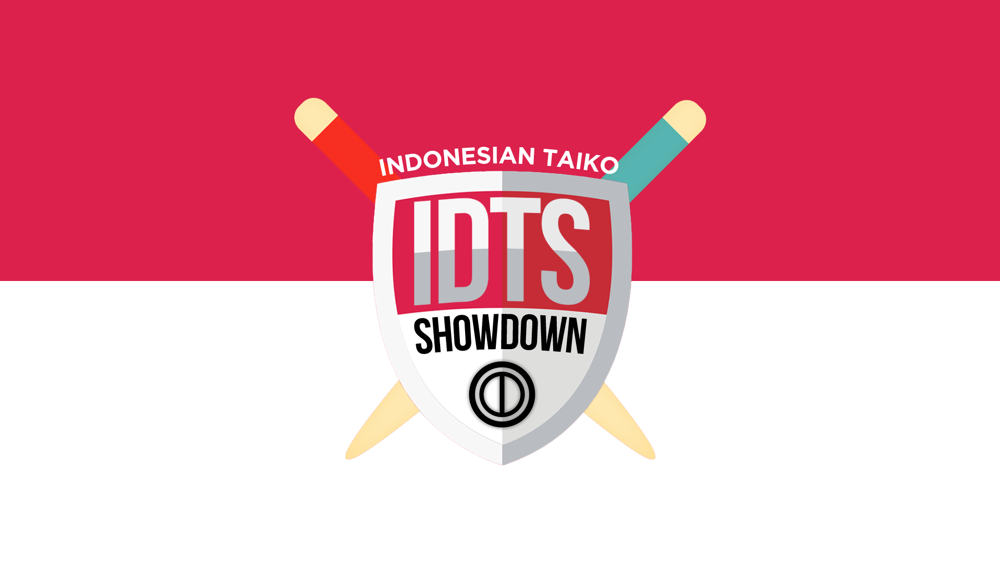

---
tags:
  - Indonesian Taiko Showdown
  - IDTS
---

# Indonesian Taiko Showdown

**Indonesian Taiko Showdown** (***IDTS***) adalah turnamen eliminasi ganda satu-lawan-satu, mode osu!taiko regional Indonesia, yang diselenggarakan oleh ::{ flag=ID }:: [fajar13k](https://osu.ppy.sh/users/7100002). Kali ini merupakan instalasi ke-1 dari turnamen Asian Taiko Showdown Taiko Showdown.

## Jadwal Turnamen

| Event | Waktu Pelaksanaan |
| --: | :-- |
| Tahap Registrasi | 2017-04-01/2017-04-30 |
| Pengundian | 2017-04-30 (20:00 UTC+7) |
| Babak Grup | 2017-05-06/2017-05-07 |
| 16 Besar | 2017-05-13/2017-05-14 |
| Perempat Final | 2017-05-20/2017-05-21 |
| Semifinal | 2017-05-27/2017-05-28 |
| Final | 2017-06-03/2017-06-04 |
| Grand Final | 2017-06-10 |

## Hadiah

Dalam setiap turnamen, peserta yang memenangkan turnamen berhak naik ke podium dan menerima hadiah unik yang dibuat khusus untuk pemenang Indonesian Taiko Showdown. Ada kemungkinan bahwa barang-barang yang dihadiahkan dapat berubah setiap instalasi Asian Taiko Showdown.

| Posisi | Hadiah |
| :-: | :-- |
|  | Lencana profil unik |

## Staf Turnamen

Indonesian Taiko Showdown dapat berlangsung dikarenakan berbagai anggota komunitas yang bersedia melakukan banyak tugas ke berbagai bidang dan tanggung jawabnya masing-masing.

| Posisi | Anggota |
| :-- | :-- |
| Penyelenggara | ::{ flag=ID }:: [fajar13k](https://osu.ppy.sh/users/7100002), ::{ flag=ID }:: [Aozora-](https://osu.ppy.sh/users/6918206) |
| Pemilih Map | ::{ flag=ID }:: [Niko-nyan](https://osu.ppy.sh/users/906991) |
| Penyiar | ::{ flag=JP }:: [SakuraFrost-](https://osu.ppy.sh/users/8147993), ::{ flag=ID }:: [fajar13k](https://osu.ppy.sh/users/7100002) |
| Komentator | ::{ flag=ID }:: [Guardistack-](https://osu.ppy.sh/users/1602428), ::{ flag=ID }:: [ganjas62](https://osu.ppy.sh/users/934685), ::{ flag=ID }:: [Kayano-](https://osu.ppy.sh/users/4999506), ::{ flag=ID }:: [Wim Are](https://osu.ppy.sh/users/4505744) |
| Designer | ::{ flag=PH }:: [OsuMe65](https://osu.ppy.sh/users/852867), ::{ flag=ID }:: [fajar13k](https://osu.ppy.sh/users/7100002) |
| Wasit | ::{ flag=ID }:: [fajar13k](https://osu.ppy.sh/users/7100002), ::{ flag=ID }:: [LittleBird-](https://osu.ppy.sh/users/6668671), ::{ flag=ID }:: [MRaihanZ](https://osu.ppy.sh/users/6668671), ::{ flag=ID }:: [Etherealize](https://osu.ppy.sh/users/7850608), ::{ flag=ID }:: [Niko-nyan](https://osu.ppy.sh/users/906991), ::{ flag=ID }:: [Aozora-](https://osu.ppy.sh/users/6918206) |
| Ahli Statistik | ::{ flag=ID }:: [fajar13k](https://osu.ppy.sh/users/7100002) |
| Wiki | ::{ flag=ID }:: [fajar13k](https://osu.ppy.sh/users/7100002) |

## Tautan

- [Topik diskusi](https://osu.ppy.sh/community/forums/topics/576070)
- [Siaran langsung](https://www.twitch.tv/osutaikoshowdown)
- [Skins Indonesian Taiko Showdown](https://puu.sh/whPiI/0fd221d5fa.zip)
- **[Lembar statistik](https://docs.google.com/spreadsheets/d/1MEkIzPxnb95kHoVRU6OWczhxPsl93RwSXsKSgdkopyE/pubhtml)**

## Peserta

| Seed | Anggota |
| :-- | :-- |
| Top | ::{ flag=ID }:: [pmriva](https://osu.ppy.sh/users/2180885), ::{ flag=ID }:: [Nishizumi](https://osu.ppy.sh/users/2496768), ::{ flag=ID }:: [XK2238](https://osu.ppy.sh/users/1139209), ::{ flag=ID }:: [Katdon\_donKat](https://osu.ppy.sh/users/8089664), ::{ flag=ID }:: [Lightning Wyvern](https://osu.ppy.sh/users/1533122), ::{ flag=ID }:: [misaki\_tk](https://osu.ppy.sh/users/3866964), ::{ flag=ID }:: [steven1](https://osu.ppy.sh/users/3090416), ::{ flag=ID }:: [Surono](https://osu.ppy.sh/users/3611370) |
| High | ::{ flag=ID }:: [Koucha-](https://osu.ppy.sh/users/2537412), ::{ flag=ID }:: [\_Destroyer\_](https://osu.ppy.sh/users/3185598), ::{ flag=ID }:: [Plua-](https://osu.ppy.sh/users/974012), ::{ flag=ID }:: [ayomikasa](https://osu.ppy.sh/users/4866957), ::{ flag=ID }:: [Shirai-](https://osu.ppy.sh/users/4221845), ::{ flag=ID }:: [Volta](https://osu.ppy.sh/users/4154071), ::{ flag=ID }:: [Wim Are](https://osu.ppy.sh/users/4505744), ::{ flag=ID }:: [Kayano-](https://osu.ppy.sh/users/4999506) |
| Low | ::{ flag=ID }:: [Rendang](https://osu.ppy.sh/users/3866968), ::{ flag=ID }:: [Kzl](https://osu.ppy.sh/users/7058490), ::{ flag=ID }:: [Franklin\_DeJavu](https://osu.ppy.sh/users/5569341), ::{ flag=ID }:: [sweetbravery](https://osu.ppy.sh/users/6807808), ::{ flag=ID }:: Elisabeth-, ::{ flag=ID }:: [\_CaKy\_](https://osu.ppy.sh/users/9828983), ::{ flag=ID }:: [Buyut](https://osu.ppy.sh/users/9608136), ::{ flag=ID }:: [pingping2011](https://osu.ppy.sh/users/1094255) |

## Grup

| Grup A | Grup B | Grup C | Grup D | Grup E | Grup F | Grup G | Grup H |
| :-- | :-- | :-- | :-- | :-- | :-- | :-- | :-- |
| ::{ flag=ID }:: [Surono](https://osu.ppy.sh/users/3611370) | ::{ flag=ID }:: [XK2238](https://osu.ppy.sh/users/1139209) | ::{ flag=ID }:: [Nishizumi](https://osu.ppy.sh/users/2496768) | ::{ flag=ID }:: [Lightning Wyvern](https://osu.ppy.sh/users/1533122) | ::{ flag=ID }:: [Katdon\_donKat](https://osu.ppy.sh/users/8089664) | ::{ flag=ID }:: [misaki\_tk](https://osu.ppy.sh/users/3866964) | ::{ flag=ID }:: [steven1](https://osu.ppy.sh/users/3090416) | ::{ flag=ID }:: [pmriva](https://osu.ppy.sh/users/2180885) |
| ::{ flag=ID }:: [Wim Are](https://osu.ppy.sh/users/4505744) | ::{ flag=ID }:: [ayomikasa](https://osu.ppy.sh/users/4866957) | ::{ flag=ID }:: [Koucha-](https://osu.ppy.sh/users/2537412) | ::{ flag=ID }:: [Plua-](https://osu.ppy.sh/users/974012) | ::{ flag=ID }:: [Volta](https://osu.ppy.sh/users/4154071) | ::{ flag=ID }:: [\_Destroyer\_](https://osu.ppy.sh/users/3185598) | ::{ flag=ID }:: [Kayano-](https://osu.ppy.sh/users/4999506) | ::{ flag=ID }:: [Shirai-](https://osu.ppy.sh/users/4221845) |
| ::{ flag=ID }:: [Buyut](https://osu.ppy.sh/users/9608136) | ::{ flag=ID }:: [Kzl](https://osu.ppy.sh/users/7058490) | ::{ flag=ID }:: [pingping2011](https://osu.ppy.sh/users/1094255) | ::{ flag=ID }:: [sweetbravery](https://osu.ppy.sh/users/6807808) | ::{ flag=ID }:: Elisabeth- | ::{ flag=ID }:: [Rendang](https://osu.ppy.sh/users/3866968) | ::{ flag=ID }:: [\_CaKy\_](https://osu.ppy.sh/users/9828983) | ::{ flag=ID }:: [Franklin\_DeJavu](https://osu.ppy.sh/users/5569341) |

## Podium

Turnamen ini telah berakhir dan menghasilkan podium berikut:

| Posisi | Pemain |
| :-: | :-- |
|  | ::{ flag=ID }:: [XK2238](https://osu.ppy.sh/users/1139209) |
|  | ::{ flag=ID }:: [pmriva](https://osu.ppy.sh/users/2180885) |
|  | ::{ flag=ID }:: [Nishizumi](https://osu.ppy.sh/users/2496768) |

## Mappools

### Final

**Mappool ini digunakan saat Babak Final dan Grand Final.**

**[Unduh mappack di sini! (83 MB)](https://drive.google.com/file/d/0BzeQ-0M9kba3cFpJQUNvRzJKQlU/view?usp=sharing)**

- NoMod
  1. [Morimori Atsushi - Applique (TKS) \[test\]](https://osu.ppy.sh/beatmapsets/270995#taiko/616247)
  2. [Remo Prototype\[CV: Hanamori Yumiri\] - Sendan Life (Y O U T A) \[Inner Oni)\]](https://osu.ppy.sh/beatmapsets/395660#taiko/861023)
  3. [Sara - Natu iro Present Wo BPM180 Ni Shitemita (asuasu\_yura) \[Special\]](https://osu.ppy.sh/beatmapsets/506844#taiko/1078077)
  4. [yambabom - Over my head (Backfire) \[Taikocalypse Act I : The Return\]](https://osu.ppy.sh/beatmapsets/101768#taiko/269411)
  5. [Morimori Atsushi - PUPA (TKS) \[Inner Oni\]](https://osu.ppy.sh/beatmapsets/235506#taiko/545843)
  6. [The Quick Brown Fox - The Big Black (MajorLeagueWobs Remix) (pmriva) \[BESAR HITAM \[NSC\]\]](https://osu.ppy.sh/beatmapsets/343581#taiko/1302411)
- Hidden
  1. [Nekomata L.E.D.Master+ - Chrono Diver -PENDULUMs- (Nofool) \[Hard Oni\]](https://osu.ppy.sh/beatmapsets/422816#taiko/913908)
  2. [LeaF - MEPHISTO (TKS) \[TK's Inner Oni\]](https://osu.ppy.sh/beatmapsets/106212#taiko/284037)
- HardRock
  1. [Kola Kid - can't hide your love (Ekoro) \[Divine Light\]](https://osu.ppy.sh/beatmapsets/207479#taiko/488844)
  2. [Ocelot - TSUBAKI (TKS) \[TSUBAKI\]](https://osu.ppy.sh/beatmapsets/177838#taiko/427932)
- DoubleTime
  1. [A.SAKA - Nanatsu Issenzakura (tasuke912) \[tasuke's Inner Oni\]](https://osu.ppy.sh/beatmapsets/320555#taiko/719063)
  2. [Ci Mei Gui - Wu Xuan Lan (Nardoxyribonucleic) \[Inner Oni\]](https://osu.ppy.sh/beatmapsets/339558#taiko/751680)
- FreeMod
  1. [xi - ANiMA (tasuke912) \[Inner Oni\]](https://osu.ppy.sh/beatmapsets/326029#taiko/724040)
  2. [yuzen - Ouka Ryouran (Charlotte) \[Ryouran Oni\]](https://osu.ppy.sh/beatmapsets/540913#taiko/1146971)
  3. [Hate vs Brilliance - Qubism (Nishizumi) \[Inner Oni\]](https://osu.ppy.sh/beatmapsets/451660#taiko/968844)
- Tiebreaker
  1. **[Yuuyu - Iki o Koroshita Stokesia (Sayaka-) \[Oni\]](https://osu.ppy.sh/beatmapsets/379265#taiko/830240)**

### Semifinal

**[Unduh mappack di sini! (70 MB)](https://drive.google.com/file/d/0BzeQ-0M9kba3VXNEQTZvMHYxems/view?usp=sharing)**

- NoMod
  1. [Memme - Avalanche (Love) \[Love\]](https://osu.ppy.sh/beatmapsets/343914#taiko/759835)
  2. [OSTER Project - EBONY & IVORY (-xNaCLx-) \[Inner Oni\]](https://osu.ppy.sh/beatmapsets/444246#taiko/954400)
  3. [Yooh - Seraphim (koyomi\_222) \[Inner Oni\]](https://osu.ppy.sh/beatmapsets/429291#taiko/926314)
  4. [xi - Finder keepers (Mapper 31) \[Oni\]](https://osu.ppy.sh/beatmapsets/336183#taiko/744070)
  5. [Yooh - LegenD. (Backfire) \[Taikocalypse\]](https://osu.ppy.sh/beatmapsets/322734#taiko/717522)
  6. [Erehamonika remixed by kors k - Der Wald (Kors K Remix) (Nofool) \[Hard Oni\]](https://osu.ppy.sh/beatmapsets/432406#taiko/932407)
- Hidden
  1. [Camellia - Fastest Crash (BlackHairEND) \[Inner Oni\]](https://osu.ppy.sh/beatmapsets/344170#taiko/760371)
  2. [3R2 & DJ Mashiro - Sweetness Overload!!! (-xNaCLx-) \[NC's Inner Oni\]](https://osu.ppy.sh/beatmapsets/335242#taiko/742184)
- HardRock
  1. [61 Degrees - Kagami (eeezzzeee) \[Inner Oni\]](https://osu.ppy.sh/beatmapsets/304783#taiko/682773)
  2. [Mafumafu - Super Nuko ni Naritai (newyams99) \[Inner Oni\]](https://osu.ppy.sh/beatmapsets/468228#taiko/1001542)
- DoubleTime
  1. [THE DU - Crazy Noisy Bizarre Town (Full Ver.) (bank78952) \[Oni\]](https://osu.ppy.sh/beatmapsets/466071#taiko/997584)
  2. [Tamura Yukari feat. motsu from m.o.v.e - You & Me (climbb65588, aabc271) \[Climbb & aabc's Taiko Oni\]](https://osu.ppy.sh/beatmapsets/67093#taiko/252518)
- FreeMod
  1. [CyoucyoP feat.Hatsune Miku - White Prism (kanopu) \[Prism Oni\]](https://osu.ppy.sh/beatmapsets/311056#taiko/694940)
  2. [LeaF - Chronostasis (DakeDekaane) \[Inner Oni\]](https://osu.ppy.sh/beatmapsets/193469#taiko/566347)
  3. [Memme - Acid Burst (MMzz) \[Inner Oni\]](https://osu.ppy.sh/beatmapsets/215546#taiko/506186)
- Tiebreaker
  1. **[Halozy - Deconstruction Star (kanopu) \[Kano's Inner Oni\]](https://osu.ppy.sh/beatmapsets/319217#taiko/727859)**

### Perempat Final

**[Unduh mappack di sini! (83 MB)](https://drive.google.com/file/d/0BzeQ-0M9kba3SUkxUVNMYlhOWkk/view?usp=sharing)**

- NoMod
  1. [t+pazolite - Tomorrow Perfume (tpz Despair Remix) (Nardoxyribonucleic) \[Nardo's Inner Oni\]](https://osu.ppy.sh/beatmapsets/447830#taiko/968416)
  2. [Nizikawa - F.K.S (Arrival) \[Inner Oni\]](https://osu.ppy.sh/beatmapsets/298187#taiko/673168)
  3. [NU-KO - Pochiko no Shiawase na Nichijou (TKS) \[TK's Oni\]](https://osu.ppy.sh/beatmapsets/298187#taiko/673168)
  4. [Hatsune Miku - Electric Love (t+pazolite Overcute Remix) (OnosakiHito) \[Ono's Taiko Oni\]](https://osu.ppy.sh/beatmapsets/50373#taiko/1153370)
  5. kors k as teranoid - Bad Maniacs (Backfire) \[Backfire's Inner Oni\]
  6. [LeaF - Alice in Misanthrope -Ensei Alice- (S a n d) \[No Regret\]](https://osu.ppy.sh/beatmapsets/523315#taiko/1111087)
- Hidden
  1. [Krewella - Come And Get It (Razihel Remix) (hikikochan) \[Inner Oni\]](https://osu.ppy.sh/beatmapsets/417377#taiko/903809)
  2. [An - Tephereth (SKSalt) \[Inner Oni\]](https://osu.ppy.sh/beatmapsets/364132#taiko/799402)
- HardRock
  1. [sakuzyo - Imprinting (Nanatsu) \[7 t h's Inner Oni\]](https://osu.ppy.sh/beatmapsets/371217#taiko/813387)
  2. [Zeami feat. Tenshi - Tenyou no Mai (Firce777) \[Firce777's Inner Oni\]](https://osu.ppy.sh/beatmapsets/178962#taiko/431502)
- DoubleTime
  1. [kors k feat.Yoshikawa Sunao - 7 Colors (Naryuga) \[Naryuga's Inner Oni\]](https://osu.ppy.sh/beatmapsets/148397#taiko/369597)
  2. [RAN - Dekat di Hati (REDSHiFT Remix) (Volta) \[FLP's Inner Oni\]](https://osu.ppy.sh/beatmapsets/350207#taiko/807140)
- FreeMod
  1. [An - artcore JINJA (tasuke912) \[tasuke's Inner Oni\]](https://osu.ppy.sh/beatmapsets/198600#taiko/620995)
  2. [P\*Light - Poppin' Shower (Backfire) \[Taiko Oni\]](https://osu.ppy.sh/beatmapsets/42527#taiko/134337)
  3. [Memme - Chinese Restaurant (TKS) \[TK's Inner Oni\]](https://osu.ppy.sh/beatmapsets/243893#taiko/627829)
- Tiebreaker
  1. **[dBu - Kyoumu Shuusou Kyoku \~ Pandemonic Planet (Guardistack-, steven1, Shirai-) \[Satanic Collab\]](https://osu.ppy.sh/beatmapsets/533302#taiko/1129831)**

### 16 Besar

**[Unduh mappack di sini! (56 MB)](https://drive.google.com/file/d/0BzeQ-0M9kba3UWZvMG9YeGtKbnc/view?usp=sharing)**

- NoMod
  1. [Memme - Starving Days (Charless445) \[Oni445\]](https://osu.ppy.sh/beatmapsets/157641#taiko/385907)
  2. [CHiCO with HoneyWorks - Ai no Scenario (JUDYDANNY) \[JuDa's Oni\]](https://osu.ppy.sh/beatmapsets/329188#taiko/730351)
  3. [sasakure.UK (ft. Hatsune Miku) - SeventH-HeaveN (\[I\]MMoRTal\[S\]) \[Oni\]](https://osu.ppy.sh/beatmapsets/177182#taiko/434481)
  4. [Eagle - S!ck (TKS) \[Oni\]](https://osu.ppy.sh/beatmapsets/155516#taiko/381455)
  5. [Zeami - Seija no Kodou (Genro) \[Oni\]](https://osu.ppy.sh/beatmapsets/484357#taiko/1033227)
  6. [C-Show - On the FM (Nofool) \[Oni\]](https://osu.ppy.sh/beatmapsets/568544#taiko/1205385)
- Hidden
  1. [SHW - Ikusa JAPAN (shw.in) (kanpakyin) \[Oni\]](https://osu.ppy.sh/beatmapsets/169969#taiko/411522)
  2. [Mili - Nine Point Eight (ReyShel) \[Oni\]](https://osu.ppy.sh/beatmapsets/198268#taiko/470278)
- HardRock
  1. [yuikonnu & Hiiragi Yuka - Otsukimi Recital (JUDYDANNY) \[JuDa's Oni\]](https://osu.ppy.sh/beatmapsets/113798#taiko/296261)
  2. [ESTi X M2U - Obelisque (MMzz) \[Inner Oni\]](https://osu.ppy.sh/beatmapsets/172663#taiko/417241)
- DoubleTime
  1. [Aoi Eir - Satellite (kanpakyin, aabc271) \[KPY & aabc's Taiko Muzukashii\]](https://osu.ppy.sh/beatmapsets/86312#taiko/304045)
  2. [senya - Iro wa Nioedo Chirinuru o(OPver.) (stu00608) \[stu's Oni\]](https://osu.ppy.sh/beatmapsets/226789#taiko/532440)
- FreeMod
  1. [Memme - China Dress (Zexous) \[Zexous' Oni\]](https://osu.ppy.sh/beatmapsets/137665#taiko/403249)
  2. [Project Grimoire - Caliburne \~Story of the Legendary sword\~ (Nofool) \[Oni\]](https://osu.ppy.sh/beatmapsets/382279#taiko/1124531)
  3. [P\*Light - TRIGGER\*HAPPY (mingmichael) \[m1ng's Oni\]](https://osu.ppy.sh/beatmapsets/74671#taiko/249943)
- Tiebreaker
  1. **[Zedd - Clarity (feat. Foxes) (kamome sano remix) (Jaye, Niko-nyan) \[Ambivalence\]](https://osu.ppy.sh/beatmapsets/536252#taiko/1135706)**

### Babak Grup

**[Unduh mappack di sini! (118 MB)](https://drive.google.com/file/d/0BzeQ-0M9kba3cEJubDVQeVJDY28/view?usp=sharing)**

- NoMod
  1. [Camellia - Routing (MMzz) \[Muzukashii\]](https://osu.ppy.sh/beatmapsets/375111#taiko/821900)
  2. [FLOOR LEGENDS -KAC 2012- - KAC 2012 ULTIMATE MEDLEY -HISTORIA SOUND VOLTEX- (Nanatsu) \[Muzukashii\]](https://osu.ppy.sh/beatmapsets/406622#taiko/920489)
  3. [Nekomata Master - Silence (Tasha) \[Muzukashii\]](https://osu.ppy.sh/beatmapsets/127126#taiko/342675)
  4. NeLiME vs PRESti - Gatorix (Nardoxyribonucleic) \[Nardo's Muzukashii\]
  5. [xi - Wish upon Twin Stars (JUDYDANNY) \[JuDa's Muzukashii\]](https://osu.ppy.sh/beatmapsets/353259#taiko/805872)
  6. [Vau Boy - Video Game Girl (ft. viewtifulday) (Gero) \[Muzukashii\]](https://osu.ppy.sh/beatmapsets/331778#taiko/734844)
- Hidden
  1. [IOSYS - Cirno's Perfect Math Class (DakeDekaane) \[Dekaane's Oni\]](https://osu.ppy.sh/beatmapsets/120071#taiko/330380)
  2. [marina - Towa yori Towa ni (TKS) \[TK's Muzukashii\]](https://osu.ppy.sh/beatmapsets/143370#taiko/368411)
- HardRock
  1. [M2U feat. Guriri - Magnolia (JUDYDANNY) \[Oni\]](https://osu.ppy.sh/beatmapsets/140418#taiko/350732)
  2. [Hatsuki Yura - Yoiyami Hanabi (aabc271) \[aabc's Oni\]](https://osu.ppy.sh/beatmapsets/236568#taiko/549942)
- DoubleTime
  1. [Matsumoto Tamaki - Tenshi Teki Kenpou Yonjou (aabc271) \[aabc's Taiko\]](https://osu.ppy.sh/beatmapsets/43100#taiko/137802)
  2. [Perfume - Communication (Short Ver.) (hs714) \[714 Oni\]](https://osu.ppy.sh/beatmapsets/59227#taiko/178356)
- FreeMod
  1. [RE-VENGE - AFRONOVA (xWillx) \[Oni\]](https://osu.ppy.sh/beatmapsets/291655#taiko/667829)
  2. [Dan Winter - Don't Stop Push It Now (Gero, Hanjamon) \[Geromon's Muzukashii\]](https://osu.ppy.sh/beatmapsets/200374#taiko/478404)
  3. [yuikonnu & ayaponzu\* - Super Nuko World (DarknessAngel) \[D.N.Angel's Muzukashii\]](https://osu.ppy.sh/beatmapsets/153776#taiko/435821)
- Tiebreaker
  1. **[CHiCO with HoneyWorks - Sekai wa Koi ni Ochiteiru (newyams99) \[Oni\]](https://osu.ppy.sh/beatmapsets/395976#taiko/861612)**

## Hasil Pertandingan

### Grand Final

| Minggu, 2017-06-10 |  |  |  |  |
| --: | :-: | :-: | :-- | :-- |
| XK2238 ::{ flag=ID }:: | 6 | **7** | ::{ flag=ID }:: **pmriva** | [#1](https://osu.ppy.sh/community/matches/33778864) |
| pmriva ::{ flag=ID }:: | 5 | **7** | ::{ flag=ID }:: **XK2238** | [#1](https://osu.ppy.sh/community/matches/33785221) |

### Final

| Sabtu, 2017-06-03 |  |  |  |  |
| --: | :-: | :-: | :-- | :-- |
| **Katdon\_donKat** ::{ flag=ID }:: | **6** | 2 | ::{ flag=ID }:: steven1 | [#1](https://osu.ppy.sh/community/matches/33568382) |
| pmriva ::{ flag=ID }:: | 3 | **6** | ::{ flag=ID }:: **XK2238** | [#1](https://osu.ppy.sh/community/matches/33600406) |

| Minggu, 2017-06-04 |  |  |  |  |
| --: | :-: | :-: | :-- | :-- |
| Nishizumi ::{ flag=ID }:: | **6** | 0 | ::{ flag=ID }:: Shirai- | [#1](https://osu.ppy.sh/community/matches/33619870) |
| Katdon\_donKat ::{ flag=ID }:: | 1 | **6** | ::{ flag=ID }:: **Nishizumi** | [#1](https://osu.ppy.sh/community/matches/33621267) |
| **pmriva** ::{ flag=ID }:: | **6** | 2 | ::{ flag=ID }:: Nishizumi | [#1](https://osu.ppy.sh/community/matches/33626414) |

### Semifinal

| Sabtu, 2017-05-27 |  |  |  |  |
| --: | :-: | :-: | :-- | :-- |
| **Lightning Wyvern** ::{ flag=ID }:: | **6** | 3 | ::{ flag=ID }:: Plua- | [#1](https://osu.ppy.sh/community/matches/33439416) |
| Katdon\_donKat ::{ flag=ID }:: | 1 | **6** | ::{ flag=ID }:: **XK2238** | [#1](https://osu.ppy.sh/community/matches/33440128) |
| \_Destroyer\_ ::{ flag=ID }:: | 4 | **6** | ::{ flag=ID }:: **misaki\_tk** | [#1](https://osu.ppy.sh/community/matches/33440300) |
| pmriva ::{ flag=ID }:: | **6** | 5 | ::{ flag=ID }:: Nishizumi | [#1](https://osu.ppy.sh/community/matches/33445446) |

| Minggu, 2017-05-28 |  |  |  |  |
| --: | :-: | :-: | :-- | :-- |
| **Shirai-** ::{ flag=ID }:: | **6** | 3 | ::{ flag=ID }:: Kayano- | [#1](https://osu.ppy.sh/community/matches/33414275) |
| ayomikasa ::{ flag=ID }:: | 1 | **6** | ::{ flag=ID }:: **steven1** | [#1](https://osu.ppy.sh/community/matches/33464233) |
| Lightning Wyvern ::{ flag=ID }:: | 5 | **6** | ::{ flag=ID }:: **steven1** | [#1](https://osu.ppy.sh/community/matches/33465076) |
| **Shirai**- ::{ flag=ID }:: | **6** | 4 | ::{ flag=ID }:: misaki\_tk | [#1](https://osu.ppy.sh/community/matches/33465609) |

### Perempat Final

| Sabtu, 2017-05-20 |  |  |  |  |
| --: | :-: | :-: | :-- | :-- |
| **Katdon\_donKat** ::{ flag=ID }:: | **5** | 1 | ::{ flag=ID }:: \_Destroyer\_ | [#1](https://osu.ppy.sh/community/matches/33286726) |
| **steven1** ::{ flag=ID }:: | **5** | 0 | ::{ flag=ID }:: Buyut | -win by default- |
| **Nishizumi** ::{ flag=ID }:: | **5** | 0 | ::{ flag=ID }:: Lightning Wyvern | [#1](https://osu.ppy.sh/community/matches/33289527) |

| Minggu, 2017-05-21 |  |  |  |  |
| --: | :-: | :-: | :-- | :-- |
| **Plua-** ::{ flag=ID }:: | **5** | 3 | ::{ flag=ID }:: Koucha- | [#1](https://osu.ppy.sh/community/matches/33315503) |
| **XK2238** ::{ flag=ID }:: | **5** | 1 | ::{ flag=ID }:: Shirai- | [#1](https://osu.ppy.sh/community/matches/33316897) |
| **misaki\_tk** ::{ flag=ID }:: | **5** | 0 | ::{ flag=ID }:: Volta | -win by default- |
| **pmriva** ::{ flag=ID }:: | **5** | 1 | ::{ flag=ID }:: ayomikasa | [#1](https://osu.ppy.sh/community/matches/33317007) |
| Wim Are ::{ flag=ID }:: | 3 | **5** | ::{ flag=ID }:: **Kayano-** | [#1](https://osu.ppy.sh/community/matches/33318406) |

### 16 Besar

| Sabtu, 2017-05-13 |  |  |  |  |
| --: | :-: | :-: | :-- | :-- |
| **Shirai-** ::{ flag=ID }:: | **5** | 0 | ::{ flag=ID }:: Buyut | -win by default- |
| **Katdon\_donKat** ::{ flag=ID }:: | **5** | 2 | ::{ flag=ID }:: Plua- | [#1](https://osu.ppy.sh/community/matches/33132821) |
| **Nishizumi** ::{ flag=ID }:: | **5** | 1 | ::{ flag=ID }:: misaki\_tk | [#1](https://osu.ppy.sh/community/matches/33134539) |

| Minggu, 2017-05-14 |  |  |  |  |
| --: | :-: | :-: | :-- | :-- |
| **\_Destroyer\_** ::{ flag=ID }:: | **5** | 4 | ::{ flag=ID }:: Koucha- | [#1](https://osu.ppy.sh/community/matches/33155803) |
| **pmriva** ::{ flag=ID }:: | **5** | 0 | ::{ flag=ID }:: Wim Are | [#1](https://osu.ppy.sh/community/matches/33162779) |
| **Lightning Wyvern** ::{ flag=ID }:: | **5** | 0 | ::{ flag=ID }:: Volta | -win by default- |
| steven1 ::{ flag=ID }:: | 0 | **5** | ::{ flag=ID }:: **XK2238** | -win by default- |
| **ayomikasa** ::{ flag=ID }:: | **5** | 0 | ::{ flag=ID }:: Kayano- | -win by default- |

### Babak Grup

| Grup | Sabtu, 2017-05-06 |  |  |  |  |
| :-: | --: | :-: | :-: | :-- | :-- |
| A | Surono ::{ flag=ID }:: | 0 | **4** | ::{ flag=ID }:: Wim Are | -win by default- |
| D | **Lightning Wyvern** ::{ flag=ID }:: | **4** | 0 | ::{ flag=ID }:: sweetbravery | -win by default- |
| H | **pmriva** ::{ flag=ID }:: | **4** | 1 | ::{ flag=ID }:: Franklin\_DeJavu | [#1](https://osu.ppy.sh/community/matches/32971269) |
| B | **XK2238** ::{ flag=ID }:: | **4** | 2 | ::{ flag=ID }:: Kzl | [#1](https://osu.ppy.sh/community/matches/32971201) |
| F | **\_Destroyer\_** ::{ flag=ID }:: | **4** | 0 | ::{ flag=ID }:: Rendang | [#1](https://osu.ppy.sh/community/matches/32972109) |
| B | XK2238 ::{ flag=ID }:: | 3 | **4** | ::{ flag=ID }:: ayomikasa | [#1](https://osu.ppy.sh/community/matches/32974363) |
| F | **misaki\_tk** ::{ flag=ID }:: | **4** | 0 | ::{ flag=ID }:: Rendang | [#1](https://osu.ppy.sh/community/matches/32974229) |
| E | **Katdon\_donKat** ::{ flag=ID }:: | **4** | 0 | ::{ flag=ID }:: Volta | [#1](https://osu.ppy.sh/community/matches/32975857) |
| D | **Lightning Wyvern** ::{ flag=ID }:: | **4** | 0 | ::{ flag=ID }:: Plua- | [#1](https://osu.ppy.sh/community/matches/32975711) |
| F | misaki\_tk ::{ flag=ID }:: | 1 | **4** | ::{ flag=ID }:: **\_Destroyer\_** | [#1](https://osu.ppy.sh/community/matches/32975848) |
| H | **Shirai-** ::{ flag=ID }:: | **4** | 0 | ::{ flag=ID }:: Franklin\_DeJavu | [#1](https://osu.ppy.sh/community/matches/32977134) |
| G | **steven1** ::{ flag=ID }:: | **4** | 2 | ::{ flag=ID }:: Kayano- | [#1](https://osu.ppy.sh/community/matches/32977387) |

| Grup | Minggu, 2017-05-07 |  |  |  |  |
| :-: | --: | :-: | :-: | :-- | :-- |
| B | **ayomikasa** ::{ flag=ID }:: | **4** | 0 | ::{ flag=ID }:: Kzl | [#1](https://osu.ppy.sh/community/matches/32999232) |
| E | **Katdon\_donKat** ::{ flag=ID }:: | **4** | 0 | ::{ flag=ID }:: Elisabeth- | -win by default- |
| G | **steven1** ::{ flag=ID }:: | **4** | 0 | ::{ flag=ID }:: \_CaKy\_ | [#1](https://osu.ppy.sh/community/matches/32999034) |
| D | **Plua-** ::{ flag=ID }:: | **4** | 0 | ::{ flag=ID }:: sweetbravery | -win by default- |
| C | **Nishizumi** ::{ flag=ID }:: | **4** | 0 | ::{ flag=ID }:: pingping2011 | -win by default- |
| E | **Volta** ::{ flag=ID }:: | **4** | 0 | ::{ flag=ID }:: Elisabeth- | -win by default- |
| H | pmriva ::{ flag=ID }:: | 0 | **4** | ::{ flag=ID }:: **Shirai-** | -win by default- |
| A | Surono ::{ flag=ID }:: | 0 | 0 | ::{ flag=ID }:: Buyut | -anulir- |
| C | **Koucha-** ::{ flag=ID }:: | **4** | 0 | ::{ flag=ID }:: pingping2011 | -win by default- |
| G | **Kayano-** ::{ flag=ID }:: | **4** | 0 | ::{ flag=ID }:: \_CaKy\_ | [#1](https://osu.ppy.sh/community/matches/33003700) |
| A | **Wim Are** ::{ flag=ID }:: | **4** | 0 | ::{ flag=ID }:: Buyut | [#1](https://osu.ppy.sh/community/matches/33003681) |
| C | **Nishizumi** ::{ flag=ID }:: | **4** | 3 | ::{ flag=ID }:: Koucha- | [#1](https://osu.ppy.sh/community/matches/33005364) |

## Peraturan

### Peraturan Umum

1. Turnamen dibuka tanpa batasan rank dengan syarat utama tinggal di Negara Indonesia (WNI/WNA) dan memiliki **Bendera Indonesia** di profil osu! mereka.
2. Turnamen ini akan mengadopsi sistem double-elimination bracket.
3. Turnamen ini dibatasi pesertanya hingga 24 peserta.
4. Peserta yang memiliki tingkah buruk dengan sesama pemain/Staff Turnamen berpotensi dieliminasi. (peraturan ini juga berlaku untuk Staff)

### Instruksi Pertandingan

1. Indonesian Taiko Showdown merupakan turnamen osu!taiko satu-lawan-satu.
2. Peserta dengan skor terbanyak menang
3. Mappool berisi 6 NoMod, 2 HardRock, 2 Hidden, 2 DoubleTime, 3 FreeMod, dan 1 Tiebreaker.
4. Anda bisa menggunakan NC ketimbang DT, tetapi lawan anda juga harus menyetujui untuk memakai NC
5. FreeMod memiliki aturan HD, HR, atau Nomod saja. Selain Mods yang disebutkan disamping termasuk kombinasi mods tidak diperbolehkan
6. Peserta dapat ban 1 map setiap match (map yang tidak boleh dipakai)
7. Peserta dapat memilih 1 warm up dengan batasan waktu 5 menit warm-up
8. `!roll` akan menentukan siapa yang memilih map pertama untuk dimainkan
9. Peserta dengan `!roll` terendah akan mulai bann map pertama, setelah itu pemenang `!roll` akan mulai pick map pertama.
10. Batas waktu keterlambatan & toleransi adalah **10 menit**.
11. Jika kedua peserta gagal menyelesaikan map, poin akan diperoleh oleh peserta dengan skor tertinggi
12. Jika kedua peserta memiliki skor sama, maka map akan dimainkan kembali tanpa ada perolehan poin.

### Kondisi Kemenangan

1. Dibutuhkan 4 poin untuk memenangkan Babak Grup.
2. Dibutuhkan 5 poin untuk memenangkan Babak 16 Besar dan Perempat Final.
3. Dibutuhkan 6 poin untuk memenangkan Babak Semifinal dan Final.
4. Dibutuhkan 7 poin untuk memenangkan Babak Grand Final.
