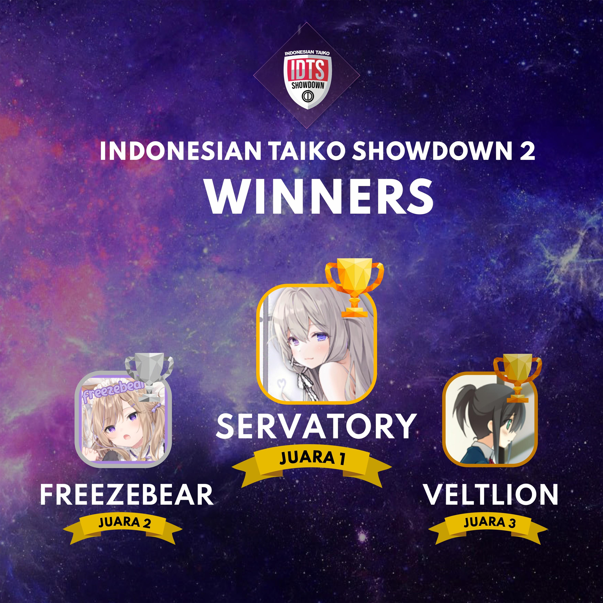

---
tags:
  - IDTS
  - IDTS2
---

# Indonesian Taiko Showdown 2

The **Indonesian Taiko Showdown 2** (***IDTS 2***) was an Indonesian double-elimination 1v1 osu!taiko tournament hosted by ::{ flag=ID }:: [Naverlyn](https://osu.ppy.sh/users/14324722). The tournament was targeted for Indonesian top osu!taiko players, with no rank limits. It was the second instalment of the Indonesian Taiko Showdown.

## Tournament schedule

| Event | Timestamp |
| --: | :-- |
| Registration phase | 2021-11-01/2021-11-18 |
| Screening phase | 2021-11-19/2021-11-27 |
| Live drawings | 2021-11-27 (21:00 UTC+7) |
| Round of 32 | 2021-12-03/2021-12-05 |
| Round of 16 | 2021-12-11/2021-12-12 |
| Quarterfinals | 2021-12-18/2021-12-19 |
| Semifinals | 2021-12-25/2021-12-26 |
| Finals | 2022-01-01/2022-01-02 |
| Grand Finals | 2022-01-08/2022-01-09 |

## Prizes

| Placing | Prize(s) |
| :-: | :-- |
|  | Unique profile badge, physical trophy, certificate, 1 month of osu!supporter, 1 box of Indomie, IDR225,000 |
|  | Physical trophy, certificate, 1 month of osu!supporter, IDR190,000 |
|  | Physical trophy, certificate, IDR130,000 |

Generous donations from ::{ flag=ID }:: [Aozora-](https://osu.ppy.sh/users/6918206), ::{ flag=ID }:: [fajar13k](https://osu.ppy.sh/users/7100002), [Datenshi Community](https://discord.gg/mPJWMYmsFw), ::{ flag=ID }:: [ImChro](https://osu.ppy.sh/users/7280717), ::{ flag=ID }:: [Mamat](https://osu.ppy.sh/users/3031177), and ::{ flag=ID }:: [Naverlyn](https://osu.ppy.sh/users/14324722) helped fund some of the prizes.

## Organisation

The Indonesian Taiko Showdown 2 was run by various community members.

| Position | Member(s) |
| :-- | :-- |
| Organiser | ::{ flag=ID }:: [Naverlyn](https://osu.ppy.sh/users/14324722) |
| Mappool selector | ::{ flag=ID }:: [Alwaysyukaz](https://osu.ppy.sh/users/4999506), ::{ flag=ID }:: [Reed\_405](https://osu.ppy.sh/users/9965069) |
| Referee | ::{ flag=ID }:: [Lightning Wyvern](https://osu.ppy.sh/users/1533122), ::{ flag=ID }:: [Naverlyn](https://osu.ppy.sh/users/14324722), ::{ flag=ID }:: [Nishizumi](https://osu.ppy.sh/users/2496768), ::{ flag=ID }:: [PatZar](https://osu.ppy.sh/users/2479487), ::{ flag=ID }:: [Rei Hakurei](https://osu.ppy.sh/users/704111) |
| Streamer | ::{ flag=SG }:: [Spartric](https://osu.ppy.sh/users/7740442), ::{ flag=ID }:: [Victim\_Crasher](https://osu.ppy.sh/users/2084869), ::{ flag=ID }:: [wiam103](https://osu.ppy.sh/users/4109839) |
| Commentator | ::{ flag=ID }:: [apaajaboleh10](https://osu.ppy.sh/users/5151647), ::{ flag=ID }:: [ImChro](https://osu.ppy.sh/users/7280717) |
| Designer | ::{ flag=ID }:: [Alice Pi](https://osu.ppy.sh/users/8787324) |
| Statistician | ::{ flag=ID }:: [Tix](https://osu.ppy.sh/users/11421465) |
| Wiki writer | ::{ flag=ID }:: [fajar13k](https://osu.ppy.sh/users/7100002) |

## Links

- [Discussion thread](https://osu.ppy.sh/community/forums/topics/1452569)
- [IDTS Discord server](https://discord.gg/jUDx7hJ7Xv)
- [Livestream](https://www.twitch.tv/idtsosu)
- [Challonge brackets](https://challonge.com/IDTS2)
- **[Statistics sheet](https://docs.google.com/spreadsheets/d/1vilVbt-Z_UE26JMZS9nFy-ARt104FPRrk4st4I8WhEI/edit?usp=sharing)**

## Participants

| Seed | Members |
| :-- | :-- |
| Top | ::{ flag=ID }:: [misaki\_tk](https://osu.ppy.sh/users/3866964), ::{ flag=ID }:: [Kaemz](https://osu.ppy.sh/users/8494233), ::{ flag=ID }:: [Servatory](https://osu.ppy.sh/users/4013317), ::{ flag=ID }:: [Mikurio](https://osu.ppy.sh/users/10734140), ::{ flag=ID }:: [Maneh](https://osu.ppy.sh/users/5179995), ::{ flag=ID }:: [Veltlion](https://osu.ppy.sh/users/10999079), ::{ flag=ID }:: [eltiras](https://osu.ppy.sh/users/6720962), ::{ flag=ID }:: [freezebear](https://osu.ppy.sh/users/1943301), ::{ flag=ID }:: [Ryouka-](https://osu.ppy.sh/users/7099450), ::{ flag=ID }:: [Reen](https://osu.ppy.sh/users/3285139) |
| Middle | ::{ flag=ID }:: [Konami-Kun](https://osu.ppy.sh/users/15931741), ::{ flag=ID }:: [Zedfish](https://osu.ppy.sh/users/22615825), ::{ flag=ID }:: [NagisaMiaomi](https://osu.ppy.sh/users/5879473), ::{ flag=ID }:: [ZFLamda](https://osu.ppy.sh/users/10727467), ::{ flag=ID }:: [AciTelor](https://osu.ppy.sh/users/16390988), ::{ flag=ID }:: [teddylie](https://osu.ppy.sh/users/1236126), ::{ flag=ID }:: [Lxa](https://osu.ppy.sh/users/20983500), ::{ flag=ID }:: [Hypermaester77](https://osu.ppy.sh/users/15155081), ::{ flag=ID }:: [Rossi](https://osu.ppy.sh/users/5569341), ::{ flag=ID }:: [raynald](https://osu.ppy.sh/users/25094413) |
| Low | ::{ flag=ID }:: [Sagasemat](https://osu.ppy.sh/users/16761278), ::{ flag=ID }:: [kirikun11](https://osu.ppy.sh/users/4991728), ::{ flag=ID }:: [FinHazel](https://osu.ppy.sh/users/13660273), ::{ flag=ID }:: [NasiGaPakeNasi](https://osu.ppy.sh/users/17519250), ::{ flag=ID }:: [salym](https://osu.ppy.sh/users/19089549), ::{ flag=ID }:: [Ihram-San](https://osu.ppy.sh/users/9908055), ::{ flag=ID }:: [Zarumu](https://osu.ppy.sh/users/18429972), ::{ flag=ID }:: [Strikermens](https://osu.ppy.sh/users/7276005), ::{ flag=ID }:: [Mamat](https://osu.ppy.sh/users/3031177), ::{ flag=ID }:: [eZmmR](https://osu.ppy.sh/users/8647138) |

## Podium

## Mappools

### Grand Finals

**[Download the mappack here! (71 MB)](https://drive.google.com/file/d/1s_BHFp-qHPrJxaGuA0LwzZrtBwrOqB1J/view)**

- NoMod
  1. [Camellia feat. Nanahira - Kansoku Eisei (Nardoxyribonucleic) \[Inner Oni\]](https://osu.ppy.sh/beatmapsets/927544#taiko/1937291)
  2. [Power Of Nature - Rin ga Naku (tasuke912) \[Oni\]](https://osu.ppy.sh/beatmapsets/477130#taiko/1019169)
  3. [LeaF - ATHAZA (vzk) \[Oni\]](https://osu.ppy.sh/beatmapsets/517281#taiko/1099620)
  4. [Kotak - Beraksi (Speed Up Ver.) (\[R\]) \[Aksi !!\]](https://osu.ppy.sh/beatmapsets/1649073#taiko/3401322)
  5. [cybermiso - FFT (Rei Hakurei) \[MASTER\]](https://osu.ppy.sh/beatmapsets/1551179#taiko/3169844)
  6. [Kill The DJ x Libertaria - ORA MINGGIR TABRAK!!! (Surono) [NABRAK!!!]](https://osu.ppy.sh/beatmapsets/1551179#taiko/3169844)
- Hidden
  1. [Kanzaki Eluza - Independence (hoku-4625) \[Sentiment\]](https://osu.ppy.sh/beatmapsets/809378#taiko/1698445)
  2. [sasakure.UK - Epitorica no Matsuri (tasuke912) \[Inner Oni\]](https://osu.ppy.sh/beatmapsets/511420#taiko/1087169)
- HardRock
  1. [Aitsuki Nakuru - Monochrome Butterfly (asuasu\_yura) \[Oni\]](https://osu.ppy.sh/beatmapsets/698207#taiko/1478839)
  2. [Penoreri - Everlasting Message (ll-oscar) \[ll-taiko\]](https://osu.ppy.sh/beatmapsets/567944#taiko/1203700)
- DoubleTime
  1. [Nekomata Master - Scar in the Earth (Tasha) \[Hashish's Taiko Oni\]](https://osu.ppy.sh/beatmapsets/59429#taiko/180970)
  2. [Kurousa-P - Senbonzakura (Camellia Remix) (\_Rise) \[Oni\]](https://osu.ppy.sh/beatmapsets/511653#taiko/1087610)
- FreeMod
  1. [M2U - PandorA (Kin) \[Inner Oni\]](https://osu.ppy.sh/beatmapsets/619715#taiko/1306228)
  2. [Renard - The Club (Nishizumi) \[Inner Oni\]](https://osu.ppy.sh/beatmapsets/1665894#taiko/3401153)
  3. [IKIMONOGAKARI - Blue Bird feat. k\*chan \[ dj-Jo Remix \] TV Size (Chromoxx) \[Inner Oni\]](https://osu.ppy.sh/beatmapsets/1114337#taiko/2327787)
- Tiebreaker
  1. **[DJ Noriken - #The\_Relentless\_(Modified) (Capu) \[304 (Not Modified)\]](https://osu.ppy.sh/beatmapsets/661753#taiko/1400842)**

### Finals

**[Download the mappack here! (71 MB)](https://drive.google.com/file/d/1H-dfiUvGWJJtkjUKdzGFOhg8i7XYnW3r/view)**

- NoMod
  1. [Sleeping With Sirens - If You Can't Hang (pishifat) \[Raiden's Inner Oni\]](https://osu.ppy.sh/beatmapsets/409025#taiko/888024)
  2. [yassu - dolosus (yassu-) \[Inner Oni\]](https://osu.ppy.sh/beatmapsets/429869#taiko/927446)
  3. [LIQU@. - Yotogibanashi no Kamikakushi (Kyubey) \[Dain's Oni\]](https://osu.ppy.sh/beatmapsets/236396#taiko/661516)
  4. [KOAN Sound & Asa - fuego (sakuraburst remix) (Nifty) \[embers oni\]](https://osu.ppy.sh/beatmapsets/692383#taiko/1465469)
  5. [cybermiso - Panopticon (Rei Hakurei) \[UTAGE - APPEARANCE\]](https://osu.ppy.sh/beatmapsets/1387747#taiko/3387928)
  6. [Sanca Records - Gak Iso Turu (ibacot) \[Insomnia\]](https://osu.ppy.sh/beatmapsets/876502#taiko/1831852)
- Hidden
  1. [ONE OK ROCK - One by One (SKSalt) \[Oni\]](https://osu.ppy.sh/beatmapsets/291283#taiko/663926)
  2. [Ayane - Senpuu no Mai [Chi] (Nao Tomori) \[Inner Oni\]](https://osu.ppy.sh/beatmapsets/781693#taiko/1642099)
- HardRock
  1. [ginkiha - Winter Night Highway (Aisha) \[Snowy\]](https://osu.ppy.sh/beatmapsets/998565#taiko/2088590)
  2. [9mm Parabellum Bullet - Inferno (TV Size) (Staze-) \[Berserker\]](https://osu.ppy.sh/beatmapsets/1021242#taiko/2232708)
- DoubleTime
  1. [FELT - Day after (Senritsu) \[Oni\]](https://osu.ppy.sh/beatmapsets/323180#taiko/718430)
  2. [yuzen - Ouka Ryouran (Charlotte) \[Muzukashii\]](https://osu.ppy.sh/beatmapsets/540913#taiko/1148004)
- FreeMod
  1. [Remixed by DJ Command - Dazzlin' Darlin -Akiba Koubou mix- (eiri-) \[Nardo's Inner Oni\]](https://osu.ppy.sh/beatmapsets/906143#taiko/1891048)
  2. [Sakamoto Eizo x Takahama Yusuke - UNDEAD HEART (IKARI NO Warriors) (ARGENTINE DREAM) \[Oni\]](https://osu.ppy.sh/beatmapsets/781915#taiko/1642077)
  3. [t+pazolite - !!!Chaos Time!!! (Chromoxx) \[sing's Oni\]](https://osu.ppy.sh/beatmapsets/494993#taiko/1058170)
- Tiebreaker
  1. **[Receptor - Ass (Jaltzu) \[Clapped Oni\]](https://osu.ppy.sh/beatmapsets/1226040#taiko/2555818)**

### Semifinals

**[Download the mappack here! (77 MB)](https://drive.google.com/file/d/1PZ31AahbnYWFV81ZEI3VY99CsoPwAwyT/view)**

- NoMod
  1. [MOMOIRO CLOVER Z - SANTA SAN (\[\_Chichinya\_\]) \[Oni San\]](https://osu.ppy.sh/beatmapsets/702015#taiko/1864394)
  2. [penoreri - Lord=Crossight (cdhsausageboy) \[yyj's Inner Oni\]](https://osu.ppy.sh/beatmapsets/632309#taiko/1342854)
  3. [Chroma - Sayonara Planet Wars (Greenshell) \[Oni\]](https://osu.ppy.sh/beatmapsets/765430#taiko/1609349)
  4. [Zekk - Freefall (Ph0eNiiXZ) \[Oni\]](https://osu.ppy.sh/beatmapsets/1417612#taiko/2925051)
  5. [Masami Yone, Shinji Ushiroda, Asuka Ito - Monkey Watch (Perfect Version) (thomas1195) \[Monkey Goodnight (Muzukashii Gimmick)\]](https://osu.ppy.sh/beatmapsets/1397046#taiko/2883188)
- Hidden
  1. [Fear, and Loathing in Las Vegas - Just Awake (TV Size) (taiko\_maniac1811) \[MM's Oni\]](https://osu.ppy.sh/beatmapsets/56403#taiko/174737)
  2. [TOMOSUKE - Gamelan De Couple (Surono) \[Inner Oni\]](https://osu.ppy.sh/beatmapsets/427504#taiko/922903)
- HardRock
  1. [meganeko - Delete [Bossfight Remix] (gaston\_2199) \[Install\]](https://osu.ppy.sh/beatmapsets/1007211#taiko/2107981)
  2. [The Flashbulb - Lawn Wake III (Midnaait) \[Oni\]](https://osu.ppy.sh/beatmapsets/458068#taiko/982013)
- DoubleTime
  1. [Sanca Records - Winning Run! Kaze ni Naritai (Indonesian Version) (ibacot) \[Oni\]](https://osu.ppy.sh/beatmapsets/1003154#taiko/2099550)
  2. [Morimori Atsushi - Teriqma(MRM Edit) (Charlotte) \[Muzukashii\]](https://osu.ppy.sh/beatmapsets/615774#taiko/1301935)
- FreeMod
  1. [Sota Fujimori - polygon (Fallmorph) \[Fapu's Oni\]](https://osu.ppy.sh/beatmapsets/721297#taiko/1628101)
  2. [xi - Q.E.D.-Ripples of 495 years- (S a n d) \[Oni\]](https://osu.ppy.sh/beatmapsets/306170#taiko/799112)
  3. [nekomirin feat. marumoko - Papipo? (Rei Hakurei) \[PiPiPaPi\]](https://osu.ppy.sh/beatmapsets/1627781#taiko/3323125)
- Tiebreaker
  1. **[Muzzy - Endgame (gaston\_2199) \[Continue?\]](https://osu.ppy.sh/beatmapsets/519474#taiko/1103553)**

### Quarterfinals

**[Download the mappack here! (73 MB)](https://drive.google.com/file/d/1cBkcrWybkczH802o89Y62sX0lFdS64tE/view)**

- NoMod
  1. [\*namirin - Hitokoto no Kyori (Nao Tomori) \[Oni\]](https://osu.ppy.sh/beatmapsets/919251#taiko/1919415)
  2. [kors k feat.Yoshikawa Sunao - 7 Colors (sionKotori) \[Naryuga's Taiko Oni\]](https://osu.ppy.sh/beatmapsets/148397#taiko/369597)
  3. [An - LittleGameStar (Y O U T A) \[Oni\]](https://osu.ppy.sh/beatmapsets/622136#taiko/1362733)
  4. [KNOWER - Time Traveler (Nifty) \[Oni\]](https://osu.ppy.sh/beatmapsets/622136#taiko/1362733)
  5. [Seeed - Ding (HiroK) \[Inner Oni\]](https://osu.ppy.sh/beatmapsets/1282975#taiko/2664544)
- Hidden
  1. [ayaponzu\* - Super Nuko ni Naritai (taiko\_maniac1811) \[Oni\]](https://osu.ppy.sh/beatmapsets/801788#taiko/1682931)
  2. [DJ YOSHITAKA - FLOWER (Lost The Lights) \[Oni\]](https://osu.ppy.sh/beatmapsets/339001#taiko/750226)
- HardRock
  1. [Camellia - Kono Hoshi de.... (eiri-) \[Oni\]](https://osu.ppy.sh/beatmapsets/950793#taiko/1985616)
  2. [Endank Soekamti - Yakin (Volta) \[Gila\]](https://osu.ppy.sh/beatmapsets/999365#taiko/2090128)
- DoubleTime
  1. [MYTH & ROID - STYX HELIX (Chromoxx) \[Oni\]](https://osu.ppy.sh/beatmapsets/501705#taiko/1070306)
  2. [Yunomi - Mitarashi Platonic (feat. nicamoq) (komasy) \[Muzukashii\]](https://osu.ppy.sh/beatmapsets/670088#taiko/1417325)
- FreeMod
  1. [Y&Co. - Daisuke (duski) \[Oni\]](https://osu.ppy.sh/beatmapsets/882060#taiko/1844125)
  2. [Thaehan - Help (incandescence) \[Oni\]](https://osu.ppy.sh/beatmapsets/887013#taiko/1854300)
  3. [LeaF - Aleph-0 (Nifty) \[Oni\]](https://osu.ppy.sh/beatmapsets/675465#taiko/1451091)
- Tiebreaker
  1. **[Sawai Miku - Colorful. (Asterisk DnB Remix) (JarvisGaming) \[Jarvis & Poii's Colorful Oni\]](https://osu.ppy.sh/beatmapsets/827244#taiko/1733474)**

### Round of 16

**[Download the mappack here! (37 MB)](https://drive.google.com/file/d/1k_yizVs18jWEILC-jfLxvBc4lQbrqjZ_/view)**

- NoMod
  1. [lily white - Binetsu kara Mystery (Nardoxyribonucleic) \[Oni\]](https://osu.ppy.sh/beatmapsets/217642#taiko/510476)
  2. [red glasses - "Schall" we step? (\_DUSK\_) \[Muzukashii\]](https://osu.ppy.sh/beatmapsets/1048173#taiko/2808468)
  3. [Kola Kid - can't hide your love (Horiiizon) \[muzukashii\]](https://osu.ppy.sh/beatmapsets/1134932#taiko/2538628)
  4. [RD-Sounds - Gensou no Tabibito e \~ Catch the Heart (Rei Hakurei) \[HARD\]](https://osu.ppy.sh/beatmapsets/1604776#taiko/3277029)
- Hidden
  1. [Doubutsu Biscuits x PPP - Youkoso JAPARI PARK e (TV size ver.) (butter0414) \[komasy's Oni\]](https://osu.ppy.sh/beatmapsets/591845#taiko/1252342)
  2. [COSIO (ZUNTATA) - Black MInD (Chocola\_2287) \[Muzukashii\]](https://osu.ppy.sh/beatmapsets/482988#taiko/1030556)
- HardRock
  1. [capitaro - Koigahara no Kassen (Zero\_\_wind) \[Oni\]](https://osu.ppy.sh/beatmapsets/466053#taiko/1001596)
  2. [PrimeMIX - Uber 6 (snowball112) \[Muzukashii\]](https://osu.ppy.sh/beatmapsets/332051#taiko/747469)
- DoubleTime
  1. [Bellini - Samba de Janeiro (Genjuro) \[Dificil\]](https://osu.ppy.sh/beatmapsets/1022395#taiko/2144901)
  2. [Utopia - Yang Lalu Biarlah Berlalu (Surono) \[Oni\]](https://osu.ppy.sh/beatmapsets/805234#taiko/1690381)
- FreeMod
  1. [MYLK - Bubblegum (Cynplytholowazy) \[Nardo's Oni\]](https://osu.ppy.sh/beatmapsets/1055143#taiko/2204738)
  2. [LeaF - Calamity Fortune (Flower) \[Muzukashii\]](https://osu.ppy.sh/beatmapsets/96103#taiko/263682)
  3. [Co shu Nie - asura (Axer) \[genjuro's muzukashii\]](https://osu.ppy.sh/beatmapsets/1098732#taiko/2350679)
- Tiebreaker
  1. **[HAG - Colorful (Reed\_405) \[Oni\]](https://osu.ppy.sh/beatmapsets/1070100#taiko/2239982)**

### Round of 32

**[Download the mappack here! (61 MB)](https://drive.google.com/file/d/16IyYtuj0zOIEgnZwxyz1XtSbLurLHcel/view)**

- NoMod
  1. [ONE OK ROCK - Mikansei Koukyoukyoku (Chromoxx) \[Muzukashii\]](https://osu.ppy.sh/beatmapsets/667682#taiko/1425229)
  2. [lapix - Nothing but Theory (Charlotte) \[Ayyri's Muzukashii\]](https://osu.ppy.sh/beatmapsets/872870#taiko/2320681)
  3. [Nippon Gakuon Noise Kyoukai - Igomoyos=Omul no Thema ni yoru Buyobuyo Sketch no Kokoromi (uone) \[Muzukashii\]](https://osu.ppy.sh/beatmapsets/690019#taiko/1460520)
  4. [BlackY - JEHANNEDARC (komasy) \[MUZUKASHII\]](https://osu.ppy.sh/beatmapsets/633361#taiko/1344287)
- Hidden
  1. [Brandy - Cross Time !! (Konpaku Sariel) \[Muzukashii\]](https://osu.ppy.sh/beatmapsets/933765#taiko/1949348)
  2. [sta - Iris (ampzz) \[TK'S Muzukashii\]](https://osu.ppy.sh/beatmapsets/94917#taiko/255610)
- HardRock
  1. [Mastermind(xi+nora2r) - Dreadnought (Cherry Blossom) \[Muzukashii\]](https://osu.ppy.sh/beatmapsets/361306#taiko/797334)
  2. [Hyper Potions - Jungle Cruise (Alwaysyukaz) \[Muzukashii\]](https://osu.ppy.sh/beatmapsets/982340#taiko/2566191)
- DoubleTime
  1. [O2i3 - How to make Slime (eiri-) \[Muzukashii\]](https://osu.ppy.sh/beatmapsets/1199138#taiko/2497181)
  2. [RAN - Dekat di Hati (REDSHiFT Remix) (\[ A v a l o n \]) \[Gen's Muzukashii\]](https://osu.ppy.sh/beatmapsets/350207#taiko/794746)
- FreeMod
  1. [Siti Badriah - Mama Minta Pulsa (Sped Up & Cut Ver.) (Volta) \[Susah\]](https://osu.ppy.sh/beatmapsets/1311607#taiko/2724726)
  2. [t+pazolite - Oshama Scramble! (Stingy) \[Ayyri's Muzukashii\]](https://osu.ppy.sh/beatmapsets/697043#taiko/1476504)
  3. [Sorry about my face - 161914 (vrnl) \[muzukashii\]](https://osu.ppy.sh/beatmapsets/832971#taiko/1746027)
- Tiebreaker
  1. **[BLENHEIM - Shokuzai Belladonna (\[R\]) \[\[R\]oger's Oni\]](https://osu.ppy.sh/beatmapsets/936083#taiko/1955614)**

## Match results

### Grand Finals

Saturday, 8 January 2022:

| Player 1 |  |  | Player 2 | Match link |
| --: | :-: | :-: | :-- | :-- |
| Veltlion ::{ flag=ID }:: | 1 | **7** | ::{ flag=ID }:: **Servatory** | [#1](https://osu.ppy.sh/community/matches/96255053) |

Sunday, 9 January 2022:

| Player 1 |  |  | Player 2 | Match link |
| --: | :-: | :-: | :-- | :-- |
| freezebear ::{ flag=ID }:: | 2 | **7** | ::{ flag=ID }:: **Servatory** | [#1](https://osu.ppy.sh/community/matches/96295997) |
| **Servatory** ::{ flag=ID }:: | **7** | 6 | ::{ flag=ID }:: freezebear | [#1](https://osu.ppy.sh/community/matches/96297839) |

### Finals

Saturday, 1 January 2022:

| Player 1 |  |  | Player 2 | Match link |
| --: | :-: | :-: | :-- | :-- |
| Veltlion ::{ flag=ID }:: | 6 | **7** | ::{ flag=ID }:: **freezebear** | [#1](https://osu.ppy.sh/community/matches/95967385) |
| Kaemz ::{ flag=ID }:: | -1 | **0** | ::{ flag=ID }:: **AciTelor** | *win by default* |
| Mikurio ::{ flag=ID }:: | 3 | **7** | ::{ flag=ID }:: **Servatory** | [#1](https://osu.ppy.sh/community/matches/95976165) |

Sunday, 2 January 2022:

| Player 1 |  |  | Player 2 | Match link |
| --: | :-: | :-: | :-- | :-- |
| AciTelor ::{ flag=ID }:: | 0 | **7** | ::{ flag=ID }:: **Servatory** | [#1](https://osu.ppy.sh/community/matches/96011942) |

### Semifinals

Saturday, 25 December 2022:

| Player 1 |  |  | Player 2 | Match link |
| --: | :-: | :-: | :-- | :-- |
| Kaemz ::{ flag=ID }:: | -1 | **0** | ::{ flag=ID }:: **freezebear** | *win by default* |
| **Veltlion** ::{ flag=ID }:: | **6** | 4 | ::{ flag=ID }:: Mikurio | [#1](https://osu.ppy.sh/community/matches/95668623) |
| misaki\_tk ::{ flag=ID }:: | -1 | **0** | ::{ flag=ID }:: **Reen** | *win by default* |
| **Servatory** ::{ flag=ID }:: | **6** | 0 | ::{ flag=ID }:: Zedfish | [#1](https://osu.ppy.sh/community/matches/95674630) |

Sunday, 26 December 2022:

| Player 1 |  |  | Player 2 | Match link |
| --: | :-: | :-: | :-- | :-- |
| **AciTelor** ::{ flag=ID }:: | **6** | 2 | ::{ flag=ID }:: teddylie | [#1](https://osu.ppy.sh/community/matches/95709831) |
| **eltiras** ::{ flag=ID }:: | **0** | -1 | ::{ flag=ID }:: Ryouka- | *win by default* |
| **AciTelor** ::{ flag=ID }:: | **6** | 5 | ::{ flag=ID }:: Reen | [#1](https://osu.ppy.sh/community/matches/95715161) |
| **Servatory** ::{ flag=ID }:: | **6** | 4 | ::{ flag=ID }:: eltiras | [#1](https://osu.ppy.sh/community/matches/95715797) |

### Quarterfinals

Saturday, 18 December 2022:

| Player 1 |  |  | Player 2 | Match link |
| --: | :-: | :-: | :-- | :-- |
| **Reen** ::{ flag=ID }:: | **6** | 0 | ::{ flag=ID }:: kirikun11 | [#1](https://osu.ppy.sh/community/matches/95369082) |
| **Kaemz** ::{ flag=ID }:: | **6** | 2 | ::{ flag=ID }:: eltiras | [#1](https://osu.ppy.sh/community/matches/95370003) |
| Servatory ::{ flag=ID }:: | 4 | **6** | ::{ flag=ID }:: **freezebear** | [#1](https://osu.ppy.sh/community/matches/95371212) |
| **NagisaMiaomi** ::{ flag=ID }:: | **0** | -1 | ::{ flag=ID }:: ZFLamda | *win by default* |
| **Konami-Kun** ::{ flag=ID }:: | **6** | 1 | ::{ flag=ID }:: FinHazel | [#1](https://osu.ppy.sh/community/matches/95373794) |
| **Maneh** ::{ flag=ID }:: | **0** | -1 | ::{ flag=ID }:: Rossi | *win by default* |
| **Lxa** ::{ flag=ID }:: | **6** | 3 | ::{ flag=ID }:: fritz learning | [#1](https://osu.ppy.sh/community/matches/95375658) |
| **Ryouka-** ::{ flag=ID }:: | **6** | 5 | ::{ flag=ID }:: Hypermaester77 | [#1](https://osu.ppy.sh/community/matches/95379273) |
| **Zedfish** ::{ flag=ID }:: | **6** | 0 | ::{ flag=ID }:: NasiGaPakeNasi | [#1](https://osu.ppy.sh/community/matches/95383957) |

Sunday, 19 December 2022:

| Player 1 |  |  | Player 2 | Match link |
| --: | :-: | :-: | :-- | :-- |
| **Reen** ::{ flag=ID }:: | **6** | 0 | ::{ flag=ID }:: Lxa | [#1](https://osu.ppy.sh/community/matches/95410175) |
| **Ryouka-** ::{ flag=ID }:: | **6** | 4 | ::{ flag=ID }:: Konami-Kun | [#1](https://osu.ppy.sh/community/matches/95413529) |
| Maneh ::{ flag=ID }:: | 0 | **6** | ::{ flag=ID }:: **Zedfish** | [#1](https://osu.ppy.sh/community/matches/95421752) |
| NagisaMiaomi ::{ flag=ID }:: | 2 | **6** | ::{ flag=ID }:: **teddylie** | [#1](https://osu.ppy.sh/community/matches/95424484) |

### Round of 16

Saturday, 11 December 2022:

| Player 1 |  |  | Player 2 | Match link |
| --: | :-: | :-: | :-- | :-- |
| **Kaemz** ::{ flag=ID }:: | **5** | 4 | ::{ flag=ID }:: Lxa | [#1](https://osu.ppy.sh/community/matches/95083897) |
| **Mikurio** ::{ flag=ID }:: | **5** | 1 | ::{ flag=ID }:: Zedfish | [#1](https://osu.ppy.sh/community/matches/95083897) |
| **misaki\_tk** ::{ flag=ID }:: | **5** | 1 | ::{ flag=ID }:: Konami-Kun | [#1](https://osu.ppy.sh/community/matches/95088170) |
| **freezebear** ::{ flag=ID }:: | **5** | 0 | ::{ flag=ID }:: NagisaMiaomi | [#1](https://osu.ppy.sh/community/matches/95089221) |
| salym ::{ flag=ID }:: | 4 | **5** | ::{ flag=ID }:: **Sagasemat** | [#1](https://osu.ppy.sh/community/matches/95092282) |
| Mamat ::{ flag=ID }:: | 0 | **5** | ::{ flag=ID }:: **fritz learning** | [#1](https://osu.ppy.sh/community/matches/95094334) |
| eZmmR ::{ flag=ID }:: | 0 | **5** | ::{ flag=ID }:: **Hypermaester77** | [#1](https://osu.ppy.sh/community/matches/95096460) |

Sunday, 12 December 2022:

| Player 1 |  |  | Player 2 | Match link |
| --: | :-: | :-: | :-- | :-- |
| **eltiras** ::{ flag=ID }:: | **5** | 1 | ::{ flag=ID }:: Reen | [#1](https://osu.ppy.sh/community/matches/95136100) |
| **Servatory** ::{ flag=ID }:: | **5** | 4 | ::{ flag=ID }:: teddylie | [#1](https://osu.ppy.sh/community/matches/95136342) |
| **Veltlion** ::{ flag=ID }:: | **0** | -1 | ::{ flag=ID }:: Ryouka- | *win by default* |
| Strikermens ::{ flag=ID }:: | 2 | **5** | ::{ flag=ID }:: **kirikun11** | [#1](https://osu.ppy.sh/community/matches/95138536) |
| Zarumu ::{ flag=ID }:: | 4 | **5** | ::{ flag=ID }:: **NasiGaPakeNasi** | [#1](https://osu.ppy.sh/community/matches/95140757) |
| Maneh ::{ flag=ID }:: | 1 | **5** | ::{ flag=ID }:: **AciTelor** | [#1](https://osu.ppy.sh/community/matches/95142690) |
| **FinHazel** ::{ flag=ID }:: | **0** | -1 | ::{ flag=ID }:: Ihram-San | *win by default* |

### Round of 32

Friday, 3 December 2022:

| Player 1 |  |  | Player 2 | Match link |
| --: | :-: | :-: | :-- | :-- |
| **AciTelor** ::{ flag=ID }:: | **5** | 0 | ::{ flag=ID }:: fritz learning | [#1](https://osu.ppy.sh/community/matches/94749281) |

Saturday, 4 December 2022:

| Player 1 |  |  | Player 2 | Match link |
| --: | :-: | :-: | :-- | :-- |
| **freezebear** ::{ flag=ID }:: | **5** | 0 | ::{ flag=ID }:: FinHazel | [#1](https://osu.ppy.sh/community/matches/94795470) |
| **eltiras** ::{ flag=ID }:: | **5** | 0 | ::{ flag=ID }:: Zarumu | [#1](https://osu.ppy.sh/community/matches/94796651) |
| **Maneh** ::{ flag=ID }:: | **5** | 0 | ::{ flag=ID }:: Mamat | [#1](https://osu.ppy.sh/community/matches/94798555) |
| **Zedfish** ::{ flag=ID }:: | **5** | 1 | ::{ flag=ID }:: kirikun11 | [#1](https://osu.ppy.sh/community/matches/94803761) |
| **Mikurio** ::{ flag=ID }:: | **5** | 1 | ::{ flag=ID }:: Strikermens | [#1](https://osu.ppy.sh/community/matches/94806179) |

Sunday, 5 December 2022:

| Player 1 |  |  | Player 2 | Match link |
| --: | :-: | :-: | :-- | :-- |
| **Veltlion** ::{ flag=ID }:: | **5** | 0 | ::{ flag=ID }:: salym | [#1](https://osu.ppy.sh/community/matches/94851181) |
| ZFLamda ::{ flag=ID }:: | 4 | **5** | ::{ flag=ID }:: **Konami-Kun** | [#1](https://osu.ppy.sh/community/matches/94852174) |
| **Lxa** ::{ flag=ID }:: | **0** | -1 | ::{ flag=ID }:: Rossi | *win by default* |
| **Ryouka-** ::{ flag=ID }:: | **5** | 4 | ::{ flag=ID }:: Sagasemat | [#1](https://osu.ppy.sh/community/matches/94855554) |
| **Reen** ::{ flag=ID }:: | **5** | 0 | ::{ flag=ID }:: NasiGaPakeNasi | [#1](https://osu.ppy.sh/community/matches/94850866) |
| **Servatory** ::{ flag=ID }:: | **5** | 4 | ::{ flag=ID }:: eZmmR | [#1](https://osu.ppy.sh/community/matches/94852186) |
| **teddylie** ::{ flag=ID }:: | **5** | 0 | ::{ flag=ID }:: Hypermaester77 | [#1](https://osu.ppy.sh/community/matches/94856639) |
| **NagisaMiaomi** ::{ flag=ID }:: | **5** | 2 | ::{ flag=ID }:: Ihram-San | [#1](https://osu.ppy.sh/community/matches/94861231) |

## Ruleset

### General rules

1. Indonesian Taiko Showdown 2 will use double-elimination bracket, which means that there will be a loser's bracket.
2. Any player with Indonesian flag can participate in the tournament.
3. There is no rank limit regulated to participate.
4. The Score System used will be **Score V2**.
5. Even in a tournament scene osu! is still a game. Please respect each other to everyone, be friendly, and fair play.

### Match regulations

1. Players will do `!roll` at the start of the match to determine the order of who picks and bann first. Player with higher roll will **pick first and band second** and player with lower roll will **bann first and pick second**.
2. Players are allowed to submit **one warmup** but it must be below **4 minutes**.
3. Each player must ban **one map** per match.
4. Failed scores will count.
5. Mappool size will be as follows:
   - 4 NoMod maps (will increase throughout the tournament)
   - 2 Hidden maps
   - 2 HardRock maps
   - 2 DoubleTime maps
   - 3 FreeMod maps
   - 1 Tiebreaker map
6. If player can't attend within the span of **10 minutes**, the other player will win by default.
7. A player may suggest using NightCore mod instead of DoubleTime with the approval from the other player.
8. In case when both players are failing the map, the player with higher score will get the point instead.
9. If both players have the same score during the match, the map will be replayed, then if it happened again the map will be ban for one temporary pick and other map will be picked instead.
10. In case of a tie in points (example: 4-4 in BO9) the tiebreaker is selected.
11. The Tiebreaker will be played under FreeMod.

### Winning conditions

1. Round of 32 and Round of 16: Best-of-9 (first to 5 points)
2. Quarterfinals and Semifinals: Best-of-11 (first to 6 points)
3. Finals and Grand Finals: Best-of-13 (first to 7 points)
