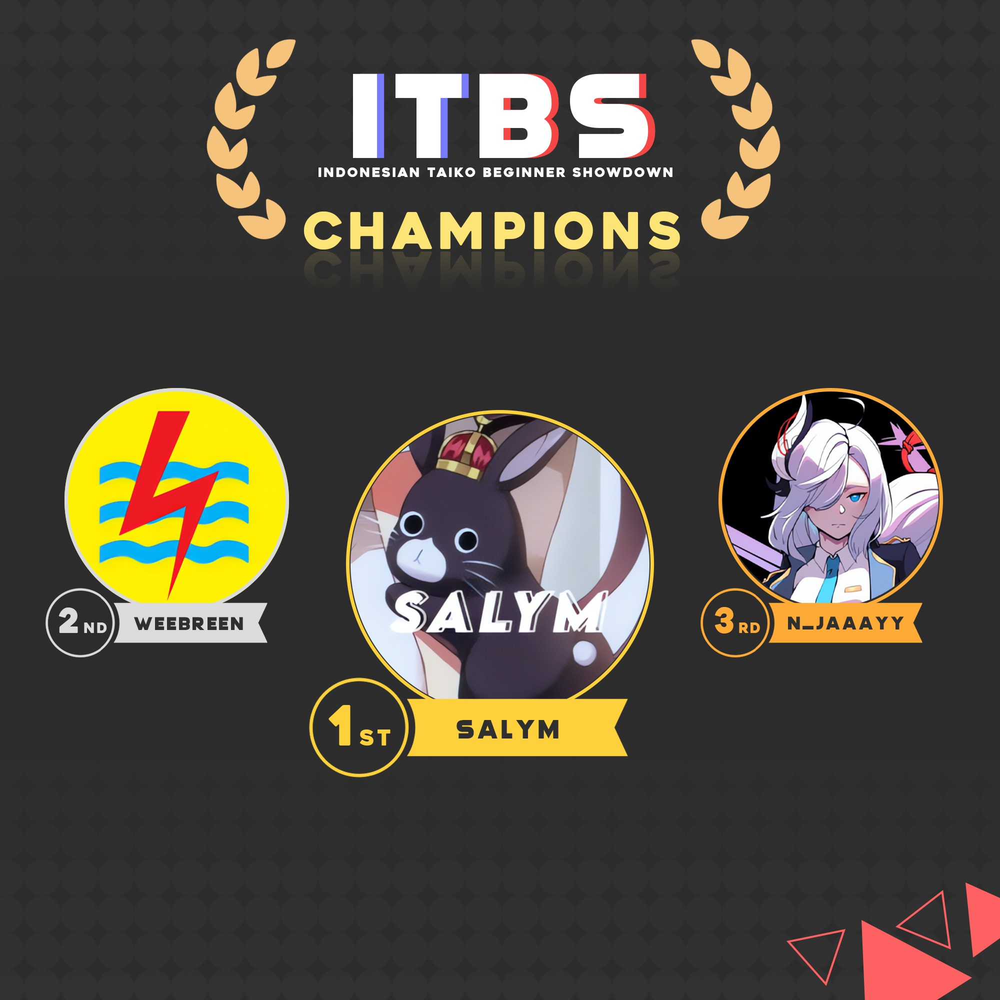

---
tags:
  - ITBS
---

# Indonesian Taiko Beginner Showdown

The **Indonesian Taiko Beginner Showdown** (***ITBS***) was a beginner Indonesian double-elimination 1v1 osu!taiko tournament hosted by ::{ flag=ID }:: [Reen](https://osu.ppy.sh/users/3285139). Indonesian players ranked below #10,000 were able to participate. It was the first instalment of the Indonesian Taiko Beginner Showdown and a part of the Indonesian Taiko Showdown series.

## Tournament schedule

| Event | Timestamp |
| --: | :-- |
| Registration phase | 2022-03-04/2022-03-31 |
| Screening phase | 2022-04-01/2022-04-08 |
| Live drawings | 2022-04-10 (21:30 UTC+7) |
| Qualifiers | 2022-04-16/2022-04-17 |
| Round of 48 | 2022-04-23/2022-04-24 |
| Round of 32 | 2022-04-23/2022-04-24 |
| Round of 16 | 2022-05-07/2022-05-09 |
| Quarterfinals | 2022-05-14/2022-05-15 |
| Semifinals | 2022-05-21/2022-05-22 |
| Finals | 2022-05-28/2022-05-29 |
| Grand Finals | 2022-06-04/2022-06-05 |

## Prizes

| Placing | Prize(s) |
| :-: | :-- |
|  | Unique profile badge, 1 month of osu!supporter, Lenovo Legion M200 mouse |
|  | 1 month of osu!supporter, IDR50,000 |
|  | 1 month of osu!supporter |

Generous donations from ::{ flag=ID }:: [\[R\]](https://osu.ppy.sh/users/3577322), ::{ flag=ID }:: [raynald](https://osu.ppy.sh/users/25094413), ::{ flag=ID }:: [Seshito](https://osu.ppy.sh/users/19820939), and ::{ flag=ID }:: [Zest2822](https://osu.ppy.sh/users/24002878) helped fund some of the prizes.

## Organisation

The Indonesian Taiko Beginner Showdown was run by various community members.

| Position | Member(s) |
| :-- | :-- |
| Organiser | ::{ flag=ID }:: [Reen](https://osu.ppy.sh/users/3285139) |
| Co-organiser | ::{ flag=ID }:: [Naverlyn](https://osu.ppy.sh/users/14324722) |
| Mappool selector | ::{ flag=ID }:: [Alwaysyukaz](https://osu.ppy.sh/users/4999506), ::{ flag=HK }:: [BlackBN](https://osu.ppy.sh/users/6291741), ::{ flag=MY }:: [Jerry](https://osu.ppy.sh/users/605973), ::{ flag=ID }:: [Poii](https://osu.ppy.sh/users/7924938) |
| Mappool tester | ::{ flag=ID }:: [Konami-Kun](https://osu.ppy.sh/users/15931741), ::{ flag=ID }:: [Veltlion](https://osu.ppy.sh/users/10999079), ::{ flag=ID }:: [Zedfish](https://osu.ppy.sh/users/22615825) |
| Referee | ::{ flag=ID }:: [-Foxee-](https://osu.ppy.sh/users/14989473), ::{ flag=ID }:: [Joltzzz](https://osu.ppy.sh/users/15436568), ::{ flag=ID }:: [Konami-Kun](https://osu.ppy.sh/users/15931741), ::{ flag=ID }:: [raynald](https://osu.ppy.sh/users/25094413), ::{ flag=ID }:: [Rei Hakurei](https://osu.ppy.sh/users/704111), ::{ flag=ID }:: [Zedfish](https://osu.ppy.sh/users/22615825) |
| Streamer | ::{ flag=HK }:: [-Storm7-](https://osu.ppy.sh/users/12248285), ::{ flag=DE }:: [Penggwin](https://osu.ppy.sh/users/14050018), ::{ flag=ID }:: [Victim\_Crasher](https://osu.ppy.sh/users/2084869), ::{ flag=ID }:: [wiam103](https://osu.ppy.sh/users/4109839) |
| Commentator | ::{ flag=ID }:: [freezebear](https://osu.ppy.sh/users/1943301), ::{ flag=ID }:: [Konami-Kun](https://osu.ppy.sh/users/15931741), ::{ flag=ID }:: [Lxa](https://osu.ppy.sh/users/20983500), ::{ flag=ID }:: [Mirea](https://osu.ppy.sh/users/8404646), ::{ flag=ID }:: [raynald](https://osu.ppy.sh/users/25094413) |
| Designer | ::{ flag=ID }:: [Poii](https://osu.ppy.sh/users/7924938) |
| Recruiter | ::{ flag=ID }:: [Reed\_405](https://osu.ppy.sh/users/9965069) |
| Statistician | ::{ flag=ID }:: [Reen](https://osu.ppy.sh/users/3285139) |
| Wiki writer | ::{ flag=ID }:: [fajar13k](https://osu.ppy.sh/users/7100002) |

## Links

- [Discussion thread](https://osu.ppy.sh/community/forums/topics/1532990)
- [ITBS Discord server](https://discord.gg/jUDx7hJ7Xv)
- [Livestream](https://www.twitch.tv/idtsosu)
- [Challonge brackets](https://challonge.com/ITBS_2022)
- **[Statistics sheet](https://docs.google.com/spreadsheets/d/1pMDlrWZUSFcjieAa49dpNQ9I-iBFK71aTMr1NKjPkU0/edit?usp=sharing)**

## Participants

| Seed | Members |
| :-- | :-- |
| Top | ::{ flag=ID }:: [salym](https://osu.ppy.sh/users/19089549), ::{ flag=ID }:: [Madoka Ayukawa](https://osu.ppy.sh/users/1595221), ::{ flag=ID }:: [Zarumu](https://osu.ppy.sh/users/18429972), ::{ flag=ID }:: [Aphelion-](https://osu.ppy.sh/users/8370351), ::{ flag=ID }:: [BitDust](https://osu.ppy.sh/users/9573836), ::{ flag=ID }:: [AZKiFanboy](https://osu.ppy.sh/users/5179764), ::{ flag=ID }:: [WeebReen](https://osu.ppy.sh/users/10129901), ::{ flag=ID }:: [Ihram-San](https://osu.ppy.sh/users/9908055) |
| High | ::{ flag=ID }:: [kabukibuki](https://osu.ppy.sh/users/16526343), ::{ flag=ID }:: [hufuhufu](https://osu.ppy.sh/users/3057739), ::{ flag=ID }:: [ThePubliX](https://osu.ppy.sh/users/14856887), ::{ flag=ID }:: [Kazuyo](https://osu.ppy.sh/users/5604201), ::{ flag=ID }:: [Sololiquy](https://osu.ppy.sh/users/4350087), ::{ flag=ID }:: [Kampret](https://osu.ppy.sh/users/8413114), ::{ flag=ID }:: [ProBeater](https://osu.ppy.sh/users/12064598), ::{ flag=ID }:: [zutu](https://osu.ppy.sh/users/11184912) |
| Middle | ::{ flag=ID }:: [Zoont](https://osu.ppy.sh/users/7109269), ::{ flag=ID }:: [dedotikea](https://osu.ppy.sh/users/8805157), ::{ flag=ID }:: [NandoFernandez](https://osu.ppy.sh/users/10614731), ::{ flag=ID }:: [Reihynn](https://osu.ppy.sh/users/16630515), ::{ flag=ID }:: [N\_jaaayy](https://osu.ppy.sh/users/17787564), ::{ flag=ID }:: [Iskandar](https://osu.ppy.sh/users/17564331), ::{ flag=ID }:: [tamafx0](https://osu.ppy.sh/users/19154514), ::{ flag=ID }:: [MikeVT](https://osu.ppy.sh/users/23303599) |
| Low | ::{ flag=ID }:: [Revv-](https://osu.ppy.sh/users/12424909), ::{ flag=ID }:: [epictuz](https://osu.ppy.sh/users/25644402), ::{ flag=ID }:: [-Reuto-](https://osu.ppy.sh/users/10717635), ::{ flag=ID }:: [\[-Elaina-\]](https://osu.ppy.sh/users/12532297), ::{ flag=ID }:: [Dika312](https://osu.ppy.sh/users/741613), ::{ flag=ID }:: [Endless Paradex](https://osu.ppy.sh/users/15455180), ::{ flag=ID }:: [DRMPG](https://osu.ppy.sh/users/11627890), ::{ flag=ID }:: [Rhifa](https://osu.ppy.sh/users/11607008) |
| Unseeded | ::{ flag=ID }:: [SakuyaIz](https://osu.ppy.sh/users/14708166), ::{ flag=ID }:: [Mixuri](https://osu.ppy.sh/users/9153772), ::{ flag=ID }:: [mikey677](https://osu.ppy.sh/users/23806740), ::{ flag=ID }:: [Kinora](https://osu.ppy.sh/users/20571283), ::{ flag=ID }:: [Dapuluous](https://osu.ppy.sh/users/8140944), ::{ flag=ID }:: [-SJ-](https://osu.ppy.sh/users/6971620) |

## Podium

## Mappools

### Grand Finals

**[Download the mappack here! (130 MB)](https://drive.google.com/file/d/1X-RQHz2Bs57n2ZubDAIFXVPiYkWUPG84/view)**

- NoMod
  1. [Astral Trip - Saigetsu (Koko & Satsuki ga Tenkomori's Sagyou Bougai Remix) (\[R\]) \[Muzukashii\]](https://osu.ppy.sh/beatmapsets/1719722#taiko/3608901)
  2. [Armand Maulana - Bawa Daku Pergi (Surono) \[Bersamamu\]](https://osu.ppy.sh/beatmapsets/1546975#taiko/3161514)
  3. [t+pazolite - Garakuta Doll Play (Rei Hakurei) \[EXPERT MUZU\]](https://osu.ppy.sh/beatmapsets/1620023#taiko/3307633)
  4. [sasakure.UK - Senkou no Brionac (Rei Hakurei) \[Danger\]](https://osu.ppy.sh/beatmapsets/1375757#taiko/2843666)
  5. [Morikubo Nono (CV: Takahashi Karin) - ANSWER \~Nono no Monogatari\~ (Rei Hakurei) \[Terasu\]](https://osu.ppy.sh/beatmapsets/1583726#taiko/3234625)
  6. [Project Pop - Metal Vs Dugem (Surono) \[Muzukashii\]](https://osu.ppy.sh/beatmapsets/782776#taiko/2516522)
- Hidden
  1. [Fortuna Regina - Ochiru Kajitsu (Rei Hakurei) \[SOFTENED PRO\]](https://osu.ppy.sh/beatmapsets/1773871#taiko/3632074)
  2. [Aether Realm - One Hollow Word (Cut Ver.) (\[R\]) \[Muzukashii\]](https://osu.ppy.sh/beatmapsets/1552590#taiko/3190104)
  3. [ZUN - A Drunkard's Lemuria (Retro Ver.) (Surono) \[Muzukashii\]](https://osu.ppy.sh/beatmapsets/405801#taiko/881979)
- HardRock
  1. [FELT - Time and again (Surono) \[Muzukashii\]](https://osu.ppy.sh/beatmapsets/772958#taiko/1624756)
  2. [Fractal Dreamers - Whispers from a Distant Star (Alwaysyukaz) \[Muzukashii\]](https://osu.ppy.sh/beatmapsets/1332550#taiko/2760879)
  3. [DJ YOSHITAKA - FLOWER (Rei Hakurei) \[EXPERT MUZU\]](https://osu.ppy.sh/beatmapsets/1005221#taiko/2103815)
- DoubleTime
  1. [Dyako - PEKO PEKO PEKO (neonat) \[Jerry's Muzukashii\]](https://osu.ppy.sh/beatmapsets/1416448#taiko/2918961)
  2. [Mameyudoufu - Wave feat. Aitsuki Nakuru (BlackBN) \[Futsuu\]](https://osu.ppy.sh/beatmapsets/1649954#taiko/3367736)
  3. [Meramipop - Uprising Ideology (Rei Hakurei) \[Malron\]](https://osu.ppy.sh/beatmapsets/1764048#taiko/3610661)
- FreeMod
  1. [BlackY vs. Yooh - MEGATON BLAST (Rei Hakurei) \[EXPERT\]](https://osu.ppy.sh/beatmapsets/1762410#taiko/3607323)
  2. [Camellia feat. Nanahira - Cho\*Cho\*Kou\*Soku\*De\*Mae\*Sai\*Soku!!! Speed\*Star\*Kanade (Surono) \[Muzukashii!!!\]](https://osu.ppy.sh/beatmapsets/610480#taiko/1288997)
  3. [a-TTTempo - Remilia Pose (Hard) (Rei Hakurei) \[Muzukashii\]](https://osu.ppy.sh/beatmapsets/1694935#taiko/3463289)
- Tiebreaker
  1. **[Shibuya Rin, Morikubo Nono, Yamato Aki - Sayonara Andromeda (Rei Hakurei) \[Goodbye\]](https://osu.ppy.sh/beatmapsets/1773872#taiko/3632076)**

### Finals

**[Download the mappack here! (74 MB)](https://drive.google.com/file/d/1ANevBI9WgI9TPHNxxpb6QDCZ9JU0P5S0/view)**

- NoMod
  1. [Hana(Usa) & X-Plorez - Summer time music (Frostmourne) \[lolcubes' Muzukashii\]](https://osu.ppy.sh/beatmapsets/136862#taiko/444227)
  2. [Nhato - Hell's Sun (Jaltzu) \[Muzukashii\]](https://osu.ppy.sh/beatmapsets/1090980#taiko/2280846)
  3. [Tomatsu Haruka, Hikasa Yoko, Amamiya Sora - Eyecatch! Too Much! (Volta) \[JuDa's Muzukashii\]](https://osu.ppy.sh/beatmapsets/554873#taiko/1179364)
  4. [Suou Momoko (CV: Watanabe Keiko) - Rolling Sankaku (Rei Hakurei) \[MOMOKO-MILLION-MIX\]](https://osu.ppy.sh/beatmapsets/1383139#taiko/2857469)
  5. [U.T.D. & Friends - Lesson by DJ (tatatat) \[CHALLENGE\]](https://osu.ppy.sh/beatmapsets/960656#taiko/2011221)
  6. [Katsuro Tajima - Charlie Dash! (Midnaait) \[Futsuu!\]](https://osu.ppy.sh/beatmapsets/1100294#taiko/2298699)
- Hidden
  1. [Petit Rabbit's - Happiness Encore (Tyistiana) \[y0\_'s Muzukashii\]](https://osu.ppy.sh/beatmapsets/914056#taiko/1932055)
  2. [Yooh - Heracles (Ryu Sei) \[Muzukashii\]](https://osu.ppy.sh/beatmapsets/1579979#taiko/3226264)
- HardRock
  1. [Hoshimachi Suisei - comet (komasy) \[muzukashii\]](https://osu.ppy.sh/beatmapsets/1172244#taiko/2445317)
  2. [USAO - Night sky (Mel) \[Nishizumi's Muzukashii\]](https://osu.ppy.sh/beatmapsets/376397#taiko/824089)
- DoubleTime
  1. [TryHardNinja ft. CaptainSparklez - Revenge (Yuzeyun) \[Muzukashii\]](https://osu.ppy.sh/beatmapsets/1091373#taiko/2281619)
  2. [The Quick Brown Fox - The Big Black (Cynplytholowazy) \[WHO'S AFRAID OF SUR'S FUTSUU?\]](https://osu.ppy.sh/beatmapsets/1285888#taiko/2669981)
- FreeMod
  1. [nora2r - B.B.K.K.B.K.K (DanSparce) \[Nishizumi's Muzukashii\]](https://osu.ppy.sh/beatmapsets/326284#taiko/726479)
  2. [Chino (CV: Minase Inori) - Mirai Puzzle (Tyistiana) \[Muzukashii\]](https://osu.ppy.sh/beatmapsets/854972#taiko/1786733)
  3. [IOSYS - Cantik Sanyousei no Itazura Daisensou (Rei Hakurei) \[Muzukashii\]](https://osu.ppy.sh/beatmapsets/1766263#taiko/3615490)
- Tiebreaker
  1. **[Pizuya's Cell x MyonMyon - Romantic Children (Rei Hakurei) \[Muzukashii\]](https://osu.ppy.sh/beatmapsets/1768577#taiko/3620358)**

### Semifinals

**[Download the mappack here! (71 MB)](https://drive.google.com/file/d/15pRQbA2feD6tDv2jZl3lQBSoTWuyJUsJ/view)**

- NoMod
  1. [Mia REGINA - My Sweet Maiden (Nardoxyribonucleic) \[Futsuu\]](https://osu.ppy.sh/beatmapsets/648389#taiko/1379811)
  2. [Gakuen Seikatsu Bu - Friend Shitai (aabc271) \[Muzukashii\]](https://osu.ppy.sh/beatmapsets/333853#taiko/741992)
  3. [ARForest - Prometheus (duski) \[Futsuu\]](https://osu.ppy.sh/beatmapsets/1241026#taiko/2580853)
  4. [B-Side Ft. Kymberley Kennedy - Dope Rider (The Captain Remix) (HashishKabob) \[Muzukashii\]](https://osu.ppy.sh/beatmapsets/175296#taiko/427563)
  5. [TSUNKU - Batting Show Perfect Version (Surono) \[Muzukashii\]](https://osu.ppy.sh/beatmapsets/773713#taiko/1626363)
- Hidden
  1. [Ryu\* feat.Mayumi Morinaga - Din Don Dan (\[R\]) \[Muzukashii\]](https://osu.ppy.sh/beatmapsets/397834#taiko/873743)
  2. [Memme - BSPower Explosion (iceOC) \[Futsuu\]](https://osu.ppy.sh/beatmapsets/1029211#taiko/2152169)
- HardRock
  1. [Machine Girl - Cloud99 (As Above Mix) (Genjuro) \[HiroK's Futsuu\]](https://osu.ppy.sh/beatmapsets/1127497#taiko/2379713)
  2. [Morimori Atsushi - Toono Gensou Monogatari (MRM REMIX) (Charlotte) \[Nardo's Futsuu\]](https://osu.ppy.sh/beatmapsets/812992#taiko/2244449)
- DoubleTime
  1. [Otogibara Era - Momoiro Kataomoi (Rei Hakurei) \[Teal Superchat\]](https://osu.ppy.sh/beatmapsets/1636862#taiko/3340602)
  2. [BEMANI Sound Team "DJ TOTTO feat. MarL" - Seiza ga Koi Shita Shunkan o. (Nekomusya7563) \[Futsuu\]](https://osu.ppy.sh/beatmapsets/1651973#taiko/3374855)
- FreeMod
  1. [YUC'e - PUMP (Capu) \[Futsuu\]](https://osu.ppy.sh/beatmapsets/1014283#taiko/2122781)
  2. [Camellia - Dyscontrolled Galaxy (-Dusk) \[NOVICE\]](https://osu.ppy.sh/beatmapsets/1628718#taiko/3333715)
  3. [cranky - VICTORIA (OnosakiHito) \[Futsuu\]](https://osu.ppy.sh/beatmapsets/1696821#taiko/3466864)
- Tiebreaker
  1. **[Ice - Conclusio Catastropha (Cut Ver.) (Reen) \[Futsuu\]](https://osu.ppy.sh/beatmapsets/1763725#taiko/3610005)**

### Quarterfinals

**[Download the mappack here! (73 MB)](https://drive.google.com/file/d/188oW3VnKCVOPatTl7Z-SNz602pTQkk-D/view)**

- NoMod
  1. [S3RL feat Krystal - R4V3 B0Y (Nishizumi) \[FUT5UU\]](https://osu.ppy.sh/beatmapsets/593010#taiko/1255313)
  2. [Chimame-tai - Poppin Jump (TV Size) (Smallwu) \[Muzukashii\]](https://osu.ppy.sh/beatmapsets/757027#taiko/1749978)
  3. [Thaehan - Leprechaun (teaMblack19) \[xfrac's Futsuu\]](https://osu.ppy.sh/beatmapsets/609290#taiko/1329529)
  4. [BlackY - Nobodyknows Eden (namaniku) \[Futsuu\]](https://osu.ppy.sh/beatmapsets/768440#taiko/1769627)
  5. [Sweetches - Sweet Witches' Night (Rei Hakurei) \[WITCH -REGULAR-\]](https://osu.ppy.sh/beatmapsets/1746781#taiko/3573014)
- Hidden
  1. [Nekomata Master - Sennen no Kotowari (Volta) \[Futsuu\]](https://osu.ppy.sh/beatmapsets/833644#taiko/1751088)
  2. [Roselia - Ringing Bloom (Dellvangel) \[Futsuu\]](https://osu.ppy.sh/beatmapsets/934410#taiko/1953936)
- HardRock
  1. [kanone - CO5M1C R4ILR0AD (pwhk) \[Futsuu\]](https://osu.ppy.sh/beatmapsets/1500080#taiko/3074078)
  2. [Seiryu - Critical Crystal (Sayaka-) \[Futsuu\]](https://osu.ppy.sh/beatmapsets/138311#taiko/345480)
- DoubleTime
  1. [ginkiha - VALKYRIE (-Tenshi-) \[Futsuu\]](https://osu.ppy.sh/beatmapsets/334818#taiko/747085)
  2. [Satsuki ga Tenkomori - Netoge Haijin Sprechchor (aabc271) \[Kantan\]](https://osu.ppy.sh/beatmapsets/83349#taiko/230216)
- FreeMod
  1. [Chino (CV: Minase Inori) - Shinsaku no Shiawase wa Kochira! (komasy) \[Futsuu\]](https://osu.ppy.sh/beatmapsets/899120#taiko/1878215)
  2. [Sasaki Sayaka - Love's Oracle (\[R\]) \[Futsuu\]](https://osu.ppy.sh/beatmapsets/1363594#taiko/2822107)
  3. [ARM (IOSYS) feat. Nicole Curry - Come to Life (Nofool) \[Futsuu\]](https://osu.ppy.sh/beatmapsets/642762#taiko/1363509)
- Tiebreaker
  1. **[Project Pop - Bukan Superstar (\[R\]) \[Muzukashii\]](https://osu.ppy.sh/beatmapsets/1759929#taiko/3602013)**

### Round of 16

**[Download the mappack here! (45 MB)](https://drive.google.com/file/d/1QC1MMKfQyomrK68KwaY5SjEr4-uCFhv-/view)**

- NoMod
  1. [Yunomi - Wakusei Rabbit (feat. TORIENA) (Franklin\_DeJavu) \[Futsuu\]](https://osu.ppy.sh/beatmapsets/639535#taiko/1357108)
  2. [Hatsuki Yura - Yoiyami Hanabi (Cut Ver.) (Rei Hakurei) \[Ura Futsuu\]](https://osu.ppy.sh/beatmapsets/1752848#taiko/3587092)
  3. [OISHII - PIZZA PLAZA (Volta) \[FUTSUU\]](https://osu.ppy.sh/beatmapsets/663500#taiko/1404598)
  4. [IKIMONOGAKARI - Blue Bird feat. k\*chan \[ dj-Jo Remix \] TV Size (Chromoxx) \[Futsuu\]](https://osu.ppy.sh/beatmapsets/1114337#taiko/2347933)
- Hidden
  1. [a-TTTempo - Flandre March (Rei Hakurei) \[Pair\]](https://osu.ppy.sh/beatmapsets/89094#taiko/242445)
  2. [CHiCO with HoneyWorks - Pride Kakumei (-Sh1n1-) \[Hanjamon's Futsuu\]](https://osu.ppy.sh/beatmapsets/554568#taiko/1180723)
- HardRock
  1. [Ayana Taketatsu - Hey! Calorie Queen (Etsu) \[Futsuu\]](https://osu.ppy.sh/beatmapsets/459442#taiko/984707)
  2. [Utagumi Setsugetsuka - Maware! Setsugetsuka (you Remix) (komasy) \[23-'s Futsuu\]](https://osu.ppy.sh/beatmapsets/697523#taiko/1479086)
- DoubleTime
  1. [Hiiragi Mayuki(CV:Ogura Yui)/Hagino Chiaki(CV:Toujou Hisako) - Shiawase Iro (Alwaysyukaz) \[Ron's Futsuu\]](https://osu.ppy.sh/beatmapsets/677899#taiko/1433527)
  2. [Warak - REANIMATE (puxtu) \[Ayyri's Kantan\]](https://osu.ppy.sh/beatmapsets/411866#taiko/1046150)
- FreeMod
  1. [Cartoon - Whatever I Do (feat. Kostja) (Skull Kid) \[Futsuu\]](https://osu.ppy.sh/beatmapsets/555196#taiko/1658257)
  2. [Hoshino Gen - Doraemon (\_Rise) \[Futsuu\]](https://osu.ppy.sh/beatmapsets/1050049#taiko/2194497)
- Tiebreaker
  1. **[ClariS - Luminous (JUDYDANNY) \[Futsuu\]](https://osu.ppy.sh/beatmapsets/540539#taiko/1146209)**

### Round of 48

*Note: This mappool was used for both Round of 48 and Round of 32.*

**[Download the mappack here! (50 MB)](https://drive.google.com/file/d/1IGePywcwkYsifV16PI4Im54tQ_cr7Knp/view)**

- NoMod
  1. [KEiNA - Karen Setsugetsuka (Artethia & Epsilon Remix) (yassu-) \[Kantan\]](https://osu.ppy.sh/beatmapsets/953713#taiko/2005569)
  2. [Codama Saori - Mikansei Stride (TV Size) (gaston\_2199) \[Kantan\]](https://osu.ppy.sh/beatmapsets/757379#taiko/1593307)
  3. [Nekomata L.E.D.Master+ - Chrono Diver -PENDULUMs- (L y s) \[Kantan\]](https://osu.ppy.sh/beatmapsets/812548#taiko/1704323)
  4. [METAROOM - SPIKEY BOI (Nifty) \[Kantan\]](https://osu.ppy.sh/beatmapsets/1424830#taiko/2978840)
- Hidden
  1. [Camellia - Sayonara Heaven (Camellia's NEKOMATAelectroRMX) (\_DUSK\_) \[Kantan\]](https://osu.ppy.sh/beatmapsets/964453#taiko/2027843)
  2. [3 Nen E Gumi Utatan - Bye Bye YESTERDAY (TV Size) (Stefan) \[Kantan\]](https://osu.ppy.sh/beatmapsets/1174748#taiko/2450283)
- HardRock
  1. [Ello - Masih Ada (Cut Ver.) (Rei Hakurei) \[Masih Belajar Taiko\]](https://osu.ppy.sh/beatmapsets/1728123#taiko/3531410)
  2. [BanYa - Rolling Christmas (Sped Up) (_Arsen) \[Kantan\]](https://osu.ppy.sh/beatmapsets/1345759#taiko/2786989)
- FreeMod
  1. [Sota Fujimori - polygon (Fallmorph) \[Futsuu\]](https://osu.ppy.sh/beatmapsets/721297#taiko/1523542)
  2. [Chito (CV: Minase Inori), Yuuri (CV: Kubo Yurika) - More One Night (Assertive Hardcore Bootleg) \[short ver.\] (Tofu1222) \[Ron's Kantan\]](https://osu.ppy.sh/beatmapsets/741790#taiko/1575179)
- Tiebreaker
  1. **[inabakumori - Lagtrain (Horiiizon) \[Futsuu\]](https://osu.ppy.sh/beatmapsets/1406580#taiko/2920461)**

### Qualifiers

**[Download the mappack here! (23 MB)](https://drive.google.com/file/d/1eLzq5peV2ESiZZUc30UO1zxLZ10fTyH7/view)**

- NoMod
  1. [Fractal Dreamers - Fortuna Redux (Nifty) \[Futsuu\]](https://osu.ppy.sh/beatmapsets/707824#taiko/1496608)
  2. [solfa feat.Ceui - Koiiro Recipe (JUDYDANNY) \[Futsuu\]](https://osu.ppy.sh/beatmapsets/649221#taiko/1378405)
- Hidden
  1. [Hakobe Naru(CV:M.A.O) - Nekomatsuri (komasy) \[Futsuu\]](https://osu.ppy.sh/beatmapsets/659442#taiko/1397363)
- HardRock
  1. [ensou feat. GUMI - COMA (Grimbow) \[Futsuu\]](https://osu.ppy.sh/beatmapsets/201546#taiko/477168)
- DoubleTime
  1. [HALFBY - Rodeo Machine (Rei Hakurei) \[Kuda Poni\]](https://osu.ppy.sh/beatmapsets/1738381#taiko/3553059)

## Match results

### Grand Finals

Saturday, 4 June 2022:

| Player 1 |  |  | Player 2 | Match link |
| --: | :-: | :-: | :-- | :-- |
| **WeebReen** ::{ flag=ID }:: | **7** | 2 | ::{ flag=ID }:: N\_jaaayy | [#1](https://osu.ppy.sh/community/matches/101175653) |

Sunday, 5 June 2022:

| Player 1 |  |  | Player 2 | Match link |
| --: | :-: | :-: | :-- | :-- |
| salym ::{ flag=ID }:: | 4 | **7** | ::{ flag=ID }:: **WeebReen** | [#1](https://osu.ppy.sh/community/matches/101212063) |
| **WeebReen** ::{ flag=ID }:: | 5 | **7** | ::{ flag=ID }:: **salym** | [#1](https://osu.ppy.sh/community/matches/101214630) |

### Finals

Saturday, 28 May 2022:

| Player 1 |  |  | Player 2 | Match link |
| --: | :-: | :-: | :-- | :-- |
| **salym** ::{ flag=ID }:: | **6** | 3 | ::{ flag=ID }:: WeebReen | [#1](https://osu.ppy.sh/community/matches/100981928), [#2](https://osu.ppy.sh/community/matches/100986115) |
| **N\_jaaayy** ::{ flag=ID }:: | **6** | 2 | ::{ flag=ID }:: BitDust | [#1](https://osu.ppy.sh/community/matches/100984261) |

Sunday, 29 May 2022:

| Player 1 |  |  | Player 2 | Match link |
| --: | :-: | :-: | :-- | :-- |
| Kampret ::{ flag=ID }:: | 1 | **6** | ::{ flag=ID }:: **Ihram-San** | [#1](https://osu.ppy.sh/community/matches/101014643) |
| **N\_jaaayy** ::{ flag=ID }:: | **6** | 1 | ::{ flag=ID }:: Ihram-San | [#1](https://osu.ppy.sh/community/matches/101018538) |

### Semifinals

Saturday, 21 May 2022:

| Player 1 |  |  | Player 2 | Match link |
| --: | :-: | :-: | :-- | :-- |
| Iskandar ::{ flag=ID }:: | -1 | **0** | ::{ flag=ID }:: **zutu** | *win by default* |
| **Aphelion-** ::{ flag=ID }:: | **5** | 0 | ::{ flag=ID }:: dedotikea | [#1](https://osu.ppy.sh/community/matches/100788098) |
| **Ihram-San** ::{ flag=ID }:: | **5** | 0 | ::{ flag=ID }:: AZKiFanboy | [#1](https://osu.ppy.sh/community/matches/100790796) |
| **salym** ::{ flag=ID }:: | **5** | 4 | ::{ flag=ID }:: N\_jaaayy | [#1](https://osu.ppy.sh/community/matches/100792442) |

Sunday, 22 May 2022:

| Player 1 |  |  | Player 2 | Match link |
| --: | :-: | :-: | :-- | :-- |
| Madoka Ayukawa ::{ flag=ID }:: | -1 | **0** | ::{ flag=ID }:: **BitDust** | *win by default* |
| **Ihram-San** ::{ flag=ID }:: | **5** | 4 | ::{ flag=ID }:: Aphelion- | [#1](https://osu.ppy.sh/community/matches/100820674) |
| **WeebReen** ::{ flag=ID }:: | **5** | 1 | ::{ flag=ID }:: Kampret | [#1](https://osu.ppy.sh/community/matches/100823344) |
| **BitDust** ::{ flag=ID }:: | **5** | 0 | ::{ flag=ID }:: zutu | [#1](https://osu.ppy.sh/community/matches/100825634) |

### Quarterfinals

Saturday, 14 May 2022:

| Player 1 |  |  | Player 2 | Match link |
| --: | :-: | :-: | :-- | :-- |
| **AZKiFanboy** ::{ flag=ID }:: | **5** | 0 | ::{ flag=ID }:: DRMPG | [#1](https://osu.ppy.sh/community/matches/100596459) |
| **Zarumu** ::{ flag=ID }:: | **0** | -1 | ::{ flag=ID }:: Kinora | *win by default* |
| **hufuhufu** ::{ flag=ID }:: | **0** | -1 | ::{ flag=ID }:: Revv- | *win by default* |
| Sololiquy ::{ flag=ID }:: | -1 | **0** | ::{ flag=ID }:: **Endless Paradex** | *win by default* |
| **dedotikea** ::{ flag=ID }:: | **5** | 0 | ::{ flag=ID }:: SakuyaIz | [#1](https://osu.ppy.sh/community/matches/100603897) |
| **BitDust** ::{ flag=ID }:: | **0** | -1 | ::{ flag=ID }:: -Reuto- | *win by default* |

Sunday, 15 May 2022:

| Player 1 |  |  | Player 2 | Match link |
| --: | :-: | :-: | :-- | :-- |
| MikeVT ::{ flag=ID }:: | 1 | **5** | ::{ flag=ID }:: **epictuz** | [#1](https://osu.ppy.sh/community/matches/100627437) |
| **salym** ::{ flag=ID }:: | **5** | 4 | ::{ flag=ID }:: Ihram-San | [#1](https://osu.ppy.sh/community/matches/100629491) |
| **zutu** ::{ flag=ID }:: | **5** | 0 | ::{ flag=ID }:: Mixuri | [#1](https://osu.ppy.sh/community/matches/100630526) |
| hufuhufu ::{ flag=ID }:: | 4 | **5** | ::{ flag=ID }:: **dedotikea** | [#1](https://osu.ppy.sh/community/matches/100632327) |
| **BitDust** ::{ flag=ID }:: | **5** | 0 | ::{ flag=ID }:: Endless Paradex | [#1](https://osu.ppy.sh/community/matches/100635162) |
| **Kampret** ::{ flag=ID }:: | **0** | -1 | ::{ flag=ID }:: Iskandar | *win by default* |
| **AZKiFanboy** ::{ flag=ID }:: | **5** | 1 | ::{ flag=ID }:: Zarumu | [#1](https://osu.ppy.sh/community/matches/100636816) |
| Aphelion- ::{ flag=ID }:: | 1 | **5** | ::{ flag=ID }:: **N\_jaaayy** | [#1](https://osu.ppy.sh/community/matches/100636904) |
| epictuz ::{ flag=ID }:: | 4 | **5** | ::{ flag=ID }:: **zutu** | [#1](https://osu.ppy.sh/community/matches/100640996) |
| Madoka Ayukawa ::{ flag=ID }:: | -1 | **0** | ::{ flag=ID }:: **WeebReen** | *win by default* |

### Round of 16

Saturday, 7 May 2022:

| Player 1 |  |  | Player 2 | Match link |
| --: | :-: | :-: | :-- | :-- |
| **salym** ::{ flag=ID }:: | **4** | 0 | ::{ flag=ID }:: zutu | [#1](https://osu.ppy.sh/community/matches/100407799) |
| **kabukibuki** ::{ flag=ID }:: | **0** | -1 | ::{ flag=ID }:: mikey677 | *win by default* |
| tamafx0 ::{ flag=ID }:: | -1 | **0** | ::{ flag=ID }:: **Dika312** | *win by default* |
| Zoont ::{ flag=ID }:: | -1 | **0** | ::{ flag=ID }:: **-SJ-** | *win by default* |
| **WeebReen** ::{ flag=ID }:: | **4** | 1 | ::{ flag=ID }:: hufuhufu | [#1](https://osu.ppy.sh/community/matches/100411308) |
| Kazuyo ::{ flag=ID }:: | -1 | **0** | ::{ flag=ID }:: **DRMPG** | *win by default* |
| **ProBeater** ::{ flag=ID }:: | **0** | -1 | ::{ flag=ID }:: \[-Elaina-\] | *win by default* |
| **ThePubliX** ::{ flag=ID }:: | **0** | -1 | ::{ flag=ID }:: Rhifa | *win by default* |
| BitDust ::{ flag=ID }:: | 0 | **4** | ::{ flag=ID }:: **N\_jaaayy** | [#1](https://osu.ppy.sh/community/matches/100415861) |
| Zarumu ::{ flag=ID }:: | 0 | **4** | ::{ flag=ID }:: **Kampret** | [#1](https://osu.ppy.sh/community/matches/100416678) |
| NandoFernandex ::{ flag=ID }:: | -1 | **0** | ::{ flag=ID }:: **Endless Paradex** | *win by default* |

Sunday, 8 May 2022:

| Player 1 |  |  | Player 2 | Match link |
| --: | :-: | :-: | :-- | :-- |
| **Madoka Ayukawa** ::{ flag=ID }:: | **4** | 1 | ::{ flag=ID }:: dedotikea | [#1](https://osu.ppy.sh/community/matches/100439811) |
| **SakuyaIz** ::{ flag=ID }:: | **0** | -1 | ::{ flag=ID }:: -SJ- | *win by default* |
| **Mixuri** ::{ flag=ID }:: | **0** | -1 | ::{ flag=ID }:: ProBeater | *win by default* |
| AZKiFanboy ::{ flag=ID }:: | -1 | **0** | ::{ flag=ID }:: **Iskandar** | *win by default* |
| Reihynn ::{ flag=ID }:: | -1 | **0** | ::{ flag=ID }:: **Kinora** | *win by default* |
| **Revv-** ::{ flag=ID }:: | **0** | -1 | ::{ flag=ID }:: kabukibuki | *win by default* |
| **-Reuto-** ::{ flag=ID }:: | **0** | -1 | ::{ flag=ID }:: ThePubliX | *win by default* |
| Dapuluous ::{ flag=ID }:: | 1 | **4** | ::{ flag=ID }:: **DRMPG** | [#1](https://osu.ppy.sh/community/matches/100449083) |
| **Ihram-San** ::{ flag=ID }:: | **0** | -1 | ::{ flag=ID }:: MikeVT | *win by default* |
| **Aphelion-** ::{ flag=ID }:: | **4** | 0 | ::{ flag=ID }:: Sololiquy | [#1](https://osu.ppy.sh/community/matches/100449762) |

Monday, 9 May 2022:

| Player 1 |  |  | Player 2 | Match link |
| --: | :-: | :-: | :-- | :-- |
| **epictuz** ::{ flag=ID }:: | **4** | 2 | ::{ flag=ID }:: Dika312 | [#1](https://osu.ppy.sh/community/matches/100468846) |

### Round of 32

Saturday, 23 April 2022:

| Player 1 |  |  | Player 2 | Match link |
| --: | :-: | :-: | :-- | :-- |
| **zutu** ::{ flag=ID }:: | **4** | 2 | ::{ flag=ID }:: Zoont | [#1](https://osu.ppy.sh/community/matches/99988234) |
| **WeebReen** ::{ flag=ID }:: | **4** | 0 | ::{ flag=ID }:: epictuz | [#1](https://osu.ppy.sh/community/matches/100013559) |
| **hufuhufu** ::{ flag=ID }:: | **4** | 2 | ::{ flag=ID }:: tamafx0 | [#1](https://osu.ppy.sh/community/matches/100014370) |
| kabukibuki ::{ flag=ID }:: | 3 | **4** | ::{ flag=ID }:: **MikeVT** | [#1](https://osu.ppy.sh/community/matches/100016352) |
| ProBeater ::{ flag=ID }:: | 1 | **4** | ::{ flag=ID }:: **dedotikea** | [#1](https://osu.ppy.sh/community/matches/100023113) |
| ThePubliX ::{ flag=ID }:: | 3 | **4** | ::{ flag=ID }:: **Iskandar** | [#1](https://osu.ppy.sh/community/matches/100023793) |
| Kazuyo ::{ flag=ID }:: | 1 | **4** | ::{ flag=ID }:: **N\_jaaayy** | [#1](https://osu.ppy.sh/community/matches/100024710) |

Sunday, 24 April 2022:

| Player 1 |  |  | Player 2 | Match link |
| --: | :-: | :-: | :-- | :-- |
| **Kampret** ::{ flag=ID }:: | **4** | 1 | ::{ flag=ID }:: NandoFernandez | [#1](https://osu.ppy.sh/community/matches/100048372) |
| **Ihram-San** ::{ flag=ID }:: | **4** | 1 | ::{ flag=ID }:: Revv- | [#1](https://osu.ppy.sh/community/matches/100048315) |
| **Madoka Ayukawa** ::{ flag=ID }:: | **4** | 0 | ::{ flag=ID }:: Mixuri | [#1](https://osu.ppy.sh/community/matches/100057960) |
| **BitDust** ::{ flag=ID }:: | **0** | -1 | ::{ flag=ID }:: Depuluous | *win by default* |
| **AZKiFanboy** ::{ flag=ID }:: | **4** | 1 | ::{ flag=ID }:: -Reuto- | [#1](https://osu.ppy.sh/community/matches/100059295) |
| **Sololiquy** ::{ flag=ID }:: | **0** | -1 | ::{ flag=ID }:: Reihynn | *win by default* |
| **salym** ::{ flag=ID }:: | **4** | 0 | ::{ flag=ID }:: SakuyaIz | [#1](https://osu.ppy.sh/community/matches/100060448) |
| **Zarumu** ::{ flag=ID }:: | **4** | 2 | ::{ flag=ID }:: Endless Paradex | [#1](https://osu.ppy.sh/community/matches/100061031) |
| **Aphelion-** ::{ flag=ID }:: | **4** | 1 | ::{ flag=ID }:: Kinora | [#1](https://osu.ppy.sh/community/matches/100062146) |

### Round of 48

Saturday, 23 April 2022:

| Player 1 |  |  | Player 2 | Match link |
| --: | :-: | :-: | :-- | :-- |
| **Endless Paradox** ::{ flag=ID }:: | **0** | -1 | ::{ flag=ID }:: mikey677 | *win by default* |
| Dika312 ::{ flag=ID }:: | 2 | **4** | ::{ flag=ID }:: **Kinora** | [#1](https://osu.ppy.sh/community/matches/100017272) |
| **-Reuto-** ::{ flag=ID }:: | **0** | -1 | ::{ flag=ID }:: -SJ- | *win by default* |

Sunday, 24 April 2022:

| Player 1 |  |  | Player 2 | Match link |
| --: | :-: | :-: | :-- | :-- |
| \[-Elaina-\] ::{ flag=ID }:: | 1 | **4** | ::{ flag=ID }:: **Dapuluous** | [#1](https://osu.ppy.sh/community/matches/100048329) |
| DRMPG ::{ flag=ID }:: | 1 | **4** | ::{ flag=ID }:: **Mixuri** | [#1](https://osu.ppy.sh/community/matches/100049781) |
| Rhifa ::{ flag=ID }:: | 1 | **4** | ::{ flag=ID }:: **SakuyaIz** | [#1](https://osu.ppy.sh/community/matches/100051672) |

### Qualifiers

Detailed statistics for this round can be found [here](https://docs.google.com/spreadsheets/d/1pMDlrWZUSFcjieAa49dpNQ9I-iBFK71aTMr1NKjPkU0/edit?usp=sharing) alongside the final standings on which players made it through to the next stage.

## Ruleset

### General rules

1. Indonesian Taiko Beginner Showdown will use double-elimination bracket, which means that there will be a loser's bracket.
2. Any player with Indonesian flag can participate in the tournament.
3. Player's account must be at least 3 months old since their osu! registration and have at least 500 playcount.
4. In order to participate, players need to be placed #10,000 or below on the osu!taiko global ranking.
5. Players are not allowed to rank up further than #9,000 during the tournament. Passing this limit will result in disqualification.
6. Players must not have violated the [osu! community rules](/wiki/Rules) within the last 12 months.
7. Joining the tournament's [Discord server](https://discord.gg/jUDx7hJ7Xv) is mandatory to be counted as a player.
8. Even in a tournament scene osu! is still a game. Please respect each other to everyone, be friendly, and fair play.

### Match regulations

1. Players will do `!roll` at the start of the match to determine the order of who picks and bann first. Player with higher roll will **pick first and band second** and player with lower roll will **bann first and pick second**.
2. The Score System used will be **Score V2**.
3. Players are allowed to submit **one warmup** but it must be below **4 minutes**.
4. Failed scores will count.
5. Qualifiers will have different mappool format with only 2 NoMod maps, 1 Hidden map, 1 HardRock map, and 1 DoubleTime map with no map ban applied.
6. For the remaining of the knockout stage, mappool size and its ban rules will be as follows:
   - Round of 48 and Round of 32: 4 NoMod maps, 2 Hidden maps, 2 HardRock maps, 2 FreeMod maps, and 1 Tiebreaker with 1 ban per player
   - Round of 16: 4 NoMod maps, 2 Hidden maps, 2 HardRock maps, 2 DoubleTime, 2 FreeMod maps, and 1 Tiebreaker with 1 ban per player
   - Quarterfinals: 5 NoMod maps, 2 Hidden maps, 2 HardRock maps, 2 DoubleTime, 3 FreeMod maps, and 1 Tiebreaker with 2 ban per player
   - Semifinals: 5 NoMod maps, 2 Hidden maps, 2 HardRock maps, 2 DoubleTime, 3 FreeMod maps, and 1 Tiebreaker with 2 ban per player
   - Finals: 6 NoMod maps, 2 Hidden maps, 2 HardRock maps, 2 DoubleTime, 3 FreeMod maps, and 1 Tiebreaker with 2 ban per player
   - Grand Finals: 6 NoMod maps, 3 Hidden maps, 3 HardRock maps, 3 DoubleTime, 3 FreeMod maps, and 1 Tiebreaker with 2 ban per player
7. Players cannot ban from the same mod pool when the 2 ban rule is applied (e.g. Banning 2 NoMod maps in that same match).
8. If player can't attend within the span of **15 minutes**, the other player will win by default.
9. If both players have the same score during the match, the map will be replayed, then if it happened again the map will be ban for one temporary pick and other map will be picked instead.
10. In case when both players are failing the map, the player with higher score will get the point instead.
11. A player may suggest using NightCore mod instead of DoubleTime with the approval from the other player.
12. The FreeMod pool is played with FreeMod activated. Every player may pick a combination of Hidden and HardRock.
13. In case of a tie in points (example: 4-4 in BO9) the tiebreaker is selected.
14. The tiebreaker is played under FreeMod conditions, but it is not necessary to have a mod activated.

### Winning conditions

1. Round of 48, Round of 32, and Round of 16: Best-of-7 (first to 4 points)
2. Quarterfinals and Semifinals: Best-of-9 (first to 5 points)
3. Finals: Best-of-11 (first to 6 points)
4. Grand Finals: Best-of-13 (first to 7 points)
