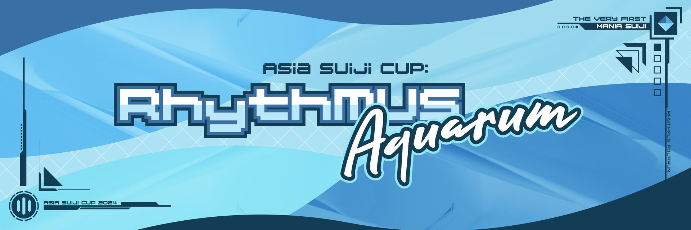
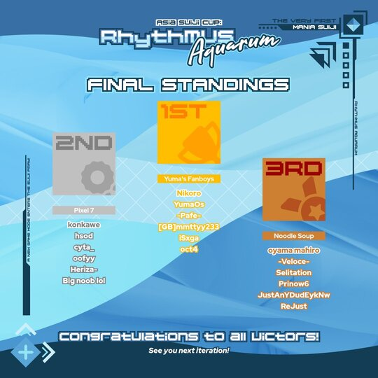
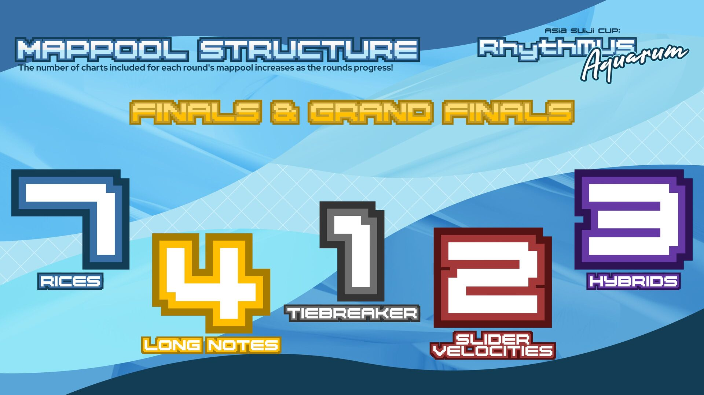
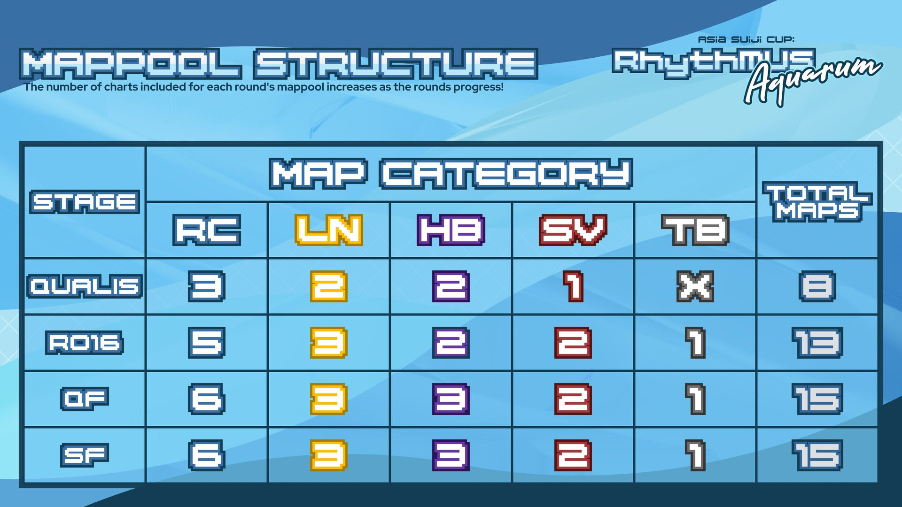

---
tags:
  - ASC
---

# Asia Suiji Cup: Rhythmus Aquarum

> Let the rhythm of the waters decide your fortunes.

The **Asia Suiji Cup: Rhythmus Aquarum** (***ASC***) was a three-on-three asian countries restricted double-elimination osu!mania 4-key tournament hosted by ::{ flag=MY }:: [ERA Leon](https://osu.ppy.sh/users/13382147) and ::{ flag=VN }:: [MashedPotato](https://osu.ppy.sh/users/10494860). Each participant registered individually and was assigned to a random team. It was the first instalment of the Asia Suiji Cup, a successor, and inspired by the [Asian's Campionships](/wiki/Tournaments/o!mAC) and [SEA Champion](/wiki/Tournaments/SEAC) series.

## Tournament schedule

| Event | Timestamp |
| --: | :-- |
| Staff registration phase | 2024-05-11/2024-06-14 |
| Player registration phase | 2024-05-25/2024-06-14 |
| Screening phase | 2024-06-15/2024-06-29 |
| Team drawings | 2024-06-30 |
| Qualifiers | 2024-07-13/2024-07-14 |
| Round of 16 | 2024-07-20/2024-07-21 |
| Quarterfinals | 2024-07-27/2024-07-28 |
| Semifinals | 2024-08-02/2024-08-04 |
| Finals | 2024-08-10/2024-08-11 |
| Grand Finals | 2024-08-24/2024-08-25 |

## Prizes

| Placing | Prize(s) |
| :-: | :-- |
|  | Unique profile badge, 6 months of osu!supporter tag, user profile banner |
|  | 4 months of osu!supporter tag, user profile banner |
|  | 2 months of osu!supporter tag, user profile banner |

Second place's osu!supporter tag was provided by ::{ flag=GB }:: [IncognitoMercy](https://osu.ppy.sh/users/12838922).

## Organisation

The Asia Suiji Cup: Rhythmus Aquarum was run by various community members.

| Position | Member(s) |
| :-- | :-- |
| Organiser | ::{ flag=MY }:: [ERA Leon](https://osu.ppy.sh/users/13382147), ::{ flag=VN }:: [MashedPotato](https://osu.ppy.sh/users/10494860) |
| Consultant | ::{ flag=CA }:: [Shizunaa](https://osu.ppy.sh/users/7352655) |
| Head mappooler | ::{ flag=KR }:: [\[GB\]SuddenDeath](https://osu.ppy.sh/users/6699923), ::{ flag=MY }:: [ERA Leon](https://osu.ppy.sh/users/13382147) |
| Mappool playtester | ::{ flag=ID }:: [-Yubi-](https://osu.ppy.sh/users/17851478), ::{ flag=GB }:: [\[Crz\]Envy](https://osu.ppy.sh/users/11817815), ::{ flag=ID }:: [Aikiyo Fuuka](https://osu.ppy.sh/users/5179764), ::{ flag=SG }:: [awdse22](https://osu.ppy.sh/users/8743513), ::{ flag=US }:: [EpsilonMaiagare](https://osu.ppy.sh/users/3855052), ::{ flag=ES }:: [ERA Guldakh](https://osu.ppy.sh/users/8553078), ::{ flag=US }:: [ERA Imperial](https://osu.ppy.sh/users/5066305), ::{ flag=CZ }:: [grillroasted](https://osu.ppy.sh/users/18271627), ::{ flag=TH }:: [ItzScep](https://osu.ppy.sh/users/18456257), ::{ flag=CA }:: [Robert6400](https://osu.ppy.sh/users/11467559), ::{ flag=NL }:: [Shoira](https://osu.ppy.sh/users/13377652) |
| Rice specialised mapper | ::{ flag=JP }:: [\[GS\]hina](https://osu.ppy.sh/users/20040607), ::{ flag=ID }:: [Ainer](https://osu.ppy.sh/users/13371424), ::{ flag=BR }:: [AutotelicBrown](https://osu.ppy.sh/users/4238941), ::{ flag=PL }:: [Eclipse-](https://osu.ppy.sh/users/8493070), ::{ flag=US }:: [ERA Imperial](https://osu.ppy.sh/users/5066305), ::{ flag=MY }:: [ERA Leon](https://osu.ppy.sh/users/13382147), ::{ flag=ID }:: [FerdiXIA-](https://osu.ppy.sh/users/9030389), ::{ flag=CN }:: [Hylotl](https://osu.ppy.sh/users/18270260), ::{ flag=TH }:: [ItzScep](https://osu.ppy.sh/users/18456257), ::{ flag=ID }:: [Revv-](https://osu.ppy.sh/users/12424909), ::{ flag=ES }:: [Ska](https://osu.ppy.sh/users/10313023), ::{ flag=SG }:: [TheFunk](https://osu.ppy.sh/users/13981991), ::{ flag=CN }:: [YuEast2018](https://osu.ppy.sh/users/13953619), ::{ flag=KR }:: [Zia](https://osu.ppy.sh/users/7979303) |
| Long Notes specialised mapper | ::{ flag=ID }:: [\[Crz\]Crysarlene](https://osu.ppy.sh/users/5492871), ::{ flag=TW }:: [\[Crz\]FolAH1217](https://osu.ppy.sh/users/6232458), ::{ flag=AU }:: [anatharax](https://osu.ppy.sh/users/14390680), ::{ flag=US }:: [ERA Imperial](https://osu.ppy.sh/users/5066305), ::{ flag=MY }:: [ERA Leon](https://osu.ppy.sh/users/13382147), ::{ flag=ID }:: [FelixSpade](https://osu.ppy.sh/users/2651304), ::{ flag=US }:: [Logan636](https://osu.ppy.sh/users/9423766), ::{ flag=TH }:: [MyZterioN-](https://osu.ppy.sh/users/8521723), ::{ flag=US }:: [Toaph Daddy](https://osu.ppy.sh/users/7616811), ::{ flag=HK }:: [Yana Feiya](https://osu.ppy.sh/users/7802517), ::{ flag=CN }:: [YuEast2018](https://osu.ppy.sh/users/13953619) |
| Hybrid specialised mapper | ::{ flag=TW }:: [\[Crz\]FolAH1217](https://osu.ppy.sh/users/6232458), ::{ flag=IT }:: [\[GB\]Rick](https://osu.ppy.sh/users/25263357), ::{ flag=CN }:: [AelSan](https://osu.ppy.sh/users/14095291), ::{ flag=CN }:: [AlexDunk](https://osu.ppy.sh/users/9194799), ::{ flag=CN }:: [Blue\_Potion](https://osu.ppy.sh/users/13094831), ::{ flag=US }:: [chxu](https://osu.ppy.sh/users/13712190), ::{ flag=MY }:: [Critical\_Star](https://osu.ppy.sh/users/3793196), ::{ flag=US }:: [ERA Imperial](https://osu.ppy.sh/users/5066305), ::{ flag=MY }:: [ERA Leon](https://osu.ppy.sh/users/13382147), ::{ flag=SG }:: [Japeynius](https://osu.ppy.sh/users/13993659), ::{ flag=CN }:: [Muses](https://osu.ppy.sh/users/9705896), ::{ flag=NL }:: [Saemitsu](https://osu.ppy.sh/users/14262789), ::{ flag=SG }:: [TheFunk](https://osu.ppy.sh/users/13981991), ::{ flag=HK }:: [Yana Feiya](https://osu.ppy.sh/users/7802517) |
| Slider Velocity specialised mapper | ::{ flag=CN }:: [\[GB\]Mafufu](https://osu.ppy.sh/users/10884561), ::{ flag=SG }:: [awdse22](https://osu.ppy.sh/users/8743513), ::{ flag=SG }:: [Claren](https://osu.ppy.sh/users/9362562), ::{ flag=GB }:: [H1Pur](https://osu.ppy.sh/users/15756120), ::{ flag=US }:: [Orca-](https://osu.ppy.sh/users/7958845), ::{ flag=US }:: [NovaSagittarii](https://osu.ppy.sh/users/11664177), ::{ flag=FR }:: [Paturages](https://osu.ppy.sh/users/1375479), ::{ flag=NL }:: [Promachos](https://osu.ppy.sh/users/14069486), ::{ flag=TH }:: [RuleBlazing](https://osu.ppy.sh/users/7312402) |
| Referee | ::{ flag=VN }:: [-\[SnowFlakes\]-](https://osu.ppy.sh/users/19207842), ::{ flag=CN }:: [\[GB\]Mafufu](https://osu.ppy.sh/users/10884561), ::{ flag=VN }:: [\[LS\]Sagirium](https://osu.ppy.sh/users/16530364), ::{ flag=US }:: [akace100](https://osu.ppy.sh/users/9308128), ::{ flag=US }:: [cute tomboy](https://osu.ppy.sh/users/27209874), ::{ flag=US }:: [EpsilonMaiagare](https://osu.ppy.sh/users/3855052), ::{ flag=CA }:: [ERA Sunny](https://osu.ppy.sh/users/16468962), ::{ flag=US }:: [ERA trooperr](https://osu.ppy.sh/users/32028459), ::{ flag=PE }:: [ERA Xuste](https://osu.ppy.sh/users/17989444), ::{ flag=PH }:: [Gerwin13](https://osu.ppy.sh/users/15776185), ::{ flag=VN }:: [Krystal Quan](https://osu.ppy.sh/users/20569104), ::{ flag=VN }:: [Poity](https://osu.ppy.sh/users/17148657), ::{ flag=CA }:: [Shizunaa](https://osu.ppy.sh/users/7352655) |
| Streamer | ::{ flag=VN }:: [- Fubukiii](https://osu.ppy.sh/users/9931217), ::{ flag=US }:: [Chupalika](https://osu.ppy.sh/users/1926383), ::{ flag=US }:: [EpsilonMaiagare](https://osu.ppy.sh/users/3855052), ::{ flag=VN }:: [Krystal Quan](https://osu.ppy.sh/users/20569104), ::{ flag=CN }:: [Rush\_FTK](https://osu.ppy.sh/users/3046856) |
| Commentator | ::{ flag=MY }:: [Cryolien](https://osu.ppy.sh/users/1626983), ::{ flag=MY }:: [ERA Leon](https://osu.ppy.sh/users/13382147), ::{ flag=CA }:: [ERA Sunny](https://osu.ppy.sh/users/16468962), ::{ flag=PH }:: [Itawachi](https://osu.ppy.sh/users/12929973), ::{ flag=PH }:: [Lazereed](https://osu.ppy.sh/users/12894120), ::{ flag=VN }:: [MashedPotato](https://osu.ppy.sh/users/10494860), ::{ flag=AU }:: [Orcanos](https://osu.ppy.sh/users/13762441), ::{ flag=AU }:: [PotassiumF](https://osu.ppy.sh/users/4247722), ::{ flag=PH }:: [SurfChu85](https://osu.ppy.sh/users/4469895), ::{ flag=MY }:: [Unicow](https://osu.ppy.sh/users/9444174) |
| Designer | ::{ flag=CN }:: [AlexDunk](https://osu.ppy.sh/users/9194799), ::{ flag=DE }:: [ERA Aracium](https://osu.ppy.sh/users/15882740), ::{ flag=VN }:: [KitHoly](https://osu.ppy.sh/users/14083855), ::{ flag=CN }:: [lovely\_hyahya](https://osu.ppy.sh/users/10318380), ::{ flag=ID }:: [nayuu](https://osu.ppy.sh/users/12561379), ::{ flag=PH }:: [OsuMe65](https://osu.ppy.sh/users/852867), ::{ flag=SG }:: [Polytetral](https://osu.ppy.sh/users/8612061), ::{ flag=NL }:: [Promachos](https://osu.ppy.sh/users/14069486), ::{ flag=CN }:: [RiceSS](https://osu.ppy.sh/users/8271436), ::{ flag=SG }:: [sugosugiii](https://twitter.com/Cascale2) |
| Website developer | ::{ flag=VN }:: [longnguyen2004](https://osu.ppy.sh/users/3874031), ::{ flag=GB }:: [Pyro](https://github.com/ThevinSilva), ::{ flag=VN }:: [TvS SorAKuN](https://osu.ppy.sh/users/11115041) |
| Statistician | ::{ flag=NL }:: [Albionthegreat](https://osu.ppy.sh/users/9853595), ::{ flag=NZ }:: [Hand Sanitiser](https://osu.ppy.sh/users/5091293), ::{ flag=VN }:: [rock-on](https://osu.ppy.sh/users/9676089) |
| Wiki editor | ::{ flag=ID }:: [fajar13k](https://osu.ppy.sh/users/7100002) |

## Links

- [Discussion thread](https://osu.ppy.sh/community/forums/topics/1920758)
- [Discord server](https://discord.gg/NUd7GyU4Hd)
- [Livestream](https://www.twitch.tv/asiasuijicup)
- [ASC Fantasy League](https://docs.google.com/spreadsheets/d/1xdieLs_NASDbeQAl4r_N8jDQn0chVKxP-LtqMnHJ0Os/edit?gid=0#gid=0)
- [ASC trailer](https://youtu.be/a1fHTbI5erU)
- [ASC website](https://asia-suiji-cup.vercel.app)
- [Challonge bracket](https://challonge.com/asiasuijicup)
- [Pick'ems page](https://pickem.hwc.hr/tournaments/148) hosted by ::{ flag=DE }:: [hallowatcher](https://osu.ppy.sh/users/1874761)

## Participants

| Team | Members |
| :-- | :-- |
| **83.33% Chinese 16.66% Filipino** | ::{ flag=PH }:: **[Silicosis](https://osu.ppy.sh/users/15548876)**, ::{ flag=CN }:: [9961](https://osu.ppy.sh/users/14609209), ::{ flag=SG }:: [ERA Adam](https://osu.ppy.sh/users/12297375), ::{ flag=TW }:: [fewesf9](https://osu.ppy.sh/users/18927880), ::{ flag=CN }:: [nyasunfanboy](https://osu.ppy.sh/users/14066511), ::{ flag=MO }:: [Randumbs](https://osu.ppy.sh/users/27657112) |
| **arm water sick ma** | ::{ flag=VN }:: **[Rxizuna](https://osu.ppy.sh/users/16055641)**, ::{ flag=VN }:: [Aquarius\_hps](https://osu.ppy.sh/users/26262309), ::{ flag=MO }:: [Iamkit925](https://osu.ppy.sh/users/19081163), ::{ flag=HK }:: [racksack](https://osu.ppy.sh/users/18111392), ::{ flag=ID }:: [Yangga](https://osu.ppy.sh/users/12143152), ::{ flag=TR }:: [Zanherall](https://osu.ppy.sh/users/22929825) |
| **Bocchi Soup** | ::{ flag=KR }:: **[gaesol](https://osu.ppy.sh/users/12452131)**, ::{ flag=TH }:: [\[GS\]Thanachot](https://osu.ppy.sh/users/23509758), ::{ flag=VN }:: [\[MBR\]VTSeele](https://osu.ppy.sh/users/17050835), ::{ flag=PH }:: [CertifiedPinoy](https://osu.ppy.sh/users/11183413), ::{ flag=CN }:: [Nyagato Yuki](https://osu.ppy.sh/users/32954144), ::{ flag=MY }:: [Projiensux](https://osu.ppy.sh/users/26882713) |
| **Furry Femboys** | ::{ flag=TH }:: **[Achino](https://osu.ppy.sh/users/13349388)**, ::{ flag=VN }:: [Kurokami\_Fbk](https://osu.ppy.sh/users/32221678), ::{ flag=KR }:: [Pocafanboyfan](https://osu.ppy.sh/users/10344857), ::{ flag=SG }:: [pwod](https://osu.ppy.sh/users/20846896), ::{ flag=SG }:: [TheOPmeme](https://osu.ppy.sh/users/15763622), ::{ flag=VN }:: [Wolfesch](https://osu.ppy.sh/users/26970862) |
| **Kamisato Lemon** | ::{ flag=VN }:: **[\[Zekken\]](https://osu.ppy.sh/users/8321730)**, ::{ flag=TW }:: [amano\_hina](https://osu.ppy.sh/users/19882148), ::{ flag=ID }:: [Fr05tyGD](https://osu.ppy.sh/users/14230684), ::{ flag=SA }:: [MrFoap](https://osu.ppy.sh/users/26268474), ::{ flag=JP }:: [Nikorofanboy](https://osu.ppy.sh/users/34344384), ::{ flag=TW }:: [Shice2566](https://osu.ppy.sh/users/16191180) |
| **LOTT'S TRAGIC HINDILOVE EXTRA** | ::{ flag=VN }:: **[Lott](https://osu.ppy.sh/users/13821222)**, ::{ flag=CN }:: [\[Crz\]Xinyi2016](https://osu.ppy.sh/users/14213841), ::{ flag=MY }:: [Fuuneral](https://osu.ppy.sh/users/31042682), ::{ flag=CN }:: [neeeeeh](https://osu.ppy.sh/users/18586390), ::{ flag=KR }:: [RAIDSICK3](https://osu.ppy.sh/users/31786158), ::{ flag=SA }:: [yui -](https://osu.ppy.sh/users/27404774) |
| **Mama Mia** | ::{ flag=BH }:: **[Unitori-](https://osu.ppy.sh/users/15772814)**, ::{ flag=CN }:: [\[GB\]yobrevelc](https://osu.ppy.sh/users/14128407), ::{ flag=VN }:: [BC1\_CI9](https://osu.ppy.sh/users/25923595), ::{ flag=CN }:: [Kirchhoff123](https://osu.ppy.sh/users/29546640), ::{ flag=KR }:: [PocaFangirl](https://osu.ppy.sh/users/18278945), ::{ flag=MY }:: [Zilava](https://osu.ppy.sh/users/25750286) |
| **Noodle Soup** | ::{ flag=SG }:: **[oyama mahiro](https://osu.ppy.sh/users/21207265)**, ::{ flag=TW }:: [-Veloce-](https://osu.ppy.sh/users/23248427), ::{ flag=VN }:: [JustAnYDudEykNw](https://osu.ppy.sh/users/29268726), ::{ flag=ID }:: [Prinow6](https://osu.ppy.sh/users/18658630), ::{ flag=MY }:: [ReJust](https://osu.ppy.sh/users/20670028), ::{ flag=KR }:: [Selitation](https://osu.ppy.sh/users/25311011) |
| **Pixel 7** | ::{ flag=TH }:: **[konkawe](https://osu.ppy.sh/users/15665805)**, ::{ flag=SG }:: [Big noob lol](https://osu.ppy.sh/users/21591349), ::{ flag=QA }:: [cyna\_](https://osu.ppy.sh/users/15444660), ::{ flag=ID }:: [Heriza-](https://osu.ppy.sh/users/8911771), ::{ flag=TR }:: [hsod](https://osu.ppy.sh/users/15391485), ::{ flag=VN }:: [oofyy](https://osu.ppy.sh/users/25468030) |
| **Play Robeats** | ::{ flag=TH }:: **[--Pavin--](https://osu.ppy.sh/users/12046267)**, ::{ flag=VN }:: [insss](https://osu.ppy.sh/users/25925475), ::{ flag=ID }:: [lisachandra](https://osu.ppy.sh/users/25925475), ::{ flag=AU }:: [Orcanos](https://osu.ppy.sh/users/13762441), ::{ flag=NZ }:: [Robeats](https://osu.ppy.sh/users/19446399), ::{ flag=VN }:: [yeetboii](https://osu.ppy.sh/users/15508957) |
| **Rice Farmer** | ::{ flag=CN }:: **[\[GB\]nyasun](https://osu.ppy.sh/users/16277321)**, ::{ flag=CN }:: [\[Crz\]Riko](https://osu.ppy.sh/users/7928981), ::{ flag=VN }:: [CutieVaxie](https://osu.ppy.sh/users/23666217), ::{ flag=TW }:: [eliccc](https://osu.ppy.sh/users/22491203), ::{ flag=CN }:: [ouxig](https://osu.ppy.sh/users/32522677), ::{ flag=KR }:: [rubyy](https://osu.ppy.sh/users/9880422) |
| **skibidi's hybrid soup** | ::{ flag=TH }:: **[AomDCO](https://osu.ppy.sh/users/21072569)**, ::{ flag=MY }:: [\[LS\]Icetify](https://osu.ppy.sh/users/14931745), ::{ flag=CN }:: [Akermo](https://osu.ppy.sh/users/14934242), ::{ flag=CN }:: [Echo\_XF](https://osu.ppy.sh/users/25630297), ::{ flag=MY }:: [OfficialDuckys](https://osu.ppy.sh/users/28845808), ::{ flag=KR }:: [Pocafanboy](https://osu.ppy.sh/users/6912079) |
| **SKIBIDI Archive** | ::{ flag=VN }:: **[CPT\_Sivelia](https://osu.ppy.sh/users/12562107)**, ::{ flag=TH }:: [MatchaLatte-](https://osu.ppy.sh/users/15944956), ::{ flag=KR }:: [MER0NI](https://osu.ppy.sh/users/26594580), ::{ flag=AU }:: [Nator1](https://osu.ppy.sh/users/15399445), ::{ flag=HK }:: [neeko the rock](https://osu.ppy.sh/users/13471840), ::{ flag=CN }:: [xc165543337](https://osu.ppy.sh/users/15246697) |
| **team name** | ::{ flag=KR }:: **[Poca](https://osu.ppy.sh/users/8581031)**, ::{ flag=HK }:: [DC2\_727](https://osu.ppy.sh/users/17483369), ::{ flag=AU }:: [Glenn Quagmiree](https://osu.ppy.sh/users/24931919), ::{ flag=KR }:: [GoldPabilion](https://osu.ppy.sh/users/16898447), ::{ flag=TH }:: [parponger](https://osu.ppy.sh/users/28098890), ::{ flag=ID }:: [Yacchie-](https://osu.ppy.sh/users/13716503) |
| **Undertable sands** | ::{ flag=KR }:: **[Scitra](https://osu.ppy.sh/users/26140861)**, ::{ flag=KR }:: [-GazingSnow-](https://osu.ppy.sh/users/32408886), ::{ flag=VN }:: [\[LS\]Tokiyume](https://osu.ppy.sh/users/13219309), ::{ flag=PH }:: [Dyei](https://osu.ppy.sh/users/23643731), ::{ flag=CN }:: [\[GB\]GanyuAngel](https://osu.ppy.sh/users/27233308), ::{ flag=AU }:: [Jeroid](https://osu.ppy.sh/users/18481219) |
| **Yuma fanboys** | ::{ flag=JP }:: **[Nikoro](https://osu.ppy.sh/users/25588443)**, ::{ flag=SG }:: [-Pafe-](https://osu.ppy.sh/users/19834488), ::{ flag=CN }:: [\[GB\]mmttyy233](https://osu.ppy.sh/users/28639641), ::{ flag=ID }:: [iSxga](https://osu.ppy.sh/users/15801261), ::{ flag=AU }:: [oct4](https://osu.ppy.sh/users/10303887), ::{ flag=QA }:: [YumaOs](https://osu.ppy.sh/users/13047982) |

## Podium

## Mappools

### Grand Finals

- Rice
  1. [BLOOD STAIN CHILD - Last Stardust (ItzScep) \[Into The Stardust\]](https://osu.ppy.sh/beatmapsets/2230705#mania/4734143)
  2. [Smiley - Destiny GAMMA (Mipha-) \[Unravel 1.05x (276bpm\]](https://osu.ppy.sh/beatmapsets/1747908#mania/3575280)
  3. [Yudare-P feat. Hatsune Miku - Iriya Iriya (\[GS\]hina) \[Liberty 1.15x (173bpm)\]](https://osu.ppy.sh/beatmapsets/2230753#mania/4734254)
  4. [8284 - Central Nucleus (\[Crz\]Crysarlene) \[crysather \[1.05x Rate\]\]](https://osu.ppy.sh/beatmapsets/1801649#mania/3694006)
  5. [Sharks - Nereid (Guilhermeziat) \[Stage 7: Tsunami\]](https://osu.ppy.sh/beatmapsets/1788534#mania/3664441)
  6. [buelow - Revolver (Sped Up Ver.) (Ska) \[hoyden\]](https://osu.ppy.sh/beatmapsets/2230683#mania/4734084)
  7. [Camellia - Racemization (\[GS\]hina) \[Catalyst (ASC\_Edit\]](https://osu.ppy.sh/beatmapsets/2230761#mania/4734266)
- Long Notes
  1. [Miyashita Yuu x Hiiragi Kirai - Grain (ERA Imperial) \[LeoN is cuTE\]](https://osu.ppy.sh/beatmapsets/2230674#mania/4734062)
  2. [Camellia - TEMPO KATANA (FelixSpade) \[LN Master // Kiku-ichimonji+\]](https://osu.ppy.sh/beatmapsets/2230099#mania/4732428)
  3. [Getty - Revolt (MyZterioN-) \[tax on the duck\]](https://osu.ppy.sh/beatmapsets/2214321#mania/4691614)
  4. [Culprate - Beast (Vorso Remix) (\[Crz\]Crysarlene) \[Excelsior \[1.05x Rate\]\]](https://osu.ppy.sh/beatmapsets/2230642#mania/4733958)
- Hybrid
  1. [Xyris - Eviternity (ERA Imperial) \[Leischl\]](https://osu.ppy.sh/beatmapsets/2230676#mania/4734064)
  2. [ChumuNote - BlueSunnyFish (feat. Twinfield) (chxu) \[ABOVE YOU\]](https://osu.ppy.sh/beatmapsets/2230516#mania/4733668)
  3. [katagiri - Kyuukou (ERA Leon) \[Equilibrium (cut)\]](https://osu.ppy.sh/beatmapsets/2230716#mania/4734157)
- Slider Velocity
  1. [Ardolf - Varcolac (awdse22) \[Nocturnal\]](https://osu.ppy.sh/beatmapsets/2230756#mania/4734257)
  2. [Chroma - I (Promachos) \[UNEXPECTED LOVE\]](https://osu.ppy.sh/beatmapsets/2230738#mania/4734213)
- Tiebreaker
  1. **[Sparxe - Chaos Breaker (Critical\_Star) \[Dark Awake\]](https://osu.ppy.sh/beatmapsets/2230790#mania/4734315)**

### Finals

- Rice
  1. [katagiri - 1680 Man Shoku ni Hikaru Gaming Kemomimi Loli (\[GS\]hina) \[Iridescent\]](https://osu.ppy.sh/beatmapsets/2226644#mania/4723498)
  2. [Noah - End to end (Zia) \[Sword\]](https://osu.ppy.sh/beatmapsets/2226643#mania/4723493)
  3. [SOUND HOLIC Vs. dj TAKA feat. YURiCa (Zia) \[Stealing\]](https://osu.ppy.sh/beatmapsets/2226656#mania/4723513)
  4. [Anegasaki Nei - ZENITHALIZE (Mipha-) \[MIPHATHER 1.05x (157bpm)\]](https://osu.ppy.sh/beatmapsets/1744633#mania/3676737)
  5. [False Noise - Space Angel (Disguise) \[im not that amiable\]](https://osu.ppy.sh/beatmapsets/2168810#mania/4576456)
  6. [Skrillex - RATATA (Double T Bootleg) (CrewK) \[fool\]](https://osu.ppy.sh/beatmapsets/2064463#mania/4318079)
  7. [The Hair Kid - Pocari Freakz (JAKAZiD's Jet Sweat Radio Remix) (\[GB\]SuddenDeath) \[Celeb's 24 1.1x (ASC edit)\]](https://osu.ppy.sh/beatmapsets/2160691#mania/4723521)
- Long Notes
  1. [Jay Chou - Gong Gong with Headache (YuEast 2018) \[Less Pain\]](https://osu.ppy.sh/beatmapsets/2226647#mania/4723503)
  2. [katagiri - RAINBOW GIRL (katagiri Remix) \[x1.00\]](https://osu.ppy.sh/beatmapsets/2119804#mania/4453271)
  3. [Frums - 19ZZ (ERA Imperial) \[LN-J03\]](https://osu.ppy.sh/beatmapsets/2226646#mania/4723501)
  4. [Helblinde - A Reyvateil's Curse (FelixSpade) \[LN Prodigy // Shackles (cut)\]](https://osu.ppy.sh/beatmapsets/2226113#mania/4722254)
- Hybrid
  1. [meganeko - Feral (osu! edit) (\[GB\]Mafufu) \[Blue\_Potion's Meditation 1.0x\]](https://osu.ppy.sh/beatmapsets/2226626#mania/4723468)
  2. [roer & N\_dog - Moving on (TheFunk) \[From the past\]](https://osu.ppy.sh/beatmapsets/2226645#mania/4723500)
  3. [Rukadesu & SKiLOBYTE - ULTIMATE (TheFunk) \[Brawliseum (Nerf)\]](https://osu.ppy.sh/beatmapsets/2036462#mania/4246955)
- Slider Velocity
  1. [Katali - TeraVolt (awdse22) \[Voltage Overload\]](https://osu.ppy.sh/beatmapsets/2226666#mania/4723535)
  2. [linear ring - cache (NovaSagittarii) \[compulsory miss\]](https://osu.ppy.sh/beatmapsets/2226670#mania/4723547)
- Tiebreaker
  1. **[AWC Sound Team - LABYRNTH (Japeynius) \[Contradictary Complexities\]](https://osu.ppy.sh/beatmapsets/2226715#mania/4723702)**

### Semifinals

- Rice
  1. [YOHEDA - KAERU (CrewK) \[Frog Regrets\]](https://osu.ppy.sh/beatmapsets/1666553#mania/3463278)
  2. [cosMo@BousouP - Sekai no Owari ni Aimashou (MyZterioN-) \[The Last Hour (1.20x) ASC edit\]](https://osu.ppy.sh/beatmapsets/1493728#mania/4713605)
  3. [meganeko - nano love (Eclipse-) \[^\_^ \[1,05x Rate\]\]](https://osu.ppy.sh/beatmapsets/1726149#mania/3528255)
  4. [M2U - Second Choice (Hylotl) \[Next-gen\]](https://osu.ppy.sh/beatmapsets/2216862#mania/4698068)
  5. [7\_7 feat. kasane vavzed - Yakou (TheFunk) \[Deliverance\]](https://osu.ppy.sh/beatmapsets/2222887#mania/4713590)
  6. [penoreri - Lancelot Flame of the Rebellion (Eclipse-) \[MAXIMUM \[1,1x Rate\]\]](https://osu.ppy.sh/beatmapsets/2222714#mania/4713216)
- Long Notes
  1. [Hatsune Miku&Megurine Luka - Magnet (Yana Feiya) \[Attraction\]](https://osu.ppy.sh/beatmapsets/2222963#mania/4713731)
  2. [SAMString - Celestial Solace (ERA Leon) \[Tranquility 1.0 (ASC edit)\]](https://osu.ppy.sh/beatmapsets/2067012#mania/4713584)
  3. [TJ.hangneil - Kamui (MyZterioN-) \[Ituren\]](https://osu.ppy.sh/beatmapsets/2222914#mania/4713634)
- Hybrid
  1. [Yuta Imai - NOT YOUR IDOL (Muses) \[:3\]](https://osu.ppy.sh/beatmapsets/2222918#mania/4713640)
  2. [lunaluxe - Electricity (ERA arccat) \[hidden truths.\]](https://osu.ppy.sh/beatmapsets/2222897#mania/4713606)
  3. [Ashrount - Animus (\[Crz\]FolAH1217) \[Evil\]](https://osu.ppy.sh/beatmapsets/2222896#mania/4713604)
- Slider Velocity
  1. [F Rabbeat feat. mustard - How To Make Game Song! (Claren) \[How To Make SV Map!\]](https://osu.ppy.sh/beatmapsets/2222922#mania/4713649)
  2. [A-39 & Suna P - Galaxy (feat. Hatsune Miku) (\[GB\]Mafufu) \[Embrace loneliness... [NSV]\]](https://osu.ppy.sh/beatmapsets/2222713#mania/4713210)
- Tiebreaker
  1. **[SiLiS & sugosugiii - Keisuteknon (feat. InabaYap) (\[GB\]Rick) \[Journey Amongst Stars\]](https://osu.ppy.sh/beatmapsets/2222935#mania/4713679)**

### Quarterfinals

- Rice
  1. [beatMARIO - Sissou Ensemble (\[GS\]hina) \[Ancore\]](https://osu.ppy.sh/beatmapsets/2186534#mania/4622947)
  2. [Rin - Prism Magical (DJ SHARPNEL hardrave remix) (Couil) \[Magical 1.2x\]](https://osu.ppy.sh/beatmapsets/1245301#mania/2588519)
  3. [E-Type - Set The World On Fire (Sped Up Ver.) (Jole) \[this is fine\]](https://osu.ppy.sh/beatmapsets/1456779#mania/3435284)
  4. [Karafuru. Saunzu. Po\^to - Colorful Sounds Cutter (\[GS\]hina) \[Fragment (ASC\_Edit)\]](https://osu.ppy.sh/beatmapsets/2145954#mania/4703819)
  5. [MY FIRST STORY - 2 FACE (Logan636) \[CUT\]](https://osu.ppy.sh/beatmapsets/2182924#mania/4612615)
  6. [kanone vs. BlackY - Stardust:RAY (Eclipse-) \[MASTER\]](https://osu.ppy.sh/beatmapsets/2219192#mania/4703928)
- Long Notes
  1. [Aimer with chelly (EGOIST) - ninelie (REDSHiFT x Vesuvia Remix) (Logan636) \[Don't be afraid, daybreak has come.\]](https://osu.ppy.sh/beatmapsets/2219140#mania/4703847)
  2. [Eagle - Hypersonik (anatharax) \[Another 1.1x\]](https://osu.ppy.sh/beatmapsets/2219143#mania/4703852)
  3. [Ado - Buriki no Dance (Muses) \[Delusion\]](https://osu.ppy.sh/beatmapsets/2219141#mania/4703848)
- Hybrid
  1. [ZxNX - Fana (TheFunk) \[Penumbra\]](https://osu.ppy.sh/beatmapsets/2219128#mania/4703824)
  2. [Yak\_Won - Out Of The Blue (Yana Feiya) \[Out Of The BlueSky\]](https://osu.ppy.sh/beatmapsets/2196535#mania/4647926)
  3. [MEMODEMO X AQUASINE - Point and Click (AlexDunk) \[Confusion and 69.\]](https://osu.ppy.sh/beatmapsets/2219116#mania/4703808)
- Slider Velocity
  1. [Getty - Golyat (Paturages) \[Rolizier\]](https://osu.ppy.sh/beatmapsets/2219142#mania/4703850)
  2. [Yosk! - Cockroach Cooking (awdse22) \[UGHH EWWW BRWUEEEHGHGH \*cough cough\* \*vomit\*\]](https://osu.ppy.sh/beatmapsets/2219133#mania/4703832)
- Tiebreaker
  1. **[Tanger - BS//Recall (Critical\_Star) \[CS and Leon's Golden Age\]](https://osu.ppy.sh/beatmapsets/2219156#mania/4703868)**

### Round of 16

- Rice
  1. [aran - Gate One (Extended Mix) (Eclipse-) \[Master\]](https://osu.ppy.sh/beatmapsets/2214874#mania/4692947)
  2. [Aoi - guardina (FerdiXIA-) \[Awakening (Updated)\]](https://osu.ppy.sh/beatmapsets/2143333#mania/4596344)
  3. [Tobu & Syndec - Dusk (Radio Edit) (Cut Ver.) (Ainer) \[nightfall\]](https://osu.ppy.sh/beatmapsets/2198528#mania/4652614)
  4. [KARUT - JACKPOT 777 (Revv-) \[Gacor\]](https://osu.ppy.sh/beatmapsets/2214467#mania/4692135)
  5. [Hino Isuka vs. s-don - Glooorious!! (AutotelicBrown) \[Epic!!\]](https://osu.ppy.sh/beatmapsets/2214836#mania/4692876)
- Long Notes
  1. [Wanuka - Zecchou Sanka (anatharax) \[Captivation\]](https://osu.ppy.sh/beatmapsets/2214895#mania/4692980)
  2. [Gentle stick - Amphitryon (Yana Feiya) \[Torment\]](https://osu.ppy.sh/beatmapsets/2214830#mania/4692868)
  3. [Zenpaku - Blast+ (feat. DEMONDICE) (\[Crz\]FolAH1217) \[Mixed Thoughts\]](https://osu.ppy.sh/beatmapsets/2214869#mania/4692939)
- Hybrid
  1. [Hoshimachi Suisei - BIBBIDIBA (AelSan) \[\~ BIBIDI BOBBIDI BOOWA \~\]](https://osu.ppy.sh/beatmapsets/2214906#mania/4692998)
  2. [ZeRo-BaSs - RaVe UnLiMiTeD (chxu) \[MaxX 176\]](https://osu.ppy.sh/beatmapsets/2213782#mania/4690363)
- Slider Velocity
  1. [Ardolf - will u (RuleBlazing) \[cat sitting on the sv\]](https://osu.ppy.sh/beatmapsets/2214851#mania/4692902)
  2. [Syzy - i'm god edit (trying to make dariacore but failing really hard) (H1Pur) \[trying to make a tournament sv map but failing really hard\]](https://osu.ppy.sh/beatmapsets/2214916#mania/4693012)
- Tiebreaker
  1. **[Mameyudoufu - Wave feat. Aitsuki Nakuru (ERA Leon) \[kahuna\]](https://osu.ppy.sh/beatmapsets/2214831#mania/4692869)**

### Qualifiers

- Slider Velocity
  1. [P\*Light - SWAG!! (Orca-) \[Stage 1: WATCH OUT!!\]](https://osu.ppy.sh/beatmapsets/2206316#mania/4671278)
- Rice
  1. [daisan - Tenjou no Porisuruin (\[GS\]hina) \[Stage 2: Ascended\]](https://osu.ppy.sh/beatmapsets/2206306#mania/4671254)
  2. [suisoh - Afterwards (ERA Imperial) \[Stage 3: Mimir\]](https://osu.ppy.sh/beatmapsets/2206334#mania/4671300)
  3. [REDALiCE - DEAD or DIE (YuEast 2018) \[Stage 4: Dice\]](https://osu.ppy.sh/beatmapsets/2206328#mania/4671294)
- Long Notes
  1. [CHON - Splash (anatharax) \[Stage 5: Spritz\]](https://osu.ppy.sh/beatmapsets/2206314#mania/4671275)
  2. [Getty vs. DJ DiA - DropZ-Line- (Toaph Daddy) \[Stage 6: Cataclysm\]](https://osu.ppy.sh/beatmapsets/2206317#mania/4671280)
- Hybrid
  1. [MYUKKE. - Inga WooHoo!!! (TheFunk) \[Stage 7: Unga Bunga\]](https://osu.ppy.sh/beatmapsets/2206320#mania/4671283)
  2. [Zekk - Abrasion (Japeynius) \[Stage 8: Resolution\]](https://osu.ppy.sh/beatmapsets/2206324#mania/4671290)

## Match results

### Grand Finals

Saturday, 24 August 2024:

| Team A |  |  | Team B | Match link |
| --: | :-: | :-: | :-- | :-- |
| Noodle Soup | 4 | **7** | **Pixel 7** | [#1](https://osu.ppy.sh/community/matches/115213411) |

Sunday, 25 August 2024:

| Team A |  |  | Team B | Match link |
| --: | :-: | :-: | :-- | :-- |
| **Yuma fanboys** | **7** | 0 | Pixel 7 | [#1](https://osu.ppy.sh/community/matches/115228052) |

### Finals

Saturday, 10 August 2024:

| Team A |  |  | Team B | Match link |
| --: | :-: | :-: | :-- | :-- |
| **Bocchi Soup** | **0** | -1 | LOTT'S TRAGIC HINDILOVE EXTRA | *win by default* |
| **Yuma fanboys** | **7** | 1 | Noodle Soup | [#1](https://osu.ppy.sh/community/matches/115022632) |
| skibidi's hybrid soup | 2 | **7** | **Pixel 7** | [#1](https://osu.ppy.sh/community/matches/115022641) |

Sunday, 11 August 2024:

| Team A |  |  | Team B | Match link |
| --: | :-: | :-: | :-- | :-- |
| Bocchi Soup | 4 | **7** | **Pixel 7** | [#1](https://osu.ppy.sh/community/matches/115036476) |

### Semifinals

Friday, 2 August 2024:

| Team A |  |  | Team B | Match link |
| --: | :-: | :-: | :-- | :-- |
| **Yuma fanboys** | **6** | 3 | Bocchi Soup | [#1](https://osu.ppy.sh/community/matches/114913530) |

Saturday, 3 August 2024:

| Team A |  |  | Team B | Match link |
| --: | :-: | :-: | :-- | :-- |
| **LOTT'S TRAGIC HINDILOVE EXTRA** | **6** | 3 | Mama Mia | [#1](https://osu.ppy.sh/community/matches/114925231) |
| 83.33% Chinese 16.66% Filipino | 5 | **6** | **Rice Farmer** | [#1](https://osu.ppy.sh/community/matches/114927517) |
| skibidi's hybrid soup | 1 | **6** | **Noodle Soup** | [#1](https://osu.ppy.sh/community/matches/114928294) |

Sunday, 4 August 2024:

| Team A |  |  | Team B | Match link |
| --: | :-: | :-: | :-- | :-- |
| **Pixel 7** | **6** | 4 | Undertable sands | [#1](https://osu.ppy.sh/community/matches/114938720) |
| **Play Robeats** | **6** | 3 | Kamisato Lemon | [#1](https://osu.ppy.sh/community/matches/114939014) |
| Rice Farmer | 2 | **6** | **Pixel 7** | [#1](https://osu.ppy.sh/community/matches/114939479) |
| Play Robeats | 5 | **6** | **LOTT'S TRAGIC HINDILOVE EXTRA** | [#1](https://osu.ppy.sh/community/matches/114940342) |

### Quarterfinals

Saturday, 27 July 2024:

| Team A |  |  | Team B | Match link |
| --: | :-: | :-: | :-- | :-- |
| **Rice Farmer** | **6** | 4 | team name | [#1](https://osu.ppy.sh/community/matches/114832325) |
| SKIBIDI Archive | 0 | **6** | **Kamisato Lemon** | [#1](https://osu.ppy.sh/community/matches/114833114) |
| **83.33% Chinese 16.66% Filipino** | **6** | 1 | Bocchi Soup | [#1](https://osu.ppy.sh/community/matches/114834231) |
| **Yuma fanboys** | **6** | 0 | Pixel 7 | [#1](https://osu.ppy.sh/community/matches/114834855) |
| **skibidi's hybrid soup** | **0** | -1 | LOTT'S TRAGIC HINDILOVE EXTRA | *win by default* |

Sunday, 28 July 2024:

| Team A |  |  | Team B | Match link |
| --: | :-: | :-: | :-- | :-- |
| **Noodle Soup** | **6** | 5 | Play Robeats | [#1](https://osu.ppy.sh/community/matches/114847585) |
| Furry Femboys | 4 | **6** | **Mama Mia** | [#1](https://osu.ppy.sh/community/matches/114848717) |
| arm water sick ma | 3 | **6** | **Undertable sands** | [#1](https://osu.ppy.sh/community/matches/114848806) |

### Round of 16

Saturday, 20 July 2024:

| Team A |  |  | Team B | Match link |
| --: | :-: | :-: | :-- | :-- |
| **Yuma fanboys** | **5** | 0 | SKIBIDI Archive | [#1](https://osu.ppy.sh/community/matches/114740533) |
| **Play Robeats** | **5** | 0 | Undertable sands | [#1](https://osu.ppy.sh/community/matches/114754174) |
| **Pixel 7** | **5** | 4 | Kamisato Lemon | [#1](https://osu.ppy.sh/community/matches/114742427) |
| **LOTT'S TRAGIC HINDILOVE EXTRA** | **5** | 1 | team name | [#1](https://osu.ppy.sh/community/matches/114743041) |

Sunday, 21 July 2024:

| Team A |  |  | Team B | Match link |
| --: | :-: | :-: | :-- | :-- |
| **Bocchi Soup** | **5** | 1 | Mama Mia | [#1](https://osu.ppy.sh/community/matches/114754855) |
| **skibidi's hybrid soup** | **5** | 1 | Rice Farmer | [#1](https://osu.ppy.sh/community/matches/114755931) |
| **83.33% Chinese 16.66% Filipino** | **0** | -1 | Furry Femboys | *win by default* |
| **Noodle Soup** | **5** | 0 | arm water sick ma | [#1](https://osu.ppy.sh/community/matches/114755923) |

### Qualifiers

The final standings for the Qualifier stage can be found in the following [statistics](https://asia-suiji-cup.vercel.app/stats) from ASC's website.

| Seed | Team | Average rank | Average score |
| :-: | :-- | :-: | :-: |
| #1 | Yuma fanboys | 2.88 | 2,970,661.88 |
| #2 | skibidi's hybrid soup | 4.25 | 2,961,508.63 |
| #3 | Noodle Soup | 4.63 | 2,962,987.75 |
| #4 | 83.33% Chinese 16.66% Filipino | 5.25 | 2,964,554.00 |
| #5 | Bocchi Soup | 5.75 | 2,938,884.50 |
| #6 | Play Robeats | 7.75 | 2,945,763.50 |
| #7 | LOTT'S TRAGIC HINDILOVE EXTRA | 8.50 | 2,950,398.88 |
| #8 | Pixel 7 | 9.13 | 2,930,765.25 |
| #9 | Kamisato Lemon | 9.38 | 2,946,714.13 |
| #10 | team name | 10.00 | 2,942,261.75 |
| #11 | Undertable sands | 10.13 | 2,948,087.00 |
| #12 | Mama Mia | 10.75 | 2,944,210.00 |
| #13 | Furry Femboys | 10.88 | 2,934,540.63 |
| #14 | arm water sick ma | 11.38 | 2,900,212.63 |
| #15 | Rice Farmer | 11.38 | 2,899,531.25 |
| #16 | SKIBIDI Archive | 14.00 | 2,895,311.75 |

## Ruleset

### General rules

1. This tournament is a **3v3 double-elimination tournament**, with a team size of 6 and a total of 16 teams. Only the top 96 players will be chosen to join this edition.
2. The tournament is open to all players who have country flags from Asia and Oceania in their profiles. Participants must have flags from these regions to be eligible for entry.
3. To sign up players must do so through the website and must be in the Discord server. Failure to do so will count your registration as incomplete and not eligible to participate.
4. Players' display names in the Discord server must be the same as their osu! username during the entire duration of the tournament.
5. A "sandbagging" formula will be used to help determine the true ranks of players to avoid disruptions and highly unbalanced teams that may potentially ruin the Suiji Cup experience. Player seedings and formula details will be revealed right before sign ups close.
6. Participants will be split up into 3 different seeds, "A", "B" and "C". Each team will be formed by a live randomization process and will consist of 2 players from each seed (a team will have 6 players, A, A, B, B, C, C).
7. "A" seeded players have the ability to substitute with "B" or "C" seed on their team. "B" seeded players also have the ability to substitute but only with "C" seed on their team.
8. Teams will be given 5 days to choose a team name and a captain. Failure to submit a team name and a captain will result in an assigned team name chosen by the staff and the highest-ranked player being made captain by default.
9. Staff **are not allowed to play** - except for streamers, commentators, and graphics designers.
10. Every staff and player must respect each other and follow the [osu! community rules](/wiki/Rules), no discussion about sensitive topics (for example religion, politics), and anything that could be offensive to others.
11. We reserve the right to decline players from participating in the tournament if they previously have been blacklisted, recently unrestricted accounts, and accounts that previously have failed the osu! staff screening.
12. Keep the competition and atmosphere friendly amongst each other, whether it is in the match, in the Twitch chat room, or on the Discord server. Tournaments are always for us to come together as a community and not engage in pointless arguments.
13. We're all here to have fun and have put a lot of effort into this tournament. Let's appreciate everyone's contributions, even if things sometimes go differently than planned. If you have any suggestions for improving the tournament, please feel free to share them in the appropriate channels on the Discord server. We're always open to your feedback and ideas!"

### Mappool format

The maps in this tournament will only consist of Long Note (LN) oriented maps, and cover 4 sub-categories of LNs which are used to categorise all mappools after this stage. See the graphics below for more information!

### Tournament procedure

#### Qualifiers

1. One player from each rank must be present in the lobby (One A, One B, One C). "A" seeded players have the ability to substitute with "B" or "C" seeds on their team. "B" seeded players also have the ability to substitute but only with "C" seed on their team.
2. The referee will notify the captains 10-15 minutes before the lobby is scheduled to start. Captains must ensure players are in the lobby on time.
3. Players will play the mappool in order from Stage 1-8 twice. There is a maximum 2-minute break in between each map. After the first cycle, players will be given a 5-minute break before continuing with the 2nd cycle which follows the same procedure. Players are allowed to skip this break if all players present in the lobby agree to start the 2nd run right away.
4. Teams can reschedule to a later qualifier lobby if they missed their scheduled lobby, the latest lobby that can be requested is by 13th July at 16:00 (UTC+0).

#### Bracket stage

1. Same as Qualifiers, one player from each rank must be present in the lobby (One A, One B, One C). "A" seeded players have the ability to substitute with "B" or "C" seed on their team. "B" seeded players also have the ability to substitute but only with "C" seed on their team.
2. The referee will notify the captains 15 minutes before the lobby is scheduled to start. Captains must ensure players are in the lobby on time to avoid delays.
3. Teams may provide a warmup map to the referee before the match starts, the map must be under 4 minutes and not contain any vulgar or provoking lyrics. Teams have the option to skip the warmup phase.
4. Captains will be required to `!roll`, the team with the higher roll will be allowed to pick first map while the other team will be allowed to ban the first map. Teams have 2 minutes to choose a ban, otherwise, they will lose their ban.
5. Teams have 2 minutes to choose their picks, if they fail to pick a map within 2 minutes, the pick will be given to the other team. This will not affect the order of picks afterward.
6. Once a map has been chosen, teams will have 2 minutes to swap teammates and ready up. If the 2-minute timer ends, the referee will force a !mp start 5 commands, and the match will start with whoever is in the lobby.
7. Each team will receive one "timeout" of 2 minutes per match, to be used as extra time to pick a beatmap or to rest. The timeout may only be used by the player who is picking the next map, the only exception being during tiebreaker scenarios where both teams are given a two-minute timeout regardless.

### Additional information

1. Visual mods such as HD, FL, FI, and MR along with NF mod are allowed. Meanwhile, EZ and HR mod are not allowed.
2. In the event of a disconnection, the map can be replayed if the disconnect is within the first 30 seconds or before the first quarter of the map. Otherwise, if there is proof of the disconnected player's score, it will be used. Each team is allowed one replay per match, the referee will have the final say in disconnection situations.
3. If a player is not cooperative with the referee and intentionally stalls the match, they will be warned by the referee. If the problem persists the host has the power to end the match and decide the winner on the spot.
    Other special and unique cases that could happen will be up to the host to decide the next moves.

### Scheduling instructions

We, the Tournament staff will be responsible for scheduling all matches and informing players when they are scheduled to play. If a player is unable to play with the schedule they will have the option to request a reschedule, details about this topic will be explained further when the tournament begins.

We will do our best to schedule each match according to each player's preferred time to play.

1. If no referee is available during the match, the match shall be delayed.
2. If no streamers are available to broadcast the match, the match will still happen without being broadcast.
3. If no commentators are available to commentate the match but streamers are available to broadcast the match, the match will still be broadcasted but without commentary.
4. Please note that we will try our best to broadcast every match. If two matches happen at the same time we will prioritize:
   - The scheduled match over rescheduled matches.
   - The winner bracket match over the lower bracket match.
