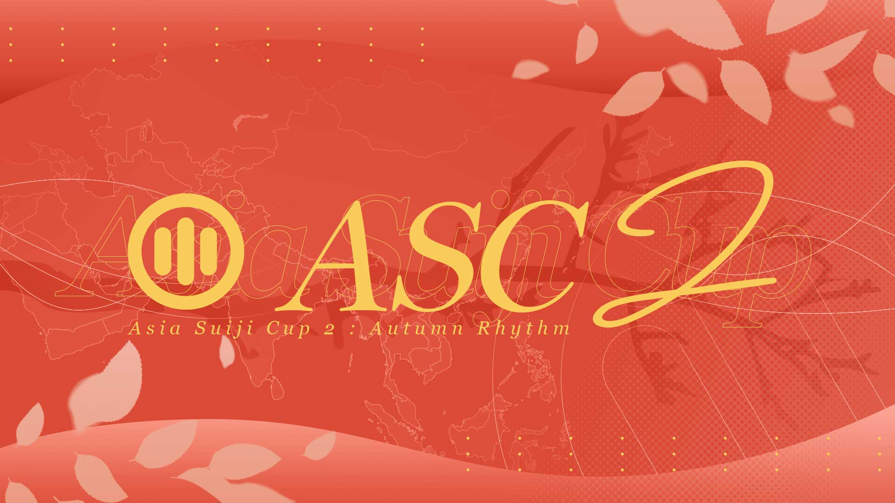
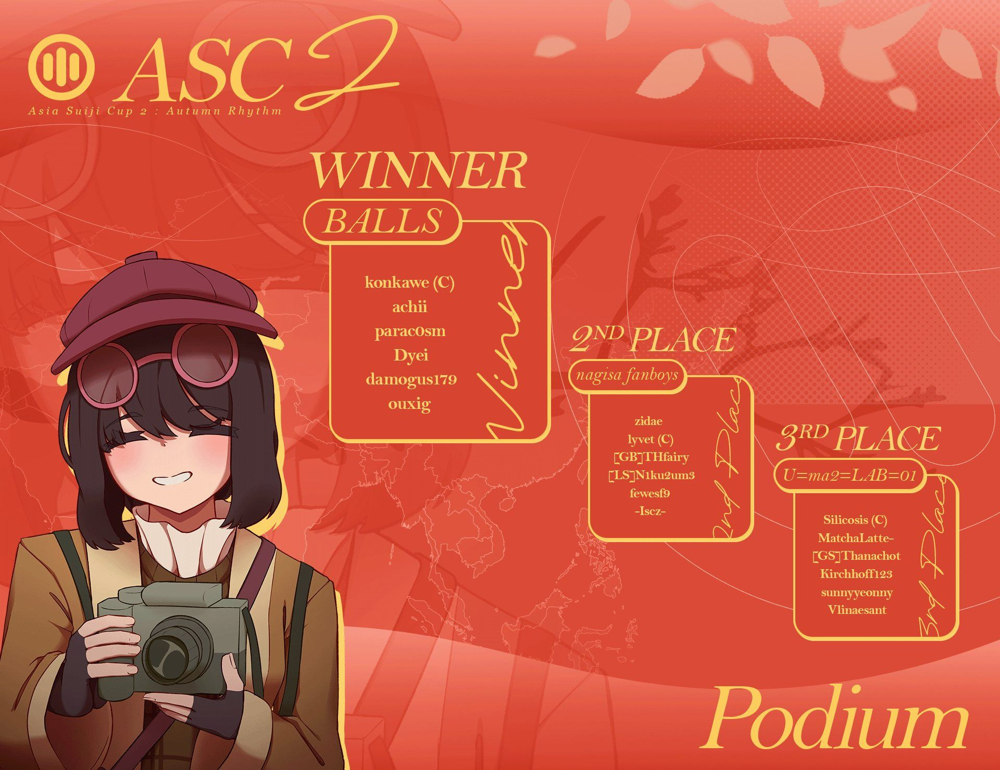

---
tags:
  - ASC
  - ASC 2
  - Asia Suiji Cup
---

# Asia Suiji Cup 2: Autumn Rhythm

The **Asia Suiji Cup 2: Autumn Rhythm** (***ASC 2***) was a three-on-three asian and oceanian countries restricted double-elimination osu!mania 4-key tournament hosted by ::{ flag=MY }:: ::\[-Leon-\]::{ user-id=13382147 }, ::{ flag=VN }:: ::MashedPotato::{ user-id=10494860 }, and ::{ flag=MY }:: ::rantable::{ user-id=13630137 }. Each participant registered individually and was assigned to a random team. It was the second instalment of the Asia Suiji Cup, its successor, and inspired by the [Asian's Campionships](/wiki/Tournaments/o!mAC) and [SEA Champion](/wiki/Tournaments/SEAC) series.

## Tournament schedule

| Event | Timestamp |
| --: | :-- |
| Player registration phase | 2025-09-27/2025-10-10 |
| Screening phase | 2025-10-11/2025-10-24 |
| Team drawings & Qualifiers showcase | 2025-10-25 |
| Qualifiers | 2025-11-08/2025-11-09 |
| Round of 16 | 2025-11-15/2025-11-16 |
| Quarterfinals | 2025-11-22/2025-11-23 |
| Semifinals | 2025-11-29/2025-11-30 |
| Finals | 2025-12-06/2025-12-07 |
| Grand Finals | 2025-12-13/2025-12-14 |

## Prizes

| Placing | Prize(s) |
| :-: | :-- |
|  | Unique profile badge, 4 months of osu!supporter tag, user profile banner |
|  | 2 months of osu!supporter tag, user profile banner |
|  | 1 month of osu!supporter tag, user profile banner |

Donations to the prize pool can be made through [ASC's Ko-fi page](https://ko-fi.com/asiasuijicup). Thanks to ::{ flag=GB }:: ::IncognitoMercy::{ user-id=12838922 } for sponsoring the entire osu!supporter tag prize pool (from first, second, and third place).

## Organisation

The Asia Suiji Cup 2: Autumn Rhythm was run by various community members.

| Position | Member(s) |
| :-- | :-- |
| Organiser | ::{ flag=MY }:: ::\[-Leon-\]::{ user-id=13382147 }, ::{ flag=VN }:: ::MashedPotato::{ user-id=10494860 }, ::{ flag=MY }:: ::rantabie::{ user-id=13630137 } |
| Consultant | ::{ flag=MY }:: ::\_Kobii::{ user-id=6209713 } |
| Head mappooler | ::{ flag=MY }:: ::\[-Leon-\]::{ user-id=13382147 }, ::{ flag=KR }:: ::\[GB\]Oceanus::{ user-id=9164100 }, ::{ flag=IT }:: ::\[GB\]Rick::{ user-id=25263357 } |
| Mappool playtester | ::{ flag=SG }:: ::awdse22::{ user-id=8743513 }, ::{ flag=FR }:: ::DarkMew2::{ user-id=13921965 }, ::{ flag=FR }:: ::flowerful::{ user-id=18867523 }, ::{ flag=ES }:: ::Guldakh::{ user-id=8553078 }, ::{ flag=MY }:: ::IvanOfficial::{ user-id=12818249 }, ::{ flag=NL }:: ::Shoira::{ user-id=13377652 } |
| Mapper | ::{ flag=TW }:: ::\[Crz\]FolAH1217::{ user-id=6232458 }, ::{ flag=KR }:: ::\[GB\]Oceanus::{ user-id=9164100 }, ::{ flag=JP }:: ::\[GS\]hina::{ user-id=20040607 }, ::{ flag=PA }:: ::\[HD\]Erina::{ user-id=8704966 }, ::{ flag=CN }:: ::AelSan::{ user-id=14095291 }, ::{ flag=CN }:: ::AlexDunk::{ user-id=9194799 }, ::{ flag=HK }:: ::Alptraum::{ user-id=26496648 }, ::{ flag=AU }:: ::anatharax::{ user-id=14390680 }, ::{ flag=BR }:: ::AutotelicBrown::{ user-id=4238941 }, ::{ flag=SG }:: ::awdse22::{ user-id=8743513 }, ::{ flag=CN }:: ::Blue\_Potion::{ user-id=13094831 }, ::{ flag=CN }:: ::Doshowz::{ user-id=5799435 }, ::{ flag=GB }:: ::epic man 2::{ user-id=14566000 }, ::{ flag=MY }:: ::Evirir::{ user-id=8126553 }, ::{ flag=ID }:: ::FelixSpade::{ user-id=2651304 }, ::{ flag=CN }:: ::Hylotl::{ user-id=18270260 }, ::{ flag=PH }:: ::Hytex::{ user-id=8536263 }, ::{ flag=MY }:: ::IvanOfficial::{ user-id=12818249 }, ::{ flag=SG }:: ::Japeynius::{ user-id=13993659 }, ::{ flag=IT }:: ::Kiraz::{ user-id=3807675 }, ::{ flag=CN }:: ::Mafufu::{ user-id=10884561 }, ::{ flag=VN }:: ::Micleak::{ user-id=16140674 }, ::{ flag=CN }:: ::Muses::{ user-id=9705896 }, ::{ flag=CN }:: ::OxalicAcid::{ user-id=17146433 }, ::{ flag=FR }:: ::Paturages::{ user-id=1375479 }, ::{ flag=NL }:: ::Promachos::{ user-id=14069486 }, ::{ flag=IT }:: ::rikan::{ user-id=25263357 }, ::{ flag=ID }:: ::Revv-::{ user-id=12424909 }, ::{ flag=NL }:: ::Saemitsu::{ user-id=14262789 }, ::{ flag=US }:: ::Toaph Daddy::{ user-id=7616811 }, ::{ flag=CN }:: ::V1do-::{ user-id=17527968 } |
| Referee | ::{ flag=VN }:: ::-\[SnowFlakes\]-::{ user-id=19207842 }, ::{ flag=VN }:: ::\[LS\]Sagirium::{ user-id=16530364 }, ::{ flag=US }:: ::akace100::{ user-id=9308128 }, ::{ flag=VN }:: ::ARL::{ user-id=15778330 }, ::{ flag=CN }:: ::CuteNatro::{ user-id=27233308 }, ::{ flag=US }:: ::EpsilonMaiagare::{ user-id=3855052 }, ::{ flag=CA }:: ::ERA Sunny::{ user-id=16468962 }, ::{ flag=PH }:: ::Gerwin13::{ user-id=15776185 }, ::{ flag=CN }:: ::Mafufu::{ user-id=10884561 }, ::{ flag=VN }:: ::Poity::{ user-id=17148657 }, ::{ flag=US }:: ::renyoo::{ user-id=27209874 }, ::{ flag=NL }:: ::Shoira::{ user-id=13377652 }::{ flag=DE }:: ::TheHunter1::{ user-id=6496016 } |
| Streamer | ::{ flag=VN }:: ::- Fubukiii::{ user-id=9931217 }, ::{ flag=US }:: ::EpsilonMaiagare::{ user-id=3855052 }, ::{ flag=VN }:: ::Krystal Quan::{ user-id=20569104 }, ::{ flag=NZ }:: ::Penguin Bread::{ user-id=5091293 }, ::{ flag=CN }:: ::Rush\_FTK::{ user-id=3046856 } |
| Commentator | ::{ flag=US }:: ::aero-::{ user-id=26690747 }, ::{ flag=GB }:: ::epic man 2::{ user-id=14566000 }, ::{ flag=CA }:: ::ERA Sunny::{ user-id=16468962 }, ::{ flag=PH }:: ::Itawachi::{ user-id=12929973 }, ::{ flag=MY }:: ::IvanOfficial::{ user-id=12818249 }, ::{ flag=PH }:: ::Lazereed::{ user-id=12894120 }, ::{ flag=CN }:: ::Rush\_FTK::{ user-id=3046856 }, ::{ flag=MY }:: ::Unicow::{ user-id=9444174 }, ::{ flag=HK }:: ::YonGin::{ user-id=7109317 }, ::{ flag=TH }:: ::ZeroKungz::{ user-id=23155757 } |
| Designer | ::{ flag=ID }:: ::Aikiyo Fuuka::{ user-id=5179764 }, ::{ flag=CN }:: ::AlexDunk::{ user-id=9194799 }, ::{ flag=PH }:: ::buenoo::{ user-id=11799958 }, ::{ flag=MY }:: ::Iyouka::{ user-id=7138499 }, ::{ flag=MY }:: ::Jerry::{ user-id=605973 }, ::{ flag=VN }:: ::KitHoly::{ user-id=14083855 }, ::{ flag=ID }:: ::LenLitchu::{ user-id=34098325 }, ::{ flag=MY }:: ::lous::{ user-id=6231292 }, ::{ flag=MY }:: ::mochasan\_::{ user-id=23804364 }, ::{ flag=US }:: ::mohca::{ user-id=14499702 }, ::{ flag=MY }:: ::PokeF::{ user-id=18186563 }, ::{ flag=SG }:: ::Polytetral::{ user-id=8612061 }, ::{ flag=ID }:: ::Reihynn::{ user-id=16630515 }, ::{ flag=CN }:: ::RiceSS::{ user-id=8271436 }, ::{ flag=SG }:: ::TheFunk::{ user-id=13981991 }, ::{ flag=MY }:: ::Z419::{ user-id=9912966 } |
| Music producer | [1zm8](https://www.youtube.com/@1zanaman), [BRAND](https://youtube.com/@btan1568), ::{ flag=MY }:: ::HimitsuHiketsu::{ user-id=12920708 }, ::{ flag=TH }:: ::HowToPlayLN::{ user-id=10879600 }, [Kaizu](https://www.tiktok.com/@_oneandonlykaizu), [Kamikoto](https://x.com/KamikotoDTM), [Kiru](https://www.youtube.com/@lolitskiru), ::{ flag=SG }:: ::Raveille::{ user-id=1388767 }, ::{ flag=SG }:: ::sugosugiii::{ user-id=15118952 }, ::{ flag=DE }:: ::t404\1null::{ user-id=22840052 }, ::{ flag=MY }:: ::takehirotei::{ user-id=11793794 }, [THE BEAT WIZARD](https://x.com/THE_BEAT_WIZARD) |
| Statistician | ::{ flag=VN }:: ::BCraftMG::{ user-id=13456818 }, ::{ flag=FR }:: ::PatouZ::{ user-id=7306522 } |
| Web designer | ::{ flag=VN }:: ::longnguyen2004::{ user-id=3874031 }, ::{ flag=VN }:: ::TvS SorAKuN::{ user-id=11115041 } |
| Video editor | ::{ flag=VN }:: ::KitHoly::{ user-id=14083855 } |
| Wiki editor | ::{ flag=ID }:: ::fajar13k::{ user-id=7100002 } |

## Links

- [Discussion thread](https://osu.ppy.sh/community/forums/topics/2134838)
- [Discord server](https://discord.gg/NUd7GyU4Hd)
- [Livestream](https://www.twitch.tv/asiasuijicup)
- [Website](https://asia-suiji-cup.vercel.app/tournament/2/info/main)
- [X (formerly Twitter)](https://twitter.com/AsiaSuijiCup)
- [Youtube channel](https://www.youtube.com/@AsiaSuijiCup)
- [ASC 2 trailer](https://youtu.be/ggCvrdb3V4Y)

## Participants

| Team | Members |
| :-- | :-- |
| **BALLS** | ::{ flag=TH }:: **::konkawe::{ user-id=15665805 }**, ::{ flag=TH }:: ::achii::{ user-id=24026784 }, ::{ flag=AU }:: ::damogus179::{ user-id=25348803 }, ::{ flag=PH }:: ::Dyei::{ user-id=23643731 }, ::{ flag=CN }:: ::ouxig::{ user-id=32522677 }, ::{ flag=PH }:: ::parac0sm::{ user-id=16492260 } |
| **Capoo Fans** | ::{ flag=BH }:: **::Unitori-::{ user-id=15772814 }**, ::{ flag=CN }:: ::CapooFanboy::{ user-id=27235859 }, ::{ flag=AU }:: ::Crimzenite::{ user-id=29051886 }, ::{ flag=TW }:: ::elicccc::{ user-id=22491203 }, ::{ flag=GE }:: ::mocchi::{ user-id=25336842 }, ::{ flag=PH }:: ::Vulpsi::{ user-id=12584420 } |
| **Captain's Hometown** | ::{ flag=KR }:: **::Stereotype::{ user-id=25311011 }**, ::{ flag=TH }:: ::Achino::{ user-id=13349388 }, ::{ flag=KR }:: ::DiamondPumpkin::{ user-id=14058917 }, ::{ flag=PH }:: ::LastingDiarrhea::{ user-id=36461799 }, ::{ flag=MY }:: ::LOKSHOON\_OSU::{ user-id=35494263 }, ::{ flag=TH }:: ::nudragon::{ user-id=32211048 } |
| **Cyclopentanoperhydrophenanthrene** | ::{ flag=MY }:: **::CJP\_::{ user-id=26377628 }**, ::{ flag=CN }:: ::\[GB\]mmttyy233::{ user-id=28639641 }, ::{ flag=MY }:: ::\[MY\] VASD::{ user-id=29929002 }, ::{ flag=VN }:: ::BC1\_CI9::{ user-id=25923595 }, ::{ flag=KR }:: ::Buschan::{ user-id=16505281 }, ::{ flag=TH }:: ::koronkun::{ user-id=30234014 } |
| **Foreclosure Task Rob** | ::{ flag=MY }:: **::JayLye::{ user-id=14892447 }**, ::{ flag=SG }:: ::\[Paw\]pwod::{ user-id=20846896 }, ::{ flag=MO }:: ::-remu-::{ user-id=19081163 }, ::{ flag=CN }:: ::Civilian::{ user-id=18160033 }, ::{ flag=TH }:: ::parponger::{ user-id=28098890 }, ::{ flag=ID }:: ::XronialXero::{ user-id=12143152 } |
| **Harikitte Ikou!** | ::{ flag=MY }:: **::Duckys::{ user-id=28845808 }**, ::{ flag=CN }:: ::-Sheena-::{ user-id=28653364 }, ::{ flag=KR }:: ::GoldPabilion::{ user-id=16898447 }, ::{ flag=NZ }:: ::Joki\_::{ user-id=18043326 }, ::{ flag=KR }:: ::m1k::{ user-id=36377175 }, ::{ flag=PH }:: ::Velyria::{ user-id=9423922 } |
| **is that team name** | ::{ flag=KR }:: **::IseriFanboy::{ user-id=26594580 }**, ::{ flag=SG }:: ::JustSomeGuy97::{ user-id=34132801 }, ::{ flag=PH }:: ::Plana\_::{ user-id=24776314 }, ::{ flag=KR }:: ::Pyn::{ user-id=28014801 }, ::{ flag=MY }:: ::Projiensux::{ user-id=26882713 }, ::{ flag=HK }:: ::Snowie::{ user-id=32408886 } |
| **LEON** | ::{ flag=TW }:: **::-Veloce-::{ user-id=23248427 }**, ::{ flag=PH }:: ::-sakuragii-::{ user-id=26852975 }, ::{ flag=KR }:: ::BLACK\_-\_::{ user-id=28863929 }, ::{ flag=PH }:: ::BronyaZaychik\_::{ user-id=19690810 }, ::{ flag=KR }:: ::leahkim::{ user-id=31975052 }, ::{ flag=VN }:: ::Wolfesch::{ user-id=26970862 } |
| **nagisa fanboys** | ::{ flag=PH }:: **::lyvet::{ user-id=18121419 }**, ::{ flag=CN }:: ::\[GB\]THfairy::{ user-id=24972681 }, ::{ flag=JP }:: ::\[LS\]N1ku2um3::{ user-id=36289388 }, ::{ flag=PH }:: ::-Iscz-::{ user-id=37727531 }, ::{ flag=TW }:: ::fewesf9::{ user-id=18927880 }, ::{ flag=KR }:: ::zidae::{ user-id=17091831 } |
| **New Pigeon** | ::{ flag=MY }:: **::Aepq::{ user-id=24446642 }**, ::{ flag=VN }:: ::Hawkfrost::{ user-id=15555328 }, ::{ flag=PH }:: ::HexStep::{ user-id=22814036 }, ::{ flag=TH }:: ::Normai\_::{ user-id=35268765 }, ::{ flag=CN }:: ::Old Pigeon::{ user-id=26116770 }, ::{ flag=MY }:: ::Tosai\_::{ user-id=3760209 } |
| **sicks wann** | ::{ flag=ID }:: **::\_yea::{ user-id=20834055 }**, ::{ flag=VN }:: ::CutieVaxie::{ user-id=23666217 }, ::{ flag=CN }:: ::MidRed::{ user-id=17641994 }, ::{ flag=VN }:: ::RantabFanboy::{ user-id=16005504 }, ::{ flag=KZ }:: ::revokeww::{ user-id=18267981 }, ::{ flag=TW }:: ::SWADEEF::{ user-id=18268743 } |
| **Skill Issue** | ::{ flag=PH }:: **::Apol-::{ user-id=18466725 }**, ::{ flag=CN }:: ::\[GB\]Lingyu::{ user-id=29743849 }, ::{ flag=ID }:: ::Az-u::{ user-id=15801261 }, ::{ flag=VN }:: ::LassieNoki::{ user-id=34152447 }, ::{ flag=KR }:: ::Poca::{ user-id=8581031 }, ::{ flag=CN }:: ::RTrigger::{ user-id=25308131 } |
| **TEAM SEVEN** | ::{ flag=KR }:: **::hato::{ user-id=19838492 }**, ::{ flag=TW }:: ::-Kurimu-::{ user-id=27891923 }, ::{ flag=VN }:: ::Kurokami\_Fbk::{ user-id=32221678 }, ::{ flag=MY }:: ::Lau william::{ user-id=28861900 }, ::{ flag=PH }:: ::ManiaDegengod::{ user-id=13193798 }, ::{ flag=KR }:: ::Snowiz::{ user-id=28234428 } |
| **The Maple Simpers** | ::{ flag=ID }:: **::Fier::{ user-id=21446926 }**, ::{ flag=TW }:: ::amano\_hina::{ user-id=19882148 }, ::{ flag=VN }:: ::Just P::{ user-id=21292740 }, ::{ flag=CN }:: ::Shizuku-09::{ user-id=27288518 }, ::{ flag=PH }:: ::Silicosis 2::{ user-id=18560307 }, ::{ flag=KR }:: ::YunJeongUfanBoy::{ user-id=31473880 } |
| **U=ma2=LAB=01** | ::{ flag=PH }:: **::Silicosis::{ user-id=15548876 }**, ::{ flag=TH }:: ::\[GS\]Thanachot::{ user-id=23509758 }, ::{ flag=CN }:: ::Kirchhoff123::{ user-id=29546640 }, ::{ flag=TH }:: ::MatchaLatte-::{ user-id=15944956 }, ::{ flag=KR }:: ::sunnyyeonny::{ user-id=29340816 }, ::{ flag=VN }:: ::Vlinaesant::{ user-id=33280967 } |
| **wedoknowwhatbye** | ::{ flag=ID }:: **::\[LS\]Robi::{ user-id=21900872 }**, ::{ flag=KR }:: ::Aaronzzang::{ user-id=15862779 }, ::{ flag=CN }:: ::Idontknowwhathi::{ user-id=32379983 }, ::{ flag=HK }:: ::Popy::{ user-id=30829023 }, ::{ flag=KR }:: ::Rei\_O9::{ user-id=12388151 }, ::{ flag=VN }:: ::Rip\_MsCr7::{ user-id=33675196 } |

## Podium

## Mappools

### Grand Finals

**[Download the mappack here! (273 MB)](https://drive.google.com/file/d/1Mq90pg5lKTXt2DdJZ7agTYGqg_APMLfI/view)**

- Rice
  1. [Noah - The Wheel of Fortune Turning Over (OxalicAcid) \[Reverse\]](https://osu.ppy.sh/beatmapsets/2476179#mania/5429020)
  2. [Lime - Beyond (\[GB\]Oceanus) \[Aurora\]](https://osu.ppy.sh/beatmapsets/2476170#mania/5428996)
  3. [sakanaction - Shin Takarajima (\[GS\]hina) \[Aurealis (ASC2 Edit)\]](https://osu.ppy.sh/beatmapsets/2476181#mania/5429022)
  4. [Camellia - Towards the Horizon (RyuOn) \[Ryuon's Fantasia (edit) x1.1\]](https://osu.ppy.sh/beatmapsets/2476171#mania/5428998)
  5. [YZYX - Dysnomia (0DZ0) \[Paradise Lost\]](https://osu.ppy.sh/beatmapsets/2310573#mania/4942998)
  6. [THE BEAT WIZARD - Close Cutter (Hylotl) \[Scissors\]](https://osu.ppy.sh/beatmapsets/2476185#mania/5429051)
  7. [Nekomata Master feat. Shimotsuki Haruka - Element of SPADA (Game Ver.) (\[GS\]hina) \[Serment 1.05x (179bpm)\]](https://osu.ppy.sh/beatmapsets/2476184#mania/5429037)
  8. [Aquellex - Obligatory (Kurorak's Obligatory Destruction rmx) (AutotelicBrown) \[Alice's First Law 1.1x (no mini-LNs)\]](https://osu.ppy.sh/beatmapsets/1438897#mania/3114628)
- Long Notes
  1. [KAF - Montage (Hytex) \[Delusion\]](https://osu.ppy.sh/beatmapsets/2476193#mania/5429076)
  2. [Gram vs. Yooh - Apocalypse (Toaph Daddy) \[Meteor Flare\]](https://osu.ppy.sh/beatmapsets/2476167#mania/5428989)
  3. [sasakure.UK - LIN NE KRO NE feat. lasah (\[HD\]Erina) \[.\*\<Expressionless\>\*.\]](https://osu.ppy.sh/beatmapsets/2476199#mania/5429118)
  4. [Reol - Minazoko Yuuhodou (\[Crz\]Crysarlene) \[Beneath The Silence\]](https://osu.ppy.sh/beatmapsets/1893942#mania/3902883)
  5. [Demetori - Last Remote ~ Type A Personality (Castella) \[Requiem of Koishi od7\]](https://osu.ppy.sh/beatmapsets/2048331#mania/4276650)
- Hybrid
  1. [BilliumMoto - Sentinel (AelSan) \[Dismay, Dismay! Light has faded and left us in dismay! 1.05x (243bpm)\]](https://osu.ppy.sh/beatmapsets/2218561#mania/4702582)
  2. [Ichika Nito - Metaphor feat. Feryquitous (ImperialTrinity) \[Expert | Ethereal Resonance.\]](https://osu.ppy.sh/beatmapsets/2329261#mania/4994642)
  3. [NormalM - Radiant Spectrala (Muses, OxalicAcid) \[Prism\]](https://osu.ppy.sh/beatmapsets/2476188#mania/5429065)
- Slider Velocity
  1. [Kolaa & Kumako - Ichirin (Mafufu) \[..\*\<\| Existence \<=\> Nihility //\*\\\ You & Me //\*\\\ Instant <=> Eternity \|\>\*..\]](https://osu.ppy.sh/beatmapsets/2476177#mania/5429010)
- Tiebreaker
  1. **[ASC Sound Team ''Wandering Travelers'' - Fortuitous Voyage (\[Crz\]FolAH1217, \[GB\]Oceanus, \[-Leon-\], \[GS\]hina, rikan) \[Maple's Long Journey Home\]](https://osu.ppy.sh/beatmapsets/2476204#mania/5429125)**

### Finals

**[Download the mappack here! (203 MB)](https://drive.google.com/file/d/1YJb8qkUQlczf9Za1RsRzTD3vjTyD3BR7/view)**

- Rice
  1. [DJ SHARPNEL - THE POWER OF UNDERGROUND (MyZterioN-) \[thrive 1.25x (244bpm)\]](https://osu.ppy.sh/beatmapsets/2014292#mania/4191812)
  2. [kommisar - Hyper Weaboo Vodka Shots (0DZ0) \[Hyper 1.05x (268bpm)\]](https://osu.ppy.sh/beatmapsets/1841524#mania/3782333)
  3. [sakanaction - Aoi (Cut ver.) (Hylotl) \[Azure\]](https://osu.ppy.sh/beatmapsets/2472326#mania/5416912)
  4. [NU-KO - SHINE TO SHINE (Doshowz) \[SHINE (ASC ver.)\]](https://osu.ppy.sh/beatmapsets/2472319#mania/5416885)
  5. [Memme - Acid Burst (hna) \[Nuclear\]](https://osu.ppy.sh/beatmapsets/2061819#mania/4310401)
  6. [Kou! - Sanzui (ICECAKE) \[NSV 1.1x (220bpm) OD8\]](https://osu.ppy.sh/beatmapsets/2187661#mania/4711829)
  7. [Ashrount - Bleary Vagary (AutotelicBrown) \[Muzzy\]](https://osu.ppy.sh/beatmapsets/2472335#mania/5416931)
  8. [Taishi feat. Noriko Mitose - The Personalizer (ERA Imperial) \[Chain your Heart (cut) 1.05x (145bpm) OD8.5\]](https://osu.ppy.sh/beatmapsets/2134248#mania/4501616)
- Long Notes
  1. [Giga-P feat. GUMI, KYO - Ooedo Ranvu (Hylotl) \[corruption\]](https://osu.ppy.sh/beatmapsets/1888225#mania/3888702)
  2. [DJ Raisei vs Setca. feat. nayuta - Utakata no Sekai de (\[-Leon-\]) \[YuEast 2018's Fragments. (ASC edit)\]](https://osu.ppy.sh/beatmapsets/2472372#mania/5416982)
  3. [Sakuzyo feat. Enoa (CV: Hikaru Tono) - NotToNotice(); (Saemitsu, ImperialTrinity) \[// DesireToComprehend();\]](https://osu.ppy.sh/beatmapsets/2445692#mania/5338306)
  4. [Lusumi - /data\_eraser.wav (\[-Leon-\]) \[error\]](https://osu.ppy.sh/beatmapsets/2472376#mania/5416987)
  5. [rejection - Aimai Attitude (feat. Nakamura Sanso) (\[HD\]Erina) \[Please notice me...\]](https://osu.ppy.sh/beatmapsets/2472322#mania/5416897)
- Hybrid
  1. [Kamikoto - Sabotage (V1do-) \[DISMANTLE\]](https://osu.ppy.sh/beatmapsets/2472344#mania/5416946)
  2. [TAKIO feat. tug - Extradimensional Cosmic Phenomenon (Saemitsu) \[Prismatic Azure\]](https://osu.ppy.sh/beatmapsets/2472346#mania/5416949)
  3. [Camellia - Final Flash Flight (Merian) \[Last Prism\]](https://osu.ppy.sh/beatmapsets/1765167#mania/3613128)
- Slider Velocity
  1. [JACKNIFE - EXO (Nightcore Ver.) (Evirir) \[hiding in my exoskeleton\]](https://osu.ppy.sh/beatmapsets/2472323#mania/5416900)
- Tiebreaker
  1. **[HYOUKA - Transmission\_Of\_Radionuclides\_In\_Geosynchronous\_Heights\_\<moduleGLACIER-X471\> (OxalicAcid, \[-Leon-\], \[GS\]hina) \[Oscillation\]](https://osu.ppy.sh/beatmapsets/2472371#mania/5416981)**

### Semifinals

**[Download the mappack here! (116 MB)](https://drive.google.com/file/d/11BDqtX70xnV15QxJ-ZjofIju63Znai60/view)**

- Rice
  1. [t+pazolite - Cheatreal (\[-Leon-\]) \[Remity's Extraneous (220bpm) (edit)\]](https://osu.ppy.sh/beatmapsets/2468991#mania/5406805)
  2. [sasakure.UK feat. Shirakami Fubuki - KINGWORLD (Cut Ver.) (\[GB\]Oceanus) \[Rivals\]](https://osu.ppy.sh/beatmapsets/2468969#mania/5406759)
  3. [buelow - Revolver (Sped Up Ver.) (Lott) \[Femme Fatale 1.05x\]](https://osu.ppy.sh/beatmapsets/2435740#mania/5309392)
  4. [EvOke - Edison (Miaurichesu) \[Challenge (Edit) 1.1x (146bpm)\]](https://osu.ppy.sh/beatmapsets/2050560#mania/4281865)
  5. [Kei Toriki - Utopia (MyZterioN-) \[dreamscape 1.15x (230bpm)\]](https://osu.ppy.sh/beatmapsets/1685404#mania/3537227)
  6. [NMIXX - Slingshot (Micleak) \[}--\]](https://osu.ppy.sh/beatmapsets/2468977#mania/5406791)
  7. [himihike - lumievous (Hytex) \[the darkness that blinds\]](https://osu.ppy.sh/beatmapsets/2468965#mania/5406729)
- Long Notes
  1. [Remo Prototype (CV: Hanamori Yumiri) - Sendan Life (Cut Ver.) (Hytex) \[bye bye\]](https://osu.ppy.sh/beatmapsets/2468973#mania/5406763)
  2. [DJ Sharpnel - Over the Fullereneshift (Cut ver.) (FelixSpade) \[LN Prodigy // Apocalypse\]](https://osu.ppy.sh/beatmapsets/2468976#mania/5406790)
  3. [Halv - Kyubi (\_Kiruru) \[Life String (ASC edit)\]](https://osu.ppy.sh/beatmapsets/1935389#mania/5406639)
  4. [Task Horizon (feat. MC Spyda) - Unimpossible (\[Crz\]FolAH1217) \[accable\]](https://osu.ppy.sh/beatmapsets/2468994#mania/5406810)
- Hybrid
  1. [Lime - Pixel Planet (Saemitsu) \[Traversing the Cosmos\]](https://osu.ppy.sh/beatmapsets/2183977#mania/4615369)
  2. [1zm8 & Kaizu - FRACTAL [PULSE] (rikan) \[ETERNAL [INSTANT]\]](https://osu.ppy.sh/beatmapsets/2468974#mania/5406765)
  3. [Sobrem x Silentroom - Random (\[-Leon-\]) \[cherrychou's Concert (ASC edit)\]](https://osu.ppy.sh/beatmapsets/2468997#mania/5406819)
- Slider Velocity
  1. [MILKFISH - CANT GET U OUTTA MY MIND (awdse22) \[VICIOUS GIGANTIC WATERMELON\]](https://osu.ppy.sh/beatmapsets/2468961#mania/5406721)
- Tiebreaker
  1. **[NormalM feat. Echo - Resonance of Viscerharma (AelSan) \[Echo of Resonance (ASC Edit)\]](https://osu.ppy.sh/beatmapsets/2468992#mania/5406806)**

### Quarterfinals

**[Download the mappack here! (109 MB)](https://drive.google.com/file/d/1W9tl9YYSawhEPwK1Pc8j1JjXRIZTg2SD/view)**

- Rice
  1. [Hayakore Tatsumi - CNP-Nya (Hylotl) \[Ron-nya (Cut)\]](https://osu.ppy.sh/beatmapsets/2465771#mania/5397994)
  2. [Rairyu - ra'am (-mint-, hna) \[mint vs. hana's Kriemhild Gretchen\]](https://osu.ppy.sh/beatmapsets/1832490#mania/3761572)
  3. [Sakuzyo - Arkadia \[Illusion\] (\[-Leon-\]) \[\[\[Crz\]hinako1804's Arcadia x1.1 (ASC edit)\]\]](https://osu.ppy.sh/beatmapsets/2465764#mania/5397987)
  4. [Kettoshi - Area->Idea (\[GS\]hina) \[Illusione\]](https://osu.ppy.sh/beatmapsets/2465777#mania/5398012)
  5. [Supire - Nebula (Miaurichesu) \[Nova\]](https://osu.ppy.sh/beatmapsets/2310400#mania/4942648)
  6. [ZxNX & Violet.MKII - Pinkies & Dennies feat. azami & sheirara (AelSan) \[Welcome to Cunning Hares\]](https://osu.ppy.sh/beatmapsets/2465784#mania/5398022)
- Long Notes
  1. [PinocchioP - Love of Love by Love for Love (Cut ver.) ([HD]Erina) \["Love" was, though rotten, still "love".\]](https://osu.ppy.sh/beatmapsets/2465769#mania/5397992)
  2. [Zekk - Fallen (\[HD\]Erina) \[Forever\]](https://osu.ppy.sh/beatmapsets/2465767#mania/5397990)
  3. [Getty & Kobaryo - Breaking Dawn (feat. Itsuki Natsume) \[Short Version\] (MyZterioN-) \[LNation Anthem\]](https://osu.ppy.sh/beatmapsets/2438701#mania/5318794)
  4. [KARUT - CrossFire (takehirotei remix) (\[-Leon-\]) \[under fire\]](https://osu.ppy.sh/beatmapsets/2369386#mania/5112084)
- Hybrid
  1. [Se-U-Ra - QSHELL -Kyoshoku no Shell- (guden) \[Atrophic\]](https://osu.ppy.sh/beatmapsets/1822586#mania/3739900)
  2. [Xyris - ATLAS (IvanOfficial) \[Cartography\]](https://osu.ppy.sh/beatmapsets/2465774#mania/5398002)
  3. [awfuless - Temptation (AlexDunk) \[no sv\]](https://osu.ppy.sh/beatmapsets/2465772#mania/5398000)
- Slider Velocity
  1. [USAO - Big Daddy (Evirir) \[54321 let's go\]](https://osu.ppy.sh/beatmapsets/2465704#mania/5397711)
- Tiebreaker
  1. **[Kiru - Void Paroxysm ([-Leon-]) \[Desolation\]](https://osu.ppy.sh/beatmapsets/2465794#mania/5398035)**

### Round of 16

**[Download the mappack here! (116 MB)](https://drive.google.com/file/d/1W8VMEArorYL2lHQ2IrnZpwEBece9mL7V/view)**

- Rice
  1. [Puru - Grimheart (polysha remix) (Eclipse-) \[Abyssal\]](https://osu.ppy.sh/beatmapsets/1429218#mania/2942329)
  2. [AAAA - Hoshi no Otoshimono (OxalicAcid) \[Meteorshower\]](https://osu.ppy.sh/beatmapsets/2462494#mania/5387881)
  3. [Culprate - Dawn (Cut Ver.) (Pizza69) \[Rise\]](https://osu.ppy.sh/beatmapsets/2311800#mania/4946095)
  4. [Hiraumi - Zundamon no Choushoku (Kiraz) \[Chotto Matte!\]](https://osu.ppy.sh/beatmapsets/2462511#mania/5387929)
  5. [AAAA - w = addict (G1NYA) \[Typing\]](https://osu.ppy.sh/beatmapsets/2403070#mania/5211828)
- Long Notes
  1. [billy woods - A Doll Fulla Pins (feat. Yolanda Watson) (epic man 2) \[Dislocation\]](https://osu.ppy.sh/beatmapsets/2462393#mania/5387420)
  2. [DJ TOTTO - DORNWALD \~Junge\~ (stupud man) \[Anima\]](https://osu.ppy.sh/beatmapsets/1660098#mania/3391262)
  3. [Feryquitous - Qavsell (Davvy) \[Heritage (cut edit)\]](https://osu.ppy.sh/beatmapsets/1187793#mania/2971627)
- Hybrid
  1. [ck - Souhait bleu (arpia97) \[Blessing (edit)\]](https://osu.ppy.sh/beatmapsets/1507111#mania/3734906)
  2. [Memme - Xiao Long Bao (AelSan) \[Bu Yao He Douzhi\]](https://osu.ppy.sh/beatmapsets/2462497#mania/5387891)
  3. [seatrus - Oyasmy (\[Crz\]FolAH1217) \[tidur\]](https://osu.ppy.sh/beatmapsets/2462499#mania/5387894)
- Slider Velocity
  1. [Bossfight - Nowise (Cut Ver.) (Promachos) \[Bewitched (SV)\]](https://osu.ppy.sh/beatmapsets/2462472#mania/5387826)
- Tiebreaker
  1. **[tn-shi - a tale of two (rikan) \[constellation\]](https://osu.ppy.sh/beatmapsets/2462503#mania/5387903)**

### Qualifiers

1. [Nor - Usagi Flap (EmoCosine Remix) (Revv-) \[Stage 1: Pyon\]](https://osu.ppy.sh/beatmapsets/2454525#mania/5363572)
2. [daisan - Yukidoke-iro Furawazu (\[GS\]hina) \[Stage 2: Whiteout\]](https://osu.ppy.sh/beatmapsets/2454529#mania/5363578)
3. [ESAI & Pure 100% - Nebula (Doshowz) \[Stage 3: Nebula\]](https://osu.ppy.sh/beatmapsets/2454526#mania/5363573)
4. [Unlucky Morpheus - Dead Leaves Rising (Alptraum) \[Stage 4: Impermanence\]](https://osu.ppy.sh/beatmapsets/2454535#mania/5363597)
5. [Co shu Nie - undress me (anatharax) \[Stage 5: Dismantled\]](https://osu.ppy.sh/beatmapsets/2454536#mania/5363598)
6. [seatrus - TH3 5UMMONERS (FelixSpade) \[Stage 6: Conjurer\]](https://osu.ppy.sh/beatmapsets/2454538#mania/5363607)
7. [P4koo - overwhelm (AelSan) \[Stage 7: Rolling\]](https://osu.ppy.sh/beatmapsets/2454539#mania/5363608)
8. [kuro feat. niui - Tablear (Muses) \[Stage 8: Dice\]](https://osu.ppy.sh/beatmapsets/2454545#mania/5363627)

## Match results

### Grand Finals

Saturday, 13 December 2025

| Team A |  |  | Team B | Match link |
| --: | :-: | :-: | :-- | :-- |
| U=ma2=LAB=01 | 4 | **7** | **BALLS** | [#1](https://osu.ppy.sh/community/matches/120064549) |

Sunday, 14 December 2025

| Team A |  |  | Team B | Match link |
| --: | :-: | :-: | :-- | :-- |
| nagisa fanboys | 4 | **7** | **BALLS** | [#1](https://osu.ppy.sh/community/matches/120074228) |
| **BALLS** | **7** | 5 | nagisa fanboys | [#1](https://osu.ppy.sh/community/matches/120074579) |

### Finals

Saturday, 6 December 2025

| Team A |  |  | Team B | Match link |
| --: | :-: | :-: | :-- | :-- |
| New Pigeon | 3 | **7** | **wedoknowwhatbye** | [#1](https://osu.ppy.sh/community/matches/120008360) |
| **BALLS** | **7** | 4 | The Maple Simpers | [#1](https://osu.ppy.sh/community/matches/120008534) |

Sunday, 7 December 2025

| Team A |  |  | Team B | Match link |
| --: | :-: | :-: | :-- | :-- |
| **BALLS** | **7** | 5 | wedoknowwhatbye | [#1](https://osu.ppy.sh/community/matches/120018023) |
| U=ma2=LAB=01 | 1 | **7** | **nagisa fanboys** | [#1](https://osu.ppy.sh/community/matches/120018710) |

### Semifinals

Saturday, 29 November 2025

| Team A |  |  | Team B | Match link |
| --: | :-: | :-: | :-- | :-- |
| Skill Issue | 2 | **6** | Captain's Hometown | [#1](https://osu.ppy.sh/community/matches/119951219) |
| **nagisa fanboys** | **6** | 1 | New Pigeon | [#1](https://osu.ppy.sh/community/matches/119951500) |
| Capoo Fans | 4 | **6** | **wedoknowwhatbye** | [#1](https://osu.ppy.sh/community/matches/119951767) |
| **The Maple Simpers** | **6** | 4 | Foreclosure Task Rob | [#1](https://osu.ppy.sh/community/matches/119951744) |
| **U=ma2=LAB=01** | **6** | 1 | BALLS | [#1](https://osu.ppy.sh/community/matches/119951843) |

Sunday, 30 November 2025

| Team A |  |  | Team B | Match link |
| --: | :-: | :-: | :-- | :-- |
| **Cyclopentanoperhydrophenanthrene** | **6** | 5 | LEON | [#1](https://osu.ppy.sh/community/matches/119961465) |
| **wedoknowwhatbye** | **6** | 0 | Cyclopentanoperhydrophenanthrene | [#1](https://osu.ppy.sh/community/matches/119962144) |
| Captain's Hometown | 1 | **6** | **The Maple Simpers** | [#1](https://osu.ppy.sh/community/matches/119962328) |

### Quarterfinals

Saturday, 23 November 2025

| Team A |  |  | Team B | Match link |
| --: | :-: | :-: | :-- | :-- |
| sicks wann | 1 | **6** | **Captain's Hometown** | [#1](https://osu.ppy.sh/community/matches/119893362) |

Sunday, 24 November 2025

| Team A |  |  | Team B | Match link |
| --: | :-: | :-: | :-- | :-- |
| Cyclopentanoperhydrophenanthrene | 4 | **6** | **U=ma2=LAB=01** | [#1](https://osu.ppy.sh/community/matches/119902047) |
| **nagisa fanboys** | **6** | 2 | The Maple Simpers | [#1](https://osu.ppy.sh/community/matches/119902374) |
| **BALLS** | **6** | 0 | Capoo Fans | [#1](https://osu.ppy.sh/community/matches/119903014) |
| Skill Issue | 3 | **6** | **New Pigeon** | [#1](https://osu.ppy.sh/community/matches/119902965) |
| is that team name | 3 | **6** | **Foreclosure Task Rob** | [#1](https://osu.ppy.sh/community/matches/119902976) |
| Harikitte Ikou! | 4 | **6** | **wedoknowwhatbye** | [#1](https://osu.ppy.sh/community/matches/119903032) |
| TEAM SEVEN | 4 | **6** | **LEON** | [#1](https://osu.ppy.sh/community/matches/119902985) |

### Round of 16

Saturday, 15 November 2025

| Team A |  |  | Team B | Match link |
| --: | :-: | :-: | :-- | :-- |
| **U=ma2=LAB=01** | **5** | 1 | Captain's Hometown | [#1](https://osu.ppy.sh/community/matches/119831508) |
| LEON | 2 | **5** | New Pigeon | [#1](https://osu.ppy.sh/community/matches/119832147) |
| **Cyclopentanoperhydrophenanthrene** | **5** | 0 | sicks wann | [#1](https://osu.ppy.sh/community/matches/119832657) |

Sunday, 16 November 2025

| Team A |  |  | Team B | Match link |
| --: | :-: | :-: | :-- | :-- |
| **nagisa fanboys** | **5** | 0 | Harikitte Ikou! | [#1](https://osu.ppy.sh/community/matches/119842053) |
| **BALLS** | **5** | 2 | is that team name | [#1](https://osu.ppy.sh/community/matches/119842382) |
| **Skill Issue** | **5** | 2 | TEAM SEVEN | [#1](https://osu.ppy.sh/community/matches/119842569) |
| Foreclosure Task Rob | 4 | **5** | **Capoo Fans** | [#1](https://osu.ppy.sh/community/matches/119843477) |
| wedoknowwhatbye | 2 | **5** | **The Maple Simpers** | [#1](https://osu.ppy.sh/community/matches/119843940) |

### Qualifiers

Detailed statistics for this round can be found in [this web page](https://asia-suiji-cup.vercel.app/tournament/2/stats) alongside the final standings on which teams sets the highest average rank and average score.

## Ruleset

### General rules

1. This is a **3v3 double-elimination tournament**, with a team size of 6 and a total of 16 teams. Only the top 96 players will be chosen to join this edition.
2. The tournament is open to all players who have **country flags from Asia and Oceania** in their profiles. Participants must have flags from these regions to be eligible for entry.
3. Players must sign up through the [website](https://asia-suiji-cup.vercel.app/tournament/2/info/main) and must be in the [Discord server](https://discord.gg/NUd7GyU4Hd). Failure to do so will count your registration as incomplete and not eligible to participate.
4. Players display names in the Discord server must be the same as their osu! username during the entire duration of the tournament.
5. A "sandbagging" formula will be used to help determine the true ranks of players to avoid disruptions and highly unbalanced teams that may potentially ruin the Suiji Cup experience. Such formula is attached in the following [Google document](https://drive.google.com/file/d/1Alfj2-BvdG4uYngT7blnR-R8IiU83756/view).
6. Participants will be split up into 3 different seeds, "A", "B" and "C". Each team will be formed by a live randomisation process and will consist of 2 players from each seed (a team will have 6 players, A, A, B, B, C, C).
7. "A" seeded players have the ability to substitute with "B" or "C" seed on their team. "B" seeded players also have the ability to substitute but only with "C" seed on their team.
8. Teams will be given 5 days to choose a team name and a captain. Failure to submit a team name and a captain will result in an assigned team name chosen by the staff and the highest-ranked player being made captain by default.

### Additional information

1. Unlike the previous iteration, there will only be 1 SV pick in the mappool, and it cannot be banned.
2. Visual mods such as: HD, FL, FI, and MR along with NF mod are allowed. Meanwhile, EZ and HR mod are not allowed.
3. In the event of a disconnection, the map can be replayed if the disconnect is within the first 30 seconds or before the first quarter of the map. Otherwise, if there is proof of the disconnected player's score, it will be used. Each team is allowed one replay per match, and the referee will have the final say in these situations.
4. If a player is not cooperative with the referee and intentionally stalls the match, they will be warned by the referee. If the problem persists the host has the power to end the match and decide the winner on the spot.
5. Other special and unique cases that could happen will be up to the host to decide the next moves.

### Schedules

The tournament staff will be responsible for scheduling all matches and informing players when they are scheduled to play. If a player is unable to play with the schedule they will have the option to request a reschedule, details about this topic will be explained further when the tournament begins.

1. If no referee is available during the match, the match shall be delayed.
2. If no streamers are available to broadcast the match, the match will still happen without being broadcast.
3. If no commentators are available to commentate the match but streamers are available to broadcast the match, the match will still be broadcasted but without commentary.
4. Please note that we will try our best to broadcast every match. If two matches happen at the same time we will prioritize:
   - The scheduled match over rescheduled matches.
   - The winner bracket match over the lower bracket match.
