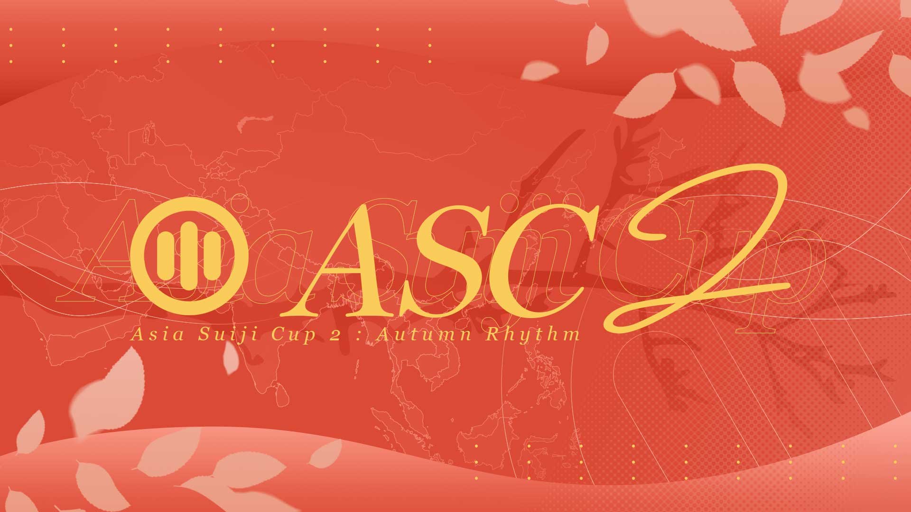

---
tags:
  - ASC
  - ASC 2
  - Asia Suiji Cup
---

# Asia Suiji Cup 2: Autumn Rhythm

The **Asia Suiji Cup 2: Autumn Rhythm** (***ASC 2***) is a three-on-three asian and oceanian countries restricted double-elimination osu!mania 4-key tournament hosted by ::{ flag=MY }:: [\[-Leon-\]](https://osu.ppy.sh/users/13382147), ::{ flag=VN }:: [MashedPotato](https://osu.ppy.sh/users/10494860), and ::{ flag=MY }:: [rantable](https://osu.ppy.sh/users/13630137). Each participant registered individually and is assigned to a random team. It is the second instalment of the Asia Suiji Cup, a successor, and inspired by the [Asian's Campionships](/wiki/Tournaments/o!mAC) and [SEA Champion](/wiki/Tournaments/SEAC) series .

## Tournament schedule

| Event | Timestamp |
| --: | :-- |
| Player registration phase | 2025-09-27/2025-10-10 |
| Screening phase | 2025-10-11/2025-10-24 |
| Team drawings & Qualifiers showcase | 2025-10-25 |
| Qualifiers | 2025-11-08/2025-11-09 |
| Round of 16 | 2025-11-15/2025-11-16 |
| Quarterfinals | 2025-11-22/2025-11-23 |
| Semifinals | 2025-11-29/2025-11-30 |
| Finals | 2025-12-06/2025-12-07 |
| Grand Finals | 2025-12-13/2025-12-14 |

## Prizes

| Placing | Prize(s) |
| :-: | :-- |
|  | Unique profile badge, 4 months of osu!supporter tag, user profile banner |
|  | 2 months of osu!supporter tag, user profile banner |
|  | 1 month of osu!supporter tag, user profile banner |

Donations and all supports can be made through [ASC's Ko-fi page](https://ko-fi.com/asiasuijicup). Thanks to ::{ flag=GB }:: [IncognitoMercy](https://osu.ppy.sh/users/12838922) for sponsoring the entire osu!supporter tag prize pool (from first, second, and third place).

## Organisation

The Asia Suiji Cup 2: Autumn Rhythm is run by various community members.

| Position | Member(s) |
| :-- | :-- |
| Organiser | ::{ flag=MY }:: [\[-Leon-\]](https://osu.ppy.sh/users/13382147), ::{ flag=VN }:: [MashedPotato](https://osu.ppy.sh/users/10494860), ::{ flag=MY }:: [rantabie](https://osu.ppy.sh/users/13630137) |
| Consultant | ::{ flag=MY }:: [\_Kobii](https://osu.ppy.sh/users/6209713) |
| Head mappooler | ::{ flag=MY }:: [\[-Leon-\]](https://osu.ppy.sh/users/13382147), ::{ flag=KR }:: [\[GB\]Oceanus](https://osu.ppy.sh/users/9164100), ::{ flag=IT }:: [\[GB\]Rick](https://osu.ppy.sh/users/25263357) |
| Mappool playtester | ::{ flag=FR }:: [DarkMew2](https://osu.ppy.sh/users/13921965), ::{ flag=BR }:: [fefedk](https://osu.ppy.sh/users/18943504), ::{ flag=FR }:: [flowerful](https://osu.ppy.sh/users/18867523), ::{ flag=ES }:: [Guldakh](https://osu.ppy.sh/users/8553078), ::{ flag=MY }:: [IvanOfficial](https://osu.ppy.sh/users/12818249), ::{ flag=NL }:: [Shoira](https://osu.ppy.sh/users/13377652) |
| Mapper | ::{ flag=TW }:: [\[Crz\]FolAH1217](https://osu.ppy.sh/users/6232458), ::{ flag=JP }:: [\[GS\]hina](https://osu.ppy.sh/users/20040607), ::{ flag=PA }:: [\[HD\]Erina](https://osu.ppy.sh/users/8704966), ::{ flag=CN }:: [AelSan](https://osu.ppy.sh/users/14095291), ::{ flag=CN }:: [AlexDunk](https://osu.ppy.sh/users/9194799), ::{ flag=HK }:: [Alptraum](https://osu.ppy.sh/users/26496648), ::{ flag=AU }:: [anatharax](https://osu.ppy.sh/users/14390680), ::{ flag=BR }:: [AutotelicBrown](https://osu.ppy.sh/users/4238941), ::{ flag=SG }:: [awdse22](https://osu.ppy.sh/users/8743513), ::{ flag=CN }:: [Blue\_Potion](https://osu.ppy.sh/users/13094831), ::{ flag=US }:: [chxu](https://osu.ppy.sh/users/13712190), ::{ flag=CN }:: [Doshowz](https://osu.ppy.sh/users/5799435), ::{ flag=GB }:: [epic man 2](https://osu.ppy.sh/users/14566000), ::{ flag=MY }:: [Evirir](https://osu.ppy.sh/users/8126553), ::{ flag=ID }:: [FelixSpade](https://osu.ppy.sh/users/2651304), ::{ flag=ID }:: [FerdiXIA-](https://osu.ppy.sh/users/9030389), ::{ flag=PH }:: [Gerwin13](https://osu.ppy.sh/users/15776185), ::{ flag=CN }:: [Hylotl](https://osu.ppy.sh/users/18270260), ::{ flag=PH }:: [Hytex](https://osu.ppy.sh/users/8536263), ::{ flag=MY }:: [IvanOfficial](https://osu.ppy.sh/users/12818249), ::{ flag=SG }:: [Japeynius](https://osu.ppy.sh/users/13993659), ::{ flag=IT }:: [Kiraz](https://osu.ppy.sh/users/3807675), ::{ flag=CN }:: [Mafufu](https://osu.ppy.sh/users/10884561), ::{ flag=VN }:: [Micleak](https://osu.ppy.sh/users/16140674), ::{ flag=MY }:: [Mochineko](https://osu.ppy.sh/users/3793196), ::{ flag=CN }:: [Muses](https://osu.ppy.sh/users/9705896), ::{ flag=US }:: [NovaSagittarii](https://osu.ppy.sh/users/11664177), ::{ flag=CN }:: [OxalicAcid](https://osu.ppy.sh/users/17146433), ::{ flag=FR }:: [Paturages](https://osu.ppy.sh/users/1375479), ::{ flag=NL }:: [Promachos](https://osu.ppy.sh/users/14069486), ::{ flag=IT }:: [rikan](https://osu.ppy.sh/users/25263357), ::{ flag=ID }:: [Revv-](https://osu.ppy.sh/users/12424909), ::{ flag=NL }:: [Saemitsu](https://osu.ppy.sh/users/14262789), ::{ flag=SG }:: [TheFunk](https://osu.ppy.sh/users/13981991), ::{ flag=US }:: [Toaph Daddy](https://osu.ppy.sh/users/7616811), ::{ flag=CN }:: [V1do-](https://osu.ppy.sh/users/17527968) |
| Referee | ::{ flag=VN }:: [-\[SnowFlakes\]-](https://osu.ppy.sh/users/19207842), ::{ flag=VN }:: [\[LS\]Sagirium](https://osu.ppy.sh/users/16530364), ::{ flag=US }:: [akace100](https://osu.ppy.sh/users/9308128), ::{ flag=VN }:: [ARL](https://osu.ppy.sh/users/15778330), ::{ flag=CN }:: [CuteNatro](https://osu.ppy.sh/users/27233308), ::{ flag=US }:: [EpsilonMaiagare](https://osu.ppy.sh/users/3855052), ::{ flag=CA }:: [ERA Sunny](https://osu.ppy.sh/users/16468962), ::{ flag=PH }:: [Gerwin13](https://osu.ppy.sh/users/15776185), ::{ flag=CN }:: [Mafufu](https://osu.ppy.sh/users/10884561), ::{ flag=VN }:: [Poity](https://osu.ppy.sh/users/17148657), ::{ flag=US }:: [renyoo](https://osu.ppy.sh/users/27209874), ::{ flag=NL }:: [Shoira](https://osu.ppy.sh/users/13377652)::{ flag=DE }:: [TheHunter1](https://osu.ppy.sh/users/6496016) |
| Streamer | ::{ flag=VN }:: [- Fubukiii](https://osu.ppy.sh/users/9931217), ::{ flag=US }:: [EpsilonMaiagare](https://osu.ppy.sh/users/3855052), ::{ flag=NZ }:: [Penguin Bread](https://osu.ppy.sh/users/5091293), ::{ flag=CN }:: [Rush\_FTK](https://osu.ppy.sh/users/3046856) |
| Commentator | ::{ flag=US }:: [aero-](https://osu.ppy.sh/users/26690747), ::{ flag=GB }:: [epic man 2](https://osu.ppy.sh/users/14566000), ::{ flag=CA }:: [ERA Sunny](https://osu.ppy.sh/users/16468962), ::{ flag=PH }:: [Itawachi](https://osu.ppy.sh/users/12929973), ::{ flag=MY }:: [IvanOfficial](https://osu.ppy.sh/users/12818249), ::{ flag=PH }:: [Lazereed](https://osu.ppy.sh/users/12894120), ::{ flag=CN }:: [Rush\_FTK](https://osu.ppy.sh/users/3046856), ::{ flag=MY }:: [Unicow](https://osu.ppy.sh/users/9444174), ::{ flag=HK }:: [YonGin](https://osu.ppy.sh/users/7109317) |
| Designer | ::{ flag=ID }:: [Aikiyo Fuuka](https://osu.ppy.sh/users/5179764), ::{ flag=CN }:: [AlexDunk](https://osu.ppy.sh/users/9194799), ::{ flag=PH }:: [buenoo](https://osu.ppy.sh/users/11799958), ::{ flag=MY }:: [Iyouka](https://osu.ppy.sh/users/7138499), ::{ flag=MY }:: [Jerry](https://osu.ppy.sh/users/605973), ::{ flag=VN }:: [KitHoly](https://osu.ppy.sh/users/14083855), ::{ flag=ID }:: [LenLitchu](https://osu.ppy.sh/users/34098325), ::{ flag=MY }:: [lous](https://osu.ppy.sh/users/6231292), ::{ flag=MY }:: [mochasan\_](https://osu.ppy.sh/users/23804364), ::{ flag=US }:: [mohca](https://osu.ppy.sh/users/14499702), ::{ flag=MY }:: [PokeF](https://osu.ppy.sh/users/18186563), ::{ flag=SG }:: [Polytetral](https://osu.ppy.sh/users/8612061), ::{ flag=ID }:: [Reihynn](https://osu.ppy.sh/users/16630515), ::{ flag=CN }:: [RiceSS](https://osu.ppy.sh/users/8271436), ::{ flag=SG }:: [TheFunk](https://osu.ppy.sh/users/13981991), ::{ flag=MY }:: [Z419](https://osu.ppy.sh/users/9912966) |
| Statistician | ::{ flag=VN }:: [BCraftMG](https://osu.ppy.sh/users/13456818), ::{ flag=FR }:: [PatouZ](https://osu.ppy.sh/users/7306522) |
| Web designer | ::{ flag=VN }:: [longnguyen2004](https://osu.ppy.sh/users/3874031), ::{ flag=VN }:: [TvS SorAKuN](https://osu.ppy.sh/users/11115041) |
| Video editor | ::{ flag=VN }:: [KitHoly](https://osu.ppy.sh/users/14083855) |
| Wiki editor | ::{ flag=ID }:: [fajar13k](https://osu.ppy.sh/users/7100002) |

## Links

- [Discussion thread](https://osu.ppy.sh/community/forums/topics/2134838)
- [Discord server](https://discord.gg/NUd7GyU4Hd)
- [Livestream](https://www.twitch.tv/asiasuijicup)
- [ASC 2 trailer](https://youtu.be/ggCvrdb3V4Y)
- [ASC website](https://asia-suiji-cup.vercel.app/tournament/2/info/main)
- [ASC X (formerly Twitter)](https://twitter.com/AsiaSuijiCup)
- [ASC Youtube channel](https://www.youtube.com/@AsiaSuijiCup)

## Participants

*Participants will be announced soon after the screening phase ends.*

## Mappools

*Every mappool will be announced 7 days (usually Sunday) before the next stage's match timeline.*

## Ruleset

### General rules

1. This is a **3v3 double-elimination tournament**, with a team size of 6 and a total of 16 teams. Only the top 96 players will be chosen to join this edition.
2. The tournament is open to all players who have **country flags from Asia and Oceania** in their profiles. Participants must have flags from these regions to be eligible for entry.
3. To sign up players must do so through the website and must be in the discord server. Failure to do so will count your registration as incomplete and not eligible to participate.
4. Players display names in the Discord server must be the same as their osu! username during the entire duration of the tournament.
5. A "sandbagging" formula will be used to help determine the true ranks of players to avoid disruptions and highly unbalanced teams that may potentially ruin the Suiji Cup experience. Player seedings and formula details will be revealed right before sign ups close.
6. Participants will be split up into 3 different seeds, "A", "B" and "C". Each team will be formed by a live randomization process and will consist of 2 players from each seed (a team will have 6 players, A, A, B, B, C, C).
7. "A" seeded players have the ability to substitute with "B" or "C" seed on their team. "B" seeded players also have the ability to substitute but only with "C" seed on their team.
8. Teams will be given 5 days to choose a team name and a captain. Failure to submit a team name and a captain will result in an assigned team name chosen by the staff and the highest-ranked player being made captain by default.

### Additional information

1. Unlike the previous iteration, there will only be 1 SV pick in the mappool, and it cannot be banned.
2. Visual mods such as: HD, FL, FI, and MR along with NF mod are allowed. Meanwhile, EZ and HR mod are not allowed.
3. In the event of a disconnection, the map can be replayed if the disconnect is within the first 30 seconds or before the first quarter of the map. Otherwise, if there is proof of the disconnected player's score, it will be used. Each team is allowed one replay per match, the referee will have the final say in disconnection situations.
4. If a player is not cooperative with the referee and intentionally stalls the match, they will be warned by the referee. If the problem persists the host has the power to end the match and decide the winner on the spot.
5. Other special and unique cases that could happen will be up to the host to decide the next moves.

### Schedules

We, the Tournament staff will be responsible for scheduling all matches and informing players when they are scheduled to play. If a player is unable to play with the schedule they will have the option to request a reschedule, details about this topic will be explained further when the tournament begins.
We will do our best to schedule each match according to each player's preferred time to play.
- If no referee is available during the match, the match shall be delayed.
- If no streamers are available to broadcast the match, the match will still happen without being broadcast.
- If no commentators are available to commentate the match but streamers are available to broadcast the match, the match will still be broadcasted but without commentary.
- Please note that we will try our best to broadcast every match. If two matches happen at the same time we will prioritize:
  - The scheduled match over rescheduled matches.
  - The winner bracket match over the lower bracket match.
