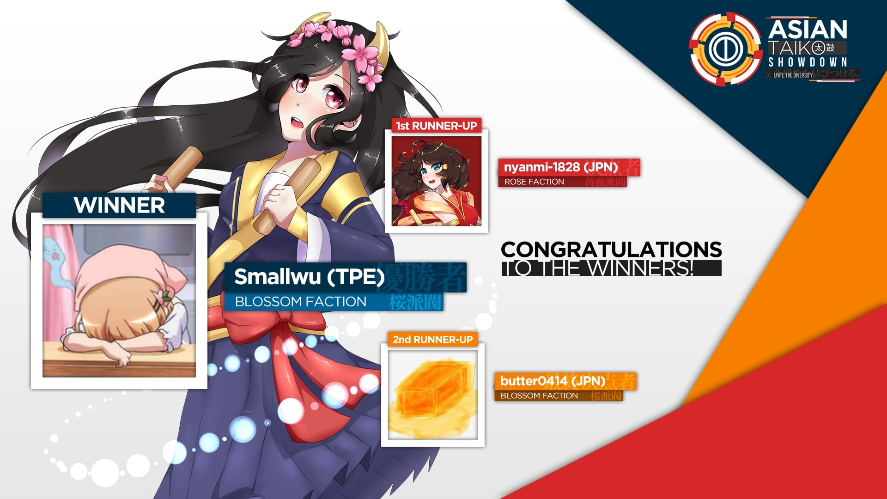
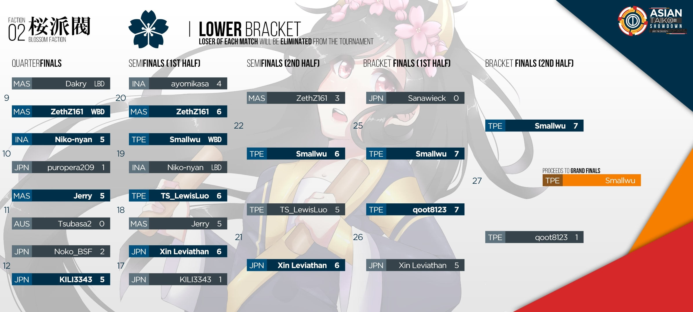

---
tags:
- Asian Taiko Showdown 2018
- ATS 2018
- ATS2018
---
# Asian Taiko Showdown 2018

> Unite the Diversity between us!

The **Asian Taiko Showdown 2018 _(ATS 2018)_**, is a double elimination one-on-one osu!taiko tournament hosted by ![][flag_ID] [fajar13k](/users/7100002). Previously, ATS was known as [Indonesian Taiko Showdown (IDTS)](/community/forums/topics/576070). This is the 2nd installment of the tournament and extension from the Indonesia region to Asia.

## Tournament Schedule

| Event | Timestamp |
| --: | :-- |
| Registration Phase | 2018-04-21/2018-05-26 |
| Live Drawings | 2018-05-27 (19:00 UTC +7) |
| Group Stage | 2018-06-02/2018-06-03 |
| Round of 16 | 2018-06-09/2018-06-10 |
| Quarterfinals | 2018-06-16/2018-06-17 |
| Semifinals | 2018-06-23/2018-06-24 |
| Finals | 2018-06-30/2018-07-01 |
| Grand Finals | 2018-07-08

## Prizes

| Placing | Prize(s) |
| :-: | :-- |
|  | 1 month of osu!supporter tag, userpage banner |
|  | Userpage banner |
|  | Userpage banner |

## Organisation

The Asian Taiko Showdown 2018 is run by various osu!taiko community members.

| Position | Member(s) |
| :-- | :-- |
| Organisers | ![][flag_ID] [fajar13k](/users/7100002), ![][flag_US] [JDrago14](/users/7690078) |
| Map Selectors | ![][flag_ID] [Lightning Wyvern](/users/1533122), ![][flag_ID] [Guardistack-](/users/1602428), ![][flag_MY] [cdhsausageboy](/users/2403621) |
| Commentators | ![][flag_AU] [Jaye](/users/4841352), ![][flag_ID] [Niko-nyan](/users/906991), ![][flag_CA] [janitoreihil](/users/3307897), ![][flag_US] [Das](/users/3165416) |
| Streamer | ![][flag_JP] [SakuraFrost-](/users/8147993) |
| Designers | ![][flag_PH] [OsuMe65](/users/852867), ![][flag_ID] [fajar13k](/users/7100002), ![][flag_CL] [Valelup](/users/6497014) |
| Referees | ![][flag_HK] [-GN Junior](/users/3901754), ![][flag_CL] [Valelup](/users/6497014), ![][flag_CL] [Asagaki](/users/2632902), ![][flag_PH] [Pochacco](/users/2927742), ![][flag_ID] [Alwaysyukaz](/users/4999506), ![][flag_HK] [tkdLolly](/users/9035344), ![][flag_ID] [pmriva](/users/2180885), ![][flag_ID] [XK2238](/users/1139209) |
| Translators | ![][flag_JP] [JUDYDANNY](/users/1165475), ![][flag_JP] [Noko\_BSF](/users/3811831), ![][flag_JP] [nyanmi-1828](/users/6866480) ![][flag_TW] [Smallwu](/users/2512120), ![][flag_HK] [tkdLolly](/users/9035344), ![][flag_KR] [Konpaku Sariel](/users/533502), ![][flag_KR] [MetalStream](/users/165027), ![][flag_KR] [404 AccNotFound](/users/980092) |
| Statisticians | ![][flag_ID] [fajar13k](/users/7100002), ![][flag_US] [JDrago14](/users/7690078) |

## Links

- [Discussion thread](/community/forums/topics/726251)
- [Livestream](https://www.twitch.tv/osutaikoshowdown)
- [Asian Taiko Showdown 2018 Discord](https://discord.gg/2xQDbkS)
- **[Asian Taiko Showdown 2018 Statistics](https://docs.google.com/spreadsheets/d/e/2PACX-1vSyFrwycrK7fnJp4RaaBbuiF-EPh6jcantui4KN-z4q9PUW8U1M4ubf9sNsKwQNz3k_0wWf-BSUNctU/pubhtml?gid=0)**

-----------------------

## Participants

| Seed | Members |
| :-- | :-- |
| Top | ![][flag_JP] [butter0414](/users/7935022), ![][flag_JP] [nyanmi-1828](/users/6866480), ![][flag_JP] [KILI3343](/users/11233651), ![][flag_MY] [Jerry](/users/605973), ![][flag_TW] [qoot8123](/users/766371), ![][flag_TW] [Smallwu](/users/2512120), ![][flag_TW] [TS\_LewisLuo](/users/4337536), ![][flag_JP] [toorun12](/users/10349712) |
| High | ![][flag_MY] [ZethZ161](/users/9912966), ![][flag_KR] [L y s](/users/211825), ![][flag_JP] [yyyyyyyyyyypetu](/users/468029), ![][flag_JP] [Noko\_BSF](/users/3811831), ![][flag_JP] [Xin Leviathan](/users/9575624), ![][flag_ID] [Niko-nyan](/users/906991), ![][flag_ID] [ayomikasa](/users/4866957), ![][flag_PH] [Jmeh07](/users/2852269) |
| Low | ![][flag_JP] [Sanawieck](/users/4125666), ![][flag_KR] [404 AccNotFound](/users/980092), ![][flag_ID] [Shirai-](/users/4221845), ![][flag_MY] [Dakry](/users/1994145), ![][flag_AU] [SpiritsUnite](/users/1198002), ![][flag_JP] [GlinT fraulein](/users/7364981), ![][flag_ID] [Braixen](/users/4871378), ![][flag_MY] [CrabCow](/users/9755504) |
| Bottom | ![][flag_JP] [Briesmas](/users/2865172), ![][flag_PH] [Micka](/users/2770422), ![][flag_JP] [puropera209](/users/2545134), ![][flag_AU] [Tsubasa2](/users/6835183), ![][flag_VN] [Taiko\_VN12](/users/10072828), ![][flag_AU] [Beat43210](/users/5664171), ![][flag_ID] [\_CaKy\_](/users/9828983), ![][flag_MY] [Bedwyr Aorta](/users/10875855), ![][flag_ID] [Jin Kun](/users/6896699), ![][flag_SG] [uchuuj1n](/users/9140302), ![][flag_MY] [Minisora](/users/9627666), ![][flag_PH] [-Zephy-](/users/6862483) |

## Groups

| Group | Top Seed | High Seed | Low Seed | Bottom Seed |
| :-: | :-- | :-- | :-- | :-- |
| **A** | ![][flag_MY] [Jerry](/users/605973) | ![][flag_JP] [Xin Leviathan](/users/9575624) | ![][flag_KR] [404 AccNotFound](/users/980092) | ![][flag_VN] [Taiko\_VN12](/users/10072828) |
| **B** | ![][flag_TW] [Smallwu](/users/2512120) | ![][flag_JP] [yyyyyyyyyyypetu](/users/468029) | ![][flag_MY] [Dakry](/users/1994145) | ![][flag_AU] [Beat43210](/users/5664171) |
| **C** | ![][flag_JP] [nyanmi-1828](/users/6866480) | ![][flag_KR] [L y s](/users/211825) | ![][flag_ID] [Braixen](/users/4871378) | ![][flag_AU] [Tsubasa2](/users/6835183) |
| **D** | ![][flag_TW] [qoot8123](/users/766371) | ![][flag_MY] [ZethZ161](/users/9912966) | ![][flag_MY] [CrabCow](/users/9755504) | ![][flag_PH] [Micka](/users/2770422) |
| **E** | ![][flag_JP] [toorun12](/users/10349712) | ![][flag_JP] [Noko\_BSF](/users/3811831) | ![][flag_JP] [Sanawieck](/users/4125666) | ![][flag_JP] [Briesmas](/users/2865172) |
| **F** | ![][flag_JP] [butter0414](/users/7935022) | ![][flag_ID] [Niko-nyan](/users/906991) | ![][flag_AU] [SpiritsUnite](/users/1198002) | ![][flag_SG] [uchuuj1n](/users/9140302) |
| **G** | ![][flag_TW] [TS\_LewisLuo](/users/4337536) | ![][flag_ID] [ayomikasa](/users/4866957) | ![][flag_ID] [Shirai-](/users/4221845) | ![][flag_MY] [Bedwyr Aorta](/users/10875855) |
| **H** | ![][flag_JP] [KILI3343](/users/11233651) | ![][flag_PH] [Jmeh07](/users/2852269) | ![][flag_JP] [GlinT fraulein](/users/7364981) | ![][flag_JP] [puropera209](/users/2545134) |

-----------------------

-----------------------

-----------------------

## Mappools

### Grand Finals

**[Download the mappack here! (65MB)](https://drive.google.com/file/d/18VwS0VHtsRC9zecGbM1ne_uszDDhkk3v/view?usp=sharing)**

- NoMod
  - [Colorful Sounds Port - ETERNAL DRAIN (Shirai-) \[MuzukATShii\]](/beatmapsets/625899/#taiko/1574085)
  - [A.I.TOYS - compressed eyes (\_Rise) \[Blindness Oni\]](/beatmapsets/527086/#taiko/1118318) 
  - [tarolabo - Miko (glalucard) \[Oni Miko\]](/beatmapsets/41212/#taiko/130323) 
  - [LeaF - ATHAZA (vzk) \[Fatal Oni\]](/beatmapsets/517281/#taiko/1174736)
  - [t+pazolite - !!!Chaos Time!!! (Kobaryo's FTN Remix) (sing216) \[iiiChaos On!iii\]](/beatmapsets/721195/#taiko/1522932)
- Hidden
  - [Reji - A Young Girl, So Vivid in the Night (S a n d) \[Sand's Taiko Oni\]](/beatmapsets/342499/#taiko/757048) 
  - [DECO*27 - Tsumi to Batsu (Cihyaa) \[Coin's Taiko\]](/beatmapsets/345191/#taiko/762382) 
- HardRock
  - [t+pazolite - Pee-Kan Breaks (Ulqui) \[Overlapse Oni\]](/beatmapsets/529539/#taiko/1122796) 
  - [NEKI<T - GaRaKuTic Dream (7_7) \[Oni\]](/beatmapsets/577572/#taiko/1222367) 
- DoubleTime
  - [SHK - Super Fantasy (aabc271) \[Inner Oni+\]](/beatmapsets/541523/#taiko/1148729)
  - [TOMOSUKE x Jazzin'park - LANA - Kiroku no Kakera (sasakure.UK Framework Remix) - (SKSalt) \[SK's Inner Oni\]](/beatmapsets/286025/#taiko/871725)
- Special
  - [Penoreri - Everlasting message (NewibornCLivee) \[xN.taiCLx\]](/beatmapsets/304775/#taiko/682755)
  - [Ryu* - !Viva! (Nofool) \[Insane Oni\]](/beatmapsets/799895/#taiko/1679280)
- FreeMod
  - [SOUND HOLIC Feat. Nana Takahashi - XINOBIKILL (Skull Kid) \[Shinobi Oni\]](/beatmapsets/742966/#taiko/1566951) 
  - [NekoMata L.E.D.Master+ - GAIA (glalucard) \[Taiko\]](/beatmapsets/94086/#taiko/253469)
- Tiebreaker
  - **[RoughSketch + DD""Metal - Booths of Fighters (Camellia's "Barrage of Flurries" Remix) (Guardistack-) \[STAnic\]](/beatmapsets/748030/#taiko/1695846)**

### Finals

**[Download the mappack here! (84MB)](https://drive.google.com/file/d/1y2tGdLhx3j8U7h7FZHDVjhvYxA7ouY-e/view?usp=sharing)**

- NoMod
  - [Innocent Key - Toho-Assisted-Speedrun!!! (Backfire) \[Taikocalypse\]](/beatmapsets/796419/#taiko/1672405)
  - [SWAN K feat. Asuka M - LOVE B.B.B (Zetera) \[Majin Oni (Tournament Edition)\]](/beatmapsets/606771/#taiko/1640328) 
  - [Igorrr - Tendon (DukeDukeDura) \[Amiable\]](/beatmapsets/737578/#taiko/1557717) 
  - [Ametsuchi Enikki - Reimei Sketchbook (Y O U T A) \[Sketch\]](/beatmapsets/571204/#taiko/1210546)
  - [Seiryu x t+pazolite - 256*256 (Nishizumi) \[65536\]](/beatmapsets/642870/#taiko/1362862)
- Hidden
  - [Halozy - Monosugoi Raivu de Cirno ga Sokohakatonaku Monosugoi Uta (Nofool) \[Hard Oni\]](/beatmapsets/411578/#taiko/893023) 
  - [Team:SASAKURATION - AVALON (Firce777) \[Firce777's Ura Oni\]](/beatmapsets/118763/#taiko/406755) 
- HardRock
  - [Kano - Yuudachi no Ribbon (Y O U T A) \[Ribbon\]](/beatmapsets/477178/#taiko/1019297) 
  - [mafumafu - Yuugure Semi Nikki (-\[ ix Ishida xi \]-) \[-\[ ix IshidaTaikonari xi \]-\]](/beatmapsets/83519/#taiko/230572) 
- DoubleTime
  - [AIKO OI - Limitless Possibility (tasuke912) \[Oni\]](/beatmapsets/585513/#taiko/1240275)
  - [mary - DAYBREAK FRONTLINE (Jerry) \[Daybreak Oni\]](/beatmapsets/609728/#taiko/1289501)
- Special
  - [DM Ashura - deltaMAX (Sayaka-) \[Oni\]](/beatmapsets/437153/#taiko/941375)
  - [#FFFFFF - Couleur=Blanche (cdhsausageboy) \[Impending Chaos\]](/beatmapsets/790827/#taiko/1659257)
- FreeMod
  - [PSYQUI - Hype feat. Such (KinomiCandy) \[Future Oni\]](/beatmapsets/777879/#taiko/1634000) 
  - [LeaF - Wizdomiot (JUDYDANNY) \[JuDa's Inner Oni\]](/beatmapsets/352682/#taiko/781859)
- Tiebreaker
  - **[BlackY - Harpuia -evolutionary extended ver- (Sand, Backfire) \[Sand x Backfire\]](/beatmapsets/523713/#taiko/1111804)**

### Semifinals

**[Download the mappack here! (81MB)](https://drive.google.com/file/d/17XmIGdwsdxLNYnkc7EoL0mLczF8VoUsw/view?usp=sharing)**

- NoMod
  - [Mitsuyoshi Takenobu no Ani - Amphisbaena (HiroK) \[Inner Oni\]](/beatmapsets/737973/#taiko/1557391)
  - [Sampling Masters MEGA - Kattobi KEIKYU Rider (7_7) \[Gatagoto Gatagoto Oni\]](/beatmapsets/673769/#taiko/1425840) 
  - [MASAKI - Scarlet Lance (m1kado) \[Inner Oni\]](/beatmapsets/681440/#taiko/1440822) 
  - [Camellia feat. nanahira - Kizuitara Shunkashuutou (shinchikuhome) \[Taiko Inner Oni\]](/beatmapsets/532994/#taiko/1129200)
  - [Camellia - /\*decryption(instrumental)\*/ (Nifty) \[Inner Oni\]](/beatmapsets/674049/#taiko/1426341)
- Hidden
  - [SON OF KICK - Hours ft. Lady Leshurr & Paigey Cakey (Nwolf) \[Nwolf's Oni\]](/beatmapsets/274111/#taiko/667471) 
  - [Ym1024 - orange tea (tasuke912) \[Oni\]](/beatmapsets/282369/#taiko/638541) 
- HardRock
  - [Renard - Smoke Tower (Grimbow) \[Grim Oni v2\]](/beatmapsets/269021/#taiko/1625314) 
  - [Rohi - Kanata ni Mau wa Sakura no Shirabe (Flower) \[Taiko Flower\]](/beatmapsets/111635/#taiko/291133) 
- DoubleTime
  - [Warak - Once Upon A Time (MMzz) \[Inner Oni\]](/beatmapsets/586418/#taiko/1241907)
  - [Sara - Natsuiro Present o BPM180 ni Shitemita (snowball112) \[Inner Oni\]](/beatmapsets/524050/#taiko/1112372)
- Special
  - [Warak - Cosmic Invaders (Lno) \[Oni\]](/beatmapsets/765624/#taiko/1609734)
  - [Zekk - Swampgator (Jaye) \[is better than trigger\]](/beatmapsets/758236/#taiko/1595006)
- FreeMod
  - [LeaF - Resurrection Spell (- Kagami Yuki -) \[Kagami's Taiko\]](/beatmapsets/178857/#taiko/430150) 
  - [EVO+ feat. GigaReol - [A]ddiction (KinomiCandy, MMzz, Y O U T A) \[Kinobles, MMzz & YOUTA's [C]ollaboration\]](/beatmapsets/491590/#taiko/1047519)
- Tiebreaker
  - **[Morimori Atsushi vs. uma - Noel (long ver.) (Ayyri) \[Ayyri's Oni\]](/beatmapsets/705224/#taiko/1491659)**

### Quarterfinals

**[Download the mappack here! (91 MB)](https://drive.google.com/file/d/1tlAk1b9H1VT5xbLEi08hEzEbFRAuze63/view?usp=sharing)**

- NoMod
  - [Renard - The Club (Nishizumi) \[Inner Oni\]](/beatmapsets/553809/#taiko/1172641)
  - [Renard - PIZZZZZZZZ (auopes) \[Inner Oni\]](/beatmapsets/762173/#taiko/1602516) 
  - [S3RL - Bass Slut (Original Mix) (naiya891) \[Slut Oniiiiiiiiiiiiii\]](/beatmapsets/520157/#taiko/1104911) 
  - [Tatsh - IMAGE -MATERIAL- <REFLEC BEAT Edition> (Nwolf) \[IMAGE -WEREONI-\]](/beatmapsets/163581/#taiko/398568)
  - [YUC'e - Chemical Cookie (KinomiCandy) \[ANOTHER ONI\]](/beatmapsets/747516/#taiko/1575117)
- Hidden
  - [Mystic Moon - The Zoo Zone (cdhsausageboy) \[Oni (ATS Ver.)\]](/beatmapsets/795265/#taiko/1670210) 
  - [Ayasa - Kou ! Tetsu ! Ketsu ! Sen ! -Ironbottom Sound- (S a n d) \[Inner Oni\]](/beatmapsets/519566/#taiko/1103735) 
- HardRock
  - [Project Grimoire - Caliburne \~Story of the Legendary sword\~ (-xNaCLx-) \[Saltaiko@NaCL\]](/beatmapsets/326711/#taiko/725333) 
  - [ginkiha + kamome sano - Dawn of Asia (TKS) \[Inner Oni\]](/beatmapsets/446239/#taiko/958486) 
- DoubleTime
  - [Meg & Dia - Monster (DotEXE Remix) (NewibornCLivee) \[NC's Inner Oni\]](/beatmapsets/157896/#taiko/386782) 
  - [cillia - Melt (mintong89) \[Oni\]](/beatmapsets/552915/#taiko/1171884) 
- Special
  - [REDALiCE - Volar (yoyo) \[yoyo's Special TaiKo\]](/beatmapsets/50932/#taiko/156304)
  - [BVB - My Awesome Flat Chest On The Ground (Nofool) \[Special Oni\]](/beatmapsets/706552/#taiko/1493980)
- FreeMod
  - [An - Abstreact (xfraczynho) \[First Impulse\]](/beatmapsets/620725/#taiko/1308564) 
  - [sak respect for Arata Iiyoshi - Reason of being (rew0825) \[Inner Oni\]](/beatmapsets/746440/#taiko/1573223)
- Tiebreaker
  - **[Asterisk - World's End, Girl's Rondo(Asterisk DnB Remix) (Steven1) \[Special*\]](/beatmapsets/551087/#taiko/1624252)**

### Round of 16

**[Download the mappack here! (105 MB)](https://drive.google.com/file/d/1dJbbGVljsn9AYSHsubbzfcmBc0cwPPh0/view?usp=sharing)**

- NoMod
  - [Kamui Gakupo, KAITO, Kagamine Len - Immoral Memory\~The Lost Memory\~ (7odoa) \[Taiko Oni\]](/beatmapsets/44898/#taiko/145660)
  - [dors k(uro) - dreeeeam (Vulkin) \[Inner Oni\]](/beatmapsets/788077/#taiko/1661560) 
  - [Haywyre - Insight (Guardistack-) \[Mini Satanic\]](/beatmapsets/739890/#taiko/1561061) 
  - [Inspector K - Disconnected Hardkore (CanBlaster Remix) (SE_Soul) \[SE_Soul Crazy Taiko\]](/beatmapsets/88094/#taiko/240302)
  - [The Ghost Of 3.13 - Forgotten (\[luanny_phnyx\]) \[phNyx's Taiko Oni\]](/beatmapsets/55560/#taiko/168807)
- Hidden
  - [Umetora - Ifuudoudou (a2805146) \[Oni\]](/beatmapsets/578927/#taiko/1225677) 
  - [Ryu* Vs. L.E.D.-G - PARADISE LOST (Frank7654321) \[Taiko\]](/beatmapsets/38043/#taiko/122471) 
- HardRock
  - [Acchi Kocchi Cast - Acchi de Kocchi de (TV Size) (kg2161012) \[KG's Taiko Oni\]](/beatmapsets/49967/#taiko/164702) 
  - [Junichi Masuda, Go Ichinose - Pokemon World Championships Final (Stefan) \[Final Oni\]](/beatmapsets/600544/#taiko/1268988) 
- DoubleTime
  - [MYTH & ROID - STYX HELIX (Nardoxyribonucleic) \[Nardo's Inner Oni\]](/beatmapsets/501705/#taiko/1160392) 
  - [Ikimono Gakari - Netsujou no Spectrum (Nofool) \[Oni\]](/beatmapsets/275309/#taiko/624413) 
- Special
  - [Skan & Krale - No Glory (feat. M.I.M.E & Drama B) (Myckoll & Ulqui) \[Myruki's Glory\]](/beatmapsets/725635/#taiko/1532116)
  - [Crash-TM - Untan Goose (Lno) \[Lno's Oni\]](/beatmapsets/299271/#taiko/671751)
- FreeMod
  - [happy30 - As the wind blows (Short Ver.) (Skylish) \[Skylish Windlish Oni\]](/beatmapsets/478670/#taiko/1229268) 
  - [LiLA'c Records - Aimless Voyage (Nepuri) \[Lost\]](/beatmapsets/679686/#taiko/1437286)
- Tiebreaker
  - **[IOSYS - Doutei Korose (Plua-) \[Taikorose-\]](/beatmapsets/653540/#taiko/1385416)**

### Group Stage

**[Download the mappack here! (77 MB)](https://drive.google.com/file/d/188OfTUx7h3CeBuWzNdVA5xZ9HjIFznm0/view?usp=sharing)**

- NoMod
  - [Hatsune Miku & Megpoid Gumi - Ashurashurashura (Mapper 31) \[31's Taiko\]](/beatmapsets/36248/#taiko/148859) 
  - [TK from Ling tosite sigure - unravel (TV edit) (Desperate-Kun) \[Inner Oni\]](/beatmapsets/206887/#taiko/487679) 
  - [ALiCE'S EMOTiON - Mami Mami Zone (OnosakiHito) \[Ono's Taiko Oni\]](/beatmapsets/43728/#taiko/143931) 
  - [LeaF - Aleph-0 (Nifty) \[Oni\]](/beatmapsets/675465/#taiko/1451091)
  - [Eluvietie - Helvetios (Grimbow & Lno) \[Collab Oni\]](/beatmapsets/324146/#taiko/742526)
- Hidden
  - [Hommarju - Rock It (Ayyri) \[Ayyri's Oni\]](/beatmapsets/703311/#taiko/1488043) 
  - [Anamanaguchi - Blackout City (Sushi) \[Taiko Oni\]](/beatmapsets/67226/#taiko/203101) 
- HardRock
  - [Mitsuki Nakae - Disappearing Queen (bossandy) \[Boss Taiko Oni\]](/beatmapsets/29582/#taiko/132499) 
  - [Maffalda - pensamento tipico de esquerda caviar (OnosakiHito) \[Oni\]](/beatmapsets/175036/#taiko/468992) 
- DoubleTime
  - [Gunther - Famous (bossandy) \[Boss Taiko Oni\]](/beatmapsets/47713/#taiko/148274) 
  - [senya - Kasoku Suru Koi wa Dare mo Tomerarenai (wmfchris) \[Wmf's Taiko Lite\]](/beatmapsets/80747/#taiko/249761) 
- Special
  - [Kana Nishino - Sweet Dreams (11t dnb remix) (ZethZ161) \[Goodnight\]](/beatmapsets/674708/#taiko/1427538)
  - [LiSA - Rising Hope -TV Ver.- (cdhsausageboy) \[fAlling inTo deSpair\]](/beatmapsets/767870/#taiko/1627201)
- FreeMod
  - [96neko - Uso no Hibana (Charlotte) \[Charlotte's Oni\]](/beatmapsets/767870/#taiko/1627201) 
  - [Ranko - Ashita mo Haremasu You ni (Kurai) \[Oni\]](/beatmapsets/78870/#taiko/220354)
- Tiebreaker
  - **[KikouHana - Nobore! Susume! Takai Tou (\[R\]) \[Continue!\]](/beatmapsets/548016/#taiko/1160620)**

### Eliminations Stage

**[Download the mappack here! (65MB)](https://drive.google.com/file/d/1u4bnB-9fznRFtVGSxuLYvB7ZonvH8gRK/view?usp=sharing)**

- NoMod
  - [yanaginagi - Owari no Sekai kara (Lundlerol) \[Lundle's Taiko\]](/beatmapsets/44854/#taiko/156706) 
  - [Comp - Touchuu Aika (Nwolf) \[Nwolf's Oni\]](/beatmapsets/198700/#taiko/473603) 
  - [nmk - sola (TKS) \[Oni\]](/beatmapsets/171239/#taiko/414274) 
- Hidden
  - [xi - .357 Magnum \[Ex's Oni\]](/beatmapsets/155749/#taiko/682957) 
  - [Pinocchio-P - Mushroom Mother (MMzz) \[Oni\]](/beatmapsets/88802/#taiko/241858) 
- HardRock
  - [Miyazaki Ayumi - brave heart (HeatKai) \[Heat's Oni\]](/beatmapsets/107222/#taiko/281048) 
  - [Alex C. feat. Yasmin K. - Angel Of Darkness (Nightcore Mix) (psj1226) \[Psj's Taiko\]](/beatmapsets/16489/#taiko/69439) 
- DoubleTime
  - [Matsumoto Tamaki - Tenshi Teki Kenpou Yonjou (aabc271) \[aabc's Taiko\]](/beatmapsets/43100/#taiko/137802) 
  - [SOUND HOLIC - CANDY POWDER (toarafict) \[Toara's Oni\]](/beatmapsets/172627/#taiko/459500) 
- FreeMod
  - [t+pazolite - Pumpin' Junkies (Nwolf) \[Nwolf's Lite Oni\]](/beatmapsets/364288/#taiko/991619) 
  - [Atoguru - Privilege (Alace) \[Pangko\]](/beatmapsets/43861/#taiko/138598)
- Tiebreaker
  - **[Demetori - Desire Drive ~ Desire Dream (OnosakiHito) \[Ono's Taiko Oni\]](/beatmapsets/42234#taiko/135188)**

------------------------------------------------------------------------

## Match Results

### Grand Finals

| Group | Sunday, 2018-07-08 |  |  |  |  | 
| :-: | --: | :-: | :-- | :-- | :-: |
| UB | nyanmi-1828 ![][flag_JP] | 2 | **7** | ![][flag_TW] **Smallwu** | [#1](/community/matches/43991727) |
| LB | **Smallwu** ![][flag_TW] | **7** | 0 | ![][flag_JP] nyanmi-1828 | -win by default- |

### Finals

| Group | Saturday, 2018-06-30 |  |  |  |  | 
| :-: | --: | :-: | :-- | :-- | :-: |
| UB | **nyanmi-1828** ![][flag_JP] | **7** | 1 | ![][flag_JP] butter0414 | [#1](/community/matches/43771414) |
| LB | **qoot8123** ![][flag_TW] | **7** | 5 | ![][flag_JP] Xin Leviathan | [#1](/community/matches/43779830) |

| Group | Sunday, 2018-07-01 |  |  |  |  | 
| :-: | --: | :-: | :-- | :-- | :-: |
| LB | Sanawieck ![][flag_JP] | 0 | **7** | ![][flag_TW] **Smallwu** | [#1](/community/matches/43803040) |
| LB | **Smallwu** ![][flag_TW] | **7** | 1 | ![][flag_TW] qoot8123 | [#1](/community/matches/43804465) |
| LB | butter0414 ![][flag_JP] | 0 | **7** | ![][flag_TW] **Smallwu** | [#1](/community/matches/43807559) |

### Semifinals

| Group | Saturday, 2018-06-23 |  |  |  |  | 
| :-: | --: | :-: | :-- | :-- | :-: |
| LB | ayomikasa ![][flag_ID] | 4 | **6** | ![][flag_MY] **ZethZ161** | [#1](/community/matches/43586711) |
| LB | **Xin Leviathan** ![][flag_JP] | **6** | 1 | ![][flag_JP] KILI3343 | [#1](/community/matches/43583803) |
| UB | qoot8123 ![][flag_TW] | 2 | **6** | ![][flag_JP] **butter0414** | [#1](/community/matches/43584932) |
| LB | **Smallwu** ![][flag_TW] | **6** | 0 | ![][flag_ID] Niko-nyan | -win by default- |

| Group | Sunday, 2018-06-24 |  |  |  |  | 
| :-: | --: | :-: | :-- | :-- | :-: |
| LB | **TS\_LewisLuo** ![][flag_TW] | **6** | 5 | ![][flag_MY] Jerry | [#1](/community/matches/43609032) |
| LB | ZethZ161 ![][flag_MY] | 3 | **6** | ![][flag_TW] **Smallwu** | [#1](/community/matches/43646954) |
| LB | TS\_LewisLuo ![][flag_TW] | 5 | **6** | ![][flag_JP] **Xin Leviathan** | [#1](/community/matches/43613894) |
| UB | **nyanmi-1828** ![][flag_JP] | **6** | 2 | ![][flag_JP] Sanawieck | [#1](/community/matches/43617099) |

### Quarterfinals

| Group | Saturday, 2018-06-16 |  |  |  |  | 
| :-: | --: | :-: | :-- | :-- | :-: |
| UB | Xin Leviathan ![][flag_JP] | 2 | **5** | ![][flag_JP] **nyanmi-1828** | [#1](/community/matches/43384244) |
| LB | **Jerry** ![][flag_MY] | **5** | 0 | ![][flag_AU] Tsubasa2 | [#1](/community/matches/43385309) |
| LB | **Niko-nyan** ![][flag_ID] | **5** | 1 | ![][flag_JP] puropera209 | [#1](/community/matches/43385319) |
| UB | Smallwu ![][flag_TW] | 0 | **5** | ![][flag_TW] **qoot8123** | [#1](/community/matches/43391517) |

| Group | Sunday, 2018-06-17 |  |  |  |  | 
| :-: | --: | :-: | :-- | :-- | :-: |
| UB | **Sanawieck** ![][flag_JP] | **5** | 3 | ![][flag_TW] TS\_LewisLuo | [#1](/community/matches/43413311) |
| LB | Dakry ![][flag_MY] | 0 | **5** | ![][flag_MY] **ZethZ161** | -win by default- |
| UB | **butter0414** ![][flag_JP] | **5** | 3 | ![][flag_ID] ayomikasa | [#1](/community/matches/43414816) |
| LB | Noko\_BSF ![][flag_JP] | 2 | **5** | ![][flag_JP] **KILI3343** | [#1](/community/matches/43415768) |

### Round of 16

| Group | Saturday, 2018-06-09 |  |  |  |  | 
| :-: | --: | :-: | :-- | :-- | :-: |
| UB | **Xin Leviathan** ![][flag_JP] | **5** | 3 | ![][flag_MY] Dakry | [#1](/community/matches/43186328) |
| UB | **Sanawieck** ![][flag_JP] | **5** | 0 | ![][flag_ID] Niko-nyan | -win by default- |
| UB | Jerry ![][flag_MY] | 4 | **5** | ![][flag_TW] **Smallwu** | [#1](/community/matches/43194107) |

| Group | Sunday, 2018-06-10 |  |  |  |  | 
| :-: | --: | :-: | :-- | :-- | :-: |
| UB | Tsubasa2 ![][flag_AU] | 0 | **5** | ![][flag_TW] **qoot8123** | [#1](/community/matches/43218564) |
| UB | **TS\_LewisLuo** ![][flag_TW] | **5** | 0 | ![][flag_JP] puropera209 | [#1](/community/matches/43219599) |
| UB | **nyanmi-1828** ![][flag_JP] | **5** | 0 | ![][flag_MY] ZethZ161 | -win by default- |
| UB | Noko\_BSF ![][flag_JP] | 0 | **5** | ![][flag_JP] **butter0414** | -win by default- |
| UB | **ayomikasa** ![][flag_ID] | **5** | 1 | ![][flag_JP] KILI3343 | [#1](/community/matches/43221245) |

### Group Stage

| Group | Saturday, 2018-06-02 |  |  |  |  | 
| :-: | --: | :-: | :-- | :-- | :-: |
| C | **nyanmi-1828** ![][flag_JP] | **4** | 1 | ![][flag_KR] L y s | [#1](/community/matches/42979943) |
| D | **qoot8123** ![][flag_TW] | **4** | 0 | ![][flag_PH] Micka | [#1](/community/matches/42979761) |
| B | Smallwu ![][flag_TW] | 0 | 0 | ![][flag_JP] yyyyyyyyyyypetu | -nullified- |
| G | **ayomikasa** ![][flag_ID] | **4** | 0 | ![][flag_MY] Bedwyr Aorta | [#1](/community/matches/42980581) |
| F | **butter0414** ![][flag_JP] | **4** | 1 | ![][flag_ID] Niko-nyan | [#1](/community/matches/42981652) |
| H | **Jmeh07** ![][flag_PH] | **4** | 3 | ![][flag_JP] GlinT fraulein | [#1](/community/matches/42981801) |
| H | **KILI3343** ![][flag_JP] | **4** | 0 | ![][flag_JP] puropera209 | [#1](/community/matches/42983025) |
| C | L y s ![][flag_KR] | 0 | **4** | ![][flag_AU] **Tsubasa2** | -win by default- |
| F | **butter0414** ![][flag_JP] | **4** | 0 | ![][flag_AU] SpiritsUnite | [#1](/community/matches/42982589) |
| E | **Noko\_BSF** ![][flag_JP] | **4** | 2 | ![][flag_JP] Briesmas | [#1](/community/matches/42984024) |
| F | **Niko-nyan** ![][flag_ID] | **4** | 1 | ![][flag_AU] SpiritsUnite | [#1](/community/matches/42983966) |
| D | **qoot8123** ![][flag_TW] | **4** | 2 | ![][flag_MY] ZethZ161 | [#1](/community/matches/42984090) |
| A | **Jerry** ![][flag_MY] | **4** | 0 | ![][flag_KR] 404 AccNotFound | -win by default- |
| D | CrabCow ![][flag_MY] | 0 | 0 | ![][flag_PH] Micka | -nullified- |
| E | toorun12 ![][flag_JP] | 1 | **4** | ![][flag_JP] **Sanawieck** | [#1](/community/matches/42985601) |
| F | **butter0414** ![][flag_JP] | **4** | 0 | ![][flag_SG] uchuuj1n | [#1](/community/matches/42985633) |
| B | **Smallwu** ![][flag_TW] | **4** | 0 | ![][flag_MY] Dakry | [#1](/community/matches/42987313) |
| C | L y s ![][flag_KR] | 0 | **4** | ![][flag_ID] **Braixen** | -win by default- |
| F | **Niko-nyan** ![][flag_ID] | **4** | 0 | ![][flag_SG] uchuuj1n | [#1](/community/matches/42987345) |
| G | ayomikasa ![][flag_ID] | 2 | **4** | ![][flag_ID] **Shirai-** | [#1](/community/matches/42989100) |
| E | **Sanawieck** ![][flag_JP] | **4** | 2 | ![][flag_JP] Briesmas | [#1](/community/matches/42989256) |
| D | **qoot8123** ![][flag_TW] | **4** | 0 | ![][flag_MY] CrabCow | -win by default- |
| H | GlinT fraulein ![][flag_JP] | 0 | **4** | ![][flag_JP] **puropera209** | -win by default- |
| G | **Shirai-** ![][flag_ID] | **4** | 1 | ![][flag_MY] Bedwyr Aorta | [#1](/community/matches/42991227) |

| Group | Sunday, 2018-06-03 |  |  |  |  | 
| :-: | --: | :-: | :-- | :-- | :-: |
| B | **Dakry** ![][flag_MY] | **4** | 2 | ![][flag_AU] Beat43210 | [#1](/community/matches/43007113) |
| H | **KILI3343** ![][flag_JP] | **4** | 1 | ![][flag_PH] Jmeh07 | [#1](/community/matches/43013154) |
| C | **nyanmi-1828** ![][flag_JP] | **4** | 0 | ![][flag_AU] Tsubasa2 | [#1](/community/matches/43013166) |
| A | Jerry ![][flag_MY] | 3 | **4** | ![][flag_JP] **Xin Leviathan** | [#1](/community/matches/43014229) |
| G | **TS\_LewisLuo** ![][flag_TW] | **4** | 3 | ![][flag_ID] ayomikasa | [#1](/community/matches/43014204) |
| E | toorun12 ![][flag_JP] | 2 | **4** | ![][flag_JP] **Noko\_BSF** | [#1](/community/matches/43015077) |
| C | Braixen ![][flag_ID] | 0 | **4** | ![][flag_AU] **Tsubasa2** | [#1](/community/matches/43015077) |
| A | **Xin Leviathan** ![][flag_JP] | **4** | 0 | ![][flag_KR] 404 AccNotFound | -win by default- |
| E | Noko\_BSF ![][flag_JP] | 0 | **4** | ![][flag_JP] **Sanawieck** | [#1](/community/matches/43016212) |
| A | **404 AccNotFound** ![][flag_KR] | **4** | 0 | ![][flag_VN] Taiko\_VN12 | -win by default- |
| D | **ZethZ161** ![][flag_MY] | **4** | 0 | ![][flag_MY] CrabCow | -win by default- |
| C | **nyanmi-1828** ![][flag_JP] | **4** | 0 | ![][flag_ID] Braixen | [#1](/community/matches/43017203) |
| H | **Jmeh07** ![][flag_PH] | **4** | 2 | ![][flag_JP] puropera209 | [#1](/community/matches/43017361) |
| B | **yyyyyyyyyyypetu** ![][flag_JP] | **4** | 1 | ![][flag_AU] Beat43210 | [#1](/community/matches/43017420) |
| G | **TS\_LewisLuo** ![][flag_TW] | **4** | 0 | ![][flag_ID] Shirai- | -win by default- |
| E | toorun12 ![][flag_JP] | 3 | **4** | ![][flag_JP] **Briesmas** | [#1](/community/matches/43018109) |
| A | **Jerry** ![][flag_MY] | **4** | 0 | ![][flag_VN] Taiko\_VN12 | -win by default- |
| D | **ZethZ161** ![][flag_MY] | **4** | 1 | ![][flag_PH] Micka | [#1](/community/matches/43018296) |
| B | yyyyyyyyyyypetu ![][flag_JP] | 3 | **4** | ![][flag_MY] **Dakry** | [#1](/community/matches/43019555) |
| B | **Smallwu** ![][flag_TW] | **4** | 1 | ![][flag_AU] Beat43210 | [#1](/community/matches/43020029) |
| H | **KILI3343** ![][flag_JP] | **4** | 1 | ![][flag_JP] GlinT fraulein | [#1](/community/matches/43021191) |
| F | **SpiritsUnite** ![][flag_AU] | **4** | 0 | ![][flag_SG] uchuuj1n | -win by default- |
| A | **Xin Leviathan** ![][flag_JP] | **4** | 0 | ![][flag_VN] Taiko\_VN12 | -win by default- |
| G | **TS\_LewisLuo** ![][flag_TW] | **4** | 1 | ![][flag_MY] Bedwyr Aorta | [#1](/community/matches/43024126) |

### Eliminations

| Group | Friday, 2018-06-01 |  |  |  |  | 
| :-: | --: | :-: | :-- | :-- | :-: |
| EM | **Beat43210** ![][flag_AU] | **3** | 0 | ![][flag_MY] Minisora | -win by default- |
| EM | **Bedwyr Aorta** ![][flag_MY] | **3** | 0 | ![][flag_ID] Jin Kun | -win by default- |
| EM | **Taiko\_VN12** ![][flag_VN] | **3** | 0 | ![][flag_PH] -Zephy- | -win by default- |
| EM | \_CaKy\_ ![][flag_ID] | 0 | **3** | ![][flag_SG] **uchuuj1n** | [#1](/community/matches/42923346) |

------------------------------------------------------------------------

## Ruleset

### Tournament Rules

1. The Asian Taiko Showdown is a one-on-one osu!taiko tournament.
2. In order for your registration to count, you must meet following conditions:
    - Participant must fill out the provided form.
    - Participant's Flag on their profile must be a country from **Asia.**
    - Maximum Performance Points (PP) allowed for participant to register is **8,500pp.**
    - Participant's account must be **6 months old or older.**
3. Map scoring is based on **Score V2.**
4. Match schedule will be settled by the Organisers (see below).
5. If no staff or referee is available, the match will be postponed.
6. Failed plays will result with the enemy's winning by default.
7. If the match ends in a draw, the game will be nullified and proceed to the next pick, selected by the next player.
8. If a player doesn't show up within **10 minutes** of the start time, the enemy wins by default.
9. If a player disconnects, it will be treated as if they failed the map.
   - Disconnects within 30 seconds after map begin can be rematched.
10. If a player disconnects between the beatmaps, the match can be delayed up to 10 minutes max.
    - In case the disconnected player exceed 10 minutes max. this will result with the enemy's winning by default.
11. In Group stage, 'Win by default' will be considered as win by 4:0, +1.0 score difference ratio.
12. Unexpected incidences are handled by the tournament management. Referees may allow higher tolerance depending on the given circumstances. This is up to their discretion.

### Stage Instructions

1. In the first stage (Group Stage), the players will be divided into 8 groups of 6 players.
2. All the players from each group will face each other.
3. The top 4 players of each group will move on to the Knock-Out Stages.
4. Following stages are Double Elimination Stages. This means that the winner moves to the next stage and the losing player gets moved to the Loser bracket.

### Match Instructions

1. A referee will create a multiplayer room 15 minutes in advance. Players must gather during this period.
   - Room settings are osu!taiko, Head To Head, Win Condition: 'Score V2'. Room name must be "ATS 2018: (TeamBlue) vs (TeamRed)".
   - The player mentioned first in the room name must be the blue team, the team mentioned second in the room name must be the red team.
2. Each player is free to select up to one warm-up beatmap. Using beatmaps with questionable content is prohibited. All maps must be osu!taiko specific maps.
3. Each player has to ban **one beatmap** to be selected from the pool. These beatmaps are not allowed to be picked by any player during the entire match.
4. Beatmap selection will alternate between each player selecting a beatmap out of the mappool.
5. Each player must use "!roll" once in #multiplayer.
   - The winner of the !roll starts picking the first beatmap of the match.
   - The loser of the !roll starts banning.
6. Players may pick freely from any bracket.
   - In case of a tie, the Tiebreaker map must be played.

### Mappool Instructions

1. There will be 1 mappool for the Group Stage, 1 mappool for the Round of 16, 1 mappool for the Quarterfinals, 1 mappool for the Semifinals, 1 mappool for the Finals, and 1 mappool for the Grand Finals.
2. Each mappool consists of 6 brackets: NoMod, [Hidden](/wiki/Game_Modifiers), [HardRock](/wiki/Game_Modifiers), [DoubleTime](/wiki/Game_Modifiers), Special, and FreeMod.
3. Each mappool consists of 16 maps in total.
4. Each mappool has one Tiebreaker.
5. The NoMod bracket will be played with no mods activated.
6. The Special bracket is harder version of NoMod bracket with more map variants, it will be played with no mods activated.
7. The Hidden, HardRock and DoubleTime bracket will be played with the respective mods activated.
8. The FreeMod bracket will have FreeMod activated. Every individual player can pick Hidden, HardRock, both, or NoMod.
9. The Tiebreaker will be played under NoMod conditions.
   - In case of a tie, the Tiebreaker will be replayed again with FreeMod activated.
10. The mappool consists of following format:
   - 5 NoMod
   - 2 Hidden
   - 2 HardRock
   - 2 DoubleTime
   - 2 Special
   - 2 FreeMod
   - 1 Tiebreaker

### Scheduling Instructions

1. Each stage will be held on **a single weekend**.
2. All Double Elimination Stages will be held on either Saturday or Sunday, UTC +7.
3. Scheduling will be handled by the Organisers. Schedules will be released on the Sunday after current stage is finished. Reschedules are allowed, however must be agreed on by both players and proof must be provided.

### Winning Conditions

1. In Group Stage, you need to win 4 beatmaps to win a match. (Best-of-7)
2. In the Round of 16 and the Quarterfinals, you need to win 5 beatmaps to win a match. (Best-of-9)
3. In Semifinals, you need to win 6 beatmaps to win a match. (Best-of-11)
4. In the **Finals and Grand Finals**, you need to win 7 beatmaps to win a match. (Best-of-13)

[flag_AU]: /wiki/shared/flag/AU.gif
[flag_CA]: /wiki/shared/flag/CA.gif
[flag_CL]: /wiki/shared/flag/CL.gif
[flag_HK]: /wiki/shared/flag/HK.gif
[flag_ID]: /wiki/shared/flag/ID.gif
[flag_JP]: /wiki/shared/flag/JP.gif
[flag_KR]: /wiki/shared/flag/KR.gif
[flag_MY]: /wiki/shared/flag/MY.gif
[flag_PH]: /wiki/shared/flag/PH.gif
[flag_SG]: /wiki/shared/flag/SG.gif
[flag_TW]: /wiki/shared/flag/TW.gif
[flag_US]: /wiki/shared/flag/US.gif
[flag_VN]: /wiki/shared/flag/VN.gif