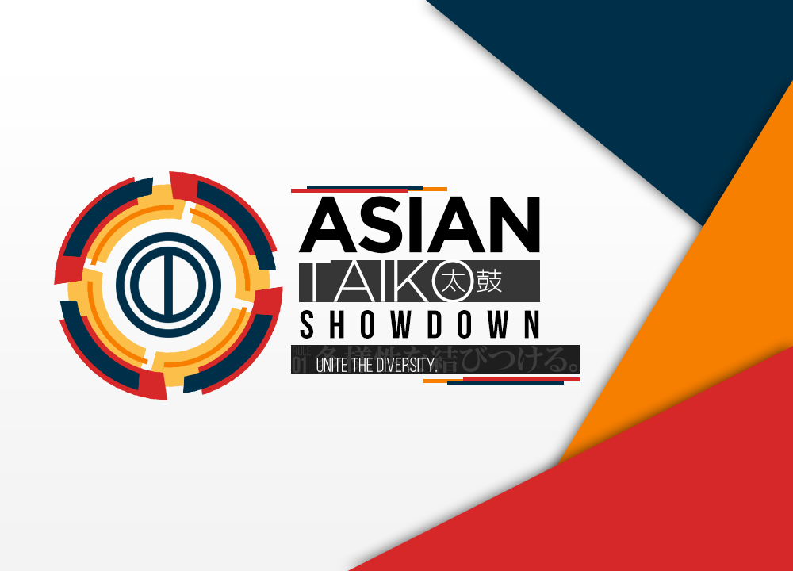

---
tags:
- ATS 2018
- ATS2018
---
Asian Taiko Showdown 2018
=============================

> Unite the Diversity between us!

**Asian Taiko Showdown 2018 _(ATS 2018)_** 是由 ![][flag_ID] [fajar13k](https://osu.ppy.sh/users/7100002) 舉辦，以雙敗淘汰制形式進行的單對單比賽。
本比賽的前身為 [Indonesian Taiko Showdown (IDTS)](https://osu.ppy.sh/community/forums/topics/576070) ，此為其第二屆比賽，規模由印度尼西亞擴展至亞洲地區。

## 比賽賽程表

| 階段  | 時間 |
| ---: | :--- |
| 報名 | 2018-04-21/2018-05-26 |
| 分組 | 2018-05-27 (19:00 UTC +7) |
| 小組賽 | 2018-06-02/2018-06-03 |
| 三十二強 | 2018-06-09/2018-06-10 |
| 十六強 | 2018-06-16/2018-06-17 |
| 八強 | 2018-06-23/2018-07-24 |
| 四強 | 2018-06-30/2018-07-01 |
| 決賽 | 2018-07-07/2018-07-08 |
| 總決賽 | 2018-07-15 |

## 獎品

| 名次 | 獎品 |
| --- | :--- |
|  | 特製徽章 及 個人版面橫額 |
|  | 個人版面橫額 |
|  | 個人版面橫額 |

 *正在考慮分發更多獎品。*

## 工作人員

The Asian Taiko Showdown 2018 由各位 osu!taiko 社群成員營運。

| 職位 | 成員 |
| ------------ | -------------- |
| 主辦 | ![][flag_ID] [fajar13k](https://osu.ppy.sh/users/7100002), ![][flag_US] [JDrago14](https://osu.ppy.sh/users/7690078) |(https://osu.ppy.sh/users/1533122), ![][flag_ID] [Guardistack-](https://osu.ppy.sh/users/1602428), ![][flag_MY] [cdhsausageboy](https://osu.ppy.sh/users/2403621) |
| 評論 | ![][flag_AU] [Jaye](https://osu.ppy.sh/users/4841352), ![][flag_ID] [Niko-nyan](https://osu.ppy.sh/users/906991), ![][flag_CA] [janitoreihil](https://osu.ppy.sh/users/3307897) |
| 直播 | ![][flag_ID] [rap12](https://osu.ppy.sh/users/2300279), ![][flag_JP] [SakuraFrost-](https://osu.ppy.sh/users/8147993) |
| 美術 | ![][flag_PH] [OsuMe65](https://osu.ppy.sh/users/852867), ![][flag_ID] [fajar13k](https://osu.ppy.sh/users/7100002), ![][flag_CL] [Valelup](https://osu.ppy.sh/users/6497014) |
| 裁判 | ![][flag_HK] [-GN Junior](https://osu.ppy.sh/users/3901754), ![][flag_CL] [Valelup](https://osu.ppy.sh/users/6497014), ![][flag_CL] [Asagaki](https://osu.ppy.sh/users/2632902), ![][flag_PH] [Pochacco](https://osu.ppy.sh/users/2927742), ![][flag_ID] [Alwaysyukaz](https://osu.ppy.sh/users/4999506), ![][flag_KR] [MetalStream](https://osu.ppy.sh/users/165027), ![][flag_HK] [tkdLolly](https://osu.ppy.sh/users/9035344), ![][flag_ID] [pmriva](https://osu.ppy.sh/users/2180885), ![][flag_ID] [XK2238](https://osu.ppy.sh/users/1139209) |
| 翻譯 | ![][flag_JP] [JUDYDANNY](https://osu.ppy.sh/users/1165475), ![][flag_JP] [Noko_BSF](https://osu.ppy.sh/users/3811831), ![][flag_JP] [nyanmi-1828](https://osu.ppy.sh/users/6866480) ![][flag_TW] [Smallwu](https://osu.ppy.sh/users/2512120), ![][flag_HK] [tkdLolly](https://osu.ppy.sh/users/9035344), ![][flag_KR] [Konpaku Sariel](https://osu.ppy.sh/users/533502), ![][flag_KR] [MetalStream](https://osu.ppy.sh/users/165027), |
| 統計 | ![][flag_ID] [Aozora-](https://osu.ppy.sh/users/6918206), ![][flag_US] [JDrago14](https://osu.ppy.sh/users/7690078) |

## 連結

- [大賽討論頁面](https://osu.ppy.sh/community/forums/topics/726251)
- [賽事直播連結](https://www.twitch.tv/idtslive)
- [比賽報名表格](https://goo.gl/forms/Z40RvcISgnMKNwGf2)
- [圖池建議表格 ](https://goo.gl/forms/3mUBHYnKsusX03jC2)
- [比賽專用Discord](https://discord.gg/2xQDbkS)

-----------------------

## 參賽者

 *參賽者將在報名階段結束後被列出。*
 
-----------------------

## 圖池

 *圖池將會在每個階段的前一週揭曉。*

------------------------------------------------------------------------

## 規則
### 賽事規則

1. Asian Taiko Showdown 以單對單的形式進行，為 osu!taiko 模式的比賽。

2. 有意參賽者須達到以下條件方接受報名：
    - 報名參賽者必須填寫相關報名表格。
    - 報名參賽者之國家旗幟須為亞洲地區。
    - 報名參賽者不得逾8,500pp。
    - 報名參賽者之帳戶須註冊滿六個月或以上。
3. 計分方法為 **Score V2**。
4. 賽程將由主辦單位安排。
5. 倘若裁判或主辦單位成員無法出席賽事，將予以延期處理。
6. 一方無法取得合格視作對方勝論。
7. 和局不予計分，由另一方選譜繼續比賽。
8. 開賽十分鐘後仍然缺席作棄權論。
9. 一方斷線作該譜面不合格論。
   - 開始三十秒內斷線則可作重賽。
10. 選譜期間斷線最多可以暫停比賽十分鐘等待。
    - 斷線逾十分鐘者作棄權論。
11. 小組賽中，因對方棄權而勝者視為以四比零比數勝出。
12. 突發事件應交由主辦單位解決；裁判可以酌情作出判斷。

### 階段說明

1. 在小組賽階段，參賽者將被分為八組，每組六人。

2. 每組參賽者將互相對決。
3. 每組前四名將獲晉級。
4. 小組賽以後的賽事為雙敗淘汰制。

### 比賽說明

1. 裁判將於每局對賽十五分鐘前建立房間。參賽者務必準時到達。
   - 房間相關設定為：osu!taiko，Head to Head，勝利條件為＂Score V2＂。房名必為＂ATS 2018: (藍方) vs (紅方)＂。
   - 房間名字中首先出現的參賽者名稱須為藍組，其次者須為紅組。
2. 每位參賽者可以自由選擇一張熱身譜面。禁止選擇內容不雅的譜面，或是非太鼓專用之譜面。
3. 每位參賽者各需禁用 **一張譜面** ，於該場比賽期間不得作為可選譜面。
4. 每位參賽者輪流由圖池選擇譜面。

5. 每位參賽者須在 #multiplayer 使用 「!roll」指令。
   - !roll 值較高者可以首先選擇比賽譜面。
   - !roll 值較低者可以首先ban圖
6. 玩家可以從圖池中任意選擇一張譜面。
   - 和局者須由TieBreaker譜面以決勝負。

### 圖池說明

1. 各個階段皆會使用各不相同的圖池。
   - 但決賽及總決賽使用相同的圖池
2. 每個圖池皆由 NoMod、[Hidden](/wiki/Game_Modifiers)、[HardRock](/wiki/Game_Modifiers)、[DoubleTime](/wiki/Game_Modifiers)、Special 以及 FreeMod 組成。
3. 每個圖池皆有 16 張譜面。
4. 每個圖池皆有 1 張 TieBreaker。
5. NoMod 將在不使用任何Mod的狀況下遊玩。
6. Special 相較於NoMod更難且有更多花樣，其將在不使用任何Mod的狀況下遊玩。
7. Hidden、HardRock 以及 DoubleTime 將在開啟它們各自的Mod的狀況下遊玩。
8. FreeMod 可允許使用NoMod，HardRock，Hidden 或是兩者皆用的狀況下遊玩

9. TieBreaker 將以NoMod的狀況下遊玩。
   - 假若平局，TieBreaker將會以FreeMod再次被遊玩。
10. 圖池由以下格式組成：
   - 5 張NoMod
   - 2 張Hidden
   - 2 張HardRock
   - 2 張DoubleTime
   - 2 張Special
   - 2 張FreeMod
   - 1 張TieBreaker

### 賽程說明

1. 每階段的比賽都會被安排在 **單個週末** 內舉行。

2. 所有的雙淘汰階段都會被安排在週六或週日(UTC+7)舉行。
3. 賽程由主辦單位安排。時間表將會在當前階段之所有比賽結束後的星期天被公布。重新安排賽程是允許的，但選手雙方皆必須同意，且必須提供證據。

### 勝利條件
1. 小組賽階段 為 7 戰 4 勝制，獲得 4 勝方可勝出。

2. 十六強 和 八強階段 為 9 戰 5 勝制，獲得 5 勝方可勝出。
3. 四強階段 為 11 戰 6 勝制，獲得 6 勝方可勝出。
4. 決賽 和 總決賽 為 13 戰 7 勝制，獲得 7 勝方可勝出。

[flag_AU]: /wiki/shared/flag/AU.gif
[flag_CA]: /wiki/shared/flag/CA.gif
[flag_CL]: /wiki/shared/flag/CL.gif
[flag_HK]: /wiki/shared/flag/HK.gif
[flag_ID]: /wiki/shared/flag/ID.gif
[flag_JP]: /wiki/shared/flag/JP.gif
[flag_KR]: /wiki/shared/flag/KR.gif
[flag_MY]: /wiki/shared/flag/MY.gif
[flag_PH]: /wiki/shared/flag/PH.gif
[flag_TW]: /wiki/shared/flag/TW.gif
[flag_US]: /wiki/shared/flag/US.gif
