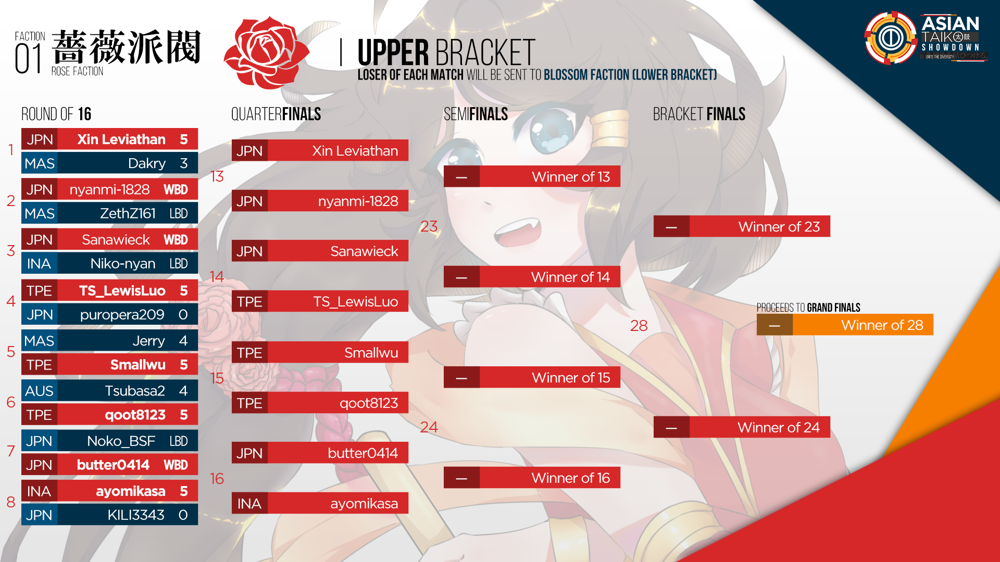

---
tags:
- ATS 2018
- ATS2018
---
Asian Taiko Showdown 2018
=============================

> Unite the Diversity between us!

**Asian Taiko Showdown 2018 _(ATS 2018)_** 是由 ![][flag_ID] [fajar13k](https://osu.ppy.sh/users/7100002) 舉辦，以雙敗淘汰制形式進行的單對單比賽。
本比賽的前身為 [Indonesian Taiko Showdown (IDTS)](https://osu.ppy.sh/community/forums/topics/576070) ，此為其第二屆比賽，規模由印度尼西亞擴展至亞洲地區。

## 比賽賽程表

| 階段  | 時間 |
| ---: | :--- |
| 報名 | 2018-04-21/2018-05-26 |
| 分組 | 2018-05-27 (19:00 UTC +7) |
| 小組賽 | 2018-06-02/2018-06-03 |
| 十六強 | 2018-06-09/2018-06-10 |
| 八強 | 2018-06-16/2018-06-17 |
| 四強 | 2018-06-23/2018-06-24 |
| 決賽 | 2018-06-30/2018-07-01 |
| 總決賽 | 2018-07-08 |

## 獎品

| 名次 | 獎品 |
| --- | :--- |
|  | 特製徽章 及 個人版面橫額 |
|  | 個人版面橫額 |
|  | 個人版面橫額 |

 *正在考慮分發更多獎品。*

## 工作人員

The Asian Taiko Showdown 2018 由各位 osu!taiko 社群成員營運。

| 職位 | 成員 |
| ------------ | -------------- |
| 主辦 | ![][flag_ID] [fajar13k](https://osu.ppy.sh/users/7100002), ![][flag_US] [JDrago14](https://osu.ppy.sh/users/7690078) |
| 選譜 | ![][flag_ID] [Lightning Wyvern](https://osu.ppy.sh/users/1533122), ![][flag_ID] [Guardistack-](https://osu.ppy.sh/users/1602428), ![][flag_MY] [cdhsausageboy](https://osu.ppy.sh/users/2403621) |
| 評論 | ![][flag_AU] [Jaye](https://osu.ppy.sh/users/4841352), ![][flag_ID] [Niko-nyan](https://osu.ppy.sh/users/906991), ![][flag_CA] [janitoreihil](https://osu.ppy.sh/users/3307897), ![][flag_US] [Das](https://osu.ppy.sh/users/3165416) |
| 直播 | ![][flag_ID] [rap12](https://osu.ppy.sh/users/2300279), ![][flag_JP] [SakuraFrost-](https://osu.ppy.sh/users/8147993) |
| 美術 | ![][flag_PH] [OsuMe65](https://osu.ppy.sh/users/852867), ![][flag_ID] [fajar13k](https://osu.ppy.sh/users/7100002), ![][flag_CL] [Valelup](https://osu.ppy.sh/users/6497014) |
| 裁判 | ![][flag_HK] [-GN Junior](https://osu.ppy.sh/users/3901754), ![][flag_CL] [Valelup](https://osu.ppy.sh/users/6497014), ![][flag_CL] [Asagaki](https://osu.ppy.sh/users/2632902), ![][flag_PH] [Pochacco](https://osu.ppy.sh/users/2927742), ![][flag_ID] [Alwaysyukaz](https://osu.ppy.sh/users/4999506), ![][flag_HK] [tkdLolly](https://osu.ppy.sh/users/9035344), ![][flag_ID] [pmriva](https://osu.ppy.sh/users/2180885), ![][flag_ID] [XK2238](https://osu.ppy.sh/users/1139209) |
| 翻譯 | ![][flag_JP] [JUDYDANNY](https://osu.ppy.sh/users/1165475), ![][flag_JP] [Noko_BSF](https://osu.ppy.sh/users/3811831), ![][flag_JP] [nyanmi-1828](https://osu.ppy.sh/users/6866480) ![][flag_TW] [Smallwu](https://osu.ppy.sh/users/2512120), ![][flag_HK] [tkdLolly](https://osu.ppy.sh/users/9035344), ![][flag_KR] [Konpaku Sariel](https://osu.ppy.sh/users/533502), ![][flag_KR] [MetalStream](https://osu.ppy.sh/users/165027), ![][flag_KR] [404 AccNotFound](https://osu.ppy.sh/users/980092) |
| 統計 | ![][flag_ID] [Aozora-](https://osu.ppy.sh/users/6918206), ![][flag_US] [JDrago14](https://osu.ppy.sh/users/7690078) |

## 連結

- [大賽討論頁面](https://osu.ppy.sh/community/forums/topics/726251)
- [賽事直播連結](https://www.twitch.tv/osutaikoshowdown)
- [比賽報名表格](https://goo.gl/forms/Z40RvcISgnMKNwGf2)
- [圖池建議表格 ](https://goo.gl/forms/3mUBHYnKsusX03jC2)
- [比賽專用Discord](https://discord.gg/2xQDbkS)
- [ATS 分析統計](https://docs.google.com/spreadsheets/d/e/2PACX-1vSyFrwycrK7fnJp4RaaBbuiF-EPh6jcantui4KN-z4q9PUW8U1M4ubf9sNsKwQNz3k_0wWf-BSUNctU/pubhtml?gid=0)

-----------------------

## Match Schedule: Round of 16

### Saturday, 9. June 2018

| Player A |  |  | Player B | Match Time (UTC) | Local Time A | Local Time B |
| ---: | ---: | :--- | :--- | :---: | :---: | :---: |
| Xin Leviathan | ![][flag_JP] | ![][flag_MY] | Dakry | **08:00 UTC** | 17:00 UTC +9 | 16:00 UTC +8 |
| nyanmi-1828 | ![][flag_JP] | ![][flag_MY] | ZethZ161 | **09:00 UTC** | 18:00 UTC +9 | 17:00 UTC +8 |
| Sanawieck | ![][flag_JP] | ![][flag_ID] | Niko-nyan | **13:00 UTC** | 22:00 UTC +9 | 21:00 UTC +8 |
| Jerry | ![][flag_MY] | ![][flag_TW] | Smallwu | **14:00 UTC** | 22:00 UTC +8 | 22:00 UTC +8 |

### Sunday, 10. June 2018

| Player A |  |  | Player B | Match Time (UTC) | Local Time A | Local Time B |
| ---: | ---: | :--- | :--- | :---: | :---: | :---: |
| Tsubasa2 | ![][flag_AU] | ![][flag_TW] | qoot8123 | **06:00 UTC** | 16:00 UTC +10 | 14:00 UTC +8 |
| TS_LewisLuo | ![][flag_TW] | ![][flag_JP] | puropera209 | **07:00 UTC** | 15:00 UTC +8 | 16:00 UTC +9 |
| Noko_BSF | ![][flag_JP] | ![][flag_JP] | butter0414 | **08:00 UTC** | 17:00 UTC +9 | 17:00 UTC +9 |
| ayomikasa | ![][flag_ID] | ![][flag_JP] | KILI3343 | **09:00 UTC** | 16:00 UTC +7 | 18:00 UTC +9 |

-----------------------

## 參賽者

### 參賽者

| Seed | 成員 |
| --- | --- |
| Top | ![][flag_JP] [butter0414](https://osu.ppy.sh/users/7935022), ![][flag_JP] [nyanmi-1828](https://osu.ppy.sh/users/6866480), ![][flag_JP] [KILI3343](https://osu.ppy.sh/users/11233651), ![][flag_MY] [Jerry](https://osu.ppy.sh/users/605973), ![][flag_TW] [qoot8123](https://osu.ppy.sh/users/766371), ![][flag_TW] [Smallwu](https://osu.ppy.sh/users/2512120), ![][flag_TW] [TS_LewisLuo](https://osu.ppy.sh/users/4337536), ![][flag_JP] [toorun12](https://osu.ppy.sh/users/10349712) |
| High | ![][flag_MY] [ZethZ161](https://osu.ppy.sh/users/9912966), ![][flag_KR] [L y s](https://osu.ppy.sh/users/211825), ![][flag_JP] [yyyyyyyyyyypetu](https://osu.ppy.sh/users/468029), ![][flag_JP] [Noko_BSF](https://osu.ppy.sh/users/3811831), ![][flag_JP] [Xin Leviathan](https://osu.ppy.sh/users/9575624), ![][flag_ID] [Niko-nyan](https://osu.ppy.sh/users/906991), ![][flag_ID] [ayomikasa](https://osu.ppy.sh/users/4866957), ![][flag_PH] [Jmeh07](https://osu.ppy.sh/users/2852269) |
| Low | ![][flag_JP] [Sanawieck](https://osu.ppy.sh/users/4125666), ![][flag_KR] [404 AccNotFound](https://osu.ppy.sh/users/980092), ![][flag_ID] [Shirai-](https://osu.ppy.sh/users/4221845), ![][flag_MY] [Dakry](https://osu.ppy.sh/users/1994145), ![][flag_AU] [SpiritsUnite](https://osu.ppy.sh/users/1198002), ![][flag_JP] [GlinT fraulein](https://osu.ppy.sh/users/7364981), ![][flag_ID] [Braixen](https://osu.ppy.sh/users/4871378), ![][flag_MY] [CrabCow](https://osu.ppy.sh/users/9755504) |
| Bottom | ![][flag_JP] [Briesmas](https://osu.ppy.sh/users/2865172), ![][flag_PH] [Micka](https://osu.ppy.sh/users/2770422), ![][flag_JP] [puropera209](https://osu.ppy.sh/users/2545134), ![][flag_AU] [Tsubasa2](https://osu.ppy.sh/users/6835183), ![][flag_VN] [Taiko_VN12](https://osu.ppy.sh/users/10072828), ![][flag_AU] [Beat43210](https://osu.ppy.sh/users/5664171), ![][flag_ID] [_CaKy_](https://osu.ppy.sh/users/9828983), ![][flag_MY] [Bedwyr Aorta](https://osu.ppy.sh/users/10875855), ![][flag_ID] [Jin Kun](https://osu.ppy.sh/users/6896699), ![][flag_SG] [uchuuj1n](https://osu.ppy.sh/users/9140302), ![][flag_MY] [Minisora](https://osu.ppy.sh/users/9627666), ![][flag_PH] [-Zephy-](https://osu.ppy.sh/users/6862483) |

### 小組

| Group | Top | High | Low | Bottom |
| --- | --- | --- | --- | --- |
| A | ![][flag_MY] [Jerry](https://osu.ppy.sh/users/605973) | ![][flag_JP] [Xin Leviathan](https://osu.ppy.sh/users/9575624) | ![][flag_KR] [404 AccNotFound](https://osu.ppy.sh/users/980092) | ![][flag_VN] [Taiko_VN12](https://osu.ppy.sh/users/10072828) |
| B | ![][flag_TW] [Smallwu](https://osu.ppy.sh/users/2512120) | ![][flag_JP] [yyyyyyyyyyypetu](https://osu.ppy.sh/users/468029) | ![][flag_MY] [Dakry](https://osu.ppy.sh/users/1994145) | ![][flag_AU] [Beat43210](https://osu.ppy.sh/users/5664171) |
| C | ![][flag_JP] [nyanmi-1828](https://osu.ppy.sh/users/6866480) | ![][flag_KR] [L y s](https://osu.ppy.sh/users/211825) | ![][flag_ID] [Braixen](https://osu.ppy.sh/users/4871378) | ![][flag_AU] [Tsubasa2](https://osu.ppy.sh/users/6835183) |
| D | ![][flag_TW] [qoot8123](https://osu.ppy.sh/users/766371) | ![][flag_MY] [ZethZ161](https://osu.ppy.sh/users/9912966) | ![][flag_MY] [CrabCow](https://osu.ppy.sh/users/9755504) | ![][flag_PH] [Micka](https://osu.ppy.sh/users/2770422) |
| E | ![][flag_JP] [toorun12](https://osu.ppy.sh/users/10349712) | ![][flag_JP] [Noko_BSF](https://osu.ppy.sh/users/3811831) | ![][flag_JP] [Sanawieck](https://osu.ppy.sh/users/4125666) | ![][flag_JP] [Briesmas](https://osu.ppy.sh/users/2865172) |
| F | ![][flag_JP] [butter0414](https://osu.ppy.sh/users/7935022) | ![][flag_ID] [Niko-nyan](https://osu.ppy.sh/users/906991) | ![][flag_AU] [SpiritsUnite](https://osu.ppy.sh/users/1198002) | ![][flag_SG] [uchuuj1n](https://osu.ppy.sh/users/9140302) |
| G | ![][flag_TW] [TS_LewisLuo](https://osu.ppy.sh/users/4337536) | ![][flag_ID] [ayomikasa](https://osu.ppy.sh/users/4866957) | ![][flag_ID] [Shirai-](https://osu.ppy.sh/users/4221845) | ![][flag_MY] [Bedwyr Aorta](https://osu.ppy.sh/users/10875855) |
| H | ![][flag_JP] [KILI3343](https://osu.ppy.sh/users/11233651) | ![][flag_PH] [Jmeh07](https://osu.ppy.sh/users/2852269) | ![][flag_JP] [GlinT fraulein](https://osu.ppy.sh/users/7364981) | ![][flag_JP] [puropera209](https://osu.ppy.sh/users/2545134) |
 
-----------------------

-----------------------

-----------------------

## 圖池

### 十六強

**[此處下載圖池 (105 MB)](https://drive.google.com/file/d/1dJbbGVljsn9AYSHsubbzfcmBc0cwPPh0/view?usp=sharing)**

- NoMod
  - [Kamui Gakupo, KAITO, Kagamine Len - Immoral Memory~The Lost Memory~ (7odoa) \[Taiko Oni\]](https://osu.ppy.sh/beatmapsets/44898/#taiko/145660)
  - [dors k(uro) - dreeeeam (Vulkin) \[Inner Oni\]](https://osu.ppy.sh/beatmapsets/788077/#taiko/1661560) 
  - [Haywyre - Insight (Guardistack-) \[Mini Satanic\]](https://osu.ppy.sh/beatmapsets/739890/#taiko/1561061) 
  - [Inspector K - Disconnected Hardkore (CanBlaster Remix) (SE_Soul) \[SE_Soul Crazy Taiko\]](https://osu.ppy.sh/beatmapsets/88094/#taiko/240302)
  - [The Ghost Of 3.13 - Forgotten (\[luanny_phnyx\]) \[phNyx's Taiko Oni\]](https://osu.ppy.sh/beatmapsets/55560/#taiko/168807)
- Hidden
  - [Umetora - Ifuudoudou (a2805146) \[Oni\]](https://osu.ppy.sh/beatmapsets/578927/#taiko/1225677) 
  - [Ryu* Vs. L.E.D.-G - PARADISE LOST (Frank7654321) \[Taiko\]](https://osu.ppy.sh/beatmapsets/38043/#taiko/122471) 
- HardRock
  - [Acchi Kocchi Cast - Acchi de Kocchi de (TV Size) (kg2161012) \[KG's Taiko Oni\]](https://osu.ppy.sh/beatmapsets/49967/#taiko/164702) 
  - [Junichi Masuda, Go Ichinose - Pokemon World Championships Final (Stefan) \[Final Oni\]](https://osu.ppy.sh/beatmapsets/600544/#taiko/1268988) 
- DoubleTime
  - [MYTH & ROID - STYX HELIX (Nardoxyribonucleic) \[Nardo's Inner Oni\]](https://osu.ppy.sh/beatmapsets/501705/#taiko/1160392) 
  - [Ikimono Gakari - Netsujou no Spectrum (Nofool) \[Oni\]](https://osu.ppy.sh/beatmapsets/275309/#taiko/624413) 
- Special
  - [Skan & Krale - No Glory (feat. M.I.M.E & Drama B) (Myckoll & Ulqui) \[Myruki's Glory\]](https://osu.ppy.sh/beatmapsets/725635/#taiko/1532116)
  - [Crash-TM - Untan Goose (Lno) \[Lno's Oni\]](https://osu.ppy.sh/beatmapsets/299271/#taiko/671751)
- FreeMod
  - [happy30 - As the wind blows (Short Ver.) (Skylish) \[Skylish Windlish Oni\]](https://osu.ppy.sh/beatmapsets/478670/#taiko/1229268) 
  - [LiLA'c Records - Aimless Voyage (Nepuri) \[Lost\]](https://osu.ppy.sh/beatmapsets/679686/#taiko/1437286)
- Tiebreaker
  - [IOSYS - Doutei Korose (Plua-) \[Taikorose-\]](https://osu.ppy.sh/beatmapsets/653540/#taiko/1385416)

### 小組賽

**[此處下載圖池 (77 MB)](https://drive.google.com/file/d/188OfTUx7h3CeBuWzNdVA5xZ9HjIFznm0/view?usp=sharing)**

- NoMod
  - [Hatsune Miku & Megpoid Gumi - Ashurashurashura (Mapper 31) \[31's Taiko\]](https://osu.ppy.sh/beatmapsets/36248/#taiko/148859) 
  - [TK from Ling tosite sigure - unravel (TV edit) (Desperate-Kun) \[Inner Oni\]](https://osu.ppy.sh/beatmapsets/206887/#taiko/487679) 
  - [ALiCE'S EMOTiON - Mami Mami Zone (OnosakiHito) \[Ono's Taiko Oni\]](https://osu.ppy.sh/beatmapsets/43728/#taiko/143931) 
  - [LeaF - Aleph-0 (Nifty) \[Oni\]](https://osu.ppy.sh/beatmapsets/675465/#taiko/1451091)
  - [Eluvietie - Helvetios (Grimbow & Lno) \[Collab Oni\]](https://osu.ppy.sh/beatmapsets/324146/#taiko/742526)
- Hidden
  - [Hommarju - Rock It (Ayyri) \[Ayyri's Oni\]](https://osu.ppy.sh/beatmapsets/703311/#taiko/1488043) 
  - [Anamanaguchi - Blackout City (Sushi) \[Taiko Oni\]](https://osu.ppy.sh/beatmapsets/67226/#taiko/203101) 
- HardRock
  - [Mitsuki Nakae - Disappearing Queen (bossandy) \[Boss Taiko Oni\]](https://osu.ppy.sh/beatmapsets/29582/#taiko/132499) 
  - [Maffalda - pensamento tipico de esquerda caviar (OnosakiHito) \[Oni\]](https://osu.ppy.sh/beatmapsets/175036/#taiko/468992) 
- DoubleTime
  - [Gunther - Famous (bossandy) \[Boss Taiko Oni\]](https://osu.ppy.sh/beatmapsets/47713/#taiko/148274) 
  - [senya - Kasoku Suru Koi wa Dare mo Tomerarenai (wmfchris) \[Wmf's Taiko Lite\]](https://osu.ppy.sh/beatmapsets/80747/#taiko/249761) 
- Special
  - [Kana Nishino - Sweet Dreams (11t dnb remix) (ZethZ161) \[Goodnight\]](https://osu.ppy.sh/beatmapsets/674708/#taiko/1427538)
  - [LiSA - Rising Hope -TV Ver.- (cdhsausageboy) \[fAlling inTo deSpair\]](https://osu.ppy.sh/beatmapsets/767870/#taiko/1627201)
- FreeMod
  - [96neko - Uso no Hibana (Charlotte) \[Charlotte's Oni\]](https://osu.ppy.sh/beatmapsets/767870/#taiko/1627201) 
  - [Ranko - Ashita mo Haremasu You ni (Kurai) \[Oni\]](https://osu.ppy.sh/beatmapsets/78870/#taiko/220354)
- Tiebreaker
  - [KikouHana - Nobore! Susume! Takai Tou (\[R\]) \[Continue!\]](https://osu.ppy.sh/beatmapsets/548016/#taiko/1160620)

### Eliminations Stage

**[此處下載圖池 (65MB)](https://drive.google.com/file/d/1u4bnB-9fznRFtVGSxuLYvB7ZonvH8gRK/view?usp=sharing)**

- NoMod
  - [yanaginagi - Owari no Sekai kara (Lundlerol) \[Lundle's Taiko\]](https://osu.ppy.sh/beatmapsets/44854/#taiko/156706) 
  - [Comp - Touchuu Aika (Nwolf) \[Nwolf's Oni\]](https://osu.ppy.sh/beatmapsets/198700/#taiko/473603) 
  - [nmk - sola (TKS) \[Oni\]](https://osu.ppy.sh/beatmapsets/171239/#taiko/414274) 
- Hidden
  - [xi - .357 Magnum \[Ex's Oni\]](https://osu.ppy.sh/beatmapsets/155749/#taiko/682957) 
  - [Pinocchio-P - Mushroom Mother (MMzz) \[Oni\]](https://osu.ppy.sh/beatmapsets/88802/#taiko/241858) 
- HardRock
  - [Miyazaki Ayumi - brave heart (HeatKai) \[Heat's Oni\]](https://osu.ppy.sh/beatmapsets/107222/#taiko/281048) 
  - [Alex C. feat. Yasmin K. - Angel Of Darkness (Nightcore Mix) (psj1226) \[Psj's Taiko\]](https://osu.ppy.sh/beatmapsets/16489/#taiko/69439) 
- DoubleTime
  - [Matsumoto Tamaki - Tenshi Teki Kenpou Yonjou (aabc271) \[aabc's Taiko\]](https://osu.ppy.sh/beatmapsets/43100/#taiko/137802) 
  - [SOUND HOLIC - CANDY POWDER (toarafict) \[Toara's Oni\]](https://osu.ppy.sh/beatmapsets/172627/#taiko/459500) 
- FreeMod
  - [t+pazolite - Pumpin' Junkies (Nwolf) \[Nwolf's Lite Oni\]](https://osu.ppy.sh/beatmapsets/364288/#taiko/991619) 
  - [Atoguru - Privilege (Alace) \[Pangko\]](https://osu.ppy.sh/beatmapsets/43861/#taiko/138598)
- Tiebreaker
  - [Demetori - Desire Drive ~ Desire Dream (OnosakiHito) \[Ono's Taiko Oni\]](https://osu.ppy.sh/beatmapsets/42234#taiko/135188)

------------------------------------------------------------------------

## 比賽結果

### 小組賽

| Group | Saturday, 2018-06-02 |  |  |  |  | 
| :--: | ---: | :---: | :--- | :--- | :---: |
| C | nyanmi-1828 ![][flag_JP] | 4 | 1 | ![][flag_KR] L y s | [#1](https://osu.ppy.sh/community/matches/42979943) |
| D | qoot8123 ![][flag_TW] | 4 | 0 | ![][flag_PH] Micka | [#1](https://osu.ppy.sh/community/matches/42979761) |
| B | Smallwu ![][flag_TW] | 0 | 0 | ![][flag_JP] yyyyyyyyyyypetu | Nullified |
| G | ayomikasa ![][flag_ID] | 4 | 0 | ![][flag_MY] Bedwyr Aorta | [#1](https://osu.ppy.sh/community/matches/42980581) |
| F | butter0414 ![][flag_JP] | 4 | 1 | ![][flag_ID] Niko-nyan | [#1](https://osu.ppy.sh/community/matches/42981652) |
| H | Jmeh07 ![][flag_PH] | 4 | 3 | ![][flag_JP] GlinT fraulein | [#1](https://osu.ppy.sh/community/matches/42981801) |
| H | KILI3343 ![][flag_JP] | 4 | 0 | ![][flag_JP] puropera209 | [#1](https://osu.ppy.sh/community/matches/42983025) |
| C | L y s ![][flag_KR] | 0 | 4 | ![][flag_AU] Tsubasa2 | -Win by Default- |
| F | butter0414 ![][flag_JP] | 4 | 0 | ![][flag_AU] SpiritsUnite | [#1](https://osu.ppy.sh/community/matches/42982589) |
| E | Noko_BSF ![][flag_JP] | 4 | 2 | ![][flag_JP] Briesmas | [#1](https://osu.ppy.sh/community/matches/42984024) |
| F | Niko-nyan ![][flag_ID] | 4 | 1 | ![][flag_AU] SpiritsUnite | [#1](https://osu.ppy.sh/community/matches/42983966) |
| D | qoot8123 ![][flag_TW] | 4 | 2 | ![][flag_MY] ZethZ161 | [#1](https://osu.ppy.sh/community/matches/42984090) |
| A | Jerry ![][flag_MY] | 4 | 0 | ![][flag_KR] 404 AccNotFound | -Win by Default- |
| D | CrabCow ![][flag_MY] | 0 | 0 | ![][flag_PH] Micka | Nullified |
| E | toorun12 ![][flag_JP] | 1 | 4 | ![][flag_JP] Sanawieck | [#1](https://osu.ppy.sh/community/matches/42985601) |
| F | butter0414 ![][flag_JP] | 4 | 0 | ![][flag_SG] uchuuj1n | [#1](https://osu.ppy.sh/community/matches/42985633) |
| B | Smallwu ![][flag_TW] | 4 | 0 | ![][flag_MY] Dakry | [#1](https://osu.ppy.sh/community/matches/42987313) |
| C | L y s ![][flag_KR] | 0 | 4 | ![][flag_ID] Braixen | -Win by Default- |
| F | Niko-nyan ![][flag_ID] | 4 | 0 | ![][flag_SG] uchuuj1n | [#1](https://osu.ppy.sh/community/matches/42987345) |
| G | ayomikasa ![][flag_ID] | 2 | 4 | ![][flag_ID] Shirai- | [#1](https://osu.ppy.sh/community/matches/42989100) |
| E | Sanawieck ![][flag_JP] | 4 | 2 | ![][flag_JP] Briesmas | [#1](https://osu.ppy.sh/community/matches/42989256) |
| D | qoot8123 ![][flag_TW] | 4 | 0 | ![][flag_MY] CrabCow | -Win by Default- |
| H | GlinT fraulein ![][flag_JP] | 0 | 4 | ![][flag_JP] puropera209 | -Win by Default- |
| G | Shirai- ![][flag_ID] | 4 | 1 | ![][flag_MY] Bedwyr Aorta | [#1](https://osu.ppy.sh/community/matches/42991227) |

| Group | Sunday, 2018-06-03 |  |  |  |  | 
| :--: | ---: | :---: | :--- | :--- | :---: |
| B | Dakry ![][flag_MY] | 4 | 2 | ![][flag_AU] Beat43210 | [#1](https://osu.ppy.sh/community/matches/43007113) |
| H | KILI3343 ![][flag_JP] | 4 | 1 | ![][flag_PH] Jmeh07 | [#1](https://osu.ppy.sh/community/matches/43013154) |
| C | nyanmi-1828 ![][flag_JP] | 4 | 0 | ![][flag_AU] Tsubasa2 | [#1](https://osu.ppy.sh/community/matches/43013166) |
| A | Jerry ![][flag_MY] | 3 | 4 | ![][flag_JP] Xin Leviathan | [#1](https://osu.ppy.sh/community/matches/43014229) |
| G | TS_LewisLuo ![][flag_TW] | 4 | 3 | ![][flag_ID] ayomikasa | [#1](https://osu.ppy.sh/community/matches/43014204) |
| E | toorun12 ![][flag_JP] | 2 | 4 | ![][flag_JP] Noko_BSF | [#1](https://osu.ppy.sh/community/matches/43015077) |
| C | Braixen ![][flag_ID] | 0 | 4 | ![][flag_AU] Tsubasa2 | [#1](https://osu.ppy.sh/community/matches/43015077) |
| A | Xin Leviathan ![][flag_JP] | 4 | 0 | ![][flag_KR] 404 AccNotFound | -Win by Default- |
| E | Noko_BSF ![][flag_JP] | 0 | 4 | ![][flag_JP] Sanawieck | [#1](https://osu.ppy.sh/community/matches/43016212) |
| A | 404 AccNotFound ![][flag_KR] | 4 | 0 | ![][flag_VN] Taiko_VN12 | -Win by Default- |
| D | ZethZ161 ![][flag_MY] | 4 | 0 | ![][flag_MY] CrabCow | -Win by Default- |
| C | nyanmi-1828 ![][flag_JP] | 4 | 0 | ![][flag_ID] Braixen | [#1](https://osu.ppy.sh/community/matches/43017203) |
| H | Jmeh07 ![][flag_PH] | 4 | 2 | ![][flag_JP] puropera209 | [#1](https://osu.ppy.sh/community/matches/43017361) |
| B | yyyyyyyyyyypetu ![][flag_JP] | 4 | 1 | ![][flag_AU] Beat43210 | [#1](https://osu.ppy.sh/community/matches/43017420) |
| G | TS_LewisLuo ![][flag_TW] | 4 | 0 | ![][flag_ID] Shirai- | -Win by Default- |
| E | toorun12 ![][flag_JP] | 3 | 4 | ![][flag_JP] Briesmas | [#1](https://osu.ppy.sh/community/matches/43018109) |
| A | Jerry ![][flag_MY] | 4 | 0 | ![][flag_VN] Taiko_VN12 | -Win by Default- |
| D | ZethZ161 ![][flag_MY] | 4 | 1 | ![][flag_PH] Micka | [#1](https://osu.ppy.sh/community/matches/43018296) |
| B | yyyyyyyyyyypetu ![][flag_JP] | 3 | 4 | ![][flag_MY] Dakry | [#1](https://osu.ppy.sh/community/matches/43019555) |
| B | Smallwu ![][flag_TW] | 4 | 1 | ![][flag_AU] Beat43210 | [#1](https://osu.ppy.sh/community/matches/43020029) |
| H | KILI3343 ![][flag_JP] | 4 | 1 | ![][flag_JP] GlinT fraulein | [#1](https://osu.ppy.sh/community/matches/43021191) |
| F | SpiritsUnite ![][flag_AU] | 4 | 0 | ![][flag_SG] uchuuj1n | -Win by Default- |
| A | Xin Leviathan ![][flag_JP] | 4 | 0 | ![][flag_VN] Taiko_VN12 | -Win by Default- |
| G | TS_LewisLuo ![][flag_TW] | 4 | 1 | ![][flag_MY] Bedwyr Aorta | [#1](https://osu.ppy.sh/community/matches/43024126) |

### Eliminations

| Group | Friday, 2018-06-01 |  |  |  |  | 
| :--: | ---: | :---: | :--- | :--- | :---: |
| EM | Beat43210 ![][flag_AU] | 3 | 0 | ![][flag_MY] Minisora | -Win by Default- |
| EM | Bedwyr Aorta ![][flag_MY] | 3 | 0 | ![][flag_ID] Jin Kun | -Win by Default- |
| EM | Taiko_VN12 ![][flag_VN] | 3 | 0 | ![][flag_PH] -Zephy- | -Win by Default- |
| EM | \_CaKy\_ ![][flag_ID] | 0 | 3 | ![][flag_SG] uchuuj1n | [#1](https://osu.ppy.sh/community/matches/42923346) |

------------------------------------------------------------------------

## 規則
### 賽事規則

1. Asian Taiko Showdown 以單對單的形式進行，為 osu!taiko 模式的比賽。

2. 有意參賽者須達到以下條件方接受報名：
    - 報名參賽者必須填寫相關報名表格。
    - 報名參賽者之國家旗幟須為亞洲地區。
    - 報名參賽者不得逾8,500pp。
    - 報名參賽者之帳戶須註冊滿六個月或以上。
3. 計分方法為 **Score V2**。
4. 賽程將由主辦單位安排。
5. 倘若裁判或主辦單位成員無法出席賽事，將予以延期處理。
6. 一方無法取得合格視作對方勝論。
7. 和局不予計分，由另一方選譜繼續比賽。
8. 開賽十分鐘後仍然缺席作棄權論。
9. 一方斷線作該譜面不合格論。
   - 開始三十秒內斷線則可作重賽。
10. 選譜期間斷線最多可以暫停比賽十分鐘等待。
    - 斷線逾十分鐘者作棄權論。
11. 小組賽中，因對方棄權而勝者視為以四比零比數勝出。
12. 突發事件應交由主辦單位解決；裁判可以酌情作出判斷。

### 階段說明

1. 在小組賽階段，參賽者將被分為八組，每組六人。

2. 每組參賽者將互相對決。
3. 每組前四名將獲晉級。
4. 小組賽以後的賽事為雙敗淘汰制。

### 比賽說明

1. 裁判將於每局對賽十五分鐘前建立房間。參賽者務必準時到達。
   - 房間相關設定為：osu!taiko，Head to Head，勝利條件為＂Score V2＂。房名必為＂ATS 2018: (藍方) vs (紅方)＂。
   - 房間名字中首先出現的參賽者名稱須為藍組，其次者須為紅組。
2. 每位參賽者可以自由選擇一張熱身譜面。禁止選擇內容不雅的譜面，或是非太鼓專用之譜面。
3. 每位參賽者各需禁用 **一張譜面** ，於該場比賽期間不得作為可選譜面。
4. 每位參賽者輪流由圖池選擇譜面。

5. 每位參賽者須在 #multiplayer 使用 「!roll」指令。
   - !roll 值較高者可以首先選擇比賽譜面。
   - !roll 值較低者可以首先ban圖
6. 玩家可以從圖池中任意選擇一張譜面。
   - 和局者須由Tiebreaker譜面以決勝負。

### 圖池說明

1. 各個階段皆會使用各不相同的圖池。
   - 但決賽及總決賽使用相同的圖池
2. 每個圖池皆由 NoMod、[Hidden](/wiki/Game_Modifiers)、[HardRock](/wiki/Game_Modifiers)、[DoubleTime](/wiki/Game_Modifiers)、Special 以及 FreeMod 組成。
3. 每個圖池皆有 16 張譜面。
4. 每個圖池皆有 1 張 Tiebreaker。
5. NoMod 將在不使用任何Mod的狀況下遊玩。
6. Special 相較於NoMod更難且有更多花樣，其將在不使用任何Mod的狀況下遊玩。
7. Hidden、HardRock 以及 DoubleTime 將在開啟它們各自的Mod的狀況下遊玩。
8. FreeMod 可允許使用NoMod，HardRock，Hidden 或是兩者皆用的狀況下遊玩

9. TieBreaker 將以NoMod的狀況下遊玩。
   - 假若平局，TieBreaker將會以FreeMod再次被遊玩。
10. 圖池由以下格式組成：
   - 5 張NoMod
   - 2 張Hidden
   - 2 張HardRock
   - 2 張DoubleTime
   - 2 張Special
   - 2 張FreeMod
   - 1 張Tiebreaker

### 賽程說明

1. 每階段的比賽都會被安排在 **單個週末** 內舉行。

2. 所有的雙淘汰階段都會被安排在週六或週日(UTC+7)舉行。
3. 賽程由主辦單位安排。時間表將會在當前階段之所有比賽結束後的星期天被公布。重新安排賽程是允許的，但選手雙方皆必須同意，且必須提供證據。

### 勝利條件
1. 小組賽階段 為 7 戰 4 勝制，獲得 4 勝方可勝出。

2. 十六強 和 八強階段 為 9 戰 5 勝制，獲得 5 勝方可勝出。
3. 四強階段 為 11 戰 6 勝制，獲得 6 勝方可勝出。
4. 決賽 和 總決賽 為 13 戰 7 勝制，獲得 7 勝方可勝出。

[flag_AU]: /wiki/shared/flag/AU.gif
[flag_CA]: /wiki/shared/flag/CA.gif
[flag_CL]: /wiki/shared/flag/CL.gif
[flag_HK]: /wiki/shared/flag/HK.gif
[flag_ID]: /wiki/shared/flag/ID.gif
[flag_JP]: /wiki/shared/flag/JP.gif
[flag_KR]: /wiki/shared/flag/KR.gif
[flag_MY]: /wiki/shared/flag/MY.gif
[flag_PH]: /wiki/shared/flag/PH.gif
[flag_SG]: /wiki/shared/flag/SG.gif
[flag_TW]: /wiki/shared/flag/TW.gif
[flag_US]: /wiki/shared/flag/US.gif
[flag_VN]: /wiki/shared/flag/VN.gif