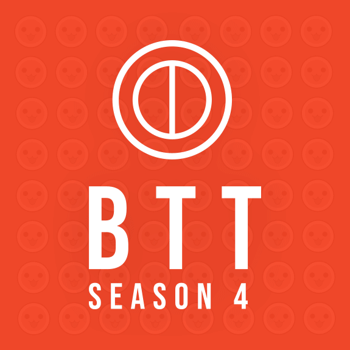

---
tags:
  - BTT
  - BTT 4
  - BTT4
---

# Beginners' Taiko Tournament 4

The **Beginners' Taiko Tournament 4** (***BTT 4***) was a 1v1 double elimination osu!taiko tournament hosted by ::{ flag=FR }:: [Kasumii-sama](https://osu.ppy.sh/users/6177263). It was the fourth instalment of the Beginners' Taiko Tournament.

## Tournament schedule

| Event | Timestamp |
| --: | :-- |
| Registration phase | 2019-01-27/2019-02-17 |
| Live drawings | 2019-02-17 (19:00 UTC) |
| Qualifiers stage | 2019-03-02/2019-03-03 |
| Round of 32 | 2019-03-09/2019-03-10 |
| Round of 16 | 2019-03-16/2019-03-17 |
| Quarterfinals | 2019-03-23/2019-03-24 |
| Semifinals | 2019-03-30/2019-03-31 |
| Finals | 2019-04-06/2019-04-07 |
| Grand Finals | 2019-04-13 |

## Prizes

| Placing | Prize(s) |
| :-: | :-- |
|  | 4 months of osu!supporter, unique profile badge |
|  | 2 months of osu!supporter |
|  | 1 months of osu!supporter |

## Organisation

The Beginners' Taiko Tournament 4 was run by various osu!taiko community members.

| Position | Member(s) |
| :-- | :-- |
| Manager | ::{ flag=FR }:: [Kasumii-sama](https://osu.ppy.sh/users/6177263), ::{ flag=JP }:: [Briesmas](https://osu.ppy.sh/users/2865172) |
| Mappool selector | ::{ flag=MY }:: [Bedwyr Aorta](https://osu.ppy.sh/users/10875855), ::{ flag=JP }:: [Briesmas](https://osu.ppy.sh/users/2865172), ::{ flag=DE }:: [frz](https://osu.ppy.sh/users/6956922), ::{ flag=SG }:: [uchuuj1n](https://osu.ppy.sh/users/9140302) |
| Designer | ::{ flag=CA }:: [mits](https://osu.ppy.sh/users/6256255) |
| Streamer | ::{ flag=MY }:: [Bedwyr Aorta](https://osu.ppy.sh/users/10875855), ::{ flag=DE }:: [Heam](https://osu.ppy.sh/users/4705120), ::{ flag=US }:: [ITotallyGetThat](https://osu.ppy.sh/users/8770622), ::{ flag=US }:: [Rukairi](https://osu.ppy.sh/users/6642597), ::{ flag=CA }:: [Sinaeb](https://osu.ppy.sh/users/1576095) |
| Commentator | ::{ flag=AU }:: [AmateurMonkeyYT](https://osu.ppy.sh/users/8379046), ::{ flag=CA }:: [DuckyDoom](https://osu.ppy.sh/users/3153062), ::{ flag=US }:: [Edgar\_Figaro](https://osu.ppy.sh/users/6508754), ::{ flag=DE }:: [Heam](https://osu.ppy.sh/users/4705120), ::{ flag=US }:: [ITotallyGetThat](https://osu.ppy.sh/users/8770622), ::{ flag=US }:: [Rukairi](https://osu.ppy.sh/users/6642597), ::{ flag=SG }:: [uchuuj1n](https://osu.ppy.sh/users/9140302), ::{ flag=EC }:: [Gamelan4](https://osu.ppy.sh/users/9856910) |
| Referee | ::{ flag=HK }:: [-GN Junior](https://osu.ppy.sh/users/3901754), ::{ flag=MY }:: [Bedwyr Aorta](https://osu.ppy.sh/users/10875855), ::{ flag=JP }:: [Briesmas](https://osu.ppy.sh/users/2865172), ::{ flag=AU }:: [Cactie](https://osu.ppy.sh/users/5592409), ::{ flag=CA }:: [DuckyDoom](https://osu.ppy.sh/users/3153062), ::{ flag=US }:: [Edgar\_Figaro](https://osu.ppy.sh/users/6508754), ::{ flag=FR }:: [Kasumii-sama](https://osu.ppy.sh/users/6177263), ::{ flag=EC }:: [Gamelan4](https://osu.ppy.sh/users/9856910), ::{ flag=PL }:: [Kondi](https://osu.ppy.sh/users/7382321), ::{ flag=DE }:: [frz](https://osu.ppy.sh/users/6956922), ::{ flag=AU }:: [mhyykl](https://osu.ppy.sh/users/7012650), ::{ flag=MY }:: [Minisora](https://osu.ppy.sh/users/9627666), ::{ flag=RU }:: [Starger](https://osu.ppy.sh/users/3398715), ::{ flag=US }:: [MyAngelManasa](https://osu.ppy.sh/users/6666316), ::{ flag=SG }:: [uchuuj1n](https://osu.ppy.sh/users/9140302) |
| Statistician | ::{ flag=FR }:: [Kasumii-sama](https://osu.ppy.sh/users/6177263) |
| Wiki editor | ::{ flag=ID }:: [Naruk](https://osu.ppy.sh/users/7100002) |

## Links

- [Discussion thread](https://osu.ppy.sh/community/forums/topics/861647)
- [BTT Discord server](https://discord.gg/4GXtC52)
- [Challonge brackets](https://challonge.com/BTTS4)
- [Livestream](https://www.twitch.tv/beginnerstaikotourney)
- **[Statistics sheet](https://docs.google.com/spreadsheets/d/e/2PACX-1vTe-EZbozFMJ5Bf75owX-fEaXjGSUS1Q5zX7d09p3npsyl1GUiTlkFcqNHKtTRiOM9Z4_nbkkHUZJ5H/pubhtml)**

## Participants

| Seed | Members |
| :-- | :-- |
| Top | ::{ flag=ID }:: [LoliVoiceASMR](https://osu.ppy.sh/users/12517831), ::{ flag=US }:: [LuriCookie](https://osu.ppy.sh/users/9517612), ::{ flag=AU }:: [soliderror](https://osu.ppy.sh/users/10630542), ::{ flag=FR }:: [TLQ\_Yoshii](https://osu.ppy.sh/users/7157133), ::{ flag=PL }:: [\_demo](https://osu.ppy.sh/users/3556891), ::{ flag=SE }:: [\[ M e a k u \]](https://osu.ppy.sh/users/2747072), ::{ flag=FR }:: [Trypha](https://osu.ppy.sh/users/2812098), ::{ flag=PL }:: [Xellander](https://osu.ppy.sh/users/6573608) |
| High | ::{ flag=MX }:: [Firu](https://osu.ppy.sh/users/10516547), ::{ flag=QA }:: [Hiiiii5](https://osu.ppy.sh/users/9419541), ::{ flag=US }:: [\[Hypotato\]](https://osu.ppy.sh/users/6022983), ::{ flag=AR }:: [Elenaflores169](https://osu.ppy.sh/users/8821300), ::{ flag=HK }:: [shikuro\_re](https://osu.ppy.sh/users/9338943), ::{ flag=NL }:: [MasterForcer](https://osu.ppy.sh/users/3263646), ::{ flag=US }:: [itsAdore](https://osu.ppy.sh/users/7633855), ::{ flag=SE }:: [Noercy](https://osu.ppy.sh/users/8214806) |
| Low | ::{ flag=RU }:: [\_Suzuha](https://osu.ppy.sh/users/8445602), ::{ flag=AU }:: [Neppy5000](https://osu.ppy.sh/users/12542518), ::{ flag=IE }:: [GamingHamster](https://osu.ppy.sh/users/11304155), ::{ flag=CA }:: [Sinaeb](https://osu.ppy.sh/users/1576095), ::{ flag=BR }:: [KaikyBr](https://osu.ppy.sh/users/11816848), ::{ flag=FR }:: [Heartswimm](https://osu.ppy.sh/users/10936319), ::{ flag=PL }:: [Bartek22830](https://osu.ppy.sh/users/6404027), ::{ flag=DE }:: [GDLenny](https://osu.ppy.sh/users/8406711) |
| Unseeded | ::{ flag=DE }:: [HiddenDenki](https://osu.ppy.sh/users/6868059), ::{ flag=EC }:: [Reo09](https://osu.ppy.sh/users/10211528), ::{ flag=FI }:: [Ristpek](https://osu.ppy.sh/users/11819476), ::{ flag=EC }:: [Mik3gam3r7919](https://osu.ppy.sh/users/10570577), ::{ flag=PT }:: [Wilir-senpai](https://osu.ppy.sh/users/4566582), ::{ flag=DE }:: [GinIkari](https://osu.ppy.sh/users/6083491), ::{ flag=US }:: [james2998](https://osu.ppy.sh/users/13777712), ::{ flag=MY }:: [koaywj](https://osu.ppy.sh/users/10879816) |

## Podium

This competition has come to an end and resulted in the following podium:

| Placing | Player |
| :-: | :-- |
|  | ::{ flag=HK }:: [shikuro\_re](https://osu.ppy.sh/users/9338943) |
|  | ::{ flag=PL }:: [\_demo](https://osu.ppy.sh/users/3556891) |
|  | ::{ flag=US }:: [LuriCookie](https://osu.ppy.sh/users/9517612) |

## Mappools

### Grand Finals

**[Download the mappack here! (104 MB)](https://mega.nz/#!TCZyASRJ!RS23vGR9T7imNyP8a6Sccu_mt5Ix6r7bxNkbxLVcFtM)**

- NoMod
  1. [Sleeping With Sirens - If You Can't Hang (Nardoxyribonucleic) \[Nardo's Muzukashii\]](https://osu.ppy.sh/beatmapsets/409025#taiko/888019)
  2. [dBu - Night Sakura of Ghostdom (eikkaleyd) \[eikka's Taiko (BTT4 ver.)\]](https://osu.ppy.sh/beatmapsets/951145#taiko/1986381)
  3. [Camellia - Proluvies (\_DUSK\_) \[Muzukashii\]](https://osu.ppy.sh/beatmapsets/766605#taiko/1611762)
  4. [LukHash - H8 U (Jaye) \[Muzukashii\]](https://osu.ppy.sh/beatmapsets/698122#taiko/1478604)
  5. [FELT - COLORS (Capu) \[Capu's Ultimate BTT4 Achromatism\]](https://osu.ppy.sh/beatmapsets/951065#taiko/1986235)
  6. [Zekk - Calling (Capu) \[Capu's Ultimate BTT4 Call\]](https://osu.ppy.sh/beatmapsets/951659#taiko/1987379)
- Hidden
  1. [SoundTeMP - Be Nice 'n Easy (OnosakiHito) \[Ono's Muzukashii\]](https://osu.ppy.sh/beatmapsets/366807#taiko/1076980)
  2. [BlackY vs. Yooh - HAVOX (Arrival) \[Muzukashii\]](https://osu.ppy.sh/beatmapsets/553741#taiko/1172633)
  3. [Reol - +Danshi (neonat) \[Muzukashii\]](https://osu.ppy.sh/beatmapsets/299259#taiko/707265)
- HardRock
  1. [Anii - You (lepidopodus) \[lepidon! - Taiko Oni\]](https://osu.ppy.sh/beatmapsets/30326#taiko/105566)
  2. [Jun Kuroda - Coquette (taiko\_maniac1811) \[Muzukashii\]](https://osu.ppy.sh/beatmapsets/883369#taiko/1849852)
  3. [Virtual Self - EON BREAK (Nwolf) \[Nwolf's Muzukashii (BTT4 ver.)\]](https://osu.ppy.sh/beatmapsets/951376#taiko/1986889)
- DoubleTime
  1. [VerseQuence - Wilt (Gemu-) \[Gemu's Hard (BTT4 ver.)\]](https://osu.ppy.sh/beatmapsets/951374#taiko/1986887)
  2. [Sasaki Sayaka - Koi Saku Mirai (Elfin) \[Muzukashii\]](https://osu.ppy.sh/beatmapsets/401933#taiko/1027234)
  3. [Nakae Mitsuki - Pure Love, True Love (El SolarBeam) \[Muzukashii\]](https://osu.ppy.sh/beatmapsets/123687#taiko/321111)
- FreeMod
  1. [mafumafu - Kakushigoto (DakeDekaane) \[Muzukashii\]](https://osu.ppy.sh/beatmapsets/331383#taiko/734099)
  2. [ZUN - A Tiny, Tiny, Clever Commander (DarkDunskin) \[Dunskin's Muzukashii\]](https://osu.ppy.sh/beatmapsets/60067#taiko/185092)
  3. [dj TAKA - quaver (gaston\_2199) \[Muzukashii\]](https://osu.ppy.sh/beatmapsets/588325#taiko/1264003)
- Tiebreaker
  1. **[FELT - Puppet in the Dark (Part I & II) (Nepuri) \[Oni\]](https://osu.ppy.sh/beatmapsets/752723#taiko/1584703)**

### Finals

**[Download the mappack here! (92 MB)](https://mega.nz/#!neAjGKjR!7azaacZ6nG27A3E2jcPMV78JsJ2BSyQE_g1gCfFoNko)**

- NoMod
  1. [Yuyoyuppe - Reon (Makar) \[Makar's Muzukashii\]](https://osu.ppy.sh/beatmapsets/55980#taiko/244118)
  2. [senya - Utakata, Ai no Mahoroba (Firce777) \[Firce777's Taiko Muzukashii\]](https://osu.ppy.sh/beatmapsets/69681#taiko/200842)
  3. [The Super Mario Players feat. Kate Davis - Jump Up, Super Star! (Short ver.) (maziari1105) \[Muzukashii\]](https://osu.ppy.sh/beatmapsets/710971#taiko/1505877)
  4. [sky\_delta - SIVA (Nishizumi) \[Muzukashii\]](https://osu.ppy.sh/beatmapsets/476505#taiko/1019106)
  5. [Zeami - Music Revolver (KanaRin) \[Taiko Oni\]](https://osu.ppy.sh/beatmapsets/53231#taiko/169912)
  6. [Shawn Wasabi + YDG - Burnt Rice (feat. YUNG GEMMY) (Capu) \[Capu's Ultimate BTT4 Muzukashii\]](https://osu.ppy.sh/beatmapsets/948474#taiko/1980836)
- Hidden
  1. [Camellia - Towards The Horizon (Fallmorph) \[Muzukashii\]](https://osu.ppy.sh/beatmapsets/727084#taiko/1535012)
  2. [Tezuka feat. Onishi Amimi - Suisou no Kujira (EdamaMe411) \[Muzukashii\]](https://osu.ppy.sh/beatmapsets/579105#taiko/1227811)
  3. [S3RL feat Krystal - R4V3 B0Y (Nishizumi) \[MUZUK45H11\]](https://osu.ppy.sh/beatmapsets/593010#taiko/1254676)
- HardRock
  1. [Nekomata Master - Deadman Falling (Azer) \[Muzukashii\]](https://osu.ppy.sh/beatmapsets/619878#taiko/1523533)
  2. [AcuticNotes - Axeria (Nerova Riuz GX) \[Muzukashii\]](https://osu.ppy.sh/beatmapsets/574641#taiko/1351688)
  3. [kradness & Reol - Okochama Sensou (Nifty) \[Nifty's Muzukashii\]](https://osu.ppy.sh/beatmapsets/928375#taiko/1939282)
- DoubleTime
  1. [Fitz and the Tantrums - HandClap (Hitsu) \[Hitsu's Muzukashii\]](https://osu.ppy.sh/beatmapsets/642607#taiko/1630808)
  2. [kana - Hammer wo Denpa Songu ni shite Mita (KayeSara) \[KS's Taiko Muzukashii (BTT4 ver.)\]](https://osu.ppy.sh/beatmapsets/948461#taiko/1980818)
  3. [Haruna Luna - Overfly (Lundlerol) \[Lundle's Muzu\]](https://osu.ppy.sh/beatmapsets/85812#taiko/249264)
- FreeMod
  1. [Fear, and Loathing in Las Vegas - Stray in Chaos (Chromoxx) \[Chromoxx' Muzukashii\]](https://osu.ppy.sh/beatmapsets/574129#taiko/1485848)
  2. [a\_hisa - rin (Alwaysyukaz) \[Alwaysyukaz's Muzukashii (BTT4 ver.)\]](https://osu.ppy.sh/beatmapsets/948263#taiko/1980499)
  3. [yanaginagi - halo effect (Loneight) \[L18's Muzukashii\]](https://osu.ppy.sh/beatmapsets/112453#taiko/294371)
- Tiebreaker
  1. **[Hanatan - Romeo and Cinderella (ll-oscar) \[ll-taiko\]](https://osu.ppy.sh/beatmapsets/286744#taiko/647287)**

### Semifinals

**[Download the mappack here! (80 MB)](https://mega.nz/#!nOpwEQIL!mFSWpKyuJkYqyj63q4rmLyTE47cUZJnFPOt4U3gsTXs)**

- NoMod
  1. [MuryokuP - hypnoSpirA (Makar) \[Makar's Taiko Muzukashii\]](https://osu.ppy.sh/beatmapsets/57908#taiko/180664)
  2. [Colorful Sounds Port - ETERNAL DRAIN (\_yu68) \[\_yu68's Muzukashii\]](https://osu.ppy.sh/beatmapsets/692110#taiko/1480041)
  3. [DJ Manian - Loco (Nightcore Mix) (DarkVortex) \[Muzukashii\]](https://osu.ppy.sh/beatmapsets/557981#taiko/1180489)
  4. [Krewella - Can't Control Myself (Nightcore Mix) (deadcode) \[deadcode's Muzukashii (BTT4 ver.)\]](https://osu.ppy.sh/beatmapsets/945116#taiko/1973672)
  5. [S3RL - Catchit (Radio Edit) (Rhytoly) \[Muzukashii\]](https://osu.ppy.sh/beatmapsets/915434#taiko/1913668)
- Hidden
  1. [TERRA - THIS NIGHT (jubeat EDITION) (lepidopodus) \[lepidon! - Taiko Muzukashii\]](https://osu.ppy.sh/beatmapsets/48122#taiko/162652)
  2. [Erik McClure - Lagomorphic (Okoratu) \[Muzukashii\]](https://osu.ppy.sh/beatmapsets/338942#taiko/751436)
  3. [DJ TOTTO feat.Annabel & Hiyama Nao - Kanata no Reflesia (Prophecy) \[Prophecy's Muzukashii\]](https://osu.ppy.sh/beatmapsets/785734#taiko/1658142)
- HardRock
  1. [M2U - Lunatic Sky (Dain) \[Muzukashii\]](https://osu.ppy.sh/beatmapsets/220824#taiko/517469)
  2. [ginkiha - eastward (toara\_fict) \[toara's Muzukashii\]](https://osu.ppy.sh/beatmapsets/630364#taiko/1357500)
  3. [S3RL - I Will Pick You Up (feat. Tamika) (Nao Tomori) \[Nao's Muzukashii\]](https://osu.ppy.sh/beatmapsets/919704#taiko/1920740)
- DoubleTime
  1. [tsunamaru - Orange Genome (jomnhnk) \[jom's Taiko Muzukashii (BTT4 ver.)\]](https://osu.ppy.sh/beatmapsets/945094#taiko/1973639)
  2. [M2U - Nemesis (-Leafeon) \[Leaf's Futsuu\]](https://osu.ppy.sh/beatmapsets/823347#taiko/1793658)
- FreeMod
  1. [ribbon room - mint tears (mintong89) \[mint's Taiko Muzukashii\]](https://osu.ppy.sh/beatmapsets/117063#taiko/302281)
  2. [Ax feat. Natsukawa Youko - Sakimori Renka (TKS) \[Muzukashii\]](https://osu.ppy.sh/beatmapsets/183885#taiko/441369)
  3. [Kishida Kyoudan & The Akeboshi Rockets - World End Economica (Senritsu) \[Senritsu's Muzukashii\]](https://osu.ppy.sh/beatmapsets/189236#taiko/454323)
- Tiebreaker
  1. **[Yousei Teikoku - missing (lolcubes) \[Muzukashii\]](https://osu.ppy.sh/beatmapsets/85553#taiko/238170)**

### Quarterfinals

**[Download the mappack here! (66 MB)](https://mega.nz/#!yawFFQgY!4E8hqF2Jml4TeyxXIFUqGAM0cWK1aunVtjg8SjCBGtQ)**

- NoMod
  1. [Neru - Lost One no Goukoku (taiko\_maniac1811) \[Muzukashii\]](https://osu.ppy.sh/beatmapsets/144356#taiko/358583)
  2. [DINY - Snowfield (Skylish) \[Muzukashii\]](https://osu.ppy.sh/beatmapsets/534057#taiko/1131311)
  3. [Sushi Killer - Zora (Raiden) \[Raiden's Muzukashii\]](https://osu.ppy.sh/beatmapsets/205107#taiko/680467)
  4. [uma vs. Morimori Atsushi - Touhou Youyoumu ULTIMATE MEDLEY (komasy) \[Futsuu\]](https://osu.ppy.sh/beatmapsets/871329#taiko/1820896)
  5. [Fear, and Loathing in Las Vegas - Rave-Up Tonight (qoot8123) \[Muzukashii\]](https://osu.ppy.sh/beatmapsets/244532#taiko/567838)
- Hidden
  1. [Hanatan - You and beautiful world (Ulqui) \[Muzukashii\]](https://osu.ppy.sh/beatmapsets/690989#taiko/1462199)
  2. [TeamGrimoire+Amaneko - croiX (hs714) \[714's Muzukashii\]](https://osu.ppy.sh/beatmapsets/88692#taiko/242954)
- HardRock
  1. [Ann Winsborn - La La Love On My Mind (Nightcore Mix) (Lost The Lights) \[LTL's Muzukashii\]](https://osu.ppy.sh/beatmapsets/395867#taiko/1010678)
  2. [Cres - End Time (cdhsausageboy) \[Muzukashii\]](https://osu.ppy.sh/beatmapsets/163764#taiko/398947)
- DoubleTime
  1. [DM DOKURO - Septisicle (Remus) \[A Futsuu of Dreams\]](https://osu.ppy.sh/beatmapsets/722711#taiko/1525675)
  2. [Ushiro kara Haiyori-tai G - Koi wa Chaos no Shimobenari (tasuke912) \[Futsuu\]](https://osu.ppy.sh/beatmapsets/492477#taiko/1049149)
- FreeMod
  1. [Tatsh - reunion (Raiden) \[Muzukashii\]](https://osu.ppy.sh/beatmapsets/351488#taiko/774674)
  2. [sakuzyo - Imprinting (Steins) \[Stein's Muzukashii\]](https://osu.ppy.sh/beatmapsets/371217#taiko/813391)
  3. [kamome sano - dawn(ginkiha hardcore remix) (qoot8123) \[qoot8123's Muzukashii\]](https://osu.ppy.sh/beatmapsets/185766#taiko/462085)
- Tiebreaker
  1. **[BRZion - Tricky Waves (Okoratu) \[Muzukashii\]](https://osu.ppy.sh/beatmapsets/852413#taiko/1789861)**

### Round of 16

**[Download the mappack here! (56 MB)](https://mega.nz/#!jWhXBKRB!sz4WbuH3dWTAHvnBTaEhuTRvgHqDdEvU1S8gcimu1I8)**

- NoMod
  1. [Camellia - Kono Hoshi de... (\_DUSK\_) \[Futsuu\]](https://osu.ppy.sh/beatmapsets/773105#taiko/1625127)
  2. [Na Ying - Mo (mintong89) \[Kun Nan\]](https://osu.ppy.sh/beatmapsets/801701#taiko/1682742)
  3. [Zekk - Fluctuation (kon tja) \[Futsuu\]](https://osu.ppy.sh/beatmapsets/705801#taiko/1492833)
  4. [Manis Manja - Bete (Speed Up Ver.) (Nishizumi) \[Futsuu\]](https://osu.ppy.sh/beatmapsets/878285#taiko/1836885)
- Hidden
  1. [siromaru + cranky - conflict (Midnaait) \[Futsuu\]](https://osu.ppy.sh/beatmapsets/926839#taiko/1935850)
  2. [Matsuda Akito - After After (Franklin\_DeJavu) \[Futsuu\]](https://osu.ppy.sh/beatmapsets/682326#taiko/1443734)
- HardRock
  1. [BlackY - OVERSOUL (yuzu\_\_rinrin) \[Futsuu\]](https://osu.ppy.sh/beatmapsets/653157#taiko/1385745)
  2. [A.SAKA - Yosakura Fubuki (Alwaysyukaz) \[Futsuu\]](https://osu.ppy.sh/beatmapsets/859944#taiko/1802428)
- DoubleTime
  1. [Three Days Grace - Animal I Have Become (Greenshell) \[Futsuu\]](https://osu.ppy.sh/beatmapsets/856403#taiko/1789225)
  2. [TAG - Riot of Color (OzzyOzrock) \[OzzyOzrock's Futsuu (BTT4 Ver.)\]](https://osu.ppy.sh/beatmapsets/937575#taiko/1958538)
- FreeMod
  1. [Submatik & Phil ft. Holly Drummond - One (Virtual Riot 2017 Remix) (Nerova Riuz GX) \[Futsuu\]](https://osu.ppy.sh/beatmapsets/846862#taiko/1776024)
  2. [yanaginagi - Yukitoki (TV Size) (Fumika) \[Futsuu\]](https://osu.ppy.sh/beatmapsets/87208#taiko/241742)
- Tiebreaker
  1. **[Petit Rabbit's - Daydream cafe(you Remix) (404 AccNotFound, applerss) \[404 & apple's Muzukashii (BTT4 ver.)\]](https://osu.ppy.sh/beatmapsets/938096#taiko/1959555)**

### Round of 32

**[Download the mappack here! (56 MB)](https://mega.nz/#!jWhXBKRB!sz4WbuH3dWTAHvnBTaEhuTRvgHqDdEvU1S8gcimu1I8)**

- NoMod
  1. [Nakanojojo - Bittersweet (feat. Kuishinboakachan a.k.a Kiato) (Nardoxyribonucleic) \[Nardo's Futsuu\]](https://osu.ppy.sh/beatmapsets/847323#taiko/1772048)
  2. [sasakure.UK - SAMPLING MONSTER feat. Hatsune Miku (tasuke912) \[Futsuu\]](https://osu.ppy.sh/beatmapsets/740600#taiko/1562420)
  3. [Culprate - Yellow (A Second Glimpse) (Ulqui) \[Futsuu\]](https://osu.ppy.sh/beatmapsets/589814#taiko/2010582)
  4. [aran - Xperanza (Ulqui) \[Futsuu\]](https://osu.ppy.sh/beatmapsets/800399#taiko/1762717)
- Hidden
  1. [Amane - BOOZEHOUND (Aezis) \[Futsuu\]](https://osu.ppy.sh/beatmapsets/512311#taiko/1088823)
  2. [OISHII - UP UP MT. CAKE (Fallmorph) \[Futsuu\]](https://osu.ppy.sh/beatmapsets/682732#taiko/1511793)
- HardRock
  1. [Mili - world.execute(me); (Volta) \[volta.taiko(futsuu);\]](https://osu.ppy.sh/beatmapsets/507196#taiko/1078864)
  2. [Jaroslav Beck - Beat Saber (Lno) \[Futsuu\]](https://osu.ppy.sh/beatmapsets/793455#taiko/1666279)
- DoubleTime
  1. [TOKIO - ding-dong (Volta) \[Futsuu\]](https://osu.ppy.sh/beatmapsets/375452#taiko/822281)
  2. [Goose house - Oto no Naru Hou e (TV Size) (Poii) \[Futsuu\]](https://osu.ppy.sh/beatmapsets/714379#taiko/1509726)
- FreeMod
  1. [UNDEAD CORPORATION - Karakurenai (ASPIRIN) \[Futsuu\]](https://osu.ppy.sh/beatmapsets/709336#taiko/1510938)
  2. [Remixed by DJ Command - Dazzlin' Darlin -Akiba Koubou mix- (Nardoxyribonucleic) \[Nardo's Futsuu\]](https://osu.ppy.sh/beatmapsets/906143#taiko/1891047)
- Tiebreaker
  1. **[Nightwish - She Is My Sin (Nardoxyribonucleic) \[Futsuu\]](https://osu.ppy.sh/beatmapsets/529780#taiko/1125980)**

### Qualifiers stage

**[Download the mappack here! (38 MB)](https://mega.nz/#!Ga5xES7C!cIYx4loj_absIdwI7f97bI8K39XytTbBXsu9CdJ08B8)**

- NoMod
  1. [CyoucyoP feat.Hatsune Miku - End of the World (TKS) \[Kantan\]](https://osu.ppy.sh/beatmapsets/215476#taiko/506474)
  2. [Yuyoyuppe - Hope (game rock) \[Futsuu\]](https://osu.ppy.sh/beatmapsets/362784#taiko/796948)
- Hidden
  1. [S-C-U vs L.E.D. - DIAMOND CROSSING (butter0414) \[Kantan\]](https://osu.ppy.sh/beatmapsets/710606#taiko/1502083)
- HardRock
  1. [NayutalieN - Alien Alien (Nhato Remix) (Rhytoly) \[Kantan\]](https://osu.ppy.sh/beatmapsets/904873#taiko/1888715)
- DoubleTime
  1. [Sawamura Spencer Eriri (CV: Oonishi Saori) - Blooming Lily (Volta) \[Kantan\]](https://osu.ppy.sh/beatmapsets/718081#taiko/1532923)

## Match results

### Grand Finals

Sunday, 20 April 2019:

| Player 1 |  |  | Player 2 | Match link |
| --: | :-: | :-: | :-- | :-- |
| \_demo ::{ flag=PL }:: | 1 | **7** | ::{ flag=HK }:: **shikuro\_re** | [#1](https://osu.ppy.sh/community/matches/51151919) |
| **shikuro\_re** ::{ flag=HK }:: | **7** | 0 | ::{ flag=PL }:: \_demo | *win by default* |

### Finals

Saturday, 6 April 2019:

| Player 1 |  |  | Player 2 | Match link |
| --: | :-: | :-: | :-- | :-- |
| **\_demo** ::{ flag=PL }:: | **7** | 3 | ::{ flag=US }:: LuriCookie | [#1](https://osu.ppy.sh/community/matches/50796962) |

Sunday, 7 April 2019:

| Player 1 |  |  | Player 2 | Match link |
| --: | :-: | :-: | :-- | :-- |
| **shikuro_re** ::{ flag=HK }:: | **7** | 1 | ::{ flag=FR }:: Trypha | [#1](https://osu.ppy.sh/community/matches/50822741) |
| LuriCookie ::{ flag=US }:: | 3 | **7** | ::{ flag=HK }:: **shikuro\_re** | [#1](https://osu.ppy.sh/community/matches/50827604) |

### Semifinals

Friday, 29 March 2019:

| Player 1 |  |  | Player 2 | Match link |
| --: | :-: | :-: | :-- | :-- |
| TLQ\_Yoshii ::{ flag=FR }:: | 0 | **6** | ::{ flag=FR }:: **Trypha** | [#1](https://osu.ppy.sh/community/matches/50617119) |

Saturday, 30 March 2019:

| Player 1 |  |  | Player 2 | Match link |
| --: | :-: | :-: | :-- | :-- |
| LoliVoiceASMR ::{ flag=ID }:: | 3 | **6** | ::{ flag=PL }:: **\_demo** | [#1](https://osu.ppy.sh/community/matches/50632555) |
| **shikuro\_re** ::{ flag=HK }:: | **6** | 4 | ::{ flag=EC }:: Mik3gam3r7919 | [#1](https://osu.ppy.sh/community/matches/50636709) |
| **LuriCookie** ::{ flag=US }:: | **6** | 4 | ::{ flag=NL }:: MasterForcer | [#1](https://osu.ppy.sh/community/matches/50643510) |

Sunday, 31 March 2019:

| Player 1 |  |  | Player 2 | Match link |
| --: | :-: | :-: | :-- | :-- |
| LoliVoiceASMR ::{ flag=ID }:: | 4 | **6** | ::{ flag=FR }:: **Trypha** | [#1](https://osu.ppy.sh/community/matches/50662993) |
| MasterForcer ::{ flag=NL }:: | 0 | **6** | ::{ flag=HK }:: **shikuro\_re** | [#1](https://osu.ppy.sh/community/matches/50665146) |

### Quarterfinals

Saturday, 23 March 2019:

| Player 1 |  |  | Player 2 | Match link |
| --: | :-: | :-: | :-- | :-- |
| **LoliVoiceASMR** ::{ flag=ID }:: | **5** | 1 | ::{ flag=PL }:: Xellander | [#1](https://osu.ppy.sh/community/matches/50465903) |
| shikuro\_re ::{ flag=HK }:: | 4 | **5** | ::{ flag=PL }:: **\_demo** | [#1](https://osu.ppy.sh/community/matches/50468558) |
| **MasterForcer** ::{ flag=NL }:: | **5** | 3 | ::{ flag=FR }:: Heartswimm | [#1](https://osu.ppy.sh/community/matches/50471620) |
| **Noercy** ::{ flag=SE }:: | **5** | 4 | ::{ flag=DE }:: HiddenDenki | [#1](https://osu.ppy.sh/community/matches/50471843) |
| **GamingHamster** ::{ flag=IE }:: | **5** | 0 | ::{ flag=US }:: \[Hypotato\] | *win by default* |
| **LuriCookie** ::{ flag=US }:: | **5** | 3 | ::{ flag=FR }:: Trypha | [#1](https://osu.ppy.sh/community/matches/50480854) |
| Sinaeb ::{ flag=CA }:: | 2 | **5** | ::{ flag=EC }:: **Mik3gam3r7919** | [#1](https://osu.ppy.sh/community/matches/50482981) |
| james2998 ::{ flag=US }:: | 0 | **5** | ::{ flag=FR }:: **TLQ\_Yoshii** | [#1](https://osu.ppy.sh/community/matches/50484563) |

Sunday, 24 March 2019:

| Player 1 |  |  | Player 2 | Match link |
| --: | :-: | :-: | :-- | :-- |
| Heartswimm ::{ flag=FR }:: | 2 | **5** | ::{ flag=FR }:: **TLQ\_Yoshii** | [#1](https://osu.ppy.sh/community/matches/50499159) |
| **shikuro\_re** ::{ flag=HK }:: | **5** | 0 | ::{ flag=SE }:: Noercy | *win by default* |
| **Trypha** ::{ flag=FR }:: | **5** | 0 | ::{ flag=IE }:: GamingHamster | [#1](https://osu.ppy.sh/community/matches/50501827) |
| Xellander ::{ flag=PL }:: | 0 | **5** | ::{ flag=EC }:: **Mik3gam3r7919** | *win by default* |

### Round of 16

Saturday, 16 March 2019:

| Player 1 |  |  | Player 2 | Match link |
| --: | :-: | :-: | :-- | :-- |
| **LoliVoiceASMR** ::{ flag=ID }:: | **4** | 0 | ::{ flag=RU }:: \_Suzuha | *win by default* |
| TLQ\_Yoshii ::{ flag=FR }:: | 0 | **4** | ::{ flag=HK }:: **shikuro\_re** | [#1](https://osu.ppy.sh/community/matches/50302619) |
| **LuriCookie** ::{ flag=US }:: | **4** | 0 | ::{ flag=AU }:: Neppy5000 | [#1](https://osu.ppy.sh/community/matches/50302679) |
| \[ M e a k u \] ::{ flag=SE }:: | 2 | **4** | ::{ flag=FR }:: **Heartswimm** | [#1](https://osu.ppy.sh/community/matches/50304357) |
| **Xellander** ::{ flag=PL }:: | **4** | 1 | ::{ flag=DE }:: GDLenny | [#1](https://osu.ppy.sh/community/matches/50307871) |
| **Trypha** ::{ flag=FR }:: | **4** | 0 | ::{ flag=QA }:: Hiiiii5 | [#1](https://osu.ppy.sh/community/matches/50315277) |
| GinIkari ::{ flag=DE }:: | 0 | **4** | ::{ flag=NL }:: **MasterForcer** | [#1](https://osu.ppy.sh/community/matches/50315499) |
| **TLQ\_Yoshii** ::{ flag=FR }:: | **4** | 0 | ::{ flag=EC }:: Reo09 | *win by default* |

Sunday, 17 March 2019:

| Player 1 |  |  | Player 2 | Match link |
| --: | :-: | :-: | :-- | :-- |
| Neppy5000 ::{ flag=AU }:: | 0 | **4** | ::{ flag=EC }:: **Mik3gam3r7919** | *win by default* |
| \[ M e a k u \] ::{ flag=SE }:: | 2 | **4** | ::{ flag=SE }:: **Noercy** | [#1](https://osu.ppy.sh/community/matches/50334534) |
| GinIkari ::{ flag=DE }:: | 2 | **4** | ::{ flag=DE }:: **HiddenDenki** | [#1](https://osu.ppy.sh/community/matches/50336178) |
| GDLenny ::{ flag=DE }:: | 0 | **4** | ::{ flag=IE }:: **GamingHamster** | [#1](https://osu.ppy.sh/community/matches/50336185) |
| **\_demo** ::{ flag=PL }:: | **4** | 0 | ::{ flag=AR }:: Elenaflores169 | *win by default* |
| Hiiiii5 ::{ flag=QA }:: | 3 | **4** | ::{ flag=CA }:: **Sinaeb** | [#1](https://osu.ppy.sh/community/matches/50341427) |
| Elenaflores169 ::{ flag=AR }:: | 0 | **4** | ::{ flag=US }:: **james2998** | *win by default* |
| \_Suzuha ::{ flag=RU }:: | 3 | **4** | ::{ flag=US }:: **\[Hypotato\]** | [#1](https://osu.ppy.sh/community/matches/50344142) |

### Round of 32

Saturday, 9 March 2019:

| Player 1 |  |  | Player 2 | Match link |
| --: | :-: | :-: | :-- | :-- |
| soliderror ::{ flag=AU }:: | 0 | **4** | ::{ flag=DE }:: **GinIkari** | *win by default* |
| **Xellander** ::{ flag=PL }:: | **4** | 0 | ::{ flag=DE }:: HiddenDenki | *win by default* |
| **Hiiiii5** ::{ flag=QA }:: | **4** | 0 | ::{ flag=PL }:: Bartek22830 | *win by default* |
| **\[ M e a k u \]** ::{ flag=SE }:: | **4** | 2 | ::{ flag=FI }:: Ristpek | [#1](https://osu.ppy.sh/community/matches/50136455) |
| **LoliVoiceASMR** ::{ flag=ID }:: | **4** | 1 | ::{ flag=MY }:: koaywj | [#1](https://osu.ppy.sh/community/matches/50137653) |
| Firu ::{ flag=MX }:: | 0 | **4** | ::{ flag=DE }:: **GDLenny** | *win by default* |
| itsAdore ::{ flag=US }:: | 0 | **4** | ::{ flag=AU }:: **Neppy5000** | *win by default* |
| **TLQ\_Yoshii** ::{ flag=FR }:: | **4** | 0 | ::{ flag=PT }:: Wilir-senpai | [#1](https://osu.ppy.sh/community/matches/50139402) |
| **\_demo** ::{ flag=PL }:: | **4** | 0 | ::{ flag=EC }:: Mik3gam3r7919 | [#1](https://osu.ppy.sh/community/matches/50141227) |
| Noercy ::{ flag=SE }:: | 2 | **4** | ::{ flag=RU }:: **\_Suzuha** | [#1](https://osu.ppy.sh/community/matches/50142613) |
| **MasterForcer** ::{ flag=NL }:: | **4** | 0 | ::{ flag=IE }:: GamingHamster | [#1](https://osu.ppy.sh/community/matches/50145669) |
| \[Hypotato\] ::{ flag=US }:: | 1 | **4** | ::{ flag=FR }:: **Heartswimm** | [#1](https://osu.ppy.sh/community/matches/50148324) |
| **Elenaflores169** ::{ flag=AR }:: | **4** | 1 | ::{ flag=BR }:: KaikyBr | [#1](https://osu.ppy.sh/community/matches/50152005) |
| **LuriCookie** ::{ flag=US }:: | **4** | 2 | ::{ flag=US }:: james2998 | [#1](https://osu.ppy.sh/community/matches/50153572) |
| **Trypha** ::{ flag=FR }:: | **4** | 0 | ::{ flag=EC }:: Reo09 | *win by default* |

Sunday, 10 March 2019:

| Player 1 |  |  | Player 2 | Match link |
| --: | :-: | :-: | :-- | :-- |
| **shikuro\_re** ::{ flag=HK }:: | **4** | 0 | ::{ flag=CA }:: Sinaeb | [#1](https://osu.ppy.sh/community/matches/50157663) |
| soliderror ::{ flag=AU }:: | 0 | **4** | ::{ flag=IE }:: **GamingHamster** | *win by default* |
| koaywj ::{ flag=MY }:: | 1 | **4** | ::{ flag=SE }:: Noercy | [#1](https://osu.ppy.sh/community/matches/50172918) |
| **HiddenDenki** ::{ flag=DE }:: | **4** | 0 | ::{ flag=MX }:: Firu | *win by default* |
| Wilir-senpai ::{ flag=PT }:: | 3 | **4** | ::{ flag=CA }:: **Sinaeb** | [#1](https://osu.ppy.sh/community/matches/50172799) |
| **Mik3gam3r7919** ::{ flag=EC }:: | **4** | 1 | ::{ flag=BR }:: KaikyBr | [#1](https://osu.ppy.sh/community/matches/50175768) |
| **james2998** ::{ flag=US }:: | **4** | 0 | ::{ flag=US }:: itsAdore | *win by default* |
| **Reo09** ::{ flag=EC }:: | **4** | 0 | ::{ flag=PL }:: Bartek22830 | *win by default* |
| Ristpek ::{ flag=FI }:: | 1 | **4** | ::{ flag=US }:: **\[Hypotato\]** | [#1](https://osu.ppy.sh/community/matches/50178952) |

## Ruleset

### General rules

1. Beginners' Taiko Tournament is using double-elimination bracket and a 1v1 tournament.
2. The Score System used will be **Score V2.**
3. The mapset will be announced every Sunday, and the categories are as follows:
   - NoMod, Hidden, HardRock, DoubleTime, FreeMod, Tiebreaker
4. Match schedule is decided by the organizers. Players may feel free to ask for a reschedule if that doesn't work for them. Each stage of this tournament will last a week-end.
5. If there is no referee available, or if I am not available, the match can be postponed.
6. If both players tie on the TieBreaker, the TieBreaker will be replayed.
7. If a player disconnects from the game, the opponent wins the round. The only exception is if the player disconnects during the first five seconds of the song, in which the match is restarted.
8. Maps cannot be used twice in the same round.
9. Players have 15 minutes to show up to your scheduled match. If the opponent doesn't show up, the player who was supposed to play automatically advances onwards.
10. Any other rules changes or unexpected occurrences will be announced in the thread.

### Stage regulations

1. There are seven stages to this tournament: the Qualifiers, the RO32, the RO16, the Quarter-Finals, Semi-Finals, the Finals and the Grand Finals.
2. Matches are seeded. This will happen in the seeding round. More information will be held in Seeding Regulations.
3. In order to win in RO32 and RO16, it's a Best-Of-7. In Quarterfinals, it's a Best-Of-9. In Semifinals, it's a Best-Of-11. In Finals and Grand Finals, it's a Best-Of-13.

### Seeding regulations

1. During the seeding round, there will be multiple lobbies available at various hours. Players will be free to sign up to the lobbies they please.
2. This match is mainly used to weed out the no-shows, however it is also used to file in any backup players who may be called upon to take place of a no-show in the future.
3. A private match will be created for all the players, and will be invited into their match when it's their time. Make certain you're online at this time.
4. There will be no warmup during this, but rather all the players will play through a shorter mappool.
5. Seeding will be made with the average rank of each player on each map.
6. Maps will be played twice in a row during the lobby.
7. Results will be announced on the Discord Server after the end of the weekend.

### Match regulations

1. A private match will be created for your match, and both players will be invited into their match when it's their time. Make certain you're online at this time.
2. Each player is allowed one warmup, but it must be below 3 minutes.
3. Here is how bans and picks will happen. The first person to ban will be the loser of the `!roll`, then they will alternate bans. (Loser -> Winner -> Loser -> Winner) And the first person to pick will be the winner of the `!roll`, then they will alternate picks. (Winner -> Loser -> Winner -> Loser, etc...)
4. In case of a tie, the tiebreaker will be played.
5. Results will be displayed on Challonge, and announced by the referee.

### Mappool regulations

1. There's a different pool in each stage of the tournament, becoming progressively harder.
2. As stated before, NoMod, Hidden, HardRock, DoubleTime, FreeMod, and Tiebreaker are the six categories that exist for this tournament.
3. Tiebreaker is played with FreeMod.
4. As stated previously, the mappool is released every Sunday.

### Scheduling regulations

1. Every stage is held during the week-ends to let players practice.
2. Matches are allowed to overlap if referees are available.
3. You must complete your match at the designated time or both players are eliminated.
   - However if you and your opponent can come up with a better time than what we have schedule for you, please inform us of this. We will change your match if informed before the Thursday before the week-end of matches.
