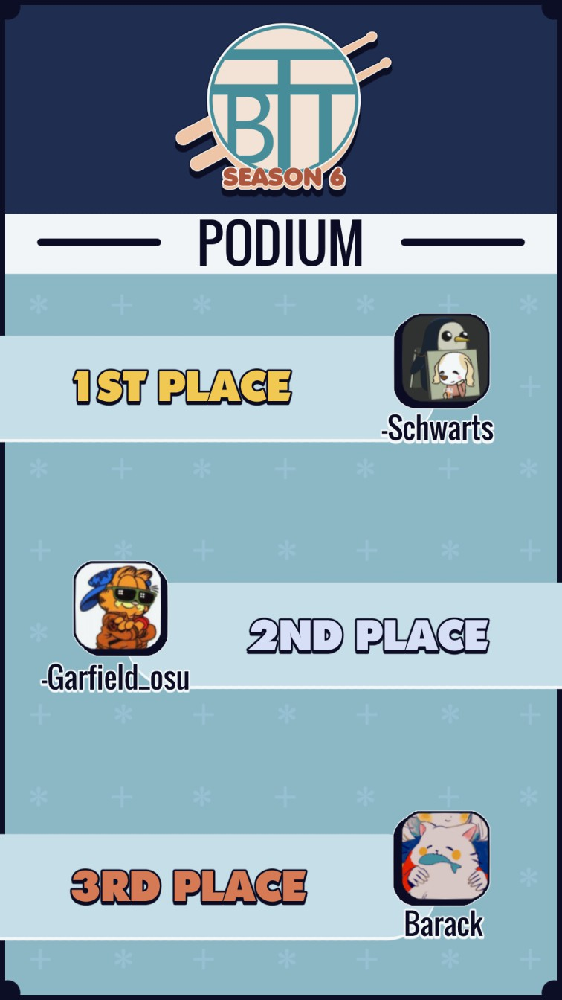

---
tags:
  - BTT
  - BTT6
---

# Beginners' Taiko Tournament Season 6

The **Beginners' Taiko Tournament Season 6** (***BTT6***) was a worldwide double-elimination 1v1 osu!taiko tournament hosted by ::{ flag=PL }:: [E-M-i](https://osu.ppy.sh/users/9148286) and ::{ flag=FR }:: [Kasumi-sama](https://osu.ppy.sh/users/6177263). Only players ranked #10,000 and above can participate. It was the sixth instalment of the Beginners' Taiko Tournament.

## Tournament schedule

| Event | Timestamp |
| --: | :-- |
| Registration phase | 2020-12-27/2021-01-17 |
| Screening phase | 2021-01-17/2021-01-27 |
| Qualifiers mappool showcase | 2021-01-31 (15:00 UTC) |
| Qualifiers | 2021-02-06/2021-02-07 |
| Live drawings | 2021-02-08 (18:00 UTC) |
| Group stage | 2021-02-12/2021-02-21 |
| Round of 32 | 2021-02-23/2021-02-28 |
| Round of 16 | 2021-03-06/2021-03-07 |
| Quarterfinals | 2021-03-13/2021-03-14 |
| Semifinals | 2021-03-20/2021-03-21 |
| Finals | 2021-03-26/2021-03-28 |
| Grand Finals | 2021-04-03/2021-04-04 |

## Prizes

| Placing | Prize(s) |
| :-: | :-- |
|  | Unique profile badge, 4 months of osu!supporter |
|  | 2 months of osu!supporter |
|  | 1 month of osu!supporter |

Generous donations from ::{ flag=FR }:: [Madeline](https://osu.ppy.sh/users/2812098) and ::{ flag=GB }:: [Mrshadow818](https://osu.ppy.sh/users/16968817) helped fund some of the prizes.

## Organisation

The Beginners' Taiko Tournament Season 6 was run by various community members.

| Position | Member(s) |
| :-- | :-- |
| Organizer | ::{ flag=PL }:: [E-M-i](https://osu.ppy.sh/users/9148286), ::{ flag=FR }:: [Kasumii-sama](https://osu.ppy.sh/users/6177263) |
| Co-organizer | ::{ flag=FR }:: [Badeline](https://osu.ppy.sh/users/4833654), ::{ flag=FR }:: [Madeline](https://osu.ppy.sh/users/2812098) |
| Mappool selector | ::{ flag=FR }:: [Arrival](https://osu.ppy.sh/users/1694000), ::{ flag=DE }:: [Capu](https://osu.ppy.sh/users/2474015), ::{ flag=DE }:: [DrugManager](https://osu.ppy.sh/users/8694649), ::{ flag=DE }:: [Maou](https://osu.ppy.sh/users/3867109), ::{ flag=DE }:: [Sayira](https://osu.ppy.sh/users/7253958), ::{ flag=NZ }:: [Sparxe](https://osu.ppy.sh/users/5750235) |
| Referee | ::{ flag=FR }:: [Badeline](https://osu.ppy.sh/users/4833654), ::{ flag=MY }:: [Bedwyr Aorta](https://osu.ppy.sh/users/10875855), ::{ flag=NL }:: [Boaz](https://osu.ppy.sh/users/13302996), ::{ flag=HK }:: [Brown918](https://osu.ppy.sh/users/9805760), ::{ flag=US }:: [cheese salad](https://osu.ppy.sh/users/6349821), ::{ flag=US }:: [Cychloryn](https://osu.ppy.sh/users/6921736), ::{ flag=PL }:: [E-M-i](https://osu.ppy.sh/users/9148286), ::{ flag=US }:: [Edgar\_Figaro](https://osu.ppy.sh/users/6508754), ::{ flag=SG }:: [Element118](https://osu.ppy.sh/users/2283992), ::{ flag=EC }:: [Gamelan4](https://osu.ppy.sh/users/9856910), ::{ flag=DE }:: [GDLenny](https://osu.ppy.sh/users/8406711), ::{ flag=DE }:: [GinIkari](https://osu.ppy.sh/users/6083491), ::{ flag=FR }:: [Madeline](https://osu.ppy.sh/users/2812098), ::{ flag=CH }:: [OverKurumi](https://osu.ppy.sh/users/9987378), ::{ flag=DE }:: [QEpicAce](https://osu.ppy.sh/users/9489153), ::{ flag=FR }:: [Satsukel](https://osu.ppy.sh/users/9066390), ::{ flag=DE }:: [Sayira](https://osu.ppy.sh/users/7253958), ::{ flag=NZ }:: [Sparxe](https://osu.ppy.sh/users/5750235), ::{ flag=US }:: [Swovine](https://osu.ppy.sh/users/6666316), ::{ flag=US }:: [travis\_ba](https://osu.ppy.sh/users/10822220) |
| Streamer | ::{ flag=MY }:: [Bedwyr Aorta](https://osu.ppy.sh/users/10875855), ::{ flag=US }:: [cheese salad](https://osu.ppy.sh/users/6349821), ::{ flag=US }:: [Cychloryn](https://osu.ppy.sh/users/6921736), ::{ flag=SG }:: [Element118](https://osu.ppy.sh/users/2283992), ::{ flag=NL }:: [oliebol](https://osu.ppy.sh/users/2756335), ::{ flag=US }:: [Rukairi](https://osu.ppy.sh/users/6642597), ::{ flag=DE }:: [Sayira](https://osu.ppy.sh/users/7253958) |
| Commentator | ::{ flag=AU }:: [AmateurMonkeyYT](https://osu.ppy.sh/users/8379046), ::{ flag=NZ }:: [Blujae](https://osu.ppy.sh/users/10613885), ::{ flag=PL }:: [E-M-i](https://osu.ppy.sh/users/9148286), ::{ flag=US }:: [Edgar\_Figaro](https://osu.ppy.sh/users/6508754), ::{ flag=DE }:: [Enohx](https://osu.ppy.sh/users/6375060), ::{ flag=US }:: [Ethaaaan](https://osu.ppy.sh/users/9536977), ::{ flag=DE }:: [GinIkari](https://osu.ppy.sh/users/6083491), ::{ flag=BR }:: [Halo-](https://osu.ppy.sh/users/7572142), ::{ flag=DE }:: [Heam](https://osu.ppy.sh/users/4705120), ::{ flag=US }:: [kb131313](https://osu.ppy.sh/users/11229259), ::{ flag=DE }:: [Malox](https://osu.ppy.sh/users/4516252), ::{ flag=DE }:: [Maou](https://osu.ppy.sh/users/3867109), ::{ flag=DE }:: [QEpicAce](https://osu.ppy.sh/users/9489153), ::{ flag=US }:: [Rukairi](https://osu.ppy.sh/users/6642597), ::{ flag=DE }:: [Sayira](https://osu.ppy.sh/users/7253958), ::{ flag=NZ }:: [Sparxe](https://osu.ppy.sh/users/5750235), ::{ flag=HK }:: [-Storm7-](https://osu.ppy.sh/users/12248285), ::{ flag=AR }:: [Vaf](https://osu.ppy.sh/users/12589048) |
| Designer | ::{ flag=PL }:: [E-M-i](https://osu.ppy.sh/users/9148286) |
| Stream highlighter | ::{ flag=NL }:: [Boaz](https://osu.ppy.sh/users/13302996), ::{ flag=PL }:: [E-M-i](https://osu.ppy.sh/users/9148286), ::{ flag=DE }:: [Maou](https://osu.ppy.sh/users/3867109) |
| Wiki editor | ::{ flag=ID }:: [fajar13k](https://osu.ppy.sh/users/7100002) |

## Links

- [Discussion thread](https://osu.ppy.sh/community/forums/topics/1211465)
- [BTT Discord server](https://discord.gg/EYAqSWH)
- Livestream
  - [Main channel](https://www.twitch.tv/beginnerstaikotournament)
  - [Second channel](https://www.twitch.tv/beginnerstaikotournament2)
- [Challonge bracket](https://challonge.com/BTTS6)
- Spreadsheet
  - **[Mastersheet](https://docs.google.com/spreadsheets/u/1/d/e/2PACX-1vTROAkBLwWpg_zzNIrcrt07cmDD9WbJhUZ5ZY5DtWo6msyyjECrIGmWzS0g2VJncS1LakDm2cI6qIcA/pubhtml)**
  - [Statistics](https://docs.google.com/spreadsheets/d/e/2PACX-1vSto8LnCe8WobfhrazcIHp3iTLEtcaKnzC3DmvRGNMwMohgKhQ5TzvTgiv41ZIx6bENGqFZ97L0HthY/pubhtml) provided by ::{ flag=US }:: [zachmanthethird](https://osu.ppy.sh/users/15048710)

## Participants

| Seed | Members |
| :-- | :-- |
| Top | ::{ flag=BE }:: [onixir](https://osu.ppy.sh/users/2993521), ::{ flag=CL }:: [Barack](https://osu.ppy.sh/users/9402889), ::{ flag=US }:: [oleka](https://osu.ppy.sh/users/9423766), ::{ flag=CA }:: [Garfield\_osu](https://osu.ppy.sh/users/9743947), ::{ flag=US }:: [-Schwarts](https://osu.ppy.sh/users/4673649), ::{ flag=NZ }:: [- Abby -](https://osu.ppy.sh/users/7740118), ::{ flag=ID }:: [AciTelor](https://osu.ppy.sh/users/16390988), ::{ flag=NL }:: [Albionthegreat](https://osu.ppy.sh/users/9853595), ::{ flag=US }:: [MrJamesGaming](https://osu.ppy.sh/users/13730858), ::{ flag=PL }:: [zts](https://osu.ppy.sh/users/4675441), ::{ flag=ID }:: [Rei Hakurei](https://osu.ppy.sh/users/704111), ::{ flag=SE }:: [Logg45vs](https://osu.ppy.sh/users/8684540), ::{ flag=RU }:: [BillySaywer](https://osu.ppy.sh/users/13602761), ::{ flag=DE }:: [marshallracer](https://osu.ppy.sh/users/626094), ::{ flag=SG }:: [AngelicK0](https://osu.ppy.sh/users/14319366), ::{ flag=TW }:: [Mashyuf](https://osu.ppy.sh/users/14356517) |
| High | ::{ flag=ES }:: [Pollo del KFC](https://osu.ppy.sh/users/20047906), ::{ flag=FR }:: [realy0\_](https://osu.ppy.sh/users/8863359), ::{ flag=AR }:: [Cata](https://osu.ppy.sh/users/5958063), ::{ flag=KR }:: [choke-](https://osu.ppy.sh/users/12242622), ::{ flag=US }:: [dhuragin](https://osu.ppy.sh/users/14443745), ::{ flag=NO }:: [BrokenShiv](https://osu.ppy.sh/users/8602371), ::{ flag=MX }:: [-Teka-](https://osu.ppy.sh/users/5065096), ::{ flag=BE }:: [NekoT](https://osu.ppy.sh/users/7783889), ::{ flag=DE }:: [AngeliumX](https://osu.ppy.sh/users/15000256), ::{ flag=BR }:: [xKirito](https://osu.ppy.sh/users/4018079), ::{ flag=AR }:: [Tati\_Muffin](https://osu.ppy.sh/users/10067936), ::{ flag=BG }:: [LazerDynamiX](https://osu.ppy.sh/users/9957793), ::{ flag=MX }:: [-Devo](https://osu.ppy.sh/users/7090541), ::{ flag=GB }:: [Mrshadow818](https://osu.ppy.sh/users/16968817), ::{ flag=AR }:: [Alan Reaven](https://osu.ppy.sh/users/5422789), ::{ flag=US }:: [mynt](https://osu.ppy.sh/users/4611708) |
| Low | ::{ flag=PL }:: [alque](https://osu.ppy.sh/users/1083605), ::{ flag=CA }:: [Jessechugaga](https://osu.ppy.sh/users/8196548), ::{ flag=KR }:: [PostScr1pt](https://osu.ppy.sh/users/3410997), ::{ flag=TH }:: [jimmyreturnz](https://osu.ppy.sh/users/11306153), ::{ flag=US }:: [Kalesy](https://osu.ppy.sh/users/9512790), ::{ flag=US }:: [\[Distant\]](https://osu.ppy.sh/users/8137960), ::{ flag=US }:: [KillingCopper](https://osu.ppy.sh/users/9878349), ::{ flag=RU }:: [Prade](https://osu.ppy.sh/users/9318565), ::{ flag=US }:: [Magirhythm](https://osu.ppy.sh/users/10205817), ::{ flag=AU }:: [Becka](https://osu.ppy.sh/users/16552460), ::{ flag=US }:: [Suika7](https://osu.ppy.sh/users/13644465), ::{ flag=DE }:: [Stipoki](https://osu.ppy.sh/users/8484023), ::{ flag=CA }:: [\[ shine \]](https://osu.ppy.sh/users/6203507), ::{ flag=UA }:: [Kargondz](https://osu.ppy.sh/users/9919528), ::{ flag=US }:: [RAM3NN](https://osu.ppy.sh/users/12156170), ::{ flag=US }:: [Jumpidy](https://osu.ppy.sh/users/9497436) |
| Unseeded | ::{ flag=FR }:: [Bambinex](https://osu.ppy.sh/users/18818124), ::{ flag=UA }:: [DarMine](https://osu.ppy.sh/users/12382337), ::{ flag=US }:: [Dilly\_P](https://osu.ppy.sh/users/12907431), ::{ flag=FR }:: [killping5024](https://osu.ppy.sh/users/11189164), ::{ flag=GB }:: [SinCrone](https://osu.ppy.sh/users/9426809), ::{ flag=SG }:: [DEUS\_LUDORUM](https://osu.ppy.sh/users/10360747), ::{ flag=RU }:: [RJbyM](https://osu.ppy.sh/users/12284608), ::{ flag=US }:: [Jabub](https://osu.ppy.sh/users/12091960), ::{ flag=GB }:: [buttonrfc](https://osu.ppy.sh/users/18646531), ::{ flag=PH }:: [Lazereed](https://osu.ppy.sh/users/12894120), ::{ flag=DE }:: [Fre3Styl3r](https://osu.ppy.sh/users/10177249), ::{ flag=MY }:: [Hand Sanitiser](https://osu.ppy.sh/users/5091293), ::{ flag=CH }:: [aliciapom](https://osu.ppy.sh/users/15101150), ::{ flag=US }:: [Smol -w-](https://osu.ppy.sh/users/11956413), ::{ flag=GB }:: [biki-desu](https://osu.ppy.sh/users/16548217), ::{ flag=RU }:: [Egor20042004](https://osu.ppy.sh/users/3218675) |
| Eliminated | ::{ flag=RO }:: [justAkari](https://osu.ppy.sh/users/18515010), ::{ flag=US }:: [LilBoom123](https://osu.ppy.sh/users/14882874), ::{ flag=RU }:: [Lord\_MaXXiM](https://osu.ppy.sh/users/7806547), ::{ flag=RU }:: [Vitas2222](https://osu.ppy.sh/users/11742599), ::{ flag=CO }:: [notzonnorz](https://osu.ppy.sh/users/19266355), ::{ flag=US }:: [AlbertsPP](https://osu.ppy.sh/users/17504393) |

## Groups

| Group | Top seed | High seed | Low seed | Unseeded |
| :-: | :-- | :-- | :-- | :-- |
| **A** | ::{ flag=TW }:: [Mashyuf](https://osu.ppy.sh/users/14356517) | ::{ flag=BR }:: [xKirito](https://osu.ppy.sh/users/4018079) | ::{ flag=US }:: [Kalesy](https://osu.ppy.sh/users/9512790) | ::{ flag=FR }:: [killping5024](https://osu.ppy.sh/users/11189164) |
| **B** | ::{ flag=US }:: [-Schwarts](https://osu.ppy.sh/users/4673649) | ::{ flag=ES }:: [Pollo del KFC](https://osu.ppy.sh/users/20047906) | ::{ flag=US }:: [Suika7](https://osu.ppy.sh/users/13644465) | ::{ flag=US }:: [Smol -w-](https://osu.ppy.sh/users/11956413) |
| **C** | ::{ flag=CL }:: [Barack](https://osu.ppy.sh/users/9402889) | ::{ flag=BG }:: [LazerDynamiX](https://osu.ppy.sh/users/9957793) | ::{ flag=CA }:: [Jessechugaga](https://osu.ppy.sh/users/8196548) | ::{ flag=GB }:: [buttonrfc](https://osu.ppy.sh/users/18646531) |
| **D** | ::{ flag=US }:: [oleka](https://osu.ppy.sh/users/9423766) | ::{ flag=AR }:: [Alan Reaven](https://osu.ppy.sh/users/5422789) | ::{ flag=US }:: [RAM3NN](https://osu.ppy.sh/users/12156170) | ::{ flag=GB }:: [biki-desu](https://osu.ppy.sh/users/16548217) |
| **E** | ::{ flag=ID }:: [Rei Hakurei](https://osu.ppy.sh/users/704111) | ::{ flag=US }:: [dhuragin](https://osu.ppy.sh/users/14443745) | ::{ flag=US }:: [\[Distant\]](https://osu.ppy.sh/users/8137960) | ::{ flag=MY }:: [Hand Sanitiser](https://osu.ppy.sh/users/5091293) |
| **F** | ::{ flag=SE }:: [Logg45vs](https://osu.ppy.sh/users/8684540) | ::{ flag=MX }:: [-Devo](https://osu.ppy.sh/users/7090541) | ::{ flag=US }:: [Jumpidy](https://osu.ppy.sh/users/9497436) | ::{ flag=GB }:: [SinCrone](https://osu.ppy.sh/users/9426809) |
| **G** | ::{ flag=ID }:: [AciTelor](https://osu.ppy.sh/users/16390988) | ::{ flag=AR }:: [Tati\_Muffin](https://osu.ppy.sh/users/10067936) | ::{ flag=PL }:: [alque](https://osu.ppy.sh/users/1083605) | ::{ flag=US }:: [Dilly\_P](https://osu.ppy.sh/users/12907431) |
| **H** | ::{ flag=DE }:: [marshallracer](https://osu.ppy.sh/users/626094) | ::{ flag=NO }:: [BrokenShiv](https://osu.ppy.sh/users/8602371) | ::{ flag=AU }:: [Becka](https://osu.ppy.sh/users/16552460) | ::{ flag=UA }:: [DarMine](https://osu.ppy.sh/users/12382337) |
| **I** | ::{ flag=US }:: [MrJamesGaming](https://osu.ppy.sh/users/13730858) | ::{ flag=GB }:: [Mrshadow818](https://osu.ppy.sh/users/16968817) | ::{ flag=TH }:: [jimmyreturnz](https://osu.ppy.sh/users/11306153) | ::{ flag=PH }:: [Lazereed](https://osu.ppy.sh/users/12894120) |
| **J** | ::{ flag=NL }:: [Albionthegreat](https://osu.ppy.sh/users/9853595) | ::{ flag=US }:: [mynt](https://osu.ppy.sh/users/4611708) | ::{ flag=US }:: [KillingCopper](https://osu.ppy.sh/users/9878349) | ::{ flag=RU }:: [RJbyM](https://osu.ppy.sh/users/12284608) |
| **K** | ::{ flag=RU }:: [BillySaywer](https://osu.ppy.sh/users/13602761) | ::{ flag=KR }:: [choke-](https://osu.ppy.sh/users/12242622) | ::{ flag=CA }:: [\[ shine \]](https://osu.ppy.sh/users/6203507) | ::{ flag=RU }:: [Egor20042004](https://osu.ppy.sh/users/3218675) |
| **L** | ::{ flag=NZ }:: [- Abby -](https://osu.ppy.sh/users/7740118) | ::{ flag=BE }:: [NekoT](https://osu.ppy.sh/users/7783889) | ::{ flag=DE }:: [Stipoki](https://osu.ppy.sh/users/8484023) | ::{ flag=DE }:: [Fre3Styl3r](https://osu.ppy.sh/users/10177249) |
| **M** | ::{ flag=SG }:: [AngelicK0](https://osu.ppy.sh/users/14319366) | ::{ flag=FR }:: [realy0\_](https://osu.ppy.sh/users/8863359) | ::{ flag=KR }:: [PostScr1pt](https://osu.ppy.sh/users/3410997) | ::{ flag=US }:: [Jabub](https://osu.ppy.sh/users/12091960) |
| **N** | ::{ flag=PL }:: [zts](https://osu.ppy.sh/users/4675441) | ::{ flag=MX }:: [-Teka-](https://osu.ppy.sh/users/5065096) | ::{ flag=US }:: [Magirhythm](https://osu.ppy.sh/users/10205817) | ::{ flag=CH }:: [aliciapom](https://osu.ppy.sh/users/15101150) |
| **O** | ::{ flag=CA }:: [Garfield\_osu](https://osu.ppy.sh/users/9743947) | ::{ flag=DE }:: [AngeliumX](https://osu.ppy.sh/users/15000256) | ::{ flag=UA }:: [Kargondz](https://osu.ppy.sh/users/9919528) | ::{ flag=SG }:: [DEUS\_LUDORUM](https://osu.ppy.sh/users/10360747) |
| **P** | ::{ flag=BE }:: [onixir](https://osu.ppy.sh/users/2993521) | ::{ flag=AR }:: [Cata](https://osu.ppy.sh/users/5958063) | ::{ flag=RU }:: [Prade](https://osu.ppy.sh/users/9318565) | ::{ flag=FR }:: [Bambinex](https://osu.ppy.sh/users/18818124) |

## Podium

## Mappools

### Grand Finals

**[Download the mappack here! (92 MB)](https://mega.nz/file/4g921QLB#d2-t3ntlbihBngKUYvT3tE_uVAgdMzgZQ4VTqC1kCP4)**

- NoMod
  1. [Feint - Laurence (ZTH) \[Oni\]](https://osu.ppy.sh/beatmapsets/417759#taiko/945140)
  2. [MYUKKE. - The 89's Momentum (HiroK) \[Oni\]](https://osu.ppy.sh/beatmapsets/1320872#taiko/2868401)
  3. [Frums - Star of the COME ON!! (rubies87) \[Muzukashii\]](https://osu.ppy.sh/beatmapsets/1036375#taiko/2166945)
  4. [siqlo - YInMn Blue (gaston\_2199) \[Oni\]](https://osu.ppy.sh/beatmapsets/1233593#taiko/2564433)
  5. [Bad Bunny x Jhay Cortez - Dakiti (Gamelan4) \[Euforia\]](https://osu.ppy.sh/beatmapsets/1385512#taiko/2862238)
  6. [Tanchiky - Build (Sayira) \[Destroy\]](https://osu.ppy.sh/beatmapsets/1415637#taiko/2917561)
- Hidden
  1. [Kanon Wakeshima - Tsukinami (gaston\_2199) \[Oni\]](https://osu.ppy.sh/beatmapsets/556098#taiko/1286354)
  2. [Cranky - LVBNR5 SCHWARZ (Nofool) \[Muzukashii\]](https://osu.ppy.sh/beatmapsets/492813#taiko/1049767)
  3. [toby fox - Spider Dance (MARETU Remix) (Serial Dreemurr) \[Muzukashii\]](https://osu.ppy.sh/beatmapsets/1088142#taiko/2275354)
- HardRock
  1. [Krewella - Surrender The Throne (Lyawi) \[Oni\]](https://osu.ppy.sh/beatmapsets/1062820#taiko/2225599)
  2. [BlackY - IKAROS DYNAMITE!!!! (Vulkin) \[Muzukashii\]](https://osu.ppy.sh/beatmapsets/537224#taiko/1163529)
  3. [Bring Me The Horizon - ouch (Arrival) \[oni (Capu) (BTT edit)\]](https://osu.ppy.sh/beatmapsets/1415810#taiko/2917823)
- DoubleTime
  1. [Sayuri - Sore wa Chiisana Hikari no Youna (Arrival) \[Muzukashii (Nao Tomori) (BTT Edit)\]](https://osu.ppy.sh/beatmapsets/1415820#taiko/2917841)
  2. [ZUN - The Youkai Mountain ~ Mysterious Mountain (BCI) \[Koka's Muzukashii\]](https://osu.ppy.sh/beatmapsets/76048#taiko/216948)
  3. [sakuraburst - dungeon music (iceOC) \[Muzukashii\]](https://osu.ppy.sh/beatmapsets/1056653#taiko/2279001)
- FreeMod
  1. [DECO\*27 - Haruichi. feat. Hatsune Miku (mintong89) \[Taiko Oni\]](https://osu.ppy.sh/beatmapsets/196049#taiko/464950)
  2. [Camellia - U Got That (Camellia's Neurofunk Bootleg) (rubies87) \[Muzukashii\]](https://osu.ppy.sh/beatmapsets/1037894#taiko/2177225)
  3. [tarolabo - Miko (Genjuro) \[Dusk's Muzukashii\]](https://osu.ppy.sh/beatmapsets/1100379#taiko/2308255)
- Tiebreaker
  1. **[Camellia feat. Nana Takahashi - Mushi No Sumu Tokoro (Arrival) \[Oni\]](https://osu.ppy.sh/beatmapsets/1415803#taiko/2917815)**

### Finals

**[Download the mappack here! (84 MB)](https://mega.nz/file/U00wEJ4Q#s-RRtQKSwz8Zhm8cvzJUQBDuRvVkHbBZHU-EY-Y3hn0)**

- NoMod
  1. [Various Artists - BTT 2021 Finals Mappack (Arrival) \[Silent Siren - Routine (yuzu\_\_rinrin) [Muzukashii (BTT edit)]\]](https://osu.ppy.sh/beatmapsets/1408912#taiko/2905175)
  2. [Kyary Pamyu Pamyu - HARAJUKU IYAHOI (Faputa) \[AHOI\]](https://osu.ppy.sh/beatmapsets/1301977#taiko/2700414)
  3. [Laur - Nostalgic Blood of Strife (sendol) \[Muzukashii\]](https://osu.ppy.sh/beatmapsets/968515#taiko/2026573)
  4. [Camellia - {albus} (\_DUSK\_) \[DREAM's Muzukashii\]](https://osu.ppy.sh/beatmapsets/834687#taiko/1860959)
  5. [Swingrowers - Here to Stay (Nofool) \[Oni\]](https://osu.ppy.sh/beatmapsets/1327394#taiko/2749972)
  6. [Camellia - \* Erm, could it be a Spatiotemporal ShockWAVE Syndrome...? (Nifty) \[Genjuro's Muzukashii\]](https://osu.ppy.sh/beatmapsets/1053885#taiko/2225010)
- Hidden
  1. [Lime - 8bit Voyager (komasy) \[Muzukashii\]](https://osu.ppy.sh/beatmapsets/1326923#taiko/2748993)
  2. [Truxton - SHOTGUN JUGGLE (DarkVortex) \[Muzukashii\]](https://osu.ppy.sh/beatmapsets/532587#taiko/1128510)
  3. [Deorro - Red Lips (Jaye) \[Muzukashii\]](https://osu.ppy.sh/beatmapsets/697727#taiko/1477915)
- HardRock
  1. [Various Artists - BTT 2021 Finals Mappack (Arrival) \[MIMI - Mizuoto to Curtain (eiri-) [Muzukashii (BTT edit)]\]](https://osu.ppy.sh/beatmapsets/1408912#taiko/2905176)
  2. [Memme - Pandemonium (Raiden) \[Muzukashii\]](https://osu.ppy.sh/beatmapsets/922918#taiko/2562603)
  3. [Tezuka x Qayo - NiNi (\_DUSK\_) \[Muzukashii\]](https://osu.ppy.sh/beatmapsets/1048248#taiko/2192545)
- DoubleTime
  1. [Various Artists - BTT 2021 Finals Mappack (Arrival) \[Hanazawa Kana - happy endings (Nardoxyribonucleic) [Muzukashii (BTT edit)]\]](https://osu.ppy.sh/beatmapsets/1408912#taiko/2905174)
  2. [M2U feat. Guriri - Magnolia (JUDYDANNY) \[Muzukashii\]](https://osu.ppy.sh/beatmapsets/140418#taiko/351167)
  3. [URBANGARDE - BAERUNA (Faputa) \[MUZUKASHII\]](https://osu.ppy.sh/beatmapsets/1323774#taiko/2781312)
- FreeMod
  1. [SymaG - Buriki no Dance (\_yu68) \[Muzukashii\]](https://osu.ppy.sh/beatmapsets/482486#taiko/1089740)
  2. [Camellia - #1f1e33 (Raytoly) \[#mu2ukash11\]](https://osu.ppy.sh/beatmapsets/1193771#taiko/2494888)
  3. [penoreri - Preserved Valkyria (Nardoxyribonucleic) \[Muzukashii\]](https://osu.ppy.sh/beatmapsets/861177#taiko/1829396)
- Tiebreaker
  1. **[NIWASHI - Playing with Ruby (Cychloryn) \[Muzukashii\]](https://osu.ppy.sh/beatmapsets/1328323#taiko/2764682)**

### Semifinals

**[Download the mappack here! (81 MB)](https://mega.nz/file/MgtE0aIQ#EcGPzw5-l2sWmKoU56L87Vl5uI-mNmQ1TORBK01yKyg)**

- NoMod
  1. [Jouhoushori-bu - Setsuna Iro (tamame's EZC remix) (X a v y) \[Muzukashii\]](https://osu.ppy.sh/beatmapsets/1381626#taiko/2854725)
  2. [q/stol - LOVE THIS MOMENT (tasuke912) \[Muzukashii\]](https://osu.ppy.sh/beatmapsets/959704#taiko/2009320)
  3. [FOLiACETATE - Heterochromia Iridis (DakeDekaane) \[Muzukashii\]](https://osu.ppy.sh/beatmapsets/432303#taiko/936949)
  4. [Silentroom - F1055 (HiroK) \[Ulqui's Muzukashii\]](https://osu.ppy.sh/beatmapsets/1224716#taiko/2604633)
  5. [Chroma - Made In Love (Nifty) \[Muzukashii\]](https://osu.ppy.sh/beatmapsets/1016229#taiko/2267976)
- Hidden
  1. [SOUND HOLIC feat. Nana Takahashi - STARLIGHT JUNCTION (Luqua) \[Roger's MUZUKASHII\]](https://osu.ppy.sh/beatmapsets/1102691#taiko/2312268)
  2. [Various Artists - BTT 2021 SF Mappack (Arrival) \[Rahatt - Brecorr in Macedonia (Genjuro) [Muzukashii (BTT edit)]\]](https://osu.ppy.sh/beatmapsets/1402498#taiko/2893220)
  3. [yuikonnu - Genjitsu Game (Lasse) \[Muzukashii\]](https://osu.ppy.sh/beatmapsets/733590#taiko/2229526)
- HardRock
  1. [Various Artists - BTT 2021 SF Mappack (Arrival) \[AcuticNotes - Axeria (tasuke912) [Muzukashii (BTT edit)]\]](https://osu.ppy.sh/beatmapsets/1402498#taiko/2893219)
  2. [Morimori Atsushi - Mangetsu no Tikurin(MRM REMIX) (Ozu) \[Muzukashii\]](https://osu.ppy.sh/beatmapsets/1082080#taiko/2263550)
  3. [Lime - 8bit Adventurer (komasy) \[Muzukashii\]](https://osu.ppy.sh/beatmapsets/1225007#taiko/2547758)
- DoubleTime
  1. [Alex Gaudino feat. Crystal Waters - Destination Calabria (Getty) \[Ayyri's Muzukashii\]](https://osu.ppy.sh/beatmapsets/760416#taiko/1601539)
  2. [Zekk - Falling Down feat. Renko x TRIANGLE (Raiden) \[Futsuu\]](https://osu.ppy.sh/beatmapsets/1150487#taiko/2411483)
- FreeMod
  1. [DJ Fresh feat. Rita Ora - Hot Right Now (Radio Edit) (gaston\_2199) \[Muzukashii\]](https://osu.ppy.sh/beatmapsets/575072#taiko/1221606)
  2. [Kicco - Shinryoku no Cinderella (\[R\]) \[Oni\]](https://osu.ppy.sh/beatmapsets/1030360#taiko/2163951)
  3. [ziki\_7 - Leviathan (yassu-) \[Muzukashii\]](https://osu.ppy.sh/beatmapsets/1013884#taiko/2186075)
- Tiebreaker
  1. **[Camellia - Bring Our Ignition Back (Arrival) \[Muzukashii\]](https://osu.ppy.sh/beatmapsets/1133558#taiko/2459407)**

### Quarterfinals

**[Download the mappack here! (89 MB)](https://mega.nz/file/FlUVGADS#6rpZmhtJojlQo6WnieDL4_zTwq_5hKe9zCx0qyQnmz8)**

- NoMod
  1. [Hanatan - Airman ga Taosenai (SOUND HOLIC Ver.) (Natsu) \[m1ng's Taiko Muzukashii\]](https://osu.ppy.sh/beatmapsets/134151#taiko/341042)
  2. [Memme feat. M2U - Sky of the Ocean (Pagliaccio) \[TK'S Muzukashii\]](https://osu.ppy.sh/beatmapsets/131642#taiko/342866)
  3. [TUYU - Doro no Bunzai de Watashi dake no Taisetsu o Ubaouda nante (gaston\_2199) \[Muzukashii\]](https://osu.ppy.sh/beatmapsets/1316773#taiko/2734138)
  4. [Sota Fujimori - polygon (Fallmorph) \[Muzukashii\]](https://osu.ppy.sh/beatmapsets/721297#taiko/1526012)
  5. [TEZUKApo11o band feat. Ranko (BUTAOTOME) + OFFICE Manta (Kabu) - "Youkai Rokku, Wareshi Konikeri." (Faputa) \[Muzukashii\]](https://osu.ppy.sh/beatmapsets/1171274#taiko/2450893)
- Hidden
  1. [nora2r - B.B.K.K.B.K.K (DanSparce) \[Nishizumi's Muzukashii\]](https://osu.ppy.sh/beatmapsets/326284#taiko/726479)
  2. [Akira Complex - Ether Strike (Raytoly) \[Futsuu\]](https://osu.ppy.sh/beatmapsets/1170083#taiko/2471176)
- HardRock
  1. [Various Artists - BTT 2021 QF Mappack (Arrival) \[Agnete Kjolsrud - Get Jinxed (Hanjamon) [Muzukashii (BTT edit)]\]](https://osu.ppy.sh/beatmapsets/1395403#taiko/2880212)
  2. [Various Artists - BTT 2021 QF Mappack (Arrival) \[AAAA Chazuke - Hoshi no Otoshimono (X a v y) [Futsuu (BTT edit)]\]](https://osu.ppy.sh/beatmapsets/1395403#taiko/2880211)
- DoubleTime
  1. [Various Artists - BTT 2021 QF Mappack (Arrival) \[Eve - Dramaturgy (Ulqui) [Futsuu (BTT edit)]\]](https://osu.ppy.sh/beatmapsets/1395403#taiko/2880213)
  2. [UNDEAD CORPORATION - Karakurenai (ASPIRIN) \[Futsuu\]](https://osu.ppy.sh/beatmapsets/709336#taiko/1510938)
- FreeMod
  1. [Equilibrium - Rise Again (LZD) \[Futsuu\]](https://osu.ppy.sh/beatmapsets/645370#taiko/1367600)
  2. [RoughSketch - The Omen (Ulqui) \[Muzukashii\]](https://osu.ppy.sh/beatmapsets/566671#taiko/1424778)
  3. [rejection - Signal feat. Such (Vanity8) \[Futsuu\]](https://osu.ppy.sh/beatmapsets/1249606#taiko/2601909)
- Tiebreaker
  1. **[THE ORAL CIGARETTES - ReI (Capu) \[Blacken's Muzukashii\]](https://osu.ppy.sh/beatmapsets/987631#taiko/2232573)**

### Round of 16

**[Download the mappack here! (61 MB)](https://mega.nz/file/QsdgxLiD#VzO5fdLJjk_Oe7MqC6BVVhFGCzQCRFTPJJIX2ysdrtc)**

- NoMod
  1. [Fear, and Loathing in Las Vegas - Rave-Up Tonight (qoot8123) \[Muzukashii\]](https://osu.ppy.sh/beatmapsets/244532#taiko/567838)
  2. [soejima takuma feat. BEMANI Sound Team "Nekomata Master" - Mistress Ann ni Hanataba o (D o t) \[Muzukashii\]](https://osu.ppy.sh/beatmapsets/1103043#taiko/2305020)
  3. [BEMANI Sound Team "PHQUASE" - voltississimo (Cynplytholowazy) \[NOVICE\]](https://osu.ppy.sh/beatmapsets/1044151#taiko/2183756)
  4. [meganeko - Delete [Bossfight Remix] (gaston\_2199) \[Muzukashii\]](https://osu.ppy.sh/beatmapsets/1007211#taiko/2107983)
  5. [RoughSketch - 666 (Cynplytholowazy) \[NOVICE\]](https://osu.ppy.sh/beatmapsets/1107042#taiko/2313754)
- Hidden
  1. [Various Artists - BTT 2021 RO16 Mappack (Arrival) \[senya - Sasakayu, Kiekaketa Kouisou ga (Prophecy) [Muzukashii (BTT edit)]\]](https://osu.ppy.sh/beatmapsets/1388763#taiko/2868117)
  2. [Rahatt - Mafijas Breakcore (Genjuro) \[HiroK's Futsuu\]](https://osu.ppy.sh/beatmapsets/1164471#taiko/2442083)
- HardRock
  1. [Morimori Atsushi vs. uma - Sweet\* Witch\* Girl\* (FiNNb) \[Muzukashii*\]](https://osu.ppy.sh/beatmapsets/1283515#taiko/2668780)
  2. [Morimori Atsushi - Toono Gensou Monogatari (MRM REMIX) (Charlotte) \[Nardo's Futsuu\]](https://osu.ppy.sh/beatmapsets/812992#taiko/2244449)
- DoubleTime
  1. [MYLK - Bubblegum (Cynplytholowazy) \[HiroK's Futsuu\]](https://osu.ppy.sh/beatmapsets/1055143#taiko/2206121)
  2. [Yunomi - Wakusei Rabbit (feat. TORIENA) (Franklin\_DeJavu) \[Futsuu\]](https://osu.ppy.sh/beatmapsets/639535#taiko/1357108)
- FreeMod
  1. [U-F SEQUENCER - The Invisible (Poltergeist mix) (Reficul) \[Futsuu\]](https://osu.ppy.sh/beatmapsets/1243362#taiko/2584929)
  2. [Jun Kuroda - Meikyoshisui (Capu) \[Futsuu\]](https://osu.ppy.sh/beatmapsets/1338121#taiko/2772278)
  3. [Various Artists - BTT 2021 RO16 Mappack (Arrival) \[yanaginagi - Vidro Moyou (mintong89) [Muzukashii (BTT edit)]\]](https://osu.ppy.sh/beatmapsets/1388763#taiko/2868119)
- Tiebreaker
  1. **[Various Artists - BTT 2021 RO16 Mappack (Arrival) \[Task Horizon & Neonlight - Enigma Machine (Capu) [Muzukashii (BTT edit)]\]](https://osu.ppy.sh/beatmapsets/1388763#taiko/2868118)**

### Round of 32

**[Download the mappack here! (74 MB)](https://mega.nz/file/hwlC0aYK#D2iCzvYnzj576mfIgHmzMYFKDh9wKy_1gfVKqscw5Ug)**

- NoMod
  1. [Thaehan - Overpowered (Yales) \[Futsuu\]](https://osu.ppy.sh/beatmapsets/877935#taiko/1840720)
  2. [Akiyama Uni - Kaoru Juyouka (CallMeLyra) \[Futsuu\]](https://osu.ppy.sh/beatmapsets/1181321#taiko/2463170)
  3. [Sakamoto Eizo x Takahama Yusuke - UNDEAD HEART (IKARI NO Warriors) (ARGENTINE DREAM) \[Futsuu\]](https://osu.ppy.sh/beatmapsets/781915#taiko/1642074)
  4. [lapix - Roll the Dice (ARGENTINE DREAM) \[MEDIUM\]](https://osu.ppy.sh/beatmapsets/840905#taiko/1760018)
- Hidden
  1. [Silentroom - Alt Futur (tasuke912) \[Futsuu\]](https://osu.ppy.sh/beatmapsets/1239033#taiko/2583911)
  2. [Rohi - LvC3 (Hivie) \[Futsuu\]](https://osu.ppy.sh/beatmapsets/1176918#taiko/2455956)
- HardRock
  1. [Memme - Starving Days (Love) \[Futsuu\]](https://osu.ppy.sh/beatmapsets/157641#taiko/390091)
  2. [Nekomata L.E.D.Master+ - Chrono Diver -PENDULUMs- (L y s) \[Futsuu\]](https://osu.ppy.sh/beatmapsets/812548#taiko/1704322)
- DoubleTime
  1. [SHW - Ikusa JAPAN (shw.in) (kanpakyin) \[Futsuu\]](https://osu.ppy.sh/beatmapsets/169969#taiko/411519)
  2. [CLIFF EDGE - Angel feat. Nakamura Maiko (Speed Up Ver.) (Fleure De Lapin) \[Futsuu\]](https://osu.ppy.sh/beatmapsets/1049007#taiko/2192603)
- FreeMod
  1. [Nekomata Master - Scar in the Earth (Tasha) \[Futsuu\]](https://beatconnect.io/b/59429/DVeqR1Jq)
  2. [xyst - Ylil's overed landscape (SKSalt) \[Futsuu\]](https://osu.ppy.sh/beatmapsets/897948#taiko/1882386)
- Tiebreaker
  1. **[hololive IDOL PROJECT - Shiny Smily Story (taiko\_ryuki) \[Ron's Muzukashii\]](https://osu.ppy.sh/beatmapsets/1050045#taiko/2322393)**

### Group stage

**[Download the mappack here! (52 MB)](https://mega.nz/file/B0UCVZAC#YE-4sS94GSC6kwigXFxLtlsCkqM_VZF4zj14eRbvhS4)**

- NoMod
  1. [HoneyWorks feat. sana - Ijiwaru na Deai (yuzu\_\_rinrin) \[Futsuu\]](https://osu.ppy.sh/beatmapsets/635498#taiko/1348547)
  2. [Ryu\* feat.Mayumi Morinaga - Din Don Dan (aabc271) \[Futsuu\]](https://osu.ppy.sh/beatmapsets/467975#taiko/1004401)
  3. [xi - Wish upon Twin Stars (Ascendance) \[Futsuu\]](https://osu.ppy.sh/beatmapsets/353259#taiko/805886)
  4. [cute girls doing cute things - Ideal (Reficul) \[Futsuu\]](https://osu.ppy.sh/beatmapsets/1292718#taiko/2682743)
- Hidden
  1. [Zekk - Libertas (\_DUSK\_) \[Futsuu\]](https://osu.ppy.sh/beatmapsets/1001338#taiko/2109511)
  2. [RYO - Shuffle Heaven (Nwolf) \[Futsuu\]](https://osu.ppy.sh/beatmapsets/194109#taiko/461057)
- HardRock
  1. [Camellia - Sayonara Heaven (Camellia's NEKOMATAelectroRMX) (\_DUSK\_) \[Futsuu\]](https://osu.ppy.sh/beatmapsets/964453#taiko/2027842)
  2. [Nekomata Master feat. Hayashi Momoko - Rainbow after snow (TKSalt) \[Futsuu\]](https://beatconnect.io/b/108948 )
- DoubleTime
  1. [XXXTENTACION - Jocelyn Flores (Chromoxx) \[Futsuu\]](https://osu.ppy.sh/beatmapsets/705133#taiko/1491486)
  2. [Sano Gaku - Rise Up Your Flag (Meow2) \[Futsuu\]](https://osu.ppy.sh/beatmapsets/221626#taiko/555274)
- FreeMod
  1. [UI-70 - Sakura Sakura \~Japanize Dream... (tasuke912) \[Futsuu\]](https://osu.ppy.sh/beatmapsets/329326#taiko/730048)
  2. [U1 Overground - Dopamine (\[\_Chichinya\_\]) \[Futsuu\]](https://osu.ppy.sh/beatmapsets/804423#taiko/1688629)
- Tiebreaker
  1. **[UNDEAD CORPORATION - The Empress (Raiden) \[Futsuu\]](https://osu.ppy.sh/beatmapsets/452051#taiko/2504589)**

### Qualifiers

**[Download the mappack here! (27 MB)](https://mega.nz/file/os0gBYIT#6DLmTb5qI14SenROILgf4oq5wQF8HHC3b5Mo3mHBULM)**

- NoMod
  1. [Mrs. GREEN APPLE - Inferno (Volta) \[Futsuu\]](https://osu.ppy.sh/beatmapsets/1146346#taiko/2395137)
  2. [The Super Mario Players feat. Kate Davis - Jump Up, Super Star! (Short ver.) (maziari1105) \[Futsuu\]](https://osu.ppy.sh/beatmapsets/710971#taiko/1505875)
- Hidden
  1. [dark cat - hot chocolate (Backfire) \[Nardo's Futsuu\]](https://osu.ppy.sh/beatmapsets/847576#taiko/1863457)
- HardRock
  1. [Akiyama Uni - Kanpan Tasogare Shinbun (Yumyum-) \[Futsuu\]](https://osu.ppy.sh/beatmapsets/748983#taiko/1580170)
- DoubleTime
  1. [Rin - Kishinjou set 01 ~ Mist Lake (tasuke912) \[Futsuu\]](https://osu.ppy.sh/beatmapsets/948844#taiko/1981515)
- FreeMod
  1. [Hommarju - BEAST BASS BOMB (Tofu1222) \[Futsuu\]](https://osu.ppy.sh/beatmapsets/855722#taiko/1802776)

## Match results

### Grand Finals

Saturday, 3 April 2021:

| Player 1 |  |  | Player 2 | Match link |
| --: | :-: | :-: | :-- | :-- |
| Barack ::{ flag=CL }:: | 4 | **7** | ::{ flag=CA }:: **Garfield\_osu** | [#1](https://osu.ppy.sh/community/matches/79883045), [#2](https://osu.ppy.sh/community/matches/79887645) |

Sunday, 4 April 2021:

| Player 1 |  |  | Player 2 | Match link |
| --: | :-: | :-: | :-- | :-- |
| **-Schwarts** ::{ flag=US }:: | **7** | 5 | ::{ flag=CA }:: Garfield\_osu | [#1](https://osu.ppy.sh/community/matches/79971517) |

### Finals

Friday, 26 March 2021:

| Player 1 |  |  | Player 2 | Match link |
| --: | :-: | :-: | :-- | :-- |
| Albionthegreat ::{ flag=NL }:: | 3 | **7** | ::{ flag=US }:: **oleika** | [#1](https://osu.ppy.sh/community/matches/79145062) |

Saturday, 27 March 2021:

| Player 1 |  |  | Player 2 | Match link |
| --: | :-: | :-: | :-- | :-- |
| **Garfield\_osu** ::{ flag=CA }:: | **0** | -1 | ::{ flag=SE }:: Logg45vs | *win by default* |
| Barack ::{ flag=CL }:: | 2 | **7** | ::{ flag=US }:: **-Schwarts** | [#1](https://osu.ppy.sh/community/matches/79257129) |

Sunday, 28 March 2021:

| Player 1 |  |  | Player 2 | Match link |
| --: | :-: | :-: | :-- | :-- |
| oleka ::{ flag=US }:: | 0 | **7** | ::{ flag=CA }:: **Garfield\_osu** | [#1](https://osu.ppy.sh/community/matches/79343557) |

### Semifinals

Saturday, 20 March 2021:

| Player 1 |  |  | Player 2 | Match link |
| --: | :-: | :-: | :-- | :-- |
| AciTelor ::{ flag=ID }:: | 4 | **6** | ::{ flag=US }:: **oleka** | [#1](https://osu.ppy.sh/community/matches/78520930) |
| **Logg45vs** ::{ flag=SE }:: | **6** | 2 | ::{ flag=ID }:: Rei Hakurei | [#1](https://osu.ppy.sh/community/matches/78570524) |
| **-Schwarts** ::{ flag=US }:: | **0** | -1 | ::{ flag=NL }:: Albionthegreat | *win by default* |
| **onixir** ::{ flag=BE }:: | **6** | 3 | ::{ flag=TW }:: Mashyuf | [#1](https://osu.ppy.sh/community/matches/78576558) |

Sunday, 21 March 2021:

| Player 1 |  |  | Player 2 | Match link |
| --: | :-: | :-: | :-- | :-- |
| **Barack** ::{ flag=CL }:: | **6** | 5 | ::{ flag=CA }:: Garfield\_osu | [#1](https://osu.ppy.sh/community/matches/78604165) |
| MrJamesGaming ::{ flag=US }:: | 0 | **6** | ::{ flag=AR }:: **Alan Reaven** | [#1](https://osu.ppy.sh/community/matches/78649910) |
| onixir ::{ flag=BE }:: | 3 | **6** | ::{ flag=SE }:: **Logg45vs** | [#1](https://osu.ppy.sh/community/matches/78658809) |
| Alan Reaven ::{ flag=AR }:: | 0 | **6** | ::{ flag=US }:: **oleka** | [#1](https://osu.ppy.sh/community/matches/78686278) |

### Quarterfinals

Saturday, 13 March 2021:

| Player 1 |  |  | Player 2 | Match link |
| --: | :-: | :-: | :-- | :-- |
| **Kalesy** ::{ flag=US }:: | **5** | 0 | ::{ flag=SG }:: DEUS\_LUDORUM | [#1](https://osu.ppy.sh/community/matches/77922573) |
| **Rei Hakurei** ::{ flag=ID }:: | **5** | 1 | ::{ flag=KR }:: choke- | [#1](https://osu.ppy.sh/community/matches/77946746) |
| NekoT ::{ flag=BE }:: | -1 | **0** | ::{ flag=NO }:: **BrokenShiv** | *win by default* |
| Stipoki ::{ flag=DE }:: | 2 | **5** | ::{ flag=AR }:: **Tati\_Muffin** | [#1](https://osu.ppy.sh/community/matches/77973981), [#2](https://osu.ppy.sh/community/matches/77979283) |
| zts ::{ flag=PL }:: | -1 | **0** | ::{ flag=AR }:: **Alan Reaven** | *win by default* |
| Magirhythm ::{ flag=US }:: | -1 | **0** | ::{ flag=TW }:: **Mashyuf** | *win by default* |
| marshallracer ::{ flag=DE }:: | 2 | **5** | ::{ flag=US }:: **KillingCopper** | [#1](https://osu.ppy.sh/community/matches/77984643) |

Sunday, 14 March 2021:

| Player 1 |  |  | Player 2 | Match link |
| --: | :-: | :-: | :-- | :-- |
| **Barack** ::{ flag=CL }:: | **5** | 1 | ::{ flag=ID }:: AciTelor | [#1](https://osu.ppy.sh/community/matches/78019079) |
| **Rei Hakurei** | **5** | 1 | ::{ flag=US }:: Kalesy | [#1](https://osu.ppy.sh/community/matches/78022894) |
| MrJamesGaming ::{ flag=US }:: | 1 | **5** | ::{ flag=CA }:: **Garfield\_osu** | [#1](https://osu.ppy.sh/community/matches/78026413) |
| **oleka** ::{ flag=US }:: | **5** | 0 | ::{ flag=RU }:: Prade | [#1](https://osu.ppy.sh/community/matches/78051568) |
| **Albionthegreat** ::{ flag=NL }:: | **5** | 2 | ::{ flag=BE }:: onixir | [#1](https://osu.ppy.sh/community/matches/78051880) |
| **Mashyuf** ::{ flag=TW }:: | **5** | 2 | ::{ flag=AR }:: Tati\_Muffin | [#1](https://osu.ppy.sh/community/matches/78064024) |
| **-Schwarts** ::{ flag=US }:: | **5** | 0 | ::{ flag=SE }:: Logg45vs | [#1](https://osu.ppy.sh/community/matches/78077953) |
| **Alan Reaven** ::{ flag=AR }:: | **5** | 1 | ::{ flag=NO }:: BrokenShiv | [#1](https://osu.ppy.sh/community/matches/78082174) |
| KillingCopper ::{ flag=US }:: | 3 | **5** | ::{ flag=US }:: **oleka** | [#1](https://osu.ppy.sh/community/matches/78091595) |

### Round of 16

Friday, 5 March 2021:

| Player 1 |  |  | Player 2 | Match link |
| --: | :-: | :-: | :-- | :-- |
| **Albionthegreat** ::{ flag=NL }:: | **5** | 1 | ::{ flag=BE }:: NekoT | [#1](https://osu.ppy.sh/community/matches/77300416) |

Saturday, 6 March 2021:

| Player 1 |  |  | Player 2 | Match link |
| --: | :-: | :-: | :-- | :-- |
| PostScr1pt ::{ flag=KR }:: | -1 | **0** | ::{ flag=SG }:: **DEUS\_LUDORUM** | *win by default* |
| Lazereed ::{ flag=PH }:: | 0 | **5** | ::{ flag=KR }:: **choke-** | [#1](https://osu.ppy.sh/community/matches/77350825) |
| AngelicK0 ::{ flag=SG }:: | -1 | **0** | ::{ flag=RU }:: **Prade** | *win by default* |
| SinCrone ::{ flag=GB }:: | -1 | **0** | ::{ flag=NO }:: **BrokenShiv** | *win by default* |
| Rei Hakurei ::{ flag=ID }:: | 4 | **5** | ::{ flag=ID }:: **AciTelor** | [#1](https://osu.ppy.sh/community/matches/77367082) |
| **Mashyuf** ::{ flag=TW }:: | **5** | 2 | ::{ flag=BG }:: LazerDynamiX | [#1](https://osu.ppy.sh/community/matches/77370912) |
| Pollo del KFC ::{ flag=ES }:: | -1 | **0** | ::{ flag=AR }:: **Alan Reaven** | *win by default* |
| Kalesy ::{ flag=US }:: | 0 | **5** | ::{ flag=CL }:: **Barack** | [#1](https://osu.ppy.sh/community/matches/77383918) |
| **MrJamesGaming** ::{ flag=US }:: | **5** | 1 | ::{ flag=DE }:: Stipoki | [#1](https://osu.ppy.sh/community/matches/77388655) |
| dhuragin ::{ flag=US }:: | -1 | **0** | ::{ flag=AR }:: Tati\_Muffin | *win by default* |

Sunday, 7 March 2021:

| Player 1 |  |  | Player 2 | Match link |
| --: | :-: | :-: | :-- | :-- |
| zts ::{ flag=PL }:: | 0 | **5** | ::{ flag=BE }:: **onixir** | [#1](https://osu.ppy.sh/community/matches/77463005) |
| **KillingCopper** ::{ flag=US }:: | **5** | 1 | ::{ flag=RU }:: BillySaywer | [#1](https://osu.ppy.sh/community/matches/77466590) |
| **Logg45vs** ::{ flag=SE }:: | **5** | 1 | ::{ flag=DE }:: marshallracer | [#1](https://osu.ppy.sh/community/matches/77470535) |
| Magirhythm ::{ flag=US }:: | 0 | **5** | ::{ flag=CA }:: **Garfield\_osu** | [#1](https://osu.ppy.sh/community/matches/77479803) |
| **-Schwarts** ::{ flag=US }:: | **5** | 3 | ::{ flag=US }:: oleka | [#1](https://osu.ppy.sh/community/matches/77484851) |

### Round of 32

Tuesday, 23 February 2021:

| Player 1 |  |  | Player 2 | Match link |
| --: | :-: | :-: | :-- | :-- |
| **Barack** ::{ flag=CL }:: | **4** | 0 | ::{ flag=AR }:: Alan Reaven | [#1](https://osu.ppy.sh/community/matches/76521054) |

Friday, 26 February 2021:

| Player 1 |  |  | Player 2 | Match link |
| --: | :-: | :-: | :-- | :-- |
| Lazereed ::{ flag=PH }:: | 0 | **4** | ::{ flag=NL }:: **Albionthegreat** | [#1](https://osu.ppy.sh/community/matches/76723614) |
| LazerDynamiX ::{ flag=BG }:: | 2 | **4** | ::{ flag=US }:: **oleka** | [#1](https://osu.ppy.sh/community/matches/76733507) |

Saturday, 27 February 2021:

| Player 1 |  |  | Player 2 | Match link |
| --: | :-: | :-: | :-- | :-- |
| **Rei Hakurei** ::{ flag=ID }:: | **0** | -1 | ::{ flag=GB }:: SinCrone | *win by default* |
| **AciTelor** ::{ flag=ID }:: | **4** | 1 | ::{ flag=NO }:: BrokenShiv | [#1](https://osu.ppy.sh/community/matches/76798828) |
| **Kalesy** ::{ flag=US }:: | **4** | 3 | ::{ flag=ES }:: Pollo del KFC | [#1](https://osu.ppy.sh/community/matches/76819511) |
| **Garfield\_osu** ::{ flag=CA }:: | **4** | 0 | ::{ flag=RU }:: Prade | [#1](https://osu.ppy.sh/community/matches/76824288) |
| BillySaywer ::{ flag=RU }:: | 1 | **4** | ::{ flag=DE }:: **Stipoki** | [#1](https://osu.ppy.sh/community/matches/76828979) |
| **MrJamesGaming** ::{ flag=US }:: | **4** | 2 | ::{ flag=US }:: KillingCopper | [#1](https://osu.ppy.sh/community/matches/76828846) |

Sunday, 28 February 2021:

| Player 1 |  |  | Player 2 | Match link |
| --: | :-: | :-: | :-- | :-- |
| AngelicK0 ::{ flag=SG }:: | -1 | **0** | ::{ flag=US }:: **Magirhythm** | *win by default* |
| DEUS\_LUDORUM ::{ flag=SG }:: | 0 | **4** | ::{ flag=BE }:: **onixir** | [#1](https://osu.ppy.sh/community/matches/76881819) |
| PostScr1pt ::{ flag=KR }:: | 0 | **4** | ::{ flag=PL }:: **zts** | [#1](https://osu.ppy.sh/community/matches/76888458) |
| choke- ::{ flag=KR }:: | 2 | **4** | ::{ flag=BE }:: **NekoT** | [#1](https://osu.ppy.sh/community/matches/76894243) |
| Tati\_Muffin ::{ flag=AR }:: | 0 | **4** | ::{ flag=DE }:: **marshallracer** | [#1](https://osu.ppy.sh/community/matches/76907068) |
| Mashyuf ::{ flag=TW }:: | 1 | **4** | ::{ flag=US }:: **-Schwarts** | [#1](https://osu.ppy.sh/community/matches/76915367) |
| dhuragin ::{ flag=US }:: | 1 | **4** | ::{ flag=SE }:: **Logg45vs** | [#1](https://osu.ppy.sh/community/matches/76915252) |

### Group stage

Friday, 12 February 2021:

| Player 1 |  |  | Player 2 | Match link |
| --: | :-: | :-: | :-- | :-- |
| Becka ::{ flag=AU }:: | -1 | **0** | ::{ flag=UA }:: **DarMine** | *win by default* |
| DarMine ::{ flag=UA }:: | 0 | **4** | ::{ flag=DE }:: **marshallracer** | [#1](https://osu.ppy.sh/community/matches/75601642) |
| Smol -w- ::{ flag=US }:: | 0 | **4** | ::{ flag=ES }:: **Pollo del KFC** | [#1](https://osu.ppy.sh/community/matches/75613575) |
| **Suika7** ::{ flag=US }:: | **4** | 1 | ::{ flag=US }:: Smol -w- | [#1](https://osu.ppy.sh/community/matches/75622347) |

Saturday, 13 February 2021:

| Player 1 |  |  | Player 2 | Match link |
| --: | :-: | :-: | :-- | :-- |
| Smol -w- ::{ flag=US }:: | 0 | **4** | ::{ flag=US }:: **-Schwarts** | [#1](https://osu.ppy.sh/community/matches/75629465) |
| **Alan Reaven** ::{ flag=AR }:: | **4** | 0 | ::{ flag=US }:: RAM3NN | [#1](https://osu.ppy.sh/community/matches/75629490) |
| **dhuragin** ::{ flag=US }:: | **0** | -1 | ::{ flag=US }:: \[Distant\] | *win by default* |
| Dilly\_P ::{ flag=US }:: | -1 | **0** | ::{ flag=ID }:: **AciTelor** | *win by default* |
| **Rei Hakurei** ::{ flag=ID }:: | **4** | 2 | ::{ flag=US }:: dhuragin | [#1](https://osu.ppy.sh/community/matches/75636133) |
| **AciTelor** ::{ flag=ID }:: | **4** | 1 | ::{ flag=AR }:: Tati\_Muffin | [#1](https://osu.ppy.sh/community/matches/75639526) |
| **BrokenShiv** ::{ flag=NO }:: | **4** | 3 | ::{ flag=AU }:: Becka | [#1](https://osu.ppy.sh/community/matches/75654241) |
| **marshallracer** ::{ flag=DE }:: | **4** | 1 | ::{ flag=NO }:: BrokenShiv | [#1](https://osu.ppy.sh/community/matches/75661382) |
| **Logg45vs** ::{ flag=SE }:: | **4** | 1 | ::{ flag=MX }:: -Devo | [#1](https://osu.ppy.sh/community/matches/75672078) |
| **LazerDynamiX** ::{ flag=BG }:: | **4** | 0 | ::{ flag=CA }:: Jessechugaga | [#1](https://osu.ppy.sh/community/matches/75676301) |
| Fre3Styl3r ::{ flag=DE }:: | -1 | **0** | ::{ flag=BE }:: **NekoT** | *win by default* |
| Jumpidy ::{ flag=US }:: | 2 | **4** | ::{ flag=GB }:: **SinCrone** | [#1](https://osu.ppy.sh/community/matches/75676286) |
| **Tati\_Muffin** ::{ flag=AR }:: | **4** | 3 | ::{ flag=PL }:: alque | [#1](https://osu.ppy.sh/community/matches/75678995) |
| Jumpidy ::{ flag=US }:: | 1 | **4** | ::{ flag=SE }:: **Logg45vs** | [#1](https://osu.ppy.sh/community/matches/75681036) |
| **Pollo del KFC** ::{ flag=ES }:: | **4** | 0 | ::{ flag=US }:: Suika7 | [#1](https://osu.ppy.sh/community/matches/75685759) |
| SinCrone ::{ flag=GB }:: | 0 | **4** | ::{ flag=SE }:: **Logg45vs** | [#1](https://osu.ppy.sh/community/matches/75685804) |
| biki-desu ::{ flag=GB }:: | 0 | **4** | ::{ flag=US }:: **oleka** | [#1](https://osu.ppy.sh/community/matches/75691655) |
| **Mashyuf** ::{ flag=TW }:: | **4** | 2 | ::{ flag=BR }:: xKirito | [#1](https://osu.ppy.sh/community/matches/75691626) |
| **-Devo** ::{ flag=MX }:: | **0** | -1 | ::{ flag=US }:: Jumpidy | *win by default* |
| **oleka** ::{ flag=US }:: | **4** | 2 | ::{ flag=AR }:: Alan Reaven | [#1](https://osu.ppy.sh/community/matches/75702039) |
| xKirito ::{ flag=BR }:: | 3 | **4** | ::{ flag=US }:: **Kalesy** | [#1](https://osu.ppy.sh/community/matches/75706866) |
| **SinCrone** ::{ flag=GB }:: | **4** | 3 | ::{ flag=MX }:: -Devo | [#1](https://osu.ppy.sh/community/matches/75706875) |

Sunday, 14 February 2021:

| Player 1 |  |  | Player 2 | Match link |
| --: | :-: | :-: | :-- | :-- |
| Jessechugaga ::{ flag=CA }:: | 0 | **4** | ::{ flag=CL }:: **Barack** | [#1](https://osu.ppy.sh/community/matches/75714283) |
| Suika7 ::{ flag=US }:: | 0 | **4** | ::{ flag=US }:: **-Schwarts** | [#1](https://osu.ppy.sh/community/matches/75717230) |
| \[Distant\] ::{ flag=US }:: | 1 | **4** | ::{ flag=ID }:: **Rei Hakurei** | [#1](https://osu.ppy.sh/community/matches/75717538) |
| Becka ::{ flag=AU }:: | 3 | **4** | ::{ flag=DE }:: **marshallracer** | [#1](https://osu.ppy.sh/community/matches/75735810) |
| alque ::{ flag=PL }:: | 0 | **4** | ::{ flag=ID }:: **AciTelor** | [#1](https://osu.ppy.sh/community/matches/75740011) |
| killping5024 ::{ flag=FR }:: | 1 | **4** | ::{ flag=TW }:: **Mashyuf** | [#1](https://osu.ppy.sh/community/matches/75751387) |
| **RAM3NN** ::{ flag=US }:: | **4** | 0 | ::{ flag=GB }:: biki-desu | [#1](https://osu.ppy.sh/community/matches/75761758) |
| alque ::{ flag=PL }:: | -1 | **0** | ::{ flag=US }:: **Dilly\_P** | *win by default* |
| **Kalesy** ::{ flag=US }:: | **4** | 0 | ::{ flag=FR }:: killping5024 | [#1](https://osu.ppy.sh/community/matches/75762147) |
| buttonrfc ::{ flag=GB }:: | 0 | **4** | ::{ flag=CL }:: **Barack** | [#1](https://osu.ppy.sh/community/matches/75762135) |
| **killping5024** ::{ flag=FR }:: | **0** | -1 | ::{ flag=BR }:: xKirito | *win by default* |
| buttonrfc ::{ flag=GB }:: | 0 | **4** | ::{ flag=BG }:: **LazerDynamiX** | [#1](https://osu.ppy.sh/community/matches/75766241) |
| Dilly\_P ::{ flag=US }:: | 3 | **4** | ::{ flag=AR }:: **Tati\_Muffin** | [#1](https://osu.ppy.sh/community/matches/75770982) |
| biki-desu ::{ flag=GB }:: | 0 | **4** | ::{ flag=AR }:: **Alan Reaven** | [#1](https://osu.ppy.sh/community/matches/75773737) |
| **Barack** ::{ flag=CL }:: | **4** | 0 | ::{ flag=BG }:: LazerDynamiX | [#1](https://osu.ppy.sh/community/matches/75770862) |
| **-Schwarts** ::{ flag=US }:: | **4** | 2 | ::{ flag=ES }:: Pollo del KFC | [#1](https://osu.ppy.sh/community/matches/75776035) |
| RAM3NN ::{ flag=US }:: | 0 | **4** | ::{ flag=US }:: **oleka** | [#1](https://osu.ppy.sh/community/matches/75780025) |
| **Kalesy** ::{ flag=US }:: | **4** | 3 | ::{ flag=TW }:: Mashyuf | [#1](https://osu.ppy.sh/community/matches/75780019) |

Monday, 15 February 2021:

| Player 1 |  |  | Player 2 | Match link |
| --: | :-: | :-: | :-- | :-- |
| DarMine ::{ flag=UA }:: | 2 | **4** | ::{ flag=NO }:: **BrokenShiv** | [#1](https://osu.ppy.sh/community/matches/75840408) |

Thursday, 18 February 2021:

| Player 1 |  |  | Player 2 | Match link |
| --: | :-: | :-: | :-- | :-- |
| aliciapom ::{ flag=CH }:: | 0 | **4** | ::{ flag=PL }:: **zts** | [#1](https://osu.ppy.sh/community/matches/76085317) |
| **zts** ::{ flag=PL }:: | **0** | -1 | ::{ flag=MX }:: -Teka- | *win by default* |

Friday, 19 February 2021:

| Player 1 |  |  | Player 2 | Match link |
| --: | :-: | :-: | :-- | :-- |
| Magirhythm ::{ flag=US }:: | 0 | **4** | ::{ flag=PL }:: **zts** | [#1](https://osu.ppy.sh/community/matches/76178166) |
| **Magirhythm** ::{ flag=US }:: | **4** | 0 | ::{ flag=CH }:: aliciapom | [#1](https://osu.ppy.sh/community/matches/76183413) |

Saturday, 20 February 2021:

| Player 1 |  |  | Player 2 | Match link |
| --: | :-: | :-: | :-- | :-- |
| mynt ::{ flag=US }:: | 1 | **4** | ::{ flag=US }:: **KillingCopper** | [#1](https://osu.ppy.sh/community/matches/76198224) |
| -Teka- ::{ flag=MX }:: | -1 | **0** | ::{ flag=US }:: **Magirhythm** | *win by default* |
| DEUS\_LUDORUM ::{ flag=SG }:: | -1 | **0** | ::{ flag=CA }:: **Garfield\_osu** | *win by default* |
| Jabub ::{ flag=US }:: | 1 | **4** | ::{ flag=SG }:: **AngelicK0** | [#1](https://osu.ppy.sh/community/matches/76209290) |
| jimmyreturnz ::{ flag=TH }:: | -1 | **0** | ::{ flag=PH }:: **Lazereed** | *win by default* |
| Lazereed ::{ flag=PH }:: | 0 | **4** | ::{ flag=US }:: **MrJamesGaming** | [#1](https://osu.ppy.sh/community/matches/76213756) |
| **choke-** ::{ flag=KR }:: | **0** | -1 | ::{ flag=CA }:: \[ shine \] | *win by default* |
| **Fre3Styl3r** ::{ flag=DE }:: | **0** | -1 | ::{ flag=NZ }:: - Abby - | *win by default* |
| - Abby - ::{ flag=NZ }:: | -1 | **0** | ::{ flag=BE }:: **NekoT** | *win by default* |
| Mrshadow818 ::{ flag=GB }:: | -1 | **0** | ::{ flag=TH }:: **jimmyreturnz** | *win by default* |
| **AngeliumX** ::{ flag=DE }:: | **0** | -1 | ::{ flag=UA }:: Kargondz | *win by default* |
| realy0\_ ::{ flag=FR }:: | -1 | **0** | ::{ flag=KR }:: **PostScr1pt** | *win by default* |
| **AngelicK0** ::{ flag=SG }:: | **4** | 1 | ::{ flag=FR }:: realy0\_ | [#1](https://osu.ppy.sh/community/matches/76232829) |
| Egor20042004 ::{ flag=RU }:: | -1 | **0** | ::{ flag=RU }:: **BillySaywer** | *win by default* |
| RJbyM ::{ flag=RU }:: | -1 | **0** | ::{ flag=NL }:: **Albionthegreat** | *win by default* |
| Bambinex ::{ flag=FR }:: | -1 | **0** | ::{ flag=BE }:: **onixir** | *win by default* |
| **NekoT** ::{ flag=BE }:: | **4** | 2 | ::{ flag=DE }:: Stipoki | [#1](https://osu.ppy.sh/community/matches/76236099) |
| **onixir** ::{ flag=BE }:: | **0** | -1 | ::{ flag=AR }:: Cata | *win by default* |
| Jessechugaga ::{ flag=CA }:: | -1 | **0** | ::{ flag=GB }:: **buttonrfc** | *win by default* |
| **Garfield\_osu** ::{ flag=CA }:: | **0** | -1 | ::{ flag=DE }:: AngeliumX | *win by default* |
| **MrJamesGaming** ::{ flag=US }:: | **0** | -1 | ::{ flag=GB }:: Mrshadow818 | *win by default* |

Sunday, 21 February 2021:

| Player 1 |  |  | Player 2 | Match link |
| --: | :-: | :-: | :-- | :-- |
| RJbyM ::{ flag=RU }:: | -1 | **0** | ::{ flag=US }:: **mynt** | *win by default* |
| Hand Sanitiser ::{ flag=MY }:: | 2 | **4** | ::{ flag=US }:: **dhuragin** | [#1](https://osu.ppy.sh/community/matches/76291140) |
| **PostScr1pt** ::{ flag=KR }:: | **4** | 3 | ::{ flag=US }:: Jabub | [#1](https://osu.ppy.sh/community/matches/76291678) |
| \[Distant\] ::{ flag=US }:: | 0 | **4** | ::{ flag=MY }:: **Hand Sanitiser** | [#1](https://osu.ppy.sh/community/matches/76297563) |
| Hand Sanitiser ::{ flag=MY }:: | 0 | **4** | ::{ flag=ID }:: **Rei Hakurei** | [#1](https://osu.ppy.sh/community/matches/76307693) |
| PostScr1pt ::{ flag=KR }:: | 1 | **4** | ::{ flag=SG }:: **AngelicK0** | [#1](https://osu.ppy.sh/community/matches/76308572) |
| **DEUS\_LUDORUM** ::{ flag=SG }:: | **0** | -1 | ::{ flag=DE }:: AngeliumX | *win by default* |
| **Stipoki** ::{ flag=DE }:: | **0** | -1 | ::{ flag=NZ }:: - Abby - | *win by default* |
| Kargondz ::{ flag=UA }:: | -1 | **0** | ::{ flag=SG }:: **DEUS\_LUDORUM** | *win by default* |
| **Lazereed** ::{ flag=PH }:: | **0** | -1 | ::{ flag=GB }:: Mrshadow818 | *win by default* |
| Egor20042004 ::{ flag=RU }:: | -1 | **0** | ::{ flag=KR }:: **choke-** | *win by default* |
| **BillySaywer** ::{ flag=RU }:: | **4** | 3 | ::{ flag=KR }:: choke- | [#1](https://osu.ppy.sh/community/matches/76319814) |
| **Stipoki** ::{ flag=DE }:: | **4** | 0 | ::{ flag=DE }:: Fre3Styl3r | [#1](https://osu.ppy.sh/community/matches/76325438) |
| **Prade** ::{ flag=RU }:: | **0** | -1 | ::{ flag=FR }:: Bambinex | *win by default* |
| **Albionthegreat** ::{ flag=NL }:: | **4** | 0 | ::{ flag=US }:: mynt | [#1](https://osu.ppy.sh/community/matches/76328845) |
| Prade ::{ flag=RU }:: | 0 | **4** | ::{ flag=BE }:: **onixir** | [#1](https://osu.ppy.sh/community/matches/76328852) |
| Bambinex ::{ flag=FR }:: | -1 | **0** | ::{ flag=AR }:: **Cata** | *win by default* |
| **aliciapom** ::{ flag=CH }:: | **0** | -1 | ::{ flag=MX }:: -Teka- | *win by default* |
| **\[ shine \]** ::{ flag=CA }:: | **0** | -1 | ::{ flag=RU }:: Egor20042004 | *win by default* |
| KillingCopper ::{ flag=US }:: | 1 | **4** | ::{ flag=NL }:: **Albionthegreat** | [#1](https://osu.ppy.sh/community/matches/76343557) |
| Jabub ::{ flag=US }:: | 1 | **4** | ::{ flag=FR }:: **realy0\_** | [#1](https://osu.ppy.sh/community/matches/76343574) |
| Kargondz ::{ flag=UA }:: | -1 | **0** | ::{ flag=CA }:: **Garfield\_osu** | *win by default* |
| \[ shine \] ::{ flag=CA }:: | -1 | **0** | ::{ flag=RU }:: **BillySaywer** | *win by default* |
| **KillingCopper** ::{ flag=US }:: | **0** | -1 | ::{ flag=RU }:: RJbyM | *win by default* |
| Cata ::{ flag=AR }:: | 3 | **4** | ::{ flag=RU }:: **Prade** | [#1](https://osu.ppy.sh/community/matches/76353250) |
| jimmyreturnz ::{ flag=TH }:: | -1 | **0** | ::{ flag=US }:: **MrJamesGaming** | *win by default* |

### Qualifiers

- More detailed qualifiers results can be accessed via the [statistics spreadsheet](https://docs.google.com/spreadsheets/d/12EpuCD918BFSfmlIO0G-u1f7UPv78a5UGGesqa0t3Yc/edit#gid=2038944874)
- Average rank was determined by `Σ position earned when playing the qualifiers mappool / amount of Qualifiers mappool`
- Only the top 64 player can proceed to the Group Stage

| Seed | Player | Average rank |
| --: | :-- | --: |
| #1 | ::{ flag=BE }:: [onixir](https://osu.ppy.sh/users/2993521) | 3.3 |
| #2 | ::{ flag=CL }:: [Barack](https://osu.ppy.sh/users/9402889) | 4 |
| #3 | ::{ flag=US }:: [oleka](https://osu.ppy.sh/users/9423766) | 4.3 |
| #4 | ::{ flag=CA }:: [Garfield\_osu](https://osu.ppy.sh/users/9743947) | 7 |
| #5 | ::{ flag=US }:: [-Schwarts](https://osu.ppy.sh/users/4673649) | 8.7 |
| #5 | ::{ flag=NZ }:: [- Abby -](https://osu.ppy.sh/users/7740118) | 8.7 |
| #7 | ::{ flag=ID }:: [AciTelor](https://osu.ppy.sh/users/16390988) | 9 |
| #8 | ::{ flag=NL }:: [Albionthegreat](https://osu.ppy.sh/users/9853595) | 9.2 |
| #9 | ::{ flag=US }:: [MrJamesGaming](https://osu.ppy.sh/users/13730858) | 10.5 |
| #10 | ::{ flag=PL }:: [zts](https://osu.ppy.sh/users/4675441) | 13 |
| #11 | ::{ flag=ID }:: [Rei Hakurei](https://osu.ppy.sh/users/704111) | 15.8 |
| #12 | ::{ flag=SE }:: [Logg45vs](https://osu.ppy.sh/users/8684540) | 17.5 |
| #13 | ::{ flag=RU }:: [BillySaywer](https://osu.ppy.sh/users/13602761) | 18.8 |
| #14 | ::{ flag=DE }:: [marshallracer](https://osu.ppy.sh/users/626094) | 19.3 |
| #15 | ::{ flag=SG }:: [AngelicK0](https://osu.ppy.sh/users/14319366) | 20.5 |
| #15 | ::{ flag=TW }:: [Mashyuf](https://osu.ppy.sh/users/14356517) | 20.5 |
| #17 | ::{ flag=ES }:: [Pollo del KFC](https://osu.ppy.sh/users/20047906) | 21.3 |
| #18 | ::{ flag=FR }:: [realy0\_](https://osu.ppy.sh/users/8863359) | 21.5 |
| #18 | ::{ flag=AR }:: [Cata](https://osu.ppy.sh/users/5958063) | 21.5 |
| #20 | ::{ flag=KR }:: [choke-](https://osu.ppy.sh/users/12242622) | 21.8 |
| #21 | ::{ flag=US }:: [dhuragin](https://osu.ppy.sh/users/14443745) | 22 |
| #22 | ::{ flag=NO }:: [BrokenShiv](https://osu.ppy.sh/users/8602371) | 22.2 |
| #23 | ::{ flag=MX }:: [-Teka-](https://osu.ppy.sh/users/5065096) | 22.5 |
| #24 | ::{ flag=BE }:: [NekoT](https://osu.ppy.sh/users/7783889) | 23.5 |
| #25 | ::{ flag=DE }:: [AngeliumX](https://osu.ppy.sh/users/15000256) | 23.8 |
| #26 | ::{ flag=BR }:: [xKirito](https://osu.ppy.sh/users/4018079) | 24 |
| #27 | ::{ flag=AR }:: [Tati\_Muffin](https://osu.ppy.sh/users/10067936) | 25.2 |
| #28 | ::{ flag=BG }:: [LazerDynamiX](https://osu.ppy.sh/users/9957793) | 25.8 |
| #29 | ::{ flag=MX }:: [-Devo](https://osu.ppy.sh/users/7090541) | 26.2 |
| #30 | ::{ flag=GB }:: [Mrshadow818](https://osu.ppy.sh/users/16968817) | 26.5 |
| #31 | ::{ flag=AR }:: [Alan Reaven](https://osu.ppy.sh/users/5422789) | 27.3 |
| #32 | ::{ flag=US }:: [mynt](https://osu.ppy.sh/users/4611708) | 29 |
| #32 | ::{ flag=PL }:: [alque](https://osu.ppy.sh/users/1083605) | 29 |
| #34 | ::{ flag=CA }:: [Jessechugaga](https://osu.ppy.sh/users/8196548) | 29.5 |
| #35 | ::{ flag=KR }:: [PostScr1pt](https://osu.ppy.sh/users/3410997) | 32 |
| #36 | ::{ flag=TH }:: [jimmyreturnz](https://osu.ppy.sh/users/11306153) | 33 |
| #37 | ::{ flag=US }:: [Kalesy](https://osu.ppy.sh/users/9512790) | 34.8 |
| #38 | ::{ flag=US }:: [\[Distant\]](https://osu.ppy.sh/users/8137960) | 39 |
| #39 | ::{ flag=US }:: [KillingCopper](https://osu.ppy.sh/users/9878349) | 39.2 |
| #40 | ::{ flag=RU }:: [Prade](https://osu.ppy.sh/users/9318565) | 39.7 |
| #41 | ::{ flag=US }:: [Magirhythm](https://osu.ppy.sh/users/10205817) | 41.2 |
| #41 | ::{ flag=AU }:: [Becka](https://osu.ppy.sh/users/16552460) | 41.2 |
| #43 | ::{ flag=US }:: [Suika7](https://osu.ppy.sh/users/13644465) | 42.2 |
| #44 | ::{ flag=DE }:: [Stipoki](https://osu.ppy.sh/users/8484023) | 42.3 |
| #45 | ::{ flag=CA }:: [\[ shine \]](https://osu.ppy.sh/users/6203507) | 43.3 |
| #46 | ::{ flag=UA }:: [Kargondz](https://osu.ppy.sh/users/9919528) | 43.8 |
| #46 | ::{ flag=US }:: [RAM3NN](https://osu.ppy.sh/users/12156170) | 43.8 |
| #48 | ::{ flag=US }:: [Jumpidy](https://osu.ppy.sh/users/9497436) | 45.3 |
| #49 | ::{ flag=FR }:: [Bambinex](https://osu.ppy.sh/users/18818124) | 46.5 |
| #50 | ::{ flag=UA }:: [DarMine](https://osu.ppy.sh/users/12382337) | 47.8 |
| #51 | ::{ flag=US }:: [Dilly\_P](https://osu.ppy.sh/users/12907431) | 49 |
| #52 | ::{ flag=FR }:: [killping5024](https://osu.ppy.sh/users/11189164) | 49.7 |
| #52 | ::{ flag=GB }:: [SinCrone](https://osu.ppy.sh/users/9426809) | 49.7 |
| #54 | ::{ flag=SG }:: [DEUS\_LUDORUM](https://osu.ppy.sh/users/10360747) | 51.5 |
| #55 | ::{ flag=RU }:: [RJbyM](https://osu.ppy.sh/users/12284608) | 52.5 |
| #56 | ::{ flag=US }:: [Jabub](https://osu.ppy.sh/users/12091960) | 53 |
| #57 | ::{ flag=GB }:: [buttonrfc](https://osu.ppy.sh/users/18646531) | 53.2 |
| #58 | ::{ flag=PH }:: [Lazereed](https://osu.ppy.sh/users/12894120) | 53.5 |
| #59 | ::{ flag=DE }:: [Fre3Styl3r](https://osu.ppy.sh/users/10177249) | 54 |
| #60 | ::{ flag=MY }:: [Hand Sanitiser](https://osu.ppy.sh/users/5091293) | 54.8 |
| #61 | ::{ flag=CH }:: [aliciapom](https://osu.ppy.sh/users/15101150) | 55.2 |
| #62 | ::{ flag=US }:: [Smol -w-](https://osu.ppy.sh/users/11956413) | 58 |
| #63 | ::{ flag=GB }:: [biki-desu](https://osu.ppy.sh/users/16548217) | 60.8 |
| #64 | ::{ flag=RU }:: [Egor20042004](https://osu.ppy.sh/users/3218675) | 63.3 |
| #65 | ::{ flag=RO }:: [justAkari](https://osu.ppy.sh/users/18515010) | 63.8 |
| #66 | ::{ flag=US }:: [LilBoom123](https://osu.ppy.sh/users/14882874) | 64.7 |
| #67 | ::{ flag=RU }:: [Lord\_MaXXiM](https://osu.ppy.sh/users/7806547) | 66.3 |
| #68 | ::{ flag=RU }:: [Vitas2222](https://osu.ppy.sh/users/11742599) | 67.8 |
| #69 | ::{ flag=CO }:: [notzonnorz](https://osu.ppy.sh/users/19266355) | 68.5 |
| #70 | ::{ flag=US }:: [AlbertsPP](https://osu.ppy.sh/users/17504393) | 70 |

## Ruleset

### General rules

1. This tournament will use double-elimination bracket and single-player 1v1 format. There are no teams here.
2. The Scoring system used will be **ScoreV2**.
3. The mapset will be announced every Sunday. More details are in stated in the [Mappool regulations](#mappool-regulations).
4. Match schedule is decided by the organizer. Participants may feel free to ask for a reschedule their schedule doesn't work for them. Each stage of this tournament will last a weekend (except for Group Stage).
5. If there is no referee available, the match can be postponed.
6. If both participants on a tie condition with no maps available left, the Tiebreaker bracket will be played.
7. If a participant disconnects from the game, the opponent wins the round. The only exception is if the participant disconnects during the first ten seconds of the song, in which the round is restarted (any abuse of this rule will be sanctionned).
8. Maps cannot be used twice in the same round.
9. Participants have 15 minutes to show up to their scheduled match. If the opponent doesn't show up, the participant who was supposed to play automatically advances onwards.
10. Any other rules changes or unexpected occurrences will be announced on the Discord server.

### Stage regulations

1. There are eight stages to this tournament: Qualifiers, Group Stage, Round of 32, Round of 16, Quarterfinals, Semifinals, Finals, and Grand Finals.
2. Matches are seeded. This will happen in the seeding round (Qualifiers). More information can be found through [Seeding regulations](#seeding-regulations).
3. In order to win in Group Stage and Round of 32, it's a Best-Of-7. In Round of 16 and Quarterfinals, it's a Best-of-9. In Semifinals, it's a Best-of-11. In Finals and Grand Finals, it's a Best-of-13.
4. During Group Stage, each group will be filled with 4 participants. The top 2 participant from each group will advance to the Round of 32.

### Seeding regulations

1. During the seeding round, there will be multiple lobbies available at various hours. Participants will be free to sign up to the lobbies they please.
2. This stage is mainly used to weed out the no-shows, and to classify the participants in several seeds: Top seed, High seed, Mid seed, Low seed.
3. A private lobby will be created for all the participants, and they will be invited into their lobby when it's their time. It's mandatory for participants to be online during this time.
4. There will be no warmup during this stage, but rather all the players will play through a shorter mappool..
5. Seeding will be made with the average rank of each player on each map.
6. Maps will be played twice in a row during the lobby. However, players can ask for a break of between 2 and 5 minutes between each run.
7. The results will be announced on the Discord server after the end of the weekend.

### Match regulations

1. A private match will be created for your match, and both players will be invited into their match when it's their time. It's mandatory for participants to be online during this time.
2. Each pllayer is allowed one warmup, but it must be **below 4 minutes**.
3. Here is how bans and picks will happen. The first participant to ban will be the loser of the `!roll`, then they will alternate bans. (Loser -> Winner -> Loser -> Winner) And the first participant to pick will be the winner of the `!roll`, then they will alternate picks. (Winner -> Loser -> Winner -> Loser, etc.)
4. Participant **can't ban a map from the same bracket twice**, but their opponent can ban a map from the same bracket as the other.
5. In case of a tie, the Tiebreaker bracket will be played.
6. Results will be displayed on the [Statistics sheet](https://docs.google.com/spreadsheets/u/1/d/e/2PACX-1vTROAkBLwWpg_zzNIrcrt07cmDD9WbJhUZ5ZY5DtWo6msyyjECrIGmWzS0g2VJncS1LakDm2cI6qIcA/pubhtml), the [Challonge bracket](https://challonge.com/BTTS6), and announced by the referee in the `#match-feed` text channel in the BTT Discord server.

### Mappool regulations

1. There will be different pool for each stage of the tournament, progressively becoming harder as the stage goes on.
2. The brackets are as follows: NoMod, Hidden, HardRock, DoubleTime, FreeMod, and Tiebreaker. Therefore will be 6 brackets total.
3. Tiebreaker will be played under FreeMod bracket.
4. FreeMod will treated as picking NoMod, Hidden and/or HardRock. It means that participants **don't** have to use mod during this bracket.

### Scheduling regulations

1. Every stage is held during the week-ends to let participants prepare and practice.
2. Matches are allowed to overlap if referees are available.
3. Participants must compete on the match at the given time by organizer.
4. However if both participants can come up with a better time than what the organizer had scheduled, please inform the organizer. They will change their match time if it has been informed before the Thursday of the running week-end.
