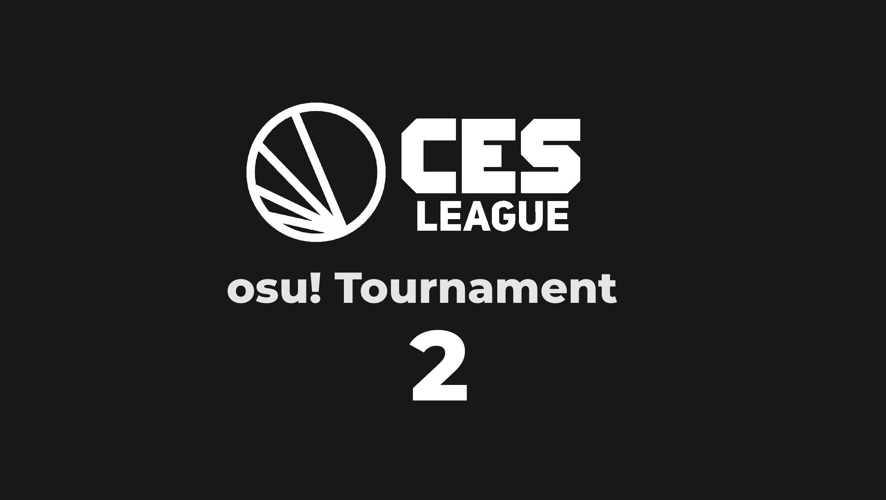

---
tags:
  - CES
---

# CES League osu! Tournament 2

The **CES League osu! Tournament 2** (***CES2***) is an international 1v1 double-elimination osu! tournament hosted by ::{ flag=NL }:: [Stan](https://osu.ppy.sh/users/11212255). This is the second instalment of the CES League osu! Tournament series.

## Tournament schedule

| Event | Timestamp |
| --: | :-- |
| Registration phase | 2020-05-01/2020-05-24 |
| Qualifiers | 2020-06-05/2020-06-07 |
| Round of 128 | 2020-06-12/2020-06-21 |
| Round of 64 | 2020-06-26/2020-07-05 |
| Round of 32 | 2020-07-10/2020-07-12 |
| Round of 16 | 2020-07-17/2020-07-19 |
| Quarterfinals | 2020-07-24/2020-07-26 |
| Semifinals | 2020-07-31/2020-08-02 |
| Finals | 2020-08-07/2020-08-09 |
| Grand Finals | 2020-08-14/2020-08-16 |

## Prizes

| Placing | Prize(s) |
| :-: | :-- |
|  | Unique profile badge (pending), profile banner, $130.00 (or 5 years of osu!supporter) |
|  | Profile banner, $60.00 (or 2 years of osu!supporter) |
|  | Profile Banner, $30.00 (or 1 year of osu!supporter) |

## Organisation

The CES League osu! Tournament 2 is run by various community members.

| Position | Member(s) |
| :-- | :-- |
| Organizer | ::{ flag=NL }:: [Stan](https://osu.ppy.sh/users/11212255) |
| Mappool selector | ::{ flag=DE }:: [-Levi-](https://osu.ppy.sh/users/3343488), ::{ flag=CA }:: [Clarkyclarker](https://osu.ppy.sh/users/11664411), ::{ flag=US }:: [Dios Dong](https://osu.ppy.sh/users/3958619), ::{ flag=US }:: [Evan1](https://osu.ppy.sh/users/11951699), ::{ flag=NL }:: [iepie122](https://osu.ppy.sh/users/12235433), ::{ flag=CN }:: [real MikeL](https://osu.ppy.sh/users/10732897), ::{ flag=TH }:: [Seaweed](https://osu.ppy.sh/users/5151214), ::{ flag=MY }:: [Sonic-](https://osu.ppy.sh/users/8691555), ::{ flag=CA }:: [THUNDERCOKC2678](https://osu.ppy.sh/users/3388082) |
| Referee | ::{ flag=DE }:: [Aspynix](https://osu.ppy.sh/users/8532548), ::{ flag=CA }:: [Clarkyclarker](https://osu.ppy.sh/users/11664411), ::{ flag=US }:: [Pristine Toast](https://osu.ppy.sh/users/12324616), ::{ flag=GB }:: [Damarsh](https://osu.ppy.sh/users/7465147), ::{ flag=DE }:: [Enterprise](https://osu.ppy.sh/users/11766551), ::{ flag=DE }:: [GDLenny](https://osu.ppy.sh/users/8406711), ::{ flag=DE }:: [Green_Planet](https://osu.ppy.sh/users/9375311), ::{ flag=NL }:: [iepie122](https://osu.ppy.sh/users/12235433), ::{ flag=CA }:: [kurtisisdead](https://osu.ppy.sh/users/5477343), ::{ flag=US }:: [moss-](https://osu.ppy.sh/users/9918921), ::{ flag=US }:: [Napoca](https://osu.ppy.sh/users/13066691), ::{ flag=PL }:: [P a t r i c k](https://osu.ppy.sh/users/6814521), ::{ flag=RU }:: [Prade](https://osu.ppy.sh/users/9318565), ::{ flag=US }:: [Raoul](https://osu.ppy.sh/users/9924405), ::{ flag=MY }:: [Sonic-](https://osu.ppy.sh/users/8691555), ::{ flag=NL }:: [Stan](https://osu.ppy.sh/users/11212255), ::{ flag=US }:: [Suicune3](https://osu.ppy.sh/users/6895187), ::{ flag=DE }:: [TheHunter1](https://osu.ppy.sh/users/6496016), ::{ flag=MN }:: [tuudug](https://osu.ppy.sh/users/5145352), ::{ flag=AU }:: [Walfurus](https://osu.ppy.sh/users/13684009), ::{ flag=US }:: [Xpekade](https://osu.ppy.sh/users/10775293), ::{ flag=GB }:: [Yazzehh](https://osu.ppy.sh/users/7068973) |
| Commentator | ::{ flag=DE }:: [Aspynix](https://osu.ppy.sh/users/8532548), ::{ flag=US }:: [Dios Dong](https://osu.ppy.sh/users/3958619), ::{ flag=GB }:: [Doomsday](https://osu.ppy.sh/users/18983), ::{ flag=DE }:: [Drecksackblase](https://osu.ppy.sh/users/6278008), ::{ flag=US }:: [FrenZ396](https://osu.ppy.sh/users/9531903), ::{ flag=DE }:: [Green\_Planet](https://osu.ppy.sh/users/9375311), ::{ flag=NL }:: [iepie122](https://osu.ppy.sh/users/12235433), ::{ flag=US }:: [kb131313](https://osu.ppy.sh/users/11229259), ::{ flag=DE }:: [khan119](https://osu.ppy.sh/users/3306777), ::{ flag=DE }:: [mmv](https://osu.ppy.sh/users/8657524), ::{ flag=US }:: [Monko2k](https://osu.ppy.sh/users/4852013), ::{ flag=US }:: [Napoca](https://osu.ppy.sh/users/13066691), ::{ flag=RU }:: [Prade](https://osu.ppy.sh/users/9318565), ::{ flag=US }:: [Suicune3](https://osu.ppy.sh/users/6895187), ::{ flag=PL }:: [WubWoofWolf](https://osu.ppy.sh/users/39828), ::{ flag=GB }:: [Young Alpha](https://osu.ppy.sh/users/15383957) |
| Streamer | ::{ flag=DE }:: [Aspynix](https://osu.ppy.sh/users/8532548), ::{ flag=CA }:: [Clarkyclarker](https://osu.ppy.sh/users/11664411), ::{ flag=US }:: [Dios Dong](https://osu.ppy.sh/users/3958619), ::{ flag=DE }:: [Green\_Planet](https://osu.ppy.sh/users/9375311), ::{ flag=CA }:: [kurtisisdead](https://osu.ppy.sh/users/5477343), ::{ flag=MN }:: [tuudug](https://osu.ppy.sh/users/5145352), ::{ flag=US }:: [Xpekade](https://osu.ppy.sh/users/10775293) |
| Designer | ::{ flag=DE }:: [mmv](https://osu.ppy.sh/users/8657524) |
| Statistician | ::{ flag=FR }:: [Aidown](https://osu.ppy.sh/users/1522146) |

## Links

- [Discussion thread](https://osu.ppy.sh/community/forums/topics/1061610)
- [CES League Discord server](https://discordapp.com/invite/n3mZgWk)
- [Livestream](https://www.twitch.tv/leagueces)
- [Challonge brackets](https://challonge.com/CESosu2)
- **[Main sheet](https://docs.google.com/spreadsheets/d/1uvOJfVDslXhtFhr5AYGN5UGrMXEToI35IaIbYFjWKiw)**

## Ruleset

### General rules

1. There will be 9 mappools in total: Qualifiers, Round of 128, Round of 64, Round of 32, Round of 16, Quarterfinals, Semifinals, Finals, and Grand Finals.
2. Double elimination bracket is started directly after qualifiers.
3. The winner of `!roll` will get to pick whether they want to ban first or pick first.
4. Players get **one ban** in Round of 128 up to and including Round of 16. The rest of the stages, players will get **two bans**.
5. Each mappool (except qualifiers) has 3 tiebreakers, where each player can ban one tiebreaker and the remaining will be played.

### Winning conditions

1. Round of 128 and Round of 64 will be BO7, the first player to reach 4 points will win the match.
2. Round of 32 and Round of 16 will be BO9, the first player to reach 5 points will win the match.
3. Quarterfinals and Semifinals will be BO11, the first player to reach 6 points will win the match.
4. Finals and Grand Finals will be BO13, the first player to reach 7 points will win the match.
   - There will be a bracket reset match if necessary for Grand Finals.

### Registration

1. Each player must be in the Discord server to verify their participation.
2. If a player changes their name, they need to inform the admin as soon as possible to avoid misunderstandings in a match.
3. If a player exhibits suspicious behavior, including but not limited to suspected multi-accounting or cheating, their participation in the tournament might be prohibited, subject to tournament host discretion.
4. Accounts that were recently unbanned or suspended within 12 months prior to signups will not be allowed to participate in this tournament.

### Scheduling

1. **All times in the scheduled are in UTC+0.**
2. Scheduling will be based on player timezones to avoid as many no-shows as possible.
3. If any player wants to reschedule a match, please have the requesting and the opposing player agree on the new time and have either player submit proof of agreement in `#osu-scheduling` text channel in CES League's Discord server **at least 24 hours in advance.**.
4. If a player is certain that they cannot make it to a match even after a reschedule, please tell the manager or their referee and we will give them a loss for that match
   - Failure to do so will result in a penalty and players may be exempt from future iterations.

### Match proceedings

1. Referees have the final decision in all matches so please respect their choices, but do not forget that they are human too and any disrespect **will** result in penalties.
2. referees will invite the captain into the lobby 5-10 minutes before the match starts. If for any reason a player doesn't respond within 10 minutes of the scheduled match time, they will automatically forfeit the match.
3. If neither player makes it, `!roll` by the referee will determine who wins or loses.
4. At the start of the match, both captains will `!roll`. The higher roll gets to choose whether they want to pick first or ban first. Warmups may either be chosen by roll or another method decided in the lobby.
   - Warmups are strictly limited to 5 minutes maximum drain time.
5. 1 ban per player up to and including RO16, 2 bans from Quarter finals onwards.
6. Mods allowed in Tiebreaker (Freemod): Hidden, HardRock and Easy
   - Players don't require picking a mod.
   - Players may combine mods (eg. HDHR)
   - Easy has a 2x score multiplier.
7. NoFail is forced throughout the entire tournament.
8. Roll winner gets to ban the first tiebreaker.
