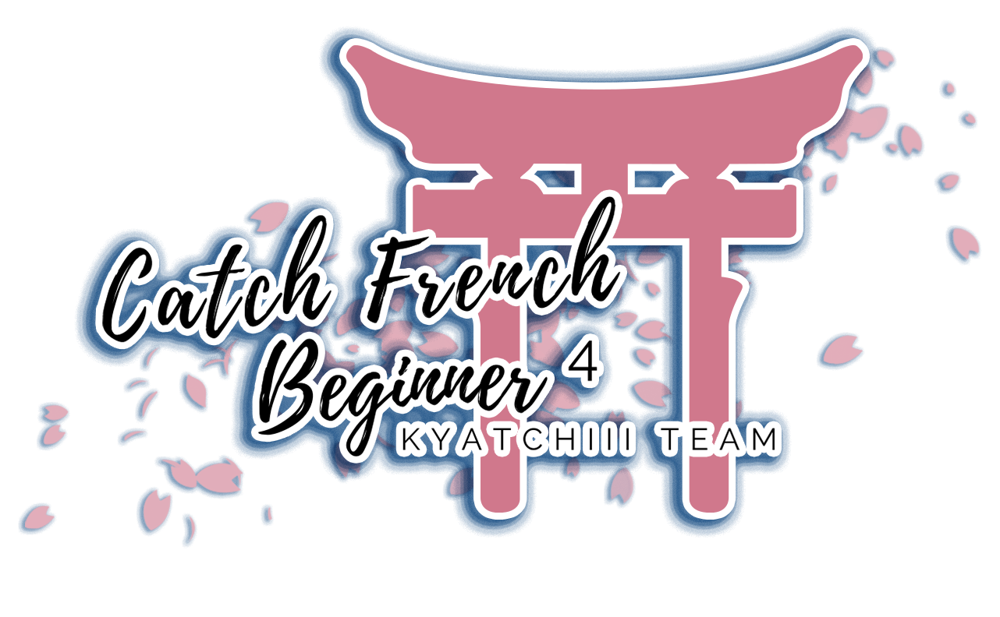

---
tags:
  - CFB
  - CFB4
---

# Catch French Beginner 4

The **Catch French Beginner 4** (***CFB4***) was a beginner French double-elimination 1v1 osu!catch tournament hosted by ::{ flag=FR }:: [Kaleesy Pura](https://osu.ppy.sh/users/1800077). This was the fourth instalment of the Catch French Beginner.

## Tournament schedule

| Event | Timestamp |
| --: | :-- |
| Registration phase | 2020-03-26/2020-04-18 |
| Live drawings | 2020-04-18 (21:00 UTC+2) |
| Qualifiers | 2020-04-25/2020-04-26 |
| Group stage | 2020-05-02/2020-05-03 |
| Quarterfinals | 2020-05-09/2020-05-10 |
| Semifinals | 2020-05-16/2020-05-17 |
| Finals | 2020-05-23/2020-05-24 |
| Grand Finals | 2020-05-30 |

## Prizes

| Placing | Prize(s) |
| :-: | :-- |
|  | Unique profile badge, 4 months of osu!supporter |
|  | 2 months of osu!supporter |
|  | 1 month of osu!supporter |

Generous donations from ::{ flag=FR }:: [Fuka Pura](https://osu.ppy.sh/users/2326688), ::{ flag=FR }:: [Kaleesy Pura](https://osu.ppy.sh/users/1800077) and ::{ flag=FR }:: [Pizu](https://osu.ppy.sh/users/9475990) helped fund some of the prizes.

## Organisation

The Catch French Beginner 4 was run by various community members.

| Position | Member(s) |
| :-- | :-- |
| Organizer | ::{ flag=FR }:: [Kaleesy Pura](https://osu.ppy.sh/users/1800077) |
| Co-organizer | ::{ flag=FR }:: [Fuka Pura](https://osu.ppy.sh/users/2326688), ::{ flag=FR }:: [Pizu](https://osu.ppy.sh/users/9475990), ::{ flag=FR }:: [YANOO123](https://osu.ppy.sh/users/5122949) |
| Mappool selector | ::{ flag=FR }:: [Fuka Pura](https://osu.ppy.sh/users/2326688), ::{ flag=FR }:: [Kaleesy Pura](https://osu.ppy.sh/users/1800077) |
| Referee | ::{ flag=FR }:: [MindLight](https://osu.ppy.sh/users/7664694), ::{ flag=FR }:: [Pizu](https://osu.ppy.sh/users/9475990), ::{ flag=FR }:: [redjiii](https://osu.ppy.sh/users/1378728), ::{ flag=FR }:: [YANOO123](https://osu.ppy.sh/users/5122949) |
| Streamer | ::{ flag=FR }:: [Fulgu](https://osu.ppy.sh/users/4096322), ::{ flag=FR }:: [Libegon](https://osu.ppy.sh/users/9922381), ::{ flag=FR }:: [Purettsu Eru](https://osu.ppy.sh/users/1542565) |
| Commentator | ::{ flag=FR }:: [4L-Chan 3 Porte](https://osu.ppy.sh/users/7253987), ::{ flag=FR }:: [Fuka Pura](https://osu.ppy.sh/users/2326688), ::{ flag=FR }:: [Kaleesy Pura](https://osu.ppy.sh/users/1800077), ::{ flag=FR }:: [Kammthaar](https://osu.ppy.sh/users/8802523), ::{ flag=FR }:: [Libegon](https://osu.ppy.sh/users/9922381), ::{ flag=FR }:: [MindLight](https://osu.ppy.sh/users/7664694), ::{ flag=FR }:: [Yruama](https://osu.ppy.sh/users/8221467) |
| Designer | ::{ flag=FR }:: [Kaleesy Pura](https://osu.ppy.sh/users/1800077) |
| Statistician | ::{ flag=FR }:: [YANOO123](https://osu.ppy.sh/users/5122949) |
| Wiki editor | ::{ flag=ID }:: [fajar13k](https://osu.ppy.sh/users/7100002) |

## Links

- [Discussion thread](https://osu.ppy.sh/community/forums/topics/1039950)
- [CFB Discord server](https://discord.gg/dqAsqE3)
- [Livestream](https://www.twitch.tv/catchfrenchbeginner)
- [Challonge brackets](https://challonge.com/cfbquatre)
- **[Statistics sheet](https://docs.google.com/spreadsheets/d/1UVwaSi_s32QEYro3zjnfMYjPrYBjr-n6El8_MntBCyk/edit#gid=1982472802)**

## Participants

| Seed | Members |
| :-- | :-- |
| Top | ::{ flag=CA }:: [Remyria](https://osu.ppy.sh/users/1699875), ::{ flag=FR }:: [Kaeldori](https://osu.ppy.sh/users/962519), ::{ flag=FR }:: [Jibsz](https://osu.ppy.sh/users/12269489), ::{ flag=FR }:: [Riki no Kage](https://osu.ppy.sh/users/1549032) |
| High | ::{ flag=FR }:: [Hecatia15](https://osu.ppy.sh/users/3163012), ::{ flag=FR }:: [AttilaPhoenix](https://osu.ppy.sh/users/8384680), ::{ flag=FR }:: [-Dragolord-](https://osu.ppy.sh/users/9473359), ::{ flag=FR }:: [Trifano](https://osu.ppy.sh/users/15126172) |
| Low | ::{ flag=FR }:: [Madeline](https://osu.ppy.sh/users/2812098), ::{ flag=CA }:: [Zyoulou](https://osu.ppy.sh/users/8668722), ::{ flag=FR }:: [Dovu](https://osu.ppy.sh/users/6150413), ::{ flag=FR }:: [MarsJackson](https://osu.ppy.sh/users/8479894) |
| Unseeded | ::{ flag=FR }:: [Okupsa](https://osu.ppy.sh/users/9313135), ::{ flag=FR }:: [Athedos](https://osu.ppy.sh/users/10722269), ::{ flag=FR }:: [Kammthaar](https://osu.ppy.sh/users/8802523), ::{ flag=FR }:: [sullymaster](https://osu.ppy.sh/users/6765259) |

## Groups

| Group | Top seed | High seed | Low seed | Unseeded |
| :-: | :-- | :-- | :-- | :-- |
| A | ::{ flag=CA }:: [Remyria](https://osu.ppy.sh/users/1699875) | ::{ flag=FR }:: [AttilaPhoenix](https://osu.ppy.sh/users/8384680) | ::{ flag=FR }:: [Dovu](https://osu.ppy.sh/users/6150413) | ::{ flag=FR }:: [Okupsa](https://osu.ppy.sh/users/9313135) |
| B | ::{ flag=FR }:: [Kaeldori](https://osu.ppy.sh/users/962519) | ::{ flag=FR }:: [Hecatia15](https://osu.ppy.sh/users/3163012) | ::{ flag=FR }:: [Madeline](https://osu.ppy.sh/users/2812098) | ::{ flag=FR }:: [Kammthaar](https://osu.ppy.sh/users/8802523) |
| C | ::{ flag=FR }:: [Riki no Kage](https://osu.ppy.sh/users/1549032) | ::{ flag=FR }:: [-Dragolord-](https://osu.ppy.sh/users/9473359) | ::{ flag=FR }:: [MarsJackson](https://osu.ppy.sh/users/8479894) | ::{ flag=FR }:: [Athedos](https://osu.ppy.sh/users/10722269) |
| D | ::{ flag=FR }:: [Jibsz](https://osu.ppy.sh/users/12269489) | ::{ flag=FR }:: [Trifano](https://osu.ppy.sh/users/15126172) | ::{ flag=CA }:: [Zyoulou](https://osu.ppy.sh/users/8668722) | ::{ flag=FR }:: [sullymaster](https://osu.ppy.sh/users/6765259) |

## Podium

This competition has come to an end and resulted in the following podium:

| Placing | Player |
| :-: | :-- |
|  | ::{ flag=CA }:: [Remyria](https://osu.ppy.sh/users/1699875) |
|  | ::{ flag=FR }:: [Hecatia15](https://osu.ppy.sh/users/3163012) |
|  | ::{ flag=FR }:: [Trifano](https://osu.ppy.sh/users/15126172) |

## Mappools

### Grand Finals

**[Download the mappack here! (94 MB)](https://wetransfer.com/downloads/c14607c36a2c18e2d9a4f9d858e2cdb320200524222021/776d61)**

- NoMod
  1. [BoA - Lookbook (Irreversible) \[HIGH QUALITY\]](https://osu.ppy.sh/beatmapsets/379890#fruits/833967)
  2. [Mili - Bathtub Mermaid (JeirYagtama) \[Anatomy\]](https://osu.ppy.sh/beatmapsets/684250#fruits/1448086)
  3. [Gentle Stick X M2U - Ineffabilis (buhei) \[-kevincela-'s Insane\]](https://osu.ppy.sh/beatmapsets/340903#fruits/766504)
  4. [Imagine Dragons - Warriors (Minato Yukina) \[Platinum\]](https://osu.ppy.sh/beatmapsets/832873#fruits/1745904)
  5. [LhoU - Renaissance (sahuang) \[Saika's Another\]](https://osu.ppy.sh/beatmapsets/506863#fruits/1078157)
  6. [HyuN - Illusion of Inflict (AJamez) \[AFB's Rain\]](https://osu.ppy.sh/beatmapsets/972887#fruits/2036864)
- Hidden
  1. [senya - Hitomi ni Kakusareta Omoi (Satellite) \[N a s y a's Lunatic\]](https://osu.ppy.sh/beatmapsets/398921#fruits/872657)
  2. [Tomohito Nishiura - Moonlight Tango (JBHyperion) \[Rain\]](https://osu.ppy.sh/beatmapsets/536001#fruits/1135248)
  3. [Big Giant Circles feat. some1namedjeff - Thunderstruck (Charles445) \[Insane\]](https://osu.ppy.sh/beatmapsets/73267#fruits/208776)
  4. [Fujiwara Chika (CV: Kohara Konomi) - Chikatto Chika Chika (TV Size) (Ascendance) \[MBomb's Rain\]](https://osu.ppy.sh/beatmapsets/926731#fruits/1943595)
- HardRock
  1. [Hidamari Sketch Cast - Sketch Switch (Mafiamaster) \[Insane\]](https://osu.ppy.sh/beatmapsets/4624#fruits/24626)
  2. [Blue Stahli - Suit Up (MBomb) \[Salad\]](https://osu.ppy.sh/beatmapsets/1061425#fruits/2224161)
  3. [Masayoshi Minoshima ft. nomico - Bad Apple!! (ignorethis) \[Hard\]](https://osu.ppy.sh/beatmapsets/13177#fruits/87733)
  4. [Nekomata Master feat. \*spiLa\* - Clumsy thoughts (wonjae) \[Salad\]](https://osu.ppy.sh/beatmapsets/801225#fruits/1687560)
- DoubleTime
  1. [Cash Cash - Forever Young (ztrot) \[Forever!\]](https://osu.ppy.sh/beatmapsets/21155#fruits/73575)
  2. [Hylian Lemon - Foresight Is for Losers (ZiRoX) \[Platter\]](https://osu.ppy.sh/beatmapsets/342751#fruits/757538)
  3. [Triple Bounce - Magic Melody (Nightcore Mix) (Tony) \[Insane\]](https://osu.ppy.sh/beatmapsets/36341#fruits/117418)
  4. [Helblinde - When Time Sleeps (Sinnoh) \[AFB's Platter\]](https://osu.ppy.sh/beatmapsets/554256#fruits/1743650)
- Tiebreaker
  1. **[Halozy - Paranoid Lost (Kyuare) \[Eternal Wandering\]](https://osu.ppy.sh/beatmapsets/307818#fruits/688531)**

### Finals

**[Download the mappack here! (86 MB)](https://wetransfer.com/downloads/9e57a92911b54453fbd3f550bceb28df20200517205914/c1d593)**

- NoMod
  1. [Haruna Luna - Momoiro Typhoon (Trynna) \[Net0's Insane\]](https://osu.ppy.sh/beatmapsets/916277#fruits/1913606)
  2. [yanaginagi - Mitsuba no Musubime (TV Size) (Ascendance) \[Illumination\]](https://osu.ppy.sh/beatmapsets/519146#fruits/1102930)
  3. [Ayane - Senpuu no Mai \[Chi\] (Nao Tomori) \[Mordred's Insane\]](https://osu.ppy.sh/beatmapsets/781693#fruits/1656122)
  4. [Seven Lions & Echos - Cold Skin (-Ken) \[Rain\]](https://osu.ppy.sh/beatmapsets/946446#fruits/1976187)
  5. [Krewella - Surrender The Throne (Trynna) \[Insane\]](https://osu.ppy.sh/beatmapsets/767566#fruits/1613624)
  6. [TeamGrimoire+Amaneko - croiX (HelloSCV) \[Spec's CTB Rain\]](https://osu.ppy.sh/beatmapsets/88692#fruits/274012)
- Hidden
  1. [Cash Cash RMX - Escape From The City (Pereira006) \[Insane\]](https://osu.ppy.sh/beatmapsets/385028#fruits/846662)
  2. [Ichiki Mitsuhiro, Masuda Toshiki - Akekure Nikki (tutuhaha) \[Insane\]](https://osu.ppy.sh/beatmapsets/523619#fruits/1111586)
  3. [Masayoshi Minoshima feat. Sakaue Nachi - ILIAS (-kevincela-) \[Another\]](https://osu.ppy.sh/beatmapsets/373543#fruits/818368)
  4. [ginkiha - nightfall (-Joni-) \[gloaming\]](https://osu.ppy.sh/beatmapsets/1151833#fruits/2415949)
- HardRock
  1. [nekodex - aureole (MBomb) \[Hyperion's Salad\]](https://osu.ppy.sh/beatmapsets/1056354#fruits/2236424)
  2. [Ayahi Takagaki - Kigurumi Wakusei (TV Size) (KIA) \[Hard\]](https://osu.ppy.sh/beatmapsets/12796#fruits/48146)
  3. [Co shu Nie - asura (fayew) \[salad\]](https://osu.ppy.sh/beatmapsets/1101376#fruits/2388578)
  4. [Daniel Ingram - Raise This Barn (rezoons) \[Hard\]](https://osu.ppy.sh/beatmapsets/71542#fruits/204980)
- DoubleTime
  1. [Seven Lions with Myon and Shane 54 - Strangers (Feat. Tove Lo) (Maeglwn) \[Hard\]](https://osu.ppy.sh/beatmapsets/192347#fruits/457455)
  2. [Dream Theater - Wait for Sleep (JBHyperion) \[Platter\]](https://osu.ppy.sh/beatmapsets/381125#fruits/833902)
  3. [Yousei Teikoku - Weiss Fluegel (lolcubes) \[Insane\]](https://osu.ppy.sh/beatmapsets/39320#fruits/125434)
  4. [Roselia - This game (-Aqua) \[Xetopia's Platter\]](https://osu.ppy.sh/beatmapsets/749557#fruits/1602435)
- Tiebreaker
  1. **[Sakamoto Maaya - Okaerinasai (tomatomerde Remix) (hikikochan) \[Ascendance's Reunion\]](https://osu.ppy.sh/beatmapsets/544468#fruits/1161865)**

### Semifinals

**[Download the mappack here! (98 MB)](https://wetransfer.com/downloads/26664364b295dfcc5985e16a26f37a0e20200510175846/b6e4b5)**

- NoMod
  1. [Eli Ayase (CV. Nanjo Yoshino) - Arifureta Kanashimi No Hate (Yuuna Kamishiro Remix) (GAMI) \[Gommy's Platter\]](https://osu.ppy.sh/beatmapsets/334494#fruits/748399)
  2. [cYsmix - Manic (Bonsai) \[Insane\]](https://osu.ppy.sh/beatmapsets/361214#fruits/793704)
  3. [FictionJunction feat. LiSA - from the edge (TV Size) (rew0825) \[Rain\]](https://osu.ppy.sh/beatmapsets/1032193#fruits/2158794)
  4. [dBu music - Higan Kikou ~ Titanic of Stygian (Lily Bread) \[Lunatic\]](https://osu.ppy.sh/beatmapsets/382664#fruits/836756)
  5. [senya - Zankyou wa Nariyamazu (Absolute Zero) \[Rain\]](https://osu.ppy.sh/beatmapsets/625519#fruits/1327867)
  6. [HoneyWorks feat. sana - Ima Suki ni Naru. (Sotarks) \[Reform's Insane\]](https://osu.ppy.sh/beatmapsets/1029312#fruits/2158925)
- Hidden
  1. [Jeff Williams - Mirror Mirror (Featuring Casey Lee Williams) (neonat) \[Solitude\]](https://osu.ppy.sh/beatmapsets/320418#fruits/712983)
  2. [Feint - The Journey (feat. Veela) (A r M i N) \[Insane\]](https://osu.ppy.sh/beatmapsets/770668#fruits/1621242)
  3. [Iwasaki Taku - Dance Macabre (Sieg) \[Insane\]](https://osu.ppy.sh/beatmapsets/87545#fruits/248490)
  4. [Mame - Aka ni Somaru Dress (Mystica) \[Lolita\]](https://osu.ppy.sh/beatmapsets/33217#fruits/108387)
- HardRock
  1. [THEATRE BROOK - Uragiri no Yuuyake ( TV Size ) (climbb65588) \[Hard\]](https://osu.ppy.sh/beatmapsets/13673#fruits/50406)
  2. [Suara - Fuantei na Kamisama TV ver. (MoelittleC Hime) \[Salad\]](https://osu.ppy.sh/beatmapsets/394829#fruits/864030)
  3. [Tatsh - reunion (Irreversible) \[Kygerphyxversible's Advanced\]](https://osu.ppy.sh/beatmapsets/346213#fruits/765299)
  4. [Bitter Sweet Entertainment - Kanashimi no Mukougawa (Piano Version) (JBHyperion) \[Salad\]](https://osu.ppy.sh/beatmapsets/435287#fruits/937657)
- DoubleTime
  1. [DJ Ozawa - Tokyo (Innovaderz Remix) (Ascendance) \[Fii's Salad\]](https://osu.ppy.sh/beatmapsets/427801#fruits/941649)
  2. [Miki Sayaka (CV: Kitamura Eri), Sakura Kyoko (CV: Nonaka Ai) - and I'm home (Kyuukai) \[Hard\]](https://osu.ppy.sh/beatmapsets/786689#fruits/1651308)
  3. [C-Show - On the FM (Ascendance) \[Salad\]](https://osu.ppy.sh/beatmapsets/609679#fruits/1382268)
  4. [Hanatan - Senbonzakura (Karen) \[yf's Hard\]](https://osu.ppy.sh/beatmapsets/248173#fruits/622209)
- Tiebreaker
  1. **[Kalafina - believe (CLSW) \[Bless\]](https://osu.ppy.sh/beatmapsets/316647#fruits/705527)**

### Quarterfinals

**[Download the mappack here! (81 MB)](https://wetransfer.com/downloads/ec58b4ae5ecad8833fb648d82e23833720200503191515/607831)**

- NoMod
  1. [dark cat - BUBBLE TEA (feat. juu & cinders) (Hobbes2) \[Ascendance's Platter\]](https://osu.ppy.sh/beatmapsets/769917#fruits/1630241)
  2. [GTA feat. Sam Bruno - Red Lips (Mendus Remix) (Euny) \[Natsu's Insane\]](https://osu.ppy.sh/beatmapsets/512810#fruits/1116219)
  3. [Aimer - Ref:rain (TV Size) (alienflybot) \[AJamez's Light Rain\]](https://osu.ppy.sh/beatmapsets/864201#fruits/1807497)
  4. [Tomita Miyu, Onishi Saori, Ohzora Naomi, Hanazawa Kana - Gabriel Drop Kick (Okoratu) \[Insane\]](https://osu.ppy.sh/beatmapsets/572809#fruits/1500551)
- Hidden
  1. [Quynh Nhu - Don Coi (Mako Sakata) \[Lonely\]](https://osu.ppy.sh/beatmapsets/448090#fruits/979412)
  2. [Kano - Hikari no Michishirube (TV Size) (Petal) \[Sunset\]](https://osu.ppy.sh/beatmapsets/1073862#fruits/2247478)
  3. [MitiS feat. Crywolf - Oasis (vocal Mix) (Come[Back]Home) \[Insane\]](https://osu.ppy.sh/beatmapsets/296724#fruits/760932)
- HardRock
  1. [Ice vs. Morimori Atsushi - RE:UNION -Duo Blade Against- (Realazy) \[Ayyri's Advanced\]](https://osu.ppy.sh/beatmapsets/848977#fruits/1810415)
  2. [loos feat. Meramipop - Starlight Disco (ursa) \[Salad\]](https://osu.ppy.sh/beatmapsets/183375#fruits/530444)
  3. [2B PENCILS & Nakagawa Kanon - Hajimete Koi o Shita Kioku (TV Edit) (Bearizm) \[Hard\]](https://osu.ppy.sh/beatmapsets/356633#fruits/784750)
- DoubleTime
  1. [Hanatan - Yurafi (JBHyperion) \[Salad\]](https://osu.ppy.sh/beatmapsets/602506#fruits/12726071)
  2. [Halozy - Little Summer Party (Takos) \[Hard\]](https://osu.ppy.sh/beatmapsets/39537#fruits/126330)
  3. [Helblinde - Grief & Malice (Kyuare) \[ExGon's Salad\]](https://osu.ppy.sh/beatmapsets/325817#fruits/782020)
- Tiebreaker
  1. **[Kaori Miyazono (CV. Risa Taneda) - My Truth~Rondo capriccioso (Linada) \[Ascendance & Spec's Duet\]](https://osu.ppy.sh/beatmapsets/717528#fruits/1549787)**

### Group stage

**[Download the mappack here! (61 MB)](https://wetransfer.com/downloads/acc2947bf3e906e2d4ebf4b97cdbe30420200426171428/49d7d2)**

- NoMod
  1. [Sayuri - Tsuki to Hanataba (TV Size) (Absolute Zero) \[Salad\]](https://osu.ppy.sh/beatmapsets/816867#fruits/1712961)
  2. [Camellia - Towards The Horizon (Nerova Riuz GX) \[Hard\]](https://osu.ppy.sh/beatmapsets/578445#fruits/1350903)
  3. [O2i3 - Ooi [Game Edit] (xi-False) \[II (Salad)\]](https://osu.ppy.sh/beatmapsets/451239#fruits/968030)
  4. [ETIA. - Lost Love (JJburstOwO) \[Mecon's Hyper\]](https://osu.ppy.sh/beatmapsets/341933#fruits/768617)
- Hidden
  1. [Camellia - \*Feels Seasickness...\* (My Angel RangE) \[\*ADVANCED...\*\]](https://osu.ppy.sh/beatmapsets/914865#fruits/2064953)
  2. [Step - Polargeist (AquaTail) \[Fizz's Hard\]](https://osu.ppy.sh/beatmapsets/1104099#fruits/2330643)
- HardRock
  1. [Linkin Park - Breaking The Habit (AlexaBM) \[Medium\]](https://osu.ppy.sh/beatmapsets/173468#fruits/419194)
  2. [Porter Robinson & Madeon - Shelter (Myle) \[Cup\]](https://osu.ppy.sh/beatmapsets/536749#fruits/1137696)
- DoubleTime
  1. [Antonin Dvorak - From the New World (lepidopodus) \[Normal\]](https://osu.ppy.sh/beatmapsets/25342#fruits/85870)
  2. [LukHash - SOCIAL PHOBIA (JBHyperion) \[CUP\]](https://osu.ppy.sh/beatmapsets/1040733#fruits/2175038)
- Tiebreaker
  1. **[LukHash - DIGITAL HEART (MBomb) \[HYPERION'S PLATTER\]](https://osu.ppy.sh/beatmapsets/1031580#fruits/2157880)**

### Qualifiers

- NoMod
  1. [ALiCE'S EMOTiON - Evening Steps (TicClick) \[Light Insane\]](https://osu.ppy.sh/beatmapsets/270457#fruits/615227)
  2. [Yuuhei Satellite - Kachou Fuugetsu (Magic Girl) \[Benny's Platter\]](https://osu.ppy.sh/beatmapsets/726596#fruits/1533955)
- Hidden
  1. [Maaya Sakamoto - Waiting for the rain (Rizia) \[Insane\]](https://osu.ppy.sh/beatmapsets/364282#fruits/799927)
- HardRock
  1. [Hecq - Dstrukt (JBHyperion) \[Cup\]](https://osu.ppy.sh/beatmapsets/511538#fruits/1087383)
- DoubleTime
  1. [dors k(uro) - dreeeeam (Chara) \[A Salad of Dreams\]](https://osu.ppy.sh/beatmapsets/444696#fruits/955343)

## Match results

### Grand Finals

Saturday, 30 May 2020:

| Player 1 |  |  | Player 2 | Match link |
| --: | :-: | :-: | :-- | :-- |
| **Remyria** ::{ flag=CA }:: | **7** | 4 | ::{ flag=FR }:: Hecatia15 | [#1](https://osu.ppy.sh/community/matches/62301645) |

### Finals

Saturday, 23 May 2020:

| Player 1 |  |  | Player 2 | Match link |
| --: | :-: | :-: | :-- | :-- |
| **Remyria** ::{ flag=CA }:: | **7** | 4 | ::{ flag=FR }:: Hecatia15 | [#1](https://osu.ppy.sh/community/matches/62013551) |

Sunday, 24 May 2020:

| Player 1 |  |  | Player 2 | Match link |
| --: | :-: | :-: | :-- | :-- |
| **Trifano** ::{ flag=FR }:: | **7** | 2 | ::{ flag=FR }:: Madeline | [#1](https://osu.ppy.sh/community/matches/62051294) |
| **Hecatia15** ::{ flag=FR }:: | **7** | 5 | ::{ flag=FR }:: Trifano | [#1](https://osu.ppy.sh/community/matches/62055223) |

### Semifinals

Saturday, 16 May 2020:

| Player 1 |  |  | Player 2 | Match link |
| --: | :-: | :-: | :-- | :-- |
| Jibsz ::{ flag=FR }:: | 2 | **6** | ::{ flag=FR }:: **Hecatia15** | [#1](https://osu.ppy.sh/community/matches/61717562) |
| **Remyria** ::{ flag=CA }:: | **6** | 0 | ::{ flag=FR }:: Madeline | [#1](https://osu.ppy.sh/community/matches/61744766) |
| Jibsz ::{ flag=FR }:: | 5 | **6** | ::{ flag=FR }:: **Trifano** | [#1](https://osu.ppy.sh/community/matches/61750795) |

Sunday, 17 May 2020:

| Player 1 |  |  | Player 2 | Match link |
| --: | :-: | :-: | :-- | :-- |
| **Madeline** ::{ flag=FR }:: | **6** | 3 | ::{ flag=FR }:: AttilaPhoenix | [#1](https://osu.ppy.sh/community/matches/61781979) |

### Quarterfinals

Saturday, 9 May 2020:

| Player 1 |  |  | Player 2 | Match link |
| --: | :-: | :-: | :-- | :-- |
| **Jibsz** ::{ flag=FR }:: | **5** | 2 | ::{ flag=FR }:: AttilaPhoenix | [#1](https://osu.ppy.sh/community/matches/61425549) |
| Riki no Kage ::{ flag=FR }:: | -1 | **0** | ::{ flag=FR }:: **Madeline** | *win by default* |
| **Hecatia15** ::{ flag=FR }:: | **5** | 4 | ::{ flag=FR }:: -Dragolord- | [#1](https://osu.ppy.sh/community/matches/61456978) |

Sunday, 10 May 2020:

| Player 1 |  |  | Player 2 | Match link |
| --: | :-: | :-: | :-- | :-- |
| **Remyria** ::{ flag=CA }:: | **5** | 1 | ::{ flag=FR }:: Trifano | [#1](https://osu.ppy.sh/community/matches/61460974) |
| **AttilaPhoenix** ::{ flag=FR }:: | **5** | 2 | ::{ flag=FR }:: -Dragolord- | [#1](https://osu.ppy.sh/community/matches/61491060) |
| **Trifano** ::{ flag=FR }:: | **0** | -1 | ::{ flag=FR }:: Riki no Kage | *win by default* |

### Group stage

Saturday, 2 May 2020:

| Player 1 |  |  | Player 2 | Match link |
| --: | :-: | :-: | :-- | :-- |
| **Jibsz** ::{ flag=FR }:: | **4** | 2 | ::{ flag=FR }:: Trifano | [#1](https://osu.ppy.sh/community/matches/61141686) |
| **-Dragolord-** ::{ flag=FR }:: | **4** | 2 | ::{ flag=FR }:: MarsJackson | [#1](https://osu.ppy.sh/community/matches/61165813) |
| **Hecatia15** ::{ flag=FR }:: | **4** | 0 | ::{ flag=FR }:: Madeline | [#1](https://osu.ppy.sh/community/matches/61167509) |
| Kammthaar ::{ flag=FR }:: | 1 | **4** | ::{ flag=FR }:: **Kaeldori** | [#1](https://osu.ppy.sh/community/matches/61168212) |
| **Marsjackson** ::{ flag=FR }:: | **4** | 1 | ::{ flag=FR }:: Athedos | [#1](https://osu.ppy.sh/community/matches/61170311) |
| Okupsa ::{ flag=FR }:: | 0 | **4** | ::{ flag=CA }:: **Remyria** | [#1](https://osu.ppy.sh/community/matches/61172719) |
| **AttilaPhoenix** ::{ flag=FR }:: | **4** | 0 | ::{ flag=FR }:: Dovu | [#1](https://osu.ppy.sh/community/matches/61171510) |
| **Trifano** ::{ flag=FR }:: | **4** | 2 | ::{ flag=FR }:: Zyoulou | [#1](https://osu.ppy.sh/community/matches/61174328) |
| **Remyria** ::{ flag=CA }:: | **4** | 0 | ::{ flag=FR }:: AttilaPhoenix | [#1](https://osu.ppy.sh/community/matches/61176113) |
| **Dovu** ::{ flag=FR }:: | **4** | 2 | ::{ flag=FR }:: Okupsa | [#1](https://osu.ppy.sh/community/matches/61177349) |

Sunday, 3 May 2020:

| Player 1 |  |  | Player 2 | Match link |
| --: | :-: | :-: | :-- | :-- |
| Athedos ::{ flag=FR }:: | 1 | **4** | ::{ flag=FR }:: **Riki no Kage** | [#1](https://osu.ppy.sh/community/matches/61180697) |
| sullymaster ::{ flag=FR }:: | 0 | **4** | ::{ flag=FR }:: **Jibsz** | [#1](https://osu.ppy.sh/community/matches/61183042) |
| Zyoulou ::{ flag=FR }:: | 1 | **4** | ::{ flag=FR }:: **Jibsz** | [#1](https://osu.ppy.sh/community/matches/61185441) |
| -Dragolord- ::{ flag=FR }:: | 2 | **4** | ::{ flag=FR }:: **Riki no Kage** | [#1](https://osu.ppy.sh/community/matches/61202851) |
| Kaeldori ::{ flag=FR }:: | 0 | **4** | ::{ flag=FR }:: **Hecatia15** | [#1](https://osu.ppy.sh/community/matches/61206729) |
| **Madeline** ::{ flag=FR }:: | **4** | 2 | ::{ flag=FR }:: Kammthaar | [#1](https://osu.ppy.sh/community/matches/61207713) |
| **-Dragolord-** ::{ flag=FR }:: | **4** | 0 | ::{ flag=FR }:: Athedos | [#1](https://osu.ppy.sh/community/matches/61208829) |
| Marsjackson ::{ flag=FR }:: | 0 | **4** | ::{ flag=FR }:: **Riki no Kage** | [#1](https://osu.ppy.sh/community/matches/61209634) |
| **Hecatia15** ::{ flag=FR }:: | **4** | 0 | ::{ flag=FR }:: Kammthaar | [#1](https://osu.ppy.sh/community/matches/61210805) |
| Kaeldori ::{ flag=FR }:: | 3 | **4** | ::{ flag=FR }:: **Madeline** | [#1](https://osu.ppy.sh/community/matches/61211593) |
| **Zyoulou** ::{ flag=FR }:: | **4** | 0 | ::{ flag=FR }:: sullymaster | [#1](https://osu.ppy.sh/community/matches/61213764) |
| Okupsa ::{ flag=FR }:: | 0 | **4** | ::{ flag=FR }:: **AttilaPhoenix** | [#1](https://osu.ppy.sh/community/matches/61215300) |
| Dovu ::{ flag=FR }:: | 0 | **4** | ::{ flag=CA }:: **Remyria** | [#1](https://osu.ppy.sh/community/matches/61215816) |
| Sullymaster ::{ flag=FR }:: | 1 | **4** | ::{ flag=FR }:: **Trifano** | [#1](https://osu.ppy.sh/community/matches/61217149) |

### Qualifiers

- More detailed qualifiers results can be accessed via the statistics sheet inside the [link section](#links).
- Average rank is determined by the sum of the player's positions on each map divided by the number of maps played in the qualifiers.

| Seed | Player | Average rank |
| --: | :-- | --: |
| #1 | ::{ flag=CA }:: [Remyria](https://osu.ppy.sh/users/1699875) | 2.2 |
| #2 | ::{ flag=FR }:: [Kaeldori](https://osu.ppy.sh/users/962519) | 4.6 |
| #3 | ::{ flag=FR }:: [Jibsz](https://osu.ppy.sh/users/12269489) | 4.8 |
| #4 | ::{ flag=FR }:: [Riki no Kage](https://osu.ppy.sh/users/1549032) | 5.2 |
| #5 | ::{ flag=FR }:: [Hecatia15](https://osu.ppy.sh/users/3163012) | 5.8 |
| #6 | ::{ flag=FR }:: [AttilaPhoenix](https://osu.ppy.sh/users/8384680) | 6.2 |
| #7 | ::{ flag=FR }:: [-Dragolord-](https://osu.ppy.sh/users/9473359) | 7 |
| #7 | ::{ flag=FR }:: [Trifano](https://osu.ppy.sh/users/15126172) | 7 |
| #9 | ::{ flag=FR }:: [Madeline](https://osu.ppy.sh/users/2812098) | 7.2 |
| #10 | ::{ flag=CA }:: [Zyoulou](https://osu.ppy.sh/users/8668722) | 9.4 |
| #11 | ::{ flag=FR }:: [Dovu](https://osu.ppy.sh/users/6150413) | 9.8 |
| #12 | ::{ flag=FR }:: [MarsJackson](https://osu.ppy.sh/users/8479894) | 11 |
| #13 | ::{ flag=FR }:: [Okupsa](https://osu.ppy.sh/users/9313135) | 12.2 |
| #14 | ::{ flag=FR }:: [Athedos](https://osu.ppy.sh/users/10722269) | 12.6 |
| #15 | ::{ flag=FR }:: [Kammthaar](https://osu.ppy.sh/users/8802523) | 14.4 |
| #16 | ::{ flag=FR }:: [sullymaster](https://osu.ppy.sh/users/6765259) | 16 |

## Ruleset

### General rules

1. The Score System used will be **ScoreV2**.
2. Rank restriction applies at max #2,500 on osu!catch game mode.
3. If player can't attend within the span of **10 minutes**, the other player will win by default.
4. Proper manner is required, both from the participants and the staff.
5. Players will ban **two maps** each for a total of four banned maps.
6. Fail scores count, even if the player doesn't pass the played map.
7. Players will do a `!roll` at the beginning of the match to determine the order of ban/pick.
8. Even in a tournament, osu! remains a game, be friendly and fair play.
9. This tournament will use double-elimination bracket, which means there will be a loser's bracket.
10. Any French-speaking player can participate in the tournament.
11. Players will have two bans for each match.
12. Players won't be able to ban more than one map in a mod.
13. Hidden is allowed to be combined with HardRock and DoubleTime.
14. Tiebreaker will be played under FreeMod condition.

### Qualifiers format

1. Mappool will consist of:
   - 2 NoMod
   - 1 Hidden
   - 1 HardRock
   - 1 DoubleTime
2. Note that the level of the qualifiers is deliberately higher than the group stage to separate you and thus create the tops, highs, lows and unseeded seedings. It will also be used to adapt the mappool according to the level generated on this occasion!

### Winning conditions

1. Group Stage: Best of 7 (first to 4 points)
2. Quarterfinals: Best of 9 (first to 5 points)
3. Semifinals: Best of 11 (first to 6 points)
4. **Finals and Grand Finals**: Best of 13 (first to 7 points)
