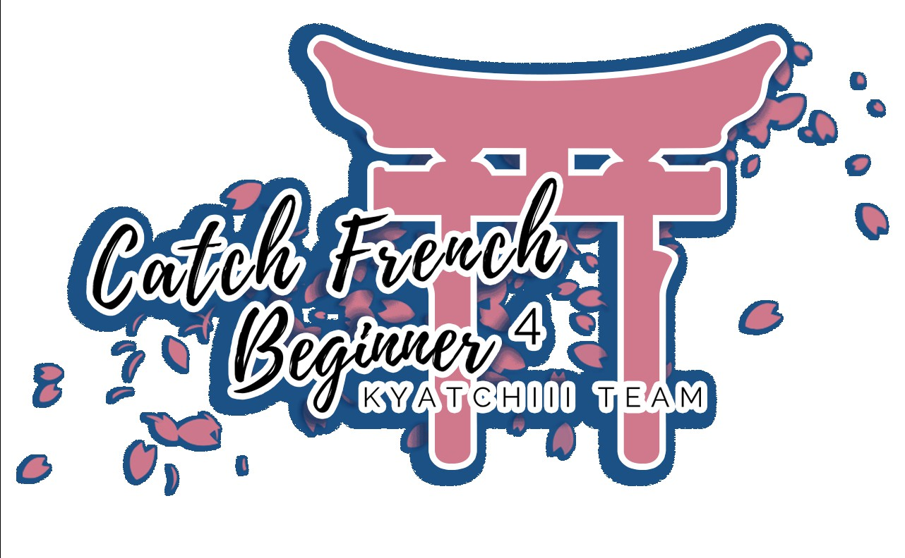

---
tags:
  - CFB
  - CFB4
---

# Catch French Beginner 4

La **Catch French Beginner 4** (***CFB4***) ést un tournoi 1v1 français débutant en osu!catch organisé par ![][flag_FR] [Kaleesy Pura](https://osu.ppy.sh/users/1800077). C'ést la quatrième édition de la Catch French Beginner.

## Planning du tournoi

| Évènement | Dates |
| --: | :-- |
| Phase d'inscription | 2020-03-26/2020-04-18 |
| Live drawings | 2020-04-18 (21:00 UTC+2) |
| Qualifications | 2020-04-25/2020-04-26 |
| Phase de poules | 2020-05-02/2020-05-03 |
| Quarts-de-finale | 2020-05-09/2020-05-10 |
| Demi-finales | 2020-05-16/2020-05-17 |
| Finales | 2020-05-23/2020-05-24 |
| Grandes Finales | 2020-05-30 |

## Récompenses

| Classement | Récompense |
| :-: | :-- |
|  | Badge sur le profil, 4 mois de supporter |
|  | 2 mois de supporter |
|  | 1 mois de supporter |

Les généreux dons de ![][flag_FR] [Fuka Pura](https://osu.ppy.sh/users/2326688), ![][flag_FR] [Kaleesy Pura](https://osu.ppy.sh/users/1800077) et ![][flag_FR] [Pizu](https://osu.ppy.sh/users/9475990) ont permis de financer certains des prix.

## Organisation

La Catch French Beginner 4 ést gérée par différents membres de la communauté.

| Poste | Membre(s) |
| :-- | :-- |
| Organisateur | ![][flag_FR] [Kaleesy Pura](https://osu.ppy.sh/users/1800077) |
| Coorganisateur | ![][flag_FR] [Fuka Pura](https://osu.ppy.sh/users/2326688), ![][flag_FR] [Pizu](https://osu.ppy.sh/users/9475990), ![][flag_FR] [YANOO123](https://osu.ppy.sh/users/5122949) |
| Sélectionneur de map | ![][flag_FR] [Fuka Pura](https://osu.ppy.sh/users/2326688), ![][flag_FR] [Kaleesy Pura](https://osu.ppy.sh/users/1800077) |
| Arbitre | ![][flag_FR] [MindLight](https://osu.ppy.sh/users/7664694), ![][flag_FR] [Pizu](https://osu.ppy.sh/users/9475990), ![][flag_FR] [redjiii](https://osu.ppy.sh/users/1378728), ![][flag_FR] [YANOO123](https://osu.ppy.sh/users/5122949) |
| Streamer | ![][flag_FR] [Fulgu](https://osu.ppy.sh/users/4096322), ![][flag_FR] [Libegon](https://osu.ppy.sh/users/9922381), ![][flag_FR] [Purettsu Eru](https://osu.ppy.sh/users/1542565) |
| Commentateur | ![][flag_FR] [4L-Chan 3 Porte](https://osu.ppy.sh/users/7253987), ![][flag_FR] [Fuka Pura](https://osu.ppy.sh/users/2326688), ![][flag_FR] [Kaleesy Pura](https://osu.ppy.sh/users/1800077), ![][flag_FR] [Kammthaar](https://osu.ppy.sh/users/8802523), ![][flag_FR] [Libegon](https://osu.ppy.sh/users/9922381), ![][flag_FR] [MindLight](https://osu.ppy.sh/users/7664694), ![][flag_FR] [Yruama](https://osu.ppy.sh/users/8221467) |
| Designer | ![][flag_FR] [Kaleesy Pura](https://osu.ppy.sh/users/1800077) |
| Statisticien | ![][flag_FR] [Fuka Pura](https://osu.ppy.sh/users/2326688), ![][flag_FR] [Kaleesy Pura](https://osu.ppy.sh/users/1800077) |
| Éditeur de wiki | ![][flag_ID] [fajar13k](https://osu.ppy.sh/users/7100002) |

## Liens

- [Fil de discussion](https://osu.ppy.sh/community/forums/topics/1039950)
- [Discord du CFB](https://discord.gg/YVYDVU9)
- [Livestream](https://www.twitch.tv/catchfrenchbeginner)
- [Tableaux Challonge](https://challonge.com/fr/cfbquatre)
- **[Feuille de statistiques](https://docs.google.com/spreadsheets/d/1UVwaSi_s32QEYro3zjnfMYjPrYBjr-n6El8_MntBCyk/edit#gid=1982472802)**

## Participants

| Seed | Membres |
| :-- | :-- |
| Top | ![][flag_CA] [Remyria](https://osu.ppy.sh/users/1699875), ![][flag_FR] [Kaeldori](https://osu.ppy.sh/users/962519), ![][flag_FR] [Jibsz](https://osu.ppy.sh/users/12269489), ![][flag_FR] [Riki no Kage](https://osu.ppy.sh/users/1549032) |
| High | ![][flag_FR] [Hecatia15](https://osu.ppy.sh/users/3163012), ![][flag_FR] [AttilaPhoenix](https://osu.ppy.sh/users/8384680), ![][flag_FR] [-Dragolord-](https://osu.ppy.sh/users/9473359), ![][flag_FR] [Trifano](https://osu.ppy.sh/users/15126172) |
| Low | ![][flag_FR] [Ladylag](https://osu.ppy.sh/users/2812098), ![][flag_CA] [Zyoulou](https://osu.ppy.sh/users/8668722), ![][flag_FR] [Dovu](https://osu.ppy.sh/users/6150413), ![][flag_FR] [MarsJackson](https://osu.ppy.sh/users/8479894) |
| Unseeded | ![][flag_FR] [Okupsa](https://osu.ppy.sh/users/9313135), ![][flag_FR] [Athedos](https://osu.ppy.sh/users/10722269), ![][flag_FR] [Kammthaar](https://osu.ppy.sh/users/8802523), ![][flag_FR] [sullymaster](https://osu.ppy.sh/users/6765259) |

## Groupes

| Groupe | Top seed | High seed | Low seed | Unseeded |
| :-: | :-- | :-- | :-- | :-- |
| A | ![][flag_CA] [Remyria](https://osu.ppy.sh/users/1699875) | ![][flag_FR] [AttilaPhoenix](https://osu.ppy.sh/users/8384680) | ![][flag_FR] [Dovu](https://osu.ppy.sh/users/6150413) | ![][flag_FR] [Okupsa](https://osu.ppy.sh/users/9313135) |
| B | ![][flag_FR] [Kaeldori](https://osu.ppy.sh/users/962519) | ![][flag_FR] [Hecatia15](https://osu.ppy.sh/users/3163012) | ![][flag_FR] [Ladylag](https://osu.ppy.sh/users/2812098) | ![][flag_FR] [Kammthaar](https://osu.ppy.sh/users/8802523) |
| C | ![][flag_FR] [Riki no Kage](https://osu.ppy.sh/users/1549032) | ![][flag_FR] [-Dragolord-](https://osu.ppy.sh/users/9473359) | ![][flag_FR] [MarsJackson](https://osu.ppy.sh/users/8479894) | ![][flag_FR] [Athedos](https://osu.ppy.sh/users/10722269) |
| D | ![][flag_FR] [Jibsz](https://osu.ppy.sh/users/12269489) | ![][flag_FR] [Trifano](https://osu.ppy.sh/users/15126172) | ![][flag_CA] [Zyoulou](https://osu.ppy.sh/users/8668722) | ![][flag_FR] [sullymaster](https://osu.ppy.sh/users/6765259) |

## Mappools

### Qualifiers

- NoMod
  - [ALiCE'S EMOTiON - Evening Steps (TicClick) \[Light Insane\]](https://osu.ppy.sh/beatmapsets/270457#fruits/615227)
  - [Yuuhei Satellite - Kachou Fuugetsu (Magic Girl) \[Benny's Platter\]](https://osu.ppy.sh/beatmapsets/726596#fruits/1533955)
- Hidden
  - [Maaya Sakamoto - Waiting for the rain (Rizia) \[Insane\]](https://osu.ppy.sh/beatmapsets/364282#fruits/799927)
- HardRock
  - [Hecq - Dstrukt (JBHyperion) \[Cup\]](https://osu.ppy.sh/beatmapsets/511538#fruits/1087383)
- DoubleTime
  - [dors k(uro) - dreeeeam (Chara) \[A Salad of Dreams\]](https://osu.ppy.sh/beatmapsets/444696#fruits/955343)

## Ruleset

### General rules

1. Les scores seront en **ScoreV2**.
2. La restriction de rang s'applique au maximum à **#2,500** sur le mode de jeu osu!catch.
3. Un retard de plus de 10 minutes à un match entraînera une victoire par défaut pour l'autre joueur.
4. Un langage correct est exigé, de la part des participants comme du staff.
5. Les joueurs banniront à chaque match **deux maps** chacun pour un total de **quatre maps** bannies.
6. Les scores fail comptent, même si le joueur est mort à la fin de la map.
7. Les joueurs lanceront un `!roll` au début du match pour déterminer l'ordre des choix.
8. Même lors d'un tournoi, osu! reste un jeu, soyez amicaux et fair play.
9. Ce tournoi sera en double-élimination, ce qui signifie qu'il y aura un loser's bracket.
10. N'importe quel joueur francophone peut participer au tournoi.
11. Les joueurs auront deux bans par match.
12. Les joueurs ne pourront pas ban plus d'une map dans un mod.
13. Le Hidden est autorisé en HardRock et DoubleTime.
14. Le Tiebreaker est joué en FreeMod.

### Format des qualifiers

1. Mappool sera composé de:
   - 2 NoMod
   - 1 Hidden
   - 1 HardRock
   - 1 DoubleTime
2. Notez que le niveau des qualifiers est volontairement plus élévé que le groupe stage pour bien vous départager et pour ainsi créer les tops, highs, lows et unseeds. Il servira également à adapter le mappool en fonction du niveau généré à cette occasion !

### Conditions gagnantes

1. Phase de poules: Best of 7 (premier à 4 points)
2. Quarts-de-finale: Best of 9 (premier à 5 points)
3. Demi-finales: Best of 11 (premier à 6 points)
4. **Finales et Grandes Finales**: Best of 13 (premier à 7 points)

[flag_CA]: /wiki/shared/flag/CA.gif "Canada"
[flag_FR]: /wiki/shared/flag/FR.gif "France"
[flag_ID]: /wiki/shared/flag/ID.gif "Indonésie"
