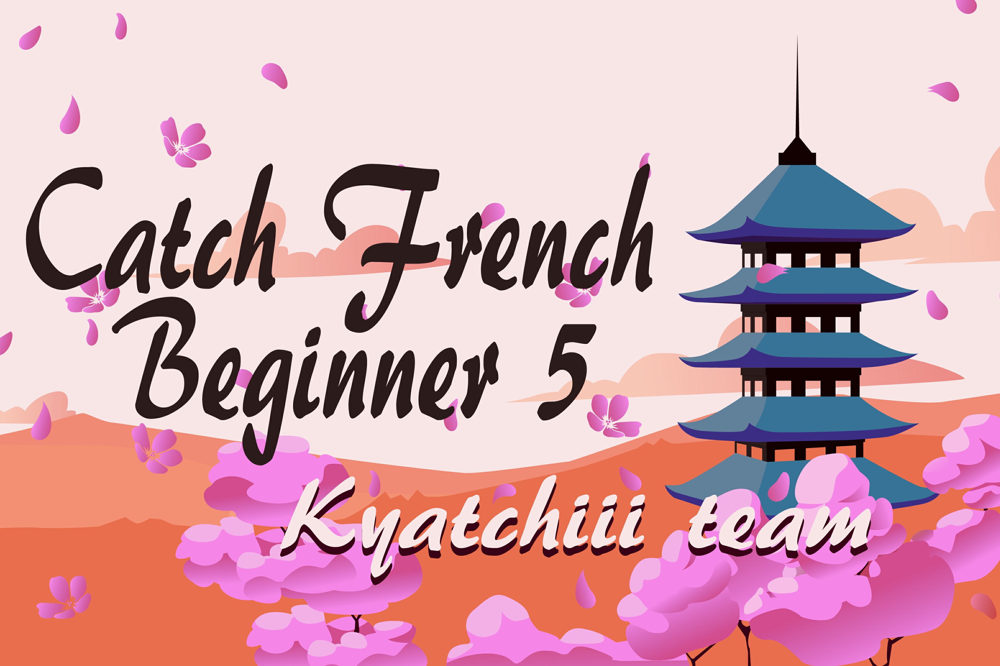

---
tags:
  - CFB
  - CFB5
---

# Catch French Beginner 5

The **Catch French Beginner 5** (***CFB5***) was a beginner French double-elimination 1v1 osu!catch tournament hosted by ::{ flag=FR }:: [YANOO123](https://osu.ppy.sh/users/5122949). Only players ranked between #2,500 and below were eligible to participate. This was the fifth instalment of the Catch French Beginner.

## Tournament schedule

| Event | Timestamp |
| --: | :-- |
| Registration phase | 2020-12-26/2021-01-10 |
| Live drawings | 2021-01-10 (22:00 UTC+2) |
| Qualifiers | 2021-01-16/2021-01-17 |
| Round of 16 | 2021-01-22/2021-01-24 |
| Quarterfinals | 2021-01-30/2021-01-31 |
| Semifinals | 2021-02-06/2021-02-07 |
| Finals | 2021-02-13/2021-02-13 |
| Grand Finals | 2021-02-20/2021-02-21 |

## Prizes

| Placing | Prize(s) |
| :-: | :-- |
|  | Unique profile badge, 4 months of osu!supporter |
|  | 3 months of osu!supporter |
|  | 2 months of osu!supporter |

Generous donations from ::{ flag=FR }:: [Hecatia15](https://osu.ppy.sh/users/3163012), ::{ flag=FR }:: [Kammthaar](https://osu.ppy.sh/users/8802523), ::{ flag=FR }:: [YANOO123](https://osu.ppy.sh/users/5122949), and ::{ flag=FR }:: [Yruama](https://osu.ppy.sh/users/8221467) helped fund some of the prizes.

## Organisation

The Catch French Beginner 5 was run by various community members.

| Position | Member(s) |
| :-- | :-- |
| Organizer | ::{ flag=FR }:: [YANOO123](https://osu.ppy.sh/users/5122949) |
| Mappool selector | ::{ flag=FR }:: [Hecatia15](https://osu.ppy.sh/users/3163012), ::{ flag=FR }:: [Kasumii-sama](https://osu.ppy.sh/users/6177263), ::{ flag=FR }:: [Oasix](https://osu.ppy.sh/users/6183012), ::{ flag=CA }:: [Remyria](https://osu.ppy.sh/users/1699875), ::{ flag=FR }:: [Yruama](https://osu.ppy.sh/users/8221467) |
| Referee | ::{ flag=FR }:: [Hecatia15](https://osu.ppy.sh/users/3163012), ::{ flag=FR }:: [Oasix](https://osu.ppy.sh/users/6183012), ::{ flag=FR }:: [YANOO123](https://osu.ppy.sh/users/5122949) |
| Streamer | ::{ flag=FR }:: [Fulgu](https://osu.ppy.sh/users/4096322), ::{ flag=FR }:: [JeSuisJLF](https://osu.ppy.sh/users/15334170), ::{ flag=FR }:: [Kasumii-sama](https://osu.ppy.sh/users/6177263), ::{ flag=FR }:: [redjiii](https://osu.ppy.sh/users/1378728), ::{ flag=FR }:: [Ttobas](https://osu.ppy.sh/users/2084568), ::{ flag=FR }:: [Un bretzel](https://osu.ppy.sh/users/1542565) |
| Commentator | ::{ flag=FR }:: [Hecatia15](https://osu.ppy.sh/users/3163012), ::{ flag=FR }:: [JeSuisJLF](https://osu.ppy.sh/users/15334170), ::{ flag=FR }:: [JunKoAndHiro](https://osu.ppy.sh/users/14004732), ::{ flag=FR }:: [Kammthaar](https://osu.ppy.sh/users/8802523), ::{ flag=FR }:: [Kasumii-sama](https://osu.ppy.sh/users/6177263), ::{ flag=FR }:: [MitsukeZ](https://osu.ppy.sh/users/12943161), ::{ flag=FR }:: [redjiii](https://osu.ppy.sh/users/1378728), ::{ flag=FR }:: [Un bretzel](https://osu.ppy.sh/users/1542565), ::{ flag=FR }:: [Yruama](https://osu.ppy.sh/users/8221467) |
| Badge designer | ::{ flag=ID }:: [fajar13k](https://osu.ppy.sh/users/7100002) |
| Statistician | ::{ flag=FR }:: [YANOO123](https://osu.ppy.sh/users/5122949) |
| Wiki editor | ::{ flag=ID }:: [fajar13k](https://osu.ppy.sh/users/7100002) |

## Links

- [Discussion thread](https://osu.ppy.sh/community/forums/topics/1210572)
- [CFB Discord server](https://discord.gg/dqAsqE3)
- [Livestream](https://www.twitch.tv/catchfrenchbeginner)
- [Challonge bracket](https://challonge.com/CFB5)
- **[Statistics sheet](https://docs.google.com/spreadsheets/d/1jhNXMAqAxy5dwruO6uiC1VuW_Te-AyoVSgmeoJxB6cE/edit?usp=sharing)**

## Participants

| Seed | Members |
| :-- | :-- |
| Top | ::{ flag=FR }:: [Enias](https://osu.ppy.sh/users/8384680), ::{ flag=FR }:: [Un bretzel](https://osu.ppy.sh/users/1542565), ::{ flag=FR }:: [Shamookie](https://osu.ppy.sh/users/12441210) |
| High | ::{ flag=FR }:: [Jibsz](https://osu.ppy.sh/users/12269489), ::{ flag=FR }:: [redjiii](https://osu.ppy.sh/users/1378728), ::{ flag=FR }:: [Beltheor](https://osu.ppy.sh/users/14966708), ::{ flag=FR }:: [MitsukeZ](https://osu.ppy.sh/users/12943161) |
| Low | ::{ flag=FR }:: [caillrot](https://osu.ppy.sh/users/13108984), ::{ flag=FR }:: [Okawashi](https://osu.ppy.sh/users/6636540), ::{ flag=FR }:: [JunKoAndHiro](https://osu.ppy.sh/users/14004732), ::{ flag=FR }:: [AceEpmo](https://osu.ppy.sh/users/16725715) |
| Unseeded | ::{ flag=FR }:: [iron-wish](https://osu.ppy.sh/users/12264606), ::{ flag=FR }:: [Nos_If](https://osu.ppy.sh/users/7365196), ::{ flag=FR }:: [Utopsia](https://osu.ppy.sh/users/11080305), ::{ flag=FR }:: [Kammthaar](https://osu.ppy.sh/users/8802523) |
| Eliminated | ::{ flag=FR }:: [SverdWyrd](https://osu.ppy.sh/users/10996443), ::{ flag=FR }:: [Hitsumo](https://osu.ppy.sh/users/3199415) |

*Note: Players were sorted by the Qualifiers results.*

## Podium

This competition has come to an end and resulted in the following podium:

| Placing | Player |
| :-: | :-- |
|  | ::{ flag=FR }:: [Enias](https://osu.ppy.sh/users/8384680) |
|  | ::{ flag=FR }:: [redjiii](https://osu.ppy.sh/users/1378728) |
|  | ::{ flag=FR }:: [MitsukeZ](https://osu.ppy.sh/users/12943161) |

## Mappools

### Grand Finals

**[Download the mappack here! (100 MB)](https://mega.nz/file/60sgQJKD#U73uj7qnNAFxy-oGt5eoywfZ2HoQGvYydqp66IsAIas)**

- NoMod
  1. [nanobii - HYPERDRIVE (Ascendance) \[Rain\]](https://osu.ppy.sh/beatmapsets/639991#fruits/1357223)
  2. [Ci Mei Gui - Wu Xuan Lan (Bastian) \[Rain\]](https://osu.ppy.sh/beatmapsets/1207212#fruits/2513982)
  3. [PUSHER - Feel U (Vincs) \[Rain\]](https://osu.ppy.sh/beatmapsets/740666#fruits/1562719)
  4. [Krewella - Say Goodbye (Speed Up Ver.) (saggi) \[walter85's Insane\]](https://osu.ppy.sh/beatmapsets/580821#fruits/1283506)
  5. [OSTER project - Violet Rose (Down) \[Insane\]](https://osu.ppy.sh/beatmapsets/1178488#fruits/2457698)
  6. [Seiryu - Critical Crystal (Priti) \[Yuki's Another\]](https://osu.ppy.sh/beatmapsets/199535#fruits/484890)
- Hidden
  1. [Nekomata Master - CALL (Spectator) \[Fairytale\]](https://osu.ppy.sh/beatmapsets/653588#fruits/1385495)
  2. [Morohoshi Sumire - Masshiro (TV Size) (Greaper) \[Ascendance's Ascendance\]](https://osu.ppy.sh/beatmapsets/1047988#fruits/2192596)
  3. [Rameses B - Dream Catcher (feat. Charlotte Haining) (Cut Ver.) (Fall) \[Kowari's Insane\]](https://osu.ppy.sh/beatmapsets/1174503#fruits/2541782)
  4. [Halogen - U Got That (Camellia's Neurofunk Bootleg) (Sotarks) \[Reform's Insane\]](https://osu.ppy.sh/beatmapsets/934144#fruits/1951094)
- HardRock
  1. [ak+q - Axium Crisis (Lacrima) \[Salad\]](https://osu.ppy.sh/beatmapsets/996639#fruits/2089195)
  2. [bbn - Identic Conflict (ZiRoX) \[Salad\]](https://osu.ppy.sh/beatmapsets/233268#fruits/541657)
  3. [sasakure.UK - Jack-the-Ripper (Sprosive) \[Hyper\]](https://osu.ppy.sh/beatmapsets/23907#fruits/94562)
  4. [Zektbach - Apocalypse \~dirge of swans\~ (proseyu) \[Hard\]](https://osu.ppy.sh/beatmapsets/8987#fruits/36360)
- DoubleTime
  1. [BUTAOTOME - Gensou no Satellite (Spectator) \[Xetopia's Platter\]](https://osu.ppy.sh/beatmapsets/699439#fruits/1615649)
  2. [Zekk - Fluctuation (Jemzuu) \[Salad\]](https://osu.ppy.sh/beatmapsets/1148215#fruits/2417431)
  3. [Yorushika - Itte. (deetz) \[Hard\]](https://osu.ppy.sh/beatmapsets/985066#fruits/2061307)
  4. [DECO\*27 - Streaming Heart feat. Hatsune Miku (Tsumetaku) \[Hard\]](https://osu.ppy.sh/beatmapsets/160126#fruits/402988)
- Tiebreaker
  1. **[Camellia feat. Nanahira - finorza (Rocma) \[Rain\]](https://osu.ppy.sh/beatmapsets/1151836#fruits/2454339)**

### Finals

**[Download the mappack here! (153 MB)](https://mega.nz/file/fht1VK4Z#V62hoGTeXt_xwx3l2lyr5-y__HPjXP8zqemT-cU1Vro)**

- NoMod
  1. [Nitro Fun & Hyper Potions - Checkpoint (WildOne94) \[Rain Collab\]](https://osu.ppy.sh/beatmapsets/474216#fruits/1036560)
  2. [Takahashi Yoko - Zankoku na Tenshi no These (TV Size) (Ascendance) \[Nelly's Rain\]](https://osu.ppy.sh/beatmapsets/872723#fruits/1825493)
  3. [Zekk - Calling (Jemzuu) \[AFB's Rain\]](https://osu.ppy.sh/beatmapsets/1246000#fruits/2594405)
  4. [Dormir - Une mage blanche (Sulfur) \[Insane\]](https://osu.ppy.sh/beatmapsets/759524#fruits/1597524)
  5. [69 de 74 - Aratanaru Ketsui (Yooh) \[Kalindraz's Another\]](https://osu.ppy.sh/beatmapsets/754704#fruits/1694470)
  6. [BAND-MAID - Choose me (Yukiyo) \[Choose NotEnough's Insane\]](https://osu.ppy.sh/beatmapsets/871187#fruits/1821561)
- Hidden
  1. [Various Artists - Dan \~ CTB \~ SpeedMap Pack (Emiru) \[Vulnerability \~ 0th \~ (Marathon)\]](https://osu.ppy.sh/beatmapsets/696969#fruits/1837166)
  2. [HO-KAGO TEA TIME - Cagayake!GIRLS \[5nin Ver.\] (TV size Ver.) (Ascendance) \[Platter\]](https://osu.ppy.sh/beatmapsets/329829#fruits/751632)
  3. [Aiobahn - Koko ni Iru (feat. rionos) (Gero) \[I'm Here\]](https://osu.ppy.sh/beatmapsets/1129013#fruits/2358653)
  4. [USAO - Night Sky (Mel) \[Vortex's Hyper\]](https://osu.ppy.sh/beatmapsets/376397#fruits/824094)
- HardRock
  1. [Komiya Mao - (can you) understand me? (Daletto) \[wonchicken's Salad?\]](https://osu.ppy.sh/beatmapsets/828703#fruits/1777430)
  2. [succducc - me & u (Spectator) \[salad\]](https://osu.ppy.sh/beatmapsets/1281611#fruits/2664387)
  3. [supercell - My Dearest (TV Edit) (monstrata) \[Milan-'s Hard\]](https://osu.ppy.sh/beatmapsets/370819#fruits/825231)
  4. [Paradise Fears - Home (Sped Up & Cut Ver.) (we vibing) \[SoraxBae's Hard\]](https://osu.ppy.sh/beatmapsets/1291653#fruits/2691431)
- DoubleTime
  1. [Yuduki - Ano Hi e (Deif) \[Platter\]](https://osu.ppy.sh/beatmapsets/1068477#fruits/2236893)
  2. [senya - Utakata, Ai no Mahoroba (Ascendance) \[Platter\]](https://osu.ppy.sh/beatmapsets/744222#fruits/1572472)
  3. [Nana Takahashi - The Party We Have Never Seen (jonathanlfj) \[Lunatic\]](https://osu.ppy.sh/beatmapsets/405516#fruits/906489)
  4. [sasakure.UK - Spider Thread Monopoly feat. Hatsune Miku (Mishima Yurara) \[Milan-'s Hard\]](https://osu.ppy.sh/beatmapsets/348381#fruits/768554)
- Tiebreaker
  1. **[FELT - Day after (BennyBananas) \[Blooming\]](https://osu.ppy.sh/beatmapsets/458825#fruits/983060)**

### Semifinals

**[Download the mappack here! (71 MB)](https://mega.nz/file/fskHzYTC#MqwwN8JguUas6Psr-hHH8bZvylv5sNGz4gHS3jfgBYg)**

- NoMod
  1. [F-777 - Airborne Robots (JBHyperion) \[Platter\]](https://osu.ppy.sh/beatmapsets/419373#fruits/939929)
  2. [Nekomata Master - Avalon no oka (Intensity) \[Xingxing's pLatter\]](https://osu.ppy.sh/beatmapsets/218623#fruits/512402)
  3. [Nakashima Mika - KISS OF DEATH (Produced by HYDE) (TV Size) (Ymiir) \[Lonesome\]](https://osu.ppy.sh/beatmapsets/802090#fruits/1683484)
  4. [Station Earth - Cold Green Eyes ft. Roos Denayer (Bearizm) \[apple's Insane\]](https://osu.ppy.sh/beatmapsets/371128#fruits/827932)
  5. [RADWIMPS - Zen Zen Zense (movie ver.) (Monstrata) \[Habi's Insane\]](https://osu.ppy.sh/beatmapsets/513590#fruits/1104798)
- Hidden
  1. [Shinsei Kamattechan - Yuugure no Tori (Monstrata) \[Ascendance's Rain\]](https://osu.ppy.sh/beatmapsets/688427#fruits/1456901)
  2. [gael42 - Scenario de Reves (Kurai) \[Insane\]](https://osu.ppy.sh/beatmapsets/220575#fruits/516169)
  3. [sakuzyo - Neurotoxin (Rumia-) \[SCV's Insane\]](https://osu.ppy.sh/beatmapsets/198380#fruits/602735)
- HardRock
  1. [siqlo - Midnight, Sunrise Sign (Rocma) \[Salad\]](https://osu.ppy.sh/beatmapsets/1224186#fruits/2546411)
  2. [M2U - Myosotis (Deif) \[Salad\]](https://osu.ppy.sh/beatmapsets/460422#fruits/995142)
  3. [Amame - To the Graceful Scarlet (Al-Azif) \[Alace's Hard\]](https://osu.ppy.sh/beatmapsets/4681#fruits/24912)
- DoubleTime
  1. [Warak - REANIMATE (- Magic Bomb -) \[Imagination\]](https://osu.ppy.sh/beatmapsets/489190#fruits/1042702)
  2. [solfa feat. Ceui - Koiiro Recipe (Cut Ver.) (-Luminate) \[Marshmallow\]](https://osu.ppy.sh/beatmapsets/918591#fruits/1918175)
  3. [ZUN - Native Faith (pieguy1372) \[Happy's Lunatic\]](https://osu.ppy.sh/beatmapsets/7414#fruits/35887)
- Tiebreaker
  1. **[Porter Robinson - Goodbye To A World (Ascendance) \[Farewell\]](https://osu.ppy.sh/beatmapsets/584073#fruits/1235777)**

### Quarterfinals

**[Download the mappack here! (112 MB)](https://mega.nz/file/Y09RTSIR#i3lacHMiY4TkHGG3kUlph73dvWd2Ilkz5xJWGpKnli8)**

- NoMod
  1. [Alfakyun. x Camellia - calling (alienflybot) \[Platter\]](https://osu.ppy.sh/beatmapsets/649285#fruits/1679478)
  2. [Tia - Deal with the devil (TV Size) (Nelly) \[Greaper's Light Rain\]](https://osu.ppy.sh/beatmapsets/829766#fruits/2295326)
  3. [Lolipusher - why as soon as we become so close, we have to say goodbye? (Phob) \[platter\]](https://osu.ppy.sh/beatmapsets/1135515#fruits/2507563)
  4. [Se-U-Ra - Qlifact -another- (Nao Tomori) \[Insane\]](https://osu.ppy.sh/beatmapsets/1224699#fruits/2592215)
  5. [AliA - impulse (skytuna) \[Entry's Insane\]](https://osu.ppy.sh/beatmapsets/962863#fruits/2092649)
- Hidden
  1. [Erosion - Shinkai Shoujo-piano ver.- (celerih) \[Deep Sea Rain\]](https://osu.ppy.sh/beatmapsets/634939#fruits/1347079)
  2. [The Prototypes - Slip Away (Secretpipe) \[Collab Insane\]](https://osu.ppy.sh/beatmapsets/518278#fruits/1118651)
  3. [Loki - A New King Is Born (DTM9 Nowa) \[Hyper\]](https://osu.ppy.sh/beatmapsets/760694#fruits/1614228)
- HardRock
  1. [Uchida Maaya - Soushou Innocence (newtoniorock8) \[ZiRoX's Salad\]](https://osu.ppy.sh/beatmapsets/191384#fruits/472795)
  2. [LeaF - Evanescent (Krah) \[Salad\]](https://osu.ppy.sh/beatmapsets/176646#fruits/652946)
  3. [Reol - ChiruChiru (haruhhy) \[Hard\]](https://osu.ppy.sh/beatmapsets/494985#fruits/1053848)
- DoubleTime
  1. [Camellia - Ultimate Ascension (Deif) \[Salad\]](https://osu.ppy.sh/beatmapsets/520301#fruits/1105922)
  2. [MIMI - Nanimo nai Youna (JBHyperion) \[Salad\]](https://osu.ppy.sh/beatmapsets/1197461#fruits/2496809)
  3. [Senritsu & Xinely - Nagi-nagi- (Xinely) \[Mochi's Insane\]](https://osu.ppy.sh/beatmapsets/272797#fruits/625221)
- Tiebreaker
  1. **[Hanatan - Sekai wa Koi ni Ochiteiru (-wwwww) \[Fiance's Arrow of Light\]](https://osu.ppy.sh/beatmapsets/596305#fruits/1260955)**

### Round of 16

**[Download the mappack here! (80 MB)](https://mega.nz/file/xpkkFQIL#r7YabtaKEqGcJSRZfhhD-lsvPengCiaNI88th-WfglU)**

- NoMod
  1. [senya - Zetsubou no Fuchi (Ascendance) \[IDu5t's Platter\]](https://osu.ppy.sh/beatmapsets/762829#fruits/1871747)
  2. [Zektbach - Turii \~Panta rhei\~ (Kyuare) \[Platter\]](https://osu.ppy.sh/beatmapsets/685428#fruits/1567499)
  3. [Fox Stevenson - Flash (\_orange) \[Light Insane\]](https://osu.ppy.sh/beatmapsets/649081#fruits/1421055)
  4. [Silentroom - Protoflicker (DeRandom Otaku) \[Xenon's Insane\]](https://osu.ppy.sh/beatmapsets/1016347#fruits/2145994)
- Hidden
  1. [nano.RIPE - Kodama Kotodama (CLSW) \[Rain\]](https://osu.ppy.sh/beatmapsets/340570#fruits/753305)
  2. [Suzuki Masayuki - DADDY ! DADDY ! DO ! feat. Suzuki Airi (TV Size) (hypercyte) \[Insane?\]](https://osu.ppy.sh/beatmapsets/1147361#fruits/2395929)
- HardRock
  1. [IKIMONOGAKARI - Hotaru no Hikari (TV Size) (Secre) \[Chunin\]](https://osu.ppy.sh/beatmapsets/1198625#fruits/2496371)
  2. [kradness&Reol - Okochama Sensou (Kamio Misuzu) \[wMw's Advanced\]](https://osu.ppy.sh/beatmapsets/369058#fruits/847908)
- DoubleTime
  1. [M2U - Marigold (feat. Guriri) (Hareimu) \[Salad\]](https://osu.ppy.sh/beatmapsets/596327#fruits/1262956)
  2. [UPLIFT SPICE - Omega Rhythm (Jemmmmy) \[Hard\]](https://osu.ppy.sh/beatmapsets/147962#fruits/534080)
- Tiebreaker
  1. **[Virtual Self - Angel Voices (Sinnoh) \[Platter\]](https://osu.ppy.sh/beatmapsets/939437#fruits/2060158)**

### Qualifiers

- NoMod
  1. [Colors\*Slash - Colors Power ni Omakasero! (Sober Bear Remix) (Jemzuu) \[Greaper's Platter\]](https://osu.ppy.sh/beatmapsets/1213101#fruits/2545167)
  2. [nmk - sola (sjoy) \[cwR's Insane\]](https://osu.ppy.sh/beatmapsets/183267#fruits/440413)
- Hidden
  1. [t+pazolite - CENSORED!! (Fanteer) \[Hyper\]](https://osu.ppy.sh/beatmapsets/501407#fruits/1072328)
- HardRock
  1. [Tanya Degurechaff (CV: Yuuki Aoi) - Los! Los! Los! (TV Size) (Du5t) \[Private\]](https://osu.ppy.sh/beatmapsets/904574#fruits/1888832)
- DoubleTime
  1. [antiPLUR - One Life Left to Live (JBHyperion) \[Cup\]](https://osu.ppy.sh/beatmapsets/957842#fruits/2005438)

## Match results

### Grand Finals

Saturday, 20 February 2021:

| Player 1 |  |  | Player 2 | Match link |
| --: | :-: | :-: | :-- | :-- |
| MitsukeZ ::{ flag=FR }:: | 5 | **7** | ::{ flag=FR }:: **redjiii** | [#1](https://osu.ppy.sh/community/matches/76235832) |

Sunday, 21 February 2021:

| Player 1 |  |  | Player 2 | Match link |
| --: | :-: | :-: | :-- | :-- |
| **Enias** ::{ flag=FR }:: | **7** | 6 | ::{ flag=FR }:: redjiii | [#1](https://osu.ppy.sh/community/matches/76325182) |

### Finals

Saturday, 13 February 2021:

| Player 1 |  |  | Player 2 | Match link |
| --: | :-: | :-: | :-- | :-- |
| Shamookie ::{ flag=FR }:: | 4 | **7** | ::{ flag=FR }:: **redjiii** | [#1](https://osu.ppy.sh/community/matches/75661608) |

Sunday, 14 February 2021:

| Player 1 |  |  | Player 2 | Match link |
| --: | :-: | :-: | :-- | :-- |
| MitsukeZ ::{ flag=FR }:: | 0 | **7** | ::{ flag=FR }:: **Enias** | [#1](https://osu.ppy.sh/community/matches/75751212) |

### Semifinals

Saturday, 6 February 2021:

| Player 1 |  |  | Player 2 | Match link |
| --: | :-: | :-: | :-- | :-- |
| **Enias** ::{ flag=FR }:: | **6** | 4 | ::{ flag=FR }:: Redjiii | [#1](https://osu.ppy.sh/community/matches/75099589) |
| caillrot ::{ flag=FR }:: | 4 | **6** | ::{ flag=FR }:: **Beltheor** | [#1](https://osu.ppy.sh/community/matches/75106303) |
| **MitsukeZ** ::{ flag=FR }:: | **6** | 4 | ::{ flag=FR }:: Shamookie | [#1](https://osu.ppy.sh/community/matches/75111200) |
| **Jibsz** ::{ flag=FR }:: | **6** | 0 | ::{ flag=FR }:: JunkoAndHiro | [#1](https://osu.ppy.sh/community/matches/75140361) |
| **Redjiii** ::{ flag=FR }:: | **6** | 2 | ::{ flag=FR }:: Jibsz | [#1](https://osu.ppy.sh/community/matches/75140361) |

Sunday, 7 February 2021:

| Player 1 |  |  | Player 2 | Match link |
| --: | :-: | :-: | :-- | :-- |
| **Shamookie** ::{ flag=FR }:: | **6** | 3 | ::{ flag=FR }:: Beltheor | [#1](https://osu.ppy.sh/community/matches/75191741) |

### Quarterfinals

Saturday, 30 January 2021:

| Player 1 |  |  | Player 2 | Match link |
| --: | :-: | :-: | :-- | :-- |
| **Enias** ::{ flag=FR }:: | **5** | 1 | ::{ flag=FR }:: Beltheor | [#1](https://osu.ppy.sh/community/matches/74567289) |
| Kammthaar ::{ flag=FR }:: | 1 | **5** | ::{ flag=FR }:: **MitsukeZ** | [#1](https://osu.ppy.sh/community/matches/74576181) |
| **Shamookie** ::{ flag=FR }:: | **5** | 1 | ::{ flag=FR }:: Jibsz | [#1](https://osu.ppy.sh/community/matches/74597249) |

Sunday, 31 January 2021:

| Player 1 |  |  | Player 2 | Match link |
| --: | :-: | :-: | :-- | :-- |
| **Beltheor** ::{ flag=FR }:: | **5** | 0 | ::{ flag=FR }:: iron-wish | [#1](https://osu.ppy.sh/community/matches/74656997) |
| Kammthaar ::{ flag=FR }:: | 0 | **5** | ::{ flag=FR }:: **JunKoAndHiro** | [#1](https://osu.ppy.sh/community/matches/74660506) |
| **Jibsz** ::{ flag=FR }:: | **5** | 1 | ::{ flag=FR }:: Utopsia | [#1](https://osu.ppy.sh/community/matches/74662642) |

### Round of 16

Friday, 22 January 2021:

| Player 1 |  |  | Player 2 | Match link |
| --: | :-: | :-: | :-- | :-- |
| Nos\_If ::{ flag=FR }:: | 0 | **4** | ::{ flag=FR }:: **Un bretzel** | [#1](https://osu.ppy.sh/community/matches/73988705) |

Saturday, 23 January 2021:

| Player 1 |  |  | Player 2 | Match link |
| --: | :-: | :-: | :-- | :-- |
| **Enias** ::{ flag=FR }:: | **4** | 0 | ::{ flag=FR }:: Utopsia | [#1](https://osu.ppy.sh/community/matches/74031351) |
| **Shamookie** ::{ flag=FR }:: | **4** | 0 | ::{ flag=FR }:: iron-wish | [#1](https://osu.ppy.sh/community/matches/74054310) |
| **Redjiii** ::{ flag=FR }:: | **4** | 0 | ::{ flag=FR }:: JunkoAndHiro | [#1](https://osu.ppy.sh/community/matches/74040385) |
| **MitsukeZ** ::{ flag=FR }:: | **4** | 2 | ::{ flag=FR }:: caillrot | [#1](https://osu.ppy.sh/community/matches/74057644) |
| **Beltheor** ::{ flag=FR }:: | **4** | 1 | ::{ flag=FR }:: Okawashi | [#1](https://osu.ppy.sh/community/matches/74060895) |
| **Jibsz** ::{ flag=FR }:: | **4** | 0 | ::{ flag=FR }:: AceEpmo | [#1](https://osu.ppy.sh/community/matches/74074646) |

Sunday, 24 January 2021:

| Player 1 |  |  | Player 2 | Match link |
| --: | :-: | :-: | :-- | :-- |
| Nos\_If ::{ flag=FR }:: | -1 | **0** | ::{ flag=FR }:: **JunkoAndHiro** | *win by default* |
| **Utopsia** ::{ flag=FR }:: | **0** | -1 | ::{ flag=FR }:: Okawashi | *win by default* |
| **iron-wish** ::{ flag=FR }:: | **4** | 2 | ::{ flag=FR }:: AceEpmo | [#1](https://osu.ppy.sh/community/matches/74130906) |

### Qualifiers

- More detailed results are available on the [statistics sheet](https://docs.google.com/spreadsheets/d/1jhNXMAqAxy5dwruO6uiC1VuW_Te-AyoVSgmeoJxB6cE/edit?usp=sharing)
- Average rank was determined by `Σ position earned when playing the Qualifiers mappool / amount of Qualifiers mappool`
- Only the first 3 was categorised as top seed, since one of the participant was disqualified due to not met the screening phase criteria from osu! officials

| Seed | Player | Average rank |
| --: | :-- | --: |
| #1 | ::{ flag=FR }:: [Enias](https://osu.ppy.sh/users/8384680) | 2.6 |
| #2 | ::{ flag=FR }:: [Un bretzel](https://osu.ppy.sh/users/1542565) | 3.8 |
| #3 | ::{ flag=FR }:: [Shamookie](https://osu.ppy.sh/users/12441210) | 4 |
| #4 | ::{ flag=FR }:: [Jibsz](https://osu.ppy.sh/users/12269489) | 4.8 |
| #5 | ::{ flag=FR }:: [redjiii](https://osu.ppy.sh/users/1378728) | 5.6 |
| #6 | ::{ flag=FR }:: [Beltheor](https://osu.ppy.sh/users/14966708) | 6.6 |
| #7 | ::{ flag=FR }:: [MitsukeZ](https://osu.ppy.sh/users/12943161) | 7.6 |
| #8 | ::{ flag=FR }:: [caillrot](https://osu.ppy.sh/users/13108984) | 8.6 |
| #9 | ::{ flag=FR }:: [Okawashi](https://osu.ppy.sh/users/6636540) | 10.4 |
| #10 | ::{ flag=FR }:: [JunKoAndHiro](https://osu.ppy.sh/users/14004732) | 11.8 |
| #10 | ::{ flag=FR }:: [AceEpmo](https://osu.ppy.sh/users/16725715) | 11.8 |
| #12 | ::{ flag=FR }:: [iron-wish](https://osu.ppy.sh/users/12264606) | 13 |
| #13 | ::{ flag=FR }:: [Nos\_If](https://osu.ppy.sh/users/7365196) | 13.4 |
| #14 | ::{ flag=FR }:: [Utopsia](https://osu.ppy.sh/users/11080305) | 14 |
| #15 | ::{ flag=FR }:: [Kammthaar](https://osu.ppy.sh/users/8802523) | 14.6 |
| #16 | ::{ flag=FR }:: [SverdWyrd](https://osu.ppy.sh/users/10996443) | 17.2 |
| #17 | ::{ flag=FR }:: [Hitsumo](https://osu.ppy.sh/users/3199415) | 17.8 |

## Ruleset

### General rules

1. The Score System used will be **ScoreV2**.
2. Rank restriction applies at max #2,500 on osu!catch game mode.
3. If player can't attend within the span of **10 minutes**, the other player will win by default.
4. Proper manner is required, both from the participants and the staff.
5. Players will ban **two maps** each for a total of four banned maps.
6. Fail scores count, even if the player doesn't pass the played map.
7. Players will do a `!roll` at the beginning of the match to determine the order of ban/pick.
8. Even in a tournament, osu! remains a game, be friendly and fair play.
9. This tournament will use double-elimination bracket, which means there will be a loser's bracket.
10. Any French-speaking player can participate in the tournament.
11. Players will have two bans for each match.
12. Players won't be able to ban more than one map in a mod.
13. Hidden is allowed to be combined with HardRock and DoubleTime.
14. Tiebreaker will be played under FreeMod condition.

### Qualifiers format

1. Mappool will consist of:
   - 2 NoMod
   - 1 Hidden
   - 1 HardRock
   - 1 DoubleTime
2. Qualifiers will determine players who can advance to Knockout Stages.

### Winning conditions

1. Round of 16: Best of 7 (first to 4 points)
2. Quarterfinals: Best of 9 (first to 5 points)
3. Semifinals: Best of 11 (first to 6 points)
4. **Finals and Grand Finals**: Best of 13 (first to 7 points)
