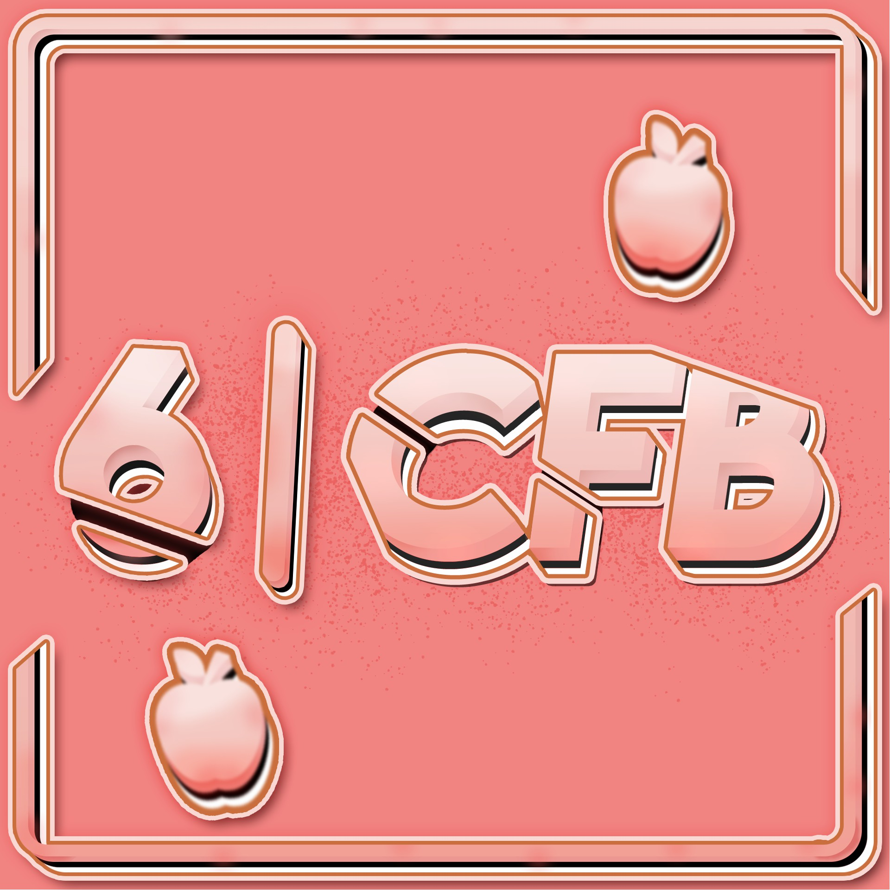

---
tags:
  - CFB
  - CFB6
---

# Catch French Beginner 6

La **Catch French Beginner 6** (***CFB 6***) était un tournoi osu!catch débutant français à double élimination en 1v1 organisé par ::{ flag=FR }:: [Hecatia15](https://osu.ppy.sh/users/3163012) et ::{ flag=FR }:: [Laffey Gaming](https://osu.ppy.sh/users/5122949). Les joueurs français classés entre 3 500 et moins ont pu participer. C'était la sixième édition de la Catch French Beginner.

## Dates du tournoi

| Évènement | Dates |
| --: | :-- |
| Phase d'inscription | 17/10/2021 - 31/10/2021 |
| Phase de screening | 01/11/2021 - 07/11/2021 |
| Live du tirage au sort | 08/11/2021 (22:00 UTC+2) |
| Qualifications | 13/11/2021 - 14/11/2021 |
| Huitièmes de finale | 20/11/2021 - 21/11/2021 |
| Quarts de finale | 26/11/2021 - 27/11/2021 |
| Demi-finales | 04/12/2021 - 05/12/2021 |
| Finales | 11/12/2021 - 12/12/2021 |
| Grande Finale | 18/12/2021 - 19/12/2021 |

## Prix

| Classement | Prix |
| :-: | :-- |
|  | Badge de profil unique, 4 mois d'osu!supporter |
|  | 2 mois d'osu!supporter |
|  | 1 moi d'osu!supporter |

## Organisation

La Catch French Beginner 6 était organisée par différents membres de la communauté.

| Position | Membre(s) |
| :-- | :-- |
| Organisateur | ::{ flag=FR }:: [Hecatia15](https://osu.ppy.sh/users/3163012), ::{ flag=FR }:: [Laffey Gaming](https://osu.ppy.sh/users/5122949) |
| Mapsetter | ::{ flag=FR }:: [Hecatia15](https://osu.ppy.sh/users/3163012), ::{ flag=FR }:: [Holloh](https://osu.ppy.sh/users/7612994), ::{ flag=FR }:: [Kasumi-sama](https://osu.ppy.sh/users/6177263), ::{ flag=FR }:: [Natsuko](https://osu.ppy.sh/users/8266817), ::{ flag=FR }:: [Realmas](https://osu.ppy.sh/users/6567640), ::{ flag=FR }:: [Yruama](https://osu.ppy.sh/users/8221467) |
| Arbitre | ::{ flag=FR }:: [bambinex](https://osu.ppy.sh/users/18818124), ::{ flag=FR }:: [Hecatia15](https://osu.ppy.sh/users/3163012), ::{ flag=FR }:: [Jielefe](https://osu.ppy.sh/users/15334170), ::{ flag=AT }:: [Mashiro Mama](https://osu.ppy.sh/users/10415976), ::{ flag=FR }:: [Laffey Gaming](https://osu.ppy.sh/users/5122949), ::{ flag=FR }:: [Pizou](https://osu.ppy.sh/users/9475990), ::{ flag=FR }:: [Taevas](https://osu.ppy.sh/users/7276846) |
| Streamer | ::{ flag=FR }:: [AiNA](https://osu.ppy.sh/users/4426908), ::{ flag=FR }:: [Bebar](https://osu.ppy.sh/users/12584928), ::{ flag=FR }:: [Jielefe](https://osu.ppy.sh/users/15334170), ::{ flag=FR }:: [Noctalium](https://osu.ppy.sh/users/6488167) |
| Commentateur | ::{ flag=FR }:: [\_Manyura](https://osu.ppy.sh/users/8335913), ::{ flag=FR }:: [AiNA](https://osu.ppy.sh/users/4426908), ::{ flag=FR }:: [Hecatia15](https://osu.ppy.sh/users/3163012), ::{ flag=FR }:: [Jielefe](https://osu.ppy.sh/users/15334170), ::{ flag=FR }:: [JunkoAndHiro](https://osu.ppy.sh/users/14004732), ::{ flag=FR }:: [Kitsuka](https://osu.ppy.sh/users/10334943), ::{ flag=FR }:: [MitsukeZ](https://osu.ppy.sh/users/12943161), ::{ flag=FR }:: [Yruama](https://osu.ppy.sh/users/8221467) |
| Designer | ::{ flag=FR }:: [Jielefe](https://osu.ppy.sh/users/15334170), ::{ flag=CA }:: [Zyoulou](https://osu.ppy.sh/users/8668722) |
| Statisticien | ::{ flag=FR }:: [Laffey Gaming](https://osu.ppy.sh/users/5122949) |
| Rédacteur du wiki | ::{ flag=ID }:: [fajar13k](https://osu.ppy.sh/users/7100002) |

## Liens

- [Fil de discussion](https://osu.ppy.sh/community/forums/topics/1443016)
- [Serveur Discord du CFB](https://discord.gg/YPfmnRcv6e)
- [Livestream](https://www.twitch.tv/catchfrenchlive)
- [Tableaux Challonge](https://challonge.com/CFB_6)
- **[Feuille de statistiques](https://docs.google.com/spreadsheets/d/1bzOdY-7V3Zarksv__8NGnll3mvTQwoWwXLFugPiOAs0/edit?usp=sharing)**

## Participants

| Seed | Membres |
| :-- | :-- |
| Top | ::{ flag=BE }:: [Kuzuyo](https://osu.ppy.sh/users/18277357), ::{ flag=FR }:: [RexyChann](https://osu.ppy.sh/users/16965749), ::{ flag=FR }:: [iron-wish](https://osu.ppy.sh/users/12264606), ::{ flag=FR }:: [JunkoAndHiro](https://osu.ppy.sh/users/14004732) |
| High | ::{ flag=FR }:: [\_\_\_\_\_\_\_\_\_\_\_\_](https://osu.ppy.sh/users/6973354), ::{ flag=FR }:: [Issuko](https://osu.ppy.sh/users/11447466), ::{ flag=FR }:: [Mimir](https://osu.ppy.sh/users/7382734), ::{ flag=FR }:: [Utopsia](https://osu.ppy.sh/users/11080305) |
| Low | ::{ flag=FR }:: [Gibralti](https://osu.ppy.sh/users/14824174), ::{ flag=FR }:: [MRkayle](https://osu.ppy.sh/users/8296712), ::{ flag=FR }:: [Firelex](https://osu.ppy.sh/users/13235008), ::{ flag=FR }:: [leeiplo](https://osu.ppy.sh/users/11353650) |
| Unseeded | ::{ flag=FR }:: [MissFlufly](https://osu.ppy.sh/users/13979291) |

## Podium

Cette compétition s'est conclue sur le podium suivant :

| Classement | Joueur |
| :-: | :-- |
|  | ::{ flag=FR }:: [JunkoAndHiro](https://osu.ppy.sh/users/14004732) |
|  | ::{ flag=FR }:: [iron-wish](https://osu.ppy.sh/users/12264606) |
|  | ::{ flag=FR }:: [\_\_\_\_\_\_\_\_\_\_\_\_](https://osu.ppy.sh/users/6973354) |

## Liste des beatmaps

### Grande Finale

**[Download the mappack here! (113 MB)](https://mega.nz/file/KxkkDSTI#dJ-1R-Asc7oz9BBecC4AtdyIHWcap4nZ5iO05uG798M)**

- NoMod
  1. [Camellia - shadows of cats (-Izayoi) \[Rain\]](https://osu.ppy.sh/beatmapsets/839083#fruits/2224908)
  2. [Noah - World's end (Kyptoric) \[Rain\]](https://osu.ppy.sh/beatmapsets/1006480#fruits/2111251)
  3. [Sound Souler - Paradise (GiGas) \[Piku's Nice Rain\]](https://osu.ppy.sh/beatmapsets/777127#fruits/1635333)
  4. [Kagamine Rin - Black Rebel (val0108) \[0108 Rebel\]](https://osu.ppy.sh/beatmapsets/28425#fruits/109301)
  5. [The Quick Brown Fox - Big Money (RikiH\_) \[$50\]](https://osu.ppy.sh/beatmapsets/101766#fruits/269409)
  6. [Lorenzo - Freestyle Du Sale (Ovoui) \[Freestyle De La Saucisse\]](https://osu.ppy.sh/beatmapsets/500870#fruits/1066890)
- Hidden
  1. [Chopin - Etude Op. 25, No. 12 (meganeko Remix) (WildOne94) \[Rain\]](https://osu.ppy.sh/beatmapsets/1115500#fruits/2330399)
  2. [P4koo - 8th:Planet \~Re:search\~ (Bunnrei) \[7th:Planet \~Hyperion's Rain\~\]](https://osu.ppy.sh/beatmapsets/1240162#fruits/2602447)
  3. [Fox Stevenson - Dreamland (Mao) \[Lucid\]](https://osu.ppy.sh/beatmapsets/1087898#fruits/2274904)
  4. [Hyper Potions - Jungle Cruise (hypercyte) \[Insane\]](https://osu.ppy.sh/beatmapsets/1171007#fruits/2442755)
- HardRock
  1. [Tatsh - reunion (GIGACHAD) \[Chatie's Salad\]](https://osu.ppy.sh/beatmapsets/1457145#fruits/3125207)
  2. [kors k feat. Sunao Yoshikawa - 7 Colors (Sorcerer) \[Platter\]](https://osu.ppy.sh/beatmapsets/612303#fruits/1292319)
  3. [Amame - To the Graceful Scarlet (Al-Azif) \[Alace's Hard\]](https://osu.ppy.sh/beatmapsets/4681#fruits/24912)
  4. [Ryokuoushoku Shakai - LADYBUG (RLC) \[Hard\]](https://osu.ppy.sh/beatmapsets/1441587#fruits/2986350)
- DoubleTime
  1. [Yuuhei Satellite - Kachou Fuugetsu (Magic Girl) \[Benny's Platter\]](https://osu.ppy.sh/beatmapsets/726596#fruits/1533955)
  2. [CELLON. - Virtual mode (JBHyperion) \[Salad\]](https://osu.ppy.sh/beatmapsets/1069501#fruits/2238807)
  3. [Street - Reincarnation (eiri-) \[Hard\]](https://osu.ppy.sh/beatmapsets/1239248#fruits/2586074)
  4. [Pendulum - The Vulture (La Cataline) \[Insane\]](https://osu.ppy.sh/beatmapsets/24163#fruits/82249)
- Tiebreaker
  1. **[DM DOKURO - SAVE (Dapuluous) \[Vessel of Determination\]](https://osu.ppy.sh/beatmapsets/842664#fruits/2225349)**

### Finales

**[Téléchargez le beatmap pack ici ! (93 MB)](https://mega.nz/file/iFxWxRCS#_pyLa9Xq-NKUJ1C-kEEWVm0GwRY8AIlRJu5_zYfwmCc)**

- NoMod
  1. [Raujika - Cry More (Lacrima) \[AFB's Rain\]](https://osu.ppy.sh/beatmapsets/1009597#fruits/2190015)
  2. [Memme - Force of Ra (Deif) \[Platter\]](https://osu.ppy.sh/beatmapsets/573479#fruits/1214850)
  3. [Seven Lions & Echos - Cold Skin (-Ken) \[Rain\]](https://osu.ppy.sh/beatmapsets/946446#fruits/1976187)
  4. [Bentham - Chicago (ponbot) \[newton's Insane\]](https://osu.ppy.sh/beatmapsets/1243342#fruits/2816394)
  5. [Kommisar - Chipstream (viptwo) \[Extra\]](https://osu.ppy.sh/beatmapsets/104784#fruits/385548)
  6. [REAPER - BARRICADE (Cut Ver.) (Pandize) \[LIGHT INSANE\]](https://osu.ppy.sh/beatmapsets/1157441#fruits/2616114)
- Hidden
  1. [Mili - Utopiosphere -Platonism- (Benny-) \[Tyrell's Utopia\]](https://osu.ppy.sh/beatmapsets/522132#fruits/1111110)
  2. [Itou Kanako - Hacking to the Gate (TV Size) (chickenbible) \[Rain\]](https://osu.ppy.sh/beatmapsets/840945#fruits/1760069)
  3. [Muzzy, Koven & Feint - Worth The Lie (Elinor) \[Insane\]](https://osu.ppy.sh/beatmapsets/1217548#fruits/2533673)
  4. [07th Expansion - Akai Tsukunise (soulfear) \[Smothered Mate\]](https://osu.ppy.sh/beatmapsets/14208#fruits/52352)
- HardRock
  1. [Go Ichinose - Mizuumi (Sinnoh) \[Platter\]](https://osu.ppy.sh/beatmapsets/516118#fruits/1147779)
  2. [Gentle Stick X M2U - Ineffabilis (GAMI) \[Salad\]](https://osu.ppy.sh/beatmapsets/1190300#fruits/2480020)
  3. [Kawada Mami - No buts! (TV Size) (HakuNoKaemi) \[Hard\]](https://osu.ppy.sh/beatmapsets/21218#fruits/83158)
  4. [Sound Holic - Optical Cellophane (PandaCath) \[KIRBY Mix\]](https://osu.ppy.sh/beatmapsets/6704#fruits/31050)
- DoubleTime
  1. [Uinyasu, Occhoko Bunny - Aa Kenran no Yume ga Gotoku (Epsilon Remix) (-Luminate) \[Salad\]](https://osu.ppy.sh/beatmapsets/1044161#fruits/2546418)
  2. [Dormir - Sayonara Trip (Lacrima) \[Platter\]](https://osu.ppy.sh/beatmapsets/1085450#fruits/2270337)
  3. [Sound Holic - Optical Cellophane (PandaCath) \[KIRBY Mix\]](https://osu.ppy.sh/beatmapsets/6704#fruits/31050)
  4. [binaria - Kamiiro Awase (Chaoslitz) \[wkyik's Light Insane\]](https://osu.ppy.sh/beatmapsets/506771#fruits/1078509)
- Tiebreaker
  1. **[void - Verdict for worst dictator (ZiRoX) \[Judgement\]](https://osu.ppy.sh/beatmapsets/303599#fruits/873668)**

### Demi-finales

**[Téléchargez le beatmap pack ici ! (122 MB)](https://mega.nz/file/rcoxWaSB#EZtqifj6fEM4ttxGmyuAzi-yKkycnDDjiu_SpNGYh6E)**

- NoMod
  1. [Station Earth - Cold Green Eyes feat. Roos Denayer (Secre) \[Chatie's Platter\]](https://osu.ppy.sh/beatmapsets/1499536#fruits/3107570)
  2. [PSYQUI - Be There (GiGas) \[Platter\]](https://osu.ppy.sh/beatmapsets/800670#fruits/1711478)
  3. [7!! - Lovers (TV Size) (arken1015) \[urane's Catch Platter\]](https://osu.ppy.sh/beatmapsets/33769#fruits/157103)
  4. [Nasko - Break Through (Evgerable) \[Insane\]](https://osu.ppy.sh/beatmapsets/657084#fruits/1392411)
  5. [Infected Mushroom - Guitarmass (Cut Ver.) (Ciyus Miapah) \[Insane\]](https://osu.ppy.sh/beatmapsets/947022#fruits/1977955)
- Hidden
  1. [nonoc - Memento (TV Size) (Verti) \[Platter\]](https://osu.ppy.sh/beatmapsets/1417543#fruits/2921955)
  2. [My Bloody Valentine - You Made Me Realise (dsco) \[Insane\]](https://osu.ppy.sh/beatmapsets/754498#fruits/1596960)
  3. [Rameses B - Flaklypa (-kevincela-) \[Insane\]](https://osu.ppy.sh/beatmapsets/190390#fruits/453358)
- HardRock
  1. [cinema staff - great escape (TV Size) (Deif) \[Salad\]](https://osu.ppy.sh/beatmapsets/118690#fruits/305021)
  2. [Hitomi Sato - Snowpoint City (Night) (Ascendance) \[Fii's Salad\]](https://osu.ppy.sh/beatmapsets/539704#fruits/1145142)
  3. [Koronba - Iwashi ga Tsuchi kara Haete Kurunda (Damnjelly) \[Hard\]](https://osu.ppy.sh/beatmapsets/602367#fruits/1310506)
- DoubleTime
  1. [Akiko Shikata - Katayoku no Tori (Deif) \[Salad\]](https://osu.ppy.sh/beatmapsets/317968#fruits/708227)
  2. [nanobii - HYPERDRIVE (Ascendance) \[Salad\]](https://osu.ppy.sh/beatmapsets/639991#fruits/1357224)
  3. [Albatrosicks - Sunfish runs away (Nharox) \[Insane\]](https://osu.ppy.sh/beatmapsets/3582#fruits/22098)
- Tiebreaker
  1. **[PSYQUI - Hype feat. Such (lapix Remix) (Ascendance) \[ZiRoX's Platter\]](https://osu.ppy.sh/beatmapsets/1009824#fruits/2156940)**

### Quarts de finale

**[Téléchargez le beatmap pack ici ! (86 MB)](https://mega.nz/file/aZ5wAKoa#yWdGcejSRd9mqAMxCQ_HNCdhZ5hNdrYTLyczD4N1ZM0)**

- NoMod
  1. [sana - Sunset March (Benita) \[Nuvolina's Salad\]](https://osu.ppy.sh/beatmapsets/959995#fruits/2019327)
  2. [KOTOKO - Wing my way (ZHSteven) \[Easy-Jumping\]](https://osu.ppy.sh/beatmapsets/17744#fruits/292911)
  3. [kors k as teranoid - Bad Maniacs (Lacrima) \[Normal\]](https://osu.ppy.sh/beatmapsets/1423576#fruits/2951205)
  4. [Studio EIM - Crescent Moon Island Boss Theme (Rakuen) \[Light Insane\]](https://osu.ppy.sh/beatmapsets/173422#fruits/543921)
  5. [BaSTeT - DARK LEGACY (Azer) \[Hyper\]](https://osu.ppy.sh/beatmapsets/222453#fruits/726720)
- Hidden
  1. [kozato - Izayoi Sakura (Gust) \[Firika's Insane\]](https://osu.ppy.sh/beatmapsets/893573#fruits/1895932)
  2. [Gavin G - Culture (Asphyxia) \[Hard\]](https://osu.ppy.sh/beatmapsets/219056#fruits/513244)
  3. [Tatsh - Xevel (Skytuna) \[Seolv's ADVANCED\]](https://osu.ppy.sh/beatmapsets/1174491#fruits/2478117)
- HardRock
  1. [YOASOBI - Kaibutsu (Souvenir) \[Collab Salad\]](https://osu.ppy.sh/beatmapsets/1352136#fruits/2813194)
  2. [Yamamoto Mineko - Yuki no Elfin Lied \~Never ending love song\~ (Hareimu) \[Lumi's Salad\]](https://osu.ppy.sh/beatmapsets/748228#fruits/2005616)
  3. [Renard + Adraen - Physicality (Silverboxer) \[Advanced\]](https://osu.ppy.sh/beatmapsets/530067#fruits/1123755)
- DoubleTime
  1. [a\_hisa - Cheshire,s dance (Muya) \[Normal\]](https://dl.sayobot.cn/beatmaps/download/full/148003)
  2. [sak feat. Myui - Haniel no Uta (Sanyi) \[Absolute Zero's Cup\]](https://osu.ppy.sh/beatmapsets/999770#fruits/2097724)
  3. [egor nats - ya zhenyus' na devochke iz anime (Natsuko) \[CFB\]](https://osu.ppy.sh/beatmapsets/1633204#fruits/3333659)
- Tiebreaker
  1. **[nano - Nevereverland (CLSW) \[ExGon's Salad\]](https://osu.ppy.sh/beatmapsets/149570#fruits/369563)**

### Huitièmes de finale

**[Téléchargez le beatmap pack ici ! (80 MB)](https://mega.nz/file/7IwSgDpK#Jj4tqXsA0mvLTfkSr3OBAfVCzoetLy_2Hbxg25W5gRw)**

- NoMod
  1. [Creo - Challenger (Rocma) \[Salad\]](https://osu.ppy.sh/beatmapsets/966240#fruits/2024795)
  2. [Douglas Robb (Hoobastank) - Fist Bump (rew0825) \[Salad\]](https://osu.ppy.sh/beatmapsets/779577#fruits/1637781)
  3. [Sakuzyo - Fracture Ray (DJ Lucky) \[Nuvolina's Hard\]](https://osu.ppy.sh/beatmapsets/950681#fruits/1987845)
  4. [Zektbach - Kagachi (ouranhshc) \[Sharp x ouran\]](https://osu.ppy.sh/beatmapsets/26500#fruits/89329)
- Hidden
  1. [Nekomata Master - CALL (Muya) \[Another\]](https://beatconnect.io/b/39578)
  2. [Sound Souler - Bubble Flower (Sylas) \[Hard\]](https://osu.ppy.sh/beatmapsets/1152182#fruits/2404834)
- HardRock
  1. [flumpool - Chiisana Hibi (TV Size) (Greaper) \[Du5t's Salad\]](https://osu.ppy.sh/beatmapsets/1139396#fruits/2384207)
  2. [t+pazolite - QZKago Requiem (- Frontier -) \[BASIC\]](https://osu.ppy.sh/beatmapsets/899024#fruits/2051725)
- DoubleTime
  1. [Ono Masatoshi - departure! (TV Size) (Secre) \[Cup\]](https://osu.ppy.sh/beatmapsets/1474379#fruits/3025881)
  2. [Wayne Lytle - Pipe Dream (Tanmak) \[Hard\]](https://osu.ppy.sh/beatmapsets/9850#fruits/39077)
- Tiebreaker
  1. [Various Artists - Skill Analyzer I (\_Asriel) \[CTB Lv.03 Marathon\]](https://osu.ppy.sh/beatmapsets/704555#fruits/1490429)

### Qualifications

**[Téléchargez le beatmap pack ici ! (37 MB)](https://mega.nz/file/VLxASSID#O-4DYjNIlSHoz1NAhhNUVOYLRcCoDsC1F6ntjhoBAjY)**

- NoMod
  1. [HyuN feat. JeeE - Fallen Angel (autofanboy) \[Rain\]](https://osu.ppy.sh/beatmapsets/1141049#fruits/2468074)
  2. [sak respect for Arata Iiyoshi - Reason of being (CookieBite) \[Kenterz's ANOTHER\]](https://osu.ppy.sh/beatmapsets/640558#fruits/1359787)
- Hidden
  1. [Suara - Fuantei na Kamisama TV ver. (MoelittleC Hime) \[Platter\]](https://osu.ppy.sh/beatmapsets/394829#fruits/864002)
- HardRock
  1. [Y&Co. feat. Karin - Sweet Rain (Sorcerer) \[Salad\]](https://osu.ppy.sh/beatmapsets/738169#fruits/1587423)
- DoubleTime
  1. [VINXIS - A Centralized View (JBHyperion) \[wonjae's Salad\]](https://osu.ppy.sh/beatmapsets/972302#fruits/2035771)

## Résultats des matchs

### Grande Finale

Samedi, 18 Decembre 2021:

| Joueur 1 |  |  | Joueur 2 | Lien du match |
| --: | :-: | :-: | :-- | :-- |
| **iron-wish** ::{ flag=FR }:: | **7** | 5 | ::{ flag=FR }:: \_\_\_\_\_\_\_\_\_\_\_\_ | [#1](https://osu.ppy.sh/community/matches/95389445) |

Dimanche, 19 Decembre 2021:

| Joueur 1 |  |  | Joueur 2 | Lien du match |
| --: | :-: | :-: | :-- | :-- |
| **JunkoAndHiro** ::{ flag=FR }:: | **7** | 5 | ::{ flag=FR }:: iron-wish | [#1](https://osu.ppy.sh/community/matches/95428119) |

### Finales

Samedi, 11 Decembre 2021:

| Joueur 1 |  |  | Joueur 2 | Lien du match |
| --: | :-: | :-: | :-- | :-- |
| **JunkoAndHiro** ::{ flag=FR }:: | **6** | 1 | ::{ flag=FR }:: iron-wish | [#1](https://osu.ppy.sh/community/matches/95096511) |

Dimanche, 12 Decembre 2021:

| Joueur 1 |  |  | Joueur 2 | Lien du match |
| --: | :-: | :-: | :-- | :-- |
| **RexyChann** ::{ flag=FR }:: | **6** | 1 | ::{ flag=FR }:: Utopsia | [#1](https://osu.ppy.sh/community/matches/95149967) |
| **\_\_\_\_\_\_\_\_\_\_\_\_** ::{ flag=FR }:: | **6** | 2 | ::{ flag=FR }:: RexyChann | [#1](https://osu.ppy.sh/community/matches/95152065) |

### Demi-finales

Samedi, 4 Decembre 2021:

| Joueur 1 |  |  | Joueur 2 | Lien du match |
| --: | :-: | :-: | :-- | :-- |
| Kuzuyo ::{ flag=BE }:: | -1 | **0** | ::{ flag=FR }:: **JunkoAndHiro** | *victoire par défaut* |
| RexyChann ::{ flag=FR }:: | 1 | **6** | ::{ flag=FR }:: **iron-wish** | [#1](https://osu.ppy.sh/community/matches/94797662) |
| **Utopsia** ::{ flag=FR }:: | **0** | -1 | ::{ flag=FR }:: Firelex | *victoire par défaut* |
| leeiplo ::{ flag=FR }:: | -1 | **0** | ::{ flag=FR }:: **MRkayle** | *victoire par défaut* |
| Mimir ::{ flag=FR }:: | 2 | **6** | ::{ flag=FR }:: **\_\_\_\_\_\_\_\_\_\_\_\_** | [#1](https://osu.ppy.sh/community/matches/94812153) |
| **Issuko** ::{ flag=FR }:: | **0** | -1 | ::{ flag=FR }:: Gibralti | *victoire par défaut* |

Dimanche, 5 Decembre 2021:

| Joueur 1 |  |  | Joueur 2 | Lien du match |
| --: | :-: | :-: | :-- | :-- |
| Issuko ::{ flag=FR }:: | 2 | **6** | ::{ flag=FR }:: **\_\_\_\_\_\_\_\_\_\_\_\_** | [#1](https://osu.ppy.sh/community/matches/94864020) |
| MRkayle ::{ flag=FR }:: | 2 | **6** | ::{ flag=FR }:: **Utopsia** | [#1](https://osu.ppy.sh/community/matches/94866270) |
| Kuzuyo ::{ flag=BE }:: | -1 | **0** | ::{ flag=FR }:: **\_\_\_\_\_\_\_\_\_\_\_\_** | *victoire par défaut* |

### Quarts de finale

Vendredi, 26 Novembre 2021:

| Joueur 1 |  |  | Joueur 2 | Lien du match |
| --: | :-: | :-: | :-- | :-- |
| **Kuzuyo** ::{ flag=BE }:: | **5** | 2 | ::{ flag=FR }:: Utopsia | [#1](https://osu.ppy.sh/community/matches/94476333) |
| **RexyChann** ::{ flag=FR }:: | **0** | -1 | ::{ flag=FR }:: Mimir | *victoire par défaut* |

Samedi, 27 Novembre 2021:

| Joueur 1 |  |  | Joueur 2 | Lien du match |
| --: | :-: | :-: | :-- | :-- |
| MissFlufly ::{ flag=FR }:: | 0 | **5** | ::{ flag=FR }:: **\_\_\_\_\_\_\_\_\_\_\_\_** | [#1](https://osu.ppy.sh/community/matches/94510041) |
| **JunkoAndHiro** ::{ flag=FR }:: | **5** | 0 | ::{ flag=FR }:: leeiplo | [#1](https://osu.ppy.sh/community/matches/94530206) |

Dimanche, 28 Novembre 2021:

| Joueur 1 |  |  | Joueur 2 | Lien du match |
| --: | :-: | :-: | :-- | :-- |
| **iron-wish** ::{ flag=FR }:: | **5** | 0 | ::{ flag=FR }:: Issuko | [#1](https://osu.ppy.sh/community/matches/94566957) |

### Huitièmes de finale

Samedi, 20 Novembre 2021:

| Joueur 1 |  |  | Joueur 2 | Lien du match |
| --: | :-: | :-: | :-- | :-- |
| **JunkoAndHiro** ::{ flag=FR }:: | **4** | 0 | ::{ flag=FR }:: MissFlufly | [#1](https://osu.ppy.sh/community/matches/94201935) |

Dimanche, 21 Novembre 2021:

| Joueur 1 |  |  | Joueur 2 | Lien du match |
| --: | :-: | :-: | :-- | :-- |
| **Utopsia** ::{ flag=FR }:: | **4** | 2 | ::{ flag=FR }:: Gibralti | [#1](https://osu.ppy.sh/community/matches/94252151) |
| **Issuko** ::{ flag=FR }:: | **0** | -1 | ::{ flag=FR }:: Firelex | *victoire par défaut* |
| **Mimir** ::{ flag=FR }:: | **0** | -1 | ::{ flag=FR }:: MRkayle | [#1](https://osu.ppy.sh/community/matches/94261867) |
| \_\_\_\_\_\_\_\_\_\_\_\_ ::{ flag=FR }:: | -1 | **0** | ::{ flag=FR }:: **leeiplo** | *victoire par défaut* |

### Qualifications

Les statistiques détaillées de ce tour peuvent être trouvées [ici](https://docs.google.com/spreadsheets/d/1bzOdY-7V3Zarksv__8NGnll3mvTQwoWwXLFugPiOAs0/edit), ainsi que le classement final montrant quel joueur s'est qualifié pour l'étape suivante.

## Règlement

### Règles générales

1. Vous devez être entre le rang 3 500 ou moins lors au classement général pendant la phase d'inscriptions.
2. Les scores seront en **ScoreV2**.
3. Un retard de plus de **10 minutes** à un match entrainera une victoire par défaut pour l'autre joueur.
4. Même lors d'un tournoi, osu! reste un jeu, soyez amicaux et fair play.
5. La Catch French Beginner 6 sera en double-élimination, ce qui signifie qu'il y aura un loser's bracket.
6. N'importe quel joueur francophone peut participer au tournoi.

### Règlements des matchs

1. Les joueurs lanceront un `!roll` au début du match pour déterminer l'ordre des choix : Le gagnant du roll ban en second et pick en premier, le perdant du roll ban en premier et pick en second.
2. Les warm-up sont interdits, soyez sûr d'être bien échauffé avant de jouer votre match.
3. En ce qui concerne les bans de maps, les quantités de maps qui peuvent être ban sont les suivantes :
   - Des huitièmes de finale aux demi-finales, chaque joueur bannira 1 map par match.
   - Lors des finales et des grandes finales, chaque joueur bannira 2 maps par match.
4. Les scores fail comptent. Avec cela, le mod NoFail sera forcé pour tout le monde.
5. Un même joueur n'a pas le droit de ban et de pick le même mod deux fois d'affilée.
6. Les joueurs seront forcés de prendre un mod sur un pick FreeMod.
7. Le Hidden est autorisé en HardRock et DoubleTime.
8. Le Tiebreaker est joué en NoMod ou en Hidden uniquement.

### Conditions de victoire

1. Huitièmes de finale : Best-of-7 (premier à 4 points)
2. Quarts de finale : Best-of-9 (premier à 5 points)
3. Demi-finales : Best-of-11 (premier à 6 points)
4. **Finales et Grande Finale** : Best-of-13 (premier à 7 points)
