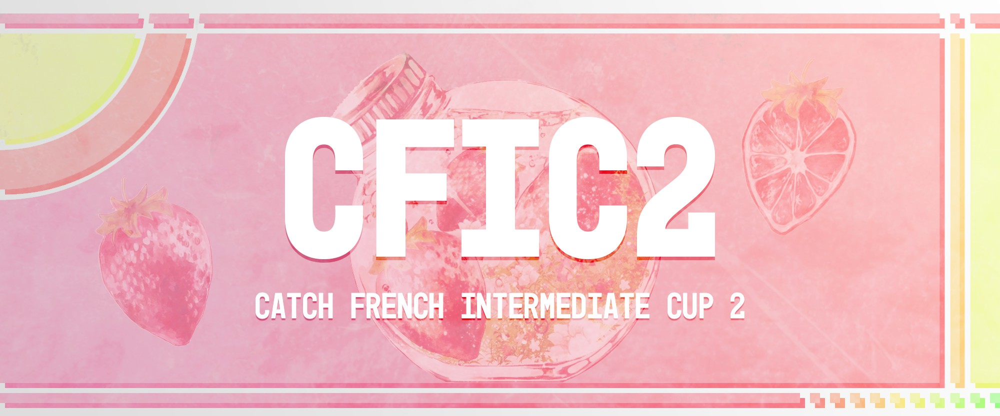

---
tags:
  - CFIC
  - CFIC2
---

# Catch French Intermediate Cup 2

The **Catch French Intermediate Cup 2** (***CFIC 2***) was an intermediate French double-elimination 1v1 osu!catch tournament hosted by ::{ flag=FR }:: [Kasumii-sama](https://osu.ppy.sh/users/6177263), ::{ flag=FR }:: [Purettsu Eru](https://osu.ppy.sh/users/1542565), and ::{ flag=FR }:: [TLQ\_Yoshii](https://osu.ppy.sh/users/7157133). This was the second instalment of the Catch French Intermediate Cup and part of the Catch French Cup series.

## Tournament schedule

| Event | Timestamp |
| --: | :-- |
| Registration phase | 2020-01-18/2020-02-02 |
| Live drawings | 2020-02-07 (22:00 UTC+2) |
| Qualifiers | 2020-02-15/2020-02-16 |
| Group stage | 2020-02-22/2020-02-23 |
| Quarterfinals | 2020-02-29/2020-03-01 |
| Semifinals | 2020-03-07/2020-03-08 |
| Finals | 2020-03-14 |
| Grand Finals | 2020-03-21 |

## Prizes

| Placing | Prize |
| :-: | :-- |
|  | Unique profile badge |

## Organisation

The Catch French Intermediate Cup 2 was run by various community members.

| Position | Member(s) |
| :-- | :-- |
| Manager | ::{ flag=FR }:: [Kasumii-sama](https://osu.ppy.sh/users/6177263), ::{ flag=FR }:: [Purettsu Eru](https://osu.ppy.sh/users/1542565), ::{ flag=FR }:: [TLQ\_Yoshii](https://osu.ppy.sh/users/7157133) |
| Mappool selector | ::{ flag=TN }:: [-Ken](https://osu.ppy.sh/users/4430811), ::{ flag=FR }:: [Rougoku](https://osu.ppy.sh/users/6900166) |
| Referee | ::{ flag=FR }:: [Apsuko](https://osu.ppy.sh/users/9313135), ::{ flag=FR }:: [Kasumii-sama](https://osu.ppy.sh/users/6177263), ::{ flag=FR }:: [Mimir](https://osu.ppy.sh/users/7382734), ::{ flag=FR }:: [Purettsu Eru](https://osu.ppy.sh/users/1542565), ::{ flag=FR }:: [TLQ\_Yoshii](https://osu.ppy.sh/users/7157133) |
| Streamer | ::{ flag=FR }:: [FulgurentKille](https://osu.ppy.sh/users/4096322), ::{ flag=FR }:: [Purettsu Eru](https://osu.ppy.sh/users/1542565) |
| Commentator | ::{ flag=FR }:: [4L-Chan 3 Porte](https://osu.ppy.sh/users/7253987), ::{ flag=FR }:: [FulgurentKille](https://osu.ppy.sh/users/4096322), ::{ flag=FR }:: [Kammthaar](https://osu.ppy.sh/users/8802523), ::{ flag=FR }:: [Kasumii-sama](https://osu.ppy.sh/users/6177263), ::{ flag=FR }:: [Purettsu Eru](https://osu.ppy.sh/users/1542565), ::{ flag=FR }:: [TLQ\_Yoshii](https://osu.ppy.sh/users/7157133), ::{ flag=FR }:: [Yruama](https://osu.ppy.sh/users/8221467) |
| Designer | ::{ flag=SG }:: [youi](https://osu.ppy.sh/users/7537133) |
| Statistician | ::{ flag=FR }:: [Kasumii-sama](https://osu.ppy.sh/users/6177263) |
| Wiki editor | ::{ flag=ID }:: [fajar13k](https://osu.ppy.sh/users/7100002) |

## Links

- [Discussion thread](https://osu.ppy.sh/community/forums/topics/1011966)
- [CFC Discord server](https://discord.gg/3DewaX8)
- Livestream
  - [osufrlive](https://twitch.tv/osufrlive)
  - [osufrlive2](https://twitch.tv/osufrlive2)
- [Challonge brackets](https://osucfc.challonge.com/CFIC2)
- **[Statistics sheet](https://docs.google.com/spreadsheets/d/1WY3pFruEH5nos-xEi7NDuLOKq2A0L9Nr8dPks0sktmY/edit?usp=sharing)**

## Participants

| Seed | Members |
| :-- | :-- |
| Top | ::{ flag=FR }:: [Electr0o](https://osu.ppy.sh/users/9484428), ::{ flag=FR }:: [Dask](https://osu.ppy.sh/users/4151397), ::{ flag=FR }:: [Fuka Pura](https://osu.ppy.sh/users/2326688), ::{ flag=FR }:: [dracoV](https://osu.ppy.sh/users/7925725) |
| High | ::{ flag=FR }:: [Khalemm](https://osu.ppy.sh/users/11983416), ::{ flag=FR }:: [TomyLeFaux](https://osu.ppy.sh/users/9504653), ::{ flag=FR }:: [NoLimitFS](https://osu.ppy.sh/users/10411609), ::{ flag=FR }:: [KillingSpin](https://osu.ppy.sh/users/4073302) |
| Low | ::{ flag=FR }:: [Pizu](https://osu.ppy.sh/users/9475990), ::{ flag=FR }:: [Aequo3](https://osu.ppy.sh/users/4495141), ::{ flag=FR }:: [Zard](https://osu.ppy.sh/users/6277626), ::{ flag=FR }:: [Kaleesy Pura](https://osu.ppy.sh/users/1800077) |
| Unseeded | ::{ flag=FR }:: [NinjaCoktail](https://osu.ppy.sh/users/11431902), ::{ flag=FR }:: [YANOO123](https://osu.ppy.sh/users/5122949), ::{ flag=FR }:: [Oasix](https://osu.ppy.sh/users/6183012), ::{ flag=FR }:: [redjiii](https://osu.ppy.sh/users/1378728) |

## Groups

| Group | Top seed | High seed | Low seed | Unseeded |
| :-: | :-- | :-- | :-- | :-- |
| A | ::{ flag=FR }:: [Fuka Pura](https://osu.ppy.sh/users/2326688) | ::{ flag=FR }:: [KillingSpin](https://osu.ppy.sh/users/4073302) | ::{ flag=FR }:: [Kaleesy Pura](https://osu.ppy.sh/users/1800077) | ::{ flag=FR }:: [YANOO123](https://osu.ppy.sh/users/5122949) |
| B | ::{ flag=FR }:: [Dask](https://osu.ppy.sh/users/4151397) | ::{ flag=FR }:: [Khalemm](https://osu.ppy.sh/users/11983416) | ::{ flag=FR }:: [Aequo3](https://osu.ppy.sh/users/4495141) | ::{ flag=FR }:: [redjiii](https://osu.ppy.sh/users/1378728) |
| C | ::{ flag=FR }:: [Electr0o](https://osu.ppy.sh/users/9484428) | ::{ flag=FR }:: [TomyLeFaux](https://osu.ppy.sh/users/9504653) | ::{ flag=FR }:: [Zard](https://osu.ppy.sh/users/6277626) | ::{ flag=FR }:: [NinjaCoktail](https://osu.ppy.sh/users/11431902) |
| D | ::{ flag=FR }:: [dracoV](https://osu.ppy.sh/users/7925725) | ::{ flag=FR }:: [NoLimitFS](https://osu.ppy.sh/users/10411609) | ::{ flag=FR }:: [Pizu](https://osu.ppy.sh/users/9475990) | ::{ flag=FR }:: [Oasix](https://osu.ppy.sh/users/6183012) |

## Podium

This competition has come to an end and resulted in the following podium:

| Placing | Player |
| :-: | :-- |
|  | ::{ flag=FR }:: [Fuka Pura](https://osu.ppy.sh/users/2326688) |
|  | ::{ flag=FR }:: [Kaleesy Pura](https://osu.ppy.sh/users/1800077) |
|  | ::{ flag=FR }:: [dracoV](https://osu.ppy.sh/users/7925725) |

## Mappools

### Grand Finals

**[Download the mappack here! (109 MB)](https://mega.nz/#!RdgDjC6B!XEZDuiV1BJnS-8Id5CGiK_79OI1rOLAScZk54BA_c0Y)**

- NoMod
  1. [Konuko - Toumei Elegy (Sinnoh) \[Overdose\]](https://osu.ppy.sh/beatmapsets/658896#fruits/1395516)
  2. [D.watt(OTAKU-ELITE Recordings) - Opium and Purple haze (CLSW) \[INFINITE\]](https://osu.ppy.sh/beatmapsets/596519#fruits/1261323)
  3. [Kuroneko Dungeon - Ryoushi no Umi no Lindwurm (\[\_-Kukkai-\_\]) \[Overdose\]](https://osu.ppy.sh/beatmapsets/857537#fruits/1830273)
  4. [Nardis - Cosmo Memory (Shiirn) \[Entelecheia\]](https://osu.ppy.sh/beatmapsets/517598#fruits/1099759)
  5. [Ryu\* - Sakura Reflection (MYTK Remix) (Leader) \[Another\]](https://osu.ppy.sh/beatmapsets/288486#fruits/650610)
  6. [Caravan Palace - Dragons (Charles445) \[Insane\]](https://osu.ppy.sh/beatmapsets/46733#fruits/145361)
- Hidden
  1. [Function Phantom - Neuronecia (Minato Yukina) \[Rain\]](https://osu.ppy.sh/beatmapsets/1054925#fruits/2204221)
  2. [Clown Core - Hell (Sinnoh) \[Rain\]](https://osu.ppy.sh/beatmapsets/925638#fruits/1933443)
  3. [Said The Sky - For You (Ft. Melissa Hayes) (Bearizm) \[Insane\]](https://osu.ppy.sh/beatmapsets/847645#fruits/1773226)
  4. [ZUN - Old Yuanshen (Parachute) \[\Para's Lunatic\]](https://osu.ppy.sh/beatmapsets/71800#fruits/208208)
- HardRock
  1. [nmk - sola (-Sh1n1-) \[MBomb's Rain\]](https://osu.ppy.sh/beatmapsets/595972#fruits/1274343)
  2. [Orange Lounge - Marmalade Reverie (-Ken) \[Paradis (CFIC)\]](https://osu.ppy.sh/beatmapsets/1125533#fruits/2351771)
  3. [Hanatan - Kitsune no Yomeiri (Ryafuka) \[Kitsuneko\]](https://osu.ppy.sh/beatmapsets/46070#fruits/144387)
  4. [Yasunori Mitsuda - Battle with Magus (AdvanceBoy) \[Darkness\]](https://osu.ppy.sh/beatmapsets/37332#fruits/120119)
- DoubleTime
  1. [Cranky - EMPEROR (JBHyperion) \[PLATTER\]](https://osu.ppy.sh/beatmapsets/979438#fruits/2054224)
  2. [Memme - Force of Ra (Deif) \[Platter\]](https://osu.ppy.sh/beatmapsets/573479#fruits/1214850)
  3. [Senya - Kodokutsuki (y u z u k i) \[gow's insane\]](https://osu.ppy.sh/beatmapsets/24706#fruits/83968)
  4. [Duca - Zettai Darli'n (Little) \[Insane\]](https://osu.ppy.sh/beatmapsets/414709#fruits/898884)
- Tiebreaker
  1. **[Chata - enn (Spectator) \[The Melody of Wish, Desires\]](https://osu.ppy.sh/beatmapsets/692979#fruits/1466362)**

### Finals

- NoMod
  1. [Erik McClure - The Last Dead Angel (Kyuare) \[Ange\]](https://osu.ppy.sh/beatmapsets/574923#fruits/1217571)
  2. [DJ TOTTO feat. Enako - Precious \* Star (Spectator) \[Overdose\]](https://osu.ppy.sh/beatmapsets/776495#fruits/1631467)
  3. [REDALiCE vs. MASAKI - BUCHiGiRE Berserker (Bunnrei) \[INSANE\]](https://osu.ppy.sh/beatmapsets/1074448#fruits/2249908)
  4. [sana - Miraizu (Lasse) \[Forever\]](https://osu.ppy.sh/beatmapsets/378196#fruits/890467)
  5. [toby fox - MEGALOVANIA (Kyshiro) \[Insane\]](https://osu.ppy.sh/beatmapsets/387700#fruits/847387)
  6. [LeaF - Euphoric Orchid Dance (Zetera) \[Zetera's Super Hard\]](https://osu.ppy.sh/beatmapsets/431102#fruits/929941)
- Hidden
  1. [P\*Light - FUNKY SUMMER BEACH (alienflybot) \[Rain\]](https://osu.ppy.sh/beatmapsets/807977#fruits/1695597)
  2. [kors k - Playing With Fire (Sota Fujimori Remix) (Ascendance) \[White Hard\]](https://osu.ppy.sh/beatmapsets/683343#fruits/1577675)
  3. [Kero Kero Bonito - Flyway (Hectic) \[Toy's Insane\]](https://osu.ppy.sh/beatmapsets/969578#fruits/2161385)
  4. [Tezuka feat. Oonishi Amimi - Bokura no Jikan (celerih) \[EXHAUST\]](https://osu.ppy.sh/beatmapsets/928650#fruits/1939646)
- HardRock
  1. [FOLiACETATE - Heterochromia Iridis (Deif) \[Platter\]](https://osu.ppy.sh/beatmapsets/833719#fruits/2170652)
  2. [Ray - Nagi (mingmichael) \[Rain\]](https://osu.ppy.sh/beatmapsets/146008#fruits/361907)
  3. [Shimotsuki Haruka - Tsubasa o Motanai Shoujo (Dored) \[Rio's Eztra\]](https://osu.ppy.sh/beatmapsets/883825#fruits/1866037)
  4. [FF7 Original Soundtrack - Crazy Motorcycle Chase (James) \[Crazy!\]](https://osu.ppy.sh/beatmapsets/1961#fruits/18170)
- DoubleTime
  1. [Neru - Byoumei Wa Ai Datta (Ellyu) \[Rew's Platter\]](https://osu.ppy.sh/beatmapsets/684960#fruits/2203059)
  2. [siromaru + cranky - conflict (Bunnrei) \[Platter\]](https://osu.ppy.sh/beatmapsets/981762#fruits/2055786)
  3. [Nightwish - Planet Hell (Sieg) \[Insane\]](https://osu.ppy.sh/beatmapsets/167077#fruits/405955)
  4. [Lacuna Coil - Spellbound (narakucrimson) \[Insane\]](https://osu.ppy.sh/beatmapsets/41992#fruits/138033)
- Tiebreaker
  1. **[Erik "Jit" Scheele - Negastrife (lulu lemon) \[Depths\]](https://osu.ppy.sh/beatmapsets/653765#fruits/1385813)**

### Semifinals

**[Download the mappack here! (104 MB)](https://mega.nz/#!EoUACIDC!dXQH5hLj9EY-Y7VfvZeoyEPSC5Bz0-2BXezoSyeN7ik)**

- NoMod
  1. [Mili - Rightfully (Vignette-) \[IDu5t's Rain\]](https://osu.ppy.sh/beatmapsets/867781#fruits/1864600)
  2. [JO\*STARS \~TOMMY, Coda, JIN\~ - JoJo Sono Chi no Kioku \~end of THE WORLD\~ (TV Size) (Hareimu) \[TOYBOT'S OVERDOSE\]](https://osu.ppy.sh/beatmapsets/623862#fruits/1426226)
  3. [lapix - Carry Me Away (Spectator) \[AFB's Rain\]](https://osu.ppy.sh/beatmapsets/776472#fruits/1908532)
  4. [The Bangles - Hazy Shade of Winter (CraEZy) \[The Upside Down\]](https://osu.ppy.sh/beatmapsets/687459#fruits/1454669)
  5. [Ryu\* - Sakura Mirage (MYTK Remix) (Leader) \[N/A's Extra\]](https://osu.ppy.sh/beatmapsets/1078566#fruits/2256806)
  6. [Hatsune Miku - Senkouhanabi Aika (val0108) \[0108 Aika\]](https://osu.ppy.sh/beatmapsets/33556#fruits/121767)
- Hidden
  1. [cinema staff - great escape (TV Size) (Deif) \[Rain\]](https://osu.ppy.sh/beatmapsets/118690#fruits/305020)
  2. [Umeboshi Chazuke - Owari to Hajimari no Oto (- Syamu -) \[AJamez's Rain\]](https://osu.ppy.sh/beatmapsets/786403#fruits/1819674)
  3. [Marina And The Diamonds - Lonely Hearts Club (Desperate-kun) \[Insane\]](https://osu.ppy.sh/beatmapsets/369678#fruits/810027)
  4. [dj TAKA - Hollywood Galaxy (Megurine Luka) \[Extreme\]](https://osu.ppy.sh/beatmapsets/48196#fruits/150116)
- HardRock
  1. [Fractal Dreamers - Everything for a Dream (JBHyperion) \[Platter\]](https://osu.ppy.sh/beatmapsets/943803#fruits/1971060)
  2. [Ito Kashitaro - Setsuna Plus (-Hex-) \[Platter\]](https://osu.ppy.sh/beatmapsets/836272#fruits/1751319)
  3. [Brandy - Cross Time !! (Luxary) \[Luxary FinaL ReMiX\]](https://osu.ppy.sh/beatmapsets/5918#fruits/36710)
  4. [Cres - End Time (Maddy) \[Hyper\]](https://osu.ppy.sh/beatmapsets/73474#fruits/209553)
- DoubleTime
  1. [Yorushika - Tada Kimi ni Hare (mingmichael) \[Platter\]](https://osu.ppy.sh/beatmapsets/956891#fruits/2005995)
  2. [Raujika - Cry More (JBHyperion) \[Hyperion's Platter\]](https://osu.ppy.sh/beatmapsets/1009597#fruits/2119600)
  3. [Electus - Whispers From The Sea (deetz) \[water\]](https://osu.ppy.sh/beatmapsets/434334#fruits/935924)
  4. [Raven's Jig - Neige Immaculee (Maardhen) \[Un Tresor Depose par le Vent d'Hiver\]](https://osu.ppy.sh/beatmapsets/1070288#fruits/2240357)
- Tiebreaker
  1. **[supercell - My Dearest (Ascendance) \[Fiance's Eternity\]](https://osu.ppy.sh/beatmapsets/842871#fruits/1763545)**

### Quarterfinals

**[Download the mappack here! (96 MB)](https://mega.nz/#!UR5gSajR!q18ZIqRBYnyJ9HraaJr2YGIV-Z7r1Y3lpy0voxCElOc)**

- NoMod
  1. [Serj Tankian - Sky Is Over (Hareimu) \[The Sun\]](https://osu.ppy.sh/beatmapsets/914791#fruits/1910610)
  2. [petit milady - Koi wa Milk Tea (Catch The Beat) \[Asu\_ne's Collab Rain\]](https://osu.ppy.sh/beatmapsets/475028#fruits/1132938)
  3. [Duoscience - Indifferences (Mir) \[Ametrin's Insane\]](https://osu.ppy.sh/beatmapsets/722662#fruits/1538481)
  4. [Kagamine Rin - Black Rebel (val0108) \[0108 Rebel\]](https://osu.ppy.sh/beatmapsets/28425#fruits/109301)
- Hidden
  1. [Kon Natsumi - Niji no Kakera (mintong89) \[m1ng's Rain\]](https://osu.ppy.sh/beatmapsets/164528#fruits/404829)
  2. [xi - ANiMA (liaoxingyao) \[LV.11\]](https://osu.ppy.sh/beatmapsets/359191#fruits/789815)
  3. [Seven Lions with Myon and Shane 54 - Strangers (Feat. Tove Lo) (Maeglwn) \[Insane\]](https://osu.ppy.sh/beatmapsets/192347#fruits/457456)
- HardRock
  1. [The Real Tuesday Weld - The Lupine Waltz (-Ken) \[Myth\]](https://osu.ppy.sh/beatmapsets/1113573#fruits/2326443)
  2. [CustomiZ - COOLEST (Ascendance) \[Salad\]](https://osu.ppy.sh/beatmapsets/502512#fruits/1498722)
  3. [u's - Snow halation (-Zeraora) \[ezek's Hard\]](https://osu.ppy.sh/beatmapsets/894436#fruits/1869090)
- DoubleTime
  1. [LukHash - WHEN AN ANGEL DIES (Nelly) \[Platter\]](https://osu.ppy.sh/beatmapsets/1008600#fruits/2112182)
  2. [LEAF XCEED Music Division - Dear You [ver. XCEED] (semaphore) \[Sentimentality\]](https://osu.ppy.sh/beatmapsets/951890#fruits/1987779)
  3. [Groove Coverage - Angeline (Kurai) \[Hard\]](https://osu.ppy.sh/beatmapsets/197753#fruits/469007)
- Tiebreaker
  1. **[Triad Primus - Trancing Pulse (Spectator) \[Rain\]](https://osu.ppy.sh/beatmapsets/380135#fruits/831859)**

### Group stage

**[Download the mappack here! (57 MB)](https://mega.nz/#!48V30CiY!3XUk847uzPDk0l1JRpojn9251o3SpFeE87b6x9l44PI)**

- NoMod
  1. [Shiokara-zu - Shiokara-Bushi (ZiRoX) \[Rainmaker\]](https://osu.ppy.sh/beatmapsets/333960#fruits/738947)
  2. [Nakanojojo - Honeyginger (osu! edit) (JBHyperion) \[Rain\]](https://osu.ppy.sh/beatmapsets/1048445#fruits/2191448)
  3. [LukHash - WINTER ERROR (Rocma) \[COLLAB PLATTER\]](https://osu.ppy.sh/beatmapsets/1031668#fruits/2163462)
  4. [Rise Against - Injection (pishifat) \[Yauxo's Insane\]](https://osu.ppy.sh/beatmapsets/214092#fruits/561116)
- Hidden
  1. [7!! - Lovers (TV Size) (arken1015) \[urane's Catch Platter\]](https://osu.ppy.sh/beatmapsets/33769#fruits/157103)
  2. [ZUN - Shunshun Shuugetsu \~ Mooned Insect (Winek) \[Yauxo's Lunatic\]](https://osu.ppy.sh/beatmapsets/155051#fruits/417968)
- HardRock
  1. [Y&Co. feat. Karin - Sweet Rain (Sorcerer) \[Salad\]](https://osu.ppy.sh/beatmapsets/738169#fruits/1587423)
  2. [Akiyama Uni - Touhou Hisouten (JBHyperion) \[Salad\]](https://osu.ppy.sh/beatmapsets/965677#fruits/2021396)
- DoubleTime
  1. [Niira Etsuko - Genyou No Chou (SOGASOGAMO) \[Bernkastel\]](https://osu.ppy.sh/beatmapsets/11938#fruits/45179)
  2. [The Chainsmokers & Coldplay - Something Just Like This (handsome) \[Hard\]](https://osu.ppy.sh/beatmapsets/611301#fruits/1312786)
- Tiebreaker
  1. **[Kalafina - heavenly blue (Nelly) \[Gloria\]](https://osu.ppy.sh/beatmapsets/662744#fruits/1402831)**

### Qualifiers

**[Download the mappack here! (25 MB)](https://mega.nz/#!0l033KpC!lAumo6lxhaOgo43vfGx3CmPU7GnAXyBf1IRnWq2-JRM)**

- NoMod
  1. [Grand Thaw - AltMirrorBell (Deif) \[Rain\]](https://osu.ppy.sh/beatmapsets/959843#fruits/2177808)
  2. [Police Piccadilly feat. Hatsune Miku - Kire Carry On (Sinnoh) \[girl that violently kills with a chainsaw\]](https://osu.ppy.sh/beatmapsets/824959#fruits/1728720)
- Hidden
  1. [joji - WORLD$TAR MONEY (Robin Remix) (-Ken) \[don't hate me\]](https://osu.ppy.sh/beatmapsets/783726#fruits/1645704)
- HardRock
  1. [Sato Hitomi - Futaba Town (Hiru) (Daletto) \[wonjae's Platter\]](https://osu.ppy.sh/beatmapsets/988577#fruits/2068773)
- DoubleTime
  1. [TiA - Ryuusei (Dangaard) \[Hard\]](https://osu.ppy.sh/beatmapsets/10960#fruits/42241)

## Match results

### Grand Finals

Saturday, 21 March 2020:

| Player 1 |  |  | Player 2 | Match link |
| --: | :-: | :-: | :-- | :-- |
| **Fuka Pura** ::{ flag=FR }:: | **7** | 2 | ::{ flag=FR }:: Kaleesy Pura | [#1](https://osu.ppy.sh/community/matches/59441101) |

### Finals

Saturday, 14 March 2020:

| Player 1 |  |  | Player 2 | Match link |
| --: | :-: | :-: | :-- | :-- |
| **Fuka Pura** ::{ flag=FR }:: | **7** | 1 | ::{ flag=FR }:: dracoV | [#1](https://osu.ppy.sh/community/matches/59186168) |

Sunday, 15 March 2020:

| Player 1 |  |  | Player 2 | Match link |
| --: | :-: | :-: | :-- | :-- |
| Dask ::{ flag=FR }:: | 3 | **7** | ::{ flag=FR }:: **Kaleesy Pura** | [#1](https://osu.ppy.sh/community/matches/59219870) |
| dracoV ::{ flag=FR }:: | 2 | **7** | ::{ flag=FR }:: **Kaleesy Pura** | [#1](https://osu.ppy.sh/community/matches/59223133) |

### Semifinals

Saturday, 7 March 2020:

| Player 1 |  |  | Player 2 | Match link |
| --: | :-: | :-: | :-- | :-- |
| **Fuka Pura** ::{ flag=FR }:: | **0** | -1 | ::{ flag=FR }:: Electr0o | *win by default* |

Sunday, 8 March 2020:

| Player 1 |  |  | Player 2 | Match link |
| --: | :-: | :-: | :-- | :-- |
| Dask ::{ flag=FR }:: | 3 | **6** | ::{ flag=FR }:: **dracoV** | [#1](https://osu.ppy.sh/community/matches/59027737) |
| Electr0o ::{ flag=FR }:: | -1 | **0** | ::{ flag=FR }:: **Kaleesy Pura** | *win by default* |
| **Dask** ::{ flag=FR }:: | **6** | 3 | ::{ flag=FR }:: Khalemm | [#1](https://osu.ppy.sh/community/matches/59029583) |

### Quarterfinals

Saturday, 29 February 2020:

| Player 1 |  |  | Player 2 | Match link |
| --: | :-: | :-: | :-- | :-- |
| **Fuka Pura** ::{ flag=FR }:: | **5** | 2 | ::{ flag=FR }:: Pizu | [#1](https://osu.ppy.sh/community/matches/58813792) |
| **Dask** ::{ flag=FR }:: | **5** | 3 | ::{ flag=FR }:: NinjaCoktail | [#1](https://osu.ppy.sh/community/matches/58816562) |

Sunday, 1 March 2020:

| Player 1 |  |  | Player 2 | Match link |
| --: | :-: | :-: | :-- | :-- |
| **Electr0o** ::{ flag=FR }:: | **5** | 2 | ::{ flag=FR }:: Khalemm | [#1](https://osu.ppy.sh/community/matches/58847129) |
| **dracoV** ::{ flag=FR }:: | **5** | 4 | ::{ flag=FR }:: Kaleesy Pura | [#1](https://osu.ppy.sh/community/matches/58847906) |
| Pizu ::{ flag=FR }:: | 3 | **5** | ::{ flag=FR }:: **Khalemm** | [#1](https://osu.ppy.sh/community/matches/58849487) |
| NinjaCoktail ::{ flag=FR }:: | 1 | **5** | ::{ flag=FR }:: **Kaleesy Pura** | [#1](https://osu.ppy.sh/community/matches/58851059) |

### Group stage

Saturday, 22 February 2020:

| Player 1 |  |  | Player 2 | Match link |
| --: | :-: | :-: | :-- | :-- |
| **Fuka Pura** ::{ flag=FR }:: | **4** | 2 | ::{ flag=FR }:: YANOO123 | [#1](https://osu.ppy.sh/community/matches/58638242) |
| NoLimitFS ::{ flag=FR }:: | 1 | **4** | ::{ flag=FR }:: **dracoV** | [#1](https://osu.ppy.sh/community/matches/58639370) |
| redjiii ::{ flag=FR }:: | 0 | 4 | ::{ flag=FR }:: **Khalemm** | [#1](https://osu.ppy.sh/community/matches/58640834) |
| Pizu ::{ flag=FR }:: | 2 | **4** | ::{ flag=FR }:: **dracoV** | [#1](https://osu.ppy.sh/community/matches/58640838) |
| **YANOO123** ::{ flag=FR }:: | **0** | -1 | ::{ flag=FR }:: KillingSpin | *win by default* |
| redjiii ::{ flag=FR }:: | 0 | **4** | ::{ flag=FR }:: **Dask** | [#1](https://osu.ppy.sh/community/matches/58642443) |
| Khalemm ::{ flag=FR }:: | 3 | **4** | ::{ flag=FR }:: **Dask** | [#1](https://osu.ppy.sh/community/matches/58646586) |

Sunday, 23 February 2020:

| Player 1 |  |  | Player 2 | Match link |
| --: | :-: | :-: | :-- | :-- |
| Oasix ::{ flag=FR }:: | 0 | **4** | ::{ flag=FR }:: **dracoV** | [#1](https://osu.ppy.sh/community/matches/58664569) |
| TomyLeFaux ::{ flag=FR }:: | -1 | **0** | ::{ flag=FR }:: **Zard** | *win by default* |
| NinjaCoktail ::{ flag=FR }:: | 1 | **4** | ::{ flag=FR }:: **Electr0o** | [#1](https://osu.ppy.sh/community/matches/58667261) |
| **Aequo3** ::{ flag=FR }:: | **4** | 1 | ::{ flag=FR }:: redjiii | [#1](https://osu.ppy.sh/community/matches/58668747) |
| **Electr0o** ::{ flag=FR }:: | **4** | 0 | ::{ flag=FR }:: TomyLeFaux | [#1](https://osu.ppy.sh/community/matches/58668672) |
| Zard ::{ flag=FR }:: | 0 | **4** | ::{ flag=FR }:: **NinjaCoktail** | [#1](https://osu.ppy.sh/community/matches/58669225) |
| **NinjaCoktail** ::{ flag=FR }:: | **4** | 3 | ::{ flag=FR }:: TomyLeFaux | [#1](https://osu.ppy.sh/community/matches/58670434) |
| KillingSpin ::{ flag=FR }:: | 2 | **4** | ::{ flag=FR }:: **Kaleesy Pura** | [#1](https://osu.ppy.sh/community/matches/58670414) |
| Zard ::{ flag=FR }:: | 1 | **4** | ::{ flag=FR }:: **Electr0o** | [#1](https://osu.ppy.sh/community/matches/58671721) |
| Aequo3 ::{ flag=FR }:: | 0 | **4** | ::{ flag=FR }:: **Dask** | [#1](https://osu.ppy.sh/community/matches/58671944) |
| **Fuka Pura** ::{ flag=FR }:: | **4** | 0 | ::{ flag=FR }:: KillingSpin | [#1](https://osu.ppy.sh/community/matches/58671948) |
| **Kaleesy Pura** ::{ flag=FR }:: | **4** | 1 | ::{ flag=FR }:: YANOO123 | [#1](https://osu.ppy.sh/community/matches/58673378) |
| Aequo3 ::{ flag=FR }:: | 3 | **4** | ::{ flag=FR }:: **Khalemm** | [#1](https://osu.ppy.sh/community/matches/58674787) |
| **Pizu** ::{ flag=FR }:: | **4** | 3 | ::{ flag=FR }:: Oasix | [#1](https://osu.ppy.sh/community/matches/58675943) |
| Kaleesy Pura ::{ flag=FR }:: | 0 | **4** | ::{ flag=FR }:: **Fuka Pura** | [#1](https://osu.ppy.sh/community/matches/58676378) |

## Ruleset

### General rules

1. Participant must be within ranks #1,000 - #3,000 during registrations.
2. The Score System used will be **Score V2**.
3. If player can't attend within the span of **10 minutes**, the other player will win by default.
4. A proper language is required, from the participants and the staff team as well
5. Even in a tournament scene osu! is still a game. Please respect each other, be friendly, and fair play.
6. Catch French Intermediate Cup 2 will use double-elimination bracket, which means that there will be a loser's bracket.
7. Any player with French flag can participate in the tournament.

### Match regulations

1. Both players will ban **2 maps each** for a total of 4 banned maps in a single match.
2. Players will do `!roll` at the start of the match to determine the order of who picks and bann first.
3. Players will be forced to use a mod from a FreeMod pick.
4. Players can't ban more than one map from a mod.
5. Players can't pick two maps from the same mod in a row.
6. Hidden mod is combineable with HardRock and DoubleTime mod.
7. The tiebreaker will be played under FreeMod.

### Winning conditions

1. Group Stage: Best of 7 (first to 4 points)
2. Quarterfinals: Best of 9 (first to 5 points)
3. Semifinals: Best of 11 (first to 6 points)
4. **Finals and Grand Finals**: Best of 13 (first to 7 points)
