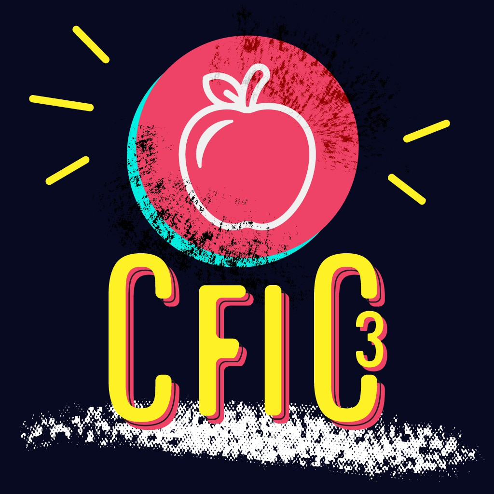

---
tags:
  - CFIC
  - CFIC3
---

# Catch French Intermediate Cup 3

La **Catch French Intermediate Cup 3** (***CFIC 3***) était un tournoi osu!catch intermédiaire français à double élimination en 1v1 organisé par ::{ flag=FR }:: [Hecatia15](https://osu.ppy.sh/users/3163012) et ::{ flag=FR }:: [YANOO123](https://osu.ppy.sh/users/5122949). Les joueurs français classés entre 900 et 2 999 ont pu participer. C'était la troisième édition de la Catch French Intermediate Cup et fait partie de la Catch French Cup.

## Dates du tournoi

| Évènement | Dates |
| --: | :-- |
| Phase d'inscription | 09/08/2021 - 29/08/2021 |
| Phase de screening | 30/08/2021 - 10/09/2021 |
| Live du tirage au sort | 05/09/2021 (18:00 UTC+2) |
| Qualifications | 11/09/2021 - 12/09/2021 |
| Huitièmes de finale | 18/09/2021 - 19/09/2021 |
| Quarts de finale | 25/09/2021 - 26/09/2021 |
| Demi-finales | 02/10/2021 - 03/10/2021 |
| Finales | 09/10/2021 - 10/10/2021 |
| Grande Finale | 17/10/2021 |

## Prix

| Classement | Prix |
| :-: | :-- |
|  | Badge de profil unique, 8 mois d'osu!supporter |
|  | 6 mois d'osu!supporter |
|  | 4 mois d'osu!supporter |
| *4ème place* | 2 mois d'osu!supporter |

## Organisation

La Catch French Intermediate Cup 3 était organisée par différents membres de la communauté.

| Position | Membre(s) |
| :-- | :-- |
| Organisateur | ::{ flag=FR }:: [Hecatia15](https://osu.ppy.sh/users/3163012), ::{ flag=FR }:: [YANOO123](https://osu.ppy.sh/users/5122949) |
| Mapsetter | ::{ flag=FR }:: [\_Manyura](https://osu.ppy.sh/users/8335913), ::{ flag=FR }:: [Hecatia15](https://osu.ppy.sh/users/3163012), ::{ flag=AT }:: [Mashiro Mama](https://osu.ppy.sh/users/10415976), ::{ flag=FR }:: [Natsuko](https://osu.ppy.sh/users/8266817), ::{ flag=FR }:: [Noctalium](https://osu.ppy.sh/users/6488167), ::{ flag=FR }:: [Oasix](https://osu.ppy.sh/users/6183012), ::{ flag=FR }:: [Realmas](https://osu.ppy.sh/users/6567640) |
| Arbitre | ::{ flag=FR }:: [Hecatia15](https://osu.ppy.sh/users/3163012), ::{ flag=FR }:: [Nyton](https://osu.ppy.sh/users/9475990), ::{ flag=FR }:: [Oasix](https://osu.ppy.sh/users/6183012), ::{ flag=FR }:: [Taevas](https://osu.ppy.sh/users/7276846), ::{ flag=FR }:: [Un bretzel](https://osu.ppy.sh/users/1542565), ::{ flag=FR }:: [YANOO123](https://osu.ppy.sh/users/5122949) |
| Streamer | ::{ flag=FR }:: [Noctalium](https://osu.ppy.sh/users/6488167), ::{ flag=FR }:: [Realmas](https://osu.ppy.sh/users/6567640), ::{ flag=FR }:: [Shamookie](https://osu.ppy.sh/users/12441210), ::{ flag=FR }:: [Shamookie Simp](https://osu.ppy.sh/users/15334170), ::{ flag=FR }:: [Un bretzel](https://osu.ppy.sh/users/1542565) |
| Commentateur | ::{ flag=FR }:: [\_Manyura](https://osu.ppy.sh/users/8335913), ::{ flag=FR }:: [AiNA](https://osu.ppy.sh/users/4426908), ::{ flag=FR }:: [Hecatia15](https://osu.ppy.sh/users/3163012), ::{ flag=FR }:: [JunKoAndHiro](https://osu.ppy.sh/users/14004732), ::{ flag=FR }:: [lgor](https://osu.ppy.sh/users/10769450), ::{ flag=FR }:: [Kitsuka](https://osu.ppy.sh/users/10334943), ::{ flag=FR }:: [Natsuko](https://osu.ppy.sh/users/8266817), ::{ flag=FR }:: [Realmas](https://osu.ppy.sh/users/6567640), ::{ flag=FR }:: [Shamookie Simp](https://osu.ppy.sh/users/15334170), ::{ flag=FR }:: [SkyBlazedPTK](https://osu.ppy.sh/users/8710703) ::{ flag=FR }:: [Yruama](https://osu.ppy.sh/users/8221467) |
| Designer | ::{ flag=ID }:: [fajar13k](https://osu.ppy.sh/users/7100002) |
| Statisticien | ::{ flag=FR }:: [YANOO123](https://osu.ppy.sh/users/5122949) |
| Rédacteur du wiki | ::{ flag=ID }:: [fajar13k](https://osu.ppy.sh/users/7100002) |

## Liens

- [Fil de discussion](https://osu.ppy.sh/community/forums/topics/1392589)
- [Serveur Discord du CFB](https://discord.gg/PEz2enJjUr)
- Livestream
  - [osufrlive](https://twitch.tv/osufrlive)
  - [osufrlive2](https://twitch.tv/osufrlive2)
  - [osufrlive3](https://twitch.tv/osufrlive3)
- [Tableaux Challonge](https://challonge.com/35tf5wf)
- **[Feuille de statistiques](https://docs.google.com/spreadsheets/d/1LanifzyLFqyF4KPqB9p1Ykk4pHFVEkAGO2QVMYJ8vYc/edit)**

## Participants

| Seed | Membres |
| :-- | :-- |
| Top | ::{ flag=FR }:: [AiNA](https://osu.ppy.sh/users/4426908), ::{ flag=FR }:: [Shamookie](https://osu.ppy.sh/users/12441210), ::{ flag=FR }:: [Shamookie Simp](https://osu.ppy.sh/users/15334170), ::{ flag=FR }:: [Yruama](https://osu.ppy.sh/users/8221467) |
| High | ::{ flag=FR }:: [Papy Enias](https://osu.ppy.sh/users/8384680), ::{ flag=FR }:: [floflim](https://osu.ppy.sh/users/5954015), ::{ flag=FR }:: [Cryophenix](https://osu.ppy.sh/users/3996466), ::{ flag=FR }:: [Bebar](https://osu.ppy.sh/users/12584928) |
| Low | ::{ flag=FR }:: [Trifano](https://osu.ppy.sh/users/15126172), ::{ flag=FR }:: [Kaudae](https://osu.ppy.sh/users/9294630), ::{ flag=FR }:: [caillrot](https://osu.ppy.sh/users/13108984), ::{ flag=FR }:: [wind in seoul](https://osu.ppy.sh/users/14803288) |
| Unseeded | ::{ flag=FR }:: [Le Gentil](https://osu.ppy.sh/users/14716810), ::{ flag=FR }:: [NoLimitFS](https://osu.ppy.sh/users/10411609), ::{ flag=FR }:: [Kanna\_Shiro](https://osu.ppy.sh/users/12943235), ::{ flag=FR }:: [BigNounours](https://osu.ppy.sh/users/11632258) |
| Éliminé | ::{ flag=FR }:: [ilade](https://osu.ppy.sh/users/18061899), ::{ flag=FR }:: [Jibsz](https://osu.ppy.sh/users/12269489), ::{ flag=FR }:: [redjiii](https://osu.ppy.sh/users/1378728) |

## Podium

Cette compétition s'est conclue sur le podium suivant :

| Classement | Joueur |
| :-: | :-- |
|  | ::{ flag=FR }:: [Yruama](https://osu.ppy.sh/users/8221467) |
|  | ::{ flag=FR }:: [AiNA](https://osu.ppy.sh/users/4426908) |
|  | ::{ flag=FR }:: [Cryophenix](https://osu.ppy.sh/users/3996466) |

## Liste des beatmaps

### Grande Finale

**[Téléchargez le beatmap pack ici ! (92 MB)](https://mega.nz/file/WlFwRTyJ#aeIPK5jkdbRzdAnv8oItejtaGLS2DsiEfeHi4e9KT3s)**

- NoMod
  1. [TERRASPEX - AMAZING BREAK (Spectator) \[CRYSTAL SPEC'S DELUGE\]](https://osu.ppy.sh/beatmapsets/727329#fruits/2404182)
  2. [Negentropy (a.k.a. Team Grimoire) - ouroVoros (autofanboy) \[du5t's overdose\]](https://osu.ppy.sh/beatmapsets/1087679#fruits/2279454)
  3. [wa. - Black Lotus (Natsuko) \[Fleur du Mal\]](https://osu.ppy.sh/beatmapsets/1471231#fruits/3020430)
  4. [IAHN - Transform (Original Mix) (JBHyperion) \[Nelly's Overdose\]](https://osu.ppy.sh/beatmapsets/1184890#fruits/2504148)
  5. [Tia - The Glory Days (Nara) \[Rainbow\]](https://osu.ppy.sh/beatmapsets/391953#fruits/853625)
  6. [Camellia - \*Feels Seasickness...\* (My Angel RangE) \[\*Feels HEAVENLY...\*\]](https://osu.ppy.sh/beatmapsets/914865#fruits/1929268)
- Hidden
  1. [UNDEAD CORPORATION - Everything will freeze Guitar Inst-hen (Du5t) \[Rain\]](https://osu.ppy.sh/beatmapsets/981773#fruits/2054797)
  2. [DJ TOTTO feat. Enako - Precious \* Star (Spectator) \[Overdose\]](https://osu.ppy.sh/beatmapsets/776495#fruits/1631467)
  3. [Umeboshi Chazuke - ICHIBANBOSHI\*ROCKET (Jemzuu) \[PLATTER\]](https://osu.ppy.sh/beatmapsets/1258751#fruits/2636873)
  4. [REOL - ChiruChiru (Pho) \[Scatter\]](https://osu.ppy.sh/beatmapsets/476697#fruits/1018250)
- HardRock
  1. [nanobii - HYPERDRIVE (Ascendance) \[Rain\]](https://osu.ppy.sh/beatmapsets/639991#fruits/1357223)
  2. [Gekidan Record - Babylonia (Ascendance) \[Another\]](https://osu.ppy.sh/beatmapsets/673602#fruits/1425525)
  3. [onoken - Amnolys (Syamu) \[Rain\]](https://osu.ppy.sh/beatmapsets/1231970#fruits/2561058)
  4. [Pastel\*Palettes - Happy Synthesizer (ktgster) \[Shizuku's Expert\]](https://osu.ppy.sh/beatmapsets/932654#fruits/1989990)
- DoubleTime
  1. [Uinyasu, Occhoko Bunny - Aa Kenran no Yume ga Gotoku (Epsilon Remix) (-Luminate) \[Platter\]](https://osu.ppy.sh/beatmapsets/1044161#fruits/2545299)
  2. [CELLON. - Virtual mode (JBHyperion) \[Platter\]](https://osu.ppy.sh/beatmapsets/1069501#fruits/2238804)
  3. [KATOMORI - Ever (Sanyi) \[Rain\]](https://osu.ppy.sh/beatmapsets/1096703#fruits/2291724)
  4. [Rita - Alea jacta est! (DELiS) \[Insane\]](https://osu.ppy.sh/beatmapsets/112150#fruits/291402)
- Tiebreaker
  1. **[Camellia feat. Nanahira - finorza (Natsuko) \[Natsuko & Noctalium's Ultimate End\]](https://osu.ppy.sh/beatmapsets/1599030#fruits/3265778)**

### Finales

**[Téléchargez le beatmap pack ici ! (110 MB)](https://mega.nz/file/Hp1zAQxK#dc3fFFUMqB-B-LwRo5YDWkJWeqKnfJM85F2yrfEJMqU)**

- NoMod
  1. [ShinRa-Bansho - Tsuki ni Murakumo Hana ni Kaze ShinRa-Bansho Ver (Spectator) \[Greaper's Overdose\]](https://osu.ppy.sh/beatmapsets/1267528#fruits/2635612)
  2. [ginkiha - Borealis (Noctalium) \[Overdose\]](https://osu.ppy.sh/beatmapsets/1593251#fruits/3254138)
  3. [Team Grimoire vs Laur - Grievous Lady (Nelly) \[Overdose\]](https://osu.ppy.sh/beatmapsets/1084668#fruits/2269729)
  4. [Kuroneko Dungeon - Ryoushi no Umi no Lindwurm (\[\_-Kukkai-\_\]) \[Overdose\]](https://osu.ppy.sh/beatmapsets/857537#fruits/1830273)
  5. [Kano - Daisy Blue (Rieri) \[Hope\]](https://osu.ppy.sh/beatmapsets/850717#fruits/1778560)
  6. [BlackY vs. Yooh - HAVOX (Realazy) \[Sulfur's GRAVITY\]](https://osu.ppy.sh/beatmapsets/823616#fruits/1760861)
- Hidden
  1. [Synthion - Aurora (wonjae) \[Syamu's Rain\]](https://osu.ppy.sh/beatmapsets/1290796#fruits/2686307)
  2. [DJ Fresh - Gold Dust (Natsuko) \[CFIC\]](https://osu.ppy.sh/beatmapsets/1593258#fruits/3254151)
  3. [HyuN feat. LyuU - Cross Over (Razor Sharp) \[Benita's Platter\]](https://osu.ppy.sh/beatmapsets/1233114#fruits/2680192)
  4. [DJ Okawari - Canon (Short Ver.) (backstep) \[Peaceful\]](https://osu.ppy.sh/beatmapsets/44305#fruits/138830)
- HardRock
  1. [Apink - %% (P A N) \[Rew's Rain\]](https://osu.ppy.sh/beatmapsets/908066#fruits/1927768)
  2. [HyuN feat. JeeE - Fallen Angel (autofanboy) \[Rain\]](https://osu.ppy.sh/beatmapsets/1141049#fruits/2468074)
  3. [Akiyama Uni - Kanpan Tasogare Shinbun (Ascendance) \[Piku's Rain\]](https://osu.ppy.sh/beatmapsets/633255#fruits/1486309)
  4. [Yooh - snow storm -euphoria- (-Chata-) \[EXHAUST\]](https://osu.ppy.sh/beatmapsets/156235#fruits/382887)
- DoubleTime
  1. [Hierograph - Chi no Iro wa Kiiro (Spectator) \[Platter\]](https://osu.ppy.sh/beatmapsets/1317145#fruits/3013430)
  2. [Warak - REANIMATE (- Magic Bomb -) \[ZiRoX's Platter\]](https://osu.ppy.sh/beatmapsets/489190#fruits/1042704)
  3. [Kaneko Chiharu - WHITEOUT (Razor Sharp) \[AFB'S EXHAUST\]](https://osu.ppy.sh/beatmapsets/1161795#fruits/2429414)
  4. [AZKi - Aoi Yume (domSaur) \[Insane\]](https://osu.ppy.sh/beatmapsets/1222587#fruits/2542939)
- Tiebreaker
  1. **[marina - Towa yori Towa ni (-Luminate) \[Imperishable\]](https://osu.ppy.sh/beatmapsets/962747#fruits/2015842)**

### Demi-finales

**[Téléchargez le beatmap pack ici ! (82 MB)](https://mega.nz/file/vxswVRZC#uXZbQu_Ydpe65_3Fa60IY896obb1ZwYav_Og75kgvFI)**

- NoMod
  1. [ABSOLUTE CASTAWAY - Shinsou Shintouron (-Luminate) \[Overdose\]](https://osu.ppy.sh/beatmapsets/1286508#fruits/2696508)
  2. [TERRA - EDEN (Natsuko) \[CFIC\]](https://osu.ppy.sh/beatmapsets/1587389#fruits/3241983)
  3. [Nizikawa - F.K.S. (-MomoX) \[GIGACHAD'S INFINITE\]](https://osu.ppy.sh/beatmapsets/1421209#fruits/3002876)
  4. [Foreground Eclipse - Truths, Ironies, The Secret Lyrics (Seni) \[Akitoshi's Expert\]](https://osu.ppy.sh/beatmapsets/944514#fruits/2357806)
  5. [Feryquitous - I can avoid it.#owo (Natsume Shiki) \[Chaos\]](https://osu.ppy.sh/beatmapsets/1157872#fruits/2416428)
- Hidden
  1. [Tsukuyomi - Moonlight at midday (Crowley) \[Rain\]](https://osu.ppy.sh/beatmapsets/1539314#fruits/3154744)
  2. [kamome sano Electric Orchestra - FIN4LE \~Shuushisen no Kanata e\~ (\[\_-Kukkai-\_\]) \[EXHAUST\]](https://osu.ppy.sh/beatmapsets/1518662#fruits/3129760)
  3. [xi - Bad Elixir (Cherry Blossom) \[Hyper\]](https://osu.ppy.sh/beatmapsets/878944#fruits/1882215)
- HardRock
  1. [F-777 - Airborne Robots (JBHyperion) \[Platter\]](https://osu.ppy.sh/beatmapsets/419373#fruits/939929)
  2. [kors k - Playing With Fire (Sota Fujimori Remix) (Ascendance) \[White Hard\]](https://osu.ppy.sh/beatmapsets/683343#fruits/1577675)
  3. [DJ Siesta - Another Day (Streliteela) \[Another\]](https://osu.ppy.sh/beatmapsets/354179#fruits/791390)
- DoubleTime
  1. [ke-ji feat. Nanahira - Ange du Blanc Pur (My Angel RangE) \[Platter\]](https://osu.ppy.sh/beatmapsets/1395989#fruits/2887178)
  2. [SEREBRO - Mi Mi Mi (Sped Up Ver.) (Imai Lisa) \[Platter\]](https://osu.ppy.sh/beatmapsets/1016210#fruits/2126866)
  3. [Pendulum - Crush (Radio Edit) (JauiPlaY) \[Insane\]](https://osu.ppy.sh/beatmapsets/58329#fruits/175397)
- Tiebreaker
  1. **[Camellia as "Reverse of Riot" - Completeness Under Incompleteness ("true prooF" Long ver.) (Rocma) \[Overdose\]](https://osu.ppy.sh/beatmapsets/1293903#fruits/2705426)**

### Quarts de finale

**[Téléchargez le beatmap pack ici ! (98 MB)](https://mega.nz/file/HsElWKgb#BhRQffV33suyx8EX5LfjI1fQHoDXqYFHHNEZHoa1c6E)**

- NoMod
  1. [Ayalis - Ai o Chikaishi Hime Kazari (Spectator) \[Overdose\]](https://osu.ppy.sh/beatmapsets/784412#fruits/2741516)
  2. [Hyuji feat. LIQU@. - Mermaid girl (Tropical Remix) (Natsuko) \[Masko's Overdose\]](https://osu.ppy.sh/beatmapsets/1548350#fruits/3196485)
  3. [DJ Totoriott - Chronoxia (Kyuare) \[Furely's Overdose\]](https://osu.ppy.sh/beatmapsets/429184#fruits/928522)
  4. [BUTAOTOME - Futari Dake no Kotoba (celerih) \[Together\]](https://osu.ppy.sh/beatmapsets/962568#fruits/2015483)
  5. [kamome sano - archive::zip (Realazy) \[hypercyte's Expert (#5)\]](https://osu.ppy.sh/beatmapsets/1060190#fruits/2219882)
- Hidden
  1. [dark cat - STARS ALIGN (wonjae) \[Collab Rain\]](https://osu.ppy.sh/beatmapsets/1055938#fruits/2206832)
  2. [Hino Isuka - Dreamin' attraction!! (Jemzuu) \[Platter\]](https://osu.ppy.sh/beatmapsets/1404850#fruits/2913077)
  3. [Koshimizu Sachiko (CV: Taketatsu Ayana) - To my darling... (Shunao) \[My Dear Darling...\]](https://osu.ppy.sh/beatmapsets/797169#fruits/1674194)
- HardRock
  1. [Sakuzyo - Magical Musical Master (Rocma) \[Platter\]](https://osu.ppy.sh/beatmapsets/1097927#fruits/2294953)
  2. [Memme - Cherry Blossom (Spectator) \[Platter\]](https://osu.ppy.sh/beatmapsets/486424#fruits/1047736)
  3. [Kaneko Chiharu - Lachryma\<Re:Queen'M\> (Kroytz) \[Fizz's ADVANCED\]](https://osu.ppy.sh/beatmapsets/475629#fruits/1236683)
- DoubleTime
  1. [BAND-MAID - Choose me (Ascendance) \[wonjae's Platter\]](https://osu.ppy.sh/beatmapsets/1032794#fruits/2159371)
  2. [Imagine Dragons - Warriors (Minato Yukina) \[Gold\]](https://osu.ppy.sh/beatmapsets/832873#fruits/1745773)
  3. [Hommarju feat. Latte - masterpiece (happy30) \[taka's Insane\]](https://osu.ppy.sh/beatmapsets/14592#fruits/60276)
- Tiebreaker
  1. **[Chata - enn (Spectator) \[The Melody of Wish, Desires\]](https://osu.ppy.sh/beatmapsets/692979#fruits/1466362)**

### Huitièmes de finale

**[Téléchargez le beatmap pack ici ! (105 MB)](https://mega.nz/file/Wl9yGIaI#H97QzW9nfDFFcRmvxiWZgKLFQqeT8exABjjMDU1J1Tw)**

- NoMod
  1. [Mili - Ga1ahad and Scientific Witchery (Benita) \[Lacrima's Incantation\]](https://osu.ppy.sh/beatmapsets/1361768#fruits/2817663)
  2. [Feint - Face Down (Cut Ver.) (Nelly) \[Overdrive\]](https://osu.ppy.sh/beatmapsets/1376539#fruits/2845062)
  3. [RoughSketch - Ghost Family Living In Graveyard (Natsuko) \[CFIC\]](https://osu.ppy.sh/beatmapsets/1575501#fruits/3216685)
  4. [fourfolium - Hosshii no! (Kisses) \[Kalibe's Extra!\]](https://osu.ppy.sh/beatmapsets/586877#fruits/1248887)
  5. [Tyrfing - Verflucht (Muya) \[Another\]](https://osu.ppy.sh/beatmapsets/965125#fruits/2045906)
- Hidden
  1. [Neru - Byoumei wa Ai Datta (Ellyu) \[Naniwa's Rain\]](https://osu.ppy.sh/beatmapsets/684960#fruits/2193225)
  2. [KaratoPanchiiShounen feat. Haruno - A Wandering Melody of Love (dika312) \[Platter\]](https://osu.ppy.sh/beatmapsets/1377695#fruits/2892047)
  3. [Matsuda Arisa (CV: Murakawa Rie) - Chou Jou Genki Show\*Idol ch@ng! (\_Star) \[Ins@ne\]](https://osu.ppy.sh/beatmapsets/911255#fruits/1901804)
- HardRock
  1. [Camellia - #1f1e33 (Bunnrei) \[Salad\]](https://osu.ppy.sh/beatmapsets/1403838#fruits/2895472)
  2. [onumi - PERSONALITY (Ascendance) \[AJAMEZ'S SALAD\]](https://osu.ppy.sh/beatmapsets/933984#fruits/1995049)
  3. [Noah - Celestial stinger (Kroytz) \[Kyuukai's ADVANCED\]](https://osu.ppy.sh/beatmapsets/687129#fruits/1454086)
- DoubleTime
  1. [Goose house - 18sai (mingmichael) \[Platter\]](https://osu.ppy.sh/beatmapsets/242856#fruits/560407)
  2. [Syaro(CV.Uchida Maaya) - Caffeine Fighter (Ascendance) \[Platter\]](https://osu.ppy.sh/beatmapsets/538511#fruits/1219314)
  3. [Iwadare Noriyuki - Mikata 7 [Last Battle] (mezelyus) \[Finale\]](https://osu.ppy.sh/beatmapsets/1123907#fruits/2348523)
- Tiebreaker
  1. **[Zedd - Clarity feat. Foxes (kamome sano remix) (Ascendance) \[Ambivalence\]](https://osu.ppy.sh/beatmapsets/570924#fruits/1740665)**

### Qualifications

**[Téléchargez le beatmap pack ici ! (43 MB)](https://mega.nz/file/Hw8HXAJQ#RgksI_VDHlWBo9Gozsbq2n4H78JbZ6q9BbWWn5ufJMg)**

- NoMod
  1. [Shiena Nishizawa - FUBUKI (Secre) \[Shoukaku\]](https://osu.ppy.sh/beatmapsets/1041651#fruits/2177029)
  2. [ayaponzu\* - Yakubyougami (Pho) \[Insane\]](https://osu.ppy.sh/beatmapsets/501001#fruits/1066244)
- Hidden
  1. [Feint & Boyinaband - Time Bomb (feat. Veela) (IDu5t) \[Rain\]](https://osu.ppy.sh/beatmapsets/912369#fruits/1905954)
- HardRock
  1. [Ci Mei Gui - Wu Xuan Lan (Bastian) \[Rain\]](https://osu.ppy.sh/beatmapsets/1207212#fruits/2513982)
- DoubleTime
  1. [siromaru + cranky - conflict (Bunnrei) \[Platter\]](https://osu.ppy.sh/beatmapsets/981762#fruits/2055786)

## Résultats des matchs

### Grande Finale

Dimanche 17 octobre 2021 :

| Joueur 1 |  |  | Joueur 2 | Lien du match |
| --: | :-: | :-: | :-- | :-- |
| AiNA ::{ flag=FR }:: | 3 | **7** | ::{ flag=FR }:: **Yruama** | [#1](https://osu.ppy.sh/community/matches/92544971 ) |
| **Yruama** ::{ flag=FR }:: | **7** | 4 | ::{ flag=FR }:: AiNA | [#1](https://osu.ppy.sh/community/matches/92548424) |

### Finales

Samedi 9 octobre 2021 :

| Joueur 1 |  |  | Joueur 2 | Lien du match |
| --: | :-: | :-: | :-- | :-- |
| **Yruama** ::{ flag=FR }:: | **7** | 3 | ::{ flag=FR }:: floflim | [#1](https://osu.ppy.sh/community/matches/92162893 ) |
| **AiNA** ::{ flag=FR }:: | **7** | 1 | ::{ flag=FR }:: Cryophenix | [#1](https://osu.ppy.sh/community/matches/92148642 ) |

Dimanche 10 octobre 2021 :

| Joueur 1 |  |  | Joueur 2 | Lien du match |
| --: | :-: | :-: | :-- | :-- |
| Cryophenix ::{ flag=FR }:: | 2 | **7** | ::{ flag=FR }:: **Yruama** | [#1](https://osu.ppy.sh/community/matches/92206006) |

### Demi-finales

Samedi 2 octobre 2021 :

| Joueur 1 |  |  | Joueur 2 | Lien du match |
| --: | :-: | :-: | :-- | :-- |
| **Papy Enias** ::{ flag=FR }:: | **6** | 5 | ::{ flag=FR }:: Trifano | [#1](https://osu.ppy.sh/community/matches/91806838) |
| **Bebar** ::{ flag=FR }:: | **6** | 5 | ::{ flag=FR }:: Shamookie | [#1](https://osu.ppy.sh/community/matches/91803843) |
| **Cryophenix** ::{ flag=FR }:: | **6** | 5 | ::{ flag=FR }:: floflim | [#1](https://osu.ppy.sh/community/matches/91824771) |

Dimanche 3 octobre 2021 :

| Joueur 1 |  |  | Joueur 2 | Lien du match |
| --: | :-: | :-: | :-- | :-- |
| **AiNA** ::{ flag=FR }:: | **6** | 3 | ::{ flag=FR }:: Yruama | [#1](https://osu.ppy.sh/community/matches/91858536) |
| **Yruama** ::{ flag=FR }:: | **6** | 2 | ::{ flag=FR }:: Bebar | [#1](https://osu.ppy.sh/community/matches/91862769) |
| **floflim** ::{ flag=FR }:: | **6** | 2 | ::{ flag=FR }:: Papy Enias | [#1](https://osu.ppy.sh/community/matches/91868465) |

### Quarts de finale

Mardi 21 septembre 2021 :

| Joueur 1 |  |  | Joueur 2 | Lien du match |
| --: | :-: | :-: | :-- | :-- |
| Shamookie Simp ::{ flag=FR }:: | 4 | **5** | ::{ flag=FR }:: **floflim** | [#1](https://osu.ppy.sh/community/matches/91264199) |

Samedi 25 septembre 2021 :

| Joueur 1 |  |  | Joueur 2 | Lien du match |
| --: | :-: | :-: | :-- | :-- |
| BigNounours ::{ flag=FR }:: | 1 | **5** | ::{ flag=FR }:: **Bebar** | [#1](https://osu.ppy.sh/community/matches/91454147) |
| Le Gentil ::{ flag=FR }:: | -1 | **0** | ::{ flag=FR }:: **wind in seoul** | *victoire par défaut* |
| **Kanna\_Shiro** ::{ flag=FR }:: | **0** | -1 | ::{ flag=FR }:: Kaudae | *victoire par défaut* |
| **NoLimitFS** ::{ flag=FR }:: | **5** | 4 | ::{ flag=FR }:: caillrot | [#1](https://osu.ppy.sh/community/matches/91477795) |
| **AiNA** ::{ flag=FR }:: | **5** | 3 | ::{ flag=FR }:: Trifano | [#1](https://osu.ppy.sh/community/matches/91469409) |
| **Yruama** ::{ flag=FR }:: | **5** | 1 | ::{ flag=FR }:: Papy Enias | [#1](https://osu.ppy.sh/community/matches/91477795) |
| Shamookie ::{ flag=FR }:: | 0 | **5** | ::{ flag=FR }:: **Cryophenix** | [#1](https://osu.ppy.sh/community/matches/91465967) |

Dimanche 26 septembre 2021 :

| Joueur 1 |  |  | Joueur 2 | Lien du match |
| --: | :-: | :-: | :-- | :-- |
| **Trifano** ::{ flag=FR }:: | **5** | 1 | ::{ flag=FR }:: NoLimitFS | [#1](https://osu.ppy.sh/community/matches/91526055) |
| **Papy Enias** ::{ flag=FR }:: | **0** | -1 | ::{ flag=FR }:: Kanna\_Shiro | *victoire par défaut* |
| **Shamookie** ::{ flag=FR }:: | **5** | 1 | ::{ flag=FR }:: wind in seoul | [#1](https://osu.ppy.sh/community/matches/91517924), [#2](https://osu.ppy.sh/community/matches/91519293) |
| Shamookie Simp ::{ flag=FR }:: | -1 | **0** | ::{ flag=FR }:: **Bebar** | *victoire par défaut* |

### Huitièmes de finale

Samedi 18 septembre 2021 :

| Joueur 1 |  |  | Joueur 2 | Lien du match |
| --: | :-: | :-: | :-- | :-- |
| **Papy Enias** ::{ flag=FR }:: | **5** | 0 | ::{ flag=FR }:: wind in seoul | [#1](https://osu.ppy.sh/community/matches/91113223) |
| **Shamookie Simp** ::{ flag=FR }:: | **5** | 0 | ::{ flag=FR }:: NoLimitFS | [#1](https://osu.ppy.sh/community/matches/91109773) |
| **floflim** ::{ flag=FR }:: | **5** | 1 | ::{ flag=FR }:: caillrot | [#1](https://osu.ppy.sh/community/matches/91107241) |

Dimanche 19 septembre 2021 :

| Joueur 1 |  |  | Joueur 2 | Lien du match |
| --: | :-: | :-: | :-- | :-- |
| Bebar ::{ flag=FR }:: | 3 | **5** | ::{ flag=FR }:: **Trifano** | [#1](https://osu.ppy.sh/community/matches/91159737) |
| **Yruama** ::{ flag=FR }:: | **5** | 0 | ::{ flag=FR }:: Le Gentil | [#1](https://osu.ppy.sh/community/matches/91165028) |
| **AiNA** ::{ flag=FR }:: | **0** | -1 | ::{ flag=FR }:: BigNounours | *victoire par défaut* |
| **Shamookie** ::{ flag=FR }:: | **5** | 3 | ::{ flag=FR }:: Kanna\_Shiro | [#1](https://osu.ppy.sh/community/matches/91171042) |
| **Cryophenix** ::{ flag=FR }:: | **5** | 1 | ::{ flag=FR }:: Kaudae | [#1](https://osu.ppy.sh/community/matches/91158736) |

### Qualifications

Les statistiques détaillées de ce tour peuvent être trouvées [ici](https://docs.google.com/spreadsheets/d/1LanifzyLFqyF4KPqB9p1Ykk4pHFVEkAGO2QVMYJ8vYc/edit), ainsi que le classement final montrant quel joueur s'est qualifié pour l'étape suivante.

## Règlement

### Règles générales

1. Vous devez être entre le rang 900 et 2 999 au classement général pendant la phase d'inscriptions.
2. Les scores seront en **ScoreV2**.
3. Un retard de plus de **10 minutes** à un match entrainera une victoire par défaut pour l'autre joueur.
4. Même lors d'un tournoi, osu! reste un jeu, soyez amicaux et fair play.
5. La Catch French Intermediate Cup 3 sera en double-élimination, ce qui signifie qu'il y aura un loser's bracket.
6. N'importe quel joueur francophone peut participer au tournoi.

### Règlements des matchs

1. Les joueurs lanceront un `!roll` au début du match pour déterminer l'ordre des choix : Le gagnant du roll ban en second et pick en premier, le perdant du roll ban en premier et pick en second.
2. Les warm-up sont interdits, soyez sûr d'être bien échauffé avant de jouer votre match.
3. En ce qui concerne les bans de maps, les quantités de maps qui peuvent être ban sont les suivantes :
   - Des huitièmes de finale aux demi-finales, chaque joueur bannira 1 map par match.
   - Lors des finales et des grandes finales, chaque joueur bannira 2 maps par match.
4. Les scores fail comptent. Avec cela, le mod NoFail sera forcé pour tout le monde.
5. Un même joueur n'a pas le droit de ban et de pick le même mod deux fois d'affilée.
6. Les joueurs seront forcés de prendre un mod sur un pick FreeMod.
7. Le Hidden est autorisé en HardRock et DoubleTime.
8. Le Tiebreaker est joué en NoMod ou en Hidden uniquement.

### Conditions de victoire

1. Huitièmes de finale et Quarts de finale : Best-of-9 (premier à 5 points)
2. Demi-finales : Best-of-11 (premier à 6 points)
3. **Finales et Grande Finale** : Best-of-13 (premier à 7 points)
