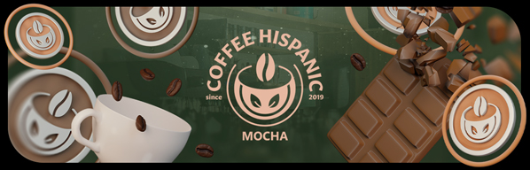

---
tags:
  - CHM
  - CHM1
  - CHM 1
  - CH:M
  - CH:M1
  - CH:M 1
---

# Coffee Hispanic: Mocha

The **Coffee Hispanic: Mocha** (***CH:M***) was a double-elimination 1v1 osu! tournament hosted by ::{ flag=AR }:: [Vaf](https://osu.ppy.sh/users/12589048) and ::{ flag=MX }:: [Atsuro](https://osu.ppy.sh/users/2279351). The tournament was open to all players from all Spanish-speaking countries as listed by the [Ver País website](https://www.verpais.com/) (::{ flag=AR }:: Argentina, ::{ flag=BO }:: Bolivia, ::{ flag=CL }:: Chile, ::{ flag=CO }:: Colombia, ::{ flag=CR }:: Costa Rica, ::{ flag=CU }:: Cuba, ::{ flag=DO }:: Dominican Republic, ::{ flag=EC }:: Ecuador, ::{ flag=GQ }:: Equatorial Guinea, ::{ flag=SV }:: El Salvador, ::{ flag=GT }:: Guatemala, ::{ flag=HN }:: Honduras, ::{ flag=MX }:: Mexico, ::{ flag=PA }:: Panama, ::{ flag=PY }:: Paraguay, ::{ flag=PE }:: Peru, ::{ flag=PR }:: Puerto Rico, ::{ flag=ES }:: Spain, ::{ flag=UY }:: Uruguay, and ::{ flag=VE }:: Venezuela) regardless of rank. It was the third instalment of the Coffee Hispanic series.

## Tournament schedule

| Event | Timestamp |
| --: | :-- |
| Registration phase | 2021-07-17/2021-07-31 |
| Screening phase | 2021-08-01/2021-08-09 |
| Qualifiers | 2021-08-10/2021-08-16 |
| Swiss round (week 1) | 2021-08-17/2021-08-23 |
| Swiss round (week 2) | 2021-08-24/2021-08-30 |
| Swiss round (week 3) | 2021-08-31/2021-09-05 |
| Round of 16 | 2021-09-06/2021-09-12 |
| Quarterfinals | 2021-09-13/2021-09-19 |
| Semifinals | 2021-09-20/2021-09-26 |
| Finals (week 1) | 2021-09-27/2021-10-03 |
| Finals (week 2) | 2021-10-04/2021-10-10 |

## Prizes

| Placing | Prize(s) |
| :-: | :-- |
|  | 100 USD, physical trophy, [One by Wacom](http://www.wacom.com/en-id/products/pen-tablets/one-by-wacom) graphic tablet, unique profile badge, commemorative banner |
|  | Physical trophy, commemorative banner |
|  | Physical trophy, commemorative banner |

## Organisation

Coffee Hispanic: Mocha was run by various osu! community members, many of whom are Spanish speakers or hailing from Spanish-speaking countries.

| Position | Member(s) |
| :-- | :-- |
| Host | ::{ flag=AR }:: [Vaf](https://osu.ppy.sh/users/12589048), ::{ flag=MX }:: [Atsuro](https://osu.ppy.sh/users/2279351) |
| Mappool selector | ::{ flag=MX }:: [Atsuro](https://osu.ppy.sh/users/2279351), ::{ flag=CA }:: [Legless](https://osu.ppy.sh/users/3224243), ::{ flag=AT }:: [Omgforz](https://osu.ppy.sh/users/578943), ::{ flag=GB }:: [AlexDark69](https://osu.ppy.sh/users/5146647), ::{ flag=US }:: [ChillierPear](https://osu.ppy.sh/users/9501251) |
| Streamer | ::{ flag=AR }:: [Vaf](https://osu.ppy.sh/users/12589048), ::{ flag=MX }:: [Atsuro](https://osu.ppy.sh/users/2279351), ::{ flag=ES }:: [Nara\_NB](https://osu.ppy.sh/users/3593992), ::{ flag=CL }:: [kanocchi 3](https://osu.ppy.sh/users/28774983), ::{ flag=AR }:: [Keyz](https://osu.ppy.sh/users/10408325), ::{ flag=ES }:: [Moewagon](https://osu.ppy.sh/users/5764169), ::{ flag=US }:: [Xpekade](https://osu.ppy.sh/users/10775293), ::{ flag=DE }:: [Sayira](https://osu.ppy.sh/users/7253958) |
| Commentator | ::{ flag=AR }:: [Vaf](https://osu.ppy.sh/users/12589048), ::{ flag=MX }:: [Atsuro](https://osu.ppy.sh/users/2279351), ::{ flag=ES }:: [E R N E S T O](https://osu.ppy.sh/users/2127413), ::{ flag=ES }:: [Margo](https://osu.ppy.sh/users/6995685), ::{ flag=AR }:: [Amuro](https://osu.ppy.sh/users/7119659), ::{ flag=ES }:: [Silver Falco](https://osu.ppy.sh/users/6573997), ::{ flag=ES }:: [AitorAmu](https://osu.ppy.sh/users/7781304), ::{ flag=AR }:: [Gatuto](https://osu.ppy.sh/users/3583351), ::{ flag=AR }:: [Penguo](https://osu.ppy.sh/users/4389490) |
| Referee | ::{ flag=ES }:: [E R N E S T O](https://osu.ppy.sh/users/2127413), ::{ flag=ES }:: [Margo](https://osu.ppy.sh/users/6995685), ::{ flag=ES }:: [Bubble-](https://osu.ppy.sh/users/10559526), ::{ flag=AR }:: [Fede](https://osu.ppy.sh/users/8851834), ::{ flag=AR }:: [-Fede](https://osu.ppy.sh/users/5273729), ::{ flag=ES }:: [SansREPZ](https://osu.ppy.sh/users/8865297), ::{ flag=AR }:: [elcho](https://osu.ppy.sh/users/11276129), ::{ flag=CO }:: [Vanilla Aiz](https://osu.ppy.sh/users/12261024), ::{ flag=ES }:: [Milasus](https://osu.ppy.sh/users/3359440), ::{ flag=AR }:: [Joaco](https://osu.ppy.sh/users/9828202), ::{ flag=AR }:: [Yorumi-](https://osu.ppy.sh/users/7755726), ::{ flag=CO }:: [hlv](https://osu.ppy.sh/users/8921554), ::{ flag=AR }:: [Shig](https://osu.ppy.sh/users/6117281), ::{ flag=AR }:: [elcho](https://osu.ppy.sh/users/11276129), ::{ flag=US }:: [Raoul](https://osu.ppy.sh/users/9924405), ::{ flag=US }:: [Nambulance](https://osu.ppy.sh/users/13034610), ::{ flag=KR }:: [Civil oath](https://osu.ppy.sh/users/3216107), ::{ flag=US }:: [tigereyes144](https://osu.ppy.sh/users/6499811), ::{ flag=VN }:: [Vespulaz](https://osu.ppy.sh/users/10848857), ::{ flag=BR }:: [LeoFLT](https://osu.ppy.sh/users/3668779), ::{ flag=AT }:: [Yasuho](https://osu.ppy.sh/users/8458835), ::{ flag=BR }:: [DizzyH](https://osu.ppy.sh/users/9896172), ::{ flag=FR }:: [Aidown](https://osu.ppy.sh/users/1522146), ::{ flag=DE }:: [Bakugo-](https://osu.ppy.sh/users/4990127), ::{ flag=BR }:: [Checha](https://osu.ppy.sh/users/10157694), ::{ flag=DE }:: [GDLenny](https://osu.ppy.sh/users/8406711), ::{ flag=GB }:: [SteffoST](https://osu.ppy.sh/users/6566765), ::{ flag=US }:: [Xpekade](https://osu.ppy.sh/users/10775293), ::{ flag=US }:: [Kyrie irving](https://osu.ppy.sh/users/7545218), ::{ flag=PL }:: [P a t r i c k](https://osu.ppy.sh/users/6814521), ::{ flag=TW }:: [Imokora](https://osu.ppy.sh/users/2472609), ::{ flag=CA }:: [Rijrya](https://osu.ppy.sh/users/11186709), ::{ flag=US }:: [moss-](https://osu.ppy.sh/users/9918921) |
| Graphic designer | ::{ flag=ES }:: [Nara\_NB](https://osu.ppy.sh/users/3593992), ::{ flag=EC }:: [iSmileZ](https://osu.ppy.sh/users/10081404), ::{ flag=PL }:: [PSCHC](https://osu.ppy.sh/users/8688946) |
| Wiki editor | ::{ flag=ID }:: [Niva](https://osu.ppy.sh/users/197805) |

## Links

- **[Official Coffee Hispanic website](https://www.coffeehispanic.com/)**
- **[Main spreadsheet](https://docs.google.com/spreadsheets/d/1Ijhcgg3Ix78r2hPaR1hzckzMqEdJdeJdUAShyLHfFx4/edit#gid=1795322876)**
- [Forum thread](https://osu.ppy.sh/community/forums/topics/1373908)
- [Discord server](https://discord.com/invite/baVKCzU)
- [Challonge brackets](https://challonge.com/CofeeHispanicMocha)
- [Livestream channel](https://www.twitch.tv/coffeehispanic)
- [Pick'ems page](https://pickem.hwc.hr/tournaments/39) (organised by ::{ flag=DE }:: [hallowatcher](https://osu.ppy.sh/users/1874761))

## Participants

Listed below are the players who managed to qualify into their respective division's Swiss round (along with their seed number and average map rank combined from each individual Qualifier beatmaps) out of 318 registered players in total.

### Latinoamerica Norte division

| Seed No. | Player | Avg. Map Rank |
| :-: | :-- | :-- |
| 1 | ::{ flag=PE }:: [Arnold24x24](https://osu.ppy.sh/users/2291265) | 3.1 |
| 2 | ::{ flag=PA }:: [hammytr](https://osu.ppy.sh/users/11562243) | 4.1 |
| 3 | ::{ flag=DO }:: [Skill](https://osu.ppy.sh/users/7802027) | 5.1 |
| 4 | ::{ flag=MX }:: [-Wolfy-](https://osu.ppy.sh/users/4497582) | 5.7 |
| 5 | ::{ flag=MX }:: [-Hebel-](https://osu.ppy.sh/users/6169483) | 9.5 |
| 6 | ::{ flag=PE }:: [Judani](https://osu.ppy.sh/users/6787898) | 9.8 |
| 7 | ::{ flag=MX }:: [SaintSFT](https://osu.ppy.sh/users/14970132) | 10.3 |
| 8 | ::{ flag=MX }:: [Riot](https://osu.ppy.sh/users/4256461) | 10.8 |
| 9 | ::{ flag=MX }:: [Flameshock](https://osu.ppy.sh/users/8349047) | 12.2 |
| 10 | ::{ flag=MX }:: [pundice](https://osu.ppy.sh/users/7940696) | 13.2 |
| 11 | ::{ flag=CO }:: [Rushy](https://osu.ppy.sh/users/5281857) | 15.4 |
| 12 | ::{ flag=DO }:: [WillLITE](https://osu.ppy.sh/users/6677788) | 15.5 |
| 13 | ::{ flag=MX }:: [Andros](https://osu.ppy.sh/users/9072586) | 15.7 |
| 14 | ::{ flag=MX }:: [Camberos](https://osu.ppy.sh/users/2553519) | 17.7 |
| 15 | ::{ flag=CO }:: [Carlosflow](https://osu.ppy.sh/users/11940767) | 17.9 |
| 16 | ::{ flag=CO }:: [xHei\_57](https://osu.ppy.sh/users/1770700) | 18.0 |
| 17 | ::{ flag=VE }:: [AR9](https://osu.ppy.sh/users/5136821) | 18.8 |
| 18 | ::{ flag=MX }:: [Jalepers](https://osu.ppy.sh/users/7341086) | 19.0 |
| 19 | ::{ flag=MX }:: [sigmadroid](https://osu.ppy.sh/users/665148) | 19.4 |
| 20 | ::{ flag=MX }:: [KevstracK](https://osu.ppy.sh/users/5325213) | 21.6 |
| 21 | ::{ flag=MX }:: [Siros](https://osu.ppy.sh/users/3787685) | 23.0 |
| 22 | ::{ flag=CO }:: [ElMick11](https://osu.ppy.sh/users/10510143) | 25.9 |
| 23 | ::{ flag=CO }:: [ElMick13](https://osu.ppy.sh/users/3562488) | 26.1 |
| 24 | ::{ flag=PE }:: [Trint](https://osu.ppy.sh/users/10670748) | 26.2 |

### Latinoamerica Sur division

| Seed No. | Player | Avg. Map Rank |
| :-: | :-- | :-- |
| 1 | ::{ flag=CL }:: [Intercambing](https://osu.ppy.sh/users/2546001) | 6.4 |
| 2 | ::{ flag=AR }:: [Pein](https://osu.ppy.sh/users/2212941) | 9.3 |
| 3 | ::{ flag=AR }:: [Emiro Ikuno 2](https://osu.ppy.sh/users/9393446) | 10.7 |
| 4 | ::{ flag=AR }:: [un perro](https://osu.ppy.sh/users/6573651) | 11.2 |
| 5 | ::{ flag=UY }:: [Rebo](https://osu.ppy.sh/users/6942259) | 12.7 |
| 6 | ::{ flag=AR }:: [Amuro](https://osu.ppy.sh/users/7119659) | 12.8 |
| 7 | ::{ flag=CL }:: [Kuromiau](https://osu.ppy.sh/users/2347281) | 13.0 |
| 8 | ::{ flag=AR }:: [Lexalia](https://osu.ppy.sh/users/1887616) | 13.8 |
| 9 | ::{ flag=CL }:: [Pancho](https://osu.ppy.sh/users/11305398) | 14.4 |
| 10 | ::{ flag=CL }:: [Mathi](https://osu.ppy.sh/users/5339515) | 15.4 |
| 11 | ::{ flag=UY }:: [daanit](https://osu.ppy.sh/users/6159669) | 16.0 |
| 12 | ::{ flag=AR }:: [Ceja](https://osu.ppy.sh/users/4185921) | 17.3 |
| 13 | ::{ flag=CL }:: [NO37](https://osu.ppy.sh/users/4653583) | 18.4 |
| 14 | ::{ flag=AR }:: [Penguo](https://osu.ppy.sh/users/4389490) | 18.5 |
| 15 | ::{ flag=CL }:: [kanocchi](https://osu.ppy.sh/users/2321050) | 18.6 |
| 16 | ::{ flag=CL }:: [Gonzah](https://osu.ppy.sh/users/12434652) | 18.7 |
| 17 | ::{ flag=CL }:: [DaiixD](https://osu.ppy.sh/users/7479242) | 20.4 |
| 18 | ::{ flag=CL }:: [xaxreid](https://osu.ppy.sh/users/4227431) | 21.3 |
| 19 | ::{ flag=UY }:: [Kazuki K](https://osu.ppy.sh/users/6407282) | 21.4 |
| 20 | ::{ flag=UY }:: [Rondro](https://osu.ppy.sh/users/9293124) | 22.9 |
| 21 | ::{ flag=CL }:: [ChUbi](https://osu.ppy.sh/users/9589295) | 23.3 |
| 22 | ::{ flag=AR }:: [BTG4](https://osu.ppy.sh/users/10659233) | 23.7 |
| 23 | ::{ flag=CL }:: [mocaccino](https://osu.ppy.sh/users/5252968) | 24.4 |
| 24 | ::{ flag=AR }:: [Kaoshii](https://osu.ppy.sh/users/7807935) | 24.6 |

### España division

| Seed No. | Player | Avg. Map Rank |
| :-: | :-- | :-- |
| 1 | ::{ flag=ES }:: [A N T O N I O](https://osu.ppy.sh/users/12760743) | 2.1 |
| 2 | ::{ flag=ES }:: [kazamabc](https://osu.ppy.sh/users/6937470) | 3.6 |
| 3 | ::{ flag=ES }:: [Kalal331](https://osu.ppy.sh/users/8433636) | 3.9 |
| 4 | ::{ flag=ES }:: [NHarmonia](https://osu.ppy.sh/users/9582556) | 4.9 |
| 5 | ::{ flag=ES }:: [amborgesa](https://osu.ppy.sh/users/1968481) | 5.8 |
| 6 | ::{ flag=ES }:: [JoanaBob](https://osu.ppy.sh/users/10966302) | 6.2 |
| 7 | ::{ flag=ES }:: [-AmHappy-](https://osu.ppy.sh/users/13955752) | 8.1 |
| 8 | ::{ flag=ES }:: [AngelXC](https://osu.ppy.sh/users/7334711) | 8.3 |
| 9 | ::{ flag=ES }:: [V I C E N T E](https://osu.ppy.sh/users/13962152) | 8.9 |
| 10 | ::{ flag=ES }:: [dariito0xx](https://osu.ppy.sh/users/4739655) | 10.0 |
| 11 | ::{ flag=ES }:: [teenager](https://osu.ppy.sh/users/14748920) | 11.1 |
| 12 | ::{ flag=ES }:: [BabyScylla](https://osu.ppy.sh/users/9869794) | 11.4 |

## Podium

This competition has come to an end and resulted in the following podium:

| Placing | Player |
| :-: | :-- |
|  | ::{ flag=PE }:: [Arnold24x24](https://osu.ppy.sh/users/2291265) |
|  | ::{ flag=CL }:: [Intercambing](https://osu.ppy.sh/users/2546001) |
|  | ::{ flag=ES }:: [A N T O N I O](https://osu.ppy.sh/users/12760743) |

## Mappools

### Finals (week 2)

*(mappack not available)*

- NoMod
  1. [ELFENSJoN - STYX (Flezlin) \[nomod1\]](https://osu.ppy.sh/beatmapsets/1592457#osu/3252369)
  2. [pm04034 - Sugary Mocaccino (Astronic) \[Caffinated Adrenaline\]](https://osu.ppy.sh/beatmapsets/1592198#osu/3251854)
  3. [seatrus - efchi (Mir) \[Euphoria (tourney ver)\]](https://osu.ppy.sh/beatmapsets/1592192#osu/3251845)
  4. [TERRASPEX - AMAZING BREAK (Crissa) \[Extra\]](https://osu.ppy.sh/beatmapsets/1593072#osu/3253699)
  5. [Noah - World's end (Elcheer) \[EXHAUST\]](https://osu.ppy.sh/beatmapsets/1592364#osu/3252187)
  6. [Frums - Pictured as Perfect (Down) \[Atomy Gym\]](https://osu.ppy.sh/beatmapsets/1592740#osu/3252917)
- Hidden
  1. [Bentham - Chicago (Luscent) \[Expert\]](https://osu.ppy.sh/beatmapsets/1592349#osu/3252165)
  2. [SAW WAVE SOUND - GRID KNIGHT (Dada) \[GRID IRON\]](https://osu.ppy.sh/beatmapsets/1592210#osu/3251884)
  3. [Kaminose Tsukasa - ruin of opals (fanzhen0019) \[Another\]](https://osu.ppy.sh/beatmapsets/1593049#osu/3253633)
- HardRock
  1. [ayaponzu\* - Yakubyougami (Pho) \[momoko's Extra\]](https://osu.ppy.sh/beatmapsets/501001#osu/1361574)
  2. [Sound Souler - Empty Stars (PandaHero) \[Empty Soul\]](https://osu.ppy.sh/beatmapsets/1592314#osu/3252084)
  3. [7mai - Chelsea (Aeril) \[FUTURE+\]](https://osu.ppy.sh/beatmapsets/1592359#osu/3252182)
- DoubleTime
  1. [Hatsuki Yura - Manatsu no Romeos (Kkipalt) \[Another\]](https://osu.ppy.sh/beatmapsets/1592421#osu/3252279)
  2. [Kurosa-P - Senbonzakura (Net0) \[Thousand Cherry Blossoms\]](https://osu.ppy.sh/beatmapsets/1033398#osu/3093891)
  3. [Nanawo Akari - One Room Sugar Life (Fushimi Rio) \[Gust's Insane\]](https://osu.ppy.sh/beatmapsets/818245#osu/1730526)
  4. [YooSanHyakurei - Last Train (KogumaX) \[Lunatic\]](https://osu.ppy.sh/beatmapsets/1060639#osu/2303727)
- FreeMod
  1. [KINEMA106 - Aizou Dilemma (Mordred) \[tourney diff\]](https://osu.ppy.sh/beatmapsets/1592215#osu/3251903)
  2. [Project Grimoire - Caliburne \~Story of the Legendary sword\~ (ktgster) \[MASTER AR8\]](https://osu.ppy.sh/beatmapsets/312310#osu/2775197)
  3. [PSYQUI - Start Up feat. Such (MaridiuS) \[Expert\]](https://osu.ppy.sh/beatmapsets/1593330#osu/3254258)
- Tiebreaker
  1. **[pm04034 - cold smoothie coffee (Mirash) \[techies collab\]](https://osu.ppy.sh/beatmapsets/1592358#osu/3252181)**

### Finals (week 1)

*(mappack not available)*

- NoMod
  1. [KISIDA KYODAN & THE AKEBOSI ROCKETS - Strike The Blood (Maot) \[Ipputasai\]](https://osu.ppy.sh/beatmapsets/1587864#osu/3243028)
  2. [Gram - THE END (-Tynamo) \[Goodbye\]](https://osu.ppy.sh/beatmapsets/1587671#osu/3242494)
  3. [seatrus - ILLEGAL LEGACY (Mir) \[ILLEGAL GAMING\]](https://osu.ppy.sh/beatmapsets/1587369#osu/3241947)
  4. [PinocchioP - Whatever Yama Says Goes (Axaptice) \[Pinochioffee Tourney Diff\]](https://osu.ppy.sh/beatmapsets/1587644#osu/3242457)
  5. [UNDEAD CORPORATION - Everything will freeze (sjoy) \[Freezing\]](https://osu.ppy.sh/beatmapsets/336471#osu/744673)
  6. [Yaju - DEBSTEP! (KnightC0re) \[EXTRA!\]](https://osu.ppy.sh/beatmapsets/1587355#osu/3241923)
- Hidden
  1. [sasakure.UK - Negaposi\*Continues feat. Hatsune Miku (Chaoslitz) \[Game Over\]](https://osu.ppy.sh/beatmapsets/373762#osu/818812)
  2. [KOTOKO - Koi Kou Enishi (newton-) \[Youtou no Mai\]](https://osu.ppy.sh/beatmapsets/1587308#osu/3241847)
  3. [monoq+RIZARD! - SLEEPWALKER (PaRaDogi) \[DOGI\]](https://osu.ppy.sh/beatmapsets/1488399#osu/3051310)
- HardRock
  1. [Wagakki Band - Ikusa (Atsuro) \[gol gana\]](https://osu.ppy.sh/beatmapsets/345860#osu/3242128)
  2. [MAMI - Kaze no Uta \~Ending Edition\~ (Kurashina Asuka) \[Force of Attraction\]](https://osu.ppy.sh/beatmapsets/1587653#osu/3242468)
  3. [Power Of Nature - QuoN (Down) \[Extra\]](https://osu.ppy.sh/beatmapsets/1587936#osu/3243179)
- DoubleTime
  1. [senya - Kegarenaki Euphoria (Satellite) \[Satellite\]](https://osu.ppy.sh/beatmapsets/1587444#osu/3242085)
  2. [DJ Command - Mermaid girl -Akiba Koubou MIX- (Nathan) \[Extra\]](https://osu.ppy.sh/beatmapsets/1587826#osu/3242791)
  3. [Zektbach - L'avide (gowww) \[Seni's Lunatic\]](https://osu.ppy.sh/beatmapsets/29496#osu/103403)
  4. [Reol - No title (Pho) \[Insane\]](https://osu.ppy.sh/beatmapsets/343672#osu/759318)
- FreeMod
  1. [Nanamori-chu \* Goraku-bu - Happy Time wa Owaranai (IOException) \[Expert\]](https://osu.ppy.sh/beatmapsets/935707#osu/1954858)
  2. [MuryokuP - Core (yaspo) \[Core\]](https://osu.ppy.sh/beatmapsets/1587310#osu/3241849)
  3. [SOUND HOLIC feat. Nana Takahashi - XINOBIKILL (Lokidoki) \[tourney ver.\]](https://osu.ppy.sh/beatmapsets/1587318#osu/3241863)
- Tiebreaker
  1. **[Dream Theater - Scene Seven: I. The Dance of Eternity (olc) \[i asked dominos to draw peter griffin on the box and they didnt do it\]](https://osu.ppy.sh/beatmapsets/1587309#osu/3241848)**

### Semifinals

*(mappack not available)*

- NoMod
  1. [Kurosaki Maon - Setsuna no Kajitsu (SkyFlame) \[Utopia\]](https://osu.ppy.sh/beatmapsets/1580629#osu/3227490)
  2. [Xi - Densetsu no Sabori Gami \~ Make a quick escape (AdveNt) \[Phantasmagoria of Riverside View\]](https://osu.ppy.sh/beatmapsets/1580707#osu/3227634)
  3. [Zekk - Freefall (0ppInOsu) \[0pp's bread is dead\]](https://osu.ppy.sh/beatmapsets/1581139#osu/3228592)
  4. [The Fearless Flyers - Assassin (olc) \[let's go\]](https://osu.ppy.sh/beatmapsets/1580627#osu/3227488)
  5. [UNDEAD CORPORATION - One Second (Zelq) \[Blink of an Eye\]](https://osu.ppy.sh/beatmapsets/1580859#osu/3227911)
  6. [PSYQUI - Hysteric night girl -Awakening- (feat. Such) (Luminiscental) \[Liber\]](https://osu.ppy.sh/beatmapsets/1580891#osu/3227979)
- Hidden
  1. [Ayalis - Ai o Chikaishi Hime Kazari (handsome) \[Master\]](https://osu.ppy.sh/beatmapsets/506155#osu/1076701)
  2. [ZAQ - Inside Identity (Reiji Maigo) \[awa\]](https://osu.ppy.sh/beatmapsets/1580696#osu/3227615)
  3. [Azu - Kooryu (Lokidoki) \[Ice (Tournament Ver.)\]](https://osu.ppy.sh/beatmapsets/1580637#osu/3227513)
- HardRock
  1. [Nakanomori Ayako - Get the glory (Kowari) \[Hope\]](https://osu.ppy.sh/beatmapsets/1581113#osu/3228542)
  2. [ASTRO MELLOW - Espresso-C727 (Kloyd) \[Ballista\]](https://osu.ppy.sh/beatmapsets/1581005#osu/3228324)
  3. [Belmont - Move Along (Asa) \[Burning Bridges\]](https://osu.ppy.sh/beatmapsets/1581117#osu/3228551)
- DoubleTime
  1. [Nino Nakano (CV: Ayana Taketatsu) - Suki yo \~Two Hearts\~ (SkyFlame) \[Affection\]](https://osu.ppy.sh/beatmapsets/1580622#osu/3227483)
  2. [senya - Kimiiro Subliminal (Aeril) \[Lunatic\]](https://osu.ppy.sh/beatmapsets/1580987#osu/3228276)
  3. [HyuN feat. Yu-A - My life is for you (NeilPerry) \[Mirash's Insane\]](https://osu.ppy.sh/beatmapsets/891417#osu/1863414)
  4. [Razihel & Virtual Riot - One For All, All For One (Fort) \[byfaR's Insane\]](https://osu.ppy.sh/beatmapsets/275655#osu/696303)
- FreeMod
  1. [Joek - Jocular -Bosslydia (Megafan) \[Cheap tunes\]](https://osu.ppy.sh/beatmapsets/1580618#osu/3227479)
  2. [Sound Horizon - Raijin no Hidariude (Satellite) \[ExtrA\]](https://osu.ppy.sh/beatmapsets/1382134#osu/2895387)
  3. [Asobi Station - Turbo Macchiato (dectopia) \[NO ONE CAN STOP ME\]](https://osu.ppy.sh/beatmapsets/1580680#osu/3227595)
- Tiebreaker
  1. **[Team Grimoire & Aoi Sumito - Cathedrarhythm (Icekalt) \[bopper\]](https://osu.ppy.sh/beatmapsets/1581084#osu/3228488)**

### Quarterfinals

**[Download the mappack here! (164 MB)](https://drive.google.com/drive/folders/1cmOJKfaTc5hwnw-wb-4-VyDwOamVPM15)**

- NoMod
  1. [TUYU - Namikare (Kyutei) \[Apprehension\]](https://osu.ppy.sh/beatmapsets/1574699#osu/3215207)
  2. [Shadow of Intent - Gravesinger (ItsWinter) \[Melancholy\]](https://osu.ppy.sh/beatmapsets/1574930#osu/3215636)
  3. [Iglooghost - White Gum (-jordan-) \[Extra Fresh\]](https://osu.ppy.sh/beatmapsets/1574269#osu/3214469)
  4. [nao - Towa naru Kizuna to Omoi no Kiseki (VINXIS) \[Oko's Extra\]](https://osu.ppy.sh/beatmapsets/448197#osu/1166289)
  5. [Dayum - Gwyn (Shidoni) \[Extreme\]](https://osu.ppy.sh/beatmapsets/985884#osu/2063785)
- Hidden
  1. [Hatsuki Yura - Shoujo to Ougonryuu no Monogatari (Garden) \[lululu's Extreme\]](https://osu.ppy.sh/beatmapsets/719158#osu/1521717)
  2. [Frozen Starfall - Crystal Dream (feat. Selphius) (Luminiscental) \[Ice\]](https://osu.ppy.sh/beatmapsets/1574221#osu/3214365)
  3. [LeaF - Alice in Misanthrope -Ensei Alice- (Anxient) \[Hidden wonderland\]](https://osu.ppy.sh/beatmapsets/526627#osu/1117451)
- HardRock
  1. [TUYU - Kako ni Torawarete Iru (anfeargorm) \[Memories\]](https://osu.ppy.sh/beatmapsets/1557025#osu/3214373)
  2. [Utsu-P feat. Hatsune Miku & Kagamine Rin - Nyan Shijima no Ryoukai (Net0) \[Kegare\]](https://osu.ppy.sh/beatmapsets/1574589#osu/3215005)
  3. [THatsuki Yura - Koku Shin Chronicle (KKipalt) \[Oni (Tourney Ver.)\]](https://osu.ppy.sh/beatmapsets/1575061#osu/3215872)
- DoubleTime
  1. [AKINO with bless4 - Jet Coaster Ride (kawaiwykik) \[Insane\]](https://osu.ppy.sh/beatmapsets/280695#osu/635069)
  2. [Kola Kid - timer (Mirash) \[Insane\]](https://osu.ppy.sh/beatmapsets/1089084#osu/2277128)
  3. [MONO - The Fall -BMS edit- (ktgster) \[Lunatic\]](https://osu.ppy.sh/beatmapsets/1574583#osu/3214986)
- FreeMod
  1. [ELFENSJoN - ASH OF ROUGE (Demonical) \[emilia's SoLAR ABRASIoN EXTREME\]](https://osu.ppy.sh/beatmapsets/1116761#osu/2346812)
  2. [Kawada Mami - Borderland (Reiji Maigo) \[Extra\]](https://osu.ppy.sh/beatmapsets/1281934#osu/2662619)
- Tiebreaker
  1. **[Tokyo.MeltiMelt - the Beautiful Cure feat. nayuta (jonathanlfj) \[Magnificat\]](https://osu.ppy.sh/beatmapsets/1574009#osu/3213722)**

### Round of 16

*(mappack not available)*

- NoMod
  1. [Suzumu feat. Soraru - Zetsubousei: Hero Chiryouyaku (Yogurtt) \[upupu\]](https://osu.ppy.sh/beatmapsets/1569786#osu/3205600)
  2. [Kuki Akumu - Ki ga Kurutta Noise (Astronic) \[Emotions\]](https://osu.ppy.sh/beatmapsets/1569753#osu/3205535)
  3. [Akira Complex - EZ Mode (Megafan) \[fasil\]](https://osu.ppy.sh/beatmapsets/1266996#osu/2686649)
  4. [Nanahoshi Kangengakudan feat. Hatsune Miku - No.39 (pkk) \[no sankyuu\]](https://osu.ppy.sh/beatmapsets/531488#osu/1126317)
  5. [goreshit - xenobeat (hammymyRammy) \[fumo\]](https://osu.ppy.sh/beatmapsets/1569789#osu/3205607)
- Hidden
  1. [otetsu - Minamo no Sakura, Yume wa Sakayume (Cut Ver.) (KAMI NO KOTOBA) \[Oyasumi\]](https://osu.ppy.sh/beatmapsets/1569525#osu/3205075)
  2. [SHK - Identity Part III (ktgster) \[SHD\]](https://osu.ppy.sh/beatmapsets/280329#osu/634351)
  3. [BlackY - KITTY FOILED (AdveNt) \[mischievous\]](https://osu.ppy.sh/beatmapsets/1569415#osu/32048700)
- HardRock
  1. [Zips - Heisei Cataclysm (DarkFang) \[Fang\]](https://osu.ppy.sh/beatmapsets/72217#osu/206567)
  2. [MK feat. YURiE - Spiral (FrenZ396) \[Extra\]](https://osu.ppy.sh/beatmapsets/1570048#osu/3206058)
  3. [Camellia - Chirality ("Dissymmetric" Long ver.) (Len) \[Mikii's SHD\]](https://osu.ppy.sh/beatmapsets/753501#osu/1691949)
- DoubleTime
  1. [KOTOKO - One Small Step (Kowari) \[Insane\]](https://osu.ppy.sh/beatmapsets/1569847#osu/3205713)
  2. [SENEZ - Misplaced Shadow (Jemmmmy) \[Insane\]](https://osu.ppy.sh/beatmapsets/115729#osu/298880)
  3. [BlackY - Sthenno (Rtyzen) \[HYPER\]](https://osu.ppy.sh/beatmapsets/991780#osu/2157174)
- FreeMod
  1. [Catsprite overdoses on Coffee - 1000000% CAFFEINE (Ryuusei Aika) \[Extrapilled\]](https://osu.ppy.sh/beatmapsets/1571087#osu/3208192)
  2. [Katsuro Tajima - Chikochiko (KnightC0re) \[Chinkochinko\]](https://osu.ppy.sh/beatmapsets/1569676#osu/3205399)
- Tiebreaker
  1. **[Demetori - Hitoku Sareta Four Seasons \~ Hidden Seasons will pass you by (Crissa) \[The Ultimate, Absolute Secret God\]](https://osu.ppy.sh/beatmapsets/1569597#osu/3205217)**

### Swiss round (week 3)

**[Download the mappack here! (99 MB)](https://drive.google.com/drive/folders/19OKyG44amg9io9hMDis-gBFw1FaJx3Yf)**

- NoMod
  1. [Suzuki Konomi - Realize (Kyutei) \[ta chueco\]](https://osu.ppy.sh/beatmapsets/1563452)
  2. [Demetori - Fuujin Shoujo (ItsWinter) \[Stage 4\]](https://osu.ppy.sh/beatmapsets/1563116#osu/3192005)
  3. [Micelle - PhonDrome! (Skytuna) \[skybuba\]](https://osu.ppy.sh/beatmapsets/1563251#osu/3192283)
  4. [Tsukiyomi - Necropolis (Crissa) \[Extra\]](https://osu.ppy.sh/beatmapsets/1563074#osu/3191887)
  5. [Versus - memoria ficta (rollpan) \[imaginary\]](https://osu.ppy.sh/beatmapsets/1563119#osu/3192013)
- Hidden
  1. [Rex - Heart Of Witch (EijiKuinbii) \[MX\]](https://osu.ppy.sh/beatmapsets/694203#osu/1468751)
  2. [Yorushika - Replicant (Faito) \[Extra\]](https://osu.ppy.sh/beatmapsets/1564609#osu/3195088)
- HardRock
  1. [Kobaryo - Sulyvahn [feat. USAO] (Testo) \[1112's Extra\]](https://osu.ppy.sh/beatmapsets/787583#osu/1694860)
  2. [\*namirin - Kanzen Shouri\*Esper Girl (Kurashina Asuka) \[AYAYA\]](https://osu.ppy.sh/beatmapsets/1563131#osu/3192039)
- DoubleTime
  1. [Duca - Kanransha \~Ano Hi to, Kinou to Kyou to Ashita to\~ (Bellicose) \[Kowari's Insane\]](https://osu.ppy.sh/beatmapsets/1184844#osu/2486395)
  2. [Memme - Extreme Fantasy (Chokori) \[SHD - Lv. 29\]](https://osu.ppy.sh/beatmapsets/915904#osu/1912895)
- FreeMod
  1. [FOLiACETATE - Heterochromia Iridis (ktgster) \[Terror\]](https://osu.ppy.sh/beatmapsets/106443#osu/279481)
  2. [Cranky - The Five \[Short Edit\] (AJT) \[Five\]](https://osu.ppy.sh/beatmapsets/1194122#osu/2487840)

### Swiss round (week 2)

*(mappack not available)*

- NoMod
  1. [CHiCO with HoneyWorks - Wolf (Deca) \[NO MOD ONE\]](https://osu.ppy.sh/beatmapsets/1556597#osu/3179911)
  2. [Xi - Native file (AdveNt) \[Tribulation from the Native Gods\]](https://osu.ppy.sh/beatmapsets/1556672#osu/3180049)
  3. [3R2 - Corruption (Sharu) \[tourney vers\]](https://osu.ppy.sh/beatmapsets/1556852#osu/3180421)
  4. [forest - 60th Summer of Love (Faito) \[eXtreme\]](https://osu.ppy.sh/beatmapsets/1556633#osu/3179973)
  5. [The ghost Of 3.13 - Daydream (orinel) \[ghost\]](https://osu.ppy.sh/beatmapsets/635056#osu/1347584)
- Hidden
  1. [The Story So Far - Things I Can't Change (Asa) \[Swiss 2 Tourney Diff\]](https://osu.ppy.sh/beatmapsets/1557011#osu/3180768)
  2. [Applesoda vs MAX - Desaparecer (DeviousPanda) \[Expert\]](https://osu.ppy.sh/beatmapsets/1291255#osu/2680257)
- HardRock
  1. [Kanzaki Elza starring ReoNa - Independence (Maot) \[Masquerade\]](https://osu.ppy.sh/beatmapsets/1557099#osu/3180972)
  2. [ginkiha - Paved Garden (Atsuro) \[pick me\]](https://osu.ppy.sh/beatmapsets/1556591#osu/3179891)
- DoubleTime
  1. [ONE OK ROCK - Re:make (anfeargorm) \[Re:named\]](https://osu.ppy.sh/beatmapsets/1556592#osu/3179892)
  2. [-45 - Midorigo Queen Bee (PandaHero) \[Mirash's Insane\]](https://osu.ppy.sh/beatmapsets/812792#osu/1716393)
- FreeMod
  1. [Meiko Nakamura - Dispel (Down) \[Extra\]](https://osu.ppy.sh/beatmapsets/1556725#osu/3180180)
  2. [Inoue Bona - Usouso Doki (rollpan) \[ExtrA\]](https://osu.ppy.sh/beatmapsets/1557007#osu/3180732)

### Swiss round (week 1)

*(mappack not available)*

- NoMod
  1. [Chitose Sara - Merry Merry Go Round (Kyutei) \[Useless Demons\]](https://osu.ppy.sh/beatmapsets/1550694#osu/3168787)
  2. [Ryu\* - Sakura Mirage (Xayah) \[Poggers\]](https://osu.ppy.sh/beatmapsets/1550637#osu/3168661)
  3. [Zekk - NIRVANA (MarcoBrolo) \[generic tech map\]](https://osu.ppy.sh/beatmapsets/1550508#osu/3168395)
  4. [ZUTOMAYO - Byoshin o kamu (Atsuro) \[Andatti\]](https://osu.ppy.sh/beatmapsets/1550494#osu/3168373)
  5. [Laur - Nostalgic Blood of the Strife (Zelq) \[MAXIMUM\]](https://osu.ppy.sh/beatmapsets/1257525#osu/2613076)
- Hidden
  1. [HiTECH NINJA - Memecore (Megafan) \[haha funny\]](https://osu.ppy.sh/beatmapsets/1550473#osu/3168337)
  2. [xaki - proud-dust (Dada) \[Vintage Another\]](https://osu.ppy.sh/beatmapsets/973222#osu/2047312)
- HardRock
  1. [Getty vs. DJ DiA - Engage-Rex- (Realazy) \[captin's Extra\]](https://osu.ppy.sh/beatmapsets/1336197#osu/2768157)
  2. [SWAN K feat. Asuka M - LOVE B.B.B (BOUYAAA) \[Tournament diff\]](https://osu.ppy.sh/beatmapsets/1550539#osu/3168453)
- DoubleTime
  1. [Ceui - First Love Syndrome (Bellicose) \[papple's Insane\]](https://osu.ppy.sh/beatmapsets/1119845#osu/2386416)
  2. [Dimrain47 - Cloud Control (PandaHero) \[Insane\]](https://osu.ppy.sh/beatmapsets/1550498#osu/3168379)
- FreeMod
  1. [HyuN - Tokyo's Starlight (Bakugo-) \[Starry Night\]](https://osu.ppy.sh/beatmapsets/1550266#osu/3167903)
  2. [katagiri - Reso\*nyan\*ce Fever (Snow Note) \[RLC's Another\]](https://osu.ppy.sh/beatmapsets/779061#osu/2952502)

### Qualifiers

**[Download the mappack here! (90 MB)](https://www.mediafire.com/file/1upvwmzx1byr423/QUALIFIERS+MAPPACK.zip/file)**

- NoMod
  1. [KISIDA KYODAN & THE AKEBOSI ROCKETS - Colorful (apoq) \[Vibrance\]](https://osu.ppy.sh/beatmapsets/1542813#osu/3153603)
  2. [TRIKE-F - endtime (Kyrian) \[NM2\]](https://osu.ppy.sh/beatmapsets/1542762#osu/3153518)
  3. [Catsprite - DiGiLOG feat. L4hee \[ From "LIBEREX" \] (\[\[Pause\]\]) \[NM3\]](https://osu.ppy.sh/beatmapsets/1542750#osu/3153499)
  4. [Chata - Kurokami Midareshi Shura to Narite (Cappu) \[Watashi no Inori Shura ga Kikoenai...\]](https://osu.ppy.sh/beatmapsets/1542925#osu/3153799)
- Hidden
  1. [Mikarucosmo(Seramikaru x cosMo@BousouP) - GEMINI LA2ER (Chemo) \[Twin Blaster\]](https://osu.ppy.sh/beatmapsets/1542954#osu/3153854)
  2. [SOUND HOLIC - Optical Cellophane (rollpan) \[ExtrA\]](https://osu.ppy.sh/beatmapsets/1542974#osu/3153891)
- HardRock
  1. [Ray - km/h (Flowziee) \[Reminisce\]](https://osu.ppy.sh/beatmapsets/1542923#osu/3153797)
  2. [Sota Fujimori - Mother Ship (Flower) \[EXTREME\]](https://osu.ppy.sh/beatmapsets/66929#osu/194854)
- DoubleTime
  1. [HAG - Koe (Andrea) \[Blossom\]](https://osu.ppy.sh/beatmapsets/1542760#osu/3153514)
  2. [HHHxMMxST - Follow Tomorrow (for future mix) (ktgster) \[Insane\]](https://osu.ppy.sh/beatmapsets/1542758#osu/3153512)

## Match results

### Finals (week 2)

Sunday, 10 October 2021:

| Bracket | Player 1 |  |  | Player 2 | Match link |
| :-: | --: | :-: | :-: | :-- | :-- |
| Lower | **[Intercambing](https://osu.ppy.sh/users/2546001)** ::{ flag=CL }:: | **7** | 3 | ::{ flag=ES }:: [A N T O N I O](https://osu.ppy.sh/users/12760743) | [#1](https://osu.ppy.sh/community/matches/92156684) |

Monday, 11 October 2021, Grand Final:

| Bracket | Player 1 |  |  | Player 2 | Match link |
| :-: | --: | :-: | :-: | :-- | :-- |
| Grand Final (Set 1) | **[Arnold24x24](https://osu.ppy.sh/users/2291265)** ::{ flag=PE }:: | **7** | 4 | ::{ flag=CL }:: [Intercambing](https://osu.ppy.sh/users/2546001) | [#1](https://osu.ppy.sh/community/matches/92211652) |
| Grand Final (Set 2) | **[Arnold24x24](https://osu.ppy.sh/users/2291265)** ::{ flag=PE }:: | **7** | 5 | ::{ flag=CL }:: [Intercambing](https://osu.ppy.sh/users/2546001) | [#1](https://osu.ppy.sh/community/matches/92217455) |

### Finals (week 1)

Saturday, 2 October 2021:

| Bracket | Player 1 |  |  | Player 2 | Match link |
| :-: | --: | :-: | :-: | :-- | :-- |
| Lower | [xaxreid](https://osu.ppy.sh/users/4227431) ::{ flag=CL }:: | 6 | **7** | ::{ flag=ES }:: **[A N T O N I O](https://osu.ppy.sh/users/12760743)** | [#1](https://osu.ppy.sh/community/matches/91865607) |
| Lower | **[Mathi](https://osu.ppy.sh/users/5339515)** ::{ flag=CL }:: | **7** | 0 | ::{ flag=CL }:: [Gonzah](https://osu.ppy.sh/users/12434652) | [#1](https://osu.ppy.sh/community/matches/91776564) |

Monday, 4 October 2021:

| Bracket | Player 1 |  |  | Player 2 | Match link |
| :-: | --: | :-: | :-: | :-- | :-- |
| Upper | **[Arnold24x24](https://osu.ppy.sh/users/2291265)** ::{ flag=PE }:: | **7** | 2 | ::{ flag=CL }:: [Intercambing](https://osu.ppy.sh/users/2546001) | [#1](https://osu.ppy.sh/community/matches/91881838) |
| Lower | [Mathi](https://osu.ppy.sh/users/5339515) ::{ flag=CL }:: | 4 | **7** | ::{ flag=ES }:: **[A N T O N I O](https://osu.ppy.sh/users/12760743)** | [#1](https://osu.ppy.sh/community/matches/91927763) |

### Semifinals

Saturday, 25 September 2021:

| Bracket | Player 1 |  |  | Player 2 | Match link |
| :-: | --: | :-: | :-: | :-- | :-- |
| Lower | **[Riot](https://osu.ppy.sh/users/4256461)** ::{ flag=MX }:: | **7** | 2 | ::{ flag=CL }:: [kanocchi](https://osu.ppy.sh/users/2321050) | [#1](https://osu.ppy.sh/community/matches/91429011) |

Sunday, 26 September 2021:

| Bracket | Player 1 |  |  | Player 2 | Match link |
| :-: | --: | :-: | :-: | :-- | :-- |
| Lower | [Skill](https://osu.ppy.sh/users/7802027) ::{ flag=DO }:: | 6 | **7** | ::{ flag=UY }:: **[Rebo](https://osu.ppy.sh/users/6942259)** | [#1](https://osu.ppy.sh/community/matches/91488005) |
| Upper | **[Intercambing](https://osu.ppy.sh/users/2546001)** ::{ flag=CL }:: | **7** | 3 | ::{ flag=ES }:: [A N T O N I O](https://osu.ppy.sh/users/12760743) | [#1](https://osu.ppy.sh/community/matches/91465416) |
| Lower | **[Gonzah](https://osu.ppy.sh/users/12434652)** ::{ flag=CL }:: | **7** | 5 | ::{ flag=MX }:: [Andros](https://osu.ppy.sh/users/9072586) | [#1](https://osu.ppy.sh/community/matches/91473190) |

Monday, 27 September 2021:

| Bracket | Player 1 |  |  | Player 2 | Match link |
| :-: | --: | :-: | :-: | :-- | :-- |
| Upper | **[Arnold24x24](https://osu.ppy.sh/users/2291265)** ::{ flag=PE }:: | **7** | 4 | ::{ flag=CL }:: [Mathi](https://osu.ppy.sh/users/5339515) | [#1](https://osu.ppy.sh/community/matches/91542990) |
| Lower | **[xaxreid](https://osu.ppy.sh/users/4227431)** ::{ flag=CL }:: | **7** | 4 | ::{ flag=UY }:: [Rebo](https://osu.ppy.sh/users/6942259) | [#1](https://osu.ppy.sh/community/matches/91548251) |
| Lower | [Riot](https://osu.ppy.sh/users/4256461) ::{ flag=MX }:: | 0 | **7** | ::{ flag=CL }:: **[Gonzah](https://osu.ppy.sh/users/12434652)** | *win by default* |

### Quarterfinals

Sunday, 19 September 2021:

| Bracket | Player 1 |  |  | Player 2 | Match link |
| :-: | --: | :-: | :-: | :-- | :-- |
| Lower | [Flameshock](https://osu.ppy.sh/users/8349047) ::{ flag=MX }:: | 5 | **6** | ::{ flag=CL }:: **[xaxreid](https://osu.ppy.sh/users/4227431)** | [#1](https://osu.ppy.sh/community/matches/91125442) |
| Lower | **[kanocchi](https://osu.ppy.sh/users/2321050)** ::{ flag=CL }:: | **6** | 5 | ::{ flag=MX }:: [-Wolfy-](https://osu.ppy.sh/users/4497582) | [#1](https://osu.ppy.sh/community/matches/91134791) |

Monday, 20 September 2021:

| Bracket | Player 1 |  |  | Player 2 | Match link |
| :-: | --: | :-: | :-: | :-- | :-- |
| Lower | [SaintSFT](https://osu.ppy.sh/users/14970132) ::{ flag=MX }:: | 4 | **6** | ::{ flag=MX }:: **[Andros](https://osu.ppy.sh/users/9072586)** | [#1](https://osu.ppy.sh/community/matches/91184447) |
| Upper | **[Mathi](https://osu.ppy.sh/users/5339515)** ::{ flag=CL }:: | **6** | 4 | ::{ flag=AR }:: [Lexalia](https://osu.ppy.sh/users/1887616) | [#1](https://osu.ppy.sh/community/matches/91184182) |
| Upper | **[A N T O N I O](https://osu.ppy.sh/users/12760743)** ::{ flag=ES }:: | **6** | 5 | ::{ flag=MX }:: [Riot](https://osu.ppy.sh/users/4256461) | [#1](https://osu.ppy.sh/community/matches/91187264) |
| Lower | **[Rebo](https://osu.ppy.sh/users/6942259)** ::{ flag=UY }:: | **6** | 5 | ::{ flag=ES }:: [NHarmonia](https://osu.ppy.sh/users/9582556) | [#1](https://osu.ppy.sh/community/matches/91177146) |
| Upper | **[Intercambing](https://osu.ppy.sh/users/2546001)** ::{ flag=CL }:: | **6** | 3 | ::{ flag=CL }:: [Gonzah](https://osu.ppy.sh/users/12434652) | [#1](https://osu.ppy.sh/community/matches/91188016) |
| Upper | **[Arnold24x24](https://osu.ppy.sh/users/2291265)** ::{ flag=PE }:: | **6** | 1 | ::{ flag=DO }:: [Skill](https://osu.ppy.sh/users/7802027) | [#1](https://osu.ppy.sh/community/matches/91190712) |

### Round of 16

Sunday, 12 September 2021:

| Bracket | Player 1 |  |  | Player 2 | Match link |
| :-: | --: | :-: | :-: | :-- | :-- |
| Upper | [-Wolfy-](https://osu.ppy.sh/users/4497582) ::{ flag=MX }:: | 3 | **6** | ::{ flag=DO }:: **[Skill](https://osu.ppy.sh/users/7802027)** | [#1](https://osu.ppy.sh/community/matches/90771497) |
| Upper | **[Mathi](https://osu.ppy.sh/users/2291265)** ::{ flag=CL }:: | **6** | 1 | ::{ flag=MX }:: [SaintSFT](https://osu.ppy.sh/users/14970132) | [#1](https://osu.ppy.sh/community/matches/90753627) |
| Upper | [xaxreid](https://osu.ppy.sh/users/4227431) ::{ flag=CL }:: | 3 | **6** | ::{ flag=CL }:: **[Gonzah](https://osu.ppy.sh/users/12434652)** | [#1](https://osu.ppy.sh/community/matches/90829272) |
| Upper | **[Intercambing](https://osu.ppy.sh/users/2546001)** ::{ flag=CL }:: | **6** | 0 | ::{ flag=MX }:: [Flameshock](https://osu.ppy.sh/users/8349047) | [#1](https://osu.ppy.sh/community/matches/90769449) |

Monday, 13 September 2021:

| Bracket | Player 1 |  |  | Player 2 | Match link |
| :-: | --: | :-: | :-: | :-- | :-- |
| Upper | [Andros](https://osu.ppy.sh/users/9072586) ::{ flag=MX }:: | 0 | **6** | ::{ flag=AR }:: **[Lexalia](https://osu.ppy.sh/users/1887616)** | [#1](https://osu.ppy.sh/community/matches/90811660) |
| Upper | **[A N T O N I O](https://osu.ppy.sh/users/12760743)** ::{ flag=ES }:: | **6** | 4 | ::{ flag=UY }:: [Rebo](https://osu.ppy.sh/users/6942259) | [#1](https://osu.ppy.sh/community/matches/90808634) |
| Upper | [NHarmonia](https://osu.ppy.sh/users/9582556) ::{ flag=ES }:: | 3 | **6** | ::{ flag=MX }:: **[Riot](https://osu.ppy.sh/users/4256461)** | [#1](https://osu.ppy.sh/community/matches/90815225) |
| Upper | **[Arnold24x24](https://osu.ppy.sh/users/2291265)** ::{ flag=PE }:: | **6** | 0 | ::{ flag=CL }:: [kanocchi](https://osu.ppy.sh/users/2321050) | [#1](https://osu.ppy.sh/community/matches/90825709) |

### Swiss round (week 3)

Friday, 3 September 2021:

| Division | Player 1 |  |  | Player 2 | Match link |
| :-: | --: | :-: | :-: | :-- | :-- |
| España | [JoanaBob](https://osu.ppy.sh/users/10966302) ::{ flag=ES }:: | 3 | **5** | ::{ flag=ES }:: **[AngelXC](https://osu.ppy.sh/users/7334711)** | [#1](https://osu.ppy.sh/community/matches/90318843) |

Saturday, 4 September 2021:

| Division | Player 1 |  |  | Player 2 | Match link |
| :-: | --: | :-: | :-: | :-- | :-- |
| España | [-AmHappy-](https://osu.ppy.sh/users/13955752) ::{ flag=ES }:: | 1 | **5** | ::{ flag=ES }:: **[NHarmonia](https://osu.ppy.sh/users/9582556)** | [#1](https://osu.ppy.sh/community/matches/90370794) |
| Latinoamerica Norte | **[Arnold24x24](https://osu.ppy.sh/users/2291265)** ::{ flag=PE }:: | **5** | 0 | ::{ flag=PA }:: [hammytr](https://osu.ppy.sh/users/11562243) | [#1](https://osu.ppy.sh/community/matches/90347161) |
| Latinoamerica Sur | **[Intercambing](https://osu.ppy.sh/users/2546001)** ::{ flag=CL }:: | **5** | 3 | ::{ flag=CL }:: [xaxreid](https://osu.ppy.sh/users/4227431) | [#1](https://osu.ppy.sh/community/matches/90337542) |
| España | [kazamabc](https://osu.ppy.sh/users/6937470) ::{ flag=ES }:: | 3 | **5** | ::{ flag=ES }:: **[Kalal331](https://osu.ppy.sh/users/8433636)** | [#1](https://osu.ppy.sh/community/matches/90373399) |
| Latinoamerica Norte | [Skill](https://osu.ppy.sh/users/7802027) ::{ flag=DO }:: | 2 | **5** | ::{ flag=MX }:: **[-Wolfy-](https://osu.ppy.sh/users/4497582)** | [#1](https://osu.ppy.sh/community/matches/90340390) |
| España | **[A N T O N I O](https://osu.ppy.sh/users/12760743)** ::{ flag=ES }:: | **5** | 0 | ::{ flag=ES }:: [amborgesa](https://osu.ppy.sh/users/1968481) | [#1](https://osu.ppy.sh/community/matches/90376098) |
| Latinoamerica Norte | **[Trint](https://osu.ppy.sh/users/10670748)** ::{ flag=MX }:: | **5** | 2 | ::{ flag=MX }:: [xHei\_57](https://osu.ppy.sh/users/1770700) | [#1](https://osu.ppy.sh/community/matches/90351925) |

Sunday, 5 September 2021:

| Division | Player 1 |  |  | Player 2 | Match link |
| :-: | --: | :-: | :-: | :-- | :-- |
| España | [teenager](https://osu.ppy.sh/users/14748920) ::{ flag=ES }:: | 2 | **5** | ::{ flag=ES }:: **[V I C E N T E](https://osu.ppy.sh/users/13962152)** | [#1](https://osu.ppy.sh/community/matches/90380885) |
| Latinoamerica Sur | [ChUbi](https://osu.ppy.sh/users/9589295) ::{ flag=CL }:: | 4 | 4 | ::{ flag=AR }:: [Amuro](https://osu.ppy.sh/users/7119659) | [#1](https://osu.ppy.sh/community/matches/90385217) |
| Latinoamerica Norte | **[Andros](https://osu.ppy.sh/users/9072586)** ::{ flag=MX }:: | **5** | 1 | ::{ flag=CO }:: [Carlosflow](https://osu.ppy.sh/users/11940767) | [#1](https://osu.ppy.sh/community/matches/90388642) |
| Latinoamerica Sur | [Rondro](https://osu.ppy.sh/users/9293124) ::{ flag=UY }:: | 2 | **5** | ::{ flag=AR }:: **[Kaoshii](https://osu.ppy.sh/users/7807935)** | [#1](https://osu.ppy.sh/community/matches/90387031) |
| Latinoamerica Norte | [ElMick13](https://osu.ppy.sh/users/3562488) ::{ flag=CO }:: | 2 | **5** | ::{ flag=VE }:: **[AR9](https://osu.ppy.sh/users/5136821)** | [#1](https://osu.ppy.sh/community/matches/90387019) |
| Latinoamerica Sur | **[kanocchi](https://osu.ppy.sh/users/2321050)** ::{ flag=CL }:: | **5** | 2 | ::{ flag=CL }:: [NO37](https://osu.ppy.sh/users/4653583) | [#1](https://osu.ppy.sh/community/matches/90391905) |
| España | [BabyScylla](https://osu.ppy.sh/users/9869794) ::{ flag=ES }:: | 4 | 4 | ::{ flag=ES }:: [-AmHappy-](https://osu.ppy.sh/users/13955752) | [#1](https://osu.ppy.sh/community/matches/90434888) |
| Latinoamerica Sur | [Lexalia](https://osu.ppy.sh/users/1887616) ::{ flag=AR }:: | 0 | **5** | ::{ flag=CL }:: **[Mathi](https://osu.ppy.sh/users/5339515)** | [#1](https://osu.ppy.sh/community/matches/90395518) |
| España | [teenager](https://osu.ppy.sh/users/14748920) ::{ flag=ES }:: | 3 | **5** | ::{ flag=ES }:: **[JoanaBob](https://osu.ppy.sh/users/10966302)** | [#1](https://osu.ppy.sh/community/matches/90430517) |
| Latinoamerica Sur | **[Gonzah](https://osu.ppy.sh/users/12434652)** ::{ flag=CL }:: | **5** | 1 | ::{ flag=CL }:: [Pancho](https://osu.ppy.sh/users/11305398) | [#1](https://osu.ppy.sh/community/matches/90395356) |
| Latinoamerica Norte | [-Hebel-](https://osu.ppy.sh/users/6169483) ::{ flag=MX }:: | 3 | **5** | ::{ flag=MX }:: **[Riot](https://osu.ppy.sh/users/4256461)** | [#1](https://osu.ppy.sh/community/matches/90407043) |
| Latinoamerica Sur | [Kazuki K](https://osu.ppy.sh/users/6407282) ::{ flag=UY }:: | 4 | 4 | ::{ flag=AR }:: [Penguo](https://osu.ppy.sh/users/4389490) | [#1](https://osu.ppy.sh/community/matches/90400844) |
| Latinoamerica Norte | **[SaintSFT](https://osu.ppy.sh/users/14970132)** ::{ flag=MX }:: | **5** | 2 | ::{ flag=MX }:: [pundice](https://osu.ppy.sh/users/7940696) | [#1](https://osu.ppy.sh/community/matches/90400852) |
| Latinoamerica Sur | **[Emiru Ikuno 2](https://osu.ppy.sh/users/9393446)** ::{ flag=AR }:: | **5** | 2 | ::{ flag=AR }:: [Ceja](https://osu.ppy.sh/users/4185921) | [#1](https://osu.ppy.sh/community/matches/90398479) |
| Latinoamerica Norte | [KevstracK](https://osu.ppy.sh/users/6407282) ::{ flag=MX }:: | 4 | 4 | ::{ flag=MX }:: [Camberos](https://osu.ppy.sh/users/2553519) | [#1](https://osu.ppy.sh/community/matches/90400847) |
| Latinoamerica Sur | [Pein](https://osu.ppy.sh/users/2212941) ::{ flag=AR }:: | 3 | **5** | ::{ flag=UY }:: **[Rebo](https://osu.ppy.sh/users/6942259)** | [#1](https://osu.ppy.sh/community/matches/90400931) |
| Latinoamerica Sur | [mocaccino](https://osu.ppy.sh/users/5252968) ::{ flag=CL }:: | 1 | **5** | ::{ flag=AR }:: **[BTG4](https://osu.ppy.sh/users/10659233)** | [#1](https://osu.ppy.sh/community/matches/90402973) |
| Latinoamerica Norte | [Flameshock](https://osu.ppy.sh/users/8349047) ::{ flag=MX }:: | 4 | 4 | ::{ flag=CO }:: [Rushy](https://osu.ppy.sh/users/5281857) | [#1](https://osu.ppy.sh/community/matches/90402977) |
| España | **[A N T O N I O](https://osu.ppy.sh/users/12760743)** ::{ flag=ES }:: | **5** | 1 | ::{ flag=ES }:: [kazamabc](https://osu.ppy.sh/users/6937470) | [#1](https://osu.ppy.sh/community/matches/90436129) |
| Latinoamerica Norte | [sigmadroid](https://osu.ppy.sh/users/665148) ::{ flag=MX }:: | 3 | **5** | ::{ flag=MX }:: **[Jalepers](https://osu.ppy.sh/users/7341086)** | [#1](https://osu.ppy.sh/community/matches/90412279) |
| Latinoamerica Norte | [Judani](https://osu.ppy.sh/users/6787898) ::{ flag=PE }:: | 0 | **5** | ::{ flag=MX }:: **[Siros](https://osu.ppy.sh/users/3787685)** | *win by default* |
| España | [BabyScylla](https://osu.ppy.sh/users/9869794) ::{ flag=ES }:: | 0 | **5** | ::{ flag=ES }:: **[dariito0xx](https://osu.ppy.sh/users/4739655)** | *win by default* |
| Latinoamerica Norte | [WillLITE](https://osu.ppy.sh/users/6677788) ::{ flag=DO }:: | 0 | **5** | ::{ flag=CO }:: **[ElMick11](https://osu.ppy.sh/users/10510143)** | *win by default* |
| Latinoamerica Sur | [un perro](https://osu.ppy.sh/users/90086168) ::{ flag=AR }:: | 0 | **5** | ::{ flag=UY }:: **[daanit](https://osu.ppy.sh/users/6159669)** | *win by default* |

Monday, 6 September 2021:

| Division | Player 1 |  |  | Player 2 | Match link |
| :-: | --: | :-: | :-: | :-- | :-- |
| España | **[NHarmonia](https://osu.ppy.sh/users/9582556)** ::{ flag=ES }:: | **5** | 1 | ::{ flag=ES }:: [V I C E N T E](https://osu.ppy.sh/users/13962152) | [#1](https://osu.ppy.sh/community/matches/90444723) |
| Latinoamerica Norte | [hammytr](https://osu.ppy.sh/users/11562243) ::{ flag=PA }:: | 2 | **5** | ::{ flag=MX }:: **[Andros](https://osu.ppy.sh/users/9072586)** | [#1](https://osu.ppy.sh/community/matches/90441740) |
| Latinoamerica Sur | [Pancho](https://osu.ppy.sh/users/11305398) ::{ flag=CL }:: | 4 | 4 | ::{ flag=CL }:: [DaiixD](https://osu.ppy.sh/users/7479242) | [#1](https://osu.ppy.sh/community/matches/90444885) |
| Latinoamerica Sur | [kanocchi](https://osu.ppy.sh/users/2321050) ::{ flag=CL }:: | 4 | 4 | ::{ flag=UY }:: [Rebo](https://osu.ppy.sh/users/6942259) | [#1](https://osu.ppy.sh/community/matches/90444722) |
| Latinoamerica Sur | [Ceja](https://osu.ppy.sh/users/4185921) ::{ flag=AR }:: | 1 | **5** | ::{ flag=AR }:: **[Pein](https://osu.ppy.sh/users/2212941)** | [#1](https://osu.ppy.sh/community/matches/90447861) |
| Latinoamerica Sur | **[Lexalia](https://osu.ppy.sh/users/1887616)** ::{ flag=AR }:: | **5** | 1 | ::{ flag=UY }:: [Kazuki K](https://osu.ppy.sh/users/6407282) | [#1](https://osu.ppy.sh/community/matches/90447863) |
| Latinoamerica Norte | **[Camberos](https://osu.ppy.sh/users/2553519)** ::{ flag=MX }:: | **5** | 3 | ::{ flag=VE }:: [AR9](https://osu.ppy.sh/users/5136821) | [#1](https://osu.ppy.sh/community/matches/90468026) |
| Latinoamerica Sur | [daanit](https://osu.ppy.sh/users/6159669) ::{ flag=UY }:: | 0 | **5** | ::{ flag=CL }:: **[Mathi](https://osu.ppy.sh/users/5339515)** | [#1](https://osu.ppy.sh/community/matches/90450330) |
| Latinoamerica Norte | **[Flameshock](https://osu.ppy.sh/users/8349047)** ::{ flag=MX }:: | **5** | 1 | ::{ flag=CO }:: [ElMick11](https://osu.ppy.sh/users/10510143) | [#1](https://osu.ppy.sh/community/matches/90452382) |
| Latinoamerica Sur | **[BTG4](https://osu.ppy.sh/users/10659233)** ::{ flag=AR }:: | **5** | 2 | ::{ flag=AR }:: [Amuro](https://osu.ppy.sh/users/7119659) | [#1](https://osu.ppy.sh/community/matches/90450331) |
| España | **[Kalal331](https://osu.ppy.sh/users/8433636)** ::{ flag=ES }:: | **5** | 3 | ::{ flag=ES }:: [amborgesa](https://osu.ppy.sh/users/1968481) | [#1](https://osu.ppy.sh/community/matches/90452383) |
| Latinoamerica Sur | **[Intercambing](https://osu.ppy.sh/users/2546001)** ::{ flag=CL }:: | **5** | 3 | ::{ flag=CL }:: [Gonzah](https://osu.ppy.sh/users/12434652) | [#1](https://osu.ppy.sh/community/matches/90450372) |
| Latinoamerica Norte | **[Arnold24x24](https://osu.ppy.sh/users/2291265)** ::{ flag=PE }:: | **5** | 1 | ::{ flag=MX }:: [SaintSFT](https://osu.ppy.sh/users/14970132) | [#1](https://osu.ppy.sh/community/matches/90454411) |
| Latinoamerica Sur | [ChUbi](https://osu.ppy.sh/users/9589295) ::{ flag=CL }:: | 4 | 4 | ::{ flag=CL }:: [NO37](https://osu.ppy.sh/users/4653583) | [#1](https://osu.ppy.sh/community/matches/90452381) |
| Latinoamerica Norte | **[KevstracK](https://osu.ppy.sh/users/5325213)** ::{ flag=MX }:: | **5** | 3 | ::{ flag=CO }:: [Carlosflow](https://osu.ppy.sh/users/11940767) | [#1](https://osu.ppy.sh/community/matches/90454417) |
| Latinoamerica Sur | [Kuromiau](https://osu.ppy.sh/users/2347281) ::{ flag=CL }:: | 0 | **5** | ::{ flag=AR }:: **[Kaoshii](https://osu.ppy.sh/users/7807935)** | [#1](https://osu.ppy.sh/community/matches/90454342) |
| Latinoamerica Norte | [-Wolfy-](https://osu.ppy.sh/users/4497582) ::{ flag=MX }:: | 4 | 4 | ::{ flag=MX }:: [Riot](https://osu.ppy.sh/users/4256461) | [#1](https://osu.ppy.sh/community/matches/90456167) |
| Latinoamerica Sur | **[xaxreid](https://osu.ppy.sh/users/4227431)** ::{ flag=CL }:: | **5** | 2 | ::{ flag=AR }:: [Emiru Ikuno 2](https://osu.ppy.sh/users/9393446) | [#1](https://osu.ppy.sh/community/matches/90457068) |
| Latinoamerica Norte | **[-Hebel-](https://osu.ppy.sh/users/6169483)** ::{ flag=MX }:: | **5** | 3 | ::{ flag=MX }:: [Siros](https://osu.ppy.sh/users/3787685) | [#1](https://osu.ppy.sh/community/matches/90457973) |
| Latinoamerica Norte | **[Skill](https://osu.ppy.sh/users/7802027)** ::{ flag=DO }:: | **5** | 1 | ::{ flag=CO }:: [Rushy](https://osu.ppy.sh/users/5281857) | [#1](https://osu.ppy.sh/community/matches/90460080) |
| España | [dariito0xx](https://osu.ppy.sh/users/4739655) ::{ flag=ES }:: | 4 | 4 | ::{ flag=ES }:: [AngelXC](https://osu.ppy.sh/users/7334711) | [#1](https://osu.ppy.sh/community/matches/90485912) |
| Latinoamerica Norte | **[pundice](https://osu.ppy.sh/users/7940696)** ::{ flag=MX }:: | **5** | 1 | ::{ flag=MX }:: [Jalepers](https://osu.ppy.sh/users/7341086) | [#1](https://osu.ppy.sh/community/matches/90465377) |

Tuesday, 7 September 2021:

| Division | Player 1 |  |  | Player 2 | Match link |
| :-: | --: | :-: | :-: | :-- | :-- |
| Latinoamerica Norte | **[Trint](https://osu.ppy.sh/users/7940696)** ::{ flag=MX }:: | **5** | 3 | ::{ flag=MX }:: [sigmadroid](https://osu.ppy.sh/users/7341086) | [#1](https://osu.ppy.sh/community/matches/90510383) |

### Swiss round (week 2)

Friday, 27 August 2021:

| Division | Player 1 |  |  | Player 2 | Match link |
| :-: | --: | :-: | :-: | :-- | :-- |
| Latinoamerica Norte | **[hammytr](https://osu.ppy.sh/users/11562243)** ::{ flag=PA }:: | **5** | 0 | ::{ flag=MX }:: [FlameShock](https://osu.ppy.sh/users/8349047) | [#1](https://osu.ppy.sh/community/matches/89920494) |

Saturday, 28 August 2021:

| Division | Player 1 |  |  | Player 2 | Match link |
| :-: | --: | :-: | :-: | :-- | :-- |
| España | **[-AmHappy-](https://osu.ppy.sh/users/13955752)** ::{ flag=ES }:: | **5** | 3 | ::{ flag=ES }:: [dariito0xx](https://osu.ppy.sh/users/4739655) | [#1](https://osu.ppy.sh/community/matches/90012482) |
| España | **[A N T O N I O](https://osu.ppy.sh/users/12760743)** ::{ flag=ES }:: | **5** | 0 | ::{ flag=ES }:: [NHarmonia](https://osu.ppy.sh/users/9582556) | [#1](https://osu.ppy.sh/community/matches/89967304) |
| Latinoamerica Sur | [BTG4](https://osu.ppy.sh/users/10659233) ::{ flag=AR }:: | 4 | 4 | ::{ flag=CL }:: [NO37](https://osu.ppy.sh/users/4653583) | [#1](https://osu.ppy.sh/community/matches/89981741) |
| España | **[V I C E N T E](https://osu.ppy.sh/users/13962152)** ::{ flag=ES }:: | **5** | 0 | ::{ flag=ES }:: [BabyScylla](https://osu.ppy.sh/users/9582556) | [#1](https://osu.ppy.sh/community/matches/90009444) |
| Latinoamerica Norte | **[-Wolfy-](https://osu.ppy.sh/users/4497582)** ::{ flag=MX }:: | **5** | 2 | ::{ flag=CO }:: [Rushy](https://osu.ppy.sh/users/5281857) | [#1](https://osu.ppy.sh/community/matches/90041182) |
| España | **[Kalal331](https://osu.ppy.sh/users/8433636)** ::{ flag=ES }:: | **5** | 0 | ::{ flag=ES }:: [JoanaBob](https://osu.ppy.sh/users/10966302) | [#1](https://osu.ppy.sh/community/matches/89955985) |

Monday, 29 August 2021:

| Division | Player 1 |  |  | Player 2 | Match link |
| :-: | --: | :-: | :-: | :-- | :-- |
| España | **[AngelXC](https://osu.ppy.sh/users/7334711)** ::{ flag=ES }:: | **5** | 1 | ::{ flag=ES }:: [teenager](https://osu.ppy.sh/users/14748920) | [#1](https://osu.ppy.sh/community/matches/90013160) |
| Latinoamerica Sur | [Pein](https://osu.ppy.sh/users/2212941) ::{ flag=AR }:: | 4 | 4 | ::{ flag=CL }:: [Gonzah](https://osu.ppy.sh/users/12434652) | [#1](https://osu.ppy.sh/community/matches/90015609) |
| Latinoamerica Norte | [Carlosflow](https://osu.ppy.sh/users/11940767) ::{ flag=CO }:: | 4 | 4 | ::{ flag=CO }:: [ElMick11](https://osu.ppy.sh/users/10510143) | [#1](https://osu.ppy.sh/community/matches/90031326) |
| Latinoamerica Sur | [Rondro](https://osu.ppy.sh/users/9293124) ::{ flag=UY }:: | 2 | **5** | ::{ flag=AR }:: **[Amuro](https://osu.ppy.sh/users/7119659)** | [#1](https://osu.ppy.sh/community/matches/90018632) |
| Latinoamerica Norte | **[Andros](https://osu.ppy.sh/users/9072586)** ::{ flag=MX }:: | **5** | 3 | ::{ flag=MX }:: [KevstracK](https://osu.ppy.sh/users/5325213) | [#1](https://osu.ppy.sh/community/matches/90018785) |
| España | [kazamabc](https://osu.ppy.sh/users/6937470) ::{ flag=ES }:: | 4 | 4 | ::{ flag=ES }:: [amborgesa](https://osu.ppy.sh/users/1968481) | [#1](https://osu.ppy.sh/community/matches/90018750) |
| Latinoamerica Sur | [Penguo](https://osu.ppy.sh/users/4389490) ::{ flag=AR }:: | 4 | 4 | ::{ flag=UY }:: [Rebo](https://osu.ppy.sh/users/6942259) | [#1](https://osu.ppy.sh/community/matches/90022220) |
| Latinoamerica Norte | **[-Hebel-](https://osu.ppy.sh/users/6169483)** ::{ flag=MX }:: | **5** | 2 | ::{ flag=DO }:: [WillLITE](https://osu.ppy.sh/users/6677788) | [#1](https://osu.ppy.sh/community/matches/90041276) |
| Latinoamerica Sur | **[Intercambing](https://osu.ppy.sh/users/2546001)** ::{ flag=CL }:: | **5** | 0 | ::{ flag=CL }:: [Matchi](https://osu.ppy.sh/users/5339515) | [#1](https://osu.ppy.sh/community/matches/90025404) |
| Latinoamerica Norte | **[Skill](https://osu.ppy.sh/users/7802027)** ::{ flag=DO }:: | **5** | 2 | ::{ flag=MX }:: [pundice](https://osu.ppy.sh/users/7940696) | [#1](https://osu.ppy.sh/community/matches/90028657) |
| Latinoamerica Sur | **[Lexalia](https://osu.ppy.sh/users/1887616)** ::{ flag=CL }:: | **5** | 3 | ::{ flag=AR }:: [DaiixD](https://osu.ppy.sh/users/7479242) | [#1](https://osu.ppy.sh/community/matches/90028411) |
| España | **[dariito0xx](https://osu.ppy.sh/users/4739655)** ::{ flag=ES }:: | **5** | 1 | ::{ flag=ES }:: [V I C E N T E](https://osu.ppy.sh/users/13962152) | [#1](https://osu.ppy.sh/community/matches/90070322) |
| Latinoamerica Sur | **[un perro](https://osu.ppy.sh/users/6573651)** ::{ flag=AR }:: | **5** | 2 | ::{ flag=AR }:: [Kaoshii](https://osu.ppy.sh/users/7807935) | [#1](https://osu.ppy.sh/community/matches/90028495) |
| Latinoamerica Norte | [xHei\_57](https://osu.ppy.sh/users/1770700) ::{ flag=MX }:: | 0 | **5** | ::{ flag=CO }:: **[ElMick13](https://osu.ppy.sh/users/3562488)** | [#1](https://osu.ppy.sh/community/matches/90029874) |
| Latinoamerica Sur | [daanit](https://osu.ppy.sh/users/6159669) ::{ flag=UY }:: | 4 | 4 | ::{ flag=CL }:: [kanocchi](https://osu.ppy.sh/users/2321050) | [#1](https://osu.ppy.sh/community/matches/90031401) |
| Latinoamerica Norte | **[Camberos](https://osu.ppy.sh/users/2553519)** ::{ flag=MX }:: | **5** | 0 | ::{ flag=MX }:: [Siros](https://osu.ppy.sh/users/3787685) | [#1](https://osu.ppy.sh/community/matches/90043480) |
| Latinoamerica Sur | [Kazuki K](https://osu.ppy.sh/users/6407282) ::{ flag=UY }:: | 1 | **5** | ::{ flag=AR }:: **[Emiru Ikuno 2](https://osu.ppy.sh/users/9393446)** | [#1](https://osu.ppy.sh/community/matches/90033991) |
| Latinoamerica Norte | **[AR9](https://osu.ppy.sh/users/5136821)** ::{ flag=VE }:: | **5** | 0 | ::{ flag=MX }:: [Trint](https://osu.ppy.sh/users/10670748) | [#1](https://osu.ppy.sh/community/matches/90035749) |
| Latinoamerica Sur | **[Ceja](https://osu.ppy.sh/users/4185921)** ::{ flag=AR }:: | **5** | 1 | ::{ flag=CL }:: [mocaccino](https://osu.ppy.sh/users/5252968) | [#1](https://osu.ppy.sh/community/matches/90036377) |
| Latinoamerica Norte | [Judani](https://osu.ppy.sh/users/6787898) ::{ flag=PE }:: | 0 | **5** | ::{ flag=MX }:: **[sigmadroid](https://osu.ppy.sh/users/665148)** | [#1](https://osu.ppy.sh/community/matches/90039980) |
| Latinoamerica Sur | [Rondro](https://osu.ppy.sh/users/9293124) ::{ flag=UY }:: | 3 | **5** | ::{ flag=CL }:: **[Kuromiau](https://osu.ppy.sh/users/2347281)** | [#1](https://osu.ppy.sh/community/matches/90041469) |
| Latinoamerica Norte | **[SaintSFT](https://osu.ppy.sh/users/14970132)** ::{ flag=MX }:: | **5** | 1 | ::{ flag=MX }:: [Jalepers](https://osu.ppy.sh/users/7341086) | [#1](https://osu.ppy.sh/community/matches/90043486) |
| Latinoamerica Norte | **[Arnold24x24](https://osu.ppy.sh/users/2291265)** ::{ flag=PE }:: | **5** | 1 | ::{ flag=MX }:: [-Wolfy-](https://osu.ppy.sh/users/5281857) | [#1](https://osu.ppy.sh/community/matches/90041182) |
| España | **[kazamabc](https://osu.ppy.sh/users/6937470)** ::{ flag=ES }:: | **5** | 2 | ::{ flag=ES }:: [NHarmonia](https://osu.ppy.sh/users/9582556) | [#1](https://osu.ppy.sh/community/matches/90062170) |
| Latinoamerica Norte | **[Carlosflow](https://osu.ppy.sh/users/11940767)** ::{ flag=CO }:: | **5** | 1 | ::{ flag=CO }:: [ElMick13](https://osu.ppy.sh/users/3562488) | [#1](https://osu.ppy.sh/community/matches/90068720) |
| Latinoamerica Sur | [Pancho](https://osu.ppy.sh/users/2347281) ::{ flag=CL }:: | 0 | **5** | ::{ flag=CL }:: **[xaxreid](https://osu.ppy.sh/users/4227431)** | *win by default* |
| Latinoamerica Sur | **[ChUbi](https://osu.ppy.sh/users/9589295)** ::{ flag=CL }:: | **5** | 0 | ::{ flag=CL }:: [Kuromiau](https://osu.ppy.sh/users/2347281) | *win by default* |

Sunday, 30 August 2021:

| Division | Player 1 |  |  | Player 2 | Match link |
| :-: | --: | :-: | :-: | :-- | :-- |
| España | **[amborgesa](https://osu.ppy.sh/users/1968481)** ::{ flag=ES }:: | **5** | 3 | ::{ flag=ES }:: [JoanaBob](https://osu.ppy.sh/users/10966302) | [#1](https://osu.ppy.sh/community/matches/90073197) |
| Latinoamerica Sur | [Amuro](https://osu.ppy.sh/users/7119659) ::{ flag=AR }:: | 1 | **5** | ::{ flag=CL }:: **[Mathi](https://osu.ppy.sh/users/5339515)** | [#1](https://osu.ppy.sh/community/matches/90075905) |
| Latinoamerica Norte | **[Riot](https://osu.ppy.sh/users/4256461)** ::{ flag=MX }:: | **5** | 0 | ::{ flag=VE }:: [AR9](https://osu.ppy.sh/users/5136821) | [#1](https://osu.ppy.sh/community/matches/90076876) |
| Latinoamerica Sur | [Ceja](https://osu.ppy.sh/users/4185921) ::{ flag=AR }:: | 2 | **5** | ::{ flag=CL }:: **[Pancho](https://osu.ppy.sh/users/11305398)** | [#1](https://osu.ppy.sh/community/matches/90088943) |
| España | [BabyScylla](https://osu.ppy.sh/users/9869794) ::{ flag=ES }:: | 4 | 4 | ::{ flag=ES }:: [teenager](https://osu.ppy.sh/users/14748920) | [#1](https://osu.ppy.sh/community/matches/90073206) |
| Latinoamerica Sur | **[un perro](https://osu.ppy.sh/users/6573651)** ::{ flag=AR }:: | **5** | 0 | ::{ flag=CL }:: [ChUbi](https://osu.ppy.sh/users/9589295) | [#1](https://osu.ppy.sh/community/matches/90086168) |
| España | **[-AmHappy-](https://osu.ppy.sh/users/13955752)** ::{ flag=ES }:: | **5** | 2 | ::{ flag=ES }:: [AngelXC](https://osu.ppy.sh/users/7334711) | [#1](https://osu.ppy.sh/community/matches/90079504) |
| Latinoamerica Sur | **[daanit](https://osu.ppy.sh/users/6159669)** ::{ flag=AR }:: | **5** | 3 | ::{ flag=CL }:: [DaiixD](https://osu.ppy.sh/users/7479242) | [#1](https://osu.ppy.sh/community/matches/90079752) |
| Latinoamerica Norte | **[Rushy](https://osu.ppy.sh/users/5281857)** ::{ flag=CO }:: | **5** | 1 | ::{ flag=MX }:: [Camberos](https://osu.ppy.sh/users/2553519) | [#1](https://osu.ppy.sh/community/matches/90082873) |
| España | [A N T O N I O](https://osu.ppy.sh/users/12760743) ::{ flag=ES }:: | 4 | 4 | ::{ flag=ES }:: [Kalal331](https://osu.ppy.sh/users/8433636) | [#1](https://osu.ppy.sh/community/matches/90082959) |
| Latinoamerica Sur | [kanocchi](https://osu.ppy.sh/users/2321050) ::{ flag=CL }:: | 4 | 4 | ::{ flag=UY }:: [Kazuki K](https://osu.ppy.sh/users/6407282) | [#1](https://osu.ppy.sh/community/matches/90082868) |
| Latinoamerica Norte | **[pundice](https://osu.ppy.sh/users/7940696)** ::{ flag=MX }:: | **5** | 1 | ::{ flag=MX }:: [sigmadroid](https://osu.ppy.sh/users/665148) | [#1](https://osu.ppy.sh/community/matches/90088949) |
| Latinoamerica Sur | **[xaxreid](https://osu.ppy.sh/users/4227431)** ::{ flag=CL }:: | **5** | 2 | ::{ flag=AR }:: [Pein](https://osu.ppy.sh/users/2212941) | [#1](https://osu.ppy.sh/community/matches/90087522) |
| Latinoamerica Norte | [Skill](https://osu.ppy.sh/users/7802027) ::{ flag=DO }:: | 4 | 4 | ::{ flag=MX }:: [SaintSFT](https://osu.ppy.sh/users/14970132) | [#1](https://osu.ppy.sh/community/matches/90091587) |
| Latinoamerica Sur | [mocaccino](https://osu.ppy.sh/users/5252968) ::{ flag=CL }:: | 2 | **5** | ::{ flag=CL }:: **[NO37](https://osu.ppy.sh/users/4653583)** | [#1](https://osu.ppy.sh/community/matches/90088944) |
| Latinoamerica Norte | [Trint](https://osu.ppy.sh/users/10670748) ::{ flag=MX }:: | 2 | **5** | ::{ flag=MX }:: **[KevstracK](https://osu.ppy.sh/users/5325213)** | [#1](https://osu.ppy.sh/community/matches/90096028) |
| Latinoamerica Sur | [BTG4](https://osu.ppy.sh/users/10659233) ::{ flag=AR }:: | 3 | **5** | ::{ flag=UY }:: **[Rebo](https://osu.ppy.sh/users/4653583)** | [#1](https://osu.ppy.sh/community/matches/90093556) |
| Latinoamerica Norte | **[hammytr](https://osu.ppy.sh/users/11562243)** ::{ flag=PA }:: | **5** | 3 | ::{ flag=MX }:: [-Hebel-](https://osu.ppy.sh/users/6169483) | [#1](https://osu.ppy.sh/community/matches/90098272) |
| Latinoamerica Norte | **[Siros](https://osu.ppy.sh/users/3787685)** ::{ flag=MX }:: | **5** | 3 | ::{ flag=MX }:: [xHei\_57](https://osu.ppy.sh/users/1770700) | [#1](https://osu.ppy.sh/community/matches/90100444) |
| Latinoamerica Sur | **[Intercambing](https://osu.ppy.sh/users/2546001)** ::{ flag=CL }:: | **5** | 2 | ::{ flag=AR }:: [Lexalia](https://osu.ppy.sh/users/1887616) | [#1](https://osu.ppy.sh/community/matches/90125354) |
| Latinoamerica Norte | **[Flameshock](https://osu.ppy.sh/users/8349047)** ::{ flag=MX }:: | **5** | 3 | ::{ flag=MX }:: [Jalepers](https://osu.ppy.sh/users/7341086) | [#1](https://osu.ppy.sh/community/matches/90102324) |
| Latinoamerica Sur | [Kaoshii](https://osu.ppy.sh/users/7807935) ::{ flag=AR }:: | 0 | **5** | ::{ flag=AR }:: **[Penguo](https://osu.ppy.sh/users/4389490)** | *win by default* |
| Latinoamerica Norte | [Judani](https://osu.ppy.sh/users/6787898) ::{ flag=PE }:: | 0 | **5** | ::{ flag=CL }:: **[ElMick11](https://osu.ppy.sh/users/10510143)** | *win by default* |
| Latinoamerica Sur | **[Gonzah](https://osu.ppy.sh/users/12434652)** ::{ flag=CL }:: | **5** | 0 | ::{ flag=AR }:: [Emiru Ikuno 2](https://osu.ppy.sh/users/9393446) | *win by default* |
| Latinoamerica Norte | [WillLITE](https://osu.ppy.sh/users/6677788) ::{ flag=DO }:: | 0 | **5** | ::{ flag=MX }:: **[Andros](https://osu.ppy.sh/users/9072586)** | *win by default* |

### Swiss round (week 1)

Saturday, 21 August 2021:

| Division | Player 1 |  |  | Player 2 | Match link |
| :-: | --: | :-: | :-: | :-- | :-- |
| España | **[Kalal331](https://osu.ppy.sh/users/8433636)** ::{ flag=ES }:: | **5** | 3 | ::{ flag=ES }:: [V I C E N T E](https://osu.ppy.sh/users/13962152) | [#1](https://osu.ppy.sh/community/matches/89614093) |
| Latinoamerica Sur | [Amuro](https://osu.ppy.sh/users/7119659) ::{ flag=AR }:: | 1 | **5** | ::{ flag=CL }:: **[xaxreid](https://osu.ppy.sh/users/4227431)** | [#1](https://osu.ppy.sh/community/matches/89632322) |
| Latinoamerica Sur | **[Intercambing](https://osu.ppy.sh/users/2546001)** ::{ flag=CL }:: | **5** | 0 | ::{ flag=CL }:: [NO37](https://osu.ppy.sh/users/4653583) | [#1](https://osu.ppy.sh/community/matches/89579919) |
| Latinoamerica Sur | [Kuromiao](https://osu.ppy.sh/users/2347281) ::{ flag=CL }:: | 3 | **5** | ::{ flag=UY }:: **[Kazuki K](https://osu.ppy.sh/users/6407282)** | [#1](https://osu.ppy.sh/community/matches/89584922) |
| Latinoamerica Norte | **[FlameShock](https://osu.ppy.sh/users/8349047)** ::{ flag=MX }:: | **5** | 3 | ::{ flag=MX }:: [Siros](https://osu.ppy.sh/users/3787685) | [#1](https://osu.ppy.sh/community/matches/89592474) |
| España | **[amborgesa](https://osu.ppy.sh/users/1968481)** ::{ flag=ES }:: | **5** | 0 | ::{ flag=ES }:: [teenager](https://osu.ppy.sh/users/14748920) | [#1](https://osu.ppy.sh/community/matches/89619885) |
| Latinoamerica Sur | [Rebo](https://osu.ppy.sh/users/6942259) ::{ flag=UY }:: | 2 | **5** | ::{ flag=CL }:: **[DaaixD](https://osu.ppy.sh/users/7479242)** | [#1](https://osu.ppy.sh/community/matches/89628900) |
| Latinoamerica Norte | **[hammytr](https://osu.ppy.sh/users/11562243)** ::{ flag=PA }:: | **5** | 0 | ::{ flag=MX }:: [Camberos](https://osu.ppy.sh/users/2553519) | *win by default* |

Sunday, 22 August 2021:

| Division | Player 1 |  |  | Player 2 | Match link |
| :-: | --: | :-: | :-: | :-- | :-- |
| España | **[NHarmonia](https://osu.ppy.sh/users/9582556)** ::{ flag=ES }:: | **5** | 0 | ::{ flag=ES }:: [dariito0xx](https://osu.ppy.sh/users/4739655) | [#1](https://osu.ppy.sh/community/matches/89671374) |
| Latinoamerica Norte | **[-Hebel-](https://osu.ppy.sh/users/6169483)** ::{ flag=MX }:: | **5** | 1 | ::{ flag=VE }:: [AR9](https://osu.ppy.sh/users/5136821) | [#1](https://osu.ppy.sh/community/matches/89635541) |
| Latinoamerica Sur | **[Pein](https://osu.ppy.sh/users/2212941)** ::{ flag=AR }:: | **5** | 3 | ::{ flag=AR }:: [Penguo](https://osu.ppy.sh/users/4389490) | [#1](https://osu.ppy.sh/community/matches/89638048) |
| Latinoamerica Norte | **[SaintSFT](https://osu.ppy.sh/users/14970132)** ::{ flag=MX }:: | **5** | 2 | ::{ flag=MX }:: [sigmadroid](https://osu.ppy.sh/users/665148) | [#1](https://osu.ppy.sh/community/matches/89632213) |
| Latinoamerica Sur | [daanit](https://osu.ppy.sh/users/6159669) ::{ flag=UY }:: | 4 | 4 | ::{ flag=CL }:: [mocaccino](https://osu.ppy.sh/users/5252968) | [#1](https://osu.ppy.sh/community/matches/89639028) |
| Latinoamerica Sur | [Emiru Ikuno 2](https://osu.ppy.sh/users/9393446) ::{ flag=AR }:: | 4 | 4 | ::{ flag=CL }:: [kanocchi](https://osu.ppy.sh/users/2321050) | [#1](https://osu.ppy.sh/community/matches/89639731) |
| Latinoamerica Norte | **[-Wolfy-](https://osu.ppy.sh/users/4497582)** ::{ flag=MX }:: | **5** | 0 | ::{ flag=MX }:: [xHei\_57](https://osu.ppy.sh/users/1770700) | [#1](https://osu.ppy.sh/community/matches/89640869) |
| Latinoamerica Sur | **[Lexalia](https://osu.ppy.sh/users/1887616)** ::{ flag=AR }:: | **5** | 1 | ::{ flag=UY }:: [Rondro](https://osu.ppy.sh/users/9293124) | [#1](https://osu.ppy.sh/community/matches/89640868) |
| Latinoamerica Norte | **[Skill](https://osu.ppy.sh/users/7802027)** ::{ flag=DO }:: | **5** | 2 | ::{ flag=CO }:: [Carlosflow](https://osu.ppy.sh/users/11940767) | [#1](https://osu.ppy.sh/community/matches/89643106) |
| Latinoamerica Sur | [un perro](https://osu.ppy.sh/users/6573651) ::{ flag=AR }:: | 1 | **5** | ::{ flag=CL }:: **[Gonzah](https://osu.ppy.sh/users/12434652)** | [#1](https://osu.ppy.sh/community/matches/89640731) |
| Latinoamerica Norte | **[Riot](https://osu.ppy.sh/users/4256461)** ::{ flag=MX }:: | **5** | 1 | ::{ flag=MX }:: [KevstracK](https://osu.ppy.sh/users/5325213) | [#1](https://osu.ppy.sh/community/matches/89647987) |
| Latinoamerica Sur | **[Mathi](https://osu.ppy.sh/users/5339515)** ::{ flag=CL }:: | **5** | 0 | ::{ flag=AR }:: [BTG4](https://osu.ppy.sh/users/10659233) | [#1](https://osu.ppy.sh/community/matches/89645799) |
| Latinoamerica Norte | **[Rushy](https://osu.ppy.sh/users/5281857)** ::{ flag=CO }:: | **5** | 1 | ::{ flag=CO }:: [ElMick13](https://osu.ppy.sh/users/3562488) | [#1](https://osu.ppy.sh/community/matches/89673886) |
| Latinoamerica Sur | [Judani](https://osu.ppy.sh/users/6787898) ::{ flag=PE }:: | 0 | **5** | ::{ flag=MX }:: **[Jalepers](https://osu.ppy.sh/users/7341086)** | [#1](https://osu.ppy.sh/community/matches/89648356) |
| España | **[kazamabc](https://osu.ppy.sh/users/6937470)** ::{ flag=ES }:: | **5** | 0 | ::{ flag=ES }:: [AngelXC](https://osu.ppy.sh/users/7334711) | [#1](https://osu.ppy.sh/community/matches/89676640) |
| Latinoamerica Norte | **[Arnold24x24](https://osu.ppy.sh/users/2291265)** ::{ flag=PE }:: | **5** | 0 | ::{ flag=MX }:: [Andros](https://osu.ppy.sh/users/9072586) | [#1](https://osu.ppy.sh/community/matches/89676446) |

Monday, 23 August 2021:

| Division | Player 1 |  |  | Player 2 | Match link |
| :-: | --: | :-: | :-: | :-- | :-- |
| España | **[JoanaBob](https://osu.ppy.sh/users/10966302)** ::{ flag=ES }:: | **5** | 1 | ::{ flag=ES }:: [BabyScylla](https://osu.ppy.sh/users/9869794) | [#1](https://osu.ppy.sh/community/matches/89681837) |
| Latinoamerica Norte | **[pundice](https://osu.ppy.sh/users/7940696)** ::{ flag=MX }:: | **5** | 0 | ::{ flag=CO }:: [ElMick11](https://osu.ppy.sh/users/10510143) | [#1](https://osu.ppy.sh/community/matches/89694362) |
| Latinoamerica Sur | **[Pancho](https://osu.ppy.sh/users/11305398)** ::{ flag=CL }:: | **5** | 3 | ::{ flag=CL }:: [ChUbi](https://osu.ppy.sh/users/9589295) | [#1](https://osu.ppy.sh/community/matches/89694324) |
| España | **[A N T O N I O](https://osu.ppy.sh/users/12760743)** ::{ flag=ES }:: | **5** | 0 | ::{ flag=ES }:: [-AmHappy-](https://osu.ppy.sh/users/13955752) | [#1](https://osu.ppy.sh/community/matches/89730782) |
| Latinoamerica Sur | [Ceja](https://osu.ppy.sh/users/4185921) ::{ flag=AR }:: | 4 | 4 | ::{ flag=AR }:: [Kaoshii](https://osu.ppy.sh/users/7807935) | [#1](https://osu.ppy.sh/community/matches/89700183) |
| Latinoamerica Norte | **[WillLITE](https://osu.ppy.sh/users/6677788)** ::{ flag=DO }:: | **5** | 3 | ::{ flag=MX }:: [Trint](https://osu.ppy.sh/users/10670748) | [#1](https://osu.ppy.sh/community/matches/89696845) |

## Ruleset

### General rules

1. Beatmap scoring is based on [ScoreV2](/wiki/Gameplay/Score#scorev2).
2. The mappools for each round will be announced by the Tournament Management in advance before the actual matches take place.
3. Match schedules will be predetermined by the Tournament Management. If there are any player(s) who are unable to attend the current schedule for any reason, all other affected players may apply and settle for a reschedule in the `#scheduling` channel of the tournament's Discord server.
4. A referee will create a multiplayer room 10 minutes in advance and will start to send out invites.
5. If a player does not show up within **10 minutes** of the start time, their opponent wins by default.
6. If no staff or referee is available, the match will be postponed.
7. **NoFail will be enforced in all beatmaps.** This is to ensure that the points are fairly awarded towards players who perform better in general during the course of the beatmap regardless of their remaining health at the end.
8. If a player disconnects, it will be treated as if they had failed the beatmap.
   - A match can be rematched for disconnects that occur within a few seconds after the beatmap has been started by the referee.
9. If a player disconnects between beatmaps, the match can be delayed up to 15 minutes at most.
   - In case the disconnected player fails to report back after the maximum allowance of 15 minutes pass, the opposing player may be declared to win the match by default.
10. Lag is not a valid reason to nullify a beatmap.
11. If any problems during the match occur, the Tournament Management will make a decision based on the referee's report.
12. It is expected that all players be polite and respectful to each other. Penalties will be given upon violation.
    - If a player is found to be engaging in an act that is deemed to be distasteful or provocative, the corresponding player may be disqualified right away from the tournament and/or blacklisted from the future iterations of the tournament by the Tournament Management.
    - Usage of any tools and programs that are against the [osu! community rules](/wiki/Rules#community-rules) is strictly prohibited and will be straight up reported to the osu! team at will.

### Tournament registration

1. All interested players are required to register into the tournament individually.
   - In order to be eligible to play in the tournament, a player must either:
     - Have the flag of any of the Spanish-speaking countries as listed by the [Ver País website](https://www.verpais.com/) (::{ flag=AR }:: Argentina, ::{ flag=BO }:: Bolivia, ::{ flag=CL }:: Chile, ::{ flag=CO }:: Colombia, ::{ flag=CR }:: Costa Rica, ::{ flag=CU }:: Cuba, ::{ flag=DO }:: Dominican Republic, ::{ flag=EC }:: Ecuador, ::{ flag=GQ }:: Equatorial Guinea, ::{ flag=SV }:: El Salvador, ::{ flag=GT }:: Guatemala, ::{ flag=HN }:: Honduras, ::{ flag=MX }:: Mexico, ::{ flag=PA }:: Panama, ::{ flag=PY }:: Paraguay, ::{ flag=PE }:: Peru, ::{ flag=PR }:: Puerto Rico, ::{ flag=ES }:: Spain, ::{ flag=UY }:: Uruguay, and ::{ flag=VE }:: Venezuela) displayed on their profile, ***or***
     - Be in possession of a valid primary national identity document (i.e. passport or ID card) issued by any of the aforementioned countries.
2. Upon registration, players will be allocated into three different divisions according to their country of origin as follows:

| Division | Country |
| :-: | :-- |
| Latinoamerica Norte | ::{ flag=CO }:: Colombia, ::{ flag=CR }:: Costa Rica, ::{ flag=CU }:: Cuba, ::{ flag=DO }:: Dominican Republic, ::{ flag=EC }:: Ecuador, ::{ flag=SV }:: El Salvador, ::{ flag=GT }:: Guatemala, ::{ flag=HN }:: Honduras, ::{ flag=MX }:: Mexico, ::{ flag=PA }:: Panama, ::{ flag=PE }:: Peru, ::{ flag=PR }:: Puerto Rico, ::{ flag=VE }:: Venezuela |
| Latinoamerica Sur | ::{ flag=AR }:: Argentina, ::{ flag=BO }:: Bolivia, ::{ flag=CL }:: Chile, ::{ flag=PY }:: Paraguay, ::{ flag=UY }:: Uruguay |
| España | ::{ flag=ES }:: Spain |

3. To ensure that all incoming registrations are serious and valid, every registered player will be checked in detail by the Tournament Management.
4. The list of players who are deemed to be eligible to compete in the tournament will be published by the Tournament Management after the Registration phase has ended.
5. Referees and mappool selectors may not participate as players in this tournament.

### Round-specific rules

#### Qualifier rules

1. Each player will have to sign up to one of the many Qualifier lobbies that have been prepared by the Tournament Management in advance.
2. In the lobby, all players will have to consecutively play all of the ten Qualifier beatmaps in the order of NM1 -> NM2 -> NM3 -> NM4 -> HD1 -> HD2 -> HR1 -> HR2 -> DT1 -> DT2.
3. Players **are not allowed** to ban any beatmaps in the Qualifiers.
4. Players **are not allowed** to join in (or register for) more than one Qualifier lobby.
5. Based on their performance in the Qualifiers, players will be ranked based on their average rank combined from each individual Qualifier beatmaps.
   - 24 players from the Latinoamerica Norte division, 24 players from the Latinoamerica Sur division, and 12 players from the España division with **the highest average rank combined from each individual Qualifier beatmaps in each division** will advance to their respective division's Swiss round.
   - If there are two (or more) players who share the same average rank, the player holding the higher total score combined from all ten Qualifier beatmaps will be placed in the higher seed.
6. Failure to attend in any of the predetermined Qualifier lobbies will result in instant elimination from the tournament.

#### Swiss round rules

1. All players will be matched against five other players in their respective division over the course of three weeks based on their Qualifier seed.
2. **There are no tiebreakers in the Swiss round.**
   - All matches in the Swiss round are going to be played until either player obtains 5 points *or* the score gets to 4-4 (at which point the match will then be considered as a *draw*).
3. Based on their performance in the Swiss round, players will be ordered based on the following criteria:
   - Number of wins.
   - Number of draws.
   - Head-to-head record against other players.
   - Players who are disqualified from the tournament will not advance to the next round.
4. The top 7 players in the Latinoamerica Norte division, top 7 players in the Latinoamerica Sur division, and top 2 players in the España division at the end of the Swiss round will advance to the Round of 16.

#### Knock-out stage rules

1. All players will be matched against each other based on their finishing position in the Swiss round.
2. Players will compete against each other using the double elimination system.
3. The double elimination System works as follows:
   - Players who lose in the upper bracket can still play again on the lower bracket.
   - Players who lose in the lower bracket will be eliminated from the tournament.
4. **There will be no bracket reset in the Grand Final.** Instead of a traditional bracket reset system, the Grand Final will instead be played across three sets of matches in which each player needs to win at least 2 out of the 3 contested sets in order to clinch the championship title.
5. Players who can compete in the next round are determined by the following criteria:
   - In the Round of 16 and the Quarterfinals, each player needs to win 6 points in order to win a match. (Best-of-11)
   - In the Semifinals onwards, each player needs to win 7 points in order to to win a match. (Best-of-13)
   - Players who win by default will advance to the next round.
   - Players who are disqualified from the tournament will not advance to the next round.

### Match regulations

1. Each player must use the `!roll` command once in the multiplayer lobby in order to determine the banning and picking order.
   - The winner of the `!roll` gets to determine who gets the first pick and the second ban.
   - The loser of the `!roll` gets the opposite by default.
   - This rule does not apply in the Qualifier lobbies.
2. Each player has to ban **one beatmap** (in the Swiss round) or **two beatmaps** (in the knock-out stage) from the corresponding mappool. These beatmaps will not be allowed to be picked by any player during the entire match.
   - Each player may not ban two beatmaps from the same mod pool, except from the NoMod pool. For example, banning NM1 and NM2 is allowed, banning NM1 and HD1 is allowed, but banning HD1 and HD2 is *not* allowed.
   - Banning does not apply in the Qualifier lobbies.
3. Each player is free to select one warm-up beatmap. Picking beatmaps with questionable content is prohibited.
   - Warm-ups do not apply in the Qualifier lobbies.
4. In a FreeMod pick, each player has to apply at least one mod to play the beatmap with. Allowed mods are EZ, HR, HD, or any possible combinations of the three mods.
   - Players who choose to play a FreeMod pick with EZ will be compensated with a `x1.5` score multiplier bonus.
   - Playing a FreeMod pick without any mods applied is not allowed.
5. The results of each match and any other relevant information regarding the match will be posted on the Discord server after the match has been concluded by the responsible referees.
