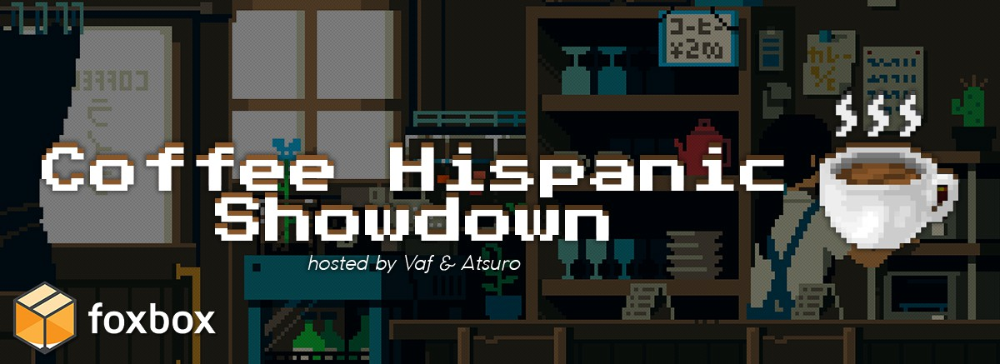

---
tags:
  - CH
  - CHS
---

# Coffee Hispanic Showdown

The **Coffee Hispanic Showdown** (***CHS***) was a double-elimination 2v2 osu! tournament hosted by ::{ flag=MX }:: ::Atsuro::{ user-id=2279351 } and ::{ flag=AR }:: ::Vaf::{ user-id=12589048 }. The tournament was restricted to Spanish-speaking countries only. This was the first instalment of the Coffee Hispanic Showdown and part of the Coffee Hispanic series.

## Tournament schedule

| Event | Timestamp |
| --: | :-- |
| Registration phase | 2020-07-05/2020-07-26 |
| Qualifiers | 2020-08-06/2020-08-09 |
| Round of 16 | 2020-08-15/2020-08-17 |
| Quarterfinals | 2020-08-22/2020-08-26 |
| Semifinals | 2020-08-29/2020-08-31 |
| Finals | 2020-09-04/2020-09-06 |
| Grand Finals | 2020-09-12/2020-09-13 |

## Prizes

| Placing | Prizes |
| :-: | :-- |
|  | Unique profile badge, exclusive team banner, exclusive player banner, 50% discount on tablet/mousepad covers for team members at [Foxbox](https://foxbox.io/) |
|  | Exclusive team banner |
|  | Exclusive team banner |

## Organisation

The Coffee Hispanic Showdown was run by various community members.

| Position | Member(s) |
| :-- | :-- |
| Organizer | ::{ flag=MX }:: ::Atsuro::{ user-id=2279351 }, ::{ flag=AR }:: ::Vaf::{ user-id=12589048 } |
| Mappool selector | ::{ flag=MX }:: ::Atsuro::{ user-id=2279351 }, ::{ flag=CN }:: ::M1keL::{ user-id=10732897 }, ::{ flag=PT }:: ::MakiDonalds::{ user-id=11610772 }, ::{ flag=BR }:: ::niii\1san::{ user-id=5403374 } |
| Referee | ::{ flag=FR }:: ::Aidown::{ user-id=1522146 }, ::{ flag=US }:: ::bmax::{ user-id=6672998 }, ::{ flag=ES }:: ::Bubblegum45::{ user-id=10559526 }, ::{ flag=HK }:: ::Cindergoat::{ user-id=10168682 }, ::{ flag=BR }:: ::DizzyH::{ user-id=9896172 }, ::{ flag=AR }:: ::Emiru Ikuno 9::{ user-id=7102463 }, ::{ flag=DE }:: ::GDLenny::{ user-id=8406711 }, ::{ flag=RU }:: ::Kolibri::{ user-id=8715808 }, ::{ flag=DE }:: ::LwL::{ user-id=3556856 }, ::{ flag=PT }:: ::MakiDonalds::{ user-id=11610772 }, ::{ flag=US }:: ::Nambulance::{ user-id=13034610 }, ::{ flag=PL }:: ::P a t r i c k::{ user-id=6814521 }, ::{ flag=CA }:: ::Rijrya::{ user-id=11186709 }, ::{ flag=US }:: ::ruyunata::{ user-id=8880920 }, ::{ flag=ES }:: ::SansREPZ::{ user-id=8865297 }, ::{ flag=GB }:: ::SteffoST::{ user-id=6566765 }, ::{ flag=CO }:: ::TheAleboy::{ user-id=8921554 }, ::{ flag=US }:: ::tigereyes144::{ user-id=6499811 }, ::{ flag=CO }:: ::Vanilla Aiz::{ user-id=12261024 }, ::{ flag=AR }:: ::Yorumi-::{ user-id=7755726 } |
| Team picker | ::{ flag=BR }:: ::Akane Hime::{ user-id=6772887 }, ::{ flag=BR }:: ::Dada::{ user-id=9119507 }, ::{ flag=BR }:: ::despairy::{ user-id=7339984 }, ::{ flag=CO }:: ::ElMick33::{ user-id=5458323 }, ::{ flag=BR }:: ::niii\_san::{ user-id=5403374 } |
| Streamer | ::{ flag=MX }:: ::Atsuro::{ user-id=2279351 }, ::{ flag=CA }:: ::Clarkyclarker::{ user-id=11664411 }, ::{ flag=DE }:: ::im afk::{ user-id=8449331 }, ::{ flag=ES }:: ::Moewagon::{ user-id=5764169 }, ::{ flag=AR }:: ::Vaf::{ user-id=12589048 }, ::{ flag=TW }:: ::XzCraftP::{ user-id=1593180 } |
| Commentator | ::{ flag=AR }:: ::Gatuto::{ user-id=3583351 }, ::{ flag=ES }:: ::Silver Falco::{ user-id=6573997 }, ::{ flag=AR }:: ::Vaf::{ user-id=12589048 } |
| Designer | ::{ flag=RU }:: ::DrakonLong::{ user-id=4411044 } |
| Recruiter | ::{ flag=CO }:: ::ElMick33::{ user-id=5458323 }, ::{ flag=EC }:: ::Gamelan4::{ user-id=9856910 }, ::{ flag=SV }:: ::Loarca::{ user-id=4650246 } |
| Statistician | ::{ flag=QA }:: ::Rimumu::{ user-id=5823005 }, ::{ flag=AR }:: ::Vaf::{ user-id=12589048 } |
| Wiki editor | ::{ flag=ID }:: ::fajar13k::{ user-id=7100002 } |

## Links

- [Discussion thread](https://osu.ppy.sh/community/forums/topics/1100670)
- [CHS Discord server](https://discord.gg/baVKCzU)
- [Livestream](https://www.twitch.tv/coffeehispanic)
- [Challonge brackets](https://challonge.com/es/CoffeeHispanicShowdown)
- [Pick'em predictions website](https://pickem.hwc.hr/tournaments/39)
- **[Statistics sheet](https://docs.google.com/spreadsheets/d/1wEr5HhIWiaftd3-9GHJnzFN-0JESClEVPMWl3GQWEUw/edit?usp=sharing)**

## Participants

| Team | Members |
| :-- | :-- |
| **:wheelchair:** | ::{ flag=AR }:: **::Keyz::{ user-id=10408325 }**, ::{ flag=MX }:: ::Flameshock::{ user-id=8349047 }, ::{ flag=ES }:: ::-Hideki-::{ user-id=8688804 }, ::{ flag=AR }:: ::Lubren::{ user-id=6573651 } |
| **163 braces** | ::{ flag=AR }:: **::Emiru Ikuno::{ user-id=6169195 }**, ::{ flag=AR }:: ::BTG4::{ user-id=10659233 }, ::{ flag=AR }:: ::slynna::{ user-id=10099005 }, ::{ flag=SV }:: ::Stalemated::{ user-id=10936276 } |
| **Almohada** | ::{ flag=AR }:: **::SlowBurn::{ user-id=3608846 }**, ::{ flag=PY }:: ::Alecsitoxd::{ user-id=9704464 }, ::{ flag=AR }:: ::Emiru Ikuno 2::{ user-id=9393446 }, ::{ flag=PY }:: ::jakes::{ user-id=10109279 } |
| **carlos** | ::{ flag=AR }:: **::xci::{ user-id=8822528 }**, ::{ flag=MX }:: ::Riot::{ user-id=4256461 }, ::{ flag=AR }:: ::Shig::{ user-id=6117281 }, ::{ flag=MX }:: ::Siros::{ user-id=3787685 } |
| **catJAM** | ::{ flag=AR }:: **::Penguo::{ user-id=4389490 }**, ::{ flag=DE }:: ::hallowatcher::{ user-id=1874761 }, ::{ flag=CL }:: ::Kuromiau::{ user-id=2347281 }, ::{ flag=CL }:: ::Yutunx::{ user-id=9467755 } |
| **Discipulos de shrek** | ::{ flag=UY }:: **::-Ritsumi-::{ user-id=5218320 }**, ::{ flag=UY }:: ::-PloX::{ user-id=6404583 }, ::{ flag=MX }:: ::Viva Viva Happy::{ user-id=4269282 }, ::{ flag=MX }:: ::xHei\_57::{ user-id=1770700 } |
| **eri gey?** | ::{ flag=AR }:: **::juliancala::{ user-id=3272902 }**, ::{ flag=PE }:: ::Arnold24x24::{ user-id=2291265 }, ::{ flag=ES }:: ::ImMyyrh::{ user-id=6433319 }, ::{ flag=ES }:: ::Izuna-tan::{ user-id=6057788 } |
| **Fish Eaters** | ::{ flag=CL }:: **::Deruz::{ user-id=5386106 }**, ::{ flag=ES }:: ::Alvaritroko::{ user-id=6735738 }, ::{ flag=CL }:: ::Pancho::{ user-id=11305398 }, ::{ flag=ES }:: ::YOKOMOPESCADO::{ user-id=10596572 } |
| **Hoshizada** | ::{ flag=CL }:: **::Intercambing::{ user-id=2546001 }**, ::{ flag=PE }:: ::Hasaki::{ user-id=9037054 }, ::{ flag=CL }:: ::Lasseh::{ user-id=4881251 }, ::{ flag=AR }:: ::Rimi::{ user-id=5194834 } |
| **Ign be gone** | ::{ flag=US }:: **::AbrahamR::{ user-id=4797389 }**, ::{ flag=CO }:: ::GaaL::{ user-id=2374950 }, ::{ flag=CO }:: ::Jekuru::{ user-id=11727492 }, ::{ flag=PA }:: ::- NTR -::{ user-id=6033536 } |
| **Madozito tourney** | ::{ flag=UY }:: **::Madozito::{ user-id=4054429 }**, ::{ flag=ES }:: ::DrakoJ::{ user-id=11645092 }, ::{ flag=ES }:: ::JoanaBob::{ user-id=10966302 }, ::{ flag=UY }:: ::Rebo::{ user-id=6942259 } |
| **Paltacate** | ::{ flag=CL }:: **::hinami-chi::{ user-id=2702043 }**, ::{ flag=CL }:: ::Barack::{ user-id=9402889 }, ::{ flag=MX }:: ::LopezzPro::{ user-id=2553519 }, ::{ flag=MX }:: ::-Wolfy-::{ user-id=4497582 } |
| **Return to Monke** | ::{ flag=ES }:: **::In Sane::{ user-id=5114537 }**, ::{ flag=ES }:: ::Rekens::{ user-id=1073575 }, ::{ flag=UY }:: ::Rondro::{ user-id=9293124 }, ::{ flag=UY }:: ::Scramzi::{ user-id=6425836 } |
| **Team 1 roto** | ::{ flag=CL }:: **::Eunha::{ user-id=7701428 }**, ::{ flag=AR }:: ::Kaoshii::{ user-id=7807935 }, ::{ flag=AR }:: ::StreamKey::{ user-id=7586334 }, ::{ flag=CL }:: ::xaxreid::{ user-id=4227431 } |
| **VIDAL** | ::{ flag=CL }:: **::ign::{ user-id=9360528 }**, ::{ flag=ES }:: ::AitorAmu::{ user-id=7781304 }, ::{ flag=CL }:: ::Nauvar::{ user-id=4309174 }, ::{ flag=CL }:: ::Fudy::{ user-id=4576295 } |
| **yotambien** | ::{ flag=ES }:: **::A N T O N I O::{ user-id=12760743 }**, ::{ flag=ES }:: ::Kalal331::{ user-id=8433636 }, ::{ flag=ES }:: ::Moewagon::{ user-id=5764169 }, ::{ flag=CO }:: ::Rushy::{ user-id=5281857 } |

## Podium

This competition has come to an end and resulted in the following podium:

| Placing | Team |
| :-: | :-- |
|  | **yotambien** (::{ flag=ES }:: **::A N T O N I O::{ user-id=12760743 }**, ::{ flag=ES }:: ::Kalal331::{ user-id=8433636 }, ::{ flag=ES }:: ::Moewagon::{ user-id=5764169 }, ::{ flag=CO }:: ::Rushy::{ user-id=5281857 }) |
|  | **carlos** (::{ flag=AR }:: **::xci::{ user-id=8822528 }**, ::{ flag=MX }:: ::Riot::{ user-id=4256461 }, ::{ flag=AR }:: ::Shig::{ user-id=6117281 }, ::{ flag=MX }:: ::Siros::{ user-id=3787685 }) |
|  | **catJAM** (::{ flag=AR }:: **::Penguo::{ user-id=4389490 }**, ::{ flag=DE }:: ::hallowatcher::{ user-id=1874761 }, ::{ flag=CL }:: ::Kuromiau::{ user-id=2347281 }, ::{ flag=CL }:: ::Yutunx::{ user-id=9467755 }) |

## Mappools

### Grand Finals

**[Download the mappack here! (177 MB)](https://drive.google.com/file/d/1wcqGYC0uPnrlvoh2Xd2ax0BmZzxT2k4R/view)**

- NoMod
  1. [PassCode - Ray (SkyFlame) \[Resonance\]](https://osu.ppy.sh/beatmapsets/1180927#osu/2462350)
  2. [IOSYS feat. Nanahira - Judgment Day Has Come (-Tynamo) \[BMD's Expert\]](https://osu.ppy.sh/beatmapsets/1152650#osu/2405862)
  3. [BUTAOTOME - Warp On (BarkingMadDog) \[Extreme\]](https://osu.ppy.sh/beatmapsets/889029#osu/1858228)
  4. [Endorfin. - Luminous Rage -Feryquitous OrderBless Remix- (Nokris) \[Obscuring Tranquility\]](https://osu.ppy.sh/beatmapsets/743239#osu/1567435)
  5. [MAX MAXIMIZER vs. DJ TOTTO - Rebellio (Realazy) \[TOYBOT'S EXPERT\]](https://osu.ppy.sh/beatmapsets/744636#osu/1623397)
  6. [Virt - Choppastyle (YokesPai) \[KIRBY Mix\]](https://osu.ppy.sh/beatmapsets/1023284#osu/2140702)
- Hidden
  1. [Morimori Atsushi - Tits or get the fuck out!! (EvilElvis) \[Chastity\]](https://osu.ppy.sh/beatmapsets/352169#osu/776107)
  2. [Yamai - E? Aa, Sou. (Faito) \[?\]](https://osu.ppy.sh/beatmapsets/1245259#osu/2588430)
  3. [Zekk - SUMMER (Typ4) \[Paradise\]](https://osu.ppy.sh/beatmapsets/971592#osu/2034284)
- HardRock
  1. [XX:me - Escape (jonathanlfj) \[Freedom\]](https://osu.ppy.sh/beatmapsets/811119#osu/1701563)
  2. [DragonForce - Ashes of the Dawn (pw384) \[Extra\]](https://osu.ppy.sh/beatmapsets/786141#osu/1650328)
  3. [tarolabo - Zeitmesser (Charles445) \[Expert\]](https://osu.ppy.sh/beatmapsets/310339#osu/693542)
- DoubleTime
  1. [Utagumi Setsugekka - Yumemi Sunrise (Zweib) \[Insane\]](https://osu.ppy.sh/beatmapsets/132312#osu/338862)
  2. [Grynpyret - Boba Beach (VINXIS) \[Habanero\]](https://osu.ppy.sh/beatmapsets/327224#osu/726289)
  3. [Kola Kid - timer (Mirash) \[Insane\]](https://osu.ppy.sh/beatmapsets/1089084#osu/2277128)
  4. [zts - miragecoordinator (Tsumugi-chan) \[Collab Expert\]](https://osu.ppy.sh/beatmapsets/1085924#osu/2270798)
- FreeMod
  1. [umu. - humanly (Luscent) \[Expert\]](https://osu.ppy.sh/beatmapsets/1045518#osu/2185651)
  2. [SWAN K feat. Asuka M - LOVE B.B.B (\[ Couch \] Lite) \[EXTRA\]](https://osu.ppy.sh/beatmapsets/1100957#osu/2433110)
  3. [Feryquitous feat. Aitsuki Nakuru - Kairikou (Ryuusei Aika) \[Skystar's Irregular\]](https://osu.ppy.sh/beatmapsets/740862#osu/1723257)
- Tiebreaker
  1. **[Unlucky Morpheus - Angreifer (Scarsnic) \[Zeitlos\]](https://osu.ppy.sh/beatmapsets/581468#osu/1230741)**
  2. **[Camellia - LET'S JUMP (Camellia's "diffractive" Hardcore Remix) (Moko) \[Isomorphic Substitution\]](https://osu.ppy.sh/beatmapsets/1052797#osu/2326935)**
  3. **[GET IN THE RING - Midnight Syndrome (Atalanta) \[Desire\]](https://osu.ppy.sh/beatmapsets/862929#osu/1886627)**

### Finals

**[Download the mappack here! (156 MB)](https://drive.google.com/file/d/1g847SBMY7dh1rO1PD4cGzIWu_8ymbunN/view)**

- NoMod
  1. [Twin-Tails - Twintail Dreamer! (Minorsonek) \[diuS' Expert\]](https://osu.ppy.sh/beatmapsets/773026#osu/1680262)
  2. [GLORYHAMMER - Rise of the Chaos Wizards](https://osu.ppy.sh/beatmapsets/990188#osu/2164735)
  3. [TERRASPEX - AMAZING BREAK (Monstrata) \[DESPAIR\]](https://osu.ppy.sh/beatmapsets/571835#osu/1211828)
  4. [USAO - Boss Rush (Lavender) \[Moecho's Blitz Surge Extra\]](https://osu.ppy.sh/beatmapsets/619807#osu/1306399)
  5. [BLOOD STAIN CHILD - Last Stardust (Smoothie) \[tutu's Extra\]](https://osu.ppy.sh/beatmapsets/332345#osu/1265343)
  6. [Akiyama Uni - Broken Moon (sahuang) \[Regou's Extra\]](https://osu.ppy.sh/beatmapsets/643391#osu/1389956)
- Hidden
  1. [Tamaonsen - COZMIC DRIVE feat.Youko (caren\_sk) \[CRN MORE DRIVE\]](https://osu.ppy.sh/beatmapsets/78859#osu/220330)
  2. [DJ YOSHITAKA - ALBIDA (TKiller) \[Another\]](https://osu.ppy.sh/beatmapsets/23416#osu/80200)
  3. [Sota Fujimori - polygon (Sebu) \[-PC's hexagon\]](https://osu.ppy.sh/beatmapsets/422136#osu/1028537)
- HardRock
  1. [Harada Hitomi - Kyoumei no True Force (Kibbleru) \[Ex\]](https://osu.ppy.sh/beatmapsets/454893#osu/975153)
  2. [Renard - Banned Forever (Blue Dragon) \[Lesjuh\]](https://osu.ppy.sh/beatmapsets/16349#osu/64266)
  3. [L.E.D.-G - SOUND OF GIALLARHORN (Priti) \[Alu's Extra\]](https://osu.ppy.sh/beatmapsets/155457#osu/381301)
- DoubleTime
  1. [FELT - Story (Yohanes) \[Lunatic\]](https://osu.ppy.sh/beatmapsets/297409#osu/944709)
  2. [senya - Zouka de Arou to Shita Mono (Satellite) \[Giralda's Lunatic\]](https://osu.ppy.sh/beatmapsets/495283#osu/1107464)
  3. [DystopiaGround - True Theory of Inheritance (Ignacio) \[Insane\]](https://osu.ppy.sh/beatmapsets/24477#osu/83215)
  4. [zts - worldenddominator (deetz) \[Last Stand\]](https://osu.ppy.sh/beatmapsets/897884#osu/1875707)
- FreeMod
  1. [SHO - Plain Asia \~ Guardian of the Village (Kite) \[Insane\]](https://osu.ppy.sh/beatmapsets/26071#osu/88176)
  2. [paraoka - boot (rickyboi) \[Shoe\]](https://osu.ppy.sh/beatmapsets/50131#osu/154226)
  3. [Camellia - Introduction - ENTRANS OF DA JUNGLE (-PC) \[Welcome to the Jungle\]](https://osu.ppy.sh/beatmapsets/700968#osu/1483766)
- Tiebreaker
  1. **[Oreore-Usagi - Reset My Refrain (captin1) \[Reset\]](https://osu.ppy.sh/beatmapsets/485103#osu/1034570)**
  2. **[Demetori - Yuuga ni sakase, sumizome no sakura \~ The Harm of Coming into Existence (Keada) \[Extra Stage\]](https://osu.ppy.sh/beatmapsets/1028198#osu/2149924)**
  3. **[Meramipop - Secret Desire - Dyes Remix - (Skystar) \[Irregular\]](https://osu.ppy.sh/beatmapsets/697895#osu/1478218)**

### Semifinals

- NoMod
  1. [Suzuki Konomi - My Days (Meg) \[Depths' Ascension\]](https://osu.ppy.sh/beatmapsets/861113#osu/2104765)
  2. [xi - Akasha (Atsuro) \[Aether\]](https://osu.ppy.sh/beatmapsets/403427#osu/877312)
  3. [Nanahoshi Kangengakudan feat.Matsushita - Dance Number o Tomo ni (pkk) \[Dance Number\]](https://osu.ppy.sh/beatmapsets/353398#osu/778603)
  4. [YUC'e - Chemical Cookie (Yusomi) \[kodoku's Extra\]](https://osu.ppy.sh/beatmapsets/905119#osu/1891490)
  5. [goreshit - xenobeat (-Aqua) \[Hinsvar's Expert\]](https://osu.ppy.sh/beatmapsets/1090113#osu/2313561)
- Hidden
  1. [lapix - Nexta (Realazy) \[Ayyri's GRAVITY\]](https://osu.ppy.sh/beatmapsets/1050635#osu/2319981)
  2. [beatMARIO - Night of Knights (DJPop) \[SOLO\]](https://osu.ppy.sh/beatmapsets/15920#osu/58063)
  3. [Katakiri Rekka - Answer (bakabaka) \[Insane\]](https://osu.ppy.sh/beatmapsets/39953#osu/127047)
- HardRock
  1. [Omoi - Nee William (Riven) \[captin's Extra\]](https://osu.ppy.sh/beatmapsets/920536#osu/1923556)
  2. [DJ Ozawa - Tokyo (Innovaderz Remix) (Asphyxia) \[Kloyd's Extra\]](https://osu.ppy.sh/beatmapsets/333139#osu/762853)
  3. [Pastel\*Palettes - Happy Synthesizer (M1keL) \[CS4.5\]](https://osu.ppy.sh/beatmapsets/1242915#osu/2584027)
- DoubleTime
  1. [fourfolium - SAKURA Skip (Doormat) \[HB & Sotarks' Insane\]](https://osu.ppy.sh/beatmapsets/488619#osu/1053188)
  2. [His World (buraimaster1234) \[Insane\]](https://osu.ppy.sh/beatmapsets/2490#osu/19696)
  3. [Rin - Kishinjou set 07 \~ Magical Storm (eiri-) \[Lunatic\]](https://osu.ppy.sh/beatmapsets/968147#osu/2025904)
  4. [Kanon Wakeshima - Sakura Meikyuu (PandaHero) \[Mirash's Insane\]](https://osu.ppy.sh/beatmapsets/809230#osu/1698077)
- FreeMod
  1. [Becky - Less Than Three (Ricardo Autobahn Remix) (Sonnyc) \[Expert\]](https://osu.ppy.sh/beatmapsets/1078502#osu/2256655)
  2. [UNDEAD CORPORATION - Flowering Night Fever (Alheak) \[pishi's Lunatic\]](https://osu.ppy.sh/beatmapsets/393663#osu/895806)
  3. [FELT - New World (Hakurei Yoru) \[z1's Another\]](https://osu.ppy.sh/beatmapsets/486207#osu/1069966)
- Tiebreaker
  1. **[Dark PHOENiX - Ryokugan no Jealousy (EvilElvis) \[Monster with Green Eyes\]](https://osu.ppy.sh/beatmapsets/382455#osu/836339)**
  2. **[PSYQUI - Start Up feat. Such (dong2729) \[Start!\]](https://osu.ppy.sh/beatmapsets/838540#osu/1803623)**
  3. **[Diao Ye Zong feat. Meramipop - 'Thema of Curtain Fire Shooters' -History 3/3- (Hey lululu) \[Extra Stage\]](https://osu.ppy.sh/beatmapsets/746655#osu/1573582)**

### Quarterfinals

- NoMod
  1. [FujuniseikouyuuP - Sayonara Lechenaultia (Kowari) \[Extra\]](https://osu.ppy.sh/beatmapsets/958924#osu/2007683)
  2. [Mastermind(xi+nora2r) - Dreadnought (Cherry Blossom) \[Final Destination\]](https://osu.ppy.sh/beatmapsets/361306#osu/793845)
  3. [jioyi - Platinum (Plaudible) \[Mir's Extra\]](https://osu.ppy.sh/beatmapsets/553237#osu/1389757)
  4. [VY1 - Cyber Thunder Cider (tutuhaha) \[Cider\]](https://osu.ppy.sh/beatmapsets/47146#osu/146610)
  5. [Shade - Ontology (LMT) \[Zelq's Extra\]](https://osu.ppy.sh/beatmapsets/1050313#osu/2207682)
- Hidden
  1. [S3RL - Catchit (Radio Edit) (Rolniczy) \[Ex\]](https://osu.ppy.sh/beatmapsets/839864#osu/1848985)
  2. [Tatsh - Cruel Moon (Shinxyn) \[Lunatic\]](https://osu.ppy.sh/beatmapsets/13584#osu/50148)
  3. [Ryu\* Vs. L.E.D.-G Vs. ZUN - PARADISE GHOST (Pokie) \[Extra\]](https://osu.ppy.sh/beatmapsets/67133#osu/195305)
- HardRock
  1. [Foo Fighters - The Pretender (Pachiru) \[pkk's Extra\]](https://osu.ppy.sh/beatmapsets/849640#osu/1776628)
  2. [YOASOBI - Ano Yume o Nazotte (eiri-) \[Love\]](https://osu.ppy.sh/beatmapsets/1128515#osu/2357718)
  3. [m@sumi - Hengen Jizai (thzz) \[Beomsan's Extra\]](https://osu.ppy.sh/beatmapsets/595456#osu/1572774)
- DoubleTime
  1. [SoundTeMP - M.I.S.A (silklash) \[Insane\]](https://osu.ppy.sh/beatmapsets/39985#osu/127136)
  2. [senya - Saihate no Kotoba (Satellite) \[Ghostly\]](https://osu.ppy.sh/beatmapsets/174417#osu/905424)
  3. [Rib - Jitter Doll (Kalibe) \[Insane\]](https://osu.ppy.sh/beatmapsets/634997#osu/1350132)
  4. [455-38B - G e n g a o z o - f o o n (ktgster) \[Insane\]](https://osu.ppy.sh/beatmapsets/869649#osu/1939173)
- FreeMod
  1. [IOSYS - Danzai Yamaxanadu (Zekira) \[Eternal Damnation\]](https://osu.ppy.sh/beatmapsets/13654#osu/50354)
  2. [PUP - Mabu (Hobbes2) \[Milan-'s Expert\]](https://osu.ppy.sh/beatmapsets/762836#osu/1606045)
  3. [Getty vs. DJ DiA - Fox4-Raize- (Kaifin) \[Doorfin's Extra\]](https://osu.ppy.sh/beatmapsets/482552#osu/1097509)
- Tiebreaker
  1. **[Demetori - Seijouki no Pierrot ~ The MadPiero Laughs (jonathanlfj) \[Extra Stage\]](https://osu.ppy.sh/beatmapsets/656918#osu/1391631)**
  2. **[Camellia - Stealth-Dash (Realazy) \[Mir's Shadow\]](https://osu.ppy.sh/beatmapsets/908451#osu/1899759)**
  3. **[Spacelectro feat.Setsunan - Little Little wish (Starfy) \[Desire\]](https://osu.ppy.sh/beatmapsets/528824#osu/1121510)**

### Round of 16

**[Download the mappack here! (107 MB)](https://www.mediafire.com/file/ylbcsstmlh8uemm/RO16.rar/file)**

- NoMod
  1. [LiSA - Jet Rocket (Wen) \[Rocketing Love\]](https://osu.ppy.sh/beatmapsets/1189927#osu/2479386)
  2. [Julian Smith - Racist Coffee (Speed Up Ver.) (Chanci) \[Collab Extra\]](https://osu.ppy.sh/beatmapsets/871225#osu/1865787)
  3. [Co shu Nie - ZETTAI ZETSUMEI (Monstrata) \[Gill's Another\]](https://osu.ppy.sh/beatmapsets/908973#osu/1907437)
  4. [lapix - Roll The Dice (NyarkoO) \[LET'S GO!\]](https://osu.ppy.sh/beatmapsets/745990#osu/1572436)
  5. [The Flashbulb - DIDJ PVC (Irreversible) \[Polka's EX I\]](https://osu.ppy.sh/beatmapsets/966078#osu/2061428)
- Hidden
  1. [Liz Triangle - Immortal Philosophy (Jounzan) \[Kalash x Jounzaphore feat. Delis' Tragicomedy Collab Lunatic\]](https://osu.ppy.sh/beatmapsets/941212#osu/1968860)
  2. [Tatsh - 24th Century BOY (Takos) \[Another\]](https://osu.ppy.sh/beatmapsets/42997#osu/135051)
- HardRock
  1. [Yousei Teikoku - Mischievous of Alice (Delis) \[Extra\]](https://osu.ppy.sh/beatmapsets/623960#osu/1320835)
  2. [HyuN - Guitian (ScubDomino) \[Insane\]](https://osu.ppy.sh/beatmapsets/891348#osu/1863256)
- DoubleTime
  1. [TWICE - Heart Shaker (iYiyo) \[iYikhg's Insane Shaker\~\]](https://osu.ppy.sh/beatmapsets/705597#osu/1498981)
  2. [REOL - Give me a break Stop now (Chaoslitz) \[Chaosversible's Insane\]](https://osu.ppy.sh/beatmapsets/497483#osu/1074000)
  3. [doriko feat. Hatsune Miku - Paradise Cage (KanbeKotori) \[Insane\]](https://osu.ppy.sh/beatmapsets/23483#osu/80384)
- FreeMod
  1. [IOSYS - Kyuukyoku Yakiniku Restaurant! Orin no Jigokutei! (DJPop) \[Insane\]](https://osu.ppy.sh/beatmapsets/7316#osu/31620)
  2. [Rita - Dream Walker (Amamiya Yuko) \[Ethereal\]](https://osu.ppy.sh/beatmapsets/315299#osu/722934)
- Tiebreaker
  1. **[Yousei Teikoku - Kokou no Sousei (Kalibe) \[Despair\]](https://osu.ppy.sh/beatmapsets/744554#osu/1569836)**
  2. **[Demetori - Necrofantasia \~ Remix (tokiko) \[Extra Stage\]](https://osu.ppy.sh/beatmapsets/754985#osu/1589320)**
  3. **[Diao ye zong feat. Meramipop - The Anonymous (Asaiga) \[Neraidaphobia\]](https://osu.ppy.sh/beatmapsets/543660#osu/1283136)**

### Qualifiers

**[Download the mappack here! (71 MB)](http://www.mediafire.com/file/ymmc53rkwsjz65t/Qualifiers_Pool.rar/file)**

- NoMod
  1. [nano - DREAMCATCHER (Depths) \[Destiny\]](https://osu.ppy.sh/beatmapsets/802148#osu/1683581)
  2. [cosMo@BousouP - For UltraPlayers (rui) \[Chata's INFINITE\]](https://osu.ppy.sh/beatmapsets/137969#osu/344709)
  3. [tofubeats - CANDYYYLAND feat. LIZ (Pa's Lam System Remix) (taku) \[Sweet Surrender\]](https://osu.ppy.sh/beatmapsets/648540#osu/1373874)
  4. [Rin - Eientewi set 15 \~ Evening Primrose (yaspo) \[In the shade\]](https://osu.ppy.sh/beatmapsets/1014593#osu/2123415)
- Hidden
  1. [Zektbach - Turii \~Panta rhei\~ (celerih) \[Muya's Another\]](https://osu.ppy.sh/beatmapsets/800638#osu/1731136)
  2. [x0o0x_ - Big Brother (Luscent) \[DADA'S INSANE Mix\]](https://osu.ppy.sh/beatmapsets/1120687#osu/2468315)
- HardRock
  1. [Katakiri Rekka - Answer (ShirohaMyMommy) \[Luscent's Extra\]](https://osu.ppy.sh/beatmapsets/1062653#osu/2278618)
  2. [TOTTO - Onigami (Kloyd) \[Expert\]](https://osu.ppy.sh/beatmapsets/215069#osu/505195)
- DoubleTime
  1. [yanaginagi - landscape (\[Vincent\]) \[Insane\]](https://osu.ppy.sh/beatmapsets/244001#osu/563370)
  2. [Skrillex - Imma Try It Out (feat. Alvin Risk) (Foreverends) \[Endsane\]](https://osu.ppy.sh/beatmapsets/76662#osu/234818)

## Match results

### Grand Finals

Saturday, 12 September 2020:

| Team 1 |  |  | Team 2 | Match link |
| --: | :-: | :-: | :-- | :-- |
| catJAM | 6 | **7** | **carlos** | [#1](https://osu.ppy.sh/community/matches/66861608) |

Sunday, 13 September 2020:

| Team 1 |  |  | Team 2 | Match link |
| --: | :-: | :-: | :-- | :-- |
| **yotambien** | **7** | 5 | carlos | [#1](https://osu.ppy.sh/community/matches/66905996) |

### Finals

Friday, 4 September 2020:

| Team 1 |  |  | Team 2 | Match link |
| --: | :-: | :-: | :-- | :-- |
| Return to Monke | 2 | **7** | **Madozito tourney** | [#1](https://osu.ppy.sh/community/matches/66467313) |

Saturday, 5 September 2020:

| Team 1 |  |  | Team 2 | Match link |
| --: | :-: | :-: | :-- | :-- |
| catJAM | 5 | **7** | **yotambien** | [#1](https://osu.ppy.sh/community/matches/66517231) |
| Paltacate | 5 | **7** | **carlos** | [#1](https://osu.ppy.sh/community/matches/66531467) |

Sunday, 6 September 2020:

| Team 1 |  |  | Team 2 | Match link |
| --: | :-: | :-: | :-- | :-- |
| **carlos** | **7** | 4 | Madozito tourney | [#1](https://osu.ppy.sh/community/matches/66569336) |

### Semifinals

Saturday, 29 August 2020:

| Team 1 |  |  | Team 2 | Match link |
| --: | :-: | :-: | :-- | :-- |
| Hoshizada | 2 | **6** | **Team 1 roto** | [#1](https://osu.ppy.sh/community/matches/66143856), [#2](https://osu.ppy.sh/community/matches/66145703) |
| 163 braces | 0 | **6** | **eri gey?** | [#1](https://osu.ppy.sh/community/matches/66182411) |
| VIDAL | 2 | **6** | **carlos** | [#1](https://osu.ppy.sh/community/matches/66184767) |
| :wheelchair | 4 | **6** | **Madozito tourney** | [#1](https://osu.ppy.sh/community/matches/66187470) |

Sunday, 30 August 2020:

| Team 1 |  |  | Team 2 | Match link |
| --: | :-: | :-: | :-- | :-- |
| Return to Monke | 3 | **6** | **yotambien** | [#1](https://osu.ppy.sh/community/matches/66227077) |
| **Madozito tourney** | **6** | 2 | eri gey? | [#1](https://osu.ppy.sh/community/matches/66231123) |
| Paltacate | 1 | **6** | **catJAM** | [#1](https://osu.ppy.sh/community/matches/66235301) |

Monday, 31 August 2020:

| Team 1 |  |  | Team 2 | Match link |
| --: | :-: | :-: | :-- | :-- |
| **carlos** | **6** | 3 | Team 1 roto | [#1](https://osu.ppy.sh/community/matches/66250985) |

### Quarterfinals

Saturday, 22 August 2020:

| Team 1 |  |  | Team 2 | Match link |
| --: | :-: | :-: | :-- | :-- |
| Almohada | 1 | **6** | **Madozito tourney** | [#1](https://osu.ppy.sh/community/matches/65811316) |
| :wheelchair: | 1 | **6** | **catJAM** | [#1](https://osu.ppy.sh/community/matches/65813684) |
| **carlos** | **6** | 2 | Fish Eaters | [#1](https://osu.ppy.sh/community/matches/65813693) |

Sunday, 23 August 2020:

| Team 1 |  |  | Team 2 | Match link |
| --: | :-: | :-: | :-- | :-- |
| **Team 1 roto** | **6** | 5 | Discipulos de shrek | [#1](https://osu.ppy.sh/community/matches/65822847) |
| 163 braces | 5 | **6** | **Paltacate** | [#1](https://osu.ppy.sh/community/matches/65822978) |
| **Return to Monke** | **6** | 4 | Hoshizada | [#1](https://osu.ppy.sh/community/matches/65851824) |
| VIDAL | 1 | **6** | **yotambien** | [#1](https://osu.ppy.sh/community/matches/65854682) |

Wednesday, 26 August 2020:

| Team 1 |  |  | Team 2 | Match link |
| --: | :-: | :-: | :-- | :-- |
| Ign be gone | 3 | **6** | **eri gey?** | [#1](https://osu.ppy.sh/community/matches/66028383) |

### Round of 16

Saturday, 15 August 2020:

| Team 1 |  |  | Team 2 | Match link |
| --: | :-: | :-: | :-- | :-- |
| **163 braces** | **5** | 4 | carlos | [#1](https://osu.ppy.sh/community/matches/65441516) |
| Ign be gone | 3 | **5** | **VIDAL** | [#1](https://osu.ppy.sh/community/matches/65472750) |
| eri gey? | 2 | **5** | **yotambien** | [#1](https://osu.ppy.sh/community/matches/65475095) |
| **Paltacate** | **5** | 1 | Fish Eaters | [#1](https://osu.ppy.sh/community/matches/65480091) |

Sunday, 16 August 2020:

| Team 1 |  |  | Team 2 | Match link |
| --: | :-: | :-: | :-- | :-- |
| **Return to Monke** | **5** | 0 | Almohada | [#1](https://osu.ppy.sh/community/matches/65514305) |
| Madozito tourney | 0 | **5** | **Hoshizada** | [#1](https://osu.ppy.sh/community/matches/65518962) |
| **catJAM** | **5** | 3 | Discipulos de shrek | [#1](https://osu.ppy.sh/community/matches/65525428) |

Monday, 17 August 2020:

| Team 1 |  |  | Team 2 | Match link |
| --: | :-: | :-: | :-- | :-- |
| Team 1 roto | 0 | **5** | **:wheelchair:** | [#1](https://osu.ppy.sh/community/matches/65569134) |

### Qualifiers

#### Tier 1

| Seed | Team | Total points |
| --: | :-- | --: |
| #1 | ::{ flag=DE }:: ::hallowatcher::{ user-id=1874761 }, ::{ flag=AR }:: ::Penguo::{ user-id=4389490 } | 23 |
| #2 | ::{ flag=US }:: ::AbrahamR::{ user-id=4797389 }, ::{ flag=CO }:: ::GaaL::{ user-id=2374950 } | 83 |
| #3 | ::{ flag=CL }:: ::Deruz::{ user-id=5386106 }, ::{ flag=CL }:: ::Pancho::{ user-id=11305398 } | 98 |
| #4 | ::{ flag=UY }:: ::Madozito::{ user-id=4054429 }, ::{ flag=UY }:: ::Rebo::{ user-id=6942259 } | 106 |
| #5 | ::{ flag=ES }:: ::In Sane::{ user-id=5114537 }, ::{ flag=ES }:: ::Rekens::{ user-id=1073575 } | 109 |
| #6 | ::{ flag=ES }:: ::amborgesa::{ user-id=1968481 }, ::{ flag=RO }:: ::Lisko::{ user-id=11948017 } | 111 |
| #7 | ::{ flag=AR }:: ::Emiru Ikuno 2::{ user-id=9393446 }, ::{ flag=AR }:: ::SlowBurn::{ user-id=3608846 } | 117 |
| #7 | ::{ flag=CL }:: ::Intercambing::{ user-id=2546001 }, ::{ flag=AR }:: ::Rimi::{ user-id=5194834 } | 117 |
| #9 | ::{ flag=CL }:: ::Eunha::{ user-id=7701428 }, ::{ flag=CL }:: ::xaxreid::{ user-id=4227431 } | 119 |
| #10 | ::{ flag=ES }:: ::Kalal331::{ user-id=8433636 }, ::{ flag=CO }:: ::Rushy::{ user-id=5281857 } | 123 |
| #11 | ::{ flag=MX }:: ::-Wolfy-::{ user-id=4497582 }, ::{ flag=MX }:: ::LopezzPro::{ user-id=2553519 } | 124 |
| #12 | ::{ flag=MX }:: ::Riot::{ user-id=4256461 }, ::{ flag=MX }:: ::Siros::{ user-id=3787685 } | 126 |
| #13 | ::{ flag=CL }:: ::Fudy::{ user-id=4576295 }, ::{ flag=CL }:: ::Nauvar::{ user-id=4309174 } | 133 |
| #14 | ::{ flag=UY }:: ::-PloX::{ user-id=6404583 }, ::{ flag=UY }:: ::-Ritsumi-::{ user-id=5218320 } | 135 |
| #15 | ::{ flag=AR }:: ::Emiru Ikuno::{ user-id=6169195 }, ::{ flag=AR }:: ::slynna::{ user-id=10099005 } | 139 |
| #16 | ::{ flag=AR }:: ::juliancala::{ user-id=3272902 }, ::{ flag=PE }:: ::Arnold24x24::{ user-id=2291265 } | 147 |
| #17 | ::{ flag=ES }:: ::-Hideki-::{ user-id=8688804 }, ::{ flag=MX }:: ::Flameshock::{ user-id=8349047 } | 152 |
| #18 | ::{ flag=UY }:: ::daanit::{ user-id=6159669 }, ::{ flag=UY }:: ::FDX::{ user-id=8987016 } | 162 |
| #19 | ::{ flag=PA }:: ::hammytr::{ user-id=11562243 }, ::{ flag=CO }:: ::Ninther4::{ user-id=3291562 } | 165 |
| #20 | ::{ flag=AR }:: ::oni::{ user-id=6195814 }, ::{ flag=AR }:: ::N Y Q A::{ user-id=5420232 } | 166 |
| #21 | ::{ flag=AR }:: ::Amuro::{ user-id=7119659 }, ::{ flag=AR }:: ::Fukkatsu::{ user-id=3942820 } | 189 |
| #22 | ::{ flag=AR }:: ::Mariano::{ user-id=6371395 }, ::{ flag=CL }:: ::iPuncake::{ user-id=6633574 } | 190 |
| #23 | ::{ flag=MX }:: ::pundice::{ user-id=7940696 }, ::{ flag=AR }:: ::BossPlays::{ user-id=7341471 } | 192 |
| #24 | ::{ flag=MX }:: ::-Karu::{ user-id=8429128 }, ::{ flag=MX }:: ::EfrainGMiD2::{ user-id=7756403 } | 197 |
| #25 | ::{ flag=AR }:: ::Enhu::{ user-id=2840499 }, ::{ flag=CL }:: ::Exumk::{ user-id=8840846 } | 212 |
| #26 | ::{ flag=UY }:: ::Saphity::{ user-id=5382216 }, ::{ flag=UY }:: ::Snepif::{ user-id=408088 } | 222 |
| #27 | ::{ flag=ES }:: ::RivenXLukario::{ user-id=9582556 }, ::{ flag=ES }:: ::Jevex::{ user-id=8549898 } | 230 |
| #28 | ::{ flag=AR }:: ::Lauta::{ user-id=6737541 }, ::{ flag=PR }:: ::Unexpected::{ user-id=4495889 } | 237 |
| #29 | ::{ flag=CL }:: ::Dylson::{ user-id=6315784 }, ::{ flag=CL }:: ::kafaN::{ user-id=1489743 } | 247 |
| #30 | ::{ flag=CL }:: ::\[- J u l i e -\]::{ user-id=12211248 }, ::{ flag=CL }:: ::-Mirai-::{ user-id=9850011 } | 279 |
| #31 | ::{ flag=AR }:: ::Pein::{ user-id=2212941 }, ::{ flag=AR }:: ::Cata::{ user-id=5958063 } | DQ |

#### Tier 2

| Seed | Team | Total points |
| --: | :-- | --: |
| #1 | ::{ flag=ES }:: ::A N T O N I O::{ user-id=12760743 }, ::{ flag=ES }:: ::Moewagon::{ user-id=5764169 } | 54 |
| #2 | ::{ flag=ES }:: ::AitorAmu::{ user-id=7781304 }, ::{ flag=CL }:: ::ign::{ user-id=9360528 } | 62 |
| #3 | ::{ flag=CL }:: ::Barack::{ user-id=9402889 }, ::{ flag=CL }:: ::hinami-chi::{ user-id=2702043 } | 66 |
| #4 | ::{ flag=AR }:: ::Kaoshii::{ user-id=7807935 }, ::{ flag=AR }:: ::StreamKey::{ user-id=7586334 } | 70 |
| #5 | ::{ flag=ES }:: ::DrakoJ::{ user-id=11645092 }, ::{ flag=ES }:: ::JoanaBob::{ user-id=10966302 } | 87 |
| #6 | ::{ flag=UY }:: ::Rondro::{ user-id=9293124 }, ::{ flag=UY }:: ::Scramzi::{ user-id=6425836 } | 90 |
| #7 | ::{ flag=AR }:: ::BTG4::{ user-id=10659233 }, ::{ flag=SV }:: ::Stalemated::{ user-id=10936276 } | 126 |
| #8 | ::{ flag=ES }:: ::Izuna-tan::{ user-id=6057788 }, ::{ flag=ES }:: ::ImMyyrh::{ user-id=6433319 } | 143 |
| #9 | ::{ flag=PE }:: ::Hasaki::{ user-id=9037054 }, ::{ flag=CL }:: ::Lasseh::{ user-id=4881251 } | 144 |
| #10 | ::{ flag=MX }:: ::Viva Viva Happy::{ user-id=4269282 }, ::{ flag=MX }:: ::xHei\_57::{ user-id=1770700 } | 154 |
| #11 | ::{ flag=ES }:: ::Alvaritroko::{ user-id=6735738 }, ::{ flag=ES }:: ::YOKOMOPESCADO::{ user-id=10596572 } | 167 |
| #12 | ::{ flag=PY }:: ::Alecsitoxd::{ user-id=9704464 }, ::{ flag=PY }:: ::jakes::{ user-id=10109279 } | 168 |
| #13 | ::{ flag=AR }:: ::Shig::{ user-id=6117281 }, ::{ flag=AR }:: ::xci::{ user-id=8822528 } | 170 |
| #13 | ::{ flag=PA }:: ::- NTR -::{ user-id=6033536 }, ::{ flag=CO }:: ::Jekuru::{ user-id=11727492 } | 170 |
| #15 | ::{ flag=CL }:: ::Kuromiau::{ user-id=2347281 }, ::{ flag=CL }:: ::Yutunx::{ user-id=9467755 } | 171 |
| #16 | ::{ flag=AR }:: ::Keyz::{ user-id=10408325 }, ::{ flag=AR }:: ::Lubren::{ user-id=6573651 } | 177 |
| #17 | ::{ flag=AR }:: ::Aida::{ user-id=6474451 }, ::{ flag=AR }:: ::RodrihBruh::{ user-id=11076829 } | 181 |
| #18 | ::{ flag=MX }:: ::Abran::{ user-id=6266914 }, ::{ flag=PE }:: ::Mordo::{ user-id=4192805 } | 183 |
| #19 | ::{ flag=CO }:: ::Ritokoi::{ user-id=7749484 }, ::{ flag=CO }:: ::Schwarze::{ user-id=6575153 } | 186 |
| #20 | ::{ flag=AR }:: ::bubshish::{ user-id=7110363 }, ::{ flag=AR }:: ::Glazbom::{ user-id=608277 } | 197 |
| #21 | ::{ flag=CL }:: ::HoroHoro::{ user-id=8728527 }, ::{ flag=AR }:: ::Nokamu::{ user-id=7416569 } | 198 |
| #21 | ::{ flag=AR }:: ::Ginotec::{ user-id=3060981 }, ::{ flag=AR }:: ::Vexion::{ user-id=10361419 } | 198 |
| #23 | ::{ flag=CR }:: ::datcatt::{ user-id=7194576 }, ::{ flag=CR }:: ::MyAngelVaxei::{ user-id=7775839 } | 203 |
| #24 | ::{ flag=ES }:: ::BrygantiuM::{ user-id=4143487 }, ::{ flag=ES }:: ::Sh3ra::{ user-id=7180647 } | 214 |
| #25 | ::{ flag=ES }:: ::Akakuro::{ user-id=7615505 }, ::{ flag=ES }:: ::Akalude::{ user-id=4839479 } | 221 |
| #26 | ::{ flag=ES }:: ::aitoramu horny::{ user-id=12724995 }, ::{ flag=ES }:: ::My Angel Mortal::{ user-id=12296128 } | 222 |
| #27 | ::{ flag=ES }:: ::dariito0xx::{ user-id=4739655 }, ::{ flag=ES }:: ::Loluh::{ user-id=13204938 } | 227 |
| #28 | ::{ flag=CL }:: ::Instinto::{ user-id=5252968 }, ::{ flag=CL }:: ::Nicofubuki::{ user-id=4387344 } | 228 |
| #29 | ::{ flag=AR }:: ::Birke::{ user-id=3265658 }, ::{ flag=DO }:: ::TheRealWillLITE::{ user-id=6677788 } | 237 |
| #30 | ::{ flag=CO }:: ::501312::{ user-id=11083194 }, ::{ flag=CO }:: ::xPOWERBOMBx::{ user-id=12502593 } | 240 |
| #31 | ::{ flag=CL }:: ::Brogamer89::{ user-id=7710087 }, ::{ flag=CL }:: ::Plntote::{ user-id=7559996 } | 249 |
| #32 | ::{ flag=CL }:: ::Alicel::{ user-id=3312064 }, ::{ flag=CL }:: ::Eimy::{ user-id=10410571 } | 260 |
| #33 | ::{ flag=CL }:: ::SrChoke::{ user-id=9235005 }, ::{ flag=CL }:: ::SrMostacho::{ user-id=12318252 } | 290 |
| #34 | ::{ flag=AR }:: ::GastonGL::{ user-id=11238108 }, ::{ flag=AR }:: ::sCoR18::{ user-id=11656841 } | 298 |
| #35 | ::{ flag=PA }:: ::Shaarawy::{ user-id=2652469 }, ::{ flag=AR }:: ::ZelLink::{ user-id=6752242 } | 314 |
| #36 | ::{ flag=PY }:: ::\_splenty::{ user-id=10966088 }, ::{ flag=PY }:: ::EnigmaIsBoss::{ user-id=8654205 } | 316 |
| #37 | ::{ flag=AR }:: ::Dreamcast::{ user-id=1565577 }, ::{ flag=AR }:: ::Miltoon::{ user-id=10582071 } | 349 |
| #38 | ::{ flag=EC }:: ::iSmileZ::{ user-id=10081404 }, ::{ flag=MX }:: ::Movingxd::{ user-id=8759093 } | DQ |
| #39 | ::{ flag=MX }:: ::Keversan::{ user-id=12134286 }, ::{ flag=MX }:: ::SfrapSucks::{ user-id=7862086 } | DQ |
| #40 | ::{ flag=ES }:: ::Karma::{ user-id=7196989 }, ::{ flag=ES }:: ::NotHans::{ user-id=9551773 } | DQ |
| #41 | ::{ flag=ES }:: ::-AmHappy-::{ user-id=13955752 }, ::{ flag=PE }:: ::Othi-Chan::{ user-id=10302938 } | DQ |

- Only the top 16 from each tiers could proceed to form a team of 4 and move on to Knockout Stage
  - The team forming would get picked by the [team picker](#organisation)
- More detailed qualifiers result could be accessed via this [spreadsheet](https://docs.google.com/spreadsheets/d/1wGCrW2IdRmmnu_JKuAVEELSKvCm2zacyiLDLns0SwsM/edit#gid=1549366682)
- Total points was determined by `Σ position earned when playing the qualifiers mappool (in each tiers)`, the lower the score the better
- Note: Seed #6 on the Tier 1 was disqualified, so the seed #17 would go and form the team instead

## Ruleset

1. Coffee Hispanic Showdown is a **2v2 osu! tournament** and will use **Score V2** as the scoring system.
2. The tournament will use **double-elimination** bracket system, meanings you have 2 chance of losing before getting eliminated from the tournament.
3. This is a tournament where only players from [Hispanic countries](https://en.wikipedia.org/wiki/Hispanic#Spanish-speaking_countries_and_regions) can enter. In case of having a non-hispanic flag but being Hispanic, players should justify with the organizer regarding their nationality.
4. There are 2 tiers splitted by osu! ranks, more details below:
   - Tier 1: BWS Rank #1 - #2,500
   - Tier 2: BWS Rank #2,501 - #15,000
   - Badge-weighted seeding (BWS) is used in this tournament to more accurately seed players and enforce rank restrictions. It works by taking into account the amount of recorded tournament wins (via badges) that a player has in addition to their rank.
5. Players will form a team of 2 and participate in the Qualifiers, the team composition must be within the same tier.
   - The top 16 team from each tier will then proceed to the knockout stage and form a team of 4 with a composition of 2 tier 1 players and 2 tier 2 players
     - The composition was decided by the [team picker](#organisation)
6. Teams will ban **1 map** during the Round of 16 stage, from Quarterfinals and onwards teams will ban **2 maps**.
7. The team with the highest `!roll` **bans second and picks first**. The team with the lowest `!roll` **bans first and picks second**.
8. FreeMod mod will be played when 2 players have different mod set (e.g. Player 1 use Hidden and Player 2 use HardRock).
9. Failed scores count
10. The winning conditions for each stage are listed below:
    - the Round of 16: Best-of-9 (First to 5 points)
    - the Quarterfinals and the Semifinals: Best-of-11 (First to 6 points)
    - the Finals and the Grand Finals: Best-of-13 (First to 7 points)
11. In case of a tie, teams will play the tiebreaker map
    - There will be 3 tiebreaker maps available; and each team will have to PM the dutying referee to chose their tiebreaker ban, the remaining tiebreaker left will be the one that gets played.
12. Once they get into the Discord server, they need to change their Discord nickname to their osu! username.
13. All members within the organisation couldn't participate in the tournament, with the exceptions of mappool selector, designer, and commentator.
14. In case of any suspicious registrations, organizer has all the rights to reject the application.
15. Any excessive toxic behaviour in the match/discord may proceed to a disqualification from the tournament.
