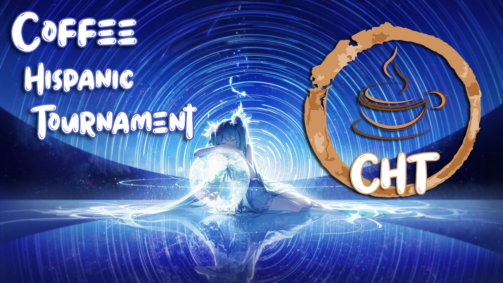

---
tags:
  - CH
  - CHT
---

# Coffee Hispanic Tournament

The **Coffee Hispanic Tournament** (***CHT***) was a single-elimination 2v2 osu! tournament hosted by ::{ flag=AR }:: [Vaf](https://osu.ppy.sh/users/12589048), ::{ flag=AR }:: [iNeuu\_Z](https://osu.ppy.sh/users/9112463), and ::{ flag=US }:: [tigereyes144](https://osu.ppy.sh/users/6499811). The tournament was restricted to Spanish-speaking countries only. This was the first instalment of the Coffee Hispanic Tournament.

## Tournament schedule

| Event | Timestamp |
| --: | :-- |
| Registration phase | 2019-12-22/2020-01-04 |
| Qualifiers | 2020-01-17/2020-01-20 |
| Round of 16 | 2020-01-25/2020-01-27 |
| Quarterfinals | 2020-01-31/2020-02-03 |
| Semifinals | 2020-02-07/2020-02-09 |
| Finals | 2020-02-15/2020-02-17 |

## Prizes

| Placing | Prizes |
| :-: | :-- |
|  | Unique profile badge, 4 months of osu!supporter for each team member |
|  | 2 months of osu!supporter for each team member |
|  | 1 month of osu!supporter for each team member |

## Organisation

The Coffee Hispanic Tournament was run by various community members.

| Position | Member(s) |
| :-- | :-- |
| Manager | ::{ flag=AR }:: [Vaf](https://osu.ppy.sh/users/12589048) |
| Administrator | ::{ flag=ES }:: [AzuuuNyan](https://osu.ppy.sh/users/9349479), ::{ flag=AR }:: [iNeuu\_Z](https://osu.ppy.sh/users/9112463), ::{ flag=US }:: [Pundice](https://osu.ppy.sh/users/7940696), ::{ flag=US }:: [tigereyes144](https://osu.ppy.sh/users/6499811) |
| Mappool selector | ::{ flag=PT }:: [My Angel Maki](https://osu.ppy.sh/users/11610772), ::{ flag=US }:: [stackerjoe](https://osu.ppy.sh/users/7279141) |
| Referee | ::{ flag=CA }:: [dqwed](https://osu.ppy.sh/users/9977100), ::{ flag=ES }:: [Karma](https://osu.ppy.sh/users/7196989), ::{ flag=AR }:: [Katsura Aimi](https://osu.ppy.sh/users/7102463), ::{ flag=SV }:: [Loarca](https://osu.ppy.sh/users/4650246), ::{ flag=AR }:: [-Nanahira-](https://osu.ppy.sh/users/6169195), ::{ flag=BG }:: [Ted](https://osu.ppy.sh/users/9717848), ::{ flag=CO }:: [TheAleboy](https://osu.ppy.sh/users/8921554), ::{ flag=FR }:: [TLQ_Yoshii](https://osu.ppy.sh/users/7157133), ::{ flag=CO }:: [Vanilla Aiz](https://osu.ppy.sh/users/12261024), ::{ flag=AR }:: [Yorumi-](https://osu.ppy.sh/users/7755726) |
| Streamer | ::{ flag=AR }:: [Vaf](https://osu.ppy.sh/users/12589048) |
| Commentator | ::{ flag=AR }:: [Amuro](https://osu.ppy.sh/users/7119659), ::{ flag=AR }:: [BossPlays](https://osu.ppy.sh/users/7341471), ::{ flag=AR }:: [juliancala](https://osu.ppy.sh/users/3272902), ::{ flag=ES }:: [Silver Falco](https://osu.ppy.sh/users/6573997), ::{ flag=AR }:: [Vaf](https://osu.ppy.sh/users/12589048) |
| Designer | ::{ flag=CO }:: [Clippy](https://osu.ppy.sh/users/6385568), ::{ flag=AR }:: [Viief](https://osu.ppy.sh/users/14020439) |
| Statistician | ::{ flag=QA }:: [Rimumu](https://osu.ppy.sh/users/5823005), ::{ flag=AR }:: [Vaf](https://osu.ppy.sh/users/12589048) |
| Wiki editor | ::{ flag=ID }:: [fajar13k](https://osu.ppy.sh/users/7100002) |

## Links

- [Discussion thread](https://osu.ppy.sh/community/forums/topics/1000567)
- [CHT Discord server](https://discord.gg/AFFXMu)
- [Livestream](https://twitch.tv/ivaf)
- [Challonge brackets](https://challonge.com/es/2n84slw8)
- **[Statistics sheet](https://docs.google.com/spreadsheets/d/1wGCrW2IdRmmnu_JKuAVEELSKvCm2zacyiLDLns0SwsM/edit#gid=1549366682)**

## Participants

| Team | Members |
| :-- | :-- |
| **DOU** | ::{ flag=AR }:: **[Shig](https://osu.ppy.sh/users/6117281)**, ::{ flag=MX }:: [Riot](https://osu.ppy.sh/users/4256461) |
| **Empanada** | ::{ flag=AR }:: **[Umi Sonoda](https://osu.ppy.sh/users/6474451)**, ::{ flag=ES }:: [ByYoshi14](https://osu.ppy.sh/users/4470553) |
| **Equipo Trece** | ::{ flag=AR }:: **[-Birke-](https://osu.ppy.sh/users/3265658)**, ::{ flag=AR }:: [juliancala](https://osu.ppy.sh/users/3272902) |
| **Gastón Noveno** | ::{ flag=AR }:: **[BTG4](https://osu.ppy.sh/users/10659233)**, ::{ flag=CO }:: [GaaL](https://osu.ppy.sh/users/2374950) |
| **Geometry Dash** | ::{ flag=AR }:: **[Vexiion](https://osu.ppy.sh/users/10361419)**, ::{ flag=AR }:: [AxelOsu](https://osu.ppy.sh/users/1887616) |
| **hallo y caspi** | ::{ flag=ES }:: **[caspi99](https://osu.ppy.sh/users/7610747)**, ::{ flag=DE }:: [hallowatcher](https://osu.ppy.sh/users/1874761) |
| **Jester S rank** | ::{ flag=MX }:: **[Viva Viva Happy](https://osu.ppy.sh/users/4269282)**, ::{ flag=UY }:: [daanit](https://osu.ppy.sh/users/6159669) |
| **Ladrillo** | ::{ flag=UY }:: **[Rondro](https://osu.ppy.sh/users/9293124)**, ::{ flag=CL }:: [ign](https://osu.ppy.sh/users/9360528) |
| **Noveno Gastón** | ::{ flag=ES }:: **[JoanaBob](https://osu.ppy.sh/users/10966302)**, ::{ flag=AR }:: [Mariano](https://osu.ppy.sh/users/6371395) |
| **Orgullo Peruano** | ::{ flag=AR }:: **[Awus](https://osu.ppy.sh/users/1991253)**, ::{ flag=PE }:: [Arnold24x24](https://osu.ppy.sh/users/2291265) |
| **Perrito Billetudo** | ::{ flag=CO }:: **[ElMick33](https://osu.ppy.sh/users/5458323)**, ::{ flag=MX }:: [-Hebel-](https://osu.ppy.sh/users/6169483) |
| **Radical** | ::{ flag=ES }:: **[AitorAmu](https://osu.ppy.sh/users/7781304)**, ::{ flag=CL }:: [iPunqcake](https://osu.ppy.sh/users/6633574) |
| **Rivals** | ::{ flag=AR }:: **[StreamKey](https://osu.ppy.sh/users/7586334)**, ::{ flag=AR }:: [Rimi](https://osu.ppy.sh/users/5194834) |
| **TPIOBJRANMJ FC** | ::{ flag=AR }:: **[Penguo](https://osu.ppy.sh/users/4389490)**, ::{ flag=CO }:: [Schwarze](https://osu.ppy.sh/users/6575153) |
| **un equipo** | ::{ flag=AR }:: **[Megafan](https://osu.ppy.sh/users/6632605)**, ::{ flag=VE }:: [-Dreamless](https://osu.ppy.sh/users/4426728) |
| **United States** | ::{ flag=CL }:: **[Barack](https://osu.ppy.sh/users/9402889)**, ::{ flag=PE }:: [Hoshinomori](https://osu.ppy.sh/users/4112621) |

## Podium

This competition has come to an end and resulted in the following podium:

| Placing | Team |
| :-: | :-- |
|  | **United States** (::{ flag=CL }:: **[Barack](https://osu.ppy.sh/users/9402889)**, ::{ flag=PE }:: [Hoshinomori](https://osu.ppy.sh/users/4112621)) |
|  | **Noveno Gaston** (::{ flag=ES }:: **[JoanaBob](https://osu.ppy.sh/users/10966302)**, ::{ flag=AR }:: [Mariano](https://osu.ppy.sh/users/6371395)) |
|  | **Hallo y caspi** (::{ flag=ES }:: **[caspi99](https://osu.ppy.sh/users/7610747)**, ::{ flag=DE }:: [hallowatcher](https://osu.ppy.sh/users/1874761)) |

## Mappools

### Finals

**[Download the mappack here! (128 MB)](https://www.mediafire.com/file/npyk3ttzwzx5fzh/finals_mappack.rar/file)**

- NoMod
  1. [Naoki Miki (CV: Takahashi Rie) & Ebisuzawa Kurumi (CV: Ozawa Ari) - Unhappy End World (Yasaija 714) \[kotachi's Happiness\]](https://osu.ppy.sh/beatmapsets/823259#osu/1725346)
  2. [xi - Blue Zenith (Asphyxia) \[RLC's Extra\]](https://osu.ppy.sh/beatmapsets/292301#osu/657916)
  3. [Nanahoshi Kangengakudan - No,39 (pkk) \[No Sankyuu\]](https://osu.ppy.sh/beatmapsets/531488#osu/1126317)
  4. [LIQU@. - Yotogibanashi no Kamikakushi (Kyubey) \[oko's Extra\]](https://osu.ppy.sh/beatmapsets/236396#osu/717133)
  5. [Krewella X DISKORD - Beggars (Consouls Remix) (Shadren) \[NeilRianno's Extra\]](https://osu.ppy.sh/beatmapsets/539203#osu/1236951)
  6. [sasakure.UK - Jack-the-Ripper (Sprosive) \[ReMiX\]](https://osu.ppy.sh/beatmapsets/23907#osu/94264)
- Hidden
  1. [Yuyoyuppe - Emerald Galaxy (pishifat) \[Expert\]](https://osu.ppy.sh/beatmapsets/682286#osu/1442757)
  2. [M2U - Velocity (Karen) \[Expert\]](https://osu.ppy.sh/beatmapsets/593985#osu/1256483)
  3. [kors k feat. Rie - Rising in the Sun (original mix) (soulfear) \[Another\]](https://bloodcat.com/osu/s/26742)
- HardRock
  1. [Kairiki bear - Manemane Psychotropic (scanter) \[Psycho\]](https://osu.ppy.sh/beatmapsets/113398#osu/541797)
  2. [OISHII - ONIGIRI FREEWAY (Niva) \[Extra\]](https://osu.ppy.sh/beatmapsets/873667#osu/1826135)
  3. [TOMOSUKE x Jazzin'park - LANA - Kiroku no Kakera (sasakure.UK Framework Remix) - (captin1) \[pishi's Insane\]](https://osu.ppy.sh/beatmapsets/286025#osu/993150)
- DoubleTime
  1. [Yuuhei Satellite - Tsuki ni Murakumo Hana ni Kaze (Aeril) \[Satellite's Lunatic\]](https://osu.ppy.sh/beatmapsets/734241#osu/1571656)
  2. [Halozy - Shining / STREAM (Yohanes) \[Lunatic\]](https://osu.ppy.sh/beatmapsets/419244#osu/907299)
  3. [Himeringo - Idola no Circus (HelloSCV) \[Gurvy's Insane\]](https://osu.ppy.sh/beatmapsets/147177#osu/366241)
  4. [Chiyoko - Alice's Mad Tea Party (neonat) \[Lunatic\]](https://osu.ppy.sh/beatmapsets/215151#osu/515360)
- FreeMod
  1. [A.SAKA - Nanatsu Issenzakura (yf\_bmp) \[Ayaya's Expert\]](https://osu.ppy.sh/beatmapsets/513731#osu/1493332)
  2. [Hommarju feat. Latte - masterpiece (simplistiC) \[Insane\]](https://osu.ppy.sh/beatmapsets/12483#osu/47152)
  3. [Kiryu - EVE (Flower) \[Another\]](https://osu.ppy.sh/beatmapsets/213434#osu/501755)
- Tiebreaker
  1. **[Nanahira - Petals (Kalibe) \[Flower\]](https://osu.ppy.sh/beatmapsets/592381#osu/1601880)**

### Semifinals

**[Download the mappack here! (104 MB)](https://www.mediafire.com/file/yjzttfvins5eaph/SF_Mappool.rar/file)**

- NoMod
  1. [Nanahira - Shinchoku Doudesuka? (Misure) \[Shinchoku\]](https://osu.ppy.sh/beatmapsets/342263#osu/1110623)
  2. [Tyrfing - Verflucht (Muya) \[Another\]](https://osu.ppy.sh/beatmapsets/965125#osu/2045906)
  3. [yuikonnu x sana - Fuzzy Future (Aeril) \[Meg's Extra\]](https://osu.ppy.sh/beatmapsets/545956#osu/1652184)
  4. [Zekk - Feelsleft0ut (J1\_) \[Nokris' Extra\]](https://osu.ppy.sh/beatmapsets/821587#osu/1722775)
  5. [Renard - Banned Forever (Blue Dragon) \[Nogard\]](https://osu.ppy.sh/beatmapsets/16349#osu/64267)
- Hidden
  1. [Dreamcatcher - YOU AND I (ailv) \[Together\]](https://osu.ppy.sh/beatmapsets/787672#osu/1653519)
  2. [Groove Coverage - The End (Nightcore Remix) (winber1) \[Insane\]](https://osu.ppy.sh/beatmapsets/24918#osu/84538)
  3. [bibuko - Sorairo Gahou (val0108) \[Nouk-Insane\]](https://osu.ppy.sh/beatmapsets/106010#osu/278273)
- HardRock
  1. [Frederic - oddloop (Komore) \[queerish dances\]](https://osu.ppy.sh/beatmapsets/595899#osu/1306493)
  2. [Faylan - Mind as Judgment (miccoliasms) \[Impossible\]](https://osu.ppy.sh/beatmapsets/10192#osu/43666)
  3. [kurokumo x konoco - Ifuudoudou (Kyuukai) \[Linada's Indecency\]](https://osu.ppy.sh/beatmapsets/656179#osu/1390352)
- DoubleTime
  1. [livetune adding Fukase (from SEKAI NO OWARI) - Take Your Way (Bearizm) \[Insane\]](https://osu.ppy.sh/beatmapsets/872916#osu/1843235)
  2. [Sum 41 - The Hell Song (Natteke) \[Hard\]](https://osu.ppy.sh/beatmapsets/23797#osu/81227)
  3. [BiBi - Love Novels (happy623) \[Insane\]](https://osu.ppy.sh/beatmapsets/111150#osu/289275)
- FreeMod
  1. [Streetlight Manifesto - Punk Rock Girl (Milan-) \[Extra\]](https://osu.ppy.sh/beatmapsets/577394#osu/1222034)
  2. [Rossini & MC F 40 - Guillaume Tell (Sushi971) \[Heavy\]](https://osu.ppy.sh/beatmapsets/11742#osu/44714)
  3. [TOTAL OBJECTION - Higurashi Moratorium (Shirasaka Koume) \[ExtrA\]](https://osu.ppy.sh/beatmapsets/702512#osu/1486534)
- Tiebreaker
  1. **[DragonForce - Symphony of the Night (09kami) \[Legend\]](https://osu.ppy.sh/beatmapsets/459901#osu/985141)**

### Quarterfinals

**[Download the mappack here! (96 MB)](https://www.mediafire.com/file/u4ca2pur4p2kkqa/QF_Mappool.rar/file)**

- NoMod
  1. [Guilty Kiss - Strawberry Trapper (Asaiga) \[Collab in Dice\]](https://osu.ppy.sh/beatmapsets/496107#osu/1057469)
  2. [xi - Garyou Tensei (Sulfur) \[Extreme\]](https://osu.ppy.sh/beatmapsets/884992#osu/1925798)
  3. [Cilvery - Kamisama Nejimaki (sukiNathan) \[pk's Extra\]](https://osu.ppy.sh/beatmapsets/374900#osu/827835)
  4. [Camellia feat. Nanahira - Bassdrop Freaks (2018 "Redrop" ver.) (Mir) \[Lasse's Extra\]](https://osu.ppy.sh/beatmapsets/806859#osu/1694583)
  5. [Imperial Circus Dead Decadence - Shinbatsu o Tadori Kyoukotsu ni Itaru (Kite) \[Extra Collab\]](https://osu.ppy.sh/beatmapsets/482382#osu/2040764)
- Hidden
  1. [Glutamine - Tokyo Teddy Bear (Dark Fang) \[0108's Extra\]](https://osu.ppy.sh/beatmapsets/310681#osu/697346)
  2. [kaztora, eba, Misaki Nakajima - Messiah (Shinxyn) \[Insane\]](https://osu.ppy.sh/beatmapsets/21877#osu/75689)
- HardRock
  1. [ttbt - Makkuro Flandre S Shuuseiban (moonlightleaf) \[Narcissu's Lunatic\]](https://osu.ppy.sh/beatmapsets/113458#osu/973438)
  2. [beatMARIO(COOL&CREATE) - Aki nation (Crimmi) \[NIGHTMARE\]](https://osu.ppy.sh/beatmapsets/476535#osu/1051179)
- DoubleTime
  1. [senya - Next Stage (smsh150) \[Next Stage\]](https://osu.ppy.sh/beatmapsets/288998#osu/680934)
  2. [Cascada - Truly Madly Deeply (Nightcore Mix) (osuplayer111) \[Insane\]](https://osu.ppy.sh/beatmapsets/30688#osu/101210)
  3. [Lindsey Stirling - Senbonzakura (MrSergio) \[Insane\]](https://osu.ppy.sh/beatmapsets/277421#osu/720172)
- FreeMod
  1. [SHIKI - BABYLON (miccoliasms) \[Another\]](https://osu.ppy.sh/beatmapsets/31373#osu/103132)
  2. [Brandy - Cross Time !! (Leader) \[captin's Extra\]](https://osu.ppy.sh/beatmapsets/973162#osu/2067296)
  3. [Rin - Mythic set \~ Heart-Stirring Urban Legends (yaspo) \[Another\]](https://osu.ppy.sh/beatmapsets/676064#osu/1429975)
- Tiebreaker
  1. **[ESQUARIA - Loreleied - RUON Remix - (Lasse) \[Lunatic\]](https://osu.ppy.sh/beatmapsets/790734#osu/1659100)**

### Round of 16

**[Download the mappack here! (83 MB)](https://www.mediafire.com/file/s2shtc345su8t5z/CHT_R016_Mappool.rar/file)**

- NoMod
  1. [Jin ft. LiSA - Headphone Actor (captin1) \[Survival\]](https://osu.ppy.sh/beatmapsets/217105#osu/509346)
  2. [xi - Bad Elixir (Cherry Blossom) \[Another\]](https://osu.ppy.sh/beatmapsets/878944#osu/1857527)
  3. [Co shu Nie - ZETTAI ZETSUMEI (Crissa) \[Extra\]](https://osu.ppy.sh/beatmapsets/918776#osu/1919057)
  4. [Camellia - overcomplexification (ProfessionalBox) \[byfar's Extra\]](https://osu.ppy.sh/beatmapsets/351408#osu/934812)
- Hidden
  1. [Nishikino Maki(CV.Pile) & Yazawa Nico(CV.Tokui Sora) - Zurui yo Magnetic today (Xinely) \[Hinsvar's Expert\]](https://osu.ppy.sh/beatmapsets/455273#osu/976695)
  2. [Atoguru - UNDER WORLD (sirjuyt) \[Heart\]](https://osu.ppy.sh/beatmapsets/44628#osu/157298)
- HardRock
  1. [nano x yuyoyuppe - Beautiful ground (theramdans) \[A Mystery's Insane\]](https://osu.ppy.sh/beatmapsets/206737#osu/764839)
  2. [Tatsh - Kachoufuusetsu (Al-Azif) \[Another\]](https://osu.ppy.sh/beatmapsets/4598#osu/24575)
- DoubleTime
  1. [senya - Kimi to Dareka no Yasashisa ni (kakifly) \[Affection\]](https://osu.ppy.sh/beatmapsets/250337#osu/596161)
  2. [Can't Stop Won't Stop (feat. Fresh Big Mouf) - Mighty & High (thiev) \[Insane\]](https://osu.ppy.sh/beatmapsets/770361#osu/1744709)
- FreeMod
  1. [onoken - felys (Kloyd) \[Another\]](https://osu.ppy.sh/beatmapsets/235496#osu/546339)
  2. [MY FIRST STORY - Fukagyaku Replace (Broccoly) \[pishi's Extra\]](https://osu.ppy.sh/beatmapsets/383270#osu/870566)
  3. [Team "Hanayamata" - Hana wa Odore ya Irohaniho (Fycho) \[yf's Insane\]](https://osu.ppy.sh/beatmapsets/529815#osu/1128414)
- Tiebreaker
  1. **[y0c1e - No buts! (Lazer) \[Adrenaline\]](https://osu.ppy.sh/beatmapsets/402278#osu/874939)**

### Qualifiers

**[Download the mappack here! (66 MB)](https://www.mediafire.com/file/wn4sqp2gdkdfpw7/CHT_Mappool.rar/file)**

- NoMod
  1. [Yonezawa Madoka - Responsibility Response (ShiraKai) \[Phantom\]](https://osu.ppy.sh/beatmapsets/276997#osu/627765)
  2. [xi - Akasha (Jemmmmy) \[U38's Another\]](https://osu.ppy.sh/beatmapsets/118768#osu/323883)
  3. [Memme - Pandemonium (sdafsf) \[Lasse's Extra: #8\]](https://osu.ppy.sh/beatmapsets/734190#osu/1550984)
- Hidden
  1. [Lapix - LAST GAME (Shadren) \[Slayed's Insane\]](https://osu.ppy.sh/beatmapsets/524004#osu/1137713)
  2. [P\*Light - SAY BAY (MrMenda) \[Knight's Another\]](https://osu.ppy.sh/beatmapsets/807330#osu/1694422)
- HardRock
  1. [Amatsuki - Outer Science (HelloSCV) \[Insane\]](https://osu.ppy.sh/beatmapsets/134767#osu/337873)
  2. [Guilty Kiss - KOWAREYASUKI (ktgster) \[Insane\]](https://osu.ppy.sh/beatmapsets/766867#osu/1619027)
- DoubleTime
  1. [senya - Shunkan Everlasting (Naotoshi) \[Hard\]](https://osu.ppy.sh/beatmapsets/657870#osu/1414839)
  2. [Tia - Deal with the devil (-Mikan) \[ShadowX's Hard\]](https://osu.ppy.sh/beatmapsets/819239#osu/1882028)

## Match results

### Finals

Saturday, 15 February 2020:

| Team 1 |  |  | Team 2 | Match link |
| --: | :-: | :-: | :-- | :-- |
| **Hallo y caspi** | **7** | 1 | Ladrillo | [#1](https://osu.ppy.sh/community/matches/58471366) |

Monday, 17 February 2020:

| Team 1 |  |  | Team 2 | Match link |
| --: | :-: | :-: | :-- | :-- |
| **United States** | **7** | 3 | Noveno Gaston | [#1](https://osu.ppy.sh/community/matches/58530443) |

### Semifinals

Friday, 7 February 2020:

| Team 1 |  |  | Team 2 | Match link |
| --: | :-: | :-: | :-- | :-- |
| Hallo y Caspi | 3 | **6** | **United States** | [#1](https://osu.ppy.sh/community/matches/58274385) |

Sunday, 9 February 2020:

| Team 1 |  |  | Team 2 | Match link |
| --: | :-: | :-: | :-- | :-- |
| **Noveno Gaston** | **6** | 4 | Ladrillo | [#1](https://osu.ppy.sh/community/matches/58333712) |

### Quarterfinals

Friday, 31 January 2020:

| Team 1 |  |  | Team 2 | Match link |
| --: | :-: | :-: | :-- | :-- |
| **hallo y caspi** | **5** | 2 | Radical | [#1](https://osu.ppy.sh/community/matches/58108351) |

Sunday, 2 February 2020:

| Team 1 |  |  | Team 2 | Match link |
| --: | :-: | :-: | :-- | :-- |
| **Noveno Gaston** | **0** | -1 | Geometry Dash | *win by default* |

Monday, 3 February 2020:

| Team 1 |  |  | Team 2 | Match link |
| --: | :-: | :-: | :-- | :-- |
| **Ladrillo** | **5** | 4 | Orgullo Peruano | [#1](https://osu.ppy.sh/community/matches/58170771) |
| **United States** | **5** | 2 | Empanada | [#1](https://osu.ppy.sh/community/matches/58187610) |

### Round of 16

Saturday, 25 January 2020:

| Team 1 |  |  | Team 2 | Match link |
| --: | :-: | :-: | :-- | :-- |
| **United States** | **5** | 4 | un equipo | [#1](https://osu.ppy.sh/community/matches/57976602) |
| **Empanada** | **5** | 4 | Gaston Noveno | [#1](https://osu.ppy.sh/community/matches/57979635) |

Sunday, 26 January 2020:

| Team 1 |  |  | Team 2 | Match link |
| --: | :-: | :-: | :-- | :-- |
| **Noveno Gaston** | **5** | 3 | Jester S Rank | [#1](https://osu.ppy.sh/community/matches/57997604) |
| **Hallo y Caspi** | **5** | 4 | TPIOBJRANMJ FC | [#1](https://osu.ppy.sh/community/matches/58000264) |
| Perrito Billetudo | 4 | **5** | **Radical** | [#1](https://osu.ppy.sh/community/matches/57998997) |
| **Ladrillo** | **5** | 0 | DOU | [#1](https://osu.ppy.sh/community/matches/58003787) |

Monday, 27 January 2020:

| Team 1 |  |  | Team 2 | Match link |
| --: | :-: | :-: | :-- | :-- |
| **Geometry Dash** | **5** | 1 | Equipo Trece | [#1](https://osu.ppy.sh/community/matches/58006943) |
| **Orgullo Peruano** | **5** | 2 | Rivals | [#1](https://osu.ppy.sh/community/matches/58008265) |

### Qualifiers

#### Tier 1

| Seed | Player | Total points |
| --: | :-- | --: |
| #1 | ::{ flag=ES }:: [ByYoshi14](https://osu.ppy.sh/users/4470553) | 33 |
| #2 | ::{ flag=DE }:: [hallowatcher](https://osu.ppy.sh/users/1874761) | 42 |
| #3 | ::{ flag=PE }:: [Arnold24x24](https://osu.ppy.sh/users/2291265) | 52 |
| #4 | ::{ flag=MX }:: [-Hebel-](https://osu.ppy.sh/users/6169483) | 55 |
| #5 | ::{ flag=AR }:: [Mariano](https://osu.ppy.sh/users/6371395) | 64 |
| #6 | ::{ flag=AR }:: [AxelOsu](https://osu.ppy.sh/users/1887616) | 68 |
| #6 | ::{ flag=PE }:: [Hoshinomori](https://osu.ppy.sh/users/4112621) | 68 |
| #8 | ::{ flag=MX }:: [Riot](https://osu.ppy.sh/users/4256461) | 69 |
| #9 | ::{ flag=AR }:: [Amuro](https://osu.ppy.sh/users/7119659) | 76 |
| #10 | ::{ flag=AR }:: [BossPlays](https://osu.ppy.sh/users/7341471) | 78 |
| #11 | ::{ flag=UY }:: [-PloX](https://osu.ppy.sh/users/6404583) | 80 |
| #12 | ::{ flag=CL }:: [Intercambing](https://osu.ppy.sh/users/2546001) | 84 |
| #13 | ::{ flag=MX }:: [-Wolfy-](https://osu.ppy.sh/users/4497582) | 86 |
| #14 | ::{ flag=ES }:: [RivenXLukario](https://osu.ppy.sh/users/9582556) | 90 |
| #15 | ::{ flag=CL }:: [Danidesu](https://osu.ppy.sh/users/2748187) | 135 |
| #16 | ::{ flag=CL }:: [Deruz](https://osu.ppy.sh/users/5386106) | 144 |
| #17 | ::{ flag=CL }:: [Fudy](https://osu.ppy.sh/users/4576295) | 153 |
| #18 | ::{ flag=CL }:: [Dylson](https://osu.ppy.sh/users/6315784) | 162 |

#### Tier 2

| Seed | Player | Total points |
| --: | :-- | --: |
| #1 | ::{ flag=AR }:: [Penguo](https://osu.ppy.sh/users/4389490) | 33 |
| #2 | ::{ flag=CL }:: [ign](https://osu.ppy.sh/users/9360528) | 35 |
| #3 | ::{ flag=VE }:: [-Dreamless](https://osu.ppy.sh/users/4426728) | 36 |
| #4 | ::{ flag=AR }:: [juliancala](https://osu.ppy.sh/users/3272902) | 42 |
| #4 | ::{ flag=AR }:: [Rimi](https://osu.ppy.sh/users/5194834) | 42 |
| #6 | ::{ flag=CO }:: [GaaL](https://osu.ppy.sh/users/2374950) | 48 |
| #7 | ::{ flag=UY }:: [daanit](https://osu.ppy.sh/users/6159669) | 55 |
| #8 | ::{ flag=CL }:: [iPunqcake](https://osu.ppy.sh/users/6633574) | 84 |
| #9 | ::{ flag=RO }:: [Lisko](https://osu.ppy.sh/users/11948017) | 85 |
| #10 | ::{ flag=PA }:: [hammytr](https://osu.ppy.sh/users/11562243) | 91 |
| #11 | ::{ flag=ES }:: [GokuLook](https://osu.ppy.sh/users/7684497) | 92 |
| #12 | ::{ flag=CL }:: [\[- Wolfy -\]](https://osu.ppy.sh/users/2811909) | 92 |
| #13 | ::{ flag=ES }:: [Moewagon](https://osu.ppy.sh/users/5764169) | 93 |
| #14 | ::{ flag=CO }:: [Rushy](https://osu.ppy.sh/users/5281857) | 116 |
| #15 | ::{ flag=AR }:: [Cata](https://osu.ppy.sh/users/5958063) | 135 |
| #16 | ::{ flag=DO }:: [TheRealWillLITE](https://osu.ppy.sh/users/6677788) | 144 |
| #17 | ::{ flag=MX }:: [lokillo_999](https://osu.ppy.sh/users/5317898) | 153 |
| #18 | ::{ flag=ES }:: [sorangan](https://osu.ppy.sh/users/6961543) | 162 |
| #19 | ::{ flag=BO }:: [Frio\_](https://osu.ppy.sh/users/6771098) | 171 |
| #20 | ::{ flag=AR }:: [-Kao-](https://osu.ppy.sh/users/7807935) | 180 |

#### Tier 3

| Seed | Player | Total points |
| --: | :-- | --: |
| #1 | ::{ flag=ES }:: [AitorAmu](https://osu.ppy.sh/users/7781304) | 19 |
| #2 | ::{ flag=MX }:: [Viva Viva Happy](https://osu.ppy.sh/users/4269282) | 37 |
| #3 | ::{ flag=AR }:: [BTG4](https://osu.ppy.sh/users/10659233) | 46 |
| #4 | ::{ flag=AR }:: [StreamKey](https://osu.ppy.sh/users/7586334) | 47 |
| #5 | ::{ flag=AR }:: [-Birke-](https://osu.ppy.sh/users/3265658) | 55 |
| #6 | ::{ flag=AR }:: [Megafan](https://osu.ppy.sh/users/6632605) | 56 |
| #7 | ::{ flag=UY }:: [Rondro](https://osu.ppy.sh/users/9293124) | 60 |
| #8 | ::{ flag=CO }:: [Schwarze](https://osu.ppy.sh/users/6575153) | 72 |
| #9 | ::{ flag=ES }:: [NotHans](https://osu.ppy.sh/users/9551773) | 80 |
| #10 | ::{ flag=CL }:: [-Bowee-](https://osu.ppy.sh/users/3572699) | 89 |
| #11 | ::{ flag=PR }:: [Tepi20](https://osu.ppy.sh/users/9480554) | 93 |
| #12 | ::{ flag=HN }:: [- Nel -](https://osu.ppy.sh/users/7975986) | 96 |
| #13 | ::{ flag=AR }:: [NEDEAAAHHHH](https://osu.ppy.sh/users/65724) | 101 |
| #14 | ::{ flag=CL }:: [\[- J u l i e -\]](https://osu.ppy.sh/users/12211248) | 110 |
| #15 | ::{ flag=AR }:: [Miltoon](https://osu.ppy.sh/users/10582071) | 119 |
| #16 | ::{ flag=PE }:: [-Hasaki-](https://osu.ppy.sh/users/9037054) | 144 |
| #17 | ::{ flag=AR }:: [-Zeid-](https://osu.ppy.sh/users/2212950) | 153 |

#### Tier 4

| Seed | Player | Total points |
| --: | :-- | --: |
| #1 | ::{ flag=AR }:: [Shig](https://osu.ppy.sh/users/6117281) | 18 |
| #2 | ::{ flag=CL }:: [Barack](https://osu.ppy.sh/users/9402889) | 40 |
| #3 | ::{ flag=AR }:: [Vexiion](https://osu.ppy.sh/users/10361419) | 47 |
| #4 | ::{ flag=ES }:: [JoanaBob](https://osu.ppy.sh/users/10966302) | 50 |
| #5 | ::{ flag=CO }:: [ElMick33](https://osu.ppy.sh/users/5458323) | 54 |
| #6 | ::{ flag=AR }:: [Awus](https://osu.ppy.sh/users/1991253) | 56 |
| #7 | ::{ flag=ES }:: [caspi99](https://osu.ppy.sh/users/7610747) | 70 |
| #8 | ::{ flag=AR }:: [Umi Sonoda](https://osu.ppy.sh/users/6474451) | 73 |
| #9 | ::{ flag=AR }:: [\[Rin Hoshizora\]](https://osu.ppy.sh/users/11238108) | 83 |
| #10 | ::{ flag=AR }:: [Keyz](https://osu.ppy.sh/users/10408325) | 89 |
| #11 | ::{ flag=AR }:: [NaitsaGuin](https://osu.ppy.sh/users/2438483) | 91 |
| #12 | ::{ flag=ES }:: [MaTrihhh](https://osu.ppy.sh/users/5248352) | 96 |
| #13 | ::{ flag=ES }:: [marth0](https://osu.ppy.sh/users/6366060) | 101 |
| #14 | ::{ flag=PA }:: [luca -](https://osu.ppy.sh/users/12758218) | 119 |
| #15 | ::{ flag=MX }:: [Keversan](https://osu.ppy.sh/users/12134286) | 130 |
| #16 | ::{ flag=CL }:: [Nawala](https://osu.ppy.sh/users/8665990) | 131 |
| #17 | ::{ flag=CL }:: [Hide On 1-2](https://osu.ppy.sh/users/11020221) | 153 |
| #18 | ::{ flag=CL }:: [Plntote](https://osu.ppy.sh/users/7559996) | 165 |
| #19 | ::{ flag=ES }:: [AlexBiazzz](https://osu.ppy.sh/users/10514394) | 172 |
| #20 | ::{ flag=EC }:: [UnWeCualquiera](https://osu.ppy.sh/users/11783312) | 174 |
| #21 | ::{ flag=PY }:: [\_splenty](https://osu.ppy.sh/users/10966088) | 183 |
| #22 | ::{ flag=PE }:: [Leongf](https://osu.ppy.sh/users/9103105) | 192 |
| #23 | ::{ flag=PE }:: [Waynedude](https://osu.ppy.sh/users/9138491) | 211 |

- Only the top 8 from each tiers could proceed to form a team of 2 and move on to knockout stage
- More detailed qualifiers result can be accessed via this [spreadsheet](https://docs.google.com/spreadsheets/d/1wGCrW2IdRmmnu_JKuAVEELSKvCm2zacyiLDLns0SwsM/edit#gid=1549366682)
- Average was determined by `Σ position earned when playing the qualifiers mappool (in each tiers)`, the lower the score the better

## Ruleset

### General rules

1. Coffee Hispanic Tournament is a **2 versus 2 osu!** tournament and will use **Score V2** as the scoring system.
2. The tournament will use **single-elimination** bracket system, meanings single lose and you will be eliminated from the tournament.
3. This is a tournament where only players from [Hispanic countries](https://en.wikipedia.org/wiki/Hispanic#Spanish-speaking_countries_and_regions) can enter. In case of having a non-hispanic flag but being Hispanic, players should justify with the manager regarding their nationality.
4. There are 4 tiers splitted by osu! ranks, more details below:
   - Tier 1: Rank #1 - #1,100
   - Tier 2: Rank #1,101 - #4,000
   - Tier 3: Rank #4,001 - #8,000
   - Tier 4: Rank #8,001 - #25,000
5. Players will form a team of 2 **if they are one of the top 8 from each tiers in Qualifiers**. The team composition will use a fixed formula:
   - Tier 1 will be paired with Tier 4 with flipped position rules applied
   - Tier 2 will be paired with Tier 3 with flipped position rules applied
   - Team composition example:
     - 1st place in tier 1 will be paired with 8th place in tier 4
     - 2nd place in tier 2 will be paired with 7th place in tier 3
     - 3rd place in tier 3 will be paired with 6th place in tier 2
     - 4th place in tier 4 will be paired with 5th place in tier 1
6. Players are allowed to be below #25,000 in rank when the registration phase are still open but when they close players must be within the rank range.
7. Registration can be accessed through the [Google form](https://forms.gle/18TgJQ5hMgfnsAnS7) and by joining the Discord server. In case of not doing both, their registration won't be taken into account.
8. Once they get into the Discord server, they need to change their Discord nickname to their osu! username.
9. All members within the organisation couldn't participate in the tournament, with the exceptions of mappool selector, designer, and commentator.
10. In case of any suspicious registrations, manager has all the rights to reject the application.
11. Any excessive toxic behaviour in the match/discord may proceed to a disqualification from the tournament.

### Match instructions

1. Referees are going to make the lobby and send invitations 10 minutes prior to each match. Players are also going to be pinged through Discord in case they are currently offline on osu!.
2. The time limit to enter the lobby/match in the qualifiers is **10 minutes**. If they can't make it after the time limit, it will be counted as a no show.
3. Every team is allowed to reeschedule. However, it has to be at least 1 hour prior to the inital schedule, and in case of not showing to the match it will be counted as a no show.
4. If you show up later to a Qualifiers lobby (As long as the 10 minute time limit hasn't gone through) you are able to play the maps you couldn't play by asking the referee when all maps come to an end.
5. The winner of the `!roll` may choose between banning first and picking second or banning second and picking first.
6. There will be only **1 ban** per team on the Round of 16. Nevertheless, from the Quarterfinals and forward, each team will have **2 bans**.
7. When playing FreeMod, it's necessary that at least 1 player has to use a mod in from each team. Using more than 1 mod is allowed.
8. Time available to banning/picking maps is **2 minutes**.
9. All Warmup maps must be below **4:00**.
10. In case that one team does not ban or pick between the time set, the ban/pick will go to the other team and another time limit will be established.
11. Failed Scores will be counted on the final score. Including Qualifiers scores.
12. If a player disconnects before the 25% of the map, the map will be replayed once again. However, if there is another disconnection by the same player then the point will be granted to the other team.
13. If a player disconnects after the 25% of any map, the point will be automatically given to the opponent unless there is evidence that their score was higher than their opponent´s (as long as it was not on purpose).
14. If a player disconnects and doesn't rejoin or give any sign that the player is online in osu! or Discord after 10 minutes, then the match will be a win by default by the opposing team.
15. Any Mod is allowed on the Tiebreaker although they are not compulsory.
16. EZ mod has a multiplier of x2

### Scheduling instructions

1. All schedules are going to be on UTC+0 due to the fact that many countries have different timezones and its easier this way. Timezone conversion can be done through this [website](https://www.timeanddate.com/worldclock/converter.html).
2. The Qualifiers mappool will be played twice. All players are allowed to play a rerun in their own lobby or in other lobby of their preference.
3. All matches are going to be livestreamed.
4. Pool Star Rating will differ in the 6 mappools of the tournament. There will be 1 overall pool for everyone in the Qualifiers Stage.
