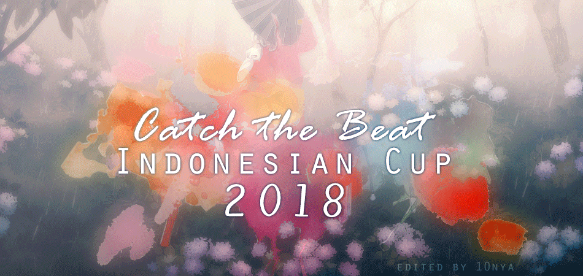
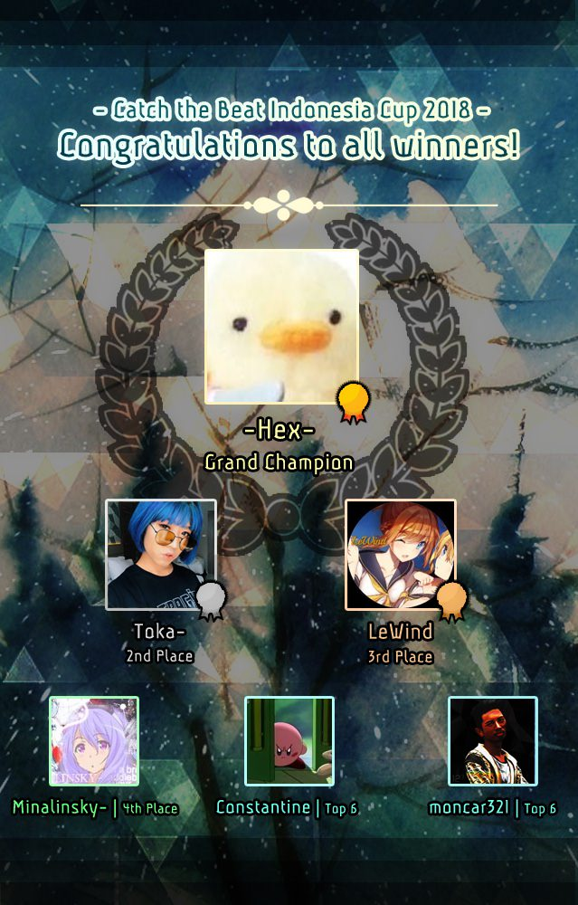

---
tags:
  - CIC 2018
  - CIC2018
---

# Catch the Beat Indonesia Cup 2018

The **Catch the Beat Indonesia Cup 2018** (***CIC 2018***) was a 1v1 Indonesian osu!catch tournament hosted by ::{ flag=ID }:: [\[490\]Kazuyo](https://osu.ppy.sh/users/1830361). It was the sixth instalment of the Catch the Beat Indonesia Cup.

## Tournament schedule

| Event | Timestamp |
| --: | :-- |
| Registration phase | 2018-07-28/2018-08-05 |
| Group stage | 2018-08-06/2018-08-16 |
| Round of 16 | 2018-08-17/2018-08-19 |
| Quarterfinals | 2018-08-20/2018-08-26 |
| Semifinals | 2018-08-27/2018-09-02 |
| Finals | 2018-09-03/2018-09-09 |
| Grand Finals | 2018-09-10 |

## Prizes

| Placing | Prize(s) |
| :-: | :-- |
|  | 50% of the prize pool, profile badge |
|  | 30% of the prize pool |
|  | 20% of the prize pool |

## Organisation

The Catch the Beat Indonesia Cup 2018 was run by various Indonesian osu!catch community members.

| Position | Member(s) |
| :-- | :-- |
| Manager | ::{ flag=ID }:: [\[490\]Kazuyo](https://osu.ppy.sh/users/1830361), ::{ flag=ID }:: [Senritsu](https://osu.ppy.sh/users/1165368), ::{ flag=ID }:: [Yukaa-](https://osu.ppy.sh/users/5876959) |
| Mappool selector | ::{ flag=ID }:: [dika312](https://osu.ppy.sh/users/741613), ::{ flag=ID }:: [Galaxi](https://osu.ppy.sh/users/2552435), ::{ flag=ID }:: [Shurelia](https://osu.ppy.sh/users/3807986) |
| Streamer | ::{ flag=ID }:: [Niva](https://osu.ppy.sh/users/197805) |
| Commentator | ::{ flag=ID }:: [Akebono](https://osu.ppy.sh/users/1815316), ::{ flag=ID }:: [Kuro Fuyusaki](https://osu.ppy.sh/users/2667496), ::{ flag=ID }:: [MizzoKing-](https://osu.ppy.sh/users/3285320), ::{ flag=ID }:: [RJR-sama](https://osu.ppy.sh/users/7187832), ::{ flag=ID }:: [Sayori-kun](https://osu.ppy.sh/users/3345905) |
| Referee | ::{ flag=ID }:: [GSculerlor](https://osu.ppy.sh/users/5011137), ::{ flag=ID }:: [Ulat Bulu](https://osu.ppy.sh/users/3484548), ::{ flag=ID }:: [RJR-sama](https://osu.ppy.sh/users/7187832), ::{ flag=ID }:: [yuki9007](https://osu.ppy.sh/users/6198367) |
| Sponsor | ::{ flag=ID }:: [Tama-desu](https://osu.ppy.sh/users/3813174), ::{ flag=ID }:: [DennySega24](https://osu.ppy.sh/users/5416487), ::{ flag=ID }:: [Jekate](https://osu.ppy.sh/users/965708), ::{ flag=ID }:: [El SolarBeam](https://osu.ppy.sh/users/1074710) |
| Wiki editor | ::{ flag=ID }:: [GSculerlor](https://osu.ppy.sh/users/5011137), ::{ flag=ID }:: [fajar13k](https://osu.ppy.sh/users/7100002) |

## Links

- [Discussion thread](https://osu.ppy.sh/community/forums/topics/780969)
- [CIC 2018 Discord](http://discord.gg/dKcVbWE)
- [Livestream](https://www.twitch.tv/osuindonesia)
- [Challonge brackets](https://challonge.com/CIC2018)

## Participants

| Group |  |  |  |
| :-: | :-- | :-- | :-- |
| **A** | ::{ flag=ID }:: [Execration-](https://osu.ppy.sh/users/9260926) | ::{ flag=ID }:: [Albedo-sama](https://osu.ppy.sh/users/12123120) | ::{ flag=ID }:: [LeWind](https://osu.ppy.sh/users/9718235) |
| **B** | ::{ flag=ID }:: [Sayori-kun](https://osu.ppy.sh/users/3345905) | ::{ flag=ID }:: [ExRei](https://osu.ppy.sh/users/1929336) | ::{ flag=ID }:: [Ilhamuharam](https://osu.ppy.sh/users/7657968) |
| **C** | ::{ flag=ID }:: [Emily Yukari](https://osu.ppy.sh/users/7053866) | ::{ flag=ID }:: [DennySega24](https://osu.ppy.sh/users/5416487) | ::{ flag=ID }:: [Emilia-Satella](https://osu.ppy.sh/users/1096240) |
| **D** | ::{ flag=ID }:: [Toka-](https://osu.ppy.sh/users/1595221) | ::{ flag=ID }:: [Shiviaren](https://osu.ppy.sh/users/3429259) | ::{ flag=ID }:: [Furdek](https://osu.ppy.sh/users/8146190) |
| **E** | ::{ flag=ID }:: [moncar321](https://osu.ppy.sh/users/1400073) | ::{ flag=ID }:: [Intention](https://osu.ppy.sh/users/3416858) | ::{ flag=ID }:: [Minalinsky-](https://osu.ppy.sh/users/2823883) |
| **F** | ::{ flag=ID }:: [Riria Rakira](https://osu.ppy.sh/users/6310025) | ::{ flag=ID }:: [HerpKiller](https://osu.ppy.sh/users/8784992) | ::{ flag=ID }:: [-Hex-](https://osu.ppy.sh/users/8630988) |
| **G** | ::{ flag=ID }:: [THS](https://osu.ppy.sh/users/1218514) | ::{ flag=ID }:: [Yuki Tanaka](https://osu.ppy.sh/users/1898048) | ::{ flag=ID }:: [Constantine](https://osu.ppy.sh/users/3221898) |
| **H** | ::{ flag=ID }:: [-Izayoi](https://osu.ppy.sh/users/5710721) | ::{ flag=ID }:: [yogafm](https://osu.ppy.sh/users/3247173) | ::{ flag=ID }:: [Buyut](https://osu.ppy.sh/users/9608136) |

## Podium

## Mappools

### Finals

**[Download the mappack here! (125 MB)](https://ritsu.s-ul.eu/ll4eK9XS)**

- NoMod
  1. [Studio EIM - Crescent Moon Island Boss Theme (Emiru) \[Keaghan\]](https://osu.ppy.sh/beatmapsets/817364#fruits/1714006)
  2. [ZUN - Kobito of the Shining Needle ~ Little Princess (Yumeno Himiko) \[exam's Rain\]](https://osu.ppy.sh/beatmapsets/801435#fruits/1682267)
  3. [TERRASPEX - AMAZING BREAK (Spectator) \[KYUARE SPEC'S INVASION\]](https://osu.ppy.sh/beatmapsets/727329#fruits/1535572)
  4. [USAO - BroGamer (Emiru) \[Razor's Deluge\]](https://osu.ppy.sh/beatmapsets/701726#fruits/1559940)
  5. [maras k - Play Time!! (Reol) \[Let's Play\]](https://osu.ppy.sh/beatmapsets/345325#osu/762631)
  6. [Kano - Sukisuki Zecchoushou (Loreley) \[Lovesickness\]](https://osu.ppy.sh/beatmapsets/484532#fruits/1047758)
- HardRock
  1. [Camellia - Proluvies (Sinnoh) \[Contingency\]](https://osu.ppy.sh/beatmapsets/657459#fruits/1392594)
  2. [a_hisa - Tokei no Heya to Seishin Sekai (Spectator) \[Kyuare Spec's  Overdose\]](https://osu.ppy.sh/beatmapsets/639409#fruits/1356120)
  3. [xi - Glorious crown (Monstrata) \[FOUR DIMENSIONS\]](https://osu.ppy.sh/beatmapsets/558694#osu/1181761)
  4. [SHK - Death Moon II (ktgster) \[SHD\]](https://osu.ppy.sh/beatmapsets/472158#fruits/1009022)
- DoubleTime
  1. [Team "Hanayamata" - Yorokobi Synchronicity (Xinely) \[Cherry Blossom\]](https://osu.ppy.sh/beatmapsets/368312#fruits/872349)
  2. [Nekomata Master - Sennen no Kotowari (Sinnoh) \[Rain\]](https://osu.ppy.sh/beatmapsets/695431#fruits/1475261)
  3. [Sayuri - Mikazuki (handsome) \[Master\]](https://osu.ppy.sh/beatmapsets/481703#fruits/1028017)
  4. [zts - dreamenddischarger (ChronoSP) \[Love Letter\]](https://osu.ppy.sh/beatmapsets/339615#fruits/758298)
- Hidden
  1. [Kagamine Rin - Oni Kanojo (Spectator) \[Spec's CTB\]](https://osu.ppy.sh/beatmapsets/486433#fruits/1037254)
  2. [Kurokotei - Valkyrie Attack (alienflybot) \[Havoc\]](https://osu.ppy.sh/beatmapsets/793794#fruits/1667152)
  3. [Koronba - Iwashi ga Tsuchi kara Haete Kurunda (Damnjelly) \[Sardine\]](https://osu.ppy.sh/beatmapsets/602367#fruits/1580728)
  4. [seleP - Scarlet Rose (pkk) \[X\]](https://osu.ppy.sh/beatmapsets/528089#fruits/1120184)
- Tiebreaker
  1. **[RoughSketch feat. DD "Nakata" Metal - Booths of Fighters (Camellia's "Barrage of Flurries" Remix) (Ascendance) \[Ascendance and Plus's Onslaught\]](https://osu.ppy.sh/beatmapsets/809971#fruits/1699518)**

### Semifinals

**[Download the mappack here! (110 MB)](https://ritsu.s-ul.eu/Si0ewAh0)**

- NoMod
  1. [NeLiME - CODE NAME : GAMMA (Hareimu) \[Chaos\]](https://osu.ppy.sh/beatmapsets/815067#fruits/1709451)
  2. [Kikuo - Neko no Shokutaku (dika312) \[Overdose\]](https://osu.ppy.sh/beatmapsets/839016#fruits/1756467)
  3. [An - Saigo (Rocma) \[Collaboration Finale\]](https://osu.ppy.sh/beatmapsets/631747#fruits/1744398)
  4. [Powerless - Frey's Philosophy (My Angel Azusa) \[MASTER\]](https://osu.ppy.sh/beatmapsets/550588#fruits/1166435)
  5. [ZYTOKINE - Dancing Dollz feat. cold kiss - REDALiCE Remix (MaridiuS) \[Vanity\]](https://osu.ppy.sh/beatmapsets/690966#fruits/1464221)
- HardRock
  1. [sky\_delta - REVOLVER (Minato Yukina) \[Rocma's MAXIMUM\]](https://osu.ppy.sh/beatmapsets/814085#fruits/1726338)
  2. [Project Grimoire - Brionac \~Lugh Lamhfhata\~ (Rocma) \[Overdose\]](https://osu.ppy.sh/beatmapsets/734296#fruits/1555121)
  3. [ak+q - Ignotus (Ryuusei Aika) \[Dynamix's QUANTUM\]](https://osu.ppy.sh/beatmapsets/761244#fruits/1624291)
  4. [07th Expansion - liberatedliberater (Shiirn) \[Episode 5\]](https://osu.ppy.sh/beatmapsets/22472#fruits/78367)
- DoubleTime
  1. [Umeboshi Chazuke - Owari to Hajimari no Oto (- Syamu -) \[AJamez' Light Rain\]](https://osu.ppy.sh/beatmapsets/786403#fruits/1723948)
  2. [Mili - world.execute(me); (Hareimu) \[catch.overdose(Spectator);\]](https://osu.ppy.sh/beatmapsets/730457#fruits/1541587)
  3. [senya - Shounen yo, Tokkou no Sakigake to Nare (-Mo-) \[Narcissu's Insane\]](https://osu.ppy.sh/beatmapsets/562169#fruits/1188553)
  4. [Mitchie M - Suki ! Yuki ! Maji Magic (Natsu) \[Gero's Insane\]](https://osu.ppy.sh/beatmapsets/230442#fruits/535973)
- Hidden
  1. [TERRA - EDEN (alienflybot) \[RESILIENCE\]](https://osu.ppy.sh/beatmapsets/810279#fruits/1700073)
  2. [Rita - Dorchadas (Sinnoh) \[Overdose\]](https://osu.ppy.sh/beatmapsets/812855#fruits/1704854)
  3. [akari - boys, be "stand up"!! (Hollow Wings) \[Collab Extra\]](https://osu.ppy.sh/beatmapsets/177585#fruits/427455)
  4. [Swan Lake Orchestra - Hakuchou no Mizuumi (AngelHoney) \[Another\]](https://osu.ppy.sh/beatmapsets/25922#fruits/87728)
- Tiebreaker
  1. **[Nitta Emi - White Eternity (Soleily & Epsilon Remix) (bank78952) \[Lumi's Radiance\]](https://osu.ppy.sh/beatmapsets/769425#fruits/1639097)**

### Quarterfinals

**[Download the mappack here! (88 MB)](https://ritsu.s-ul.eu/xdic7Hmq)**

- NoMod
  1. [OISHII - PIZZA PLAZA (Spectator) \[Overdose\]](https://osu.ppy.sh/beatmapsets/767009#fruits/1612277)
  2. [Dormir - Cookie Bouquets (Fii) \[Overdose\]](https://osu.ppy.sh/beatmapsets/725119#fruits/1531076)
  3. [TJ.Hangneil - Kamui (7odoa) \[SHD\]](https://osu.ppy.sh/beatmapsets/39017#fruits/124664)
  4. [Thaehan - Help (Nozhomi) \[Virtuosu!\]](https://osu.ppy.sh/beatmapsets/630407#fruits/1330828)
- HardRock
  1. [sakuzyo - Altale (alienflybot) \[AFB's Rain\]](https://osu.ppy.sh/beatmapsets/228815#fruits/724582)
  2. [C-Show - On the FM (Hareimu) \[Reimu's Overdose\]](https://osu.ppy.sh/beatmapsets/609679#fruits/1413790)
  3. [M2U - Moon Halo (Minorsek) \[Namki's Insane\]](https://osu.ppy.sh/beatmapsets/782778#fruits/1666092)
- DoubleTime
  1. [Syaro(CV.Uchida Maaya) - Caffeine Fighter (Caffeine Fighter) \[Rain\]](https://osu.ppy.sh/beatmapsets/538511#fruits/1141721)
  2. [Kitsune^2 - Rainbow Tylenol (Gero) \[Ascandence's Platter\]](https://osu.ppy.sh/beatmapsets/396643#fruits/916600)
  3. [zts - the executioner (-kevincela-) \[Insane\]](https://osu.ppy.sh/beatmapsets/342360#fruits/756752)
- Hidden
  1. [Nyix - Sentimental Journey (Ollapeu) \[Memories\]](https://osu.ppy.sh/beatmapsets/738127#fruits/1557645)
  2. [Akiyama Uni - Kanpan Tasogare Shinbun (JBHyperion) \[Hyperion's Overdose\]](https://osu.ppy.sh/beatmapsets/633255#fruits/1486886)
  3. [IOSYS - Okuu's Nuclear Fusion Dojo (Mafiamaster) \[v2b's Insane\]](https://osu.ppy.sh/beatmapsets/8442#fruits/37166)
- Tiebreaker
  1. **Yooh - salvation (alienflybot) \[AFB's crucifixion\]**

### Round of 16

**[Download the mappack here! (64 MB)](http://ritsu.s-ul.eu/7tEXfmjV)**

- NoMod
  1. [40mP feat.yuikonnu - Ame to Asphalt (-wwwww) \[Downpour\]](https://osu.ppy.sh/beatmapsets/658705#fruits/1395111)
  2. [Giga-P - -BWW SCREAM- (Seph) \[Spec's Overdose\]](https://osu.ppy.sh/beatmapsets/307260#fruits/687502)
  3. [Giga-P - Okochama Sensou (tutuhaha) \[Kyversible's Insane\]](https://osu.ppy.sh/beatmapsets/131818#fruits/332192)
  4. [BilliumMoto - HDHR (RyoKazuka) \[Expert\]](https://osu.ppy.sh/beatmapsets/569888#fruits/1208035)
- HardRock
  1. [Chito (CV: Minase Inori), Yuuri (CV: Kubo Yurika) - Ugoku, Ugoku (TV Size) (wonjae) \[One! Two! Three!\]](https://osu.ppy.sh/beatmapsets/706307#fruits/1493565)
  2. [FLOOR LEGENDS -KAC 2012- - KAC 2012 ULTIMATE MEDLEY -HISTORIA SOUND VOLTEX- (Gamu) \[EXHAUST\]](https://osu.ppy.sh/beatmapsets/296505#fruits/666884)
- DoubleTime
  1. [yuki. - Nadeshiko Sensation (JBHyperion) \[Platter\]](https://osu.ppy.sh/beatmapsets/693123#fruits/1466622)
  2. [zts - miragecoordinator (Mirash) \[Insane\]](https://osu.ppy.sh/beatmapsets/652668#fruits/1383875)
- Hidden
  1. [Hylian Lemon - Foresight Is for Losers (ZiRoX) \[Collab Rain\]](https://osu.ppy.sh/beatmapsets/342751#fruits/757539)
  2. [Faiha - Cari Pokemon (Speed Up Ver.) (ezek) \[Banyak Pokemon!\]](https://osu.ppy.sh/beatmapsets/613128#fruits/1293720)
- Tiebreaker
  1. **[supercell - My Dearest (Fii) \[Fiance's Eternity\]](https://osu.ppy.sh/beatmapsets/797213#fruits/1674268)**

### Group stage

**[Download the mappack here! (79 MB)](http://ritsu.s-ul.eu/ZNs2PEAy)**

- NoMod
  1. [SMiLE.dk - GOLDEN SKY (Ascendance) \[Rain\]](https://osu.ppy.sh/beatmapsets/749378#fruits/1578433)
  2. [Warak - Christmas Memories (Ascendance) \[Spec's Memory\]](https://osu.ppy.sh/beatmapsets/536029#fruits/1135299)
  3. [fourfolium - SAKURA Skip (Doormat) \[HB & Sotarks' Insane\]](https://osu.ppy.sh/beatmapsets/488619#fruits/1053188)
  4. [Memme - Geurida (NeilPerry) \[LCFC's Insane\]](https://osu.ppy.sh/beatmapsets/688183#fruits/1459309)
- HardRock
  1. [Oskar Schuster - Fjarlaegur (Cypix Remix) (Jusenkyo) \[Platter\]](https://osu.ppy.sh/beatmapsets/477718#fruits/1026087)
  2. [Chata - Winter Bells (lit120) \[Sinnoh's Platter\]](https://osu.ppy.sh/beatmapsets/696064#fruits/1488839)
  3. [Ryu\* - bloomin' feeling (Nakagawa-Kanon) \[gowww\]](https://osu.ppy.sh/beatmapsets/28332#fruits/120366)
- DoubleTime
  1. [Denkishiki Karen Ongaku Shuudan - Endless ripples (Hareimu) \[Benny's Platter\]](https://osu.ppy.sh/beatmapsets/433029#fruits/1163611)
  2. [Rabpit - Sacred (ursa) \[Platter\]](https://osu.ppy.sh/beatmapsets/92456#fruits/341590)
  3. [Camellia feat. Nanahira - Seashore on the moon- (Mir) \[LMT's Hard\]](https://osu.ppy.sh/beatmapsets/712171#fruits/1519257)
- Hidden
  1. [MDK - Fingerbang (CookieBite) \[Hyperion's Rain\]](https://osu.ppy.sh/beatmapsets/559525#fruits/1242851)
  2. [Erosion - Shinkai Shoujo-piano ver.-(celerih) \[Deep Sea Rain\]](https://osu.ppy.sh/beatmapsets/634939#fruits/1347079)
  3. [Shimotsuki Haruka - Kaleidoscope (Shurelia) \[Insane\]](https://osu.ppy.sh/beatmapsets/169622#fruits/410798)
- Tiebreaker
  1. **[\*namirin - Iscariot no Sakebi (Hareimu) \[Treason\]](https://osu.ppy.sh/beatmapsets/685542#fruits/1451063)**

## Match results

### Grand Finals

Monday, 10 September 2018:

| Player 1 |  |  | Player 2 | Match link |
| --: | :-: | :-: | :-- | :-- |
| ::{ flag=ID }:: **[-Hex-](https://osu.ppy.sh/users/8630988)** | **7** | 2 | ::{ flag=ID }:: [Toka-](https://osu.ppy.sh/users/1595221) | [#1](https://osu.ppy.sh/community/matches/45858947) |

### Finals

Saturday, 8 September 2018:

| Group | Player 1 |  |  | Player 2 | Match link |
| :-: | --: | :-: | :-: | :-- | :-- |
| Upper | ::{ flag=ID }:: **[-Hex-](https://osu.ppy.sh/users/8630988)** | **6** | 1 | ::{ flag=ID }:: [LeWind](https://osu.ppy.sh/users/9718235) | [#1](https://osu.ppy.sh/community/matches/45763354)  [#2](https://osu.ppy.sh/community/matches/45798451) |

Sunday, 9 September 2018:

| Group | Player 1 |  |  | Player 2 | Match link |
| :-: | --: | :-: | :-: | :-- | :-- |
| Lower | ::{ flag=ID }:: **[Toka-](https://osu.ppy.sh/users/1595221)** | **6** | 1 | ::{ flag=ID }:: [LeWind](https://osu.ppy.sh/users/9718235) | [#1](https://osu.ppy.sh/community/matches/45830151) |

### Semifinals

Thursday, 30 August 2018:

| Group | Player 1 |  |  | Player 2 | Match link |
| :-: | --: | :-: | :-: | :-- | :-- |
| Upper | ::{ flag=ID }:: **[LeWind](https://osu.ppy.sh/users/9718235)** | **5** | 4 | ::{ flag=ID }:: [Constantine](https://osu.ppy.sh/users/3221898) | [#1](https://osu.ppy.sh/community/matches/45542840) |

Saturday, 1 September 2018:

| Group | Player 1 |  |  | Player 2 | Match link |
| :-: | --: | :-: | :-: | :-- | :-- |
| Upper | ::{ flag=ID }:: [moncar321](https://osu.ppy.sh/users/1400073) | 0 | **5** | ::{ flag=ID }:: **[-Hex-](https://osu.ppy.sh/users/8630988)** | [#1](https://osu.ppy.sh/community/matches/45603647) |
| Lower | ::{ flag=ID }:: [Constantine](https://osu.ppy.sh/users/3221898) | 3 | **5** | ::{ flag=ID }:: **[Minalinsky-](https://osu.ppy.sh/users/2823883)** | [#1](https://osu.ppy.sh/community/matches/45609756) |

Monday, 3 September 2018:

| Group | Player 1 |  |  | Player 2 | Match link |
| :-: | --: | :-: | :-: | :-- | :-- |
| Lower | ::{ flag=ID }:: **[Toka-](https://osu.ppy.sh/users/1595221)** | **5** | 0 | ::{ flag=ID }:: [moncar321](https://osu.ppy.sh/users/1400073) | [#1](https://osu.ppy.sh/community/matches/45669592) |
| Lower | ::{ flag=ID }:: **[Toka-](https://osu.ppy.sh/users/1595221)** | **5** | 2 | ::{ flag=ID }:: [Minalinsky](https://osu.ppy.sh/users/2823883) | [#1](https://osu.ppy.sh/community/matches/45674023) |

### Quarterfinals

Thursday, 23 August 2018:

| Group | Player 1 |  |  | Player 2 | Match link |
| :-: | --: | :-: | :-: | :-- | :-- |
| Upper | ::{ flag=ID }:: **[LeWind](https://osu.ppy.sh/users/9718235)** | **4** | 3 | ::{ flag=ID }:: [Toka-](https://osu.ppy.sh/users/1595221) | [#1](https://osu.ppy.sh/community/matches/45336256) |

Friday, 24 August 2018:

| Group | Player 1 |  |  | Player 2 | Match link |
| :-: | --: | :-: | :-: | :-- | :-- |
| Upper | ::{ flag=ID }:: **[Constantine](https://osu.ppy.sh/users/3221898)** | **4** | 3 | ::{ flag=ID }:: [DennySega24](https://osu.ppy.sh/users/5416487) | [#1](https://osu.ppy.sh/community/matches/45364564) |

Saturday, 25 August 2018:

| Group | Player 1 |  |  | Player 2 | Match link |
| :-: | --: | :-: | :-: | :-- | :-- |
| Upper | ::{ flag=ID }:: [ExRei](https://osu.ppy.sh/users/1929336) | 0 | **4** | ::{ flag=ID }:: **[-Hex-](https://osu.ppy.sh/users/8630988)** | [#1](https://osu.ppy.sh/community/matches/45391649) |
| Lower | ::{ flag=ID }:: **[Toka-](https://osu.ppy.sh/users/1595221)** | **4** | 0 | ::{ flag=ID }:: [Emilia-Satella](https://osu.ppy.sh/users/1096240) | [#1](https://osu.ppy.sh/community/matches/45397566) |

Sunday, 26 August 2018:

| Group | Player 1 |  |  | Player 2 | Match link |
| :-: | --: | :-: | :-: | :-- | :-- |
| Lower | ::{ flag=ID }:: [ExRei](https://osu.ppy.sh/users/1929336) | 1 | **4** | ::{ flag=ID }:: **[Minalinsky-](https://osu.ppy.sh/users/2823883)** | [#1](https://osu.ppy.sh/community/matches/45431870) |

Monday, 27 August 2018:

| Group | Player 1 |  |  | Player 2 | Match link |
| :-: | --: | :-: | :-: | :-- | :-- |
| Lower | ::{ flag=ID }:: [DennySega24](https://osu.ppy.sh/users/5416487) | 0 | **4** | ::{ flag=ID }:: **[Toka-](https://osu.ppy.sh/users/1595221)** | [#1](https://osu.ppy.sh/community/matches/45461379) |

Tuesday, 28 August 2018:

| Group | Player 1 |  |  | Player 2 | Match link |
| :-: | --: | :-: | :-: | :-- | :-- |
| Lower | ::{ flag=ID }:: **[Minalinsky-](https://osu.ppy.sh/users/2823883)** | **4** | 0 | ::{ flag=ID }:: [Sayori-kun](https://osu.ppy.sh/users/3345905) | [#1](https://osu.ppy.sh/community/matches/45491188) |

### Round of 16

Wednesday, 15 August 2018:

| Group | Player 1 |  |  | Player 2 | Match link |
| :-: | --: | :-: | :-: | :-- | :-- |
| Upper | ::{ flag=ID }:: [THS](https://osu.ppy.sh/users/1218514) | 0 | **3** | ::{ flag=ID }:: **[ExRei](https://osu.ppy.sh/users/1929336)** | [#1](https://osu.ppy.sh/community/matches/45101312) |

Thursday, 16 August 2018:

| Group | Player 1 |  |  | Player 2 | Match link |
| :-: | --: | :-: | :-: | :-- | :-- |
| Upper | ::{ flag=ID }:: **[LeWind](https://osu.ppy.sh/users/9718235)** | **3** | 0 | [-Izayoi](https://osu.ppy.sh/users/5710721) | [#1](https://osu.ppy.sh/community/matches/45127368) |

Saturday, 18 August 2018:

| Group | Player 1 |  |  | Player 2 | Match link |
| :-: | --: | :-: | :-: | :-- | :-- |
| Upper | ::{ flag=ID }:: [Sayori-kun](https://osu.ppy.sh/users/3345905) | 0 | **3** | ::{ flag=ID }:: **[Constantine](https://osu.ppy.sh/users/3221898)** | [#1](https://osu.ppy.sh/community/matches/45183275) |
| Upper | ::{ flag=ID }:: [Emilia-Satella](https://osu.ppy.sh/users/1096240) | 0 | **3** | ::{ flag=ID }:: **[-Hex-](https://osu.ppy.sh/users/8630988)** | [#1](https://osu.ppy.sh/community/matches/45183434) |
| Upper | ::{ flag=ID }:: [Riria Rakira](https://osu.ppy.sh/users/6310025) | 0 | **3** | ::{ flag=ID }:: **[DennySega24](https://osu.ppy.sh/users/5416487)** | [#1](https://osu.ppy.sh/community/matches/45185467) |
| Upper | ::{ flag=ID }:: [Minalinsky-](https://osu.ppy.sh/users/2823883) | 1 | **3** | ::{ flag=ID }:: **[Toka-](https://osu.ppy.sh/users/1595221)** | [#1](https://osu.ppy.sh/community/matches/45185467) |

Sunday, 19 August 2018:

| Group | Player 1 |  |  | Player 2 | Match link |
| :-: | --: | :-: | :-: | :-- | :-- |
| Upper | ::{ flag=ID }:: [yogafm](https://osu.ppy.sh/users/3247173) | 2 | **3** | ::{ flag=ID }:: **[Albedo-sama](https://osu.ppy.sh/users/12123120)** | [#1](https://osu.ppy.sh/community/matches/45212653) |
| Upper | ::{ flag=ID }:: [Furdek](https://osu.ppy.sh/users/8146190) | 0 | **3** | ::{ flag=ID }:: **[moncar321](https://osu.ppy.sh/users/1400073)** | [#1](https://osu.ppy.sh/community/matches/45214648) |
| Lower | ::{ flag=ID }:: **[Sayori-kun](https://osu.ppy.sh/users/3345905)** | **3** | 0 | ::{ flag=ID }:: [Riria Rakira](https://osu.ppy.sh/users/6310025) | [#1](https://osu.ppy.sh/community/matches/45219101) |

Monday, 20 August 2018:

| Group | Player 1 |  |  | Player 2 | Match link |
| :-: | --: | :-: | :-: | :-- | :-- |
| Lower | ::{ flag=ID }:: [-Izayoi](https://osu.ppy.sh/users/5710721) | 0 | **3** | ::{ flag=ID }:: **[Minalinsky-](https://osu.ppy.sh/users/2823883)** | [#1](https://osu.ppy.sh/community/matches/45252190) |

Wednesday, 22 August 2018:

| Group | Player 1 |  |  | Player 2 | Match link |
| :-: | --: | :-: | :-: | :-- | :-- |
| Lower | ::{ flag=ID }:: [THS](https://osu.ppy.sh/users/1218514) | 0 | **3** | ::{ flag=ID }:: **[Emilia-Satella](https://osu.ppy.sh/users/1096240)** | [#1](https://osu.ppy.sh/community/matches/45312155) |

### Group stage

Thursday, 9 August 2018:

| Group | Player 1 | Player 2 | Player 3 | Match link |
| :-: | --: | :-: | :-- | :-- |
| **B** | ::{ flag=ID }:: **[Sayori-kun](https://osu.ppy.sh/users/3345905) (2)** | ::{ flag=ID }:: **[ExRei](https://osu.ppy.sh/users/1929336) (16)** | ::{ flag=ID }:: [Ilhamuharam](https://osu.ppy.sh/users/7657968) (-2) | [#1](https://osu.ppy.sh/community/matches/44908019) |

Friday, 10 August 2018:

| Group | Player 1 | Player 2 | Player 3 | Match link |
| :-: | --: | :-: | :-- | :-- |
| **E** | ::{ flag=ID }:: **[moncar321](https://osu.ppy.sh/users/1400073) (8)** | ::{ flag=ID }:: [Intention](https://osu.ppy.sh/users/3416858) (-6) | ::{ flag=ID }:: **[Minalinsky-](https://osu.ppy.sh/users/2823883) (14)** | [#1](https://osu.ppy.sh/community/matches/44939284) |

Saturday, 11 August 2018:

| Group | Player 1 | Player 2 | Player 3 | Match link |
| :-: | --: | :-: | :-- | :-- |
| **A** | ::{ flag=ID }:: [Execration-](https://osu.ppy.sh/users/9260926) (-1) | ::{ flag=ID }:: **[Albedo-sama](https://osu.ppy.sh/users/12123120) (7)** | ::{ flag=ID }:: **[LeWind](https://osu.ppy.sh/users/9718235) (10)** | [#1](https://osu.ppy.sh/community/matches/44971641) |
| **F** | ::{ flag=ID }:: **[Riria Rakira](https://osu.ppy.sh/users/6310025) (4)** | ::{ flag=ID }:: [HerpKiller](https://osu.ppy.sh/users/8784992) (-4) | ::{ flag=ID }:: **[-Hex-](https://osu.ppy.sh/users/8630988) (16)** | [#1](https://osu.ppy.sh/community/matches/44959802) |

Sunday, 12 August 2018:

| Group | Player 1 | Player 2 | Player 3 | Match link |
| :-: | --: | :-: | :-- | :-- |
| **D** | ::{ flag=ID }:: **[Toka-](https://osu.ppy.sh/users/1595221) (11)** | ::{ flag=ID }:: [Shiviaren](https://osu.ppy.sh/users/3429259) (0) | ::{ flag=ID }:: **[Furdek](https://osu.ppy.sh/users/8146190) (10)** | [#1](https://osu.ppy.sh/community/matches/44998671) |
| **H** | ::{ flag=ID }:: **[-Izayoi](https://osu.ppy.sh/users/5710721) (3)** | ::{ flag=ID }:: **[yogafm](https://osu.ppy.sh/users/3247173) (11)** | ::{ flag=ID }:: [Buyut](https://osu.ppy.sh/users/9608136) (2) | [#1](https://osu.ppy.sh/community/matches/45003974) |

Monday, 13 August 2018:

| Group | Player 1 | Player 2 | Player 3 | Match link |
| :-: | --: | :-: | :-- | :-- |
| **C** | ::{ flag=ID }:: [Emily Yukari](https://osu.ppy.sh/users/7053866) (-1) | ::{ flag=ID }:: **[DennySega24](https://osu.ppy.sh/users/5416487) (12)** | ::{ flag=ID }:: **[Emilia-Satella](https://osu.ppy.sh/users/1096240) (5)** | [#1](https://osu.ppy.sh/community/matches/45095962) |

Wednesday, 15 August 2018:

| Group | Player 1 | Player 2 | Player 3 | Match link |
| :-: | --: | :-: | :-- | :-- |
| **G** | ::{ flag=ID }:: **[THS](https://osu.ppy.sh/users/1218514) (3)** | ::{ flag=ID }:: [Yuki Tanaka](https://osu.ppy.sh/users/1898048) (-2) | ::{ flag=ID }:: **[Constantine](https://osu.ppy.sh/users/3221898) (15)** | [#1](https://osu.ppy.sh/community/matches/45031580) |

## Ruleset

### General rules

1. Map scoring is based on **Score V2.**
2. The mapsets for each round will be announced by the map selectors in advance on the Sunday before the actual matches take place.
3. Match schedule will be settled by the Tournament Management, if any participants have trouble to attend the current schedule, please contact the Tournament Management to apply a reschedule.
4. A referee will create a multiplayer room 15 minutes in advance and will start to invite participants.
5. If a player does not show up within **10 minutes** of the start time, the enemy wins by default.
6. If no staff or referee is available, the match will be postponed.
7. If the match is in progress and the participant fails to complete the map, then the participant will be declared as defeated and will be placed in the last position.
   - Exceptions if the participant can revive, the position will be determined based on the highest score.
8. If a player disconnects, it will be treated as if they failed the map.
   - Disconnects within 30 seconds after map begin can be rematched.
9. If a player disconnects between the beatmaps, the match can be delayed up to 15 minutes max.
   - In case the disconnected player exceed 15 minutes max. This will result with the enemy's winning by default.
10. Lag is not a valid reason to nullify a map.
11. If there are any problems during the match occurence, the Tournament Management will make a decision based on referee's report.
12. It is expected to respect and be polite to each other. Penalties will be given if participants violates.
    - If participants try to provoke other participants, participants who start the provocation will be reported to the CIC staff and blacklisted in the next instalment of CIC.
    - Usage of any illegal programs will be reported to the osu!staff and will be blacklisted in the next instalment of CIC.
    - If there is anyone trying to play in place of any of the participants, their account will be blacklisted in the next instalment of CIC for both participant and the helper.

### Group stage rules

1. Each group will be filled by 3 participants.
2. Participants will compete against each other using Battle Royale system.
3. The group stage will use points system for each participant with the following conditions:
   - 1st place: 2 points.
   - 2nd place: 1 points.
   - 3rd place: -1 points.
4. Participants **are not allowed** to ban maps in the group stage.
5. There is no Loser Bracket in the group stage.
6. Participants who can compete in the next round are determined based on:
   - Participants who have the most points.
   - If the participants 2nd and 3rd place have same points, the winning participant will be determined by playing the Tiebreaker.
   - Participants who Win By Default.
   - If there are participants who experience disqualification during the match.

### Round of 16 and onwards rules

1. 16 Participants who qualify for the group stage will be randomised back in the Round of 16 bracket.
2. Winner Bracket will be played on Saturday, and the Loser Bracket will be played on Sunday, unless there is a reschedule happening.
3. Participants will compete against each other using the Double Elimination system.
4. The Double Elimination System are:
   - Participants who lose in the Winner Bracket can still play again on the Loser Bracket.
   - Participants who lose in the Loser Bracket will be eliminated from the tournament.
   - In the Grand Finals, participants at Winner Bracket have the opportunity to play twice.
5. Participants who can compete in the next round are determined by:
   - In the Round of 16 and the Round of 16 Loser Bracket, you need to win 3 beatmaps to win a match. (Best-of-5)
   - In the Quarterfinals and the Quarterfinals' Loser Bracket, you need to win 4 beatmaps to win a match. (Best-of-7)
   - In the Semifinals and the Semifinals' Loser Bracket, you need to win 5 beatmaps to win a match. (Best-of-9)
   - In the Finals and the Finals' Loser Bracket, you need to win 6 beatmaps to win a match. (Best-of-11)
   - In the Grand Finals, you need to win 7 beatmaps to win a match. (Best-of-13)
   - Participants who Win By Default.
   - If there are participants who experience disqualification during the match.

### Match regulations

1. Each player must use `!roll` once in `#multiplayer`.
   - The winner of the `!roll` starts picking the first beatmap of the match.
   - The loser of the `!roll` starts banning.
2. Each player has to ban **one beatmap** to be selected from the pool. These beatmaps are not allowed to be picked by any player during the entire match.
   - Banning does not apply in group stage.
3. Each player is free to select up to two warm-up beatmap. Using beatmaps with questionable content is prohibited.
   - Participants may only pick one warm-up beatmap in group stage.
4. The results of each match must be posted on the Discord server by the responsible referees including MP links and screenshots.
