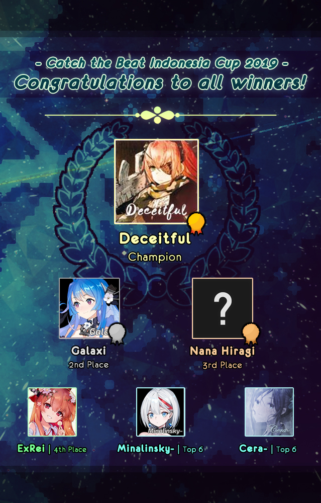

---
tags:
  - CIC2019
  - CIC 2019
---

# Catch the Beat Indonesia Cup 2019

The **Catch the Beat Indonesia Cup 2019** (***CIC 2019***) was a double-elimination 1v1 osu!catch tournament hosted by ::{ flag=ID }:: [Chiya--](https://osu.ppy.sh/users/7934854), ::{ flag=ID }:: [Chroneko](https://osu.ppy.sh/users/5472877), and ::{ flag=ID }:: [dika312](https://osu.ppy.sh/users/741613). The tournament was open to all players from Indonesia with a playcount of 1,500 or above in osu!catch regardless of rank. It was the seventh iteration of the Catch the Beat Indonesia Cup.

## Tournament schedule

| Event | Timestamp |
| --: | :-- |
| Registration phase | 2019-08-18/2019-09-01 |
| Screening phase | 2019-09-02/2019-09-08 |
| Group stage | 2019-09-09/2019-09-15 |
| Round of 16 | 2019-09-16/2019-09-22 |
| Quarterfinals | 2019-09-23/2019-09-29 |
| Semifinals | 2019-09-30/2019-10-06 |
| *Technical break* | 2019-10-07/2019-10-13 |
| Finals (week 1) | 2019-10-14/2019-10-20 |
| Finals (week 2) | 2019-10-21/2019-10-27 |

## Prizes

| Placing | Prizes |
| :-: | :-- |
|  | 50% of the raised prize pool, 1 year of Discord Nitro subscription, unique profile badge |
|  | 30% of the raised prize pool |
|  | 20% of the raised prize pool |

## Organisation

CIC 2019 was run by various Indonesian osu! community members.

| Position | Member(s) |
| :-- | :-- |
| Host | ::{ flag=ID }:: [Chiya--](https://osu.ppy.sh/users/7934854), ::{ flag=ID }:: [Chroneko](https://osu.ppy.sh/users/5472877), ::{ flag=ID }:: [dika312](https://osu.ppy.sh/users/741613) |
| Mappool selector | ::{ flag=ID }:: [dika312](https://osu.ppy.sh/users/741613), ::{ flag=ID }:: [Constantine](https://osu.ppy.sh/users/3221898), ::{ flag=ID }:: [Funtastic](https://osu.ppy.sh/users/3555626) |
| Streamer | ::{ flag=ID }:: [dika312](https://osu.ppy.sh/users/741613), ::{ flag=ID }:: [Victim\_Crasher](https://osu.ppy.sh/users/2084869) |
| Commentator | ::{ flag=ID }:: [dika312](https://osu.ppy.sh/users/741613), ::{ flag=ID }:: [Victim\_Crasher](https://osu.ppy.sh/users/2084869), ::{ flag=ID }:: [-Hex-](https://osu.ppy.sh/users/8630988), ::{ flag=ID }:: [Dapuluous](https://osu.ppy.sh/users/8140944) |
| Referee | ::{ flag=ID }:: [Execration-](https://osu.ppy.sh/users/9260926), ::{ flag=ID }:: [\_Mira](https://osu.ppy.sh/users/3484548), ::{ flag=ID }:: [Fyl](https://osu.ppy.sh/users/10069307) |
| Wiki editor | ::{ flag=ID }:: [Niva](https://osu.ppy.sh/users/197805) |

## Links

- **[Main spreadsheet](https://docs.google.com/spreadsheets/d/1W_kzgRc0isXcEM8xx65qUs83PogNlSmdwMFkGjWEKyU/edit#gid=0)**
- [Discussion thread](https://osu.ppy.sh/community/forums/topics/949339)
- [Discord server](https://discord.gg/YwAYbPa)
- [Challonge brackets](https://challonge.com/xhv62wxa)
- [Livestream channel](https://www.twitch.tv/osuIndonesia/)

## Participants

Listed below are the players who were admitted into the Group stage along with their respective seeding and group placements.

| Group | Seed A | Seed B | Seed C |
| :-- | :-- | :-- | :-- |
| A | ::{ flag=ID }:: [ExRei](https://osu.ppy.sh/users/1929336) | ::{ flag=ID }:: [Professor Gila](https://osu.ppy.sh/users/5447727) | ::{ flag=ID }:: [Avoya](https://osu.ppy.sh/users/3136817) |
| B | ::{ flag=ID }:: [Galaxi](https://osu.ppy.sh/users/2552435) | ::{ flag=ID }:: [Emily Yukari](https://osu.ppy.sh/users/7053866) | ::{ flag=SG }:: [Nana Hiragi](https://osu.ppy.sh/users/13377985) |
| C | ::{ flag=ID }:: [Cera-](https://osu.ppy.sh/users/1974131) | ::{ flag=ID }:: [XxepandevanxX](https://osu.ppy.sh/users/13194580) | ::{ flag=ID }:: [BitDust](https://osu.ppy.sh/users/9573836) |
| D | ::{ flag=ID }:: [dedotikea](https://osu.ppy.sh/users/8805157) | ::{ flag=ID }:: [Honkenway](https://osu.ppy.sh/users/11582543) | ::{ flag=ID }:: [Mikurio](https://osu.ppy.sh/users/10734140) |
| E | ::{ flag=ID }:: [DennySega24](https://osu.ppy.sh/users/5416487) | ::{ flag=ID }:: [Ilhamuharam](https://osu.ppy.sh/users/7657968) | ::{ flag=ID }:: [Sololiquy](https://osu.ppy.sh/users/4350087) |
| F | ::{ flag=ID }:: [Deceitful](https://osu.ppy.sh/users/1396447) | ::{ flag=ID }:: [-Izayoi](https://osu.ppy.sh/users/5710721) | ::{ flag=ID }:: [Yuki Tanaka](https://osu.ppy.sh/users/1898048) |
| G | ::{ flag=ID }:: [Raediaufar](https://osu.ppy.sh/users/5156086) | ::{ flag=ID }:: [fikricm](https://osu.ppy.sh/users/4072503) | *N/A* |
| H | ::{ flag=ID }:: [Minalinsky-](https://osu.ppy.sh/users/2823883) | ::{ flag=ID }:: [LeWind](https://osu.ppy.sh/users/9718235) | *N/A* |

## Podium

## Mappools

### Finals (week 1 & 2)

*(mappack not available)*

- NoMod
  1. [kamome sano electric orchestra - FIN4LE \~Shushisen no Kanata e\~ VS HE4VEN \~Tengoku e youkoso\~ (\[\_-Kukkai-\_\]) \[FIN4LE VS. HE4VEN\]](https://osu.ppy.sh/beatmapsets/720971#fruits/1522545)
  2. [Ryu\* Vs. L.E.D.-G - PARADISE LOST (Kuzino) \[2Q\]](https://osu.ppy.sh/beatmapsets/36326#fruits/117383)
  3. [Jakarta Funk Brothers - INSOMNIA (Zyzyx) \[KERMO\]](https://osu.ppy.sh/beatmapsets/898684#fruits/1877347)
  4. [KLing (Aoi+Yunosuke) - Quaint Echo (Zyzyx) \[Joint Estuaries\]](https://osu.ppy.sh/beatmapsets/970081#fruits/2029405)
  5. [Kino Hiko - The Noise of Rain (Prinsep) \[Seeking Shelter (Good Remapped Version)\]](https://osu.ppy.sh/beatmapsets/636725#fruits/1824415)
  6. [Roselia - Guren no Yumiya (Trynna) \[Net0's Bloody Dawn\]](https://osu.ppy.sh/beatmapsets/825409#fruits/1819160)
- Hidden
  1. [Ponkichi - Hyakukakai to Shirotokkuri (F D Fluorite) \[Axes\]](https://osu.ppy.sh/beatmapsets/934870#fruits/1951696)
  2. [MALVA. - Trane (dika312) \[Traurigkeit\]](https://osu.ppy.sh/beatmapsets/1010141#fruits/2114540)
  3. [Zedd, Grey - Adrenaline (Hollow Wings) \[Decompensation\]](https://osu.ppy.sh/beatmapsets/584333#fruits/1236211)
  4. [Hatsuki Yura - Eclipse Parade (Vert) \[Zero's Insane\]](https://osu.ppy.sh/beatmapsets/430339#fruits/929453)
- HardRock
  1. [Yooh - LegenD. (Du5t) \[Daletto's OverdosE.\]](https://osu.ppy.sh/beatmapsets/1047989#fruits/2190554)
  2. [Mayumi Morinaga(moimoi) - dreamin' feat. Ryu\* (Ster) \[YOU ARE MY DREAM\]](https://osu.ppy.sh/beatmapsets/360829#fruits/792972)
  3. [Halogen - U Got That (Camellia's Neurofunk Bootleg) (Sotarks) \[ricardoFlick\]](https://osu.ppy.sh/beatmapsets/934144#fruits/1950290)
  4. [Shindig - Stutter (squirrelpascals) \[Go Home\]](https://osu.ppy.sh/beatmapsets/716749#fruits/1514465)
- DoubleTime
  1. [AiRI - Towa ni Saku Hana (Short Ver.) (Jemzuu) \[Rain\]](https://osu.ppy.sh/beatmapsets/958431#fruits/2009276)
  2. [Tanya Degurechaff (CV: Yuuki Aoi) - Los! Los! Los! (TV Size) (Du5t) \[Lieutenant\]](https://osu.ppy.sh/beatmapsets/904574#fruits/2103912)
  3. [Tsukiko - Hotarubi (Mirash) \[Collab Lunatic\]](https://osu.ppy.sh/beatmapsets/724098#fruits/1528970)
  4. [xi - Garyou Tensei (AngelHoney) \[Chocopikel\]](https://osu.ppy.sh/beatmapsets/49158#fruits/201834)
- Tiebreaker
  1. **[Camellia - flying in the flow of deep-sea (Rocma) \[Brine\]](https://osu.ppy.sh/beatmapsets/861357#fruits/1802009)**

### Semifinals

**[Download the mappack here! (131 MB)](https://drive.google.com/u/0/uc?id=1YxWGTolttfzbT5oPrm2rHnLFGjATxyxw&export=download)**

- NoMod
  1. [LiSA - ADAMAS (Ascendance) \[IDu5t's Overdose\]](https://osu.ppy.sh/beatmapsets/998118#fruits/2102038)
  2. [Coda - BLOODY STREAM (Ascendance) \[REBUFF OVERDRIVE\]](https://osu.ppy.sh/beatmapsets/874583#fruits/1827855)
  3. [The Flashbulb - Lawn Wake IV (Black) (MBomb) \[Deif's Overdose\]](https://osu.ppy.sh/beatmapsets/965730#fruits/2024196)
  4. [onumi - FAKE (JBHyperion) \[OVERDOSE\]](https://osu.ppy.sh/beatmapsets/934785#fruits/1958638)
  5. [Aero Chord - Break Them (feat. Anna Yvette) (olteR) \[Broken\]](https://osu.ppy.sh/beatmapsets/516608#fruits/1097891)
  6. [Sawawa - kirakira TIME\* (Priti) \[ULTRA\]](https://osu.ppy.sh/beatmapsets/354013#fruits/779950)
- Hidden
  1. [Seiryu - Ultramarine (ZiRoX) \[Spec's Abyss\]](https://osu.ppy.sh/beatmapsets/275991#fruits/635701)
  2. [Kajiura Yuki - Decretum (-Hex-) \[Determination\]](https://osu.ppy.sh/beatmapsets/1044759#fruits/2184057)
  3. [3R2 - Devillic Sphere (Innovation) \[Extra\]](https://osu.ppy.sh/beatmapsets/795801#fruits/1671244)
  4. [Asumi Kana & Fujita Saki & Kitamura Eri - COOLISH WALK (TV Size) (biwako) \[EX\]](https://osu.ppy.sh/beatmapsets/37136#fruits/129285)
- HardRock
  1. [Chicala Lpis - Blackest Luxury Car (Nyxthymia) \[Luxury Dolphine\]](https://osu.ppy.sh/beatmapsets/999742#fruits/2091030)
  2. [Komiya Mao - (can you) understand me? (Daletto) \[IDu5t's Amnesia?\]](https://osu.ppy.sh/beatmapsets/828703#fruits/1794354)
  3. [xi - ANiMA (Kalindraz) \[Oberum Primus\]](https://osu.ppy.sh/beatmapsets/441271#fruits/949234)
  4. [Naru Hakobe (CV: M.A.O) - Neko Matsuri (Regou) \[Nyan\]](https://osu.ppy.sh/beatmapsets/660752#fruits/1615502)
- DoubleTime
  1. [Creo - In Circles (salchow) \[Collab Rain\]](https://osu.ppy.sh/beatmapsets/965558#fruits/2050069)
  2. [Zektbach - Turii \~Panta rhei\~ (Kyuare) \[Rain\]](https://osu.ppy.sh/beatmapsets/685428#fruits/1479407)
  3. [Nakae Mitsuki - Pure Love, True Love (El SolarBeam) \[Insane\]](https://osu.ppy.sh/beatmapsets/123687#fruits/315738)
  4. [Morimori Atsushi - MilK (Hailie) \[Xenon's Insane\]](https://osu.ppy.sh/beatmapsets/848309#fruits/1777490)
- Tiebreaker
  1. **[Avenged Sevenfold - Blinded In Chains (dika312) \[Requiem\]](https://osu.ppy.sh/beatmapsets/1021186#fruits/2136565)**

### Quarterfinals

*(mappack not available)*

- NoMod
  1. [Kano - Stella-rium (-Izayoi) \[NyxthIza's Orion\]](https://osu.ppy.sh/beatmapsets/1001529#fruits/2096572)
  2. [Superman Is Dead - Kuat Kita Bersinar (Funtastic) \[Bhinneka Tunggal Ika\]](https://osu.ppy.sh/beatmapsets/989452#fruits/2069807)
  3. [M2U & Nicode - Lune (-Luminate) \[Moonlight\]](https://osu.ppy.sh/beatmapsets/885028#fruits/1849832)
  4. [DM Ashura vs. Inspector K - Disconnected HaZaRD (Professor Gila) \[Disconnected OvErDoZE\]](https://osu.ppy.sh/beatmapsets/308254#fruits/689459)
  5. [-45 - dogura \* magura (AngelHoney) \[AKUMA\]](https://osu.ppy.sh/beatmapsets/43856#fruits/137572)
  6. [USAO - ZED (deetz) \[YES\]](https://osu.ppy.sh/beatmapsets/483387#fruits/1031365)
- Hidden
  1. [Chitose Sara - Merry Merry Go Round (SHOT MUSIC Asterisk Remix) (-Izayoi) \[Carousel\]](https://osu.ppy.sh/beatmapsets/975120#fruits/2041038)
  2. [Hanatan - Jishou Mushoku (chickenbible) \[Smile\]](https://osu.ppy.sh/beatmapsets/873024#fruits/1824907)
  3. [solfa feat. Shimotsuki Haruka - leap in your mind (Lasse) \[Expert\]](https://osu.ppy.sh/beatmapsets/818672#fruits/1718542)
- HardRock
  1. [MY FIRST STORY - START OVER (\[ Saturn \]) \[Rocma's Rain\]](https://osu.ppy.sh/beatmapsets/928408#fruits/1939205)
  2. [Ling Yuan yousa - Hoshi to Kimi ga Kieta Hi (Dapuluous) \[Memories\]](https://osu.ppy.sh/beatmapsets/752110#fruits/1597213)
  3. [MuryokuP - Aspirin (Irie Miyuki) \[Insane\]](https://osu.ppy.sh/beatmapsets/132398#fruits/332985)
- DoubleTime
  1. [CLIFF EDGE - Endless Tears feat. Nakamura Maiko (CLSW) \[Platter\]](https://osu.ppy.sh/beatmapsets/197689#fruits/485404)
  2. [NEGOTO - Synchromanica (Sinnoh) \[Rain\]](https://osu.ppy.sh/beatmapsets/673290#fruits/1517953)
  3. [Zeng Zhihao - Fu Yun Ben Lang (jonathanlfj) \[Insane\]](https://osu.ppy.sh/beatmapsets/89673#fruits/243644)
- Tiebreaker
  1. **[Shimotsuki Haruka - Star map (Soleily Remix) (Fauzan 2000) \[Infinity\]](https://osu.ppy.sh/beatmapsets/727767#fruits/2141324)**

### Round of 16

**[Download the mappack here! (96 MB)](https://drive.google.com/u/0/uc?id=1Lqc2DqxwkYDHwYKRAMESA1yFReXanE_O&export=download)**

- NoMod
  1. [ChouCho - Yasashisa no Riyuu (Ascendance) \[Ascendance & Spec's Duality\]](https://osu.ppy.sh/beatmapsets/689356#fruits/1459569)
  2. [Shimotsuki Haruka - FLOWERS (JBHyperion) \[Overdose\]](https://osu.ppy.sh/beatmapsets/1013070#fruits/2120514)
  3. [Nekomata Gekidan - AsiaN distractive (Spectator) \[Nelly's Overdose\]](https://osu.ppy.sh/beatmapsets/765322#fruits/1611278)
  4. [ARM - Streak (JBHyperion) \[Sinnoh's Overdose\]](https://osu.ppy.sh/beatmapsets/865565#fruits/1847248)
  5. [Jun Maeda x yanaginagi -  Killer Song (Yohanes) \[Edge\]](https://osu.ppy.sh/beatmapsets/454725#fruits/974854)
  6. [wa. - Black Lotus (Realazy) \[fanzhen's Insane\]](https://osu.ppy.sh/beatmapsets/679918#fruits/1440976)
- Hidden
  1. [fhana - Genzaichi (Benita) \[Rain\]](https://osu.ppy.sh/beatmapsets/825376#fruits/1729487)
  2. [yanaginagi - Hoshiboshi no Wataridori (-Hex-) \[Lost Memories\]](https://osu.ppy.sh/beatmapsets/924320#fruits/1930633)
  3. [Gekidan Record feat. Nekomata Master - Houkou Orpheus (celerih) \[felys' White Hard\]](https://osu.ppy.sh/beatmapsets/879051#fruits/1855074)
- HardRock
  1. [EARPHONES - Arakajime Ushinawareta Bokura no Ballad (Game Ver.) (Sanyi) \[Rain\]](https://osu.ppy.sh/beatmapsets/843086#fruits/1766154)
  2. [Hatsuki Yura - Yuki no Hana (Ascendance) \[Ascendance & Piku's Snowfall\]](https://osu.ppy.sh/beatmapsets/699320#fruits/1480957)
  3. [ONE OK ROCK - Mikansei Koukyoukyoku (Saut) \[Collab Hard\]](https://osu.ppy.sh/beatmapsets/348604#fruits/792948)
- DoubleTime
  1. [senya - Zetsubou no Fuchi (Ascendance) \[IDu5t's Platter\]](https://osu.ppy.sh/beatmapsets/762829#fruits/1871747)
  2. [NICODE & M2U - Predawn (Sulfur) \[Jeir's Platter\]](https://osu.ppy.sh/beatmapsets/748803#fruits/1610570)
  3. [smileY inc. - Hanayuki (CelsiusLK) \[-Hakurei-'s Insane\]](https://osu.ppy.sh/beatmapsets/400239#fruits/870925)
- Tiebreaker
  1. **[Tenacious D - BEELZEBOSS (THE FINAL SHOWDOWN) (JierYagtama) \[IT'S SHOWTIME BABY\]](https://osu.ppy.sh/beatmapsets/735342#fruits/1552328)**

### Group stage

**[Download the mappack here! (90 MB)](https://drive.google.com/u/0/uc?id=1tcb_bRjfGyylo7_9FnoL_m7DgkfdydzJ&export=download)**

- NoMod
  1. [Glacier - Neos (WildOne94) \[Rain\]](https://osu.ppy.sh/beatmapsets/771096#fruits/1627430)
  2. [Rich Brian - History (Seija) \[Bittersweet Reunion\]](https://osu.ppy.sh/beatmapsets/940248#fruits/1963760)
  3. [Camellia feat. Nanahira - Hakuraku (tasuka912) \[Rain\]](https://osu.ppy.sh/beatmapsets/986223#fruits/2063286)
  4. [Lifetheory - Daisy (Dapuluous) \[Rain\]](https://osu.ppy.sh/beatmapsets/993396#fruits/2077322)
  5. [Shiori - Day Breaker (Frostmourne) \[Lunatic\]](https://osu.ppy.sh/beatmapsets/91606#fruits/247999)
  6. [Kommisar - Chipstream (vipto) \[Extra\]](https://osu.ppy.sh/beatmapsets/104784#fruits/385548)
- Hidden
  1. [Reol - FLASH BACK (alienflybot) \[RAIN\]](https://osu.ppy.sh/beatmapsets/706939#fruits/1732486)
  2. [RURUTIA - Phronesis (-Luminate) \[Rain\]](https://osu.ppy.sh/beatmapsets/965320#fruits/2020714)
  3. [petit milady - Koi wa Milk Tea (Okoratu) \[Amai\]](https://osu.ppy.sh/beatmapsets/364652#fruits/800385)
- HardRock
  1. [Tomita Miyu, Onishi Saori, Ohzora Naomi, Hanazawa Kana - Hallelujah\*Essaim (TV Size) (Yumeno Himiko) \[Hyperion's Platter\]](https://osu.ppy.sh/beatmapsets/579450#fruits/1227698)
  2. [Ito Kashitaro - Setsuna Plus (-Hex-) \[Platter\]](https://osu.ppy.sh/beatmapsets/836272#fruits/1751319)
  3. [DystopiaGround - True Theory of Inheritance (Ignacio) \[Aenna\]](https://osu.ppy.sh/beatmapsets/24477#fruits/84415)
- DoubleTime
  1. [Minase Mashiro - Suna no Kodomo (JBHyperion) \[Platter\]](https://osu.ppy.sh/beatmapsets/972764#fruits/2043177)
  2. [Y&Co. feat. Karin - Sweet Rain (Sorcerer) \[Platter\]](https://osu.ppy.sh/beatmapsets/738169#fruits/1587421)
  3. [hicalculator - Life is Game (tobebuta) \[tobe style\]](https://osu.ppy.sh/beatmapsets/6640#fruits/30239)
- Tiebreaker
  1. **[void - Verdict for worst dictator (ZiRoX) \[Judgement\]](https://osu.ppy.sh/beatmapsets/303599#fruits/873668)**

## Match results

### Finals (week 2)

Monday, 21 October 2019:

| Bracket | Player 1 |  |  | Player 2 | Match link |
| :-: | --: | :-: | :-: | :-- | :-- |
| Lower | [ExRei](https://osu.ppy.sh/users/1929336) ::{ flag=ID }:: | 0 | **6** | ::{ flag=ID }:: **[Galaxi](https://osu.ppy.sh/users/2552435)** | [#1](https://osu.ppy.sh/community/matches/55712548) |

Wednesday, 23 October 2019:

| Bracket | Player 1 |  |  | Player 2 | Match link |
| :-: | --: | :-: | :-: | :-- | :-- |
| Lower | [Nana Hiragi](https://osu.ppy.sh/users/13377985) ::{ flag=SG }:: | 4 | **7** | ::{ flag=ID }:: **[Galaxi](https://osu.ppy.sh/users/2552435)** | [#1](https://osu.ppy.sh/community/matches/55752274) |

Sunday, 27 October 2019, Grand Final:

| Bracket | Player 1 |  |  | Player 2 | Match link |
| :-: | --: | :-: | :-: | :-- | :-- |
| Grand Final | **[Deceitful](https://osu.ppy.sh/users/1396447)** ::{ flag=ID }:: | **7** | 3 | ::{ flag=ID }:: [Galaxi](https://osu.ppy.sh/users/2552435) | [#1](https://osu.ppy.sh/community/matches/55847781) |

### Finals (week 1)

Saturday, 19 October 2019:

| Bracket | Player 1 |  |  | Player 2 | Match link |
| :-: | --: | :-: | :-: | :-- | :-- |
| Upper | [Nana Hiragi](https://osu.ppy.sh/users/13377985) ::{ flag=SG }:: | 1 | **6** | ::{ flag=ID }:: **[Deceitful](https://osu.ppy.sh/users/1396447)** | [#1](https://osu.ppy.sh/community/matches/55690501) |

Sunday, 20 October 2019:

| Bracket | Player 1 |  |  | Player 2 | Match link |
| :-: | --: | :-: | :-: | :-- | :-- |
| Lower | **[Galaxi](https://osu.ppy.sh/users/2552435)** ::{ flag=ID }:: | **6** | 2 | ::{ flag=ID }:: [Cera-](https://osu.ppy.sh/users/1974131) | [#1](https://osu.ppy.sh/community/matches/55662717) |
| Lower | [Minalinsky-](https://osu.ppy.sh/users/2823883) ::{ flag=ID }:: | 0 | **6** | ::{ flag=ID }:: **[ExRei](https://osu.ppy.sh/users/1929336)** | *win by default* |

### Semifinals

Saturday, 5 October 2019:

| Bracket | Player 1 |  |  | Player 2 | Match link |
| :-: | --: | :-: | :-: | :-- | :-- |
| Upper | **[Nana Hiragi](https://osu.ppy.sh/users/13377985)** ::{ flag=SG }:: | **6** | 1 | ::{ flag=ID }:: [Minalinsky-](https://osu.ppy.sh/users/2823883) | [#1](https://osu.ppy.sh/community/matches/55342669) |
| Lower | **[DennySega24](https://osu.ppy.sh/users/5416487)** ::{ flag=ID }:: | **6** | 3 | ::{ flag=ID }:: [Professor Gila](https://osu.ppy.sh/users/5447727) | [#1](https://osu.ppy.sh/community/matches/55340404) |
| Lower | [Honkenway](https://osu.ppy.sh/users/11582543) ::{ flag=ID }:: | 0 | **6** | ::{ flag=ID }:: **[Raediaufar](https://osu.ppy.sh/users/5156086)** | *win by default* |

Sunday, 6 October 2019:

| Bracket | Player 1 |  |  | Player 2 | Match link |
| :-: | --: | :-: | :-: | :-- | :-- |
| Upper | [Galaxi](https://osu.ppy.sh/users/2552435) ::{ flag=ID }:: | 2 | **6** | ::{ flag=ID }:: **[Deceitful](https://osu.ppy.sh/users/1396447)** | [#1](https://osu.ppy.sh/community/matches/55369711) |
| Lower | [fikricm](https://osu.ppy.sh/users/4072503) ::{ flag=ID }:: | 0 | **6** | ::{ flag=ID }:: **[ExRei](https://osu.ppy.sh/users/1929336)** | [#1](https://osu.ppy.sh/community/matches/55371702) |
| Lower | **[Cera-](https://osu.ppy.sh/users/1974131)** ::{ flag=ID }:: | **6** | 2 | ::{ flag=ID }:: [Sololiquy](https://osu.ppy.sh/users/4350087) | [#1](https://osu.ppy.sh/community/matches/55366457) |

Monday, 7 October 2019:

| Bracket | Player 1 |  |  | Player 2 | Match link |
| :-: | --: | :-: | :-: | :-- | :-- |
| Lower | **[ExRei](https://osu.ppy.sh/users/1929336)** ::{ flag=ID }:: | **6** | 2 | ::{ flag=ID }:: [Raediaufar](https://osu.ppy.sh/users/5156086) | [#1](https://osu.ppy.sh/community/matches/55373258) |
| Lower | [DennySega24](https://osu.ppy.sh/users/5416487) ::{ flag=ID }:: | 2 | **6** | ::{ flag=ID }:: **[Cera-](https://osu.ppy.sh/users/1974131)** | [#1](https://osu.ppy.sh/community/matches/55367902) |

### Quarterfinals

Friday, 27 September 2019:

| Bracket | Player 1 |  |  | Player 2 | Match link |
| :-: | --: | :-: | :-: | :-- | :-- |
| Upper | **[Nana Hiragi](https://osu.ppy.sh/users/13377985)** ::{ flag=SG }:: | **5** | 1 | ::{ flag=ID }:: [Cera-](https://osu.ppy.sh/users/1974131) | [#1](https://osu.ppy.sh/community/matches/55135776) |

Saturday, 28 September 2019:

| Bracket | Player 1 |  |  | Player 2 | Match link |
| :-: | --: | :-: | :-: | :-- | :-- |
| Upper | **[Galaxi](https://osu.ppy.sh/users/2552435)** ::{ flag=ID }:: | **5** | 0 | ::{ flag=ID }:: [Honkenway](https://osu.ppy.sh/users/11582543) | [#1](https://osu.ppy.sh/community/matches/55166074) |
| Upper | **[Deceitful](https://osu.ppy.sh/users/1396447)** ::{ flag=ID }:: | **5** | 0 | ::{ flag=ID }:: [fikricm](https://osu.ppy.sh/users/4072503) | *win by default* |

Sunday, 29 September 2019:

| Bracket | Player 1 |  |  | Player 2 | Match link |
| :-: | --: | :-: | :-: | :-- | :-- |
| Upper | [DennySega24](https://osu.ppy.sh/users/5416487) ::{ flag=ID }:: | 3 | **5** | ::{ flag=ID }:: **[Minalinsky-](https://osu.ppy.sh/users/2823883)** | [#1](https://osu.ppy.sh/community/matches/55205594) |
| Lower | **[ExRei](https://osu.ppy.sh/users/1929336)** ::{ flag=ID }:: | **5** | 4 | ::{ flag=ID }:: [dedotikea](https://osu.ppy.sh/users/8805157) | [#1](https://osu.ppy.sh/community/matches/55201681) |
| Lower | [-Izayoi](https://osu.ppy.sh/users/5710721) ::{ flag=ID }:: | 1 | **5** | ::{ flag=ID }:: **[Raediaufar](https://osu.ppy.sh/users/5156086)** | [#1](https://osu.ppy.sh/community/matches/55199891) |
| Lower | **[Sololiquy](https://osu.ppy.sh/users/4350087)** ::{ flag=ID }:: | **5** | 0 | ::{ flag=ID }:: [LeWind](https://osu.ppy.sh/users/9718235) | *win by default* |

Tuesday, 1 October 2019:

| Bracket | Player 1 |  |  | Player 2 | Match link |
| :-: | --: | :-: | :-: | :-- | :-- |
| Lower | **[Professor Gila](https://osu.ppy.sh/users/5447727)** ::{ flag=ID }:: | **5** | 4 | ::{ flag=ID }:: [XxepandevanxX](https://osu.ppy.sh/users/13194580) | [#1](https://osu.ppy.sh/community/matches/55248864) |

### Round of 16

Tuesday, 17 September 2019:

| Bracket | Player 1 |  |  | Player 2 | Match link |
| :-: | --: | :-: | :-: | :-- | :-- |
| Upper | [ExRei](https://osu.ppy.sh/users/1929336) ::{ flag=ID }:: | 2 | **5** | ::{ flag=SG }:: **[Nana Hiragi](https://osu.ppy.sh/users/13377985)** | [#1](https://osu.ppy.sh/community/matches/54911203) |

Friday, 20 September 2019:

| Bracket | Player 1 |  |  | Player 2 | Match link |
| :-: | --: | :-: | :-: | :-- | :-- |
| Upper | **[DennySega24](https://osu.ppy.sh/users/5416487)** ::{ flag=ID }:: | **5** | 2 | ::{ flag=ID }:: [-Izayoi](https://osu.ppy.sh/users/5710721) | [#1](https://osu.ppy.sh/community/matches/54972116) |
| Upper | [LeWind](https://osu.ppy.sh/users/9718235) ::{ flag=ID }:: | 0 | **5** | ::{ flag=ID }:: **[fikricm](https://osu.ppy.sh/users/4072503)** | *win by default* |

Saturday, 21 September 2019:

| Bracket | Player 1 |  |  | Player 2 | Match link |
| :-: | --: | :-: | :-: | :-- | :-- |
| Upper | **[Cera-](https://osu.ppy.sh/users/1974131)** ::{ flag=ID }:: | **5** | 2 | ::{ flag=ID }:: [dedotikea](https://osu.ppy.sh/users/8805157) | [#1](https://osu.ppy.sh/community/matches/55001134) |
| Upper | [Raediaufar](https://osu.ppy.sh/users/5156086) ::{ flag=ID }:: | 2 | **5** | ::{ flag=ID }:: **[Minalinsky-](https://osu.ppy.sh/users/2823883)** | [#1](https://osu.ppy.sh/community/matches/55004478) |

Sunday, 22 September 2019:

| Bracket | Player 1 |  |  | Player 2 | Match link |
| :-: | --: | :-: | :-: | :-- | :-- |
| Upper | **[Galaxi](https://osu.ppy.sh/users/2552435)** ::{ flag=ID }:: | **5** | 0 | ::{ flag=ID }:: [Professor Gila](https://osu.ppy.sh/users/5447727) | [#1](https://osu.ppy.sh/community/matches/55036966) |
| Upper | **[Deceitful](https://osu.ppy.sh/users/1396447)** ::{ flag=ID }:: | **5** | 0 | ::{ flag=ID }:: [Sololiquy](https://osu.ppy.sh/users/4350087) | [#1](https://osu.ppy.sh/community/matches/55034335) |
| Upper | **[Honkenway](https://osu.ppy.sh/users/11582543)** ::{ flag=ID }:: | **5** | 4 | ::{ flag=ID }:: [XxepandevanxX](https://osu.ppy.sh/users/13194580) | [#1](https://osu.ppy.sh/community/matches/55026492) |

### Group stage

Thursday, 12 September 2019:

| Group |  |  | Match link |
| :-: | :-: | :-: | :-- |
| **H** | ::{ flag=ID }:: **[Minalinsky-](https://osu.ppy.sh/users/2823883) (8 pts)** | ::{ flag=ID }:: **[LeWind](https://osu.ppy.sh/users/9718235) (10 pts)** | [#1](https://osu.ppy.sh/community/matches/54786961) |

Saturday, 14 September 2019:

| Group |  |  |  | Match link |
| :-: | :-: | :-: | :-: | :-- |
| **A** | ::{ flag=ID }:: **[ExRei](https://osu.ppy.sh/users/1929336) (12 pts)** | ::{ flag=ID }:: **[Professor Gila](https://osu.ppy.sh/users/5447727) (4 pts)** | ::{ flag=ID }:: [Avoya](https://osu.ppy.sh/users/3136817) (-2 pts) | [#1](https://osu.ppy.sh/community/matches/54838860) |
| **C** | ::{ flag=ID }:: **[Cera-](https://osu.ppy.sh/users/1974131) (14 pts)** | ::{ flag=ID }:: **[XxepandevanxX](https://osu.ppy.sh/users/13194580) (3 pts)** | ::{ flag=ID }:: [BitDust](https://osu.ppy.sh/users/9573836) (1 pt) | [#1](https://osu.ppy.sh/community/matches/54833749) |
| **D** | ::{ flag=ID }:: **[dedotikea](https://osu.ppy.sh/users/8805157) (7 pts)** | ::{ flag=ID }:: **[Honkenway](https://osu.ppy.sh/users/11582543) (14 pts)** | ::{ flag=ID }:: [Mikurio](https://osu.ppy.sh/users/10734140) (-5 pts) | [#1](https://osu.ppy.sh/community/matches/54835287) |

Sunday, 15 September 2019:

| Group |  |  |  | Match link |
| :-: | :-: | :-: | :-: | :-- |
| **B** | ::{ flag=ID }:: **[Galaxi](https://osu.ppy.sh/users/2552435) (14 pts)** | ::{ flag=ID }:: [Emily Yukari](https://osu.ppy.sh/users/7053866) (-4 pts) | ::{ flag=SG }:: **[Nana Hiragi](https://osu.ppy.sh/users/13377985) (8 pts)** | [#1](https://osu.ppy.sh/community/matches/54836446) |
| **E** | ::{ flag=ID }:: **[DennySega24](https://osu.ppy.sh/users/5416487) (12 pts)** | ::{ flag=ID }:: [Ilhamuharam](https://osu.ppy.sh/users/7657968) (-2 pts) | ::{ flag=ID }:: **[Sololiquy](https://osu.ppy.sh/users/4350087) (8 pts)** | [#1](https://osu.ppy.sh/community/matches/54869764) |
| **F** | ::{ flag=ID }:: **[Deceitful](https://osu.ppy.sh/users/1396447) (18 pts)** | ::{ flag=ID }:: **[-Izayoi](https://osu.ppy.sh/users/5710721) (5 pts)** | ::{ flag=ID }:: [Yuki Tanaka](https://osu.ppy.sh/users/1898048) (-5 pts) | [#1](https://osu.ppy.sh/community/matches/54867684) |

Monday, 16 September 2019:

| Group |  |  | Match link |
| :-: | :-: | :-: | :-- |
| **G** | ::{ flag=ID }:: **[Raediaufar](https://osu.ppy.sh/users/5156086) (11 pts)** | ::{ flag=ID }:: **[fikricm](https://osu.ppy.sh/users/4072503) (7 pts)** | [#1](https://osu.ppy.sh/community/matches/54866381) |

## Ruleset

### General rules

1. Map scoring is based on **[ScoreV2](/wiki/Gameplay/Score#scorev2).**
2. The mapsets for each round will be announced by the Tournament Management in advance before the actual matches take place.
3. Match schedules will be predetermined by the Tournament Management. If there are any players who are unable to attend the current schedule for any reason, all other affected players may apply and settle for a reschedule at the `#reschedule-request` channel in the tournament's Discord server.
4. A referee will create a multiplayer room 10 minutes in advance and will start to send out invites.
5. If a player does not show up within **10 minutes** of the start time, their opponent wins by default.
6. If no staff or referee is available, the match will be postponed.
7. If a player disconnects, it will be treated as if they had failed the beatmap.
   - Disconnects that occur within a few seconds after the beatmap is started by the referee can be rematched.
8. If a player disconnects between beatmaps, the match can be delayed up to 15 minutes at most.
   - In case the disconnected player failed to report back after the maximum allowance of 15 minutes had passed, the opposing player may be declared to be winning the match by default.
9. Lag is not a valid reason to nullify a beatmap.
10. If any problems during the match occur, the Tournament Management will make a decision based on referee's report.
11. It is expected that all players be polite and respectful to each other. Penalties will be given if players violate.
    - If a player is found to be engaging in an act that is deemed to be distasteful or provocative, the corresponding player may be disqualified right away from the tournament and/or blacklisted from the tournament altogether by the Tournament Management.
    - Usage of any tools and programs that are against [osu!'s community rules](/wiki/Rules#community-rules) is strictly prohibited and will be straight up reported to the osu! team at will.

### Tournament registration

1. All interested players are required to register into the tournament individually.
   - In order to be eligible to play in the tournament, each player is required to have either the Indonesian flag displayed on their profile, or an adequate proof of Indonesian citizenship (to be shown to the Tournament Management), and a playcount of 1,500 or more in osu!catch.
2. To ensure that all incoming registrations are serious and valid, every registered player will be checked in detail by the Tournament Management.
3. The list of players who are deemed to be eligible to compete in the tournament will be published by the Tournament Management after the Registration phase has ended.
4. The Tournament Management will only account for a maximum of 32 players to take part in the tournament.
   - In the case where the number of registrants exceeds 32, the Tournament Management will only enlist 32 registrants with the highest osu!catch pp to participate in the tournament.
5. Testplayers, referees, and map selectors may not participate as players in this tournament.

### Group stage rules

1. In the Group stage, all qualified players will be situated into different seeds based on their osu!catch pp. The players from each seed will then be drawn into eight groups at random based on the result of a livestreamed [random.org](http://www.random.org/lists/) draw.
2. All players in each group will compete against each other in a single multiplayer lobby using the Battle Royale system. In this system, all players will each in turn pick out two maps from the mappool to be played with the following turnouts after each map:
   - 1st place: **+2 point(s)**
   - 2nd place: **+1 point(s)**
   - 3rd place: **-1 point(s)**
   - 4th place: **-2 point(s)**
3. Players are **not allowed** to ban maps in the Group stage.
4. There is no Lower Bracket in the Group stage.
5. Rankings of each group are determined by sorting the results of each individual player's performance in the following priority:
   - Most points obtained.
   - Winner of the Tiebreaker.
   - Players who Win By Default.
   - Whether there are players who are disqualified from the tournament.
6. Two players who placed on top of their respective groups' rankings based on the criteria listed above will advance to the Knock-out stage.

### Knock-out stage rules

1. The eight Group stage winners will be matched to the eight Group stage runners-up at random; that is, instead of following a predetermined match-up format (A1 vs H2, B1 vs G2, and so on), all the match-ups will be based on the result of a livestreamed [random.org](http://www.random.org/lists/) draw.
2. Players will compete against each other using the Double Elimination system.
3. The Double Elimination System works as following:
   - Players who lose in the Upper Bracket can still play again on the Lower Bracket.
   - Players who lose in the Lower Bracket will be eliminated from the tournament.
   - In the Grand Finals, the winner of the the Upper Bracket only needs to win a single match against their opponent in order to clinch the championship title. The winner of the Lower Bracket, however, needs to win two matches and enforce a Bracket Reset against their opponent in order to clinch the championship title.
4. Players who can compete in the next round are determined by:
   - In the Round of 16 and the Quarterfinals, each player needs to win 5 points in order to win a match. (Best-of-9)
   - In the Semifinals and the Finals (except for the Lower Bracket Final and the Grand Final), each player needs to win 6 points in order to win a match. (Best-of-11)
   - In the Lower Bracket Final and the Grand Final, each player needs to win 7 points in order to win the match. (Best-of-13)
   - Players who Win By Default.
   - Whether there are players who are disqualified from the tournament.

### Match regulations

1. Each player must use the `!roll` command once in `#multiplayer` in order to determine the ban and pick order.
   - The winner of the `!roll` gets to decide which player gets to pick and ban first.
   - This rule does not apply in the Group stage lobbies.
2. Each player is obligated to ban one beatmap from the mappool. All banned beatmaps are not allowed to be picked by any player in the match.
   - This rule does not apply in the Group stage lobbies.
3. Each player is free to select one warm-up beatmap. Using beatmaps with questionable content is prohibited.
   - Warm-ups do not apply in the Group stage lobbies.
4. In case of a tiebreaker, **the tiebreaker beatmap will be played without any mods enabled** (NoMod).
5. The results of each match and any other relevant information regarding the match will be posted on the Discord server after the match has been concluded by the responsible referees.
