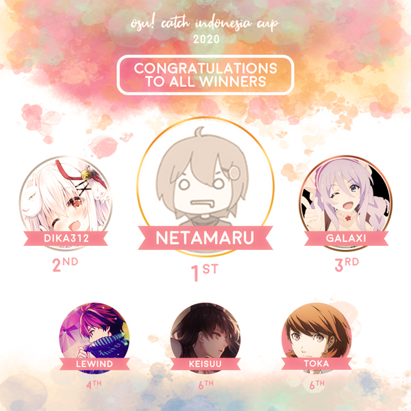

---
tags:
  - CIC2020
  - CIC 2020
---

# Catch the Beat Indonesia Cup 2020

The **Catch the Beat Indonesia Cup 2020** (***CIC 2020***) was a double-elimination 1v1 osu!catch tournament hosted by ::{ flag=ID }:: [xHirayuki](https://osu.ppy.sh/users/3245206), ::{ flag=ID }:: [CamXDanna](https://osu.ppy.sh/users/3243148), ::{ flag=ID }:: [Eum](https://osu.ppy.sh/users/16552751), and ::{ flag=ID }:: [Kazuyo](https://osu.ppy.sh/users/5604201). The tournament was open to all osu!catch players from Indonesia with over 3,000 osu!catch playcounts regardless of rank. It was the eighth iteration of the tournament series.

## Tournament schedule

| Event | Timestamp |
| --: | :-- |
| Registration phase | 2020-07-10/2020-07-20 |
| Screening phase | 2020-07-21/2020-07-27 |
| Group stage | 2020-07-28/2020-08-02 |
| Round of 16 | 2020-08-03/2020-08-09 |
| Quarterfinals | 2020-08-10/2020-08-16 |
| Semifinals | 2020-08-17/2020-08-23 |
| Finals week 1 | 2020-08-24/2020-08-30 |
| Finals week 2 | 2020-08-31/2020-09-06 |

## Prizes

| Placing | Prize(s) |
| :-: | :-- |
|  | IDR 1.000.000,- + 50% of the raised prize pool, 3 months of osu!supporter, unique profile badge |
|  | IDR 600.000,- + 30% of the raised prize pool, 2 months of osu!supporter |
|  | IDR 400.000,- + 20% of the raised prize pool, 1 month of osu!supporter |
| 4th place | 1 month of osu!supporter |

## Organisation

CIC 2020 was run by various osu! community members predominantly hailing from Indonesia.

| Position | Member(s) |
| :-- | :-- |
| Host | ::{ flag=ID }:: [xHirayuki](https://osu.ppy.sh/users/3245206), ::{ flag=ID }:: [CamXDanna](https://osu.ppy.sh/users/3243148), ::{ flag=ID }:: [Eum](https://osu.ppy.sh/users/16552751), ::{ flag=ID }:: [Kazuyo](https://osu.ppy.sh/users/5604201) |
| Mappool selector | ::{ flag=ID }:: [mirza\_rachman18](https://osu.ppy.sh/users/2985335), ::{ flag=ID }:: [-Hex-](https://osu.ppy.sh/users/8630988), ::{ flag=ID }:: [Dapuluous](https://osu.ppy.sh/users/8140944) |
| Streamer | ::{ flag=TW }:: [XzCraftP](https://osu.ppy.sh/users/1593180), ::{ flag=ID }:: [wiam103](https://osu.ppy.sh/users/4109839), ::{ flag=ID }:: [Victim\_Crasher](https://osu.ppy.sh/users/2084869) |
| Commentator | ::{ flag=ID }:: [xHirayuki](https://osu.ppy.sh/users/3245206), ::{ flag=ID }:: [CamXDanna](https://osu.ppy.sh/users/3243148), ::{ flag=ID }:: [-Hex-](https://osu.ppy.sh/users/8630988), ::{ flag=ID }:: [Victim_Crasher](https://osu.ppy.sh/users/2084869), ::{ flag=ID }:: [Niva](https://osu.ppy.sh/users/197805), ::{ flag=ID }:: [Shiviaren](https://osu.ppy.sh/users/3429259), ::{ flag=ID }:: [Swirfly](https://osu.ppy.sh/users/5164134), ::{ flag=ID }:: [Feeqzo](https://osu.ppy.sh/users/16779488),  ::{ flag=ID }:: [Shurelia](https://osu.ppy.sh/users/3807986), ::{ flag=ID }:: [Yuri-](https://osu.ppy.sh/users/4983719), ::{ flag=ID }:: [Juragan_Piscok1](https://osu.ppy.sh/users/15507280) |
| Referee | ::{ flag=ID }:: [xHirayuki](https://osu.ppy.sh/users/3245206), ::{ flag=ID }:: [-Hex-](https://osu.ppy.sh/users/8630988), ::{ flag=ID }:: [Dapuluous](https://osu.ppy.sh/users/8140944), ::{ flag=ID }:: [mina-](https://osu.ppy.sh/users/4670692), ::{ flag=ID }:: [Avoya](https://osu.ppy.sh/users/3136817), ::{ flag=ID }:: [Niva](https://osu.ppy.sh/users/197805), ::{ flag=ID }:: [Yuina Hotaru](https://osu.ppy.sh/users/1104256),  ::{ flag=ID }:: [- Ruu -](https://osu.ppy.sh/users/3811821), ::{ flag=ID }:: [Koimeji](https://osu.ppy.sh/users/4137039), ::{ flag=ID }:: [Execration-](https://osu.ppy.sh/users/9260926), ::{ flag=ID }:: [Valskiel](https://osu.ppy.sh/users/1254639) |
| Graphic designer | ::{ flag=ID }:: [mina-](https://osu.ppy.sh/users/4670692), ::{ flag=ID }:: [Avoya](https://osu.ppy.sh/users/3136817) |
| Spreadsheet manager | ::{ flag=ID }:: [Kazuyo](https://osu.ppy.sh/users/5604201) |
| Wiki editor | ::{ flag=ID }:: [Niva](https://osu.ppy.sh/users/197805) |

## Links

- **[Main spreadsheet](http://docs.google.com/spreadsheets/u/3/d/e/2PACX-1vRWcBzTJy5RnGqGIzRDc_Zv28lRo9Z3yz9yUVqF4eqoVi-cebrHDDEWk186ODj71mLf2x9mPARwaVlB/pubhtml?gid=2045538686&single=true)**
- [Discussion thread](https://osu.ppy.sh/community/forums/topics/1096883)
- [Discord server](https://discord.gg/YwAYbPa)
- [Challonge brackets](https://challonge.com/CIC2020)
- [Livestream](https://www.twitch.tv/osuIndonesia)

## Participants

| Group |  |  |  |  |
| :-: | :-- | :-- | :-- | :-- |
| **A** | ::{ flag=ID }:: [Keiji Subarashi](https://osu.ppy.sh/users/3856673) | ::{ flag=ID }:: [Santana WinSxS](https://osu.ppy.sh/users/10766352) | ::{ flag=ID }:: [LNVO](https://osu.ppy.sh/users/9153772) | ::{ flag=ID }:: [dika312](https://osu.ppy.sh/users/741613) |
| **B** | ::{ flag=ID }:: [Intention](https://osu.ppy.sh/users/3416858) | ::{ flag=ID }:: [ZYX\_GAME](https://osu.ppy.sh/users/3770612) | ::{ flag=ID }:: [sumippe](https://osu.ppy.sh/users/1929336) | ::{ flag=ID }:: [Yuki Tanaka](https://osu.ppy.sh/users/1898048) |
| **C** | ::{ flag=ID }:: [INFormal](https://osu.ppy.sh/users/6525565) | ::{ flag=ID }:: [Nakasu](https://osu.ppy.sh/users/7752479) | ::{ flag=ID }:: [Neori\_gaming](https://osu.ppy.sh/users/10772518) | ::{ flag=ID }:: [-Man](https://osu.ppy.sh/users/2128050) |
| **D** | ::{ flag=ID }:: [Chroneko](https://osu.ppy.sh/users/5472877) | ::{ flag=ID }:: [Shurelia](https://osu.ppy.sh/users/3807986) | ::{ flag=ID }:: [Constantine](https://osu.ppy.sh/users/3221898) | ::{ flag=ID }:: [LeWind](https://osu.ppy.sh/users/9718235) |
| **E** | ::{ flag=ID }:: [ilhamuharam](https://osu.ppy.sh/users/7657968) | ::{ flag=ID }:: [BitDust](https://osu.ppy.sh/users/9573836) | ::{ flag=ID }:: [eZmmR](https://osu.ppy.sh/users/8647138) | ::{ flag=ID }:: [El Solarbeam](https://osu.ppy.sh/users/1074710) |
| **F** | ::{ flag=ID }:: [Sololiquy](https://osu.ppy.sh/users/4350087) | ::{ flag=ID }:: [\[ Ari Knight \]](https://osu.ppy.sh/users/8126277) | ::{ flag=ID }:: [Fyl](https://osu.ppy.sh/users/10069307) | ::{ flag=ID }:: [Minalinsky-](https://osu.ppy.sh/users/2823883) |
| **G** | ::{ flag=ID }:: [Funtastic](https://osu.ppy.sh/users/3555626) | ::{ flag=ID }:: [Netamaru](https://osu.ppy.sh/users/1830361) | ::{ flag=ID }:: [dedotikea](https://osu.ppy.sh/users/8805157) | ::{ flag=ID }:: [Galaxi](https://osu.ppy.sh/users/2552435) |
| **H** | ::{ flag=ID }:: [moncar321](https://osu.ppy.sh/users/1400073) | ::{ flag=ID }:: [Toka](https://osu.ppy.sh/users/1595221) | ::{ flag=ID }:: [Momochuuan21](https://osu.ppy.sh/users/8794848) | ::{ flag=ID }:: [Azwa\_Kurendra](https://osu.ppy.sh/users/14799356) |

## Podium

## Mappools

### Finals

**[Download the mappack here! (180 MB)](https://drive.google.com/file/d/1mEUgYsLfoGQgrWgC32-f9JeRRZYhclwx/view?usp=sharing)**

- NoMod
  1. [Negentropy (a.k.a. Team Grimoire) - ouroVoros (autofanboy) \[neVermore\]](https://osu.ppy.sh/beatmapsets/1087679#fruits/2427950)
  2. [Imagine Dragons - Warriors (Minato Yukina) \[Challenger\]](https://osu.ppy.sh/beatmapsets/832873#fruits/1750081)
  3. [TERRA - Alfarshear (Kuzino) \[4Q\]](https://osu.ppy.sh/beatmapsets/33989#fruits/110597)
  4. [YUC'e - Future Candy \[\_-Kukkai-\_\] \[Sugar Rush\]](https://osu.ppy.sh/beatmapsets/924882#fruits/1932005)
  5. [Franz Liszt - La Campanella (8 Bit Remix) (Louis Cyphre) \[Grande Etude\]](https://osu.ppy.sh/beatmapsets/383094#fruits/837604)
  6. [USAO - Dynamite (Extended Mix) (sukiNathan) \[-kevincela-'s Extra\]](https://osu.ppy.sh/beatmapsets/431697#fruits/995533)
- Hidden
  1. [Tanchiky - Hagoromo no Mai (Yumeno Himiko) \[Haru\]](https://osu.ppy.sh/beatmapsets/1100266#fruits/2298644)
  2. [Kanon Wakeshima - Tsukinami (Spectator) \[Overdose\]](https://osu.ppy.sh/beatmapsets/1209923#fruits/2519016)
  3. [FUJIN CLUB - Tabi to Ferry (dsco) \[Seaside\]](https://osu.ppy.sh/beatmapsets/704541#fruits/1490377)
  4. [TK from Ling Tosite Sigure - unravel (handsome) \[V\]](https://osu.ppy.sh/beatmapsets/549212#fruits/1163028)
- HardRock
  1. [kamome sano - Searchlight (Benita) \[Overdose\]](https://osu.ppy.sh/beatmapsets/911331#fruits/1902362)
  2. [Hige Driver join. SELEN - Dadadadadadadadadada (Long Version) (Minato Yukina) \[EX\]](https://osu.ppy.sh/beatmapsets/867418#fruits/1813347)
  3. [Ni-Sokkususu - Shukusai no Elementalia (SnowNiNo\_) \[KneeSocks\]](https://osu.ppy.sh/beatmapsets/740672#fruits/1562551)
  4. [Suigetsu Yamato - Fuujin Shoujo (Suigetsu Yamato Remix) (ktgster) \[Lunatic\]](https://osu.ppy.sh/beatmapsets/647546#fruits/1371758)
- DoubleTime
  1. [Ray - Sweet Days (JBHyperion) \[Piku's Rain\]](https://osu.ppy.sh/beatmapsets/955703#fruits/2011350)
  2. [MIMI - Nanimo nai Youna (JBHyperion) \[Rain\]](https://osu.ppy.sh/beatmapsets/1197461#fruits/2494286)
  3. [Nightwish - Bye Bye Beautiful (neonat) \[Shiro's Insane\]](https://osu.ppy.sh/beatmapsets/133884#fruits/372326)
  4. [S3RL feat Harri Rush - Nostalgic (Nightcore Mix) (nold\_1702) \[yf's Insane\]](https://osu.ppy.sh/beatmapsets/591442#fruits/1307142)
- Tiebreaker
  1. **[Imperial Circus Dead Decadence - Uta (Kyuare) \[Ophestra\]](https://osu.ppy.sh/beatmapsets/457332#fruits/1514618)**

### Semifinals

**[Download the mappack here! (195 MB)](https://drive.google.com/file/d/1AYXaifWvEWfC4G5mZJ1kNK-V90ATvY-I/view?usp=sharing)**

- NoMod
  1. [a\_hisa - Dysthymia (Kyuare) \[Eternal\]](https://osu.ppy.sh/beatmapsets/616346#fruits/1299872)
  2. [AAAA Chazuke - Fatality Saga (Bunnrei) \[Adventure Start!\]](https://osu.ppy.sh/beatmapsets/636548#fruits/1350628)
  3. [Hatsuki Yura - Kaguyahime (eZmmR) \[Kukkai's Captivating Princess\]](https://osu.ppy.sh/beatmapsets/973421#fruits/2043302)
  4. [BlackY vs. Yooh - XROSS INFECTION (Minato Yukina) \[EXTRA\]](https://osu.ppy.sh/beatmapsets/1080284#fruits/2260091)
  5. [Himeringo - Kodoku no Kakurenbo (Asahina Momoko) \[Horror\]](https://osu.ppy.sh/beatmapsets/319791#fruits/816453)
  6. [M2U - A Bella! (feat. Lucy) (Pentori) \[Extra\]](https://osu.ppy.sh/beatmapsets/755647#fruits/1590446)
- Hidden
  1. [IOSYS - Power of Dream (Night Fever Refix) (Spectator) \[Stpl's CTB\]](https://osu.ppy.sh/beatmapsets/796454#fruits/1672471)
  2. [Teminite & Evilwave - Rattlesnake (Absolute Zero) \[Collab Overdose\]](https://osu.ppy.sh/beatmapsets/1147605#fruits/2396300)
  3. [ChouchouP - Tsukimiyo Rabbit (Zero\_\_Wind) \[Tsuki\]](https://osu.ppy.sh/beatmapsets/122342#fruits/312959)
  4. [Nightcore - Ravers Fantasy (LoweH) \[Lizbeth's Fantasy\]](https://osu.ppy.sh/beatmapsets/11558#fruits/57382)
- HardRock
  1. [ZUTOMAYO - Humanoid (Jemzuu) \[Liyac's Overdose\]](https://osu.ppy.sh/beatmapsets/1052572#fruits/2552702)
  2. [Blue Stahli - Suit Up (MBomb) \[Overdose\]](https://osu.ppy.sh/beatmapsets/1061425#fruits/2222665)
  3. [BLACKPINK - AS IF IT'S YOUR LAST (Natsu) \[Syph's Extra\]](https://osu.ppy.sh/beatmapsets/630325#fruits/1341480)
  4. [iru1919 - Tenko (Bearizm) \[Insane\]](https://osu.ppy.sh/beatmapsets/432490#fruits/932619)
- DoubleTime
  1. [XeoN - Xeus (My Angel Azusa) \[Ascendance's Rain\]](https://osu.ppy.sh/beatmapsets/529212#fruits/1145880)
  2. [Goose house - Hikaru nara (Ascendance) \[Sc4's Rain\]](https://osu.ppy.sh/beatmapsets/519023#fruits/1113160)
  3. [Nightwish - Sagan (tm1209) \[Carl Sagan\]](https://osu.ppy.sh/beatmapsets/395298#fruits/864676)
  4. [solfa feat. Koharu Meu - Neko no Wagamama (Speed Ver.) (Lemari Es) \[Struggle\]](https://osu.ppy.sh/beatmapsets/1041542#fruits/2176828)
- Tiebreaker
  1. **[Chroma - Hoshi ga Furanai Machi (Rocma) \[Wish\]](https://osu.ppy.sh/beatmapsets/1121344#fruits/2343238)**

### Quarterfinals

**[Download the mappack here! (140 MB)](https://drive.google.com/file/d/1F8KQhR3aCEcMuMOyq6AKX3E-95Bul51F/view?usp=sharing)**

- NoMod
  1. [yuikonnu & ayaponzu\* - Kunoichi demo Koi ga Shitai (CLSW) \[Affectionate\]](https://osu.ppy.sh/beatmapsets/612511#fruits/1292565)
  2. [HyuN - Illusion of Inflict (AJamez) \[Majeure\]](https://osu.ppy.sh/beatmapsets/972887#fruits/2036811)
  3. [Blue Stahli & Nyzzy Nyce - Run The Track (Sinnoh) \[Overdose\]](https://osu.ppy.sh/beatmapsets/1071229#fruits/2242234)
  4. [Hate vs Brilliance - Quark (Kuzino) \[2Q\]](https://osu.ppy.sh/beatmapsets/41829#fruits/131911)
  5. [Kousaka Umi (CV.Ueda Reina) x Tanaka Kotoha (CV.Taneda Risa) - Understand? Understand! (Setz) \[EXTR@\]](https://osu.ppy.sh/beatmapsets/437279#fruits/941600)
  6. [HyuN - Tokyo's Starlight (Heilia) \[Extra\]](https://osu.ppy.sh/beatmapsets/1011055#fruits/2234734)
- Hidden
  1. [Yorushika - Tada Kimi ni Hare (alienflybot) \[Sprout\]](https://osu.ppy.sh/beatmapsets/1103822#fruits/2306364)
  2. [Yuuka - Girls' Carnival (Dapuluous) \[Collab Overdose\]](https://osu.ppy.sh/beatmapsets/1147479#fruits/2396039)
  3. [Shimotsuki Haruka - Secret Liqueur -Short ver- (PinkHeart) \[Liqueur\]](https://osu.ppy.sh/beatmapsets/417610#fruits/904257)
- HardRock
  1. [Kuroneko Dungeon - Ryoushi no Umi no Lindwurm \[\_-Kukkai-\_\] \[Overdose\]](https://osu.ppy.sh/beatmapsets/857537#fruits/1830273)
  2. [An - Artcore Jinja (ursa) \[Sauci's Rain\]](https://osu.ppy.sh/beatmapsets/215155#fruits/506536)
  3. [Baru - ResoAlive (Gloria Guard) \[Extra\]](https://osu.ppy.sh/beatmapsets/117036#fruits/301690)
- DoubleTime
  1. [LiLA'c Records - Jue (Original extended) (alienflybot) \[Rain\]](https://osu.ppy.sh/beatmapsets/1023485#fruits/2153594)
  2. [Yunomi - Wakusei Rabbit (feat. TORIENA) (-Luminate) \[Hyperion's Platter\]](https://osu.ppy.sh/beatmapsets/946510#fruits/2013900)
  3. [Ocelot - TSUBAKI (Hollow Wings) \[Stella's Hyper\]](https://osu.ppy.sh/beatmapsets/364574#fruits/823640)
- Tiebreaker
  1. **[Nanahira - Petals (-Hex-) \[Hanabira\]](https://osu.ppy.sh/beatmapsets/1165090#fruits/2430028)**

### Round of 16

**[Download the mappack here! (101 MB)](https://drive.google.com/file/d/1HPmKsNoh-UmweijjUyrqD_5UBV5OQY64/view?usp=sharing)**

- NoMod
  1. [Hanatan - Shiwa (Benita) \[Smile\]](https://osu.ppy.sh/beatmapsets/794362#fruits/1669776)
  2. [ak+q - Excelsia (AJamez) \[Remorse\]](https://osu.ppy.sh/beatmapsets/738850#fruits/1559281)
  3. [Hatsuki Yura - Izayoi Warabeuta (Riari) \[Eve\]](https://osu.ppy.sh/beatmapsets/724519#fruits/1529884)
  4. [ESTi - Helix (Edit Ver.) (Hollow Wings) \[Spec's Overdose\]](https://osu.ppy.sh/beatmapsets/194910#fruits/470966)
  5. [Sharlo & Sabbo - Sakura no Hana ga Maiochiru Toki (Wing My Way) \[Eternal\]](https://osu.ppy.sh/beatmapsets/227128#fruits/529289)
  6. [L.E.D.-G - SOUND OF GIALLARHORN (Priti) \[eXtreme\]](https://osu.ppy.sh/beatmapsets/155457#fruits/397503)
- Hidden
  1. [Sengoku Nadeko (CV: Hanazawa Kana) - Mousou Express (AJamez) \[Zenbu!\]](https://osu.ppy.sh/beatmapsets/985433#fruits/2061736)
  2. [Pastel\*Palettes - Harumodoki (Daletto) \[Reimu's Rain\]](https://osu.ppy.sh/beatmapsets/1091525#fruits/2281907)
  3. [M2U - Promise (feat. Sherie) (Ultima Fox) \[kalt green ice's Light Insane\]](https://osu.ppy.sh/beatmapsets/1005492#fruits/2190320)
- HardRock
  1. [96neko - Uso no Hibana (-Sh1n1-) \[Hyperion's Rain\]](https://osu.ppy.sh/beatmapsets/606360#fruits/1286139)
  2. [Los Fix - Halloween (Ponchiwi) \[Platter\]](https://osu.ppy.sh/beatmapsets/512281#fruits/1088709)
  3. [Nakiri Ayame - Kaishin no Ichigeki! (Lemaire) \[Akitoshi's Hard\]](https://osu.ppy.sh/beatmapsets/939512#fruits/2317473)
- DoubleTime
  1. [Shiena Nishizawa - Meaning (-Sh1n1-) \[Platter\]](https://osu.ppy.sh/beatmapsets/704768#fruits/1490847)
  2. [meganeko - 2k9 Battle Jam (MBomb) \[Platter\]](https://osu.ppy.sh/beatmapsets/1108349#fruits/2321513)
  3. [Choucho - Kimi e Okuro Mahou (Kibbleru) \[Noel\]](https://osu.ppy.sh/beatmapsets/373070#fruits/817101)
- Tiebreaker
  1. **[Sawai Miku - Colorful. (Asterisk DnB Remix) (Ascendance) \[Vibrant\]](https://osu.ppy.sh/beatmapsets/473255#fruits/1011229)**

### Group stage

**[Download the mappack here! (111 MB)](https://drive.google.com/file/d/184os6Qkk7YKnSUVB_DP59PJ7mELzZo4N/view?usp=sharing)**

- NoMod
  1. [Ryu\* - Sakura Mirage (Lacrima) \[EXHAUST\]](https://osu.ppy.sh/beatmapsets/1051862#fruits/2201873)
  2. [HyuN - Grin (Absolute Zero) \[MBomb's Platter\]](https://osu.ppy.sh/beatmapsets/1065368#fruits/2230884)
  3. [PUP - Dark Days (JBHyperion) \[Rain\]](https://osu.ppy.sh/beatmapsets/1158124#fruits/2416930)
  4. [Mitsuhiro Kitadani - Aria of the Soul (JeirYagtama) \[Rain\]](https://osu.ppy.sh/beatmapsets/996344#fruits/2127144)
  5. [Tsukasa - One Way Love (Mak Kau Hijau) \[Loveness\]](https://osu.ppy.sh/beatmapsets/846154#fruits/1769667)
  6. [yuiko - petit bonheur (Lasse) \[Insane.\]](https://osu.ppy.sh/beatmapsets/627354#fruits/1327955)
- Hidden
  1. [Tomohito Nishiura - Gandorada Daikoubou (JBHyperion) \[Platter\]](https://osu.ppy.sh/beatmapsets/362534#fruits/796261)
  2. [SEREBRO - MI MI MI (Sped Up Ver.) (Imai Lisa) \[AFB's Rain\]](https://osu.ppy.sh/beatmapsets/1016210#fruits/2163004)
  3. [MiddleIsland - Magnetic Shift (Natsu) \[UWS' Extra\]](https://osu.ppy.sh/beatmapsets/148535#fruits/379411)
- HardRock
  1. [Kugimiya Rie & Kitamura Eri - Holy Night (Kurokami) \[Gen's Salad\]](https://osu.ppy.sh/beatmapsets/227585#fruits/539834)
  2. [Naruke Michiko - Bramble Blast (Sinnoh) \[Platter\]](https://osu.ppy.sh/beatmapsets/782309#fruits/1642777)
  3. [LiSA - Catch The Moment -Radio Edit Ver.- (Shad0w1and) \[Doormat's Hard\]](https://osu.ppy.sh/beatmapsets/570938#fruits/1234975)
- DoubleTime
  1. [Okabe Keiichi - Kaine / Escape (Sorcerer) \[Platter\]](https://osu.ppy.sh/beatmapsets/862465#fruits/1804083)
  2. [sana - Sunset March (Benita) \[Nuvolina's Salad\]](https://osu.ppy.sh/beatmapsets/959995#fruits/2019327)
  3. [Meramipop - Unknown x known - DYES IWASAKI Remix - (Lasse) \[Hard\]](https://osu.ppy.sh/beatmapsets/800070#fruits/1680946)
- Tiebreaker
  1. **[Halozy - Paranoid Lost (Kyuare) \[Eternal Wandering\]](https://osu.ppy.sh/beatmapsets/307818#fruits/688531)**

## Match results

### Finals

Saturday, 29 August 2020:

| Bracket | Player 1 |  |  | Player 2 | Match link |
| :-: | --: | :-: | :-: | :-- | :-- |
| Upper | **[Netamaru](https://osu.ppy.sh/users/1830361)** ::{ flag=ID }:: | **6** | 5 | ::{ flag=ID }:: [Galaxi](https://osu.ppy.sh/users/2552435) | [#1](https://osu.ppy.sh/community/matches/66164019) |

Sunday, 30 August 2020:

| Bracket | Player 1 |  |  | Player 2 | Match link |
| :-: | --: | :-: | :-: | :-- | :-- |
| Upper | [Galaxi](https://osu.ppy.sh/users/2552435) ::{ flag=ID }:: | 4 | **6** | ::{ flag=ID }:: **[dika312](https://osu.ppy.sh/users/741613)** | [#1](https://osu.ppy.sh/community/matches/66215069) |

Saturday, 5 September 2020, Grand Final:

| Bracket | Player 1 |  |  | Player 2 | Match link |
| :-: | --: | :-: | :-: | :-- | :-- |
| Grand Final | [Netamaru](https://osu.ppy.sh/users/1830361) ::{ flag=ID }:: | 4 | **7** | ::{ flag=ID }:: **[dika312](https://osu.ppy.sh/users/741613)** | [#1](https://osu.ppy.sh/community/matches/66498873) |
| Grand Final (Bracket Reset) | [dika312](https://osu.ppy.sh/users/741613) ::{ flag=ID }:: | 6 | **7** | ::{ flag=ID }:: **[Netamaru](https://osu.ppy.sh/users/1830361)** | [#1](https://osu.ppy.sh/community/matches/66503113) |

### Semifinals

Thursday, 20 August 2020:

| Bracket | Player 1 |  |  | Player 2 | Match link |
| :-: | --: | :-: | :-: | :-- | :-- |
| Upper | **[Galaxi](https://osu.ppy.sh/users/2552435)** ::{ flag=ID }:: | **6** | 4 | ::{ flag=ID }:: [LeWind](https://osu.ppy.sh/users/9718235) | [#1](https://osu.ppy.sh/community/matches/65698649) |

Friday, 21 August 2020:

| Bracket | Player 1 |  |  | Player 2 | Match link |
| :-: | --: | :-: | :-: | :-- | :-- |
| Upper | **[Netamaru](https://osu.ppy.sh/users/1830361)** ::{ flag=ID }:: | **6** | 5 | ::{ flag=ID }:: [dika312](https://osu.ppy.sh/users/741613) | [#1](https://osu.ppy.sh/community/matches/65742017) |

Saturday, 22 August 2020:

| Bracket | Player 1 |  |  | Player 2 | Match link |
| :-: | --: | :-: | :-: | :-- | :-- |
| Lower | **[dika312](https://osu.ppy.sh/users/741613)** ::{ flag=ID }:: | **6** | 4 | ::{ flag=ID }:: [Toka](https://osu.ppy.sh/users/1595221) | [#1](https://osu.ppy.sh/community/matches/65788117) |
| Lower | **[LeWind](https://osu.ppy.sh/users/9718235)** ::{ flag=ID }:: | **6** | 3 | ::{ flag=ID }:: [Keiji Subarashi](https://osu.ppy.sh/users/3856673) | [#1](https://osu.ppy.sh/community/matches/65789453) |

Sunday, 23 August 2020:

| Bracket | Player 1 |  |  | Player 2 | Match link |
| :-: | --: | :-: | :-: | :-- | :-- |
| Lower | **[dika312](https://osu.ppy.sh/users/741613)** ::{ flag=ID }:: | **6** | 1 | ::{ flag=ID }:: [LeWind](https://osu.ppy.sh/users/9718235) | [#1](https://osu.ppy.sh/community/matches/65846345) |

### Quarterfinals

Thursday, 13 August 2020:

| Bracket | Player 1 |  |  | Player 2 | Match link |
| :-: | --: | :-: | :-: | :-- | :-- |
| Upper | [ilhamuharam](https://osu.ppy.sh/users/7657968) ::{ flag=ID }:: | 0 | **5** | ::{ flag=ID }:: **[LeWind](https://osu.ppy.sh/users/9718235)** | [#1](https://osu.ppy.sh/community/matches/65372890) |

Friday, 14 August 2020:

| Bracket | Player 1 |  |  | Player 2 | Match link |
| :-: | --: | :-: | :-: | :-- | :-- |
| Upper | **[Netamaru](https://osu.ppy.sh/users/1830361)** ::{ flag=ID }:: | **5** | 0 | ::{ flag=ID }:: [-Man](https://osu.ppy.sh/users/2128050) | [#1](https://osu.ppy.sh/community/matches/65411706) |
| Upper | [Sololiquy](https://osu.ppy.sh/users/4350087) ::{ flag=ID }:: | 2 | **5** | ::{ flag=ID }:: **[dika312](https://osu.ppy.sh/users/741613)** | [#1](https://osu.ppy.sh/community/matches/65413814) |
| Upper | [ZYX_GAME](https://osu.ppy.sh/users/3770612) ::{ flag=ID }:: | 0 | **5** | ::{ flag=ID }:: **[Galaxi](https://osu.ppy.sh/users/2552435)** | [#1](https://osu.ppy.sh/community/matches/65415556) |

Saturday, 15 August 2020:

| Bracket | Player 1 |  |  | Player 2 | Match link |
| :-: | --: | :-: | :-: | :-- | :-- |
| Lower | **[Sololiquy](https://osu.ppy.sh/users/4350087)** ::{ flag=ID }:: | **5** | 2 | ::{ flag=ID }:: [Minalinsky-](https://osu.ppy.sh/users/2823883) | [#1](https://osu.ppy.sh/community/matches/65457433) |
| Lower | [ZYX_GAME](https://osu.ppy.sh/users/3770612) ::{ flag=ID }:: | 0 | **5** | ::{ flag=ID }:: **[Keiji Subarashi](https://osu.ppy.sh/users/3856673)** | [#1](https://osu.ppy.sh/community/matches/65460189) |
| Lower | [ilhamuharam](https://osu.ppy.sh/users/7657968) ::{ flag=ID }:: | 0 | **5** | ::{ flag=ID }:: **[El SolarBeam](https://osu.ppy.sh/users/1074710)** | [#1](https://osu.ppy.sh/community/matches/65462377) |

Sunday, 16 August 2020:

| Bracket | Player 1 |  |  | Player 2 | Match link |
| :-: | --: | :-: | :-: | :-- | :-- |
| Lower | **[Keiji Subarashi](https://osu.ppy.sh/users/3856673)** ::{ flag=ID }:: | **5** | 4 | ::{ flag=ID }:: [El SolarBeam](https://osu.ppy.sh/users/1074710) | [#1](https://osu.ppy.sh/community/matches/65504686) |
| Lower | [-Man](https://osu.ppy.sh/users/2128050) ::{ flag=ID }:: | 0 | **5** | ::{ flag=ID }:: **[Toka](https://osu.ppy.sh/users/1595221)** | [#1](https://osu.ppy.sh/community/matches/65505786) |
| Lower | **[Toka](https://osu.ppy.sh/users/1595221)** ::{ flag=ID }:: | **5** | 1 | ::{ flag=ID }:: [Sololiquy](https://osu.ppy.sh/users/4350087) | [#1](https://osu.ppy.sh/community/matches/65549071) |

### Round of 16

Friday, 7 August 2020:

| Bracket | Player 1 |  |  | Player 2 | Match link |
| :-: | --: | :-: | :-: | :-- | :-- |
| Upper | [Toka](https://osu.ppy.sh/users/1595221) ::{ flag=ID }:: | 4 | **5** | ::{ flag=ID }:: **[Netamaru](https://osu.ppy.sh/users/1830361)** | [#1](https://osu.ppy.sh/community/matches/65105523) |
| Upper | **[-Man](https://osu.ppy.sh/users/2128050)** ::{ flag=ID }:: | **5** | 2 | ::{ flag=ID }:: [Nakasu](https://osu.ppy.sh/users/7752479) | [#1](https://osu.ppy.sh/community/matches/65107060) |
| Upper | **[Sololiquy](https://osu.ppy.sh/users/4350087)** ::{ flag=ID }:: | **5** | 1 | ::{ flag=ID }:: [Momochuuan21](https://osu.ppy.sh/users/7752479) | [#1](https://osu.ppy.sh/community/matches/65108825) |

Saturday, 8 August 2020:

| Bracket | Player 1 |  |  | Player 2 | Match link |
| :-: | --: | :-: | :-: | :-- | :-- |
| Upper | [El SolarBeam](https://osu.ppy.sh/users/1074710) ::{ flag=ID }:: | 0 | **5** | ::{ flag=ID }:: **[LeWind](https://osu.ppy.sh/users/9718235)** | [#1](https://osu.ppy.sh/community/matches/65146689) |
| Upper | [Keiji Subarashi](https://osu.ppy.sh/users/3856673) ::{ flag=ID }:: | 1 | **5** | ::{ flag=ID }:: **[Galaxi](https://osu.ppy.sh/users/2552435)** | [#1](https://osu.ppy.sh/community/matches/65148074) |
| Upper | [Intention](https://osu.ppy.sh/users/3416858) ::{ flag=ID }:: | 3 | **5** | ::{ flag=ID }:: **[Ilhamuharam](https://osu.ppy.sh/users/7657968)** | [#1](https://osu.ppy.sh/community/matches/65151098) |
| Upper | **[ZYX_GAME](https://osu.ppy.sh/users/3770612)** ::{ flag=ID }:: | **5** | 3 | ::{ flag=ID }:: [Shurelia](https://osu.ppy.sh/users/3807986) | [#1](https://osu.ppy.sh/community/matches/65157169) |

Sunday, 9 August 2020:

| Bracket | Player 1 |  |  | Player 2 | Match link |
| :-: | --: | :-: | :-: | :-- | :-- |
| Upper | **[dika312](https://osu.ppy.sh/users/741613)** ::{ flag=ID }:: | **5** | 0 | ::{ flag=ID }:: [Minalinsky-](https://osu.ppy.sh/users/2823883) | [#1](https://osu.ppy.sh/community/matches/65186136) |
| Lower | [Momochuaan21](https://osu.ppy.sh/users/7752479) ::{ flag=ID }:: | 0 | **5** | ::{ flag=ID }:: **[Minalinsky-](https://osu.ppy.sh/users/2823883)** | [#1](https://osu.ppy.sh/community/matches/65190222) |
| Lower | [Intention](https://osu.ppy.sh/users/3416858) ::{ flag=ID }:: | 0 | **5** | ::{ flag=ID }:: **[El SolarBeam](https://osu.ppy.sh/users/1074710)** | [#1](https://osu.ppy.sh/community/matches/65196466) |
| Lower | [Shurelia](https://osu.ppy.sh/users/3807986) ::{ flag=ID }:: | 4 | **5** | ::{ flag=ID }:: **[Keiji Subarashi](https://osu.ppy.sh/users/3856673)** | [#1](https://osu.ppy.sh/community/matches/65196590) |
| Lower | **[Toka](https://osu.ppy.sh/users/1595221)** ::{ flag=ID }:: | **5** | 0 | ::{ flag=ID }:: [Nakasu](https://osu.ppy.sh/users/7752479) | *win by default* |

### Group stage

Friday, 31 July 2020:

| Group |  |  |  |  | Match link |
| :-: | :-: | :-: | :-: | :-: | :-- |
| **A** | ::{ flag=ID }:: **[Keiji Subarashi](https://osu.ppy.sh/users/3856673) (12 pts)** | ::{ flag=ID }:: [Santana WinSxS](https://osu.ppy.sh/users/10766352) (7 pts) | ::{ flag=ID }:: [LNVO](https://osu.ppy.sh/users/9153772) (1 pt) | ::{ flag=ID }:: **[dika312](https://osu.ppy.sh/users/741613) (12 pts)** | [#1](https://osu.ppy.sh/community/matches/64801377) |
| **D** | ::{ flag=ID }:: [Chroneko](https://osu.ppy.sh/users/5472877) (6 pts) | ::{ flag=ID }:: **[Shurelia](https://osu.ppy.sh/users/3807986) (8 pts)** | ::{ flag=ID }:: [Constantine](https://osu.ppy.sh/users/3221898) (5 pts) | ::{ flag=ID }:: **[LeWind](https://osu.ppy.sh/users/9718235) (13 pts)** | [#1](https://osu.ppy.sh/community/matches/64805048) |

Saturday, 1 August 2020:

| Group |  |  |  |  | Match link |
| :-: | :-: | :-: | :-: | :-: | :-- |
| **G** | ::{ flag=ID }:: [Funtastic](https://osu.ppy.sh/users/3555626) (8 pts) | ::{ flag=ID }:: **[Netamaru](https://osu.ppy.sh/users/1830361) (9 pts)** | ::{ flag=ID }:: [dedotikea](https://osu.ppy.sh/users/8805157) (4 pts) | ::{ flag=ID }:: **[Galaxi](https://osu.ppy.sh/users/2552435) (13 pts)** | [#1](https://osu.ppy.sh/community/matches/64846524) |

Sunday, 2 August 2020:

| Group |  |  |  |  | Match link |
| :-: | :-: | :-: | :-: | :-: | :-- |
| **C** | ::{ flag=ID }:: [INFormal](https://osu.ppy.sh/users/6525565) (8 pts) | ::{ flag=ID }:: **[Nakasu](https://osu.ppy.sh/users/7752479) (12 pts)** | ::{ flag=ID }:: [Neori\_gaming](https://osu.ppy.sh/users/10772518) (1 pt) | ::{ flag=ID }:: **[-Man](https://osu.ppy.sh/users/2128050) (11 pts)** | [#1](https://osu.ppy.sh/community/matches/64886373) |
| **B** | ::{ flag=ID }:: **[Intention](https://osu.ppy.sh/users/3416858) (10 pts)** | ::{ flag=ID }:: **[ZYX\_GAME](https://osu.ppy.sh/users/3770612) (12 pts)** | ::{ flag=ID }:: [sumippe](https://osu.ppy.sh/users/1929336) (6 pts) | ::{ flag=ID }:: [Yuki Tanaka](https://osu.ppy.sh/users/1898048) (4 pts) | [#1](https://osu.ppy.sh/community/matches/64888131) |
| **F** | ::{ flag=ID }:: **[Sololiquy](https://osu.ppy.sh/users/4350087) (13 pts)** | ::{ flag=ID }:: [\[ Ari Knight \]](https://osu.ppy.sh/users/8126277) (3 pts) | ::{ flag=ID }:: [Fyl](https://osu.ppy.sh/users/10069307) (6 pts) | ::{ flag=ID }:: **[Minalinsky-](https://osu.ppy.sh/users/2823883) (10 pts)** | [#1](https://osu.ppy.sh/community/matches/64888033) |
| **H** | ::{ flag=ID }:: [moncar321](https://osu.ppy.sh/users/1400073) (3 pts) | ::{ flag=ID }:: **[Toka](https://osu.ppy.sh/users/1595221) (15 pts)** | ::{ flag=ID }:: **[Momochuuan21](https://osu.ppy.sh/users/8794848) (6 pts)** | ::{ flag=ID }:: [Azwa\_Kurendra](https://osu.ppy.sh/users/14799356) *(disqualified)* | [#1](https://osu.ppy.sh/community/matches/64930275) |

Monday, 3 August 2020:

| Group |  |  |  |  | Match link |
| :-: | :-: | :-: | :-: | :-: | :-- |
| **E** | ::{ flag=ID }:: **[ilhamuharam](https://osu.ppy.sh/users/7657968) (9 pts)** | ::{ flag=ID }:: [BitDust](https://osu.ppy.sh/users/9573836) (8 pts) | ::{ flag=ID }:: [eZmmR](https://osu.ppy.sh/users/8647138) (2 pts) | ::{ flag=ID }:: **[El Solarbeam](https://osu.ppy.sh/users/1074710) (13 pts)** | [#1](https://osu.ppy.sh/community/matches/64886373) |

## Ruleset

### General rules

1. Map scoring is based on **Score V2.**
2. The mapsets for each round will be announced by the Tournament Management in advance before the actual matches take place.
3. Match schedules will be predetermined by the Tournament Management. Had there been any player(s) who were unable to attend the current schedule for any reason, affected player(s) may apply and settle for a reschedule at the #reschedule channel in the tournament's Discord server.
4. A referee will create a multiplayer room 10 minutes in advance and will start to send out invites.
5. If a player does not show up within **10 minutes** of the start time, their opponent wins by default.
6. If no staff or referee is available, the match will be postponed.
7. If a player disconnects, it will be treated as if they failed the map.
   - Disconnects that occur within a few seconds after map is started by the referee can be rematched.
8. If a player disconnects between the beatmaps, the match can be delayed up to 15 minutes max.
   - In case the disconnected player failed to report back or to be replaced with another player after the maximum allowance of 15 minutes has passed, the opposing player may be declared to be winning the match by default.
9. Lag is not a valid reason to nullify a map.
10. If there are any problems during the match occurence, the Tournament Management will make a decision based on referee's report.
11. It is expected to be polite and respectful to each other. Penalties will be given if participants violate.
    - If there are participant(s) who are engaging in an offensive provocation towards other participant(s), the participant(s) who are deemed responsible for the provocation  will be reported to the Tournament Management and may be considered to be blacklisted in the future instalment(s) of CIC.
    - Usage of any illegal programs will be reported to the osu!staff and will be blacklisted in the next instalment(s) of CIC.
    - If there is anyone other than the said participant who is trying to play as a participant, both the participant and the helper will be blacklisted in the next instalment(s) of CIC.

### Tournament registration

1. All interested participants are required to register into the tournament individually.
   - In order to be eligible to play in the tournament, a participant must have the Indonesian flag displayed on their profile and at least 3000 playcounts under their profile.
2. To ensure valid and serious registrations, every registered participant will be checked by the Tournament Management and screened by osu!'s Tournament Staff.
3. The list of participants who have passed the screening and are able to compete in the tournament will be published after the Registration Phase has ended.
4. The Tournament Management will only account for a maximum of 32 participants to take part in the tournament.
   - In the case where the number of concerned registrants exceeds 32, the Tournament Management will only enlist 32 registrants with the highest osu!catch pp under their account to participate as players in the tournament.
5. Referees and map selectors may not participate as players in this tournament.

### Group stage rules

1. In the Group Stage, all participants will be divided into 8 different groups.
2. All participants in each group will compete against each other in a single multiplayer lobby using the Battle Royale system. In this system, all participants will each in turn pick out two maps from the mappool to be played with the following turnout after each map:
   - 1st place: **+2 points**
   - 2nd place: **+1 point**
   - 3rd place: **+1 point**
   - 4th place: **0 point**
3. If there is a tie at the end of the map, the points will instead be distributed as follows:
   - **+2/+2/+1/0** in the case where the 1st place and the 2nd place players are tied.
   - **+2/+1/+1/+1** in the case where the 2st place and the 3nd place players are tied.
   - **+2/+2/+2/0** in the case where the 1st place, the 2st place, and the 3nd place players are tied.
   - **+2/+2/+2/+2** in the case where all four players are tied.
4. Participants are **not allowed** to ban maps in the Group Stage.
5. There is no Lower Bracket in the Group Stage.
6. Rankings of each group are determined by sorting the results of each individual player's performance in the following priority:
   - Most points obtained.
   - Winner of the Tiebreaker.
   - Player(s) who Win By Default.
   - Whether there are player(s) who got disqualified during the match.
7. Two players who placed on top of their respective groups' rankings based on the criteria listed above will advance to the knock-out stage.

### Knockout stage rules

1. The 16 players who managed to get through from the Group Stage will be matched to each other based on a randomized result.
2. Players will compete against each other using the Double Elimination system.
3. The Double Elimination System works as following:
   - Players who lose in the Upper Bracket can still play again on the Lower Bracket.
   - Players who lose in the Lower Bracket will be eliminated from the tournament.
   - In the Grand Finals, the winner of the the Upper Bracket only needs to win a single match against their opponent in order to claim the championship title. The winner of the Lower Bracket, however, needs to win two matches and enforce a Bracket Reset against their opponent in order to claim the championship title.
4. Players who can compete in the next round are determined by:
   - In the Round of 16 and the Quarterfinals, each player needs to win 5 points in order to win a match. (Best-of-9)
   - In the Semifinals onwards except for the Grand Final, each player needs to win 6 points in order to win a match. (Best-of-11)
   - In the Grand Final, each player needs to win 7 points in order to win the match. (Best-of-13)
   - Player(s) who Win By Default.
   - Whether there are player(s) who got disqualified during the match.

### Match regulations

1. Each player must use the `!roll` command once in `#multiplayer` in order to determine the banning and picking order.
   - The winner of the `!roll` gets to decide which player gets to pick and ban first.
   - This rule does not apply in the Group Stage lobbies.
2. Each player has to ban **one beatmap** from the mappool. These beatmaps are not allowed to be picked by any player during the entire match.
   - This rule does not apply in the Group Stage lobbies.
3. Each player is free to select one warm-up beatmap. Using beatmaps with questionable content is prohibited.
   - Warm-ups do not apply in the Group Stage lobbies.
4. The results of each match and any other relevant information regarding the match will be posted on the Discord server after the match has concluded by the responsible referees.
