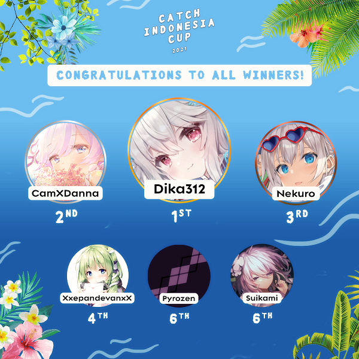

---
tags:
  - CIC2021
  - CIC 2021
---

# Catch the Beat Indonesia Cup 2021

The **Catch the Beat Indonesia Cup 2021** (***CIC 2021***) was a double-elimination 1v1 osu!catch tournament hosted by ::{ flag=ID }:: [Madoka Ayukawa](https://osu.ppy.sh/users/1595221) and ::{ flag=ID }:: [Eum](https://osu.ppy.sh/users/16552751). The tournament was open to all players from Indonesia with a playcount of 3,000 or above in osu!catch regardless of rank. It was the ninth iteration of the Catch the Beat Indonesia Cup.

## Tournament schedule

| Event | Timestamp |
| --: | :-- |
| Registration phase | 2021-06-01/2021-06-10 |
| Screening phase | 2021-06-10/2021-06-27 |
| Group stage | 2021-06-28/2021-07-04 |
| Round of 16 | 2021-07-05/2021-07-11 |
| Quarterfinals | 2021-07-12/2021-07-18 |
| Semifinals | 2021-07-19/2021-07-25 |
| Finals | 2021-07-26/2021-08-01 |

## Prizes

| Placing | Prizes |
| :-: | :-- |
|  | 50% of the raised prize pool, 3 months of osu!supporter, unique profile badge |
|  | 30% of the raised prize pool, 2 months of osu!supporter |
|  | 20% of the raised prize pool, 1 month of osu!supporter |

## Organisation

CIC 2021 was run by various Indonesian osu! community members.

| Position | Member(s) |
| :-- | :-- |
| Host | ::{ flag=ID }:: [Madoka Ayukawa](https://osu.ppy.sh/users/1595221), ::{ flag=ID }:: [Eum](https://osu.ppy.sh/users/16552751) |
| Mappool selector | ::{ flag=ID }:: [Madoka Ayukawa](https://osu.ppy.sh/users/1595221), ::{ flag=ID }:: [Intel21](https://osu.ppy.sh/users/1272422), ::{ flag=ID }:: [Shurelia](https://osu.ppy.sh/users/3807986) |
| Streamer | ::{ flag=ID }:: [Victim\_Crasher](https://osu.ppy.sh/users/2084869), ::{ flag=ID }:: [Netamaru](https://osu.ppy.sh/users/1830361) |
| Commentator | ::{ flag=ID }:: [Victim\_Crasher](https://osu.ppy.sh/users/2084869),  ::{ flag=ID }:: [Ascaveth](https://osu.ppy.sh/users/3245206), ::{ flag=ID }:: [Dapuluous](https://osu.ppy.sh/users/8140944), ::{ flag=ID }:: [Neptunia-chan](https://osu.ppy.sh/users/11608122), ::{ flag=ID }:: [-Hex-](https://osu.ppy.sh/users/8630988), ::{ flag=ID }:: [Shiviaren](https://osu.ppy.sh/users/3429259) |
| Referee | ::{ flag=ID }:: [Madoka Ayukawa](https://osu.ppy.sh/users/1595221), ::{ flag=ID }:: [Shurelia](https://osu.ppy.sh/users/3807986), ::{ flag=ID }:: [Niva](https://osu.ppy.sh/users/197805), ::{ flag=ID }:: [Koimeji](https://osu.ppy.sh/users/4137039), ::{ flag=ID }:: [Asqed](https://osu.ppy.sh/users/6525565), ::{ flag=ID }:: [moncar321](https://osu.ppy.sh/users/1400073) |
| Graphic designer | ::{ flag=ID }:: [mina-](https://osu.ppy.sh/users/4670692), ::{ flag=ID }:: [Avoya](https://osu.ppy.sh/users/3136817) |
| Spreadsheet manager | ::{ flag=ID }:: [Kazuyo](https://osu.ppy.sh/users/5604201) |
| Wiki editor | ::{ flag=ID }:: [Niva](https://osu.ppy.sh/users/197805) |

## Links

- **[Main spreadsheet](https://docs.google.com/spreadsheets/d/e/2PACX-1vSDtfjCSGk1QtJRtCHHKaUD4uC3RwMC-aKJ8g3xDcQjomjmtKk_p8ARkd-TjJz5PXleqq8ukPHNPiYV/pubhtml)**
- [Discussion thread](https://osu.ppy.sh/community/forums/topics/1324864)
- [Discord server](https://discord.gg/YwAYbPa)
- [Challonge brackets](https://challonge.com/CIC2021)
- [Livestream channel](https://www.twitch.tv/osuIndonesia/)

## Participants

Listed below are players who qualified into the Group stage (along with their respective seeding and group placement) out of 35 registered players in total.

| Group | Seed A | Seed B | Seed C | Seed D |
| :-- | :-- | :-- | :-- | :-- |
| A | ::{ flag=ID }:: [Chroneko](https://osu.ppy.sh/users/5472877) | ::{ flag=ID }:: [Latina-](https://osu.ppy.sh/users/15015592) | ::{ flag=ID }:: [Zvenx](https://osu.ppy.sh/users/14613788) | ::{ flag=ID }:: [Konami-kun](https://osu.ppy.sh/users/15931741) |
| B | ::{ flag=ID }:: [LeWind](https://osu.ppy.sh/users/9718235) | ::{ flag=ID }:: [Nekuro](https://osu.ppy.sh/users/3222638) | ::{ flag=ID }:: [XxepandevanxX](https://osu.ppy.sh/users/13194580) | ::{ flag=ID }:: [Kenneth Alfredo](https://osu.ppy.sh/users/829469) |
| C | ::{ flag=ID }:: [CamXDanna](https://osu.ppy.sh/users/3243148) | ::{ flag=ID }:: [Pyrozen](https://osu.ppy.sh/users/3031177) | ::{ flag=ID }:: [Riria Rakira](https://osu.ppy.sh/users/6310025) | ::{ flag=ID }:: [Kinora](https://osu.ppy.sh/users/20571283) |
| D | ::{ flag=ID }:: [Galaxi](https://osu.ppy.sh/users/2552435) | ::{ flag=ID }:: [Sololiquy](https://osu.ppy.sh/users/4350087) | ::{ flag=ID }:: [MrGulla](https://osu.ppy.sh/users/4540721) | ::{ flag=ID }:: [Mixuri](https://osu.ppy.sh/users/9153772) |
| E | ::{ flag=ID }:: [dedotikea](https://osu.ppy.sh/users/8805157) | ::{ flag=ID }:: [Suikami](https://osu.ppy.sh/users/1929336) | ::{ flag=ID }:: [BitDust](https://osu.ppy.sh/users/9573836) | ::{ flag=ID }:: [Xtream1500](https://osu.ppy.sh/users/20740438) |
| F | ::{ flag=ID }:: [Netamaru](https://osu.ppy.sh/users/1830361) | ::{ flag=ID }:: [by-ad](https://osu.ppy.sh/users/7439939) | ::{ flag=ID }:: [Fyl](https://osu.ppy.sh/users/10069307) | ::{ flag=ID }:: [Holicia](https://osu.ppy.sh/users/3212755) |
| G | ::{ flag=ID }:: [Funtastic](https://osu.ppy.sh/users/3555626) | ::{ flag=ID }:: [mina-](https://osu.ppy.sh/users/4670692) | ::{ flag=ID }:: [ilhamuharam](https://osu.ppy.sh/users/7657968) | ::{ flag=ID }:: [ARTPHONEY](https://osu.ppy.sh/users/2128050) |
| H | ::{ flag=ID }:: [dika312](https://osu.ppy.sh/users/741613) | ::{ flag=ID }:: [Dapuluous](https://osu.ppy.sh/users/8140944) | ::{ flag=ID }:: [Zylin](https://osu.ppy.sh/users/6692990) | ::{ flag=ID }:: [Neori\_gaming](https://osu.ppy.sh/users/10772518) |

## Podium

## Mappools

### Finals

**[Download the mappack here! (135 MB)](https://drive.google.com/u/0/uc?id=16uQMj49gMRftiXzoxrakDNTioWg65UPB&export=download)**

- NoMod
  1. [UNDEAD CORPORATION - Blow (Imai Lisa) \[Team Russian Federation's Overdose\]](https://osu.ppy.sh/beatmapsets/1265145#fruits/2629347)
  2. [DJ TOTTO - Crystalia (Secre) \[Perfect Freeze\]](https://osu.ppy.sh/beatmapsets/1434231#fruits/2951547)
  3. [Toby Fox - Spider Dance (Camellia Remix) (Jemzuu) \[Venom\]](https://osu.ppy.sh/beatmapsets/1530857#fruits/3131176)
  4. [THE ORAL CIGARETTES - Mou Ii Kai? (autofanboy) \[Let's Go!\]](https://osu.ppy.sh/beatmapsets/1530840#fruits/3131141)
  5. [Kotone - Konkai no Soudo ni Tsukimashite. (captin1) \[halfslashed vtuber\]](https://osu.ppy.sh/beatmapsets/1492398#fruits/3059194)
  6. [Masqed Pierrot - THE FAUST (fanzhen0019) \[dounts\]](https://osu.ppy.sh/beatmapsets/1418075#fruits/2921737)
- Hidden
  1. [Pizuya's Cell - Inchlings of the Shining Needle \~ Little Princess (Yumeno Himiko) \[Rain\]](https://osu.ppy.sh/beatmapsets/1530944#fruits/3131336)
  2. [KOTOKO - agony (Madoka Ayukawa) \[Fleeting Promise\]](https://osu.ppy.sh/beatmapsets/1530841#fruits/3131142)
  3. [Memme - Dajiahao (Erhu ver.) (SkyFlame) \[Kawa's Expert\]](https://osu.ppy.sh/beatmapsets/1362864#fruits/2922978)
  4. [Aqours - Jingle Bells ga Tomaranai (Cris-) \[Yeah! Dancin' Christmas!!\]](https://osu.ppy.sh/beatmapsets/1313213#fruits/2740342)
- HardRock
  1. [Unlucky Morpheus - Phantom Blood (Noctalium) \[Warth\]](https://osu.ppy.sh/beatmapsets/1412284#fruits/2911298)
  2. [P\*Light - SAY BAY (-MomoX) \[Deluge\]](https://osu.ppy.sh/beatmapsets/1368925#fruits/2830659)
  3. [EPICA - Victims of Contingency (DakiniBrave) \[Remorse\]](https://osu.ppy.sh/beatmapsets/540457#fruits/1377957)
  4. [sakuzyo - AXION (Star\* Remix 2016 Update) (Ryuusei Aika) \[Another\]](https://osu.ppy.sh/beatmapsets/957007#fruits/2003510)
- DoubleTime
  1. [Chata - Engage (Spectator) \[Overdose\]](https://osu.ppy.sh/beatmapsets/1530874#fruits/3131205)
  2. [zts - liberatedliberator (Deif) \[Requiem\]](https://osu.ppy.sh/beatmapsets/1530937#fruits/3131328)
  3. [Kawada Mami - Serment (Reiji Maigo) \[Extra\]](https://osu.ppy.sh/beatmapsets/1179009#fruits/2458659)
  4. [Kalafina - Lacrimosa (Kalibe) \[Regret\]](https://osu.ppy.sh/beatmapsets/840559#fruits/1759418)
- Tiebreaker
  1. **[LeaF - Kyouki Ranbu (extended ver.) (Secre) \[Terminus\]](https://osu.ppy.sh/beatmapsets/1410668#fruits/2908348)**

### Semifinals

**[Download the mappack here! (123 MB)](https://drive.google.com/u/0/uc?id=1XOFWCZD_W6oKZHU3WgVfrcrOm8EMwv6V&export=download)**

- NoMod
  1. [ginkiha - ARCADE\_MEMORIES (-MomoX) \[Nostalgia\]](https://osu.ppy.sh/beatmapsets/1216106#fruits/2530496)
  2. [LeaF - Paraclete (Du5t) \[Deluge\]](https://osu.ppy.sh/beatmapsets/1524638#fruits/3119443)
  3. [Calliope Mori - Excuse My Rudeness, But Could You Please RIP?\<3 (t+pazolite Remix) (-Joakh) \[Rustyy's Deluge\]](https://osu.ppy.sh/beatmapsets/1493146#fruits/3060937)
  4. [Mutsuhiko Izumi - Tengoku to Jigoku (ZHSteven) \[Jigoku\]](https://osu.ppy.sh/beatmapsets/22137#fruits/1693767)
  5. [Atogoru - Outer Science (fanzhen0019) \[Dead End\]](https://osu.ppy.sh/beatmapsets/667055#fruits/1411573)
  6. [Ashrount - Cataraxir (Realazy) \[Abyss\]](https://osu.ppy.sh/beatmapsets/1276331#fruits/2651798)
- Hidden
  1. [Bao.Uner - Long Men Nao Shi - Xiao (Yumeno Himiko) \[Lungmen Downtown\]](https://osu.ppy.sh/beatmapsets/1359694#fruits/2813632)
  2. [MYUKKE. - Ginevra (autofanboy) \[Overdose\]](https://osu.ppy.sh/beatmapsets/1471164#fruits/3020273)
  3. [solfa - Battle 6 : okamitachi no kiba -Revenge of the wolves- (Reiji Maigo) \[awa\]](https://osu.ppy.sh/beatmapsets/1431935#fruits/2947341)
  4. [Yamamoto Mineko - Cadena (KKipalt) \[Extra\]](https://osu.ppy.sh/beatmapsets/1257561#fruits/2613139)
- HardRock
  1. [UNDEAD CORPORATION - Everything will freeze (Shurelia) \[Overdose\]](https://osu.ppy.sh/beatmapsets/1524489#fruits/3119170)
  2. [Lime - Replica (Spectator) \[Overdose\]](https://osu.ppy.sh/beatmapsets/1524441#fruits/3119055)
  3. [Rise Against - Prayer of the Refugee (EvilElvis) \[Dawn\]](https://osu.ppy.sh/beatmapsets/181689#fruits/435994)
  4. [ginkiha, TEA - Haruka (Short Ver.) (Hinsvar) \[Niva's Insane\]](https://osu.ppy.sh/beatmapsets/1110461#fruits/2320395)
- DoubleTime
  1. [mafumafu - I wanna be a girl (Chatie) \[Collab Rain\]](https://osu.ppy.sh/beatmapsets/1490540#fruits/3055263)
  2. [Minase Mashiro - Suna no Kodomo (JBHyperion) \[Bloom\]](https://osu.ppy.sh/beatmapsets/972764#fruits/2036564)
  3. [Chihara Minori - Mika Ranman no Utage nite (Mordred) \[Insane\]](https://osu.ppy.sh/beatmapsets/1152086#fruits/2441293)
  4. [Horie Yui - silky heart (rosario wknd) \[Heartache\]](https://osu.ppy.sh/beatmapsets/1258444#fruits/2615903)
- Tiebreaker
  1. **[Camellia - We Could Get More Machinegun Psystyle! (And More Genre Switches) (fayew) \[Abstracted Destiny\]](https://osu.ppy.sh/beatmapsets/1033472#fruits/2160885)**

### Quarterfinals

**[Download the mappack here! (128 MB)](https://drive.google.com/u/0/uc?id=1vM4kzGpTcNzv3jB-Zbv3Qiv3Dkf47h9g&export=download)**

- NoMod
  1. [Minase Inori - Crystallize (Yumeno Himiko) \[Overdose\]](https://osu.ppy.sh/beatmapsets/1315359#fruits/2725824)
  2. [xi - Bad Elixir (Nelly) \[Alchemistry\]](https://osu.ppy.sh/beatmapsets/1297551#fruits/2691794)
  3. [nomico - Bad Apple!! (ZHSteven) \[fruit\]](https://osu.ppy.sh/beatmapsets/24829#fruits/84285)
  4. [hololive IDOL PROJECT - Shiny Smily Story (Hollow Wings) \[Swan Song\]](https://osu.ppy.sh/beatmapsets/1296110#fruits/2689177)
  5. [xi - Last Resort (Kroytz) \[Real's GRAVITY\]](https://osu.ppy.sh/beatmapsets/800102#fruits/1679794)
- Hidden
  1. [Yorushika - Amy (autofanboy) \[Overcast Skies\]](https://osu.ppy.sh/beatmapsets/1191707#fruits/2483298)
  2. [siqlo feat. Norico - Growth Call (Jemzuu) \[Overdose\]](https://osu.ppy.sh/beatmapsets/1276854#fruits/2652869)
  3. [Zektbach - The Sealer \~A Milia to Milia no Tami\~ (\[Keqing\]) \[Extra\]](https://osu.ppy.sh/beatmapsets/1414241#fruits/2915013)
- HardRock
  1. [UNDEAD CORPORATION - Karakurenawi (Sinnoh) \[Overdose\]](https://osu.ppy.sh/beatmapsets/584147#fruits/1288820)
  2. [M2U - H.O.W.Ling (autofanboy) \[P.R.E.Dation\]](https://osu.ppy.sh/beatmapsets/1135047#fruits/2370553)
  3. [Nekomata Master - Izanami's wail (Saturnalize) \[AncuL's Another\]](https://osu.ppy.sh/beatmapsets/959449#fruits/3051097)
- DoubleTime
  1. [la la larks - loop (Spectator) \[rain\]](https://osu.ppy.sh/beatmapsets/1310870#fruits/2717254)
  2. [Kana Nishino - Darling (Ascendance) \[Rain\]](https://osu.ppy.sh/beatmapsets/605215#fruits/1278689)
  3. [loos - Koi Yomi Zakura (Full size) (papapa213) \[koko's Insane\]](https://osu.ppy.sh/beatmapsets/602230#fruits/1428541)
- Tiebreaker
  1. **[Horie Yui - The World's End (Bastian) \[Bastian & Greaper's Finale\]](https://osu.ppy.sh/beatmapsets/1134081#fruits/2368389)**

### Round of 16

**[Download the mappack here! (108 MB)](https://drive.google.com/u/0/uc?id=1qdwIbMol5EjZc2f1c8eE-_3MPzkOjioz&export=download)**

- NoMod
  1. [Chitose Sara - Merry Merry Go Round (SHOT MUSIC Asterisk Remix) (-Izayoi) \[Carousel\]](https://osu.ppy.sh/beatmapsets/975120#fruits/2041038)
  2. [Inugami Korone & Nekomata Okayu - Hyadain no Joujou Yuujou (Cut Ver.) (My Angel RangE) \[Overdose\]](https://osu.ppy.sh/beatmapsets/1413067#fruits/2912709)
  3. [Tatsh - Xepher (Nazalion) \[Rain+\]](https://osu.ppy.sh/beatmapsets/134486#fruits/337282)
  4. [Kage - FIRST (happy30) \[hatteke30's Extra\]](https://osu.ppy.sh/beatmapsets/194107#fruits/461048)
  5. [Eagle - S!ck (fanzhen0019) \[123\]](https://osu.ppy.sh/beatmapsets/788035#fruits/1653964)
- Hidden
  1. [YOASOBI - Yasashii Suisei (Crowley) \[The Mutual Connection of Two Exceptional Falling Stars\]](https://osu.ppy.sh/beatmapsets/1411580#fruits/2910097)
  2. [Hyuji feat. LIQU@. - Mermaid girl (Tropical Remix) (Ascendance) \[Brunoob's MAXIMUM\]](https://osu.ppy.sh/beatmapsets/1244353#fruits/2586681)
  3. [Machita Chima - KING (Ayucchi) \[Expert\]](https://osu.ppy.sh/beatmapsets/1306528#fruits/2708875)
- HardRock
  1. [Pastel\*Palettes - Shuwarin\*Drea~min (AutoLs) \[Rain\]](https://osu.ppy.sh/beatmapsets/1255717#fruits/2611006)
  2. [Ayase Rie - Yuima-ru\*World (Bastian) \[Rain\]](https://osu.ppy.sh/beatmapsets/1400516#fruits/2889374)
  3. [Ricky Martin - Livin' La Vida Loca (Spanish Version) (Krisom) \[Alocado\]](https://osu.ppy.sh/beatmapsets/1337085#fruits/2769841)
- DoubleTime
  1. [ShinRa-Bansho - Itazura Sensation (Spectator) \[Hex's Platter\]](https://osu.ppy.sh/beatmapsets/1324962#fruits/2786508)
  2. [m108 - \* Crow Solace \* (Rocma) \[\[III\]\]](https://osu.ppy.sh/beatmapsets/829329#fruits/1751539)
  3. [Kagamine Rin & Len - Jutenija (Arusha Shuna) \[Gale\]](https://osu.ppy.sh/beatmapsets/29557#fruits/97995)
- Tiebreaker
  1. **[AKI AKANE - Hanabira (Irus Brutalcore Breaks Remix) (Deif) \[Flower Petals\]](https://osu.ppy.sh/beatmapsets/526175#fruits/1116562)**

### Group stage

**[Download the mappack here! (87 MB)](https://drive.google.com/file/d/1cwjsNciDalNJmdqz6t1FQLbDY2sM2-vo/view)**

- NoMod
  1. [CHiCO with HoneyWorks - Pride Kakumei (rew0825) \[Rain\]](https://osu.ppy.sh/beatmapsets/1394916#fruits/2879325)
  2. [Kicco - Akari no Arika (-Joakh) \[Lumi's Rain\]](https://osu.ppy.sh/beatmapsets/1404258#fruits/2924231)
  3. [Ayaponzu\* - Catch You Catch Me (Yumeno Himiko) \[Magic\]](https://osu.ppy.sh/beatmapsets/1478834#fruits/3033888)
  4. [Camellia feat. Nanahira - POLKAMANIA (Mir) \[ANOTHER\]](https://osu.ppy.sh/beatmapsets/1409478#fruits/2906707)
- Hidden
  1. [Yamazaki Moe - Kataomoi no Melody o short ver. (AJamez) \[Light Rain\]](https://osu.ppy.sh/beatmapsets/769584#fruits/1618186)
  2. [xi - Titania (Jemzuu) \[Rain\]](https://osu.ppy.sh/beatmapsets/1278046#fruits/2669851)
  3. [Junk - Yellow Smile(bms edit) (rui) \[wring's Another\]](https://osu.ppy.sh/beatmapsets/226133#fruits/554864)
- HardRock
  1. [chelmico - Easy Breezy feat. Zenpaku \[ dj-Jo Trap Remix \] TV Size (Ascendance) \[Chatie's Salad\]](https://osu.ppy.sh/beatmapsets/1284565#fruits/2943796)
  2. [Nekomata Master - Scars of FAUNA (Madoka2574) \[Platter\]](https://osu.ppy.sh/beatmapsets/1302763#fruits/2701842)
  3. [Nakiri Ayame - Deep Indigo (Bokamin) \[Hard\]](https://osu.ppy.sh/beatmapsets/1189193#fruits/2522847)
- DoubleTime
  1. [Duck Duck Pony - Shinsetsu (wonjae) \[wonJemZero's Salad\]](https://osu.ppy.sh/beatmapsets/951270#fruits/2009915)
  2. [Three Days Grace - Animal I Have Become (Secre) \[Platter\]](https://osu.ppy.sh/beatmapsets/1371694#fruits/2842835)
  3. [IOSYS - Miracle-Hinacle (vincerio) \[Miracle-Lolicle\]](https://osu.ppy.sh/beatmapsets/20210#fruits/71842)
- Tiebreaker
  1. **[Official HIGE DANdism - Pretender (Crowley) \[My Final Farewell\]](https://osu.ppy.sh/beatmapsets/1272888#fruits/2645056)**

## Match results

### Finals

Friday, 30 July 2021:

| Bracket | Player 1 |  |  | Player 2 | Match link |
| :-: | --: | :-: | :-: | :-- | :-- |
| Upper | **[dika312](https://osu.ppy.sh/users/741613)** ::{ flag=ID }:: | **7** | 1 | ::{ flag=ID }:: [Nekuro](https://osu.ppy.sh/users/3222638) | [#1](https://osu.ppy.sh/community/matches/88329783) |

Saturday, 31 July 2021:

| Bracket | Player 1 |  |  | Player 2 | Match link |
| :-: | --: | :-: | :-: | :-- | :-- |
| Lower | [Nekuro](https://osu.ppy.sh/users/3222638) ::{ flag=ID }:: | 2 | **7** | ::{ flag=ID }:: **[CamXDanna](https://osu.ppy.sh/users/3243148)** | [#1](https://osu.ppy.sh/community/matches/88392375) |

Sunday, 1 August 2021, Grand Final:

| Bracket | Player 1 |  |  | Player 2 | Match link |
| :-: | --: | :-: | :-: | :-- | :-- |
| Grand Final | **[dika312](https://osu.ppy.sh/users/741613)** ::{ flag=ID }:: | **7** | 0 | ::{ flag=ID }:: [CamXDanna](https://osu.ppy.sh/users/3243148) | [#1](https://osu.ppy.sh/community/matches/88449380) |

### Semifinals

Friday, 23 July 2021:

| Bracket | Player 1 |  |  | Player 2 | Match link |
| :-: | --: | :-: | :-: | :-- | :-- |
| Upper | [Pyrozen](https://osu.ppy.sh/users/3031177) ::{ flag=ID }:: | 0 | **6** | ::{ flag=ID }:: **[dika312](https://osu.ppy.sh/users/741613)** | *win by default* |
| Upper | [Suikami](https://osu.ppy.sh/users/1929336) ::{ flag=ID }:: | 5 | **6** | ::{ flag=ID }:: **[Nekuro](https://osu.ppy.sh/users/3222638)** | [#1](https://osu.ppy.sh/community/matches/87920148) |

Saturday, 24 July 2021:

| Bracket | Player 1 |  |  | Player 2 | Match link |
| :-: | --: | :-: | :-: | :-- | :-- |
| Lower | [Pyrozen](https://osu.ppy.sh/users/3031177) ::{ flag=ID }:: | 0 | **6** | ::{ flag=ID }:: **[CamXDanna](https://osu.ppy.sh/users/3243148)** | *win by default* |
| Lower | [Suikami](https://osu.ppy.sh/users/1929336) ::{ flag=ID }:: | 2 | **6** | ::{ flag=ID }:: **[XxepandevanxX](https://osu.ppy.sh/users/13194580)** | [#1](https://osu.ppy.sh/community/matches/87979007) |

Sunday, 25 July 2021:

| Bracket | Player 1 |  |  | Player 2 | Match link |
| :-: | --: | :-: | :-: | :-- | :-- |
| Lower | **[CamXDanna](https://osu.ppy.sh/users/3243148)** ::{ flag=ID }:: | **6** | 4 | ::{ flag=ID }:: [XxepandevanxX](https://osu.ppy.sh/users/13194580) | [#1](https://osu.ppy.sh/community/matches/88031955) |

### Quarterfinals

Friday, 16 July 2021:

| Bracket | Player 1 |  |  | Player 2 | Match link |
| :-: | --: | :-: | :-: | :-- | :-- |
| Upper | **[Suikami](https://osu.ppy.sh/users/1929336)** ::{ flag=ID }:: | **5** | 1 | ::{ flag=ID }:: [by-ad](https://osu.ppy.sh/users/7439939) | [#1](https://osu.ppy.sh/community/matches/87490047) |
| Upper | **[Pyrozen](https://osu.ppy.sh/users/3031177)** ::{ flag=ID }:: | **5** | 4 | ::{ flag=ID }:: [Galaxi](https://osu.ppy.sh/users/2552435) | [#1](https://osu.ppy.sh/community/matches/87483233) |
| Upper | [BitDust](https://osu.ppy.sh/users/9573836) ::{ flag=ID }:: | 1 | **5** | ::{ flag=ID }:: **[Nekuro](https://osu.ppy.sh/users/3222638)** | [#1](https://osu.ppy.sh/community/matches/87492466) |
| Upper | **[dika312](https://osu.ppy.sh/users/741613)** ::{ flag=ID }:: | **5** | 3 | ::{ flag=ID }:: [Sololiquy](https://osu.ppy.sh/users/4350087) | [#1](https://osu.ppy.sh/community/matches/87485885) |

Saturday, 17 July 2021:

| Bracket | Player 1 |  |  | Player 2 | Match link |
| :-: | --: | :-: | :-: | :-- | :-- |
| Lower | [BitDust](https://osu.ppy.sh/users/9573836) ::{ flag=ID }:: | 2 | **5** | ::{ flag=ID }:: **[XxepandevanxX](https://osu.ppy.sh/users/13194580)** | [#1](https://osu.ppy.sh/community/matches/87546745) |
| Lower | [Galaxi](https://osu.ppy.sh/users/2552435) ::{ flag=ID }:: | 4 | **5** | ::{ flag=ID }:: **[CamXDanna](https://osu.ppy.sh/users/3243148)** | [#1](https://osu.ppy.sh/community/matches/87548787) |
| Lower | [by-ad](https://osu.ppy.sh/users/7439939) ::{ flag=ID }:: | 0 | **5** | ::{ flag=ID }:: **[Chroneko](https://osu.ppy.sh/users/5472877)** | [#1](https://osu.ppy.sh/community/matches/87550793) |
| Lower | **[Sololiquy](https://osu.ppy.sh/users/4350087)** ::{ flag=ID }:: | **5** | 1 | ::{ flag=ID }:: [Dapuluous](https://osu.ppy.sh/users/8140944) | [#1](https://osu.ppy.sh/community/matches/87553091) |

Sunday, 18 July 2021:

| Bracket | Player 1 |  |  | Player 2 | Match link |
| :-: | --: | :-: | :-: | :-- | :-- |
| Lower | **[XxepandevanxX](https://osu.ppy.sh/users/13194580)** ::{ flag=ID }:: | **5** | 4 | ::{ flag=ID }:: [Chroneko](https://osu.ppy.sh/users/5472877) | [#1](https://osu.ppy.sh/community/matches/87612630) |
| Lower | [Sololiquy](https://osu.ppy.sh/users/4350087) ::{ flag=ID }:: | 4 | **5** | ::{ flag=ID }:: **[CamXDanna](https://osu.ppy.sh/users/3243148)** | [#1](https://osu.ppy.sh/community/matches/87615032) |

### Round of 16

Friday, 9 July 2021:

| Bracket | Player 1 |  |  | Player 2 | Match link |
| :-: | --: | :-: | :-: | :-- | :-- |
| Upper | **[Sololiquy](https://osu.ppy.sh/users/4350087)** ::{ flag=ID }:: | **5** | 1 | ::{ flag=ID }:: [Dapuluous](https://osu.ppy.sh/users/8140944) | [#1](https://osu.ppy.sh/community/matches/87058272) |
| Upper | **[Galaxi](https://osu.ppy.sh/users/2552435)** ::{ flag=ID }:: | **5** | 2 | ::{ flag=ID }:: [Chroneko](https://osu.ppy.sh/users/5472877) | [#1](https://osu.ppy.sh/community/matches/87055481) |
| Upper | **[Pyrozen](https://osu.ppy.sh/users/3031177)** ::{ flag=ID }:: | **5** | 2 | ::{ flag=ID }:: [XxepandevanxX](https://osu.ppy.sh/users/13194580) | [#1](https://osu.ppy.sh/community/matches/87053060) |

Saturday, 10 July 2021:

| Bracket | Player 1 |  |  | Player 2 | Match link |
| :-: | --: | :-: | :-: | :-- | :-- |
| Upper | **[dika312](https://osu.ppy.sh/users/741613)** ::{ flag=ID }:: | **5** | 0 | ::{ flag=ID }:: [CamXDanna](https://osu.ppy.sh/users/3243148) | [#1](https://osu.ppy.sh/community/matches/87110808) |
| Upper | **[Suikami](https://osu.ppy.sh/users/1929336)** ::{ flag=ID }:: | **5** | 3 | ::{ flag=ID }:: [Funtastic](https://osu.ppy.sh/users/3555626) | [#1](https://osu.ppy.sh/community/matches/87114367) |
| Upper | **[by-ad](https://osu.ppy.sh/users/7439939)** ::{ flag=ID }:: | **5** | 2 | ::{ flag=ID }:: [Latina-](https://osu.ppy.sh/users/15015592) | [#1](https://osu.ppy.sh/community/matches/87116623) |
| Upper | [mina-](https://osu.ppy.sh/users/4670692) ::{ flag=ID }:: | 4 | **5** | ::{ flag=ID }:: **[BitDust](https://osu.ppy.sh/users/9573836)** | [#1](https://osu.ppy.sh/community/matches/87120194) |
| Upper | **[Nekuro](https://osu.ppy.sh/users/3222638)** ::{ flag=ID }:: | **5** | 4 | ::{ flag=ID }:: [Holicia](https://osu.ppy.sh/users/3212755) | [#1](https://osu.ppy.sh/community/matches/87122424) |

Sunday, 11 July 2021:

| Bracket | Player 1 |  |  | Player 2 | Match link |
| :-: | --: | :-: | :-: | :-- | :-- |
| Lower | **[Chroneko](https://osu.ppy.sh/users/5472877)** ::{ flag=ID }:: | **5** | 2 | ::{ flag=ID }:: [mina-](https://osu.ppy.sh/users/4670692) | [#1](https://osu.ppy.sh/community/matches/87172954) |
| Lower | **[CamXDanna](https://osu.ppy.sh/users/3243148)** ::{ flag=ID }:: | **5** | 4 | ::{ flag=ID }:: [Funtastic](https://osu.ppy.sh/users/3555626) | [#1](https://osu.ppy.sh/community/matches/87177296) |
| Lower | **[XxepandevanxX](https://osu.ppy.sh/users/13194580)** ::{ flag=ID }:: | **5** | 4 | ::{ flag=ID }:: [Holicia](https://osu.ppy.sh/users/3212755) | [#1](https://osu.ppy.sh/community/matches/87169209) |
| Lower | **[Dapuluous](https://osu.ppy.sh/users/8140944)** ::{ flag=ID }:: | **5** | 0 | ::{ flag=ID }:: [Latina-](https://osu.ppy.sh/users/15015592) | [#1](https://osu.ppy.sh/community/matches/87174852) |

### Group stage

Friday, 2 July 2021:

| Group |  |  |  |  | Match link |
| :-: | :-: | :-: | :-: | :-: | :-- |
| **A** | ::{ flag=ID }:: **[Chroneko](https://osu.ppy.sh/users/5472877) (13 pts)** | ::{ flag=ID }:: **[Latina-](https://osu.ppy.sh/users/15015592) (9 pts[^tb-winner])** | ::{ flag=ID }:: [Zvenx](https://osu.ppy.sh/users/14613788) (1 pt) | ::{ flag=ID }:: [Konami-kun](https://osu.ppy.sh/users/15931741) (9 pts[^tb-loser]) | [#1](https://osu.ppy.sh/community/matches/86649900) |

Saturday, 3 July 2021:

| Group |  |  |  |  | Match link |
| :-: | :-: | :-: | :-: | :-: | :-- |
| **C** | ::{ flag=ID }:: **[CamXDanna](https://osu.ppy.sh/users/3243148) (10 pts)** | ::{ flag=ID }:: **[Pyrozen](https://osu.ppy.sh/users/3031177) (14 pts)** | ::{ flag=ID }:: [Riria Rakira](https://osu.ppy.sh/users/6310025) (8 pts) | ::{ flag=ID }:: [Kinora](https://osu.ppy.sh/users/20571283) (0 pts) | [#1](https://osu.ppy.sh/community/matches/86711638) |
| **D** | ::{ flag=ID }:: **[Galaxi](https://osu.ppy.sh/users/2552435) (9 pts)** | ::{ flag=ID }:: **[Sololiquy](https://osu.ppy.sh/users/4350087) (14 pts)** | ::{ flag=ID }:: [MrGulla](https://osu.ppy.sh/users/4540721) (6 pts) | ::{ flag=ID }:: [Mixuri](https://osu.ppy.sh/users/86713789) (4 pts) | [#1](https://osu.ppy.sh/community/matches/86713789) |

Sunday, 4 July 2021:

| Group |  |  |  |  | Match link |
| :-: | :-: | :-: | :-: | :-: | :-- |
| **E** | ::{ flag=ID }:: [dedotikea](https://osu.ppy.sh/users/8805157) (9 pts) | ::{ flag=ID }:: **[Suikami](https://osu.ppy.sh/users/1929336) (12 pts)** | ::{ flag=ID }:: **[BitDust](https://osu.ppy.sh/users/9573836) (11 pts)** | ::{ flag=ID }:: [Xtream1500](https://osu.ppy.sh/users/20740438) (0 pts) | [#1](https://osu.ppy.sh/community/matches/86716701) |
| **F** | ::{ flag=ID }:: [Netamaru](https://osu.ppy.sh/users/1830361) (8 pts) | ::{ flag=ID }:: **[by-ad](https://osu.ppy.sh/users/7439939) (10 pts[^tb-winner])** | ::{ flag=ID }:: [Fyl](https://osu.ppy.sh/users/10069307) (4 pts) | ::{ flag=ID }:: **[Holicia](https://osu.ppy.sh/users/3212755) (10 pts[^tb-loser])** | [#1](https://osu.ppy.sh/community/matches/86766389) |
| **G** | ::{ flag=ID }:: **[Funtastic](https://osu.ppy.sh/users/3555626) (11 pts)** | ::{ flag=ID }:: **[mina-](https://osu.ppy.sh/users/4670692) (13 pts)** | ::{ flag=ID }:: [ilhamuharam](https://osu.ppy.sh/users/7657968) (3 pts) | ::{ flag=ID }:: [ARTPHONEY](https://osu.ppy.sh/users/2128050) (5 pts) | [#1](https://osu.ppy.sh/community/matches/86767997) |
| **H** | ::{ flag=ID }:: **[dika312](https://osu.ppy.sh/users/741613) (16 pts)** | ::{ flag=ID }:: **[Dapuluous](https://osu.ppy.sh/users/8140944) (9 pts[^tb-winner])** | ::{ flag=ID }:: [Zylin](https://osu.ppy.sh/users/6692990) (0 pts) | ::{ flag=ID }:: [Neori\_gaming](https://osu.ppy.sh/users/10772518) (9 pts[^tb-loser]) | [#1](https://osu.ppy.sh/community/matches/86770044) |

Monday, 5 July 2021:

| Group |  |  |  |  | Match link |
| :-: | :-: | :-: | :-: | :-: | :-- |
| **B** | ::{ flag=ID }:: [LeWind](https://osu.ppy.sh/users/9718235) (10 pts[^tb-loser]) | ::{ flag=ID }:: **[Nekuro](https://osu.ppy.sh/users/3222638) (15 pts)** | ::{ flag=ID }:: **[XxepandevanxX](https://osu.ppy.sh/users/13194580) (10 pts[^tb-winner])** | ::{ flag=ID }:: [Kenneth Alfredo](https://osu.ppy.sh/users/829469) (0 pts) | [#1](https://osu.ppy.sh/community/matches/86758000) |

## Ruleset

### General rules

1. Map scoring is based on **[ScoreV2](/wiki/Gameplay/Score#scorev2).**
2. The mapsets for each round will be announced by the Tournament Management in advance before the actual matches take place.
3. Match schedules will be predetermined by the Tournament Management. If there are any player(s) who are unable to attend the current schedule for any reason, all other affected players may apply and settle for a reschedule at the `#scheduling` channel in the tournament's Discord server.
4. A referee will create a multiplayer room 10 minutes in advance and will start to send out invites.
5. If a player does not show up within **10 minutes** of the start time, their opponent wins by default.
6. If no staff or referee is available, the match will be postponed.
7. **NoFail will be enforced in all beatmaps.** This is to ensure that the points are to be awarded more fairly towards players who perform better in general during the course of the beatmap regardless of their remaining health at the end.
8. If a player disconnects, it will be treated as if they failed the beatmap.
   - Disconnects that occur within a few seconds after the beatmap is started by the referee can be rematched.
9. If a player disconnects between beatmaps, the match can be delayed up to 15 minutes at most.
   - In case the disconnected player failed to report back after the maximum allowance of 15 minutes had passed, the opposing player may be declared to be winning the match by default.
10. Lag is not a valid reason to nullify a beatmap.
11. If there are any problems during the match occurence, the Tournament Management will make a decision based on referee's report.
12. It is expected that all players be polite and respectful to each other. Penalties will be given if players violate.
    - If a player is found to be engaging in an act of offensive provocation, the said player responsible for the provocation may be either disqualified right away from the tournament and/or blacklisted from the tournament altogether.
    - Usage of any tools and programs that are against [osu!'s community rules](/wiki/Rules#community-rules) is strictly prohibited and will be straight up reported to the osu! team at will.

### Tournament registration

1. All interested players are required to register into the tournament individually.
   - In order to be eligible to play in the tournament, each player is required to have the Indonesian flag displayed on their profile and at least 3000 osu!catch playcounts to their name.
2. To ensure valid and serious registrations, every registered player will be checked in detail by the Tournament Management.
3. The list of players who are deemed to be eligible to compete in the tournament will be published by the Tournament Management after the Registration phase has ended.
4. The Tournament Management will only account for a maximum of 32 players to take part in the tournament.
   - In the case where the number of registrants exceeds 32, the Tournament Management will only enlist 32 registrants with the highest osu!catch pp to participate in the tournament.
5. Testplayers, referees, and map selectors may not participate as players in this tournament.

### Group stage rules

1. In the Group stage, all qualified players will be situated into four different seeds (Seed A, Seed B, Seed C, and Seed D) based on their osu!catch pp. The players from each seed will then be drawn into eight groups at random based on the result of a livestreamed [random.org](http://www.random.org/lists/) draw.
2. All players in each group will compete against each other in a single multiplayer lobby using the Battle Royale system. In this system, all players will each in turn pick out two maps from the mappool to be played with the following turnouts after each map:
   - 1st place: **+2 points**
   - 2nd place: **+1 point**
   - 3rd place: **+1 point**
   - 4th place: **0 point**
3. If there is a tie at the end of the map, the points will instead be distributed as follows:
   - **+2/+2/+1/0** in the case where the 1st place and the 2nd place players are tied.
   - **+2/+1/+1/+1** in the case where the 2nd place and the 3rd place players are tied.
   - **+2/+2/+2/0** in the case where the 1st place, the 2nd place, and the 3rd place players are tied.
   - **+2/+2/+2/+2** in the case where all four players are tied.
4. Players are **not allowed** to ban maps in the Group stage.
5. There is no Lower Bracket in the Group stage.
6. Rankings of each group are determined by sorting the results of each individual player's performance in the following priority:
   - Most points obtained.
   - Winner of the Tiebreaker.
   - Player(s) who Win By Default.
   - Whether there are players who are disqualified from the tournament.
7. Two players who placed on top of their respective groups' rankings based on the criteria listed above will advance to the Knock-out stage.

### Knock-out stage rules

1. The eight Group stage winners will be matched to the eight Group stage runners-up at random; that is, instead of following a predetermined match-up format (A1 vs H2, B1 vs G2, and so on), all the match-ups will be based on the result of a livestreamed [random.org](http://www.random.org/lists/) draw.
2. Players will compete against each other using the Double Elimination system.
3. The Double Elimination System works as following:
   - Players who lose in the Upper Bracket can still play again on the Lower Bracket.
   - Players who lose in the Lower Bracket will be eliminated from the tournament.
   - In the Grand Finals, the winner of the the Upper Bracket only needs to win a single match against their opponent in order to clinch the championship title. The winner of the Lower Bracket, however, needs to win two matches and enforce a Bracket Reset against their opponent in order to clinch the championship title.
4. Players who can compete in the next round are determined by:
   - In the Round of 16 and the Quarterfinals, each player needs to win 5 points in order to win a match. (Best-of-9)
   - In the Semifinals, each player needs to win 6 points in order to win a match. (Best-of-11)
   - In the Finals, each player needs to win 7 points in order to win the match. (Best-of-13)
   - Player(s) who Win By Default.
   - Whether there are players who are disqualified from the tournament.

### Match regulations

1. Each player must use the `!roll` command once in `#multiplayer` in order to determine the banning and picking order.
   - The winner of the `!roll` gets to decide which player gets to pick and ban first.
   - This rule does not apply in the Group stage lobbies.
2. Each player may ban up to two beatmaps from the mappool following a modified "comeback mechanic" system that is adapted from the [osu!catch World Cup 2019](/wiki/Tournaments/CWC/2019). The system works as follows:
   - At the start of the match, each player has to ban **one beatmap** from the mappool.
   - After a player reaches 3 points (in the Round of 16, the Quarterfinals, and the Semifinals) or 4 points (in the Finals), the opposing player is then given a chance to **ban another beatmap** from the mappool that hasn't either been picked or banned up until that point as a comeback mechanic.
   - All banned beatmaps are not allowed to be picked by any player in the remainder of the match.
   - This rule does not apply in the Group stage lobbies.
3. Each player is free to select one warm-up beatmap. Using beatmaps with questionable content is prohibited.
   - Warm-ups do not apply in the Group stage lobbies.
4. In case of a tiebreaker, **the tiebreaker beatmap will be played without any mods enabled** (NoMod).
5. The results of each match and any other relevant information regarding the match will be posted on the Discord server after the match has been concluded by the responsible referees.

## Notes

[^tb-winner]: Winner of the Tiebreaker map.
[^tb-loser]: Loser of the Tiebreaker map.
