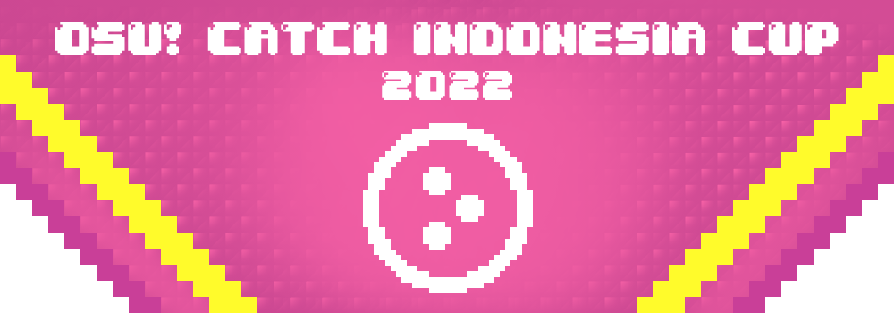
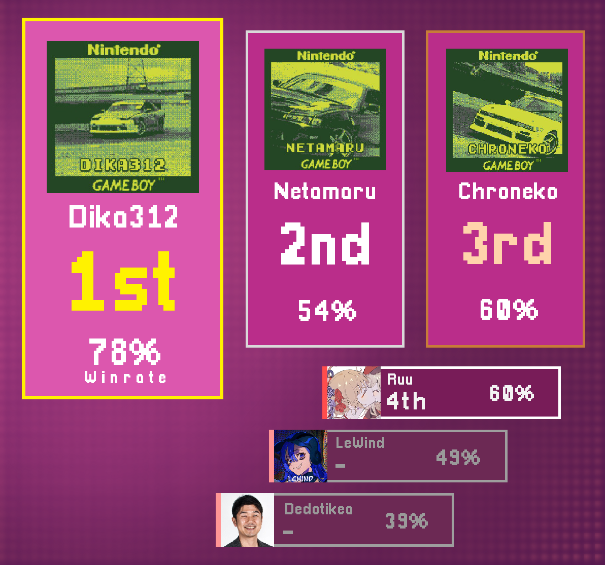

---
tags:
  - CIC2022
  - CIC 2022
---

# Catch the Beat Indonesia Cup 2022

The **Catch the Beat Indonesia Cup 2022** (***CIC 2022***) was a double-elimination 1v1 osu!catch tournament hosted by ::{ flag=ID }:: [Dapuluous](https://osu.ppy.sh/users/8140944) and ::{ flag=ID }:: [Madoka Ayukawa](https://osu.ppy.sh/users/1595221). The tournament was open to all players from Indonesia with a playcount of 3,000 or above in osu!catch regardless of rank. It was the tenth iteration of the Catch the Beat Indonesia Cup.

## Tournament schedule

| Event | Timestamp |
| --: | :-- |
| Registration Phase | 2022-02-01/2022-02-15 |
| Screening Phase | 2022-02-16/2022-02-23 |
| Group Stage | 2022-03-04/2022-03-06 |
| Round of 16 | 2022-03-12/2022-03-13 |
| Quarter Finals | 2022-03-19/2022-03-20 |
| Semi Finals | 2022-03-26/2022-03-27 |
| Finals | 2022-04-02/2022-04-03 |
| Grand Finals | 2022-04-09/2022-04-10 |

## Prizes

| Placing | Prizes |
| :-: | :-- |
|  | 50% of the raised prize pool, 6 months of osu!supporter, unique profile badge |
|  | 30% of the raised prize pool, 4 months of osu!supporter |
|  | 20% of the raised prize pool, 2 month of osu!supporter |
| 4th place | 1 month of osu!supporter |

## Organisation

CIC 2022 was run by various osu! community members predominantly hailing from Indonesia.

| Position | Member(s) |
| :-- | :-- |
| Host | ::{ flag=ID }:: [Dapuluous](https://osu.ppy.sh/users/8140944), ::{ flag=ID }:: [Madoka Ayukawa](https://osu.ppy.sh/users/1595221) |
| Mappool Selector | ::{ flag=ID }:: [-Hex-](https://osu.ppy.sh/users/8630988), ::{ flag=ID }:: [Constantine](https://osu.ppy.sh/users/3221898), ::{ flag=ID }:: [Madoka Ayukawa](https://osu.ppy.sh/users/1595221), ::{ flag=ID }:: [Sololiquy](https://osu.ppy.sh/users/4350087), ::{ flag=ID }:: [Urabe Mikoto](https://osu.ppy.sh/users/1272422) |
| Custom mapper | ::{ flag=ID }:: [-Hex-](https://osu.ppy.sh/users/8630988), ::{ flag=TN }:: [-Ken](https://osu.ppy.sh/users/4430811), ::{ flag=PH }:: [-Rustyy](https://osu.ppy.sh/users/16355636), ::{ flag=HK }:: [autofanboy](https://osu.ppy.sh/users/636114), ::{ flag=ID }:: [Dapuluous](https://osu.ppy.sh/users/8140944), ::{ flag=ES }:: [Deif](https://osu.ppy.sh/users/318565), ::{ flag=PH }:: [Jemzuu](https://osu.ppy.sh/users/7890134), ::{ flag=TH }:: [Kukkai](https://osu.ppy.sh/users/7811952), ::{ flag=ID }:: [Madoka Ayukawa](https://osu.ppy.sh/users/1595221), ::{ flag=PH }:: [Nosuri](https://osu.ppy.sh/users/2150415), ::{ flag=ID }:: [Sololiquy](https://osu.ppy.sh/users/4350087) |
| Streamer | ::{ flag=ID }:: [Dika312](https://osu.ppy.sh/users/741613), ::{ flag=AU }:: [wangwangg](https://osu.ppy.sh/users/6416920), ::{ flag=ID }:: [Zvenx](https://osu.ppy.sh/users/14613788) |
| Commentator | ::{ flag=ID }:: [-Hex-](https://osu.ppy.sh/users/8630988), ::{ flag=ID }:: [CamXDanna](https://osu.ppy.sh/users/3243148), ::{ flag=ID }:: [Chroneko](https://osu.ppy.sh/users/5472877), ::{ flag=ID }:: [Dapuluous](https://osu.ppy.sh/users/8140944), ::{ flag=ID }:: [Kazuyo](https://osu.ppy.sh/users/5604201), ::{ flag=ID }:: [Madoka Ayukawa](https://osu.ppy.sh/users/1595221), ::{ flag=ID }:: [Neptunia-chan](https://osu.ppy.sh/users/11608122), ::{ flag=ID }:: [Pischok](https://osu.ppy.sh/users/15507280), ::{ flag=ID }:: [Urabe Mikoto](https://osu.ppy.sh/users/1272422), ::{ flag=ID }:: [Zvenx](https://osu.ppy.sh/users/14613788) |
| Referee | ::{ flag=ID }:: [-Hex-](https://osu.ppy.sh/users/8630988), ::{ flag=ID }:: [Dapuluous](https://osu.ppy.sh/users/8140944), ::{ flag=ID }:: [Kenneth Alfredo](https://osu.ppy.sh/users/829469) |
| Graphic designer | ::{ flag=ID }:: [Sololiquy](https://osu.ppy.sh/users/4350087) |
| Spreadsheet manager | ::{ flag=ID }:: [Dapuluous](https://osu.ppy.sh/users/8140944) |
| Wiki editor | ::{ flag=ID }:: [Dapuluous](https://osu.ppy.sh/users/8140944) |

## Links

- **[Main spreadsheet](https://docs.google.com/spreadsheets/u/1/d/e/2PACX-1vSvgR8kpmCBm3hqjKuN0LSNkP6H6S7ugk-7y2Xx2AR8sxYkJqgPFoAmDwoJx3Ic1l9FbdwQg1caZCsM/pubhtml)**
- [Discussion thread](https://osu.ppy.sh/community/forums/topics/1513493)
- [Discord server](https://discord.gg/YwAYbPa)
- [Challonge brackets](https://challonge.com/cic2022)
- [Livestream channel](https://www.twitch.tv/catchindonesiacup)

## Participants

Listed below are players who qualified into the Group stage (along with their respective seeding and group placement) out of 28 registered players in total.

| Group | Top Seed | Mid Seed | Low Seed | Unseeded |
| :-- | :-- | :-- | :-- | :-- |
| A | ::{ flag=ID }:: [dedotikea](https://osu.ppy.sh/users/8805157) | ::{ flag=ID }:: [Zvenx](https://osu.ppy.sh/users/14613788) | ::{ flag=ID }:: [BitDust](https://osu.ppy.sh/users/9573836) | ::{ flag=ID }:: [Swirfly](https://osu.ppy.sh/users/5164134) |
| B | ::{ flag=ID }:: [Galaxi](https://osu.ppy.sh/users/2552435) | ::{ flag=ID }:: [Mamat](https://osu.ppy.sh/users/3031177) | ::{ flag=ID }:: [Reissfelt](https://osu.ppy.sh/users/1096240) | ::{ flag=ID }:: [Honkenway](https://osu.ppy.sh/users/11582543) |
| C | ::{ flag=ID }:: [Keisuu](https://osu.ppy.sh/users/3856673) | ::{ flag=ID }:: [Chiya--](https://osu.ppy.sh/users/7934854) | ::{ flag=ID }:: [ReiYKana](https://osu.ppy.sh/users/13055705) | ::{ flag=ID }:: [ARTPHONEY](https://osu.ppy.sh/users/2128050) |
| D | ::{ flag=ID }:: [Netamaru](https://osu.ppy.sh/users/1830361) | ::{ flag=ID }:: [Nekuro](https://osu.ppy.sh/users/3222638) | ::{ flag=ID }:: [Kinora](https://osu.ppy.sh/users/20571283) | ::{ flag=ID }:: [Mixuri](https://osu.ppy.sh/users/9153772) |
| E | ::{ flag=ID }:: [Dika312](https://osu.ppy.sh/users/741613) | ::{ flag=ID }:: [Keita](https://osu.ppy.sh/users/3355617) | ::{ flag=ID }:: [Konami-kun](https://osu.ppy.sh/users/15931741) | - |
| F | ::{ flag=ID }:: [CamXDanna](https://osu.ppy.sh/users/3243148) | ::{ flag=ID }:: [EpanPan](https://osu.ppy.sh/users/13194580) | ::{ flag=ID }:: [Ruu](https://osu.ppy.sh/users/3212755) | - |
| G | ::{ flag=ID }:: [LeWind](https://osu.ppy.sh/users/9718235) | ::{ flag=ID }:: [Intention](https://osu.ppy.sh/users/3416858) | ::{ flag=ID }:: [Kazuyo](https://osu.ppy.sh/users/5604201) | - |
| H | ::{ flag=ID }:: [Chroneko](https://osu.ppy.sh/users/5472877) | ::{ flag=ID }:: [Minalinsky-](https://osu.ppy.sh/users/2823883) | ::{ flag=ID }:: [fikricm](https://osu.ppy.sh/users/4072503) | - |

## Podium

## Mappools

### Finals

**[Download the mappack here! (137 MB)](https://drive.google.com/file/d/1yZ1H13hVwbXjvqkRzmkvkeSV02kfs9k5/view)**

- NoMod
  1. [Shade - Ontology (Spectator) \[Deluge\]](https://osu.ppy.sh/beatmapsets/1558024#fruits/3182677)
  2. [LeaF - Ka (Kukkai) \[ERROR\]](https://osu.ppy.sh/beatmapsets/1429702#fruits/2943178)
  3. [Aura Kasih - Mari Bercinta (Madoka Ayukawa) \[Dansa\]](https://osu.ppy.sh/beatmapsets/1729731#fruits/3535054)
  4. [SIDxRAM - RAMSING (Ksardas) \[0PPINOSU'S ANOTHER\]](https://osu.ppy.sh/beatmapsets/1137778#fruits/2529041)
  5. [Nekomata Master - Despair of Elferia (-Tochi) \[ANIMUM DESPONDEO\]](https://osu.ppy.sh/beatmapsets/1069504#fruits/2238810)
  6. [Camellia - PSYCHO+HEROES (lcfc) \[Extreme\]](https://osu.ppy.sh/beatmapsets/1404742#fruits/2897138)
- Hidden
  1. [Tedjimo yomigY - Edelweiss (Secre) \[Purity\]](https://osu.ppy.sh/beatmapsets/1667554#fruits/3404936)
  2. [II-L - SPUTNIK-6 (Sololiquy) \[X-6\]](https://osu.ppy.sh/beatmapsets/1729744#fruits/3535090)
  3. [C-Show - Make Some Noise for Mr.C (MaridiuS) \[LETS GO!\]](https://osu.ppy.sh/beatmapsets/1305940#fruits/2707584)
  4. [LhoU - popotnik - The Traveller of Ljubljana (Astahrath) \[masochist\]](https://osu.ppy.sh/beatmapsets/1287006#fruits/2672063)
- HardRock
  1. [ke-ji feat. Nanahira - Ange du Blanc Pur (My Angel RangE) \[Mon Ange Blanc\]](https://osu.ppy.sh/beatmapsets/1395989#fruits/2881297)
  2. [uma - Keep It Up (Nosuri) \[Deluge\]](https://osu.ppy.sh/beatmapsets/1729734#fruits/3535059)
  3. [Suda Keina - veil (Kaitjuh) \[impasse\]](https://osu.ppy.sh/beatmapsets/1023081#fruits/2140171)
  4. [HiTECH NINJA - Modelista (-jordan-) \[Beyond Lv.10\]](https://osu.ppy.sh/beatmapsets/1148442#fruits/2397737)
- DoubleTime
  1. [Tokoyami Towa x Hoshimachi Suisei - Haiiro to Ao (Sololiquy) \[map vtuber\]](https://osu.ppy.sh/beatmapsets/1729743#fruits/3535089)
  2. [EGOIST - BANG!!! (-Hex-) \[Hexuluous' Common Sense\]](https://osu.ppy.sh/beatmapsets/1729736#fruits/3535062)
  3. [Ice Cube - Go to Church (feat. Snoop Dogg) (TicClick) \[Insane feat. EvilElvis\]](https://osu.ppy.sh/beatmapsets/319999#fruits/712147)
  4. [Yousei Teikoku - Aru Tsuioku, Bouchou Uchuu ni Okeru Shinkai Sunawachi Suiten (IsomirDiAngelo) \[Extreme\]](https://osu.ppy.sh/beatmapsets/1607459#fruits/3296392)
- Tiebreaker
  1. **[Kou! - TERRABYTE ("XETTABYTE" Long Version) (Jemzuu) \[KEN & JEMZUU'S XHAOTIC NEUTRAL\]](https://osu.ppy.sh/beatmapsets/1729729#fruits/3535052)**

### Semifinals

**[Download the mappack here! (124 MB)](https://drive.google.com/file/d/1hppgWwtaboQqXDDQ27qTyCgsLvGIZmLQ/view)**

- NoMod
  1. [Choko - INTERNET OVERDOSE (Kukkai) \[Dapu & Kukkai's Addiction\]](https://osu.ppy.sh/beatmapsets/1724480)
  2. [Nekomata Master+ - Rengoku no Elferia (Yoshi_green) \[Despair\]](https://osu.ppy.sh/beatmapsets/1716591#fruits/3507903)
  3. [Tohma - Azalea no Bourei (Kowaii_ne) \[Mahou Shoujo Koufukuron\]](https://osu.ppy.sh/beatmapsets/168437#fruits/542789)
  4. [Kurosawa Daisuke x Masahiro "Godspeed" Aoki - Dairokutenmaou (pw384) \[Extreme\]](https://osu.ppy.sh/beatmapsets/1120841#fruits/2371971)
  5. [lapix - Labyrinth (Akali) \[Who's the fucking gangster?\]](https://osu.ppy.sh/beatmapsets/615878#fruits/1299008)
  6. [Dance Gavin Dance - Frozen One (Zaiten) \[Misspent Youth\]](https://osu.ppy.sh/beatmapsets/635549#osu/1348658)
- Hidden
  1. [bill wurtz - La de da de da de da de day oh (Deif) \[overdose\]](https://osu.ppy.sh/beatmapsets/1724484#fruits/3524385)
  2. [ITZY - Mafia In the morning (Xetopia) \[Special\]](https://osu.ppy.sh/beatmapsets/1619154#fruits/3305905)
  3. [Two Door Cinema Club - Dirty Air (StarCastler) \[Gens' Blaze\]](https://osu.ppy.sh/beatmapsets/1107855#fruits/2336375)
  4. [jun with Alison - SUNKiSS DROP \~jun side\~ (\[Keqing\]) \[please donate for my gacha addiction\]](https://osu.ppy.sh/beatmapsets/1498309#fruits/3070802)
- HardRock
  1. [mafumafu - Haikei, Sakura Maichiru Kono Hi ni (-Rustyy) \[Graduation\]](https://osu.ppy.sh/beatmapsets/1724443#fruits/3524318)
  2. [DJ YOSHITAKA - JOMANDA (Syamu) \[†\]](https://osu.ppy.sh/beatmapsets/1672888#fruits/3417218)
  3. [Ryoukoushoku Shakai - Mela! (Battle) \[Hero!\]](https://osu.ppy.sh/beatmapsets/1209920#fruits/2519013)
  4. [Se-U-Ra - Qlifact -another- (Nao Tomori) \[Expert\]](https://osu.ppy.sh/beatmapsets/1224699#fruits/2547134)
- DoubleTime
  1. [halca - Kokuhaku Bungee Jump (Spectator) \[Rain\]](https://osu.ppy.sh/beatmapsets/1249031#fruits/2595983)
  2. [frederic - ONLYWONDER (Terton) \[dakara wonder, tender\]](https://osu.ppy.sh/beatmapsets/1488552#fruits/3051572)
  3. [sana - Senpai. (Kyuukai) \[Lasse's Insane\]](https://osu.ppy.sh/beatmapsets/637706#osu/1410075)
  4. [JUNNA - Here (wafer) \[Sentis\]](https://osu.ppy.sh/beatmapsets/1577247#fruits/3220509)
- Tiebreaker
  1. **[Ka7ag5th - Galaxia (-Rustyy) \[Cosmic Destruction\]](https://osu.ppy.sh/beatmapsets/1724444#fruits/3524320)**

### Quarterfinals

**[Download the mappack here! (92 MB)](https://drive.google.com/file/d/1nfib8daJjkkub2JS5tvHLkqaed5hL-zj/view)**

- NoMod
  1. [TEARS OF TRAGEDY - Spring Memory (-Hex-) \[Smile\]](https://osu.ppy.sh/beatmapsets/1719536#fruits/3514066)
  2. [EmoCosine - Cutter (Madoka Ayukawa) \[Ayukawa & Sololiquy's Self Healing\]](https://osu.ppy.sh/beatmapsets/1719525#fruits/3514051)
  3. [3way Asiska - A Whole New World (Dapuluous) \[Ngawur\]](https://osu.ppy.sh/beatmapsets/1719565#fruits/3514140)
  4. [Bentham - TONIGHT (dsco) \[Joel\]](https://osu.ppy.sh/beatmapsets/587221#fruits/1243461)
  5. [Kali Uchis - telepatia (-Magic-) \[Amor Candente\]](https://osu.ppy.sh/beatmapsets/1552269#fruits/3171835)
- Hidden
  1. [Aine - Phantago (Dapuluous) \[Dapu & Rustyy's Dungeon\]](https://osu.ppy.sh/beatmapsets/1719569#fruits/3514150)
  2. [Eve - As You Like It (GIGACHAD) \[Crowley's Overdose\]](https://osu.ppy.sh/beatmapsets/1442026#fruits/3244772)
  3. [Masked Wolf - Astronaut In The Ocean (Fursum) \[Sheesh\]](https://osu.ppy.sh/beatmapsets/1484419#fruits/3044284)
- HardRock
  1. [Kano - Yuudachi no Ribbon (Spectator) \[Joakh's Overdose\]](https://osu.ppy.sh/beatmapsets/1350568#fruits/2804261)
  2. [BEMANI Sound Team "Nekomata Master" - Life is beautiful (-Ken) \[Blessing\]](https://osu.ppy.sh/beatmapsets/1719535#fruits/3514065)
  3. [Fractal Dreamers - Ad Astra (Nuvolina) \[Namki's Expert\]](https://osu.ppy.sh/beatmapsets/965651#fruits/2046495)
- DoubleTime
  1. [Pratanallis feat. eupe - Orion (Secre) \[Promise\]](https://osu.ppy.sh/beatmapsets/1580048#fruits/3226354)
  2. [Police Piccadilly feat. KAFU - Furachi no Kassai (cosilgam) \[Rain\]](https://osu.ppy.sh/beatmapsets/1601815#fruits/3271209)
  3. [xi-on - Mysterious Mountain (Dada) \[Vintage\]](https://osu.ppy.sh/beatmapsets/807555#fruits/1694799)
- Tiebreaker
  1. **[Dustvoxx, USAO - Divergence (Nosuri) \[Ripper\]](https://osu.ppy.sh/beatmapsets/1719538#fruits/3514069)**

### Round of 16

**[Download the mappack here! (98 MB)](https://drive.google.com/file/d/1i-xq0XD6P1m3fqBtvDyQGJaGqR5NIOin/view)**

- NoMod
  1. [UPLIFT SPICE - Omega Rhythm (Deif) \[Machiavellian Dance\]](https://osu.ppy.sh/beatmapsets/1714443#fruits/3503091)
  2. [HyuN feat. YURI - Disorder (Verti) \[Abyss\]](https://osu.ppy.sh/beatmapsets/1636276#fruits/3339482)
  3. [Thank You Scientist - Wrinkle (Yumeno Himiko) \[Team Various Countries 2's Overdose\]](https://osu.ppy.sh/beatmapsets/1239562#fruits/2577179)
  4. [DaymanOurSavior - Snow halation but shawty's like a melody in my head (Demonical) \[Replay\]](https://osu.ppy.sh/beatmapsets/1243995#fruits/2586018)
  5. [Zekk - MEJIRUSHI (Nao Tomori) \[Expert\]](https://osu.ppy.sh/beatmapsets/1116742#fruits/2332941)
- Hidden
  1. [Shinra-Bansho - Corpse Dance (Madoka Ayukawa) \[In Our Collab Zone\]](https://osu.ppy.sh/beatmapsets/1714445#fruits/3503095)
  2. [PSYQUI - Hysteric Night Girl -Awakening- (feat. Such) (Kukkai) \[aaaaaaaaaa\]](https://osu.ppy.sh/beatmapsets/1714452#fruits/3503115)
  3. [Sano Denji - Taiko Time (Flask) \[OTST Time\]](https://osu.ppy.sh/beatmapsets/1536761#fruits/3142119)
- HardRock
  1. [Synthion - Aurora (wonjae) \[Overdose\]](https://osu.ppy.sh/beatmapsets/133440#fruits/335041)
  2. [SUPER STAR -MITSURU- - THANK YOU FOR PLAYING (Dapuluous) \[Thank You!\]](https://osu.ppy.sh/beatmapsets/1714441#fruits/3503088)
  3. [MiddleIsland - Delrio (Spanish Version) (Dustice) \[From the River\]](https://osu.ppy.sh/beatmapsets/133440#fruits/335041)
- DoubleTime
  1. [Stella Magna - The Last Gloaming (Dapuluous) \[The Purest Wish\]](https://osu.ppy.sh/beatmapsets/1554155#fruits/3503083)
  2. [APINK - NoNoNo (-Hex-) \[CIC\]](https://osu.ppy.sh/beatmapsets/1714447#fruits/3503098)
  3. [Madeon - All My Friends (Mayflower's Insane) \[Gale\]](https://osu.ppy.sh/beatmapsets/1034072#osu/2307336)
- Tiebreaker
  1. **[SOUND HOLIC vs. dj TAKA feat. YURiCa -TIEFSEE (autofanboy) \[SUNKEN REMNANTS\]](https://osu.ppy.sh/beatmapsets/1714444#fruits/3503094)**

### Group stage

**[Download the mappack here! (116 MB)](https://drive.google.com/file/d/1xF-fvcCEifJGnlrBlu6MSqRaGXgJEuZq)**

- NoMod
  1. [Izumi Hashima(CV.Chinatsu Akasaki) - 365 Shoku Palette (-Hex-) \[Colorful\]](https://osu.ppy.sh/beatmapsets/1709373#fruits/3492990)
  2. [Y&Co. - Daisuke (autofanboy) \[Disco\]](https://osu.ppy.sh/beatmapsets/1709349#fruits/3492956)
  3. [HIMEHINA - Hitogata Rock (dkblaze) \[Amalia's Expert\]](https://osu.ppy.sh/beatmapsets/1361614#fruits/2957541)
  4. [Otsukisama Koukyoukyoku - Apocrypha (Hey lululu) \[IF World\]](https://osu.ppy.sh/beatmapsets/1359388#fruits/2812977)
- Hidden
  1. [YOASOBI - Taisho Roman (autofanboy) \[Billet-Doux\]](https://osu.ppy.sh/beatmapsets/1709350#fruits/3492957)
  2. [AAAA - carnation (Dapuluous) \[Beauty of Nature\]](https://osu.ppy.sh/beatmapsets/1709357#fruits/3492970)
  3. [tomatoism - Ｓｏｍｅｏｎｅ Ｓｐｅｃｉａｌ (Jiysea) \[A n o t h e r\]](https://osu.ppy.sh/beatmapsets/1282080#osu/2662924)
- HardRock
  1. [KOTOKO - jihad (Short Ver.) (Madoka Ayukawa) \[Marelle\]](https://osu.ppy.sh/beatmapsets/1709352#fruits/3492959)
  2. [Zektbach - meme (Dapuluous) \[Unknown World\]](https://osu.ppy.sh/beatmapsets/1709356#fruits/3492969)
  3. [Nanahoshi Kangengakudan - Rubik's Cube (Ryuusei Aika) \[6x8x8 Another\]](https://osu.ppy.sh/beatmapsets/1324798#fruits/2744037)
- DoubleTime
  1. [DECO*27 - First Storm -Japanese Version- (-Hex-) \[Platter\]](https://osu.ppy.sh/beatmapsets/1709371#fruits/3492988)
  2. [rejection - Aimai Attitude (feat. Nakamura Sanso) (-Rustyy) \[Platter\]](https://osu.ppy.sh/beatmapsets/1709354#fruits/3492962)
  3. [SMiLE.dk - Koko Soko (Trust) \[Insane\]](https://osu.ppy.sh/beatmapsets/1709368#fruits/3492985)
- Tiebreaker
  1. **[Porter Robinson & Madeon - Shelter (Sololiquy) \[Alone\]](https://osu.ppy.sh/beatmapsets/1709368#fruits/3492985)**

## Match results

### Grand Finals

Saturday, 9 April 2022:

| Bracket | Player 1 |  |  | Player 2 | Match link |
| :-: | --: | :-: | :-: | :-- | :-- |
| Lower | **[Netamaru](https://osu.ppy.sh/users/1830361)** ::{ flag=ID }:: | **7** | 6 | ::{ flag=ID }:: [Chroneko](https://osu.ppy.sh/users/5472877) | [#1](https://osu.ppy.sh/community/matches/99570824) |

Sunday, 10 April 2022:

| Bracket | Player 1 |  |  | Player 2 | Match link |
| :-: | --: | :-: | :-: | :-- | :-- |
| Upper | **[Dika312](https://osu.ppy.sh/users/741613)** ::{ flag=ID }:: | **7** | 3 | ::{ flag=ID }:: [Netamaru](https://osu.ppy.sh/users/1830361) | [#1](https://osu.ppy.sh/community/matches/99603445) |

### Finals

Friday, 1 April 2022:

| Bracket | Player 1 |  |  | Player 2 | Match link |
| :-: | --: | :-: | :-: | :-- | :-- |
| Upper | **[Dika312](https://osu.ppy.sh/users/741613)** ::{ flag=ID }:: | **7** | 5 | ::{ flag=ID }:: [Netamaru](https://osu.ppy.sh/users/1830361) | [#1](https://osu.ppy.sh/community/matches/99302432) |
| Lower | **[Chroneko](https://osu.ppy.sh/users/5472877)** ::{ flag=ID }:: | **7** | 2 | ::{ flag=ID }:: [LeWind](https://osu.ppy.sh/users/9718235) | [#1](https://osu.ppy.sh/community/matches/99334072) |

Saturday, 2 April 2022:

| Bracket | Player 1 |  |  | Player 2 | Match link |
| :-: | --: | :-: | :-: | :-- | :-- |
| Lower | [dedotikea](https://osu.ppy.sh/users/8805157) ::{ flag=ID }:: | 1 | **7** | ::{ flag=ID }:: **[Ruu](https://osu.ppy.sh/users/3212755)** | [#1](https://osu.ppy.sh/community/matches/99334072) |

Sunday, 3 April 2022:

| Bracket | Player 1 |  |  | Player 2 | Match link |
| :-: | --: | :-: | :-: | :-- | :-- |
| Lower | [Ruu](https://osu.ppy.sh/users/3212755) ::{ flag=ID }:: | 5 | **7** | ::{ flag=ID }:: **[Chroneko](https://osu.ppy.sh/users/5472877)** | [#1](https://osu.ppy.sh/community/matches/99379410) |

### Semifinals

Friday, 25 March 2022:

| Bracket | Player 1 |  |  | Player 2 | Match link |
| :-: | --: | :-: | :-: | :-- | :-- |
| Upper | **[Netamaru](https://osu.ppy.sh/users/1830361)** ::{ flag=ID }:: | **7** | 5 | ::{ flag=ID }:: **[Chroneko](https://osu.ppy.sh/users/5472877)** | [#1](https://osu.ppy.sh/community/matches/99078217) |
| Lower | [EpanPan](https://osu.ppy.sh/users/13194580) ::{ flag=ID }:: | 3 | **7** | ::{ flag=ID }:: **[Keisuu](https://osu.ppy.sh/users/3856673)** | [#1](https://osu.ppy.sh/community/matches/99075265) |
| Lower | **[LeWind](https://osu.ppy.sh/users/9718235)** ::{ flag=ID }:: | **7** | 2 | ::{ flag=ID }:: [Chiya--](https://osu.ppy.sh/users/7934854) | [#1](https://osu.ppy.sh/community/matches/99081028) |

Saturday, 26 March 2022:

| Bracket | Player 1 |  |  | Player 2 | Match link |
| :-: | --: | :-: | :-: | :-- | :-- |
| Upper | [dedotikea](https://osu.ppy.sh/users/8805157) ::{ flag=ID }:: | 0 | **7** | ::{ flag=ID }:: **[Dika312](https://osu.ppy.sh/users/741613)** | [#1](https://osu.ppy.sh/community/matches/99111043) |
| Lower | [Galaxi](https://osu.ppy.sh/users/2552435) ::{ flag=ID }:: | 3 | **7** | ::{ flag=ID }:: **[Ruu](https://osu.ppy.sh/users/3212755)** | [#1](https://osu.ppy.sh/community/matches/99115314) |

Sunday, 27 March 2022:

| Bracket | Player 1 |  |  | Player 2 | Match link |
| :-: | --: | :-: | :-: | :-- | :-- |
| Lower | **[Kazuyo](https://osu.ppy.sh/users/5604201)** ::{ flag=ID }:: | **7** | 5 | ::{ flag=ID }:: [Nekuro](https://osu.ppy.sh/users/3222638) | [#1](https://osu.ppy.sh/community/matches/99150976) |
| Lower | **[Keisuu](https://osu.ppy.sh/users/3856673)** ::{ flag=ID }:: | 2 | **7** | ::{ flag=ID }:: **[Ruu](https://osu.ppy.sh/users/3212755)** | [#1](https://osu.ppy.sh/community/matches/99150992) |
| Lower | [Kazuyo](https://osu.ppy.sh/users/5604201) ::{ flag=ID }:: | 5 | **7** | ::{ flag=ID }:: **[LeWind](https://osu.ppy.sh/users/9718235)** | [#1](https://osu.ppy.sh/community/matches/99159011) |

### Quarterfinals

Friday, 18 March 2022:

| Bracket | Player 1 |  |  | Player 2 | Match link |
| :-: | --: | :-: | :-: | :-- | :-- |
| Upper | **[Dika312](https://osu.ppy.sh/users/741613)** ::{ flag=ID }:: | **6** | 0 | ::{ flag=ID }:: [LeWind](https://osu.ppy.sh/users/9718235) | [#1](https://osu.ppy.sh/community/matches/98846469) |
| Upper | **[Galaxi](https://osu.ppy.sh/users/2552435)** ::{ flag=ID }:: | 3 | **6** | ::{ flag=ID }:: **[Netamaru](https://osu.ppy.sh/users/1830361)** | [#1](https://osu.ppy.sh/community/matches/98849624) |

Saturday, 19 March 2022:

| Bracket | Player 1 |  |  | Player 2 | Match link |
| :-: | --: | :-: | :-: | :-- | :-- |
| Upper | **[dedotikea](https://osu.ppy.sh/users/8805157)** ::{ flag=ID }:: | **6** | 3 | ::{ flag=ID }:: [Nekuro](https://osu.ppy.sh/users/3222638) | [#1](https://osu.ppy.sh/community/matches/98883164) |
| Upper | [EpanPan](https://osu.ppy.sh/users/13194580) ::{ flag=ID }:: | 3 | **6** | ::{ flag=ID }:: **[Chroneko](https://osu.ppy.sh/users/5472877)** | [#1](https://osu.ppy.sh/community/matches/98889866) |

Sunday, 20 March 2022:

| Bracket | Player 1 |  |  | Player 2 | Match link |
| :-: | --: | :-: | :-: | :-- | :-- |
| Lower | [Mamat](https://osu.ppy.sh/users/3031177) ::{ flag=ID }:: | 1 | **6** | ::{ flag=ID }:: **[Keisuu](https://osu.ppy.sh/users/3856673)** | [#1](https://osu.ppy.sh/community/matches/98923798) |
| Lower | **[Ruu](https://osu.ppy.sh/users/3212755)** ::{ flag=ID }:: | **1** | 0 | ::{ flag=ID }:: [Minalinsky-](https://osu.ppy.sh/users/2823883) | *win by default* |
| Lower | [BitDust](https://osu.ppy.sh/users/9573836) ::{ flag=ID }:: | 0 | **6** | ::{ flag=ID }:: **[Chiya--](https://osu.ppy.sh/users/7934854)** | [#1](https://osu.ppy.sh/community/matches/98928761) |
| Lower | [Keita](https://osu.ppy.sh/users/3355617) ::{ flag=ID }:: | 4 | **6** | ::{ flag=ID }:: **[Kazuyo](https://osu.ppy.sh/users/5604201)** | [#1](https://osu.ppy.sh/community/matches/98920897) |

### Round of 16

Friday, 11 March 2022:

| Bracket | Player 1 |  |  | Player 2 | Match link |
| :-: | --: | :-: | :-: | :-- | :-- |
| Upper | **[LeWind](https://osu.ppy.sh/users/9718235)** ::{ flag=ID }:: | **5** | 2 | ::{ flag=ID }:: [Minalinsky-](https://osu.ppy.sh/users/2823883) | [#1](https://osu.ppy.sh/community/matches/98620961) |

Saturday, 12 March 2022:

| Bracket | Player 1 |  |  | Player 2 | Match link |
| :-: | --: | :-: | :-: | :-- | :-- |
| Upper | **[dedotikea](https://osu.ppy.sh/users/8805157)** ::{ flag=ID }:: | **5** | 2 | ::{ flag=ID }:: [Mamat](https://osu.ppy.sh/users/3031177) | [#1](https://osu.ppy.sh/community/matches/98652186) |
| Upper | [Keisuu](https://osu.ppy.sh/users/3856673) ::{ flag=ID }:: | 3 | **5** | ::{ flag=ID }:: **[Nekuro](https://osu.ppy.sh/users/3222638)** | [#1](https://osu.ppy.sh/community/matches/98654650) |
| Upper | **[Dika312](https://osu.ppy.sh/users/741613)** ::{ flag=ID }:: | **5** | 1 | ::{ flag=ID }:: [Ruu](https://osu.ppy.sh/users/3212755) | [#1](https://osu.ppy.sh/community/matches/98656929) |

Sunday, 13 March 2022:

| Bracket | Player 1 |  |  | Player 2 | Match link |
| :-: | --: | :-: | :-: | :-- | :-- |
| Upper | **[Galaxi](https://osu.ppy.sh/users/2552435)** ::{ flag=ID }:: | **5** | 1 | ::{ flag=ID }:: [BitDust](https://osu.ppy.sh/users/9573836) | [#1](https://osu.ppy.sh/community/matches/98692083) |
| Upper | **[Netamaru](https://osu.ppy.sh/users/1830361)** ::{ flag=ID }:: | **5** | 0 | ::{ flag=ID }:: [Chiya--](https://osu.ppy.sh/users/7934854) | [#1](https://osu.ppy.sh/community/matches/98692083) |
| Upper | **[EpanPan](https://osu.ppy.sh/users/13194580)** ::{ flag=ID }:: | **5** | 0 | ::{ flag=ID }:: [Keita](https://osu.ppy.sh/users/3355617) | [#1](https://osu.ppy.sh/community/matches/98696607) |
| Upper | **[Chroneko](https://osu.ppy.sh/users/5472877)** ::{ flag=ID }:: | **5** | 0 | ::{ flag=ID }:: [Kazuyo](https://osu.ppy.sh/users/5604201) | [#1](https://osu.ppy.sh/community/matches/98689778) |

### Group stage

Saturday, 5 March 2022:

| Group | 1st Place | 2nd Place | 3rd Place | 4th Place | Match link |
| :-: | :-: | :-: | :-: | :-: | :-- |
| **A** | ::{ flag=ID }:: **[dedotikea](https://osu.ppy.sh/users/8805157) (16 pts[^tb-winner])** | ::{ flag=ID }:: **[BitDust](https://osu.ppy.sh/users/9573836) (15 pts[^tb-loser])** | ::{ flag=ID }:: [Zvenx](https://osu.ppy.sh/users/14613788) (13 pts) | ::{ flag=ID }:: [Swirfly](https://osu.ppy.sh/users/5164134) (5 pts) | [#1](https://osu.ppy.sh/community/matches/98422839) |
| **B** | ::{ flag=ID }:: **[Galaxi](https://osu.ppy.sh/users/2552435) (20 pts)** | ::{ flag=ID }:: **[Mamat](https://osu.ppy.sh/users/3031177) (12 pts[^tb-winner])** | ::{ flag=ID }:: [Honkenway](https://osu.ppy.sh/users/11582543) (11 pts[^tb-loser]) | ::{ flag=ID }:: [Reissfelt](https://osu.ppy.sh/users/1096240) (6 pts) | [#1](https://osu.ppy.sh/community/matches/98418786) |
| **C** | ::{ flag=ID }:: **[Keisuu](https://osu.ppy.sh/users/3856673) (18 pts)** | ::{ flag=ID }:: **[Chiya--](https://osu.ppy.sh/users/7934854) (17 pts)** | ::{ flag=ID }:: [ARTPHONEY](https://osu.ppy.sh/users/2128050) (8 pts) | ::{ flag=ID }:: [ReiYKana](https://osu.ppy.sh/users/13055705) (5 pts) | [#1](https://osu.ppy.sh/community/matches/98427634) |

Sunday, 6 March 2022:

| Group | 1st Place | 2nd Place | 3rd Place | Match link |
| :-: | :-: | :-: | :-: | :-- |
| **E** | ::{ flag=ID }:: **[Dika312](https://osu.ppy.sh/users/741613) (22 pts)** | ::{ flag=ID }:: **[Keita](https://osu.ppy.sh/users/3355617) (16 pts)** | ::{ flag=ID }:: [Konami-kun](https://osu.ppy.sh/users/15931741) (11 pts) | [#1](https://osu.ppy.sh/community/matches/98461773) |
| **F** | ::{ flag=ID }:: **[EpanPan](https://osu.ppy.sh/users/13194580) (18 pts[^tb-winner])** | ::{ flag=ID }:: **[Ruu](https://osu.ppy.sh/users/3212755) (17 pts[^tb-loser])** | ::{ flag=ID }:: [CamXDanna](https://osu.ppy.sh/users/3243148) (16 pts) | [#1](https://osu.ppy.sh/community/matches/98464680) |
| **G** | ::{ flag=ID }:: **[LeWind](https://osu.ppy.sh/users/9718235) (19 pts)** | ::{ flag=ID }:: **[Kazuyo](https://osu.ppy.sh/users/5604201) (16 pts)** | ::{ flag=ID }:: [Intention](https://osu.ppy.sh/users/3416858) (13 pts) | [#1](https://osu.ppy.sh/community/matches/98473061) |
| **H** | ::{ flag=ID }:: **[Chroneko](https://osu.ppy.sh/users/5472877) (22 pts)** | ::{ flag=ID }:: **[Minalinsky-](https://osu.ppy.sh/users/2823883) (18 pts)** | ::{ flag=ID }:: [fikricm](https://osu.ppy.sh/users/3243148) (8 pts) | [#1](https://osu.ppy.sh/community/matches/98464680) |

Monday, 7 March 2022:

| Group | 1st Place | 2nd Place | 3rd Place | 4th Place | Match link |
| :-: | :-: | :-: | :-: | :-: | :-- |
| **D** | ::{ flag=ID }:: **[Netamaru](https://osu.ppy.sh/users/1830361) (22 pts)** | ::{ flag=ID }:: **[Nekuro](https://osu.ppy.sh/users/3222638) (17 pts)** | ::{ flag=ID }:: [Mixuri](https://osu.ppy.sh/users/9153772) (6 pts) | ::{ flag=ID }:: [Kinora](https://osu.ppy.sh/users/20571283) (3 pts) | [#1](https://osu.ppy.sh/community/matches/98504314) |

## Ruleset

### General rules

1. Map scoring is based on **[ScoreV2](/wiki/Gameplay/Score#scorev2).**
2. The mapsets for each round will be announced by the Tournament Management in advance before the actual matches take place.
3. Match schedules will be predetermined by the Tournament Management. If there are any players who are unable to attend the current schedule for any reason, all other affected players may apply and settle for a reschedule at the `#reschedule-request` channel in the tournament's Discord server.
4. A referee will create a multiplayer room 10 minutes in advance and will start to send out invites.
5. If a player does not show up within **15 minutes** of the start time, their opponent wins by default.
6. If no staff or referee is available, the match will be postponed.
7. **No Fail will be enforced in some of the beatmaps.** This is to ensure that the points are to be awarded more fairly towards players who perform better in general during the course of the beatmap regardless of their remaining health at the end.
8. If a player disconnects, it will be treated as if they failed the beatmap.
   - Disconnects that occur within a few seconds after the beatmap is started by the referee can be rematched.
9. If a player disconnects between beatmaps, the match can be delayed up to 15 minutes at most.
   - In case the disconnected player fails to report back after 15 minutes have passed, the opposing player may be declared to win the match by default.
10. Lag is not a valid reason to nullify a beatmap.
11. If there are any problems during the match occurence, the Tournament Management will make a decision based on referee's report.
12. It is expected that all players be polite and respectful to each other. Penalties will be given if players violate.
    - If a player is found to be engaging in an act of offensive provocation, the said player responsible for the provocation may be either disqualified right away from the tournament and/or blacklisted from the tournament altogether.
    - Usage of any tools and programs that are against [osu!'s community rules](/wiki/Rules#community-rules) is strictly prohibited and will be straight up reported to the osu! team at will.

### Tournament registration

1. All interested players are required to register into the tournament individually.
   - In order to be eligible to play in the tournament, each player is required to have the Indonesian flag displayed on their profile and at least 3000 osu!catch playcounts on their profile.
2. To ensure valid and serious registrations, every registered player will be checked in detail by the Tournament Management.
3. The list of players who are deemed to be eligible to compete in the tournament will be published by the Tournament Management after the Registration phase has ended.
4. The Tournament Management will only account for a maximum of 32 players to take part in the tournament.
   - In the case where the number of registrants exceeds 32, the Tournament Management will only enlist 32 registrants with the highest osu!catch pp to participate in the tournament.
5. Testplayers, referees, and mappool selectors may not participate as players in this tournament.

### Group stage rules

1. In the Group stage, all qualified players will be situated into four different seeds (Top Seed, Medium Seed, Low Seed, and Unseeded) based on their osu!catch performance points rankings. The players from each seed will then be drawn into eight groups at random based on the result of a livestreamed [osu!(lazer)](/wiki/Client/Release_stream/Lazer) bracket draw.
2. All players in each group will compete against each other in a single multiplayer lobby using the Battle Royale system. In this system, all players will each in turn pick out two maps from the mappool to be played with the following turnouts after each map:
   - 1st place: **+3 points**
   - 2nd place: **+2 points**
   - 3rd place: **+1 point**
   - 4th place: **0 point**
3. If there is a tie at the end of the map, the points will instead be distributed as follows:
   - **+2/+2/+1/+0** in case the **1st** and **2nd** place players are tied.
   - **+2/+1/+1/+0** in case the **2nd** and **3rd** place players are tied.
   - **+2/+2/+2/+0** in case the **1st**, **2nd**, and **3rd** place players are tied.
   - **+2/+2/+2/+2** in the case where **all four players** are tied.
4. Players are **not allowed** to ban maps in the Group stage.
5. There is no Lower Bracket in the Group stage.
6. Rankings of each group are determined by sorting the results of each individual player's performance in the following priority:
   - Most points obtained.
   - Winner of the tiebreaker.
   - Players who win by default.
   - Whether there are players who are disqualified from the tournament.
7. Two players who placed on top of their respective groups' rankings based on the criteria listed above will advance to the Knock-out stage.

### Knock-out stage rules

1. The eight Group stage winners will be matched against the eight Group stage runners-ups using a predetermined match-up format (A1 vs H2, B1 vs G2, and so on).
2. Players will compete against each other using the Double Elimination system.
3. The Double Elimination system works as following:
   - Players who lose in the Upper Bracket can still play again on the Lower Bracket.
   - Players who lose in the Lower Bracket will be eliminated from the tournament.
   - In the Grand Finals, the winner of the the Upper Bracket only needs to win a single match against their opponent in order to clinch the championship title. The winner of the Lower Bracket, however, needs to win two matches and enforce a Bracket Reset against their opponent in order to clinch the championship title.
4. Players who can compete in the next round are determined by:
   - In the Round of 16, each player needs to win 5 points in order to win a match. (Best-of-9)
   - In the Quarterfinals, each player needs to win 6 points in order to win a match. (Best-of-11)
   - In the Semifinals, Finals, and Grand Finals, each player needs to win 7 points in order to win a match. (Best-of-13)
   - Players who win by default.
   - Whether there are players who are disqualified from the tournament.

### Match regulations

1. Each player must use the `!roll` command once in `#multiplayer` in order to determine the banning and picking order.
   - The winner of the `!roll` gets to decide which player gets to pick and ban first.
   - This rule does not apply in the Group stage lobbies.
2. Each player may ban up to two beatmaps from the mappool following a modified "comeback mechanic" system that is adapted from the [osu!catch World Cup 2019](/wiki/Tournaments/CWC/2019). The system works as follows:
   - At the start of the match, each player has to ban **one beatmap** from the mappool.
   - After a player reaches 3 points (in the Semifinals, Finals, and Grand Finals), the opposing player is then given a chance to **ban another beatmap** from the mappool that has neither been picked nor banned up until that point as a comeback mechanic.
   - No banned beatmaps are allowed to be picked by any player during the remainder of the match.
   - This rule does not apply in the Group stage.
3. Each player is free to select one warm-up beatmap. Using beatmaps with questionable content is prohibited.
   - Warm-ups do not apply in the Group stage lobbies.
4. In case of a tiebreaker, **the tiebreaker beatmap will be played using Hidden or NoMod based on the player's choice**.
5. The results of each match and any other relevant information regarding the match will be posted on the Discord server after the match has been concluded by the responsible referees.

## Notes

[^tb-winner]: Winner of the tiebreaker map.
[^tb-loser]: Loser of the tiebreaker map.
