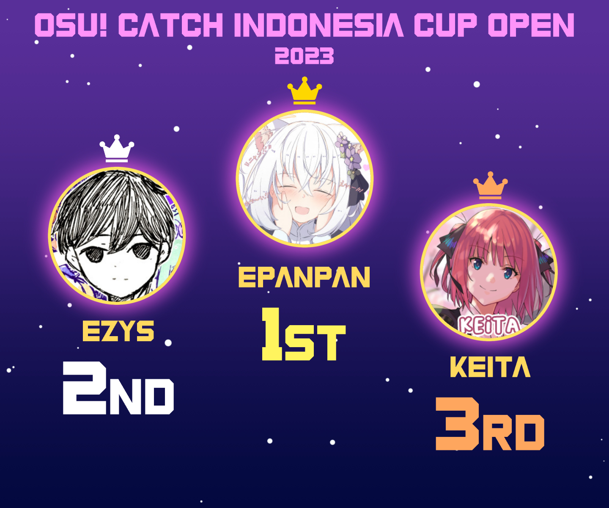

---
tags:
  - CIC2023
  - CIC 2023
---

# Catch the Beat Indonesia Cup 2023

The **Catch the Beat Indonesia Cup (Open) 2023** (***CIC 2023***) was a double-elimination 1v1 osu!catch tournament hosted by ::{ flag=ID }:: [Dapulezatos](https://osu.ppy.sh/users/8140944), ::{ flag=ID }:: [Madoka Ayukawa](https://osu.ppy.sh/users/1595221) and ::{ flag=ID }:: [Chroneko](https://osu.ppy.sh/users/5472877). The tournament was open to all players from Southeast Asia and Oceania with at least playcount of 3,000 and global rank of #5,000 in osu!catch. It was the eleventh iteration of the Catch the Beat Indonesia Cup.

## Tournament schedule

| Event | Timestamp |
| --: | :-- |
| Registration Phase | 2023-06-10/2023-07-08 |
| Screening Phase | 2023-07-08/2023-07-15 |
| Qualifiers | 2023-07-15/2023-07-16 |
| Round of 32 | 2023-07-22/2023-07-23 |
| Round of 16 | 2023-07-29/2023-07-30 |
| Quarter Finals | 2023-08-05/2023-08-06 |
| Semi Finals | 2023-08-12/2023-08-13 |
| Finals | 2023-08-19/2023-08-20 |
| Grand Finals | 2023-08-26/2023-08-27 |

## Prizes

| Placing | Prizes |
| :-: | :-- |
|  | 50% of the raised prize pool, unique profile badge |
|  | 35% of the raised prize pool |
|  | 15% of the raised prize pool |

## Organisation

CIC 2023 was run by various osu! community members predominantly hailing from Indonesia.

| Position | Member(s) |
| :-- | :-- |
| Host | ::{ flag=ID }:: [Dapulezatos](https://osu.ppy.sh/users/8140944), ::{ flag=ID }:: [Madoka Ayukawa](https://osu.ppy.sh/users/1595221), ::{ flag=ID }:: [Chroneko](https://osu.ppy.sh/users/5472877) |
| Mappool selector | ::{ flag=ID }:: [Dapulezatos](https://osu.ppy.sh/users/8140944), ::{ flag=ID }:: [Madoka Ayukawa](https://osu.ppy.sh/users/1595221), ::{ flag=ID }:: [Sololiquy](https://osu.ppy.sh/users/4350087), ::{ flag=ID }:: [Urabe Mikoto](https://osu.ppy.sh/users/1272422) |
| Custom mapper | ::{ flag=ID }:: [Dapulezatos](https://osu.ppy.sh/users/8140944), ::{ flag=ID }:: [Madoka Ayukawa](https://osu.ppy.sh/users/1595221), ::{ flag=ID }:: [-Hex-](https://osu.ppy.sh/users/8630988), ::{ flag=ID }:: [Zyzyx](https://osu.ppy.sh/users/2888013), ::{ flag=ID }:: [Sololiquy](https://osu.ppy.sh/users/4350087), ::{ flag=ES }:: [Deif](https://osu.ppy.sh/users/318565), ::{ flag=PH }:: [-Rustyy](https://osu.ppy.sh/users/16355636), ::{ flag=PH }:: [JierYagtama](https://osu.ppy.sh/users/7483452), ::{ flag=HK }:: [autofanboy](https://osu.ppy.sh/users/636114), ::{ flag=TN }:: [-Ken](https://osu.ppy.sh/users/4430811), ::{ flag=US }:: [Secre](https://osu.ppy.sh/users/2306637), ::{ flag=PH }:: [Jemzuu](https://osu.ppy.sh/users/7890134), ::{ flag=ID }:: [Dika312](https://osu.ppy.sh/users/741613) |
| Mappool tester | ::{ flag=CL }:: [Pekorrat](https://osu.ppy.sh/users/1250096), ::{ flag=HK }:: [my angel auto](https://osu.ppy.sh/users/29503627), ::{ flag=CL }:: [XisK](https://osu.ppy.sh/users/3835436), ::{ flag=KR }:: [Motion](https://osu.ppy.sh/users/3885626) |
| Streamer | ::{ flag=ID }:: [Dapulezatos](https://osu.ppy.sh/users/8140944), ::{ flag=ID }:: [Urabe Mikoto](https://osu.ppy.sh/users/1272422), ::{ flag=ID }:: [Ascaveth](https://osu.ppy.sh/users/3245206), ::{ flag=AU }:: [ewong](https://osu.ppy.sh/users/16859546), ::{ flag=AU }:: [wangwangg](https://osu.ppy.sh/users/6416920) |
| Commentator | ::{ flag=ID }:: [Dapulezatos](https://osu.ppy.sh/users/8140944), ::{ flag=ID }:: [Ascaveth](https://osu.ppy.sh/users/3245206), ::{ flag=AU }:: [ewong](https://osu.ppy.sh/users/16859546), ::{ flag=ID }:: [CamXDanna](https://osu.ppy.sh/users/3243148), ::{ flag=ID }:: [-Hex-](https://osu.ppy.sh/users/8630988), ::{ flag=US   }:: [004](https://osu.ppy.sh/users/9228388), ::{ flag=AU }:: [KWYJIBO](https://osu.ppy.sh/users/7178386), ::{ flag=AU }:: [Maitoo](https://osu.ppy.sh/users/16899553), ::{ flag=AU }:: [CoolEVT](https://osu.ppy.sh/users/3252653), ::{ flag=SG }:: [Ekseff](https://osu.ppy.sh/users/13966422) |
| Referee | ::{ flag=ID }:: [Dapulezatos](https://osu.ppy.sh/users/8140944), ::{ flag=ID }:: [Chroneko](https://osu.ppy.sh/users/5472877), ::{ flag=AU }:: [ewong](https://osu.ppy.sh/users/16859546), ::{ flag=ID }:: [-Hex-](https://osu.ppy.sh/users/8630988), ::{ flag=ID }:: [Kenneth Alfredo](https://osu.ppy.sh/users/829469) |
| Graphic designer | ::{ flag=ID }:: [Dika312](https://osu.ppy.sh/users/741613) |
| Wiki editor | ::{ flag=ID }:: [-Hex-](https://osu.ppy.sh/users/8630988) |

## Links

- **[Main website](https://wybin.xyz/tournaments/cico2023/home)**
- [Discussion thread](https://osu.ppy.sh/community/forums/topics/1777079?n=1)
- [Discord server](https://discord.gg/YwAYbPa)
- [Challonge brackets](https://challonge.com/cico2023)
- [Livestream channel](https://www.twitch.tv/osucatchid)

## Participants

Listed below are the players who qualified for the Round of 32, along with their respective country and seed placement based on [qualifiers result](https://wybin.xyz/tournaments/cico2023/stats#qualifiers).

| Seed | Members |
| :-- | :-- |
| 1-8 | ::{ flag=TH }:: [EzyS](https://osu.ppy.sh/users/16271283), ::{ flag=ID }:: [Keita](https://osu.ppy.sh/users/3355617), ::{ flag=ID }:: [EpanPan](https://osu.ppy.sh/users/13194580), ::{ flag=ID }:: [CamXDanna](https://osu.ppy.sh/users/3243148), ::{ flag=ID }:: [Keisuu](https://osu.ppy.sh/users/3856673), ::{ flag=AU }:: [KWYJIBO](https://osu.ppy.sh/users/7178386), ::{ flag=MY }:: [Asteristia](https://osu.ppy.sh/users/9434933), ::{ flag=SG }:: [Ekseff](https://osu.ppy.sh/users/13966422) |
| 9-16 | ::{ flag=ID }:: [Chiya--](https://osu.ppy.sh/users/7934854), ::{ flag=ID }:: [Mochi -](https://osu.ppy.sh/users/20424806), ::{ flag=AU }:: [TheTixTop](https://osu.ppy.sh/users/19236870), ::{ flag=ID }:: [Intention](https://osu.ppy.sh/users/3416858), ::{ flag=PH }:: [-HyperDream](https://osu.ppy.sh/users/12410693), ::{ flag=ID }:: [Mixuri](https://osu.ppy.sh/users/9153772), ::{ flag=MY }:: [DTNLRiki](https://osu.ppy.sh/users/12382410), ::{ flag=ID }:: [Shurelia](https://osu.ppy.sh/users/3807986) |
| 17-24 | ::{ flag=MY }:: [Zakrusta](https://osu.ppy.sh/users/5034270), ::{ flag=TH }:: [-TANAKITO-](https://osu.ppy.sh/users/6037121), ::{ flag=AU }:: [Andogs](https://osu.ppy.sh/users/4599191), ::{ flag=ID }:: [Onta_Bekasi](https://osu.ppy.sh/users/8677684), ::{ flag=MY }:: [Kagari](https://osu.ppy.sh/users/3366264), ::{ flag=NZ }:: [Wettham77](https://osu.ppy.sh/users/14476098), ::{ flag=AU }:: [CoolEVT](https://osu.ppy.sh/users/3252653), ::{ flag=MY }:: [davidbeh_97](https://osu.ppy.sh/users/4101818) |
| 25-32 | ::{ flag=ID }:: [Nekomiru](https://osu.ppy.sh/users/17514687), ::{ flag=ID }:: [Ilhamuharam](https://osu.ppy.sh/users/7657968), ::{ flag=ID }:: [Strict_Lane](https://osu.ppy.sh/users/24810703), ::{ flag=TH }:: [Yosaf](https://osu.ppy.sh/users/12128203), ::{ flag=NZ }:: [Cipse](https://osu.ppy.sh/users/7928880), ::{ flag=PH }:: [Loreal](https://osu.ppy.sh/users/9362231)[^player-replacement], ::{ flag=SG }:: [NoBadgetGuy](https://osu.ppy.sh/users/28498328)[^player-replacement], ::{ flag=ID }:: [nurjavier](https://osu.ppy.sh/users/8535534)[^player-replacement] |

See the [participants list](https://wybin.xyz/tournaments/cico2023/players) for a list of all initial participants.

## Podium

## Mappools

### Grand Finals

**[Download the mappack here! (140 MB)](https://drive.google.com/u/0/uc?id=1p8YN1HAMtuqowlc7Br1cliPThZLdiMSG&export=download)**

- NoMod
  1. [Satyr - Levitator (-Ken) \[Dysphoria\]](https://osu.ppy.sh/beatmapsets/2048485#fruits/4276923)
  2. [Team Grimoire - Dantalion (Sololiquy) \[Future\]](https://osu.ppy.sh/beatmapsets/2048348#fruits/4276679)
  3. [BEMANI Sound Team "Nekomata Master" - The last of world music (Yumeno Himiko) \[Reconstruction of the world\]](https://osu.ppy.sh/beatmapsets/1031577#fruits/2157114)
  4. [Guchiry feat. flower - Abnormality, Dancin' Girl (Guchiry) \[Psychopathy\]](https://osu.ppy.sh/beatmapsets/1549366#fruits/3166325)
- Hidden
  1. [Mizuki Nana - SCARLET KNIGHT (F D Flourite) \[:o\]](https://osu.ppy.sh/beatmapsets/916639#fruits/1914313)
  2. [ALI PROJECT - Kinjirareta Asobi (Madoka Ayukawa) \[play AMQ\]](https://osu.ppy.sh/beatmapsets/2048344#fruits/4276673)
  3. [YUC'e - Chemical Cookie (Dika312) \[Klee bikin cookie\]](https://osu.ppy.sh/beatmapsets/2048341#fruits/4276669)
  4. [Sakuzyo - MagiCatz (KnightC0re) \[Wonderland\]](https://osu.ppy.sh/beatmapsets/1976820#fruits/4103535)
- HardRock
  1. [TUYU - Anoyo-iki no Bus ni Notte Saraba. (Souvenir) \[Farewell on the bus.\]](https://osu.ppy.sh/beatmapsets/1583701#fruits/3234586)
  2. [ZxNX vs. HyuN - Nemesis (Jemzuu) \[Vengeance\]](https://osu.ppy.sh/beatmapsets/2048506#fruits/4276986)
  3. [Wanuka - Orgasm Anthem (-Rustyy) \[Pleasure\]](https://osu.ppy.sh/beatmapsets/1933133#fruits/3994332)
  4. [BLUE ENCOUNT - HOPE (dorsalplum) \[CRIS \& DORSALPLUM'S EXTRA\]](https://osu.ppy.sh/beatmapsets/945939#fruits/4188195)
- DoubleTime
  1. [t\+pazolite - Never Let me Go (Unlucky_w) \[Rain\]](https://osu.ppy.sh/beatmapsets/1393508#fruits/2877061)
  2. [Girl's Day - I Miss You (Nidoking) \[no more chances\]](https://osu.ppy.sh/beatmapsets/1810702#fruits/3713948)
  3. [Masayoshi Minoshima - Bad Apple!! feat. nomico (Kukkai) \[Overdose\]](https://osu.ppy.sh/beatmapsets/1952041#fruits/4042197)
  4. [System of a Down - Needles (Mamiya Takuji) \[FackeL's Insane\]](https://osu.ppy.sh/beatmapsets/1959603#fruits/4079937)
- Easy
  1. [Hierograph - Chi no Iro wa Kiiro (Spectator) \[Rain\]](https://osu.ppy.sh/beatmapsets/1317145#fruits/3012738)
  2. [sekai - p.h. (Petal) \[Overdose\]](https://osu.ppy.sh/beatmapsets/1461554#fruits/3002756)
- Tiebreaker
  1. **[Laur - Sound Chimera (-Rustyy) \[Sonokinesis\]](https://osu.ppy.sh/beatmapsets/2048353#fruits/4276690)**

### Finals

**[Download the mappack here! (122 MB)](https://drive.google.com/u/0/uc?id=1JW7Ud6LNNd8NbRbWIVlPxnXEMGpEWG1u&export=download)**

- NoMod
  1. [yuikonnu - Kakushigoto (-Rustyy) \[Rustyy \& Dika's Affection\]](https://osu.ppy.sh/beatmapsets/2044467#fruits/4267174)
  2. [Laur vs M1shamo - Deceiver (Dapulezatos) \[Deception\]](https://osu.ppy.sh/beatmapsets/2044423#fruits/4267073)
  3. [Kurokotei - Valkyrie Attack (alienflybot) \[Havoc\]](https://osu.ppy.sh/beatmapsets/793794#fruits/1667152)
  4. [Adust Rain - Seven Style (Reiszen) \[!!\]](https://osu.ppy.sh/beatmapsets/2007595#fruits/4175961)
- Hidden
  1. [Mili - Between Two Worlds (Realm of Darkness) (JierYagtama) \[Realm of Despair\]](https://osu.ppy.sh/beatmapsets/2044455#fruits/4267142)
  2. [Atoguru - VaizravaNa (Cut. Ver) (Madoka Ayukawa) \[Bishamonten\]](https://osu.ppy.sh/beatmapsets/2044432#fruits/4267085)
  3. [TeddyLoid feat. DELTA - Defection (Sololiquy) \[Future\]](https://osu.ppy.sh/beatmapsets/2044434#fruits/4267088)
  4. [1nonly - Step Back! feat. SXMPRA (OneShotFox) \[Extra\]](https://osu.ppy.sh/beatmapsets/1882567#fruits/3875853)
- HardRock
  1. [Reol - Asymmetry (Dika312) \[Overdose\]](https://osu.ppy.sh/beatmapsets/343720#fruits/4267483)
  2. [Tamiyasu Tomoe - Yamato Nadeshiko Hanakotoba (Short Ver.) (Kukkai) \[Lumi's Overdose\]](https://osu.ppy.sh/beatmapsets/1864493#fruits/3834552)
  3. [MC Sniper - Minchoui Nan (sxy62146214) \[Saram\]](https://osu.ppy.sh/beatmapsets/1991545#fruits/4137920)
  4. [yak_won - Lucid (Luscent) \[SHD\]](https://osu.ppy.sh/beatmapsets/2037619#fruits/4249811)
- DoubleTime
  1. [Kawada Mami - Wings of Courage -Sora o Koete- (wonjae) \[Beyond the Sky\]](https://osu.ppy.sh/beatmapsets/1580594#fruits/3227442)
  2. [-45 - Ena (zerokt) \[zerokt \& Reimu's Disaster\]](https://osu.ppy.sh/beatmapsets/1965466#fruits/4075604)
  3. [x0o0x_ - '''''' (-Rustyy) \[null\]](https://osu.ppy.sh/beatmapsets/1677346#fruits/3426958)
  4. [YOASOBI - Tabun (alevi) \[Doubtful\]](https://osu.ppy.sh/beatmapsets/1757314#fruits/3596125)
- Easy
  1. [Rita - Princess Blood (CLSW) \[Rain\]](https://osu.ppy.sh/beatmapsets/182009#fruits/436663)
  2. [TUYU - Daemonisch (Keqing) \[captin's Extra\]](https://osu.ppy.sh/beatmapsets/1443294#fruits/2971813)
- Tiebreaker
  1. **[DJ-Sharpnel - Blue Army (Sololiquy) \[Solo vs Zyzyx - Army of Death\]](https://osu.ppy.sh/beatmapsets/2044450#fruits/4277706)**

### Semifinals

**[Download the mappack here! (112 MB)](https://drive.google.com/u/0/uc?id=1r5GGx0o5AELHn8ZnBbVqQxgv_NEwwE4V&export=download)**

- NoMod
  1. [Mili - Paper Bouquet (Zyzyx) \[Billion Samples of Flowers\]](https://osu.ppy.sh/beatmapsets/2040414#fruits/4256447)
  2. [BEMANI Sound Team "HumeR" - Rejection Girl (GiGas) \[MomoX's Overdose\]](https://osu.ppy.sh/beatmapsets/1346720#fruits/2796942)
  3. [Cranky - Libera me (-Hex-) \[Humanity\]](https://osu.ppy.sh/beatmapsets/1488787#fruits/3051985)
  4. [Evanescence - Bring Me To Life (Chalwa) \[WAKE ME UP!\]](https://osu.ppy.sh/beatmapsets/1558004#fruits/3182631)
- Hidden
  1. [LBDJS - Tari Ubur Ubur (Hendro Engkeng Remix) (Dika312) \[Overdose\]](https://osu.ppy.sh/beatmapsets/2040427#fruits/4256469)
  2. [Aitsuki Nakuru - Daisan no Shinzou (Chroneko) \[Your Heart\]](https://osu.ppy.sh/beatmapsets/1891118#fruits/4252076)
  3. [II-L - EXPLORER-4 (LeCandy) \[candy\]](https://osu.ppy.sh/beatmapsets/2036362#fruits/4246714)
- HardRock
  1. [Nanatsukaze - Goodbye Wonderland (Sololiquy) \[Overdose\]](https://osu.ppy.sh/beatmapsets/2040408#fruits/4256427)
  2. [Laur - A Lasting Promise (050) \[ARLECCHINO'S ICHIKA LIGHT MAXIMUM\]](https://osu.ppy.sh/beatmapsets/1746137#fruits/4045921)
  3. [Muramasa Qualia - Kurokami Midareshi Shura to Narite (milr_) \[Kyairie's Extra\]](https://osu.ppy.sh/beatmapsets/1906993#fruits/3966192)
- DoubleTime
  1. [EmoCosine - Black sour Ruby (Extended Smelting) (autofanboy) \[Hidden Gem\]](https://osu.ppy.sh/beatmapsets/2040411#fruits/4256441)
  2. [Ohara Yuiko - Massugu (Dapulezatos) \[Affection\]](https://osu.ppy.sh/beatmapsets/1984005#fruits/4120567)
  3. [Akatsuki Records - Necromantic (dblade) \[Insane\]](https://osu.ppy.sh/beatmapsets/1569341#fruits/3204746)
- Easy
  1. [yanaginagi - Hoshiboshi no Wataridori (-Hex-) \[Lost Memories\]](https://osu.ppy.sh/beatmapsets/924320#fruits/1930633)
  2. [maki ligon - Among Us / Eurobeat Remix (Wither) \[Impostor Drift\]](https://osu.ppy.sh/beatmapsets/1381340#fruits/2854062)
- Tiebreaker
  1. **[Magnetude - Falling (-Joakh) \[Joakh \& MomoX's Diff name\]](https://osu.ppy.sh/beatmapsets/1358569#fruits/2811357)**

### Quarterfinals

**[Download the mappack here! (129 MB)](https://drive.google.com/u/0/uc?id=1CJ5xoNZGKIS_rDPpZiHnI0AD_UyU2-fp&export=download)**

- NoMod
  1. [hololive IDOL PROJECT - Shiny Smily Story (-Hex-) \[World\]](https://osu.ppy.sh/beatmapsets/1141081#fruits/2383467)
  2. [Boaz Sound Team "ptar124" - How do you pronounce Boaz? (-Rustyy) \[Boaz\]](https://osu.ppy.sh/beatmapsets/2036396#fruits/4246832)
  3. [Nekomata Master - Sakebi no Midori (-Vale) \[Seija's Another\]](https://osu.ppy.sh/beatmapsets/1910363#fruits/3940423)
  4. [vivid undress- HAYARU YOROHIYA (Nymphe) \[Egoism Contest\]](https://osu.ppy.sh/beatmapsets/1829285#fruits/3754408)
- Hidden
  1. [Ogura Yui - Clear Morning (Dapulezatos) \[Together With You\]](https://osu.ppy.sh/beatmapsets/2036447#fruits/4246925)
  2. [PIKASONIC ft.felt - ColorCode-F (Sololiquy) \[A Story of Colors the World (Disuruh Bayu naikin ar)\]](https://osu.ppy.sh/beatmapsets/1591143#fruits/4246947)
  3. [bibuko - Sorairo Gahou (val0108) \[HaHo-Insane\]](https://osu.ppy.sh/beatmapsets/106010#fruits/278399)
- HardRock
  1. [Dormir - Une mage blanche (-Hex-) \[Witch(CIC)\]](https://osu.ppy.sh/beatmapsets/2036439#fruits/4246909)
  2. [Kicco - Akari no Arika (-Joakh) \[Verti's Overdose\]](https://osu.ppy.sh/beatmapsets/1404258#fruits/3004329)
  3. [Memme - Erebus (Suicune3) \[tuudug's Insane\]](https://osu.ppy.sh/beatmapsets/1763237#fruits/3710644)
- DoubleTime
  1. [Duck Duck Pony - Shinsetsu (wonjae) \[Hyperion's Rain\]](https://osu.ppy.sh/beatmapsets/951270#fruits/1986610)
  2. [Choucho - Happy Fate (-Hex-) \[True Wish\]](https://osu.ppy.sh/beatmapsets/2036438#fruits/4246907)
  3. [LiSA - Shirushi (iljaaz) \[Mother's Rosario\]](https://osu.ppy.sh/beatmapsets/1880530#fruits/3871568)
- Easy
  1. [Alfakyun. x Camellia - calling (alienflybot) \[Platter\]](https://osu.ppy.sh/beatmapsets/649285#fruits/1679478)
  2. [Feint - Outbreak (feat. MYLK) (ailv) \[Hobbes2's Eruption Extra\]](https://osu.ppy.sh/beatmapsets/738915#fruits/1559851)
- Tiebreaker
  1. **[Narita Tsutomu - Burning out the blue (Dapulezatos) \[Final Order: Nuclear Option\]](https://osu.ppy.sh/beatmapsets/2036448#fruits/4246926)**

### Round of 16

**[Download the mappack here! (100 MB)](https://drive.google.com/u/0/uc?id=1-5ZaelcBbNx3F6sJuyvXBOjpbcw9eRGP&export=download)**

- NoMod
  1. [DIALOGUE+ - Kasuka de Tashika (Dapulezatos) \[Hexuluous' Reminisce\]](https://osu.ppy.sh/beatmapsets/2032302#fruits/4236282)
  2. [t\+pazolite - You are the Miserable (Deif) \[Overdose\]](https://osu.ppy.sh/beatmapsets/2032327#fruits/4236349)
  3. [Sound Souler - Paradise (GiGas) \[A Nice Overdose\]](https://osu.ppy.sh/beatmapsets/777127#fruits/1633438)
  4. [Rise Against - Give It All (Milan-) \[Insane\]](https://osu.ppy.sh/beatmapsets/703130#fruits/1487700)
- Hidden
  1. [Bring Me The Horizon - The Comedown (Album Version) (monstratorfull) \[Rain\]](https://osu.ppy.sh/beatmapsets/318079#fruits/788441)
  2. [Vansire - That I Miss You (M0RU) \[Team Russian Federation's Overdose\]](https://drive.google.com/file/d/1NlDKunLeZhS8DNXviAV8T1buZE227BdD/view)
  3. [DECO*27 - Cinderella feat. Hatsune Miku (Giga First Night Remix) (SkyFlame) \[Djulus' Insane\]](https://osu.ppy.sh/beatmapsets/1952097#fruits/4081891)
- HardRock
  1. [Mia REGINA - I got it! (Slax Remix) (-Rustyy) \[Rain\]](https://osu.ppy.sh/beatmapsets/1764078#fruits/3681625)
  2. [P*Light - SAtAN (Noctalium) \[Kukkai's RAIN!\]](https://osu.ppy.sh/beatmapsets/2003650#fruits/4167448)
  3. [JIN feat. MARiA from GARNiDELiA - Children Record (Nevo) \[Akitoshi's Insane\]](https://osu.ppy.sh/beatmapsets/1028642#fruits/2162549)
- DoubleTime
  1. [Risa Yuzuki - S'il Vous President (Secre) \[Platter\]](https://osu.ppy.sh/beatmapsets/2032310#fruits/4236300)
  2. [Wada Kanako - Kanashii Heart wa Moete Iru (Madoka Ayukawa) \[Fire Love\]](https://osu.ppy.sh/beatmapsets/2032293#fruits/4236266)
  3. [NOAH - Bintang di Surga (Hinsvar) \[Langit Ketujuh\]](https://osu.ppy.sh/beatmapsets/1955456#fruits/4050077)
- Easy
  1. [TWICE - LIKEY (ailv) \[Tatan's Insane\]](https://osu.ppy.sh/beatmapsets/814038#fruits/1714760)
- Tiebreaker
  1. **[Our Stolen Theory - United (L.A.O.S Remix) (CLSW) \[Vanquisher\]](https://osu.ppy.sh/beatmapsets/527777#fruits/1119645)**

### Round of 32

**[Download the mappack here! (135 MB)](https://drive.google.com/u/0/uc?id=1-sLHTXkcoRoa5Labfj73Ko9FILjj88aI&export=download)**

- NoMod
  1. [Ishihara Kaori - Plastic Smile (Dapulezatos) \[Rain\]](https://osu.ppy.sh/beatmapsets/2039642#fruits/4254541)
  2. [James Landino - Arsene's Bazaar (Deif) \[Rain\]](https://osu.ppy.sh/beatmapsets/1972368#fruits/4092700)
  3. [CRAYON POP - Bar Bar Bar (Madoka Ayukawa) \[Klee Loncat\]](https://osu.ppy.sh/beatmapsets/2028221#fruits/4226451)
  4. [Rin - Ayakashi set 12 Another ~ Border of Life (pishifat) \[Extra\]](https://osu.ppy.sh/beatmapsets/1001360#fruits/2096201)
- Hidden
  1. [ELFENSJoN - INHERIT (4rcheR-) \[RAIN\]](https://osu.ppy.sh/beatmapsets/1837280#fruits/3777506)
  2. [Juli - Perfekte Welle (Myxo) \[Perfekter Regen\]](https://osu.ppy.sh/beatmapsets/1830810#fruits/3757889)
  3. [Junk - Life is PIANO (yf_bmp) \[Extra\]](https://osu.ppy.sh/beatmapsets/2018714#fruits/4203891)
- HardRock
  1. [Aitsuki Nakuru - Presenter* (My Angel RangE) \[Platter\]](https://osu.ppy.sh/beatmapsets/1416312#fruits/3013717)
  2. [Hiromi Sato - KOWAREKAKE NO ORGEL (Madoka Ayukawa) \[FLOWER (CIC Edit)\]](https://osu.ppy.sh/beatmapsets/1561744#fruits/4226452)
  3. [ONE OK ROCK - Shake it down (HabiHolic) \[Hard\]](https://osu.ppy.sh/beatmapsets/1991518#fruits/4148152)
- DoubleTime
  1. [Porter Robinson - Trying to Feel Alive (wonjae) \[Fulfillment\]](https://osu.ppy.sh/beatmapsets/1509704#fruits/3091643)
  2. [nanobii - Rainbow Road ([ Azu- ]) \[Du5t's Platter\]](https://osu.ppy.sh/beatmapsets/1016740#fruits/2163103)
  3. [Laur vs. i7to - Oborodzuki (isca) \[MissOne's Dimming Moonrise\]](https://osu.ppy.sh/beatmapsets/2001330#fruits/4185531)
- Easy
  1. [Sub Focus - Tidal Wave (feat. Alpines) (Secretpipe) \[Collab Insane\]](https://osu.ppy.sh/beatmapsets/296817#fruits/673787)
- Tiebreaker
  1. **[P*Light ft. Yukacco - Stargazer (DJ Shimamura Remix) (alienflybot) \[Auroric Lilium\]](https://osu.ppy.sh/beatmapsets/807986#fruits/1695645)**

### Qualifiers

**[Download the mappack here! (59 MB)](https://drive.google.com/u/0/uc?id=17mDikMgtwVUeTAuLfwqQiZsGGzIXKz-h&export=download)**

- NoMod
  1. [Citrus and Ocean Colour - Sugar Coaster Girl (-Hex-) \[Overdose\]](https://osu.ppy.sh/beatmapsets/2024045#fruits/4215979)
  2. [Morimori Atsushi - Aquamarine (Dapulezatos) \[Botol Aqua\]](https://osu.ppy.sh/beatmapsets/2024025#fruits/4215939)
  3. [Powerwolf - Resurrection By Erection (Xayah) \[Hallelujah!\]](https://osu.ppy.sh/beatmapsets/1229361#fruits/2556049)
- Hidden
  1. [syudou - Kareshi no Jude (-Rustyy) \[BF\]](https://osu.ppy.sh/beatmapsets/2024010#fruits/4215907)
  2. [sekai - Doctorine (Petal) \[Mayu's Expert\]](https://osu.ppy.sh/beatmapsets/1768214#fruits/3652298)
- HardRock
  1. [LiSA - Yuke (Secre) \[Rain\]](https://osu.ppy.sh/beatmapsets/1828600#fruits/3752991)
  2. [Laur - Pragmatism (Ambient) \[Dakini's Insane\]](https://osu.ppy.sh/beatmapsets/612657#fruits/1350654)
- DoubleTime
  1. [Hamu - Secret Clover (-Hex-) \[Future\]](https://osu.ppy.sh/beatmapsets/1997979#fruits/4152807)
  2. [Shikata Akiko - METHOD_IMPLANTA/. (Shurelia) \[Restoration\]](https://osu.ppy.sh/beatmapsets/1540516#fruits/3149236)
- Easy
  1. [Mameko - umpopoff (rui) \[Scaltinof's Insane\]](https://osu.ppy.sh/beatmapsets/1200735#fruits/2564947)

## Match results

### Grand Finals

Saturday, 26 August 2023:

| Bracket | Player 1 |  |  | Player 2 | Match link |
| :-: | --: | :-: | :-: | :-- | :-- |
| Lower | [Keita](https://osu.ppy.sh/users/3355617) ::{ flag=ID }:: | 0 | **1** | ::{ flag=ID }:: **[EpanPan](https://osu.ppy.sh/users/13194580)** | **WBD** |

Sunday, 27 August 2023:

| Bracket | Player 1 |  |  | Player 2 | Match link |
| :-: | --: | :-: | :-: | :-- | :-- |
| Upper | [EzyS](https://osu.ppy.sh/users/16271283) ::{ flag=TH }:: | 4 | **7** | ::{ flag=ID }:: **[EpanPan](https://osu.ppy.sh/users/13194580)** | [#1](https://osu.ppy.sh/community/matches/110186965) |
| Upper | **[EpanPan](https://osu.ppy.sh/users/13194580)** ::{ flag=ID }:: | **7** | 5 | ::{ flag=TH }:: [EzyS](https://osu.ppy.sh/users/16271283) | [#1](https://osu.ppy.sh/community/matches/110187401) |

### Finals

Friday, 18 August 2023:

| Bracket | Player 1 |  |  | Player 2 | Match link |
| :-: | --: | :-: | :-: | :-- | :-- |
| Lower | **[Keisuu](https://osu.ppy.sh/users/3856673)** ::{ flag=ID }:: | **7** | 5 | ::{ flag=AU }:: [KWYJIBO](https://osu.ppy.sh/users/7178386) | [#1](https://osu.ppy.sh/community/matches/110048472) |

Saturday, 19 August 2023:

| Bracket | Player 1 |  |  | Player 2 | Match link |
| :-: | --: | :-: | :-: | :-- | :-- |
| Upper | **[EzyS](https://osu.ppy.sh/users/16271283)** ::{ flag=TH }:: | **7** | 0 | ::{ flag=ID }:: [Keita](https://osu.ppy.sh/users/3355617) | [#1](https://osu.ppy.sh/community/matches/110064009) |
| Lower | **[EpanPan](https://osu.ppy.sh/users/13194580)** ::{ flag=ID }:: | **7** | 3 | ::{ flag=ID }:: [CamXDanna](https://osu.ppy.sh/users/3243148) | [#1](https://osu.ppy.sh/community/matches/110066182) |

Sunday, 20 August 2023:

| Bracket | Player 1 |  |  | Player 2 | Match link |
| :-: | --: | :-: | :-: | :-- | :-- |
| Lower | **[EpanPan](https://osu.ppy.sh/users/13194580)** ::{ flag=ID }:: | **7** | 2 | ::{ flag=ID }:: [Keisuu](https://osu.ppy.sh/users/3856673) | [#1](https://osu.ppy.sh/community/matches/110078520) |

### Semifinals

Saturday, 12 August 2023:

| Bracket | Player 1 |  |  | Player 2 | Match link |
| :-: | --: | :-: | :-: | :-- | :-- |
| Upper | **[EzyS](https://osu.ppy.sh/users/16271283)** ::{ flag=TH }:: | **6** | 2 | ::{ flag=ID }:: [Keisuu](https://osu.ppy.sh/users/3856673) | [#1](https://osu.ppy.sh/community/matches/109955740) |
| Upper | **[Keita](https://osu.ppy.sh/users/3355617)** ::{ flag=ID }:: | **6** | 5 | ::{ flag=ID }:: [EpanPan](https://osu.ppy.sh/users/13194580) | [#1](https://osu.ppy.sh/community/matches/109955237) |
| Lower | **[Chiya--](https://osu.ppy.sh/users/7934854)** ::{ flag=ID }:: | **6** | 1 | ::{ flag=MY }:: [Asteristia](https://osu.ppy.sh/users/9434933) | [#1](https://osu.ppy.sh/community/matches/109959145) |
| Lower | **[CamXDanna](https://osu.ppy.sh/users/3243148)** ::{ flag=ID }:: | **6** | 3 | ::{ flag=AU }:: [TheTixTop](https://osu.ppy.sh/users/19236870) | [#1](https://osu.ppy.sh/community/matches/109955913) |
| Lower | **[Mochi -](https://osu.ppy.sh/users/20424806)** ::{ flag=ID }:: | **6** | 5 | ::{ flag=SG }:: [Ekseff](https://osu.ppy.sh/users/13966422) | [#1](https://osu.ppy.sh/community/matches/109957925) |
| Lower | **[KWYJIBO](https://osu.ppy.sh/users/7178386)** ::{ flag=AU }:: | **6** | 0 | ::{ flag=AU }:: [CoolEVT](https://osu.ppy.sh/users/3252653) | [#1](https://osu.ppy.sh/community/matches/109958750) |

Sunday, 13 August 2023:

| Bracket | Player 1 |  |  | Player 2 | Match link |
| :-: | --: | :-: | :-: | :-- | :-- |
| Lower | **[CamXDanna](https://osu.ppy.sh/users/3243148)** ::{ flag=ID }:: | **6** | 1 | ::{ flag=ID }:: [Chiya--](https://osu.ppy.sh/users/7934854) | [#1](https://osu.ppy.sh/community/matches/109973571) |
| Lower | **[KWYJIBO](https://osu.ppy.sh/users/7178386)** ::{ flag=AU }:: | **6** | 3 | ::{ flag=ID }:: [Mochi -](https://osu.ppy.sh/users/20424806) | [#1](https://osu.ppy.sh/community/matches/109971541) |

### Quarterfinals

Friday, 04 August 2023:

| Bracket | Player 1 |  |  | Player 2 | Match link |
| :-: | --: | :-: | :-: | :-- | :-- |
| Upper | **[EpanPan](https://osu.ppy.sh/users/13194580)** ::{ flag=ID }:: | **6** | 2 | ::{ flag=AU }:: [KWYJIBO](https://osu.ppy.sh/users/7178386) | [#1](https://osu.ppy.sh/community/matches/109831826) |
| Lower | [DTNLRiki](https://osu.ppy.sh/users/12382410) ::{ flag=MY }:: | 3 | **6** | ::{ flag=ID }:: **[Intention](https://osu.ppy.sh/users/3416858)** | [#1](https://osu.ppy.sh/community/matches/109834672) |

Saturday, 05 August 2023:

| Bracket | Player 1 |  |  | Player 2 | Match link |
| :-: | --: | :-: | :-: | :-- | :-- |
| Upper | **[EzyS](https://osu.ppy.sh/users/16271283)** ::{ flag=TH }:: | **6** | 4 | ::{ flag=ID }:: [Chiya--](https://osu.ppy.sh/users/7934854) | [#1](https://osu.ppy.sh/community/matches/109846964) |
| Upper | [CamXDanna](https://osu.ppy.sh/users/3243148) ::{ flag=ID }:: | 4 | **6** | ::{ flag=ID }:: **[Keisuu](https://osu.ppy.sh/users/3856673)** | [#1](https://osu.ppy.sh/community/matches/109844095) |
| Upper | **[Keita](https://osu.ppy.sh/users/3355617)** ::{ flag=ID }:: | **6** | 3 | ::{ flag=ID }:: [Mochi -](https://osu.ppy.sh/users/20424806) | [#1](https://osu.ppy.sh/community/matches/109844983) |
| Lower | **[TheTixTop](https://osu.ppy.sh/users/19236870)** ::{ flag=AU }:: | **6** | 0 | ::{ flag=MY }:: [Zakrusta](https://osu.ppy.sh/users/5034270) | [#1](https://osu.ppy.sh/community/matches/109847535) |
| Lower | **[Mixuri](https://osu.ppy.sh/users/9153772)** ::{ flag=ID }:: | **6** | 2 | ::{ flag=MY }:: [davidbeh_97](https://osu.ppy.sh/users/4101818) | [#1](https://osu.ppy.sh/community/matches/109846466) |
| Lower | **[Asteristia](https://osu.ppy.sh/users/9434933)** ::{ flag=MY }:: | **6** | 2 | ::{ flag=NZ }:: [Cipse](https://osu.ppy.sh/users/7928880) | [#1](https://osu.ppy.sh/community/matches/109850286) |
| Lower | **[Kagari](https://osu.ppy.sh/users/3366264)** ::{ flag=MY }:: | **6** | 5 | ::{ flag=TH }:: [-TANAKITO-](https://osu.ppy.sh/users/6037121) | [#1](https://osu.ppy.sh/community/matches/109849824) |
| Lower | [-HyperDream](https://osu.ppy.sh/users/12410693) ::{ flag=PH }:: | 3 | **6** | ::{ flag=AU }:: **[CoolEVT](https://osu.ppy.sh/users/3252653)** | [#1](https://osu.ppy.sh/community/matches/109848604) |
| Lower | **[Ekseff](https://osu.ppy.sh/users/13966422)** ::{ flag=SG }:: | **6** | 1 | ::{ flag=AU }:: [Andogs](https://osu.ppy.sh/users/4599191) | [#1](https://osu.ppy.sh/community/matches/109849289) |
| Lower | **[Shurelia](https://osu.ppy.sh/users/3807986)** ::{ flag=ID }:: | **6** | 0 | ::{ flag=ID }:: [Strict_Lane](https://osu.ppy.sh/users/24810703) | [#1](https://osu.ppy.sh/community/matches/109850151) |

Sunday, 06 August 2023:

| Bracket | Player 1 |  |  | Player 2 | Match link |
| :-: | --: | :-: | :-: | :-- | :-- |
| Lower | **[Ekseff](https://osu.ppy.sh/users/13966422)** ::{ flag=SG }:: | **6** | 5 | ::{ flag=ID }:: [Shurelia](https://osu.ppy.sh/users/3807986) | [#1](https://osu.ppy.sh/community/matches/109866447) |
| Lower | [Kagari](https://osu.ppy.sh/users/3366264) ::{ flag=MY }:: | 2 | **6** | ::{ flag=AU }:: **[CoolEVT](https://osu.ppy.sh/users/3252653)** | [#1](https://osu.ppy.sh/community/matches/109864830) |
| Lower | **[Asteristia](https://osu.ppy.sh/users/9434933)** ::{ flag=MY }:: | **6** | 5 | ::{ flag=ID }:: [Intention](https://osu.ppy.sh/users/3416858) | [#1](https://osu.ppy.sh/community/matches/109867318) |
| Lower | **[TheTixTop](https://osu.ppy.sh/users/19236870)** ::{ flag=AU }:: | **6** | 2 | ::{ flag=ID }:: [Mixuri](https://osu.ppy.sh/users/9153772) | [#1](https://osu.ppy.sh/community/matches/109860165) |

### Round of 16

Saturday, 29 July 2023:

| Bracket | Player 1 |  |  | Player 2 | Match link |
| :-: | --: | :-: | :-: | :-- | :-- |
| Upper | **[CamXDanna](https://osu.ppy.sh/users/3243148)** ::{ flag=ID }:: | **5** | 1 | ::{ flag=PH }:: [-HyperDream](https://osu.ppy.sh/users/12410693) | [#1](https://osu.ppy.sh/community/matches/109731862) |
| Upper | **[Keita](https://osu.ppy.sh/users/3355617)** ::{ flag=ID }:: | **5** | 2 | ::{ flag=MY }:: [DTNLRiki](https://osu.ppy.sh/users/12382410) | [#1](https://osu.ppy.sh/community/matches/109735464) |
| Upper | [Asteristia](https://osu.ppy.sh/users/9434933) ::{ flag=MY }:: | 2 | **5** | ::{ flag=ID }:: **[Mochi -](https://osu.ppy.sh/users/20424806)** | [#1](https://osu.ppy.sh/community/matches/109736067) |
| Upper | **[EzyS](https://osu.ppy.sh/users/16271283)** ::{ flag=TH }:: | **5** | 1 | ::{ flag=ID }:: [Shurelia](https://osu.ppy.sh/users/3807986) | [#1](https://osu.ppy.sh/community/matches/109736969) |
| Upper | **[Keisuu](https://osu.ppy.sh/users/3856673)** ::{ flag=ID }:: | **5** | 1 | ::{ flag=MY }:: [Kagari](https://osu.ppy.sh/users/3366264) | [#1](https://osu.ppy.sh/community/matches/109736975) |
| Upper | **[EpanPan](https://osu.ppy.sh/users/13194580)** ::{ flag=ID }:: | **5** | 0 | ::{ flag=ID }:: [Mixuri](https://osu.ppy.sh/users/9153772) | [#1](https://osu.ppy.sh/community/matches/109736777) |
| Lower | [nurjavier](https://osu.ppy.sh/users/8535534) ::{ flag=ID }:: | 0 | **5** | ::{ flag=MY }:: **[Zakrusta](https://osu.ppy.sh/users/5034270)** | [#1](https://osu.ppy.sh/community/matches/109733940) |

Sunday, 30 July 2023:

| Bracket | Player 1 |  |  | Player 2 | Match link |
| :-: | --: | :-: | :-: | :-- | :-- |
| Upper | **[KWYJIBO](https://osu.ppy.sh/users/7178386)** ::{ flag=AU }:: | **5** | 4 | ::{ flag=AU }:: [TheTixTop](https://osu.ppy.sh/users/19236870) | [#1](https://osu.ppy.sh/community/matches/109752508) |
| Upper | [Ekseff](https://osu.ppy.sh/users/13966422) ::{ flag=SG }:: | 1 | **5** | ::{ flag=ID }:: **[Chiya--](https://osu.ppy.sh/users/7934854)** | [#1](https://osu.ppy.sh/community/matches/109753140) |
| Lower | **[Cipse](https://osu.ppy.sh/users/7928880)** ::{ flag=NZ }:: | **1** | 0 | ::{ flag=ID }:: [Onta_Bekasi](https://osu.ppy.sh/users/8677684) | **WBD** |
| Lower | [Nekomiru](https://osu.ppy.sh/users/17514687) ::{ flag=ID }:: | 4 | **5** | ::{ flag=MY }:: **[davidbeh_97](https://osu.ppy.sh/users/4101818)** | [#1](https://osu.ppy.sh/community/matches/109751444) |
| Lower | **[Strict_Lane](https://osu.ppy.sh/users/24810703)** ::{ flag=ID }:: | **5** | 4 | ::{ flag=NZ }:: [Wettham77](https://osu.ppy.sh/users/14476098) | [#1](https://osu.ppy.sh/community/matches/109752551) |
| Lower | [Ilhamuharam](https://osu.ppy.sh/users/7657968) ::{ flag=ID }:: | 0 | **1** | ::{ flag=AU }:: **[CoolEVT](https://osu.ppy.sh/users/3252653)** | **WBD** |
| Lower | [NoBadgetGuy](https://osu.ppy.sh/users/28498328) ::{ flag=SG }:: | 4 | **5** | ::{ flag=TH }:: **[-TANAKITO-](https://osu.ppy.sh/users/6037121)** | [#1](https://osu.ppy.sh/community/matches/109753902) |
| Lower | [Loreal](https://osu.ppy.sh/users/9362231) ::{ flag=PH }:: | 4 | **5** | ::{ flag=AU }:: **[Andogs](https://osu.ppy.sh/users/4599191)** | [#1](https://osu.ppy.sh/community/matches/109753875) |
| Lower | [Yosaf](https://osu.ppy.sh/users/12128203) ::{ flag=TH }:: | 0 | **5** | ::{ flag=ID }:: **[Intention](https://osu.ppy.sh/users/3416858)** | [#1](https://osu.ppy.sh/community/matches/109755740) |

### Round of 32

Saturday, 22 July 2023:

| Bracket | Player 1 |  |  | Player 2 | Match link |
| :-: | --: | :-: | :-: | :-- | :-- |
| Upper | **[EzyS](https://osu.ppy.sh/users/16271283)** ::{ flag=TH }:: | **5** | 0 | ::{ flag=ID }:: [nurjavier](https://osu.ppy.sh/users/8535534) | [#1](https://osu.ppy.sh/community/matches/109618143) |
| Upper | **[Chiya--](https://osu.ppy.sh/users/7934854)** ::{ flag=ID }:: | **5** | 1 | ::{ flag=MY }:: [davidbeh_97](https://osu.ppy.sh/users/4101818) | [#1](https://osu.ppy.sh/community/matches/109618620) |
| Upper | **[CamXDanna](https://osu.ppy.sh/users/3243148)** ::{ flag=ID }:: | **5** | 1 | ::{ flag=NZ }:: [Cipse](https://osu.ppy.sh/users/7928880) | [#1](https://osu.ppy.sh/community/matches/109620184) |
| Upper | **[-HyperDream](https://osu.ppy.sh/users/12410693)** ::{ flag=PH }:: | **5** | 3 | ::{ flag=ID }:: [Onta_Bekasi](https://osu.ppy.sh/users/8677684) | [#1](https://osu.ppy.sh/community/matches/109620645) |
| Upper | **[Keisuu](https://osu.ppy.sh/users/3856673)** ::{ flag=ID }:: | **5** | 0 | ::{ flag=TH }:: [Yosaf](https://osu.ppy.sh/users/12128203) | [#1](https://osu.ppy.sh/community/matches/109621449) |
| Upper | [Intention](https://osu.ppy.sh/users/3416858) ::{ flag=ID }:: | 3 | **5** | ::{ flag=MY }:: **[Kagari](https://osu.ppy.sh/users/3366264)** | [#1](https://osu.ppy.sh/community/matches/109622297) |
| Upper | **[DTNLRiki](https://osu.ppy.sh/users/12382410)** ::{ flag=MY }:: | **5** | 3 | ::{ flag=TH }:: [-TANAKITO-](https://osu.ppy.sh/users/6037121) | [#1](https://osu.ppy.sh/community/matches/109620954) |
| Upper | **[TheTixTop](https://osu.ppy.sh/users/19236870)** ::{ flag=AU }:: | **5** | 0 | ::{ flag=NZ }:: [Wettham77](https://osu.ppy.sh/users/14476098) | [#1](https://osu.ppy.sh/community/matches/109619569) |

Sunday, 23 July 2023:

| Bracket | Player 1 |  |  | Player 2 | Match link |
| :-: | --: | :-: | :-: | :-- | :-- |
| Upper | **[Shurelia](https://osu.ppy.sh/users/3807986)** ::{ flag=ID }:: | **5** | 1 | ::{ flag=MY }:: [Zakrusta](https://osu.ppy.sh/users/5034270) | [#1](https://osu.ppy.sh/community/matches/109639569) |
| Upper | **[Ekseff](https://osu.ppy.sh/users/13966422)** ::{ flag=SG }:: | **5** | 0 | ::{ flag=ID }:: [Nekomiru](https://osu.ppy.sh/users/17514687) | [#1](https://osu.ppy.sh/community/matches/109637947) |
| Upper | **[Keita](https://osu.ppy.sh/users/3355617)** ::{ flag=ID }:: | **5** | 0 | ::{ flag=SG }:: [NoBudgetGuy](https://osu.ppy.sh/users/28498328) | [#1](https://osu.ppy.sh/community/matches/109634070) |
| Upper | **[Asteristia](https://osu.ppy.sh/users/9434933)** ::{ flag=MY }:: | **5** | 0 | ::{ flag=ID }:: [Ilhamuharam](https://osu.ppy.sh/users/7657968) | [#1](https://osu.ppy.sh/community/matches/109635184) |
| Upper | **[Mochi -](https://osu.ppy.sh/users/20424806)** ::{ flag=ID }:: | **5** | 1 | ::{ flag=AU }:: [CoolEVT](https://osu.ppy.sh/users/3252653) | [#1](https://osu.ppy.sh/community/matches/109635582) |
| Upper | **[EpanPan](https://osu.ppy.sh/users/13194580)** ::{ flag=ID }:: | **5** | 4 | ::{ flag=PH }:: [Loreal](https://osu.ppy.sh/users/9362231) | [#1](https://osu.ppy.sh/community/matches/109634666) |
| Upper | **[Mixuri](https://osu.ppy.sh/users/9153772)** ::{ flag=ID }:: | **5** | 1 | ::{ flag=AU }:: [Andogs](https://osu.ppy.sh/users/4599191) | [#1](https://osu.ppy.sh/community/matches/109637878) |
| Upper | **[KWYJIBO](https://osu.ppy.sh/users/7178386)** ::{ flag=AU }:: | **5** | 0 | ::{ flag=ID }:: [Strict_Lane](https://osu.ppy.sh/users/24810703) | [#1](https://osu.ppy.sh/community/matches/109638701) |

## Ruleset

### General rules

1. Map scoring is based on **[ScoreV2](/wiki/Gameplay/Score#scorev2).**
2. The mapsets for each round will be announced by the Tournament Management in advance before the actual matches take place.
3. Match schedules will be predetermined by the Tournament Management. If there are any players who are unable to attend the current schedule for any reason, all other affected players may apply and settle for a reschedule at the `#reschedule-request` channel in the tournament's Discord server.
4. A referee will create a multiplayer room 10 minutes in advance and will start to send out invites.
5. If a player does not show up within **15 minutes** of the start time, their opponent wins by default.
6. If no staff or referee is available, the match will be postponed.
7. **No Fail will be enforced in all beatmaps.** This is to ensure that the points are to be awarded more fairly towards players who perform better in general during the course of the beatmap regardless of their remaining health at the end.
8. If a player disconnects, it will be treated as if they failed the beatmap.
   - Disconnects that occur within a few seconds after the beatmap is started by the referee can be rematched.
9. If a player disconnects between beatmaps, the match can be delayed up to 15 minutes at most.
   - In case the disconnected player fails to report back after 15 minutes have passed, the opposing player may be declared to win the match by default.
10. Lag is not a valid reason to nullify a beatmap.
11. If there are any problems during the match occurence, the Tournament Management will make a decision based on referee's report.
12. It is expected that all players be polite and respectful to each other. Penalties will be given if players violate.
    - If a player is found to be engaging in an act of offensive provocation, the said player responsible for the provocation may be either disqualified right away from the tournament and/or blacklisted from the tournament altogether.
    - Usage of any tools and programs that are against [osu!'s community rules](/wiki/Rules#community-rules) is strictly prohibited and will be straight up reported to the osu! team at will.

### Tournament registration

1. All interested players are required to register into the tournament individually.
   - In order to be eligible to play in the tournament, each player is required to have at least 3,000 osu!catch playcount and #5,000 global rank on their profile.
   - Each player is required to have one of the Southeast Asia or Oceania flags displayed on their profile.
2. Each registered player must pass the screening process conducted by osu! tournament staff.
3. The list of players who are deemed to be eligible to compete in the tournament will be published by the Tournament Management once the screening result has been conducted.
4. Testplayers, referees, and mappool selectors may not participate as players in this tournament.

### Qualifiers rules

1. In the Qualifiers stage, all players will be playing by themselves in a qualifier lobby. All players have to choose which time works best for them based on pre-determined qualifier lobbies by Tournament Manager in [WyBin](https://wybin.xyz/tournaments/cico2023/schedule#qualifiers).
2. In the lobby, the players will play through the entire mappool in the order given on the mappool sheet. This means you will play through all of the NM maps, HD maps, HR maps, DT maps, and EZ maps.
3. All players will play through the pool once. All players are allowed to play for the 2nd play through after they have played the entire mappool.
4. For the 2nd play through, the players are allowed to skip the beatmaps (the order will remain the same, see above). However if another player in your qualifier lobby wants to play the beatmap you just skipped, you are gonna have to wait for them to finish playing the map.
5. The highest score of both playthroughs will be used
6. Players are **not allowed** to ban maps in the Qualifiers.
7. Between maps, all players have 120 seconds to ready up.
8. Rankings of each player are determined by sorting the results of each individual player's performance.
9. Top 32 players will advance to the knock-out stage if they are deemed to be eligible to compete based on the screening result. Otherwise, the players deemed ineligible will be substituted with those who finished rank 33 or below in the qualifier result.

### Knock-out stage rules

1. Top 32 players will be matched against each other using a predetermined match-up format from the qualifiers result (#1 vs #32, #2 vs #31, #3 vs #30 and so on).
2. Players will compete against each other using the Double Elimination system.
3. The Double Elimination system works as following:
   - Players who lose in the Upper Bracket can still play again on the Lower Bracket.
   - Players who lose in the Lower Bracket will be eliminated from the tournament.
   - In the Grand Finals, the winner of the the Upper Bracket only needs to win a single match against their opponent in order to clinch the championship title. The winner of the Lower Bracket, however, needs to win two matches and enforce a Bracket Reset against their opponent in order to clinch the championship title.
4. Players who can compete in the next round are determined by:
   - In the Round of 32 and Round of 16, each player needs to win 5 points in order to win a match. (Best-of-9)
   - In the Quarterfinals and Semifinals, each player needs to win 6 points in order to win a match. (Best-of-11)
   - In the Finals, and Grand Finals, each player needs to win 7 points in order to win a match. (Best-of-13)
   - Players who win by default.
   - Whether there are players who are disqualified from the tournament.

### Match regulations

1. Each player must use the `!roll` command once in `#multiplayer` in order to determine the banning and picking order.
   - The winner of the `!roll` gets to decide which player gets to pick and ban first.
   - This rule does not apply in the Qualifier lobbies.
2. Each player may ban up to two beatmaps from the mappool following a modified "comeback mechanic" system that is adapted from the [osu!catch World Cup 2019](/wiki/Tournaments/CWC/2019). The system works as follows:
   - At the start of the match, each player has to ban **one beatmap** from the mappool.
   - After a player reaches 3 points (in the Finals, and Grand Finals), the opposing player is then given a chance to **ban another beatmap** from the mappool that has neither been picked nor banned up until that point as a comeback mechanic.
   - A player is not allowed to ban 2 maps from the same mod pool.
   - No banned beatmaps are allowed to be picked by any player during the remainder of the match.
   - This rule does not apply in the Qualifiers.
3. In case of a tiebreaker, **the tiebreaker beatmap will be played using Hidden or NoMod based on the player's choice**.
4. The results of each match and any other relevant information regarding the match will be posted on the Discord server after the match has been concluded by the responsible referees.

## Notes

[^player-replacement]: Replacement for players who failed the screening phase.
