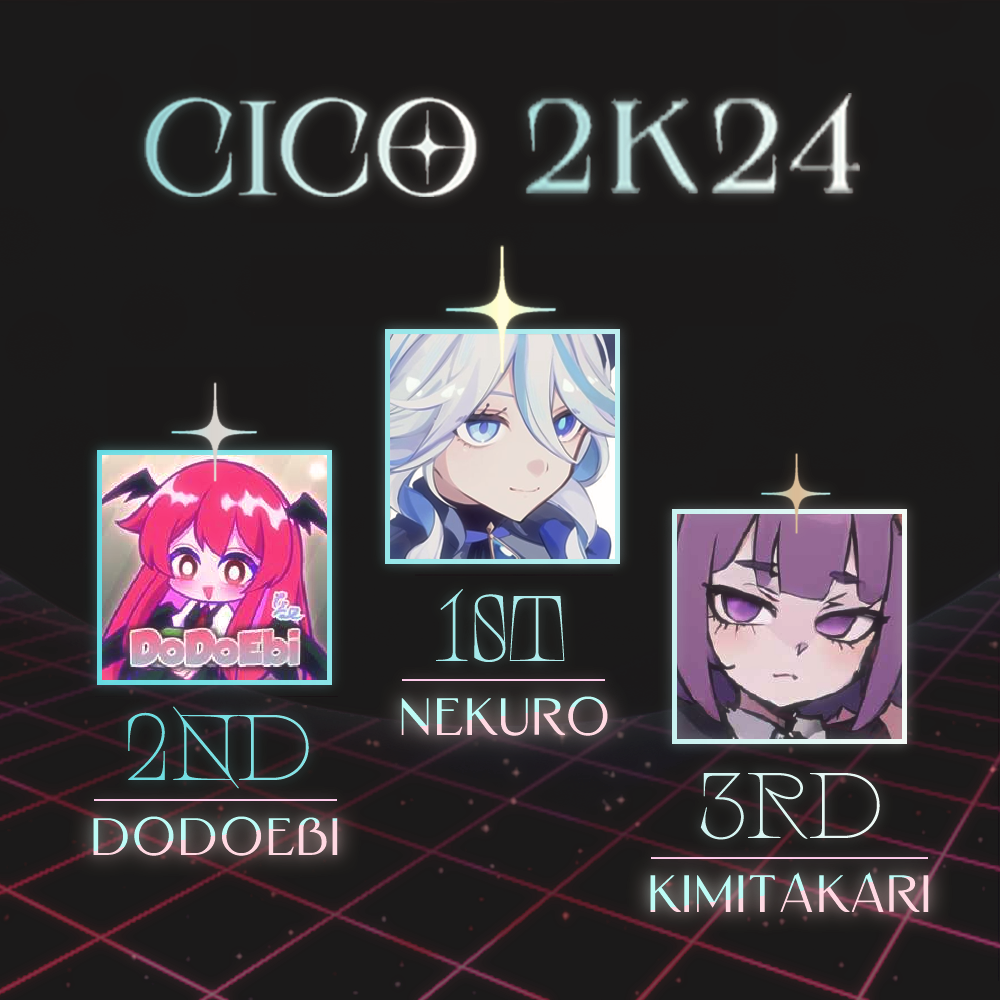

---
tags:
  - CICO
  - CICO 2024
---

# Catch the Beat Indonesia Cup Open 2024

The **Catch the Beat Indonesia Cup Open 2024** (***CICO 2024***) was a double-elimination 1v1 osu!catch tournament hosted by ::{ flag=ID }:: [Urabe Mikoto](https://osu.ppy.sh/users/1272422), ::{ flag=ID }:: [Madoka Ayukawa](https://osu.ppy.sh/users/1595221), ::{ flag=ID }:: [Constantine](https://osu.ppy.sh/users/3221898), and ::{ flag=ID }:: [Dedot](https://osu.ppy.sh/users/8805157). Despite its name, the tournament was open to all players from Asia and Oceania with a global rank of #100,000 or higher in the osu!catch game mode. It was the twelfth iteration of the Catch the Beat Indonesia Cup, as well as the second one to be held under the "Open" format.

## Tournament schedule

| Event | Timestamp |
| --: | :-- |
| Registration phase | 2024-06-13/2024-06-26 |
| Screening phase | 2024-06-27/2024-07-07 |
| Qualifiers | 2024-07-08/2024-07-14 |
| Round of 32 | 2024-07-15/2024-07-21 |
| Round of 16 | 2024-07-22/2024-07-28 |
| Quarterfinals | 2024-07-29/2024-08-04 |
| Semifinals | 2024-08-04/2024-08-11 |
| Finals (week 1) | 2024-08-12/2024-08-25 |
| Finals (week 2) | 2024-08-26/2024-09-01 |

## Prizes

| Placing | Prize(s) |
| :-: | :-- |
|  | $40 USD or 18 months of osu! supporter, unique profile badge |
|  | $20 USD or 8 months of osu! supporter |
|  | $10 USD or 2 months of osu! supporter |

## Organisation

The Catch the Beat Indonesia Cup Open 2024 was run by various osu! community members from Indonesia and beyond.

| Position | Member(s) |
| :-- | :-- |
| Host | ::{ flag=ID }:: [Urabe Mikoto](https://osu.ppy.sh/users/1272422), ::{ flag=ID }:: [Madoka Ayukawa](https://osu.ppy.sh/users/1595221), ::{ flag=ID }:: [Constantine](https://osu.ppy.sh/users/3221898), ::{ flag=ID }:: [Dedot](https://osu.ppy.sh/users/8805157) |
| Mappool selector | ::{ flag=ID }:: [Urabe Mikoto](https://osu.ppy.sh/users/1272422), ::{ flag=ID }:: [Madoka Ayukawa](https://osu.ppy.sh/users/1595221), ::{ flag=ID }:: [Constantine](https://osu.ppy.sh/users/3221898), ::{ flag=MY }:: [Zakrusta](https://osu.ppy.sh/users/5034270), ::{ flag=SG }:: [\[Eun\]](https://osu.ppy.sh/users/3788536), ::{ flag=AT }:: [Mashiro Mama](https://osu.ppy.sh/users/10415976), ::{ flag=CL }:: [Pekorrat](https://osu.ppy.sh/users/1250096) |
| Custom mapper | ::{ flag=ID }:: [Urabe Mikoto](https://osu.ppy.sh/users/1272422), ::{ flag=ID }:: [Madoka Ayukawa](https://osu.ppy.sh/users/1595221), ::{ flag=ID }:: [Mochi -](https://osu.ppy.sh/users/20424806), ::{ flag=ID }:: [Zvenx](https://osu.ppy.sh/users/14613788), ::{ flag=ID }:: [Fisicia](https://osu.ppy.sh/users/6556054), ::{ flag=ID }:: [Sololiquy](https://osu.ppy.sh/users/4350087), ::{ flag=ID }:: [Dika312](https://osu.ppy.sh/users/741613), ::{ flag=ID }:: [-Hex-](https://osu.ppy.sh/users/8630988), ::{ flag=ID }:: [Zyzyx](https://osu.ppy.sh/users/2888013), ::{ flag=TH }:: [-Luminate](https://osu.ppy.sh/users/4778689), ::{ flag=PH }:: [-Rustyy](https://osu.ppy.sh/users/16355636), ::{ flag=VN }:: [-Miya](https://osu.ppy.sh/users/1942877), ::{ flag=PH }:: [Jemzuu](https://osu.ppy.sh/users/7890134), ::{ flag=KR }:: [Spectator](https://osu.ppy.sh/users/702598), ::{ flag=KR }:: [ExGon](https://osu.ppy.sh/users/214187), ::{ flag=AT }:: [Daletto](https://osu.ppy.sh/users/7592136), ::{ flag=GB }:: [BIG H ZONDA KIT](https://osu.ppy.sh/users/16352736), ::{ flag=RU }:: [Morusya](https://osu.ppy.sh/users/13681464), ::{ flag=PL }:: [Malai](https://osu.ppy.sh/users/4863096), ::{ flag=RU }:: [2zz](https://osu.ppy.sh/users/8201267), ::{ flag=US }:: [Secre](https://osu.ppy.sh/users/2306637), ::{ flag=MX }:: [Cowboy](https://osu.ppy.sh/users/1237535), ::{ flag=US }:: [Zileni](https://osu.ppy.sh/users/23525574), ::{ flag=CL }:: [Des9](https://osu.ppy.sh/users/5404711), ::{ flag=MX }:: [MILK_16](https://osu.ppy.sh/users/9137627) |
| Custom map quality assurance | ::{ flag=ID }:: [Urabe Mikoto](https://osu.ppy.sh/users/1272422), ::{ flag=ID }:: [Mochi -](https://osu.ppy.sh/users/20424806), ::{ flag=ID }:: [Zvenx](https://osu.ppy.sh/users/14613788), ::{ flag=PH }:: [midorijeon](https://osu.ppy.sh/users/10969875), ::{ flag=KR }:: [ExGon](https://osu.ppy.sh/users/214187), ::{ flag=KR }:: [Spectator](https://osu.ppy.sh/users/702598), ::{ flag=HK }:: [autofanboy](https://osu.ppy.sh/users/636114) |
| Playtester | ::{ flag=ID }:: [Netamaru](https://osu.ppy.sh/users/1830361), ::{ flag=ID }:: [Funtastic](https://osu.ppy.sh/users/3555626), ::{ flag=KR }:: [DreStar](https://osu.ppy.sh/users/1808057), ::{ flag=KR }:: [Motion](https://osu.ppy.sh/users/3885626), ::{ flag=AU }:: [Beerus](https://osu.ppy.sh/users/5529199), ::{ flag=NO }:: [Yunami](https://osu.ppy.sh/users/12217903), ::{ flag=CL }:: [Thaemine](https://osu.ppy.sh/users/32442896), ::{ flag=PE }:: [Lunati1kid](https://osu.ppy.sh/users/25723773) |
| Streamer | ::{ flag=ID }:: [Urabe Mikoto](https://osu.ppy.sh/users/1272422), ::{ flag=ID }:: [BitDust](https://osu.ppy.sh/users/9573836), ::{ flag=PL }:: [LaviSorrow](https://osu.ppy.sh/users/9966768) |
| Commentator | ::{ flag=ID }:: [Constantine](https://osu.ppy.sh/users/3221898), ::{ flag=SG }:: [\[Eun\]](https://osu.ppy.sh/users/3788536), ::{ flag=SG }:: [NoBudgetGuy](https://osu.ppy.sh/users/28498328), ::{ flag=PH }:: [-Steven08-](https://osu.ppy.sh/users/13654885), ::{ flag=SG }:: [Ekseff](https://osu.ppy.sh/users/13966422), ::{ flag=KR }:: [\[Amazing\]](https://osu.ppy.sh/users/1391036), ::{ flag=AU }:: [Maitoo](https://osu.ppy.sh/users/16899553), ::{ flag=AU }:: [KWYJIBO](https://osu.ppy.sh/users/7178386), ::{ flag=PL }:: [LaviSorrow](https://osu.ppy.sh/users/9966768) |
| Referee | ::{ flag=ID }:: [Urabe Mikoto](https://osu.ppy.sh/users/1272422), ::{ flag=ID }:: [MushReen](https://osu.ppy.sh/users/10129901), ::{ flag=ID }:: [Juragan_Piscok1](https://osu.ppy.sh/users/15507280), ::{ flag=SG }:: [Quickeryes](https://osu.ppy.sh/users/18227681), ::{ flag=MY }:: [Zakrusta](https://osu.ppy.sh/users/5034270), ::{ flag=PL }:: [LaviSorrow](https://osu.ppy.sh/users/9966768) |
| Graphic designer | ::{ flag=ID }:: [Madoka Ayukawa](https://osu.ppy.sh/users/1595221), ::{ flag=ID }:: [Niva](https://osu.ppy.sh/users/197805), ::{ flag=ID }:: kanata. [(↗)](https://twitter.com/kanata_workss), ::{ flag=US }:: showtime [(↗)](https://twitter.com/Sh0wtimeDTM) |
| Wiki editor | ::{ flag=ID }:: [Niva](https://osu.ppy.sh/users/197805) |

## Links

- **[Official website](https://wybin.xyz/tournaments/catch-indonesia-cup-open-2024)**
- [Forum thread](https://osu.ppy.sh/community/forums/topics/1930762)
- [Discord server](https://discord.gg/YwAYbPa)
- [Challonge brackets](https://challonge.com/CICO2024)
- [Livestream channel](https://www.twitch.tv/osucatchid)

## Participants

Listed below are the players who managed to qualify into the Round of 32 (along with their respective seed number and average rank across all ten Qualifier beatmaps) out of 71 participating players in total.

The complete list of player registrations can be found [here](https://wybin.xyz/tournaments/catch-indonesia-cup-open-2024/players).

| Seed no. | Player | Avg. rank |
| :-- | :-- | :-- |
| 1 | ::{ flag=CN }:: [Nene Sakura](https://osu.ppy.sh/users/6701104) | 4.90 |
| 2 | ::{ flag=ID }:: [Nekuro](https://osu.ppy.sh/users/3222638) | 6.00 |
| 3 | ::{ flag=TW }:: [Shimoe Koharu](https://osu.ppy.sh/users/2145160) | 8.30 |
| 4 | ::{ flag=RU }:: [Kimitakari](https://osu.ppy.sh/users/4741164) | 9.40 |
| 5 | ::{ flag=ID }:: [Chroneko](https://osu.ppy.sh/users/5472877) | 9.50 |
| 6 | ::{ flag=KR }:: [OYG](https://osu.ppy.sh/users/7547506) | 9.80 |
| 7 | ::{ flag=TW }:: [Happiness Fish](https://osu.ppy.sh/users/4586766) | 9.90 |
| 8 | ::{ flag=TW }:: [DoDoEbi](https://osu.ppy.sh/users/1177233) | 10.20 |
| 9 | ::{ flag=KR }:: [\[Amazing\]](https://osu.ppy.sh/users/1391036) | 11.00 |
| 10 | ::{ flag=ID }:: [Taskmaster](https://osu.ppy.sh/users/3027065) | 13.00 |
| 11 | ::{ flag=HK }:: [littlepiggod](https://osu.ppy.sh/users/12331683) | 13.50 |
| 12 | ::{ flag=ID }:: [EpanPan](https://osu.ppy.sh/users/13194580) | 13.70 |
| 13 | ::{ flag=RU }:: [Cold Fusion](https://osu.ppy.sh/users/15389158) | 15.30 |
| 14 | ::{ flag=TH }:: [Azuria](https://osu.ppy.sh/users/16102533) | 16.70 |
| 15 | ::{ flag=TW }:: [Minato Yukina](https://osu.ppy.sh/users/4133477) | 17.20 |
| 16 | ::{ flag=HK }:: [fua](https://osu.ppy.sh/users/21138904) | 19.80 |
| 17 | ::{ flag=AU }:: [TheTixTop](https://osu.ppy.sh/users/19236870) | 19.90 |
| 18 | ::{ flag=RU }:: [Rakety](https://osu.ppy.sh/users/11109479) | 21.20 |
| 19 | ::{ flag=ID }:: [Serestia](https://osu.ppy.sh/users/30511396) | 22.10 |
| 20 | ::{ flag=TW }:: [Oktavia](https://osu.ppy.sh/users/1952803) | 22.40 |
| 21 | ::{ flag=AU }:: [KWYJIBO](https://osu.ppy.sh/users/7178386) | 23.80 |
| 22 | ::{ flag=HK }:: [my angel auto](https://osu.ppy.sh/users/29503627) | 24.40 |
| 23 | ::{ flag=SA }:: [WOAH0](https://osu.ppy.sh/users/18336339) | 25.00 |
| 24 | ::{ flag=RU }:: [Nerris](https://osu.ppy.sh/users/11202866) | 25.50 |
| 25 | ::{ flag=SG }:: [Ekseff](https://osu.ppy.sh/users/13966422) | 26.40 |
| 26 | ::{ flag=TR }:: [lorem ipsum](https://osu.ppy.sh/users/17130789) | 27.20 |
| 27 | ::{ flag=TW }:: [Flyer](https://osu.ppy.sh/users/9767342) | 28.70 |
| 28 | ::{ flag=TW }:: [Psc\_IceRain](https://osu.ppy.sh/users/3359485) | 29.00 |
| 29 | ::{ flag=TW }:: [\_Tsukiko](https://osu.ppy.sh/users/4787989) | 29.30 |
| 30 | ::{ flag=TW }:: [Nazrin on osu](https://osu.ppy.sh/users/2512267) | 29.60 |
| 31 | ::{ flag=TW }:: [\_Nanami](https://osu.ppy.sh/users/1929450) | 31.30 |
| 32 | ::{ flag=AU }:: [pandaBear](https://osu.ppy.sh/users/107553) | 31.40 |

## Podium

## Mappools

### Finals (week 2)

**[Download the mappack here! (173 MB)](https://discord.com/channels/612285397875032094/1259518312778305687/1277692769711947807)**

- No Mod
  1. [UNDEAD CORPORATION - The Empress (Daletto) \[Daletto & Rustyy's Ripples of 495 Years\]](https://osu.ppy.sh/beatmapsets/2239310#fruits/4758753)
  2. [USAO - Blows Up Everything (Zyzyx) \[2056\]](https://osu.ppy.sh/beatmapsets/2239584#fruits/4759580)
  3. [MisoilePunch -Forever- - Bloomin' (Secre) \[Massacre\]](https://osu.ppy.sh/beatmapsets/2239435#fruits/4759059)
  4. [Lord Snow - Aranea Ienith (BIG H ZONDA KIT) \[clamamus pro nihilo\]](https://osu.ppy.sh/beatmapsets/2239387#fruits/4758973)
  5. [Iwami Takeshi - anoko dokonoko (melon boy) \[WOAHZA\]](https://osu.ppy.sh/beatmapsets/2051777#fruits/4284780)
- Hidden
  1. [Kyutatsuki - \_alc.yone (Zyzyx) \[Zyx vs. Zvenx's \_syn.thesis\]](https://osu.ppy.sh/beatmapsets/2239576#fruits/4759557)
  2. [Coconami - e3\_footkore (Sololiquy) \[Special\]](https://osu.ppy.sh/beatmapsets/2239327#fruits/4758798)
  3. [toby fox - Hopes and Dreams (Lightin) \[But It Refused\]](https://osu.ppy.sh/beatmapsets/2116013#fruits/4443679)
- Hard Rock
  1. [Synestia, Disembodied Tyrant - I, The Devourer (Daletto) \[Gut and Maim\]](https://osu.ppy.sh/beatmapsets/2239329#fruits/4758813)
  2. [Feryquitous - Estahv (BIG H ZONDA KIT) \[Colloquial (CICO edit)\]](https://osu.ppy.sh/beatmapsets/2239386#fruits/4758970)
  3. [Nene Kusanagi & NeneRobo x Mikudayo & Kagamine Len & KAITO - Tokugawa Cup Noodle Kinshirei (Cubby) \[Tonkotsu\]](https://osu.ppy.sh/beatmapsets/1763088#fruits/3608681)
- Double Time
  1. [Yosuke\@KG feat. Aitsuki Nakuru - INFINITE DAYS (Dika312) \[SUNSHINE\]](https://osu.ppy.sh/beatmapsets/2239334#fruits/4758826)
  2. [Alistair Lindsay - Galaxy Trooper (ExGon) \[Cosmic Craggs (derandomized)\]](https://osu.ppy.sh/beatmapsets/2239345#fruits/4758873)
  3. [Cita Citata - Goyang Dumang (Nightcore Mix) (Zvenx) \[Goyangan Zvenx & Ayukawa\]](https://osu.ppy.sh/beatmapsets/2239339#fruits/4758853)
  4. [Isekaijoucho - Replica (Live Ver.) (Raijodo) \[tkfkdgo (CICO edit)\]](https://osu.ppy.sh/beatmapsets/2239354#fruits/4758884)
- Easy
  1. [Rick Astley - Never Gonna Give You Up (Des9) \[Haven't You Heard? I Rickrolled You\]](https://osu.ppy.sh/beatmapsets/2239346#fruits/4758875)
  2. [MisomyL - Amnehilesie (Realazy) \[descente aux enfers\]](https://osu.ppy.sh/beatmapsets/1703921#fruits/3481620)
- Tiebreaker
  1. **[Rukadesu & 5KiLOBYTE - Bootes Void (Mochi -) \[MZZR // \<Mazzerine Exploration\>\]](https://osu.ppy.sh/beatmapsets/2239341#fruits/4758862)**

### Finals (week 1)

**[Download the mappack here! (164 MB)](https://discord.com/channels/612285397875032094/1259518312778305687/1272568440510484520)**

- No Mod
  1. [cosMo\@Bousou-P - Hatsune Miku no Shoushitsu -Real And Repeat- (Sololiquy) \[UNINSTALL\]](https://osu.ppy.sh/beatmapsets/2230758#fruits/4734261)
  2. [TrinaLydia - Bend The Bullet (Jemzuu) \[Overdose\]](https://osu.ppy.sh/beatmapsets/2230740#fruits/4734215)
  3. [Hino Isuka - ULTRA MEGA HAPPY PARTY!!! (Dika312) \[DELUGE\]](https://osu.ppy.sh/beatmapsets/2230752#fruits/4734249)
  4. [Frums - 24eeev0-\$ (Bunnrei) \[Overdose\]](https://osu.ppy.sh/beatmapsets/2195835#fruits/4646351)
  5. [Rahul Sipligunj & Kaala Bhairava - Naatu Naatu (Fsjallink) \[Challenge\]](https://osu.ppy.sh/beatmapsets/2047944#fruits/4275880)
- Hidden
  1. [Kikuo - Aishite Aishite Aishite (Mochi -) \[It's painful, it hurts.\]](https://osu.ppy.sh/beatmapsets/2230743#fruits/4734221)
  2. [-45 - System Zero (fayew) \[The Mysterious Letter (CICO2024 Ver.)\]](https://osu.ppy.sh/beatmapsets/2230783#fruits/4734305)
  3. [FOLiACETATE - Heterochromia Iridis (Kawaiwkyik) \[Extra\]](https://osu.ppy.sh/beatmapsets/155885#fruits/382239)
- Hard Rock
  1. [Emiru no Aishita Tsukiyo ni Dai San Gensou Kyoku wo - ito (Spectator) \[Spec Lumi's Overdose\]](https://osu.ppy.sh/beatmapsets/2111859#fruits/4433498)
  2. [\{ Camellia \} - \{ eXLIPXe \} (Zileni) \[INFINITE (EDIT)\]](https://osu.ppy.sh/beatmapsets/2230748#fruits/4734242)
  3. [Maya Abe - Magical Parfait (KnightC0re) \[Euphoria\]](https://osu.ppy.sh/beatmapsets/2102128#fruits/4410062)
- Double Time
  1. [ShinRa-Bansho - Netaminity Theatre "666" (Spectator) \[Specuu's Rain\]](https://osu.ppy.sh/beatmapsets/1218948#fruits/2608016)
  2. [Machico - Mystic Light Quest (-Miya) \[Overdose (CICO2024 Edit)\]](https://osu.ppy.sh/beatmapsets/2230760#fruits/4734264)
  3. [Kalafina - Hikari no Senritsu (Madoka Ayukawa) \[Sky\]](https://osu.ppy.sh/beatmapsets/2230766#fruits/4734276)
  4. [Hikarisyuyo - Burn Out (feat. Kagamine Rin) (Reiji Maigo) \[Extra\]](https://osu.ppy.sh/beatmapsets/2152709#fruits/4535794)
- Easy
  1. [II-L - VANGUARD-1 (Sololiquy) \[1-V\]](https://osu.ppy.sh/beatmapsets/2032087#fruits/4730158)
  2. [RuLu - Bad End Donuts feat. tug (Nevo) \[Confliction\]](https://osu.ppy.sh/beatmapsets/2110908#fruits/4431252)
- Tiebreaker
  1. **[FREEDOM CREATORS - Okurina -Inochi o Aoku Mimamori Nemurina- (Daletto) \[Shidarezakura\]](https://osu.ppy.sh/beatmapsets/2230774#fruits/4734290)**

### Semifinals

**[Download the mappack here! (207 MB)](https://discord.com/channels/612285397875032094/1259518312778305687/1270027457084391505)**

- No Mod
  1. [Passcode - It's You (Zvenx) \[Traverse Beyond the Sea\]](https://osu.ppy.sh/beatmapsets/2226730#fruits/4723733)
  2. [Memme - Pandemonium (GiGas) \[Zileni's Master\]](https://osu.ppy.sh/beatmapsets/2152059#fruits/4538677)
  3. [Down - ddm (Mochi -) \[Lunatic\]](https://osu.ppy.sh/beatmapsets/2226652#fruits/4723509)
  4. [Kagetora. - Aspiration (NekoShabeta) \[Cherry Blossom\]](https://osu.ppy.sh/beatmapsets/2112505#fruits/4435065)
- Hidden
  1. [U2 - Saigetsu (Koko & Satsuki ga Tenkomori's Sagyou Bougai Remix) (Spectator) \[Overdose\]](https://osu.ppy.sh/beatmapsets/2226658#fruits/4723516)
  2. [Aitsuki Nakuru - phony (-Miya) \[CICO 2024 SF HD2\]](https://osu.ppy.sh/beatmapsets/2226661#fruits/4723522)
  3. [otoe - DOLL (AIR) \[Extra\]](https://osu.ppy.sh/beatmapsets/1816605#fruits/3726767)
- Hard Rock
  1. [Kotone - Kagome (Mochi -) \[Mochi & Rustyy's Farewell Ending\]](https://osu.ppy.sh/beatmapsets/2226671#fruits/4723549)
  2. [Nanatsukaze - Dream Gravity (Sololiquy) \[Overdose (CICO ver.)\]](https://osu.ppy.sh/beatmapsets/2226660#fruits/4723519)
  3. [Origami Angel - Noah Fence (WashedUp Player) \[squirrelp's Extra\]](https://osu.ppy.sh/beatmapsets/1931702#fruits/3990667)
- Double Time
  1. [DIALOGUE+ - Omoide Shiritori (-Luminate) \[Verti's Rain\]](https://osu.ppy.sh/beatmapsets/2092098#fruits/4421064)
  2. [Ricky Martin - Livin' La Vida Loca (Zvenx) \[get shrekt!!\]](https://osu.ppy.sh/beatmapsets/2226732#fruits/4723735)
  3. [zts - the executioner (big snag) \[itay's insane\]](https://osu.ppy.sh/beatmapsets/2155765#fruits/4590821)
- Easy
  1. [siromaru + cranky - conflict (Bunnrei) \[Conquest of the Damned (CICO Edit)\]](https://osu.ppy.sh/beatmapsets/2227220#fruits/4724904)
  2. [Rise Against - Injection (pishifat) \[Extreme\]](https://osu.ppy.sh/beatmapsets/214092#fruits/646390)
- Tiebreaker
  1. **[polysha - Endverse (MILK_16) \[Des9 & MILK\_16's Final Annihilation\]](https://osu.ppy.sh/beatmapsets/2226698#fruits/4723636)**

### Quarterfinals

**[Download the mappack here! (146 MB)](https://discord.com/channels/612285397875032094/1259518312778305687/1268193477435592821)**

- No Mod
  1. [-LostFairy- - Gates of Hades (Zileni) \[Zileni & Zonda's Flames of Judgement\]](https://osu.ppy.sh/beatmapsets/2223446#fruits/4714874)
  2. [Nor - OST Theme 207 (Sololiquy) \[Overdose\]](https://osu.ppy.sh/beatmapsets/2223434#fruits/4714814)
  3. [w\_tre - Shannon's Theorem (Dika312) \[no thoughts, head empty (CICO Edit)\]](https://osu.ppy.sh/beatmapsets/2011536#fruits/4713818)
  4. [Akatsuki Records - S.A.R.I.E.L. (Mirash) \[Extra Stage\]](https://osu.ppy.sh/beatmapsets/2091456#fruits/4385666)
- Hidden
  1. [ginkiha - Anemoi (MILK\_16) \[CICO HD 1 QF\]](https://osu.ppy.sh/beatmapsets/2223533#fruits/4715071)
  2. [HOYO-MiX feat. Robin (VO: Chevy) - Sway to My Beat in Cosmos (Zvenx) \[Kalah 50/50 ya kamu?\]](https://osu.ppy.sh/beatmapsets/2223480#fruits/4714974)
  3. [Hoshimachi Suisei - BIBBIDIBA (Amateurre) \[Shooting Star\]](https://osu.ppy.sh/beatmapsets/2158562#fruits/4550807)
- Hard Rock
  1. [ichigo from KISIDA KYODAN & THE AKEBOSI ROCKETS - STONE OCEAN / Eurobeat Remix (-Hex-) \[Overdose\]](https://osu.ppy.sh/beatmapsets/1943596#fruits/4020448)
  2. [Dirty Androids - Midnight Lady (Spectator) \[Overdose (Edit ver.)\]](https://osu.ppy.sh/beatmapsets/2223472#fruits/4714957)
  3. [pm04034 - sn4pside (bob) \[4 (nerfed)\]](https://osu.ppy.sh/beatmapsets/1933524#fruits/3995628)
- Double Time
  1. [JVKE - golden hour (-Rustyy) \[iridescent\]](https://osu.ppy.sh/beatmapsets/2223504#fruits/4715022)
  2. [Akane Fujita, Yume Miyamoto, Ari Ozawa - Precious You\* (-Miya) \[Please be with me forever!\]](https://osu.ppy.sh/beatmapsets/2223461#fruits/4714933)
  3. [Avril Lavigne - Sk8er Boi (mynt) \[Insane\]](https://osu.ppy.sh/beatmapsets/1840198#fruits/3779532)
- Easy
  1. [Harry Styles - As It Was (BIG H ZONDA KIT) \[Lovesick\]](https://osu.ppy.sh/beatmapsets/2223486#fruits/4714984)
  2. [SEATBELTS - Tank! (Monstrata) \[Bang!\]](https://osu.ppy.sh/beatmapsets/801747#fruits/1922693)
- Tiebreaker
  1. **[TRakker - Countdown to the Blue (-Miya) \[Fly to the Sky with Zonda\]](https://osu.ppy.sh/beatmapsets/2223475#fruits/4714962)**

### Round of 16

**[Download the mappack here! (114 MB)](https://discord.com/channels/612285397875032094/1259518312778305687/1264944048628826112)**

- No Mod
  1. [Hyadain - Hyadain's Jojo Yujo (-Hex-) \[Overdose\]](https://osu.ppy.sh/beatmapsets/2219094#fruits/4703760)
  2. [Pegboard Nerds - Try This (Des9) \[Shocking Wave\]](https://osu.ppy.sh/beatmapsets/2219177#fruits/4703906)  
  3. [DOT96 - MAKE IT FUNKY NOW (Cipse) \[FUNKY jef\]](https://osu.ppy.sh/beatmapsets/2154994#fruits/4541955)
  4. [Reol,nqrse - Ooedo Ranvu (zhu) \[Expert\]](https://osu.ppy.sh/beatmapsets/703580#fruits/1572141)
- Hidden
  1. [QUEEN BEE - Mephisto (-Miya) \[CICO 2024 RO16 HD1\]](https://osu.ppy.sh/beatmapsets/2219188#fruits/4703924)
  2. [YurryCanon feat. RIME - Despair (Yoshi_green) \[De-De-De-De-De-Despair\]](https://osu.ppy.sh/beatmapsets/1951698#fruits/4041414)
  3. [rei sirose - Lost Umbrella (SMOKELIND) \[FuJu's Insane\]](https://osu.ppy.sh/beatmapsets/1340777#fruits/2828726)
- Hard Rock
  1. [TAMAONSEN - Saigetsu (Midnight Moon Walker Remix) (Spectator) \[Overdose\]](https://osu.ppy.sh/beatmapsets/724793#fruits/1530447)
  2. [Polyphia - Playing God (Mochi -) \[Egg's Rain\]](https://osu.ppy.sh/beatmapsets/2085333#fruits/4462907)
  3. [LV.4 - Burning Star (silly catgirl) \[Another\]](https://osu.ppy.sh/beatmapsets/2141220#fruits/4506765)
- Double Time
  1. [Rameses B - Mountains (feat. Veela) (Dapulezatos) \[Is It Worth It?\]](https://osu.ppy.sh/beatmapsets/1809578#fruits/3711550)
  2. [IU feat. Seulong - Nagging (Madoka Ayukawa) \[Persistent\]](https://osu.ppy.sh/beatmapsets/2219115#fruits/4703806)
  3. [Demetori - Strawberry Crisis!! (jonathanlfj) \[Halfslashed's Lunatic\]](https://osu.ppy.sh/beatmapsets/1833730#fruits/3764531)
- Easy
  1. [otetsu - Minamo no Sakura, Yume wa Sakayume (Riven) \[NiNo's Extra\]](https://osu.ppy.sh/beatmapsets/385248#fruits/1053233)
- Tiebreaker
  1. **[Diao Ye Zong feat. Meramipop - Saifu 'Kamiasobi no Uta' (Morusya) \[Frog\]](https://osu.ppy.sh/beatmapsets/2218881#fruits/4703316)**

### Round of 32

**[Download the mappack here! (98 MB)](https://discord.com/channels/612285397875032094/1259518312778305687/1262423028445220977)**

- No Mod
  1. [JKT48 - Bersepeda Berdua (Cut Ver.) (Madoka Ayukawa) \[Gowes\]](https://osu.ppy.sh/beatmapsets/2214898#fruits/4692984)
  2. [ginkiha - EOS (-Miya) \[CICO2024 RO32 NM2\]](https://osu.ppy.sh/beatmapsets/2214813#fruits/4692831)
  3. [HyuN feat. YURI - Disorder (Verti) \[Jemzuu's Hyper Dysfunction\]](https://osu.ppy.sh/beatmapsets/1636276#fruits/3345954)
  4. [Linkin Park - Breaking The Habit (Aakki) \[Akayume's Extra\]](https://osu.ppy.sh/beatmapsets/1499705#fruits/3084982)
- Hidden
  1. [Another Infinity feat. Mayumi Morinaga - COME BACK TO MY HEART (Ryu\* Remix) (MILK\_16) \[CICO 2K24 RO32 HD 1\]](https://osu.ppy.sh/beatmapsets/2215233#fruits/4693654)
  2. [capsule - dreamin dreamin (Cowboy) \[CICO2024 RO32 HD2\]](https://osu.ppy.sh/beatmapsets/2215214#fruits/4693614)
  3. [Miyolophone - Shinigami Line (feat. eris elysia) (DeviousPanda) \[Grand Finale\]](https://osu.ppy.sh/beatmapsets/1930357#fruits/3987557)
- Hard Rock
  1. [sasakure.UK - AMARA (The Great Intelligence) (Mniam) \[Sololiquy x Quix's Rain\]](https://osu.ppy.sh/beatmapsets/1998960#fruits/4520337)
  2. [Mili - Compass (yuinn) \[Rain\]](https://osu.ppy.sh/beatmapsets/2148993#fruits/4586965)
  3. [A.SAKA - Nanatsu Myoukakitsubata (Houshou Hari) \[sahuang's Insane\]](https://osu.ppy.sh/beatmapsets/1598631#fruits/3292536)
- Double Time
  1. [Dormir - Sayonara Trip (Fisicia) \[Let's float to the World of Our Dreams!\]](https://osu.ppy.sh/beatmapsets/2214878#fruits/4692952)
  2. [UNDEAD CORPORATION - Everything will freeze (NyalettOwO x3) \[HexlettOwO's Platter\]](https://osu.ppy.sh/beatmapsets/1293905#fruits/2685022)
  3. [Rise Against - Audience Of One (tieff) \[Hard\]](https://osu.ppy.sh/beatmapsets/44743#fruits/140062)  
- Easy
  1. [penoreri - Sulfur (Realazy) \[Deca's Expert\]](https://osu.ppy.sh/beatmapsets/1252844#fruits/3106504)
- Tiebreaker
  1. **[Kikuo - Hole Dwelling (Malai) \[Void (CICO2K24 Ver.)\]](https://osu.ppy.sh/beatmapsets/2214844#fruits/4692889)**  

### Qualifiers

**[Download the mappack here! (59 MB)](https://discord.com/channels/612285397875032094/1259518312778305687/1259536166164893816)**

- No Mod
  1. [Yousei Teikoku - Hades: The rise (-Miya) \[CICO2024 QLF NM1\]](https://osu.ppy.sh/beatmapsets/2210040#fruits/4681178)
  2. [Fractal Dreamers - Whispers from a Distant Star (MILK_16) \[CICO NM 2 QL VER\]](https://osu.ppy.sh/beatmapsets/2210045#fruits/4681185)
  3. [USAO - Knight Rider (Nakano Itsuki) \[Expert\]](https://osu.ppy.sh/beatmapsets/1550327#fruits/3168036)
- Hidden
  1. [la la larks - ego-izm (Zyzyx) \[ego-ism\]](https://osu.ppy.sh/beatmapsets/2210055#fruits/4681205)
  2. [L.E.D. Vs. Yuuhei Satellite - Torikago no Houou (Okoratu) \[EEEEExtra\]](https://osu.ppy.sh/beatmapsets/1764723#fruits/3612221)
- Hard Rock
  1. [JKT48 - Ponytail dan Shu-Shu (BIG H ZONDA KIT) \[Blue Ponytail\]](https://osu.ppy.sh/beatmapsets/2210062#fruits/4681217)
  2. [Chanel - SloMo (Eurovision's Dancebreak Edit) (Eterdesp) \[Expert\]](https://osu.ppy.sh/beatmapsets/1948241#fruits/4036414)
- Double Time
  1. [ONE OK ROCK - Clock Strikes (Sololiquy) \[Rain\]](https://osu.ppy.sh/beatmapsets/2210093#fruits/4681306)
  2. [Red Velvet - Power Up (AJT) \[Another\]](https://osu.ppy.sh/beatmapsets/1997883#fruits/4183275)
- Easy
  1. [Hakushi Hasegawa - Doku (zglock) \[Expert\]](https://osu.ppy.sh/beatmapsets/1674871#fruits/3539717)

## Match results

### Finals (week 2)

Saturday, 31 August 2024:

| Bracket | Player 1 |  |  | Player 2 | Match link |
| :-: | --: | :-: | :-: | :-- | :-- |
| Lower | **[Nekuro](https://osu.ppy.sh/users/3222638)** ::{ flag=ID }:: | **7** | 0 | ::{ flag=RU }:: [Kimitakari](https://osu.ppy.sh/users/4741164) | [#1](https://osu.ppy.sh/community/matches/115309494) |

Sunday, 1 September 2024:

| Bracket | Player 1 |  |  | Player 2 | Match link |
| :-: | --: | :-: | :-: | :-- | :-- |
| Grand Final | [DoDoEbi](https://osu.ppy.sh/users/1177233) ::{ flag=TW }:: | 4 | **7** | ::{ flag=ID }:: **[Nekuro](https://osu.ppy.sh/users/3222638)** | [#1](https://osu.ppy.sh/community/matches/115324254) |
| Grand Final (bracket reset) | **[Nekuro](https://osu.ppy.sh/users/4741164)** ::{ flag=ID }:: | **7** | 1 | ::{ flag=TW }:: [DoDoEbi](https://osu.ppy.sh/users/1391036) | [#1](https://osu.ppy.sh/community/matches/115325088) |

### Finals (week 1)

Sunday, 18 August 2024:

| Bracket | Player 1 |  |  | Player 2 | Match link |
| :-: | --: | :-: | :-: | :-- | :-- |
| Lower | **[Kimitakari](https://osu.ppy.sh/users/4741164)** ::{ flag=RU }:: | **7** | 3 | ::{ flag=KR }:: [\[Amazing\]](https://osu.ppy.sh/users/1391036) | [#1](https://osu.ppy.sh/community/matches/115131157) |
| Lower | [Shimoe Koharu](https://osu.ppy.sh/users/2145160) ::{ flag=TW }:: | 0 | **7** | ::{ flag=CN }:: **[Nene Sakura](https://osu.ppy.sh/users/6701104)** | *win by default* |

Monday, 19 August 2024:

| Bracket | Player 1 |  |  | Player 2 | Match link |
| :-: | --: | :-: | :-: | :-- | :-- |
| Lower | [Nene Sakura](https://osu.ppy.sh/users/6701104) ::{ flag=CN }:: | 4 | **7** | ::{ flag=RU }:: **[Kimitakari](https://osu.ppy.sh/users/4741164)** | [#1](https://osu.ppy.sh/community/matches/115143422) |

Sunday, 25 August 2024:

| Bracket | Player 1 |  |  | Player 2 | Match link |
| :-: | --: | :-: | :-: | :-- | :-- |
| Upper | **[DoDoEbi](https://osu.ppy.sh/users/1177233)** ::{ flag=TW }:: | **7** | 0 | ::{ flag=ID }:: [Nekuro](https://osu.ppy.sh/users/3222638) | *win by default* |

### Semifinals

Saturday, 10 August 2024:

| Bracket | Player 1 |  |  | Player 2 | Match link |
| :-: | --: | :-: | :-: | :-- | :-- |
| Lower | **[Chroneko](https://osu.ppy.sh/users/5472877)** ::{ flag=ID }:: | **6** | 3 | ::{ flag=SG }:: [Ekseff](https://osu.ppy.sh/users/13966422) | [#1](https://osu.ppy.sh/community/matches/115023306) |
| Lower | [Happiness Fish](https://osu.ppy.sh/users/4586766) ::{ flag=TW }:: | 4 | **6** | ::{ flag=KR }:: **[\[Amazing\]](https://osu.ppy.sh/users/1391036)** | [#1](https://osu.ppy.sh/community/matches/115022049) |
| Lower | **[Nene Sakura](https://osu.ppy.sh/users/6701104)** ::{ flag=CN }:: | **6** | 3 | ::{ flag=ID }:: [Taskmaster](https://osu.ppy.sh/users/3027065) | [#1](https://osu.ppy.sh/community/matches/115021542) |
| Lower | [my angel auto](https://osu.ppy.sh/users/29503627) ::{ flag=HK }:: | 3 | **6** | ::{ flag=RU }:: **[Cold Fusion](https://osu.ppy.sh/users/15389158)** | [#1](https://osu.ppy.sh/community/matches/115022848) |

Sunday, 11 August 2024:

| Bracket | Player 1 |  |  | Player 2 | Match link |
| :-: | --: | :-: | :-: | :-- | :-- |
| Upper | **[Nekuro](https://osu.ppy.sh/users/3222638)** ::{ flag=ID }:: | **6** | 1 | ::{ flag=TW }:: [Shimoe Koharu](https://osu.ppy.sh/users/2145160) | [#1](https://osu.ppy.sh/community/matches/115037221) |
| Upper | **[DoDoEbi](https://osu.ppy.sh/users/1177233)** ::{ flag=TW }:: | **6** | 3 | ::{ flag=RU }:: [Kimitakari](https://osu.ppy.sh/users/4741164) | [#1](https://osu.ppy.sh/community/matches/115036426) |
| Lower | [Cold Fusion](https://osu.ppy.sh/users/15389158) ::{ flag=RU }:: | 2 | **6** | ::{ flag=KR }:: **[\[Amazing\]](https://osu.ppy.sh/users/1391036)** | [#1](https://osu.ppy.sh/community/matches/115037880) |

Monday, 12 August 2024:

| Bracket | Player 1 |  |  | Player 2 | Match link |
| :-: | --: | :-: | :-: | :-- | :-- |
| Lower | [Chroneko](https://osu.ppy.sh/users/5472877) ::{ flag=ID }:: | 5 | **6** | ::{ flag=CN }:: **[Nene Sakura](https://osu.ppy.sh/users/6701104)** | [#1](https://osu.ppy.sh/community/matches/115035156) |

### Quarterfinals

Saturday, 3 August 2024:

| Bracket | Player 1 |  |  | Player 2 | Match link |
| :-: | --: | :-: | :-: | :-- | :-- |
| Lower | **[\[Amazing\]](https://osu.ppy.sh/users/1391036)** ::{ flag=KR }:: | **6** | 0 | ::{ flag=TW }:: [Nazrin on osu](https://osu.ppy.sh/users/2512267) | [#1](https://osu.ppy.sh/community/matches/114925296) |
| Lower | **[Taskmaster](https://osu.ppy.sh/users/3027065)** ::{ flag=ID }:: | **6** | 5 | ::{ flag=TW }:: [Oktavia](https://osu.ppy.sh/users/1952803) | [#1](https://osu.ppy.sh/community/matches/114926967) |
| Lower | [TheTixTop](https://osu.ppy.sh/users/19236870) ::{ flag=AU }:: | 2 | **6** | ::{ flag=HK }:: **[littlepiggod](https://osu.ppy.sh/users/12331683)** | [#1](https://osu.ppy.sh/community/matches/114926468) |
| Lower | **[Minato Yukina](https://osu.ppy.sh/users/4133477)** ::{ flag=TW }:: | **6** | 3 | ::{ flag=ID }:: [EpanPan](https://osu.ppy.sh/users/13194580) | [#1](https://osu.ppy.sh/community/matches/114924853) |
| Lower | **[Flyer](https://osu.ppy.sh/users/9767342)** ::{ flag=TW }:: | **6** | 1 | ::{ flag=HK }:: [fua](https://osu.ppy.sh/users/21138904) | [#1](https://osu.ppy.sh/community/matches/114925281) |
| Lower | **[Cold Fusion](https://osu.ppy.sh/users/15389158)** ::{ flag=RU }:: | **6** | 3 | ::{ flag=SA }:: [WOAH0](https://osu.ppy.sh/users/18336339) | [#1](https://osu.ppy.sh/community/matches/114928946) |
| Lower | [Serestia](https://osu.ppy.sh/users/30511396) ::{ flag=ID }:: | 0 | **6** | ::{ flag=SG }:: **[Ekseff](https://osu.ppy.sh/users/13966422)** | *win by default* |

Sunday, 4 August 2024:

| Bracket | Player 1 |  |  | Player 2 | Match link |
| :-: | --: | :-: | :-: | :-- | :-- |
| Lower | **[\[Amazing\]](https://osu.ppy.sh/users/1391036)** ::{ flag=KR }:: | **6** | 2 | ::{ flag=HK }:: [littlepiggod](https://osu.ppy.sh/users/12331683) | [#1](https://osu.ppy.sh/community/matches/114938315) |
| Upper | **[Nekuro](https://osu.ppy.sh/users/3222638)** ::{ flag=ID }:: | **6** | 4 | ::{ flag=TW }:: [Happiness Fish](https://osu.ppy.sh/users/4586766) | [#1](https://osu.ppy.sh/community/matches/114939817) |
| Upper | [Nene Sakura](https://osu.ppy.sh/users/6701104) ::{ flag=CN }:: | 3 | **6** | ::{ flag=TW }:: **[DoDoEbi](https://osu.ppy.sh/users/1177233)** | [#1](https://osu.ppy.sh/community/matches/114940391) |
| Lower | **[Taskmaster](https://osu.ppy.sh/users/3027065)** ::{ flag=ID }:: | **6** | 2 | ::{ flag=TW }:: [Minato Yukina](https://osu.ppy.sh/users/4133477) | [#1](https://osu.ppy.sh/community/matches/114941737) |
| Upper | **[Kimitakari](https://osu.ppy.sh/users/4741164)** ::{ flag=RU }:: | **6** | 3 | ::{ flag=ID }:: [Chroneko](https://osu.ppy.sh/users/5472877) | [#1](https://osu.ppy.sh/community/matches/114940976) |
| Upper | **[Shimoe Koharu](https://osu.ppy.sh/users/2145160)** ::{ flag=TW }:: | **6** | 5 | ::{ flag=HK }:: [my angel auto](https://osu.ppy.sh/users/29503627) | [#1](https://osu.ppy.sh/community/matches/114941623) |
| Lower | **[KWYJIBO](https://osu.ppy.sh/users/7178386)** ::{ flag=AU }:: | **6** | 0 | ::{ flag=RU }:: [Rakety](https://osu.ppy.sh/users/11109479) | *win by default* |
| Lower | [Flyer](https://osu.ppy.sh/users/9767342) ::{ flag=TW }:: | 0 | **6** | ::{ flag=SG }:: **[Ekseff](https://osu.ppy.sh/users/13966422)** | *win by default* |

Monday, 5 August 2024:

| Bracket | Player 1 |  |  | Player 2 | Match link |
| :-: | --: | :-: | :-: | :-- | :-- |
| Lower | [KWYJIBO](https://osu.ppy.sh/users/7178386) ::{ flag=AU }:: | 2 | **6** | ::{ flag=RU }:: **[Cold Fusion](https://osu.ppy.sh/users/15389158)** | [#1](https://osu.ppy.sh/community/matches/114939539) |

### Round of 16

Friday, 26 July 2024:

| Bracket | Player 1 |  |  | Player 2 | Match link |
| :-: | --: | :-: | :-: | :-- | :-- |
| Lower | [lorem ipsum](https://osu.ppy.sh/users/17130789) ::{ flag=TR }:: | 2 | **5** | ::{ flag=SA }:: **[WOAH0](https://osu.ppy.sh/users/18336339)** | [#1](https://osu.ppy.sh/community/matches/114836378) |

Saturday, 27 July 2024:

| Bracket | Player 1 |  |  | Player 2 | Match link |
| :-: | --: | :-: | :-: | :-- | :-- |
| Lower | [Psc\_IceRain](https://osu.ppy.sh/users/3359485) ::{ flag=TW }:: | 1 | **5** | ::{ flag=ID }:: **[EpanPan](https://osu.ppy.sh/users/13194580)** | [#1](https://osu.ppy.sh/community/matches/114832262) |
| Upper | **[DoDoEbi](https://osu.ppy.sh/users/1177233)** ::{ flag=TW }:: | **5** | 3 | ::{ flag=KR }:: [\[Amazing\]](https://osu.ppy.sh/users/1391036) | [#1](https://osu.ppy.sh/community/matches/114845950) |
| Upper | **[Shimoe Koharu](https://osu.ppy.sh/users/2145160)** ::{ flag=TW }:: | **5** | 3 | ::{ flag=ID }:: [Serestia](https://osu.ppy.sh/users/30511396) | [#1](https://osu.ppy.sh/community/matches/114835044) |
| Lower | [pandaBear](https://osu.ppy.sh/users/107553) ::{ flag=AU }:: | 4 | **5** | ::{ flag=HK }:: **[fua](https://osu.ppy.sh/users/21138904)** | [#1](https://osu.ppy.sh/community/matches/114832655) |
| Lower | **[Nazrin on osu](https://osu.ppy.sh/users/2512267)** ::{ flag=TW }:: | **5** | 0 | ::{ flag=TH }:: [Azuria](https://osu.ppy.sh/users/16102533) | *win by default* |

Sunday, 28 July 2024:

| Bracket | Player 1 |  |  | Player 2 | Match link |
| :-: | --: | :-: | :-: | :-- | :-- |
| Lower | **[Ekseff](https://osu.ppy.sh/users/13966422)** ::{ flag=SG }:: | **5** | 4 | ::{ flag=RU }:: [Nerris](https://osu.ppy.sh/users/11202866) | [#1](https://osu.ppy.sh/community/matches/114835531) |
| Upper | [Flyer](https://osu.ppy.sh/users/9767342) ::{ flag=TW }:: | 1 | **5** | ::{ flag=HK }:: **[my angel auto](https://osu.ppy.sh/users/29503627)** | [#1](https://osu.ppy.sh/community/matches/114849265) |
| Upper | **[Chroneko](https://osu.ppy.sh/users/5472877)** ::{ flag=ID }:: | **5** | 1 | ::{ flag=AU }:: [KWYJIBO](https://osu.ppy.sh/users/7178386) | [#1](https://osu.ppy.sh/community/matches/114846300) |
| Upper | **[Nekuro](https://osu.ppy.sh/users/3222638)** ::{ flag=ID }:: | **5** | 2 | ::{ flag=TW }:: [Minato Yukina](https://osu.ppy.sh/users/4133477) | [#1](https://osu.ppy.sh/community/matches/114846301) |
| Upper | **[Happiness Fish](https://osu.ppy.sh/users/4586766)** ::{ flag=TW }:: | **5** | 0 | ::{ flag=ID }:: [Taskmaster](https://osu.ppy.sh/users/3027065) | [#1](https://osu.ppy.sh/community/matches/114847534) |
| Upper | **[Kimitakari](https://osu.ppy.sh/users/4741164)** ::{ flag=RU }:: | **5** | 0 | ::{ flag=RU }:: [Cold Fusion](https://osu.ppy.sh/users/15389158) | [#1](https://osu.ppy.sh/community/matches/114848031) |
| Lower | [\_Tsukiko](https://osu.ppy.sh/users/4787989) ::{ flag=TW }:: | 4 | **5** | ::{ flag=TW }:: **[Oktavia](https://osu.ppy.sh/users/1952803)** | [#1](https://osu.ppy.sh/community/matches/114850301) |
| Upper | **[Nene Sakura](https://osu.ppy.sh/users/6701104)** ::{ flag=CN }:: | **5** | 2 | ::{ flag=AU }:: [TheTixTop](https://osu.ppy.sh/users/19236870) | [#1](https://osu.ppy.sh/community/matches/114832648) |
| Lower | [\_Nanami](https://osu.ppy.sh/users/1929450) ::{ flag=TW }:: | 0 | **5** | ::{ flag=RU }:: **[Rakety](https://osu.ppy.sh/users/11109479)** | [#1](https://osu.ppy.sh/community/matches/114847543) |
| Lower | [OYG](https://osu.ppy.sh/users/7547506) ::{ flag=KR }:: | 0 | **5** | ::{ flag=HK }:: **[littlepiggod](https://osu.ppy.sh/users/12331683)** | *win by default* |

### Round of 32

Saturday, 20 July 2024:

| Bracket | Player 1 |  |  | Player 2 | Match link |
| :-: | --: | :-: | :-: | :-- | :-- |
| Upper | [fua](https://osu.ppy.sh/users/21138904) ::{ flag=HK }:: | 2 | **5** | ::{ flag=AU }:: **[TheTixTop](https://osu.ppy.sh/users/19236870)** | [#1](https://osu.ppy.sh/community/matches/114740134) |
| Upper | **[Taskmaster](https://osu.ppy.sh/users/3027065)** ::{ flag=ID }:: | **5** | 2 | ::{ flag=SA }:: [WOAH0](https://osu.ppy.sh/users/18336339) | [#1](https://osu.ppy.sh/community/matches/114741332) |
| Upper | **[\[Amazing\]](https://osu.ppy.sh/users/1391036)** ::{ flag=KR }:: | **5** | 1 | ::{ flag=RU }:: [Nerris](https://osu.ppy.sh/users/11202866) | [#1](https://osu.ppy.sh/community/matches/114743185) |
| Upper | **[Cold Fusion](https://osu.ppy.sh/users/15389158)** ::{ flag=RU }:: | **5** | 3 | ::{ flag=TW }:: [Oktavia](https://osu.ppy.sh/users/1952803) | [#1](https://osu.ppy.sh/community/matches/114742431) |
| Upper | **[Nene Sakura](https://osu.ppy.sh/users/6701104)** ::{ flag=CN }:: | **5** | 0 | ::{ flag=AU }:: [pandaBear](https://osu.ppy.sh/users/107553) | [#1](https://osu.ppy.sh/community/matches/114740523) |
| Upper | **[Kimitakari](https://osu.ppy.sh/users/4741164)** ::{ flag=RU }:: | **5** | 1 | ::{ flag=TW }:: [\_Tsukiko](https://osu.ppy.sh/users/4787989) | [#1](https://osu.ppy.sh/community/matches/114742508) |
| Upper | **[DoDoEbi](https://osu.ppy.sh/users/1177233)** ::{ flag=TW }:: | **5** | 0 | ::{ flag=SG }:: [Ekseff](https://osu.ppy.sh/users/13966422) | [#1](https://osu.ppy.sh/community/matches/114743923) |
| Upper | [OYG](https://osu.ppy.sh/users/7547506) ::{ flag=KR }:: | 0 | **5** | ::{ flag=TW }:: **[Flyer](https://osu.ppy.sh/users/9767342)** | *win by default* |

Sunday, 21 July 2024:

| Bracket | Player 1 |  |  | Player 2 | Match link |
| :-: | --: | :-: | :-: | :-- | :-- |
| Upper | **[Nekuro](https://osu.ppy.sh/users/3222638)** ::{ flag=ID }:: | **5** | 0 | ::{ flag=TW }:: [\_Nanami](https://osu.ppy.sh/users/1929450) | [#1](https://osu.ppy.sh/community/matches/114753974) |
| Upper | **[Happiness Fish](https://osu.ppy.sh/users/4586766)** ::{ flag=TW }:: | **5** | 0 | ::{ flag=TR }:: [lorem ipsum](https://osu.ppy.sh/users/17130789) | [#1](https://osu.ppy.sh/community/matches/114754879) |
| Upper | [EpanPan](https://osu.ppy.sh/users/13194580) ::{ flag=ID }:: | 4 | **5** | ::{ flag=AU }:: **[KWYJIBO](https://osu.ppy.sh/users/7178386)** | [#1](https://osu.ppy.sh/community/matches/114753693) |
| Upper | **[Shimoe Koharu](https://osu.ppy.sh/users/2145160)** ::{ flag=TW }:: | **5** | 4 | ::{ flag=TW }:: [Nazrin on osu](https://osu.ppy.sh/users/2512267) | [#1](https://osu.ppy.sh/community/matches/114756009) |
| Upper | **[Minato Yukina](https://osu.ppy.sh/users/4133477)** ::{ flag=TW }:: | **5** | 2 | ::{ flag=RU }:: [Rakety](https://osu.ppy.sh/users/11109479) | [#1](https://osu.ppy.sh/community/matches/114754454) |
| Upper | [littlepiggod](https://osu.ppy.sh/users/12331683) ::{ flag=HK }:: | 4 | **5** | ::{ flag=HK }:: **[my angel auto](https://osu.ppy.sh/users/29503627)** | [#1](https://osu.ppy.sh/community/matches/114756048) |
| Upper | **[Chroneko](https://osu.ppy.sh/users/5472877)** ::{ flag=ID }:: | **5** | 1 | ::{ flag=TW }:: [Psc\_IceRain](https://osu.ppy.sh/users/3359485) | [#1](https://osu.ppy.sh/community/matches/114756671) |

Monday, 22 July 2024:

| Bracket | Player 1 |  |  | Player 2 | Match link |
| :-: | --: | :-: | :-: | :-- | :-- |
| Upper | [Azuria](https://osu.ppy.sh/users/16102533) ::{ flag=TH }:: | 4 | **5** | ::{ flag=ID }:: **[Serestia](https://osu.ppy.sh/users/30511396)** | [#1](https://osu.ppy.sh/community/matches/114767931) |

## Ruleset

### General rules

1. Match lobbies across the tournament will adhere to the following room settings:
   - Team Mode: `Head-to-head`
   - Win Condition: [`ScoreV2`](/wiki/Gameplay/Score#scorev2)
2. The mappools for each round will be announced by the tournament management in advance before the actual matches take place.
3. Match schedules will be predetermined by the tournament management. If there are any players who are unable to attend the current schedule for any reason, all other affected players may apply and settle for a reschedule at the `#reschedule-request` channel in the tournament's Discord server.
4. A referee will create a multiplayer room 10 minutes in advance and will start to send out invites.
5. If a player does not show up within **10 minutes** of the scheduled start time, their opponent wins by default.
6. If no staff or referee is available, the match will be postponed.
7. **NoFail will be enforced in all beatmaps.** This is to ensure that the points are to be awarded more fairly towards players who perform better in general during the course of the beatmap regardless of their remaining health at the end.
8. If a player disconnects, it will be treated as if they had failed the beatmap.
   - A beatmap can be replayed for disconnects that occur within 30 seconds after it has been started or prior to 25% of its completion.
9. Lag is not a valid reason to nullify a beatmap.
10. If any problems during the match occur, the tournament management will make a decision based on the referee's report.
11. It is expected that all players be polite and respectful to each other. Penalties will be given upon violation.
    - If a player is found to be engaging in an act that is deemed to be distasteful or provocative, the corresponding player may be disqualified right away from the tournament and/or blacklisted from future iterations of the tournament by the tournament management.
    - Usage of any tools or programs that are against the [osu! community rules](/wiki/Rules#community-rules) is strictly prohibited and will be straight up reported to the osu! team at will.

### Tournament registration

1. In order to participate, players are required to register into the tournament through [the tournament's website](https://wybin.xyz/tournaments/catch-indonesia-cup-open-2024/home).
   - Each player is required to be geographically based in or around the regions of [Asia](https://en.wikipedia.org/wiki/Asia) or [Oceania](https://en.wikipedia.org/wiki/Oceania).
   - For the sake of simplification, regions of certain transcontinental countries such as ::{ flag=AZ }:: Azerbaijan or ::{ flag=RU }:: Russia that extend to the Asian continent are considered as a part of Asia.
2. To ensure that all incoming registrations are serious and valid, every registered player will be checked in detail by the tournament management.
3. The list of players who are deemed to be eligible to compete in the tournament will be published by the tournament management after the registration phase has ended.
4. Testplayers, referees, and mappool selectors may not participate as players in this tournament.

### Round-specific rules

#### Qualifier rules

1. Each player will have to sign up to one of the Qualifier lobbies that have been scheduled and prepared by the tournament management in advance.
2. In the lobby, all players will have to consecutively play all of the ten Qualifier beatmaps in the order of NM1 -> NM2 -> NM3 -> HD1 -> HD2 -> HR1 -> HR2 -> DT1 -> DT2 -> EZ1.
3. Players **are not allowed** to ban any beatmaps in the Qualifiers.
4. Players **are not allowed** to join (or register for) more than one Qualifier lobby.
5. Based on their performance in the Qualifier, players will be ranked based on their average rank combined from each individual Qualifier beatmap.
6. 32 players with the **highest average rank** according to the above criteria will advance to the knock-out stages.
   - If there are two (or more) teams that share the same average rank, the teams will be ordered based on their average score across all ten Qualifier beatmaps.
7. Failure to attend in any of the predetermined Qualifier lobbies will result in an instant elimination from the tournament.

#### Knock-out stage rules

1. The 32 players who got through from the Qualifiers will be matched against each other based on their Qualifier seeding (e.g. Seed #1 vs. Seed #32, Seed #2 vs. Seed #31, and so on).
2. Players will compete against each other using the double-elimination system.
3. The double-elimination system works as follows:
   - Players who lose in the upper bracket can still play again in the lower bracket.
   - Players who lose in the lower bracket will be eliminated from the tournament.
   - In the Grand Final, the winner of the the upper bracket will only need to win a single match in order to claim the championship title. The winner of the lower bracket, however, will need to win two matches and enforce a *bracket reset* in order to clinch the championship title.
4. Players who can compete in the next round are determined by:
   - In the Round of 32 and the Round of 16, each player needs to win 5 points in order to win a match. (Best of 9)
   - In the Quarterfinals and the Semifinals, each player needs to win 6 points in order to win a match. (Best of 11)
   - In both of the Finals weeks, each player needs to win 7 points in order to win a match. (Best of 13)
   - Whether there are players who are declared to win the match by default.
   - Whether there are players who are disqualified from the tournament.

### Match regulations

1. Prior to starting the match, representatives from each player must run the `!roll` command in order to determine the banning and picking order.
   - The winner of the `!roll` gets to determine who gets the first pick and the second ban.
   - The loser of the `!roll` gets the opposite by default.
   - This rule does not apply in the Qualifier lobbies.
2. Each player has to ban **one beatmap** from the corresponding mappool. These beatmaps will not be allowed to be picked by any player during the entire match.
   - Barring the tiebreaker, there are no restrictions as to which maps may and may not be banned in a match.
3. Each player will be given a chance to pick **one warm-up beatmap** to be played in the lobby.
   - Playing a warm-up beatmap is not mandatory, and players may elect to skip their warm-up pick should they wish to.
4. Maps from the same mod pool **may not be picked twice in a row**.
   - For example, following a NM1 pick, the next player picking may not pick another map from the No Mod pool.
5. When playing a map from the Hard Rock or Double Time pool, the Hidden mod may be optionally used by any player.
6. In the case of a tiebreaker, the tiebreaker map will be played with the FreeMod option enabled. Players are free to play the tiebreaker map with the Hidden mod should they wish to.
   - Playing the tiebreaker map with a mod is *not* mandatory.
7. The results of each match and any other relevant information regarding the match will be noted by the referee after the match has been concluded.
