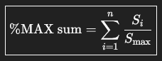

---
tags:
  - CICO
  - CICO 2026
---

# Catch Indonesia Cup Open 2026

The **Catch Indonesia Cup Open 2026** (***CICO 2026***) is a double-elimination 1v1 osu!catch tournament hosted by ::{ flag=ID }:: [Intel21](https://osu.ppy.sh/users/1272422), ::{ flag=SG }:: [Ekseff](https://osu.ppy.sh/users/13966422), ::{ flag=ID }:: [Madoka Ayukawa](https://osu.ppy.sh/users/1595221), ::{ flag=ID }:: [Zvenx](https://osu.ppy.sh/users/14613788), and ::{ flag=ID }:: [Constantine](https://osu.ppy.sh/users/3221898). Despite its name, the tournament is open to all osu!catch players from the around the world regardless of geographical location. It was the fourteenth iteration of the Catch the Beat Indonesia Cup, as well as the fourth one to be held under the "Open" format.

## Tournament schedule

| Event | Timestamp |
| --: | :-- |
| Registration phase | 2026-09-17/2026-09-30 |
| Screening phase | 2026-10-01/2026-10-18 |
| Qualifiers | 2026-10-19/2026-10-25 |
| Round of 32 | 2026-10-26/2026-11-01 |
| Round of 16 | 2026-11-02/2026-11-08 |
| Quarterfinals | 2026-11-09/2026-11-15 |
| Semifinals | 2026-11-16/2026-11-22 |
| Finals (week 1) | 2026-11-23/2026-11-29 |
| Finals (week 2) | 2026-11-30/2026-12-06 |

## Prizes

The Catch Indonesia Cup Open 2026 offered the following initial prize pool as generously donated by ::{ flag=ID }:: [Intel21](https://osu.ppy.sh/users/1272422) and ::{ flag=SG }:: [Ekseff](https://osu.ppy.sh/users/13966422). This prize pool was further increased from community donations through [Ko-Fi](https://ko-fi.com/oci).

| Placing | Prize(s) |
| :-: | :-- |
|  | Unique profile badge, *more TBA* |
|  | *TBA* |
|  | *TBA* |

## Organisation

The Catch the Beat Indonesia Cup Open 2026 was run by various osu! community members from Indonesia and beyond.

| Position | Member(s) |
| :-- | :-- |
| Host | :::{ flag=ID }:: [Intel21](https://osu.ppy.sh/users/1272422), ::{ flag=SG }:: [Ekseff](https://osu.ppy.sh/users/13966422), ::{ flag=ID }:: [Madoka Ayukawa](https://osu.ppy.sh/users/1595221), ::{ flag=ID }:: [Zvenx](https://osu.ppy.sh/users/14613788), ::{ flag=ID }:: [Constantine](https://osu.ppy.sh/users/3221898) |
| Mappool selector | ::{ flag=ID }:: [Madoka Ayukawa](https://osu.ppy.sh/users/1595221), ::{ flag=ID }:: [Zvenx](https://osu.ppy.sh/users/14613788), ::{ flag=ID }:: [Dika312](https://osu.ppy.sh/users/741613), ::{ flag=KR }:: [Spectator](https://osu.ppy.sh/users/702598), ::{ flag=TW }:: [Beepu](https://osu.ppy.sh/users/4958376), ::{ flag=TN }:: [-Ken](https://osu.ppy.sh/users/4430811) |
| Custom mapper | *TBA* |
| Playtester | ::{ flag=FR }:: [Natsuko](https://osu.ppy.sh/users/8266817), ::{ flag=US }:: [Elux](https://osu.ppy.sh/users/12004983), ::{ flag=CL }:: [Pekorrat](https://osu.ppy.sh/users/1250096) |
| Streamer | *TBA* |
| Commentator | *TBA* |
| Referee | *TBA* |
| Design coordinator | ::{ flag=MY }:: [mochasan\_](https://osu.ppy.sh/users/23804364) |
| Graphic designer | ::{ flag=ID }:: [Niva](https://osu.ppy.sh/users/197805), ::{ flag=ID }:: [Zavier](https://osu.ppy.sh/users/11379592), ::{ flag=ID }:: [smsrdzc](https://osu.ppy.sh/users/38505034), ::{ flag=ID }:: [CubeixID200](https://osu.ppy.sh/users/10678919), ::{ flag=CA }:: [Aquatic\_3](https://osu.ppy.sh/users/22711091) |
| Illustrator | ::{ flag=ID }:: [Dreamxiety](https://osu.ppy.sh/users/13103233), ::{ flag=ID }:: [Rezukitazu](https://osu.ppy.sh/users/2499880), ::{ flag=SG }:: [Hecatia](https://osu.ppy.sh/users/8244635), ::{ flag=GB }:: [pericrayola](https://osu.ppy.sh/users/31184671), ::{ flag=ID }:: Minato [(↗)](https://twitter.com/minato28507), ::{ flag=ID }:: Reminisensi [(↗)](https://twitter.com/Reminisensi_), ::{ flag=VN }:: Utopia [(↗)](https://twitter.com/_Utopia_Hope) |
| Statisician | ::{ flag=SG }:: [lovemathboy](https://osu.ppy.sh/users/4220829) |
| Wiki/newspost | ::{ flag=ID }:: [Niva](https://osu.ppy.sh/users/197805), ::{ flag=SG }:: [Ekseff](https://osu.ppy.sh/users/13966422) |

## Links

- **[Official website](https://wybin.xyz/cico2026)**
- [Forum thread](TBA)
- [Discord server](https://discord.gg/YwAYbPa)
- [Challonge brackets](https://challonge.com/CICO2026)
- [Livestream channel](https://www.twitch.tv/osucatchid)

## Participants

To be announced.

## Ruleset

### General rules

1. Match lobbies across the tournament will adhere to the following room settings:
   - Team Mode: `Head-to-head`
   - Win Condition: [`ScoreV2`](/wiki/Gameplay/Score#scorev2)
2. The mappools for each round will be announced by the tournament management in advance before the actual matches take place.
3. Match schedules will be predetermined by the tournament management. If there are players who are unable to attend the current schedule for any reason, all affected players may apply and settle for a reschedule at the `#reschedule-request` channel in the tournament's Discord server.
4. A referee will create a multiplayer room ten minutes in advance and will start to send out invites.
5. If a player does not show up within **fifteen minutes** of the start time, their opponent gets to win by default.
6. If no staff or referee is available, the match will be postponed.
7. **No Fail will be enforced in all beatmaps.** This is to ensure that the points are to be awarded more fairly towards players who perform better in general during the course of the beatmap regardless of their remaining health at the end.
8. If a player disconnects, it will be treated as if they had failed the beatmap.
   - A match can be rematched for disconnects that occur within at most 30 seconds after it has been started or 25% of the beatmap's length, whichever happens first.
9. Lag is not a valid reason to nullify a beatmap.
10. If any problems during the match occur, the tournament management will make a decision based on the referee's report.
11. It is expected that players be polite and respectful to each other. Penalties will be given upon violation.
    - If a player is found to be engaging in an act that is deemed to be distasteful or provocative, the corresponding player may be disqualified right away from the tournament and/or blacklisted from future iterations of the tournament by the tournament management.
    - Usage of any tools or programs that are against the [osu! community rules](/wiki/Rules#community-rules) is strictly prohibited and will be reported to the [Tournament Committee](/wiki/People/Tournament_Committee).
12. The tournament management reservers the right to request for liveplays or recordings of individual players, as well to modify the rules (within reason) at any point which will be announced in advance.

### Tournament registration

1. Players are required to register into the tournament individually through [the tournament's official website](https://wybin.xyz/cico2026).
   - While the tournament is open to anyone, given the tournament's difficulty, players are recommended to have a strong proficiency in the osu!catch game mode upon entry.
2. To ensure that all incoming registrations are serious and valid, every registered player will be checked in detail by the tournament management.
3. The list of players who are deemed to be eligible to compete in the tournament will be published by the tournament management after the registration phase has ended.
4. Testplayers, referees, custom mappers, mappool selectors, and replayers may not participate as players in the tournament.
   - Eliminated players are free to enlist in any of these roles for the later stages of the tournament in accordance with the [official tournament support guidelines](/wiki/Tournaments/Official_support#staff).

### Round-specific rules

#### Qualifier rules

1. Players will have to sign up to one of the Qualifier lobbies that have been scheduled and prepared by the tournament management in advance.
2. In the lobby, players will have to consecutively play all of the Qualifier beatmaps in the order of NM1 -> NM2 -> NM3 -> HD1 -> HD2 -> HR1 -> HR2 -> DT1 -> DT2 twice for a total of two playthroughs.
   - An optional three minute break will be offered between the first and second playthrough of the mappool.
3. Players **are not allowed** to ban any beatmaps in the Qualifiers.
4. Players **are not allowed** to join (or register for) more than one Qualifier lobby.
5. Based on their performance in the Qualifier, players will be ranked based on their `%MAX` sum combined from each individual Qualifier beatmap as follows:

   - Where:
   - `Si` = score achieved by player `i` on the beatmap
   - `Smax` = highest score achieved by any player on that beatmap

6. The 32 players with the **highest `%MAX` sum** across all the Qualifier beatmaps will advance to the knock-out stages.
   - If there are two (or more) players who share the same `%MAX` sum, the player that holds the higher total raw score will be placed in the higher seed.
7. Failure to attend in any of the Qualifier lobbies will result in immediate elimination.

#### Knock-out stage rules

1. Players will be matched against each other based on their Qualifier seedings.
2. Players will compete against each other using the double-elimination system.
3. The double-elimination system works as follows:
   - Players that lose in the upper bracket can still play again in the lower bracket.
   - Players that lose in the lower bracket will be eliminated from the tournament.
   - In the Grand Final match, the winner of the upper bracket will only need to win a single match in order to claim the championship title. The winner of the lower bracket, however, will need to win two matches and enforce a *bracket reset* in order to clinch the championship title.
4. Players that can compete in the next round are determined by:
   - In the Round of 32 and the Round of 16, each player needs to win 5 points in order to win a match. (Best of 9)
   - In the Quarterfinals and the Semifinals, each player needs to win 6 points in order to win a match. (Best of 11)
   - In both of the Finals weeks, each player needs to win 7 points in order to win a match. (Best of 13)
   - Whether there are players that are declared to win the match by default.
   - Whether there are players that are disqualified from the tournament.

### Match regulations

1. Prior to starting the match, players must run the `!roll` command once in the multiplayer lobby in order to determine the banning and picking order. 
   - The winner of the `!roll` gets to determine who gets the first pick and the second ban.
   - The loser of the `!roll` gets the opposite by default.
   - This rule does not apply in the Qualifier lobbies.
2. Players will have to ban **two beatmaps** from the corresponding mappool. These beatmaps will not be allowed to be picked by any player during the entire match. 
   - Barring the tiebreaker, there are no restrictions as to which beatmaps may and may not be banned in a match.
   - Banning does not apply in the Qualifier lobbies.
3. Players will be given a chance to pick **one warm-up beatmap** to be played in the lobby.
   - Playing a warm-up beatmap is not mandatory, and players may elect to skip their warm-up pick should they wish to.
4. Players are expected to exercise common sense in the pick time and ready time windows.
   - Depending on the severity and frequency, players will be punished for their misdemeanours during these time windows. For the list of all the possible punishments, please refer to [this screenshot](https://leopard.hosting.pecon.us/dl/hzlkt).
5. Maps from the same mod pool **may not be picked by the same player twice in a row**.
   - For example, following a NM1 pick, the same player may not pick another map from the No Mod pool on their next picking turn.   
6. In a Hard Rock or Double Time pick, the Hidden mod may optionally be used by players on top of the respective mods.   
7. In a Free Mod pick, players have to apply at least one mod to play the beatmap with. Allowed mods are Easy, Hard Rock, Hidden, or any possible combinations of the three mods. 
   - Playing a Free Mod pick without any mods applied is not allowed.
8. In the case of a tiebreaker, the tiebreaker map will be played with the Free Mod option enabled. Players are free to play the tiebreaker map with the Hidden mod should they wish to. 
   - Playing the tiebreaker map with a mod is *not* mandatory.
7. The results of each match and any other relevant information regarding the match will be noted by the referee after the match has been concluded.
