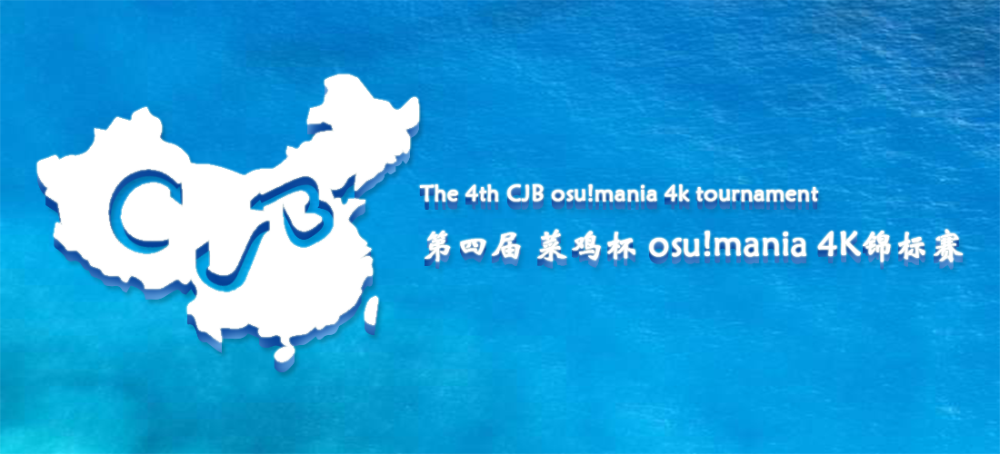
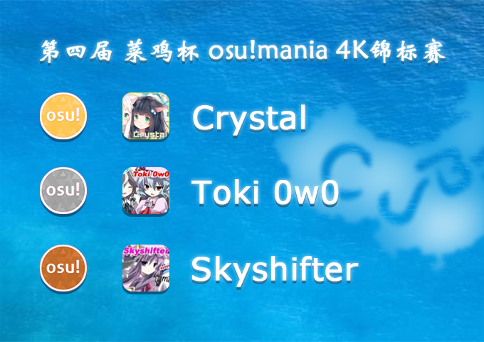

---
tags:
  - CJB
  - CJB 2018
  - CJB2018
---

# 第四届 osu!mania 4K 菜鸡杯

第四届 osu!mania 4K 菜鸡杯（以下均简写为 CJB 4K 4th）为华人区个人比赛，是由 CJB 举办的第四届华人区 osu!mania 4K 大赛。比赛所用谱面均为 osu!mania 4K 专用谱。

## 比赛时间表

| 阶段 | 时间 |
| --: | :-- |
| 报名 | 7月2日至7月13日 |
| 抽签仪式 | 7月14日(20:30 UTC+8) |
| 十六强 | 7月21日至7月22日 |
| 八强 | 7月28日至7月29日 |
| 半决赛 | 8月4日至8月5日 |
| 决赛第一周 | 8月11日 |
| 决赛第二周 | 8月13日至8月14日 |

## 奖品

本次比赛奖品由 ::{ flag=CN }:: [hans1999](https://osu.ppy.sh/users/6679329) 赞助。

| 名次 | 奖品 |
| :-: | :-- |
|  | 2个月 osu!支持者，主页定制勋章 |
|  | 1个月 osu!支持者 |
|  | 15 CNY |

## 工作人员

| 职位 | 成员 |
| :-: | :-- |
| 比赛经理 | ::{ flag=CN }:: [hans1999](https://osu.ppy.sh/users/6679329)、::{ flag=CN }:: [Flow Light](https://osu.ppy.sh/users/6705256) |
| 比赛监督 | ::{ flag=CN }:: [SSV Normandy](https://osu.ppy.sh/user/6475977) |
| 图池管理 | ::{ flag=CN }:: [Tofu1222](https://osu.ppy.sh/user/6089608)、::{ flag=CN }:: [hans1999](https://osu.ppy.sh/users/6679329) |
| 直播裁判 | ::{ flag=CN }:: [aiyulu](https://osu.ppy.sh/user/189617)、::{ flag=CN }:: [Rasis](https://osu.ppy.sh/user/1209363)、::{ flag=CN }:: [Flow Light](https://osu.ppy.sh/users/6705256)、::{ flag=CN }:: [kj415j45](https://osu.ppy.sh/users/9367540) |
| 解说团队 | ::{ flag=CN }:: [hans1999](https://osu.ppy.sh/users/6679329)、::{ flag=CN }:: [Flow Light](https://osu.ppy.sh/users/6705256)、::{ flag=CN }:: [Rasis](https://osu.ppy.sh/user/1209363)、::{ flag=CN }:: [644520858](https://osu.ppy.sh/users/5507069)、::{ flag=CN }:: [wuhuanmin](https://osu.ppy.sh/user/935322) 、::{ flag=CN }:: [704661982](https://osu.ppy.sh/user/7080633) |
| wiki | ::{ flag=CN }:: [kj415j45](https://osu.ppy.sh/users/9367540) |

## 相关链接

- [Rasis 直播间](https://live.bilibili.com/5333)
- [Flow Light 直播间](https://live.bilibili.com/73668)
- [aiyulu 直播间](https://live.bilibili.com/10183)
- [比赛 QQ 群](https://jq.qq.com/?_wv=1027&k=5sTdKLp)
- [Challonge](https://challonge.com/zh_CN/cjb4)

## 图池

### 决赛第二周

**下载完整图池包！（97.9M） - [百度云盘](https://pan.baidu.com/s/1-gKsm-Mcnt-ayLZDKvVYyw) - [Google 云端硬盘](https://drive.google.com/file/d/1vwasJMXpsCr4ibxvncxIOU29r7SehV2Q)**

- FreeMod
  1. [Memme - Acid Burst \[Chaos\]](https://osu.ppy.sh/beatmapsets/724670#mania/1530202)
  2. [Camellia - Proluvies \[\_ t h i n k i n g \_\]](https://osu.ppy.sh/beatmapsets/715014#mania/1510819)
  3. [CELLON. - Virtual Mode \[V17tu4L\]](https://osu.ppy.sh/beatmapsets/661197#mania/1399891)
  4. [Venetian Snares - She Runs \[Breakaway\]](https://osu.ppy.sh/beatmapsets/448086#mania/961767)
  5. [EZFG - Cyber Thunder Cider \[Thunder\]](https://osu.ppy.sh/beatmapsets/621901#mania/1311259)
  6. [Round Wave Crusher & KafkaType - Am I Scary? \[Yandere\]](https://osu.ppy.sh/beatmapsets/476582#mania/1017965)
  7. [xi - PEACE BREAKER \[devastation (NSV)\]](https://osu.ppy.sh/beatmapsets/827204#mania/1733416)
  8. [Hommarju - Rock It \[aLNother\]](https://osu.ppy.sh/beatmapsets/725793#mania/1532410)
  9. [Chroma - I \[Arpia's Exhaust\]](https://osu.ppy.sh/beatmapsets/738673#mania/1620056)
  10. [ZUN arr.Myon - Plastic Mind \[snover's Phantasm\]](https://osu.ppy.sh/beatmapsets/361936#mania/795044)
  11. [xi - Glorious Crown \[Chicken's 4K Extra\]](https://osu.ppy.sh/beatmapsets/474900#mania/1014639)
  12. [Pegboard Nerds - Swamp Thing (Da Tweekaz Edit) \[Ekstremalny\]](https://osu.ppy.sh/beatmapsets/597699#mania/1634508)
  13. [uma vs. Morimori Atsushi - Re:End of a Dream \[KK's Extra\]](https://osu.ppy.sh/beatmapsets/531425#mania/1146184)
  14. [Assertive Fluttershy - Sorairo Days \[Hard\]](https://osu.ppy.sh/beatmapsets/740579#mania/1562379)
- Tiebreaker
  1. **[Camellia feat. Nanahira - Bassdrop Freaks \[TofuStar's Bassdrop Maniac\]](https://osu.ppy.sh/beatmapsets/635897#mania/1349433)**

### 决赛第一周

**下载完整图池包！（148M） - [百度云盘](https://pan.baidu.com/s/1cQEbBQhW57IaS4Gba5uETw) - [Google 云端硬盘](https://drive.google.com/file/d/1WcvhPLepOb8Zaw5RFIXh1jgvHHTOloy6)**

- FreeMod
  1. [Hitori Tori - perthed again (yambabom remix) \[Insane\]](https://osu.ppy.sh/beatmapsets/569392#mania/1277797)
  2. [Silent Siren - Hachigatsu no Yoru \[Ano Yoru wo\]](https://osu.ppy.sh/beatmapsets/658021#mania/1393738)
  3. [Ruby My Dear - 7C0 \[Exposure\]](https://osu.ppy.sh/beatmapsets/783677#mania/1645555)
  4. [LeaF - 4th smile \[Prosperity\]](https://osu.ppy.sh/beatmapsets/589173#mania/1247978)
  5. [AAAA Chazuke - Hop Step Adventure* \[Insane\]](https://osu.ppy.sh/beatmapsets/574576#mania/1216879)
  6. [MYUKKE. - Shera \[VERMILION\]](https://osu.ppy.sh/beatmapsets/708675#mania/1498129)
  7. [Morimori Atsushi - Paradigm Shift \[CS' Another\]](https://osu.ppy.sh/beatmapsets/765055#mania/1608657)
  8. [Kaneko Chiharu - Kai Dan \[Lude's Oni\]](https://osu.ppy.sh/beatmapsets/623951#mania/1317018)
  9. [Freezer feat. Kiichigo - Berry Go!! \[BERRY HARD\]](https://osu.ppy.sh/beatmapsets/677465#mania/1432754)
  10. [Erehamonika remixed k - Der Wald (kors k Remix) \[Insane\]](https://osu.ppy.sh/beatmapsets/582342#mania/1232365)
  11. [kemu - Ikasama Life Game \[Smith's MX\]](https://osu.ppy.sh/beatmapsets/469204#mania/1082620)
  12. [Drop - Dancer of Saramandora \[Crimson Dance\]](https://osu.ppy.sh/beatmapsets/526129#mania/1116480)
  13. [EBIMAYO - GOODTEK \[4K Another\]](https://osu.ppy.sh/beatmapsets/369069#mania/808998)
  14. [DJ Sharpnel - TAKECORE OF YOURSELF \[1.0x\]](https://osu.ppy.sh/beatmapsets/480479#mania/1026063)
- Tiebreaker
  1. **[KASAI HARCORES - Cycle Hit \[Out Of The Park\]](https://osu.ppy.sh/beatmapsets/682668#mania/1443660)**

### 半决赛

**下载完整图池包！（90.2M） - [百度云盘](https://pan.baidu.com/s/1cXXo6INlZDboM7Bgq3bJQQ) - [Google 云端硬盘](https://drive.google.com/file/d/1km4zpC_oEOCU5WBejfsQD5X4WaPjNwIi)**

- FreeMod
  1. [X&G - Whiplash ft. josh pan (sakuraburst Remix) \[break out\]](https://osu.ppy.sh/beatmapsets/723633#mania/1527737)
  2. [Nekomata Master - Avalon no oka \[Adventure\]](https://osu.ppy.sh/beatmapsets/799580#mania/1678769)
  3. [senya - Tsuzurenu Mori no Shoujo \[LN\]](https://osu.ppy.sh/beatmapsets/704155#mania/1489611)
  4. [Yooh - Electronic Sound Lab \[Extra\]](https://osu.ppy.sh/beatmapsets/495629#mania/1464037)
  5. [LeaF - Paraclete \[Hard Lv.12\]](https://osu.ppy.sh/beatmapsets/565112#mania/1194465)
  6. [Memme - Goat Fantasia \[Insanity\]](https://osu.ppy.sh/beatmapsets/515178#mania/1094101)
  7. [The Ghost of 3.13 - Path To Nowhere \[Hopeless\]](https://osu.ppy.sh/beatmapsets/422800#mania/913882)
  8. [Shiraishi - Moon-gate \[k\]](https://osu.ppy.sh/beatmapsets/622851#mania/1312959)
  9. [Schubert - Introduction And Variations 'Trockne Blumen' Variation 5 Remix&Arrange \[4K Irrsinnig\]](https://osu.ppy.sh/beatmapsets/557139#mania/1178997)
  10. [YUC'e - PUMP \[Future Candy\]](https://osu.ppy.sh/beatmapsets/645301#mania/1367425)
  11. [kors k - Playing with Fire (Sota Fujimori Remix) \[Dancing Blaze\]](https://osu.ppy.sh/beatmapsets/484214#mania/1032948)
  12. [Various Artists - Ichigaki's 4K Collection Vol.2 \[Oriens[Another]\]](https://osu.ppy.sh/beatmapsets/417215#mania/903482)
  13. [t+pazolite - QLWA \[EXTRA\]](https://osu.ppy.sh/beatmapsets/543543#mania/1152058)
  14. [DJ SEVEN P'n'B Remix - To Dimension \[IcyWorld's Lv.15\]](https://osu.ppy.sh/beatmapsets/657155#mania/1392067)
- Tiebreaker
  1. **[kamome sano - \</emotional\> \[Tranquility\]](https://osu.ppy.sh/beatmapsets/660397#mania/1398383)**

### 八强

**下载完整图池包！（64.1M） - [百度云盘](https://pan.baidu.com/s/12PJbnBexbpXRb1puGiv2dw) - [Google 云端硬盘](https://drive.google.com/open?id=1gnaRjpbQFQ081cpWS4ATQwNLfPEElyFP)**

- FreeMod
  1. [So Sus + Konka - Acorn \[Hard\]](https://osu.ppy.sh/beatmapsets/639057#mania/1540124)
  2. [M2U feat. Guriri - Magnolia \[Stage 3: Enlightenmen\]](https://osu.ppy.sh/beatmapsets/706898#mania/1494548)
  3. [Mind Vortex - Arc \[Coordination\]](https://osu.ppy.sh/beatmapsets/619512#mania/1305835)
  4. [REOL - YoiYoi Kokon \[Challenge: EASY\]](https://osu.ppy.sh/beatmapsets/676191#mania/1434529)
  5. [Toyama Nao - Ima Koko \[Koi\]](https://osu.ppy.sh/beatmapsets/631143#mania/1350893)
  6. [M2U - Nightmare \[Desolation\]](https://osu.ppy.sh/beatmapsets/665005#mania/1407494)
  7. [yak_won - Lucid \[MX\]](https://osu.ppy.sh/beatmapsets/200945#mania/476043)
  8. [LUZE & Emew. - Unmeiron \[Hyper\]](https://osu.ppy.sh/beatmapsets/475927#mania/1022067)
  9. [goreshit - o'er the flood \[deluge\]](https://osu.ppy.sh/beatmapsets/497750#mania/1552320)
  10. [Camellia - K.Y.A.F.A. \[Insane\]](https://osu.ppy.sh/beatmapsets/468440#mania/1005027)
  11. [Rokugen Alice - Statice ga Nemuru Oka \[StarLon's Endless Nightmare\]](https://osu.ppy.sh/beatmapsets/362917#mania/802995)
  12. [Izumi Akazawa - Responsibility Response \[Insane\]](https://osu.ppy.sh/beatmapsets/565606#mania/1196279)
- Tiebreaker
  1. **[nayuta - Nijiiro Kekkai, Gekkyou no Goku \[Prison of Lunacy\]](https://osu.ppy.sh/beatmapsets/751553#mania/1582170)**

### 十六强

**下载完整图池包！（77.5M） - [百度云盘](https://pan.baidu.com/s/1eSHYDVS7u53S3gzmFK71oA) - [Google 云端硬盘](https://drive.google.com/file/d/1ZNekV5Lh6pw3qgl9BuWEs6CN6dSpOl8N)**

- FreeMod
  1. [Loos - Koi Yumi Zakura \[Stage 4: Story\]](https://osu.ppy.sh/beatmapsets/791641#mania/1660726)
  2. [Porter Robinson - Flicker \[SV Heaven\]](https://osu.ppy.sh/beatmapsets/490560#mania/1045578)
  3. [Helblinde - Heaven's Fall \[Bye4Now's Advanced\]](https://osu.ppy.sh/beatmapsets/507745#mania/1298653)
  4. [Hinatabi Bitter Sweets - Otome Ryouran Mai Sakihokore \[HARD\]](https://osu.ppy.sh/beatmapsets/305110#mania/892179)
  5. [DJ TOTTO - Crystalia \[CS' Hyper\]](https://osu.ppy.sh/beatmapsets/782749#mania/1643587)
  6. [The Quick Brown Fox - The Big Black \[Challenge\]](https://osu.ppy.sh/beatmapsets/708264#mania/1497402)
  7. [cYsmix - Breeze \[Hard\]](https://osu.ppy.sh/beatmapsets/639924#mania/1357114)
  8. [FictionJunction YUUKA - Yakusoku \[Pinky Swear\]](https://osu.ppy.sh/beatmapsets/594912#mania/1258189)
  9. [goreshit - burn this moment into the retina of my eye \[Retina\]](https://osu.ppy.sh/beatmapsets/685427#mania/1450885)
  10. [xi - .357 Magnum \[Hyper\]](https://osu.ppy.sh/beatmapsets/155749#mania/564542)
  11. [senya - Zetsubou no Fuchi \[540's Hard\]](https://osu.ppy.sh/beatmapsets/709521#mania/1500034)
  12. [ak+q - Excelsia \[Stage 5: Freestyle\]](https://osu.ppy.sh/beatmapsets/791699#mania/1660811)
- Tiebreaker
  1. **[Tanya Degurechaff - Los! Los! Los! \[Insane\]](https://osu.ppy.sh/beatmapsets/584316#mania/1236183)**

## 比赛结果

### 决赛第二周

| 编号 | 2018-08-13，星期一 |  |  |  |  |
| :-: | --: | :-: | :-: | :-- | :-- |
| 29 | Skyshifter ::{ flag=CN }:: | 2 | **7** | ::{ flag=CN }:: **Toki 0w0** |  |

| 编号 | 2018-08-14，星期二 |  |  |  |  |
| :-: | --: | :-: | :-: | :-- | :-- |
| 30 | Crystal ::{ flag=CN }:: | 4 | **7** | ::{ flag=CN }:: **Toki 0w0** |  |
| 31 | Toki 0w0 ::{ flag=CN }:: | 5 | **7** | ::{ flag=CN }:: **Crystal** |  |

### 决赛第一周

| 编号 | 2018-08-11，星期六 |  |  |  |  |
| :-: | --: | :-: | :-: | :-- | :-- |
| 25 | **Toki 0w0** ::{ flag=CN }:: | **6** | 3 | ::{ flag=CN }:: xyxyxy091 |  |
| 26 | Zhou_Kai ::{ flag=TW }:: | 5 | **6** | ::{ flag=CN }:: **IA daisuki** |  |
| 28 | Skyshifter ::{ flag=CN }:: | 3 | **6** | ::{ flag=CN }:: **Crystal** |  |
| 27 | **Toki 0w0** ::{ flag=CN }:: | **6** | 0 | ::{ flag=CN }:: IA daisuki |  |

### 半决赛

| 编号 | 2018-08-04，星期六 |  |  |  |  |
| :-: | --: | :-: | :-: | :-- | :-- |
| 20 | **xyxyxy091** ::{ flag=CN }:: | **1** | 0 | ::{ flag=CN }:: crazybrother | WBD |
| 23 | **Skyshifter** ::{ flag=CN }:: | **6** | 3 | ::{ flag=CN }:: Toki 0w0 |  |
| 24 | **Crystal** ::{ flag=CN }:: | **6** | 2 | ::{ flag=TW }:: Zhou_Kai |  |
| 19 | nickawm ::{ flag=CN }:: | 0 | **1** | ::{ flag=CN }:: **tuziel** | WBD |

| 编号 | 2018-08-05，星期日 |  |  |  |  |
| :-: | --: | :-: | :-: | :-- | :-- |
| 18 | **IA daisuki** ::{ flag=CN }:: | **1** | 0 | ::{ flag=CN }:: FDchuxin | WBD |
| 21 | **IA daisuki** ::{ flag=CN }:: | **6** | 0 | ::{ flag=CN }:: williammak |  |
| 22 | **xyxyxy091** ::{ flag=CN }:: | **6** | 2 | ::{ flag=CN }:: tuziel |  |

### 八强

| 编号 | 2018-07-28，星期六 |  |  |  |  |
| :-: | --: | :-: | :-: | :-- | :-- |
| 11 | **FDchuxin** ::{ flag=CN }:: | **1** | 0 | ::{ flag=CN }:: macronj | WBD |
| 9 | **xyxyxy091** ::{ flag=CN }:: | **1** | 0 | ::{ flag=CN }:: tc582461 | WBD |
| 12 | **williammak** ::{ flag=CN }:: | **5** | 1 | ::{ flag=CN }:: Shindou Ayane |  |
| 16 | **Zhou_Kai** ::{ flag=TW }:: | **5** | 1 | ::{ flag=CN }:: crazybrother |  |
| 15 | nickawm ::{ flag=CN }:: | 0 | **5** | ::{ flag=CN }:: **Crystal** |  |

| 编号 | 2018-07-29，星期日 |  |  |  |  |
| :-: | --: | :-: | :-: | :-- | :-- |
| 13 | Jazzsoldiers ::{ flag=CN }:: | 0 | **1** | ::{ flag=CN }:: **Skyshifter** | WBD |
| 10 | **tuziel** ::{ flag=CN }:: | **5** | 0 | ::{ flag=CN }:: Snowkyou |  |
| 14 | IA daisuki ::{ flag=CN }:: | 0 | **5** | ::{ flag=CN }:: **Toki 0w0** |  |

注：::{ flag=CN }:: Jazzsoldiers 因故放弃比赛。

### 十六强

| 编号 | 2018-07-21，星期六 |  |  |  |  |
| :-: | --: | :-: | :-: | :-- | :-- |
| 5 | FDchuxin ::{ flag=CN }:: | 0 | **1** | ::{ flag=CN }:: **nickawm** | WBD |
| 1 | xyxyxy091 ::{ flag=CN }:: | 0 | **5** | ::{ flag=CN }:: **Jazzsoldiers** |  |
| 2 | **Skyshifter** ::{ flag=CN }:: | **5** | 1 | ::{ flag=CN }:: tc582461 |  |
| 6 | macronj ::{ flag=CN }:: | 1 | **5** | ::{ flag=CN }:: **Crystal** |  |

| 编号 | 2018-07-22，星期日 |  |  |  |  |
| :-: | --: | :-: | :-: | :-- | :-- |
| 4 | tuziel ::{ flag=CN }:: | 2 | **5** | ::{ flag=CN }:: **Toki 0w0** |  |
| 3 | Snowkyou ::{ flag=CN }:: | 0 | **5** | ::{ flag=CN }:: **IA daisuki** |  |
| 7 | **Zhou_Kai** ::{ flag=TW }:: | **5** | 0 | ::{ flag=CN }:: Shindou Ayane |  |
| 8 | **crazybrother** ::{ flag=CN }:: | **5** | 0 | ::{ flag=CN }:: williammak |  |

## 规则

### 总览

1. 本次比赛无资格赛和小组赛，报名通过的玩家将直接进入淘汰赛
2. 本次比赛为双败赛制，即胜者进入下一阶段而败者进入败者组。
3. 获胜条件：
   - 16强和1/4决赛为 9局 5胜。
   - 半决赛与决赛第一周为 11局 6胜。
   - 决赛第二周为 13局 7胜。
4. 原则上每个比赛阶段占用一个周末。
5. 所有的比赛均在 UTC+8 时区的周末进行。
6. 比赛具体安排将在比赛开始前一周由比赛组委会发布。若有选手特殊声明部分时间无法参加比赛，组委会将尽量根据参赛选手提供的可行时间对比赛时间进行协调，但不能保证可完全协调：
   - 若选手使用特殊的时区，请提前告知组委会。
   - 除时区问题以外，选手未能按时参赛的，不论提前声明与否，仍然依照缺席处理。

### 比赛规则

1. 第四届 osu!mania 4K 菜鸡杯（以下均简写为 CJB 4K 4th）为华人区个人比赛，是由 CJB 团队举办的第四届华人区 osu!mania 4K 大赛。比赛所用谱面均为 osu!mania 4K 专用谱。
2. 每场比赛的图池将于比赛前一周的周末由图池管理员放出：
   - 其中的 Tiebreaker（决胜）谱面仅用于决胜局比赛。
   - 所有谱面均为 Free-mod。
3. 比赛日程将由组委会讨论公布（组委会名单见公告）。
4. 若工作人员与统计员均不能就位，比赛将会被推迟。
5. 比赛中如出现 Failed 情况，即使分高也视为负手。
6. 选手可以使用自己的皮肤与视频设置。
7. 如果出现平局情况，则该场比赛视作无效。
8. 当选手掉线时，如果能够继续完成比赛，则应当在比赛结束后（使用 `Shift+F12`）立刻上传分数界面截图并提供网址。
9. 如果选手因为掉线直接跳出房间界面而未能完成该图，则按以下方法处理：
   - 在比赛开始 30 秒内发生的，应予以重赛。
   - 否则视作失败（Failed）。
10. 除非某张谱面的比赛结果被列为无效，否则任何谱面不能两次被用于同场比赛。
11. 如果比赛选手因为特殊原因无法出席，最多允许等待 10 分钟，十分钟后做视为弃权。
12. 选手自行确保比赛游戏过程中其游戏与操作系统的流畅性，例如以下情况不能重赛（包括但不限于）：
    - 网络原因导致的延迟、卡顿现象。
    - 系统弹出其他应用的通知或窗口。
    - 硬件故障。
13. 任何列出情况之外的意外将交由组委会讨论处理。
14. 任何规则的修改都将提前公示。
15. 组委会保留公示内容优先使用简体中文的权利。

### 报名参赛

1. 每位参赛者应当独立报名（进入 [比赛 QQ 群](https://jq.qq.com/?_wv=1027&k=5sTdKLp) 阅读群公告内容进行报名）。
2. 玩家满足以下条件的可以报名参加 CJB 4K 4th：
   - 玩家注册地区在亚洲。
   - 玩家使用汉语作为主要语言。
   - 本次比赛需要 mania 模式 **4K 单图最高 pp 不超过 285** 且 **4K 前五 pp 总和不超过 1350** 的玩家参赛。
   - 如果参赛者在过去一年内于 osu!社区 或在比赛中有过不良记录，我们可能会取消其参赛资格。
   - 本次比赛报名人数上限为16人，报满截止。
3. 报名成功的选手将收到确认邮件，同时也将被加入公示名单。
4. 图池管理和比赛经理不得参赛。

### 图池说明

1. 16强、1/4决赛、半决赛、决赛第一周、决赛第二周各有一个图池。图池地图数根据赛程变化：
   - 16强与1/4决赛各有13张图。
   - 半决赛、决赛第一周和决赛第二周各有15张图。
2. 每一个图池包括一个决胜图（Tiebreaker）。
3. 所有地图，包括决胜图，都使用 Free-mod 进行。

### 比赛流程

1. 一位记录员会在赛事开始前15分钟创建一个在线多人游戏房间（Multiplayer），选手需要在此时集合：
   - 房间设定为“osu!mania, Team VS，胜出条件：**Score v2**”。房间名称为“CJB4K:(一号玩家) vs (二号玩家)”。
   - 以上房间名提到的两个玩家，前者必须在1号位，后者必须在2号位。
2. 两位选手任选两张热身图，但有异议的图不可使用。所有地图必须是 4K 专用地图。
3. 每位选手从图池中选择1个禁手图（Banned Map），这些禁手图将在这场比赛中不能被任何选手选用。
4. 比赛开始后，两位玩家必须在 `#multiplayer` 频道使用一次 `!roll` 指令：
   - 点数较低者先开始选择禁手图，然后是另一位选手。
   - 点数较高者开始选择比赛图，然后交替选图。
   - 点数相等时，重新开始 `!roll`。
5. 两名选手交替从图池中选择比赛图：
   - 出现平局时（双方均差1分赢得比赛），选手必须使用决胜图（Tiebreaker）作为下一张比赛地图。
