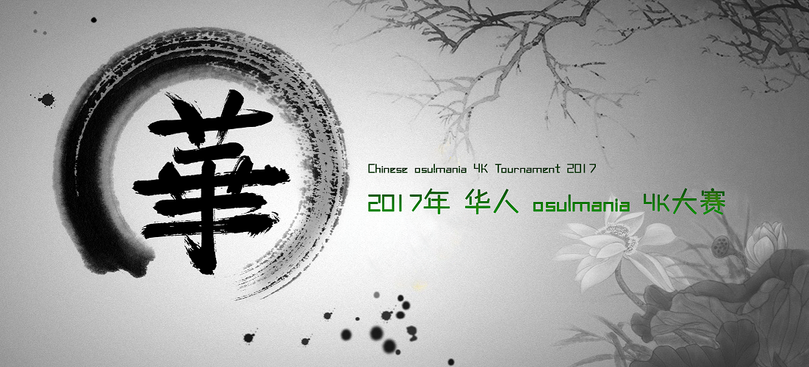
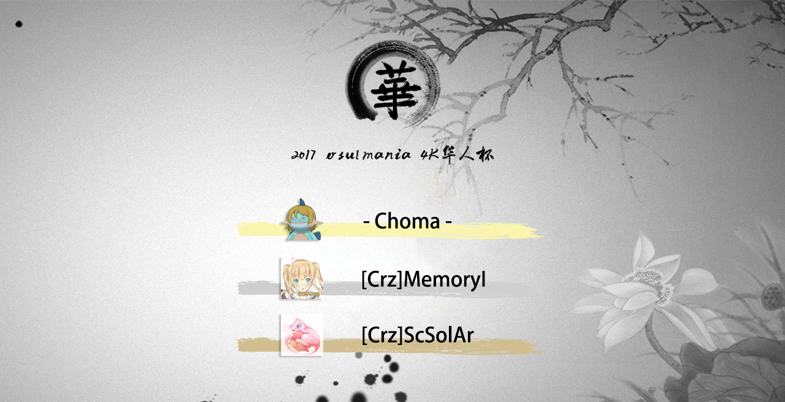

# 2017年華人 osu!mania 4K 大賽

 **2017年華人 osu!mania 4K 大賽**（以下均簡寫為**CMT 4K 2017**）為華人區個人比賽，是由 CMT 團隊舉辦的第二屆華人 osu!mania 4K 大賽。比賽所用地圖均為 osu!mania 4K 專用譜。

## 比賽時間表

| 階段 | 時間 |
| --: | :-- |
| 報名 | 6月4日至6月18日 |
| 資格賽 | 6月24日至6月25日 |
| 小組抽籤 | 6月25日(20:00 UTC+8) |
| 小組賽 | 6月30日至7月2日 |
| 十六強賽 | 7月8日至7月9日 |
| 八強賽 | 7月15日至7月16日 |
| 半決賽 | 7月22日至7月23日 |
| 決賽第一周 | 7月29日至7月30日 |
| 決賽第二周 | 8月5日至8月6日 |

## 比賽獎品

本次比賽獎品由音游網和漢斯共同贊助，鍵盤由 CrazyBoard 提供。
 3個月 osu! 支持者，主頁訂製勳章，CrazyBoard Mark One 鍵盤；
 2個月 osu! 支持者；
 1個月 osu! 支持者。

## 比賽主辦團隊

| 團隊 | 人員 |
| --: | :-- |
| 比賽經理 | ::{ flag=CN }:: [hans1999](https://osu.ppy.sh/users/6679329)、::{ flag=CN }:: [Scslag](https://osu.ppy.sh/users/6705256) |
| 比賽監督 | ::{ flag=CN }:: [SSV Normandy](https://osu.ppy.sh/users/6475977) |
| 圖池管理團隊 | ::{ flag=GB }:: [Imperial Wolf](https://osu.ppy.sh/users/9080296)、::{ flag=TW }:: [Spy](https://osu.ppy.sh/users/1217122)、::{ flag=CN }:: [hans1999](https://osu.ppy.sh/users/6679329) |
| 直播裁判團隊 | ::{ flag=CN }:: [aiyulu](https://osu.ppy.sh/users/189617)、::{ flag=CN }:: [Rasis](https://osu.ppy.sh/users/1209363)、::{ flag=CN }:: [Ookura Asahi](https://osu.ppy.sh/users/4786951) |
| 解說團隊 | ::{ flag=CN }:: [hans1999](https://osu.ppy.sh/users/6679329)、::{ flag=CN }:: [Scslag](https://osu.ppy.sh/users/6705256)、::{ flag=CN }:: [Rasis](https://osu.ppy.sh/users/1209363)、::{ flag=CN }:: [644520858](https://osu.ppy.sh/users/5507069)、::{ flag=CN }:: [wuhuanmin](https://osu.ppy.sh/users/935322) |
| Wiki 制作、維護 | ::{ flag=CN }:: [kj415j45](https://osu.ppy.sh/users/kj415j45)、 ::{ flag=CN }:: [Ookura Asahi](https://osu.ppy.sh/users/4786951) |

## 比賽直播間

Bilibili 直播平台：[aiyulu](http://live.bilibili.com/10183)（主直播），[Ookura Asahi](http://live.bilibili.com/272810)（副直播），[Rasis](http://live.bilibili.com/5333)（備用）。
Twitch 直播平台：[aiyulu](https://www.twitch.tv/aiyulu)。

## 比賽圖池

### 決賽、總決賽

[**點此下載全部**](https://1drv.ms/users/s!AuGED5b9f0uloUllsnHx59aQyaoa)

- FreeMod
  1. [Various Artist - Jungdongjin's 5th LN Pack (Jungdongjin) \[nanahira -Tsukitourou\]](https://osu.ppy.sh/beatmapsets/617068#mania/1301846)
  2. [LeaF - Shitsubou Choco (arcwinolivirus) \[4K LN 'Imperial Chocolate\]](https://osu.ppy.sh/beatmapsets/602887#mania/1273424)
  3. [Nanahoshi Kangengakudan - IMAGINARY LIKE THE JUSTICE (shuniki) \[ShuChan!!\]](https://osu.ppy.sh/beatmapsets/550148#mania/1165250)
  4. Zekk - Swampgator \[Alligator VIP\]
  5. [Camellia - Backbeat Maniac (Evening) \[Rewind VIP\]](https://osu.ppy.sh/beatmapsets/586848#mania/1242696)
  6. [((LMB)) - Buntan \~Falling in "B" mix\~ (Tidek) \[%UN%D3%Ri%0Y\]](https://osu.ppy.sh/beatmapsets/569225#mania/1206728)
  7. [DJKurara - Japanese Transformation (XeoStyle) \[Extra\]](https://osu.ppy.sh/beatmapsets/520438#mania/1105693)
  8. [LV.4 - Angel dust (2016 Radio Mix) (Fullerene-) \[Shift\]](https://osu.ppy.sh/beatmapsets/598874#mania/1265848)
  9. [xi - Let's madness (Imperial Wolf) \[R U Ready?\]](https://osu.ppy.sh/beatmapsets/527017#mania/1118209)
  10. [xi - FREEDOM DiVE (razlteh) \[Fullerene's 4K DIMENSIONS\]](https://osu.ppy.sh/beatmapsets/173612#mania/473228)
  11. [YZYX - Powerflux (Shoegazer) \[Challenge\]](https://osu.ppy.sh/beatmapsets/390410#mania/850891)
  12. Vixenvy - I'm sorry we really suck. \[for the best\]
  13. [UNDEAD CORPORATION - Everything Will Freeze (Meggumi) \[Time Freeze\]](https://osu.ppy.sh/beatmapsets/298452#mania/673308)
  14. [Camellia - EMPIRE OF FLAME (Fresh Chicken) \[GRAVITY\]](https://osu.ppy.sh/beatmapsets/415934#mania/901134)
  15. [Yu_Asahina - Trickstarz (hi19hi19) \[STEPMANIA\]](https://osu.ppy.sh/beatmapsets/349432#mania/770548)
  16. [plastic feat.Sakito - Hitsugi to Futago (snoverpk) \[4KEY//PHANTASM\]](https://osu.ppy.sh/beatmapsets/516255#mania/1097111)
- Tiebreaker
  1. **Camellia - GHOST \[Immoral Night Guard\]**

### 半決賽

[**點此下載全部**](https://1drv.ms/users/s!Akj69f-fUdi3hSV0mmh3EYXWfOwz)

- FreeMod
  1. Mick Gordon - Cyberdemon \[Lazarus\]
  2. [Hitori Tori - perthed again (yambabom remix) (TheToaphster) \[Difficulty 3\]](https://osu.ppy.sh/beatmapsets/569392#mania/1207006)
  3. [LeaF - MEPHISTO (arcwinolivirus) \[4K LN Massacre\]](https://osu.ppy.sh/beatmapsets/535700#mania/1134593)
  4. [yanaginagi - landscape (shuniki) \[ShuChan!!\]](https://osu.ppy.sh/beatmapsets/541027#mania/1147214)
  5. [DJ Sharpnel - TACTICAL RAILROAD (Cyssel) \[EXTREME\]](https://osu.ppy.sh/beatmapsets/527532#mania/1119190)
  6. [a\_hisa - Cheshire's dance (TheToaphster) \[LN Dancing\]](https://osu.ppy.sh/beatmapsets/555278#mania/1175264)
  7. [Camellia - Shun no Shifudo o Ikashita Kare Fumi Paeria (XeoStyle) \[Octodad Twerk Theme\]](https://osu.ppy.sh/beatmapsets/486138#mania/1036648)
  8. [Kaneko Chiharu - iLLness LiLin (Fresh Chicken) \[jAkAd's MAXIMUM\]](https://osu.ppy.sh/beatmapsets/587269#mania/1245015)
  9. xi - Solar Storm \[Extra\[old\]\]
  10. [m108 - \* Crow Solace \* (Wh1teh) \[Meme Solace\]](https://osu.ppy.sh/beatmapsets/562722#mania/1201027)
  11. [Fallujah - Sapphire (Shoegazer) \[Cerulean\]](https://osu.ppy.sh/beatmapsets/452446#mania/970464)
  12. Nizikawa - Drop That (Ghettoblaster) v1.1 \[break-even\]
  13. Shiron + Kofu x Morimori Atsushi to Teikyo de okuri shimasu. - Demise Quartet \[BAN SDVX\]
  14. [xi - Aparajita (Ichigaki) \[Ambitious King\]](https://osu.ppy.sh/beatmapsets/568882#mania/1206343)
  15. [gmtn vs. kozato (fw. LUZE) - squartatrice (Un-known) \[VonSeckendorff\]](https://osu.ppy.sh/beatmapsets/414744#mania/898932)
  16. [Noah - Immortal saga (Imperial Wolf) \[4K MXM\]](https://osu.ppy.sh/beatmapsets/636118#mania/1349837)
- Tiebreaker
  1. **[Camellia - Exit This Earth's Atomosphere (Wonki) \[Spaceship\]](https://osu.ppy.sh/beatmapsets/489718#mania/1043774)**

### 八強賽

[**點此下載全部**](https://1drv.ms/users/s!AuGED5b9f0uloUjg8WuPP1a5m3Gx)

- FreeMod
  1. [DJ Genki feat. yukacco - Candy Star (PiraTom) \[Noodle Star\]](https://osu.ppy.sh/beatmapsets/587375#mania/1243769)
  2. [Nauts - Second Run (Core Mix) (Zyph) \[4K LN\]](https://osu.ppy.sh/beatmapsets/594821#mania/1258021)
  3. [Camellia - Singularity (Evening) \[Artificial Mind\]](https://osu.ppy.sh/beatmapsets/501530#mania/1073952)
  4. [Helblinde - The Solace of Oblivion (lombit) \[A Lie's Asgard\]](https://osu.ppy.sh/beatmapsets/596105#mania/1274057)
  5. [Musical Masterpiece - MANIERA (Fullerene-) \[ilikexd's FOOLISH\]](https://osu.ppy.sh/beatmapsets/230405#mania/535893)
  6. [Nekomata L.E.D. Master+ - Chrono Diver -PENDULUMs- (Skalim) \[Rage!!\]](https://osu.ppy.sh/beatmapsets/382076#mania/835621)
  7. [Ryu\* Vs. Sota - Go Ahead!! (Spy) \[Legendaria\]](https://osu.ppy.sh/beatmapsets/572415#mania/1212926)
  8. [xi - Aragami (snover) \[Ultimate\]](https://osu.ppy.sh/beatmapsets/342316#mania/757103)
  9. Omnipotenx - PEACE BREAKER \[NEGATIVE LEVEL 6\]
  10. [Demetori - Wind God Girl (Tamoiru) \[14\]](https://osu.ppy.sh/beatmapsets/591478#mania/1306105)
  11. [Gram - Sigmund (-[Apple]-) \[Karasu's Leggendaria\]](https://osu.ppy.sh/beatmapsets/635051#mania/1347575)
  12. [Iced Blade feat. Rita - Sora no Kodou (short ver.) (arcwinolivirus) \[4K Liberation\]](https://osu.ppy.sh/beatmapsets/437682#mania/942355)
  13. [EYKHA & LOU & MERYL - Delta Decision (Damaree) \[Domination\]](https://osu.ppy.sh/beatmapsets/604171#mania/1276313)
  14. [t+pazolite - cheatreal (PiraTom) \[TUTORIAL\]](https://osu.ppy.sh/beatmapsets/401453#mania/873247)
- Tiebreaker
  1. **[Billain - Specialist (Raveille) \[Maestro\]](https://osu.ppy.sh/beatmapsets/574577#mania/1216877)**

### 十六強賽

[**點此下載全部**](https://1drv.ms/users/s!AuGED5b9f0uloSM2ivgLojrSLnxT)

- FreeMod
  1. [senya - Shinrabansho ni furete (souzirou1000) \[Insane(LN)\]](https://osu.ppy.sh/beatmapsets/586947#mania/1242917)
  2. [ETIA. - Firestorm (PiraTom) \[LNAVITY\]](https://osu.ppy.sh/beatmapsets/359554#mania/790563)
  3. [DJ Sharpnel feat. Lia - I miss you (DJ SHARPNEL Remix) (blazziken) \[4K EX\]](https://osu.ppy.sh/beatmapsets/192759#mania/458274)
  4. [DOUBLE HELIX - Our Faith (Faithful MTL Remix) ([Crz]Derrick) \[4K Faith\]](https://osu.ppy.sh/beatmapsets/552488#mania/1170029)
  5. [LUZE & Emew. - Unmeiron (snoverpk) \[Valedict's Another\]](https://osu.ppy.sh/beatmapsets/475927#mania/1084020)
  6. [lapix - Amazing Mirage (Extended) (Knif3rism) \[Mirage!!(SV)\]](https://osu.ppy.sh/beatmapsets/590328#mania/1265968)
  7. [Crimsona - Hyper Fiber World Spectrum (Wonki) \[World Specturm\]](https://osu.ppy.sh/beatmapsets/548087#mania/1160757)
  8. [Shiraishi - Shinsekai (Xay) \[Insane\]](https://osu.ppy.sh/beatmapsets/201910#mania/477978)
  9. [IAHN - Transform (Original Mix) (Zseikimatsu) \[Aspire\]](https://osu.ppy.sh/beatmapsets/490920#mania/1046276)
  10. [Seiryu - Critical Crystal (SanadaYukimura) \[Zan's Blue Another\]](https://osu.ppy.sh/beatmapsets/376340#mania/829747)
  11. [SYUNN - Megalara Garuda (Spy) \[EXTREME\]](https://osu.ppy.sh/beatmapsets/535671#mania/1134548)
  12. [Tatsh - reunion \<Platinum Long Version\> (Spring Roll) \[victorica'4K MX\]](https://osu.ppy.sh/beatmapsets/121544#mania/315361)
  13. [nao - Symmetric generation (Raediaufar) \[NEPGEAR\]](https://osu.ppy.sh/beatmapsets/416435#mania/902070)
  14. [P\*Light - NINJA IS DEAD IIDX ver. (xlwan) \[Spy's Leggendaria\]](https://osu.ppy.sh/beatmapsets/526793#mania/1135210)
- Tiebreaker
  1. **[Shoujo - Reminiscing (Reba) \[Memories\]](https://osu.ppy.sh/beatmapsets/487074#mania/1038482)**

### 小組賽

[**點此下載全部**](https://1drv.ms/users/s!AuGED5b9f0uloSC-zNJGthpjbLkb)

- FreeMod
  1. [Ryu\* Vs. L.E.D.-G - PARADISE LOST (Spy) \[CS'Another\]](https://osu.ppy.sh/beatmapsets/553390#mania/1171750)
  2. [Diceros Bicornis - Innocent Tempest (Ichigaki) \[Zan's EXHAUST\]](https://osu.ppy.sh/beatmapsets/367484#mania/818950)
  3. [kors k - Playing with Fire (Sota Fujimori Remix) (Bad Apple) \[Dancing Blaze\]](https://osu.ppy.sh/beatmapsets/484214#mania/1032948)
  4. [P\*Light feat. mow\*2 - OVERDRIVERS (inteliser) \[EXTREME\[LN\]\]](https://osu.ppy.sh/beatmapsets/578558#mania/1224997)
  5. [Raika - Long Note Practice Pack (LordRaika) \[Level(6)4K\]](https://osu.ppy.sh/beatmapsets/329814#mania/816623)
  6. [Envy - Paladin (XeoStyle) \[SV-Fest\]](https://osu.ppy.sh/beatmapsets/489922#mania/1044428)
  7. [sasakure.UK - Atropos (Short Edit) (Fullerene-) \[Lachesis\]](https://osu.ppy.sh/beatmapsets/310328#mania/693529)
  8. [PSY - DADDY (feat. CL of 2NE1) short Ver. (ALEFY) \[4K MX(Dancing Hard SV)\]](https://osu.ppy.sh/beatmapsets/440378#mania/947524)
  9. [Nizikawa - F.K.S. (Zan -) \[Ichi's INFINITE Lv'15\]](https://osu.ppy.sh/beatmapsets/235927#mania/556755)
  10. [L.E.D. vs S-C-U - Confiserie (LNP-) \[Extreme\]](https://osu.ppy.sh/beatmapsets/464475#mania/994500)
  11. [Nekomata L.E.D.Master+ - Chrono Diver -PENDULUMs- (biemote) \[4k Another\]](https://osu.ppy.sh/beatmapsets/517481#mania/1099508)
  12. [w_tre respect for AT&HU - Schur's Theorem (Imperial Wolf) \[Anson's Ak EXTREME\]](https://osu.ppy.sh/beatmapsets/628102#mania/1324299)
- Tiebreaker
  1. **[Halozy - Three Magic (DiGiTAL WiNG TRANCE Remix) (Virtue-) \[Lunatic of Love\]](https://osu.ppy.sh/beatmapsets/564014#mania/1192531)**

### 資格賽

- FreeMod
  1. [Inspector K - Disconnected -Hyper- (XeoStyle) \[deep boop\]](https://osu.ppy.sh/beatmapsets/609453#mania/1287062)
  2. [Raika - Long Note Practice Pack (LordRaika) \[Level(5)4k\]](https://osu.ppy.sh/beatmapsets/329814#mania/813335)
  3. [Kuroneko Dungeon - Ryuu to Shoujo to Decoherence (Spy) \[Another\]](https://osu.ppy.sh/beatmapsets/625866#mania/1319304)
  4. [Various Artists - Ichigaki's 4K Collection Vol.1 (Ichigaki) \[TIEFSEE \[Marathon\]\]](https://osu.ppy.sh/beatmapsets/387625#mania/845983)

### 測試賽

[**點此下載全部**](https://1drv.ms/users/s!AuGED5b9f0ulnyuYMI1MJhnTjx9g)

- FreeMod
  1. [Shiki – Endless Dream (Shoegazer) \[pompom’s Another\]](https://osu.ppy.sh/beatmapsets/263929#mania/601737)
  2. [sakuzyo – Refel (Shoegazer) \[Liberation\]](https://osu.ppy.sh/beatmapsets/557062#mania/1178870)
  3. -45 – EXILE \[Anotehr_SideA\]
  4. [seleP – Scarlet Rose (juankristal) \[Scarlet Rose\]](https://osu.ppy.sh/beatmapsets/580114#mania/1228278)
  5. [Polyphony – Adrift (Shoegazer) \[Marine\]](https://osu.ppy.sh/beatmapsets/292423#mania/658126)
  6. [LeaF – I (Tidek) \[UJ’s Another\]](https://osu.ppy.sh/beatmapsets/426638#mania/928341)
  7. [DJ Sharpnel – Cyber Induction (Houraisan-) \[IcyWorld\]](https://osu.ppy.sh/beatmapsets/478087#mania/1021178)
  8. [Helblinde – Rewrite Nightmare (Jepetski) \[Experiment\]](https://osu.ppy.sh/beatmapsets/323777#mania/719525)
  9. [Helblinde – Memoria (Original Mix) (Manwon) \[LeiN-‘s SC\]](https://osu.ppy.sh/beatmapsets/518266#mania/1101044)
  10. [DET & Silantra – Luv Song (BilliumMoto) \[<3\]](https://osu.ppy.sh/beatmapsets/264439#mania/602841)
  11. [Kobaryo – Pumpin’ Junkies (Kobaryo’s FTN-Remix) (Tokiiwa) \[Arcwin’s Maxima\]](https://osu.ppy.sh/beatmapsets/281235#mania/644265)
  12. [A-Teens – Gimme! Gimme! Gimme! (hans1999) \[Wafles’s Beginner 24\]](https://osu.ppy.sh/beatmapsets/472781#mania/1010130)
  13. [senya – Zenaku no Itadaki ni Aru Shinjitsu (souzirou1000) \[EXH (LN)\]](https://osu.ppy.sh/beatmapsets/493407#mania/1050840)
  14. [96Neko – Paintings? Oh, yeah. (juankristal) \[PaiLNfull\]](https://osu.ppy.sh/beatmapsets/516224#mania/1103346)
  15. LeaF – 4th smile \[Prosperity\]
  16. [Da Tweekaz – Wodka (short Ver.) (ALEFY) \[4K MX(Hard SV Edit.)\]](https://osu.ppy.sh/beatmapsets/364913#mania/800952)
- Tiebreaker
  1. **[Camellia – Lunatic Rough Party!! (Long Ver.) (Ichigaki) \[Lunatic\]](https://osu.ppy.sh/beatmapsets/286262#mania/646319)**

## 比賽結果

### 決賽第二周

| 日期 | 藍隊 |  | 比分 |  | 紅隊 | 附 |
| :-: | --: | --: | :-: | :-- | :-- | :-: |
| 8月5日 | \[Crz\]ScSolAr | ::{ flag=CN }:: | 0 : 7 | ::{ flag=TW }:: | - Choma - | 缺席 |
| 8月6日 | - Choma - | ::{ flag=TW }:: | 7 : 0 | ::{ flag=CN }:: | \[Crz\]MemoryI | 缺席 |

### 決賽第一周

| 日期 | 藍隊 |  | 比分 |  | 紅隊 | 附 |
| :-: | --: | --: | :-: | :-- | :-- | :-: |
| 7月29日 | \[Crz\]Riri | ::{ flag=CN }:: | 0 : 6 | ::{ flag=TW }:: | - Choma - | [記錄](https://osu.ppy.sh/community/matches/34872032) |
|  | \[Crz\]MemoryI | ::{ flag=CN }:: | 6 : 0 | ::{ flag=CN }:: | \[Crz\]ScSolAr | 缺席 |
|  | pikechu | ::{ flag=CN }:: | 2 : 6 | ::{ flag=MY }:: | Neokje | [記錄](https://osu.ppy.sh/community/matches/34873568) |
| 7月30日 | - Choma - | ::{ flag=TW }:: | 6 : 5 | ::{ flag=MY }:: | Neokje | [記錄](https://osu.ppy.sh/community/matches/34893510) |

### 半決賽

| 日期 | 藍隊 |  | 比分 |  | 紅隊 | 附 |
| :-: | --: | --: | :-: | :-- | :-- | :-: |
| 7月22日 | NED_Q | ::{ flag=CN }:: | 6 : 0 | ::{ flag=AU }:: | \[Crz\]Yukikaze | 缺席 |
|  | drunkenstein | ::{ flag=HK }:: | 0 : 6 | ::{ flag=CN }:: | pikechu | 缺席 |
|  | - Choma - | ::{ flag=TW }:: | 6 : 0 | ::{ flag=CN }:: | - ZedXD - | [記錄](https://osu.ppy.sh/community/matches/34703556) |
|  | \[Crz\]Liusecy | ::{ flag=CN }:: | 2 : 6 | ::{ flag=CN }:: | Stink God | [記錄](https://osu.ppy.sh/community/matches/34706159) |
|  | \[Crz\]Riri | ::{ flag=CN }:: | 2 : 6 | ::{ flag=CN }:: | \[Crz\]MemoryI | [記錄](https://osu.ppy.sh/community/matches/34771665) |
| 7月23日 | - Choma - | ::{ flag=CA }:: | 6 : 0 | ::{ flag=CN }:: | Stink God | 缺席 |
|  | Neokje | ::{ flag=MY }:: | 2 : 6 | ::{ flag=CN }:: | \[Crz\]ScSolAr | [記錄](https://osu.ppy.sh/community/matches/34731835) |
|  | NED_Q | ::{ flag=CN }:: | 0 : 6 | ::{ flag=CN }:: | pikechu | 缺席 |

### 八強賽

| 日期 | 藍隊 |  | 比分 |  | 紅隊 | 附 |
| :-: | --: | --: | :-: | :-- | :-- | :-: |
| 7月15日 | drunkenstein | ::{ flag=HK }:: | 0 : 5 | ::{ flag=CN }:: | \[Crz\]Riri | [記錄](https://osu.ppy.sh/community/matches/34542511) |
|  | - ZedXD - | ::{ flag=CN }:: | 5 : 0 | ::{ flag=CN }:: | spensll | [記錄](https://osu.ppy.sh/community/matches/34543141) |
|  | wjh123 | ::{ flag=CN }:: | 0 : 5 | ::{ flag=CN }:: | Stink God | 缺席 |
|  | NED_Q | ::{ flag=CN }:: | 3 : 5 | ::{ flag=CN }:: | \[Crz\]MemoryI | [記錄](https://osu.ppy.sh/community/matches/34547424) |
| 7月16日 | Murasame | ::{ flag=CA }:: | 0 : 5 | ::{ flag=AU }:: | \[Crz\]Yukikaze- | 缺席 |
|  | pikechu | ::{ flag=CN }:: | 5 : 1 | ::{ flag=CN }:: | \[Crz\]Mix0130 | [記錄](https://osu.ppy.sh/community/matches/34566588) |
|  | \[Crz\]Liusecy | ::{ flag=CN }:: | 0 : 5 | ::{ flag=MY }:: | Neokje | [記錄](https://osu.ppy.sh/community/matches/34570396) |
|  | - Choma - | ::{ flag=TW }:: | 2 : 5 | ::{ flag=CN }:: | \[Crz\]ScSolAr | [記錄](https://osu.ppy.sh/community/matches/34571413) |

### 十六強賽

| 日期 | 藍隊 |  | 比分 |  | 藍隊 | 附 |
| :-: | --: | --: | :-: | :-- | :-- | :-: |
| 7月8日 | drunkenstein | ::{ flag=HK }:: | 5 : 1 | ::{ flag=CN }:: | - ZedXD - | [記錄](https://osu.ppy.sh/community/matches/34380098) |
|  | \[Crz\]Riri | ::{ flag=CN }:: | 5 : 0 | ::{ flag=CN }:: | spensll | [記錄](https://osu.ppy.sh/community/matches/34380710) |
|  | NED_Q | ::{ flag=CN }:: | 5 : 0 | ::{ flag=CN }:: | wjh123 | [記錄](https://osu.ppy.sh/community/matches/34384012) |
|  | Stink God | ::{ flag=CN }:: | 1 : 5 | ::{ flag=CN }:: | \[Crz\]MemoryI | [記錄](https://osu.ppy.sh/community/matches/34385381) |
| 7月9日 | \[Crz\]Liusecy | ::{ flag=CN }:: | 5 : 0 | ::{ flag=CA }:: | Murasame | 缺席 |
|  | Neokje | ::{ flag=MY }:: | 5 : 0 | ::{ flag=AU }:: | \[Crz\]Yukikaze- | 缺席 |
|  | - Choma - | ::{ flag=TW }:: | 5 : 0 | ::{ flag=CN }:: | pikechu | [記錄](https://osu.ppy.sh/community/matches/34404265) |
|  | \[Crz\]ScSolAr | ::{ flag=CN }:: | 5 : 0 | ::{ flag=CN }:: | \[Crz\]Mix0130 | [記錄](https://osu.ppy.sh/community/matches/34407900) |

### 小組賽

| 藍隊 |  | 比分 |  | 紅隊 |  | 藍隊 |  | 比分 |  | 紅隊 |
| --: | --: | :-: | :-- | :-- | :-: | --: | --: | :-: | :-- | :-- |
| ***A組*** |  |  |  |  |  |  |  |  |
| Pridra Yinda | ::{ flag=CN }:: | 0 : 4 | ::{ flag=MY }:: | \[Xiiao\]Ray |  | drunkenstein | ::{ flag=HK }:: | 4 : 0 | ::{ flag=CN }:: | Pridra Yinda |
| Murasame | ::{ flag=CA }:: | 4 : 0 | ::{ flag=CN }:: | Pridra Yinda |  | Murasame | ::{ flag=CA }:: | 0 : 4 | ::{ flag=MY }:: | \[Xiiao\]Ray |
| drunkenstein | ::{ flag=HK }:: | 4 : 0 | ::{ flag=CA }:: | Murasame |  | drunkenstein | ::{ flag=HK }:: | 4 : 0 | ::{ flag=MY }:: | \[Xiiao\]Ray |
| ***B組*** |  |  |  |  |  |  |  |  |
| \[Crz\]Liusecy | ::{ flag=CN }:: | 2 : 4 | ::{ flag=CN }:: | - ZedXD - |  | fgdg858 | ::{ flag=CN }:: | 4 : 0 | ::{ flag=MY }:: | Chizuru Shinkai |
| - ZedXD - | ::{ flag=CN }:: | 1 : 4 | ::{ flag=CN }:: | fgdg858 |  | \[Crz\]Liusecy | ::{ flag=CN }:: | 1 : 4 | ::{ flag=CN }:: | fgdg858 |
| - ZedXD - | ::{ flag=CN }:: | 4 : 0 | ::{ flag=MY }:: | Chizuru Shinkai |  | \[Crz\]Liusecy | ::{ flag=CN }:: | 0 : 4 | ::{ flag=MY }:: | Chizuru Shinkai |
| ***C組*** |  |  |  |  |  |  |  |  |
| BDXiaoQian | ::{ flag=SG }:: | 0 : 4 | ::{ flag=CN }:: | Stink God |  | zero2snow | ::{ flag=HK }:: | 0 : 0 | ::{ flag=CN }:: | Stink God |
| zero2snow | ::{ flag=HK }:: | 0 : 4 | ::{ flag=CN }:: | wjh123 |  | zero2snow | ::{ flag=HK }:: | 0 : 4 | ::{ flag=SG }:: | BDXiaoQian |
| BDXiaoQian | ::{ flag=SG }:: | 2 : 4 | ::{ flag=CN }:: | wjh123 |  | wjh123 | ::{ flag=CN }:: | 3 : 4 | ::{ flag=CN }:: | Stink God |
| ***D組*** |  |  |  |  |  |  |  |  |
| NED_Q | ::{ flag=CN }:: | 4 : 0 | ::{ flag=HK }:: | Opean |  | hly200 | ::{ flag=CN }:: | 4 : 0 | ::{ flag=HK }:: | Opean |
| NED_Q | ::{ flag=CN }:: | 0 : 4 | ::{ flag=CN }:: | \[Crz\]MemoryI |  | \[Crz\]MemoryI | ::{ flag=CN }:: | 4 : 0 | ::{ flag=HK }:: | Opean |
| hly200 | ::{ flag=CN }:: | 3 : 4 | ::{ flag=CN }:: | NED_Q |  | \[Crz\]MemoryI | ::{ flag=CN }:: | 0 : 4 | ::{ flag=CN }:: | hly200 |
| ***E組*** |  |  |  |  |  |  |  |  |
| Neokje | ::{ flag=MY }:: | 4 : 0 | ::{ flag=CN }:: | - Xiaoluoli - |  | qiluo | ::{ flag=CN }:: | 4 : 1 | ::{ flag=CN }:: | spensll |
| Neokje | ::{ flag=MY }:: | 4 : 0 | ::{ flag=CN }:: | spensll |  | qiluo | ::{ flag=CN }:: | 4 : 1 | ::{ flag=CN }:: | - Xiaoluoli - |
| Neokje | ::{ flag=MY }:: | 4 : 1 | ::{ flag=CN }:: | qiluo |  | spensll | ::{ flag=CN }:: | 4 : 0 | ::{ flag=CN }:: | - Xiaoluoli - |
| ***F組*** |  |  |  |  |  |  |  |  |
| \[Crz\]Riri | ::{ flag=CN }:: | 4 : 1 | ::{ flag=AU }:: | \[Crz\]Yukikaze- |  | \[Crz\]Riri | ::{ flag=CN }:: | 4 : 0 | ::{ flag=CN }:: | prelude8792916 |
| WF Night | ::{ flag=CN }:: | 0 : 4 | ::{ flag=AU }:: | \[Crz\]Yukikaze- |  | \[Crz\]Riri | ::{ flag=CN }:: | 4 : 0 | ::{ flag=CN }:: | WF Night |
| \[Crz\]Yukikaze- | ::{ flag=AU }:: | 4 : 0 | ::{ flag=CN }:: | prelude8792916 |  | WF Night | ::{ flag=CN }:: | 0 : 0 | ::{ flag=CN }:: | prelude8792916 |
| ***G組*** |  |  |  |  |  |  |  |  |
| AnLs | ::{ flag=HK }:: | 0 : 4 | ::{ flag=TW }:: | - Choma - |  | Luv Letter | ::{ flag=CN }:: | 0 : 4 | ::{ flag=CN }:: | \[Crz\]Mix0130 |
| \[Crz\]Mix0130 | ::{ flag=CN }:: | 4 : 0 | ::{ flag=CN }:: | AnLs |  | - Choma - | ::{ flag=TW }:: | 4 : 0 | ::{ flag=HK }:: | AnLs |
| \[Crz\]Mix0130 | ::{ flag=CN }:: | 0 : 4 | ::{ flag=TW }:: | - Choma - |  | AnLs | ::{ flag=HK }:: | 4 : 0 | ::{ flag=CN }:: | Luv Letter |
| ***H組*** |  |  |  |  |  |  |  |  |
| Banshasan | ::{ flag=CN }:: | 0 : 4 | ::{ flag=CN }:: | \[Crz\]ScSolAr |  | \[M1nzzZ\] | ::{ flag=CN }:: | 0 : 4 | ::{ flag=CN }:: | pikechu |
| \[M1nzzZ\] | ::{ flag=CN }:: | 0 : 4 | ::{ flag=CN }:: | Banshasan |  | \[Crz\]ScSolAr | ::{ flag=CN }:: | 4 : 1 | ::{ flag=CN }:: | pikechu |
| \[Crz\]ScSolAr | ::{ flag=CN }:: | 0 : 0 | ::{ flag=CN }:: | \[M1nzzZ\] |  | pikechu | ::{ flag=CN }:: | 4 : 1 | ::{ flag=CN }:: | Banshasan |

### 資格賽

|  | ID | 分數 |  | ID | 分數 |  | ID | 分數 |
| --: | :-- | :-: | --: | :-- | :-: | --: | :-- | :-: |
| ::{ flag=HK }:: | zero2snow | 3,952,107 | ::{ flag=HK }:: | drunkenstein | 3,849,131 | ::{ flag=CN }:: | spensll | 3,724,897 |
| ::{ flag=MY }:: | \[Xiiao\]Ray | 3,932,611 | ::{ flag=CN }:: | Stink God | 3,843,568 | ::{ flag=HK }:: | Opean | 3,722,732 |
| ::{ flag=CN }:: | \[Crz\] Luna | 3,924,151 | ::{ flag=CN }:: | hly200 | 3,812,688 | ::{ flag=CN }:: | wjh123 | 3,714,831 |
| ::{ flag=CN }:: | \[Crz\]MemoryI | 3,921,461 | ::{ flag=CN }:: | qiluo | 3,799,348 | ::{ flag=CN }:: | Pridra Yinda | 3,708,903 |
| ::{ flag=CN }:: | \[Crz\]Riri | 3,917,019 | ::{ flag=CN }:: | - ZedXD - | 3,774,138 | ::{ flag=CN }:: | AnLs | 3,696,360 |
| ::{ flag=MY }:: | Neokje | 3,889,365 | ::{ flag=CN }:: | WF Night | 3,769,391 | ::{ flag=CN }:: | prelude8792916 | 3,665,105 |
| ::{ flag=MY }:: | fgdg858 | 3,884,687 | ::{ flag=CN }:: | \[Crz\]Liusecy | 3,762,477 | ::{ flag=CN }:: | gzdongsheng | 3,659,840 |
| ::{ flag=CN }:: | \[Crz\]ScSolAr | 3,884,594 | ::{ flag=SG }:: | BDXiaoQian | 3,741,087 | ::{ flag=CN }:: | NED_Q | 3,638,679 |
| ::{ flag=CN }:: | \[Crz\]Mix0130 | 3,881,972 | ::{ flag=CN }:: | \[M1nzzZ\] | 3,739,376 | ::{ flag=CN }:: | - Xiaoluoli - | 3,600,070 |
| ::{ flag=CN }:: | pikechu | 3,879,190 | ::{ flag=CN }:: | Luv Letter | 3,737,152 | ::{ flag=CN }:: | Banshasan | 3,385,012 |
| ::{ flag=TW }:: | - Choma - | 3,870,458 | ::{ flag=CA }:: | Murasame | 3,735,205 | ::{ flag=CN }:: | Chizuru Shinkai | 1,686,985 |
| ::{ flag=AU }:: | \[Crz\]Yukikaze- | 3,853,597 |  |  |  |  |  |  |

### 測試賽

| 2017年6月18日 星期六 |  |  |  |  |
| --: | :-: | :-: | :-- | :-: |
| 元老隊 | 5 | 7 | 新銳隊 | [比賽記錄](https://osu.ppy.sh/community/matches/33910571) |

## 規則

### 賽事規則

1. **2017年華人 osu!mania 4K 大賽**（以下均簡寫為**CMT 4K 2017**）為華人區個人比賽，是由 CMT 團隊舉辦的第二屆華人 osu!mania 4K 大賽。比賽所用地圖均為 osu!mania 4K 專用譜。
2. 每場比賽的地圖庫將於比賽前一周的周末由地圖庫管理員放出，圖庫內包含若干張 Free-Mod 地圖：
   - 其中的 Tie-breaker（決勝）地圖僅用於決勝局比賽。
   - 所有地圖均在 Free-mod 池下。
3. 比賽日程將由組委會討論公布（組委會名單見公告）。
4. 若工作人員與統計員均不能就位，比賽將會被推遲。
5. 比賽中如出現 Failed 情況，則視為負手。
6. 選手可以使用自己的皮膚與視頻設置。
7. 如果出現平局情況，則該場比賽視作無效。
8. 當選手掉線時，如果能夠繼續完成比賽，則應當在比賽結束後（使用 `Shift`+`F12`）立刻上傳分數界面截圖並提供網址。
9. 如果選手因為掉線直接跳出房間界面而未能完成該圖，則按以下方法處理：
   - 在比賽開始 30 秒內發生的，應予以重賽。
   - 否則視作失敗（Failed）。
10. 除非某張地圖的比賽結果被列為無效，否則任何地圖不能兩次被用於同場比賽。
11. 如果比賽選手因為特殊原因無法出席，最多允許等待 10 分鐘，十分鐘後做視為棄權。
12. 選手自行確保比賽遊戲過程中其遊戲與操作系統的流暢性，例如以下情況不能重賽（包括但不限於）：
    - 網路原因導致的延遲、卡頓現象。
    - 系統彈出其他應用的通知或視窗。
    - 硬體故障。
    - 其他原因。
13. 小組賽階段某選手棄權時，當場比賽視作 “4:0 +1.0 分差比” 失敗。
14. 任何列出情況之外的意外將交由組委會討論處理。
15. 任何規則的修改都將被公示。
16. 組委會保留公示內容優先使用簡體中文的權利。
17. 所有公示內容請在音游網查看。

### 報名註冊

1. 每位參賽者應當獨立報名（進入報名網站填寫相關資料報名，網站地址將在報名開始時公布）。
2. 玩家滿足以下條件的可以報名參加 CMT 4K 2017 ：
   - 玩家註冊地區為中國（包括香港、澳門）或台灣（也可以將國籍在此範圍內作為註冊條件）。
   - 玩家賽時使用時區無限制。
   - 玩家使用漢語作為主要語言。
   - 本次比賽對玩家排名無強制要求，建議 **mania模式** \#**4000** 排名之內的玩家參賽。
   - 如果參賽者在過去一年內於 osu!社區 或在比賽中有過不良記錄，我們可能會取消其參賽資格。
3. 報名成功的選手將收到確認郵件，同時也將被加入[公示名單](https://osu.ppy.sh/community/forums/topics/576970)。
4. 圖池管理和比賽經理不得參賽。

### 比賽賽程

1. 在資格賽階段，全部選手隨機分為8人一組進行在線多人遊戲（Multiplayer），每張圖按照圖池的順序打2遍，並取最高分數。4張圖分數之和就是選手的總成績。
2. 在小組賽階段，32名選手將按照資格賽的成績分為8組（小組賽名額可能隨報名人數變化）。
3. 每個小組採用循環積分賽制，兩兩均會比賽。
4. 小組內每個選手的排名根據以下優先級排序：
   - 選手贏得更多場次。
   - 選手有更高的{(贏圖數)-(負圖數)}。
   - 選手有更高的贏圖數。
   - 選手有更高的 Σ{(分差)/(該圖分數)}。
   - 以上皆平手時加賽的勝利者。
5. 每個小組前**2**名選手將晉級到淘汰賽（人數可能根據實際報名人數變化）。
6. 接下來的賽事均為雙敗賽制，即勝者進入下一階段而敗者進入敗者組。
7. 獲勝條件：
   - 資格賽全體選手打4張圖，總分排名前32名的進入小組賽。
   - 小組賽為**7**局 **4**勝。
   - 16強和1/4決賽為**9**局 **5**勝。
   - 半決賽與決賽第**1**周為**11**局 **6**勝。
   - 總決賽為**13**局 **7**勝。
8. 根據賽程安排，這些賽事的編排如下：

| 賽事 | 比賽編號 |
| --: | :-- |
| 16強 | A, B, C, D, E, F, G, H |
| 1/4決賽 | I, J, K, L & R, S, T, U |
| 半決賽 | M, N & V, W, X, Y, Z,AA |
| 決賽第**1**周 | O & AB, AC, AD |
| 決賽第**2**周 | P & AE |

## 比賽程序說明

### 資格賽

1. 一位記錄員會在賽事開始前**15**分鐘建立一個在線多人遊戲房間（Multiplayer），選手需要在此時集合：
   - 房間設定為“osu!mania, Head To Head., 勝出條件：‘Score v2’”。房間名稱為”CMT4K2017:(資格賽) vs (資格賽)”。
   - 房間最多進入8名選手同時進行資格賽的比拼。
2. 資格賽無暖身圖，請選手在比賽前暖身完畢。
3. 賽事開始後，不允許比賽選手自行交換樓層位置。
4. 圖池中的所有地圖將按照裁判所設置的順序進行2輪比賽。
5. 取每張地圖最高分數，4張圖分數之和就是選手的總成績。
6. 一旦出現某位選手掉線的情況，如果能夠繼續完成比賽，則應當在比賽結束後（使用 `Shift`+`F12`）立刻上傳分數界面截圖並提供網址，否則這一輪的這張圖按照0分處理。如果選手無法在斷線之後5分鐘之內進入房間，將會開始下一張圖的比賽。
7. 資格賽結束後比賽結果將在“本頁面”中公布。

### 小組賽及淘汰賽

1. 一位記錄員會在賽事開始前**15**分鐘建立一個在線多人遊戲房間（Multiplayer），選手需要在此時集合：
   - 房間設定為“osu!mania, Head To Head., 勝出條件：‘Score v2’”。房間名稱為“CMT4K2017:(藍色玩家暱稱) vs (紅色玩家暱稱)”。
   - 以上房間名提到的兩個玩家，第一個必須在藍隊，第二個必須在紅隊。
   - 小組賽期間如果出現記錄員不足，組委會可能會改變該場比賽方式。
2. 兩位選手任選兩張熱身圖，但有異議的圖不可使用。所有地圖必須是4K專用地圖。
3. 每位選手從圖池中選擇**1**個禁手圖（Banned Map），這些禁手圖將在這場比賽中不能被任何選手選用。
4. 比賽開始後，兩位玩家必須在 \#multiplayer 頻道使用一次`!roll`指令：
   - 點數較低者先開始選擇禁手圖，然後是另一位選手。
   - 點數較高者開始選擇比賽圖，然後交替選圖。
   - 點數相等時，重新開始`!roll`。
5. 兩名選手交替從圖池中選擇比賽圖：
   - 出現平局時（雙方均差1分贏得比賽），選手必須使用決勝圖（Tie-breaker）作為下一張比賽地圖。

## 圖池說明

1. 資格賽、小組賽、16強、1/4決賽、半決賽、決賽各有一個圖池：
   - 決賽第1周與決賽第2周共用同一個圖池。
2. 圖池地圖數根據賽程變化：
   - 資格賽共有**4**張圖。
   - 小組賽圖池共**12**張圖。
   - 16強與1/4決賽各有**14**張圖。
   - 半決賽與決賽各有**16**張圖。
3. 每一個圖池包括一個決勝圖（Tie-breaker）（資格賽除外）。
4. 所有地圖，包括決勝圖，都使用 Free-mod 進行：
   - 任何選手都可以自行選擇 Hidden (HD)、Flashlight (FL)、或其他 Mod。

## 日程安排

1. 原則上每個比賽階段占用一個周末。
2. 所有的比賽均在**UTC +8 時區**的周末進行。
3. 所有比賽的時間，除另有說明，均使用**UTC +8 時區**。
4. 小組賽可能同時進行多場。
5. 日程安排由比賽組委會負責安排與發布，日程將在比賽開始前一周發布。若有選手特殊聲明部分時間無法參加比賽，組委會會盡量根據參賽選手提供的可行時間對比賽時間進行協調，但不能保證可完全協調：
   - 若選手使用特殊的時區，請提前告知組委會。
   - 除時區問題以外，選手未能按時參賽的，不論提前聲明與否，仍然依照缺席處理。
6. 選手棄權的比賽不予重賽。
