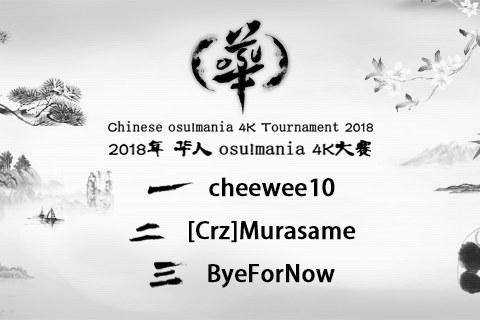

---
tags:
  - CMT 4K 2018
  - CMT4K 2018
---

# Chinese osu!mania 4K Tournament 2018

The **Chinese osu!mania 4K Tournament 2018** (***CMT 4K 2018***) is the third one-on-one, osu!mania 4K specified Chinese regional tournament, hosted by CMT team.

## Tournament schedule

| Event | Timestamp |
| --: | :-- |
| Registration | 2018-09-10/2018-09-29 |
| Qualification Stage | 2018-10-06/2018-10-07 |
| Drawings | 2018-10-07 (20:00 UTC+08) |
| Group stage | 2018-10-13/2018-10-14 |
| Round of 16 | 2018-10-20/2018-10-21 |
| Quarterfinals | 2018-10-27/2018-10-28 |
| Semifinals | 2018-11-03/2018-11-04 |
| Finals week 1 | 2018-11-10 |
| Finals week 2 | 2018-11-18/2018-11-25 |

## Prizes

| Placing | Prize(s) |
| :-: | :-- |
|  | 8 months of osu!supporter, unique profile badge |
|  | 4 months of osu!supporter |
|  | 2 months of osu!supporter |

All prizes are sponsored by **[Arkaaalin](https://osu.ppy.sh/users/7477382)**.

## Organisation

The Chinese osu!mania 4K Tournament 2018 is run by various community members.

| Position | Member(s) |
| --: | :-- |
| Management and organisation | ::{ flag=CN }:: [hans1999](https://osu.ppy.sh/users/6679329), ::{ flag=CN }:: [Flow Light](https://osu.ppy.sh/users/6705256) |
| Coordinator | ::{ flag=CN }:: [SSV Normandy](https://osu.ppy.sh/users/6475977) |
| Mappool selector | ::{ flag=US }:: [qqqant](https://osu.ppy.sh/users/8976576), ::{ flag=SG }:: [Polytetral](https://osu.ppy.sh/users/8612061), ::{ flag=US }:: [Trainer-](https://osu.ppy.sh/users/9331760), ::{ flag=SG }:: [Raveille](https://osu.ppy.sh/users/1388767) |
| Streamer and referee | ::{ flag=CN }:: [aiyulu](https://osu.ppy.sh/users/189617), ::{ flag=CN }:: [Flow Light](https://osu.ppy.sh/users/6705256), ::{ flag=CN }:: [kj415j45](https://osu.ppy.sh/users/9367540) |
| Commentator | ::{ flag=CN }:: [hans1999](https://osu.ppy.sh/users/6679329), ::{ flag=CN }:: [Flow Light](https://osu.ppy.sh/users/6705256), ::{ flag=AU }:: [williammak](https://osu.ppy.sh/users/11083079), ::{ flag=CN }:: [crazybrother](https://osu.ppy.sh/users/8045083), ::{ flag=CN }:: [kj415j45](https://osu.ppy.sh/users/9367540), ::{ flag=CN }:: [NimaPro](https://osu.ppy.sh/users/11524571), ::{ flag=CN }:: [IA daisuki](https://osu.ppy.sh/users/11238501) |
| Wiki editor | ::{ flag=CN }:: [kj415j45](https://osu.ppy.sh/users/9367540) |

## Links

- [Discussion thread](https://osu.ppy.sh/community/forums/topics/800125)
- [QQ group](https://jq.qq.com/?_wv=1027&k=5IH0Tkr)
- [Challonge](https://challonge.com/CMT2018)
- Livestream
  - bilibili: [aiyulu](https://live.bilibili.com/10183) (Primary), [Flow Light](https://live.bilibili.com/73668) (Secondary), [kj415j45](https://live.bilibili.com/237250) (Backup).
  - Twitch: [aiyulu](https://www.twitch.tv/aiyulu).
- [Beatmap suggestion](https://docs.google.com/forms/d/e/1FAIpQLSeGjHNxIOw1cOfj1NHn1KwbXBfa5mZnqRNQQnFT-v6z6uRJYg/viewform)
- **[Statistics sheet](https://docs.qq.com/sheet/DSHZVSUJ3TGFRY3Fj)**

## Podium

## Mappools

### Finals

**Download the mappack here! (105 MB) - [Baidu Netdisk](https://pan.baidu.com/s/1Qc4B46bUWDnLoWTG96IjWw) - [Google Drive](https://drive.google.com/file/d/1DrJ9MG5naQoBMvMcvwd84RUE105BwODi)**

- FreeMod
  1. [Sota Fujimori - Move That Body -Extended Mix- \[Dance\]](https://osu.ppy.sh/beatmapsets/765772#mania/1609983)
  2. [ck - Carnation (ck remix) \[LN Master\]](https://osu.ppy.sh/beatmapsets/749709#mania/1579095)
  3. [LeaF - Calamity Fortune \[Freedom (240bpm)\]](https://osu.ppy.sh/beatmapsets/866025#mania/1810669)
  4. [Gram VS Camellia - Ragnarok \[howls of gnipahellir\]](https://osu.ppy.sh/beatmapsets/761809#mania/1601809)
  5. [YZYX - Dysnomia \[Aphasia\]](https://osu.ppy.sh/beatmapsets/867111#mania/1812736)
  6. [Casey Lee Williams ft. Jeff Williams - Boop \[RWBYnfinity\]](https://osu.ppy.sh/beatmapsets/696309#mania/1475015)
  7. [Daiki Kasho - 5oul on D!splay (Short Ver.) \[Display\]](https://osu.ppy.sh/beatmapsets/384818#mania/840775)
  8. [Panda Eyes & Teminite - Highscore \[Extra (NSV) (143bpm)\]](https://osu.ppy.sh/beatmapsets/873114#mania/1825054)
  9. [Cyber-Rainforce - Pluto \[Ayumu's firmament\]](https://osu.ppy.sh/beatmapsets/657922#mania/1393518)
  10. [Venetian Snares - Sinthasomphone \[Challenge\]](https://osu.ppy.sh/beatmapsets/872435#mania/1823177)
  11. [LeaF - Lyrith \[Amnesia\]](https://osu.ppy.sh/beatmapsets/687280#mania/1463532)
  12. [lapix - Duality Rave (Zekk's 'FULL SPEC' Remix) \[Extreme (Revised)\]](https://osu.ppy.sh/beatmapsets/859797#mania/1821298)
  13. [xi - PEACE BREAKER \[devastation\]](https://osu.ppy.sh/beatmapsets/827204#mania/1733417)
  14. [Camellia - Proluvies \[SVecial\]](https://osu.ppy.sh/beatmapsets/715240#mania/1511192)
- Tiebreaker
  1. **[Camellia - Berserkerz' Warfare 345 [The Final Battle (379bpm)]](https://osu.ppy.sh/beatmapsets/873908#mania/1826647)**

### Semifinals

**Download the mappack here! (104 MB) - [Baidu Netdisk](https://pan.baidu.com/s/1BqzBwJ4JmGHpnV6T9plW2w) - [Google Drive](https://drive.google.com/file/d/1rdhA-MDfErQtevTp9EPp-6q4ml9WIkgK)**

- FreeMod
  1. [PROTODOME - Greatest Hat \[chalLeNge\]](https://osu.ppy.sh/beatmapsets/840500#mania/1759313)
  2. [Getty vs. DJ DiA - Fox4-Raize- \[UNLIMITED \[LN\]\]](https://osu.ppy.sh/beatmapsets/595830#mania/1260071)
  3. [Hatsuki Yura - Dancer of Saramandora \[Sprites\]](https://osu.ppy.sh/beatmapsets/836808#mania/1752295)
  4. [Round Wave Crusher - Slash Dot Slash (Slim Boy Fat) \[-.-\]](https://osu.ppy.sh/beatmapsets/823631#mania/1725933)
  5. [IOSYS - The Lovely, Freezing, Tomboyish Bath, Cirno's Hot Spring \[Nine Time\]](https://osu.ppy.sh/beatmapsets/859935#mania/1799312)
  6. [96-glass - Blessed \[Heaven\]](https://osu.ppy.sh/beatmapsets/855239#mania/1787084)
  7. [YMCK - Curry da yo! \[Curry!!!\]](https://osu.ppy.sh/beatmapsets/556640#mania/1177974)
  8. [MasamiT - Toraburu Kuroneko Manbiki \[Ayumu's Distress\]](https://osu.ppy.sh/beatmapsets/591252#mania/1251232)
  9. [Camellia - Nightmare of Hornets Squad \[Breakdown\]](https://osu.ppy.sh/beatmapsets/543489#mania/1151944)
  10. [Terminal 11 - Miserable Bastard \[Despair\]](https://osu.ppy.sh/beatmapsets/789976#mania/1657803)
  11. [MuryokuP - Frozen World \[Yuki\]](https://osu.ppy.sh/beatmapsets/373379#mania/817998)
  12. [BlackY - B(Camellia's"BlAst-Off"Remix) \[Radiation\]](https://osu.ppy.sh/beatmapsets/832566#mania/1744190)
  13. [Camellia - epimerization \[doxorubicin\]](https://osu.ppy.sh/beatmapsets/803740#mania/1686934)
  14. [sakuraburst - deconstructing nature \[destruction\]](https://osu.ppy.sh/beatmapsets/619106#mania/1305926)
- Tiebreaker
  1. **[Camellia - LET'S JUMP (Camellia's 'diffractive' Hardcore Remix) \[Liftoff\]](https://osu.ppy.sh/beatmapsets/851107#mania/1779259)**

### Quarterfinals

**Download the mappack here! (72 MB) - [Baidu Netdisk](https://pan.baidu.com/s/1Ddy1Is0VhxJx3FCCfG--3Q) - [Google Drive](https://drive.google.com/file/d/1cq1ytwNhXtA6nhbX7-9E_30iS88pVwPO)**

- FreeMod
  1. [M2U - Mare Maris \[For The Brave\]](https://osu.ppy.sh/beatmapsets/786297#mania/1650609)
  2. [Freezer feat. Kiichigo - Chocolate Planet \[LNfried's HEAVENLY\]](https://osu.ppy.sh/beatmapsets/734969#mania/1579836)
  3. [Goreshit - beautiful loli thing \[Jumpstreams\]](https://osu.ppy.sh/beatmapsets/728795#mania/1538564)
  4. [USAO - Dynamite (Extended Mix) \[Black Another Lv.12\]](https://osu.ppy.sh/beatmapsets/567907#mania/1559100)
  5. [Frums - theyaremanycolors \[emotions\]](https://osu.ppy.sh/beatmapsets/829383#mania/1737654)
  6. [fartwad - Stereo Sayan 3D \[hi19hi19's Hard\]](https://osu.ppy.sh/beatmapsets/752821#mania/1584871)
  7. [stereoberry - ametsuchi \[petrichor\]](https://osu.ppy.sh/beatmapsets/671311#mania/1419426)
  8. [JOYRYDE - MERCY \[PRAISE\]](https://osu.ppy.sh/beatmapsets/760741#mania/1599848)
  9. [Akira Complex - Odyssey (Au5 Remix) \[Dreamless\]](https://osu.ppy.sh/beatmapsets/519513#mania/1103630)
  10. [P*Light - NINJA IS DEAD IIDX ver. \[qqq's Black Another\]](https://osu.ppy.sh/beatmapsets/856629#mania/1789600)
  11. [C418 - Sweden \[sphere\]](https://osu.ppy.sh/beatmapsets/815908#mania/1711121)
  12. [Subplaid - Jeg onsker ikke a skade deg \[i don't want to hurt you\]](https://osu.ppy.sh/beatmapsets/827197#mania/1733403)
- Tiebreaker
  1. **[UVERworld - Fight For Liberty \[Carte Blanche\]](https://osu.ppy.sh/beatmapsets/865362#mania/1809430)**

### Round of 16

**Download the mappack here! (81 MB) - [Baidu Netdisk](https://pan.baidu.com/s/1trdHtV6nNIuifTwVPCQYgg) - [Google Drive](https://drive.google.com/file/d/1wJEAdCAwj72W7_fuKiAD3qxwpbsly_WI)**

- FreeMod
  1. [Swimy - Acchi Muite \[This Way! NSV\]](https://osu.ppy.sh/beatmapsets/744373#mania/1687703)
  2. [ZUN Arranged by er - Gogo No Koishi-chan \[Tea Time\]](https://osu.ppy.sh/beatmapsets/632689#mania/1343000)
  3. [Darren Styles - Heartbeatz \[Leo137\]](https://osu.ppy.sh/beatmapsets/205220#mania/484499)
  4. [goreshit - o'er the flood \[torrent\]](https://osu.ppy.sh/beatmapsets/497750#mania/1777157)
  5. [hyi - you can recover \[restoration\]](https://osu.ppy.sh/beatmapsets/566156#mania/1199287)
  6. [succducc - i really like u \[you and i\]](https://osu.ppy.sh/beatmapsets/844228#mania/1766063)
  7. [Croove - Minus 3 \[4B SHD\]](https://osu.ppy.sh/beatmapsets/811723#mania/1702660)
  8. [Stellabee - Ubiquity \[Existence\]](https://osu.ppy.sh/beatmapsets/758231#mania/1595001)
  9. [Jan Amit - In Torture (feat. Eclise) \[Sinking\]](https://osu.ppy.sh/beatmapsets/573842#mania/1215562)
  10. [Paul Bazooka - Kitty From Hell \[Kitties\]](https://osu.ppy.sh/beatmapsets/714779#mania/1510422)
  11. [Delta Sleep - Interlude \[Delirus\]](https://osu.ppy.sh/beatmapsets/687369#mania/1454484)
  12. [Utata-P feat. Yuzuki Yukari - Shiawase ni Nareru Kakushi Command ga Arurashii \[Cheat Code\]](https://osu.ppy.sh/beatmapsets/656766#mania/1391341)
- Tiebreaker
  1. **[Dschinghis Khan - Moskau(Camellia's Handzup Bootleg)\[apparently this is a song about moscow\]](https://osu.ppy.sh/beatmapsets/747926#mania/1575832)**

### Group stage

**Download the mappack here! (55 MB) - [Baidu Netdisk](https://pan.baidu.com/s/11cy15gHcxRplbYHDRa2YfQ) - [Google Drive](https://drive.google.com/file/d/1hLicP57XpL7PS7SgJnlkCCynuKsVnHWS)**

- FreeMod
  1. [Between August and December - Sayonara Cruel World (Reworked) \[LN\]](https://osu.ppy.sh/beatmapsets/747111#mania/1574382)
  2. [paraoka feat. yusuke - center piercing (sakuzyo bootleg) \[Stage 3: LN\]](https://osu.ppy.sh/beatmapsets/758467#mania/1595396)
  3. [Traktion - Mission ASCII \[Start Mission\]](https://osu.ppy.sh/beatmapsets/634008#mania/1345387)
  4. [Waterflame - Glorious morning \[Myka's Insane\]](https://osu.ppy.sh/beatmapsets/742228#mania/1576062)
  5. [WinDEU - Magus Night Fever \[11\]](https://osu.ppy.sh/beatmapsets/416481#mania/902166)
  6. [r300k - Energy Flower 3007 \[6236\]](https://osu.ppy.sh/beatmapsets/454071#mania/992415)
  7. [The Ghost of 3.13 - Daydream \[Fantasy\]](https://osu.ppy.sh/beatmapsets/764928#mania/1608410)
  8. [ZUN - Tsukidokei \~ Luna Dial \[Lunatic\]](https://osu.ppy.sh/beatmapsets/678723#mania/1568546)
  9. [Porter Robinson - Flicker \[SV Heaven\]](https://osu.ppy.sh/beatmapsets/490560#mania/1045578)
  10. [In Love With A Ghost - i'm too busy trying to fly away \[clutz\]](https://osu.ppy.sh/beatmapsets/858994#mania/1795100)
- Tiebreaker
  1. **[VILA - Another Halcyon \[Another Dream\]](https://osu.ppy.sh/beatmapsets/713501#mania/1508074)**

### Qualification stage

- [Jake Chudnow - Moon Men (Instrumental) \[Stage 1: Apollo\]](https://osu.ppy.sh/beatmapsets/856468#mania/1789290)
- [Shawn Wasabi - Otter Pop \[Stage 2: Anxious\]](https://osu.ppy.sh/beatmapsets/856527#mania/1789415)
- [Aimer - Through My Blood \<AM\> \[Stage 3: Energy\]](https://osu.ppy.sh/beatmapsets/856473#mania/1789302)
- [Waterflame - Grind District \[Stage 4: Industrial\]](https://osu.ppy.sh/beatmapsets/856524#mania/1789410)

## Match results

### Finals week 2

| PlayerBlue |  |  | PlayerRed |
| --: | :-: | :-: | :-- |
| ByeForNow | 4 | 7 | \[Crz\]Murasame |
| \[Crz\]Murasame | 0 | 7 | cheewee10 |

### Finals week 1

| PlayerBlue |  |  | PlayerRed |
| --: | :-: | :-: | :-- |
| cheewee10 | 6 | 1 | ByeForNow |
| Orangejuice | 0 | 0 | HDRoop_7 |
| \[Crz\]Murasame | 6 | 0 | \[Crz\]Minato |

### Semifinals

| PlayerBlue |  |  | PlayerRed |
| --: | :-: | :-: | :-- |
| **CaOH2** | **6** | 1 | Sakaki |
| Stink God | 5 | **6** | **zero2snow** |
| C Eru | 0 | **6** | **\[Crz\]Murasame** |
| HDRoop\_7 | 0 | **6** | **cheewee10** |
| **\[Crz\]Murasame** | **6** | 1 | CaOH2 |
| \[Crz\]Minato | 0 | **6** | **ByeForNow** |
| **Orangejuice** | **6** | 2 | 704661982 |
| zero2snow | 0 | **6** | **Orangejuice** |

### Quarterfinals

| PlayerBlue |  |  | PlayerRed |
| --: | :-: | :-: | :-- |
| zero2snow | 3 | **5** | **ByeForNow** |
| Sakaki | 0 | **5** | **HDRoop\_7** |
| 704661982 | 1 | **5** | **\[Crz\]Minato** |
| alisi | 0 | **5** | **CaOH2** |
| w a d u | 4 | **5** | **C Eru** |
| **cheewee10** | **5** | 2 | \[Crz\]Murasame |
| yin xiaosong | 0 | **5** | **Orangejuice** |
| **Stink God** | **5** | 1 | AradORiOn\_MMM |

### Round of 16

| PlayerBlue |  |  | PlayerRed |
| --: | :-: | :-: | :-- |
| **zero2snow** | **5** | 0 | alisi |
| **ByeForNow** | **5** | 4 | CaOH2 |
| **Sakaki** | **5** | 1 | AradORiOn\_MMM |
| **HDRoop\_7** | **5** | 4 | Stink God |
| **\[Crz\]Minato** | **5** | 4 | w a d u |
| **cheewee10** | **5** | 0 | yin xiaosong |
| C Eru | 0 | **5** | **704661982** |
| **\[Crz\]Murasame** | **5** | 0 | Orangejuice |

### Group stage

| Group | Players |  |  |  |
| :-: | :-: | :-: | :-: | :-: |
| A | **CaOH2** | **Sakaki** | hero\_jeff | \[Crz\]MY |
|  | **7** | **9** | -10 | -6 |
| B | \[MY\]xRay | **HDRoop\_7** | **alisi** | murorachi |
|  | -12 | **12** | **4** | -4 |
| C | **\[Crz\]Murasame** | 704661982 | Pureforever | YoSa\_o |
|  | **12** | **2** | -2 | -12 |
| D | **cheewee10** | **w a d u** | GODsBEATs | IA daisuki |
|  | **12** | **2** | -4 | -10 |
| E | **\[Crz\]Minato** | PHILIPPE YMT | **yin xiaosong** | Toki 0w0 |
|  | **12** | -3 | **2** | -11 |
| F | **Orangejuice** | **C Eru** | Remilia\_HY | JunFish |
|  | **4** | **11** | -3 | -12 |
| G | **zero2snow** | **Stink God** | tangjinxi | FDXiaoQian |
|  | **9** | **4** | -1 | -12 |
| H | **ByeForNow** | **AradORiOn\_MMM** | PiaoD | idqoos123 |
|  | **12** | **4** | -4 | -12 |

### Qualification stage

Check **[statistics sheet](https://docs.qq.com/sheet/DSHZVSUJ3TGFRY3Fj)** for more details.

## Ruleset

### Tournament rules

1. The **Chinese osu!mania 4K Tournament 2018** (***CMT 4K 2018***) is a one-on-one, osu!mania 4K specified Chinese regional tournament, hosted by CMT team.
2. The maps for each round will be announced by the map selector in advance on the Sunday before the actual matches take place:
   - The Tie-breaker map will only be played in case of a tie.
   - All maps are in a FreeMod bracket.
3. Match schedule will be settled by the Tournament Management.
4. If no staff or referee is available, the match will be postponed.
5. Failed player's score do not get added to the team score.
6. Use of the [Visual Settings](/wiki/Client/Interface/Visual_settings) options are allowed.
7. If the beatmap ends in a draw, the game will be nullified.
8. If player disconnects (In the case of the player is able to finish the map), the disconnected player will have to upload the score (`Shift` + `F12`) and provide the link to match referee instantly.
9. If a player disconnects (In the case of the player is not able to finish the map):
   - disconnets within 30s after the match starts, the match will be reset.
   - the player will be recorded as Failed.
10. Beatmaps cannot be reused in the same match unless the beatmap was nullified.
11. If not all players attend, the maximum time the match can be postponed is 10 minutes. Absent player(s) will be considered as forfeited.
12. All players are supposed to keep the match running fluent and without delays. The match will not be reset if the players have (including but not limited to):
    - Internet issue.
    - System notification issue.
    - Hardware problems.
13. In Group stage, 'Win by default' will be considered as win by 4:0, +1.0 score difference ratio.
14. Unexpected incidences are handled by the tournament management.
15. Any modification of these rules will be announced.
16. The CMT team reserves the right to use Chinese preferentially.

### Registration rules

1. Every user interested in joining the tournament signs up individually (Registration link will be released after the registration phrase begins).
2. Only these players are eligible to sign up:
   - Player's nationality belongs to the Asian-Pacific region.
   - Use Chinese as the primary language.
   - No requirement on performance points.
   - If player has record of violating the osu! community rules in the last 12 months, we may cancel the application of this player.
3. Successfully registered player will receive a confirm email and will be posted on the player list. See [here](https://osu.ppy.sh/community/forums/topics/800125).
4. Map selectors and tournament managers are not allowed to register.

### Stage instructions

1. In the Qualification stage, all players will be divided into groups of 8. The mappool for qualification round has **4** maps and all players will have two chances at each qualifier where the highest of the two runs will be cumulated for players' final score. The highest **32** (may vary with the number of registered players) players will qualify next stage.
2. In the Group stage, qualified players will be divided into groups of 4.
3. All the players from each group will face each other.
4. Rankings of each group are determined by sorting the results of each team's performance in the following priority:
   - Most matches won.
   - Have higher `{(the number of maps won) - (the number of maps defeated)}`.
   - Most maps won.
   - Have higher `∑{(total score difference) / (maximum score)}`.
   - Winner of the rematch.
5. The top **2** players (may vary with the number of registered players) of each group will move on to the Knock-Out Stages.
6. Following stages are Double Elimination Stages. This means that the winner moves to the next stage and the losing player gets moved to the Loser bracket.
7. **Winning condition**:
   - In the Qualification stage, the **32** highest players will qualify next stage.
   - In Group stage, player needs to win **4** maps to win a match. (Best-of-7).
   - In the Round of 16 and the Quarter-finals, player needs to win **5** maps to win a match. (Best-of-9).
   - In Semi-finals and Finals: Week 1, you need to win **6** maps to win a match. (Best-of-11).
   - In Finals: Week 2, you need to win **7** maps to win the match. (Best-of-13).

## Match instructions

### Qualification stage

1. A referee will create a multiplayer room 15 minutes in advance. Players must gather during this period:
   - Room settings are osu!mania, Head To Head, Win Condition: 'Score v2'. Room name must be "CMT4K2018: (Qualification) vs (Qualification)".
   - The maximum amount of player for Qualification stage is 8.
2. There will be no warm-up maps in Qualification stage, all players are expected to prepare well before the match starts.
3. Players are not allowed to change slots once the match has started.
4. All maps(**4**) will be played twice in the order specified by the referee.
5. 4 highest scores on each qualifier are cumulated for the final score.
6. If player disconnects (In the case of the player is able to finish the map), the disconnected player will have to upload the score (`Shift` + `F12`) and provide the link to match referee instantly. Otherwise, the disconnected player will get 0 on this map. Disconnected player(s) will be given a **10** minutes grace period after this map is finished to enter their room; if they have not entered by this point, next map will begin.
7. The results of Qualification stage will be posted under the tab "Match results".

### Group stage

1. A referee will create a multiplayer room 15 minutes in advance. Players must gather during this period:
   - Room settings are osu!mania, Head To Head, Win Condition: 'Score v2'. Room name must be "CMT4K2018: (playerBlue) vs (playerRed)".
   - PlayerBlue and playerRed must be in slot 1, 2, respectively.
2. Each player in the match will be allowed **1** warm-up map to be played, making for **2** warm-ups. Questioned maps and maps that are not 4K-specific osu!mania maps are not allowed.
3. Each player choose one map from the pool as the *Banned Map*. These maps can not be played during this match.
4. Each player must use `!roll` once in `#multiplayer`:
   - The losing roll picks the first banned map.
   - The winning roll picks the first map of the match.
   - Repeat `!roll` if two rolls are equal.
5. Players pick maps by turns:
   - In case of a tie, the tiebreaker map must be played.

## Mappool instructions

1. There will be **1** mappool for the Qualification Stage, **1** mappool for the Group Stage, **1** mappool for Round of 16, **1** mappool for the Quarterfinals, **1** mappool for the Semifinals and **1** mappool for the Finals.
2. Mappool size varies depending on the stage:
   - **4** maps in the Qualification Stage.
   - **10** maps in the Group Stage.
   - **12** maps in both Round of 16 and Quarter-finals.
   - **14** maps in both Semi-finals and Finals.
3. Except the mappool for Qualification Stage, each mappool has one tiebreaker.
4. All maps, including the tiebreaker, will be played on Free-Mod condition:
   - Every individual player can pick Hidden, Flashlight or Fade-In freely.

## Scheduling instructions

1. In principle, each stage will be held on a single weekend.
2. All matches will be held on Saturday or Sunday, UTC+8.
3. Matches in group stage may overlap.
4. Scheduling will be handled by the Tournament Management. Schedules will be released on the Sunday before the first matches of the actual stage. If player has conflict with the scheduling, Tournament Management will try to amend the schedule so that it fairly accommodates for all the participant. However, no promises can be guaranteed:
   - If player is in any other time zone, please notify the Management in advance.
   - Apart from time zone reasons, the absent player(s) will be considered as forfeited, regardless of whether they have sent messages to the Management.
5. Request of rematch from forfeited player(s) will not be accepted.
