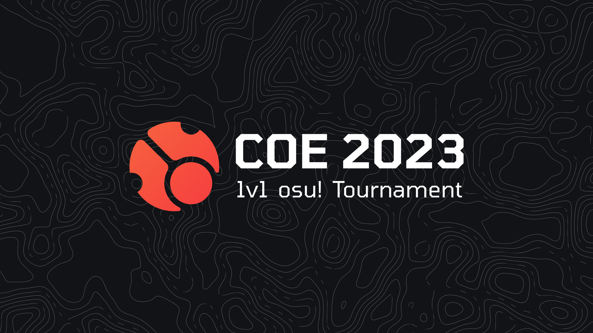
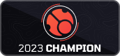
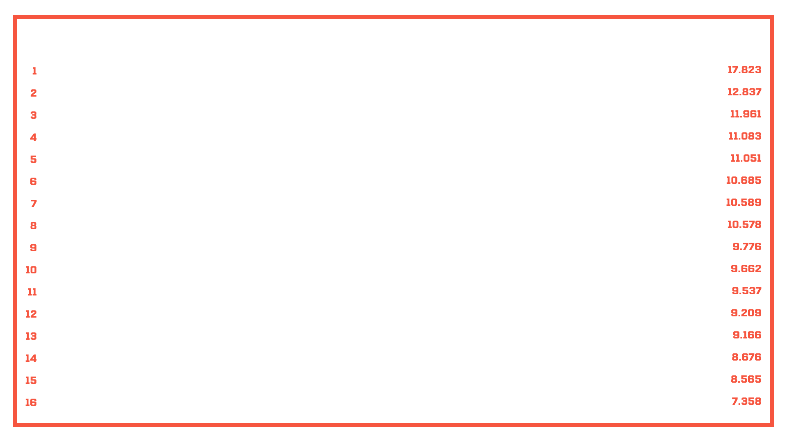
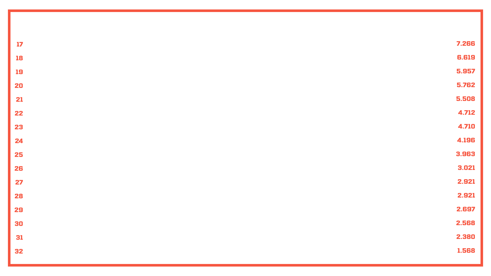
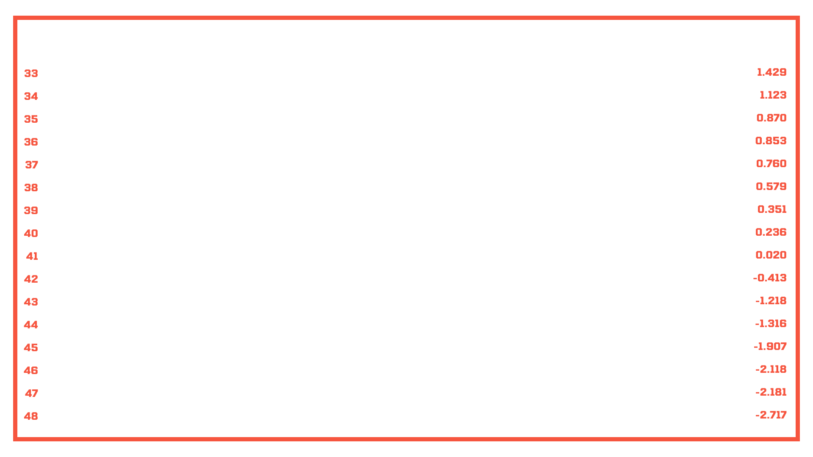

# COE 2023 1v1 osu! Tournament

The **COE 2023 1v1 osu! Tournament** was a 1v1 single-elimination osu! LAN tournament run entirely in the [osu!(lazer)](/wiki/Client/Release_stream/Lazer) client, and hosted during [cavoe's osu! event 2023 (COE 2023)](/wiki/Community/cavoe's_osu!_event/2023) at Brabanthallen in 's-Hertogenbosch, Netherlands. It was the third instalment of the COE tournament series.

## Tournament schedule

| Event | Timestamp |
| --: | :-- |
| Registration phase | 2023-07-14/2023-07-23 |
| Online qualifiers | 2023-07-21/2023-07-24 |
| Screening phase | 2023-07-24/2023-07-31 |
| Qualifier results reveal & Finals mappool showcase | 2023-07-31 (20:00 UTC+2) |
| Finals | 2023-08-04/2023-08-05 |

## Prizes

The COE 2023 1v1 osu! Tournament offered a total cash prize pool of 2,500 €, including a contribution of 1,000 € from the osu! team, as well as keyboards provided by [Wooting](https://wooting.io/).

| Placing | Prize(s) |
| :-: | :-- |
|  | Wooting 60HE keyboard, 1,200 €, profile badge |
|  | Wooting 60HE keyboard, 800 € |
|  | Wooting 60HE keyboard, 500 € |

<!-- ## Organisation -->

## Links

- **[Information sheet](https://docs.google.com/spreadsheets/d/1FWwSZUFR5y2FUd2anISsCner7V8YYItCK9olnmMLyOw/edit#gid=0)**
- [Challonge bracket](https://challonge.com/COE2023)
- [COE website](https://cavoeboy.com/tournament)
- [Livestream](https://discord.com/invite/d6ru6PVcSY)
- [COE Discord server](https://discord.com/invite/d6ru6PVcSY)
- [COE 1v1 Tournament Discord server](https://discord.com/invite/zJSTAyAUbW)
- [COE Twitter](https://twitter.com/CavoesOsuEvent)

## Participants

| Qualifier seed | Player |
| :-: | :-- |
| 1–16 | ::{ flag=DE }:: ::criller::{ user-id=8116659 }, ::{ flag=DE }:: ::akarinya::{ user-id=14385814 }, ::{ flag=KR }:: ::FlyingTuna::{ user-id=9224078 }, ::{ flag=DK }:: ::cat burger::{ user-id=11380904 }, ::{ flag=FR }:: ::FlasTEH::{ user-id=8443945 }, ::{ flag=NO }:: ::ninerik::{ user-id=10549880 }, ::{ flag=US }:: ::Cracento::{ user-id=6619303 }, ::{ flag=GB }:: ::Bubbleman::{ user-id=5182050 }, ::{ flag=SM }:: ::chihuahua::{ user-id=11215030 }, ::{ flag=DE }:: ::Fleh::{ user-id=7780605 }, ::{ flag=BR }:: ::zubs::{ user-id=4253615 }, ::{ flag=FI }:: ::Amasetic::{ user-id=11375251 }, ::{ flag=DE }:: ::Sh3rg\1::{ user-id=11684622 }, ::{ flag=NO }:: ::Melvr::{ user-id=9211924 }, ::{ flag=DE }:: ::yary::{ user-id=13300203 }, ::{ flag=DE }:: ::ZeitFrost::{ user-id=11234706 } |
| 17–32 | ::{ flag=DE }:: ::okinamo::{ user-id=3765989 }, ::{ flag=PL }:: ::Rafis::{ user-id=2558286 }, ::{ flag=FR }:: ::MBAPPEEEEEEEEEE::{ user-id=7657831 }, ::{ flag=FR }:: ::CharleLee::{ user-id=10434787 }, ::{ flag=FR }:: ::Musty::{ user-id=251683 }, ::{ flag=DK }:: ::Polle::{ user-id=13218204 }, ::{ flag=LV }:: ::Rimuru::{ user-id=9269034 }, ::{ flag=FR }:: ::Hifkil::{ user-id=4301976 }, ::{ flag=IT }:: ::kiirochii::{ user-id=6387149 }, ::{ flag=NL }:: ::Manievat::{ user-id=6744123 }, ::{ flag=DE }:: ::-semi::{ user-id=5154946 }, ::{ flag=ES }:: ::A L E P H::{ user-id=6735738 }, ::{ flag=DE }:: ::afe::{ user-id=7344333 }, ::{ flag=FR }:: ::calangi::{ user-id=7810180 }, ::{ flag=GB }:: ::Mahmood::{ user-id=7627844 }, ::{ flag=FR }:: ::Lexonox::{ user-id=7640581 } |
| 33–48 | ::{ flag=ES }:: ::NHarmonia::{ user-id=9582556 }, ::{ flag=DE }:: ::Th1::{ user-id=15441612 }, ::{ flag=FI }:: ::Xepei::{ user-id=11479551 }, ::{ flag=DK }:: ::SobuTheOne::{ user-id=13872272 }, ::{ flag=DK }:: ::iamVill::{ user-id=6295380 }, ::{ flag=FR }:: ::Arakii::{ user-id=6133101 }, ::{ flag=DE }:: ::-Vid::{ user-id=8105655 }, ::{ flag=TR }:: ::heyronii::{ user-id=5642779 }, ::{ flag=FR }:: ::TotorPotate::{ user-id=18323396 }, ::{ flag=PL }:: ::\_demo::{ user-id=3556891 }, ::{ flag=UA }:: ::magnatagamer123::{ user-id=7587763 }, ::{ flag=AT }:: ::z10a::{ user-id=18153252 }, ::{ flag=DE }:: ::iFakeRz::{ user-id=5281485 }, ::{ flag=HU }:: ::Glasswave::{ user-id=5442931 }, ::{ flag=IS }:: ::Arni::{ user-id=7189845 }, ::{ flag=FR }:: ::Thundur::{ user-id=4141918 } |
| *N/A* | ::{ flag=GB }:: ::Akolibed::{ user-id=9269034 }, ::{ flag=BG }:: ::Anniee::{ user-id=12457399 }, ::{ flag=DE }:: ::Bazuso::{ user-id=11726139 }, ::{ flag=DK }:: ::Bertilber::{ user-id=13175328 }, ::{ flag=FR }:: ::BProd::{ user-id=11345747 }, ::{ flag=DE }:: ::ByeDreamZ::{ user-id=10332811 }, ::{ flag=DK }:: ::ckhrix::{ user-id=10049665 }, ::{ flag=NL }:: ::CMeFly::{ user-id=12195391 }, ::{ flag=IT }:: ::Denay::{ user-id=15941539 }, ::{ flag=DE }:: ::Ezius::{ user-id=1861823 }, ::{ flag=BE }:: ::Hanori::{ user-id=7078544 }, ::{ flag=NL }:: ::Julskills::{ user-id=18204934 }, ::{ flag=DE }:: ::Katharsis::{ user-id=10212942 }, ::{ flag=SE }:: ::LelleOne::{ user-id=22237693 }, ::{ flag=IL }:: ::Lindeks::{ user-id=28655737 }, ::{ flag=ES }:: ::M4rti\_::{ user-id=17018032 }, ::{ flag=CH }:: ::Mebura::{ user-id=15324900 }, ::{ flag=BE }:: ::Meersu::{ user-id=6311605 }, ::{ flag=FI }:: ::Nev-::{ user-id=11836334 }, ::{ flag=RO }:: ::origin on osu::{ user-id=15095811 }, ::{ flag=DE }:: ::ramonTV::{ user-id=17018890 }, ::{ flag=DE }:: ::Raptide::{ user-id=8268978 }, ::{ flag=US }:: ::Rykic::{ user-id=12667143 }, ::{ flag=FI }:: ::Seva::{ user-id=10615940 }, ::{ flag=DE }:: ::Shiragi::{ user-id=8788898 }, ::{ flag=FR }:: ::Speykious::{ user-id=19553508 }, ::{ flag=GB }:: ::Stormur::{ user-id=19364028 }, ::{ flag=SE }:: ::Svizza::{ user-id=9894718 }, ::{ flag=NL }:: ::Xella37::{ user-id=11783890 }, ::{ flag=FR }:: ::XiaoMyMommy::{ user-id=11129041 }, ::{ flag=NO }:: ::YokesPai::{ user-id=6399568 }, ::{ flag=BE }:: ::Z3nix::{ user-id=18124611 } |

## Podium

This competition has come to an end and resulted in the following podium:

| Placing | Player |
| :-: | :-- |
|  | ::{ flag=DE }:: ::criller::{ user-id=8116659 } |
|  | ::{ flag=KR }:: ::FlyingTuna::{ user-id=9224078 } |
|  | ::{ flag=DK }:: ::cat burger::{ user-id=11380904 } |

## Mappools

### Round of 16 & Finals

- No Mod
  1. [Wagakki Band - Tengaku (Shiro) [Uncompressed Fury of a Raging Japanese God]](https://osu.ppy.sh/beatmapsets/336414#osu/816327)
  2. [UNDEAD CORPORATION - Embraced by the Flame (English ver.) (EchoingFury) [Disintegration]](https://osu.ppy.sh/beatmapsets/412460#osu/894744)
  3. [SMiLE.dk - Koko Soko (AKIBA KOUBOU Eurobeat Remix) (Mijn Aim Zuigt) [INCREDIBILIS]](https://osu.ppy.sh/beatmapsets/1143822#osu/2388297)
  4. [MYTK - Yggdrasil (Original Mix) (Xarr) [Rebirth]](https://osu.ppy.sh/beatmapsets/1461924#osu/3003419)
  5. [U2 - Saigetsu (Koko & Satsuki ga Tenkomori's Sagyou Bougai Remix) (BoshyMan741) [BoshyMan's WE ARE THE JAPANESE GOBLIN!]](https://osu.ppy.sh/beatmapsets/1638844#osu/3839994)
- Hidden
  1. [Getty vs. DJ DiA - Antifront Gears (Realazy) [Assault]](https://osu.ppy.sh/beatmapsets/1103463#osu/2305315)
  2. [Basshunter - Ievan Polkka Trance Remix (Teara) [BeuKirby]](https://osu.ppy.sh/beatmapsets/10406#osu/66246)
- Hard Rock
  1. [Team Nekokan - Can't Defeat Airman (ztrot) [Holy Shit! It's Airman!!]](https://osu.ppy.sh/beatmapsets/24313#osu/104229)
  2. [A.SAKA - Nanatsu Issenzakura (Hollow Wings) [Whirl]](https://osu.ppy.sh/beatmapsets/214138#osu/503262)
- Double Time
  1. [\*namirin - Koi no Hime Hime Pettanko (BarkingMadDog) [FLAT IS JUSTICE]](https://osu.ppy.sh/beatmapsets/305454#osu/690027)
  2. [EPICA - Wings of Freedom (Luscent) [Alis Libertatis]](https://osu.ppy.sh/beatmapsets/1774219#osu/3632759)
  3. [FF7 Original Soundtrack - Crazy Motorcycle Chase (James) [Crazy!]](https://osu.ppy.sh/beatmapsets/1961#osu/18170)
- Tiebreaker
  1. **[onumi & Akira Complex - Ethereal Cyber Angel XV (yaspo) [we will never leave your side]](https://osu.ppy.sh/beatmapsets/2036755#osu/4247612)**

### Qualifiers

- No Mod
  1. [Kairiki bear feat. GUMI - Manemane Psychotropic (Nevo) [Imitation]](https://osu.ppy.sh/beatmapsets/1720983#osu/3517113)
  2. [xi - over the top (Weriko) [FOUR DIMENSIONS]](https://osu.ppy.sh/beatmapsets/519505#osu/2817560)
  3. [Camellia - Newspapers for Magicians (Mir) [Harmonious]](https://osu.ppy.sh/beatmapsets/938426#osu/1960286)
  4. [trapman featuring CreeperWorks - minefield surfing (ktgster) [Adaption]](https://osu.ppy.sh/beatmapsets/788448#osu/1654883)
- Hidden
  1. [8#Prince - Beautiful Nightmare (Zweib) [1/6]](https://osu.ppy.sh/beatmapsets/615356#osu/1297953)
  2. [DJ TOTTO feat. 3L - Youkakushi -Ayakashi Kakushi- (Halfslashed) [Phantasm]](https://osu.ppy.sh/beatmapsets/1257553#osu/2613131)
- Hard Rock
  1. [ABSOLUTE CASTAWAY - Baku, Iwaku (defiance) [Nyan :3]](https://osu.ppy.sh/beatmapsets/1504291#osu/3081776)
  2. [Jun.A - The Fairy's Adventurous Tale (kiddly) [kiddly's Extreme]](https://osu.ppy.sh/beatmapsets/26480#osu/274236)
- Double Time
  1. [JIN feat. Yoshida Takumi  (phatmans after school) - Kuusou Forest (Nevo) [Kagerou]](https://osu.ppy.sh/beatmapsets/1037938#osu/2169831)
  2. [HuMeR - ChaserXX (KKipalt) [KKip's Another]](https://osu.ppy.sh/beatmapsets/930846#osu/2066790)

## Match results

### Finals

Friday, 4 August 2023:

| Player 1 |  |  | Player 2 | Match link |
| --: | :-: | :-: | :-- | :-- |
| **criller** ::{ flag=DE }:: | **4** | 0 | ::{ flag=DE }:: ZeitFrost | [#1](https://osu.ppy.sh/multiplayer/rooms/398959) |
| Bubbleman ::{ flag=GB }:: | 2 | **4** | ::{ flag=SM }:: **chihuahua** | [#1](https://osu.ppy.sh/multiplayer/rooms/398830) |
| **cat burger** ::{ flag=DK }:: | **4** | 3 | ::{ flag=DE }:: Sh3rg\_ | [#1](https://osu.ppy.sh/multiplayer/rooms/398981) |
| FlasTEH ::{ flag=FR }:: | 3 | **4** | ::{ flag=FI }:: **Amasetic** | [#1](https://osu.ppy.sh/multiplayer/rooms/398768) |
| akarinya ::{ flag=DE }:: | 1 | **4** | ::{ flag=DE }:: **yary** | [#1](https://osu.ppy.sh/multiplayer/rooms/398793) |
| **Cracento** ::{ flag=US }:: | **4** | 2 | ::{ flag=DE }:: Fleh | [#1](https://osu.ppy.sh/multiplayer/rooms/399026) |
| **FlyingTuna** ::{ flag=KR }:: | **4** | 1 | ::{ flag=NO }:: Melvr | [#1](https://osu.ppy.sh/multiplayer/rooms/398906) |
| **ninerik** ::{ flag=NO }:: | **4** | 2 | ::{ flag=BR }:: zubs | [#1](https://osu.ppy.sh/multiplayer/rooms/398874) |
| **criller** ::{ flag=DE }:: | **4** | 3 | ::{ flag=SM }:: **chihuahua** | [#1](https://osu.ppy.sh/multiplayer/rooms/399059) |
| **cat burger** ::{ flag=DK }:: | **4** | 2 | ::{ flag=FI }:: Amasetic | [#1](https://osu.ppy.sh/multiplayer/rooms/399114) |
| yary ::{ flag=DE }:: | 1 | **4** | ::{ flag=US }:: **Cracento** | [#1](https://osu.ppy.sh/multiplayer/rooms/399143) |
| **FlyingTuna** ::{ flag=KR }:: | **4** | 3 | ::{ flag=NO }:: ninerik | [#1](https://osu.ppy.sh/multiplayer/rooms/399498) |

Saturday, 5 August 2023:

| Player 1 |  |  | Player 2 | Match link |
| --: | :-: | :-: | :-- | :-- |
| **criller** ::{ flag=DE }:: | **5** | 0 | ::{ flag=DK }:: cat burger | [#1](https://osu.ppy.sh/multiplayer/rooms/399550) |
| Cracento ::{ flag=US }:: | 1 | **5** | ::{ flag=KR }:: **FlyingTuna** | [#1](https://osu.ppy.sh/multiplayer/rooms/399574) |
| **cat burger** ::{ flag=DK }:: | **5** | 2 | ::{ flag=US }:: Cracento | [#1](https://osu.ppy.sh/multiplayer/rooms/399700) |
| **criller** ::{ flag=DE }:: | **5** | 0 | ::{ flag=KR }:: FlyingTuna | [#1](https://osu.ppy.sh/multiplayer/rooms/399751) |

### Qualifiers

## Ruleset

The full detailed rules are viewable in the [COE 2023 1v1 Tournament rulebook](https://cavoeboy.com/assets/tournament/rules.pdf).

### Tournament rules

1. The game mode being played is osu!, and all matches will be played using ScoreV2.
2. No custom skin elements that alter core gameplay elements or mechanics are allowed, nor any modifications to the game not indended by the developer.
3. Should a participant not be present at the allotted match time they will be given a forfeit loss.
4. Participants are expected to keep the match running fluently and without intentional delays. Excessive match delays results in penalties being applied at the discretion of the referee.
5. During the LAN stages of the tournament, participants are required to inform tournament staff ahead of time which drivers they need for their equipment. Drivers must be open source or supplied by the manufacturer of the peripheral device.
6. Participants will be given the chance before any LAN matches to configure their drivers and the rest of the setup to their liking.
7. The tournament staff reserves the right to inspect any equipment brought by participants and deny their use upon suspicion of attempted foul play.
8. Instructions of the referees and the tournament management are to be followed. Decisions labeled as final are not to be objected to.
9. Participants will be sanctioned for any of the following, or attempts thereof:
   - Using insulting language and/or gestures, in-game or in person.
   - Gaining an unfair advantage through any means, including but not limited to:
     - Cheating software
     - Information abuse
     - Doping
   - Showing unsportsmanlike behavior.
   - Impersonation or being misleading regarding identity.
   - Deceiving or misleading referees.
   - Not putting in any effort to win a match / match fixing.
   - Not following osu! community guidelines.
   - Breaking any local laws.
   - Betting on any matches. This also applies to all staff.
   - Damaging any equipment of another person.
10. The tournament organisers and referees reserve the right to apply the rules in relation to the tournament and all its matches and give warnings and/or penalties to the participants at their discretion.
11. The tournament organisers reserve the right to modify these rules at any moment. Any such changes will be announced in advance.

### Registration

1. Players wishing to participate must sign up on the [COE website](https://cavoeboy.com/tournament).
2. Every player participating in this tournament, even the online qualifiers, must be able to attend [cavoe's osu! event 2023](/wiki/Community/cavoe's_osu!_event/2023) for the full duration of the tournament
3. Players must log in to the COE website with their osu! account and connect their Discord account. Both accounts must be used during the entire tournament and no change can be made after signing up.
4. All participants will be screened by osu! staff and are expected to adhere to the [osu! community rules](/wiki/Rules) in addition to these rules.
5. No member of the tournament organisation may sign up for the tournament, with the exception of commentators.

### Qualifier instructions

1. During the qualifier, each participant will be given two attempts to set a high score on each map of the mappool. These attempts will be in lobbies scheduled beforehand.
2. The matches will start once the scheduled time is reached and a referee is present.
3. There will be no warm-ups during the match. The maps in the mappool will be played in order.
4. A short break is given between each map, the exact duration of which being at the discretion of the referee.
5. Rounds with disconnects within 30 seconds or 25% of the beatmap length, whichever happens first, may be replayed at the discretion of the referee, as long as the problem is clearly communicated in time.
6. The qualifier seeding will be based on the average placement of each player on each map. The top 16 seeded teams will advance to the main bracket.

### Main bracket instructions

1. The tournament proper consist of a single-elimination bracket, with an additional match deciding the third place. All matches will be direct 1v1 best-of-9 matches.
2. The match schedule is determined beforehand and cannot be changed. If a player cannot participate at the scheduled time the match will be forfeited, and a win by default will be handed to the other player if present. Any changes to the schedule will be announced in due time.
3. Participants may recheck and reconfigure their setup up to 15 minutes before the scheduled match time.
4. Once both players and a referee join a match, both players will begin by rolling, either physically or via the `!roll` command. Picks, bans and protects will be conducted as follows:
   1. Both players get to protect one beatmap during the match, starting with the loser of the roll.
   2. Then the winner of the roll decides on the order of the bans OR the picks. The loser decides on the order of the other option.
   3. Afterwards the players will ban 2 maps each in the order chosen.
   4. The players then alternate picks starting from the winner of the roll until either player gets enough points to win, or both players reach match point, in which case the tiebreaker is played.
5. Between each map there is a short break of 120 seconds during which the next map must be picked. If a player does not pick a map during that timespan, the referee will pick a random map from the mappool using `!roll X`, where X is the number of beatmaps that were neither picked nor banned, excluding the tiebreaker.
6. Rounds with disconnects within 30 seconds or 25% of the beatmap length, whichever happens first, may be replayed at the discretion of the referee, as long as the problem is clearly communicated in time.
7. Should a map end in a draw, the beatmap will be replayed before moving on to the next pick.

### Mappools

The mappools for each stage are structured as follows:

| Stage | Beatmaps |
| :-- | :-- |
| Qualifiers | 4 NM, 2 HD, 2 HR, 2 DT |
| Finals | 6 NM, 3 HD, 3 HR, 4 DT, 1 TB |
