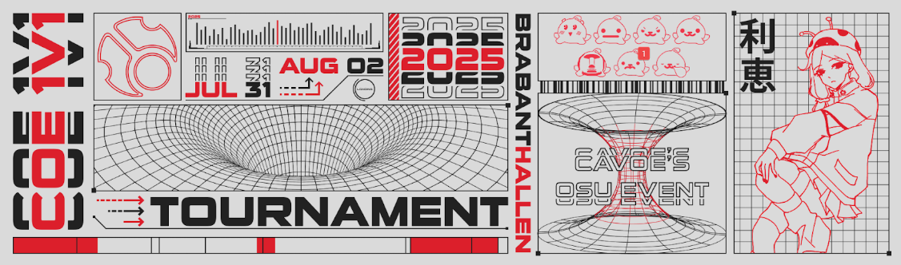

# COE 2025 1v1 Tournament

The **COE 2025 1v1 Tournament** was a 1v1 single-elimination osu! LAN tournament run entirely (with the exception of qualifiers) in the [osu!(lazer)](/wiki/Client/Release_stream/Lazer) client, and hosted during [cavoe's osu! event](/wiki/Community/cavoe's_osu!_event) 2025 (COE 2025) at Brabanthallen in 's-Hertogenbosch, Netherlands. It was the fifth instalment of the COE tournament series.

## Tournament schedule

| Event | Timestamp |
| --: | :-- |
| Registration | 2025-07-07/2025-07-20 |
| Online qualifiers | 2025-07-07/2025-07-24 |
| Qualifier results reveal & Finals mappool showcase | 2025-07-28 (15:30 UTC+2) |
| Finals | 2025-07-31/2025-08-02 |

## Prizes

The COE 2025 1v1 Tournament offered a total cash prize pool of 4900€, keyboards provided by [Wooting](https://wooting.io/) and several merch items from [COE](https://cavoe.events), including keychains, pins, snackboxes and water bottles.

| Placing | Prize(s) |
| :-: | :-- |
|  | 1500€, COE Pippi and Mocha keychains, COE Pippi, Mocha and Rie pins, COE Snackbox, COE Water Bottle, Wooting UwU keypad, Wooting 80HE keyboard |
|  | 1000€, COE Pippi and Mocha keychains, COE Pippi, Mocha and Rie pins, COE Snackbox, COE Water Bottle, Wooting UwU keypad, Wooting 60HE+ keyboard |
|  | 700€, COE Pippi and Mocha keychains, COE Pippi, Mocha and Rie pins, COE Snackbox, COE Water Bottle, Wooting UwU keypad |
| 4th place | 500€, COE Pippi and Mocha keychains, COE Pippi, Mocha and Rie pins, COE Snackbox, COE Water Bottle, Wooting UwU keypad |
| 5th-8th place | 150€, COE Pippi and Mocha keychains, COE Pippi, Mocha and Rie pins, COE Snackbox, Wooting UwU keypad |
| 9th-16th place | 75€, COE Pippi and Mocha keychains, Wooting UwU keypad |

## Organisation

| Position | Member(s) |
| :-- | :-- |
| Admins | ::{ flag=NL }:: [cavoeboy](https://osu.ppy.sh/users/7361815), ::{ flag=DE }:: [Meyer](https://osu.ppy.sh/users/5452367), ::{ flag=DE }:: [TheHunter1](https://osu.ppy.sh/users/6496016), ::{ flag=FR }:: [ThePooN](https://osu.ppy.sh/users/718454) |
| Mappool selector | ::{ flag=NL }:: [cavoeboy](https://osu.ppy.sh/users/7361815), ::{ flag=PL }:: [Bartek22830](https://osu.ppy.sh/users/6404027), ::{ flag=PL }:: [gnahus](https://osu.ppy.sh/users/12779141), ::{ flag=PL }:: [Bartek22380](https://osu.ppy.sh/users/13108233) | 
| Mapper | ::{ flag=PL }::[milosz](https://osu.ppy.sh/users/13108233), ::{ flag=IT }:: [zekk](https://osu.ppy.sh/users/9704802), ::{ flag=CA }:: [bad boy](https://osu.ppy.sh/users/3545323), ::{ flag=NO }:: [CR7](https://osu.ppy.sh/users/4349246), ::{ flag=US }:: [nooj](https://osu.ppy.sh/users/8271086), ::{ flag=ID }:: [Azrulk](https://osu.ppy.sh/users/12046612), ::{ flag=GB }:: [Ishtiaq](https://osu.ppy.sh/users/6405262), ::{ flag=CA }:: [ktgster](https://osu.ppy.sh/users/53378), ::{ flag=JP }:: [dectopia](https://osu.ppy.sh/users/2845904), ::{ flag=NL }:: [happy30](https://osu.ppy.sh/users/27767) |
| Custom music producer | ::{ flag=GB }:: [Doomsday](https://osu.ppy.sh/users/18983), ::{ flag=UA }:: [XenjeS](https://osu.ppy.sh/users/10166905) |
| GFX | ::{ flag=CA }:: [xootynator](https://osu.ppy.sh/users/3717598), ::{ flag=NL }:: [Happy_24](https://osu.ppy.sh/users/12876323), ::{ flag=DE }:: [ShiohriMyHero](https://osu.ppy.sh/users/15882740) |
| Storyboarder | ::{ flag=HU }:: [Himada](https://osu.ppy.sh/users/10959366) |
| Commentator | ::{ flag=DE }:: [Bernkastel](https://osu.ppy.sh/users/5182050), ::{ flag=GB }:: [Bubbleman](https://osu.ppy.sh/users/5182050), ::{ flag=BR }:: [Dada](https://osu.ppy.sh/users/9119507), ::{ flag=GB }:: [Doomsday](https://osu.ppy.sh/users/18983),  ::{ flag=GB }:: [MALTESER](https://osu.ppy.sh/users/5218178), ::{ flag=GB }:: [Mavosiik](https://osu.ppy.sh/users/5218178), ::{ flag=US }:: [M I L E S](https://osu.ppy.sh/users/6036351), ::{ flag=NO }:: [NINERIK](https://osu.ppy.sh/users/10549880), ::{ flag=US }:: [n3rdiness](https://osu.ppy.sh/users/16537481), ::{ flag=GB }:: [SadShiba](https://osu.ppy.sh/users/10747626), ::{ flag=IT }:: [Spazza17](https://osu.ppy.sh/users/3516241), ::{ flag=MK }:: [sst3w](https://osu.ppy.sh/users/13337202) |
| Referee | ::{ flag=NL }:: [cavoeboy](https://osu.ppy.sh/users/7361815), ::{ flag=DE }:: [TheHunter1](https://osu.ppy.sh/users/6496016), ::{ flag=FR }:: [ThePooN](https://osu.ppy.sh/users/718454) |
| Statistician | ::{ flag=NL }:: [Timper](https://osu.ppy.sh/users/11955929) |

## Links

- **[Information sheet](https://docs.google.com/spreadsheets/d/1v1JULOwW6b2QXvnSnmmWLhuyIjhjiFWSTIsoSIziTpw)**
- [COE website](https://cavoe.events)
- [Livestream](https://twitch.tv/coevent)
- [COE Discord server](https://discord.com/invite/d6ru6PVcSY)
- [COE 1v1 Tournament Discord server](https://discord.gg/zJ7e6cTVFh)
- [COE Twitter](https://twitter.com/CavoesOsuEvent)

## Participants

Detailed qualifier results can be found [here](https://docs.google.com/spreadsheets/d/1v1JULOwW6b2QXvnSnmmWLhuyIjhjiFWSTIsoSIziTpw/edit?gid=417244650#gid=417244650).

| Qualifier seed | Player |
| :-: | :-- |
| 1–16 | ::{ flag=PL }:: [MALISZEWSKI](https://osu.ppy.sh/users/12408961), ::{ flag=AU }:: [mrekk](https://osu.ppy.sh/users/7562902), ::{ flag=GB }:: [Bubbleman](https://osu.ppy.sh/users/5182050), ::{ flag=US }:: [im a fancy lad](https://osu.ppy.sh/users/4908650), ::{ flag=AU }:: [ASecretBox](https://osu.ppy.sh/users/7341183), ::{ flag=DE }:: [yary](https://osu.ppy.sh/users/13300203), ::{ flag=DE }:: [criller](https://osu.ppy.sh/users/8116659), ::{ flag=NO }:: [NINERIK](https://osu.ppy.sh/users/10549880), ::{ flag=GB }:: [fudge](https://osu.ppy.sh/users/11592896), ::{ flag=KR }:: [FlyingTuna](https://osu.ppy.sh/users/9224078), ::{ flag=US }:: [WindowWife](https://osu.ppy.sh/users/7813296), ::{ flag=DE }:: [Fleh](https://osu.ppy.sh/users/7780605), ::{ flag=DE }:: [Denzek Curry](https://osu.ppy.sh/users/15339747), ::{ flag=SE }:: [scylla](https://osu.ppy.sh/users/9405745), ::{ flag=DE }:: [okinamo](https://osu.ppy.sh/users/3765989), ::{ flag=FR }:: [fiaee](https://osu.ppy.sh/users/10325072) |
| 17–32 | ::{ flag=RO }:: [Lucrise](https://osu.ppy.sh/users/9719351), ::{ flag=DE }:: [Tim Kackner](https://osu.ppy.sh/users/14385814), ::{ flag=KR }:: [Nopekjk](https://osu.ppy.sh/users/4585186), ::{ flag=PL }:: [Rafis](https://osu.ppy.sh/users/2558286), ::{ flag=RO }:: [origin on osu](https://osu.ppy.sh/users/15095811), ::{ flag=GB }:: [Mahmood](https://osu.ppy.sh/users/7627844), ::{ flag=FI }:: [Amasetic](https://osu.ppy.sh/users/11375251), ::{ flag=NO }:: [Melvr](https://osu.ppy.sh/users/9211924), ::{ flag=PL }:: [eniu](https://osu.ppy.sh/users/5472693), ::{ flag=ES }:: [A L E P H](https://osu.ppy.sh/users/6735738), ::{ flag=NL }:: [Aheo](https://osu.ppy.sh/users/14919428), ::{ flag=DE }:: [ZeitFrost](https://osu.ppy.sh/users/11234706), ::{ flag=PT }:: [RafaMat](https://osu.ppy.sh/users/10743390), ::{ flag=AZ }:: [z10a](https://osu.ppy.sh/users/18153252), ::{ flag=DK }:: [Sobu-](https://osu.ppy.sh/users/13872272), ::{ flag=US }:: [BTMC](https://osu.ppy.sh/users/3171691) |
| 33–48 | ::{ flag=NO }:: [nanolini](https://osu.ppy.sh/users/12353810), ::{ flag=AU }:: [XAVER](https://osu.ppy.sh/users/7410343), ::{ flag=ES }:: [ESCRUPULILLO](https://osu.ppy.sh/users/18217876), ::{ flag=GB }:: [polski1](https://osu.ppy.sh/users/18131614), ::{ flag=PL }:: [Kuba -](https://osu.ppy.sh/users/9322480), ::{ flag=NL }:: [Katie Djeestar](https://osu.ppy.sh/users/641155), ::{ flag=NO }:: [HUNDUR](https://osu.ppy.sh/users/3145033), ::{ flag=FR }:: [calangi](https://osu.ppy.sh/users/7810180), ::{ flag=BE }:: [Hanori](https://osu.ppy.sh/users/7078544), ::{ flag=SE }:: [melwem](https://osu.ppy.sh/users/10349559), ::{ flag=GB }::[maTT4132](https://osu.ppy.sh/users/11706972), ::{ flag=DE }:: [Ezius](https://osu.ppy.sh/users/1861823), ::{ flag=NL }:: [Lilily](https://osu.ppy.sh/users/6502403), ::{ flag=NO }:: [Ole](https://osu.ppy.sh/users/9401816), ::{ flag=DE }:: [Strecka](https://osu.ppy.sh/users/3249839), ::{ flag=US }:: [JohnPorler](https://osu.ppy.sh/users/12632210) |
| *N/A* | ::{ flag=PL }:: [Lemkon](https://osu.ppy.sh/users/11755164), ::{ flag=US }:: [DerpyFox](https://osu.ppy.sh/users/10789720), ::{ flag=GB }:: [-Torva-](https://osu.ppy.sh/users/22609063), ::{ flag=BE }:: [Lemuze](https://osu.ppy.sh/users/19130169), ::{ flag=NL }:: [NeonCircles](https://osu.ppy.sh/users/13702202), ::{ flag=DE }:: [- Joey](https://osu.ppy.sh/users/18109253), ::{ flag=IE }:: [nitrusz](https://osu.ppy.sh/users/14761594), ::{ flag=DE }:: [Nibos](https://osu.ppy.sh/users/28674428), ::{ flag=DE }:: [Korkengeld](https://osu.ppy.sh/users/31333278), ::{ flag=NL }:: [LynxStxrTouchVT](https://osu.ppy.sh/users/14679254) |

## Podium

| Placing | Player |
| :-: | :-- |
|  | ::{ flag=AU }:: [mrekk](https://osu.ppy.sh/users/7562902) |
|  | ::{ flag=PL }:: [MALISZEWSKI](https://osu.ppy.sh/users/12408961) |
|  | ::{ flag=US }:: [WindowWife](https://osu.ppy.sh/users/7813296) |

## Mappools

### Round of 16, Quarterfinals, Semifinals & Finals

- No Mod
  1. [inoqx - DEAFHEAVEN [HEAVENLY COLLAB]](https://osu.ppy.sh/beatmapsets/2410556#osu/5234131)
  2. [XenjeS - Whispers of the Deserted [Autonomous Sensory Meridian Response]](https://osu.ppy.sh/beatmapsets/2410722#osu/5234607)
  3. [TK from Ling tosite sigure - first death [otshelnik]](https://osu.ppy.sh/beatmapsets/2033133#osu/4238418)
  4. [Ludicin - Signal [Azrulk x Ishtiaq]](https://osu.ppy.sh/beatmapsets/2410737#osu/5234641)
  5. [Doomsday - Cold Tea [Extreme]](https://osu.ppy.sh/beatmapsets/2410740#osu/5234651)
- Hidden
  1. [IOSYS - Endless Tewi-ma Park [HD1]](https://osu.ppy.sh/beatmapsets/2410721#osu/5234606)
  2. [_yoc ft. Sara Matsumoto - Crescendo [HD2]](https://osu.ppy.sh/beatmapsets/579957#osu/5234617)
  3. [rN - My Dearest Nightmare [Expert]](https://osu.ppy.sh/beatmapsets/1542543#osu/3153084)
- Hard Rock
  1. [muppy - FICKLE SOULS [FRXILTY OF LIFE]](https://osu.ppy.sh/beatmapsets/989582#osu/2070079)
  2. [455-38B - G e n g a o z o - f o o n [Extreme]](https://osu.ppy.sh/beatmapsets/869649#osu/1817464)
  3. [UNDEAD CORPORATION - Everything will freeze [Time Freeze]](https://osu.ppy.sh/beatmapsets/158023#osu/555797)
- Double Time
  1. [Our Stolen Theory - United (L.A.O.S Remix)[Infinity]](https://osu.ppy.sh/beatmapsets/237768#osu/550235)
  2. [yuikonnu & ayaponzu* - Super Nuko World [Guy's Extra]](https://osu.ppy.sh/beatmapsets/153776#osu/386728)
  3. [Camellia - LET'S JUMP [Year 2316]](https://osu.ppy.sh/beatmapsets/384263#osu/839711)
- Tiebreaker
  1. **[Kou! - High Speed Particle Collider-beam Accelerator [:: Particle Accelerated Tactical System //.collab ::]](https://osu.ppy.sh/beatmapsets/1948258#osu/4032016)**

### Qualifiers

- No Mod
  1. [Alestorm - Shipwrecked [I'LL DRINK TO THAT]](https://osu.ppy.sh/beatmapsets/1850895#osu/3802259)
  2. [miru_maki.gjw - smile [Tournament Ver.]](https://osu.ppy.sh/beatmapsets/2399421#osu/5200725)
  3. [XenjeS - Night Sky Solitude [Nocturne, the Eternal Nightmare]](https://osu.ppy.sh/beatmapsets/2333228#osu/5006943)
  4. [tn-shi - Synthesis. [.Terminus ()]](https://osu.ppy.sh/beatmapsets/2088830#osu/4377326)
- Hidden
  1. [AAAA + Umeboshi Chazuke - Cait Sith [Cat-sith]](https://osu.ppy.sh/beatmapsets/1848926#osu/3798091)
  2. [GOHOBI - Crazy For You [e]](https://osu.ppy.sh/beatmapsets/1900684#osu/3917923)
- Hard Rock
  1. [xi - FREEDOM DiVE [FOUR DIMENSIONS]](https://osu.ppy.sh/beatmapsets/39804#osu/129891)
  2. [ESTi - HELIX (Edit ver.) [EX EX]](https://osu.ppy.sh/beatmapsets/194910#osu/462700)
- Double Time
  1. [Indivision & Livewire (feat. Tasha Baxter) - Won't You Stay [Forever And A Day]](https://osu.ppy.sh/beatmapsets/309744#osu/692389)
  2. [Kurokotei - Into The Void [Expert]](https://osu.ppy.sh/beatmapsets/1112435#osu/2335757)

## Match results

### Finals

Bracket can be found [here](https://docs.google.com/spreadsheets/d/1v1JULOwW6b2QXvnSnmmWLhuyIjhjiFWSTIsoSIziTpw/edit?gid=1903248209#gid=1903248209).

Thursday, 31 July 2025:

| Player 1 |  |  | Player 2 | Match link |
| --: | :-: | :-: | :-- | :-- |
| **MALISZEWSKI** ::{ flag=PL }:: | **6** | 0 | ::{ flag=FR }:: fiaee, | [#1](https://osu.ppy.sh/multiplayer/rooms/1531435) |
| **Bubbleman** ::{ flag=GB }:: | **6** | 4 | ::{ flag=SE }:: scylla | [#1](https://osu.ppy.sh/multiplayer/rooms/1531578) |
| **ASecretBox** ::{ flag=AU }:: | **6** | 0 | ::{ flag=DE }:: Fleh | [#1](https://osu.ppy.sh/multiplayer/rooms/1531805) |
| **im a fancy lad** ::{ flag=US }:: | **6** | 1 | ::{ flag=DE }:: Denzel Curry | [#1](https://osu.ppy.sh/multiplayer/rooms/1531978) |
| **mrekk** ::{ flag=AU }:: | **6** | 0 | ::{ flag=DE }:: okinamo | [#1](https://osu.ppy.sh/multiplayer/rooms/1532094) |
| yary ::{ flag=DE }:: | 3 | **6** | ::{ flag=US }:: **WindowWife** | [#1](https://osu.ppy.sh/multiplayer/rooms/1532288) |
| **criller** ::{ flag=DE }:: | **6** | 3 | ::{ flag=KR }:: FlyingTuna | [#1](https://osu.ppy.sh/multiplayer/rooms/1532487) |

Friday, 1 August 2025:

| Player 1 |  |  | Player 2 | Match link |
| --: | :-: | :-: | :-- | :-- |
| **NINERIK** ::{ flag=NO }:: | **6** | 1 | ::{ flag=GB }:: fudge | [#1](https://osu.ppy.sh/multiplayer/rooms/1533861) |
| im a fancy lad ::{ flag=US }:: | 3 | **6** | ::{ flag=AU }:: **ASecretBox** | [#1](https://osu.ppy.sh/multiplayer/rooms/1533967) |
| **MALISZEWSKI** ::{ flag=PL }:: | **6** | 2 | ::{ flag=NO }:: NINERIK | [#1](https://osu.ppy.sh/multiplayer/rooms/1534113) |
| Bubbleman ::{ flag=GB }:: | 4 | **6** | ::{ flag=US }:: **WindowWife** | [#1](https://osu.ppy.sh/multiplayer/rooms/1534312) |
| **mrekk** ::{ flag=AU }:: | **6** | 2 | ::{ flag=DE }:: criller | [#1](https://osu.ppy.sh/multiplayer/rooms/1534529) |

Saturday, 2 August 2024:

| Player 1 |  |  | Player 2 | Match link |
| --: | :-: | :-: | :-- | :-- |
| **MALISZEWSKI** ::{ flag=PL }:: | **6** | 0 | ::{ flag=AU }:: ASecretBox | [#1](https://osu.ppy.sh/multiplayer/rooms/1536348) |
| **mrekk** ::{ flag=AU }:: | **6** | 0 | ::{ flag=US }:: WindowWife | [#1](https://osu.ppy.sh/multiplayer/rooms/1536531) |
| ASecretBox ::{ flag=AU }:: | 1 | **6** | ::{ flag=US }:: **WindowWife** | [#1](https://osu.ppy.sh/multiplayer/rooms/1537035) |
| MALISZEWSKI ::{ flag=PL }:: | 0 | **6** | ::{ flag=AU }:: **mrekk** | [#1](https://osu.ppy.sh/multiplayer/rooms/1537300) |

## Ruleset

### General information

#### Range of validity

The COE 2025 1v1 Tournament is operated as part of COE 2025 by Stichting CAVOE EVENTS.

The rules outlined in this rulebook are to be followed by all participants and for all matches played. By participating in the tournament the participant states that they understand and accept all rules.

Stichting CAVOE EVENTS reserves the right to modify this rulebook without notice.

#### Participant details

##### Participation

Players do not need to sign up prior to playing the qualifiers. Participating in any qualifier match constitutes a sign up and thus binds the player to adhere to the [osu! community rules](/wiki/Rules) in addition to this rulebook. Compliance will be screened by COE and osu! staff.

Players will need to use both an osu! account and a Discord account during the tournament. No account changes can be made after playing the qualifier.

Qualified players must play the Finals on-site. Every player must own a COE Event or BYOC ticket.

Data collected by Stitching CAVOE EVENTS as part of the sign-up process and ticket purchase is governed by our [Privacy Policy](https://cavoe.events/privacy).

No member of the tournament organisation may sign up for the tournament, with the exception of commentators.

##### Further details

When requested, participants are required to send us all needed information including but not limited to full name, contact details, date of birth and address.

Participants qualified for the final phase of the tournament at the event agree to give up their right to their image, which may be used during broadcasts or any recording of the tournament. Additionally each participant has to sign a release form that they will receive before the final phase of the tournament.

Interviews are **NOT** mandatory and may be denied by the participant.

The participants in the grand final and the winner of the match for third place are required to attend the prize ceremony.

#### Prize money

The prize money should ideally be paid out 90 days after the tournament has concluded, but may take as long as 180 days for the payment to be completed. If a participant has not provided any payment method to the tournament organisation, the payment will be delayed until this is rectified.

Stichting CAVOE EVENTS reserves the right to cancel any pending payment, if any evidence of fraud or foul play has been discovered.

Stichting CAVOE EVENTS is not liable for any taxes or fees the participant may have to deduct from the prize.

### Requirements

#### Game requirements

Participants are not allowed to use custom skin elements to alter core gameplay elements or mechanics. Any modifications to the game not intended by the developer are also strictly forbidden.

For qualifiers osu!(stable) will be used. For the elimination matches osu!(lazer) will be used.

#### Punctuality

Should a participant not be present at the allotted match time they will be given a forfeit loss. Participants are also expected to keep the match running fluently and without intentional delays. Excessive match delays results in penalties being applied at the discretion of the referee.

#### Drivers and setup

During the stages of the tournament that are played in a LAN setting participants are required to inform tournament officials ahead of time which drivers they need for their equipment. Only open source and drivers supplied by the manufacturer are allowed to be used.

Participants will be given the chance before any LAN matches start to configure their drivers and the rest of the setup to their liking.

We reserve the right to inspect any equipment brought by participants and deny it being used, if an attempt at foul play is suspected.

### Qualifiers

#### Format overview

The gamemode being played is osu!standard, all matches will be played using ScoreV2.

During the qualifier, each participant will be given one attempt to set a high score on each map of the map pool. These attempts will be in matches scheduled beforehand.

Each score will be used to determine the seeding. Seeding method used is `x=(y-AVERAGE(z))/STDEV.S(z)` where x is the point result for that map, y is the achieved score on map and z is all scores on map. All x's for a player are added up to form their final qualifier result.  
The top 16 players will advance to the finals.

#### Match procedure

The matches will start once the scheduled time is reached and a referee is present.  
There will be no warm ups during the match.
Players get to decide the order.  
A short break is given between each map, the exact duration is at the discretion of the referee.

Rounds with disconnects within 30 seconds or 25% of the beatmap length, whichever happens first, can be replayed, at the discretion of the referee, as long as the problem was clearly communicated in time.

### Finals

#### Format overview

The gamemode being played is osu!standard, all matches will be played using ScoreV2.

The finals consist of a single elimination bracket, with an additional match deciding the third place. All matches will be direct 1v1 best of 9 matches, except Grand Final and the third place match which will be best of 11.

#### Match procedure

##### Before the match

Matches are scheduled beforehand. The schedule can not be changed. If a player can't participate at the scheduled time the match will be forfeited and the other player handed a default win. Any changes to the schedule will be announced in due time.

Participants may recheck and reconfigure their setup up to 15 minutes before the scheduled match time.

##### During the match

Once both players and a referee join the match, both players will begin by rolling either using a physical method or the !roll command.

The loser of the roll will then be able to protect a map from the map pool from being banned, followed by the winner of the roll doing the same.  
Then the winner of the roll decides on the order of the bans OR the picks. The loser decides on the order of the other option.  
Afterwards the players will ban 2 maps each in the order chosen.

The players then alternate picking the map. If they reach a tie after playing 8 maps (or 10 during Grand Final or the third place match), the tiebreaker will be picked automatically.  
Between each map there is a short break of a few seconds during which the next map must be picked.

Once any player reaches 5 map wins (or 6 map wins during Grand Final or the third place match), the match is over and the winner advances to the next match.

Rounds with disconnects within 30 seconds or 25% of the beatmap length, whichever happens first, can be replayed, at the discretion of the referee, as long as the problem was clearly communicated in time.

Should a map end in a draw the beatmap will be replayed, before moving on to the next pick.

### Code of conduct

#### Tournament management

Instructions of the referees and the tournament management are to be followed. Decisions labeled as final are not to be objected to.

The tournament management and referees have all rights to apply the rulebook in relation to the tournament and all its matches and give warnings and/or penalties to the participants as they see fit.

#### Forbidden behaviors

Participants will be sanctioned if they are violating or attempting to violate any of the following rules:

- Using insulting language and/or gestures, in-game or in person  
- Gaining an unfair advantage through any means, including, but not limited to:  
  - Cheating software  
  - Information abuse  
  - Doping  
- Showing unsporting behavior  
- Faking or being misleading regarding their identity  
- Misleading referees  
- Not putting in any effort to win a match / Match fixing  
- Not following the osu! community guidelines  
- Breaking any local laws  
- Betting on any matches. This also applies to all staff  
- Damaging any equipment that is not your own

#### Disqualification

Breaking any of the rules outlined in this document may result in disqualification. Should a participant be disqualified, they are not entitled to any prizes.

#### Tournament report form 

Should you see any violation of official tournament rules you can submit an anonymized report to the official osu! staff team using the link for the [tournament report form](https://pif.ephemeral.ink/tournament-reports)!

