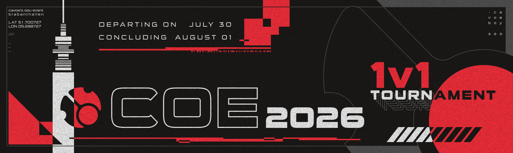

# COE 2026 1v1 Tournament

The **COE 2026 1v1 Tournament** was a 1v1 single-elimination osu! LAN tournament run entirely in the [osu!(lazer)](/wiki/Client/Release_stream/Lazer) client, and hosted during [cavoe's osu! event](/wiki/Community/cavoe's_osu!_event) 2026 (COE 2026) at Brabanthallen in 's-Hertogenbosch, Netherlands. It was the sixth instalment of the COE tournament series.

## Tournament schedule

| Event | Timestamp |
| --: | :-- |
| Registration | 2026-06-01/2026-06-13 |
| Online qualifiers | 2026-06-15/2026-04-29 |
| Online stage | 2026-07-11/2026-07-19 |
| Qualifier results reveal & Finals mappool showcase | 2026-07-27 (15:30 UTC+2) |
| Finals | 2026-07-30/2026-08-01 |

## Prizes

The COE 2026 1v1 Tournament prizes are yet to be announced.

| Placing | Prize(s) |
| :-: | :-- |
|  | 1200€, a Prize from Wooting TBA, COE Merchandise TBA |
|  | 750€, a Prize from Wooting TBA, COE Merchandise TBA |
|  | 500€, a Prize from Wooting TBA, COE Merchandise TBA |
| 4th place | 350€, COE Merchandise TBA |
| 5th-8th place | 250€, COE Merchandise TBA |
| 9th-16th place | 150€, COE Merchandise TBA |

## Organisation

| Position | Member(s) |
| :-- | :-- |
| Admins | ::{ flag=NL }:: [cavoeboy](https://osu.ppy.sh/users/7361815), ::{ flag=DE }:: [Meyer](https://osu.ppy.sh/users/5452367), ::{ flag=DE }:: [TheHunter1](https://osu.ppy.sh/users/6496016), ::{ flag=FR }:: [ThePooN](https://osu.ppy.sh/users/718454) |
| Mappool selector | ::{ flag=DE }:: [Bernkastel](https://osu.ppy.sh/users/5154946), ::{ flag=US }:: [chiv](https://osu.ppy.sh/users/6701656) |
| Mapper | TBA |
| Custom music producer | TBA |
| GFX | TBA |
| Storyboarder | ::{ flag=HU }:: Himada |
| Commentator | TBA |
| Referee | ::{ flag=NL }:: [Albionthegreat](https://osu.ppy.sh/users/9853595), ::{ flag=SE }:: [ellen-](https://osu.ppy.sh/users/7630166), ::{ flag=CL }:: [Isita](https://osu.ppy.sh/users/13973026), ::{ flag=US }:: [Suicune3](https://osu.ppy.sh/users/6895187), ::{ flag=DE }:: [TheHunter1](https://osu.ppy.sh/users/6496016) |
| Statistician | ::{ flag=NL }:: [Timper](https://osu.ppy.sh/users/11955929) |

## Links

- **[Information sheet]()**
- [COE website](https://cavoe.events)
- [Livestream](https://twitch.tv/coevent)
- [COE Discord server](https://discord.com/invite/d6ru6PVcSY)
- [COE 1v1 Tournament Discord server](https://discord.gg/zJ7e6cTVFh)
- [COE Twitter](https://twitter.com/CavoesOsuEvent)

## Participants

Detailed qualifier results can be found [here]().

| Qualifier seed | Player |
| :-: | :-- |
| 1–8 | TBA |
| 9–24 | TBA |
| 25–40 | TBA |
| *N/A* | TBA |

## Podium

| Placing | Player |
| :-: | :-- |
|  | TBD |
|  | TBD |
|  | TBD |

## Mappools

### Online qualifiers

- No Mod
  1. [yamazaki - tanshinjuu [~WARNING~ aspen's NERF jump[AR9.99]]](https://osu.ppy.sh/beatmapsets/2527457#osu/5584095)
  2. [Unlucky Morpheus x UNDEAD CORPORATION - You're Better Off Alive [virttoki, the jelqeration]](https://osu.ppy.sh/beatmapsets/1981006#osu/4113524)
  3. [Frums - Zephyrs [Another]](https://osu.ppy.sh/beatmapsets/2471977#osu/5416125)
  4. [ZxNX & Delaina - Hydra [HERACLES]](https://osu.ppy.sh/beatmapsets/2117695#osu/4447485)
- Hidden
  1. [Shoichiro Sakamoto - Eiyuu no Tsurugi [Final]](https://osu.ppy.sh/beatmapsets/1864097#osu/3833517)
  2. [sasakure.UK - A.D.3039 no Hatena [Progress]](https://osu.ppy.sh/beatmapsets/2117464#osu/4598262)
- Hard Rock
  1. [ZAQ - Minor Piece [Melancholy]](https://osu.ppy.sh/beatmapsets/2147857#osu/4524272)
  2. [*NSYNC - Bye Bye Bye [blah]](https://osu.ppy.sh/beatmapsets/2210359#osu/4681932)
- Double Time
  1. [Birdy - Wings (Nu:Logic Remix) [Freedom]](https://osu.ppy.sh/beatmapsets/319375#osu/710881)
  2. [Hayakore Tatsumi - Thousandth Sky (Over Clouds Mix) [V///A]](https://osu.ppy.sh/beatmapsets/2455788#osu/5367107)
  3. [Halozy - 143 (extended mix) [Lunatic]](https://osu.ppy.sh/beatmapsets/1132649#osu/2365788)

## Match results

### Offline stage

The bracket for the offline stage can be found [here]().

Thursday, 30th of July 2026:

| Player 1 |  |  | Player 2 | Match link |
| --: | :-: | :-: | :-- | :-- |
| **** ::{ flag= }:: | 0 | 0 | ::{ flag= }::  | [#1]() |
| **** ::{ flag= }:: | 0 | 0 | ::{ flag= }::  | [#1]() |
| **** ::{ flag= }:: | 0 | 0 | ::{ flag= }::  | [#1]() |
| **** ::{ flag= }:: | 0 | 0 | ::{ flag= }::  | [#1]() |
| **** ::{ flag= }:: | 0 | 0 | ::{ flag= }::  | [#1]() |
| **** ::{ flag= }:: | 0 | 0 | ::{ flag= }::  | [#1]() |
| **** ::{ flag= }:: | 0 | 0 | ::{ flag= }::  | [#1]() |
| **** ::{ flag= }:: | 0 | 0 | ::{ flag= }::  | [#1]() |

Friday, 31st July 2026:

| Player 1 |  |  | Player 2 | Match link |
| --: | :-: | :-: | :-- | :-- |
| **** ::{ flag= }:: | 0 | 0 | ::{ flag= }::  | [#1]() |
| **** ::{ flag= }:: | 0 | 0 | ::{ flag= }::  | [#1]() |
| **** ::{ flag= }:: | 0 | 0 | ::{ flag= }::  | [#1]() |
| **** ::{ flag= }:: | 0 | 0 | ::{ flag= }::  | [#1]() |

Saturday, 1st of August 2026:

| Player 1 |  |  | Player 2 | Match link |
| --: | :-: | :-: | :-- | :-- |
| **** ::{ flag= }:: | 0 | 0 | ::{ flag= }::  | [#1]() |
| **** ::{ flag= }:: | 0 | 0 | ::{ flag= }::  | [#1]() |
| **** ::{ flag= }:: | 0 | 0 | ::{ flag= }::  | [#1]() |
| **** ::{ flag= }:: | 0 | 0 | ::{ flag= }::  | [#1]() |

### Online stage

The bracket for the online stage can be found [here]().

Saturday, 11th of July 2026:

| Player 1 |  |  | Player 2 | Match link |
| --: | :-: | :-: | :-- | :-- |
| **** ::{ flag= }:: | 0 | 0 | ::{ flag= }::  | [#1]() |
| **** ::{ flag= }:: | 0 | 0 | ::{ flag= }::  | [#1]() |
| **** ::{ flag= }:: | 0 | 0 | ::{ flag= }::  | [#1]() |
| **** ::{ flag= }:: | 0 | 0 | ::{ flag= }::  | [#1]() |
| **** ::{ flag= }:: | 0 | 0 | ::{ flag= }::  | [#1]() |
| **** ::{ flag= }:: | 0 | 0 | ::{ flag= }::  | [#1]() |
| **** ::{ flag= }:: | 0 | 0 | ::{ flag= }::  | [#1]() |
| **** ::{ flag= }:: | 0 | 0 | ::{ flag= }::  | [#1]() |

Sunday, 12th of July 2026:

| Player 1 |  |  | Player 2 | Match link |
| --: | :-: | :-: | :-- | :-- |
| **** ::{ flag= }:: | 0 | 0 | ::{ flag= }::  | [#1]() |
| **** ::{ flag= }:: | 0 | 0 | ::{ flag= }::  | [#1]() |
| **** ::{ flag= }:: | 0 | 0 | ::{ flag= }::  | [#1]() |
| **** ::{ flag= }:: | 0 | 0 | ::{ flag= }::  | [#1]() |
| **** ::{ flag= }:: | 0 | 0 | ::{ flag= }::  | [#1]() |
| **** ::{ flag= }:: | 0 | 0 | ::{ flag= }::  | [#1]() |
| **** ::{ flag= }:: | 0 | 0 | ::{ flag= }::  | [#1]() |
| **** ::{ flag= }:: | 0 | 0 | ::{ flag= }::  | [#1]() |

Saturday, 18th of July 2026:

| Player 1 |  |  | Player 2 | Match link |
| --: | :-: | :-: | :-- | :-- |
| **** ::{ flag= }:: | 0 | 0 | ::{ flag= }::  | [#1]() |
| **** ::{ flag= }:: | 0 | 0 | ::{ flag= }::  | [#1]() |
| **** ::{ flag= }:: | 0 | 0 | ::{ flag= }::  | [#1]() |
| **** ::{ flag= }:: | 0 | 0 | ::{ flag= }::  | [#1]() |

Sunday, 19th of July 2026:

| Player 1 |  |  | Player 2 | Match link |
| --: | :-: | :-: | :-- | :-- |
| **** ::{ flag= }:: | 0 | 0 | ::{ flag= }::  | [#1]() |
| **** ::{ flag= }:: | 0 | 0 | ::{ flag= }::  | [#1]() |
| **** ::{ flag= }:: | 0 | 0 | ::{ flag= }::  | [#1]() |
| **** ::{ flag= }:: | 0 | 0 | ::{ flag= }::  | [#1]() |

## Ruleset

### 1. General information

#### 1.1 Range of validity

The COE 2026 1v1 Tournament is operated as part of COE 2026 by Stichting CAVOE EVENTS.

The rules outlined in this rulebook are to be followed by all participants and for all matches played. By participating in the tournament the participant states that they understand and accept all rules.

Stichting CAVOE EVENTS reserves the right to modify this rulebook without notice.

#### 1.2 Participant details

The tournament is split into 3 stages: qualifiers, play-in bracket and final bracket.
All bracket matches will be direct 1v1 best of 9 matches, except for the Grand Final and 3rd-place matches that will be best of 11. Freeplay and freemod are not enabled throughout the tournament.

#### 1.3 Confidentiality

The content of any correspondence with tournament officials and administrators are deemed confidential. The publication of such material is prohibited for both the participants and tournament officials.

#### 1.4 Broadcast rights

All broadcasting rights of the tournament are owned by Stichting CAVOE EVENTS. This includes but is not limited to, video streams, shoutcast streams, replays, clips and TV broadcasts.

Participants can not refuse to have their matches broadcast, nor can they choose the manner the match will be broadcast.

Stichting CAVOE EVENTS has the right to grant the broadcasting rights to a third party.
Further Stichting CAVOE EVENTS is granting broadcasting rights for single matches to participants if following criteria are met:
The participant is taking part in an online match
The participant clearly marks that the broadcast is for the tournament (e.g. “COE 2026 1v1” in the title)
The participant only shows their point of view of the match

If you would like to acquire broadcast rights as a third party you can get in contact as outlined in 1.4

#### 1.5 Contact

For any questions, notes, or suggestions regarding this rulebook, please contact the tournament organization via Discord https://discord.gg/zJ7e6cTVFh

#### 1.6 Participant Details

###### 1.6.1 Participation

Players do not need to sign up prior to playing the qualifiers. Participating in any qualifier match constitutes a sign up and thus binds the player to adhere to the [osu! community rules](https://osu.ppy.sh/wiki/en/Rules) in addition to this rulebook. Compliance will be screened by COE and osu! staff.

Players will need to use both an osu! account and a Discord account during the tournament. No account changes can be made after playing the qualifier.

Players qualified for the Round of 16 must play on-site. Every qualified player must own a COE Event or BYOC ticket.

No member of the tournament organization may sign up for the tournament, with the exception of commentators.

###### 1.6.2 Further details

When requested, participants are required to send us all needed information including but not limited to full name, contact details, date of birth, phone number and address.

Data collected by Stitching CAVOE EVENTS as part of the sign-up process and ticket purchase is governed by our [Privacy Policy](https://cavoe.events/privacy).

Participants qualified for the final phase of the tournament at the event agree to give up their right to their image, which may be used during broadcasts or any recording of the tournament. Additionally each participant has to sign a release form that they will receive before the final phase of the tournament.

Participants are required to attend any interviews, press conferences or autograph, photography or video sessions Stichting CAVOE EVENTS and the COE team deem necessary. This further extends to the mandatory media day, where participants will be photographed, filmed and interviewed for the event presentation. 

Participants will receive a media schedule beforehand to be informed about the nature, duration and schedule of any activities of this kind that take more than 10 minutes.

Additionally the participants in the grand final and the winner of the match for third place are required to attend the prize ceremony.

#### 1.7 Prize money

The prize money should ideally be paid out 90 days after the tournament has concluded, but may take as long as 180 days for the payment to be completed. If a participant has not provided any payment method to the tournament organization, the payment will be delayed until this is rectified.

Stichting CAVOE EVENTS reserves the right to cancel any pending payment, if any evidence of fraud or foul play has been discovered.

Stichting CAVOE EVENTS is not liable for any taxes or fees the participant may have to deduct from the prize.

Physical and monetary prizes are yet to be determined.

### 2. Requirements

#### 2.1 Game requirements

articipants are not allowed to use custom skin elements to alter core gameplay elements or mechanics. Any modifications to the game not intended by the developer are also strictly forbidden.

osu!lazer will be used throughout the whole tournament, in the osu! game mode. Participants are expected to always perform updates as prompted by the game.

#### 2.2 Punctuality

Should a participant not be present at the allotted match time for check-in and matches they will be given a forfeit loss. Participants are also expected to keep the match running fluently and without intentional delays. Excessive match delays results in penalties being applied at the discretion of the referee.

#### 2.3 Drivers and setup

During the stages of the tournament that are played in a LAN setting participants are required to inform tournament officials ahead of time which drivers they need for their equipment. Only open source and drivers supplied by the manufacturer are allowed to be used.

Participants will be given the chance before any LAN matches start to configure their drivers and the rest of the setup to their liking.

We reserve the right to inspect any equipment brought by participants and deny it being used, if an attempt at foul play is suspected.

### 3. Qualifiers

#### 3.1 Format overview

During the qualifier, each participant will be given one attempt to set a high score on each map of the map pool. These attempts will be in matches scheduled beforehand.

The map pool consists of:
4 maps played using no mod
2 maps played using “Hidden”
2 maps played using “Hard Rock”
3 maps played using “Double Time”

Each score will be used to determine the seeding. The seeding method used is x=(y-AVERAGE(z))/STDEV.S(z) where x is the point result for that map, y is the achieved score on map and z is all scores on map. All x's for a player are added up to form their final qualifier result.
The top 24 players will advance to the play-in phase.

#### 3.2 Match procedure

The organization opens a playlist lobby in osu!lazer.

Players can join and play any time during this stage, as long as they’ve registered beforehand.

Players should play each song one time only. Scores can be submitted until the playlist closes.

The chat will not be monitored. Participants are expected to reach the organization through the Discord server during that stage.

### 4. Play-in phase

#### 4.1 Stage overview

Players ranked 9-24 following qualifiers will be matched against each other in round 1.

Winners of round 1 will advance to round 2, where they face off against players ranked 1-8 following qualifiers.
Losers of round 1 will advance to round 3.

Winners of round 2 are qualified for the final stage.
Losers of round 2 will advance to round 3.

Winners of round 3 are qualified for the final stage.

Every player is placed according to traditional seeding rules.

There will be one ban for each player.

The map pool consists of:
5 maps played using no mod
2 maps played using “Hidden”
2 maps played using “Hard Rock”
3 maps played using “Double Time”
1 map used to break ties.

There are no free mod picks in this map pool.

#### 4.2 Scheduling

The matches will start once the scheduled time is reached and a referee is present. Players can request a different schedule. The organization will evaluate requests based on available resources and the broadcast schedule.

Players are required to check in with the assigned referee 10 minutes prior to the match.

Rounds with disconnects within 30 seconds or 25% of the beatmap length, whichever happens first, can be replayed, at the discretion of the referee, as long as the problem was clearly communicated in time.

### 5. Finals

#### 5.1 Stage overview

The finals consist of a single elimination bracket, with an additional match deciding the third place.

There will be one protect and two bans for each player.

The map pool consists of:
5 maps played using no mod
3 maps played using “Hidden”
3 maps played using “Hard Rock”
3 maps played using “Double Time”
1 map used to break ties.

There are no free mod picks in this map pool.

#### 5.2 Scheduling

Matches are scheduled beforehand. The schedule can not be changed. If a player can't participate at the scheduled time the match will be forfeited and the other player handed a default win. Any changes to the schedule will be announced in due time.

Participants may recheck and reconfigure their setup up to 15 minutes before the scheduled match time.

### 6. Bracket Match During the match

Once both players and a referee join the match, both players will begin by rolling using the in-game method.
In offline matches, a physical method may be used instead.

During the final stage, the loser of the roll will then be able to protect a map from the map pool from being banned, followed by the winner of the roll doing the same.
Then, during both the play-in and final stages, the winner of the roll decides on the order of the bans OR the picks. The loser decides on the order of the other option.
Afterwards the players will ban 1 map each in the order chosen. During the Finals stage each player will ban 2 maps each in the order chosen.

The players then alternate picking the map. If they reach a tie after playing 8 maps (or 10 maps in BO11 matches), the tiebreaker will be picked automatically.
Between each map there is a short break of a few seconds during which the next map must be picked.

Once any player reaches 5 map wins (or 6 wins in bo11 matches), the match is over and the winner advances to the next match.

Rounds with disconnects within 30 seconds or 25% of the beatmap length, whichever happens first, can be replayed, at the discretion of the referee, as long as the problem was clearly communicated in time.

Should a map end in a draw the beatmap will be replayed, before moving on to the next pick.

### 7 Code of conduct

#### 7.1 Tournament management

Instructions of the referees and the tournament management are to be followed. Decisions labeled as final are not to be objected to.

The tournament management and referees have all rights to apply the rulebook in relation to the tournament and all its matches and give warnings and/or penalties to the participants as they see fit.

#### 7.2 Forbidden behaviors

Participants will be sanctioned if they are violating or attempting to violate any of the following rules:

- Using insulting language and/or gestures, in-game or in person
- Gaining an unfair advantage through any means, including, but not limited to:
  - Cheating software
  - Information abuse
  - Doping
- Showing unsporting behavior
- Faking or being misleading regarding their identity
- Misleading referees
- Not putting in any effort to win a match / Match fixing
- Not following the osu! community guidelines
- Breaking any local laws
- Betting on any matches. This also applies to all staff
- Damaging any equipment that is not your own

#### 7.3 Clothing

For your own safety you are required to wear closed shoes ( no flip flops or sandals ). We further recommend long trousers. Headwear is allowed.
Failure to comply will lead to disqualification

#### 7.4 Disqualification

Breaking any of the rules outlined in this document may result in disqualification. Should a participant be disqualified, they are not entitled to any prizes.

#### 7.5 Tournament report form

Any breach of the rules should be reported to the tournament organization without delay.

This tournament is also overseen by the Tournament Committee. You may bring to their attention issues such as breaches of competitive integrity or other concerns through their [tournament report form](https://tcomm.hivie.tn/reports/create)!