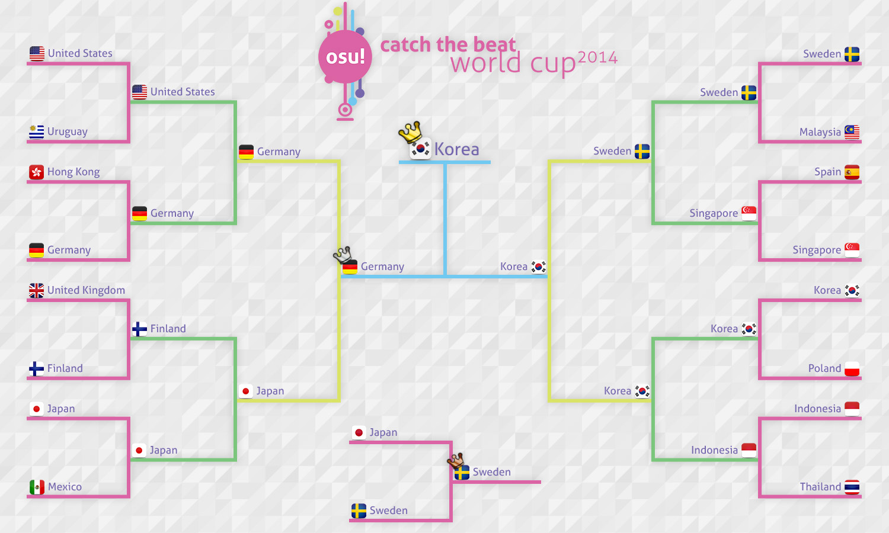

---
tags:
  - CWC 2014
  - CWC2014
---

# osu! Catch the Beat World Cup 2014

La **osu! Catch the Beat World Cup 2014** (***CWC 2014*** ) fue un torneo por países de Catch the Beat organizado por el [equipo osu!](/wiki/People/osu!_team). Ha sido la 3ra entrega de la osu! Catch the Beat World Cup.

## Calendario

| Evento | Fecha y Hora |
| --: | :-- |
| Inscripciones | 11/4/2014 - 20/4/2014 |
| Sorteos | 3/5/2014 (14:00 UTC) |
| Fase de grupos | 17/5/2014 |
| Octavos de final | 24/5/2014 |
| Cuartos de final | 1/6/2014 |
| Semifinales | 8/6/2014 |
| Final | 15/6/2014 |

## Premios

| Lugar | Premios |
| :-: | :-- |
|  | 6 meses de osu!supporter, placa única para el perfil, mercancía de osu! |
|  | 3 meses de osu!supporter |
|  | 1 mes de osu!supporter |

## Organización

La **osu! Catch the Beat World Cup 2014** estuvo a cargo de varios miembros de la comunidad.

| Cargo | Miembro(s) |
| :-- | :-- |
| Administración | ::{ flag=DE }:: [Loctav](https://osu.ppy.sh/users/71366), ::{ flag=DE }:: [p3n](https://osu.ppy.sh/users/123703) |
| Selección de mapas | ::{ flag=KR }:: [CLSW](https://osu.ppy.sh/users/531253), ::{ flag=ES }:: [Deif](https://osu.ppy.sh/users/318565), ::{ flag=FR }:: [Drafura](https://osu.ppy.sh/users/326099) |
| Transmisión en vivo | ::{ flag=AU }:: [peppy](https://osu.ppy.sh/users/2), ::{ flag=FR }:: [shARPII](https://osu.ppy.sh/users/776257) |
| Comentaristas | ::{ flag=AU }:: [Ephemeral](https://osu.ppy.sh/users/102335), ::{ flag=CA }:: [Kitokofox](https://osu.ppy.sh/users/1815420), ::{ flag=DE }:: [Loctav](https://osu.ppy.sh/users/71366), ::{ flag=US }:: [-Ryuujii-](https://osu.ppy.sh/users/2107523) |
| Estadísticas | ::{ flag=PL }:: [Marcin](https://osu.ppy.sh/users/722665) |

## Enlaces

- [Hilo de discusión (en inglés)](https://osu.ppy.sh/community/forums/topics/200185)
- [osu! Catch the Beat World Cup 2014 en Twitch](https://www.twitch.tv/osulive)
- **[Hoja de estadísticas](https://tournaments.hiroto.eu/results/view/1)**

## Participantes

|  | País | Miembros |
| --: | :-: | :-- |
| ::{ flag=AR }:: | **Argentina** | **[NightWar](https://osu.ppy.sh/users/1209167)**, [Gundisalv](https://osu.ppy.sh/users/1160340), [Litooo](https://osu.ppy.sh/users/1170107), [musicguy007](https://osu.ppy.sh/users/2159777) |
| ::{ flag=AT }:: | **Austria** | **[\[ K a z u \]](https://osu.ppy.sh/users/1902480)**, [Raaban](https://osu.ppy.sh/users/1569025), [xXMarcelXx](https://osu.ppy.sh/users/2355698), [Zuyanta](https://osu.ppy.sh/users/2772759) |
| ::{ flag=BO }:: | **Bolivia** | **[donjuan\_217](https://osu.ppy.sh/users/2169426)**, [brian\_rqc](https://osu.ppy.sh/users/3710738), [gakupoXD](https://osu.ppy.sh/users/871103), [Zen Youkai](https://osu.ppy.sh/users/3364257) |
| ::{ flag=CA }:: | **Canadá** | **[Kitokofox](https://osu.ppy.sh/users/1815420)**, [Kitsunemimi](https://osu.ppy.sh/users/100037), [Sumaki](https://osu.ppy.sh/users/207916) |
| ::{ flag=CL }:: | **Chile** | *disuelto* |
| ::{ flag=CN }:: | **China** | **[Dusk](https://osu.ppy.sh/users/533210)**, [hy1hy1hy](https://osu.ppy.sh/users/243877), [Ibuki Suika](https://osu.ppy.sh/users/290249), [MisakaMikoto](https://osu.ppy.sh/users/434917) |
| ::{ flag=HR }:: | **Croacia** | **[Meikyuuiri Tsumi](https://osu.ppy.sh/users/404314)**, [Animewolf](https://osu.ppy.sh/users/949513), [TinTin](https://osu.ppy.sh/users/2227976) |
| ::{ flag=DK }:: | **Dinamarca** | **[-Crab-](https://osu.ppy.sh/users/2563435)**, [FlowHomie](https://osu.ppy.sh/users/2831095), [jacoblemming12](https://osu.ppy.sh/users/3593786), [TheCo0k1e](https://osu.ppy.sh/users/3386472) |
| ::{ flag=EE }:: | **Estonia** | **[fanatik](https://osu.ppy.sh/users/913992)**, [KostjaSun](https://osu.ppy.sh/users/2450912), [warstape](https://osu.ppy.sh/users/1133783) |
| ::{ flag=FI }:: | **Finlandia** | **[YERTI](https://osu.ppy.sh/users/1490757)**, [Mianki](https://osu.ppy.sh/users/39658), [MrSake](https://osu.ppy.sh/users/264729), [Static Noise Bird](https://osu.ppy.sh/users/826132) |
| ::{ flag=FR }:: | **Francia** | *disuelto* |
| ::{ flag=DE }:: | **Alemania** | **[DeathXHunter](https://osu.ppy.sh/users/405326)**, [NoteKuroi](https://osu.ppy.sh/users/186642), [Nyan-Zapo](https://osu.ppy.sh/users/480676) |
| ::{ flag=HK }:: | **Hong Kong** | **[alienflybot](https://osu.ppy.sh/users/636114)**, [\[\_NaGI\]](https://osu.ppy.sh/users/788406), [HineX](https://osu.ppy.sh/users/13854), [longkitang](https://osu.ppy.sh/users/1744806), [XXXZ](https://osu.ppy.sh/users/1226238) |
| ::{ flag=ID }:: | **Indonesia** | **[Shurelia](https://osu.ppy.sh/users/3807986)**, [- Rii -](https://osu.ppy.sh/users/3734591), [\_EliteYud\_](https://osu.ppy.sh/users/2365634), [Deceitful](https://osu.ppy.sh/users/1396447), [Yoshida Haru-](https://osu.ppy.sh/users/3073351) |
| ::{ flag=JP }:: | **Japón** | **[uppia](https://osu.ppy.sh/users/1513301)**, [giru HD](https://osu.ppy.sh/users/707456), [Lafollia](https://osu.ppy.sh/users/827985), [Magiyu](https://osu.ppy.sh/users/1667470), [rullu](https://osu.ppy.sh/users/595140), [sekirei](https://osu.ppy.sh/users/1643335) |
| ::{ flag=MY }:: | **Malasia** | **[-Rin](https://osu.ppy.sh/users/1202101)**, [kho keng chung](https://osu.ppy.sh/users/369045), [QHideaki13](https://osu.ppy.sh/users/733998), [Rick--](https://osu.ppy.sh/users/950241), [Shadow Fear](https://osu.ppy.sh/users/635485) |
| ::{ flag=MX }:: | **México** | **[Lostty](https://osu.ppy.sh/users/2118519)**, [blacklotus](https://osu.ppy.sh/users/2115337), [ChibiOzed](https://osu.ppy.sh/users/1690328) |
| ::{ flag=NL }:: | **Países Bajos** | **[Givralii](https://osu.ppy.sh/users/2466879)**, [CakeAndBanana](https://osu.ppy.sh/users/1981424), [Greaper](https://osu.ppy.sh/users/2369776), [Nebux](https://osu.ppy.sh/users/2342051), [wesley221](https://osu.ppy.sh/users/2407265) |
| ::{ flag=NZ }:: | **Nueva Zelanda** | **[IQ166](https://osu.ppy.sh/users/1452911)**, [JakeCC](https://osu.ppy.sh/users/88973), [Nibble147](https://osu.ppy.sh/users/3866541) |
| ::{ flag=NO }:: | **Noruega** | **[Kiwikun](https://osu.ppy.sh/users/1794766)**, [Azeidith](https://osu.ppy.sh/users/2819676), [Hakkun](https://osu.ppy.sh/users/2179438), [lanki33](https://osu.ppy.sh/users/2535200), [Zerzxes](https://osu.ppy.sh/users/2094253) |
| ::{ flag=PE }:: | **Perú** | *disuelto* |
| ::{ flag=PH }:: | **Filipinas** | *disuelto* |
| ::{ flag=PL }:: | **Polonia** | **[WujekGrzyb](https://osu.ppy.sh/users/258289)**, [Kosmit](https://osu.ppy.sh/users/1749173), [Scorpionek](https://osu.ppy.sh/users/149730), [wampir](https://osu.ppy.sh/users/261497) |
| ::{ flag=SG }:: | **Singapur** | **[Accel](https://osu.ppy.sh/users/1169796)**, [He Ang Erika](https://osu.ppy.sh/users/2451381), [Kagayane](https://osu.ppy.sh/users/1777691), [Otaku\_MQ](https://osu.ppy.sh/users/2650135), [Ridicule](https://osu.ppy.sh/users/3473425) |
| ::{ flag=KR }:: | **Corea del Sur** | **[Spectator](https://osu.ppy.sh/users/702598)**, [dae6254](https://osu.ppy.sh/users/563262), [Frobe](https://osu.ppy.sh/users/670365), [Kuzino](https://osu.ppy.sh/users/158552), [Last Bubble](https://osu.ppy.sh/users/1302259) |
| ::{ flag=ES }:: | **España** | **[SK Eternal](https://osu.ppy.sh/users/588046)**, [Raimon](https://osu.ppy.sh/users/609627), [RAMONLINKK](https://osu.ppy.sh/users/843155), [Nokeru-Chan](https://osu.ppy.sh/users/602315), [sarkras](https://osu.ppy.sh/users/709625) |
| ::{ flag=SE }:: | **Suecia** | **[Yukiteru Amano](https://osu.ppy.sh/users/1894511)**, [-Airi-](https://osu.ppy.sh/users/2546340), [Negri\_sk](https://osu.ppy.sh/users/2231396), [Suzuki](https://osu.ppy.sh/users/2960209), [Walterx8](https://osu.ppy.sh/users/1993041) |
| ::{ flag=TW }:: | **Taiwán** | *descalificados* |
| ::{ flag=TH }:: | **Tailandia** | **[boomngong](https://osu.ppy.sh/users/1090858)**, [0814587134](https://osu.ppy.sh/users/1054016), [Nansugumi](https://osu.ppy.sh/users/795915) |
| ::{ flag=GB }:: | **Reino Unido** | **[destructor966](https://osu.ppy.sh/users/2667584)**, [bubbz](https://osu.ppy.sh/users/86414), [Nanomight](https://osu.ppy.sh/users/160439), [DarkKanaki](https://osu.ppy.sh/users/2614160), [Phlo10](https://osu.ppy.sh/users/2643155) |
| ::{ flag=US }:: | **Estados Unidos** | **[Zak](https://osu.ppy.sh/users/1375955)**, [-itsy\_v2-](https://osu.ppy.sh/users/2815946), [-Kurisu-](https://osu.ppy.sh/users/500696), [Minky](https://osu.ppy.sh/users/1978891), [-Ryuuji-](https://osu.ppy.sh/users/2107523), [TenguKing9](https://osu.ppy.sh/users/1637716) |
| ::{ flag=UY }:: | **Uruguay** | **[Themaster155](https://osu.ppy.sh/users/1850067)**, [quique95](https://osu.ppy.sh/users/472924), [S3B4](https://osu.ppy.sh/users/3437784), [Truxxxton](https://osu.ppy.sh/users/1379428) |

## Groups

| Grupo A | Grupo B | Grupo C | Grupo D | Grupo E | Grupo F | Grupo G | Grupo H |
| :-- | :-- | :-- | :-- | :-- | :-- | :-- | :-- |
| ::{ flag=PH }:: Filipinas | ::{ flag=HK }:: Hong Kong | ::{ flag=TW }:: Taiwán | ::{ flag=AT }:: Austria | ::{ flag=MX }:: México | ::{ flag=ES }:: España | ::{ flag=KR }:: Corea del Sur | ::{ flag=AR }:: Argentina |
| ::{ flag=GB }:: Reino Unido | ::{ flag=PL }:: Polonia | ::{ flag=NL }:: Países Bajos | ::{ flag=FR }:: Francia | ::{ flag=DK }:: Dinamarca | ::{ flag=PE }:: Perú | ::{ flag=DE }:: Alemania | ::{ flag=CN }:: China |
| ::{ flag=TH }:: Tailandia | ::{ flag=CL }:: Chile | ::{ flag=SG }:: Singapur | ::{ flag=MY }:: Malasia | ::{ flag=NZ }:: Nueva Zelanda | ::{ flag=FI }:: Finlandia | ::{ flag=CA }:: Canadá | ::{ flag=UY }:: Uruguay |
| ::{ flag=US }:: Estados Unidos | ::{ flag=EE }:: Estonia | ::{ flag=NO }:: Noruega | ::{ flag=JP }:: Japón | ::{ flag=SE }:: Suecia | ::{ flag=HR }:: Croacia | ::{ flag=BO }:: Bolivia | ::{ flag=ID }:: Indonesia |

## Podio

La competición ha concluido con el siguiente podio:

| Lugar | País |
| :-: | :-- |
|  | ::{ flag=KR }:: **Corea del Sur** (**[Spectator](https://osu.ppy.sh/users/702598)**, [dae6254](https://osu.ppy.sh/users/563262), [Frobe](https://osu.ppy.sh/users/670365), [Kuzino](https://osu.ppy.sh/users/158552), [Last Bubble](https://osu.ppy.sh/users/1302259)) |
|  | ::{ flag=DE }:: **Alemania** (**[DeathXHunter](https://osu.ppy.sh/users/405326)**, [NoteKuroi](https://osu.ppy.sh/users/186642), [Nyan-Zapo](https://osu.ppy.sh/users/480676)) |
|  | ::{ flag=SE }:: **Suecia** (**[Yukiteru Amano](https://osu.ppy.sh/users/1894511)**, [-Airi-](https://osu.ppy.sh/users/2546340), [Negri\_sk](https://osu.ppy.sh/users/2231396), [Suzuki](https://osu.ppy.sh/users/2960209), [Walterx8](https://osu.ppy.sh/users/1993041)) |

## Mapas usados en el torneo (Mappools)

**[Todos los mapas del torneo pueden descargarse aquí](https://www.mediafire.com/download/4f58oh6oxxb75ws/CWC_Packs.zip)**

### Finales

**[¡Descarga el paquete de mapas aquí! (246 MB)](https://www.mediafire.com/download/xtg49nkipcsl6gu/CWC_Finals.rar)**

- NoMod
  1. [sakuzyo - AXION (DaxMasterix) \[Red Light \~CtB\~\]](https://osu.ppy.sh/beatmapsets/57468#fruits/173222)
  2. [LeaF - Calamity Fortune (Krah) \[Crystal's Overdose\]](https://osu.ppy.sh/beatmapsets/114741#fruits/344892)
  3. [Ryu\* vs. kors k - Force of Wind (Jenny) \[Extra\]](https://osu.ppy.sh/beatmapsets/44519#fruits/142239)
  4. [DJ Okawari - Flower Dance (CLSW) \[Steven's Flower\]](https://osu.ppy.sh/beatmapsets/130534#fruits/350899)
  5. [LeaF - Evanescent (Krah) \[Spec's Overdose\]](https://osu.ppy.sh/beatmapsets/176646#fruits/428612)
  6. [Ryu\* Vs. L.E.D.-G - PARADISE LOST (Kuzino) \[2Q\]](https://osu.ppy.sh/beatmapsets/36326#fruits/117383)
- Hidden
  1. [Rohi - Kanata ni Mau wa Sakura no Shirabe (NatsumeRin) \[Skystar's Extra\]](https://osu.ppy.sh/beatmapsets/93555#fruits/254296)
  2. [FOLiACETATE - Heterochromia Iridis (ktgster) \[Terror\]](https://osu.ppy.sh/beatmapsets/106443#fruits/279481)
  3. [Hatsune Miku & Megpoid Gumi - Ashurashurashura (Asgard) \[Insane\]](https://osu.ppy.sh/beatmapsets/36248#fruits/148911)
  4. [Nekomata Master - Smile of Split (Charles445) \[Insane\]](https://osu.ppy.sh/beatmapsets/56847#fruits/171678)
- HardRock
  1. [t+pazolite - Kick-ass Kung-fu Carnival (Zapy) \[Apocalypse\]](https://osu.ppy.sh/beatmapsets/70469#fruits/202799)
  2. [Akiakane - FlashBack (Kiiwa) \[Insane\]](https://osu.ppy.sh/beatmapsets/54672#fruits/166126)
  3. [Caravan Palace - Dragons (Charles445) \[Insane\]](https://osu.ppy.sh/beatmapsets/46733#fruits/145361)
  4. [paraoka - boot (rickyboi) \[Shoe\]](https://osu.ppy.sh/beatmapsets/50131#fruits/154226)
- DoubleTime
  1. [Zektbach - L'avide (eXseeD) \[gowww\]](https://osu.ppy.sh/beatmapsets/29496#fruits/103403)
  2. [ETIA. - Enkan no Kotowari (Rein0527) \[Another\]](https://osu.ppy.sh/beatmapsets/39889#fruits/126859)
  3. [IOSYS - Okuu's Nuclear Fusion Dojo (Mafiamaster) \[v2b's Insane\]](https://osu.ppy.sh/beatmapsets/8442#fruits/37166)
  4. [Mitsuki - The Final Tone of Rubble (soulfear) \[Shisu\]](https://osu.ppy.sh/beatmapsets/16440#fruits/58915)
- FreeMod
  1. [07th Expansion - rog-unlimitation (AngelHoney) \[AngelHoney\]](https://osu.ppy.sh/beatmapsets/28751#fruits/116128)
  2. [Hatsune Miku - Atama no Taisou (val0108) \[Nogard\]](https://osu.ppy.sh/beatmapsets/40344#fruits/133938)
  3. [Chata - Curry no Uta (yoshilove) \[yoshiwafu (AR10)\]](https://osu.ppy.sh/beatmapsets/107704#fruits/282467)
  4. [Mago de Oz - Xanandra (Xanandra) \[Insane\]](https://osu.ppy.sh/beatmapsets/74313#fruits/221026)
- Tiebreaker
  1. **[t+pazolite - Cheatreal (caren\_sk) \[CRN's Extra\]](https://osu.ppy.sh/beatmapsets/88180#fruits/240488)**

### Semifinales

**[¡Descarga el paquete de mapas aquí! (205 MB)](https://www.mediafire.com/download/c2o11bznoryz8wk/CWC_Semifinals.rar)**

- NoMod
  1. [goreshit - Satori De Pon! (eldnl) \[Fruitcore\]](https://osu.ppy.sh/beatmapsets/134990#fruits/338326)
  2. [Neru - Ningen Shikkaku (nold\_1702) \[Posthumous\]](https://osu.ppy.sh/beatmapsets/86983#fruits/237848)
  3. [yanaginagi - Muteki no Soldier (BinJip) \[Invincible\]](https://osu.ppy.sh/beatmapsets/52221#fruits/182001)
  4. void - Club Ibuki in Break All (Drafura) \[Etoile\]
  5. [UNDEAD CORPORATION - Yoru Naku Usagi wa Yume wo Miru (Strawberry) \[BakaNA\]](https://osu.ppy.sh/beatmapsets/59049#fruits/214248)
  6. [Giga-P - Okochama Sensou (tutuhaha) \[Extra\]](https://osu.ppy.sh/beatmapsets/131818#fruits/356818)
- Hidden
  1. [Eurobeat Brony - Discord (EuroChaos Mix) ft. Odyssey (ztrot) \[Utter Chaos\]](https://osu.ppy.sh/beatmapsets/37994#fruits/121836)
  2. [sampling masters MEGA - Chat! Chat! Chat! (Zekira) \[ZFN's\]](https://osu.ppy.sh/beatmapsets/24895#fruits/84485)
  3. [Zips - Heisei Cataclysm (Dark Fang) \[0108\]](https://osu.ppy.sh/beatmapsets/72217#fruits/220231)
  4. [Wotamin - Gigantic O.T.N (Star Stream) \[S.S\]](https://osu.ppy.sh/beatmapsets/80214#fruits/223397)
- HardRock
  1. [Dark PHOENiX - Taketori Hishou (KanbeKotori) \[Extra\]](https://osu.ppy.sh/beatmapsets/22276#fruits/86324)
  2. [Nekomata Master+ - squall (Rue) \[Insane\]](https://osu.ppy.sh/beatmapsets/66224#fruits/238938)
  3. [Hommarju feat. Latte - masterpiece (simplistiC) \[Insane\]](https://osu.ppy.sh/beatmapsets/12483#fruits/47152)
  4. [Pizuya's Cell x MyonMyon - Romantic Children (Frill) \[Lunatic\]](https://osu.ppy.sh/beatmapsets/18009#fruits/68431)
- DoubleTime
  1. [IOSYS - Chanteikku Sanyousei no Itazura Daisensou (Kochiya Sanae) \[Crazy Jay\]](https://osu.ppy.sh/beatmapsets/24448#fruits/91462)
  2. [Tatsh - Lunatic Tears...(Tatsh Remix) (Suzully) \[Patche\]](https://osu.ppy.sh/beatmapsets/26743#fruits/90032)
  3. [An - TearVid (Shiirn) \[Another\]](https://osu.ppy.sh/beatmapsets/37980#fruits/121804)
  4. [Rohi - Ichiru no Nozomi yo, Ano Tsuki e Hibike (pieguy1372) \[Insane\]](https://osu.ppy.sh/beatmapsets/95148#fruits/255705)
- FreeMod
  1. [IOSYS - Poinsettia (Aakiha) \[Lunatic\]](https://osu.ppy.sh/beatmapsets/18382#fruits/65233)
  2. [xi - FREEDOM DiVE (Nakagawa-Kanon) \[FOUR DIMENSIONS\]](https://osu.ppy.sh/beatmapsets/39804#fruits/129891)
  3. [Susumu Hirasawa - Big Brother (Gens) \[Insane\]](https://osu.ppy.sh/beatmapsets/10714#fruits/41586)
  4. [Demetori - Jehovah's YaHVeH (happy30) \[Lunatic\]](https://osu.ppy.sh/beatmapsets/9641#fruits/38294)
- Tiebreaker
  1. **[Hatsuki Yura - Yoiyami Hanabi (Lan wings) \[Lan\]](https://osu.ppy.sh/beatmapsets/115011#fruits/297463)**

### Cuartos de final

**[¡Descarga el paquete de mapas aquí! (258 MB)](https://www.mediafire.com/download/nzg9u43a8tpxz85/CWC_Quarter_finals.rar)**

- NoMod
  1. [LeaF - MEPHISTO (Alumetorz) \[Spec's Overdose\]](https://osu.ppy.sh/beatmapsets/106212#fruits/298908)
  2. [TJ.Hangneil - Kamui (7odoa) \[SHD\]](https://osu.ppy.sh/beatmapsets/39017#fruits/124664)
  3. [MiddleIsland - Aldo (Lan wings) \[Lan\]](https://osu.ppy.sh/beatmapsets/72767#fruits/207721)
  4. [wowaka - World's End Dancehall (CLSW) \[Rain\]](https://osu.ppy.sh/beatmapsets/108037#fruits/282770)
  5. [Beatdrop - Phase 1 (rickyboi) \[SHD\]](https://osu.ppy.sh/beatmapsets/54511#fruits/168031)
  6. [Jin - Outer Science (tutuhaha) \[Insane\]](https://osu.ppy.sh/beatmapsets/122376#fruits/313025)
- Hidden
  1. [Avicii - Wake Me Up (SuperMICrophone) \[Insane\]](https://osu.ppy.sh/beatmapsets/108633#fruits/283897)
  2. [Jeff Williams - Red Like Roses (feat. Casey Lee Williams) (Flower) \[Ruby\]](https://osu.ppy.sh/beatmapsets/90128#fruits/244781)
  3. [Megpoid GUMI & Kagamine Rin - Invisible (NatsumeRin) \[Rin\]](https://osu.ppy.sh/beatmapsets/45160#fruits/143036)
  4. [DECO\*27 feat. marina - Aimai Elegy (val0108) \[Red Light \~CtB\~\]](https://osu.ppy.sh/beatmapsets/43248#fruits/155227)
- HardRock
  1. [Jun.A - The Refrain of the Lovely Great War (KanbeKotori) \[Lunatic\]](https://osu.ppy.sh/beatmapsets/24325#fruits/82734)
  2. [Dark PHOENiX - Stirring an Autumn Moon (\_lolipop) \[Crazy Moon\]](https://osu.ppy.sh/beatmapsets/16650#fruits/59693)
  3. [ONE OK ROCK - Kanzen Kankaku Dreamer (Kuria) \[Insane\]](https://osu.ppy.sh/beatmapsets/66927#fruits/195165)
  4. [Hatsune Miku - Himitsu Keisatsu (Lalarun) \[Insane\]](https://osu.ppy.sh/beatmapsets/28165#fruits/94005)
- DoubleTime
  1. [NH22 - Corrosion (Lena) \[Lunatic\]](https://osu.ppy.sh/beatmapsets/17044#fruits/60941)
  2. [Atoguru - Itoshi Kimi wo Mitsuke ni (bakabaka) \[Insane\]](https://osu.ppy.sh/beatmapsets/29044#fruits/96523)
  3. [COOL&CREATE - Saishoukichiku Imouto Flandre S (dksslqj) \[Lunatic\]](https://osu.ppy.sh/beatmapsets/14853#fruits/54145)
  4. [Nekomata Master - Goodbye Heaven (alvisto) \[Another\]](https://osu.ppy.sh/beatmapsets/12688#fruits/48926)
- FreeMod
  1. [Renard - Blue Night (DoKoLP) \[DoKo\]](https://osu.ppy.sh/beatmapsets/31333#fruits/116006)
  2. [sun3 - Higan Retour (saymun) \[Lunatic\]](https://osu.ppy.sh/beatmapsets/14464#fruits/54373)
  3. [xi - Breakthrough Atmosphere (Shiirn) \[Guided Flame\]](https://osu.ppy.sh/beatmapsets/39412#fruits/125660)
  4. [Hatsune Miku & Megpoid Gumi - MATRYOSHKA (gowww) \[Insane\]](https://osu.ppy.sh/beatmapsets/19789#fruits/69405)
- Tiebreaker
  1. **[nano - Nevereverland (CLSW) \[Crystal\]](https://osu.ppy.sh/beatmapsets/149570#fruits/369563)**

### Octavos de final

**[¡Descarga el paquete de mapas aquí! (178 MB)](https://www.mediafire.com/download/sj3umn4ajmmebaz/CWC_Round_of_16.rar)**

- NoMod
  1. [ONE OK ROCK - Rock, Scissors, Paper (Haya) \[Tenshichan's Rain\]](https://osu.ppy.sh/beatmapsets/82282#fruits/242575)
  2. [Rita - Hajimari no Toki (Deif) \[Rain\]](https://osu.ppy.sh/beatmapsets/91485#fruits/247643)
  3. [Lon - Nijigen Dream Fever (Natteke) \[Nsane\]](https://osu.ppy.sh/beatmapsets/94744#fruits/254814)
  4. [DJ Fresh - Gold Dust (galvenize) \[Insane\]](https://osu.ppy.sh/beatmapsets/28107#fruits/93842)
  5. [Expander - Move That Body (fanzhen0019) \[EXTREME\]](https://osu.ppy.sh/beatmapsets/132586#fruits/352863)
  6. [Ara Potato - Skype x Can Can (Real) \[CTB Collab\]](https://osu.ppy.sh/beatmapsets/47078#fruits/150358)
- Hidden
  1. [Maksim Mrvica - Croatian Rhapsody (haha5957) \[Vivace\]](https://osu.ppy.sh/beatmapsets/54016#fruits/170608)
  2. [Nekomata Master - Silence (Tasha) \[Drafura's Rain\]](https://osu.ppy.sh/beatmapsets/127126#fruits/364516)
  3. [Megpoid GUMI & Megurine Luka - Speed (val0108) \[Speed\]](https://osu.ppy.sh/beatmapsets/25931#fruits/87764)
  4. [wa. vs ETIA. - Akasagarbha (DaxMasterix) \[Another\]](https://osu.ppy.sh/beatmapsets/39205#fruits/125128)
- HardRock
  1. [Humanoid - MENDES (yeahyeahyeahhh) \[Another\]](https://osu.ppy.sh/beatmapsets/21928#fruits/75831)
  2. [Ryu\* - bloomin' feeling (Nakagawa-Kanon) \[gowww\]](https://osu.ppy.sh/beatmapsets/28332#fruits/120366)
  3. [sakuzyo - VALLISTA (Shiirn) \[Another\]](https://osu.ppy.sh/beatmapsets/40056#fruits/127313)
  4. [MK feat. YURiE - Spiral (Lena) \[Insane\]](https://osu.ppy.sh/beatmapsets/16668#fruits/59679)
- DoubleTime
  1. [XS Project - Ya tashchus' ot kolotushek (iNickel) \[Azmato's Another\]](https://osu.ppy.sh/beatmapsets/119235#fruits/308593)
  2. [Korpiklaani - Vodka (Charles445) \[Insane\]](https://osu.ppy.sh/beatmapsets/26886#fruits/90466)
  3. [Aizawa - Flutter Girl (Shinxyn) \[Insane\]](https://osu.ppy.sh/beatmapsets/17103#fruits/61124)
  4. [Kagamine Rin - Love is War R184mm remix (Shinxyn) \[Shinde's Sensou\]](https://osu.ppy.sh/beatmapsets/15584#fruits/56524)
- FreeMod
  1. [DJ Genericname - Dear You (Rue) \[Dear Rue\]](https://osu.ppy.sh/beatmapsets/43466#fruits/136400)
  2. [ALiCE'S EMOTiON - Lorelei (saymun) \[Lunatic\]](https://osu.ppy.sh/beatmapsets/16437#fruits/59643)
  3. [MuryokuP - Catastrophe (meiikyuu) \[Cataclysm\]](https://osu.ppy.sh/beatmapsets/72740#fruits/207659)
  4. [Pendulum - The Vulture (La Cataline) \[Insane\]](https://osu.ppy.sh/beatmapsets/24163#fruits/82249)
- Tiebreaker
  1. **[Susumu Hirasawa - Pacific Rim Imitation Network (Gens) \[KIRBY Mix\]](https://osu.ppy.sh/beatmapsets/31119#fruits/105143)**

### Fase de grupos

**[¡Descarga el paquete de mapas aquí! (186 MB)](https://www.mediafire.com/download/070bbn8puhdwl7i/CWC_Grupo_Stage.rar)**

- NoMod
  1. [Rita - Princess Blood (Zweib) \[Insane\]](https://osu.ppy.sh/beatmapsets/94112#fruits/253528)
  2. [Zeami feat. Ayane - Senpuu no Mai (CS ver.) (lepidopodus) \[Niber's Insane\]](https://osu.ppy.sh/beatmapsets/19013#fruits/67217)
  3. [Igorrr - Mastication Numerique (grumd) \[Folie\]](https://osu.ppy.sh/beatmapsets/54182#fruits/164841)
  4. [Megurine Luka - Leia (Mafiamaster) \[gowww\]](https://osu.ppy.sh/beatmapsets/29064#fruits/96587)
  5. [Shihori - Day Breaker (Frostmourne) \[Lunatic\]](https://osu.ppy.sh/beatmapsets/91606#fruits/247999)
  6. [wa. remixed celas - Gin no Kaze (Fear) \[Another\]](https://osu.ppy.sh/beatmapsets/31167#fruits/102552)
  7. [07th Expansion - Final Answer (Shiirn) \[Question\]](https://osu.ppy.sh/beatmapsets/36272#fruits/117232)
  8. [Hatsune Miku - Kagerou Days (m i z u k i) \[mizuki\]](https://osu.ppy.sh/beatmapsets/37638#fruits/128668)
  9. [Takanashi Yasuharu - Doku Ryuu no Kobura (\_Kiva) \[Extra\]](https://osu.ppy.sh/beatmapsets/39950#fruits/128872)
  10. [goreshit - MATZcore (\_LRJ\_) \[Lolicore\]](https://osu.ppy.sh/beatmapsets/24388#fruits/83975)
- Hidden
  1. [3L - Extend Ash \~ Hourai Victim (Dangaard) \[Extra Stage\]](https://osu.ppy.sh/beatmapsets/8593#fruits/36223)
  2. [Syuiro - Ama no Jaku (Natteke) \[Insane\]](https://osu.ppy.sh/beatmapsets/39817#fruits/126677)
  3. [paraoka - Manima ni (Sandpig) \[('(oo)')\]](https://osu.ppy.sh/beatmapsets/43107#fruits/135396)
- HardRock
  1. [DJ Okawari - Flower Dance (JauiPlaY) \[Flower\]](https://osu.ppy.sh/beatmapsets/33688#fruits/123417)
  2. [Naoki & Tatsh - Red Zone (HenkieBP) \[Extra\]](https://osu.ppy.sh/beatmapsets/5731#fruits/28422)
  3. [Maximum the Hormone - What's up, people?! (TV Size) (Envi) \[Insane\]](https://osu.ppy.sh/beatmapsets/50763#fruits/155914)
- DoubleTime
  1. [Billy Talent - Fallen Leaves (MystykAMV) \[Insane\]](https://osu.ppy.sh/beatmapsets/49114#fruits/151569)
  2. [The Good Natured - Be My Animal (Larto) \[Rukarioman's Extreme\]](https://osu.ppy.sh/beatmapsets/26040#fruits/91495)
  3. [ZUN - Fall of Fall \~ Autumnal Waterfall (dksslqj) \[Lunatic\]](https://osu.ppy.sh/beatmapsets/15647#fruits/56542)
- FreeMod
  1. [Jun Wakita - Shounen A (Mystearica) \[Another\]](https://osu.ppy.sh/beatmapsets/8931#fruits/36161)
  2. [07th Expansion - rog-limitation (AngelHoney) \[Insane\]](https://osu.ppy.sh/beatmapsets/14994#fruits/54581)
  3. [Masayoshi Minoshima feat. nomico - Bad Apple](https://osu.ppy.sh/beatmapsets/18260#fruits/64780)
- Tiebreaker
  1. **[Boots Randolph - Yakety Sax (Mashley) \[Ridiculous\]](https://osu.ppy.sh/beatmapsets/17943#fruits/63804)**

## Resultados

### Finales

Domingo, 15 Junio 2014:

| Equipo 1 |  |  | Equipo 2 | Enlace de la partida |
| --: | :-: | :-: | :-- | :-- |
| **Suecia** ::{ flag=SE }:: | **6** | 5 | ::{ flag=JP }:: Japan | [#1](https://osu.ppy.sh/community/matches/7314303) |
| Germany ::{ flag=DE }:: | 3 | **6** | ::{ flag=KR }:: **Corea del Sur** | [#1](https://osu.ppy.sh/community/matches/7317343) |

### Semifinales

Domingo, 8 Junio 2014:

| Equipo 1 |  |  | Equipo 2 | Enlace de la partida |
| --: | :-: | :-: | :-- | :-- |
| Suecia ::{ flag=SE }:: | 2 | **6** | ::{ flag=KR }:: **Corea del Sur** | [#1](https://osu.ppy.sh/community/matches/7127415) |
| **Alemania** ::{ flag=DE }:: | **6** | 1 | ::{ flag=JP }:: Japón | [#1](https://osu.ppy.sh/community/matches/7128373) |

### Cuartos de final

Domingo, 1 Junio 2014:

| Equipo 1 |  |  | Equipo 2 | Enlace de la partida |
| --: | :-: | :-: | :-- | :-- |
| Finlandia ::{ flag=FI }:: | 4 | **5** | ::{ flag=JP }:: **Japón** | [#1](https://osu.ppy.sh/community/matches/6972405) |
| **Corea del Sur** ::{ flag=KR }:: | **5** | 2 | ::{ flag=ID }:: Indonesia | [#1](https://osu.ppy.sh/community/matches/6974337) |
| **Suecia** ::{ flag=SE }:: | **5** | 4 | ::{ flag=SG }:: Singapur | [#1](https://osu.ppy.sh/community/matches/6975640) |
| Estados Unidos ::{ flag=US }:: | 1 | **5** | ::{ flag=DE }:: **Alemania** | [#1](https://osu.ppy.sh/community/matches/6977532) |

### Octavos de final

Sábado, 24 Mayo 2014:

| Equipo 1 |  |  | Equipo 2 | Enlace de la partida |
| --: | :-: | :-: | :-- | :-- |
| Reino Unido ::{ flag=GB }:: | 0 | **5** | ::{ flag=FI }:: **Finlandia** | [#1](https://osu.ppy.sh/community/matches/6808334) |
| **Suecia** ::{ flag=SE }:: | **5** | 0 | ::{ flag=MY }:: Malasia | [#1](https://osu.ppy.sh/community/matches/6808918) |
| España ::{ flag=ES }:: | 2 | **5** | ::{ flag=SG }:: **Singapur** | [#1](https://osu.ppy.sh/community/matches/6810811) |
| **Indonesia** ::{ flag=ID }:: | **5** | 0 | ::{ flag=TH }:: Tailandia | [#1](https://osu.ppy.sh/community/matches/6835441) |
| **Corea del Sur** ::{ flag=KR }:: | **5** | 1 | ::{ flag=PL }:: Polonia | [#1](https://osu.ppy.sh/community/matches/6837116) |
| Hong Kong ::{ flag=HK }:: | 1 | **5** | ::{ flag=DE }:: **Alemania** | [#1](https://osu.ppy.sh/community/matches/6838919) |
| **Japón** ::{ flag=JP }:: | **5** | 1 | ::{ flag=MX }:: México | [#1](https://osu.ppy.sh/community/matches/6840792) |
| **Estados Unidos** ::{ flag=US }:: | **5** | 4 | ::{ flag=UY }:: Uruguay | [#1](https://osu.ppy.sh/community/matches/6842138) |

### Fase de grupos

Sábado, 17 Mayo 2014:

| Equipo 1 |  |  | Equipo 2 | Enlace de la partida |
| --: | :-: | :-: | :-- | :-- |
| Austria ::{ flag=AT }:: | 0 | **4** | ::{ flag=JP }:: **Japón** | [#1](https://osu.ppy.sh/community/matches/6655525) |
| **Corea del Sur** ::{ flag=KR }:: | **4** | 0 | Bolivia ::{ flag=BO }:: | [#1](https://osu.ppy.sh/community/matches/6655395) |
| China ::{ flag=CN }:: | 0 | **4** | **Uruguay** ::{ flag=UY }:: | *win by default* |
| Tailandia ::{ flag=TH }:: | 0 | **4** | **Estados Unidos** ::{ flag=US }:: | [#1](https://osu.ppy.sh/community/matches/6653614) |
| Reino Unido ::{ flag=GB }:: | 0 | **4** | **Tailandia** ::{ flag=TH }:: | [#1](https://osu.ppy.sh/community/matches/6657824) |
| **Taiwán** ::{ flag=TW }:: | **4** | 2 | Singapur ::{ flag=SG }:: | [#1](https://osu.ppy.sh/community/matches/6657864) |
| Argentina ::{ flag=AR }:: | 0 | **4** | **Indonesia** ::{ flag=ID }:: | [#1](https://osu.ppy.sh/community/matches/6657850) |
| **Polonia** ::{ flag=PL }:: | **4** | 0 | Estonia ::{ flag=EE }:: | [#1](https://osu.ppy.sh/community/matches/6657969) |
| Dinamarca ::{ flag=DK }:: | 0 | **4** | **Suecia** ::{ flag=SE }:: | [#1](https://osu.ppy.sh/community/matches/6658911) |
| **Países Bajos** ::{ flag=NL }:: | **4** | 2 | Noruega ::{ flag=NO }:: | [#1](https://osu.ppy.sh/community/matches/6658927) |
| **Germany** ::{ flag=DE }:: | **4** | 0 | Bolivia ::{ flag=BO }:: | *win by default* |
| **España** ::{ flag=ES }:: | **4** | 0 | Finlandia ::{ flag=FI }:: | [#1](https://osu.ppy.sh/community/matches/6659024) |
| **Alemania** ::{ flag=DE }:: | **4** | 1 | Canadá ::{ flag=CA }:: | [#1](https://osu.ppy.sh/community/matches/6662031) |
| **España** ::{ flag=ES }:: | **4** | 0 | Croacia ::{ flag=HR }:: | [#1](https://osu.ppy.sh/community/matches/6661946) |
| México ::{ flag=MX }:: | 1 | **4** | **Suecia** ::{ flag=SE }:: | [#1](https://osu.ppy.sh/community/matches/6662038) |
| Argentina ::{ flag=AR }:: | 0 | **4** | **Uruguay** ::{ flag=UY }:: | [#1](https://osu.ppy.sh/community/matches/6662109) |
| Reino Unido ::{ flag=GB }:: | 0 | **4** | **Estados Unidos** ::{ flag=US }:: | [#1](https://osu.ppy.sh/community/matches/6667279) |
| **México** ::{ flag=MX }:: | **4** | 0 | Nueva Zelanda ::{ flag=NZ }:: | [#1](https://osu.ppy.sh/community/matches/6667239) |
| **Canadá** ::{ flag=CA }:: | **4** | 0 | Bolivia ::{ flag=BO }:: | *win by default* |
| **Corea del Sur** ::{ flag=KR }:: | **4** | 2 | Alemania ::{ flag=DE }:: | [#1](https://osu.ppy.sh/community/matches/6680444) |
| **China** ::{ flag=CN }:: | **4** | 3 | Indonesia ::{ flag=ID }:: | [#1](https://osu.ppy.sh/community/matches/6680664) |
| Nueva Zelanda ::{ flag=NZ }:: | 0 | **4** | **Suecia** ::{ flag=SE }:: | *win by default* |
| Malasia ::{ flag=MY }:: | 1 | **4** | **Japón** ::{ flag=JP }:: | [#1](https://osu.ppy.sh/community/matches/6681641) |
| Dinamarca ::{ flag=DK }:: | 0 | 0 | Nueva Zelanda ::{ flag=NZ }:: | *nullified* |
| **Taiwán** ::{ flag=TW }:: | **4** | 0 | Países Bajos ::{ flag=NL }:: | [#1](https://osu.ppy.sh/community/matches/6681780) |
| **Indonesia** ::{ flag=ID }:: | **4** | 0 | Uruguay ::{ flag=UY }:: | [#1](https://osu.ppy.sh/community/matches/6682737) |
| **Hong Kong** ::{ flag=HK }:: | **4** | 3 | Polonia ::{ flag=PL }:: | [#1](https://osu.ppy.sh/community/matches/6682744) |
| **Singapur** ::{ flag=SG }:: | **4** | 2 | Noruega ::{ flag=NO }:: | [#1](https://osu.ppy.sh/community/matches/6682800) |
| **Taiwán** ::{ flag=TW }:: | **4** | 2 | Noruega ::{ flag=NO }:: | [#1](https://osu.ppy.sh/community/matches/6683945) |
| Austria ::{ flag=AT }:: | 0 | **4** | **Malasia** ::{ flag=MY }:: | [#1](https://osu.ppy.sh/community/matches/6683957) |
| Argentina ::{ flag=AR }:: | 0 | **4** | **Canadá** ::{ flag=CA }:: | *win by default* |
| **Corea del Sur** ::{ flag=KR }:: | **4** | 0 | Canadá ::{ flag=CA }:: | *win by default* |
| **Finlandia** ::{ flag=FI }:: | **4** | 0 | Croacia ::{ flag=HR }:: | [#1](https://osu.ppy.sh/community/matches/6685074) |
| Netherlands ::{ flag=NL }:: | 1 | **4** | **Singapore** ::{ flag=SG }:: | [#1](https://osu.ppy.sh/community/matches/6685076) |
| **México** ::{ flag=MX }:: | **4** | 0 | Denmark ::{ flag=DK }:: | *win by default* |
| **Hong Kong** ::{ flag=HK }:: | **4** | 0 | Estonia ::{ flag=EE }:: | [#1](https://osu.ppy.sh/community/matches/6685082) |

## Reglamento

### Reglas del torneo

1. La osu! Catch the Beat World Cup es un torneo por países en equipos de 3v3.
2. Los mapas de cada ronda serán anunciados por el selector de mapas con anticipación el domingo anterior a la fecha en la que los partidos tengan lugar. Solo estos mapas serán usados durante los respectivos partidos.
   - Un mapa será dado como desempate (o *tiebreaker*). Este mapa será jugado solo en caso de un empate.
   - Habrá también mapas para [Hidden](/wiki/Gameplay/Game_modifier/Hidden), [HardRock](/wiki/Gameplay/Game_modifier/Hard_Rock), [DoubleTime](/wiki/Gameplay/Game_modifier/Double_Time) y FreeMod.
3. El programa de partidos será establecido por la organización del torneo (ver abajo).
4. Si no hay un árbitro o miembro de la organización disponible, el partido será pospuesto.
5. El puntaje de jugadores que fallen un mapa no se agrega al puntaje total del equipo
   - Revivir y sobrevivir hasta el final se considera como pasarlo.
6. Está permitido el uso de [Visual Settings](/wiki/Client/Interface/Visual_settings).
7. Si un mapa termina en empate, será anulado.
8. Si un jugador se desconecta, es tratado como si hubiese fallado el mapa.
9. Los mapas no pueden ser re-usados en el mismo partido a menos que alguno haya sido anulado.
10. Si menos de 3 jugadores se presentan, el tiempo máximo que un partido puede posponerse es de 10 minutos.
11. Está permitido cambiar jugadores durante un partido.
    - Se puede cambiar solo un jugador por cada mapa.
12. El lag no es una razón válida para invalidar un mapa.
13. En la fase de grupos, 'Victoria por default' será considerada como victoria por 4:0, +1.0 score difference ratio o SDR.
14. Incidentes inesperados son manejados por la organización del torneo.
15. Cualquier modificación de estas reglas será anunciada.

### Inscripción

1. Tu equipo necesita **al menos 3 jugadores** para participar.
   1. El máximo de jugadores es 6.
   2. Tienes que especificar un capitán que representará al equipo.
2. Cada equipo representa a un país. Tienes que formar un equipo con jugadores del mismo país.
3. Para inscribirse [llena esta forma](https://docs.google.com/forms/d/1pUvBL8XNhl2aEonFiG2zZ44Tu13g6Ngqky_e9h0QLMI/edit). Después, verifica tu registro [enviándole un PM a Loctav](https://osu.ppy.sh/home/messages/users/71366) títulado “CWC Registration”
   - Los capitanes pueden cambiar el equipo [notificando a la organización](https://osu.ppy.sh/home/messages/users/71366).
   - Recibirás una confirmación en caso de que tu registro haya sido enviado exitosamente. Tu registro queda pendiente entonces.
4. Para asegurarse de que los registros son válidos y serios, cada uno será controlado por la organización del torneo.
5. La cantidad total de equipos es de 32.
   - Dependiendo de la cantidad de registros, el total de equipos podría cambiar.
6. Todos los equipos registrados exitosamente serán publicados después de la fase de inscripción.
   - Los capitanes serán notificados en caso de que su equipo haya sido aceptado o rechazado.
7. Los selectores de mapas no pueden participar como jugadores en el torneo.

### Instrucciones de etapas

1. En la primera etapa (Fase de grupos), los equipos serán divididos en 8 grupos de 4 equipos.
   - Esto podría cambiar de acorde con la cantidad final de equipos
2. Todos los equipos de cada grupo se enfrentarán entre ellos.
3. Las posiciones de cada grupo se determinan clasificando los resultados del desempeño de cada equipo en la siguiente prioridad:
   - Tiene mayoría de `{(número de mapas victoriosos) - (el número de mapas derrotados)}`.
   - Cantidad de mapas victoriosos.
   - Tienen mayor `∑{(diferencia de puntaje total) / (máximo puntaje)}`.
   - Ganador de la revancha.
4. Los 2 mejores equipos de cada grupo avanzan a la fase 'Knock-Out' .
5. Las siguientes fases son consideradas 'Knock-Out'. Esto significa que el ganador avanza a la siguiente fase y el equipo perdedor queda eliminado del torneo.
6. **Condiciones de victoria:**
   - En la fase de grupos, necesitarás ganar 4 mapas para resultar victorioso en el encuentro. (Mejor-de-7)
   - En los octavos de final y los cuartos de final, necesitarás ganar 5 mapas para resultar victorioso en el encuentro. (Mejor-de-9)
   - En las semifinales y las finales, necesitarás ganar 6 mapas para resultar victorioso en el encuentro. (Mejor-de-11)

### Instrucciones de partidas

1. Un árbitro creará una sala multijugador con 20 minutos de anticipación. Los jugadores deben reunirse en ese periodo.
   1. La sala estará bloqueada. La contraseña e invitación serán enviadas a los dos capitanes lo antes posible.
   2. La configuración de la sala será: Catch the Beat, Equipo-Vs., Win Condition: 'Score '. El nombre debe ser "CtB World Cup 2014: EquipoBlue vs EquipoRed"
   3. El primer equipo en el nombre de la sala será el azul, el otro equipo, el rojo.
2. Los jugadores son libres de elegir los dos mapas de calentamiento.
3. La elección de mapas se alternará entre cada capitán seleccionando un mapa del mappool. Cada capitán debe usar `!roll` en `#multiplayer` para determinar qué equipo elige primero.
   1. Los capitanes pueden elegir mapas NoMod y FreeMod libremente.
   2. La elección de mapas de mod específico es limitada. Cada capitán puede elegir solo un mapa de cada mod durante el partido.
      1. La elección de mapas FreeMod es ilimitada.
   3. En caso de un empate, debe ser jugado el mapa tiebreaker.
4. Los resultados serán publicados en una página de estadísticas.

### Instrucciones del mappool

1. Habrá 1 mappool para la fase de grupos, 1 mappool para los 16avos, 1 mappool para los cuartos de final, 1 mappool para las semifinales y 1 mappool para la final.
2. Cada mappool consiste de 5 grupos: NoMod, [Hidden](/wiki/Gameplay/Game_modifier/Hidden), [HardRock](/wiki/Gameplay/Game_modifier/Hard_Rock), [DoubleTime](/wiki/Gameplay/Game_modifier/Double_Time) y FreeMod.
3. Cada mappool consiste de 23 mapas en total.
4. Cada mappool tiene un tiebreaker.
5. Los mapas NoMod serán jugados sin mods activados.
6. Los mapas de Hidden, HardRock y DoubleTime serán jugados con los respectivos mods activados.
7. Los mapas FreeMod tendrán **Mods libres** activado. Cada jugador puede elegir usar Hidden, HardRock o ningún mod.
   1. Puedes usar más de un mod.
   2. En un mapa FreeMod, al menos un jugador de cada equipo debe usar un mod.
8. El tiebreaker será jugado bajo las condiciones FreeMod.
   1. En el tiebreaker no es necesario usar mods.
9. Los mapas NoMod serán:
   - 10 en la fase de grupos
   - 6 en la fase de eliminación directa
10. Los mapas de mod específico serán:
    - 3 en la fase de grupos
    - 4 en la fase de eliminación directa

### Instrucciones de programación

1. Cada ronda se llevará a cabo en **un fin de semana**.
2. Los partidos de la fase de grupos pueden superponerse.
3. Todas las fases de eliminación directa se llevarán a cabo el sábado o domingo (ver Tournament Schedule).
4. La planificación de los partidos estará a cargo del Tournament Management. Los horarios serán anunciados el domingo anterior a la fecha en la que los partidos tengan lugar. (por ej: el 11 de mayo para la fase de grupos). Los organizadores tratarán de buscar horarios adecuados a la zona horaria de los participantes.
5. Los capitanes son responsables de la disponibilidad de su equipo. La posibilidad de anotar a 6 jugadores es para asegurar que cada equipo puede presentar al menos tres jugadores para cada partido. Si un equipo no puede presentar tres jugadores para un partido, este será considerado como perdido.
