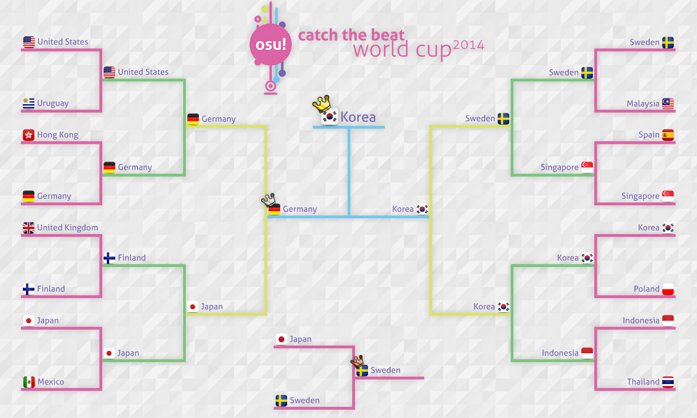

---
tags:
  - CWC 2014
  - CWC2014
---

# osu! Catch the Beat 2014 世界杯

**osu! Catch the Beat 2014 世界杯** (***CWC 2014*** ) 是由 [osu!团队](/wiki/People/osu!_team)举办的，以国家/地区为单位的官方锦标赛。这是 osu!catch 世界杯的第 3 届。

*注意：除非特殊说明，本文所提到的时区均以 **UTC（协调世界时）** 为准，货币单位均以 **USD（美元）** 为准。*

## 赛程

| 阶段 | 时间 |
| --: | :-- |
| 报名阶段 | 2014-04-11/2014-04-20 |
| 抽签直播 | 2014-05-03 (14:00 UTC) |
| 小组赛 | 2014-05-17 |
| 十六强赛 | 2014-05-24 |
| 四分之一决赛 | 2014-06-01 |
| 半决赛 | 2014-06-08 |
| 决赛 | 2014-06-15 |

## 奖品

| 名次 | 奖品 |
| :-: | :-- |
|  | 6 个月 osu!supporter，个人资料徽章，以及 osu! 周边 |
|  | 3 个月 osu!supporter |
|  | 1 个月 osu!supporter |

## 组织

osu!catch 2014 世界杯由多位社区成员举办。

| 职位 | 成员 |
| :-- | :-- |
| 比赛管理 | ::{ flag=DE }:: [Loctav](https://osu.ppy.sh/users/71366), ::{ flag=DE }:: [p3n](https://osu.ppy.sh/users/123703) |
| 图池管理 | ::{ flag=KR }:: [CLSW](https://osu.ppy.sh/users/531253), ::{ flag=ES }:: [Deif](https://osu.ppy.sh/users/318565), ::{ flag=FR }:: [Drafura](https://osu.ppy.sh/users/326099) |
| 直播员 | ::{ flag=AU }:: [peppy](https://osu.ppy.sh/users/2), ::{ flag=FR }:: [shARPII](https://osu.ppy.sh/users/776257) |
| 解说 | ::{ flag=AU }:: [Ephemeral](https://osu.ppy.sh/users/102335), ::{ flag=CA }:: [Kitokofox](https://osu.ppy.sh/users/1815420), ::{ flag=DE }:: [Loctav](https://osu.ppy.sh/users/71366), ::{ flag=US }:: [-Ryuujii-](https://osu.ppy.sh/users/2107523) |
| 统计员 | ::{ flag=PL }:: [Marcin](https://osu.ppy.sh/users/722665) |

## 相关链接

- [论坛讨论帖](https://osu.ppy.sh/community/forums/topics/200185)
- [Twitch 直播间](https://www.twitch.tv/osulive)
- **[统计表单](https://tournaments.hiroto.eu/results/view/1)**

## 参赛选手

|  | 国家/地区 | 选手 |
| --: | :-: | :-- |
| ::{ flag=AR }:: | **阿根廷** | **[NightWar](https://osu.ppy.sh/users/1209167)**, [Gundisalv](https://osu.ppy.sh/users/1160340), [Litooo](https://osu.ppy.sh/users/1170107), [musicguy007](https://osu.ppy.sh/users/2159777) |
| ::{ flag=AT }:: | **奥地利** | **[\[ K a z u \]](https://osu.ppy.sh/users/1902480)**, [Raaban](https://osu.ppy.sh/users/1569025), [xXMarcelXx](https://osu.ppy.sh/users/2355698), [Zuyanta](https://osu.ppy.sh/users/2772759) |
| ::{ flag=BO }:: | **玻利维亚** | **[donjuan\_217](https://osu.ppy.sh/users/2169426)**, [brian\_rqc](https://osu.ppy.sh/users/3710738), [gakupoXD](https://osu.ppy.sh/users/871103), [Zen Youkai](https://osu.ppy.sh/users/3364257) |
| ::{ flag=CA }:: | **加拿大** | **[Kitokofox](https://osu.ppy.sh/users/1815420)**, [Kitsunemimi](https://osu.ppy.sh/users/100037), [Sumaki](https://osu.ppy.sh/users/207916) |
| ::{ flag=CL }:: | **智利** | *disbanded* |
| ::{ flag=CN }:: | **中国** | **[Dusk](https://osu.ppy.sh/users/533210)**, [hy1hy1hy](https://osu.ppy.sh/users/243877), [Ibuki Suika](https://osu.ppy.sh/users/290249), [MisakaMikoto](https://osu.ppy.sh/users/434917) |
| ::{ flag=HR }:: | **克罗地亚** | **[Meikyuuiri Tsumi](https://osu.ppy.sh/users/404314)**, [Animewolf](https://osu.ppy.sh/users/949513), [TinTin](https://osu.ppy.sh/users/2227976) |
| ::{ flag=DK }:: | **丹麦** | **[-Crab-](https://osu.ppy.sh/users/2563435)**, [FlowHomie](https://osu.ppy.sh/users/2831095), [jacoblemming12](https://osu.ppy.sh/users/3593786), [TheCo0k1e](https://osu.ppy.sh/users/3386472) |
| ::{ flag=EE }:: | **爱沙尼亚** | **[fanatik](https://osu.ppy.sh/users/913992)**, [KostjaSun](https://osu.ppy.sh/users/2450912), [warstape](https://osu.ppy.sh/users/1133783) |
| ::{ flag=FI }:: | **芬兰** | **[YERTI](https://osu.ppy.sh/users/1490757)**, [Mianki](https://osu.ppy.sh/users/39658), [MrSake](https://osu.ppy.sh/users/264729), [Static Noise Bird](https://osu.ppy.sh/users/826132) |
| ::{ flag=FR }:: | **法国** | *disbanded* |
| ::{ flag=DE }:: | **德国** | **[DeathXHunter](https://osu.ppy.sh/users/405326)**, [NoteKuroi](https://osu.ppy.sh/users/186642), [Nyan-Zapo](https://osu.ppy.sh/users/480676) |
| ::{ flag=HK }:: | **香港** | **[alienflybot](https://osu.ppy.sh/users/636114)**, [\[\_NaGI\]](https://osu.ppy.sh/users/788406), [HineX](https://osu.ppy.sh/users/13854), [longkitang](https://osu.ppy.sh/users/1744806), [XXXZ](https://osu.ppy.sh/users/1226238) |
| ::{ flag=ID }:: | **印度尼西亚** | **[Shurelia](https://osu.ppy.sh/users/3807986)**, [- Rii -](https://osu.ppy.sh/users/3734591), [\_EliteYud\_](https://osu.ppy.sh/users/2365634), [Deceitful](https://osu.ppy.sh/users/1396447), [Yoshida Haru-](https://osu.ppy.sh/users/3073351) |
| ::{ flag=JP }:: | **日本** | **[uppia](https://osu.ppy.sh/users/1513301)**, [giru HD](https://osu.ppy.sh/users/707456), [Lafollia](https://osu.ppy.sh/users/827985), [Magiyu](https://osu.ppy.sh/users/1667470), [rullu](https://osu.ppy.sh/users/595140), [sekirei](https://osu.ppy.sh/users/1643335) |
| ::{ flag=MY }:: | **马来西亚** | **[-Rin](https://osu.ppy.sh/users/1202101)**, [kho keng chung](https://osu.ppy.sh/users/369045), [QHideaki13](https://osu.ppy.sh/users/733998), [Rick--](https://osu.ppy.sh/users/950241), [Shadow Fear](https://osu.ppy.sh/users/635485) |
| ::{ flag=MX }:: | **墨西哥** | **[Lostty](https://osu.ppy.sh/users/2118519)**, [blacklotus](https://osu.ppy.sh/users/2115337), [ChibiOzed](https://osu.ppy.sh/users/1690328) |
| ::{ flag=NL }:: | **荷兰** | **[Givralii](https://osu.ppy.sh/users/2466879)**, [CakeAndBanana](https://osu.ppy.sh/users/1981424), [Greaper](https://osu.ppy.sh/users/2369776), [Nebux](https://osu.ppy.sh/users/2342051), [wesley221](https://osu.ppy.sh/users/2407265) |
| ::{ flag=NZ }:: | **新西兰** | **[IQ166](https://osu.ppy.sh/users/1452911)**, [JakeCC](https://osu.ppy.sh/users/88973), [Nibble147](https://osu.ppy.sh/users/3866541) |
| ::{ flag=NO }:: | **挪威** | **[Kiwikun](https://osu.ppy.sh/users/1794766)**, [Azeidith](https://osu.ppy.sh/users/2819676), [Hakkun](https://osu.ppy.sh/users/2179438), [lanki33](https://osu.ppy.sh/users/2535200), [Zerzxes](https://osu.ppy.sh/users/2094253) |
| ::{ flag=PE }:: | **秘鲁** | *已解散* |
| ::{ flag=PH }:: | **菲律宾** | *已解散* |
| ::{ flag=PL }:: | **波兰** | **[WujekGrzyb](https://osu.ppy.sh/users/258289)**, [Kosmit](https://osu.ppy.sh/users/1749173), [Scorpionek](https://osu.ppy.sh/users/149730), [wampir](https://osu.ppy.sh/users/261497) |
| ::{ flag=SG }:: | **新加坡** | **[Accel](https://osu.ppy.sh/users/1169796)**, [He Ang Erika](https://osu.ppy.sh/users/2451381), [Kagayane](https://osu.ppy.sh/users/1777691), [Otaku\_MQ](https://osu.ppy.sh/users/2650135), [Ridicule](https://osu.ppy.sh/users/3473425) |
| ::{ flag=KR }:: | **韩国** | **[Spectator](https://osu.ppy.sh/users/702598)**, [dae6254](https://osu.ppy.sh/users/563262), [Frobe](https://osu.ppy.sh/users/670365), [Kuzino](https://osu.ppy.sh/users/158552), [Last Bubble](https://osu.ppy.sh/users/1302259) |
| ::{ flag=ES }:: | **西班牙** | **[SK Eternal](https://osu.ppy.sh/users/588046)**, [Raimon](https://osu.ppy.sh/users/609627), [RAMONLINKK](https://osu.ppy.sh/users/843155), [Nokeru-Chan](https://osu.ppy.sh/users/602315), [sarkras](https://osu.ppy.sh/users/709625) |
| ::{ flag=SE }:: | **瑞典** | **[Yukiteru Amano](https://osu.ppy.sh/users/1894511)**, [-Airi-](https://osu.ppy.sh/users/2546340), [Negri\_sk](https://osu.ppy.sh/users/2231396), [Suzuki](https://osu.ppy.sh/users/2960209), [Walterx8](https://osu.ppy.sh/users/1993041) |
| ::{ flag=TW }:: | **台湾** | *取消资格* |
| ::{ flag=TH }:: | **泰国** | **[boomngong](https://osu.ppy.sh/users/1090858)**, [0814587134](https://osu.ppy.sh/users/1054016), [Nansugumi](https://osu.ppy.sh/users/795915) |
| ::{ flag=GB }:: | **英国** | **[destructor966](https://osu.ppy.sh/users/2667584)**, [bubbz](https://osu.ppy.sh/users/86414), [Nanomight](https://osu.ppy.sh/users/160439), [DarkKanaki](https://osu.ppy.sh/users/2614160), [Phlo10](https://osu.ppy.sh/users/2643155) |
| ::{ flag=US }:: | **美国** | **[Zak](https://osu.ppy.sh/users/1375955)**, [-itsy\_v2-](https://osu.ppy.sh/users/2815946), [-Kurisu-](https://osu.ppy.sh/users/500696), [Minky](https://osu.ppy.sh/users/1978891), [-Ryuuji-](https://osu.ppy.sh/users/2107523), [TenguKing9](https://osu.ppy.sh/users/1637716) |
| ::{ flag=UY }:: | **乌拉圭** | **[Themaster155](https://osu.ppy.sh/users/1850067)**, [quique95](https://osu.ppy.sh/users/472924), [S3B4](https://osu.ppy.sh/users/3437784), [Truxxxton](https://osu.ppy.sh/users/1379428) |

## 分组

| A 组 | B 组 | C 组 | D 组 | E 组 | F 组 | G 组 | H 组 |
| :-- | :-- | :-- | :-- | :-- | :-- | :-- | :-- |
| ::{ flag=PH }:: 菲律宾 | ::{ flag=HK }:: 香港 | ::{ flag=TW }:: 台湾 | ::{ flag=AT }:: 奥地利 | ::{ flag=MX }:: 墨西哥 | ::{ flag=ES }:: 西班牙 | ::{ flag=KR }:: 韩国 | ::{ flag=AR }:: 阿根廷 |
| ::{ flag=GB }:: 英国 | ::{ flag=PL }:: 波兰 | ::{ flag=NL }:: 荷兰 | ::{ flag=FR }:: 法国 | ::{ flag=DK }:: 丹麦 | ::{ flag=PE }:: 秘鲁 | ::{ flag=DE }:: 德国 | ::{ flag=CN }:: 中国 |
| ::{ flag=TH }:: 泰国 | ::{ flag=CL }:: 智利 | ::{ flag=SG }:: 新加坡 | ::{ flag=MY }:: 马来西亚 | ::{ flag=NZ }:: 新西兰 | ::{ flag=FI }:: 芬兰 | ::{ flag=CA }:: 加拿大 | ::{ flag=UY }:: 乌拉圭 |
| ::{ flag=US }:: 美国 | ::{ flag=EE }:: 爱沙尼亚 | ::{ flag=NO }:: 挪威 | ::{ flag=JP }:: 日本 | ::{ flag=SE }:: 瑞典 | ::{ flag=HR }:: 克罗地亚 | ::{ flag=BO }:: 玻利维亚 | ::{ flag=ID }:: 印度尼西亚 |

## 颁奖信息

本次比赛已经结束，结果如下：

| 名次 | 队伍 |
| :-: | :-- |
|  | ::{ flag=KR }:: **韩国** (**[Spectator](https://osu.ppy.sh/users/702598)**, [dae6254](https://osu.ppy.sh/users/563262), [Frobe](https://osu.ppy.sh/users/670365), [Kuzino](https://osu.ppy.sh/users/158552), [Last Bubble](https://osu.ppy.sh/users/1302259)) |
|  | ::{ flag=DE }:: **德国** (**[DeathXHunter](https://osu.ppy.sh/users/405326)**, [NoteKuroi](https://osu.ppy.sh/users/186642), [Nyan-Zapo](https://osu.ppy.sh/users/480676)) |
|  | ::{ flag=SE }:: **瑞典** (**[Yukiteru Amano](https://osu.ppy.sh/users/1894511)**, [-Airi-](https://osu.ppy.sh/users/2546340), [Negri\_sk](https://osu.ppy.sh/users/2231396), [Suzuki](https://osu.ppy.sh/users/2960209), [Walterx8](https://osu.ppy.sh/users/1993041)) |

## 图池

**[所有图池都可以点击这里下载！(1.05 GB)](https://www.mediafire.com/download/4f58oh6oxxb75ws/CWC_Packs.zip)**

### 决赛

**[下载图池 (246 MB)](https://www.mediafire.com/download/xtg49nkipcsl6gu/CWC_Finals.rar)**

- NoMod
  1. [sakuzyo - AXION (DaxMasterix) \[Red Light \~CtB\~\]](https://osu.ppy.sh/beatmapsets/57468#fruits/173222)
  2. [LeaF - Calamity Fortune (Krah) \[Crystal's Overdose\]](https://osu.ppy.sh/beatmapsets/114741#fruits/344892)
  3. [Ryu\* vs. kors k - Force of Wind (Jenny) \[Extra\]](https://osu.ppy.sh/beatmapsets/44519#fruits/142239)
  4. [DJ Okawari - Flower Dance (CLSW) \[Steven's Flower\]](https://osu.ppy.sh/beatmapsets/130534#fruits/350899)
  5. [LeaF - Evanescent (Krah) \[Spec's Overdose\]](https://osu.ppy.sh/beatmapsets/176646#fruits/428612)
  6. [Ryu\* Vs. L.E.D.-G - PARADISE LOST (Kuzino) \[2Q\]](https://osu.ppy.sh/beatmapsets/36326#fruits/117383)
- Hidden
  1. [Rohi - Kanata ni Mau wa Sakura no Shirabe (NatsumeRin) \[Skystar's Extra\]](https://osu.ppy.sh/beatmapsets/93555#fruits/254296)
  2. [FOLiACETATE - Heterochromia Iridis (ktgster) \[Terror\]](https://osu.ppy.sh/beatmapsets/106443#fruits/279481)
  3. [Hatsune Miku & Megpoid Gumi - Ashurashurashura (Asgard) \[Insane\]](https://osu.ppy.sh/beatmapsets/36248#fruits/148911)
  4. [Nekomata Master - Smile of Split (Charles445) \[Insane\]](https://osu.ppy.sh/beatmapsets/56847#fruits/171678)
- HardRock
  1. [t+pazolite - Kick-ass Kung-fu Carnival (Zapy) \[Apocalypse\]](https://osu.ppy.sh/beatmapsets/70469#fruits/202799)
  2. [Akiakane - FlashBack (Kiiwa) \[Insane\]](https://osu.ppy.sh/beatmapsets/54672#fruits/166126)
  3. [Caravan Palace - Dragons (Charles445) \[Insane\]](https://osu.ppy.sh/beatmapsets/46733#fruits/145361)
  4. [paraoka - boot (rickyboi) \[Shoe\]](https://osu.ppy.sh/beatmapsets/50131#fruits/154226)
- DoubleTime
  1. [Zektbach - L'avide (eXseeD) \[gowww\]](https://osu.ppy.sh/beatmapsets/29496#fruits/103403)
  2. [ETIA. - Enkan no Kotowari (Rein0527) \[Another\]](https://osu.ppy.sh/beatmapsets/39889#fruits/126859)
  3. [IOSYS - Okuu's Nuclear Fusion Dojo (Mafiamaster) \[v2b's Insane\]](https://osu.ppy.sh/beatmapsets/8442#fruits/37166)
  4. [Mitsuki - The Final Tone of Rubble (soulfear) \[Shisu\]](https://osu.ppy.sh/beatmapsets/16440#fruits/58915)
- FreeMod
  1. [07th Expansion - rog-unlimitation (AngelHoney) \[AngelHoney\]](https://osu.ppy.sh/beatmapsets/28751#fruits/116128)
  2. [Hatsune Miku - Atama no Taisou (val0108) \[Nogard\]](https://osu.ppy.sh/beatmapsets/40344#fruits/133938)
  3. [Chata - Curry no Uta (yoshilove) \[yoshiwafu (AR10)\]](https://osu.ppy.sh/beatmapsets/107704#fruits/282467)
  4. [Mago de Oz - Xanandra (Xanandra) \[Insane\]](https://osu.ppy.sh/beatmapsets/74313#fruits/221026)
- Tiebreaker
  1. **[t+pazolite - Cheatreal (caren\_sk) \[CRN's Extra\]](https://osu.ppy.sh/beatmapsets/88180#fruits/240488)**

### 半决赛

**[下载图池 (205 MB)](https://www.mediafire.com/download/c2o11bznoryz8wk/CWC_Semifinals.rar)**

- NoMod
  1. [goreshit - Satori De Pon! (eldnl) \[Fruitcore\]](https://osu.ppy.sh/beatmapsets/134990#fruits/338326)
  2. [Neru - Ningen Shikkaku (nold\_1702) \[Posthumous\]](https://osu.ppy.sh/beatmapsets/86983#fruits/237848)
  3. [yanaginagi - Muteki no Soldier (BinJip) \[Invincible\]](https://osu.ppy.sh/beatmapsets/52221#fruits/182001)
  4. void - Club Ibuki in Break All (Drafura) \[Etoile\]
  5. [UNDEAD CORPORATION - Yoru Naku Usagi wa Yume wo Miru (Strawberry) \[BakaNA\]](https://osu.ppy.sh/beatmapsets/59049#fruits/214248)
  6. [Giga-P - Okochama Sensou (tutuhaha) \[Extra\]](https://osu.ppy.sh/beatmapsets/131818#fruits/356818)
- Hidden
  1. [Eurobeat Brony - Discord (EuroChaos Mix) ft. Odyssey (ztrot) \[Utter Chaos\]](https://osu.ppy.sh/beatmapsets/37994#fruits/121836)
  2. [sampling masters MEGA - Chat! Chat! Chat! (Zekira) \[ZFN's\]](https://osu.ppy.sh/beatmapsets/24895#fruits/84485)
  3. [Zips - Heisei Cataclysm (Dark Fang) \[0108\]](https://osu.ppy.sh/beatmapsets/72217#fruits/220231)
  4. [Wotamin - Gigantic O.T.N (Star Stream) \[S.S\]](https://osu.ppy.sh/beatmapsets/80214#fruits/223397)
- HardRock
  1. [Dark PHOENiX - Taketori Hishou (KanbeKotori) \[Extra\]](https://osu.ppy.sh/beatmapsets/22276#fruits/86324)
  2. [Nekomata Master+ - squall (Rue) \[Insane\]](https://osu.ppy.sh/beatmapsets/66224#fruits/238938)
  3. [Hommarju feat. Latte - masterpiece (simplistiC) \[Insane\]](https://osu.ppy.sh/beatmapsets/12483#fruits/47152)
  4. [Pizuya's Cell x MyonMyon - Romantic Children (Frill) \[Lunatic\]](https://osu.ppy.sh/beatmapsets/18009#fruits/68431)
- DoubleTime
  1. [IOSYS - Chanteikku Sanyousei no Itazura Daisensou (Kochiya Sanae) \[Crazy Jay\]](https://osu.ppy.sh/beatmapsets/24448#fruits/91462)
  2. [Tatsh - Lunatic Tears...(Tatsh Remix) (Suzully) \[Patche\]](https://osu.ppy.sh/beatmapsets/26743#fruits/90032)
  3. [An - TearVid (Shiirn) \[Another\]](https://osu.ppy.sh/beatmapsets/37980#fruits/121804)
  4. [Rohi - Ichiru no Nozomi yo, Ano Tsuki e Hibike (pieguy1372) \[Insane\]](https://osu.ppy.sh/beatmapsets/95148#fruits/255705)
- FreeMod
  1. [IOSYS - Poinsettia (Aakiha) \[Lunatic\]](https://osu.ppy.sh/beatmapsets/18382#fruits/65233)
  2. [xi - FREEDOM DiVE (Nakagawa-Kanon) \[FOUR DIMENSIONS\]](https://osu.ppy.sh/beatmapsets/39804#fruits/129891)
  3. [Susumu Hirasawa - Big Brother (Gens) \[Insane\]](https://osu.ppy.sh/beatmapsets/10714#fruits/41586)
  4. [Demetori - Jehovah's YaHVeH (happy30) \[Lunatic\]](https://osu.ppy.sh/beatmapsets/9641#fruits/38294)
- Tiebreaker
  1. **[Hatsuki Yura - Yoiyami Hanabi (Lan wings) \[Lan\]](https://osu.ppy.sh/beatmapsets/115011#fruits/297463)**

### 四分之一决赛

**[下载图池 (258 MB)](https://www.mediafire.com/download/nzg9u43a8tpxz85/CWC_Quarter_finals.rar)**

- NoMod
  1. [LeaF - MEPHISTO (Alumetorz) \[Spec's Overdose\]](https://osu.ppy.sh/beatmapsets/106212#fruits/298908)
  2. [TJ.Hangneil - Kamui (7odoa) \[SHD\]](https://osu.ppy.sh/beatmapsets/39017#fruits/124664)
  3. [MiddleIsland - Aldo (Lan wings) \[Lan\]](https://osu.ppy.sh/beatmapsets/72767#fruits/207721)
  4. [wowaka - World's End Dancehall (CLSW) \[Rain\]](https://osu.ppy.sh/beatmapsets/108037#fruits/282770)
  5. [Beatdrop - Phase 1 (rickyboi) \[SHD\]](https://osu.ppy.sh/beatmapsets/54511#fruits/168031)
  6. [Jin - Outer Science (tutuhaha) \[Insane\]](https://osu.ppy.sh/beatmapsets/122376#fruits/313025)
- Hidden
  1. [Avicii - Wake Me Up (SuperMICrophone) \[Insane\]](https://osu.ppy.sh/beatmapsets/108633#fruits/283897)
  2. [Jeff Williams - Red Like Roses (feat. Casey Lee Williams) (Flower) \[Ruby\]](https://osu.ppy.sh/beatmapsets/90128#fruits/244781)
  3. [Megpoid GUMI & Kagamine Rin - Invisible (NatsumeRin) \[Rin\]](https://osu.ppy.sh/beatmapsets/45160#fruits/143036)
  4. [DECO\*27 feat. marina - Aimai Elegy (val0108) \[Red Light \~CtB\~\]](https://osu.ppy.sh/beatmapsets/43248#fruits/155227)
- HardRock
  1. [Jun.A - The Refrain of the Lovely Great War (KanbeKotori) \[Lunatic\]](https://osu.ppy.sh/beatmapsets/24325#fruits/82734)
  2. [Dark PHOENiX - Stirring an Autumn Moon (\_lolipop) \[Crazy Moon\]](https://osu.ppy.sh/beatmapsets/16650#fruits/59693)
  3. [ONE OK ROCK - Kanzen Kankaku Dreamer (Kuria) \[Insane\]](https://osu.ppy.sh/beatmapsets/66927#fruits/195165)
  4. [Hatsune Miku - Himitsu Keisatsu (Lalarun) \[Insane\]](https://osu.ppy.sh/beatmapsets/28165#fruits/94005)
- DoubleTime
  1. [NH22 - Corrosion (Lena) \[Lunatic\]](https://osu.ppy.sh/beatmapsets/17044#fruits/60941)
  2. [Atoguru - Itoshi Kimi wo Mitsuke ni (bakabaka) \[Insane\]](https://osu.ppy.sh/beatmapsets/29044#fruits/96523)
  3. [COOL&CREATE - Saishoukichiku Imouto Flandre S (dksslqj) \[Lunatic\]](https://osu.ppy.sh/beatmapsets/14853#fruits/54145)
  4. [Nekomata Master - Goodbye Heaven (alvisto) \[Another\]](https://osu.ppy.sh/beatmapsets/12688#fruits/48926)
- FreeMod
  1. [Renard - Blue Night (DoKoLP) \[DoKo\]](https://osu.ppy.sh/beatmapsets/31333#fruits/116006)
  2. [sun3 - Higan Retour (saymun) \[Lunatic\]](https://osu.ppy.sh/beatmapsets/14464#fruits/54373)
  3. [xi - Breakthrough Atmosphere (Shiirn) \[Guided Flame\]](https://osu.ppy.sh/beatmapsets/39412#fruits/125660)
  4. [Hatsune Miku & Megpoid Gumi - MATRYOSHKA (gowww) \[Insane\]](https://osu.ppy.sh/beatmapsets/19789#fruits/69405)
- Tiebreaker
  1. **[nano - Nevereverland (CLSW) \[Crystal\]](https://osu.ppy.sh/beatmapsets/149570#fruits/369563)**

### 16 强赛

**[下载图池 (178 MB)](https://www.mediafire.com/download/sj3umn4ajmmebaz/CWC_Round_of_16.rar)**

- NoMod
  1. [ONE OK ROCK - Rock, Scissors, Paper (Haya) \[Tenshichan's Rain\]](https://osu.ppy.sh/beatmapsets/82282#fruits/242575)
  2. [Rita - Hajimari no Toki (Deif) \[Rain\]](https://osu.ppy.sh/beatmapsets/91485#fruits/247643)
  3. [Lon - Nijigen Dream Fever (Natteke) \[Nsane\]](https://osu.ppy.sh/beatmapsets/94744#fruits/254814)
  4. [DJ Fresh - Gold Dust (galvenize) \[Insane\]](https://osu.ppy.sh/beatmapsets/28107#fruits/93842)
  5. [Expander - Move That Body (fanzhen0019) \[EXTREME\]](https://osu.ppy.sh/beatmapsets/132586#fruits/352863)
  6. [Ara Potato - Skype x Can Can (Real) \[CTB Collab\]](https://osu.ppy.sh/beatmapsets/47078#fruits/150358)
- Hidden
  1. [Maksim Mrvica - Croatian Rhapsody (haha5957) \[Vivace\]](https://osu.ppy.sh/beatmapsets/54016#fruits/170608)
  2. [Nekomata Master - Silence (Tasha) \[Drafura's Rain\]](https://osu.ppy.sh/beatmapsets/127126#fruits/364516)
  3. [Megpoid GUMI & Megurine Luka - Speed (val0108) \[Speed\]](https://osu.ppy.sh/beatmapsets/25931#fruits/87764)
  4. [wa. vs ETIA. - Akasagarbha (DaxMasterix) \[Another\]](https://osu.ppy.sh/beatmapsets/39205#fruits/125128)
- HardRock
  1. [Humanoid - MENDES (yeahyeahyeahhh) \[Another\]](https://osu.ppy.sh/beatmapsets/21928#fruits/75831)
  2. [Ryu\* - bloomin' feeling (Nakagawa-Kanon) \[gowww\]](https://osu.ppy.sh/beatmapsets/28332#fruits/120366)
  3. [sakuzyo - VALLISTA (Shiirn) \[Another\]](https://osu.ppy.sh/beatmapsets/40056#fruits/127313)
  4. [MK feat. YURiE - Spiral (Lena) \[Insane\]](https://osu.ppy.sh/beatmapsets/16668#fruits/59679)
- DoubleTime
  1. [XS Project - Ya tashchus' ot kolotushek (iNickel) \[Azmato's Another\]](https://osu.ppy.sh/beatmapsets/119235#fruits/308593)
  2. [Korpiklaani - Vodka (Charles445) \[Insane\]](https://osu.ppy.sh/beatmapsets/26886#fruits/90466)
  3. [Aizawa - Flutter Girl (Shinxyn) \[Insane\]](https://osu.ppy.sh/beatmapsets/17103#fruits/61124)
  4. [Kagamine Rin - Love is War R184mm remix (Shinxyn) \[Shinde's Sensou\]](https://osu.ppy.sh/beatmapsets/15584#fruits/56524)
- FreeMod
  1. [DJ Genericname - Dear You (Rue) \[Dear Rue\]](https://osu.ppy.sh/beatmapsets/43466#fruits/136400)
  2. [ALiCE'S EMOTiON - Lorelei (saymun) \[Lunatic\]](https://osu.ppy.sh/beatmapsets/16437#fruits/59643)
  3. [MuryokuP - Catastrophe (meiikyuu) \[Cataclysm\]](https://osu.ppy.sh/beatmapsets/72740#fruits/207659)
  4. [Pendulum - The Vulture (La Cataline) \[Insane\]](https://osu.ppy.sh/beatmapsets/24163#fruits/82249)
- Tiebreaker
  1. **[Susumu Hirasawa - Pacific Rim Imitation Network (Gens) \[KIRBY Mix\]](https://osu.ppy.sh/beatmapsets/31119#fruits/105143)**

### 小组赛

**[下载图池 (186 MB)](https://www.mediafire.com/download/070bbn8puhdwl7i/CWC_Group_Stage.rar)**

- NoMod
  1. [Rita - Princess Blood (Zweib) \[Insane\]](https://osu.ppy.sh/beatmapsets/94112#fruits/253528)
  2. [Zeami feat. Ayane - Senpuu no Mai (CS ver.) (lepidopodus) \[Niber's Insane\]](https://osu.ppy.sh/beatmapsets/19013#fruits/67217)
  3. [Igorrr - Mastication Numerique (grumd) \[Folie\]](https://osu.ppy.sh/beatmapsets/54182#fruits/164841)
  4. [Megurine Luka - Leia (Mafiamaster) \[gowww\]](https://osu.ppy.sh/beatmapsets/29064#fruits/96587)
  5. [Shihori - Day Breaker (Frostmourne) \[Lunatic\]](https://osu.ppy.sh/beatmapsets/91606#fruits/247999)
  6. [wa. remixed celas - Gin no Kaze (Fear) \[Another\]](https://osu.ppy.sh/beatmapsets/31167#fruits/102552)
  7. [07th Expansion - Final Answer (Shiirn) \[Question\]](https://osu.ppy.sh/beatmapsets/36272#fruits/117232)
  8. [Hatsune Miku - Kagerou Days (m i z u k i) \[mizuki\]](https://osu.ppy.sh/beatmapsets/37638#fruits/128668)
  9. [Takanashi Yasuharu - Doku Ryuu no Kobura (\_Kiva) \[Extra\]](https://osu.ppy.sh/beatmapsets/39950#fruits/128872)
  10. [goreshit - MATZcore (\_LRJ\_) \[Lolicore\]](https://osu.ppy.sh/beatmapsets/24388#fruits/83975)
- Hidden
  1. [3L - Extend Ash \~ Hourai Victim (Dangaard) \[Extra Stage\]](https://osu.ppy.sh/beatmapsets/8593#fruits/36223)
  2. [Syuiro - Ama no Jaku (Natteke) \[Insane\]](https://osu.ppy.sh/beatmapsets/39817#fruits/126677)
  3. [paraoka - Manima ni (Sandpig) \[('(oo)')\]](https://osu.ppy.sh/beatmapsets/43107#fruits/135396)
- HardRock
  1. [DJ Okawari - Flower Dance (JauiPlaY) \[Flower\]](https://osu.ppy.sh/beatmapsets/33688#fruits/123417)
  2. [Naoki & Tatsh - Red Zone (HenkieBP) \[Extra\]](https://osu.ppy.sh/beatmapsets/5731#fruits/28422)
  3. [Maximum the Hormone - What's up, people?! (TV Size) (Envi) \[Insane\]](https://osu.ppy.sh/beatmapsets/50763#fruits/155914)
- DoubleTime
  1. [Billy Talent - Fallen Leaves (MystykAMV) \[Insane\]](https://osu.ppy.sh/beatmapsets/49114#fruits/151569)
  2. [The Good Natured - Be My Animal (Larto) \[Rukarioman's Extreme\]](https://osu.ppy.sh/beatmapsets/26040#fruits/91495)
  3. [ZUN - Fall of Fall \~ Autumnal Waterfall (dksslqj) \[Lunatic\]](https://osu.ppy.sh/beatmapsets/15647#fruits/56542)
- FreeMod
  1. [Jun Wakita - Shounen A (Mystearica) \[Another\]](https://osu.ppy.sh/beatmapsets/8931#fruits/36161)
  2. [07th Expansion - rog-limitation (AngelHoney) \[Insane\]](https://osu.ppy.sh/beatmapsets/14994#fruits/54581)
  3. [Masayoshi Minoshima feat. nomico - Bad Apple](https://osu.ppy.sh/beatmapsets/18260#fruits/64780)
- Tiebreaker
  1. **[Boots Randolph - Yakety Sax (Mashley) \[Ridiculous\]](https://osu.ppy.sh/beatmapsets/17943#fruits/63804)**

## 比赛结果

### 决赛

2014 年 6 月 15 日，星期日：

| A 队 |  |  | B 队 | 比赛链接 |
| --: | :-: | :-: | :-- | :-- |
| **瑞典** ::{ flag=SE }:: | **6** | 5 | ::{ flag=JP }:: 日本 | [#1](https://osu.ppy.sh/community/matches/7314303) |
| 德国 ::{ flag=DE }:: | 3 | **6** | ::{ flag=KR }:: **韩国** | [#1](https://osu.ppy.sh/community/matches/7317343) |

### 半决赛

2014 年 6 月 8 日，星期日：

| A 队 |  |  | B 队 | MP link |
| --: | :-: | :-: | :-- | :-- |
| 瑞典 ::{ flag=SE }:: | 2 | **6** | ::{ flag=KR }:: **韩国** | [#1](https://osu.ppy.sh/community/matches/7127415) |
| **德国** ::{ flag=DE }:: | **6** | 1 | ::{ flag=JP }:: 日本 | [#1](https://osu.ppy.sh/community/matches/7128373) |

### 四分之一决赛

2014 年 6 月 1 日，星期日：

| A 队 |  |  | B 队 | MP link |
| --: | :-: | :-: | :-- | :-- |
| 芬兰 ::{ flag=FI }:: | 4 | **5** | ::{ flag=JP }:: **日本** | [#1](https://osu.ppy.sh/community/matches/6972405) |
| **韩国** ::{ flag=KR }:: | **5** | 2 | ::{ flag=ID }:: 印度尼西亚 | [#1](https://osu.ppy.sh/community/matches/6974337) |
| **瑞典** ::{ flag=SE }:: | **5** | 4 | ::{ flag=SG }:: 新加坡 | [#1](https://osu.ppy.sh/community/matches/6975640) |
| 美国 ::{ flag=US }:: | 1 | **5** | ::{ flag=DE }:: **德国** | [#1](https://osu.ppy.sh/community/matches/6977532) |

### 16 强赛

2014 年 5 月 24 日，星期六：

| A 队 |  |  | B 队 | MP link |
| --: | :-: | :-: | :-- | :-- |
| 英国 ::{ flag=GB }:: | 0 | **5** | ::{ flag=FI }:: **芬兰** | [#1](https://osu.ppy.sh/community/matches/6808334) |
| **瑞典** ::{ flag=SE }:: | **5** | 0 | ::{ flag=MY }:: 马来西亚 | [#1](https://osu.ppy.sh/community/matches/6808918) |
| 西班牙 ::{ flag=ES }:: | 2 | **5** | ::{ flag=SG }:: **新加坡** | [#1](https://osu.ppy.sh/community/matches/6810811) |
| **印度尼西亚** ::{ flag=ID }:: | **5** | 0 | ::{ flag=TH }:: 泰国 | [#1](https://osu.ppy.sh/community/matches/6835441) |
| **韩国** ::{ flag=KR }:: | **5** | 1 | ::{ flag=PL }:: 波兰 | [#1](https://osu.ppy.sh/community/matches/6837116) |
| 香港 ::{ flag=HK }:: | 1 | **5** | ::{ flag=DE }:: **德国** | [#1](https://osu.ppy.sh/community/matches/6838919) |
| **日本** ::{ flag=JP }:: | **5** | 1 | ::{ flag=MX }:: 墨西哥 | [#1](https://osu.ppy.sh/community/matches/6840792) |
| **美国** ::{ flag=US }:: | **5** | 4 | ::{ flag=UY }:: 乌拉圭 | [#1](https://osu.ppy.sh/community/matches/6842138) |

### 小组赛

2014 年 5 月 17 日，星期六：

| A 队 |  |  | B 队 | MP link |
| --: | :-: | :-: | :-- | :-- |
| 奥地利 ::{ flag=AT }:: | 0 | **4** | ::{ flag=JP }:: **日本** | [#1](https://osu.ppy.sh/community/matches/6655525) |
| **韩国** ::{ flag=KR }:: | **4** | 0 | 玻利维亚 ::{ flag=BO }:: | [#1](https://osu.ppy.sh/community/matches/6655395) |
| 中国 ::{ flag=CN }:: | 0 | **4** | **乌拉圭** ::{ flag=UY }:: | *不战而胜* |
| 泰国 ::{ flag=TH }:: | 0 | **4** | **美国** ::{ flag=US }:: | [#1](https://osu.ppy.sh/community/matches/6653614) |
| 英国 ::{ flag=GB }:: | 0 | **4** | **泰国** ::{ flag=TH }:: | [#1](https://osu.ppy.sh/community/matches/6657824) |
| **台湾** ::{ flag=TW }:: | **4** | 2 | 新加坡 ::{ flag=SG }:: | [#1](https://osu.ppy.sh/community/matches/6657864) |
| 阿根廷 ::{ flag=AR }:: | 0 | **4** | **印度尼西亚** ::{ flag=ID }:: | [#1](https://osu.ppy.sh/community/matches/6657850) |
| **波兰** ::{ flag=PL }:: | **4** | 0 | 爱沙尼亚 ::{ flag=EE }:: | [#1](https://osu.ppy.sh/community/matches/6657969) |
| 丹麦 ::{ flag=DK }:: | 0 | **4** | **瑞典** ::{ flag=SE }:: | [#1](https://osu.ppy.sh/community/matches/6658911) |
| **荷兰** ::{ flag=NL }:: | **4** | 2 | 挪威 ::{ flag=NO }:: | [#1](https://osu.ppy.sh/community/matches/6658927) |
| **德国** ::{ flag=DE }:: | **4** | 0 | 玻利维亚 ::{ flag=BO }:: | *不战而胜* |
| **西班牙** ::{ flag=ES }:: | **4** | 0 | 芬兰 ::{ flag=FI }:: | [#1](https://osu.ppy.sh/community/matches/6659024) |
| **德国** ::{ flag=DE }:: | **4** | 1 | 加拿大 ::{ flag=CA }:: | [#1](https://osu.ppy.sh/community/matches/6662031) |
| **西班牙** ::{ flag=ES }:: | **4** | 0 | 克罗地亚 ::{ flag=HR }:: | [#1](https://osu.ppy.sh/community/matches/6661946) |
| 墨西哥 ::{ flag=MX }:: | 1 | **4** | **瑞典** ::{ flag=SE }:: | [#1](https://osu.ppy.sh/community/matches/6662038) |
| 阿根廷 ::{ flag=AR }:: | 0 | **4** | **乌拉圭** ::{ flag=UY }:: | [#1](https://osu.ppy.sh/community/matches/6662109) |
| 英国 ::{ flag=GB }:: | 0 | **4** | **美国** ::{ flag=US }:: | [#1](https://osu.ppy.sh/community/matches/6667279) |
| **墨西哥** ::{ flag=MX }:: | **4** | 0 | 新西兰 ::{ flag=NZ }:: | [#1](https://osu.ppy.sh/community/matches/6667239) |
| **加拿大** ::{ flag=CA }:: | **4** | 0 | 玻利维亚 ::{ flag=BO }:: | *不战而胜* |
| **韩国** ::{ flag=KR }:: | **4** | 2 | 德国 ::{ flag=DE }:: | [#1](https://osu.ppy.sh/community/matches/6680444) |
| **中国** ::{ flag=CN }:: | **4** | 3 | 印度尼西亚 ::{ flag=ID }:: | [#1](https://osu.ppy.sh/community/matches/6680664) |
| 新西兰 ::{ flag=NZ }:: | 0 | **4** | **瑞典** ::{ flag=SE }:: | *不战而胜* |
| 马来西亚 ::{ flag=MY }:: | 1 | **4** | **日本** ::{ flag=JP }:: | [#1](https://osu.ppy.sh/community/matches/6681641) |
| 丹麦 ::{ flag=DK }:: | 0 | 0 | 新西兰 ::{ flag=NZ }:: | *无效* |
| **台湾** ::{ flag=TW }:: | **4** | 0 | 荷兰 ::{ flag=NL }:: | [#1](https://osu.ppy.sh/community/matches/6681780) |
| **印度尼西亚** ::{ flag=ID }:: | **4** | 0 | 乌拉圭 ::{ flag=UY }:: | [#1](https://osu.ppy.sh/community/matches/6682737) |
| **香港** ::{ flag=HK }:: | **4** | 3 | 波兰 ::{ flag=PL }:: | [#1](https://osu.ppy.sh/community/matches/6682744) |
| **新加坡** ::{ flag=SG }:: | **4** | 2 | 挪威 ::{ flag=NO }:: | [#1](https://osu.ppy.sh/community/matches/6682800) |
| **台湾** ::{ flag=TW }:: | **4** | 2 | 挪威 ::{ flag=NO }:: | [#1](https://osu.ppy.sh/community/matches/6683945) |
| 奥地利 ::{ flag=AT }:: | 0 | **4** | **马来西亚** ::{ flag=MY }:: | [#1](https://osu.ppy.sh/community/matches/6683957) |
| 阿根廷 ::{ flag=AR }:: | 0 | **4** | **加拿大** ::{ flag=CA }:: | *不战而胜* |
| **韩国** ::{ flag=KR }:: | **4** | 0 | 加拿大 ::{ flag=CA }:: | *不战而胜* |
| **芬兰** ::{ flag=FI }:: | **4** | 0 | 克罗地亚 ::{ flag=HR }:: | [#1](https://osu.ppy.sh/community/matches/6685074) |
| 荷兰 ::{ flag=NL }:: | 1 | **4** | **新加坡** ::{ flag=SG }:: | [#1](https://osu.ppy.sh/community/matches/6685076) |
| **墨西哥** ::{ flag=MX }:: | **4** | 0 | 丹麦 ::{ flag=DK }:: | *不战而胜* |
| **香港** ::{ flag=HK }:: | **4** | 0 | 爱沙尼亚 ::{ flag=EE }:: | [#1](https://osu.ppy.sh/community/matches/6685082) |

## 规则

### 比赛规则

1. osu! Catch the Beat 2014 世界杯是以国家/地区为单位的 3v3 比赛。
2. 每轮比赛的图池会在比赛日的前一个星期日公布。比赛只会使用到公布中包含的这些图。
   - 有一张图专门用于决胜局 (Tiebreaker)，只会在决胜局出现。
   - 可能会有 [Hidden](/wiki/Gameplay/Game_modifier/Hidden)、[HardRock](/wiki/Gameplay/Game_modifier/Hard_Rock)、[DoubleTime](/wiki/Gameplay/Game_modifier/Double_Time) 或者 FreeMod 等比赛阶段。
3. 比赛日程将会由赛事管理小组公布（见下）。
4. 如果没有工作人员或者裁判可用，比赛将会推迟。
5. 失败玩家的分数将不会计入总分。
   - 失败后重新复活，视为通过了该谱面。
6. 允许使用[视觉设置](/wiki/Client/Interface/Visual_settings)。
7. 如果出现平局，则该回合结果无效。
8. 如果玩家掉线，将会被视作失败。
9. 除非回合结果无效，否则一张谱面不会在一场比赛中重复使用。
10. 如果到场玩家少于 3 人，最多可以推迟 10 分钟开始比赛。
11. 比赛中允许更换队员。
    - 但是每一回合只能更换一名队员。
12. 网络卡顿不是回合结果无效的正当理由。
13. 在小组赛中，"不战而胜"将被视为 4:0 获胜，积分加 1 分。
14. 如果比赛途中发生意外（比如服务器被修理冰箱的拖走了），将会由赛事管理小组处理。
15. 如果有任何规则需要修改，将会发布公告。

### 比赛报名

1. 你的队伍需要有 **至少 3 名队员**。
   - 队伍中最多只能有 6 名队员。
   - 必须指定一名队长以代表整个队伍。
2. 每个队伍代表一个国家/地区。确保你的队员都来自同一个国家/地区。
3. 报名时，[请先填写这个表格](https://docs.google.com/forms/d/1pUvBL8XNhl2aEonFiG2zZ44Tu13g6Ngqky_e9h0QLMI/edit)，然后[私信 Loctav](https://osu.ppy.sh/home/messages/users/71366)，发送一条标题为 "CWC Registration" 的确认信息。
   - 如果需要修改队员，请[联系 Loctav](https://osu.ppy.sh/home/messages/users/71366)。
   - 若报名信息成功提交，你会收到一条确认信息，之后报名将处于待审核状态。
4. 为了确保报名信息的准确性，任何报名、对报名信息的修改都会被赛事管理小组审核。
5. 最多有 32 支队伍。
   - 根据报名队伍数量，可能会改变总队伍数上限。
6. 成功报名的队伍将会在报名阶段结束之后公布出来。
   - 队长将收到通知，告知他们是否成功报名。
7. 负责图池管理的玩家不能作为玩家参与到比赛中。

### 阶段说明

1. 在小组赛阶段，所有队伍将会随机分配到 8 个小组中，每组 4 个队伍。
   - 当然，会根据总参赛队伍数进行更改。
2. 每支队伍都会跟同小组中的其他所有队伍相遇。
3. 通过以下优先级对组内的每个队伍进行排名：
   - 最高比赛胜场数。
   - 最高 `{(谱面胜场数) - (谱面败场数)}`。
   - 最高谱面胜场数。
   - 最高 `∑{(总分差) / (最高分数)}`。
   - 重赛的获胜者。
4. 每个小组中排名前 2 的队伍将会晋级到淘汰赛。
5. 接下来的阶段，赛制均为淘汰赛。这意味着赢的一方将会晋级到下一场的比赛，而输的一方将会被淘汰。
6. **获胜条件：**
   - 小组赛采取 7 局 4 胜制。
   - 16 强赛和四分之一决赛中，采取 9 局 5 胜制。
   - 半决赛和决赛中，采取 11 局 6 胜制。

### 比赛说明

1. 裁判将会提前 20 分钟创建比赛房间，玩家必须在这段时间内准备好进入房间。
   - 房间将上锁，裁判会尽快给两队队长发送密码和加入房间邀请。
   - 房间的模式是 Catch the Beat，Team-Vs，胜利条件：“分数”。房间名必须为 "CtB World Cup 2014: TeamBlue vs TeamRed"。
   - 房间名中第一个提到的队伍必须是蓝队，第二个提到的队伍必须是红队。
2. 玩家们可以随意选两张热身图。
3. 比赛过程中由双方队长轮流从选取池中选图。比赛之前双方队长必须分别在 `#multiplayer` 中使用一次`!roll`，以此决定哪一队首先选图。
   - 队长可以自由选择 NoMod 和 FreeMod 图池中的图。
   - 选择特定 mod 的图的次数则有限。每队队长从每个模式的图池中只能选一张图。
     - FreeMod 图池的选图次数是无限的。
   - 在平局的情况下，必须游玩决胜图。
4. 结果将会使用统计网站发布。

### 图池说明

1. 每个比赛阶段都有独立的图池。
2. 每个图池里都有 5 个子图池：NoMod、[Hidden](/wiki/Gameplay/Game_modifier/Hidden)、[HardRock](/wiki/Gameplay/Game_modifier/Hard_Rock)、[DoubleTime](/wiki/Gameplay/Game_modifier/Double_Time) 以及 FreeMod。
3. 每个图池里总共会有 23 张图。
4. 每个图池里都有一张决胜图。
5. 在 NoMod 选图中，不会开启任何模组。
6. 在 Hidden、HardRock 和 DoubleTime 选图中，玩家必须开启相应的模组。
7. 在 FreeMod 选图中，“允许自由选择 mod”功能将会开启，玩家可以自由选择各种模组。
   - 玩家可以同时开多个模组。
   - 每一个队伍**至少**需要有一名玩家开启至少一个模组。
8. 决胜图会通过 FreeMod 进行。
   - 在游玩决胜图时，所有玩家都不必开启任何模组。
9. NoMod 图池的谱面数量：
   - 小组赛：10张
   - 淘汰赛：6张
10. 带有模组的图池的谱面数量：
    - 小组赛：3张
    - 淘汰赛：4张

### 赛程说明

1. 每个阶段将会使用**一个周末**的时间来进行。
2. 小组赛阶段的各比赛时间可能会重叠。
3. 所有淘汰赛阶段将会在星期六或星期天进行。
4. 赛程表将会由赛事管理来编排。赛程表会在比赛前的星期天公布（例如在 5 月 4 日发布小组赛的赛程表）。赛事管理将会尝试根据参赛者的所在时区来调整比赛进行的时间。
5. 每一队的队长负责通知其队伍的成员。成员更多的队伍更容易确保凑齐至少三名选手进行每场比赛。如果某支队伍无法提供三名选手进行比赛，将被视作投降。
