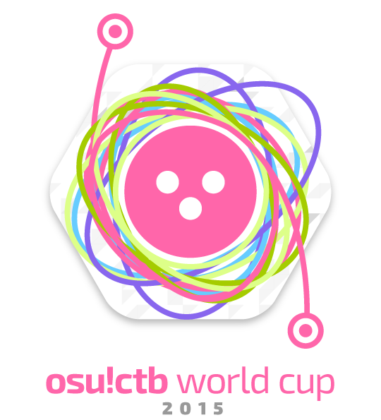
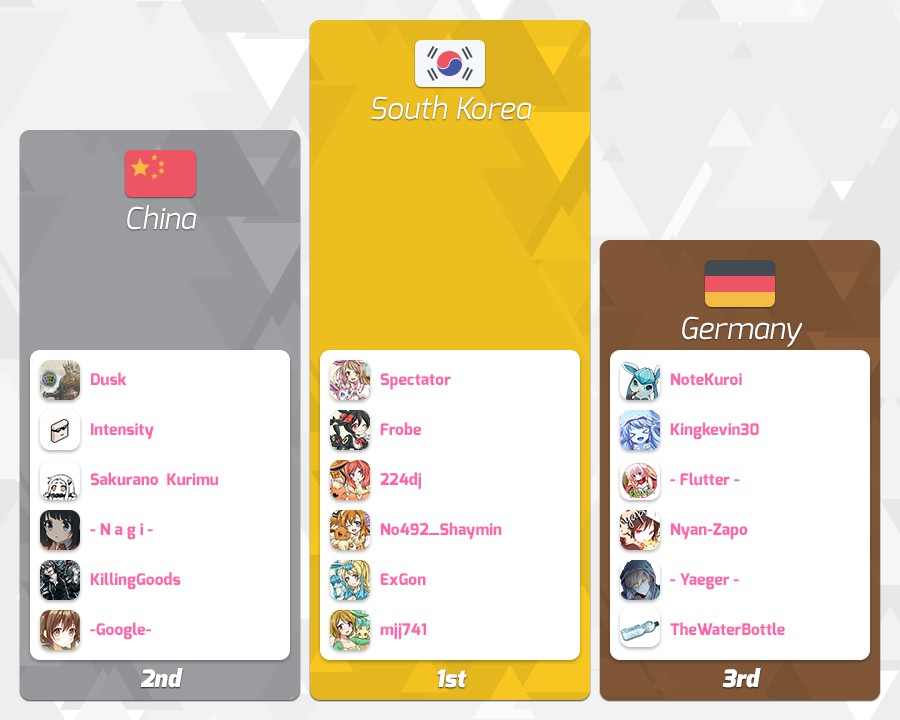
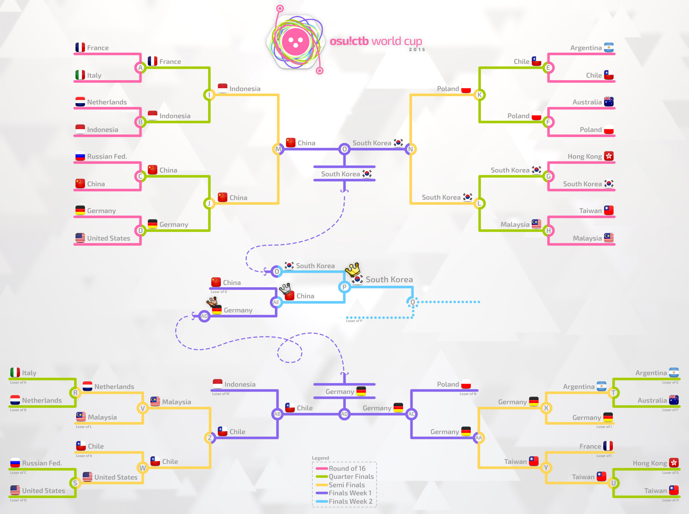

---
tags:
  - CWC 2015
  - CWC2015
outdated_translation: true
---

# osu! Catch the Beat World Cup 2015

**osu! Catch the Beat World Cup 2015** (***CWC 2015*** )是一个由[Tournament Management](https://osu.ppy.sh/groups/26)举办的基于 Catch the Beat 模式的比赛。今年已经举行到第四届了。上一届的冠军是：::{ flag=KR }:: **韩国**。

## 比赛安排

**注意：除非特别注明，所有时间都是基于 UTC+0**

| Event | Timestamp |
| :-- | :-- |
| 注册 | 2015年4月2日-19日 |
| 抽签 | 2015年5月2日 下午2点 |
| 小组赛 | 2015年5月9日-10日 |
| 16强比赛 | 2015年5月16日-17日 |
| 1/4决赛（8强） | 2015年5月23日-24日 |
| 半决赛（4强） | 2015年5月30日-5月31日 |
| 决赛第一周 | 2015年6月6日-7日 |
| 决赛第二周 | 2015年6月13日-14日 |

## 奖励

| Place | 奖励 |
| :-- | :-- |
|  | 六个月的 Supporter，个人资料标签以及 osu! 相关礼品 |
|  | 三个月的 Supporter |
|  | 一个月的 Supporter |

## 主办方

| Job | Person(s) |
| :-- | :-- |
| 赛事管理 | ::{ flag=DE }:: [Loctav](https://osu.ppy.sh/users/71366) // ::{ flag=DE }:: [p3n](https://osu.ppy.sh/users/123703) // ::{ flag=ES }:: [Deif](https://osu.ppy.sh/users/318565) // ::{ flag=FR }:: [shARPII](https://osu.ppy.sh/users/776257) |
| beatmap 选择团队 | ::{ flag=ES }:: [Deif](https://osu.ppy.sh/users/318565) // ::{ flag=VE }:: [Orihime chan](https://osu.ppy.sh/users/708258) // ::{ flag=KR }:: [CLSW](https://osu.ppy.sh/users/531253) |
| 在线直播 | ::{ flag=AU }:: [peppy](https://osu.ppy.sh/users/2) // ::{ flag=PL }:: [Marcin](https://osu.ppy.sh/users/722665) |
| 解说人员 | ::{ flag=CA }:: [Tasha](https://osu.ppy.sh/users/1031958) // ::{ flag=US }:: [ztrot](https://osu.ppy.sh/users/6347) // ::{ flag=NZ }:: [deadbeat](https://osu.ppy.sh/users/128370) // ::{ flag=DE }:: [Kingkevin30](https://osu.ppy.sh/users/564334) // ::{ flag=US }:: [Zak](https://osu.ppy.sh/users/1375955) |
| 统计 | ::{ flag=PL }:: [Marcin](https://osu.ppy.sh/users/722665) |

## 参赛者

| Flag | Country | Group A Members |
| :-- | :-- | :-- |
| ::{ flag=CA }:: | Canada | **[Sumaki](https://osu.ppy.sh/users/207916)**, [jeubach](https://osu.ppy.sh/users/3406015), [Affinity](https://osu.ppy.sh/users/3922569), [Yoshi_green](https://osu.ppy.sh/users/1035891), [Mysterious](https://osu.ppy.sh/users/2615240), [- ShadowZ -](https://osu.ppy.sh/users/2884415) |
| ::{ flag=MY }:: | Malaysia | **[Shadow Fear](https://osu.ppy.sh/users/635485)**, [QHideaki13](https://osu.ppy.sh/users/733998), [Kagari](https://osu.ppy.sh/users/3366264), [Future_miku95](https://osu.ppy.sh/users/2351567), [Xanus](https://osu.ppy.sh/users/4011799), [murutattack](https://osu.ppy.sh/users/4480237) |
| ::{ flag=PH }:: | Philippines | **[osu_gangster](https://osu.ppy.sh/users/829284)**, [-Hakuto-](https://osu.ppy.sh/users/3066582), [Hi_Hello](https://osu.ppy.sh/users/2984583) |
| ::{ flag=FR }:: | France | **[Ttobas](https://osu.ppy.sh/users/2084568)**, [Badis](https://osu.ppy.sh/users/559308), [Alostis](https://osu.ppy.sh/users/2986875), [CelegaS](https://osu.ppy.sh/users/1552429), [_Loli](https://osu.ppy.sh/users/2326688), [Kyuare](https://osu.ppy.sh/users/2705312) |

| Flag | Country | Group B Members |
| :-- | :-- | :-- |
| ::{ flag=BR }:: | Brazil | **[vini9204](https://osu.ppy.sh/users/199136)**, [LuckySonicGHz](https://osu.ppy.sh/users/3949268), [Michael Jordan](https://osu.ppy.sh/users/4099041), [Luciano Yoshiharu](https://osu.ppy.sh/users/2054788) |
| ::{ flag=BE }:: | Belgium | **[[ Zorua ]](https://osu.ppy.sh/users/3112563)**, [Ichidy](https://osu.ppy.sh/users/1019596), [eldersmot](https://osu.ppy.sh/users/4044159) |
| ::{ flag=AR }:: | Argentina | **[Manuxz](https://osu.ppy.sh/users/1740102)**, [Zai](https://osu.ppy.sh/users/2572228), [Tadashi](https://osu.ppy.sh/users/4027910), [koliron](https://osu.ppy.sh/users/4632730), [em1R-](https://osu.ppy.sh/users/1915210), [[Force]](https://osu.ppy.sh/users/1617217) |
| ::{ flag=US }:: | United States | **[Zak](https://osu.ppy.sh/users/1375955)**, [Minky](https://osu.ppy.sh/users/1978891), [Storm-](https://osu.ppy.sh/users/2427813), [Cemetery](https://osu.ppy.sh/users/3438241), [-Del-](https://osu.ppy.sh/users/2996241), [-Kurisu-](https://osu.ppy.sh/users/500696) |

| Flag | Country | Group C Members |
| :-- | :-- | :-- |
| ::{ flag=AT }:: | Austria | **[[ K a z u ]](https://osu.ppy.sh/users/1902480)**, [Aiju AT](https://osu.ppy.sh/users/4934314), [Kuzumi-kun](https://osu.ppy.sh/users/3575682) |
| ::{ flag=ES }:: | Spain | **[SK Eternal](https://osu.ppy.sh/users/588046)**, [sarkras](https://osu.ppy.sh/users/709625), [Pistoler](https://osu.ppy.sh/users/3115050), [TheStickman](https://osu.ppy.sh/users/4820133), [Ratulfox](https://osu.ppy.sh/users/4414709), [kikones34](https://osu.ppy.sh/users/911816) |
| ::{ flag=NL }:: | Netherlands | **[Nebux](https://osu.ppy.sh/users/2342051)**, [slimmecodo1](https://osu.ppy.sh/users/1800103), [Givralii](https://osu.ppy.sh/users/2466879), [wesley221](https://osu.ppy.sh/users/2407265), [CakeAndBanana](https://osu.ppy.sh/users/1981424), [- Yuri -](https://osu.ppy.sh/users/3212806) |
| ::{ flag=KR }:: | South Korea | **[Spectator](https://osu.ppy.sh/users/702598)**, [Frobe](https://osu.ppy.sh/users/670365), [224dj](https://osu.ppy.sh/users/3313041), [No492_Shaymin](https://osu.ppy.sh/users/566276), [ExGon](https://osu.ppy.sh/users/214187), [mjj741](https://osu.ppy.sh/users/1459769) |

| Flag | Country | Group D Members |
| :-- | :-- | :-- |
| ::{ flag=DK }:: | Denmark | **[-Crab-](https://osu.ppy.sh/users/2563435)**, [Only1Magma](https://osu.ppy.sh/users/3922957), [DragonsDungeon](https://osu.ppy.sh/users/4134819), [dinidini4000](https://osu.ppy.sh/users/1582264) |
| ::{ flag=RU }:: | Russian Federation | **[MeGl](https://osu.ppy.sh/users/1126814)**, [VagaNNN](https://osu.ppy.sh/users/1260040), [Zlocktar](https://osu.ppy.sh/users/2882387), [spider_yoba](https://osu.ppy.sh/users/1912659), [MayFlit](https://osu.ppy.sh/users/1651627) |
| ::{ flag=SG }:: | Singapore | **[He Ang Erika](https://osu.ppy.sh/users/2451381)**, [Mung](https://osu.ppy.sh/users/1018228), [geraldwch](https://osu.ppy.sh/users/2923441), [chibipingers](https://osu.ppy.sh/users/1756003), [Accel](https://osu.ppy.sh/users/1169796), [Kagayane](https://osu.ppy.sh/users/1777691) |
| ::{ flag=PL }:: | Poland | **[WujekGrzyb](https://osu.ppy.sh/users/258289)**, [Sawa88](https://osu.ppy.sh/users/993495), [wampir](https://osu.ppy.sh/users/261497), [Krzysiek](https://osu.ppy.sh/users/294277), [Kosmit](https://osu.ppy.sh/users/1749173), [Hirikoshi](https://osu.ppy.sh/users/2114149) |

| Flag | Country | Group E Members |
| :-- | :-- | :-- |
| ::{ flag=FI }:: | Finland | **[MrSake](https://osu.ppy.sh/users/264729)**, [Mianki](https://osu.ppy.sh/users/39658), [SonJosh](https://osu.ppy.sh/users/3373175) |
| ::{ flag=AU }:: | Australia | **[Pew](https://osu.ppy.sh/users/597692)**, [CrimsonPlez](https://osu.ppy.sh/users/3743985), [- Magic Girl -](https://osu.ppy.sh/users/3095784), [Zeverage](https://osu.ppy.sh/users/237550), [MappyTurtle](https://osu.ppy.sh/users/4391653), [Grayswandir](https://osu.ppy.sh/users/440107) |
| ::{ flag=MX }:: | Mexico | **[messi](https://osu.ppy.sh/users/1600437)**, [Jusenkyo](https://osu.ppy.sh/users/1237535), [daxeroz](https://osu.ppy.sh/users/1170156), [CrimsonAvenger](https://osu.ppy.sh/users/1690328), [THMGames](https://osu.ppy.sh/users/1836673), [Lostty](https://osu.ppy.sh/users/2118519) |
| ::{ flag=CN }:: | China | **[Dusk](https://osu.ppy.sh/users/533210)**, [Intensity](https://osu.ppy.sh/users/3072921), [Sakurano Kurimu](https://osu.ppy.sh/users/1338103), [- N a g i -](https://osu.ppy.sh/users/2956936), [xingcccc](https://osu.ppy.sh/users/1959675), [-Google-](https://osu.ppy.sh/users/3281474) |

| Flag | Country | Group F Members |
| :-- | :-- | :-- |
| ::{ flag=SE }:: | Sweden | **[Yukiteru Amano](https://osu.ppy.sh/users/1894511)**, [Toggeni](https://osu.ppy.sh/users/3555166), [Gurre Gurka](https://osu.ppy.sh/users/4872039), [Faayne](https://osu.ppy.sh/users/2363871) |
| ::{ flag=GB }:: | United Kingdom | **[- Magic Bomb -](https://osu.ppy.sh/users/3071175)**, [destructor966](https://osu.ppy.sh/users/2667584), [TomTheWizard](https://osu.ppy.sh/users/1913190), [Martin22](https://osu.ppy.sh/users/4209402), [Withered Lotus](https://osu.ppy.sh/users/3546931), [Bubbz](https://osu.ppy.sh/users/86414) |
| ::{ flag=HK }:: | Hong Kong | **[alienflybot](https://osu.ppy.sh/users/636114)**, [insaneplayer](https://osu.ppy.sh/users/3240418), [XXXZ](https://osu.ppy.sh/users/1226238), [SakaNa](https://osu.ppy.sh/users/1784164) |
| ::{ flag=ID }:: | Indonesia | **[Deceitful](https://osu.ppy.sh/users/1396447)**, [ExRei](https://osu.ppy.sh/users/1929336), [-Necrophilia-](https://osu.ppy.sh/users/3222638), [Ddraigon-](https://osu.ppy.sh/users/1380645), [Time-](https://osu.ppy.sh/users/2917987), [Shurelia](https://osu.ppy.sh/users/3807986) |

| Flag | Country | Group G Members |
| :-- | :-- | :-- |
| ::{ flag=HU }:: | Hungary | **[Kurokami](https://osu.ppy.sh/users/260933)**, [kisbee](https://osu.ppy.sh/users/1505264), [sudosu](https://osu.ppy.sh/users/1262095), [tomaszto](https://osu.ppy.sh/users/2373553), [\_verto\_](https://osu.ppy.sh/users/2015300) |
| ::{ flag=CL }:: | Chile | **[lineqtxz](https://osu.ppy.sh/users/989542)**, [\[Nico\]](https://osu.ppy.sh/users/1011240), [Keleron](https://osu.ppy.sh/users/1902918), [Th3-Latios](https://osu.ppy.sh/users/3544660), [HoneyH](https://osu.ppy.sh/users/4614599), [ShilenoPro](https://osu.ppy.sh/users/1166619) |
| ::{ flag=JP }:: | Japan | **[giru HD](https://osu.ppy.sh/users/707456)**, [ririkun](https://osu.ppy.sh/users/318357), [noraRcat](https://osu.ppy.sh/users/883939), [Nucoin](https://osu.ppy.sh/users/1089803), [Molqus](https://osu.ppy.sh/users/1927193), [T e d](https://osu.ppy.sh/users/538717) |
| ::{ flag=DE }:: | Germany | **[NoteKuroi](https://osu.ppy.sh/users/186642)**, [Kingkevin30](https://osu.ppy.sh/users/564334), [- Flutter -](https://osu.ppy.sh/users/4202284), [Nyan-Zapo](https://osu.ppy.sh/users/480676), [- Yaeger -](https://osu.ppy.sh/users/2417394), [TheWaterBottle](https://osu.ppy.sh/users/4382588) |

| Flag | Country | Group H Members |
| :-- | :-- | :-- |
| ::{ flag=TW }:: | Taiwan | --- disqualified --- |
| ::{ flag=NO }:: | Norway | **[Azeidith](https://osu.ppy.sh/users/2819676)**, [K i u i](https://osu.ppy.sh/users/1794766), [LeneKn](https://osu.ppy.sh/users/3400701), [Cameragod](https://osu.ppy.sh/users/4974088), [lanki33](https://osu.ppy.sh/users/2535200), [BennyBananas](https://osu.ppy.sh/users/4023183) |
| ::{ flag=TH }:: | Thailand | **[bank78952](https://osu.ppy.sh/users/1443297)**, [ZeroEightOne](https://osu.ppy.sh/users/1054016), [Boom](https://osu.ppy.sh/users/1090858) |
| ::{ flag=IT }:: | Italy | **[Pizza Kun](https://osu.ppy.sh/users/768609)**, [scemioff](https://osu.ppy.sh/users/3098795), [BlasterONE](https://osu.ppy.sh/users/1861182), [ArMa79](https://osu.ppy.sh/users/4982799), [Trollingor](https://osu.ppy.sh/users/4144266), [Mamansita](https://osu.ppy.sh/users/2542146) |

## 外部链接

- [讨论帖](https://osu.ppy.sh/community/forums/topics/316279)
- **[小组赛统计](https://owc.nicarim.pw/results/view/5)**
- [队长 Showcase (YouTube)](https://www.youtube.com/playlist?list=PLFsdDKrKpj7thvR58LRWxBPso4__aDUMp)
- [osu! Catch the Beat World Cup 2015 官方 Twitch 直播室](https://www.twitch.tv/osulive)

## 图池 (Mappools)

### 决赛

**This mappool will be used on Finals Week 1 & Week 2**

- NoMod
  1. [Zips - Reiwai Terrorism (Broccoly) \[Distortion\]](https://osu.ppy.sh/beatmapsets/101953#fruits/269773)
  2. [Mabinogi - Uroboros 9236 (ZHSteven) \[Inferno CTB\]](https://osu.ppy.sh/beatmapsets/141759#fruits/712730)
  3. [Gentle Stick X M2U - Hades in the Heaven (AngelHoney) \[ExtrA\]](https://osu.ppy.sh/beatmapsets/114488#fruits/296432)
  4. [FLOOR LEGENDS -KAC 2012- - KAC 2012 ULTIMATE MEDLEY -HISTORIA SOUND VOLTEX- (INO) \[Catch The GRAVITY\]](https://osu.ppy.sh/beatmapsets/304828#fruits/682868)
  5. [u's - Korekara no Someday (Spectator) \[Someday\]](https://osu.ppy.sh/beatmapsets/288268#fruits/650162)
  6. [STREME REVERIE - A Site De La Rue (CLSW) \[Absurd Tantivy\]](https://osu.ppy.sh/beatmapsets/318676#fruits/709593)
- Hidden
  1. [Basshunter - Ievan Polkka Trance Remix (Teara) \[BeuKirby\]](https://osu.ppy.sh/beatmapsets/10406#fruits/66246)
  2. [Apocalyptica - Hall of the Mountain King (pishifat) \[Extra\]](https://osu.ppy.sh/beatmapsets/219813#fruits/514597)
  3. [Hanazawa Kana - Renai Circulation (Full ver.) (DJPop) \[TAG2\]](https://osu.ppy.sh/beatmapsets/12563#fruits/48874)
  4. [ChouchouP - Tsukimiyo Rabbit (Zero\_\_wind) \[Tsuki\]](https://osu.ppy.sh/beatmapsets/122342#fruits/312959)
- HardRock
  1. [IOSYS - Border of Death (dksslqj) \[Lunatic\]](https://osu.ppy.sh/beatmapsets/14107#fruits/53380)
  2. [t+pazolite - chipscape (Shiirn) \[Ragnarok\]](https://osu.ppy.sh/beatmapsets/27752#fruits/95382)
  3. [Awake - Supernova (DoKoLP) \[DoKo\]](https://osu.ppy.sh/beatmapsets/42909#fruits/138008)
  4. [Hanazawa Kana - Mousou Express (Remix) (Spectator) \[EX\]](https://osu.ppy.sh/beatmapsets/228539#fruits/532153)
- DoubleTime
  1. [Matsumoto Sara - Ito Hakanaki Hikari no Gotoku (Mixagji) \[Lunatic\]](https://osu.ppy.sh/beatmapsets/120255#fruits/308350)
  2. [Megpoid GUMI - For my soul (val0108) \[Insane\]](https://osu.ppy.sh/beatmapsets/22509#fruits/80102)
  3. [HTT - Girls in Wonderland (wcx19911123) \[Insane\]](https://osu.ppy.sh/beatmapsets/34427#fruits/111902)
  4. [Feint - Time Bomb (feat. Veela & Boyinaband) (vipto) \[Time\]](https://osu.ppy.sh/beatmapsets/98842#fruits/263368)
- Tiebreaker
  1. **[onoken - P8107 (CLSW) \[Nervous Breakdown\]](https://osu.ppy.sh/beatmapsets/306583#fruits/686192)**

### 半决赛

- NoMod
  1. [Fear, and Loathing in Las Vegas - Swing It](https://osu.ppy.sh/beatmapsets/204159#fruits/482147)
  2. [Hoshizora Rin (CV.Iida Riho) & Nishikino Maki (CV.Pile) - Beat in Angel (GAMI) \[Crystal's Angel\]](https://osu.ppy.sh/beatmapsets/288571#fruits/1386168)
  3. [bj.HaLo - Ende (ZiRoX) \[Deif's Overdose\]](https://osu.ppy.sh/beatmapsets/188401#fruits/491215)
  4. [void feat. Komatsuna - Akatsuki No Tsuki (Spectator) \[Oriental\]](https://osu.ppy.sh/beatmapsets/297668#fruits/668162)
  5. [Tristam & Braken - Frame of Mind (Fort) \[Chill\]](https://osu.ppy.sh/beatmapsets/177523#fruits/581141)
  6. [Savant - Pirate bay (Drafura) \[Etoile\]](https://osu.ppy.sh/beatmapsets/91386#fruits/247418)
- Hidden
  1. [BoA - Kiseki (Hinsvar) \[Crystal's Rain\]](https://osu.ppy.sh/beatmapsets/150145#fruits/388536)
  2. [44teru-k - F.I (Jacob) \[Extra445\]](https://osu.ppy.sh/beatmapsets/47664#fruits/155235)
  3. [Beautiful Day - V3 (ignorethis) \[Impossible\]](https://osu.ppy.sh/beatmapsets/4622#fruits/41313)
  4. [M2U - Placebo Dying (AngelHoney) \[ExtrA\]](https://osu.ppy.sh/beatmapsets/60081#fruits/179758)
- HardRock
  1. [ESTi - HELIX (Edit ver.) (Hollow Wings) \[Spec's Overdose\]](https://osu.ppy.sh/beatmapsets/194910#fruits/470966)
  2. [Hatsune Miku - Reversible Doll (NatsumeRin) \[Rin\]](https://osu.ppy.sh/beatmapsets/22773#fruits/78913)
  3. [Hommarju feat. R.Cena - Chousai Kenbo Sengen (galvenize) \[Insane\]](https://osu.ppy.sh/beatmapsets/30012#fruits/99342)
  4. [Yuki Kajiura - Mezame (mercury2004) \[Mai\]](https://osu.ppy.sh/beatmapsets/22659#fruits/78049)
- DoubleTime
  1. [Denji Sano - Taiko Time (lepidopodus) \[Insane\]](https://osu.ppy.sh/beatmapsets/24320#fruits/84911)
  2. [Katy Perry - E.T. (La Cataline) \[Futuristic\]](https://osu.ppy.sh/beatmapsets/36077#fruits/116708)
  3. [U - Ha-tenya? (biwako) \[Insane\]](https://osu.ppy.sh/beatmapsets/37313#fruits/120080)
  4. [Asumi Kana - SOMEONE ELSE (miccoliasms) \[Insane\]](https://osu.ppy.sh/beatmapsets/13833#fruits/50907)
- Tiebreaker
  1. **[ICE - L (Deif) \[Ascension\]](https://osu.ppy.sh/beatmapsets/196230#fruits/465454)**

### 8 強賽

- NoMod
  1. [Linked Horizon - Guren no Yumiya (TV Size) (eldnl) \[Overdose\]](https://osu.ppy.sh/beatmapsets/103150#fruits/326464)
  2. [Soleily - Renatus (Multiple Creators) \[Rain\]](https://osu.ppy.sh/beatmapsets/241526#fruits/557811)
  3. [Mutsuhiko Izumi - Snow Goose (ZiRoX) \[Overdose\]](https://osu.ppy.sh/beatmapsets/150615#fruits/371595)
  4. [BiBi - Cutie Panther (CLSW) \[Captivation\]](https://osu.ppy.sh/beatmapsets/249055#fruits/572707)
  5. [Megpoid GUMI - Romantic Hero (tutuhaha) \[Hero\]](https://osu.ppy.sh/beatmapsets/43508#fruits/136509)
  6. [An - Artcore Jinja (ursa) \[OverdoZe\]](https://osu.ppy.sh/beatmapsets/215155#fruits/505566)
- Hidden
  1. [Yucha-P - Thieves Night Trick (tutuhaha) \[Extra\]](https://osu.ppy.sh/beatmapsets/78268#fruits/219090)
  2. [supercell - Rock 'n' Roll Nan Desu no (Garven) \[Insane\]](https://osu.ppy.sh/beatmapsets/27807#fruits/93021)
  3. [Marika - Knowing short ver. (Konei) \[Rain\]](https://osu.ppy.sh/beatmapsets/146780#fruits/572867)
  4. [CLIFF EDGE - Endless Tears feat. Nakamura Maiko (CLSW) \[Tears\]](https://osu.ppy.sh/beatmapsets/197689#fruits/468824)
- HardRock
  1. [Kagamine Rin - Oni Kanojo (val0108) \[gow's Insane\]](https://osu.ppy.sh/beatmapsets/23616#fruits/86245)
  2. [doriko feat. Hatsune Miku - Paradise Cage (KanbeKotori) \[Insane\]](https://osu.ppy.sh/beatmapsets/23483#fruits/80384)
  3. [sun3 - Higan Retour (saymun) \[Lunatic\]](https://osu.ppy.sh/beatmapsets/14464#fruits/54373)
  4. [Mili - Utopiosphere (Spectator) \[Ecstasia\]](https://osu.ppy.sh/beatmapsets/187177#fruits/446769)
- DoubleTime
  1. [Yousei Teikoku - Deep Sea (EvilElvisV2) \[LC\]](https://osu.ppy.sh/beatmapsets/104260#fruits/274365)
  2. [Giga-P - Electric Angel (pkmnyab) \[Insane\]](https://osu.ppy.sh/beatmapsets/146794#fruits/363639)
  3. [GUMI - PANDA HERO (gowww) \[Insane\]](https://osu.ppy.sh/beatmapsets/25461#fruits/86266)
  4. [Kyary Pamyu Pamyu - PONPONPON (D33d) \[Boxxy's Velocity of Collabiflower\]](https://osu.ppy.sh/beatmapsets/36225#fruits/136655)
- Tiebreaker
  1. **[Hatsuki Yura - Yoiyami Hanabi (Spectator) \[Twilight\]](https://osu.ppy.sh/beatmapsets/192079#fruits/456933)**

### 16 强赛

**[Download the mappack here!](https://www.mediafire.com/download/sn1i72g5fq1fhnb/CWC_2015_Round_of_16.rar)**

- NoMod
  1. [KAZAHA - Sajin no kanata he (Drafura) \[Rain\]](https://osu.ppy.sh/beatmapsets/158706#fruits/388088)
  2. [Mind Vortex - Alive (Katty Pie) \[Insane\]](https://osu.ppy.sh/beatmapsets/205309#fruits/484661)
  3. [Glutamine - Babylon (CSY the corrupt) \[Corruption\]](https://osu.ppy.sh/beatmapsets/35992#fruits/145118)
  4. [Hatsune Miku - Nehanshika (Shiirn) \[Abomination\]](https://osu.ppy.sh/beatmapsets/30680#fruits/101178)
  5. [IOSYS - Chanteikku Sanyousei no Itazura Daisensou (Kurosanyan) \[Strongest Fairy\]](https://osu.ppy.sh/beatmapsets/29307#fruits/100392)
  6. [MiddleIsland - Achromat (Tidek) \[Insane\]](https://osu.ppy.sh/beatmapsets/132728#fruits/333675)
- Hidden
  1. [Nanjou Yoshino & Kusuda Aina - Garasu no Hanazono (Hinsvar) \[Soulmate\]](https://osu.ppy.sh/beatmapsets/184512#fruits/441680)
  2. [Caravan Palace - Rock It For Me (tiper) \[Insane\]](https://osu.ppy.sh/beatmapsets/69041#fruits/212118)
  3. [Nero's Day At Disneyland - No Money Down, Low Monthly Payments (grumd) \[Insane\]](https://osu.ppy.sh/beatmapsets/111825#fruits/290733)
  4. [Cascada - What Hurts The Most (Nightcore Remix) (Lunah) \[Insane\]](https://osu.ppy.sh/beatmapsets/20239#fruits/70764)
- HardRock
  1. [IOSYS - Power of Dream (Night Fever Refix) (Kite) \[Power of Stream\]](https://osu.ppy.sh/beatmapsets/27152#fruits/91215)
  2. [Meiko - Leave The Lights On (KROT Remix) (Moway) \[Insane\]](https://osu.ppy.sh/beatmapsets/56633#fruits/171126)
  3. [fripSide - only my railgun (Full Ver.) (S i R i R u) \[Level 5\]](https://osu.ppy.sh/beatmapsets/12768#fruits/47670)
  4. [Rameses B - Flaklypa (-kevincela-) \[Insane\]](https://osu.ppy.sh/beatmapsets/190390#fruits/453358)
- DoubleTime
  1. [Tatsh - Fuushi Kaden (happy30) \[Hard\]](https://osu.ppy.sh/beatmapsets/15486#fruits/56044)
  2. [Hatsuki Yura - HAMELN (karenying) \[Insane\]](https://osu.ppy.sh/beatmapsets/43446#fruits/136322)
  3. [07th Expansion - miragecoordinator (La Cataline) \[Hard\]](https://osu.ppy.sh/beatmapsets/31116#fruits/102426)
  4. [Tune Up! - Bounce (Nightcore Mix) (osuplayer111) \[jericho2442's Rave\]](https://osu.ppy.sh/beatmapsets/24315#fruits/82785)
- Tiebreaker
  1. **[Saiya - Remote Control (CLSW) \[Crystal Spec\]](https://osu.ppy.sh/beatmapsets/175623#fruits/423373)**

### 小组赛

**[Download the mappack here!](https://www.mediafire.com/download/2vadd4tk50y1mz1/CWC_2015_Group_Stage.rar)**

- NoMod
  1. [sasakure.UK - Jack-the-Ripper (Sprosive) \[JackHasCome!\]](https://osu.ppy.sh/beatmapsets/23907#fruits/81560)
  2. [Rita - Princess Blood (CLSW) \[Rain\]](https://osu.ppy.sh/beatmapsets/182009#fruits/436663)
  3. [Hanatan - Hyakunen Yakou (eveless) \[Insane\]](https://osu.ppy.sh/beatmapsets/79100#fruits/220908)
  4. [senya - Tsuki ni Murakumo Hana ni Kaze (PV ver.) (Vhy) \[Rain\]](https://osu.ppy.sh/beatmapsets/158128#fruits/390102)
  5. [Traktion - Mission ASCII (galvenize) \[Another\]](https://osu.ppy.sh/beatmapsets/53249#fruits/162405)
  6. [Xelia - Illumiscape (Kanna) \[Drafura's CtB Platter\]](https://osu.ppy.sh/beatmapsets/43960#fruits/159792)
- Hidden
  1. [bibuko - Crayon (val0108) \[Insane\]](https://osu.ppy.sh/beatmapsets/49455#fruits/152463)
  2. [sta - Iris (ampzz) \[Insane\]](https://osu.ppy.sh/beatmapsets/94917#fruits/255163)
  3. [Rchetype - V Is For (Blue Dragon) \[Insane\]](https://osu.ppy.sh/beatmapsets/111914#fruits/290919)
  4. [Goose house - 18sai (mingmichael) \[Rain\]](https://osu.ppy.sh/beatmapsets/242856#fruits/560408)
- HardRock
  1. [Chata - Dango Daikazoku -TV animation Ver.- (Pappy) \[Platter\]](https://osu.ppy.sh/beatmapsets/214978#fruits/533077)
  2. [Kyary Pamyu Pamyu - Ninjya Re Bang Bang (IchiGUN) \[Hard\]](https://osu.ppy.sh/beatmapsets/83333#fruits/230175)
  3. [Kino Nei - Ougon Musou Kyoku \~Konjiki no Chi ni Somaru Mae ni\~ (Suzully) \[Golden Truth\]](https://osu.ppy.sh/beatmapsets/24903#fruits/84566)
  4. [TERRA - ever snow (ouranhshc) \[Hard\]](https://osu.ppy.sh/beatmapsets/23477#fruits/81789)
- DoubleTime
  1. [October - Time to Love (CLSW) \[Posthumous\]](https://osu.ppy.sh/beatmapsets/247499#fruits/569690)
  2. [BURTON - Shinonomegiku (\[\_Crystal\]) \[Kurokami's Platter\]](https://osu.ppy.sh/beatmapsets/152709#fruits/382311)
  3. [Drop - Yunagi Rinne (Shinxyn) \[Insane\]](https://osu.ppy.sh/beatmapsets/14460#fruits/52900)
  4. [fripSide - LEVEL5 -judgelight- (Full Ver.) (cyborg) \[Insane\]](https://osu.ppy.sh/beatmapsets/13628#fruits/50291)
- Tiebreaker
  1. **[Hanatan - If (Rakuen) \[wkyik's Insane\]](https://osu.ppy.sh/beatmapsets/230050#fruits/587577)**

## 比赛结果

### 决赛

Sunday, 14\. June 2015

| Team A | Score | Team B | History |
| :-- | :-: | --: | :-- |
| ::{ flag=KR }:: **South Korea** | **6** - 2 | China ::{ flag=CN }:: | [#1](https://osu.ppy.sh/community/matches/16799312) |

### 决赛：第一周

Saturday, 6\. June 2015

| Team A | Score | Team B | History |
| :-- | :-: | --: | :-- |
| ::{ flag=CN }:: China | 0 - **6** | **South Korea** ::{ flag=KR }:: | [#1](https://osu.ppy.sh/community/matches/16615953) |
| ::{ flag=ID }:: Indonesia | 5 - **6** | **Chile** ::{ flag=CL }:: | [#1](https://osu.ppy.sh/community/matches/16618288) |
| ::{ flag=PL }:: Poland | 3 - **6** | **Germany** ::{ flag=DE }:: | [#1](https://osu.ppy.sh/community/matches/16621174) |
| ::{ flag=CL }:: Chile | 2 - **6** | **Germany** ::{ flag=DE }:: | [#1](https://osu.ppy.sh/community/matches/16624075) |

Sunday, 7\. June 2015

| Team A | Score | Team B | History |
| :-- | :-: | --: | :-- |
| ::{ flag=CN }:: **China** | **6** - 1 | Germany ::{ flag=DE }:: | [#1](https://osu.ppy.sh/community/matches/16644793) |

### 半决赛

Saturday, 30\. May 2015

| Team A | Score | Team B | History |
| :-- | :-: | --: | :-- |
| ::{ flag=FR }:: France | 4 - **6** | **Taiwan** ::{ flag=TW }:: | [#1](https://osu.ppy.sh/community/matches/16464581) |
| ::{ flag=NL }:: Netherlands | 4 - **6** | **Malaysia** ::{ flag=MY }:: | [#1](https://osu.ppy.sh/community/matches/16465888) |
| ::{ flag=AR }:: Argentina | 1 - **6** | **Germany** ::{ flag=DE }:: | [#1](https://osu.ppy.sh/community/matches/16467528) |
| ::{ flag=CL }:: **Chile** | **6** - 1 | United States ::{ flag=US }:: | [#1](https://osu.ppy.sh/community/matches/16469168) |

Sunday, 31\. May 2015

| Team A | Score | Team B | History |
| :-- | :-: | --: | :-- |
| ::{ flag=PL }:: Poland | 0 - **6** | South Korea ::{ flag=KR }:: | [#1](https://osu.ppy.sh/community/matches/16489320) |
| ::{ flag=ID }:: Indonesia | 1 - **6** | China ::{ flag=CN }:: | [#1](https://osu.ppy.sh/community/matches/16490631) |
| ::{ flag=DE }:: **Germany** | **6** - 0 | Taiwan ::{ flag=TW }:: | - Win by default - |
| ::{ flag=MY }:: Malaysia | 1 - **6** | Chile ::{ flag=CL }:: | [#1](https://osu.ppy.sh/community/matches/16493275) |

### 8 強賽

Saturday, 23\. May 2015

| Team A | Score | Team B | History |
| :-- | :-: | --: | :-- |
| ::{ flag=AR }:: **Argentina** | **5** - 3 | Australia ::{ flag=AU }:: | [#1](https://osu.ppy.sh/community/matches/16309081) |
| ::{ flag=HK }:: Hong Kong | 2 - **5** | **Taiwan** ::{ flag=TW }:: | [#1](https://osu.ppy.sh/community/matches/16310471) |
| ::{ flag=IT }:: Italy | 1 - **5** | **Netherlands** ::{ flag=NL }:: | [#1](https://osu.ppy.sh/community/matches/16313352) |
| ::{ flag=RU }:: Russian Federation | 3 - **5** | **United States** ::{ flag=US }:: | [#1](https://osu.ppy.sh/community/matches/16315464) |

Sunday, 24\. May 2015

| Team A | Score | Team B | History |
| :-- | :-: | --: | :-- |
| ::{ flag=KR }:: **South Korea** | **5** - 0 | Malaysia ::{ flag=MY }:: | [#1](https://osu.ppy.sh/community/matches/16335352) |
| ::{ flag=CN }:: **China** | **5** - 2 | Germany ::{ flag=DE }:: | [#1](https://osu.ppy.sh/community/matches/16336420) |
| ::{ flag=FR }:: France | 3 - **5** | **Indonesia** ::{ flag=ID }:: | [#1](https://osu.ppy.sh/community/matches/16337429) |
| ::{ flag=CL }:: Chile | 2 - **5** | **Poland** ::{ flag=PL }:: | [#1](https://osu.ppy.sh/community/matches/16338988) |

### 16 強賽

Saturday, 16\. May 2015

| Team A | Score | Team B | History |
| :-- | :-: | --: | :-- |
| ::{ flag=AU }:: Australia | 4 - **5** | **Poland** ::{ flag=PL }:: | [#1](https://osu.ppy.sh/community/matches/16155689) |
| ::{ flag=HK }:: Hong Kong | 0 - **5** | **South Korea** ::{ flag=KR }:: | [#1](https://osu.ppy.sh/community/matches/16156834) |
| ::{ flag=TW }:: Taiwan | 0 - **5** | **Malaysia** ::{ flag=MY }:: | [#1](https://osu.ppy.sh/community/matches/16157935) |
| ::{ flag=RU }:: Russian Federation | 2 - **5** | **China** ::{ flag=CN }:: | [#1](https://osu.ppy.sh/community/matches/16159321) |
| ::{ flag=NL }:: Netherlands | 1 - **5** | **Indonesia** ::{ flag=ID }:: | [#1](https://osu.ppy.sh/community/matches/16161232) |
| ::{ flag=FR }:: **France** | **5** - 0 | Italy ::{ flag=IT }:: | - Win by default - |
| ::{ flag=DE }:: **Germany** | **5** - 1 | United States ::{ flag=US }:: | [#1](https://osu.ppy.sh/community/matches/16164371) |
| ::{ flag=AR }:: Argentina | 0 - **5** | **Chile** ::{ flag=CL }:: | [#1](https://osu.ppy.sh/community/matches/16166132) |

### 小组赛

Saturday, 9\. May 2015

| Team A | Score | Team B | History |
| :-- | :-: | --: | :-- |
| ::{ flag=MY }:: **Malaysia** | **4** - 1 | Philippines ::{ flag=PH }:: | [#1](https://osu.ppy.sh/community/matches/15999657) |
| ::{ flag=HK }:: Hong Kong | 1 - **4** | **Indonesia** ::{ flag=ID }:: | [#1](https://osu.ppy.sh/community/matches/15999675) |
| ::{ flag=IT }:: **Italy** | **4** - 2 | Thailand ::{ flag=TH }:: | [#1](https://osu.ppy.sh/community/matches/15999681) |
| ::{ flag=FI }:: Finland | 0 - **4** | **Australia** ::{ flag=AU }:: | [#1](https://osu.ppy.sh/community/matches/15999696) |
| ::{ flag=ES }:: Spain | 0 - **4** | **South Korea** ::{ flag=KR }:: | [#1](https://osu.ppy.sh/community/matches/16000786) |
| ::{ flag=TW }:: **Taiwan** | **4** - 3 | Norway ::{ flag=NO }:: | [#1](https://osu.ppy.sh/community/matches/16000795) |
| ::{ flag=JP }:: Japan | 0 - **4** | **Germany** ::{ flag=DE }:: | [#1](https://osu.ppy.sh/community/matches/16000803) |
| ::{ flag=SE }:: Sweden | 0 - **4** | **Hong Kong** ::{ flag=HK }:: | - Win by default - |
| ::{ flag=MY }:: Malaysia | 3 - **4** | **France** ::{ flag=FR }:: | [#1](https://osu.ppy.sh/community/matches/16001920) |
| ::{ flag=GB }:: United Kingdom | 0 - **4** | **Indonesia** ::{ flag=ID }:: | [#1](https://osu.ppy.sh/community/matches/16001924) |
| ::{ flag=HU }:: Hungary | 1 - **4** | **Germany** ::{ flag=DE }:: | [#1](https://osu.ppy.sh/community/matches/16003183) |
| ::{ flag=NO }:: **Norway** | **4** - 0 | Thailand ::{ flag=TH }:: | - Win by default - |
| ::{ flag=DK }:: Denmark | 0 - **4** | **Poland** ::{ flag=PL }:: | [#1](https://osu.ppy.sh/community/matches/16003194) |
| ::{ flag=RU }:: **Russian Federation** | **4** - 1 | Singapore ::{ flag=SG }:: | [#1](https://osu.ppy.sh/community/matches/16003205) |
| ::{ flag=BR }:: **Brazil** | **4** - 0 | Belgium ::{ flag=BE }:: | - Win by default - |
| ::{ flag=AT }:: Austria | 0 - **4** | **Spain** ::{ flag=ES }:: | [#1](https://osu.ppy.sh/community/matches/16011198) |
| ::{ flag=FI }:: Finland | 0 - **4** | **Mexico** ::{ flag=MX }:: | - Win by default - |
| ::{ flag=BE }:: Belgium | 0 - **4** | **Argentina** ::{ flag=AR }:: | - Win by default - |
| ::{ flag=RU }:: Russian Federation | 3 - **4** | **Poland** ::{ flag=PL }:: | [#1](https://osu.ppy.sh/community/matches/16012820) |
| ::{ flag=SE }:: Sweden | 0 - **4** | **United Kingdom** ::{ flag=GB }:: | - Win by default - |
| ::{ flag=HU }:: Hungary | 1 - **4** | **Chile** ::{ flag=CL }:: | [#1](https://osu.ppy.sh/community/matches/16012829) |
| ::{ flag=CA }:: Canada | 0 - **4** | **France** ::{ flag=FR }:: | [#1](https://osu.ppy.sh/community/matches/16014522) |
| ::{ flag=AR }:: Argentina | 3 - **4** | **United States** ::{ flag=US }:: | [#1](https://osu.ppy.sh/community/matches/16014529) |
| ::{ flag=AT }:: Austria | 0 - **4** | **Netherlands** ::{ flag=NL }:: | [#1](https://osu.ppy.sh/community/matches/16014692) |

Sunday, 10\. May 2015

| Team A | Score | Team B | History |
| :-- | :-: | --: | :-- |
| ::{ flag=AU }:: **Australia** | **4** - 3 | Mexico ::{ flag=MX }:: | [#1](https://osu.ppy.sh/community/matches/16021554) |
| ::{ flag=CA }:: Canada | 2 - **4** | **Malaysia** ::{ flag=MY }:: | [#1](https://osu.ppy.sh/community/matches/16021560) |
| ::{ flag=MX }:: Mexico | 0 - **4** | **China** ::{ flag=CN }:: | - Win by default - |
| ::{ flag=CA }:: **Canada** | **4** - 0 | Philippines ::{ flag=PH }:: | - Win by default - |
| ::{ flag=SG }:: Singapore | 1 - **4** | **Poland** ::{ flag=PL }:: | [#1](https://osu.ppy.sh/community/matches/16028855) |
| ::{ flag=SE }:: Sweden | 0 - **4** | **Indonesia** ::{ flag=ID }:: | - Win by default - |
| ::{ flag=AU }:: Australia | 2 - **4** | **China** ::{ flag=CN }:: | [#1](https://osu.ppy.sh/community/matches/16028862) |
| ::{ flag=HU }:: Hungary | 0 - **4** | **Japan** ::{ flag=JP }:: | [#1](https://osu.ppy.sh/community/matches/16028865) |
| ::{ flag=AT }:: Austria | 0 - **4** | **South Korea** ::{ flag=KR }:: | - Win by default - |
| ::{ flag=GB }:: United Kingdom | 2 - **4** | **Hong Kong** ::{ flag=HK }:: | [#1](https://osu.ppy.sh/community/matches/16029933) |
| ::{ flag=PH }:: Philippines | 0 - **4** | **France** ::{ flag=FR }:: | [#1](https://osu.ppy.sh/community/matches/16029939) |
| ::{ flag=TW }:: **Taiwan** | **4** - 0 | Thailand ::{ flag=TH }:: | - Win by default - |
| ::{ flag=NL }:: Netherlands | 2 - **4** | **South Korea** ::{ flag=KR }:: | [#1](https://osu.ppy.sh/community/matches/16031195) |
| ::{ flag=DK }:: Denmark | 0 - **4** | **Singapore** ::{ flag=SG }:: | [#1](https://osu.ppy.sh/community/matches/16031201) |
| ::{ flag=FI }:: Finland | 0 - **4** | **China** ::{ flag=CN }:: | [#1](https://osu.ppy.sh/community/matches/16031205) |
| ::{ flag=CL }:: **Chile** | **4** - 1 | Japan ::{ flag=JP }:: | [#1](https://osu.ppy.sh/community/matches/16031209) |
| ::{ flag=IT }:: Italy | 2 - **4** | **Taiwan** ::{ flag=TW }:: | [#1](https://osu.ppy.sh/community/matches/16031212) |
| ::{ flag=BR }:: Brazil | 1 - **4** | **Argentina** ::{ flag=AR }:: | [#1](https://osu.ppy.sh/community/matches/16037776) |
| ::{ flag=IT }:: **Italy** | **4** - 2 | Norway ::{ flag=NO }:: | [#1](https://osu.ppy.sh/community/matches/16037779) |
| ::{ flag=DK }:: Denmark | 1 - **4** | **Russian Federation** ::{ flag=RU }:: | [#1](https://osu.ppy.sh/community/matches/16037785) |
| ::{ flag=BE }:: Belgium | 0 - **4** | **United States** ::{ flag=US }:: | - Win by default - |
| ::{ flag=ES }:: Spain | 3 - **4** | **Netherlands** ::{ flag=NL }:: | [#1](https://osu.ppy.sh/community/matches/16039168) |
| ::{ flag=CL }:: **Chile** | **4** - 2 | Germany ::{ flag=DE }:: | [#1](https://osu.ppy.sh/community/matches/16039172) |
| ::{ flag=BR }:: Brazil | 0 - **4** | **United States** ::{ flag=US }:: | [#1](https://osu.ppy.sh/community/matches/16039176) |

## 规则

### 比赛规则

1. osu! Catch the Beat World 是**基于国家/地区之间的**3v3比赛。
2. 每场比赛的比赛用图将会在比赛日之前的一个星期日公布。比赛中只能选择公布出来的图。
   - 有一张图是专门用于决胜局。这张图只会在决胜局出现。
   - 同样会有 [Hidden](/wiki/Gameplay/Game_modifier/Hidden)、[HardRock](/wiki/Gameplay/Game_modifier/Hard_Rock)、[DoubleTime 的分类比赛图](/wiki/Gameplay/Game_modifier/Double_Time)。
3. 比赛日程将会由赛事管理小组公布（暂未公布）。
4. 如果没有工作人员或者裁判在，比赛会被延期。
5. 如果有玩家失败，失败的玩家的分数将不会计算分数。
6. 允许使用 [Visual Settings](/wiki/Client/Interface/Visual_settings) 。
7. 如果比赛以平分结束（所有人的分数一样），该局比赛无效。
8. 掉线玩家判为游戏失败。
9. 除非比赛无效，比赛用图不能在该场比赛中再次使用。
10. 出席玩家少于最低人数要求的时候，最多可以推迟10分钟开始比赛。
11. 比赛中允许更换队员。
12. 延迟、网络卡顿不能作为比赛无效的原因。
13. 在小组赛中，因为对方不能参赛"不战而胜"的时候当做4:0获胜处理，+1.0 分数差比例。
14. 如果比赛途中发生意外（比如服务器被修理冰箱的拖走了），将会由赛事管理小组处理。
15. 如果有任何规则需要修改，将会发布公告。

### 比赛注册

1. 有兴趣加入国家队的选手们请**自己单独报名**。
   1. 赛事管理人员会为每个国家建立一张预选选手名单。
   2. 赛事管理人员会从名单里抽选一人作为临时的国家队队长。
   3. 被选中的临时队长可以从预选名单中挑选正式参赛的队员。
2. 为了确保报名的有效性和正式性，赛事管理人员将对每位报名者进行安全检查。
   1. 每位报名者将被分配到各自国家的预选选手名单。
   2. 预选选手有 Catch the Beat 世界排名高于 \#5000 的最低资格要求。
   3. 预选选手的另一资格要求是在过去12个月之内没有违反过任何 osu! [规则](/wiki/Rules)。
3. 想报名的玩家请用「CWC Registration」作为标题，向 [Loctav](https://osu.ppy.sh/home/messages/users/71366) 发出私信。
   1. 在注册成功的时候，你会收到一个确认信息，确认你的报名已经在审理中。
4. 成功注册的队伍将会在注册阶段结束之后公布出来。
5. 负责选图的成员不能参加这次比赛。

### 阶段说明

1. 在小组赛的时候，所有队伍将会随机分配到8个小组中，每组4个队伍。
   - 当然，会根据总参赛队伍数进行更改。

2. 每个队伍都会跟同小组中的其他三个队伍相遇。

3. 队伍的排名将根据以下条件 (权重按降序排列) 计算：
   1. 队伍获胜次数较高。
   2. `{(我方获胜图数) - (对方获胜图数)}`的差值较高。
   3. 获胜图数较高。
   4. `∑{(队伍总分差异) / (图的最高分数)}`的商值较高。
   5. 重赛中获胜。

4. 小组赛里排名前2的队伍将会晋级到双淘汰赛
   1. 根据实际小组赛分配，可能会进行合理调整。

5. 在双淘汰赛的阶段，赢的一方将会晋级到胜组下一场的比赛，而输的一方将进入败组。

6. 基于[此表](https://puu.sh/bUq5V/f1066103b0.png)，比赛分成下面的阶段：

   | 阶段 | 比赛 ID |
   | :-- | :-- |
   | 16强 | A, B, C, D, E, F, G, H |
   | 1/4决赛 | I, J, K, L & R, S, T, U |
   | 半决赛 | M, N & V, W, X, Y, Z,AA |
   | 决赛第一周 | O & AB, AC, AD, AE |
   | 决赛第二周 | P, Q |

7. **胜利条件：**
   - 小组赛阶段，采用7局4胜制。
   - 16强和1/4决赛，9局5胜制。
   - 半决赛和决赛，11局6胜制。

### 比赛说明

1. 裁判会提前15分钟创建一个多人游戏房间，在此期间选手必须集合。
   1. 房间将上锁，裁判会在短时间内发送密码和 MP 邀请给队长。
   2. 房间设置为 Catch the Beat, Team-Vs., 胜利条件：’Score’。房间名称必须为"CWC 2015: TeamBlue vs TeamRed"。
   3. 房名首先提到的是蓝队，第二个提到的是红队。
2. 选手们可以随意选择最多两张热身图。使用有问题的内容的比赛图是禁止的。
3. 每队队长可以禁止图池中的两张图。这些图在比赛中双方都不能选择。
   1. 不可放弃禁图权。
4. 由两队队长轮流从图池中选图。
5. 每队队长必须从 `#multiplayer` 中使用一次 `!roll` 命令。
   1. 点数大的队伍先选图。
   2. 点数小的队伍先禁图。
6. 队长可以从任何分类的图组中进行选择。
   1. 在平局情况下，必须选择 tiebreaker 图。
7. 结果将会使用统计网站发布。

### 图池说明

1. 小组赛、16强、四分之一决赛、半决赛和决赛分别会有一个图池。
   1. 决赛第一周和第二周使用同一个图池。
2. 每个图池由四个 mod 的图组组成：NoMod（无mod）、[Hidden](/wiki/Gameplay/Game_modifier/Hidden)、[HardRock](/wiki/Gameplay/Game_modifier/Hard_Rock) 以及 [DoubleTime](/wiki/Gameplay/Game_modifier/Double_Time) 。
3. 每个图池由总共19张图组成。
4. 每个图池里都有一张决胜 (tiebreaker) 图。
5. NoMod 图组是在无 mod 的情况下进行比赛的。
6. 在 Hidden、HardRock 和 DoubleTime 模式里，玩家必须打开相应的 mod
   1. 选手可以在 HardRock 或 DoubleTime 图组中另外加选 Hidden mod.
7. 决胜图 (tiebreaker) 可以使用任意 mod 进行比赛。
   1. 在玩决胜图时，玩家可以开 [HardRock](/wiki/Gameplay/Game_modifier/Hard_Rock)、[Hidden](/wiki/Gameplay/Game_modifier/Hidden) 或者两个一起开。
8. NoMod 图组在每阶段的图池中会有6张图。
9. 各其他模式的图组会在每阶段的图池中各有4张。

### 赛程说明

1. 各阶段将在每一周的周末进行。
2. 在小组赛阶段，比赛可能会重叠。
3. 所有比赛都会在周六或者周日进行。
4. 比赛时间由赛事管理小组安排。具体时间安排会在每个阶段之前的一周周日进行公告。赛事管理小组尽量尊重每个参赛队伍的时区来进行安排。
5. 队长对于队伍的能否参赛负责。队伍的人数上限就是为了保证每队至少可以提供三名队员来参加每一场比赛。比赛时不足三名队员到场的队伍会被当做弃权处理。
