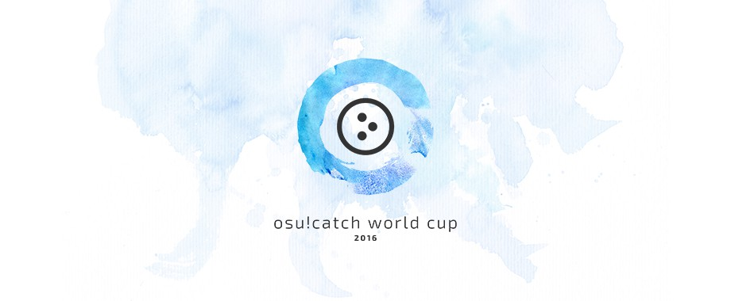
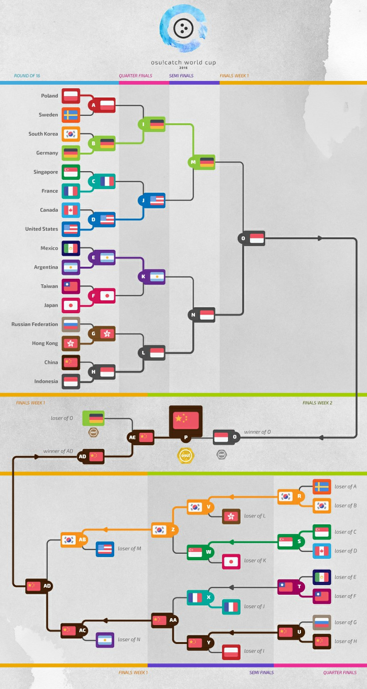
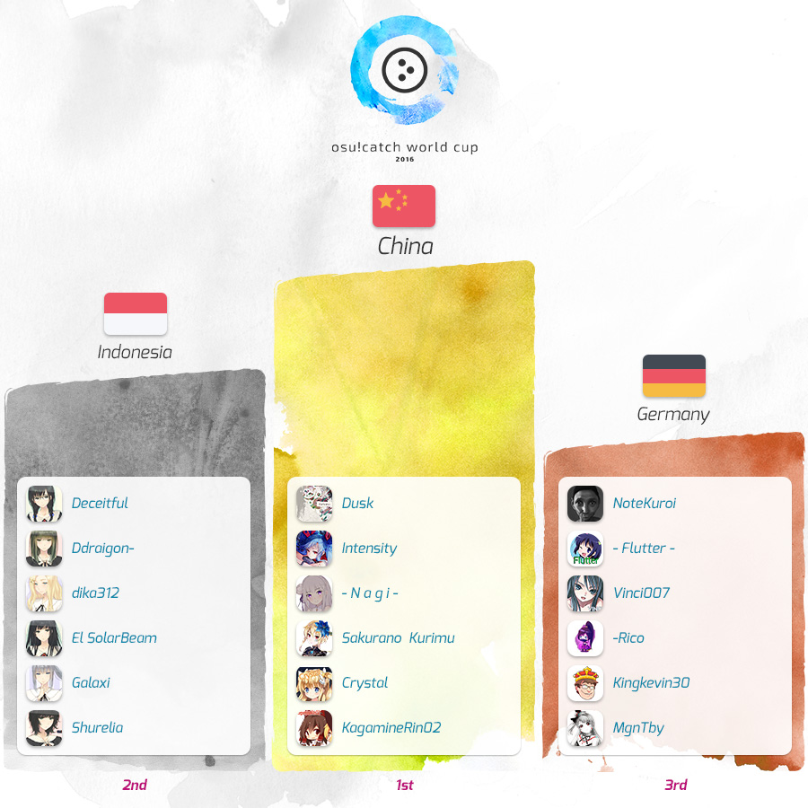

---
tags:
  - CWC 2016
  - CWC2016
---

# osu!catch World Cup 2016

The **osu!catch World Cup 2016** (***CWC 2016***) was a country-based osu!catch tournament hosted by the [osu! team](/wiki/People/osu!_team). It was the fifth instalment of the osu!catch World Cup.

## Tournament schedule

| Event | Timestamp |
| --: | :-- |
| Registration phase | 2016-04-12/2016-04-30 |
| Live drawings | 2016-05-15 (14:00 UTC) |
| Group stage | 2016-05-21/2016-05-22 |
| Round of 16 | 2016-05-28 |
| Quarterfinals | 2016-06-05 |
| Semifinals | 2016-06-11/2016-06-12 |
| Finals week 1 | 2016-06-18/2016-06-19 |
| Finals week 2 | 2016-06-26 |

## Prizes

| Placing | Prizes |
| :-: | :-- |
|  | $300 per team member, unique profile badge, "osu!catch Champion" user title for one year |
|  | $160 per team member, unique profile badge |
|  | $80 per team member, unique profile badge |

  

## Organisation

The osu!catch World Cup 2016 was run by various community members.

| Position | Member(s) |
| :-- | :-- |
| Manager | ::{ flag=ES }:: [Deif](https://osu.ppy.sh/users/318565), ::{ flag=DE }:: [Loctav](https://osu.ppy.sh/users/71366), ::{ flag=DE }:: [p3n](https://osu.ppy.sh/users/123703), ::{ flag=FR }:: [shARPII](https://osu.ppy.sh/users/776257) |
| Mappool selector | ::{ flag=ES }:: [Deif](https://osu.ppy.sh/users/318565), ::{ flag=CL }:: [ZiRoX](https://osu.ppy.sh/users/200768) |
| Commentator | ::{ flag=US }:: [Arf](https://osu.ppy.sh/users/3716999), ::{ flag=NZ }:: [deadbeat](https://osu.ppy.sh/users/128370), ::{ flag=AR }:: [juankristal](https://osu.ppy.sh/users/443656), ::{ flag=FR }:: [Slainv](https://osu.ppy.sh/users/4823843), ::{ flag=CA }:: [Tasha](https://osu.ppy.sh/users/1031958), ::{ flag=US }:: [Zak](https://osu.ppy.sh/users/1375955), ::{ flag=US }:: [ztrot](https://osu.ppy.sh/users/6347) |
| Statistician | ::{ flag=US }:: [Ascendance](https://osu.ppy.sh/users/2931883), ::{ flag=NZ }:: [deadbeat](https://osu.ppy.sh/users/128370), ::{ flag=DE }:: [Nwolf](https://osu.ppy.sh/users/1910766) |

## Links

- [Discussion thread](https://osu.ppy.sh/community/forums/topics/442617)
- [Livestream](https://www.twitch.tv/osulive)
- **[Statistics sheet](https://docs.google.com/spreadsheets/d/1wl_-ovoojuvTLDeMRkFPqBdBdX0AAFZR60ysbNkk-S8/pubhtml)**

## Participants

|  | Country | Members |
| --: | :-: | :-- |
| ::{ flag=AR }:: | **Argentina** | **[\[Force\]](https://osu.ppy.sh/users/1617217)**, [Danti](https://osu.ppy.sh/users/4785841), [koliron](https://osu.ppy.sh/users/4632730), [Retz](https://osu.ppy.sh/users/5095790), [Tadashi](https://osu.ppy.sh/users/4027910), [VelperK](https://osu.ppy.sh/users/348467) |
| ::{ flag=AU }:: | **Australia** | **[Zeverage](https://osu.ppy.sh/users/237550)**, [chickennando](https://osu.ppy.sh/users/5818665), [EL-S](https://osu.ppy.sh/users/5385123), [Janga](https://osu.ppy.sh/users/3917884), [Seiga](https://osu.ppy.sh/users/4403718), [tachima](https://osu.ppy.sh/users/3420156) |
| ::{ flag=BE }:: | **Belgium** | **[\[ Zorua \]](https://osu.ppy.sh/users/3112563)**, [\[ Seraf \]](https://osu.ppy.sh/users/6376151), [\[K y o k o\]](https://osu.ppy.sh/users/626677), [Skir](https://osu.ppy.sh/users/1938228) |
| ::{ flag=BR }:: | **Brazil** | **[ThanaR](https://osu.ppy.sh/users/3834323)**, [Ari Light](https://osu.ppy.sh/users/4383265), [HK Kimma](https://osu.ppy.sh/users/3328968), [Michael Jordan](https://osu.ppy.sh/users/4099041), [Mikudesu](https://osu.ppy.sh/users/4120228), [Senfuresu Kura](https://osu.ppy.sh/users/3464898) |
| ::{ flag=CA }:: | **Canada** | **[jeubach](https://osu.ppy.sh/users/3406015)**, [FastYoshi](https://osu.ppy.sh/users/4820793), [Fii](https://osu.ppy.sh/users/3922569), [Kyptoric](https://osu.ppy.sh/users/1361268), [MikuChan](https://osu.ppy.sh/users/2571882), [Yoshi\_green](https://osu.ppy.sh/users/1035891) |
| ::{ flag=CL }:: | **Chile** | **[\[Nico\]](https://osu.ppy.sh/users/1011240)**, [Kohaku](https://osu.ppy.sh/users/1866048), [lechuguin](https://osu.ppy.sh/users/2872000), [lineqtxz](https://osu.ppy.sh/users/989542), [nacho-s-m](https://osu.ppy.sh/users/3673417), [Quit user](https://osu.ppy.sh/users/2389481) |
| ::{ flag=CN }:: | **China** | **[Dusk](https://osu.ppy.sh/users/533210)**, [- N a g i -](https://osu.ppy.sh/users/2956936), [Crystal](https://osu.ppy.sh/users/1646397), [Intensity](https://osu.ppy.sh/users/3072921), [KagamineRin02](https://osu.ppy.sh/users/518503), [Sakurano Kurimu](https://osu.ppy.sh/users/1338103) |
| ::{ flag=DK }:: | **Denmark** | **[Crab](https://osu.ppy.sh/users/2563435)**, [DragonsDungeon](https://osu.ppy.sh/users/4134819), [Only1Magma](https://osu.ppy.sh/users/3922957), [Separ](https://osu.ppy.sh/users/5266889), [SharpN](https://osu.ppy.sh/users/4382076), [Wermii](https://osu.ppy.sh/users/2424947) |
| ::{ flag=FI }:: | **Finland** | **[forgottentaco](https://osu.ppy.sh/users/6109660)**, [Awsumi](https://osu.ppy.sh/users/4174308), [undo](https://osu.ppy.sh/users/2782290), [xDarkon](https://osu.ppy.sh/users/4188814) |
| ::{ flag=FR }:: | **France** | **[Kyuare](https://osu.ppy.sh/users/2705312)**, [Fuka Pura](https://osu.ppy.sh/users/2326688), [LeRenegat](https://osu.ppy.sh/users/3391775), [Orinoshi](https://osu.ppy.sh/users/3047355), [Ttobas](https://osu.ppy.sh/users/2084568), [Vincs](https://osu.ppy.sh/users/2026299) |
| ::{ flag=DE }:: | **Germany** | **[NoteKuroi](https://osu.ppy.sh/users/186642)**, [- Flutter -](https://osu.ppy.sh/users/4202284), [Kingkevin30](https://osu.ppy.sh/users/564334), [MgnTby](https://osu.ppy.sh/users/4839807), [-Rico](https://osu.ppy.sh/users/2392087), [Vinci007](https://osu.ppy.sh/users/5030297) |
| ::{ flag=HK }:: | **Hong Kong** | **[CheungB](https://osu.ppy.sh/users/788406)**, [alienflybot](https://osu.ppy.sh/users/636114), [Latifah-sama](https://osu.ppy.sh/users/1226238), [-N a n a k o-](https://osu.ppy.sh/users/1407516), [RankoP](https://osu.ppy.sh/users/1784164) |
| ::{ flag=HU }:: | **Hungary** | **[gaaraati](https://osu.ppy.sh/users/3320300)**, [kisbee](https://osu.ppy.sh/users/1505264), [mardebra](https://osu.ppy.sh/users/5419149), [Shigaisen](https://osu.ppy.sh/users/6635772) |
| ::{ flag=ID }:: | **Indonesia** | **[Deceitful](https://osu.ppy.sh/users/1396447)**, [Ddraigon-](https://osu.ppy.sh/users/1380645), [dika312](https://osu.ppy.sh/users/741613), [El SolarBeam](https://osu.ppy.sh/users/1074710), [Galaxi](https://osu.ppy.sh/users/2552435), [Shurelia](https://osu.ppy.sh/users/3807986) |
| ::{ flag=IT }:: | **Italy** | **[Pizza Kun](https://osu.ppy.sh/users/768609)**, [BlasterONE](https://osu.ppy.sh/users/1861182), [Jordan Greenway](https://osu.ppy.sh/users/1605599), [nicostrike](https://osu.ppy.sh/users/4277070) |
| ::{ flag=JP }:: | **Japan** | **[giru HD](https://osu.ppy.sh/users/707456)**, [INO](https://osu.ppy.sh/users/904219), [Molqus](https://osu.ppy.sh/users/1927193), [noraRcat](https://osu.ppy.sh/users/883939), [rullu](https://osu.ppy.sh/users/595140), [ririkun](https://osu.ppy.sh/users/318357) |
| ::{ flag=MY }:: | **Malaysia** | **[Future\_miku95](https://osu.ppy.sh/users/2351567)**, [Kagari](https://osu.ppy.sh/users/3366264), [Lute](https://osu.ppy.sh/users/4011799), [murutattack](https://osu.ppy.sh/users/4480237), [QHideaki13](https://osu.ppy.sh/users/733998), [SYAHME](https://osu.ppy.sh/users/3886013) |
| ::{ flag=MX }:: | **Mexico** | **[messi](https://osu.ppy.sh/users/1600437)**, [Astrea](https://osu.ppy.sh/users/3845678), [blacklotus](https://osu.ppy.sh/users/2115337), [ChibiOzed](https://osu.ppy.sh/users/1690328), [Cxlucha](https://osu.ppy.sh/users/5063961), [Ponchiwi](https://osu.ppy.sh/users/1089040) |
| ::{ flag=NL }:: | **Netherlands** | **[Nebux](https://osu.ppy.sh/users/2342051)**, [- Yuri -](https://osu.ppy.sh/users/3212806), [CakeAndBanana](https://osu.ppy.sh/users/1981424), [Sartan](https://osu.ppy.sh/users/4100941), [slimmecodo1](https://osu.ppy.sh/users/1800103), [Wesley](https://osu.ppy.sh/users/2407265) |
| ::{ flag=NZ }:: | **New Zealand** | **[Crono](https://osu.ppy.sh/users/4249989)**, [- Banana -](https://osu.ppy.sh/users/2004337), [Health](https://osu.ppy.sh/users/88973), [KillxorKile](https://osu.ppy.sh/users/3167450), [Trumpet](https://osu.ppy.sh/users/5405204) |
| ::{ flag=NO }:: | **Norway** | **[Razor Sharp](https://osu.ppy.sh/users/3414261)**, [Cameragod](https://osu.ppy.sh/users/4974088), [Mile](https://osu.ppy.sh/users/2760954), [RazorFanGirl](https://osu.ppy.sh/users/2535200), [Taboki](https://osu.ppy.sh/users/2075483), [Vanilla-](https://osu.ppy.sh/users/3400701) |
| ::{ flag=PE }:: | **Peru** | **[AleZer0](https://osu.ppy.sh/users/214574)**, [Alen J Sempai](https://osu.ppy.sh/users/2712301), [LzeusL](https://osu.ppy.sh/users/2173232), [MONOKUMA-](https://osu.ppy.sh/users/3751796), [-Sh1n1-](https://osu.ppy.sh/users/1957638), [The Fire Tiger](https://osu.ppy.sh/users/7240612) |
| ::{ flag=PH }:: | **Philippines** | **[Chara](https://osu.ppy.sh/users/829284)**, [\_Joshualel\_](https://osu.ppy.sh/users/4818935), [Hi\_Hello](https://osu.ppy.sh/users/2984583) |
| ::{ flag=PL }:: | **Poland** | **[Kosmit](https://osu.ppy.sh/users/1749173)**, [Hirikoshi](https://osu.ppy.sh/users/2114149), [Korglif](https://osu.ppy.sh/users/2568961), [Sawa88](https://osu.ppy.sh/users/993495), [wampir](https://osu.ppy.sh/users/261497), [WujekGrzyb](https://osu.ppy.sh/users/258289) |
| ::{ flag=RU }:: | **Russian Federation** | **[MeGl](https://osu.ppy.sh/users/1126814)**, [skvix](https://osu.ppy.sh/users/4447639), [Temnushka](https://osu.ppy.sh/users/1872513), [VagaNNN](https://osu.ppy.sh/users/1260040) |
| ::{ flag=SG }:: | **Singapore** | **[He Ang Erika](https://osu.ppy.sh/users/2451381)**, [Accel](https://osu.ppy.sh/users/1169796), [edicatxd](https://osu.ppy.sh/users/4671484), [geraldwch](https://osu.ppy.sh/users/2923441), [KyousukeRentaro](https://osu.ppy.sh/users/4971343), [Setsuen](https://osu.ppy.sh/users/2673742) |
| ::{ flag=KR }:: | **South Korea** | **[\[224\]Reol](https://osu.ppy.sh/users/3313041)**, [\[224\]Hyperw7](https://osu.ppy.sh/users/4158549), [\_Asriel](https://osu.ppy.sh/users/566276), [Byeol](https://osu.ppy.sh/users/2754651), [Pikicast](https://osu.ppy.sh/users/1368780), [T s u m i](https://osu.ppy.sh/users/4080520) |
| ::{ flag=SE }:: | **Sweden** | **[Setomi](https://osu.ppy.sh/users/2205929)**, [27845913](https://osu.ppy.sh/users/4312036), [DamnEasy](https://osu.ppy.sh/users/4452911), [Negri\_sk](https://osu.ppy.sh/users/2231396), [Toggeni](https://osu.ppy.sh/users/3555166), [Yukiteru Amano](https://osu.ppy.sh/users/1894511) |
| ::{ flag=TW }:: | **Taiwan** | **[e0486](https://osu.ppy.sh/users/1840467)**, [473147315371](https://osu.ppy.sh/users/1952803), [anvo146](https://osu.ppy.sh/users/1113372), [LonelyLancer](https://osu.ppy.sh/users/3568065), [Megpoid](https://osu.ppy.sh/users/158240), [Noire-](https://osu.ppy.sh/users/3325166) |
| ::{ flag=GB }:: | **United Kingdom** | **[- Magic Bomb -](https://osu.ppy.sh/users/3071175)**, [destructor966](https://osu.ppy.sh/users/2667584), [FABninja](https://osu.ppy.sh/users/5257769), [JBHyperion](https://osu.ppy.sh/users/4879508), [Klitty](https://osu.ppy.sh/users/6261222), [Riari](https://osu.ppy.sh/users/2553016) |
| ::{ flag=US }:: | **United States** | **[Zak](https://osu.ppy.sh/users/1375955)**, [chickenbible](https://osu.ppy.sh/users/2306637), [Del](https://osu.ppy.sh/users/2996241), [-itsy\_v2-](https://osu.ppy.sh/users/2815946), [Jimmy Rustler](https://osu.ppy.sh/users/4365562), [-Kurisu-](https://osu.ppy.sh/users/500696) |
| ::{ flag=VE }:: | **Venezuela** | **[Mrbinking](https://osu.ppy.sh/users/6492475)**, [AizW](https://osu.ppy.sh/users/6672736), [Alcrena](https://osu.ppy.sh/users/1502415) |

## Groups

| Group A | Group B | Group C | Group D | Group E | Group F | Group G | Group H |
| :-- | :-- | :-- | :-- | :-- | :-- | :-- | :-- |
| ::{ flag=VE }:: Venezuela | ::{ flag=AU }:: Australia | ::{ flag=FI }:: Finland | ::{ flag=IT }:: Italy | ::{ flag=DK }:: Denmark | ::{ flag=NZ }:: New Zealand | ::{ flag=HU }:: Hungary | ::{ flag=PE }:: Peru |
| ::{ flag=BE }:: Belgium | ::{ flag=NL }:: Netherlands | ::{ flag=BR }:: Brazil | ::{ flag=SG }:: Singapore | ::{ flag=TW }:: Taiwan | ::{ flag=GB }:: United Kingdom | ::{ flag=MY }:: Malaysia | ::{ flag=NO }:: Norway |
| ::{ flag=ID }:: Indonesia | ::{ flag=MX }:: Mexico | ::{ flag=HK }:: Hong Kong | ::{ flag=JP }:: Japan | ::{ flag=PH }:: Philippines | ::{ flag=RU }:: Russian Federation | ::{ flag=CA }:: Canada | ::{ flag=SE }:: Sweden |
| ::{ flag=PL }:: Poland | ::{ flag=US }:: United States | ::{ flag=KR }:: South Korea | ::{ flag=CL }:: Chile | ::{ flag=FR }:: France | ::{ flag=DE }:: Germany | ::{ flag=AR }:: Argentina | ::{ flag=CN }:: China |

## Podium

## Mappools

### Finals

**This mappool was played during the Finals week 1 and Finals week 2.**

**[Download the mappack here! (115 MB)](https://www.mediafire.com/download/g5lof1srmoxf81x/CWC_2016_Finals.rar)**

- NoMod
  1. [Hitori Tori - perthed again (yambabom remix) (CLSW) \[Nervous Breakdown\]](https://osu.ppy.sh/beatmapsets/347196#fruits/766249)
  2. [DJ Totoriott - Chronoxia (Kyuare) \[Chronos\]](https://osu.ppy.sh/beatmapsets/429184#fruits/926084)
  3. [ZUN remixed by LeaF - Resurrection Spell (osu\_gangster) \[Hourai Doll\]](https://osu.ppy.sh/beatmapsets/311925#fruits/696566)
  4. [O2i3 - Ooi \[Game Edit\] (xi-False) \[MQ (Deluge EX)\]](https://osu.ppy.sh/beatmapsets/451239#fruits/968033)
  5. [Konuko - Toumei Elegy (Kyptoric) \[Forever Since\]](https://osu.ppy.sh/beatmapsets/367425#fruits/805840)
  6. [KOTOKO - Wing my way (ZHSteven) \[Hell-Jumping\]](https://osu.ppy.sh/beatmapsets/17744#fruits/328412)
- Hidden
  1. [Susumu Hirasawa - Yume no Shima Shinen Kouen (Real1) \[KIRBY Mix\]](https://osu.ppy.sh/beatmapsets/7226#fruits/31651)
  2. [XL Project - THE DAMNED STALKERS (hy1hy1hy) \[Steven's ctb\]](https://osu.ppy.sh/beatmapsets/22037#fruits/77930)
  3. [Rabpit - Sacred (ursa) \[Overdose\]](https://osu.ppy.sh/beatmapsets/92456#fruits/344415)
  4. [DJ Sharpnel - IVALTEK (happy30) \[HappyMiX\]](https://osu.ppy.sh/beatmapsets/50429#fruits/154988)
- HardRock
  1. [Morimori Atsushi - PUPA (Cherry Blossom) \[Butterfly\]](https://osu.ppy.sh/beatmapsets/224164#fruits/523376)
  2. [xi - Garyou Tensei (BoberOfDarkness) \[Overdose\]](https://osu.ppy.sh/beatmapsets/348640#fruits/769051)
  3. [IOSYS - Midnight Lightning Bolt (pieguy1372) \[Lunatic\]](https://osu.ppy.sh/beatmapsets/16371#fruits/58701)
  4. [LiSA - EGOiSTiC SHOOTER (Spectator) \[Overdose\]](https://osu.ppy.sh/beatmapsets/316580#fruits/705339)
- DoubleTime
  1. [senya - Yukitoke Realism (wring) \[Lunatic\]](https://osu.ppy.sh/beatmapsets/252385#fruits/579751&m=2)
  2. [ikumi - Watashi no 71% \<OVA ver.\> (Equim) \[Unfettered\]](https://osu.ppy.sh/beatmapsets/329280#fruits/878649)
  3. [T.M.Revolution x Mizuki Nana - Preserved Roses (Xinely) \[Collab Insane\]](https://osu.ppy.sh/beatmapsets/223530#fruits/528310)
  4. [Nelly ft. Fergie - Party People (YGOkid8) \[KIRBY'S BIRTHDAY PARTY!\]](https://osu.ppy.sh/beatmapsets/12721#fruits/53493)
- Tiebreaker
  1. **[Tatsh - IMAGE -MATERIAL- (CLSW) \[Envision\]](https://osu.ppy.sh/beatmapsets/432720#fruits/933017)**

### Semifinals

**[Download the mappack here! (88 MB)](https://www.mediafire.com/download/keom45knuegmccd/CWC_2016_Semifinals.rar)**

- NoMod
  1. Yooh - LegenD. (Flask) \[Len's OverdosE.\]
  2. [Nekomata Master - Avalon no oka (Intensity) \[oveRdose\]](https://osu.ppy.sh/beatmapsets/218623#fruits/512401)
  3. [ginkiha - eastward (Deif) \[Oriental\]](https://osu.ppy.sh/beatmapsets/365365#fruits/801911)
  4. [Suzumu - Kakumeisei : Ousama densenbyo (Spectator) \[Kingdom\]](https://osu.ppy.sh/beatmapsets/331453#fruits/734255)
  5. [Project Grimoire - Caliburne \~Story of the Legendary sword\~ (Kyuare) \[Excalibur\]](https://osu.ppy.sh/beatmapsets/368469#fruits/808225)
  6. [Hige Driver join. SELEN - Dadadadadadadadadada (CLSW) \[EX\]](https://osu.ppy.sh/beatmapsets/350076#fruits/771879)
- Hidden
  1. [S-C-U - milky ice bear (MMzz) \[Deif's CTB\]](https://osu.ppy.sh/beatmapsets/57272#fruits/172985)
  2. [Gentle Stick X M2U - Ineffabilis (buhei) \[Extreme\]](https://osu.ppy.sh/beatmapsets/340903#fruits/753968)
  3. [W.T. Orchestra - William Tell Overture (Louis Cyphre) \[Champion\]](https://osu.ppy.sh/beatmapsets/29107#fruits/97397)
  4. [Shounen Radio - neu (v2b) \[EX\]](https://osu.ppy.sh/beatmapsets/28121#fruits/93893)
- HardRock
  1. [Alipio Martins - Piranha (Maffalda Reloaded Trap Mix) (Tarrasky) \[Spec's Gangsta Overdose\]](https://osu.ppy.sh/beatmapsets/287873#fruits/710996)
  2. [BOSSFIGHT - Dr. Wily's Castle: Stage 1 (WildOne94) \[Wilderness\]](https://osu.ppy.sh/beatmapsets/356147#fruits/783874)
  3. [8284 vs wa. - Adularescence (alienflybot) \[toybot's Overdose\]](https://osu.ppy.sh/beatmapsets/245851#fruits/653661)
  4. [Pegboard Nerds x MisterWives - Coffins (Timorisu) \[Insane\]](https://osu.ppy.sh/beatmapsets/144771#fruits/359411)
- DoubleTime
  1. [Kalafina - believe (CLSW) \[Bless\]](https://osu.ppy.sh/beatmapsets/316647#fruits/705527)
  2. [Martynas - Hungarian Dance No. 5 in G minor (Sieg) \[Insane\]](https://osu.ppy.sh/beatmapsets/199998#fruits/485631)
  3. [Mutsuhiko Izumi - Green Green Dance (Long Version) (spboxer3) \[Collab\]](https://osu.ppy.sh/beatmapsets/34896#fruits/122566)
  4. [seiya-murai feat.ALT - Sumidagawa Karenka (m i z u k i) \[EXTREME\]](https://osu.ppy.sh/beatmapsets/32523#fruits/106361)
- Tiebreaker
  1. **[Igorrr - Pavor Nocturnus \[2015\] (Kyptoric) \[Despair\]](https://osu.ppy.sh/beatmapsets/442876#fruits/952291)**

### Quarterfinals

**[Download the mappack here! (124 MB)](https://www.mediafire.com/download/qi1qfls8fi7p10d/CWC_2016_Quarterfinals.rar)**

- NoMod
  1. [Seiryu - Ultramarine (ZiRoX) \[Spec's Abyss\]](https://osu.ppy.sh/beatmapsets/275991#fruits/635701)
  2. [Ryu\* - Sakura Mirage (Priti) \[ULTRA\]](https://osu.ppy.sh/beatmapsets/205022#fruits/484036)
  3. [ONE OK ROCK - Kanzen Kankaku Dreamer (CLSW) \[Nemesis\]](https://osu.ppy.sh/beatmapsets/194941#fruits/462771)
  4. [Yasuda Mizuho - Yoake no Bell ga Naru (wairin) \[Furely's Overdose\]](https://osu.ppy.sh/beatmapsets/379459#fruits/830620)
  5. [ETIA. - Claiomh Solais (Zare) \[Eternal\]](https://osu.ppy.sh/beatmapsets/165664#fruits/403039)
  6. [Memme - Avalanche (Spectator) \[Overdose\]](https://osu.ppy.sh/beatmapsets/357244#fruits/785892)
- Hidden
  1. [senya - Utakata, Ai no Mahoroba (Razor Sharp) \[Grief\]](https://osu.ppy.sh/beatmapsets/317372#fruits/707042)
  2. [M2U & NICODE feat. Guriri & Lucy - Myosotis (Deif) \[Overdose\]](https://osu.ppy.sh/beatmapsets/460422#fruits/986067)
  3. [yuikonnu - Souzou Forest (FlandreScarlet-) \[Rain\]](https://osu.ppy.sh/beatmapsets/186074#fruits/444654)
  4. [Scott Brown - Go Berzerk (yeahyeahyeahhh) \[Another\]](https://osu.ppy.sh/beatmapsets/15298#fruits/55474)
- HardRock
  1. [SON OF KICK - Hours ft. Lady Leshurr & Paigey Cakey (Irreversible) \[sauci's Overdose\]](https://osu.ppy.sh/beatmapsets/274111#fruits/635125)
  2. [Kawada Mami - Wings of Courage -Sora o Koete- (examination) \[Rain\]](https://osu.ppy.sh/beatmapsets/245160#fruits/654678)
  3. [cranky - Libera me (wmfchris) \[Alarmable\]](https://osu.ppy.sh/beatmapsets/21178#fruits/86531)
  4. [REDALiCE - Acceleration (JBHyperion) \[Rain\]](https://osu.ppy.sh/beatmapsets/392304#fruits/854263)
- DoubleTime
  1. [Hylian Lemon - Foresight Is for Losers (ZiRoX) \[Collab Rain\]](https://osu.ppy.sh/beatmapsets/342751#fruits/757539)
  2. [Patrick Burns - Rare Respite (eldnl) \[Jib Jig\]](https://osu.ppy.sh/beatmapsets/113705#fruits/294823)
  3. [fripSide - Assemble\*LOVEsemble (Natteke) \[Natteke\]](https://osu.ppy.sh/beatmapsets/24627#fruits/95653)
  4. [ichigo - YU-MU (Louis Cyphre) \[Extra\]](https://osu.ppy.sh/beatmapsets/40348#fruits/128074)
- Tiebreaker
  1. **[marina - Towa yori Towa ni (CLSW) \[Eternity\]](https://osu.ppy.sh/beatmapsets/233376#fruits/541677)**

### Round of 16

**[Download the mappack here! (137 MB)](https://www.mediafire.com/download/hl78p11alped115/CWC_2016_Round_of_16.rar)**

- NoMod
  1. [M2U - Gravity (WildOne94) \[Rain collab\]](https://osu.ppy.sh/beatmapsets/310966#fruits/721170)
  2. [U2 Akiyama - Did You See That Shadow? (ZHSteven) \[Lunatic\]](https://osu.ppy.sh/beatmapsets/87411#fruits/256312)
  3. [Sawai Miku - Colorful. (Anime Ver.) (Zoe) \[Mawaru~\]](https://osu.ppy.sh/beatmapsets/403287#fruits/877065)
  4. [IOSYS - Endless Tewi-ma Park (Kurosanyan) \[Drafura's Rain\]](https://osu.ppy.sh/beatmapsets/48874#fruits/181233)
  5. [Yousei Teikoku - Astral Dogma (Ashasaki) \[Hyperion's Rain\]](https://osu.ppy.sh/beatmapsets/379698#fruits/848022)
  6. xi vs sakuzyo - STORIA (Cut Ver.) (CLSW) \[SHD\]
- Hidden
  1. [sakuzyo - Altale (toybot) \[AFB's Rain\]](https://osu.ppy.sh/beatmapsets/228815#fruits/724582)
  2. [Akiko Shikata - Katayoku no Tori (Deif) \[Rain\]](https://osu.ppy.sh/beatmapsets/317968#fruits/708226)
  3. [Comedian Harmonists - Perpetuum Mobile (Bonsai) \[Pluvium Hyperionis\]](https://osu.ppy.sh/beatmapsets/316390#fruits/900134)
  4. [Mili - A Turtle's Heart (Krah) \[Coeur\]](https://osu.ppy.sh/beatmapsets/300937#fruits/674854)
- HardRock
  1. [Nishino Kana - motto... (S h i a) \[Insane\]](https://osu.ppy.sh/beatmapsets/30654#fruits/115509)
  2. [Itou Kanako - Skyclad no Kansokusha -Remix- (Takos) \[Insane\]](https://osu.ppy.sh/beatmapsets/33323#fruits/110626)
  3. [xi - Parousia (HelloSCV) \[-kevincela-'s Another\]](https://osu.ppy.sh/beatmapsets/108470#fruits/283992)
  4. [Oratorio The World God Only Knows - God only knows Dai San Maku (O.A. version) (DJPop) \[Insane\]](https://osu.ppy.sh/beatmapsets/22196#fruits/77308)
- DoubleTime
  1. [Bangbros - Yeah Yeah Yeah! (Nightcore Mix) (ztrot) \[Yeah Yeah Yeah!\]](https://osu.ppy.sh/beatmapsets/28147#fruits/93964)
  2. [Tamaz-P - Hirari, Hirari (DragonSlayer96) \[Platter\]](https://osu.ppy.sh/beatmapsets/208769#fruits/1609883)
  3. [Sakaue Nachi - Light travel distance RAYTO MIX (Frostmourne) \[Lunatic\]](https://osu.ppy.sh/beatmapsets/42575#fruits/133852)
  4. [RADWIMPS - Jugemu (Amir) \[Ursa's Platter\]](https://osu.ppy.sh/beatmapsets/213732#fruits/502367)
- Tiebreaker
  1. **[Halozy - Paranoid Lost (Kyuare) \[Lost Grapes\]](https://osu.ppy.sh/beatmapsets/307818#fruits/688531)**

### Group stage

**[Download the mappack here! (140 MB)](https://www.mediafire.com/download/zj5ayqd22x9cq30/CWC_2106_Group_Stage.rar)**

- NoMod
  1. [supercell - Hoshi ga Matataku Konna Yoru ni (\[Teichan\]) \[exam's Rain\]](https://osu.ppy.sh/beatmapsets/294042#fruits/668102)
  2. [Nakagawa Shoko - Sorairo Days (Zak) \[kjw's Rain\]](https://osu.ppy.sh/beatmapsets/147991#fruits/366195)
  3. [Silent Spica - Anhedonia (alienflybot) \[Equim's Rain\]](https://osu.ppy.sh/beatmapsets/379524#fruits/935536)
  4. [GARNiDELiA - grilletto (TV Size Ver.) (Karia) \[Rain\]](https://osu.ppy.sh/beatmapsets/208165#fruits/505574)
  5. [TwoThirds & Feint feat. Veela - Epiphany (Spectator) \[Collab Rain\]](https://osu.ppy.sh/beatmapsets/340418#fruits/753021)
  6. [Plasmagica - Have a nice MUSIC](https://osu.ppy.sh/beatmapsets/308064#fruits/700067)
- Hidden
  1. [Team "Hanayamata" - Yorokobi Synchronicity (Xinely) \[Cherry Blossom\]](https://osu.ppy.sh/beatmapsets/368312#fruits/872349)
  2. [MiddleIsland - Piano Concerto No.1 "Scream" (ZiRoX) \[Rain\]](https://osu.ppy.sh/beatmapsets/242913#fruits/560536)
  3. [Masahiro Aoki - The Winter Campaign on Osaka (ursa) \[Rain\]](https://osu.ppy.sh/beatmapsets/235871#fruits/548689)
  4. [Goose house - Sedan Girl (mingmichael) \[Rain\]](https://osu.ppy.sh/beatmapsets/294874#fruits/662784)
- HardRock
  1. [remixed celas vs 44teru-k - CONNECT r (Muya) \[Hyper\]](https://osu.ppy.sh/beatmapsets/53574#fruits/163254)
  2. [Kemmei Adachi - Patapon theme (Aleks719) \[Hard\]](https://osu.ppy.sh/beatmapsets/64808#fruits/190393)
  3. [Zircon - Dirt Devil (OC ReMix) (Mukku) \[Insane\]](https://osu.ppy.sh/beatmapsets/14205#fruits/55760)
  4. [NAOKI feat. SMiLE.dk - A Geisha's Dream (yongtw123) \[Hard\]](https://osu.ppy.sh/beatmapsets/28766#fruits/95782)
- DoubleTime
  1. [Lon - Sweet Magic (Suzully) \[Insane\]](https://osu.ppy.sh/beatmapsets/36702#fruits/120374)
  2. [Hai Nan - Ai La La (moonlightleaf) \[Insane\]](https://osu.ppy.sh/beatmapsets/118459#fruits/374835)
  3. [SMiLE.dk - Golden Sky (meiikyuu) \[Insane\]](https://osu.ppy.sh/beatmapsets/50587#fruits/155404)
  4. [T-ara - Sexy Love (Pink Agate) \[Hard\]](https://osu.ppy.sh/beatmapsets/63233#fruits/206157)
- Tiebreaker
  1. **[ginkiha - EOS (kamome sano rmx) (Broccoly) \[Spec's Overdose\]](https://osu.ppy.sh/beatmapsets/404360#fruits/893683)**

## Match results

### Finals week 2

Sunday, 26 June 2016:

| Team 1 |  |  | Team 2 | Match link |
| --: | :-: | :-: | :-- | :-- |
| Indonesia ::{ flag=ID }:: | 1 | **7** | ::{ flag=CN }:: **China** | [#1](https://osu.ppy.sh/community/matches/25901098) |
| **China** ::{ flag=CN }:: | **7** | 3 | ::{ flag=ID }:: Indonesia | [#1](https://osu.ppy.sh/community/matches/25902982) |

### Finals week 1

Saturday, 18 June 2016:

| Team 1 |  |  | Team 2 | Match link |
| --: | :-: | :-: | :-- | :-- |
| Germany ::{ flag=DE }:: | 3 | **6** | ::{ flag=ID }:: **Indonesia** | [#1](https://osu.ppy.sh/community/matches/25701298) |
| **South Korea** ::{ flag=KR }:: | **6** | 1 | ::{ flag=US }:: United States | [#1](https://osu.ppy.sh/community/matches/25703145) |
| **China** ::{ flag=CN }:: | **6** | 1 | ::{ flag=AR }:: Argentina | [#1](https://osu.ppy.sh/community/matches/25705167) |

Sunday, 19 June 2016:

| Team 1 |  |  | Team 2 | Match link |
| --: | :-: | :-: | :-- | :-- |
| South Korea ::{ flag=KR }:: | 2 | **6** | ::{ flag=CN }:: **China** | [#1](https://osu.ppy.sh/community/matches/25729938) |
| **China** ::{ flag=CN }:: | **6** | 4 | ::{ flag=DE }:: Germany | [#1](https://osu.ppy.sh/community/matches/25731784) |

### Semifinals

Saturday, 11 June 2016:

| Team 1 |  |  | Team 2 | Match link |
| --: | :-: | :-: | :-- | :-- |
| **South Korea** ::{ flag=KR }:: | **6** | 1 | ::{ flag=HK }:: Hong Kong | [#1](https://osu.ppy.sh/community/matches/25527622) |
| **Singapore** ::{ flag=SG }:: | **6** | 1 | ::{ flag=JP }:: Japan | [#1](https://osu.ppy.sh/community/matches/25528861) |
| Taiwan ::{ flag=TW }:: | 1 | **6** | ::{ flag=FR }:: **France** | [#1](https://osu.ppy.sh/community/matches/25530698) |
| Poland ::{ flag=PL }:: | 1 | **6** | ::{ flag=CN }:: **China** | [#1](https://osu.ppy.sh/community/matches/25532367) |
| Argentina ::{ flag=AR }:: | 5 | **6** | ::{ flag=ID }:: **Indonesia** | [#1](https://osu.ppy.sh/community/matches/25534617) |
| **Germany** ::{ flag=DE }:: | **6** | 4 | ::{ flag=US }:: United States | [#1](https://osu.ppy.sh/community/matches/25537230) |

Sunday, 12 June 2016:

| Team 1 |  |  | Team 2 | Match link |
| --: | :-: | :-: | :-- | :-- |
| **South Korea** ::{ flag=KR }:: | **6** | 1 | ::{ flag=SG }:: Singapore | [#1](https://osu.ppy.sh/community/matches/25559066) |
| France ::{ flag=FR }:: | 1 | **6** | ::{ flag=CN }:: **China** | [#1](https://osu.ppy.sh/community/matches/25560625) |

### Quarterfinals

Saturday, 5 June 2016:

| Team 1 |  |  | Team 2 | Match link |
| --: | :-: | :-: | :-- | :-- |
| **Singapore** ::{ flag=SG }:: | **5** | 0 | ::{ flag=CA }:: Canada | [#1](https://osu.ppy.sh/community/matches/25351351) |
| Mexico ::{ flag=MX }:: | 2 | **5** | ::{ flag=TW }:: **Taiwan** | [#1](https://osu.ppy.sh/community/matches/25352347) |
| Hong Kong ::{ flag=HK }:: | 1 | **5** | ::{ flag=ID }:: **Indonesia** | [#1](https://osu.ppy.sh/community/matches/25353369) |
| Sweden ::{ flag=SE }:: | 0 | **5** | ::{ flag=KR }:: **South Korea** | [#1](https://osu.ppy.sh/community/matches/25360224) |
| **Argentina** ::{ flag=AR }:: | **5** | 3 | ::{ flag=JP }:: Japan | [#1](https://osu.ppy.sh/community/matches/25361723) |
| Russian Federation ::{ flag=RU }:: | 0 | **5** | ::{ flag=CN }:: **China** | [#1](https://osu.ppy.sh/community/matches/25363509) |
| Poland ::{ flag=PL }:: | 1 | **5** | ::{ flag=DE }:: **Germany** | [#1](https://osu.ppy.sh/community/matches/25364799) |
| France ::{ flag=FR }:: | 2 | **5** | ::{ flag=US }:: **United States** | [#1](https://osu.ppy.sh/community/matches/25366621) |

### Round of 16

Saturday, 28 May 2016:

| Team 1 |  |  | Team 2 | Match link |
| --: | :-: | :-: | :-- | :-- |
| South Korea ::{ flag=KR }:: | 4 | **5** | ::{ flag=DE }:: **Germany** | [#1](https://osu.ppy.sh/community/matches/25185568) |
| Singapore ::{ flag=SG }:: | 2 | **5** | ::{ flag=FR }:: **France** | [#1](https://osu.ppy.sh/community/matches/25186841) |
| Taiwan ::{ flag=TW }:: | 1 | **5** | ::{ flag=JP }:: **Japan** | [#1](https://osu.ppy.sh/community/matches/25188116) |
| Russian Federation ::{ flag=RU }:: | 2 | **5** | ::{ flag=HK }:: **Hong Kong** | [#1](https://osu.ppy.sh/community/matches/25189628) |
| China ::{ flag=CN }:: | 2 | **5** | ::{ flag=ID }:: **Indonesia** | [#1](https://osu.ppy.sh/community/matches/25191186) |
| **Poland** ::{ flag=PL }:: | **5** | 2 | ::{ flag=SE }:: Sweden | [#1](https://osu.ppy.sh/community/matches/25198282) |
| Mexico ::{ flag=MX }:: | 0 | **5** | ::{ flag=AR }:: **Argentina** | [#1](https://osu.ppy.sh/community/matches/25200513) |
| Canada ::{ flag=CA }:: | 0 | **5** | ::{ flag=US }:: **United States** | [#1](https://osu.ppy.sh/community/matches/25202284) |

### Group stage

Saturday, 21 May 2016:

| Team 1 |  |  | Team 2 | Match link |
| --: | :-: | :-: | :-- | :-- |
| New Zealand ::{ flag=NZ }:: | 0 | **4** | ::{ flag=DE }:: **Germany** | *win by default* |
| United Kingdom ::{ flag=GB }:: | 0 | **4** | ::{ flag=RU }:: **Russian Federation** | [#1](https://osu.ppy.sh/community/matches/25018104) |
| Norway ::{ flag=NO }:: | 0 | **4** | ::{ flag=CN }:: **China** | [#1](https://osu.ppy.sh/community/matches/25018102) |
| Italy ::{ flag=IT }:: | 0 | **4** | ::{ flag=SG }:: **Singapore** | *win by default* |
| Finland ::{ flag=FI }:: | 0 | **4** | ::{ flag=KR }:: **South Korea** | *win by default* |
| **Denmark** ::{ flag=DK }:: | **4** | 0 | ::{ flag=PH }:: Philippines | *win by default* |
| Taiwan ::{ flag=TW }:: | 3 | **4** | ::{ flag=FR }:: **France** | [#1](https://osu.ppy.sh/community/matches/25020154) |
| Belgium ::{ flag=BE }:: | 0 | **4** | ::{ flag=PL }:: **Poland** | *win by default* |
| Finland ::{ flag=FI }:: | 0 | **4** | ::{ flag=HK }:: **Hong Kong** | *win by default* |
| Venezuela ::{ flag=VE }:: | 0 | **4** | ::{ flag=ID }:: **Indonesia** | [#1](https://osu.ppy.sh/community/matches/25025285) |
| Netherlands ::{ flag=NL }:: | 0 | **4** | ::{ flag=US }:: **United States** | [#1](https://osu.ppy.sh/community/matches/25025297) |
| Finland ::{ flag=FI }:: | 1 | **4** | ::{ flag=BR }:: **Brazil** | [#1](https://osu.ppy.sh/community/matches/25026662) |
| Peru ::{ flag=PE }:: | 0 | **4** | ::{ flag=NO }:: **Norway** | *win by default* |
| Italy ::{ flag=IT }:: | 1 | **4** | ::{ flag=CL }:: **Chile** | [#1](https://osu.ppy.sh/community/matches/25028108) |
| Denmark ::{ flag=DK }:: | 0 | **4** | ::{ flag=FR }:: France | [#1](https://osu.ppy.sh/community/matches/25028109) |
| Hungary ::{ flag=HU }:: | 1 | **4** | ::{ flag=AR }:: **Argentina** | [#1](https://osu.ppy.sh/community/matches/25030123) |
| **Venezuela** ::{ flag=VE }:: | **4** | 1 | ::{ flag=BE }:: Belgium | [#1](https://osu.ppy.sh/community/matches/25030124) |
| Netherlands ::{ flag=NL }:: | 3 | **4** | ::{ flag=MX }:: **Mexico** | [#1](https://osu.ppy.sh/community/matches/25030125) |
| **Peru** ::{ flag=PE }:: | **4** | 2 | ::{ flag=SE }:: Sweden | [#1](https://osu.ppy.sh/community/matches/25030362) |
| Mexico ::{ flag=MX }:: | 3 | **4** | ::{ flag=US }:: **United States** | [#1](https://osu.ppy.sh/community/matches/25031395) |
| Hungary ::{ flag=HU }:: | 2 | **4** | ::{ flag=CA }:: **Canada** | [#1](https://osu.ppy.sh/community/matches/25031396) |

Sunday, 22 May 2016:

| Team 1 |  |  | Team 2 | Match link |
| --: | :-: | :-: | :-- | :-- |
| Canada ::{ flag=CA }:: | 0 | **4** | ::{ flag=AR }:: **Argentina** | [#1](https://osu.ppy.sh/community/matches/25039064) |
| **Japan** ::{ flag=JP }:: | **4** | 3 | ::{ flag=CL }:: Chile | [#1](https://osu.ppy.sh/community/matches/25039065) |
| Australia ::{ flag=AU }:: | 1 | **4** | ::{ flag=US }:: **United States** | [#1](https://osu.ppy.sh/community/matches/25039066) |
| Brazil ::{ flag=BR }:: | 1 | **4** | ::{ flag=KR }:: **South Korea** | [#1](https://osu.ppy.sh/community/matches/25039067) |
| Malaysia ::{ flag=MY }:: | 2 | **4** | ::{ flag=AR }:: **Argentina** | [#1](https://osu.ppy.sh/community/matches/25040198) |
| Peru ::{ flag=PE }:: | 0 | **4** | ::{ flag=CN }:: **China** | *win by default* |
| Australia ::{ flag=AU }:: | 1 | **4** | ::{ flag=MX }:: **Mexico** | [#1](https://osu.ppy.sh/community/matches/25041116) |
| Singapore ::{ flag=SG }:: | 2 | **4** | ::{ flag=JP }:: **Japan** | [#1](https://osu.ppy.sh/community/matches/25041117) |
| Malaysia ::{ flag=MY }:: | 0 | **4** | ::{ flag=CA }:: **Canada** | [#1](https://osu.ppy.sh/community/matches/25041118) |
| New Zealand ::{ flag=NZ }:: | 0 | **4** | ::{ flag=RU }:: **Russian Federation** | [#1](https://osu.ppy.sh/community/matches/25046476) |
| Hungary ::{ flag=HU }:: | 1 | **4** | ::{ flag=MY }:: **Malaysia** | [#1](https://osu.ppy.sh/community/matches/25046477) |
| **Hong Kong** ::{ flag=HK }:: | **4** | 3 | ::{ flag=KR }:: South Korea | [#1](https://osu.ppy.sh/community/matches/25047279) |
| Denmark ::{ flag=DK }:: | 0 | **4** | ::{ flag=TW }:: **Taiwan** | [#1](https://osu.ppy.sh/community/matches/25047287) |
| Sweden ::{ flag=SE }:: | 1 | **4** | ::{ flag=CN }:: **China** | [#1](https://osu.ppy.sh/community/matches/25047290) |
| Philippines ::{ flag=PH }:: | 0 | **4** | ::{ flag=FR }:: **France** | *win by default* |
| Italy ::{ flag=IT }:: | 0 | **4** | ::{ flag=JP }:: **Japan** | *win by default* |
| New Zealand ::{ flag=NZ }:: | 1 | **4** | ::{ flag=GB }:: **United Kingdom** | [#1](https://osu.ppy.sh/community/matches/25048393) |
| Russian Federation ::{ flag=RU }:: | 1 | **4** | ::{ flag=DE }:: **Germany** | [#1](https://osu.ppy.sh/community/matches/25048394) |
| Australia ::{ flag=AU }:: | 2 | **4** | ::{ flag=NL }:: **Netherlands** | [#1](https://osu.ppy.sh/community/matches/25049601) |
| **Taiwan** ::{ flag=TW }:: | **4** | 0 | ::{ flag=PH }:: Philippines | *win by default* |
| Indonesia ::{ flag=ID }:: | 1 | **4** | ::{ flag=PL }:: **Poland** | [#1](https://osu.ppy.sh/community/matches/25049603) |
| Brazil ::{ flag=BR }:: | 0 | **4** | ::{ flag=HK }:: **Hong Kong** | [#1](https://osu.ppy.sh/community/matches/25052194) |
| Belgium ::{ flag=BE }:: | 0 | **4** | ::{ flag=ID }:: **Indonesia** | *win by default* |
| **Singapore** ::{ flag=SG }:: | **4** | 2 | ::{ flag=CL }:: Chile | [#1](https://osu.ppy.sh/community/matches/25052196) |
| Venezuela ::{ flag=VE }:: | 0 | **4** | ::{ flag=PL }:: **Poland** | *win by default* |
| United Kingdom ::{ flag=GB }:: | 0 | **4** | ::{ flag=DE }:: **Germany** | [#1](https://osu.ppy.sh/community/matches/25053697) |
| Norway ::{ flag=NO }:: | 0 | **4** | ::{ flag=SE }:: **Sweden** | [#1](https://osu.ppy.sh/community/matches/25053698) |

## Ruleset

### Tournament rules

1. The osu!catch World Cup is a country-based team tournament.
2. **Map scoring is based on a new metric, called Score V2, but unlike in osu! without the accuracy score portion.**
3. The maps for each round will be announced by the mapset selector in advance on the Sunday before the actual matches take place. Only these will be used during the respective matches.
   - One map will be given as a Tiebreaker map. This map will only be played in case of a tie.
   - There will also be a [Hidden](/wiki/Gameplay/Game_modifier/Hidden), [HardRock](/wiki/Gameplay/Game_modifier/Hard_Rock) and [DoubleTime](/wiki/Gameplay/Game_modifier/Double_Time) bracket.
4. Match schedule will be settled by the Tournament Management (see below).
5. If no staff or referee is available, the match will be postponed.
6. Failed players' scores do not get added to the team score.
   - Reviving and surviving during a map gets considered as passing it.
7. Use of the [Visual Settings](/wiki/Client/Interface/Visual_settings) options are allowed.
8. If the beatmap ends in a draw, the game will be nullified.
9. If a player disconnects, they get treated as if they failed the map.
   - Disconnects within 30 seconds after map begin can be rematched. This is up to the referee's discretion.
10. Beatmaps cannot be reused in the same match unless the game was nullified.
11. If less than the minimum required players attend, the maximum time the match can be postponed is 10 minutes.
12. Exchanging players during a match is allowed.
13. Lag is not a valid reason to nullify a beatmap.
14. All players are supposed to keep the match running fluent and without delays. Excessive match delays coming from the player's side can be issued with penalites.
15. If a player disconnects between the beatmaps and the team can not provide an exchange, the match can be delayed 10 minutes at maximum.
16. All players and referees must to be treated with respect. Instructions of the referees and tournament management is to be followed. Decisions labeled as final are not to be objected.
17. Disrupting the match by foul play, picking inappropriate warmup maps (see below), insulting and provoking other players or referees, delaying the match or other deliberate inappropriate misbehavior is strictly prohibited.
18. The multiplayer chatrooms underlie the [osu! community rules](/wiki/Rules). All chat rules apply to the multiplayer chatrooms, too.
    - Breaking the chat rules results in a silence. Silenced players can not participate at multiplayer matches and must be exchanged for the time being.
19. In Group stage, 'Win by default' will be considered as win by 4:0, +1.0 score difference ratio.
20. Unexpected incidences are handled by the tournament management. Referees may allow higher tolerance depending on the given circumstances. This is up to their discretion.
21. Penalties for violating the tournament rules can be:
    - Exclusion of specific players for one map
    - Exclusion of specific players for an entire match
    - Declaring the match as Lost by Default
    - Disqualification from the entire tournament
    - Disqualification from the current and future official tournaments until appealed
22. Any modification of these rules will be announced.

### Tournament registration

1. Every user interested in joining their country's team signs up individually **on the specifically created sign-up webpage**.
   - Tournament Management will create a list of potential candidates for a country's team.
   - Tournament Management declares one candidate to the captain of the country's team, albeit temporarily.
   - The declared captain can form their team from the candidate list of their country.
2. To ensure valid and serious registrations, every registered user will be checked by the Tournament Management.
   - Every registered user will be assigned to their respective country's candidate list.
   - To be successfully accepted on the list, you have to ensure that your global osu!catch performace ranking is above \#5000.
   - To be successfully accepted on the list, you have to ensure that you did not violate the [osu! community rules](/wiki/Rules) within the last 12 months.
3. All successfully formed teams will be published after the Registration Phase.
4. Only the 32 potentially strongest countries will pariticipate. The potential strength of a country is determined by the online statistics of all valid candidates.
   - If the amount of registered countries is below 32, the number might be reduced to 24, 20 or 16. The aim is always to let as many countries participate as possible!
5. Mapset selectors may not participate as a player in this tournament.

### Stage instructions

1. In the first stage (Group Stage), the teams will be divided into 8 groups of 4 teams.
   - This may change according to the final amount of formed teams.

2. All the teams from each group will face each other.

3. Rankings of each group are determined by sorting the results of each team's performance in the following priority:
   - Most matches won.
   - Have higher `{(the number of maps won) - (the number of maps defeated)}`.
   - Most maps won.
   - Have higher `∑{(total score difference) / (maximum score)}`.
   - Winner of the rematch.

4. The top 2 teams of each group will move on to the Knock-Out Stages.
   - This may change with the actual Group Stage setup.

5. Following stages are Double Elimination Stages. This means that the winner moves to the next stage and the losing team gets moved to the Loser bracket.

6. Based on [this image](/wiki/shared/stages-visual.png), the stages are split up into the following:

   | Stage | Match ID |
   | :-- | :-- |
   | Round of 16 | A, B, C, D, E, F, G, H |
   | Quarterfinals | I, J, K, L & R, S, T, U |
   | Semifinals | M, N & V, W, X, Y, Z,AA |
   | Finals | O & AB, AC, AD, AE |
   | Grand Finals | P, Q |

7. **Winning conditions:**
   - In Group Stage, you need to win 4 maps to win a match. (Best-of-7)
   - In the Round of 16 and the Quarterfinals, you need to win 5 maps to win a match. (Best-of-9)
   - In Semifinals and Finals, you need to win 6 maps to win a match. (Best-of-11)
   - In Grand Finals, you need to win 7 maps to win the match. (Best-of-13)

### Match instructions

1. A referee will create a multiplayer room 15 minutes in advance. Players must gather during this period.
   - Room settings are osu!catch, Team-Vs., Win Condition: 'Score'. Room name must be "CWC 2016: TeamBlue vs TeamRed".
   - The team mentioned first in the room name must be the blue team, the team mentioned second in the room name must be the red team.
2. Players are free to select up to two warm-up maps. Using beatmaps with questionable content is prohibited.
3. Each captain can ban two beatmaps to be selected from the pool. These beatmaps are not allowed to be picked by any team in the entire match.
   - Both vetos must always be used.
4. Beatmap selection will alternate between each captain selecting a beatmap out of the map pool.
5. Each captain must use `!roll` once in `#multiplayer`.
   - The winner of the `!roll` starts picking the first beatmap of the match.
   - The loser of the `!roll` starts banning two beatmaps.
6. Captains may pick freely from any bracket.
   - In case of a tie, the Tiebreaker map must be played.
7. Results of all stages will be published via a Statistics sheet.

### Mappool instructions

1. There will be 1 mappool for the Group Stage, 1 mappool for Round 16, 1 mappool for the Quarterfinals, 1 mappool for the Semifinals and 1 mappool for the Finals.
   - Finals & Grand Finals use the same mappool.
2. Each mappool consists of 4 brackets: NoMod, [Hidden](/wiki/Gameplay/Game_modifier/Hidden), [HardRock](/wiki/Gameplay/Game_modifier/Hard_Rock) and [DoubleTime](/wiki/Gameplay/Game_modifier/Double_Time)
3. Each mappool consists of 19 maps in total.
4. Each mappool has one Tiebreaker.
5. The NoMod bracket will be played with no modes activated.
6. The Hidden, HardRock and DoubleTime bracket will be played with the respective modes activated.
   - Optionally, you can enable Hidden on the HardRock or DoubleTime beatmaps.
7. The Tiebreaker will be played under FreeMod conditions.
   - Optionally, you can enable HardRock, Hidden or both on the Tiebreaker beatmap.
8. The size of the NoMod bracket will be 6 in all stages.
9. The size of the mod-specific brackets will be 4 in all stages.

### Scheduling instructions

1. Each stage will be held on **a single weekend**.
2. Matches in Group Stage may overlap.
3. All matches will be held on either Saturday or Sunday.
4. Scheduling will be handled by the Tournament Management. Schedules will be released on the Sunday before the first matches of the actual stage. Tournament Management will try to create the schedule to respect the participant's time zone.
   - In the stages Quarter-finals and higher: Please inform tournament management before Sunday, if you expect a specific time slot to be unavailable in the following week. Wishes are tried to be followed, alas no promises can be made.
5. Rescheduling after the release of the Schedule on the wiki can not be done in any circumstance.
6. Captains are responsible for their team's availability. The greater team size exists to ensure every team can provide at least three players for each match. If teams can not provide three players for a match, the match will be considered forfeited.
