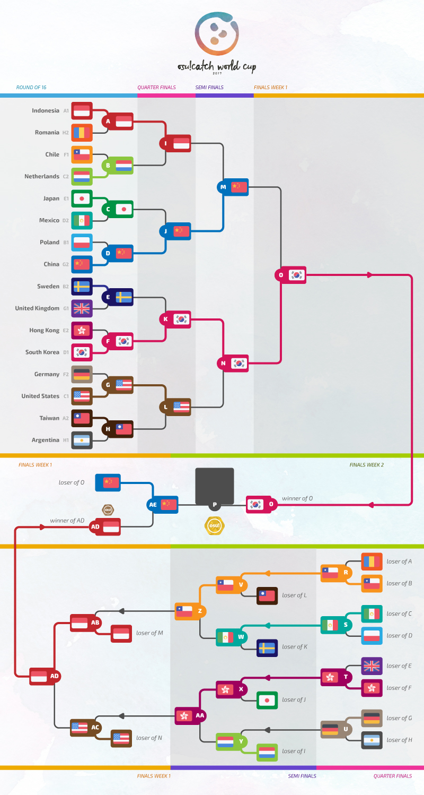

osu!catch World Cup 2017
=============================

The **osu!catch World Cup 2017** (**_CWC 2017_**) is a country-based osu!catch tournament hosted by the [osu! team](/wiki/People/The_Team). It is the 6th installment of the osu!catch World Cup.

## Tournament Schedule

| Event | Timestamp |
| ---: | :--- |
| Registration Phase | 03-14 May 2017 |
| Drawings | 28 May 2017 (14:00 UTC+0) |
| Group Stage | 03-04 Jun 2017 |
| Round of 16 | 10-11 Jun 2017 |
| Quarterfinals | 17-18 Jun 2017 |
| Semifinals | 24-25 Jun 2017 |
| Finals - Week 1 | 01-02 Jul 2017 |
| Finals - Week 2 | 08-09 Jul 2017 |

## Prizes

In every world cup, people conquering a place on the podium are eligible to receive unique prizes created specifically for World Cup winners. It is possible that these items change with every installment of the World Cups.

| Placing | Prize(s) |
| --- | :--- |
|  | $300 per team member, exclusive osu! tumbler and pins, profile badge, "osu!catch Champion" user title for one year |
|  | $160 per team member, exclusive osu! tumbler and pins , profile badge |
|  | $80 per team member, exclusive osu! tumbler and pins, profile badge |

## Organization

The osu!catch World Cup 2017 is run by various community members by distributing the multitude of tasks into various fields of responsibility.

| Position | Member |
| ------------ | -------------- |
| Management | [ Loctav](https://osu.ppy.sh/users/71366), [ p3n](https://osu.ppy.sh/users/123703), [ Deif](https://osu.ppy.sh/users/318565), [ shARPII](https://osu.ppy.sh/users/776257) |
| Map Selectors | [ Deif](https://osu.ppy.sh/users/318565), [ ZiRoX](https://osu.ppy.sh/users/200768) |
| Commentators | [ Arf](https://osu.ppy.sh/users/3716999), [ JBHyperion](https://osu.ppy.sh/users/4879508), [ Slainv](https://osu.ppy.sh/users/4823843), [ Setomi](https://osu.ppy.sh/users/2205929), [ Sartan](https://osu.ppy.sh/users/4100941), [ wwwww_](https://osu.ppy.sh/users/6437591), [ ztrot](https://osu.ppy.sh/users/6347) |
| Statisticians | [ deadbeat](https://osu.ppy.sh/users/128370), [ Nwolf](https://osu.ppy.sh/users/1910766) |

## Links

- [Discussion thread](https://osu.ppy.sh/community/forums/topics/589552)
- [Livestream](https://www.twitch.tv/osulive)
- **[Overall statistics, groups and more!](https://docs.google.com/spreadsheets/d/1ukKQD-q9mOaEX0gWhhKdma9o-HlI_n9Bz5g6l88j3lc/pubhtml)**

------------------------------------------------------------------------

## Match Schedule: Semifinals

### Saturday, 24 June 2017

| Team A |  |  | Team B | Match Time (UTC) | Local Time A | Local Time B | |
| ---: | ---: | :--- | :--- | :---: | :---: | :---: | |
| Indonesia |  |  | China | **11.00 UTC** | 18.00 UTC +7 | 19.00 UTC +8 | ¹ |
| Hong Kong |  |  | Japan | **12.30 UTC** | 20.30 UTC +8 | 21.30 UTC +9 | ² |
| Chile |  |  | Taiwan | **14.00 UTC** | 10.00 UTC -4 | 22.00 UTC +8 | ² |
| Mexico |  |  | Sweden | **15.30 UTC** | 10.30 UTC -5 | 17.30 UTC +2 | ² |
| Germany |  |  | Netherlands | **17.00 UTC** | 19.00 UTC +2 | 19.00 UTC +2 | ² |
| Chile |  |  | Sweden | **18.30 UTC** | 14.30 UTC -4 | 20.30 UTC +2 | ³ |

### Sunday, 25 June 2017

| Team A |  |  | Team B | Match Time (UTC) | Local Time A | Local Time B | |
| ---: | ---: | :--- | :--- | :---: | :---: | :---: | |
| Chile |  |  | Mexico | **0.30 UTC** | 20.30 (Sat.) UTC -4 | 19.30 (Sat.) UTC -5 | ³ |
| South Korea |  |  | United States | **2.00 UTC** | 11.00 UTC +9 | 22.00 (Sat.) UTC -4 | ¹ |
| Taiwan |  |  | Mexico | **3.30 UTC** | 11.30 UTC +8 | 22.30 (Sat.) UTC -5 | ³ |
| Hong Kong |  |  | Germany | **13.00 UTC** | 21.00 UTC +8 | 15.00 UTC +2 | ³ |
| Hong Kong |  |  | Netherlands | **13.00 UTC** | 21.00 UTC +8 | 15.00 UTC +2 | ³ |
| Japan |  |  | Germany | **13.00 UTC** | 22.00 UTC +9 | 15.00 UTC +2 | ³ |
| Japan |  |  | Netherlands | **13.00 UTC** | 22.00 UTC +9 | 15.00 UTC +2 | ³ |
| Taiwan |  |  | Sweden | **14.30 UTC** | 22.30 UTC +8 | 16.30 UTC +2 | ³ |

¹ Winner bracket encounter

² Loser bracket encounter

³ Encounter dependent on results of ²Loser bracket encounter

------------------------------------------------------------------------

## Participants

### Confirmed Rosters

| | Country | Member |
| ---: | :---: | :--- |
|  | **Argentina** | **[[Force]](https://osu.ppy.sh/users/1617217)**, [em1R-](https://osu.ppy.sh/users/1915210), [Rin-nya](https://osu.ppy.sh/users/3664478), [Ealstrom](https://osu.ppy.sh/users/3628521), [jerem1as](https://osu.ppy.sh/users/6117864), [Alex-kun 7u7](https://osu.ppy.sh/users/6925410) |
|  | **Australia** | **[chickennando](https://osu.ppy.sh/users/5818665)**, [Zeverage](https://osu.ppy.sh/users/237550), [Telstra3G](https://osu.ppy.sh/users/6063149), [Zoe](https://osu.ppy.sh/users/894101), [Beerus](https://osu.ppy.sh/users/5529199), [PewFanGirl](https://osu.ppy.sh/users/4639460) |
|  | **Austria** | **[- Nippa -](https://osu.ppy.sh/users/7180810)**, [Daletto](https://osu.ppy.sh/users/7592136), [[-ZeRo-]](https://osu.ppy.sh/users/4140062), [-FrozenCookie-](https://osu.ppy.sh/users/7429166), [[ K a z u ]](https://osu.ppy.sh/users/1902480), [Kuzumi-kun](https://osu.ppy.sh/users/3575682) |
|  | **Brazil** | **[Hanik](https://osu.ppy.sh/users/4533507)**, [Mikudesu](https://osu.ppy.sh/users/4120228), [Predominador](https://osu.ppy.sh/users/4568537), [Luciano Yoshiharu](https://osu.ppy.sh/users/2054788), [ThanaR](https://osu.ppy.sh/users/3834323), [O l i v e r](https://osu.ppy.sh/users/9610569) |
|  | **Canada** | **[-wwwww](https://osu.ppy.sh/users/3922569)**, [wwwww_](https://osu.ppy.sh/users/6437591), [FastYoshi](https://osu.ppy.sh/users/4820793), [Yoshi_green](https://osu.ppy.sh/users/1035891), [melonsigh](https://osu.ppy.sh/users/8623922), [[-Yuno-]](https://osu.ppy.sh/users/459886) |
|  | **Chile** | **[lineqtxz](https://osu.ppy.sh/users/989542)**, [[Nico]](https://osu.ppy.sh/users/1011240), [Quit user](https://osu.ppy.sh/users/2389481), [Snow-s-m](https://osu.ppy.sh/users/3673417), [lechuguin](https://osu.ppy.sh/users/2872000), [-Kurx](https://osu.ppy.sh/users/3204086) |
|  | **China** | **[Dusk](https://osu.ppy.sh/users/533210)**, [Callionet](https://osu.ppy.sh/users/3072921), [Sakurano  Kurimu](https://osu.ppy.sh/users/1338103), [- N a g i -](https://osu.ppy.sh/users/2956936), [Crystal](https://osu.ppy.sh/users/1646397), [Kasumi](https://osu.ppy.sh/users/2331531) |
|  | **Denmark** | **[Wermii](https://osu.ppy.sh/users/2424947)**, [Only1Magma](https://osu.ppy.sh/users/3922957), [TheRustShark](https://osu.ppy.sh/users/7839059), [DragonsDungeon](https://osu.ppy.sh/users/4134819), [kaare12356](https://osu.ppy.sh/users/4434640), [SharpN](https://osu.ppy.sh/users/4382076) |
|  | **Finland** | **[forgottentaco](https://osu.ppy.sh/users/6109660)**, [AwsumiFanGrill](https://osu.ppy.sh/users/4222176), [KurtsiFanGrill](https://osu.ppy.sh/users/4174308), [Nikolai](https://osu.ppy.sh/users/5302804), [Rinzee](https://osu.ppy.sh/users/4188814), [Noitakuningas](https://osu.ppy.sh/users/4022685) |
|  | **France** | **[CelegaS](https://osu.ppy.sh/users/1552429)**, [Orinoshi](https://osu.ppy.sh/users/3047355), [Haarashi](https://osu.ppy.sh/users/2876784), [Tsukiyama](https://osu.ppy.sh/users/5375171), [Fuka Pura](https://osu.ppy.sh/users/2326688), [RemSuckMyDuck](https://osu.ppy.sh/users/1698323) |
|  | **Germany** | **[NoteKuroi](https://osu.ppy.sh/users/186642)**, [MgnTby](https://osu.ppy.sh/users/4839807), [Derunax](https://osu.ppy.sh/users/6414332), [-Rico](https://osu.ppy.sh/users/2392087), [Mezmerizer-](https://osu.ppy.sh/users/864047), [Vinci007](https://osu.ppy.sh/users/5030297) |
|  | **Hong Kong** | **[alienflybot](https://osu.ppy.sh/users/636114)**, [Latifah-sama](https://osu.ppy.sh/users/1226238), [insaneplayer](https://osu.ppy.sh/users/3240418), [Alice Cartelet](https://osu.ppy.sh/users/1784164), [liuzicheng4732](https://osu.ppy.sh/users/6645501), [HineX](https://osu.ppy.sh/users/13854) |
|  | **Hungary** | **[gaaraati](https://osu.ppy.sh/users/3320300)**, [tomaszto](https://osu.ppy.sh/users/2373553), [mardebra](https://osu.ppy.sh/users/5419149), [Shigaisen](https://osu.ppy.sh/users/6635772), [kisbee](https://osu.ppy.sh/users/1505264), [-Sikk-](https://osu.ppy.sh/users/6904049) |
|  | **Japan** | **[noraRcat](https://osu.ppy.sh/users/883939)**, [Furely](https://osu.ppy.sh/users/853694), [sekirei](https://osu.ppy.sh/users/1643335), [sennkouhanabi](https://osu.ppy.sh/users/1700008), [Molqus](https://osu.ppy.sh/users/1927193), [ekr](https://osu.ppy.sh/users/4497706) |
|  | **Indonesia** | **[Deceitful](https://osu.ppy.sh/users/1396447)**, [Cera-](https://osu.ppy.sh/users/1974131), [dika312](https://osu.ppy.sh/users/741613), [Galaxi](https://osu.ppy.sh/users/2552435), [MizzoKing-](https://osu.ppy.sh/users/3285320), [Yukaa-](https://osu.ppy.sh/users/5876959) |
|  | **Italy** | **[Pizza Kun](https://osu.ppy.sh/users/768609)**, [- Resh -](https://osu.ppy.sh/users/8494477), [ArMa79](https://osu.ppy.sh/users/4982799), [Trollingor](https://osu.ppy.sh/users/4144266), [KuroGX](https://osu.ppy.sh/users/6581584), [Karym](https://osu.ppy.sh/users/5220794) |
|  | **Malaysia** | **[Shadow Fear](https://osu.ppy.sh/users/635485)**, [Kagari](https://osu.ppy.sh/users/3366264), [murutattack](https://osu.ppy.sh/users/4480237), [Future_miku95](https://osu.ppy.sh/users/2351567), [Lute](https://osu.ppy.sh/users/4011799), [Gilochan](https://osu.ppy.sh/users/598204) |
|  | **Mexico** | **[Ponchiwi](https://osu.ppy.sh/users/1089040)**, [daxeroz](https://osu.ppy.sh/users/1170156), [Astrea](https://osu.ppy.sh/users/3845678), [Jusenkyo](https://osu.ppy.sh/users/1237535), [Cxlucha](https://osu.ppy.sh/users/5063961), [Kashou](https://osu.ppy.sh/users/4046640) |
|  | **Netherlands** | **[Sartan](https://osu.ppy.sh/users/4100941)**, [Wesley](https://osu.ppy.sh/users/2407265), [AniCore](https://osu.ppy.sh/users/3212806), [Enchant](https://osu.ppy.sh/users/4744367), [b-a-d-s123](https://osu.ppy.sh/users/3656717), [CakeAndBanana](https://osu.ppy.sh/users/1981424)  |
|  | **New Zealand** | **[Sakurano](https://osu.ppy.sh/users/2730486)**, [TheBeany](https://osu.ppy.sh/users/8146397), [CoolEVT](https://osu.ppy.sh/users/3252653), [Karma](https://osu.ppy.sh/users/3768185), [Trumpet](https://osu.ppy.sh/users/5405204), [Kiwi](https://osu.ppy.sh/users/3167450) |
|  | **Norway** | **[Cameragod](https://osu.ppy.sh/users/4974088)**, [Groex](https://osu.ppy.sh/users/3970664), [Divine Cake](https://osu.ppy.sh/users/3636998), [Mile](https://osu.ppy.sh/users/2760954), [Benny-](https://osu.ppy.sh/users/4023183), [Lanki](https://osu.ppy.sh/users/2535200) |
|  | **Philippines** | **[-Nicotine](https://osu.ppy.sh/users/4818935)**, [- Kielzu -](https://osu.ppy.sh/users/6221114), [Chloebe](https://osu.ppy.sh/users/4577865), [Lobsterr](https://osu.ppy.sh/users/6575915), [Crowley](https://osu.ppy.sh/users/6341006), [Roido](https://osu.ppy.sh/users/6829103) |
|  | **Poland** | **[Kosmit](https://osu.ppy.sh/users/1749173)**, [BoberOfDarkness](https://osu.ppy.sh/users/3427748), [Hirikoshi](https://osu.ppy.sh/users/2114149), [wampir](https://osu.ppy.sh/users/261497), [LechuCzechu](https://osu.ppy.sh/users/5251714), [-Filow-](https://osu.ppy.sh/users/3157472) |
|  | **Romania** | **[Crystallize](https://osu.ppy.sh/users/4997316)**, [Attenox](https://osu.ppy.sh/users/6976867), [PakaChan](https://osu.ppy.sh/users/3080727), [iRevi](https://osu.ppy.sh/users/3880553) |
|  | **Russian Federation** | **[VagaNNN](https://osu.ppy.sh/users/1260040)**, [OneLoveOneLife](https://osu.ppy.sh/users/6856387), [Nelly](https://osu.ppy.sh/users/4741164), [aoe](https://osu.ppy.sh/users/6094216), [spider_yoba](https://osu.ppy.sh/users/1912659), [LuckyDesuManiac](https://osu.ppy.sh/users/2535016) |
|  | **Singapore** | **[He Ang Erika](https://osu.ppy.sh/users/2451381)**, [Sinnoh](https://osu.ppy.sh/users/4236057), [[Eun]](https://osu.ppy.sh/users/3788536), [Setsuen](https://osu.ppy.sh/users/2673742), [KyousukeRentaro](https://osu.ppy.sh/users/4971343), [Accel](https://osu.ppy.sh/users/1169796) |
|  | **South Korea** | **[Spectator](https://osu.ppy.sh/users/702598)**, [Berea](https://osu.ppy.sh/users/3657951), [[224]Hyperw7](https://osu.ppy.sh/users/4158549), [_Asriel](https://osu.ppy.sh/users/566276), [ExGon](https://osu.ppy.sh/users/214187), [mjj741](https://osu.ppy.sh/users/1459769) |
|  | **Sweden** | **[Setomi](https://osu.ppy.sh/users/2205929)**, [Yukiteru Amano](https://osu.ppy.sh/users/1894511), [DamnEasy](https://osu.ppy.sh/users/4452911), [Negri_sk](https://osu.ppy.sh/users/2231396), [Osten](https://osu.ppy.sh/users/4417929), [Toggeni](https://osu.ppy.sh/users/3555166) |
|  | **Taiwan** | **[e0486](https://osu.ppy.sh/users/1840467)**, [Megpoid](https://osu.ppy.sh/users/158240), [Hinashi Koyuki](https://osu.ppy.sh/users/7451713), [ZX123456](https://osu.ppy.sh/users/489271), [473147315371](https://osu.ppy.sh/users/1952803), [ItsLingers](https://osu.ppy.sh/users/1449322) |
|  | **United Kingdom** | **[Sorcerer](https://osu.ppy.sh/users/1913190)**, [DarnedUrchin](https://osu.ppy.sh/users/4928846), [Olib](https://osu.ppy.sh/users/4044289), [FABninja](https://osu.ppy.sh/users/5257769), [- Magic Bomb -](https://osu.ppy.sh/users/3071175), [Martin22](https://osu.ppy.sh/users/4209402) |
|  | **United States** | **[Zak](https://osu.ppy.sh/users/1375955)**, [Sponge](https://osu.ppy.sh/users/4365562), [Del](https://osu.ppy.sh/users/2996241), [chickenbible](https://osu.ppy.sh/users/2306637), [qebrus](https://osu.ppy.sh/users/3438241) |
|  | **Venezuela** | **[AizW](https://osu.ppy.sh/users/6672736)**, [Yudara](https://osu.ppy.sh/users/3564018), [Hisashi Shimoro](https://osu.ppy.sh/users/6736420), [_Tsugumi](https://osu.ppy.sh/users/8746368), [F4spross](https://osu.ppy.sh/users/6485050) |

------------------------------------------------------------------------

------------------------------------------------------------------------

## Mappools

### Group Stage

**[Download the mappack here! (120 MB)](http://www.mediafire.com/file/4vdwqn61cwk1vb1/CWC_2017_Group_Stage.rar)**

| NoMod | |
| --- | :--- |
| [ensou ft GUMI - COMA (Nelly)](http://osu.ppy.sh/b/1299618&m=2) | [Rain] |
| [Obsidia - Crazy (Drafura)](http://osu.ppy.sh/b/241869&m=2) | [Etoile] |
| [m.o.v.e - DOGFIGHT (CLSW)](http://osu.ppy.sh/b/1251462&m=2) | [Rain] |
| [wa. vs celas - Vajuranda (alienflybot)](http://osu.ppy.sh/b/684820&m=2) | [Deif's Rain] |
| [Dark PHOENiX - The Primal Scene of Japan the Girl Saw (sjoy)](http://osu.ppy.sh/b/311898&m=2) | [Flower's Lunatic] |
| [Rise Against - The Good Left Undone (pishifat)](http://osu.ppy.sh/b/795712&m=2) | [Extra] |

| Hidden | |
| --- | :--- |
| [Oskar Schuster - Fjarlaegur (Cypix Remix) (Jusenkyo)](http://osu.ppy.sh/b/1023582&m=2) | [Hyperion's Rain] |
| [Kaneko Chiharu - iLLness LiLin (Fresh Chicken)](http://osu.ppy.sh/b/1279951&m=2) | [tasuke's C.EXHAUST] |
| [Mikami Shiori & Ookubo Rumi - Onna to Onna no Yuri-Game (eg91022a71w)](http://osu.ppy.sh/b/153418&m=2) | [YuruYuri] |

| HardRock | |
| --- | :--- |
| [Eiko Shimamiya - Higurashi no Naku Koro ni (TV size) (Betsuto)](http://osu.ppy.sh/b/292827&m=2) | [Platter] |
| [Camellia - Chirality (RLC)](http://osu.ppy.sh/b/531216&m=2) | [Hard] |
| [Tsubaki - Kyun Kyun Tamaran Inaba tan! (Aenna)](http://osu.ppy.sh/b/114651&m=2) | [Apricotan!] |

| DoubleTime | |
| --- | :--- |
| [Goose house - Hikaru nara (Ascendance)](http://osu.ppy.sh/b/1246823&m=2) | [Platter] |
| [Tokyo Machine - OKAY (WildOne94)](http://osu.ppy.sh/b/1080445&m=2) | [Platter] |
| [07th Expansion - the executioner (Natteke)](http://osu.ppy.sh/b/91198&m=2) | [Hard] |

| Tiebreaker | |
| --- | :--- |
| [MISATO - Necro Fantasia (Chromoxx)](http://osu.ppy.sh/b/1119421&m=2) | [Curse of Dreams and Reality] |

### Round of 16

**[Download the mappack here! (124 MB)](http://www.mediafire.com/file/l7kgoz9hx967mnz/CWC_2017_Round_of_16.rar)**

| NoMod | |
| --- | :--- |
| [Reol - No title (Spectator)](http://osu.ppy.sh/b/536479&m=2) | [Collab Rain] |
| [Kurubukko vs yukitani - Minamichita EVOLVED (alienflybot)](http://osu.ppy.sh/b/1100300&m=2) | [REINCARNATION] |
| [Muzzy - Crescendo (feat. MYLK) (WildOne94)](http://osu.ppy.sh/b/1116331&m=2) | [Soltar] |
| [CLIFF EDGE feat. Nakamura Maiko - The Distance (Ascendance)](http://osu.ppy.sh/b/1053163&m=2) | [Smile] |
| [Eoin O' Broin - Oblivion (DoKoLP)](http://osu.ppy.sh/b/119853&m=2) | [Insane] |
| [UPLIFT SPICE - Omega Rhythm (Jemmmmy)](http://osu.ppy.sh/b/366140&m=2) | [Extra] |

| Hidden | |
| --- | :--- |
| [M2U - A Bella ! (ZiRoX)](http://osu.ppy.sh/b/1147348&m=2) | [Deif's Overdose] |
| [Hecq - Dstrukt (JBHyperion)](http://osu.ppy.sh/b/1087385&m=2) | [Overdose] |
| [Red Velvet - Russian Roulette (Natsu)](http://osu.ppy.sh/b/1085554&m=2) | [Heart b-b-beat] |

| HardRock | |
| --- | :--- |
| [Helblinde - Above the Clouds (P i k u)](http://osu.ppy.sh/b/1068302&m=2) | [In the Sky] |
| [senya - Iro wa Nioedo Chirinuru o(OPver.) (- Magic Girl -)](http://osu.ppy.sh/b/909953&m=2) | [Chemistry of Emotions] |
| [Loos - Koi Yomi Zakura (Full Ver.) (S i R i R u)](http://osu.ppy.sh/b/46587&m=2) | [Hanahubuki] |

| DoubleTime | |
| --- | :--- |
| [Memme - Cherry Blossom (Spectator)](http://osu.ppy.sh/b/1047736&m=2) | [Platter] |
| [Nagito Komaeda (CV.Megumi Ogata) - Zettai Kibou Birthday (Myle)](http://osu.ppy.sh/b/1062454&m=2) | [Roseus' Platter] |
| [Cyua - Blumenkranz (Shinxyn)](http://osu.ppy.sh/b/380475&m=2) | [Insane] |

| Tiebreaker | |
| --- | :--- |
| [Nekomata Master feat. Shimotsuki Haruka - Element of SPADA (Tenshichan)](http://osu.ppy.sh/b/1035785&m=2) | [Stellar] |

## Quarterfinals

**[Download the mappack here! (102 MB)](http://www.mediafire.com/file/91ve9g5dpkg24up/CWC_2017_Quarterfinals.rar)**

| NoMod | |
| --- | :--- |
| [dj MAX STEROID - Arabian Rave Night (Ascendance)](http://osu.ppy.sh/b/1254591&m=2) | [Black Another] |
| [An - Catanoph (Lavender)](http://osu.ppy.sh/b/1175369&m=2) | [exam's Overdose] |
| [Kawada Mami - Break a spell (wairo)](http://osu.ppy.sh/b/1179665&m=2) | [Furely's Overdose] |
| [a_hisa - inertia (Kyuare)](http://osu.ppy.sh/b/1255531&m=2) | [Overdose] |
| [Delain - Go Away (pishifat)](http://osu.ppy.sh/b/1016263&m=2) | [Extra] |
| [AKI AKANE - Kando*Reduction (Milan-)](http://osu.ppy.sh/b/598867&m=2) | [Pho's Elimination] |

| Hidden | |
| --- | :--- |
| [IOSYS - RE:Usatei (Spectator)](http://osu.ppy.sh/b/1037258&m=2) | [Spec's CTB] |
| [Hardwell & Joey Dale feat. Luciana - Arcadia (JBHyperion)](http://osu.ppy.sh/b/1009520&m=2) | [Radiance] |
| [SHK - Holic (ktgster)](http://osu.ppy.sh/b/827223&m=2) | [SHD] |

| HardRock | |
| --- | :--- |
| [Miyano Mamoru - Canon (F D Flourite)](http://osu.ppy.sh/b/1071405&m=2) | [AscenDFlourite's Rain] |
| [penoreri - Preserved Valkyria (rew0825)](http://osu.ppy.sh/b/1261626&m=2) | [Equality] |
| [Kotoge Mai - Mangekyou (Oracle)](http://osu.ppy.sh/b/535334&m=2) | [cRyo's Insane] |

| DoubleTime | |
| --- | :--- |
| [Mili - Rosetta (P i k u)](http://osu.ppy.sh/b/893353&m=2) | [Rose] |
| [nmk - sola (-Sh1n1-)](http://osu.ppy.sh/b/1274343&m=2) | [MBomb's Platter] |
| [Nishino Kana - Darling (Giralda)](http://osu.ppy.sh/b/493755&m=2) | [Insane] |

| Tiebreaker | |
| --- | :--- |
| [Camellia - Exit This Earth's Atomosphere (Yumeno Himiko)](http://osu.ppy.sh/b/1213636&m=2) | [Vision] |

## Semifinals

**[Download the mappack here! (97 MB)](http://www.mediafire.com/file/ikgcpwt5p719p0c/CWC_2017_Semifinals.rar)**

| NoMod | |
| --- | :--- |
| [Function Phantom - Algebra (Spectator)](http://osu.ppy.sh/b/1001619&m=2) | [Crystal Spec's Overdose] |
| [Expander - Move That Body (Kyptoric)](http://osu.ppy.sh/b/909889&m=2) | [Overdose] |
| [a_hisa - Dysthymia (Kyuare)](http://osu.ppy.sh/b/1299872&m=2) | [Eternal] |
| [Morimori Atsushi - Tits or get the fuck out!! (rew0825)](http://osu.ppy.sh/b/1249831&m=2) | [F*ck out!!] |
| [An - Saigo (Rumia-)](http://osu.ppy.sh/b/1100091&m=2) | [Final] |
| [Nanahoshi Kangengakudan - Meikaruza (pkk)](http://osu.ppy.sh/b/701033&m=2) | [Extra] |

| Hidden | |
| --- | :--- |
| [M2U - Marigold (Hareimu)](http://osu.ppy.sh/b/1270304&m=2) | [Deif's Overdose] |
| [Kanako Ito - Densho no Uta -Verum- (F D Flourite)](http://osu.ppy.sh/b/1117822&m=2) | [Aeviternus] |
| [S.S.H. - Intersect Thunderbolt-Remix (7odoa)](http://osu.ppy.sh/b/122693&m=2) | [Exceed] |

| HardRock | |
| --- | :--- |
| [Akiyama Uni - Odoru Mizushibuki (Hareimu)](http://osu.ppy.sh/b/1113464&m=2) | [Splash Dance] |
| [Happy Clover - PUNCH*MIND*HAPPINESS (examination)](http://osu.ppy.sh/b/1023226&m=2) | [Rain] |
| [Natsume Chiaki - Hanairo Biyori (rinsukir)](http://osu.ppy.sh/b/509510&m=2) | [Awaken's Challenge] |

| DoubleTime | |
| --- | :--- |
| [*namirin - Daidai Genome (Ascendance)](http://osu.ppy.sh/b/1209453&m=2) | [Rain] |
| [Mili - Utopiosphere -Platonism- (Benny-)](http://osu.ppy.sh/b/1111110&m=2) | [Tyrell's Utopia] |
| [Yuuhei Satellite (Arranged: Iceon) feat. senya - Yuudachi, Kimi to Kakurega (Dailycare)](http://osu.ppy.sh/b/1007169&m=2) | [Lunatic] |

| Tiebreaker | |
| --- | :--- |
| [orangentle / Yu_Asahina - HAELEQUIN (Extended ver.) (CLSW)](http://osu.ppy.sh/b/1201544&m=2) | [Witchcraft] |

------------------------------------------------------------------------

## Match Results

### Quarterfinals

| Sunday, 18. June 2017 | | | | |
| ---: | :---: | :---: | :--- | :---: |
| Japan  | 2 | 5 |  China | [#1](https://osu.ppy.sh/community/matches/33939916) |
| Sweden  | 0 | 5 |  South Korea | [#1](https://osu.ppy.sh/community/matches/33940848) |
| United Kingdom  | 2 | 5 |  Hong Kong | [#1](https://osu.ppy.sh/community/matches/33941722) |
| Indonesia  | 5 | 1 |  Netherlands | [#1](https://osu.ppy.sh/community/matches/33943065) |
| United States  | 5 | 3 |  Taiwan | [#1](https://osu.ppy.sh/community/matches/33944186) |
| Germany  | 5 | 0 |  Argentina | -WIN BY DEFAULT- |
| Romania  | 0 | 5 |  Chile | [#1](https://osu.ppy.sh/community/matches/33950518) |
| Mexico  | 5 | 1 |  Poland | [#1](https://osu.ppy.sh/community/matches/33951822) |

### Round of 16

| Sunday, 11. June 2017 | | | | |
| ---: | :---: | :---: | :--- | :---: |
| Hong Kong  | 0 | 5 |  South Korea | [#1](https://osu.ppy.sh/community/matches/33780827) |
| Poland  | 1 | 5 |  China | [#1](https://osu.ppy.sh/community/matches/33781746) |
| Indonesia  | 5 | 0 |  Romania | [#1](https://osu.ppy.sh/community/matches/33782639) |
| Taiwan  | 5 | 0 |  Argentina | [#1](https://osu.ppy.sh/community/matches/33783706) |
| Japan  | 5 | 0 |  Mexico | [#1](https://osu.ppy.sh/community/matches/33785035) |
| Chile  | 4 | 5 |  Netherlands | [#1](https://osu.ppy.sh/community/matches/33788679) |
| Sweden  | 5 | 2 |  United Kingdom | [#1](https://osu.ppy.sh/community/matches/33790093) |
| Germany  | 1 | 5 |  United States | [#1](https://osu.ppy.sh/community/matches/33791464) |

### Group Stage

| Saturday, 03. June 2017 | | | | |
| ---: | :---: | :---: | :--- | :---: |
| New Zealand  | 0 | 4 |  Russian Federation | [#1](https://osu.ppy.sh/community/matches/33594444) |
| Singapore  | 0 | 4 |  Australia | [#1](https://osu.ppy.sh/community/matches/33594453) |
| Hong Kong  | 1 | 4 |  Japan | [#1](https://osu.ppy.sh/community/matches/33594458) |
| Taiwan  | 0 | 4 |  Indonesia | [#1](https://osu.ppy.sh/community/matches/33595359) |
| New Zealand  | 0 | 4 |  Sweden | [#1](https://osu.ppy.sh/community/matches/33595349) |
| Australia  | 0 | 4 |  South Korea | [#1](https://osu.ppy.sh/community/matches/33595356) |
| Malaysia  | 4 | 2 |  Italy | [#1](https://osu.ppy.sh/community/matches/33596235) |
| Philippines  | 1 | 4 |  Finland | [#1](https://osu.ppy.sh/community/matches/33596240) |
| United Kingdom  | 1 | 4 |  China | [#1](https://osu.ppy.sh/community/matches/33596244) |
| Denmark  | 1 | 4 |  Taiwan | [#1](https://osu.ppy.sh/community/matches/33597388) |
| Russian Federation  | 3 | 4 |  Poland | [#1](https://osu.ppy.sh/community/matches/33597392) |
| Finland  | 0 | 4 |  Japan | [#1](https://osu.ppy.sh/community/matches/33597393) |
| Brazil  | 0 | 4 |  Taiwan | -WIN BY DEFAULT- |
| Sweden  | 1 | 4 |  Poland | [#1](https://osu.ppy.sh/community/matches/33598432) |
| Hungary  | 0 | 4 |  Romania | [#1](https://osu.ppy.sh/community/matches/33598437) |
| Denmark  | 2 | 4 |  Brazil | [#1](https://osu.ppy.sh/community/matches/33606293) |
| Norway  | 2 | 4 |  Chile | [#1](https://osu.ppy.sh/community/matches/33606294) |
| Hungary  | 0 | 4 |  Argentina | [#1](https://osu.ppy.sh/community/matches/33606305) |
| Italy  | 1 | 4 |  United States | [#1](https://osu.ppy.sh/community/matches/33607880) |
| Venezuela  | 0 | 4 |  Norway | [#1](https://osu.ppy.sh/community/matches/33607886) |
| Germany  | 4 | 3 |  Chile | [#1](https://osu.ppy.sh/community/matches/33607891) |
| Netherlands  | 0 | 4 |  United States | [#1](https://osu.ppy.sh/community/matches/33609509) |
| Austria  | 0 | 4 |  Canada | [#1](https://osu.ppy.sh/community/matches/33609513) |
| Argentina  | 4 | 0 |  France | [#1](https://osu.ppy.sh/community/matches/33609523) |
| Venezuela  | 0 | 4 |  Chile | [#1](https://osu.ppy.sh/community/matches/33610689) |
| Canada  | 2 | 4 |  United Kingdom | [#1](https://osu.ppy.sh/community/matches/33610690) |

| Sunday, 04. June 2017 | | | | |
| ---: | :---: | :---: | :--- | :---: |
| Mexico  | 0 | 4 |  South Korea | [#1](https://osu.ppy.sh/community/matches/33616648) |
| Canada  | 2 | 4 |  China | [#1](https://osu.ppy.sh/community/matches/33616607) |
| Malaysia  | 1 | 4 |  United States | [#1](https://osu.ppy.sh/community/matches/33617566) |
| Australia  | 0 | 4 |  Mexico | [#1](https://osu.ppy.sh/community/matches/33617553) |
| New Zealand  | 0 | 4 |  Poland | [#1](https://osu.ppy.sh/community/matches/33622086) |
| Philippines  | 0 | 4 |  Hong Kong | [#1](https://osu.ppy.sh/community/matches/33622027) |
| Singapore  | 0 | 4 |  South Korea | [#1](https://osu.ppy.sh/community/matches/33622032) |
| Malaysia  | 3 | 4 |  Netherlands | [#1](https://osu.ppy.sh/community/matches/33622978) |
| Philippines  | 0 | 4 |  Japan | [#1](https://osu.ppy.sh/community/matches/33622971) |
| Austria  | 0 | 4 |  United Kingdom | [#1](https://osu.ppy.sh/community/matches/33622973) |
| Denmark  | 0 | 4 |  Indonesia | [#1](https://osu.ppy.sh/community/matches/33624107) |
| Sweden  | 4 | 2 |  Russian Federation | [#1](https://osu.ppy.sh/community/matches/33624268) |
| Finland  | 1 | 4 |  Hong Kong | [#1](https://osu.ppy.sh/community/matches/33624109) |
| Austria  | 4 | 0 |  China | -WIN BY DEFAULT- |
| Hungary  | 1 | 4 |  France | [#1](https://osu.ppy.sh/community/matches/33625333) |
| Argentina  | 1 | 4 |  Romania | [#1](https://osu.ppy.sh/community/matches/33625335) |
| Italy  | 2 | 4 |  Netherlands | [#1](https://osu.ppy.sh/community/matches/33626860) |
| Romania  | 1 | 4 |  France | [#1](https://osu.ppy.sh/community/matches/33626858) |
| Norway  | 4 | 3 |  Germany | [#1](https://osu.ppy.sh/community/matches/33626849) |
| Brazil  | 0 | 4 |  Indonesia | [#1](https://osu.ppy.sh/community/matches/33628443) |
| Singapore  | 0 | 4 |  Mexico | [#1](https://osu.ppy.sh/community/matches/33628484) |
| Venezuela  | 0 | 4 |  Germany | -WIN BY DEFAULT- |

------------------------------------------------------------------------

## Ruleset
### Tournament Rules

1. The osu!catch World Cup is a country-based team tournament, played on the osu!catch game mode.
  - While this competition is planned as a 3 versus 3 setup, this might change depending on the amount of incoming registrations.

2. Map scoring is based on Score V2.
  - Changes to the Score V2 algorithm were proposed by the Tournament Management to the developers already and are yet under review.

3. The maps for each round will be announced by the mapset selector in advance on the Sunday before the actual matches take place. Only these will be used during the respective matches.
  - One map will be given as a tiebreaker map. This map will only be played in case of a tie.
  - There will also be a [Hidden](/wiki/Game_Modifiers), [HardRock](/wiki/Game_Modifiers) and a [DoubleTime](/wiki/Game_Modifiers) bracket.

4. Match schedule will be settled by the Tournament Management (see below).
5. If no staff or referee is available, the match will be postponed.
6. Failed players' scores do not get added to the team score.
  - Reviving and surviving during a map gets considered as passing it.

7. Use of the Visual Settings to alter background dim or disable map elements like storyboards and skins are allowed.
8. If the beatmap ends in a draw, the game will be nullified.
9. If a player disconnects, they get treated as if they failed the map.
  - Disconnects within 30 seconds after map begin can be rematched. This is up to the referee's discretion. The played beatmap might be aborted for this.

10. Beatmaps cannot be reused in the same match unless the game was nullified.
11. If less than the minimum required players attend, the maximum time the match can be postponed is 10 minutes.
12. Exchanging players during a match is allowed without limitations.
13. Lag is not a valid reason to nullify a beatmap.
14. All players are supposed to keep the match running fluent and without delays. Excessive match delays coming from the player's side can be issued with penalties.
15. If a player disconnects between the beatmaps and the team can not provide an exchange, the match can be delayed 10 minutes at maximum.
16. All players and referees must to be treated with respect. Instructions of the referees and tournament management is to be followed. Decisions labeled as final are not to be objected.
17. Disrupting the match by foul play, picking inappropriate warmup maps (see below), insulting and provoking other players or referees, delaying the match or other deliberate inappropriate misbehavior is strictly prohibited.
18. The multiplayer chatrooms underlie the [osu! community rules](/wiki/Rules). All chat rules apply to the multiplayer chatrooms, too.
  - Breaking the chat rules results in a silence. Silenced players can not participate at multiplayer matches and must be exchanged for the time being.

19. In Group stage, 'Win by default' will be considered as win by 4:0, +1.0 score difference ratio.
20. Unexpected incidences are handled by the tournament management. Referees may allow higher tolerance depending on the given circumstances. This is up to their discretion.
21. Penalties for violating the tournament rules can be:
  - Exclusion of specific players for one map
  - Exclusion of specific players for an entire match
  - Declaring the match as Lost by Default
  - Disqualification from the entire tournament
  - Disqualification from the current and future official tournaments until appealed
  - Any modification of these rules will be announced.

### Tournament Registration

1. Every user interested in joining their country's team signs up individually.
  - Tournament Management will create a list of potential candidates for a country's team.
  - Tournament Management declares one candidate to the captain of the country's team, albeit temporarily.
  - The declared captain can form their team from the candidate list of their country.

2. To ensure valid and serious registrations, every registered user will be checked by the Tournament Management.
  - Every registered user will be assigned to their respective country's candidate list.
  - To be successfully accepted on the list, you have to ensure that your global osu!catch performance ranking is above 5000.
  - To be successfully accepted on the list, you have to ensure that you did not violate the [osu! community rules](/wiki/Rules) within the last 12 months.

3. All successfully formed teams will be published after the Registration Phase.
4. Only the 32 potentially strongest countries will participate. The potential strength of a country is determined by the online statistics of all valid candidates.
  - If the amount of registered countries is below 32, the number might be reduced to 24, 20 or 16. The aim is always to let as many countries participate as possible!

5. Mapset selectors may not participate as a player in this tournament.

### Stage Instructions

1. In the first stage (Group Stage), the teams will be divided into 8 groups of 4 teams.
  - This may change depending on how many teams are accepted into the competition at the end.

2. All the teams from each group will face each other.
3. Rankings of each group are determined by sorting the results of each team's performance in the following priority:
  - Most matches won.
  - Have higher `{(the number of maps won) - (the number of maps defeated)}`.
  - Most maps won.
  - Have higher `∑{(total score difference) / (maximum score)}`.
  - Winner of the rematch.

4. The top 2 teams of each group will move on to the Knock-Out Stages.
  -  This may change with the actual Group Stage setup.

5. Following stages are Double Elimination Stages. This means that the winner moves to the next stage and the losing team gets moved to the Loser bracket.
6. Based on [this image](http://puu.sh/bUq5V/f1066103b0.png), the stages are split up into the following:

| Stage | Match ID |
| -----: | -------- |
| Round of 16 |  A, B, C, D, E, F, G, H |
| Quarterfinals | I, J, K, L & R, S, T, U |
| Semifinals | M, N & V, W, X, Y, Z, AA |
| Finals - Week 1 | O & AB, AC, AD, AE |
| Finals - Week 2 | P, Q |

**Winning conditions:**
  - In Group Stage, you need to win 4 maps to win a match. (Best-of-7)
  - In the Round of 16 and the Quarterfinals, you need to win 5 maps to win a match. (Best-of-9)
  - In Semifinals and Finals: Week 1, you need to win 6 maps to win a match. (Best-of-11)
  - In Finals: Week 2, you need to win 7 maps to win the match. (Best-of-13)

### Match Instructions

1. A referee will create a multiplayer room 15 minutes in advance. Players must gather during this period.
  - Room settings are osu!catch, Team-Vs., Win Condition: 'ScoreV2'. Room name must be "CWC 2017: (TeamBlue) vs (TeamRed)".
  - The team mentioned first in the room name must be the blue team, the team mentioned second in the room name must be the red team.

2. Players are free to select up to two warm-up maps. Using beatmaps with questionable content is prohibited. All maps must be osu!catch specific maps.
3. Each captain can ban **one beatmap** to be selected from the pool. These beatmaps are not allowed to be picked by any team in the entire match.  
4. Beatmap selection will alternate between each captain selecting a beatmap out of the map pool.
5. Each captain must use "!roll" once in #multiplayer.
  - The winner of the !roll starts picking the first beatmap of the match.
  - The loser of the !roll starts banning.

6. Captains may pick freely from any bracket.
  - In case of a tie, the tiebreaker map must be played.

7. Results of the Group Stage will be published via a Statistics sheet.

### Mappool Instructions

1. There will be 1 mappool for the Group Stage, 1 mappool for the Round of 16, 1 mappool for the Quarterfinals, 1 mappool for the Semifinals and 1 mappool for the Finals.
  - Finals Week 1 & Finals Week 2 use the same mappool.

2. Each mappool consists of 4 brackets: NoMod, [Hidden](/wiki/Game_Modifiers), [HardRock](/wiki/Game_Modifiers) and [DoubleTime](/wiki/Game_Modifiers).
3. Each mappool consists of 16 maps in total.
4. Each mappool has one tiebreaker.
5. The NoMod bracket will be played with no modes activated.
6. The Hidden, HardRock and DoubleTime bracket will be played with the respective modes activated.  
  - When playing a map from the HardRock or DoubleTime pool, Hidden can be used optionally by any player.

7. The tiebreaker will be played under NoMod conditions.
8. The size of the NoMod bracket will be 6 in all stages.
9. The size of the [Hidden](/wiki/Game_Modifiers), [HardRock](/wiki/Game_Modifiers) and [DoubleTime](/wiki/Game_Modifiers) brackets will be 3 in all stages.

### Scheduling Instructions

1. Each stage will be held on **a single weekend**.
2. Matches in Group Stage may overlap.
3. All Double Elimination Stages will be held on either Saturday or Sunday, UTC+0.
4. Scheduling will be handled by the Tournament Management. Schedules will be released on the Sunday before the first matches of the actual stage. Tournament Management will try to create the schedule to respect the participant's time zone.
  - In the stages Quarterfinals and higher: Please inform tournament management before Sunday, if you expect a specific time slot to be unavailable in the following week. Wishes are tried to be followed, alas no promises can be made.

5. Rescheduling after the release of the Schedule on the wiki can not be done in any circumstance.
6. Captains are responsible for their teams availability. The greater team size exists to ensure every team can provide at least three players for each match. If teams can not provide three players for a match, the match will be considered forfeited.
