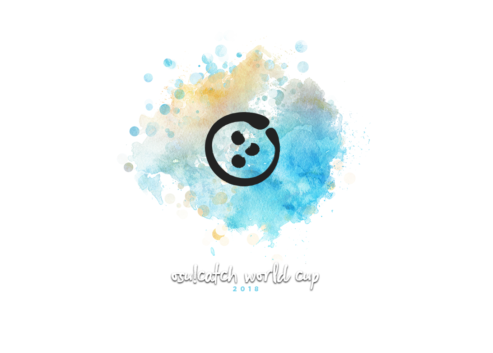
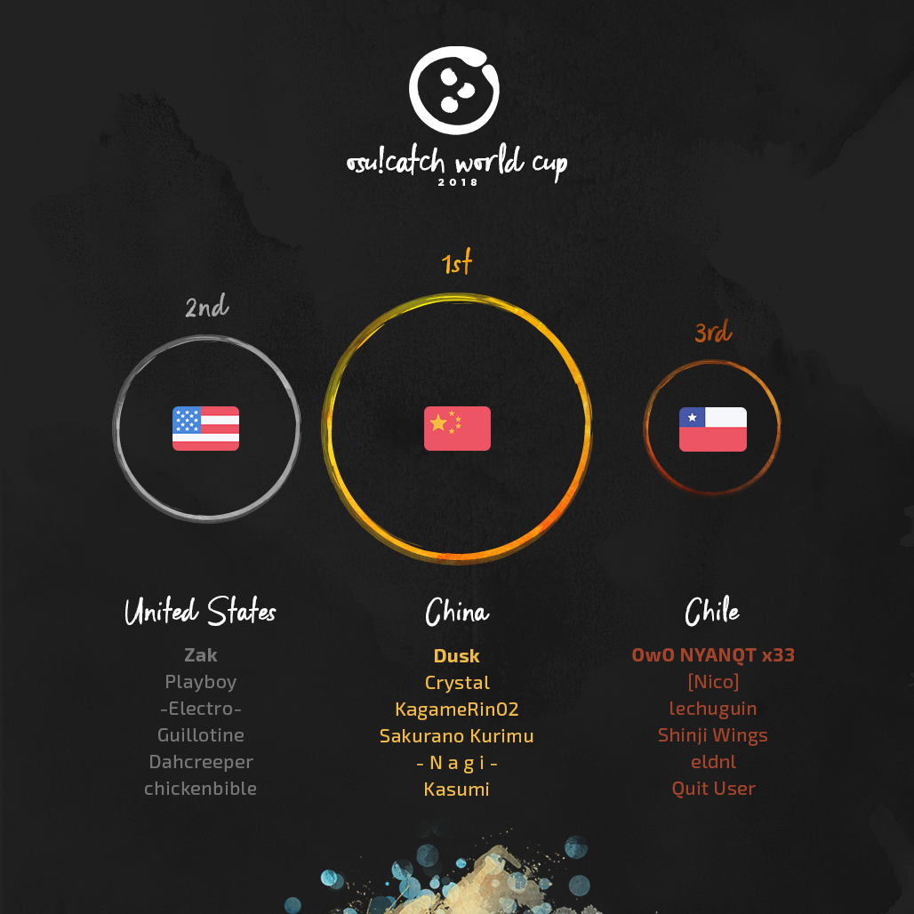
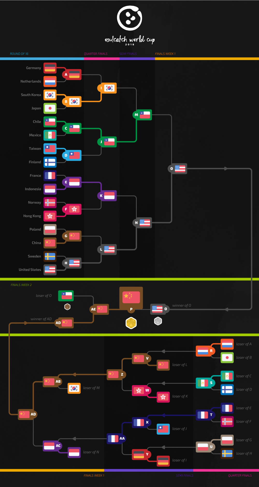

---
tags:
- CWC 2018
- CWC2018
---

# osu!catch World Cup 2018

The **osu!catch World Cup 2018** (***CWC 2018***) was a country-based osu!catch tournament hosted by the [osu! team](/wiki/People/The_Team). It was the 7th installment of the osu!catch World Cup.

## Tournament Schedule

| Event | Timestamp |
| --: | :-- |
| Registration Phase | 2018-05-02/2018-05-16 |
| Live Drawings | 2018-06-02 (14:00 UTC) |
| Group Stage | 2018-06-09/2018-06-10 |
| Round of 16 | 2018-06-16/2018-06-17 |
| Quarterfinals | 2018-06-23/2018-06-24 |
| Semifinals | 2018-06-30/2018-07-01 |
| Finals | 2018-07-07/2018-07-08 |
| Grand Finals | 2018-07-14/2018-07-15 |

## Prizes

In every tournament, people conquering a place on the podium are eligible to receive unique prizes created specifically for World Cup winners. It is possible that these items change with every installment of the World Cups.

| Placing | Prize(s) |
| :-: | :-- |
|  | $150 per team member, unique profile badge, "osu!catch Champion" user title for one year |
|  | $80 per team member, unique profile badge |
|  | $40 per team member, unique profile badge |

## Organisation

The osu!catch World Cup 2018 was run by various community members by distributing the multitude of tasks into various fields of responsibility.

| Position | Members |
| :-- | :-- |
| Manager | ![][flag_AR] [juankristal](https://osu.ppy.sh/users/443656), ![][flag_US] [HappyStick](https://osu.ppy.sh/users/256802), ![][flag_NZ] [deadbeat](https://osu.ppy.sh/users/128370) |
| Map Selector | ![][flag_ES] [Deif](https://osu.ppy.sh/users/318565), ![][flag_CN] [F D Flourite](https://osu.ppy.sh/users/2459589), ![][flag_CL] [ZiRoX](https://osu.ppy.sh/users/200768) |
| Commentator | ![][flag_US] [chickenbible](https://osu.ppy.sh/users/2306637), ![][flag_NO] [Divine Cake](https://osu.ppy.sh/users/3636998), ![][flag_US] [Dohland](https://osu.ppy.sh/users/5220511), ![][flag_GB] [JBHyperion](https://osu.ppy.sh/users/4879508), ![][flag_GR] [Nokashi](https://osu.ppy.sh/users/5431196), ![][flag_NL] [SartNYAN OwO xD](https://osu.ppy.sh/users/4100941), ![][flag_US] [vkells](https://osu.ppy.sh/users/632048), ![][flag_US] [Zak](https://osu.ppy.sh/users/1375955) |
| Referee | ![][flag_DE] [p3n](https://osu.ppy.sh/users/123703), ![][flag_HK] [mangomizer](https://osu.ppy.sh/users/1893718), ![][flag_CL] [WalterToro](https://osu.ppy.sh/users/5281416), ![][flag_ES] [Deif](https://osu.ppy.sh/users/318565) |
| Statistician | ![][flag_NZ] [deadbeat](https://osu.ppy.sh/users/128370), ![][flag_DE] [Nwolf](https://osu.ppy.sh/users/1910766) |

## Links

- [Discussion thread](https://osu.ppy.sh/community/forums/topics/739799)
- [Livestream](https://www.twitch.tv/osulive)
- **[Statistics sheet](https://docs.google.com/spreadsheets/d/e/2PACX-1vR5x7_6IHe-c0J8ktzA7fW3MKh8iZFuZhwYmiYPlvmkjOivZK20SpxGUeVwNgXDdI_Udhc3v9hpl4jG/pubhtml)**

------------------------------------------------------------------------

## Participants

|  | Country | Members |
| --: | :-: | :-- |
| ![][flag_AR] | **Argentina** | **[\[Force\]](https://osu.ppy.sh/users/1617217)**, [Danti](https://osu.ppy.sh/users/4785841), [Rimura-sama](https://osu.ppy.sh/users/4890687), [jerem1as](https://osu.ppy.sh/users/6117864), [Ambition-](https://osu.ppy.sh/users/6960376), [SOSALUCIOSOSA](https://osu.ppy.sh/users/5169874) |
| ![][flag_AU] | **Australia** | **[chickennando](https://osu.ppy.sh/users/5818665)**, [die Eisdiele](https://osu.ppy.sh/users/7155262), [Grayswandir](https://osu.ppy.sh/users/440107), [Paralysis](https://osu.ppy.sh/users/6811767), [jakincses](https://osu.ppy.sh/users/3981222), [KWYJIBO](https://osu.ppy.sh/users/7178386) |
| ![][flag_AT] | **Austria** | **[Scrollum](https://osu.ppy.sh/users/10415976)**, [-FrozenCookie-](https://osu.ppy.sh/users/7429166), [My Love Emilia](https://osu.ppy.sh/users/4140062), [animexamera](https://osu.ppy.sh/users/7511357), [Pandadesu](https://osu.ppy.sh/users/2167069), [birdfire](https://osu.ppy.sh/users/2383482) |
| ![][flag_BR] | **Brazil** | **[Michael Jordan](https://osu.ppy.sh/users/4099041)**, [Super Choke](https://osu.ppy.sh/users/2054788), [Kqrth](https://osu.ppy.sh/users/4115718), [-Overdose-](https://osu.ppy.sh/users/7749445), [ExNando](https://osu.ppy.sh/users/5960935), [Predominador](https://osu.ppy.sh/users/4568537) |
| ![][flag_CA] | **Canada** | **[Fii](https://osu.ppy.sh/users/3922569)**, [Yoshi_green](https://osu.ppy.sh/users/1035891), [1111](https://osu.ppy.sh/users/2747940), [\_wwwww](https://osu.ppy.sh/users/4820793), [melonsigh](https://osu.ppy.sh/users/8623922), [wwwww-](https://osu.ppy.sh/users/3616480) |
| ![][flag_CL] | **Chile** | **[OwO NYANQT x33](https://osu.ppy.sh/users/989542)**, [\[Nico\]](https://osu.ppy.sh/users/1011240), [lechuguin](https://osu.ppy.sh/users/2872000), [Shinji Wings](https://osu.ppy.sh/users/5071280), [eldnl](https://osu.ppy.sh/users/285756), [Quit User](https://osu.ppy.sh/users/2389481) |
| ![][flag_CN] | **China** | **[Dusk](https://osu.ppy.sh/users/533210)**, [Crystal](https://osu.ppy.sh/users/1646397), [KagamineRin02](https://osu.ppy.sh/users/518503), [Sakurano  Kurimu](https://osu.ppy.sh/users/1338103), [- N a g i -](https://osu.ppy.sh/users/2956936), [Kasumi](https://osu.ppy.sh/users/2331531) |
| ![][flag_CO] | **Colombia** | **[Deley-](https://osu.ppy.sh/users/8291465)**, [\[ Azu- \]](https://osu.ppy.sh/users/8290364), [FeaRHuMaN](https://osu.ppy.sh/users/8579779), [archiwes](https://osu.ppy.sh/users/10434582), [Titan-](https://osu.ppy.sh/users/7855767) |
| ![][flag_DK] | **Denmark** | **[SharpN](https://osu.ppy.sh/users/4382076)**, [TheRustShark](https://osu.ppy.sh/users/7839059), [Captain](https://osu.ppy.sh/users/2563435), [Wermii](https://osu.ppy.sh/users/2424947), [Only1Magma](https://osu.ppy.sh/users/3922957) |
| ![][flag_FI] | **Finland** | **[forgottentaco](https://osu.ppy.sh/users/6109660)**, [YERTI](https://osu.ppy.sh/users/1490757), [NoitaKuningas](https://osu.ppy.sh/users/4022685), [Nikolai](https://osu.ppy.sh/users/5302804), [noksu15](https://osu.ppy.sh/users/10161144), [Kurtsi](https://osu.ppy.sh/users/4222176) |
| ![][flag_FR] | **France** | **[bastoo0](https://osu.ppy.sh/users/4864877)**, [Noulayfe](https://osu.ppy.sh/users/4316542), [Orinoshi](https://osu.ppy.sh/users/3047355), [Sounny](https://osu.ppy.sh/users/7326109), [FulgurentKille](https://osu.ppy.sh/users/4096322), [Le grand casque](https://osu.ppy.sh/users/5490623) |
| ![][flag_DE] | **Germany** | **[NoteKuroi](https://osu.ppy.sh/users/186642)**, [Vinci007](https://osu.ppy.sh/users/5030297), [Sousaki](https://osu.ppy.sh/users/1599349), [Tenshichan](https://osu.ppy.sh/users/1101600), [namirin](https://osu.ppy.sh/users/6414332), [Inryoku](https://osu.ppy.sh/users/6562920) |
| ![][flag_HK] | **Hong Kong** | **[alienflybot](https://osu.ppy.sh/users/636114)**, [Dynamix braver](https://osu.ppy.sh/users/6362865), [Latifah-sama](https://osu.ppy.sh/users/1226238), [CheungB](https://osu.ppy.sh/users/788406), [Alice Cartelet](https://osu.ppy.sh/users/1784164), [neozerone](https://osu.ppy.sh/users/6461445) |
| ![][flag_HU] | **Hungary** | **[gaaraati](https://osu.ppy.sh/users/3320300)**, [Shigaisen](https://osu.ppy.sh/users/6635772), [mardebra](https://osu.ppy.sh/users/5419149) |
| ![][flag_ID] | **Indonesia** | **[Deceitful](https://osu.ppy.sh/users/1396447)**, [dika312](https://osu.ppy.sh/users/741613), [Shurelia](https://osu.ppy.sh/users/3807986), [LeWind](https://osu.ppy.sh/users/9718235), [Minalinsky-](https://osu.ppy.sh/users/2823883), [Galaxi](https://osu.ppy.sh/users/2552435) |
| ![][flag_IT] | **Italy** | **[ArMa79](https://osu.ppy.sh/users/4982799)**, [119410501](https://osu.ppy.sh/users/803484), [Trollingor](https://osu.ppy.sh/users/4144266), [NyaRym x33 OwO](https://osu.ppy.sh/users/5220794) |
| ![][flag_JP] | **Japan** | **[noraRcat](https://osu.ppy.sh/users/883939)**, [tasuke912](https://osu.ppy.sh/users/2774767), [Molqus](https://osu.ppy.sh/users/1927193), [ekr](https://osu.ppy.sh/users/4497706), [gfbgd1](https://osu.ppy.sh/users/6061811), [kusakabe001](https://osu.ppy.sh/users/129806) |
| ![][flag_MY] | **Malaysia** | **[Future\_miku95](https://osu.ppy.sh/users/2351567)**, [Gilochan](https://osu.ppy.sh/users/598204), [Kagari](https://osu.ppy.sh/users/3366264), [murutattack](https://osu.ppy.sh/users/4480237), [Lute](https://osu.ppy.sh/users/4011799) |
| ![][flag_MX] | **Mexico** | **[Ponchiwi](https://osu.ppy.sh/users/1089040)**, [JuanCiudades](https://osu.ppy.sh/users/8061081), [Astrea](https://osu.ppy.sh/users/3845678), [Cxlucha](https://osu.ppy.sh/users/5063961), [Fensalir](https://osu.ppy.sh/users/9953661), [Kashou](https://osu.ppy.sh/users/4046640) |
| ![][flag_NL] | **Netherlands** | **[SartNYAN OwO xD](https://osu.ppy.sh/users/4100941)**, [UwUsley x33 OwO](https://osu.ppy.sh/users/2407265), [AnimUwU cOwOre](https://osu.ppy.sh/users/3212806), [b-a-d-s123](https://osu.ppy.sh/users/3656717), [KevKjef](https://osu.ppy.sh/users/9114235), [BlueSparklez](https://osu.ppy.sh/users/6051155) |
| ![][flag_NO] | **Norway** | **[Cameragod](https://osu.ppy.sh/users/4974088)**, [Groex](https://osu.ppy.sh/users/3970664), [Razor Sharp](https://osu.ppy.sh/users/3414261), [Divine Cake](https://osu.ppy.sh/users/3636998), [Vanilla-](https://osu.ppy.sh/users/3400701), [Mile](https://osu.ppy.sh/users/2760954) |
| ![][flag_PH] | **Philippines** | **[-Plus-](https://osu.ppy.sh/users/829284)**, [-Nicotine](https://osu.ppy.sh/users/4818935), [-MomoX](https://osu.ppy.sh/users/2150415), [Crowley](https://osu.ppy.sh/users/6341006), [Roido](https://osu.ppy.sh/users/6829103), [- Kielzu -](https://osu.ppy.sh/users/6221114) |
| ![][flag_PL] | **Poland** | **[Kosmit](https://osu.ppy.sh/users/1749173)**, [BoberOfDarkness](https://osu.ppy.sh/users/3427748), [-Filow-](https://osu.ppy.sh/users/3157472), [wampir](https://osu.ppy.sh/users/261497), [Uygrzybrzywszy](https://osu.ppy.sh/users/4446007), [Skyleia](https://osu.ppy.sh/users/2958293) |
| ![][flag_PT] | **Portugal** | **[Buffow](https://osu.ppy.sh/users/4427038)**, [uwu](https://osu.ppy.sh/users/2788013), [PTrollYO](https://osu.ppy.sh/users/6502093), [DemiGod Yoxide](https://osu.ppy.sh/users/6205809), [123tris](https://osu.ppy.sh/users/3821475) |
| ![][flag_RU] | **Russian Federation** | **[Myle](https://osu.ppy.sh/users/4915649)**, [aoe](https://osu.ppy.sh/users/6094216), [Xetopia](https://osu.ppy.sh/users/6689101), [OneLoveOneLife](https://osu.ppy.sh/users/6856387), [Nelly](https://osu.ppy.sh/users/4741164), [CirnoBaka](https://osu.ppy.sh/users/2535016) |
| ![][flag_SG] | **Singapore** | **[Sinnoh](https://osu.ppy.sh/users/4236057)**, [He Ang CTB](https://osu.ppy.sh/users/2451381). [Setsuen](https://osu.ppy.sh/users/2673742), [\[Eun\]](https://osu.ppy.sh/users/3788536), [KyousukeRentaro](https://osu.ppy.sh/users/4971343), [Tenchu](https://osu.ppy.sh/users/5163623) |
| ![][flag_KR] | **South Korea** | **[Berea](https://osu.ppy.sh/users/3657951)**, [DreStar](https://osu.ppy.sh/users/1808057), [mjj741](https://osu.ppy.sh/users/1459769), [Katch](https://osu.ppy.sh/users/2195716), [Ryoko](https://osu.ppy.sh/users/2660111), [qwhj1027](https://osu.ppy.sh/users/7547506) |
| ![][flag_SE] | **Sweden** | **[Setomi](https://osu.ppy.sh/users/2205929)**, [DamnEasy](https://osu.ppy.sh/users/4452911), [CocoSunshine](https://osu.ppy.sh/users/6471909), [Yukiteru Amano](https://osu.ppy.sh/users/1894511), [Osten](https://osu.ppy.sh/users/4417929), [\[ M e a k u \]](https://osu.ppy.sh/users/2747072) |
| ![][flag_TW] | **Taiwan** | **[Megpoid](https://osu.ppy.sh/users/158240)**, [XXXZ](https://osu.ppy.sh/users/2111624), [\[-naniwa-\]](https://osu.ppy.sh/users/4958376), [-Scarlet Rose-](https://osu.ppy.sh/users/2322189), [Majiyabakune](https://osu.ppy.sh/users/605088), [Sanami](https://osu.ppy.sh/users/1629471) |
| ![][flag_TH] | **Thailand** | **[-Luminate](https://osu.ppy.sh/users/4778689)**, [rew0825](https://osu.ppy.sh/users/2488026), [- AodEito -](https://osu.ppy.sh/users/10043310), [\[\_-Kukkai-\_\]](https://osu.ppy.sh/users/7811952), [bank78952](https://osu.ppy.sh/users/1443297), [-\[elsee25\]-](https://osu.ppy.sh/users/7036796) |
| ![][flag_US] | **United States** | **[Zak](https://osu.ppy.sh/users/1375955)**, [Playboy](https://osu.ppy.sh/users/2165558), [-Electro-](https://osu.ppy.sh/users/3251373), [Guillotine](https://osu.ppy.sh/users/4365562), [Dahcreeper](https://osu.ppy.sh/users/6926006), [chickenbible](https://osu.ppy.sh/users/2306637) |
| ![][flag_VN] | **Vietnam** | **[Regu-](https://osu.ppy.sh/users/4948274)**, [YamiSora](https://osu.ppy.sh/users/8042500), [-\[SLs\]-Horikita](https://osu.ppy.sh/users/8738261), [Hana Yukiko](https://osu.ppy.sh/users/4964095), [motherofsuper](https://osu.ppy.sh/users/6403418), [Kouseki](https://osu.ppy.sh/users/4744615) |

------------------------------------------------------------------------

------------------------------------------------------------------------

## Mappools

### Finals

- NoMod
  - [USAO - Boss Rush \(Minato Yukina\) \[MAXIMUM\]](https://osu.ppy.sh/beatmapsets/602460#fruits/1272534)
  - [Morimori Atsushi - Paradigm Shift \(Emiru\) \[Quantum Fluctuation\]](https://osu.ppy.sh/beatmapsets/727816#fruits/1536733)
  - [xi - Akasha \(Yumeno Himiko\) \[Deluge\]](https://osu.ppy.sh/beatmapsets/774083#fruits/1627017)
  - [YuFu - Holy Moon \(Kuzino\) \[4Q\]](https://osu.ppy.sh/beatmapsets/34729#fruits/112852)
  - [DJ TOTTO feat. Sunao Yoshikawa - Arousing \(fanzhen0019\) \[HW's Extra\]](https://osu.ppy.sh/beatmapsets/148092#fruits/368845)
  - [Panda Eyes & Teminite - Highscore \(Fort\) \[Game Over\]](https://osu.ppy.sh/beatmapsets/332532#fruits/736215)
- Hidden
  - [Memme - Goat Fantasia \(Spectator\) \[Overdose\]](https://osu.ppy.sh/beatmapsets/634496#fruits/1346273)
  - [kanonxkanon - Calendula Requiem \(F D Flourite\) \[Lycoris Radiata\]](https://osu.ppy.sh/beatmapsets/647485#fruits/1371644)
  - [Mitsuki - climactic cry \(Mythol\) \[RLQuillab2013\]](https://osu.ppy.sh/beatmapsets/146166#fruits/362297)
- HardRock
  - [Camellia feat. Nanahira - PAPAYAPA BASS \(Nwolf\) \[Deif's Papaya\]](https://osu.ppy.sh/beatmapsets/584714#fruits/1335618)
  - [KASAI HARCORES - Cycle Hit \(Spectator\) \[Grand Slam\]](https://osu.ppy.sh/beatmapsets/692367#fruits/1465042)
  - [Megpoid GUMI - Cosmos \(val0108\) \[Cosmos\]](https://osu.ppy.sh/beatmapsets/37054#fruits/123374)
- DoubleTime
  - [Sayaka Sasaki - Zzz \(Spectator\) \[Lullaby\]](https://osu.ppy.sh/beatmapsets/184710#fruits/446794)
  - [nanobii - HYPERDRIVE \(Ascendance\) \[Overdose\]](https://osu.ppy.sh/beatmapsets/639991#fruits/1357221)
  - [WALKUERE - Ikenai Borderline \(Rizia\) \[Insane\]](https://osu.ppy.sh/beatmapsets/454835#fruits/975036)
- Tiebreaker
  - **[BlackYooh vs. siromaru - BLACK or WHITE? \(Minato Yukina\) \[Final Showdown\]](https://osu.ppy.sh/beatmapsets/628101#fruits/1324298)**

### Semifinals

**[Download the mappack here! (92 MB)](https://zirox.s-ul.eu/1AdCcIdv)**

- NoMod
  - [+a / Alfakyun. x Camellia - calling \(alienflybot\) \[Sync\]](https://osu.ppy.sh/beatmapsets/649285#fruits/1556545)
  - [LeaF - Alice in Misanthrope -Ensei Alice- \(Deif\) \[Wonderland\]](https://osu.ppy.sh/beatmapsets/797236#fruits/1674302)
  - [Cres - End Time \(Intensity\) \[Steven\]](https://osu.ppy.sh/beatmapsets/406487#fruits/883356)
  - [AKI AKANE - Hankyou no Barrier Seed \(Spectator\) \[Alone\]](https://osu.ppy.sh/beatmapsets/758066#fruits/1594657)
  - [Getty vs. DJ DiA - Grayed Out -Antifront- \(Realazy\) \[Achromatic\]](https://osu.ppy.sh/beatmapsets/578755#fruits/1477241)
  - [GARNiDELiA - Gokuraku Jodo \(Vert\) \[Zweib's Expert\]](https://osu.ppy.sh/beatmapsets/489039#fruits/1043223)
- Hidden
  - [Nekomata Gekidan - AsiaN distractive \(Yumeno Himiko\) \[Overdose\]](https://osu.ppy.sh/beatmapsets/656489#fruits/1390877)
  - [YUI - again \(Crowley\) \[brotherhood\]](https://osu.ppy.sh/beatmapsets/735357#fruits/1552359)
  - [monet - Noborenai Sakamichi \(Mirash\) \[Delis' Insane\]](https://osu.ppy.sh/beatmapsets/671607#fruits/1419974)
- HardRock
  - [sak respect for Arata Iiyoshi - Reason of being \(rew0825\) \[Reason\]](https://osu.ppy.sh/beatmapsets/746440#fruits/1573224)
  - [Roselia - LOUDER \(scanter\) \[Crystal's Captivation\]](https://osu.ppy.sh/beatmapsets/595580#fruits/1270272)
  - [P\*Light - YELLOW SPLASH!! \(Minakami Yuki\) \[wkyik's Extra\]](https://osu.ppy.sh/beatmapsets/363882#fruits/799724)
- DoubleTime
  - [Nitro Fun & Hyper Potions - Checkpoint \(WildOne94\) \[Rain Collab\]](https://osu.ppy.sh/beatmapsets/474216#fruits/1036560)
  - [Italobrothers - Stamp On The Ground \(Natsume\) \[hichman's CTB\]](https://osu.ppy.sh/beatmapsets/51977#fruits/160002)
  - Shawn Mendes - Stitches \(VINXIS\) \[Needle and the Thread\]
- Tiebreaker
  - **[Mizuki Nana - VIRGIN CODE \(-wwwww\) \[HELiOS\]](https://osu.ppy.sh/beatmapsets/744654#fruits/1570019)**

### Quarterfinals

**[Download the mappack here! (102 MB)](http://www.mediafire.com/file/8zg9b3gf7kwq4nr/CWC2018%20-%20QF%20Mappack.zip)**

- NoMod
  - [Function Phantom - Euclid \(Ascendance\) \[Axiom\]](https://osu.ppy.sh/beatmapsets/729321#fruits/1539487)
  - [REOL - Yoiyoi Kokon \(Yumeno Himiko\) \[Overdose\]](https://osu.ppy.sh/beatmapsets/677464#fruits/1432753)
  - [xi - .357 Magnum \(Crowley\) \[Filibusterismo.\]](https://osu.ppy.sh/beatmapsets/732584#fruits/1545661)
  - [Aimer with chelly \(EGOIST\) - ninelie \(REDSHiFT x Vesuvia Remix\) \(-Luminate\) \[Daybreak\]](https://osu.ppy.sh/beatmapsets/657095#fruits/1391955)
  - [DECO\*27 - Reversible Campaign \(tutuhaha\) \[Extra\]](https://osu.ppy.sh/beatmapsets/616482#fruits/1300151)
  - [himmeltengoku - Whisper of Rose \(Tsukuyomi\) \[Maximum\]](https://osu.ppy.sh/beatmapsets/173614#fruits/419487)
- Hidden
  - [Hatsuki Yura - Saramandora no Odoriko \(F D Flourite\) \[Flamenco Dance\]](https://osu.ppy.sh/beatmapsets/721795#fruits/1524083)
  - [M2U - Stellar \(Spectator\) \[Alice\]](https://osu.ppy.sh/beatmapsets/699509#fruits/1481269)
  - [\*namirin - Koi no Hime Hime Pettanko \(sahuang\) \[Curi's Extra\]](https://osu.ppy.sh/beatmapsets/613083#fruits/1353404)
- HardRock
  - [Zektbach - Turii \~Panta rhei\~ \(Kyuare\) \[Turii\]](https://osu.ppy.sh/beatmapsets/685428#fruits/1450886)
  - [MAZARE - Mazare Party \(incandescence\) \[Tenshichan's Rain\]](https://osu.ppy.sh/beatmapsets/754402#fruits/1624766)
  - [Renard - Da Nu Nuttah \(GamerX4life\) \[Nogard\]](https://osu.ppy.sh/beatmapsets/62665#fruits/205282)
- DoubleTime
  - [u's - Snow halation \(Hinsvar\) \[Vhy's Platter\]](https://osu.ppy.sh/beatmapsets/209390#fruits/515242)
  - [Toraboruta - Soleil \(Noffy\) \[Wild's Rain\]](https://osu.ppy.sh/beatmapsets/308633#fruits/992848)
  - [SHISHAMO - Egao no Tonari \(Zero\_\_wind\) \[Smile\]](https://osu.ppy.sh/beatmapsets/435617#fruits/938481)
- Tiebreaker
  - **[Camellia - d:for the DELTA \(Minato Yukina\) \[Dereliction\]](https://osu.ppy.sh/beatmapsets/577060#fruits/1221505)**

### Round of 16

**[Download the mappack here! (99 MB)](http://www.mediafire.com/file/8adzvcvqjxydxw9/CWC2018%20-%20RO16%20Mappack.zip)**

- NoMod
  - [Hiroyuki Sawano feat. Mika Kobayashi - Bios \(wairo\) \[Furely's Overdose\]](https://osu.ppy.sh/beatmapsets/728912#fruits/1599347)
  - [Mili - Vulnerability \(Benny-\) \[Frail\]](https://osu.ppy.sh/beatmapsets/706599#fruits/1494074)
  - [sana - Packet Hero \(celerih\) \[Rain\]](https://osu.ppy.sh/beatmapsets/694901#fruits/1469957)
  - [EYE XY feat. Yoneko - Knight of Firmament \(The Chevalier\) \(Spectator\) \[Overdose\]](https://osu.ppy.sh/beatmapsets/709012#fruits/1498888)
  - [Fractal Dreamers - Paradigm Shift \(appleeaterx\) \[Expert\]](https://osu.ppy.sh/beatmapsets/716441#fruits/1513623)
  - [Nakashinoda Mugi - Senjou no Aria \(Okorin\) \[Extra Stage\]](https://osu.ppy.sh/beatmapsets/395046#fruits/859696)
- Hidden
  - [Akiyama Uni - Kaoru Juyouka \(murutattack\) \[Evanent's Rain\]](https://osu.ppy.sh/beatmapsets/508690#fruits/1119599)
  - [Warak - REANIMATE \(- Magic Bomb -\) \[Hyperion's Rain\]](https://osu.ppy.sh/beatmapsets/489190#fruits/1042701)
  - [96Neko x KurousaP - Kagen no Tsuki \(jonathanlfj\) \[Insane\]](https://osu.ppy.sh/beatmapsets/393343#fruits/940295)
- HardRock
  - [Eisyo-kobu - Oriental Blossom \(Spectator\) \[Himiko's Rain\]](https://osu.ppy.sh/beatmapsets/747823#fruits/1588595)
  - [Suzuki Konomi - Redo \(Neoskylove\) \[tasuke's Rain\]](https://osu.ppy.sh/beatmapsets/545351#fruits/1185455)
  - [Hanatan - Shiwa \(Ami\) \[Insane\]](https://osu.ppy.sh/beatmapsets/130704#fruits/329967)
- DoubleTime
  - [Kikuo - And Then You Became The Moon \(ZiRoX\) \[Platter\]](https://osu.ppy.sh/beatmapsets/353010#fruits/777823)
  - [Memme - Force of Ra \(Deif\) \[Platter\]](https://osu.ppy.sh/beatmapsets/573479#fruits/1214850)
  - [EastNewSound - Yuune Zekka, Ryouran no Sai \(goodbye\) \[Insane\]](https://osu.ppy.sh/beatmapsets/40386#fruits/128163)
- Tiebreaker
  - **[Rita - Bookmark Memories \(F D Flourite\) \[Love\]](https://osu.ppy.sh/beatmapsets/783602#fruits/1645428)**

### Group Stage

**[Download the mappack here! (77 MB)](https://mega.nz/#!09kkXCAR!J4oF2QmrLA1RoLgErpqUHBaCul5SFNXAJKnIoo812jc)**

- NoMod
  - [Black Hole - Pluto \(Ascendance\) \[Reimu's Another\]](https://osu.ppy.sh/beatmapsets/680437#fruits/1439325)
  - [Ito Kanako - Uncontrollable \(Yumeno Himiko\) \[Rain\]](https://osu.ppy.sh/beatmapsets/559539#fruits/1183490)
  - [Tama - Saigetsu \(Midnight Moon Walker Remix\) \(Spectator\) \[Overdose\]](https://osu.ppy.sh/beatmapsets/724793#fruits/1530447)
  - [Hige Driver join. SELEN - Dadadadadadadadadada \(CLSW\) \[SHD\]](https://osu.ppy.sh/beatmapsets/350076#fruits/771881)
  - [Nekomata Master - Far east nightbird \(tsuka\) \[Extreme\]](https://osu.ppy.sh/beatmapsets/34203#fruits/111302)
  - [Shawn Wasabi - Marble Soda \(Len\) \[Crier's Extra\]](https://osu.ppy.sh/beatmapsets/387784#fruits/846259)
- Hidden
  - [Mili - Bathtub Mermaid \(JeirYagtama\) \[Anatomy\]](https://osu.ppy.sh/beatmapsets/684250#fruits/1448086)
  - [Bitter Sweet Entertainment - Kanashimi no Mukougawa \(Piano Version\) \(JBHyperion\) \[Eternal\]](https://osu.ppy.sh/beatmapsets/435287#fruits/937653)
  - [Porter Robinson - Flicker \(Static Noise Bird\) \[Worlds\]](https://osu.ppy.sh/beatmapsets/210682#fruits/495543)
- HardRock
  - [OLDCODEX - Dried Up Youthful Fame \(TV Size\) \(RoseusJaeger\) \[Collab Platter\]](https://osu.ppy.sh/beatmapsets/544889#fruits/1154583)
  - [Horie Yui - Asymmetry \(Ascendance\) \[Collab Platter\]](https://osu.ppy.sh/beatmapsets/414949#fruits/899608)
  - [MinusP - Shura no Niwa \(wantuole\) \[Hard\]](https://osu.ppy.sh/beatmapsets/98233#fruits/264701)  
- DoubleTime
  - [senya - Kachou Fuugetsu \(- Magic Girl -\) \[Benny's Platter\]](https://osu.ppy.sh/beatmapsets/726596#fruits/1533955)
  - [Nightwish - Last Of The Wilds \(BoberOfDarkness\) \[Platter\]](https://osu.ppy.sh/beatmapsets/321999#fruits/717056)
  - [Zac Efron - Scream \(pishifat\) \[ahh\]](https://osu.ppy.sh/beatmapsets/320894#fruits/713932)
- Tiebreaker
  - **[Oh, Be Clever - Next To You \(Elephante Remix\) \(JBHyperion\) \[Envy\]](https://osu.ppy.sh/beatmapsets/574216#fruits/1216211)**

------------------------------------------------------------------------

## Match Results

### Grand Finals

| Saturday, 2018-07-14 |  |  |  |  |
| --: | :-: | :-: | :-- | :-- |
| **China** ![][flag_CN] | **7** | 2 | ![][flag_CL] Chile | [#1](https://osu.ppy.sh/community/matches/44166710) |

| Sunday, 2018-07-15 |  |  |  |  |
| --: | :-: | :-: | :-- | :-- |
| **China** ![][flag_CN] | **7** | 3 | ![][flag_US] United States | [#1](https://osu.ppy.sh/community/matches/44189744) |
| United States ![][flag_US] | 2 | **7** | ![][flag_CN] **China** | [#1](https://osu.ppy.sh/community/matches/44192102) |

### Finals

| Saturday, 2018-07-07 |  |  |  |  |
| --: | :-: | :-: | :-- | :-- |
| **China** ![][flag_CN] | **7** | 3 | ![][flag_KR] South Korea | [#1](https://osu.ppy.sh/community/matches/43963281) |
| France ![][flag_FR] | 0 | **7** | ![][flag_ID] **Indonesia** | [#1](https://osu.ppy.sh/community/matches/43964720) |

| Sunday, 2018-07-08 |  |  |  |  |
| --: | :-: | :-: | :-- | :-- |
| **China** ![][flag_CN] | **7** | 1 | ![][flag_ID] Indonesia | [#1](https://osu.ppy.sh/community/matches/43991586) |
| Chile ![][flag_CL] | 4 | **7** | ![][flag_US] **United States** | [#1](https://osu.ppy.sh/community/matches/44001259) |

### SemiFinals

| Saturday, 2018-06-30 |  |  |  |  |
| --: | :-: | :-: | :-- | :-- |
| South Korea ![][flag_KR] | 3 | **6** | ![][flag_CL] **Chile** | [#1](https://osu.ppy.sh/community/matches/43767078) |
| Mexico ![][flag_MX] | 2 | **6** | ![][flag_HK] **Hong Kong** | [#1](https://osu.ppy.sh/community/matches/43768481) |
| Netherlands ![][flag_NL] | 1 | **6** | ![][flag_CN] **China** | [#1](https://osu.ppy.sh/community/matches/43779290) |
| Poland ![][flag_PL] | 3 | **6** | ![][flag_DE] **Germany** | [#1](https://osu.ppy.sh/community/matches/43781683) |

| Saturday, 2018-07-01 |  |  |  |  |
| --: | :-: | :-: | :-- | :-- |
| **France** ![][flag_FR] | **6** | 3 | ![][flag_TW] Taiwan | [#1](https://osu.ppy.sh/community/matches/43801047) |
| **China** ![][flag_CN] | **6** | 1 | ![][flag_HK] Hong Kong | [#1](https://osu.ppy.sh/community/matches/43804340) |
| **France** ![][flag_FR] | **6** | 3 | ![][flag_DE] Germany | [#1](https://osu.ppy.sh/community/matches/43806191) |
| Indonesia ![][flag_ID] | 5 | **6** | ![][flag_US] **United States** | [#1](https://osu.ppy.sh/community/matches/43808202) |

### QuarterFinals

| Saturday, 2018-06-23 |  |  |  |  |
| --: | :-: | :-: | :-- | :-- |
| Germany ![][flag_DE] | 3 | **5** | ![][flag_KR] **South Korea** | [#1](https://osu.ppy.sh/community/matches/43586102) |
| **Indonesia** ![][flag_ID] | **5** | 2 | ![][flag_HK] Hong Kong | [#1](https://osu.ppy.sh/community/matches/43587773) |
| **Poland** ![][flag_PL] | **5** | 0 | ![][flag_SE] Sweden | -win by default- |
| **Mexico** ![][flag_MX] | **5** | 0 | ![][flag_FI] Finland | -win by default- |

| Sunday, 2018-06-24 |  |  |  |  |
| --: | :-: | :-: | :-- | :-- |
| **Netherlands** ![][flag_NL] | **5** | 1 | ![][flag_JP] Japan | [#1](https://osu.ppy.sh/community/matches/43616653) |
| China ![][flag_CN] | 4 | **5** | ![][flag_US] **United States** | [#1](https://osu.ppy.sh/community/matches/43617828) |
| **Chile** ![][flag_CL] | **5** | 1 | ![][flag_TW] Taiwan | [#1](https://osu.ppy.sh/community/matches/43619288) |
| **France** ![][flag_FR] | **5** | 1 | ![][flag_NO] Norway | [#1](https://osu.ppy.sh/community/matches/43620718) |

### Round of 16

| Sunday, 2018-06-17 |  |  |  |  |
| --: | :-: | :-: | :-- | :-- |
| **Chile** ![][flag_CL] | **5** | 1 | ![][flag_MX] Mexico | [#1](https://osu.ppy.sh/community/matches/43409482) |
| **South Korea** ![][flag_KR] | **5** | 2 | ![][flag_JP] Japan | [#1](https://osu.ppy.sh/community/matches/43410578) |
| France ![][flag_FR] | 3 | **5** | ![][flag_ID] **Indonesia** | [#1](https://osu.ppy.sh/community/matches/43417766) |
| Norway ![][flag_NO] | 2 | **5** | ![][flag_HK] **Hong Kong** | [#1](https://osu.ppy.sh/community/matches/43419190) |
| **Taiwan** ![][flag_TW] | **5** | 3 | ![][flag_FI] Finland | [#1](https://osu.ppy.sh/community/matches/43420479) |
| Poland ![][flag_PL] | 1 | **5** | ![][flag_CN] **China** | [#1](https://osu.ppy.sh/community/matches/43421992) |
| **Germany** ![][flag_DE] | **5** | 0 | ![][flag_NL] Netherlands | [#1](https://osu.ppy.sh/community/matches/43429726) |
| Sweden ![][flag_SE] | 0 | **5** | ![][flag_US] **United States** | [#1](https://osu.ppy.sh/community/matches/43431438) |

### Group Stage

| Saturday, 2018-06-09 |  |  |  |  |
| --: | :-: | :-: | :-- | :-- |
| Austria ![][flag_AT] | 0 | **4** | ![][flag_JP] **Japan** | [#1](https://osu.ppy.sh/community/matches/43191122) |
| **Denmark** ![][flag_DK] | **4** | 3 | ![][flag_TH] Thailand | [#1](https://osu.ppy.sh/community/matches/43191124) |
| Philippines ![][flag_PH] | 0 | **4** | ![][flag_CN] **China** | [#1](https://osu.ppy.sh/community/matches/43191119) |
| France ![][flag_FR] | 3 | **4** | ![][flag_TW] **Taiwan** | [#1](https://osu.ppy.sh/community/matches/43192690) |
| Singapore ![][flag_SG] | 0 | **4** | ![][flag_HK] **Hong Kong** | [#1](https://osu.ppy.sh/community/matches/43192708) |
| Malaysia ![][flag_MY] | 0 | **4** | ![][flag_IT] **Italy** | [#1](https://osu.ppy.sh/community/matches/43192715) |
| Denmark ![][flag_DK] | 0 | **4** | ![][flag_ID] **Indonesia** | [#1](https://osu.ppy.sh/community/matches/43192737) |
| Hungary ![][flag_HU] | 0 | **4** | ![][flag_TW] **Taiwan** | [#1](https://osu.ppy.sh/community/matches/43194294) |
| **Singapore** ![][flag_SG] | **4** | 3 | ![][flag_VN] Vietnam | [#1](https://osu.ppy.sh/community/matches/43194398) |
| Russian Federation ![][flag_RU] | 1 | **4** | ![][flag_CL] **Chile** | [#1](https://osu.ppy.sh/community/matches/43194365) |
| Thailand ![][flag_TH] | 0 | **4** | ![][flag_FI] **Finland** | [#1](https://osu.ppy.sh/community/matches/43194376) |
| Vietnam ![][flag_VN] | 1 | **4** | ![][flag_HK] **Hong Kong** | [#1](https://osu.ppy.sh/community/matches/43196372) |
| Russian Federation ![][flag_RU] | 3 | **4** | ![][flag_NO] **Norway** | [#1](https://osu.ppy.sh/community/matches/43196368) |
| Hungary ![][flag_HU] | 1 | **4** | ![][flag_FR] **France** | [#1](https://osu.ppy.sh/community/matches/43199750) |
| Colombia ![][flag_CO] | 1 | **4** | ![][flag_RU] **Russian Federation** | [#1](https://osu.ppy.sh/community/matches/43199790) |
| Norway ![][flag_NO] | 2 | **4** | ![][flag_CL] **Chile** | [#1](https://osu.ppy.sh/community/matches/43199854) |
| Canada ![][flag_CA] | 2 | **4** | ![][flag_FR] **France** | [#1](https://osu.ppy.sh/community/matches/43201876) |
| Argentina ![][flag_AR] | 0 | **4** | ![][flag_US] **United States** | [#1](https://osu.ppy.sh/community/matches/43201717) |
| Denmark ![][flag_DK] | 1 | **4** | ![][flag_FI] **Finland** | [#1](https://osu.ppy.sh/community/matches/43201686) |
| Hungary ![][flag_HU] | 0 | **4** | ![][flag_CA] **Canada** | [#1](https://osu.ppy.sh/community/matches/43203691) |
| Colombia ![][flag_CO] | 0 | **4** | ![][flag_CL] **Chile** | [#1](https://osu.ppy.sh/community/matches/43203741) |

| Sunday, 2018-06-10 |  |  |  |  |
| --: | :-: | :-: | :-- | :-- |
| Brazil ![][flag_BR] | 0 | **4** | ![][flag_AU] **Australia** | [#1](https://osu.ppy.sh/community/matches/43214536) |
| Mexico ![][flag_MX] | 2 | **4** | ![][flag_HK] **Hong Kong** | [#1](https://osu.ppy.sh/community/matches/43214539) |
| Canada ![][flag_CA] | 3 | **4** | ![][flag_TW] **Taiwan** | [#1](https://osu.ppy.sh/community/matches/43215581) |
| Singapore ![][flag_SG] | 0 | **4** | ![][flag_MX] **Mexico** | [#1](https://osu.ppy.sh/community/matches/43215587) |
| Vietnam ![][flag_VN] | 3 | **4** | ![][flag_MX] **Mexico** | [#1](https://osu.ppy.sh/community/matches/43216775) |
| **Japan** ![][flag_JP] | **4** | 1 | ![][flag_PH] Philippines | [#1](https://osu.ppy.sh/community/matches/43222511) |
| Poland ![][flag_PL] | 2 | **4** | ![][flag_KR] **South Korea** | [#1](https://osu.ppy.sh/community/matches/43222518) |
| Australia ![][flag_AU] | 2 | **4** | ![][flag_DE] **Germany** | [#1](https://osu.ppy.sh/community/matches/43224495) |
| Japan ![][flag_JP] | 0 | **4** | ![][flag_CN] **China** | [#1](https://osu.ppy.sh/community/matches/43223776) |
| Austria ![][flag_AT] | 0 | **4** | ![][flag_PH] **Philippines** | [#1](https://osu.ppy.sh/community/matches/43223822) |
| **Sweden** ![][flag_SE] | **4** | 3 | ![][flag_AU] Australia | [#1](https://osu.ppy.sh/community/matches/43225043) |
| Malaysia ![][flag_MY] | 0 | **4** | ![][flag_KR] **South Korea** | [#1](https://osu.ppy.sh/community/matches/43225064) |
| Finland ![][flag_FI] | 0 | **4** | ![][flag_ID] **Indonesia** | [#1](https://osu.ppy.sh/community/matches/43225072) |
| Austria ![][flag_AT] | 0 | **4** | ![][flag_CN] **China** | [#1](https://osu.ppy.sh/community/matches/43226599) |
| Malaysia ![][flag_MY] | 0 | **4** | ![][flag_PL] **Poland** | [#1](https://osu.ppy.sh/community/matches/43226609) |
| Italy ![][flag_IT] | 1 | **4** | ![][flag_KR] **South Korea** | [#1](https://osu.ppy.sh/community/matches/43226765) |
| Portugal ![][flag_PT] | 0 | **4** | ![][flag_NL] **Netherlands** | [#1](https://osu.ppy.sh/community/matches/43228029) |
| Thailand ![][flag_TH] | 0 | **4** | ![][flag_ID] **Indonesia** | [#1](https://osu.ppy.sh/community/matches/43228008) |
| Brazil ![][flag_BR] | 3 | **4** | ![][flag_SE] **Sweden** | [#1](https://osu.ppy.sh/community/matches/43233285) |
| Portugal ![][flag_PT] | 1 | **4** | ![][flag_US] **United States** | [#1](https://osu.ppy.sh/community/matches/43233278) |
| Argentina ![][flag_AR] | 0 | **4** | ![][flag_NL] **Netherlands** | [#1](https://osu.ppy.sh/community/matches/43233291) |
| Brazil ![][flag_BR] | 0 | **4** | ![][flag_DE] **Germany** | -win by default- |
| Italy ![][flag_IT] | 1 | **4** | ![][flag_PL] **Poland** | [#1](https://osu.ppy.sh/community/matches/43235107) |
| Colombia ![][flag_CO] | 0 | **4** | ![][flag_NO] **Norway** | [#1](https://osu.ppy.sh/community/matches/43235120) |
| Sweden ![][flag_SE] | 3 | **4** | ![][flag_DE] **Germany** | [#1](https://osu.ppy.sh/community/matches/43236583) |
| Portugal ![][flag_PT] | 1 | **4** | ![][flag_AR] **Argentina** | [#1](https://osu.ppy.sh/community/matches/43236588) |
| Netherlands ![][flag_NL] | 2 | **4** | ![][flag_US] **United States** | [#1](https://osu.ppy.sh/community/matches/43236591) |

------------------------------------------------------------------------

## Ruleset

### Tournament Rules

1. The osu!catch World Cup is a country-based team tournament, played on the osu!catch game mode.
   - While this competition is planned as a 3 versus 3 setup, this might change depending on the amount of incoming registrations.
2. Map scoring will use Score V2.
3. The maps for each round will be announced by the mapset selectors in advance on the Sunday before the actual matches take place. Only these will be used during the respective matches.
   - There will be a [Hidden](/wiki/Game_Modifiers), [HardRock](/wiki/Game_Modifiers) and a [DoubleTime](/wiki/Game_Modifiers) bracket.
   - One map will be given as a tiebreaker map. This map will only be played in case of a tie.
4. Match schedule will be settled by the Tournament Management (see below).
5. If no staff or referee is available, the match will be postponed.
6. Failed players' scores do not get added to the team score.
   - Reviving and surviving during a map is considered as passing it.
7. Use of the Visual Settings to alter background dim or disable map elements like storyboards and skins are allowed.
8. If the beatmap ends in a draw, the game will be nullified.
9. If a player disconnects, they get treated as if they failed the map.
   - Disconnects within 30 seconds after map begin can be rematched. This is up to the referee's discretion. The played beatmap might be aborted for this.
10. Beatmaps cannot be reused in the same match unless the game was nullified.
11. If less than the minimum required players attend, the maximum time the match can be postponed is 10 minutes. A 'Win by default' will be declared if there isn't enough players after this deadline.
12. Exchanging players during a match is allowed without limitations.
13. Lag is not a valid reason to nullify a beatmap.
14. All players are supposed to keep the match running fluent and without delays. Excessive match delays coming from the player's side can be issued with penalties.
15. If a player disconnects between the beatmaps and the team can not provide an exchange, the match can be delayed 10 minutes at maximum.
16. All players and referees must to be treated with respect. Instructions of the referees and tournament management is to be followed. Decisions labeled as final are not to be objected.
17. Disrupting the match by foul play, picking inappropriate warmup maps (see below), insulting and provoking other players or referees, delaying the match or other deliberate inappropriate misbehavior is strictly prohibited.
18. The multiplayer chatrooms underlie the [osu! community rules](/wiki/Rules). All chat rules apply to the multiplayer chatrooms.
    - Breaking the chat rules results in a silence. Silenced players can not participate at multiplayer matches and must be exchanged for the time being.
19. In Group stage, 'Win by default' will be considered as win by 4:0, +1.0 score difference ratio.
20. Unexpected incidences are handled by the tournament management. Referees may allow higher tolerance depending on the given circumstances. This is up to their discretion.
21. Penalties for violating the tournament rules can be:
   - Exclusion of specific players for one map
   - Exclusion of specific players for an entire match
   - Declaring the match as Lost by Default
   - Disqualification from the entire tournament
   - Disqualification from the current and future official tournaments until appealed
   - Any modification of these rules will be announced.

### Tournament Registration

1. Every user interested in joining their country's team signs up individually.
   - Tournament Management will create a list of potential candidates for a country's team.
   - Tournament Management declares one candidate to the captain of the country's team, albeit temporarily.
   - The declared captain can form their team from the candidate list of their country.
2. To ensure valid and serious registrations, every registered user will be checked by the Tournament Management.
   - Every registered user will be assigned to their respective country's candidate list.
   - To be successfully accepted on the list, you have to ensure that your global osu!catch performance ranking is above 5000.
   - To be successfully accepted on the list, you have to ensure that you did not violate the [osu! community rules](/wiki/Rules) within the last 12 months.
3. All successfully formed teams will be published after the Registration Phase.
4. Only the 32 potentially strongest countries will participate. The potential strength of a country is determined by the online statistics of all valid candidates.
   - If the amount of registered countries is below 32, the number might be reduced to 24, 20 or 16. The aim is always to let as many countries participate as possible!
5. Mapset selectors may not participate as a player in this tournament.

### Stage Instructions

1. In the first stage (Group Stage), the teams will be divided into 8 groups of 4 teams.
   - This may change depending on how many teams are accepted into the competition at the end.
2. All the teams from each group will face each other.
3. Rankings of each group are determined by sorting the results of each team's performance in the following priority:
   - Most matches won.
   - Have higher `{(the number of beatmaps won) - (the number of beatmaps defeated)}`.
   - Most beatmaps won.
   - **Winner of the match played previously between the tied teams.**
   - In the event of a triple tie:
     - Have higher `∑{(total score difference) / (maximum score)}`.
     - Winner of the rematch.
4. The top 2 teams of each group will move on to the Knock-Out Stages.
   -  This may change with the actual Group Stage setup.
5. Following stages are Double Elimination Stages. This means that the winner moves to the next stage and the losing team gets moved to the Loser bracket.
6. Based on [this image](/wiki/shared/stages-visual.png), the stages are split up into the following:

| Stage | Match ID |
| --: | :-- |
| Round of 16 | A, B, C, D, E, F, G, H |
| Quarterfinals | I, J, K, L & R, S, T, U |
| Semifinals | M, N & V, W, X, Y, Z, AA |
| Finals | O & AB, AC, AD |
| Grand Finals | AE, P, Q |

**Winning conditions:**
  - In Group Stage, you need to win 4 maps to win a match. (Best-of-7)
  - In the Round of 16 and the Quarterfinals, you need to win 5 maps to win a match. (Best-of-9)
  - In Semifinals, you need to win 6 maps to win a match. (Best-of-11)
  - In the **Finals and Grand Finals**, you need to win 7 maps to win the match. (Best-of-13)

### Match Instructions

1. A referee will create a multiplayer room 15 minutes in advance. Players must gather during this period.
   - Room settings are osu!catch, Team-Vs., Win Condition: 'ScoreV2'. Room name must be "CWC 2018: (TeamRed) vs (TeamBlue)".
   - The team mentioned first in the room name must be the red team, the team mentioned second in the room name must be the blue team.
2. Each team is free to select up to one warm-up map. Using beatmaps with questionable content is prohibited. All maps must be osu!catch specific maps.
3. Each captain can ban **one beatmap** to be selected from the pool. These beatmaps are not allowed to be picked by any team in the entire match.  
4. Beatmap selection will alternate between each captain selecting a beatmap out of the map pool.
5. Each captain must use "!roll" once in #multiplayer.
   - The loser of the !roll starts banning.
   - The winner of the !roll starts picking the first beatmap of the match.
6. Captains may pick freely from any bracket.
   - In case of a tie, the tiebreaker map must be played.
7. Results of the Group Stage will be published via a Statistics sheet.

### Mappool Instructions

1. There will be 1 mappool for the Group Stage, 1 mappool for the Round of 16, 1 mappool for the Quarterfinals, 1 mappool for the Semifinals and 1 mappool for the Finals.
   - Finals and Grand Finals use the same mappool.
2. Each mappool consists of 4 brackets: NoMod, [Hidden](/wiki/Game_Modifiers), [HardRock](/wiki/Game_Modifiers) and [DoubleTime](/wiki/Game_Modifiers).
3. Each mappool consists of 16 maps in total.
4. Each mappool has one tiebreaker.
5. The NoMod bracket will be played with no mods activated.
6. The Hidden, HardRock and DoubleTime bracket will be played with the respective modes activated.  
   - When playing a map from the HardRock or DoubleTime pool, Hidden can be used optionally by any player.
7. The tiebreaker will be played under NoMod conditions.
8. There will be 6 maps in the NoMod bracket for all stages.
9. The size of the [Hidden](/wiki/Game_Modifiers), [HardRock](/wiki/Game_Modifiers) and [DoubleTime](/wiki/Game_Modifiers) brackets will be 3 in all stages.

### Scheduling Instructions

1. Each stage will be held on **a single weekend**.
2. Matches in Group Stage may overlap.
3. All Double Elimination Stages will be held on either Saturday or Sunday, UTC+0.
4. Scheduling will be handled by the Tournament Management. Schedules will be released on the Sunday before the first matches of the actual stage. Tournament Management will try to create the schedule to respect the participant's time zone.
   - In the stages Quarterfinals and higher: Please inform tournament management before Sunday, if you expect a specific time slot to be unavailable in the following week. Wishes are tried to be followed, alas no promises can be made.
5. Rescheduling after the release of the Schedule on the wiki can not be done in any circumstance.
6. Captains are responsible for their teams availability. The greater team size exists to ensure every team can provide at least three players for each match. If teams can not provide three players for a match, the match will be considered forfeited.

[flag_AR]: /wiki/shared/flag/AR.gif
[flag_AT]: /wiki/shared/flag/AT.gif
[flag_AU]: /wiki/shared/flag/AU.gif
[flag_BR]: /wiki/shared/flag/BR.gif
[flag_CA]: /wiki/shared/flag/CA.gif
[flag_CL]: /wiki/shared/flag/CL.gif
[flag_CN]: /wiki/shared/flag/CN.gif
[flag_CO]: /wiki/shared/flag/CO.gif
[flag_DE]: /wiki/shared/flag/DE.gif
[flag_DK]: /wiki/shared/flag/DK.gif
[flag_ES]: /wiki/shared/flag/ES.gif
[flag_FI]: /wiki/shared/flag/FI.gif
[flag_FR]: /wiki/shared/flag/FR.gif
[flag_GB]: /wiki/shared/flag/GB.gif
[flag_GR]: /wiki/shared/flag/GR.gif
[flag_HK]: /wiki/shared/flag/HK.gif
[flag_HU]: /wiki/shared/flag/HU.gif
[flag_ID]: /wiki/shared/flag/ID.gif
[flag_IT]: /wiki/shared/flag/IT.gif
[flag_JP]: /wiki/shared/flag/JP.gif
[flag_KR]: /wiki/shared/flag/KR.gif
[flag_MX]: /wiki/shared/flag/MX.gif
[flag_MY]: /wiki/shared/flag/MY.gif
[flag_NL]: /wiki/shared/flag/NL.gif
[flag_NO]: /wiki/shared/flag/NO.gif
[flag_NZ]: /wiki/shared/flag/NZ.gif
[flag_PH]: /wiki/shared/flag/PH.gif
[flag_PL]: /wiki/shared/flag/PL.gif
[flag_PT]: /wiki/shared/flag/PT.gif
[flag_RU]: /wiki/shared/flag/RU.gif
[flag_SE]: /wiki/shared/flag/SE.gif
[flag_SG]: /wiki/shared/flag/SG.gif
[flag_TH]: /wiki/shared/flag/TH.gif
[flag_TW]: /wiki/shared/flag/TW.gif
[flag_US]: /wiki/shared/flag/US.gif
[flag_VN]: /wiki/shared/flag/VN.gif
