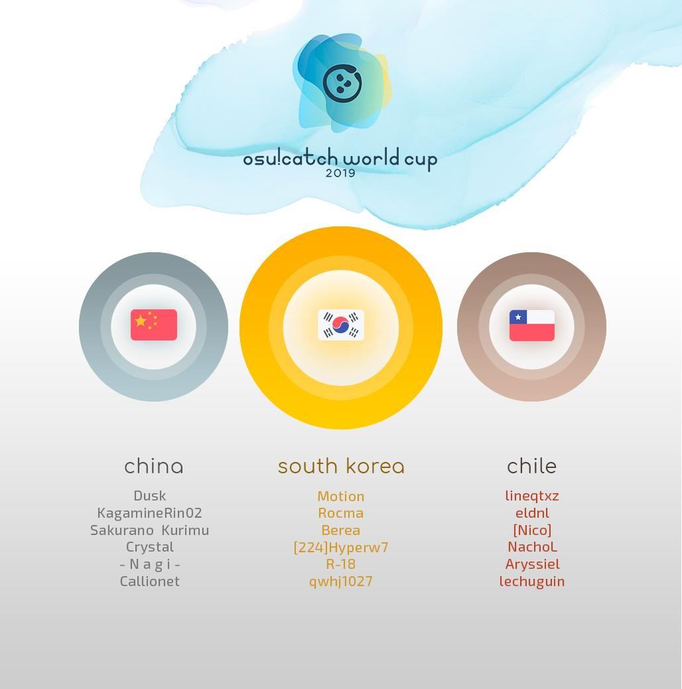

---
tags:
  - CWC 2019
  - CWC2019
---

# osu!catch World Cup 2019

The **osu!catch World Cup 2019** (***CWC 2019***) was a country-based osu!catch tournament hosted by the [osu! team](/wiki/People/osu!_team). It was the eighth instalment of the osu!catch World Cup.

## Tournament schedule

| Event | Timestamp |
| --: | :-- |
| Registration phase | 2019-05-29/2019-06-11 |
| Live drawings | 2019-06-22 (16:00 UTC) |
| Group stage | 2019-06-29/2019-06-30 |
| Round of 16 | 2019-07-06/2019-07-07 |
| Quarterfinals | 2019-07-13/2019-07-14 |
| Semifinals | 2019-07-20/2019-07-21 |
| Finals week 1 | 2019-07-27 |
| Finals week 2 | 2019-08-03/2019-08-04 |

## Prizes

| Placing | Prizes |
| :-: | :-- |
|  | $150 per team member, unique profile badge, "osu!catch Champion" user title for one year |
|  | $80 per team member, Unique profile badge |
|  | $40 per team member, Unique profile badge |

  

## Organisation

The osu!catch World Cup 2019 was run by various community members.

| Position | Member(s) |
| :-- | :-- |
| Manager | ::{ flag=NZ }:: [deadbeat](https://osu.ppy.sh/users/128370), ::{ flag=AR }:: [juankristal](https://osu.ppy.sh/users/443656) |
| Mappool selector | ::{ flag=US }:: [Ascendance](https://osu.ppy.sh/users/2931883), ::{ flag=ES }:: [Deif](https://osu.ppy.sh/users/318565), ::{ flag=CN }:: [F D Flourite](https://osu.ppy.sh/users/2459589), ::{ flag=TN }:: [-Ken](https://osu.ppy.sh/users/4430811) |
| Referee | ::{ flag=ES }:: [Deif](https://osu.ppy.sh/users/318565), ::{ flag=DE }:: [p3n](https://osu.ppy.sh/users/123703), ::{ flag=US }:: [tigereyes144](https://osu.ppy.sh/users/6499811), ::{ flag=CL }:: [WalterToro](https://osu.ppy.sh/users/5281416), ::{ flag=GB }:: [Yazzehh](https://osu.ppy.sh/users/7068973) |
| Commentator | ::{ flag=US }:: [chickenbible](https://osu.ppy.sh/users/2306637), ::{ flag=NO }:: [Divine Cake](https://osu.ppy.sh/users/3636998), ::{ flag=US }:: [Dohland](https://osu.ppy.sh/users/5220511), ::{ flag=US }:: [Elux](https://osu.ppy.sh/users/12004983), ::{ flag=US }:: [incandescence](https://osu.ppy.sh/users/6256027), ::{ flag=GB }:: [JBHyperion](https://osu.ppy.sh/users/4879508), ::{ flag=AU }:: [KWYJIBO](https://osu.ppy.sh/users/7178386), ::{ flag=NL }:: [Sartan](https://osu.ppy.sh/users/4100941) |
| Statistician | ::{ flag=NZ }:: [deadbeat](https://osu.ppy.sh/users/128370), ::{ flag=DE }:: [Nwolf](https://osu.ppy.sh/users/1910766) |

## Links

- [Discussion thread](https://osu.ppy.sh/community/forums/topics/913952)
- [Livestream](https://www.twitch.tv/osulive)
- [Pick'ems page](https://pickem.hwc.hr/tournaments/9) hosted by ::{ flag=DE }:: [hallowatcher](https://osu.ppy.sh/users/1874761)
- **[Statistics sheet](https://docs.google.com/spreadsheets/d/e/2PACX-1vRt5kVxQM14v5e4fhQ9CL7N5qXrFzO8XXsKnaO6bBqMy4WZ1rhTa_1xkr-nntRxS_AQ2WqEjks_4ssm/pubhtml)**

## Participants

|  | Country | Members |
| :-: | :-: | :-- |
| ::{ flag=AR }:: | **Argentina** | **[\[Force\]](https://osu.ppy.sh/users/1617217)**, [Ambition-](https://osu.ppy.sh/users/6960376), [jerem1as](https://osu.ppy.sh/users/6117864), [NachOx](https://osu.ppy.sh/users/3971534), [VelperK](https://osu.ppy.sh/users/348467), [warning dark](https://osu.ppy.sh/users/5040981) |
| ::{ flag=AU }:: | **Australia** | **[chickennando](https://osu.ppy.sh/users/5818665)**, [die Eisdiele](https://osu.ppy.sh/users/7155262), [Jaye](https://osu.ppy.sh/users/4841352), [KWYJIBO](https://osu.ppy.sh/users/7178386), [yennibear](https://osu.ppy.sh/users/3874176) |
| ::{ flag=BE }:: | **Belgium** | **[Quinten323](https://osu.ppy.sh/users/6283136)**, [\[ Seraf \]](https://osu.ppy.sh/users/6376151), [-\[Smoked\]-](https://osu.ppy.sh/users/8731044), [Azzari](https://osu.ppy.sh/users/10389331), [Parapluutje](https://osu.ppy.sh/users/9074469), [Zhiend](https://osu.ppy.sh/users/7474404) |
| ::{ flag=BR }:: | **Brazil** | **[Hanik](https://osu.ppy.sh/users/4533507)**, [ExNando](https://osu.ppy.sh/users/5960935), [-Overdose-](https://osu.ppy.sh/users/7749445), [Predominador](https://osu.ppy.sh/users/4568537), [Super Choke](https://osu.ppy.sh/users/2054788), [Taishi-](https://osu.ppy.sh/users/2349221) |
| ::{ flag=CA }:: | **Canada** | **[wwwww-](https://osu.ppy.sh/users/3616480)**, [\_wwwww](https://osu.ppy.sh/users/4820793), [1111](https://osu.ppy.sh/users/2747940), [earl-](https://osu.ppy.sh/users/3625415), [Henrick](https://osu.ppy.sh/users/8840982), [melonsigh](https://osu.ppy.sh/users/8623922) |
| ::{ flag=CL }:: | **Chile** | **[lineqtxz](https://osu.ppy.sh/users/989542)**, [\[Nico\]](https://osu.ppy.sh/users/1011240), [Aryssiel](https://osu.ppy.sh/users/2389481), [eldnl](https://osu.ppy.sh/users/285756), [lechuguin](https://osu.ppy.sh/users/2872000), [NachoL](https://osu.ppy.sh/users/1250096) |
| ::{ flag=CN }:: | **China** | **[Dusk](https://osu.ppy.sh/users/533210)**, [- N a g i -](https://osu.ppy.sh/users/2956936), [Callionet](https://osu.ppy.sh/users/3072921), [Crystal](https://osu.ppy.sh/users/1646397), [KagamineRin02](https://osu.ppy.sh/users/518503), [Sakurano  Kurimu](https://osu.ppy.sh/users/1338103) |
| ::{ flag=CO }:: | **Colombia** | **[Deley-](https://osu.ppy.sh/users/8291465)**, [\[ Azu- \]](https://osu.ppy.sh/users/8290364), [-Narnia-](https://osu.ppy.sh/users/3600162), [Titan-](https://osu.ppy.sh/users/7855767), [Umi Sonoda-](https://osu.ppy.sh/users/8579779), [UNORDINARY](https://osu.ppy.sh/users/9519851) |
| ::{ flag=CZ }:: | **Czech Republic** | **[-\[NetriX\]-](https://osu.ppy.sh/users/10770802)**, [SimplyHai](https://osu.ppy.sh/users/9784522), [Wishs](https://osu.ppy.sh/users/4013465), [xMakron](https://osu.ppy.sh/users/5928207) |
| ::{ flag=DK }:: | **Denmark** | **[SharpN](https://osu.ppy.sh/users/4382076)**, [Captain](https://osu.ppy.sh/users/2563435), [kaare12356](https://osu.ppy.sh/users/4434640), [Only1Magma](https://osu.ppy.sh/users/3922957), [SchnitzelBae](https://osu.ppy.sh/users/11253135), [Waffe latte](https://osu.ppy.sh/users/9699561) |
| ::{ flag=FI }:: | **Finland** | **[forgottentaco](https://osu.ppy.sh/users/6109660)**, [Awsumi](https://osu.ppy.sh/users/4174308), [Kurtsi](https://osu.ppy.sh/users/4222176), [Nikolai](https://osu.ppy.sh/users/5302804), [noksu15](https://osu.ppy.sh/users/10161144), [YERTI](https://osu.ppy.sh/users/1490757) |
| ::{ flag=FR }:: | **France** | **[AAAAAAAAAAAAHHH](https://osu.ppy.sh/users/4864877)**, [Alostis](https://osu.ppy.sh/users/2986875), [Boros](https://osu.ppy.sh/users/5490623), [Holloh](https://osu.ppy.sh/users/7612994), [monstratorfull](https://osu.ppy.sh/users/1872276), [Noulayfe](https://osu.ppy.sh/users/4316542) |
| ::{ flag=DE }:: | **Germany** | **[Vinci007](https://osu.ppy.sh/users/5030297)**, [Ginoshi](https://osu.ppy.sh/users/5398106), [Inryoku](https://osu.ppy.sh/users/6562920), [Marvmallow](https://osu.ppy.sh/users/8403032), [namirin](https://osu.ppy.sh/users/6414332), [Poriyon](https://osu.ppy.sh/users/4691991) |
| ::{ flag=HK }:: | **Hong Kong** | **[Touch Me](https://osu.ppy.sh/users/9155988)**, [ajstyles](https://osu.ppy.sh/users/6461445), [Latifah-sama](https://osu.ppy.sh/users/1226238), [SakaNaz](https://osu.ppy.sh/users/1784164), [Suigetsu Kyouka](https://osu.ppy.sh/users/1311496), [Time Series](https://osu.ppy.sh/users/6645501) |
| ::{ flag=ID }:: | **Indonesia** | **[dika312](https://osu.ppy.sh/users/741613)**, [Extinction666](https://osu.ppy.sh/users/5472877), [Funtastic](https://osu.ppy.sh/users/3555626), [Galaxi](https://osu.ppy.sh/users/2552435), [LeWind](https://osu.ppy.sh/users/9718235), [Minalinsky-](https://osu.ppy.sh/users/2823883) |
| ::{ flag=IT }:: | **Italy** | **[Karym](https://osu.ppy.sh/users/5220794)**, [ArMa79](https://osu.ppy.sh/users/4982799), [Bananajoe](https://osu.ppy.sh/users/330764), [Pizza Kun](https://osu.ppy.sh/users/768609), [Spinacina](https://osu.ppy.sh/users/4277070), [Trollingor](https://osu.ppy.sh/users/4144266) |
| ::{ flag=JP }:: | **Japan** | **[T e d](https://osu.ppy.sh/users/538717)**, [Furely](https://osu.ppy.sh/users/853694), [kusakabe001](https://osu.ppy.sh/users/129806), [noraRcat](https://osu.ppy.sh/users/883939), [nyanmi-1828](https://osu.ppy.sh/users/6866480) |
| ::{ flag=MX }:: | **Mexico** | **[daxeroz](https://osu.ppy.sh/users/1170156)**, [Cowboy](https://osu.ppy.sh/users/1237535), [Cxlucha](https://osu.ppy.sh/users/5063961), [-Deleck-](https://osu.ppy.sh/users/3094340), [Firu](https://osu.ppy.sh/users/10516547), [Kashou](https://osu.ppy.sh/users/4046640) |
| ::{ flag=NL }:: | **Netherlands** | **[Wesley](https://osu.ppy.sh/users/2407265)**, [Chatie](https://osu.ppy.sh/users/6524765), [KevKjef](https://osu.ppy.sh/users/9114235), [MasterForcer](https://osu.ppy.sh/users/3263646), [Sartan](https://osu.ppy.sh/users/4100941), [woodpamp](https://osu.ppy.sh/users/3809967) |
| ::{ flag=NO }:: | **Norway** | **[Cameragod](https://osu.ppy.sh/users/4974088)**, [Benita](https://osu.ppy.sh/users/4023183), [Divine Cake](https://osu.ppy.sh/users/3636998), [Mile](https://osu.ppy.sh/users/2760954), [salchow](https://osu.ppy.sh/users/9738159), [Vanilla-](https://osu.ppy.sh/users/3400701) |
| ::{ flag=PH }:: | **Philippines** | **[Roido](https://osu.ppy.sh/users/6829103)**, [- Kielzu -](https://osu.ppy.sh/users/6221114), [Bunnrei](https://osu.ppy.sh/users/829284), [Crowley](https://osu.ppy.sh/users/6341006), [KaganimeRin](https://osu.ppy.sh/users/1626093), [-MomoX](https://osu.ppy.sh/users/2150415) |
| ::{ flag=PL }:: | **Poland** | **[BoberOfDarkness](https://osu.ppy.sh/users/3427748)**, [Jumper-](https://osu.ppy.sh/users/6803892), [Kosmit](https://osu.ppy.sh/users/1749173), [LechuCzechu88](https://osu.ppy.sh/users/5251714), [Rawaj](https://osu.ppy.sh/users/3716061), [Skyleia](https://osu.ppy.sh/users/2958293) |
| ::{ flag=RO }:: | **Romania** | **[Crystallize](https://osu.ppy.sh/users/4997316)**, [Attenox](https://osu.ppy.sh/users/6976867), [L3gEnDaRy97](https://osu.ppy.sh/users/4400693), [PakaChan](https://osu.ppy.sh/users/3080727), [Shiroi Lelouch](https://osu.ppy.sh/users/3880553) |
| ::{ flag=RU }:: | **Russian Federation** | **[VagaNNN](https://osu.ppy.sh/users/1260040)**, [aoe](https://osu.ppy.sh/users/6094216), [Lacrima](https://osu.ppy.sh/users/4915649), [Kajou Ayame](https://osu.ppy.sh/users/8283671), [MeeeDBeD](https://osu.ppy.sh/users/7055384), [Xetopia](https://osu.ppy.sh/users/6689101) |
| ::{ flag=KR }:: | **South Korea** | **[Motion](https://osu.ppy.sh/users/3885626)**, [\[224\]Hyperw7](https://osu.ppy.sh/users/4158549), [Berea](https://osu.ppy.sh/users/3657951), [qwhj1027](https://osu.ppy.sh/users/7547506), [R-18](https://osu.ppy.sh/users/4637369), [Rocma](https://osu.ppy.sh/users/566276) |
| ::{ flag=SE }:: | **Sweden** | **[Setomi](https://osu.ppy.sh/users/2205929)**, [Aceon](https://osu.ppy.sh/users/4452911), [CocoSunshine](https://osu.ppy.sh/users/6471909), [DataPata](https://osu.ppy.sh/users/985360), [Osten](https://osu.ppy.sh/users/4417929), [Yukiteru Amano](https://osu.ppy.sh/users/1894511) |
| ::{ flag=TW }:: | **Taiwan** | **[\[-naniwa-\]](https://osu.ppy.sh/users/4958376)**, [Atsuko-Kagari](https://osu.ppy.sh/users/1957752), [DoDoEbi](https://osu.ppy.sh/users/1177233), [ItsLingers](https://osu.ppy.sh/users/1449322), [Nikaido Shinku](https://osu.ppy.sh/users/2455926), [Sanami](https://osu.ppy.sh/users/1629471) |
| ::{ flag=TH }:: | **Thailand** | **[Eito](https://osu.ppy.sh/users/10043310)**, [\[-\_-Sakura-\_-\]](https://osu.ppy.sh/users/8103749), [Nonessential](https://osu.ppy.sh/users/11056733), [SeriOni -](https://osu.ppy.sh/users/8477520), [TNKSTC](https://osu.ppy.sh/users/6037121) |
| ::{ flag=GB }:: | **United Kingdom** | **[Olib](https://osu.ppy.sh/users/4044289)**, [FABninja](https://osu.ppy.sh/users/5257769), [JBHyperion](https://osu.ppy.sh/users/4879508), [Matt\_H](https://osu.ppy.sh/users/4067115), [MBomb](https://osu.ppy.sh/users/3071175), [Withered Lotus](https://osu.ppy.sh/users/3546931) |
| ::{ flag=US }:: | **United States** | **[chickenbible](https://osu.ppy.sh/users/2306637)**, [Ken Doll](https://osu.ppy.sh/users/485474), [-Kurisu-](https://osu.ppy.sh/users/500696), [Lexii](https://osu.ppy.sh/users/7226149), [rostld](https://osu.ppy.sh/users/4365562), [Zak](https://osu.ppy.sh/users/1375955) |
| ::{ flag=VE }:: | **Venezuela** | **[Zuleta\_](https://osu.ppy.sh/users/10287019)**, [\[Aless50\]](https://osu.ppy.sh/users/4339778), [-\[CocoaFangirl\]](https://osu.ppy.sh/users/10291253), [-\[Ketsu\]-](https://osu.ppy.sh/users/10496305), [Hisashi Shimoro](https://osu.ppy.sh/users/6736420), [Tsugumi](https://osu.ppy.sh/users/8746368) |
| ::{ flag=VN }:: | **Vietnam** | **[\[A\]bsolute](https://osu.ppy.sh/users/8525921)**, [Close](https://osu.ppy.sh/users/4744615), [Hana Yukiko](https://osu.ppy.sh/users/4964095), [mothernature](https://osu.ppy.sh/users/6403418), [Saaya](https://osu.ppy.sh/users/5144295), [Seonna](https://osu.ppy.sh/users/4677276) |

## Podium

## Mappools

### Finals week 2

**[Download the mappack here!](https://www.dropbox.com/s/w76kar8lt11u7kv/CWC%20GF%20Mappool.zip?dl=0&file_subpath=%2FCWC+GF+Mappool)**

- NoMod
  1. [Masayoshi Iimori - BREAK OVER (- G i G a s -) \[SUPER MENTAL IS BREAK???\]](https://osu.ppy.sh/beatmapsets/743698#fruits/1568290)
  2. [Mitsuyoshi Takenobu no Ani - Amphisbaena (Ascendance) \[Mythic Another (2019 Edit Ver.)\]](https://osu.ppy.sh/beatmapsets/1009892#fruits/2114109)
  3. [Chroma - Made In Love (Bunnrei) \[Ai\]](https://osu.ppy.sh/beatmapsets/973405#fruits/2037794)
  4. [Shiron - CODE -CRiMSON- (CLSW) \[GRAVITY\]](https://osu.ppy.sh/beatmapsets/534978#fruits/1133219)
  5. [Omoi - Chiisana Koi no Uta (Synth Rock Cover) (val0108) \[Kroytz's EX EX\]](https://osu.ppy.sh/beatmapsets/609189#fruits/1312375)
  6. [Zekk - Calling (NeilPerry) \[winber1's Special Extra\]](https://osu.ppy.sh/beatmapsets/673878#fruits/1430468)
- Hidden
  1. [Emilie Autumn - I Know Where You Sleep (- Magic Bomb -) \[Revealed\]](https://osu.ppy.sh/beatmapsets/673883#fruits/1426045)
  2. [uno & D.watt (IOSYS TRAX) - #Endroll (INO) \[GRAVITY\]](https://osu.ppy.sh/beatmapsets/732562#fruits/1545604)
  3. [Susumu Hirasawa - Aurora 2 (NachoPiggy) \[KIRBY Mix\]](https://osu.ppy.sh/beatmapsets/10978#fruits/49206)
  4. [Shinra-bansho - Zenryoku Happy Life (Hailie) \[Extra\]](https://osu.ppy.sh/beatmapsets/806350#fruits/1692553)
- HardRock
  1. [Dasu - Nakakapagpabagabag (Bunnrei) \[Schadenfreude\]](https://osu.ppy.sh/beatmapsets/755615#fruits/1590406)
  2. [Ponkichi - Hyakukakai to Shirotokkuri (F D Flourite) \[Axes\]](https://osu.ppy.sh/beatmapsets/934870#fruits/1951696)
  3. [Shindig - Zzz (squirrelpascals) \[I'm Home\]](https://osu.ppy.sh/beatmapsets/802730#fruits/1684963)
  4. [seleP - Scarlet Rose (pkk) \[X\]](https://osu.ppy.sh/beatmapsets/528089#fruits/1120184)
- DoubleTime
  1. [Maksim Mrvica - Croatian Rhapsody (ZHSteven) \[Insane\]](https://osu.ppy.sh/beatmapsets/191590#fruits/881329)
  2. [Project Grimoire - Brionac \~Lugh Lamhfhata\~ (Rocma) \[Overdose\]](https://osu.ppy.sh/beatmapsets/734296#fruits/1555121)
  3. [Ni-Sokkususu - Shukusai no Elementalia (Silynn) \[haqi's Insane\]](https://osu.ppy.sh/beatmapsets/203309#fruits/880587)
  4. [Hatsuki Yura - Lunicode (GreenHue) \[KKip's Insane\]](https://osu.ppy.sh/beatmapsets/801001#fruits/1689336)
- Tiebreaker
  1. **[Camellia - gigadelic (Camellia's "THE TERA" Remix) \[" 10^12 " Long ver.\] (Minato Yukina) \[Final Showdown\]](https://osu.ppy.sh/beatmapsets/856174#fruits/1788806)**

### Finals week 1

**[Download the mappack here!](https://www.dropbox.com/s/b9fcomih3576nxz/CWC%20Finals%20Mappool.zip?dl=0)**

- NoMod
  1. [Zekk - Feelsleft0ut (AJamez) \[:)\]](https://osu.ppy.sh/beatmapsets/856040#fruits/1788564)
  2. [solfa feat. Ceui - Koiiro Recipe (-Luminate) \[Marshmallow\]](https://osu.ppy.sh/beatmapsets/918591#fruits/1918175)
  3. [Dustvoxx - TRiGGER (Zekk Remix) (Deif) \[OVeRDOSE\]](https://osu.ppy.sh/beatmapsets/1003938#fruits/2101175)
  4. [cosMo@BousouP - Sadistic.Music Factory (JeirYagtama) \[Sadistic Fruit Factory\]](https://osu.ppy.sh/beatmapsets/747341#fruits/1719034)
  5. [Kitsune^2 - Free (Starrodkirby86) \[Freedom\]](https://osu.ppy.sh/beatmapsets/342207#fruits/756423)
  6. [BABYMETAL - YAVA! (\[ Kohioma \]) \[Yabai\]](https://osu.ppy.sh/beatmapsets/476612#fruits/1018019)
- Hidden
  1. [Kagamine Rin - Oni Kanojo (Spectator) \[Spec's CTB\]](https://osu.ppy.sh/beatmapsets/486433#fruits/1037254)
  2. [Gekidan Record - Ares no Tate (- Syamu -) \[Shield of Ares\]](https://osu.ppy.sh/beatmapsets/826598#fruits/1732259)
  3. [KAKU P-MODEL - Big Brother (Mismagius) \[NOGARD Mix Deluxe\]](https://osu.ppy.sh/beatmapsets/992499#fruits/2075541)
  4. [Zhou Li Ming - Pi Li Pa La (bakabaka) \[Extra\]](https://osu.ppy.sh/beatmapsets/136065#fruits/340652)
- HardRock
  1. [Nekomata Master+ - squall (Sinnoh) \[Overdose\]](https://osu.ppy.sh/beatmapsets/962382#fruits/2015148)
  2. [Halozy - Deconstruction Star (CLSW) \[Twilight Poinsettia\]](https://osu.ppy.sh/beatmapsets/319217#fruits/710613)
  3. [ITO KASHITARO - Yuudachi no Ribbon (Milan-) \[Rain\]](https://osu.ppy.sh/beatmapsets/479811#fruits/1024480)
  4. [e-ZUKA - Assailant in the Night (Saten) \[Speed\]](https://osu.ppy.sh/beatmapsets/52499#fruits/160486)
- DoubleTime
  1. [sana - Sunset March (Benita) \[Lacrima's Eventide\]](https://osu.ppy.sh/beatmapsets/959995#fruits/2018434)
  2. [Floating Cloud - Ame no chikumori no chihare (dazzulay) \[Fruit Dance\]](https://osu.ppy.sh/beatmapsets/838420#fruits/1755327)
  3. [Myrath - Endure The Silence (LMT) \[Another\]](https://osu.ppy.sh/beatmapsets/555454#fruits/1213261)
  4. [Yorushika - Itte. (deetz) \[Clearly\]](https://osu.ppy.sh/beatmapsets/985066#fruits/2061024)
- Tiebreaker
  1. **[RoughSketch feat. DD "Nakata" Metal - Booths of Fighters (Camellia's "Barrage of Flurries" Remix) (Ascendance) \[Ascendance & Plus's Onslaught\]](https://osu.ppy.sh/beatmapsets/809971#fruits/1699518)**

### Semifinals

**[Download the mappack here!](https://www.dropbox.com/s/gvrrfhmooy15pbl/CWC%20Semifinals%20Mappool.zip?dl=0)**

- NoMod
  1. [M2U - Marionette (Absolute Zero) \[MBomb's Overdose\]](https://osu.ppy.sh/beatmapsets/797395#fruits/1895451)
  2. [Camellia - crystallized (Spectator) \[Crystal Spec's Overdose\]](https://osu.ppy.sh/beatmapsets/751290#fruits/1581742)
  3. [succducc - me & u (Zyzyx) \[Forever\]](https://osu.ppy.sh/beatmapsets/931928#fruits/1945822)
  4. [DJ TOTTO - Shoujo Alice to Hakoniwa Gensou Concerto (F D Flourite) \[The White Queen (Overdose)\]](https://osu.ppy.sh/beatmapsets/830717#fruits/1766406)
  5. [Camellia feat. Nanahira - Amor De Verao (Kuron-kun) \[CAIPIRINHA\]](https://osu.ppy.sh/beatmapsets/746563#fruits/1573413)
  6. [Camellia - kodama (ProfessionalBox) \[-kevincela-'s Extra\]](https://osu.ppy.sh/beatmapsets/488016#fruits/1048276)
- Hidden
  1. [Grand Thaw - AltMirrorBell (Deif) \[Overdose\]](https://osu.ppy.sh/beatmapsets/959843#fruits/2009626)
  2. [REOL - drop pop candy (chickenbible) \[Step by Step\]](https://osu.ppy.sh/beatmapsets/860838#fruits/1801075)
  3. [DJ YOSHITAKA - Evans (Jerrysr) \[ignore's Another\]](https://osu.ppy.sh/beatmapsets/13694#fruits/50663)
  4. [xi - Mirage Garden (P o M u T a) \[Another445\]](https://osu.ppy.sh/beatmapsets/319940#fruits/726357)
- HardRock
  1. [Helblinde - Grief & Malice (Kyuare) \[Madness\]](https://osu.ppy.sh/beatmapsets/325817#fruits/723610)
  2. [Mr. Saturn - Saturn (Saturnalize) \[OverdoZe\]](https://osu.ppy.sh/beatmapsets/39797#fruits/356150)
  3. [jippusu - Mushikui Saikede Rhythm (Amamiya Yuko) \[RLC\]](https://osu.ppy.sh/beatmapsets/87547#fruits/240689)
  4. [sakuzyo - Imprinting (Squigly) \[Impress\]](https://osu.ppy.sh/beatmapsets/264299#fruits/602547)
- DoubleTime
  1. [Cha Ji Yeon, LDN Noise - My Show (Ollapeu) \[Fantasy\]](https://osu.ppy.sh/beatmapsets/759402#fruits/1597102)
  2. [Tamaki to Yumine (CV: Naganawa Maria Maekawa Ryouko) - Yonaka Jikaru (examination) \[Rain\]](https://osu.ppy.sh/beatmapsets/538744#fruits/1141091)
  3. [SEREBRO - Mi Mi Mi (Speed Up Ver.) (eiri-) \[Fashion Pink Lips\]](https://osu.ppy.sh/beatmapsets/907084#fruits/1892789)
  4. [TatshMusicCircle - Raikou -3rd Desire- (Kite) \[Extra\]](https://osu.ppy.sh/beatmapsets/143316#fruits/1836851)
- Tiebreaker
  1. **[DragonForce - Symphony Of The Night (Crowley) \[Myth of the Darkest Twilight\]](https://osu.ppy.sh/beatmapsets/984228#fruits/2059422)**

### Quarterfinals

**[Download the mappack here!](https://www.dropbox.com/s/xc7mkw9nkijacs5/CWC%20QF%20Mappool.zip?dl=0&file_subpath=%2FCWC+QF+Mappool)**

- NoMod
  1. [Helblinde - Unconquered (IDu5t) \[Indestructible\]](https://osu.ppy.sh/beatmapsets/975136#fruits/2041090)
  2. [void (Mournfinale) - World Vanquisher (Sinnoh) \[Overdose\]](https://osu.ppy.sh/beatmapsets/860457#fruits/1800318)
  3. [wowaka - Reversible Doll (Minato Yukina) \[Lasting Legacy\]](https://osu.ppy.sh/beatmapsets/952552#fruits/1989009)
  4. [ak+q - Axium Crisis (Lacrima) \[Vicious Labyrinth\]](https://osu.ppy.sh/beatmapsets/996639#fruits/2084648)
  5. [Akiyama Uni - Chi no Iro wa Kiiro (Hollow Wings) \[Extra\]](https://osu.ppy.sh/beatmapsets/119779#fruits/307410)
  6. [Loki - Interlude (Chewin) \[Drama\]](https://osu.ppy.sh/beatmapsets/659093#fruits/1395942)
- Hidden
  1. [Rigel Theatre - La Sylphide (F D Flourite) \[Collab Aurora (Short ver.)\]](https://osu.ppy.sh/beatmapsets/955131#fruits/2072991)
  2. [ribbon room - mint tears (Rotte) \[Steven's flood tears\]](https://osu.ppy.sh/beatmapsets/117063#fruits/303383)
  3. [luz - Doku Ringo to Cinderella (Ametrin) \[Fairy Tale?\]](https://osu.ppy.sh/beatmapsets/664784#fruits/1406919)
- HardRock
  1. [Amatsuki - How-to Sekai Seifuku (Crowley) \[Loneliness\]](https://osu.ppy.sh/beatmapsets/695892#fruits/1474313)
  2. [Jin feat. MARiA from GARNiDELiA - daze (short ver.) (luxoDeh) \[Crystal's Overdose\]](https://osu.ppy.sh/beatmapsets/165391#fruits/443046)
  3. [VY1 - Cyber Thunder Cider (tutuhaha) \[Cider\]](https://osu.ppy.sh/beatmapsets/47146#fruits/146610)
- DoubleTime
  1. [Kalafina - heavenly blue (Nelly) \[Gloria\]](https://osu.ppy.sh/beatmapsets/662744#fruits/1402831)
  2. [Denkishiki Karen Ongaku Shuudan - Endless ripples (Hareimu) \[Sadness\]](https://osu.ppy.sh/beatmapsets/433029#fruits/1475145)
  3. [Yasuda Rei - Best of my Love (NEVlR) \[A Colorful Path Of Inspiration\]](https://osu.ppy.sh/beatmapsets/910570#fruits/1900083)
- Tiebreaker
  1. **[Virtual Self - Angel Voices (Sinnoh) \[Ghost\]](https://osu.ppy.sh/beatmapsets/939437#fruits/1962245)**

### Round of 16

**[Download the mappack here!](https://www.dropbox.com/sh/4q19wyd0z6q4akw/AAD6Cc014HXigZvHPWSpNmbSa?dl=0)**

- NoMod
  1. [a\_hisa - Tokei no Heya to Seishin Sekai (Spectator) \[Kyuare Spec's Overdose\]](https://osu.ppy.sh/beatmapsets/639409#fruits/1356120)
  2. [Zeami feat. Tenco - Tenyou no Mai (Minato Yukina) \[EX\]](https://osu.ppy.sh/beatmapsets/800903#fruits/1681347)
  3. [Station Earth - Age Of Reason (-Ken) \[Overdose\]](https://osu.ppy.sh/beatmapsets/954217#fruits/1992201)
  4. [MiddleIsland - Tokiiro Serenade (AJamez) \[Zemblanity\]](https://osu.ppy.sh/beatmapsets/979140#fruits/2049204)
  5. [EGOIST - Fallen (TV Edit) (toybot) \[Amamiya Irrzhen's Extra\]](https://osu.ppy.sh/beatmapsets/222532#fruits/520208)
  6. [Tanchiky - Sanshi Suimei (nika mika) \[Miyabi\]](https://osu.ppy.sh/beatmapsets/811685#fruits/1702581)
- Hidden
  1. [OISHII - PIZZA PLAZA (Spectator) \[Overdose\]](https://osu.ppy.sh/beatmapsets/767009#fruits/1612277)
  2. [cillia - Donor Song (Hareimu) \[Sinnoh's Rain\]](https://osu.ppy.sh/beatmapsets/711681#fruits/1514441)
  3. [C.G mix - True Eyes (wanhyrzh) \[Final Mission\]](https://osu.ppy.sh/beatmapsets/17386#fruits/62199)
- HardRock
  1. [ak+q - Excelsia (Sorcerer) \[Rain\]](https://osu.ppy.sh/beatmapsets/737685#fruits/1556895)
  2. [FLOW - COLORS (TV Size) (Ascendance) \[Rain\]](https://osu.ppy.sh/beatmapsets/873082#fruits/1824996)
  3. [Dollscythe - Flashes (Extended) (Skystar) \[yf's PP Insane\]](https://osu.ppy.sh/beatmapsets/512648#fruits/1090607)
- DoubleTime
  1. [VINXIS - A Centralized View (JBHyperion) \[Platter\]](https://osu.ppy.sh/beatmapsets/972302#fruits/2035769)
  2. [Kawada Mami - Timeless time (wairo) \[Furely's Rain\]](https://osu.ppy.sh/beatmapsets/333441#fruits/1359832)
  3. [YUI - Rolling star (pkhg) \[Insane\]](https://osu.ppy.sh/beatmapsets/351838#fruits/775380)
- Tiebreaker
  1. **[Eisyo-kobu - Oriental Blossom -Eika Shuuei- (Yumeno Himiko) \[Sakura\]](https://osu.ppy.sh/beatmapsets/910194#fruits/1899381)**

### Group stage

**[Download the mappack here!](https://www.dropbox.com/sh/e3jgd039od90c85/AADfBfWbrPI5NHwpKWiv3fCCa?dl=0)**

- NoMod
  1. [Roselia - Neo-Aspect (Underdogs) \[AJamez's Rain\]](https://osu.ppy.sh/beatmapsets/776620#fruits/1892842)
  2. [ITO KASHITARO - Hyakka Ryouran (F D Flourite) \[Sparks\]](https://osu.ppy.sh/beatmapsets/867277#fruits/1813016)
  3. [antiPLUR - One Life Left to Live (JBHyperion) \[Overdose\]](https://osu.ppy.sh/beatmapsets/957842#fruits/2005440)
  4. [onumi - CONFUSION PART ONE (Sinnoh) \[ASCENDANCE'S RAIN\]](https://osu.ppy.sh/beatmapsets/933700#fruits/2021599)
  5. [League of Legends - RISE (ft. The Glitch Mob, Mako, and The Word Alive) (SquareTude) \[Minorsonek's Insane\]](https://osu.ppy.sh/beatmapsets/858938#fruits/1795003)
  6. [zakuro - Inochi ni Kirawarete Iru. (Mirash) \[Delis' Extra\]](https://osu.ppy.sh/beatmapsets/693727#fruits/1467820)
- Hidden
  1. [NICODE & M2U - Predawn (Sulfur) \[Jeir's Rain\]](https://osu.ppy.sh/beatmapsets/748803#fruits/1602530)
  2. [cYsmix - Breeze (wonjae) \[Rocma's Rain\]](https://osu.ppy.sh/beatmapsets/840964#fruits/1761864)
  3. [SID - Ranbu no Melody (TV Size) (Kiddo-Kun) \[Happy's Insane\]](https://osu.ppy.sh/beatmapsets/22648#fruits/86920)
- HardRock
  1. [Survive Said The Prophet - found & lost (TV Size) (Wei Wuxian) \[Platter\]](https://osu.ppy.sh/beatmapsets/893177#fruits/1866779)
  2. [Y&Co. feat. Karin - Sweet Rain (Sorcerer) \[Platter\]](https://osu.ppy.sh/beatmapsets/738169#fruits/1587421)
  3. [DECO\*27 - Ghost Rule (Awaken) \[G's Harder\]](https://osu.ppy.sh/beatmapsets/413117#fruits/928857)
- DoubleTime
  1. [Arashi - Natsu no Owari ni Omou Koto (mingmichael) \[Collab Platter\]](https://osu.ppy.sh/beatmapsets/332814#fruits/741868)
  2. [Helblinde - When Time Sleeps (Sinnoh) \[AFB's Platter\]](https://osu.ppy.sh/beatmapsets/554256#fruits/1743650)
  3. [Kalafina - Oblivious (Melt) \[Oblivious\]](https://osu.ppy.sh/beatmapsets/114188#fruits/295857)
- Tiebreaker
  1. **[Rita - dorchadas (Sinnoh) \[Overdose\]](https://osu.ppy.sh/beatmapsets/812855#fruits/1704854)**

## Match results

### Finals week 2

Saturday, 4 August 2019:

| Team 1 |  |  | Team 2 | Match link |
| --: | :-: | :-: | :-- | :-- |
| **China** ::{ flag=CN }:: | **7** | 1 | ::{ flag=CL }:: | [#1](https://osu.ppy.sh/community/matches/53809297) |

Sunday, 5 August 2019:

| Team 1 |  |  | Team 2 | Match link |
| --: | :-: | :-: | :-- | :-- |
| South Korea ::{ flag=KR }:: | 4 | **7** | ::{ flag=CN }:: **China** | [#1](https://osu.ppy.sh/community/matches/53828395) |
| China ::{ flag=CN }:: | 3 | **7** | ::{ flag=KR }:: **South Korea** | [#1](https://osu.ppy.sh/community/matches/53830712) |

### Finals week 1

Saturday, 27 July 2019:

| Team 1 |  |  | Team 2 | Match link |
| --: | :-: | :-: | :-- | :-- |
| China ::{ flag=CN }:: | 2 | **7** | ::{ flag=KR }:: **South Korea** | [#1](https://osu.ppy.sh/community/matches/53636548) |
| **Chile** ::{ flag=CL }:: | **7** | 1 | ::{ flag=US }:: United States | [#1](https://osu.ppy.sh/community/matches/53643053) |
| France ::{ flag=FR }:: | 2 | **7** | ::{ flag=MX }:: **Mexico** | [#1](https://osu.ppy.sh/community/matches/53645553) |
| **Chile** ::{ flag=CL }:: | **7** | 5 | ::{ flag=MX }:: Mexico | [#1](https://osu.ppy.sh/community/matches/53648177) |

### Semifinals

Saturday, 20 July 2019:

| Team 1 |  |  | Team 2 | Match link |
| --: | :-: | :-: | :-- | :-- |
| Taiwan ::{ flag=TW }:: | 5 | **7** | ::{ flag=HK }:: **Hong Kong** | [#1](https://osu.ppy.sh/community/matches/53472837) |
| **South Korea** ::{ flag=KR }:: | **7** | 2 | ::{ flag=FR }:: France | [#1](https://osu.ppy.sh/community/matches/53473820) |
| **Philippines** ::{ flag=PH }:: | **7** | 4 | ::{ flag=DE }:: Germany | [#1](https://osu.ppy.sh/community/matches/53476256) |
| Finland ::{ flag=FI }:: | 0 | **7** | ::{ flag=MX }:: **Mexico** | *win by default* |
| **United States** ::{ flag=US }:: | **7** | 0 | ::{ flag=BR }:: Brazil | [#1](https://osu.ppy.sh/community/matches/53486183) |

Sunday, 21 July 2019:

| Team 1 |  |  | Team 2 | Match link |
| --: | :-: | :-: | :-- | :-- |
| Chile ::{ flag=CL }:: | 2 | **7** | ::{ flag=CN }:: **China** | [#1](https://osu.ppy.sh/community/matches/53490373) |
| Philippines ::{ flag=PH }:: | 5 | **7** | ::{ flag=MX }:: **Mexico** | [#1](https://osu.ppy.sh/community/matches/53491250) |
| **United States** ::{ flag=US }:: | **7** | 6 | ::{ flag=HK }:: Hong Kong | [#1](https://osu.ppy.sh/community/matches/53499382) |

### Quarterfinals

Saturday, 13 July 2019:

| Team 1 |  |  | Team 2 | Match link |
| --: | :-: | :-: | :-- | :-- |
| **Hong Kong** ::{ flag=HK }:: | **6** | 0 | ::{ flag=GB }:: United Kingdom | [#1](https://osu.ppy.sh/community/matches/53310233) |
| Netherlands ::{ flag=NL }:: | 3 | **6** | ::{ flag=DE }:: **Germany** | [#1](https://osu.ppy.sh/community/matches/53312074) |
| Finland ::{ flag=FI }:: | 3 | **6** | ::{ flag=CL }:: **Chile** | [#1](https://osu.ppy.sh/community/matches/53314184) |
| Poland ::{ flag=PL }:: | 0 | **6** | ::{ flag=MX }:: **Mexico** | [#1](https://osu.ppy.sh/community/matches/53316082) |
| Sweden ::{ flag=SE }:: | 3 | **6** | ::{ flag=BR }:: **Brazil** | [#1](https://osu.ppy.sh/community/matches/53153172) |
| United States ::{ flag=US }:: | 2 | **6** | ::{ flag=FR }:: **France** | [#1](https://osu.ppy.sh/community/matches/53320930) |

Sunday, 14 July 2019:

| Team 1 |  |  | Team 2 | Match link |
| --: | :-: | :-: | :-- | :-- |
| Philippines ::{ flag=PH }:: | 0 | **6** | ::{ flag=CN }:: **China** | [#1](https://osu.ppy.sh/community/matches/53330636) |
| **South Korea** ::{ flag=KR }:: | **6** | 0 | ::{ flag=TW }:: Taiwan | [#1](https://osu.ppy.sh/community/matches/53332106) |

### Round of 16

Saturday, 6 July 2019:

| Team 1 |  |  | Team 2 | Match link |
| --: | :-: | :-: | :-- | :-- |
| Netherlands ::{ flag=NL }:: | 0 | **6** | ::{ flag=KR }:: **South Korea** | [#1](https://osu.ppy.sh/community/matches/53145753) |
| **China** ::{ flag=CN }:: | **6** | 3 | ::{ flag=HK }:: Hong Kong | [#1](https://osu.ppy.sh/community/matches/53147363) |
| **Finland** ::{ flag=FI }:: | **6** | 3 | ::{ flag=SE }:: Sweden | [#1](https://osu.ppy.sh/community/matches/53149402) |
| Poland ::{ flag=PL }:: | 1 | **6** | ::{ flag=FR }:: **France** | [#1](https://osu.ppy.sh/community/matches/53151416) |
| **Chile** ::{ flag=CL }:: | **6** | 1 | ::{ flag=BR }:: Brazil | [#1](https://osu.ppy.sh/community/matches/53153172) |

Sunday, 7 July 2019:

| Team 1 |  |  | Team 2 | Match link |
| --: | :-: | :-: | :-- | :-- |
| **Philippines** ::{ flag=PH }:: | **6** | 1 | ::{ flag=GB }:: United Kingdom | [#1](https://osu.ppy.sh/community/matches/53169340) |
| **Taiwan** ::{ flag=TW }:: | **6** | 3 | ::{ flag=DE }:: Germany | [#1](https://osu.ppy.sh/community/matches/53170971) |
| Mexico ::{ flag=MX }:: | 4 | **6** | ::{ flag=US }:: **United States** | [#1](https://osu.ppy.sh/community/matches/53178682) |

### Group stage

Saturday, 29 June 2019:

| Team 1 |  |  | Team 2 | Match link |
| --: | :-: | :-: | :-- | :-- |
| Hong Kong ::{ flag=HK }:: | 2 | **5** | ::{ flag=KR }:: **South Korea** | [#1](https://osu.ppy.sh/community/matches/52984011) |
| Japan ::{ flag=JP }:: | 0 | **5** | ::{ flag=CN }:: **China** | [#1](https://osu.ppy.sh/community/matches/52983995) |
| **Sweden** ::{ flag=SE }:: | **5** | 0 | ::{ flag=VN }:: Vietnam | [#1](https://osu.ppy.sh/community/matches/52983992) |
| Taiwan ::{ flag=TW }:: | 4 | **5** | ::{ flag=PH }:: **Philippines** | [#1](https://osu.ppy.sh/community/matches/52985139) |
| Netherlands ::{ flag=NL }:: | 2 | **5** | ::{ flag=CN }:: **China** | [#1](https://osu.ppy.sh/community/matches/52984963) |
| Japan ::{ flag=JP }:: | 0 | **5** | ::{ flag=AU }:: **Australia** | [#1](https://osu.ppy.sh/community/matches/52985143) |
| Czech Republic ::{ flag=CZ }:: | 0 | **5** | ::{ flag=NO }:: **Norway** | [#1](https://osu.ppy.sh/community/matches/52986305) |
| Australia ::{ flag=AU }:: | 0 | **5** | ::{ flag=CN }:: **China** | [#1](https://osu.ppy.sh/community/matches/52986187) |
| Norway ::{ flag=NO }:: | 4 | **5** | ::{ flag=TW }:: **Taiwan** | [#1](https://osu.ppy.sh/community/matches/52987314) |
| Belgium ::{ flag=BE }:: | 0 | **5** | ::{ flag=FI }:: **Finland** | [#1](https://osu.ppy.sh/community/matches/52987320) |
| Czech Republic ::{ flag=CZ }:: | 0 | **5** | ::{ flag=PH }:: **Philippines** | [#1](https://osu.ppy.sh/community/matches/52987516) |
| Colombia ::{ flag=CO }:: | 0 | **5** | ::{ flag=VN }:: **Vietnam** | [#1](https://osu.ppy.sh/community/matches/52987527) |
| **Brazil** ::{ flag=BR }:: | **5** | 3 | ::{ flag=RU }:: Russian Federation | [#1](https://osu.ppy.sh/community/matches/52989912) |
| Romania ::{ flag=RO }:: | 0 | **5** | ::{ flag=US }:: **United States** | [#1](https://osu.ppy.sh/community/matches/52989921) |
| Denmark ::{ flag=DK }:: | 0 | **5** | ::{ flag=AR }:: **Argentina** | [#1](https://osu.ppy.sh/community/matches/52989865) |
| United Kingdom ::{ flag=GB }:: | 3 | **5** | ::{ flag=DE }:: **Germany** | [#1](https://osu.ppy.sh/community/matches/52989869) |
| Venezuela ::{ flag=VE }:: | 0 | **5** | ::{ flag=FI }:: **Finland** | [#1](https://osu.ppy.sh/community/matches/52991123) |
| Russian Federation ::{ flag=RU }:: | 4 | **5** | ::{ flag=US }:: **United States** | [#1](https://osu.ppy.sh/community/matches/52991108) |
| Belgium ::{ flag=BE }:: | 3 | **5** | ::{ flag=VE }:: **Venezuela** | [#1](https://osu.ppy.sh/community/matches/52992553) |
| **Canada** ::{ flag=CA }:: | **5** | 3 | ::{ flag=IT }:: Italy | [#1](https://osu.ppy.sh/community/matches/52992548) |
| Denmark ::{ flag=DK }:: | 1 | **5** | ::{ flag=DE }:: **Germany** | [#1](https://osu.ppy.sh/community/matches/52992407) |
| Argentina ::{ flag=AR }:: | 3 | **5** | ::{ flag=GB }:: **United Kingdom** | [#1](https://osu.ppy.sh/community/matches/52992413) |
| Italy ::{ flag=IT }:: | 4 | **5** | ::{ flag=MX }:: **Mexico** | [#1](https://osu.ppy.sh/community/matches/52994353) |
| Canada ::{ flag=CA }:: | 2 | **5** | ::{ flag=CL }:: **Chile** | [#1](https://osu.ppy.sh/community/matches/52993925) |
| **Sweden** ::{ flag=SE }:: | **5** | 1 | ::{ flag=CO }:: Colombia | [#1](https://osu.ppy.sh/community/matches/52994928) |
| Denmark ::{ flag=DK }:: | 1 | **5** | ::{ flag=GB }:: **United Kingdom** | [#1](https://osu.ppy.sh/community/matches/52994892) |
| Brazil ::{ flag=BR }:: | 0 | **5** | ::{ flag=US }:: **United States** | [#1](https://osu.ppy.sh/community/matches/52996265) |
| Mexico ::{ flag=MX }:: | 3 | **5** | ::{ flag=CL }:: **Chile** | [#1](https://osu.ppy.sh/community/matches/52997527) |

Sunday, 30 June 2019:

| Team 1 |  |  | Team 2 | Match link |
| --: | :-: | :-: | :-- | :-- |
| Australia ::{ flag=AU }:: | 2 | **5** | ::{ flag=NL }:: **Netherlands** | [#1](https://osu.ppy.sh/community/matches/53006976) |
| Thailand ::{ flag=TH }:: | 0 | **5** | ::{ flag=KR }:: **South Korea** | [#1](https://osu.ppy.sh/community/matches/53006979) |
| **Hong Kong** ::{ flag=HK }:: | **5** | 1 | ::{ flag=ID }:: Indonesia | [#1](https://osu.ppy.sh/community/matches/53007001) |
| Japan ::{ flag=JP }:: | 3 | **5** | ::{ flag=NL }:: **Netherlands** | [#1](https://osu.ppy.sh/community/matches/53008056) |
| Czech Republic ::{ flag=CZ }:: | 0 | **5** | ::{ flag=TW }:: **Taiwan** | [#1](https://osu.ppy.sh/community/matches/53008075) |
| Thailand ::{ flag=TH }:: | 1 | **5** | ::{ flag=ID }:: **Indonesia** | [#1](https://osu.ppy.sh/community/matches/53008082) |
| Norway ::{ flag=NO }:: | 2 | **5** | ::{ flag=PH }:: **Philippines** | [#1](https://osu.ppy.sh/community/matches/53008957) |
| Thailand ::{ flag=TH }:: | 0 | **5** | ::{ flag=HK }:: **Hong Kong** | [#1](https://osu.ppy.sh/community/matches/53008959) |
| Indonesia ::{ flag=ID }:: | 2 | **5** | ::{ flag=KR }:: **South Korea** | [#1](https://osu.ppy.sh/community/matches/53009019) |
| Poland ::{ flag=PL }:: | 2 | **5** | ::{ flag=FI }:: **Finland** | [#1](https://osu.ppy.sh/community/matches/53010137) |
| **Russian Federation** ::{ flag=RU }:: | **5** | 2 | ::{ flag=RO }:: Romania | [#1](https://osu.ppy.sh/community/matches/53010170) |
| Vietnam ::{ flag=VN }:: | 1 | **5** | ::{ flag=FR }:: **France** | [#1](https://osu.ppy.sh/community/matches/53010174) |
| Belgium ::{ flag=BE }:: | 0 | **5** | ::{ flag=PL }:: **Poland** | [#1](https://osu.ppy.sh/community/matches/53012566) |
| **Brazil** ::{ flag=BR }:: | **5** | 2 | ::{ flag=RO }:: Romania | [#1](https://osu.ppy.sh/community/matches/53012569) |
| Sweden ::{ flag=SE }:: | 2 | **5** | ::{ flag=FR }:: **France** | [#1](https://osu.ppy.sh/community/matches/53012618) |
| Italy ::{ flag=IT }:: | 0 | **5** | ::{ flag=CL }:: **Chile** | [#1](https://osu.ppy.sh/community/matches/53013792) |
| Venezuela ::{ flag=VE }:: | 0 | **5** | ::{ flag=PL }:: **Poland** | [#1](https://osu.ppy.sh/community/matches/53013655) |
| Colombia ::{ flag=CO }:: | 0 | **5** | ::{ flag=FR }:: **France** | [#1](https://osu.ppy.sh/community/matches/53013663) |
| Argentina ::{ flag=AR }:: | 0 | **5** | ::{ flag=DE }:: **Germany** | [#1](https://osu.ppy.sh/community/matches/53014935) |
| Canada ::{ flag=CA }:: | 4 | **5** | ::{ flag=MX }:: **Mexico** | [#1](https://osu.ppy.sh/community/matches/53014935) |

## Ruleset

### Tournament rules

1. The osu!catch World Cup is a country-based team tournament, played on the osu!catch game mode.
   - While this competition is planned as a 3 versus 3 setup, this might change depending on the amount of incoming registrations.
2. Map scoring will use Score V2.
3. The maps for each round will be announced by the mapset selectors in advance on the Sunday before the actual matches take place. Only these will be used during the respective matches.
   - There will be a [Hidden](/wiki/Gameplay/Game_modifier/Hidden), [HardRock](/wiki/Gameplay/Game_modifier/Hard_Rock) and a [DoubleTime](/wiki/Gameplay/Game_modifier/Double_Time) bracket.
   - One map will be given as a tiebreaker map. This map will only be played in case of a tie.
4. Match schedule will be settled by the Tournament Management (see below).
5. If no staff or referee is available, the match will be postponed.
6. Failed players' scores do not get added to the team score.
   - Reviving and surviving during a map is considered as passing it.
7. Use of the Visual Settings to alter background dim or disable map elements like storyboards and skins are allowed.
8. If the beatmap ends in a draw, the game will be nullified.
9. If a player disconnects, they get treated as if they failed the map.
   - Disconnects within 30 seconds after map begin can be rematched. This is up to the referee's discretion. The played beatmap might be aborted for this.
10. Beatmaps cannot be reused in the same match unless the game was nullified.
11. If less than the minimum required players attend, the maximum time the match can be postponed is 10 minutes. A 'Win by default' will be declared if there isn't enough players after this deadline.
12. Exchanging players during a match is allowed without limitations.
13. Lag is not a valid reason to nullify a beatmap.
14. All players are supposed to keep the match running fluent and without delays. Excessive match delays coming from the player's side can be issued with penalties.
15. If a player disconnects between the beatmaps and the team can not provide an exchange, the match can be delayed 10 minutes at maximum.
16. All players and referees must to be treated with respect. Instructions of the referees and tournament management is to be followed. Decisions labeled as final are not to be objected.
17. Disrupting the match by foul play, picking inappropriate warmup maps (see below), insulting and provoking other players or referees, delaying the match or other deliberate inappropriate misbehavior is strictly prohibited.
18. The multiplayer chatrooms underlie the [osu! community rules](/wiki/Rules). All chat rules apply to the multiplayer chatrooms.
    - Breaking the chat rules results in a silence. Silenced players can not participate at multiplayer matches and must be exchanged for the time being.
19. In Group stage, 'Win by default' will be considered as win by 5:0, +1.0 score difference ratio.
20. Unexpected incidences are handled by the tournament management. Referees may allow higher tolerance depending on the given circumstances. This is up to their discretion.
21. Penalties for violating the tournament rules can be:
    - Exclusion of specific players for one map
    - Exclusion of specific players for an entire match
    - Declaring the match as Lost by Default
    - Disqualification from the entire tournament
    - Disqualification from the current and future official tournaments until appealed
    - Any modification of these rules will be announced.

### Tournament registration

1. Every user interested in joining their country's team signs up individually.
   - Tournament Management will create a list of potential candidates for a country's team.
   - Tournament Management declares one candidate to the captain of the country's team, albeit temporarily.
   - The declared captain can form their team from the candidate list of their country.
2. To ensure valid and serious registrations, every registered user will be checked by the Tournament Management.
   - Every registered user will be assigned to their respective country's candidate list.
   - To be successfully accepted on the list, you have to ensure that your global osu!catch performance ranking is above 5000.
   - To be successfully accepted on the list, you have to ensure that you did not violate the [osu! community rules](/wiki/Rules) within the last 12 months.
3. All successfully formed teams will be published after the Registration Phase.
4. Only the 32 potentially strongest countries will participate. The potential strength of a country is determined by the online statistics of all valid candidates.
   - If the amount of registered countries is below 32, the number might be reduced to 24, 20 or 16. The aim is always to let as many countries participate as possible!
5. Mapset selectors may not participate as a player in this tournament.

### Stage instructions

1. In the first stage (Group Stage), the teams will be divided into 8 groups of 4 teams.
   - This may change depending on how many teams are accepted into the competition at the end.

2. All the teams from each group will face each other.

3. Rankings of each group are determined by sorting the results of each team's performance in the following priority:
   - Most matches won.
   - Have higher `{(the number of beatmaps won) - (the number of beatmaps defeated)}`.
   - Most beatmaps won.
   - **Winner of the match played previously between the tied teams.**
   - In the event of a triple tie:
     - Have higher `∑{(total score difference) / (maximum score)}`.
     - Winner of the rematch.

4. The top 2 teams of each group will move on to the Knock-Out Stages.
   - This may change with the actual Group Stage setup.

5. Following stages are Double Elimination Stages. This means that the winner moves to the next stage and the losing team gets moved to the Loser bracket.

6. Based on [this image](https://puu.sh/bUq5V/f1066103b0.png), the stages are split up into the following:

   | Stage | Match ID |
   | --: | :-- |
   | Round of 16 | A, B, C, D, E, F, G, H |
   | Quarterfinals | I, J, K, L & R, S, T, U |
   | Semifinals | M, N & V, W, X, Y, Z, AA |
   | Finals | O & AB, AC, AD |
   | Grand Finals | AE, P, Q |

7. **Winning conditions:**
   - In Group Stage, you need to win 5 maps to win a match. (Best-of-9)
   - In the Round of 16 and the Quarterfinals, you need to win 6 maps to win a match. (Best-of-11)
   - In the **Semifinals, Finals and Grand Finals**, you need to win 7 maps to win the match. (Best-of-13)

### Match instructions

1. A referee will create a multiplayer room 15 minutes in advance. Players must gather during this period.
   - Room settings are osu!catch, Team-Vs., Win Condition: 'ScoreV2'. Room name must be "CWC 2019: (TeamRed) vs (TeamBlue)".
   - The team mentioned first in the room name must be the red team, the team mentioned second in the room name must be the blue team.
2. Each team is free to select up to one warm-up map. Using beatmaps with questionable content is prohibited. All maps must be osu!catch specific maps.
3. Each captain can ban one beatmap to be selected from the pool **at the start of the match**. These beatmaps are not allowed to be picked by any team in the entire match.
4. **After a team reaches 3 points the opposition can ban another map as a comeback mechanic.**. This means that both teams can potentially ban up to **two maps** during the entirety of the match.
5. Beatmap selection will alternate between each captain selecting a beatmap out of the map pool.
6. Each captain must use `!roll` once in `#multiplayer`.
   - **The winner of the `!roll` decides if they want to pick and ban first, or pick and ban second.**
7. Captains may pick freely from any bracket.
   - In case of a tie, the tiebreaker map must be played.
8. Results of the Group Stage will be published via a Statistics sheet.

### Mappool instructions

1. There will be 1 mappool for the Group Stage, 1 mappool for the Round of 16, 1 mappool for the Quarterfinals, 1 mappool for the Semifinals, 1 mappool for the Finals and 1 mappool for the Grand Finals.
2. Each mappool consists of 4 brackets: NoMod, [Hidden](/wiki/Gameplay/Game_modifier/Hidden), [HardRock](/wiki/Gameplay/Game_modifier/Hard_Rock) and [DoubleTime](/wiki/Gameplay/Game_modifier/Double_Time).
3. Mappools for Groups Stage, Round of 16 and Quarterfinals consists of 16 maps in total.
4. **Mappools for Semifinals, Finals and Grand Finals consists of 19 maps in total.**
5. Each mappool has one tiebreaker.
6. The NoMod bracket will be played with no mods activated.
7. The Hidden, HardRock and DoubleTime bracket will be played with the respective modes activated.
   - When playing a map from the HardRock or DoubleTime pool, Hidden can be used optionally by any player.
8. The tiebreaker will be played with no mods selected or with the Hidden mod.
9. There will be 6 maps in the NoMod bracket for all stages.
10. The size of the [Hidden](/wiki/Gameplay/Game_modifier/Hidden), [HardRock](/wiki/Gameplay/Game_modifier/Hard_Rock) and [DoubleTime](/wiki/Gameplay/Game_modifier/Double_Time) brackets will be 3 in Groups Stage, Round of 16 and Quarterfinals.
11. The size of the [Hidden](/wiki/Gameplay/Game_modifier/Hidden), [HardRock](/wiki/Gameplay/Game_modifier/Hard_Rock) and [DoubleTime](/wiki/Gameplay/Game_modifier/Double_Time) brackets will be 4 in Semifinals, Finals and Grand Finals.

### Scheduling instructions

1. Each stage will be held on **a single weekend**.
2. Matches in Group Stage may overlap.
3. All Double Elimination Stages will be held on either Saturday or Sunday, UTC+0.
   - Finals stage may have matches on Friday, depending on the occuring encounters.
4. Scheduling will be handled by the Tournament Management. Schedules will be released on the Sunday before the first matches of the actual stage. Tournament Management will try to create the schedule to respect the participant's time zone.
   - In the stages Quarterfinals and higher: Please inform tournament management before Sunday, if you expect a specific time slot to be unavailable in the following week. Wishes are tried to be followed, alas no promises can be made.
5. **Reschedules will only be considered if both teams agree to a time, this needs to be done and notified to the tournament staff before Wednesday at 23:59 UTC+0 in that particular week when your match takes place.**
6. **Reschedules may only be requested by a team captain.**
   - **Do not ask for a reschedule unless it is absolutely needed. The tournament staff still has the right to decline the request.**
7. Captains are responsible for their teams availability. The greater team size exists to ensure every team can provide at least four players for each match. If teams can not provide four players for a match, the match will be considered forfeited.
