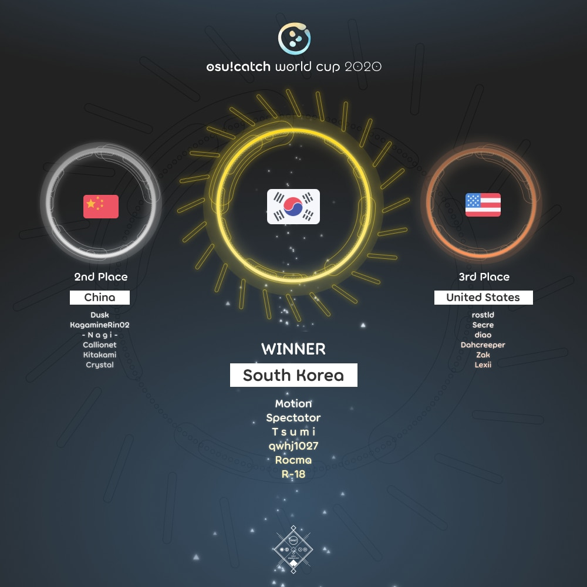

---
tags:
  - CWC
  - CWC2020
---

# osu!catch World Cup 2020

The **osu!catch World Cup 2020** (***CWC 2020***) was a country-based osu!catch tournament hosted by the [osu! team](/wiki/People/osu!_team). It was the ninth instalment of the osu!catch World Cup.

## Tournament schedule

| Event | Timestamp |
| --: | :-- |
| Registration phase | 2020-04-07/2020-04-21 |
| Live drawings | 2020-05-02 (14:00 UTC) |
| Group stage | 2020-05-09/2020-05-10 |
| Round of 16 | 2020-05-16/2020-05-17 |
| Quarterfinals | 2020-05-23/2020-05-24 |
| Semifinals | 2020-05-30/2020-05-31 |
| Finals week 1 | 2020-06-06/2020-06-07 |
| Finals week 2 | 2020-06-13/2020-06-14 |

## Prizes

| Placing | Prizes |
| :-: | :-- |
|  | $150 per team member, unique profile badge, *osu!catch Champion* user title for one year |
|  | $80 per team member, unique profile badge |
|  | $40 per team member, unique profile badge |

  

## Organisation

The osu!catch World Cup 2020 was run by the [osu! team](/wiki/People/osu!_team) and various community members.

| Position | Member(s) |
| :-- | :-- |
| Manager | ::{ flag=AR }:: [juankristal](https://osu.ppy.sh/users/443656), ::{ flag=CL }:: [WalterToro](https://osu.ppy.sh/users/5281416) |
| Mappool selector | ::{ flag=ES }:: [Deif](https://osu.ppy.sh/users/318565), ::{ flag=CN }:: [F D Flourite](https://osu.ppy.sh/users/2459589), ::{ flag=TN }:: [-Ken](https://osu.ppy.sh/users/4430811), ::{ flag=FR }:: [Rougoku](https://osu.ppy.sh/users/6900166) |
| Referee | ::{ flag=PL }:: [Benzopirene](https://osu.ppy.sh/users/1887068), ::{ flag=ES }:: [Deif](https://osu.ppy.sh/users/318565), ::{ flag=CH }:: [Icerite](https://osu.ppy.sh/users/7226287), ::{ flag=AU }:: [ill onion](https://osu.ppy.sh/users/8306102) ::{ flag=DE }:: [p3n](https://osu.ppy.sh/users/123703), ::{ flag=US }:: [tigereyes144](https://osu.ppy.sh/users/6499811), ::{ flag=CL }:: [WalterToro](https://osu.ppy.sh/users/5281416), ::{ flag=GB }:: [Yazzehh](https://osu.ppy.sh/users/7068973) |
| Commentator | ::{ flag=GB }:: [Bubbleman](https://osu.ppy.sh/users/5182050), ::{ flag=NO }:: [Divine Cake](https://osu.ppy.sh/users/3636998), ::{ flag=US }:: [Dohland](https://osu.ppy.sh/users/5220511), ::{ flag=US }:: [Elux](https://osu.ppy.sh/users/12004983), ::{ flag=US }:: [incandescence](https://osu.ppy.sh/users/6256027), ::{ flag=GB }:: [JBHyperion](https://osu.ppy.sh/users/4879508), ::{ flag=AU }:: [KWYJIBO](https://osu.ppy.sh/users/7178386), ::{ flag=GB }:: [NurseHyperion](https://osu.ppy.sh/users/4880672), ::{ flag=NL }:: [Sartan](https://osu.ppy.sh/users/4100941), ::{ flag=US }:: [Secre](https://osu.ppy.sh/users/2306637), ::{ flag=US }:: [Snowleopard](https://osu.ppy.sh/users/3790227), ::{ flag=US }:: [Zak](https://osu.ppy.sh/users/1375955) |
| Statistician | ::{ flag=DE }:: [Nwolf](https://osu.ppy.sh/users/1910766) |

## Links

- [Discussion thread](https://osu.ppy.sh/community/forums/topics/1046500)
- [Livestream](https://www.twitch.tv/osulive)
- [Challonge bracket](https://challonge.com/osuCWC2020)
- **[Statistics sheet](https://docs.google.com/spreadsheets/d/e/2PACX-1vRTbzcj8-X0SYDaJC8YLFYYYH7NSU2easZdKR4sZAkDTXn47rbCXJwnZhkmQ04Wa2bVLEYZShZ9EuuG/pubhtml)**

## Participants

|  | Country | Members |
| :-: | :-: | :-- |
| ::{ flag=AR }:: | **Argentina** | **[\[Force\]](https://osu.ppy.sh/users/1617217)**, [jerem1as](https://osu.ppy.sh/users/6117864), [Say](https://osu.ppy.sh/users/2572228), [SiberianBreaks](https://osu.ppy.sh/users/1170107), [VelperK](https://osu.ppy.sh/users/348467) |
| ::{ flag=AU }:: | **Australia** | **[chickennando](https://osu.ppy.sh/users/5818665)**, [ASecretBox](https://osu.ppy.sh/users/7341183), [Beerus](https://osu.ppy.sh/users/5529199), [die Eisdiele](https://osu.ppy.sh/users/7155262), [Jaye](https://osu.ppy.sh/users/4841352), [KWYJIBO](https://osu.ppy.sh/users/7178386) |
| ::{ flag=AT }:: | **Austria** | **[Daletto](https://osu.ppy.sh/users/7592136)**, [-FrozenCookie-](https://osu.ppy.sh/users/7429166), [Nipah](https://osu.ppy.sh/users/7180810), [Pandadesu](https://osu.ppy.sh/users/2167069), [Scrollum](https://osu.ppy.sh/users/10415976) |
| ::{ flag=BE }:: | **Belgium** | **[Quinten323](https://osu.ppy.sh/users/6283136)**, [\[ Seraf \]](https://osu.ppy.sh/users/6376151), [\[-Kofu-\]](https://osu.ppy.sh/users/10742890), [Belgian\_Hero](https://osu.ppy.sh/users/2344040), [countspetchula](https://osu.ppy.sh/users/7578195), [Zhiend](https://osu.ppy.sh/users/7474404) |
| ::{ flag=BR }:: | **Brazil** | **[Hanik](https://osu.ppy.sh/users/4533507)**, [ExNando](https://osu.ppy.sh/users/5960935), [Michael Jordan](https://osu.ppy.sh/users/4099041), [-Overdose-](https://osu.ppy.sh/users/7749445), [Predominador](https://osu.ppy.sh/users/4568537), [ThanaR](https://osu.ppy.sh/users/3834323) |
| ::{ flag=CA }:: | **Canada** | **[Zerkarian](https://osu.ppy.sh/users/3616480)**, [\_wwwww](https://osu.ppy.sh/users/4820793), [Henrick](https://osu.ppy.sh/users/8840982), [fuhie](https://osu.ppy.sh/users/7620002), [Shizuku](https://osu.ppy.sh/users/8623922), [Yoshi\_green](https://osu.ppy.sh/users/1035891) |
| ::{ flag=CL }:: | **Chile** | **[lineqtxz](https://osu.ppy.sh/users/989542)**, [Aryssiel](https://osu.ppy.sh/users/2389481), [eldnl](https://osu.ppy.sh/users/285756), [lechuguin](https://osu.ppy.sh/users/2872000), [NachoL](https://osu.ppy.sh/users/1250096), [XisK](https://osu.ppy.sh/users/3835436) |
| ::{ flag=CN }:: | **China** | **[Dusk](https://osu.ppy.sh/users/533210)**, [- N a g i -](https://osu.ppy.sh/users/2956936), [Callionet](https://osu.ppy.sh/users/3072921), [Crystal](https://osu.ppy.sh/users/1646397), [KagamineRin02](https://osu.ppy.sh/users/518503), [Kitakami](https://osu.ppy.sh/users/6347308) |
| ::{ flag=CO }:: | **Colombia** | **[Titan-](https://osu.ppy.sh/users/7855767)**, [Deley-](https://osu.ppy.sh/users/8291465), [HelpMePleasee](https://osu.ppy.sh/users/10835397), [-The Gosu-](https://osu.ppy.sh/users/7971842), [Umi Sonoda-](https://osu.ppy.sh/users/8579779), [Zyonii](https://osu.ppy.sh/users/9519851) |
| ::{ flag=DK }:: | **Denmark** | **[SharpN](https://osu.ppy.sh/users/4382076)**, [Captain](https://osu.ppy.sh/users/2563435), [kaare12356](https://osu.ppy.sh/users/4434640), [Only1Magma](https://osu.ppy.sh/users/3922957), [SchnitzelBae](https://osu.ppy.sh/users/11253135), [Waffe latte](https://osu.ppy.sh/users/9699561) |
| ::{ flag=FI }:: | **Finland** | **[Kurtsi](https://osu.ppy.sh/users/4222176)**, [forgottentaco](https://osu.ppy.sh/users/6109660), [JonZkuu](https://osu.ppy.sh/users/12740132), [Nikolai](https://osu.ppy.sh/users/5302804), [noksu15](https://osu.ppy.sh/users/10161144) |
| ::{ flag=FR }:: | **France** | **[AAAAAAAAAAAAHHH](https://osu.ppy.sh/users/4864877)**, [Boros](https://osu.ppy.sh/users/5490623), [Electr0o](https://osu.ppy.sh/users/9484428), [Holloh](https://osu.ppy.sh/users/7612994), [Noulayfe](https://osu.ppy.sh/users/4316542), [Shyeart](https://osu.ppy.sh/users/2022144) |
| ::{ flag=DE }:: | **Germany** | **[Vinci007](https://osu.ppy.sh/users/5030297)**, [Marvmallow](https://osu.ppy.sh/users/8403032), [Inryoku](https://osu.ppy.sh/users/6562920), [Inryuka](https://osu.ppy.sh/users/11635773), [Lume](https://osu.ppy.sh/users/4691991), [Yoomara](https://osu.ppy.sh/users/3123719) |
| ::{ flag=HK }:: | **Hong Kong** | **[autofanboy](https://osu.ppy.sh/users/636114)**, [AutoLs](https://osu.ppy.sh/users/9155988), [CheungB](https://osu.ppy.sh/users/788406), [Latifah-sama](https://osu.ppy.sh/users/1226238), [littlepiggod](https://osu.ppy.sh/users/12331683), [SakaNaz](https://osu.ppy.sh/users/1784164) |
| ::{ flag=ID }:: | **Indonesia** | **[LeWind](https://osu.ppy.sh/users/9718235)**, [Chroneko](https://osu.ppy.sh/users/5472877), [dika312](https://osu.ppy.sh/users/741613), [Funtastic](https://osu.ppy.sh/users/3555626), [Galaxi](https://osu.ppy.sh/users/2552435), [Toka](https://osu.ppy.sh/users/1595221) |
| ::{ flag=IT }:: | **Italy** | **[Karym](https://osu.ppy.sh/users/5220794)**, [119410501](https://osu.ppy.sh/users/803484), [ArMa79](https://osu.ppy.sh/users/4982799), [Spinacina](https://osu.ppy.sh/users/4277070), [Trollingor](https://osu.ppy.sh/users/4144266), [Vitoooo](https://osu.ppy.sh/users/4039895) |
| ::{ flag=JP }:: | **Japan** | **[noraRcat](https://osu.ppy.sh/users/883939)**, [ekr](https://osu.ppy.sh/users/4497706), [hiroshiki24](https://osu.ppy.sh/users/2667256), [kusakabe001](https://osu.ppy.sh/users/129806), [Moja](https://osu.ppy.sh/users/3164010), [-Rindou-](https://osu.ppy.sh/users/7941971) |
| ::{ flag=MY }:: | **Malaysia** | **[Future\_miku95](https://osu.ppy.sh/users/2351567)**, [davidbeh\_97](https://osu.ppy.sh/users/4101818), [Green Ghost](https://osu.ppy.sh/users/10826368), [Kagari](https://osu.ppy.sh/users/3366264), [murutattack](https://osu.ppy.sh/users/4480237), [walaowey](https://osu.ppy.sh/users/1475828) |
| ::{ flag=MX }:: | **Mexico** | **[daxeroz](https://osu.ppy.sh/users/1170156)**, [Astrea](https://osu.ppy.sh/users/3845678), [Cxlucha](https://osu.ppy.sh/users/5063961), [Firu](https://osu.ppy.sh/users/10516547), [Kashou](https://osu.ppy.sh/users/4046640), [Ponchiwi](https://osu.ppy.sh/users/1089040) |
| ::{ flag=NL }:: | **Netherlands** | **[Sartan](https://osu.ppy.sh/users/4100941)**, [b-a-d-s123](https://osu.ppy.sh/users/3656717), [Chatie](https://osu.ppy.sh/users/6524765), [KevKjef](https://osu.ppy.sh/users/9114235), [MasterForcer](https://osu.ppy.sh/users/3263646), [Wesley](https://osu.ppy.sh/users/2407265) |
| ::{ flag=NO }:: | **Norway** | **[Cameragod](https://osu.ppy.sh/users/4974088)**, [1794766](https://osu.ppy.sh/users/1794766), [Mile](https://osu.ppy.sh/users/2760954), [salchow](https://osu.ppy.sh/users/9738159), [Vanilla-](https://osu.ppy.sh/users/3400701), [Zazick](https://osu.ppy.sh/users/2569786) |
| ::{ flag=PH }:: | **Philippines** | **[Roido](https://osu.ppy.sh/users/6829103)**, [- Kielzu -](https://osu.ppy.sh/users/6221114), [Bunnrei](https://osu.ppy.sh/users/829284), [Crowley](https://osu.ppy.sh/users/6341006), [KagamineRin](https://osu.ppy.sh/users/1626093), [-MomoX](https://osu.ppy.sh/users/2150415) |
| ::{ flag=PL }:: | **Poland** | **[BoberOfDarkness](https://osu.ppy.sh/users/3427748)**, [Jakkubon](https://osu.ppy.sh/users/3396013), [Kosmit](https://osu.ppy.sh/users/1749173), [LechuCzechu88](https://osu.ppy.sh/users/5251714), [Phob](https://osu.ppy.sh/users/6069462), [Verti](https://osu.ppy.sh/users/10674528) |
| ::{ flag=RU }:: | **Russian Federation** | **[Nelly](https://osu.ppy.sh/users/4741164)**, [aoe](https://osu.ppy.sh/users/6094216), [Callixtro](https://osu.ppy.sh/users/8673833), [Imai Lisa](https://osu.ppy.sh/users/6689101), [KitsunIvy](https://osu.ppy.sh/users/7055384), [Uncareful](https://osu.ppy.sh/users/8928855) |
| ::{ flag=SA }:: | **Saudi Arabia** | **[RAMPAGE88](https://osu.ppy.sh/users/448547)**, [MooN4000](https://osu.ppy.sh/users/5308080), [Re1ax7](https://osu.ppy.sh/users/7162114) |
| ::{ flag=SG }:: | **Singapore** | **[He Ang CTB](https://osu.ppy.sh/users/2451381)**, [\[Eun\]](https://osu.ppy.sh/users/3788536), [awdse22](https://osu.ppy.sh/users/8743513), [lovemathboy](https://osu.ppy.sh/users/4220829), [Setsuen](https://osu.ppy.sh/users/2673742), [Sinnoh](https://osu.ppy.sh/users/4236057) |
| ::{ flag=KR }:: | **South Korea** | **[Motion](https://osu.ppy.sh/users/3885626)**, [qwhj1027](https://osu.ppy.sh/users/7547506), [R-18](https://osu.ppy.sh/users/4637369), [Rocma](https://osu.ppy.sh/users/566276), [Spectator](https://osu.ppy.sh/users/702598), [T s u m i](https://osu.ppy.sh/users/4080520) |
| ::{ flag=SE }:: | **Sweden** | **[Aceon](https://osu.ppy.sh/users/4452911)**, [\[ M e a k u \]](https://osu.ppy.sh/users/2747072), [DataPata](https://osu.ppy.sh/users/985360), [Setomi](https://osu.ppy.sh/users/2205929), [Yukiteru Amano](https://osu.ppy.sh/users/1894511), [zapdatt](https://osu.ppy.sh/users/6151127) |
| ::{ flag=TW }:: | **Taiwan** | **[Beepu](https://osu.ppy.sh/users/4958376)**, [EternityMoon](https://osu.ppy.sh/users/1957752), [Megpoid](https://osu.ppy.sh/users/158240), [My Angel Ayachi](https://osu.ppy.sh/users/2145160), [Nikaido Shinku](https://osu.ppy.sh/users/2455926), [Sanami](https://osu.ppy.sh/users/1629471) |
| ::{ flag=GB }:: | **United Kingdom** | **[Withered Lotus](https://osu.ppy.sh/users/3546931)**, [Baron](https://osu.ppy.sh/users/10286499), [JBHyperion](https://osu.ppy.sh/users/4879508), [Litlas](https://osu.ppy.sh/users/5126518), [Matt\_H](https://osu.ppy.sh/users/4067115), [Sorcerer](https://osu.ppy.sh/users/1913190) |
| ::{ flag=US }:: | **United States** | **[rostld](https://osu.ppy.sh/users/4365562)**, [Dahcreeper](https://osu.ppy.sh/users/6926006), [diao](https://osu.ppy.sh/users/500696), [Lexii](https://osu.ppy.sh/users/7226149), [Secre](https://osu.ppy.sh/users/2306637), [Zak](https://osu.ppy.sh/users/1375955) |
| ::{ flag=VN }:: | **Vietnam** | **[Close](https://osu.ppy.sh/users/4744615)**, [-\[SLs\]-Horikita](https://osu.ppy.sh/users/8738261), [Huytimeclock](https://osu.ppy.sh/users/10920086), [Marota](https://osu.ppy.sh/users/10278890), [mothernature](https://osu.ppy.sh/users/6403418), [NamSPro](https://osu.ppy.sh/users/11387006) |

## Podium

## Mappools

### Finals week 2

- NoMod
  1. [Kaneko Chiharu - WHITEOUT (Razor Sharp) \[VIVID\]](https://osu.ppy.sh/beatmapsets/1161795#fruits/2423719)
  2. [Blacklolita - Praeteritum (Hareimu) \[Bygone in Time\]](https://osu.ppy.sh/beatmapsets/621968#fruits/1311358)
  3. [t+pazolite vs. P\*Light - IZANA (Bunnrei) \[Future\]](https://osu.ppy.sh/beatmapsets/1175068#fruits/2450964)
  4. [Masa - Kitsune no Yomeiri (Minky) \[Dont eat me\]](https://osu.ppy.sh/beatmapsets/157073#fruits/384661)
  5. [Camellia feat. Nanahira - NANI THE FUCK!! (Mir) \[???????\]](https://osu.ppy.sh/beatmapsets/1021743#fruits/2137778)
  6. [umu. - humanly (Half) \[humanly\]](https://osu.ppy.sh/beatmapsets/977552#fruits/2045979)
- Hidden
  1. [ZUN - Kobito of the Shining Needle ~ Little Princess (Yumeno Himiko) \[exam's Rain\]](https://osu.ppy.sh/beatmapsets/801435#fruits/1682267)
  2. [cybermiso - Panopticon (Sinnoh) \[ReMaster\]](https://osu.ppy.sh/beatmapsets/1012865#fruits/2120069)
  3. [Susumu Hirasawa - Bandiria Travellers (jesse1412) \[Insane\]](https://osu.ppy.sh/beatmapsets/51391#fruits/157582)
- HardRock
  1. [UNDEAD CORPORATION - Embraced by the Flame (Daletto) \[Daletto & Du5t's Rekindling of Dead Ashes\]](https://osu.ppy.sh/beatmapsets/1179938#fruits/2460431)
  2. [Lite Show Magic - TRICKL4SH 220 (Minato Yukina) \[HEAVENLY\]](https://osu.ppy.sh/beatmapsets/616487#fruits/1300167)
  3. [BEMANI Sound Team "Nekomata Master" - The last of world music (Heilia) \[\#2: J1's Extra\]](https://osu.ppy.sh/beatmapsets/1060239#fruits/2219979)
- DoubleTime
  1. [THE ORAL CIGARETTES - Tonari Au (Crowley) \[A rainy rendezvous where my feelings reside.\]](https://osu.ppy.sh/beatmapsets/1172087#fruits/2444687)
  2. [Memme - Blessing Snow (Ascendance) \[Nelly's Overdose\]](https://osu.ppy.sh/beatmapsets/887087#fruits/1857286)
  3. [Diana Boncheva - Purple Passion (lkx_Shore) \[Extra\]](https://osu.ppy.sh/beatmapsets/102763#fruits/271303)
- Tiebreaker
  1. **[Camellia - Exit This Earth's Atomosphere (Camellia's ''PLANETARY//200STEP'' Remix) (Ascendance) \[Extraplanetary Collab Overdose\]](https://osu.ppy.sh/beatmapsets/840346#fruits/1759007)**

### Finals week 1

- NoMod
  1. [LOLI RIPE - All I wanna do is touch your power points (Sorcerer) \[Power Points\]](https://osu.ppy.sh/beatmapsets/564254#fruits/1192957)
  2. [Imperial Circus Dead Decadence - FUBUKI (Emiru) \[Glacial Cloudburst\]](https://osu.ppy.sh/beatmapsets/1166686#fruits/2433488)
  3. [Zekk - Fluctuation (Jemzuu) \[Deviation\]](https://osu.ppy.sh/beatmapsets/1148215#fruits/2397357)
  4. [jioyi attacked by mirror - I lost my flp (Spectator) \[new d\]](https://osu.ppy.sh/beatmapsets/1166709#fruits/2433531)
  5. [Getty vs. DJ DiA - Fox4-Raize- (Kaifin) \[Xilver's Extra\]](https://osu.ppy.sh/beatmapsets/482552#fruits/1038473)
  6. [Emiru no Aishita Tsukiyo ni Dai San Gensou Kyoku wo - ito (Lasse) \[Petal\]](https://osu.ppy.sh/beatmapsets/1077982#fruits/2255709)
- Hidden
  1. [Tanchiky - Hagoromo no Mai (Yumeno Himiko) \[Haru\]](https://osu.ppy.sh/beatmapsets/1100266#fruits/2298644)
  2. [MALVA. - Trane (dika312) \[Traurigkeit\]](https://osu.ppy.sh/beatmapsets/1010141#fruits/2114540)
  3. [Yunomi - Oedo Controller (feat. TORIENA) (Mentai) \[Impure's Extra\]](https://osu.ppy.sh/beatmapsets/759903#fruits/1674412)
- HardRock
  1. [nameless - Milk Crown on Sonnetica (Ascendance) \[A World of Lies\]](https://osu.ppy.sh/beatmapsets/738709#fruits/1558977)
  2. [RYO - Shuffle Heaven (Kyptoric) \[WOOOOAAAH\]](https://osu.ppy.sh/beatmapsets/1001876#fruits/2097201)
  3. [sokoninaru - Tenohira de odoru (Snepif) \[Extreme\]](https://osu.ppy.sh/beatmapsets/773686#fruits/1641323)
- DoubleTime
  1. [tamame - ebb and flow (tamame's 5 years after remix) (Yumeno Himiko) \[Lost Memories\]](https://osu.ppy.sh/beatmapsets/888934#fruits/1858064)
  2. [MY FIRST STORY - 2 FACE (Bastian) \[Rain\]](https://osu.ppy.sh/beatmapsets/1123002#fruits/2346751)
  3. [Liz Triangle - Messiah (Luscent) \[Desire\]](https://osu.ppy.sh/beatmapsets/1104025#fruits/2306846)
- Tiebreaker
  1. **[Noah - World's end - Millefolium (Hareimu) \[Catastrophic Finale\]](https://osu.ppy.sh/beatmapsets/895287#fruits/1870715)**

### Semifinals

- NoMod
  1. [PUP - DVP (Jemzuu) \[YUH\]](https://osu.ppy.sh/beatmapsets/1159828#fruits/2420076)
  2. [LeaF - Arianrhod (Deif) \[Overdose\]](https://osu.ppy.sh/beatmapsets/1160398#fruits/2421080)
  3. [Ayalis - Ai o Chikaishi Hime Kazari (Spectator) \[Deluge\]](https://osu.ppy.sh/beatmapsets/784412#fruits/1646939)
  4. [ASTERIA - The Shattered Time (F D Flourite) \[Lucid\]](https://osu.ppy.sh/beatmapsets/1177413#fruits/2461056)
  5. [SOOOO - iiillluuuvvvUUU (Cosmolade) \[Obsession\]](https://osu.ppy.sh/beatmapsets/959688#fruits/2009295)
  6. [Shinra-Bansho - Kyoukyou no Fortunate Polka (Yukiyo) \[A Dance of Esotericism and Vitalism\]](https://osu.ppy.sh/beatmapsets/904962#fruits/1888862)
- Hidden
  1. [LSKR - Off Brand (Crowley) \[Tell me how you feel\]](https://osu.ppy.sh/beatmapsets/1155728#fruits/2411782)
  2. [HujuniseikouyuuP - Talent Shredder (Spectator) \[2012\]](https://osu.ppy.sh/beatmapsets/572752#fruits/1213515)
  3. [Ampzer - Lotus (-PC) \[Extra\]](https://osu.ppy.sh/beatmapsets/745475#fruits/1571592)
- HardRock
  1. [Memme - BSPower Explosion (Lacrima) \[Overdose\]](https://osu.ppy.sh/beatmapsets/1117572#fruits/2334524)
  2. [sakuzyo - Magical Musical Master (Rocma) \[Deluge\]](https://osu.ppy.sh/beatmapsets/1097927#fruits/2294025)
  3. [Tokisawa Nao - BRYNHILDR IN THE DARKNESS(tamame's bootleg edit) (ShiraKai) \[ABYSS\]](https://osu.ppy.sh/beatmapsets/248206#fruits/571028)
- DoubleTime
  1. [LukHash - WTF? (wonjae) \[Hyperion's Rain\]](https://osu.ppy.sh/beatmapsets/1031588#fruits/2158590)
  2. [senya - Zetsubou no Fuchi (Ascendance) \[Nelly's Rain\]](https://osu.ppy.sh/beatmapsets/762829#fruits/1871749)
  3. [BUTAOTOME - Towa no Maigo (Icekalt) \[It was all a dream\]](https://osu.ppy.sh/beatmapsets/1069288#fruits/2238398)
- Tiebreaker
  1. **[Raccoon Factory - Hyperion (JBHyperion) \[Armageddon\]](https://osu.ppy.sh/beatmapsets/1110955#fruits/2321247)**

### Quarterfinals

- NoMod
  1. [Asking Alexandria - Closure (Sanyi) \[Du5t's Shutdown\]](https://osu.ppy.sh/beatmapsets/1064368#fruits/2228490)
  2. [Nekomata Master - Izanami no Nageki (Syamu) \[Revenge\]](https://osu.ppy.sh/beatmapsets/1155480#fruits/2411326)
  3. [sakuraburst - anticrystal (WildOne94) \[Team Philippines' Overdose\]](https://osu.ppy.sh/beatmapsets/1062804#fruits/2234731)
  4. [HyuN feat. JeeE - Fallen Angel (alienflybot) \[Obsession\]](https://osu.ppy.sh/beatmapsets/1141049#fruits/2383406)
  5. [ginkiha - Borealis (Aka) \[Expert\]](https://osu.ppy.sh/beatmapsets/213068#fruits/504983)
  6. [Dictate - Treason (Realazy) \[The Senate\]](https://osu.ppy.sh/beatmapsets/848976#fruits/1775314)
- Hidden
  1. [meganeko - Nova (JBHyperion) \[Overdose\]](https://osu.ppy.sh/beatmapsets/1102115#fruits/2302405)
  2. [zts - goldenslaughterer (celerih) \[Deif's Rain\]](https://osu.ppy.sh/beatmapsets/1023721#fruits/2160302)
  3. [Kurahashi Yoeko - Tomodachi no Uta (tutuhaha) \[Tomodachi\]](https://osu.ppy.sh/beatmapsets/790979#fruits/1659553)
- HardRock
  1. [onumi - REGRET PART ONE (Sorcerer) \[OVERDOSE\]](https://osu.ppy.sh/beatmapsets/936545#fruits/1956467)
  2. [Grand Thaw - SOLROS (inst. ver) (Mafumafu) \[Overdose\]](https://osu.ppy.sh/beatmapsets/1021126#fruits/2140229)
  3. [FELT - The Sun and Moon (Sylvarus) \[More Than Words Can Say\]](https://osu.ppy.sh/beatmapsets/1036438#fruits/2167038)
- DoubleTime
  1. [Xiao Pan Pan & Xiao Feng Feng - Xue Mao Jiao (Dapuluous) \[Miaw\]](https://osu.ppy.sh/beatmapsets/1119839#fruits/2339709)
  2. [Dark PHOENiX - Shunshun Shugetsu (Yumeno Himiko) \[Rocma's Hard\]](https://osu.ppy.sh/beatmapsets/999233#fruits/2095033)
  3. [CLC - Pepe (Lilyanna) \[ooh cha!\]](https://osu.ppy.sh/beatmapsets/645032#fruits/1366918)
- Tiebreaker
  1. **[Halozy - Kikoku Doukoku Jigokuraku (Ascendance) \[Rocmascennrei's Hell Overdose\]](https://osu.ppy.sh/beatmapsets/1021356#fruits/2136990)**

### Round of 16

- NoMod
  1. [Streetlight Manifesto - Somewhere In The Between (Jemzuu) \[An Ode to Life\]](https://osu.ppy.sh/beatmapsets/1126647#fruits/2354012)
  2. [a_hisa - Alexithymia (Kyuare) \[Eternal\]](https://osu.ppy.sh/beatmapsets/511849#fruits/1087972)
  3. [Poppin'Party - Romeo to Cinderella (Xetopia) \[Forbidden Love\]](https://osu.ppy.sh/beatmapsets/841755#fruits/1761457)
  4. [Neru - Byoumei wa Ai Datta (Ellyu) \[Ken's Overdose\]](https://osu.ppy.sh/beatmapsets/684960#fruits/2203057)
  5. [Kanzaki Elza starring ReoNa - Dancer in the Discord (Kibbleru) \[Deca's Expert\]](https://osu.ppy.sh/beatmapsets/1109271#fruits/2322266)
  6. [Fractal Dreamers - Gardens Under A Spring Sky (\_Epreus) \[August's Extreme\]](https://osu.ppy.sh/beatmapsets/962862#fruits/2020735)
- Hidden
  1. [PUSHER - Feel U (Vincs) \[Overdose\]](https://osu.ppy.sh/beatmapsets/740666#fruits/1562529)
  2. [Song Riders - Be (-Luminate) \[Destiny\]](https://osu.ppy.sh/beatmapsets/1112691#fruits/2324634)
  3. [ONE OK ROCK - The Beginning (tutuhaha) \[AngelHoney\]](https://osu.ppy.sh/beatmapsets/68891#fruits/206280)
- HardRock
  1. [Serj Tankian - Sky Is Over (Hareimu) \[The Sun\]](https://osu.ppy.sh/beatmapsets/914791#fruits/1910610)
  2. [TeamGrimoire+Amaneko - croiX (HelloSCV) \[Spec's CTB Rain\]](https://osu.ppy.sh/beatmapsets/88692#fruits/274012)
  3. [Etherwood - Cast Away (Rohit6) \[Insane\]](https://osu.ppy.sh/beatmapsets/368466#fruits/807867)
- DoubleTime
  1. [ITO KASHITARO - Replica (Crowley) \[Platter\]](https://osu.ppy.sh/beatmapsets/962723#fruits/2015792)
  2. [LeaF - Wizdomiot (Jemzuu) \[Platter\]](https://osu.ppy.sh/beatmapsets/1128274#fruits/2359846)
  3. [Makino Yui - Synchronicity (F D Flourite) \[Princess\]](https://osu.ppy.sh/beatmapsets/185314#fruits/443129)
- Tiebreaker
  1. **[kors k feat.RIRE - Nirvana(Camellia's "BinaryHeaven" Remix) (Spectator) \[Overdrive\]](https://osu.ppy.sh/beatmapsets/694025#fruits/1468430)**

### Group stage

- NoMod
  1. [REDALiCE vs. MASAKI - BUCHiGiRE Berserker (Bunnrei) \[INSANE\]](https://osu.ppy.sh/beatmapsets/1074448#fruits/2249908)
  2. [Mili - Rightfully (JierYagtama) \[Rain\]](https://osu.ppy.sh/beatmapsets/869768#fruits/1824134)
  3. [Thaehan - Yuujou (Sinnoh) \[Rain\]](https://osu.ppy.sh/beatmapsets/921419#fruits/1924125)
  4. [KOTOKO - Koi Kou Enishi (-Luminate) \[Murasame\]](https://osu.ppy.sh/beatmapsets/1083785#fruits/2266607)
  5. [Hanatan - Tengaku (Rakuen) \[Crystal's Insane\]](https://osu.ppy.sh/beatmapsets/220785#fruits/566085)
  6. [Nakamura Meiko - Aka no Ha (Lily Bread) \[Extra\]](https://osu.ppy.sh/beatmapsets/506908#fruits/1106518)
- Hidden
  1. [Chopin - Etude Op. 25, No. 12 (meganeko Remix) (WildOne94) \[Rain\]](https://osu.ppy.sh/beatmapsets/1115500#fruits/2330399)
  2. [bbn - Identic Conflict (ZiRoX) \[Rain\]](https://osu.ppy.sh/beatmapsets/233268#fruits/541488)
  3. [Cranky - La fuite des jours (Milan-) \[Karen's Hard\]](https://osu.ppy.sh/beatmapsets/751932#fruits/1582990)
- HardRock
  1. [Loki - A New King Is Born (Spectator) \[Platter\]](https://osu.ppy.sh/beatmapsets/710706#fruits/1502453)
  2. [PSYQUI - Be There (GiGas) \[Platter\]](https://osu.ppy.sh/beatmapsets/800670#fruits/1711478)
  3. [Tsunku & Masami Yone - Kero Kero SAX (Sushi971) \[Insane\]](https://osu.ppy.sh/beatmapsets/12221#fruits/46083)
- DoubleTime
  1. [LukHash - SOCIAL PHOBIA (JBHyperion) \[PLATTER\]](https://osu.ppy.sh/beatmapsets/1040733#fruits/2177276)
  2. [DECO*27 - Psychogram feat. Hatsune Miku (Bunnrei) \[Platter\]](https://osu.ppy.sh/beatmapsets/1018110#fruits/2131139)
  3. [Yorushika - Amy (Ryuusei Aika) \[Six-mat Room, Oscar Wilde and You\]](https://osu.ppy.sh/beatmapsets/1048140#fruits/2190855)
- Tiebreaker
  1. **[Infected Mushroom - The Pretender (Seph) \[Crystal\]](https://osu.ppy.sh/beatmapsets/104516#fruits/304466)**

## Match results

### Finals week 2

Saturday, 13 June 2020:

| Team 1 |  |  | Team 2 | Match link |
| --: | :-: | :-: | :-- | :-- |
| **South Korea** ::{ flag=KR }:: | **7** | 2 | ::{ flag=US }:: United States | [#1](https://osu.ppy.sh/community/matches/62876042) |

Sunday, 14 June 2020:

| Team 1 |  |  | Team 2 | Match link |
| --: | :-: | :-: | :-- | :-- |
| China ::{ flag=CN }:: | 3 | **7** | ::{ flag=KR }:: **South Korea** | [#1](https://osu.ppy.sh/community/matches/62911921) |
| **South Korea** ::{ flag=KR }:: | **7** | 3 | ::{ flag=CN }:: China | [#1](https://osu.ppy.sh/community/matches/62914373) |

### Finals week 1

Saturday, 6 June 2020:

| Team 1 |  |  | Team 2 | Match link |
| --: | :-: | :-: | :-- | :-- |
| South Korea ::{ flag=KR }:: | 6 | **7** | ::{ flag=CN }:: **China** | [#1](https://osu.ppy.sh/community/matches/62577789) |
| **Italy** ::{ flag=IT }:: | **7** | 3 | ::{ flag=CL }:: Chile | [#1](https://osu.ppy.sh/community/matches/62589223) |

Sunday, 7 June 2020:

| Team 1 |  |  | Team 2 | Match link |
| --: | :-: | :-: | :-- | :-- |
| Hong Kong ::{ flag=HK }:: | 3 | **7** | ::{ flag=US }:: **United States** | [#1](https://osu.ppy.sh/community/matches/62608290) |
| Italy ::{ flag=IT }:: | 1 | **7** | ::{ flag=US }:: **United States** | [#1](https://osu.ppy.sh/community/matches/62633198) |

### Semifinals

Saturday, 30 May 2020:

| Team 1 |  |  | Team 2 | Match link |
| --: | :-: | :-: | :-- | :-- |
| **Mexico** ::{ flag=MX }:: | **7** | 3 | ::{ flag=TW }:: Taiwan | [#1](https://osu.ppy.sh/community/matches/62280400) |
| **China** ::{ flag=CN }:: | **7** | 2 | ::{ flag=HK }:: Hong Kong | [#1](https://osu.ppy.sh/community/matches/62292061) |
| **Indonesia** ::{ flag=ID }:: | **7** | 2 | ::{ flag=DE }:: Germany | [#1](https://osu.ppy.sh/community/matches/62296887) |
| **United States** ::{ flag=US }:: | **7** | 5 | ::{ flag=FR }:: France | [#1](https://osu.ppy.sh/community/matches/62301752) |
| Canada ::{ flag=CA }:: | 5 | **7** | ::{ flag=CL }:: **Chile** | [#1](https://osu.ppy.sh/community/matches/62313365) |

Sunday, 31 May 2020:

| Team 1 |  |  | Team 2 | Match link |
| --: | :-: | :-: | :-- | :-- |
| **Chile** ::{ flag=CL }:: | **7** | 3 | ::{ flag=MX }:: Mexico | [#1](https://osu.ppy.sh/community/matches/62320837) |
| **South Korea** ::{ flag=KR }:: | **7** | 0 | ::{ flag=IT }:: Italy | [#1](https://osu.ppy.sh/community/matches/62335764) |
| Indonesia ::{ flag=ID }:: | 2 | **7** | ::{ flag=US }:: **United States** | [#1](https://osu.ppy.sh/community/matches/62339554) |

### Quarterfinals

Saturday, 23 May 2020:

| Team 1 |  |  | Team 2 | Match link |
| --: | :-: | :-: | :-- | :-- |
| **Hong Kong** ::{ flag=HK }:: | **6** | 0 | ::{ flag=CA }:: Canada | [#1](https://osu.ppy.sh/community/matches/61990193) |
| **China** ::{ flag=CN }:: | **6** | 1 | ::{ flag=MX }:: Mexico | [#1](https://osu.ppy.sh/community/matches/61992237) |
| **Taiwan** ::{ flag=TW }:: | **6** | 1 | ::{ flag=PL }:: Poland | [#1](https://osu.ppy.sh/community/matches/62003271) |
| **Italy** ::{ flag=IT }:: | **6** | 5 | ::{ flag=ID }:: Indonesia | [#1](https://osu.ppy.sh/community/matches/62006076) |

Sunday, 24 May 2020:

| Team 1 |  |  | Team 2 | Match link |
| --: | :-: | :-: | :-- | :-- |
| **South Korea** ::{ flag=KR }:: | **6** | 2 | ::{ flag=US }:: United States | [#1](https://osu.ppy.sh/community/matches/62029639) |
| **Chile** ::{ flag=CL }:: | **6** | 3 | ::{ flag=PH }:: Philippines | [#1](https://osu.ppy.sh/community/matches/62031563) |
| **France** ::{ flag=FR }:: | **6** | 2 | ::{ flag=RU }:: Russian Federation | [#1](https://osu.ppy.sh/community/matches/62047345) |
| Belgium ::{ flag=BE }:: | 0 | **6** | ::{ flag=DE }:: **Germany** | [#1](https://osu.ppy.sh/community/matches/62052475) |

### Round of 16

Saturday, 16 May 2020:

| Team 1 |  |  | Team 2 | Match link |
| --: | :-: | :-: | :-- | :-- |
| Taiwan ::{ flag=TW }:: | 5 | **6** | ::{ flag=IT }:: **Italy** | [#1](https://osu.ppy.sh/community/matches/61733697) |
| France ::{ flag=FR }:: | 2 | **6** | ::{ flag=HK }:: **Hong Kong** | [#1](https://osu.ppy.sh/community/matches/61736295) |
| Germany ::{ flag=DE }:: | 2 | **6** | ::{ flag=MX }:: **Mexico** | [#1](https://osu.ppy.sh/community/matches/61747982) |

Sunday, 17 May 2020:

| Team 1 |  |  | Team 2 | Match link |
| --: | :-: | :-: | :-- | :-- |
| **South Korea** ::{ flag=KR }:: | **6** | 4 | ::{ flag=CL }:: Chile | [#1](https://osu.ppy.sh/community/matches/61762130) |
| Belgium ::{ flag=BE }:: | 0 | **6** | ::{ flag=CN }:: **China** | [#1](https://osu.ppy.sh/community/matches/61769779) |
| Poland ::{ flag=PL }:: | 4 | **6** | ::{ flag=ID }:: **Indonesia** | [#1](https://osu.ppy.sh/community/matches/61774152) |
| **United States** ::{ flag=US }:: | **6** | 5 | ::{ flag=PH }:: Philippines | [#1](https://osu.ppy.sh/community/matches/61776851) |
| Russian Federation ::{ flag=RU }:: | 3 | **6** | ::{ flag=CA }:: **Canada** | [#1](https://osu.ppy.sh/community/matches/61784119) |

### Group stage

Saturday, 9 May 2020:

| Team 1 |  |  | Team 2 | Match link |
| --: | :-: | :-: | :-- | :-- |
| Philippines ::{ flag=PH }:: | 3 | **5** | ::{ flag=HK }:: **Hong Kong** | [#1](https://osu.ppy.sh/community/matches/61445470) |
| **Taiwan** ::{ flag=TW }:: | **5** | 3 | ::{ flag=AU }:: Australia | [#1](https://osu.ppy.sh/community/matches/61445715) |
| **Japan** ::{ flag=JP }:: | **5** | 1 | ::{ flag=SG }:: Singapore | [#1](https://osu.ppy.sh/community/matches/61445635) |
| **Philippines** ::{ flag=PH }:: | **5** | 0 | ::{ flag=MY }:: Malaysia | [#1](https://osu.ppy.sh/community/matches/61447029) |
| **Germany** ::{ flag=DE }:: | **5** | 3 | ::{ flag=AU }:: Australia | [#1](https://osu.ppy.sh/community/matches/61447137) |
| **Indonesia** ::{ flag=ID }:: | **5** | 1 | ::{ flag=JP }:: Japan | [#1](https://osu.ppy.sh/community/matches/61447044) |
| **South Korea** ::{ flag=KR }:: | **5** | 0 | ::{ flag=GB }:: United Kingdom | [#1](https://osu.ppy.sh/community/matches/61448573) |
| **Philippines** ::{ flag=PH }:: | **5** | 3 | ::{ flag=FI }:: Finland | [#1](https://osu.ppy.sh/community/matches/61448782) |
| **Hong Kong** ::{ flag=HK }:: | **5** | 0 | ::{ flag=MY }:: Malaysia | [#1](https://osu.ppy.sh/community/matches/61448568) |
| **China** ::{ flag=CN }:: | **5** | 0 | ::{ flag=SG }:: Singapore | [#1](https://osu.ppy.sh/community/matches/61448518) |
| Netherlands ::{ flag=NL }:: | 2 | **5** | ::{ flag=RU }:: **Russian Federation** | [#1](https://osu.ppy.sh/community/matches/61450440) |
| **Vietnam** ::{ flag=VN }:: | **5** | 1 | ::{ flag=DK }:: Denmark | [#1](https://osu.ppy.sh/community/matches/61450368) |
| **Taiwan** ::{ flag=TW }:: | **5** | 1 | ::{ flag=AR }:: Argentina | [#1](https://osu.ppy.sh/community/matches/61450389) |
| **Poland** ::{ flag=PL }:: | **5** | 0 | ::{ flag=BE }:: Belgium | [#1](https://osu.ppy.sh/community/matches/61452592) |
| **Italy** ::{ flag=IT }:: | **5** | 0 | ::{ flag=SE }:: Sweden | [#1](https://osu.ppy.sh/community/matches/61452574) |
| **United States** ::{ flag=US }:: | **5** | 0 | ::{ flag=VN }:: Vietnam | [#1](https://osu.ppy.sh/community/matches/61452446) |
| **Chile** ::{ flag=CL }:: | **5** | 2 | ::{ flag=BR }:: Brazil | [#1](https://osu.ppy.sh/community/matches/61459190) |
| Austria ::{ flag=AT }:: | 2 | **5** | ::{ flag=CO }:: **Colombia** | [#1](https://osu.ppy.sh/community/matches/61459775) |
| **Germany** ::{ flag=DE }:: | **5** | 0 | ::{ flag=AR }:: Argentina | [#1](https://osu.ppy.sh/community/matches/61459263) |
| Italy ::{ flag=IT }:: | 4 | **5** | ::{ flag=MX }:: **Mexico** | [#1](https://osu.ppy.sh/community/matches/61461681) |
| **Canada** ::{ flag=CA }:: | **5** | 3 | ::{ flag=SA }:: Saudi Arabia | [#1](https://osu.ppy.sh/community/matches/61461568) |
| **Netherlands** ::{ flag=NL }:: | **5** | 2 | ::{ flag=GB }:: United Kingdom | [#1](https://osu.ppy.sh/community/matches/61461300) |
| Colombia ::{ flag=CO }:: | 2 | **5** | ::{ flag=BE }:: **Belgium** | [#1](https://osu.ppy.sh/community/matches/61463792) |
| Sweden ::{ flag=SE }:: | 0 | **5** | ::{ flag=NO }:: **Norway** | [#1](https://osu.ppy.sh/community/matches/61463588) |
| **Canada** ::{ flag=CA }:: | **5** | 2 | ::{ flag=BR }:: Brazil | [#1](https://osu.ppy.sh/community/matches/61470397) |
| Chile ::{ flag=CL }:: | 1 | **5** | ::{ flag=CA }:: **Canada** | [#1](https://osu.ppy.sh/community/matches/61472268) |

Sunday, 10 May 2020:

| Team 1 |  |  | Team 2 | Match link |
| --: | :-: | :-: | :-- | :-- |
| **Australia** ::{ flag=AU }:: | **5** | 0 | ::{ flag=AR }:: Argentina | [#1](https://osu.ppy.sh/community/matches/61473806) |
| **South Korea** ::{ flag=KR }:: | **5** | 1 | ::{ flag=RU }:: Russian Federation | [#1](https://osu.ppy.sh/community/matches/61483202) |
| Indonesia ::{ flag=ID }:: | 3 | **5** | ::{ flag=SG }:: **Singapore** | [#1](https://osu.ppy.sh/community/matches/61485880) |
| **China** ::{ flag=CN }:: | **5** | 0 | ::{ flag=JP }:: Japan | [#1](https://osu.ppy.sh/community/matches/61486966) |
| **South Korea** ::{ flag=KR }:: | **5** | 0 | ::{ flag=NL }:: Netherlands | [#1](https://osu.ppy.sh/community/matches/61488105) |
| **China** ::{ flag=CN }:: | **5** | 1 | ::{ flag=ID }:: Indonesia | [#1](https://osu.ppy.sh/community/matches/61488113) |
| Germany ::{ flag=DE }:: | 4 | **5** | ::{ flag=TW }:: **Taiwan** | [#1](https://osu.ppy.sh/community/matches/61489451) |
| **Hong Kong** ::{ flag=HK }:: | **5** | 0 | ::{ flag=FI }:: Finland | [#1](https://osu.ppy.sh/community/matches/61489502) |
| **Finland** ::{ flag=FI }:: | **5** | 3 | ::{ flag=MY }:: Malaysia | [#1](https://osu.ppy.sh/community/matches/61491235) |
| **France** ::{ flag=FR }:: | **5** | 0 | ::{ flag=VN }:: Vietnam | [#1](https://osu.ppy.sh/community/matches/61491201) |
| Russian Federation ::{ flag=RU }:: | 4 | **5** | ::{ flag=GB }:: **United Kingdom** | [#1](https://osu.ppy.sh/community/matches/61491186) |
| **France** ::{ flag=FR }:: | **5** | 0 | ::{ flag=DK }:: Denmark | [#1](https://osu.ppy.sh/community/matches/61493261) |
| Austria ::{ flag=AT }:: | 0 | **5** | ::{ flag=PL }:: **Poland** | [#1](https://osu.ppy.sh/community/matches/61494967) |
| **Italy** ::{ flag=IT }:: | **5** | 2 | ::{ flag=NO }:: Norway | [#1](https://osu.ppy.sh/community/matches/61495099) |
| **United States** ::{ flag=US }:: | **5** | 0 | ::{ flag=DK }:: Denmark | [#1](https://osu.ppy.sh/community/matches/61495046) |
| **Mexico** ::{ flag=MX }:: | **5** | 0 | ::{ flag=NO }:: Norway | [#1](https://osu.ppy.sh/community/matches/61497035) |
| Austria ::{ flag=AT }:: | 3 | **5** | ::{ flag=BE }:: **Belgium** | [#1](https://osu.ppy.sh/community/matches/61496927) |
| **Poland** ::{ flag=PL }:: | **5** | 1 | ::{ flag=CO }:: Colombia | [#1](https://osu.ppy.sh/community/matches/61498941) |
| **Mexico** ::{ flag=MX }:: | **5** | 0 | ::{ flag=SE }:: Sweden | [#1](https://osu.ppy.sh/community/matches/61498897) |
| **Chile** ::{ flag=CL }:: | **5** | 0 | ::{ flag=SA }:: Saudi Arabia | [#1](https://osu.ppy.sh/community/matches/61498871) |
| **United States** ::{ flag=US }:: | **5** | 0 | ::{ flag=FR }:: France | [#1](https://osu.ppy.sh/community/matches/61498880) |
| **Brazil** ::{ flag=BR }:: | **5** | 3 | ::{ flag=SA }:: Saudi Arabia | [#1](https://osu.ppy.sh/community/matches/61501321) |

## Ruleset

### Tournament rules

1. The osu!catch World Cup is a country-based team tournament, played on the osu!catch game mode.
   - While this competition is planned as a 3 versus 3 setup, this might change depending on the amount of incoming registrations.
2. Map scoring will use Score V2.
3. The maps for each round will be announced by the mapset selectors in advance on the Sunday before the actual matches take place. Only these will be used during the respective matches.
   - There will be a NoMod, [Hidden](/wiki/Gameplay/Game_modifier/Hidden), [HardRock](/wiki/Gameplay/Game_modifier/Hard_Rock) and [DoubleTime](/wiki/Gameplay/Game_modifier/Double_Time) bracket.
   - One map will be given as a tiebreaker map. This map will only be played in case of a tie at match point.
4. Match schedule will be settled by the Tournament Management (see below).
5. If no staff or referee is available, the match will be postponed.
6. Failed players' scores do not get added to the team score.
   - Reviving and surviving during a map is considered as passing it.
7. Use of the Visual Settings to alter background dim or disable map elements like storyboards and skins are allowed.
8. If the beatmap ends in a draw, the game will be nullified.
9. If a player disconnects, they get treated as if they failed the map.
   - Disconnects within 30 seconds after map begin can be rematched. This is up to the referee's discretion. The played beatmap might be aborted for this.
10. Beatmaps cannot be reused in the same match unless the game was nullified.
11. If less than the minimum required players attend, the maximum time the match can be postponed is 10 minutes. A 'Win by default' will be declared if there isn't enough players after this deadline.
12. Exchanging players during a match is allowed without limitations.
13. Lag is not a valid reason to nullify a beatmap.
14. All players are supposed to keep the match running fluent and without delays. Excessive match delays coming from the player's side can be issued with penalties.
15. If a player disconnects between the beatmaps and the team can not provide an exchange, the match can be delayed 10 minutes at maximum.
16. All players and referees must to be treated with respect. Instructions of the referees and tournament management is to be followed. Decisions labeled as final are not to be objected.
17. Disrupting the match by foul play, picking inappropriate warmup maps (see below), insulting and provoking other players or referees, delaying the match or other deliberate inappropriate misbehavior is strictly prohibited.
18. The multiplayer chatrooms underlie the [osu! community rules](/wiki/Rules). All chat rules apply to the multiplayer chatrooms.
    - Breaking the chat rules results in a silence. Silenced players can not participate at multiplayer matches and must be exchanged for the time being.
19. In Group stage, 'Win by default' will be considered as win by 5:0, +1.0 score difference ratio.
20. Unexpected incidences are handled by the tournament management. Referees may allow higher tolerance depending on the given circumstances. This is up to their discretion.
21. Penalties for violating the tournament rules can be:
    - Exclusion of specific players for one map
    - Exclusion of specific players for an entire match
    - Declaring the match as Lost by Default
    - Disqualification from the entire tournament
    - Disqualification from the current and future official tournaments until appealed
    - Any modification of these rules will be announced.

### Tournament registration

1. Every user interested in joining their country's team signs up individually.
   - Tournament Management will create a list of potential candidates for a country's team.
   - Tournament Management declares one candidate to the captain of the country's team, albeit temporarily.
   - The declared captain can form their team from the candidate list of their country.
2. To ensure valid and serious registrations, every registered user will be checked by the Tournament Management.
   - Every registered user will be assigned to their respective country's candidate list.
   - To be successfully accepted on the list, you have to ensure that your global osu!catch performance ranking is above 5000.
   - To be successfully accepted on the list, you have to ensure that you did not violate the [osu! community rules](/wiki/Rules) within the last 12 months.
3. All successfully formed teams will be published after the registration phase.
4. Only the 32 potentially strongest countries will participate. The potential strength of a country is determined by the online statistics of all valid candidates.
   - If the amount of registered countries is below 32, the number might be reduced to 24, 20 or 16. The aim is always to let as many countries participate as possible!
5. Mapset selectors may not participate as a player in this tournament.

### Stage instructions

1. In the first stage (Group Stage), the teams will be divided into 8 groups of 4 teams.
   - This may change depending on how many teams are accepted into the competition at the end.

2. All the teams from each group will face each other.

3. Rankings of each group are determined by sorting the results of each team's performance in the following priority:
   - Most matches won.
   - Have higher `{(the number of beatmaps won) - (the number of beatmaps defeated)}`.
   - Most beatmaps won.
   - **Winner of the match played previously between the tied teams.**
   - In the event of a triple tie:
     - Have higher `∑{(total score difference) / (maximum score)}`.
     - Winner of the rematch.

4. The top 2 teams of each group will move on to the Knock-Out Stages.
   - This may change with the actual Group Stage setup.

5. Following stages are Double Elimination Stages. This means that the winner moves to the next stage and the losing team gets moved to the Loser bracket.

6. Based on [this image](https://puu.sh/bUq5V/f1066103b0.png), the stages are split up into the following:

   | Stage | Match ID |
   | --: | :-- |
   | Round of 16 | A, B, C, D, E, F, G, H |
   | Quarterfinals | I, J, K, L & R, S, T, U |
   | Semifinals | M, N & V, W, X, Y, Z, AA |
   | Finals | O & AB, AC, AD |
   | Grand Finals | AE, P, Q |

#### Winning conditions

- In Group Stage, you need to win 5 maps to win a match (best of 9).
- In the Round of 16 and Quarterfinals, you need to win 6 maps to win a match (best of 11).
- In the Semifinals, Finals, and Grand Finals, you need to win 7 maps to win the match (best of 13).

### Match instructions

1. A referee will create a multiplayer room 15 minutes in advance. Players must gather during this period.
   - Room settings are osu!catch, Team-Vs., Win Condition: 'ScoreV2'. Room name must be "CWC 2020: (TeamRed) vs (TeamBlue)".
   - The team mentioned first in the room name must be the red team, the team mentioned second in the room name must be the blue team.
2. Each team is free to select up to one warm-up map. Using beatmaps with questionable content is prohibited. All maps must be osu!catch specific maps.
3. Each captain has to ban **one beatmap** to be selected from the pool. These beatmaps are not allowed to be picked by any team in the entire match.
4. Beatmap selection will alternate between each captain selecting a beatmap out of the map pool.
5. Each captain must use `!roll` once in `#multiplayer`.
   - The winner of the `!roll` starts picking the first beatmap of the match.
   - The loser of the `!roll` starts banning one beatmap, followed by the winner of the `!roll` to ban a beatmap.
6. Captains may pick freely from any bracket.
   - In case of a tie, the tiebreaker map must be played.
7. Teams will have 2 minutes to pick a beatmap and 2 minutes to get ready.
   - In case a team takes more than 2 minutes to pick a map, they will recieve a warning from the referee, on subsequent occurrences the referee will pick a random map available to pick from the mappool using `!roll X`, where X is the number of available maps to pick in the mappool.
   - Each team will receive a "tactical timeout" of **two minutes**, which can be used at any time during their team's pick, **once per match**. *The tactical timeout is optional, and is not required to be used*.
8. Results of the Group Stage will be published via a Statistics sheet.

### Mappool instructions

1. There will be 1 mappool for the Group Stage, 1 mappool for the Round of 16, 1 mappool for the Quarterfinals, 1 mappool for the Semifinals, 1 mappool for the Finals and 1 mappool for the Grand Finals.
2. Each mappool consists of 4 brackets: NoMod, [Hidden](/wiki/Gameplay/Game_modifier/Hidden), [HardRock](/wiki/Gameplay/Game_modifier/Hard_Rock) and [DoubleTime](/wiki/Gameplay/Game_modifier/Double_Time).
3. Each mappool consists of 16 maps in total.
4. Each mappool has one tiebreaker.
5. The NoMod bracket will be played with no mods activated.
6. The Hidden, HardRock and DoubleTime bracket will be played with the respective mods activated.
   - When playing a map from the HardRock or DoubleTime pool, Hidden can be used optionally by any player.
7. The tiebreaker will be played with no mods selected or with the Hidden mod.
8. There will be 6 maps in the NoMod bracket for all stages.
9. The size of the [Hidden](/wiki/Gameplay/Game_modifier/Hidden), [HardRock](/wiki/Gameplay/Game_modifier/Hard_Rock) and [DoubleTime](/wiki/Gameplay/Game_modifier/Double_Time) brackets will be 3 in all stages.

### Scheduling instructions

1. Each stage will be held on **a single weekend**.
2. Matches in Group Stage may overlap.
3. All Double Elimination Stages will be held on either Saturday or Sunday, UTC+0.
4. Scheduling will be handled by the Tournament Management. Schedules will be released on the Sunday before the first matches of the actual stage. Tournament Management will try to create the schedule to respect the participant's time zone.
   - In the stages Quarterfinals and higher: Please inform tournament management before Sunday, if you expect a specific time slot to be unavailable in the following week. Wishes are tried to be followed, alas no promises can be made.
5. **Reschedules will only be considered if both teams agree to a time, this needs to be done and notified to the tournament staff before Wednesday at 23:59 UTC+0 in that particular week when your match takes place.**
6. **Reschedules may only be requested by a team captain.**
   - **Do not ask for a reschedule unless it is absolutely needed. The tournament staff still has the right to decline the request.**
7. Captains are responsible for their teams availability. The greater team size exists to ensure every team can provide at least three players for each match. If teams can not provide three players for a match, the match will be considered forfeited.
