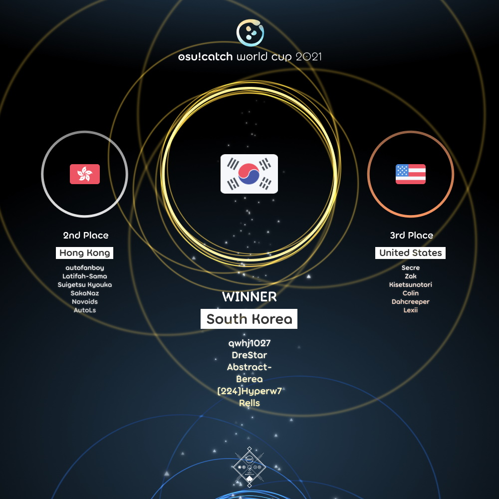

---
tags:
  - CWC
  - CWC2021
---

# osu!catch World Cup 2021

The **osu!catch World Cup 2021** (***CWC 2021***) was a country-based osu!catch tournament hosted by the [osu! team](/wiki/People/osu!_team). It was the tenth instalment of the osu!catch World Cup.

## Tournament schedule

| Event | Timestamp |
| --: | :-- |
| Registration phase | 2021-04-02/2021-04-15 |
| Live drawings | 2021-04-24 (14:00 UTC) |
| Group stage | 2021-05-01/2021-05-02 |
| Round of 16 | 2021-05-08/2021-05-09 |
| Quarterfinals | 2021-05-15/2021-05-16 |
| Semifinals | 2021-05-22/2021-05-23 |
| Finals | 2021-05-29/2021-05-30 |
| Grand Finals | 2021-06-05/2021-06-06 |

## Prizes

| Placing | Prizes |
| :-: | :-- |
|  | $150 per team member, unique profile badge, *osu!catch Champion* user title for one year |
|  | $80 per team member, unique profile badge |
|  | $40 per team member, unique profile badge |

  

## Organisation

The osu!catch World Cup 2021 was run by the [osu! team](/wiki/People/osu!_team) and various community members.

| Position | Member(s) |
| :-- | :-- |
| Manager | ::{ flag=CL }:: [WalterToro](https://osu.ppy.sh/users/5281416) |
| Mappool selector | ::{ flag=ES }:: [Deif](https://osu.ppy.sh/users/318565), ::{ flag=CN }:: [F D Flourite](https://osu.ppy.sh/users/2459589), ::{ flag=CL }:: [lineqtxz](https://osu.ppy.sh/users/989542), ::{ flag=US }:: [Snowless](https://osu.ppy.sh/users/4316266), ::{ flag=CA }:: [wwwww](https://osu.ppy.sh/users/8434466) |
| Commentator | ::{ flag=US }:: [Dohland](https://osu.ppy.sh/users/5220511), ::{ flag=US }:: [Elux](https://osu.ppy.sh/users/12004983), ::{ flag=GB }:: [JBHyperion](https://osu.ppy.sh/users/4879508), ::{ flag=AU }:: [KWYJIBO](https://osu.ppy.sh/users/7178386), ::{ flag=RU }:: [Nelly](https://osu.ppy.sh/users/4741164), ::{ flag=BE }:: [\[ Quinten \]](https://osu.ppy.sh/users/6283136), ::{ flag=NL }:: [Sartan](https://osu.ppy.sh/users/4100941), ::{ flag=US }:: [Secre](https://osu.ppy.sh/users/2306637), ::{ flag=US }:: [Snowleopard](https://osu.ppy.sh/users/3790227), ::{ flag=US }:: [Zak](https://osu.ppy.sh/users/1375955) |
| Referee | ::{ flag=ES }:: [Deif](https://osu.ppy.sh/users/318565), ::{ flag=AU }:: [Fairy Bread](https://osu.ppy.sh/users/8306102), ::{ flag=US }:: [JDrago14](https://osu.ppy.sh/users/7690078), ::{ flag=BR }:: [LeoFLT](https://osu.ppy.sh/users/3668779), ::{ flag=NL }:: [nik](https://osu.ppy.sh/users/10077264), ::{ flag=DE }:: [p3n](https://osu.ppy.sh/users/123703), ::{ flag=US }:: [tigereyes144](https://osu.ppy.sh/users/6499811), ::{ flag=CL }:: [WalterToro](https://osu.ppy.sh/users/5281416), ::{ flag=GB }:: [Yazzehh](https://osu.ppy.sh/users/7068973) |
| Statistician | ::{ flag=BR }:: [LeoFLT](https://osu.ppy.sh/users/3668779), ::{ flag=DE }:: [Nwolf](https://osu.ppy.sh/users/1910766) |

## Links

- [Discussion thread](https://osu.ppy.sh/community/forums/topics/1287741)
- [Livestream](https://www.twitch.tv/osulive)
- [Challonge bracket](https://challonge.com/CWC_2021)
- [Pick'ems page](https://pickem.hwc.hr/tournaments/58) hosted by ::{ flag=DE }:: [hallowatcher](https://osu.ppy.sh/users/1874761)
- **[Statistics sheet](https://docs.google.com/spreadsheets/d/e/2PACX-1vTEm0YFPgQl6kNW81aYoF00x3kdH_XFzbFnkZ2gtNUDMgHkWPhQ9VdOmzNGS5wji5uTdyNlDGsdq2JU/pubhtml)**

## Participants

|  | Country | Members |
| :-: | :-: | :-- |
| ::{ flag=AR }:: | **Argentina** | **[\[Force\]](https://osu.ppy.sh/users/1617217)**, [Karane](https://osu.ppy.sh/users/3093873), [DUKI MODODIABLO](https://osu.ppy.sh/users/5169874), [-Aletz-](https://osu.ppy.sh/users/6925410), [-Story-](https://osu.ppy.sh/users/8172283), [\[225\]Zeus](https://osu.ppy.sh/users/8329151) |
| ::{ flag=AU }:: | **Australia** | **[chickennando](https://osu.ppy.sh/users/5818665)**, [pandaBear](https://osu.ppy.sh/users/107553), [CrimsonPleaseee](https://osu.ppy.sh/users/3743985), [Poltergoose](https://osu.ppy.sh/users/4327130), [Beerus](https://osu.ppy.sh/users/5529199), [KWYJIBO](https://osu.ppy.sh/users/7178386) |
| ::{ flag=BE }:: | **Belgium** | **[\[ Quinten \]](https://osu.ppy.sh/users/6283136)**, [Belgian\_HDHeRo](https://osu.ppy.sh/users/2344040), [Cakenoob](https://osu.ppy.sh/users/6045522), [\[ Seraf \]](https://osu.ppy.sh/users/6376151), [\[ Bliend \]](https://osu.ppy.sh/users/7474404), [\[-Kofu-\]](https://osu.ppy.sh/users/10742890) |
| ::{ flag=BR }:: | **Brazil** | **[Hanik](https://osu.ppy.sh/users/4533507)**, [Taishi-](https://osu.ppy.sh/users/2349221), [Predominador](https://osu.ppy.sh/users/4568537), [Acooler](https://osu.ppy.sh/users/5235352), [ExNando](https://osu.ppy.sh/users/5960935), [Konohana Lucia](https://osu.ppy.sh/users/8642224) |
| ::{ flag=CA }:: | **Canada** | **[Zerkarian](https://osu.ppy.sh/users/3616480)**, [Yoshi\_green](https://osu.ppy.sh/users/1035891), [FastYoshi](https://osu.ppy.sh/users/4820793), [fuhie](https://osu.ppy.sh/users/7620002), [Henrick](https://osu.ppy.sh/users/8840982), [had](https://osu.ppy.sh/users/14571181) |
| ::{ flag=CL }:: | **Chile** | **[eldnl](https://osu.ppy.sh/users/285756)**, [watame goose XD](https://osu.ppy.sh/users/1011240), [Pekorrat](https://osu.ppy.sh/users/1250096), [CITY POP SHARK](https://osu.ppy.sh/users/2389481), [Lechu FAQ 35P](https://osu.ppy.sh/users/2872000), [OKAYU MOGU MOGU](https://osu.ppy.sh/users/3835436) |
| ::{ flag=CN }:: | **China** | **[Dusk](https://osu.ppy.sh/users/533210)**, [KagamineRin02](https://osu.ppy.sh/users/518503), [Crystal](https://osu.ppy.sh/users/1646397), [Coevir](https://osu.ppy.sh/users/3171965), [Cyanus](https://osu.ppy.sh/users/4624693), [Kitakami](https://osu.ppy.sh/users/6347308) |
| ::{ flag=CO }:: | **Colombia** | **[Hojaldre](https://osu.ppy.sh/users/2573707)**, [SauroN2707](https://osu.ppy.sh/users/12537441), [Juansy-](https://osu.ppy.sh/users/12588215), [KeviNL69](https://osu.ppy.sh/users/12588486) |
| ::{ flag=DK }:: | **Denmark** | **[SharpN](https://osu.ppy.sh/users/4382076)**, [Captain](https://osu.ppy.sh/users/2563435), [Kaare](https://osu.ppy.sh/users/4434640), [Waffe latte](https://osu.ppy.sh/users/9699561), [jonathancilius](https://osu.ppy.sh/users/11357207) |
| ::{ flag=FI }:: | **Finland** | **[-Kaguya](https://osu.ppy.sh/users/5351518)**, [Nikolai](https://osu.ppy.sh/users/5302804), [Bot\_Burger](https://osu.ppy.sh/users/6109660), [Leinou](https://osu.ppy.sh/users/7024526), [noksu15](https://osu.ppy.sh/users/10161144), [JonZkuu](https://osu.ppy.sh/users/12740132) |
| ::{ flag=FR }:: | **France** | **[Holloh](https://osu.ppy.sh/users/7612994)**, [Ttobas](https://osu.ppy.sh/users/2084568), [Noulayfe](https://osu.ppy.sh/users/4316542), [Boros](https://osu.ppy.sh/users/5490623), [Natsuko](https://osu.ppy.sh/users/8266817), [Electr0o](https://osu.ppy.sh/users/9484428) |
| ::{ flag=DE }:: | **Germany** | **[Vinci007](https://osu.ppy.sh/users/5030297)**, [NoteKuroi](https://osu.ppy.sh/users/186642), [Ginoshi](https://osu.ppy.sh/users/5398106), [Inryoku](https://osu.ppy.sh/users/6562920), [Marvmallow](https://osu.ppy.sh/users/8403032), [Inryuka](https://osu.ppy.sh/users/11635773) |
| ::{ flag=HK }:: | **Hong Kong** | **[autofanboy](https://osu.ppy.sh/users/636114)**, [Latifah-sama](https://osu.ppy.sh/users/1226238), [Suigetsu Kyouka](https://osu.ppy.sh/users/1311496), [SakaNaz](https://osu.ppy.sh/users/1784164), [Novoids](https://osu.ppy.sh/users/5163523), [AutoLs](https://osu.ppy.sh/users/9155988) |
| ::{ flag=ID }:: | **Indonesia** | **[Chroneko](https://osu.ppy.sh/users/5472877)**, [dika312](https://osu.ppy.sh/users/741613), [Madoka Ayukawa](https://osu.ppy.sh/users/1595221), [Netamaru](https://osu.ppy.sh/users/1830361), [Sololiquy](https://osu.ppy.sh/users/4350087), [LeWind](https://osu.ppy.sh/users/9718235) |
| ::{ flag=IT }:: | **Italy** | **[Camme79](https://osu.ppy.sh/users/5220794)**, [Vitoooo](https://osu.ppy.sh/users/4039895), [Trollingor](https://osu.ppy.sh/users/4144266), [ArMa79](https://osu.ppy.sh/users/4982799), [Sachalin](https://osu.ppy.sh/users/11158870), [SirWaffle22](https://osu.ppy.sh/users/11754842) |
| ::{ flag=JP }:: | **Japan** | **[Molqus](https://osu.ppy.sh/users/1927193)**, [Rire](https://osu.ppy.sh/users/1513301), [Melu](https://osu.ppy.sh/users/2624179), [noob desu](https://osu.ppy.sh/users/4808804), [Kokutan](https://osu.ppy.sh/users/5994353), [gfbgd1](https://osu.ppy.sh/users/6061811) |
| ::{ flag=MY }:: | **Malaysia** | **[Future\_miku95](https://osu.ppy.sh/users/2351567)**, [murutattack](https://osu.ppy.sh/users/4480237), [HyPerNekoChan](https://osu.ppy.sh/users/9626549), [Green Ghost](https://osu.ppy.sh/users/10826368), [AstralLoki](https://osu.ppy.sh/users/14100384), [\[Pichu\]](https://osu.ppy.sh/users/14281462) |
| ::{ flag=MX }:: | **Mexico** | **[daxeroz](https://osu.ppy.sh/users/1170156)**, [Cowboy](https://osu.ppy.sh/users/1237535), [NanahiraWhen](https://osu.ppy.sh/users/5063961), [ElPolloOficial](https://osu.ppy.sh/users/8353249), [Firu](https://osu.ppy.sh/users/10516547) |
| ::{ flag=NL }:: | **Netherlands** | **[Chatie](https://osu.ppy.sh/users/6524765)**, [Selo](https://osu.ppy.sh/users/3212806), [woodpamp](https://osu.ppy.sh/users/3809967), [Tonairu](https://osu.ppy.sh/users/4744367), [K 3 V R A L](https://osu.ppy.sh/users/9852829), [Dutchman](https://osu.ppy.sh/users/10552580) |
| ::{ flag=NO }:: | **Norway** | **[Mile](https://osu.ppy.sh/users/2760954)**, [Lanki](https://osu.ppy.sh/users/2535200), [Zazick](https://osu.ppy.sh/users/2569786), [Vanilla-](https://osu.ppy.sh/users/3400701), [CyCeph](https://osu.ppy.sh/users/4586304), [Cameragod](https://osu.ppy.sh/users/4974088) |
| ::{ flag=PE }:: | **Peru** | **[islux](https://osu.ppy.sh/users/5477873)**, [Didfus](https://osu.ppy.sh/users/2173232), [GZone](https://osu.ppy.sh/users/10696269), [-Takato-](https://osu.ppy.sh/users/10755079), [zidaneaaron](https://osu.ppy.sh/users/12708243) |
| ::{ flag=PH }:: | **Philippines** | **[Roido](https://osu.ppy.sh/users/6829103)**, [Bunnrei](https://osu.ppy.sh/users/829284), [KagamineRin](https://osu.ppy.sh/users/1626093), [- Kielzu -](https://osu.ppy.sh/users/6221114), [Crowley](https://osu.ppy.sh/users/6341006), [-Rustyy](https://osu.ppy.sh/users/16355636) |
| ::{ flag=PL }:: | **Poland** | **[BoberOfDarkness](https://osu.ppy.sh/users/3427748)**, [Kosmit](https://osu.ppy.sh/users/1749173), [Jakkubon](https://osu.ppy.sh/users/3396013), [LechuCzechu88](https://osu.ppy.sh/users/5251714), [Mniam](https://osu.ppy.sh/users/6050530), [Phob](https://osu.ppy.sh/users/6069462) |
| ::{ flag=RU }:: | **Russian Federation** | **[Nelly](https://osu.ppy.sh/users/4741164)**, [VagaNNN](https://osu.ppy.sh/users/1260040), [Memoriola](https://osu.ppy.sh/users/6856387), [KitsunIvy](https://osu.ppy.sh/users/7055384), [\_Insomnia](https://osu.ppy.sh/users/8928855), [cosilgam](https://osu.ppy.sh/users/15960747) |
| ::{ flag=SG }:: | **Singapore** | **[He Ang CTB](https://osu.ppy.sh/users/2451381)**, [Deaf Zone](https://osu.ppy.sh/users/1016926), [\[Eun\]](https://osu.ppy.sh/users/3788536), [lovemathboy](https://osu.ppy.sh/users/4220829), [yihao on osu](https://osu.ppy.sh/users/8387373) |
| ::{ flag=KR }:: | **South Korea** | **[qwhj1027](https://osu.ppy.sh/users/7547506)**, [DreStar](https://osu.ppy.sh/users/1808057), [Abstract-](https://osu.ppy.sh/users/3097304), [Berea](https://osu.ppy.sh/users/3657951), [\[224\]Hyperw7](https://osu.ppy.sh/users/4158549), [Rells](https://osu.ppy.sh/users/7937519) |
| ::{ flag=SE }:: | **Sweden** | **[Aceon](https://osu.ppy.sh/users/4452911)**, [DataPata](https://osu.ppy.sh/users/985360), [Yukiteru Amano](https://osu.ppy.sh/users/1894511), [EclipZ](https://osu.ppy.sh/users/4586549), [zapdatt](https://osu.ppy.sh/users/6151127) |
| ::{ flag=TW }:: | **Taiwan** | **[Beepu](https://osu.ppy.sh/users/4958376)**, [ZX123456](https://osu.ppy.sh/users/489271), [DoDoEbi](https://osu.ppy.sh/users/1177233), [Sanami](https://osu.ppy.sh/users/1629471), [EternityMoon](https://osu.ppy.sh/users/1957752), [XXXZ](https://osu.ppy.sh/users/2111624) |
| ::{ flag=TH }:: | **Thailand** | **[Azuria](https://osu.ppy.sh/users/16102533)**, [pattarachai\_12016](https://osu.ppy.sh/users/1465079), [-Blacky-](https://osu.ppy.sh/users/7551572), [Eito](https://osu.ppy.sh/users/10043310), [N3Marry](https://osu.ppy.sh/users/13222425), [- A i n a -](https://osu.ppy.sh/users/13451333) |
| ::{ flag=GB }:: | **United Kingdom** | **[Matt\_H](https://osu.ppy.sh/users/4067115)**, [Litlas](https://osu.ppy.sh/users/5126518), [Tomato](https://osu.ppy.sh/users/9239206), [Baron](https://osu.ppy.sh/users/10286499), [arwab](https://osu.ppy.sh/users/16496103) |
| ::{ flag=US }:: | **United States** | **[Secre](https://osu.ppy.sh/users/2306637)**, [Zak](https://osu.ppy.sh/users/1375955), [Kisetsunotori](https://osu.ppy.sh/users/3692648), [Colin](https://osu.ppy.sh/users/5502521), [Dahcreeper](https://osu.ppy.sh/users/6926006), [Lexii](https://osu.ppy.sh/users/7226149) |
| ::{ flag=VN }:: | **Vietnam** | **[Cac](https://osu.ppy.sh/users/4744615)**, [Hana Yukiko](https://osu.ppy.sh/users/4964095), [mothernature](https://osu.ppy.sh/users/6403418), [Stardust Prism](https://osu.ppy.sh/users/8525921), [-\[SLs\]-Horikita](https://osu.ppy.sh/users/8738261), [Huytimeclock](https://osu.ppy.sh/users/10920086) |

## Podium

## Mappools

### Grand Finals

- NoMod
  1. [Camellia - KillerBeast (Jemzuu) \[ULTRA BERZERK\]](https://osu.ppy.sh/beatmapsets/1478459#fruits/3033155)
  2. [Silentroom vs. Frums - Aegleseeker (Jemzuu) \[Razor's Beyond\]](https://osu.ppy.sh/beatmapsets/1460413#fruits/3024977)
  3. [Camellia feat. Camellia - Hirugaeru Tsubasa Oikakete (Rocma) \[MXM\]](https://osu.ppy.sh/beatmapsets/1478449#fruits/3033136)
  4. [Akiyama Uni - Rakujitsu ni Haeru Sakasajou (Yumeno Himiko) \[Rain\]](https://osu.ppy.sh/beatmapsets/1478454#fruits/3033148)
  5. [uma vs. Morimori Atsushi - Re:End of a Dream (Battle) \[Re:Vival\]](https://osu.ppy.sh/beatmapsets/557039#fruits/1178810)
  6. [Omoi - Teo (Kroytz) \[Motto!\]](https://osu.ppy.sh/beatmapsets/721804#fruits/1524103)
- Hidden
  1. [FictionJunction YUUKA - aikoi (F D Flourite) \[Prison (CWC ver.)\]](https://osu.ppy.sh/beatmapsets/1478465#fruits/3033162)
  2. [Luschka - Kami no Kotoba (Spectator) \[Sonorous\]](https://osu.ppy.sh/beatmapsets/1478471#fruits/3033170)
  3. [SYUNN - Megalara Garuda (Callionet) \[Intensity\]](https://osu.ppy.sh/beatmapsets/536607#fruits/1137172)
- HardRock
  1. [Kagetora. - Crazy banger (Zyzyx) \[FATAL\]](https://osu.ppy.sh/beatmapsets/1393941#fruits/2877477)
  2. [Zekk - Sugary Daydream (Du5t) \[oh yes... (cwc 2021 ver.)\]](https://osu.ppy.sh/beatmapsets/1478481#fruits/3033189)
  3. [Riz vs. Shiron - veRtrageS (EvilElvis) \[Extreme\]](https://osu.ppy.sh/beatmapsets/473148#fruits/1011030)
- DoubleTime
  1. [CyoucyoP feat.Hatsune Miku - End of the World (Rocma) \[Overdose\]](https://osu.ppy.sh/beatmapsets/1478476#fruits/3033178)
  2. [A.SAKA - Yosakura Fubuki (F D Flourite) \[Flourite & Himiko's ZHNotSteven\]](https://osu.ppy.sh/beatmapsets/1478483#fruits/3033192)
  3. [GARNiDELiA - ambiguous (captin1) \[Nathan's Insane\]](https://osu.ppy.sh/beatmapsets/303867#fruits/814991)
- Tiebreaker
  1. **[Frums - of Ambrosia (Jemzuu) \[of Heavenly Collab\]](https://osu.ppy.sh/beatmapsets/1478486#fruits/3033197)**

### Finals

- NoMod
  1. [Nakamura Meiko - Scarlet Faith (F D Flourite) \[Oath\]](https://osu.ppy.sh/beatmapsets/1471236#fruits/3020437)
  2. [t+pazolite - Third Time UNLucky (Deif) \[Charm\]](https://osu.ppy.sh/beatmapsets/1471237#fruits/3020439)
  3. [technoplanet - Inscape [Extended Mix] (Jemzuu) \[HEAVENLY\]](https://osu.ppy.sh/beatmapsets/1471669#fruits/3021155)
  4. [LeaF - Armageddon (Greaper) \[Meltdown\]](https://osu.ppy.sh/beatmapsets/1471245#fruits/3020449)
  5. [Giga feat. Reol - BRING IT ON (Yugu) \[HW's AnOther\]](https://osu.ppy.sh/beatmapsets/974362#fruits/2167873)
  6. [THE ORAL CIGARETTES - Kyouran Hey Kids!! (Sotarks) \[Agatsu's Extreme\]](https://osu.ppy.sh/beatmapsets/962050#fruits/2014387)
- Hidden
  1. [seatrus - MONONOKE (Deif) \[HIME\]](https://osu.ppy.sh/beatmapsets/1471249#fruits/3020457)
  2. [James Landino - Hide and Seek (Spectator) \[Deluge\]](https://osu.ppy.sh/beatmapsets/1471251#fruits/3020459)
  3. [A.SAKA - Nanatsu Koyoto (xLolicore-) \[Kawa's Extra\]](https://osu.ppy.sh/beatmapsets/768281#fruits/1618445)
- HardRock
  1. [Lime - Chronomia (Rocma) \[Deluge\]](https://osu.ppy.sh/beatmapsets/1471328#fruits/3020579)
  2. [Yousei Teikoku - Kuraki Sekai no Doukoku (Spectator) \[Deluge\]](https://osu.ppy.sh/beatmapsets/1471258#fruits/3020466)
  3. [Trifect - Neverland (Ayayaaaa) \[V. Dakini Deadly\]](https://osu.ppy.sh/beatmapsets/1058959#fruits/2607001)
- DoubleTime
  1. [Amatsuki - DORAEMON (Verti) \[Best Friend\]](https://osu.ppy.sh/beatmapsets/1327531#fruits/2750179)
  2. [Creo - In Circles (salchow) \[Pulse\]](https://osu.ppy.sh/beatmapsets/965558#fruits/2021199)
  3. [Susumu Hirasawa - The Girl in Byakkoya (Pata-Mon) \[Gust's Insane\]](https://osu.ppy.sh/beatmapsets/770240#fruits/1885024)
- Tiebreaker
  1. **[Fleshgod Apocalypse - In Aeternum (Daletto) \[Daletto & Du5t's Giudizio Divino\]](https://osu.ppy.sh/beatmapsets/1471275#fruits/3020497)**

### Semifinals

- NoMod
  1. [Caravan Palace - Dragons (Spectator) \[Overdose\]](https://osu.ppy.sh/beatmapsets/1464027#fruits/3007191)
  2. [USAO - Cthugha (Greaper) \[Ultimate\]](https://osu.ppy.sh/beatmapsets/1464062#fruits/3007246)
  3. [cosMo@BousouP - Oceanus (Du5t) \[Deep Marine\]](https://osu.ppy.sh/beatmapsets/1463973#fruits/3007106)
  4. [jioyi - Platinum (-MomoX) \[Special\]](https://osu.ppy.sh/beatmapsets/1463966#fruits/3007094)
  5. [Kaf - Montage (Sparhten) \[Diffused Identity\]](https://osu.ppy.sh/beatmapsets/1344469#fruits/2784409)
  6. [Nekomata Master+ - chaos eater -IIDX edition- (fanzhen0019) \[LeggendariA\]](https://osu.ppy.sh/beatmapsets/1169533#fruits/2439848)
- Hidden
  1. [Rohi - Slan Leat (Rocma) \[Farewell\]](https://osu.ppy.sh/beatmapsets/1463978#fruits/3007113)
  2. [KAKU P-MODEL - Sore ike! Halycon (Deif) \[Go for it!\]](https://osu.ppy.sh/beatmapsets/1463986#fruits/3007125)
  3. [sekai - Zange Mairi (Yugu) \[Voice's Insane\]](https://osu.ppy.sh/beatmapsets/1176431#fruits/2853477)
- HardRock
  1. [MisoilePunch - AstroNotes. (Jemzuu) \[OverDose. (CWC HR Ver.)\]](https://osu.ppy.sh/beatmapsets/1464350#fruits/3007647)
  2. [supercell - Rock 'n' Roll Nandesu no (Ascendance) \[Today is a beautiful day!\]](https://osu.ppy.sh/beatmapsets/1463994#fruits/3007144)
  3. [siqlo - Dirigeant Decision (PandaHero) \[Extra\]](https://osu.ppy.sh/beatmapsets/1240362#fruits/2578746)
- DoubleTime
  1. [USAO - Showdown (Cut Ver.) (Rocma) \[Rain\]](https://osu.ppy.sh/beatmapsets/1464000#fruits/3007151)
  2. [zts - miragecoordinator (Deif) \[Memoirs\]](https://osu.ppy.sh/beatmapsets/1464008#fruits/3007160)
  3. [nameless x toa - Patchwork Staccato (Taeyang) \[Another\]](https://osu.ppy.sh/beatmapsets/416702#fruits/1962068)
- Tiebreaker
  1. **[BlackY - AlphaOmega (Evolutionary Extended ver.) (Jemzuu) \[Jemzuu vs. Du5t's GRAVITY\]](https://osu.ppy.sh/beatmapsets/1464352#fruits/3007653)**

### Quarterfinals

- NoMod
  1. [Shiina Natsukawa - Kurakuto Little Pride (Spectator) \[Overdose\]](https://osu.ppy.sh/beatmapsets/1457322#fruits/2995075)
  2. [Nekomata L.E.D.Master+ - Chrono Diver -PENDULUMs- (Rocma) \[Overdose\]](https://osu.ppy.sh/beatmapsets/1457286#fruits/2995016)
  3. [Tatsh - reunion (GIGACHAD) \[Endless Journey\]](https://osu.ppy.sh/beatmapsets/1457145#fruits/2994762)
  4. [Maduk - Got Me Thinking (feat. Veela) (Asphyxia) \[Get Yourself An MRI\]](https://osu.ppy.sh/beatmapsets/1024635#fruits/2143181)
  5. [Ocelot - TSUBAKI (Hollow Wings) \[Irrelvis' EX\]](https://osu.ppy.sh/beatmapsets/364574#fruits/827528)
- Hidden
  1. [YOASOBI - Kaibutsu (Crowley) \[Predatorial Instinct\]](https://osu.ppy.sh/beatmapsets/1362546#fruits/2819040)
  2. [Zutt - HYMN (Jemzuu) \[Elan\]](https://osu.ppy.sh/beatmapsets/1457333#fruits/2995100)
  3. [Hijirime Laeria - stlaeria (Hinsvar) \[Salvation\]](https://osu.ppy.sh/beatmapsets/1352739#fruits/2800493)
- HardRock
  1. [ABSOLUTE CASTAWAY - Shinsou Shintouron (-Luminate) \[Overdose\]](https://osu.ppy.sh/beatmapsets/1286508#fruits/2696508)
  2. [beatMARIO - Night of Knights (-wwwww) \[Lunatic\]](https://osu.ppy.sh/beatmapsets/755113#fruits/1589553)
  3. [BLOOD CODE - POP SHOVE-IT FEAT. TOFUKU (Hobbes2) \[Extra\]](https://osu.ppy.sh/beatmapsets/1294825#fruits/2686903)
- DoubleTime
  1. [Brown Eyed Girls - Abracadabra (Rocma) \[2009 in 2021\]](https://osu.ppy.sh/beatmapsets/1457287#fruits/2995017)
  2. [Monster Siren - MSR / Chen Xue Ran - Operation Blade (Yumeno Himiko) \[Champion\]](https://osu.ppy.sh/beatmapsets/1457175#fruits/2994836)
  3. [zts - resurrectedreplayer (EvilElvis) \[Intricate\]](https://osu.ppy.sh/beatmapsets/304672#fruits/693412)
- Tiebreaker
  1. **[BABYMETAL - Tales of The Destinies (Ascendance) \[IN PURSUIT OF DESTINY\]](https://osu.ppy.sh/beatmapsets/1457165#fruits/2994817)**

### Round of 16

- NoMod
  1. [Monster Siren - MSR / Alan Day / Jason Walsh - Operation Pyrite (Yumeno Himiko) \[Despair\]](https://osu.ppy.sh/beatmapsets/1450371#fruits/2981919)
  2. [CLIMAX OF MAXX 360 - PARANOiA Revolution (Ascendance) \[EXPERT\]](https://osu.ppy.sh/beatmapsets/1450374#fruits/2981925)
  3. [Sakuzyo - Fracture Ray (GiGas) \[Kukkai's Overdose\]](https://osu.ppy.sh/beatmapsets/1007778#fruits/2784277)
  4. [TUYU - Doro no Bunzai de Watashi dake no Taisetsu o Ubaouda nante (banter) \[Extra\]](https://osu.ppy.sh/beatmapsets/1246152#fruits/2597330)
  5. [K/DA - THE BADDEST feat. (G)I-DLE, Bea Miller, Wolftyla (Sylas) \[PRESTIGE\]](https://osu.ppy.sh/beatmapsets/1246543#fruits/2590943)
- Hidden
  1. [Raito - False Infinite Parallel (JierYagtama) \[Hollow Night IWEX\]](https://osu.ppy.sh/beatmapsets/1450769#fruits/2982696)
  2. [40mP - Dandan Hayaku Naru (F D Flourite) \[Dandan\]](https://osu.ppy.sh/beatmapsets/1450388#fruits/2981944)
  3. [Chaos City Niigata - Ukiyoe Yokochou (Otosaka-Yu) \[nika mika's Sanbanchou Another\]](https://osu.ppy.sh/beatmapsets/713506#fruits/1566637)
- HardRock
  1. [Waldeus von dovjak - Omoide wo arigatou (Ascendance) \[Thank you, goodbye!\]](https://osu.ppy.sh/beatmapsets/1450387#fruits/2981943)
  2. [owl \* tree feat. yaki * tree - Sqlupp (Sinnoh) \[Overdose\]](https://osu.ppy.sh/beatmapsets/1450392#fruits/2981965)
  3. [DJ Totoriott - Chloe (Yusomi) \[Insane\]](https://osu.ppy.sh/beatmapsets/768982#fruits/1691531)
- DoubleTime
  1. [Yunomi - Wakusei Rabbit (feat. TORIENA) (-Luminate) \[Hyperion's Platter\]](https://osu.ppy.sh/beatmapsets/946510#fruits/2013900)
  2. [Hua Ling / Miao\*Jiang / Yan Ning / kinsen - Let the Wind Tell You (Yumeno Himiko) \[Fairy Tales\]](https://osu.ppy.sh/beatmapsets/1450401#fruits/2981975)
  3. [Tatsh feat. Tsukiko - Floating Darkness (Natteke) \[Collab\]](https://osu.ppy.sh/beatmapsets/22173#fruits/76612)
- Tiebreaker
  1. **[you vs. ETIA. - Shang A Lang (kamome sano Remix) (Benita) \[meowning\]](https://osu.ppy.sh/beatmapsets/1450408#fruits/2981985)**

### Group stage

- NoMod
  1. [AAAA vs. Morimori Atsushi - Xrocus (Souvenir) \[Rain\]](https://osu.ppy.sh/beatmapsets/1419078#fruits/2923590)
  2. [Vivid BAD SQUAD - Fragile (Sinnoh) \[Master\]](https://osu.ppy.sh/beatmapsets/1441990#fruits/2966325)
  3. [Akira Complex x Hommarju feat. Yukacco - Connected (WRLD Remix) (Cut ver.) (-MomoX) \[Integrity\]](https://osu.ppy.sh/beatmapsets/1338331#fruits/2966330)
  4. [Reol & nqrse - Ooedo Ranvu (Pho) \[Another\]](https://osu.ppy.sh/beatmapsets/357544#fruits/952576)
- Hidden
  1. [M2U - Tian Di Kai Pi (ZiRoX) \[Rain\]](https://osu.ppy.sh/beatmapsets/1441999#fruits/2966342)
  2. [Yu\_Asahina - Ongaku -resolve- (Ascendance) \[Mike x Benita's Rain\]](https://osu.ppy.sh/beatmapsets/1442003#fruits/2966346)
  3. [Ariabl'eyeS - Kegare Naki Bara Juuji (Short ver.) (My Angel RangE) \[Left's Insane\]](https://osu.ppy.sh/beatmapsets/535277#fruits/1170869)
- HardRock
  1. [Studio EIM - Raindrop Flower (F D Flourite) \[Fulaoer\]](https://osu.ppy.sh/beatmapsets/1442018#fruits/2966397)
  2. [USAO - Rampage (Rocma) \[Platter\]](https://osu.ppy.sh/beatmapsets/1442014#fruits/2966392)
  3. [nanobii - rainbow road (Natsu) \[Insane\]](https://osu.ppy.sh/beatmapsets/375073#fruits/823197)
- DoubleTime
  1. [Eve - As You Like It (GIGACHAD) \[Platter\]](https://osu.ppy.sh/beatmapsets/1442026#fruits/2966405)
  2. [Minato Aqua - Shiroi Yuki no Princess wa (Secre) \[Platter\]](https://osu.ppy.sh/beatmapsets/1375156#fruits/2874509)
  3. [Yorushika - Yuunagi, Bou, Hana Madoi (Delis) \[Insane\]](https://osu.ppy.sh/beatmapsets/1029921#fruits/2154729)
- Tiebreaker
  1. **[Muzzy - Spectrum (Greaper) \[Refraction\]](https://osu.ppy.sh/beatmapsets/1442175#fruits/2966667)**

## Match results

### Grand Finals

Sunday, 6 June 2021:

| Team 1 |  |  | Team 2 | Match link |
| --: | :-: | :-: | :-- | :-- |
| **Hong Kong** ::{ flag=HK }:: | **7** | 2 | ::{ flag=US }:: United States | [#1](https://osu.ppy.sh/community/matches/85043526) |
| **South Korea** ::{ flag=KR }:: | **7** | 1 | ::{ flag=HK }:: Hong Kong | [#1](https://osu.ppy.sh/community/matches/85048985) |

### Finals

Saturday, 29 May 2021:

| Team 1 |  |  | Team 2 | Match link |
| --: | :-: | :-: | :-- | :-- |
| Hong Kong ::{ flag=HK }:: | 2 | **7** | ::{ flag=KR }:: **South Korea** | [#1](https://osu.ppy.sh/community/matches/84480798) |
| **France** ::{ flag=FR }:: | **7** | 4 | ::{ flag=CA }:: Canada | [#1](https://osu.ppy.sh/community/matches/84501984) |

Sunday, 30 May 2021:

| Team 1 |  |  | Team 2 | Match link |
| --: | :-: | :-: | :-- | :-- |
| Philippines ::{ flag=PH }:: | 5 | **7** | ::{ flag=US }:: **United States** | [#1](https://osu.ppy.sh/community/matches/84533430) |
| France ::{ flag=FR }:: | 2 | **7** | ::{ flag=US }:: **United States** | [#1](https://osu.ppy.sh/community/matches/84568786) |

### Semifinals

Saturday, 22 May 2021:

| Team 1 |  |  | Team 2 | Match link |
| --: | :-: | :-: | :-- | :-- |
| **Hong Kong** ::{ flag=HK }:: | **7** | 2 | ::{ flag=FR }:: France | [#1](https://osu.ppy.sh/community/matches/83947449) |
| **China** ::{ flag=CN }:: | **7** | 3 | ::{ flag=ID }:: Indonesia | [#1](https://osu.ppy.sh/community/matches/83954086) |
| **Russian Federation** ::{ flag=RU }:: | **7** | 4 | ::{ flag=IT }:: Italy | [#1](https://osu.ppy.sh/community/matches/83962187) |
| Chile ::{ flag=CL }:: | 6 | **7** | ::{ flag=CA }:: **Canada** | [#1](https://osu.ppy.sh/community/matches/83976382) |

Sunday, 23 May 2021:

| Team 1 |  |  | Team 2 | Match link |
| --: | :-: | :-: | :-- | :-- |
| **South Korea** ::{ flag=KR }:: | **7** | 0 | ::{ flag=PH }:: Philippines | [#1](https://osu.ppy.sh/community/matches/84026660) |
| **United States** ::{ flag=US }:: | **7** | 0 | ::{ flag=AU }:: Australia | [#1](https://osu.ppy.sh/community/matches/84031481) |
| **United States** ::{ flag=US }:: | **7** | 6 | ::{ flag=CN }:: China | [#1](https://osu.ppy.sh/community/matches/84037566) |
| Russian Federation ::{ flag=RU }:: | 4 | **7** | ::{ flag=CA }:: **Canada** | [#1](https://osu.ppy.sh/community/matches/84045711) |

### Quarterfinals

Saturday, 15 May 2021:

| Team 1 |  |  | Team 2 | Match link |
| --: | :-: | :-: | :-- | :-- |
| **Hong Kong** ::{ flag=HK }:: | **6** | 1 | ::{ flag=CN }:: China | [#1](https://osu.ppy.sh/community/matches/83397495) |
| Finland ::{ flag=FI }:: | 0 | **6** | ::{ flag=ID }:: **Indonesia** | [#1](https://osu.ppy.sh/community/matches/83403222) |
| Poland ::{ flag=PL }:: | 2 | **6** | ::{ flag=IT }:: **Italy** | [#1](https://osu.ppy.sh/community/matches/83409746) |

Sunday, 16 May 2021:

| Team 1 |  |  | Team 2 | Match link |
| --: | :-: | :-: | :-- | :-- |
| **South Korea** ::{ flag=KR }:: | **6** | 1 | ::{ flag=CL }:: Chile | [#1](https://osu.ppy.sh/community/matches/83452050) |
| **Canada** ::{ flag=CA }:: | **6** | 2 | ::{ flag=TW }:: Taiwan | [#1](https://osu.ppy.sh/community/matches/83456925) |
| **Australia** ::{ flag=AU }:: | **6** | 3 | ::{ flag=DE }:: Germany | [#1](https://osu.ppy.sh/community/matches/83479138) |
| **Philippines** ::{ flag=PH }:: | **6** | 3 | ::{ flag=RU }:: Russian Federation | [#1](https://osu.ppy.sh/community/matches/83483976) |
| United States ::{ flag=US }:: | 5 | **6** | ::{ flag=FR }:: **France** | [#1](https://osu.ppy.sh/community/matches/83491471) |

### Round of 16

Saturday, 8 May 2021:

| Team 1 |  |  | Team 2 | Match link |
| --: | :-: | :-: | :-- | :-- |
| Australia ::{ flag=AU }:: | 0 | **6** | ::{ flag=KR }:: **South Korea** | [#1](https://osu.ppy.sh/community/matches/82844938) |
| **China** ::{ flag=CN }:: | **6** | 3 | ::{ flag=IT }:: Italy | [#1](https://osu.ppy.sh/community/matches/82844993) |

Sunday, 9 May 2021:

| Team 1 |  |  | Team 2 | Match link |
| --: | :-: | :-: | :-- | :-- |
| Finland ::{ flag=FI }:: | 2 | **6** | ::{ flag=PH }:: **Philippines** | [#1](https://osu.ppy.sh/community/matches/82923349) |
| **France** ::{ flag=FR }:: | **6** | 5 | ::{ flag=TW }:: Taiwan | [#1](https://osu.ppy.sh/community/matches/82928485) |
| **Hong Kong** ::{ flag=HK }:: | **6** | 0 | ::{ flag=PL }:: Poland | [#1](https://osu.ppy.sh/community/matches/82930431) |
| Indonesia ::{ flag=ID }:: | 3 | **6** | ::{ flag=RU }:: **Russian Federation** | [#1](https://osu.ppy.sh/community/matches/82935306) |
| Germany ::{ flag=DE }:: | 2 | **6** | ::{ flag=CL }:: **Chile** | [#1](https://osu.ppy.sh/community/matches/82950460) |
| **United States** ::{ flag=US }:: | **6** | 3 | ::{ flag=CA }:: Canada | [#1](https://osu.ppy.sh/community/matches/82957747) |

### Group stage

Saturday, 1 May 2021:

| Team 1 |  |  | Team 2 | Match link |
| --: | :-: | :-: | :-- | :-- |
| **Belgium** ::{ flag=BE }:: | **5** | 2 | ::{ flag=MY }:: Malaysia | [#1](https://osu.ppy.sh/community/matches/82259571) |
| **France** ::{ flag=FR }:: | **5** | 1 | ::{ flag=AU }:: Australia | [#1](https://osu.ppy.sh/community/matches/82264391) |
| **South Korea** ::{ flag=KR }:: | **5** | 0 | ::{ flag=JP }:: Japan | [#1](https://osu.ppy.sh/community/matches/82264377) |
| **Hong Kong** ::{ flag=HK }:: | **5** | 0 | ::{ flag=TH }:: Thailand | [#1](https://osu.ppy.sh/community/matches/82266868) |
| **Taiwan** ::{ flag=TW }:: | **5** | 4 | ::{ flag=JP }:: Japan | [#1](https://osu.ppy.sh/community/matches/82267602) |
| **China** ::{ flag=CN }:: | **5** | 1 | ::{ flag=FI }:: Finland | [#1](https://osu.ppy.sh/community/matches/82266831) |
| Vietnam ::{ flag=VN }:: | 4 | **5** | ::{ flag=SG }:: **Singapore** | [#1](https://osu.ppy.sh/community/matches/82266939) |
| Italy ::{ flag=IT }:: | 2 | **5** | ::{ flag=PH }:: **Philippines** | [#1](https://osu.ppy.sh/community/matches/82269867) |
| **Thailand** ::{ flag=TH }:: | **5** | 3 | ::{ flag=DK }:: Denmark | [#1](https://osu.ppy.sh/community/matches/82273498) |
| **Poland** ::{ flag=PL }:: | **5** | 0 | ::{ flag=VN }:: Vietnam | [#1](https://osu.ppy.sh/community/matches/82273466) |
| **Hong Kong** ::{ flag=HK }:: | **5** | 1 | ::{ flag=ID }:: Indonesia | [#1](https://osu.ppy.sh/community/matches/82273618) |
| **Russian Federation** ::{ flag=RU }:: | **5** | 2 | ::{ flag=SG }:: Singapore | [#1](https://osu.ppy.sh/community/matches/82273808) |
| **Germany** ::{ flag=DE }:: | **5** | 0 | ::{ flag=AR }:: Argentina | [#1](https://osu.ppy.sh/community/matches/82281310) |
| Argentina ::{ flag=AR }:: | 3 | **5** | ::{ flag=SE }:: **Sweden** | [#1](https://osu.ppy.sh/community/matches/82285835) |
| **Chile** ::{ flag=CL }:: | **5** | 0 | ::{ flag=NO }:: Norway | [#1](https://osu.ppy.sh/community/matches/82286454) |
| **France** ::{ flag=FR }:: | **5** | 0 | ::{ flag=CO }:: Colombia | [#1](https://osu.ppy.sh/community/matches/82285975) |
| **Italy** ::{ flag=IT }:: | **5** | 0 | ::{ flag=BE }:: Belgium | [#1](https://osu.ppy.sh/community/matches/82286202) |
| **Germany** ::{ flag=DE }:: | **5** | 1 | ::{ flag=SE }:: Sweden | [#1](https://osu.ppy.sh/community/matches/82290741) |
| **Mexico** ::{ flag=MX }:: | **5** | 0 | ::{ flag=NO }:: Norway | [#1](https://osu.ppy.sh/community/matches/82291039) |
| **Brazil** ::{ flag=BR }:: | **5** | 0 | ::{ flag=CO }:: Colombia | [#1](https://osu.ppy.sh/community/matches/82302516) |
| **Canada** ::{ flag=CA }:: | **5** | 1 | ::{ flag=MX }:: Mexico | [#1](https://osu.ppy.sh/community/matches/82302429) |
| Canada ::{ flag=CA }:: | 4 | **5** | ::{ flag=CL }:: **Chile** | [#1](https://osu.ppy.sh/community/matches/82317503) |
| **Australia** ::{ flag=AU }:: | **5** | 2 | ::{ flag=BR }:: Brazil | [#1](https://osu.ppy.sh/community/matches/82317590) |

Sunday, 2 May 2021:

| Team 1 |  |  | Team 2 | Match link |
| --: | :-: | :-: | :-- | :-- |
| **Australia** ::{ flag=AU }:: | **5** | 0 | ::{ flag=CO }:: Colombia | [#1](https://osu.ppy.sh/community/matches/82320856) |
| **Chile** ::{ flag=CL }:: | **5** | 1 | ::{ flag=MX }:: Mexico | [#1](https://osu.ppy.sh/community/matches/82321603) |
| **United States** ::{ flag=US }:: | **5** | 0 | ::{ flag=AR }:: Argentina | [#1](https://osu.ppy.sh/community/matches/82324577) |
| **China** ::{ flag=CN }:: | **5** | 0 | ::{ flag=PE }:: Peru | *win by default* |
| **Philippines** ::{ flag=PH }:: | **5** | 3 | ::{ flag=BE }:: Belgium | [#1](https://osu.ppy.sh/community/matches/82347121) |
| **Taiwan** ::{ flag=TW }:: | **5** | 0 | ::{ flag=GB }:: United Kingdom | [#1](https://osu.ppy.sh/community/matches/82348927) |
| **Philippines** ::{ flag=PH }:: | **5** | 0 | ::{ flag=MY }:: Malaysia | [#1](https://osu.ppy.sh/community/matches/82351036) |
| **South Korea** ::{ flag=KR }:: | **5** | 0 | ::{ flag=TW }:: Taiwan | [#1](https://osu.ppy.sh/community/matches/82350951) |
| **Russian Federation** ::{ flag=RU }:: | **5** | 3 | ::{ flag=VN }:: Vietnam | [#1](https://osu.ppy.sh/community/matches/82351070) |
| **Indonesia** ::{ flag=ID }:: | **5** | 0 | ::{ flag=TH }:: Thailand | [#1](https://osu.ppy.sh/community/matches/82353492) |
| **Italy** ::{ flag=IT }:: | **5** | 0 | ::{ flag=MY }:: Malaysia | [#1](https://osu.ppy.sh/community/matches/82353367) |
| **South Korea** ::{ flag=KR }:: | **5** | 0 | ::{ flag=GB }:: United Kingdom | [#1](https://osu.ppy.sh/community/matches/82353505) |
| **Hong Kong** ::{ flag=HK }:: | **5** | 0 | ::{ flag=DK }:: Denmark | [#1](https://osu.ppy.sh/community/matches/82356259) |
| **Japan** ::{ flag=JP }:: | **5** | 0 | ::{ flag=GB }:: United Kingdom | [#1](https://osu.ppy.sh/community/matches/82356268) |
| **Indonesia** ::{ flag=ID }:: | **5** | 0 | ::{ flag=DK }:: Denmark | [#1](https://osu.ppy.sh/community/matches/82359537) |
| **Poland** ::{ flag=PL }:: | **5** | 0 | ::{ flag=SG }:: Singapore | [#1](https://osu.ppy.sh/community/matches/82359613) |
| **China** ::{ flag=CN }:: | **5** | 0 | ::{ flag=NL }:: Netherlands | [#1](https://osu.ppy.sh/community/matches/82359771) |
| **Netherlands** ::{ flag=NL }:: | **5** | 1 | ::{ flag=PE }:: Peru | [#1](https://osu.ppy.sh/community/matches/82368774) |
| **United States** ::{ flag=US }:: | **5** | 0 | ::{ flag=SE }:: Sweden | [#1](https://osu.ppy.sh/community/matches/82371164) |
| Poland ::{ flag=PL }:: | 4 | **5** | ::{ flag=RU }:: **Russian Federation** | [#1](https://osu.ppy.sh/community/matches/82371029) |
| **France** ::{ flag=FR }:: | **5** | 3 | ::{ flag=BR }:: Brazil | [#1](https://osu.ppy.sh/community/matches/82371900) |
| **Finland** ::{ flag=FI }:: | **5** | 1 | ::{ flag=PE }:: Peru | [#1](https://osu.ppy.sh/community/matches/82375901) |
| **Canada** ::{ flag=CA }:: | **5** | 2 | ::{ flag=NO }:: Norway | [#1](https://osu.ppy.sh/community/matches/82375536) |
| Germany ::{ flag=DE }:: | 1 | **5** | ::{ flag=US }:: **United States** | [#1](https://osu.ppy.sh/community/matches/82375805) |
| Netherlands ::{ flag=NL }:: | 4 | **5** | ::{ flag=FI }:: **Finland** | [#1](https://osu.ppy.sh/community/matches/82380730) |

## Ruleset

### Tournament rules

1. The osu!catch World Cup is a country-based team tournament played on the osu!catch game mode.
   - While this competition is planned as a 3 versus 3 setup, this might change depending on the number of incoming registrations.
2. Map scoring will use Score V2.
3. The maps for each round will be announced by the mapset selectors in advance on the Sunday before the actual matches take place. Only these will be used during the respective matches.
   - There will be a NoMod, [Hidden](/wiki/Gameplay/Game_modifier/Hidden), [HardRock](/wiki/Gameplay/Game_modifier/Hard_Rock) and [DoubleTime](/wiki/Gameplay/Game_modifier/Double_Time) bracket.
   - One map will be given as a tiebreaker map. This map will only be played in case of a tie at the match point.
4. The match schedule will be settled by the Tournament Management (see below).
5. If no staff or referee is available, the match will be postponed.
6. Use of the Visual Settings to alter background dim or disable map elements like storyboards and skins are allowed.
7. If the beatmap ends in a draw, the game will be nullified.
8. If a player disconnects, they get treated as if they failed the map.
   - Disconnects within 30 seconds after the map begins can be rematched. This is up to the referee's discretion. The played beatmap might be aborted for this.
9. Beatmaps cannot be reused in the same match unless the game was nullified.
10. If less than the minimum required players attend, the maximum time the match can be postponed is 10 minutes. A 'Win by default' will be declared if there aren't enough players after this deadline.
11. Exchanging players during a match is allowed without limitations.
12. Lag is not a valid reason to nullify a beatmap.
13. All players are supposed to keep the match running fluently and without delays. Excessive match delays coming from the player's side can be issued with penalties.
14. If a player disconnects between the beatmaps and the team can not provide an exchange, the match can be delayed 10 minutes at maximum.
15. All players and referees must be treated with respect. Instructions of the referees and tournament management are to be followed. Decisions labeled as final cannot be objected to.
16. Disrupting the match by foul play, insulting and provoking other players or referees, delaying the match, or other deliberate inappropriate misbehavior is strictly prohibited.
17. The multiplayer chatrooms underlie the [osu! community rules](/wiki/Rules). All chat rules apply to the multiplayer chatrooms. Breaking the chat rules results in a silence. Silenced players can not participate in multiplayer matches and must be exchanged for the time being.
18. In the Group stage, 'Win by default' will be considered as a win by 5:0, +1.0 score difference ratio.
19. Unexpected incidences are handled by the tournament management. Referees may allow higher tolerance depending on the given circumstances. This is up to their discretion.
20. Penalties for violating the tournament rules can be:

   - Exclusion of specific players for one map
   - Exclusion of specific players for an entire match
   - Declaring the match as Lost by Default
   - Disqualification from the entire tournament
   - Disqualification from the current and future official tournaments until appealed
   - Any modification of these rules will be announced.

### Tournament registration

1. Every user interested in joining their country's team signs up individually.
   - Tournament Management will create a list of potential candidates for a country's team.
   - Tournament Management declares one candidate to the captain of the country's team, albeit temporarily.
   - The declared captain can form their team from the candidate list of their country.
2. To ensure the validity and seriousness of registrations, Tournament Management will check every registered user.
   - Every registered user will be assigned to their respective country's candidate list.
   - To be successfully accepted on the list, you have to ensure that your global osu!catch performance ranking is above 5000.
   - To be successfully accepted on the list, you have to ensure that you did not violate the [osu! community rules](/wiki/Rules) within the last 12 months.
3. All successfully formed teams will be published after the registration phase.
4. Only the 32 potentially strongest countries will participate. The potential strength of a country is determined by the online statistics of all valid candidates.
   - If the number of registered countries is below 32, the number might be reduced to 24, 20 or 16. The aim is always to let as many countries participate as possible!
5. Mapset selectors may not participate as a player in this tournament.

### Stage instructions

1. In the first stage (Group Stage), the teams will be divided into 8 groups of 4 teams.
   - This may change depending on how many teams are accepted into the competition at the end.
2. All the teams from each group will face each other.
3. Rankings of each group are determined by sorting the results of each team's performance in the following priority:
   - Most matches won.
   - Have higher `{(the number of beatmaps won) - (the number of beatmaps defeated)}`.
   - Most beatmaps won.
   - **Winner of the match played previously between the tied teams.**
   - In the event of a triple tie:
     - Have higher `∑{(total score difference) / (maximum score)}`.
     - Winner of the rematch.
4. The top 2 teams of each group will move on to the Knock-Out Stages.
   - This may change with the actual Group Stage setup.
5. The following stages are Double Elimination stages. This means that the winner moves to the next stage and the losing team gets moved to the Losers bracket.
6. Based on [this image](https://puu.sh/bUq5V/f1066103b0.png), the stages are split up into the following:

| Stage | Match ID |
| --: | :-- |
| Round of 16 | A, B, C, D, E, F, G, H |
| Quarterfinals | I, J, K, L & R, S, T, U |
| Semifinals | M, N & V, W, X, Y, Z, AA |
| Finals | O & AB, AC, AD |
| Grand Finals | AE, P, Q |

#### Winning conditions

- In Group Stage, you need to win 5 maps to win a match (best of 9).
- In the Round of 16 and Quarterfinals, you need to win 6 maps to win a match (best of 11).
- In the Semifinals, Finals, and Grand Finals, you need to win 7 maps to win the match (best of 13).

### Match instructions

1. A referee will create a multiplayer room 15 minutes in advance. Players must gather during this period.
   - Room settings are osu!catch, Team-Vs., Win Condition: 'ScoreV2'. Room name must be "CWC2021: (TeamRed) vs (TeamBlue)".
   - The team mentioned first in the room name must be the red team, the team mentioned second in the room name must be the blue team.
2. Each captain has to ban **one beatmap** to be selected from the pool. These beatmaps are not allowed to be picked by any team in the entire match.
3. Beatmap selection will alternate between each captain selecting a beatmap out of the map pool.
4. Each captain must use `!roll` once in `#multiplayer`.
   - The winner of the `!roll` starts picking the first beatmap of the match.
   - The loser of the `!roll` starts banning one beatmap, followed by the winner of the `!roll` to ban a beatmap.
5. Captains may pick freely from any bracket.
   - In case of a tie, the tiebreaker map must be played.
6. Teams will have 2 minutes to pick a beatmap and 2 minutes to get ready.
   - In case a team takes more than 2 minutes to pick a map, they will receive a warning from the referee. On subsequent occurrences, the referee will pick a random map available to pick from the mappool using `!roll X`, where `X` is the number of available maps to pick in the mappool.
   - Each team will receive a "tactical timeout" of **two minutes**, which can be used at any time during their team's pick, **once per match**. *The tactical timeout is optional and is not required to be used*.
7. Results of the Group Stage will be published via a Statistics sheet.

### Mappool instructions

1. There will be 1 mappool for the Group Stage, 1 mappool for the Round of 16, 1 mappool for the Quarterfinals, 1 mappool for the Semifinals, 1 mappool for the Finals and 1 mappool for the Grand Finals.
2. Each mappool consists of 4 brackets: NoMod, [Hidden](/wiki/Gameplay/Game_modifier/Hidden), [HardRock](/wiki/Gameplay/Game_modifier/Hard_Rock) and [DoubleTime](/wiki/Gameplay/Game_modifier/Double_Time).
3. The Group Stage mappool will consist of 14 maps, Round of 16 and Quarterfinals will consist of 15 maps, Semifinals, Finals and Grand Finals mappool will consist of 16 maps.
4. Each mappool has one tiebreaker.
5. **The NoFail mod will be forced on every map.**
6. The NoMod bracket will be played with no mods enabled at all (other than NoFail).
7. The Hidden, HardRock and DoubleTime bracket will be played with the respective mods activated.
   - When playing a map from the HardRock or DoubleTime pool, Hidden can be used optionally by any player.
8. The tiebreaker will be played with no mods selected or with the Hidden mod.
9. The size of the NoMod bracket will be 4 in Group Stage, 5 in Round of 16 and Quarterfinals and 6 for Semifinals, Finals and Grand Finals.
10. The size of the [Hidden](/wiki/Gameplay/Game_modifier/Hidden), [HardRock](/wiki/Gameplay/Game_modifier/Hard_Rock) and [DoubleTime](/wiki/Gameplay/Game_modifier/Double_Time) brackets will be 3 in all stages.

### Scheduling instructions

1. Each stage will be held on **a single weekend**.
2. Matches in Group Stage may overlap.
3. All Double Elimination Stages will be held on either Saturday or Sunday, UTC+0.
4. Scheduling will be handled by the Tournament Management. Schedules will be released on the Sunday before the first matches of the actual stage. Tournament Management will try to create the schedule to respect the participant's time zone.
   - During the stages Quarterfinals and higher: Please inform tournament management before Sunday, if you expect a specific time slot to be unavailable in the following week. Wishes are tried to be followed, alas no promises can be made.
5. **Reschedules will only be considered if both teams agree to a time. This needs to be done and notified to the tournament staff before Wednesday at 23:59 UTC+0 in that particular week when your match takes place.**
6. **Reschedules may only be requested by a team captain.**
   - **Do not ask for a reschedule unless it is absolutely needed. The tournament staff still has the right to decline the request.**
7. Captains are responsible for their team's availability. The greater team size exists to ensure every team can provide at least three players for each match. If teams can not provide three players for a particular match, the match will be considered forfeited.
